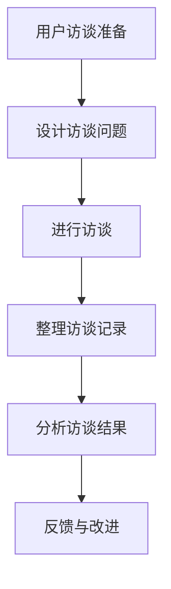
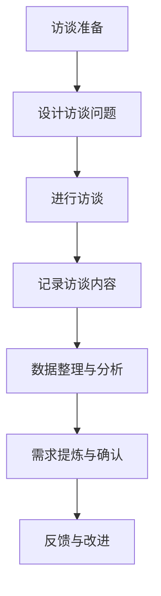
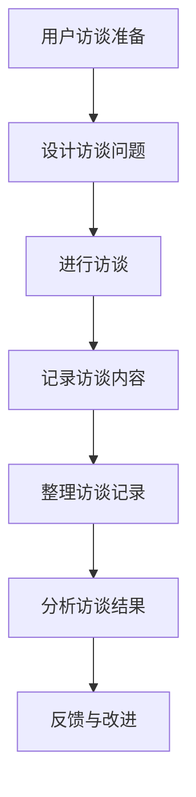

                 


## 文章标题：技术人如何进行有效的用户访谈和需求挖掘

### 关键词：
- 用户访谈
- 需求挖掘
- 沟通技巧
- 需求分析
- 需求管理

### 摘要：
本文旨在为技术人提供一套系统化的用户访谈和需求挖掘的方法，帮助读者从理论基础到实际操作，全面掌握如何高效地与用户沟通、识别和理解用户需求，进而指导产品设计和开发。文章涵盖了用户访谈的准备工作、问题设计、访谈技巧、信息处理，以及需求挖掘、分析、处理和跟踪的方法，并通过实战案例进行深入解析。

## 目录大纲：技术人如何进行有效的用户访谈和需求挖掘

### 第一部分：用户访谈的基础

#### 第1章：用户访谈概述
- **1.1 用户访谈的重要性**
- **1.2 用户访谈的目标**
- **1.3 用户访谈的类型**
- **1.4 用户访谈的准备工作**

#### 第2章：设计访谈问题
- **2.1 问题类型的选择**
- **2.2 开放式与封闭式问题的运用**
- **2.3 设计高质量访谈问题的技巧**
- **2.4 避免引导性问题**

#### 第3章：访谈技巧
- **3.1 建立良好的沟通氛围**
- **3.2 倾听与反馈**
- **3.3 提问技巧**
- **3.4 非言语沟通的理解与应用**

#### 第4章：处理访谈信息
- **4.1 访谈记录与整理**
- **4.2 数据的编码与分类**
- **4.3 信息分析与提炼**

### 第二部分：需求挖掘与处理

#### 第5章：需求挖掘方法
- **5.1 用户访谈在需求挖掘中的应用**
- **5.2 观察法在需求挖掘中的应用**
- **5.3 调查问卷法在需求挖掘中的应用**
- **5.4 实用案例分享**

#### 第6章：需求分析与建模
- **6.1 需求的分类**
- **6.2 需求分析的步骤**
- **6.3 需求建模方法**
- **6.4 需求分析与产品规划**

#### 第7章：需求处理与跟踪
- **7.1 需求的优先级排序**
- **7.2 需求变更管理**
- **7.3 需求跟踪工具与方法**
- **7.4 需求管理实践**

### 第三部分：用户访谈与需求挖掘实战

#### 第8章：实战案例解析
- **8.1 项目背景介绍**
- **8.2 用户访谈实施过程**
- **8.3 需求挖掘与整理**
- **8.4 需求分析与实现**

#### 第9章：评估与反馈
- **9.1 用户访谈与需求挖掘的效果评估**
- **9.2 反馈机制的建立与执行**
- **9.3 持续改进的实践**

#### 第10章：最佳实践与建议
- **10.1 用户访谈与需求挖掘的最佳实践**
- **10.2 面对挑战的解决策略**
- **10.3 持续学习与提升**

### 附录
- **附录A：用户访谈与需求挖掘工具**
  - **A.1 常用工具介绍**
  - **A.2 工具使用技巧**
- **附录B：访谈问题样本**
  - **B.1 开放式问题样本**
  - **B.2 封闭式问题样本**

### 核心概念与联系

#### 用户访谈的流程



### 核心算法原理讲解

#### 需求分析过程

```plaintext
function 需求分析(用户访谈记录)
    问题列表 = 从用户访谈记录中提取问题
    需求分类 = 对问题进行分类
    需求优先级 = 对需求进行优先级排序
    需求模型 = 构建需求模型
    return 需求模型
end function
```

#### 需求优先级排序的数学模型

$$ P(i) = \frac{R(i) \times C(i)}{D(i)} $$

其中：
- $ P(i) $ 是需求 $ i $ 的优先级。
- $ R(i) $ 是需求 $ i $ 的紧急性。
- $ C(i) $ 是需求 $ i $ 的重要性。
- $ D(i) $ 是需求 $ i $ 的难度。

#### 举例说明

给定以下三个需求：
- 需求A：紧急性R(A)=5，重要性C(A)=4，难度D(A)=2
- 需求B：紧急性R(B)=4，重要性C(B)=5，难度D(B)=3
- 需求C：紧急性R(C)=3，重要性C(C)=3，难度D(C)=5

计算每个需求的优先级：

$$ P(A) = \frac{5 \times 4}{2} = 10 $$
$$ P(B) = \frac{4 \times 5}{3} = \frac{20}{3} \approx 6.67 $$
$$ P(C) = \frac{3 \times 3}{5} = \frac{9}{5} = 1.8 $$

因此，需求A的优先级最高，需求C的优先级最低。

### 项目实战

#### 用户访谈与需求挖掘项目实战

##### 1. 实战背景

项目背景：某企业计划开发一款企业内部通讯软件，旨在提高员工的工作效率和信息共享。
目标：通过用户访谈和需求挖掘，确定软件的核心功能和用户界面设计。

##### 2. 实施步骤

步骤1：访谈准备
- 确定访谈对象：部门经理、普通员工、技术支持人员
- 制定访谈大纲
- 准备访谈问题

步骤2：进行访谈
- 组织访谈
- 记录访谈内容
- 分析访谈结果

步骤3：需求挖掘与整理
- 从访谈中提取需求
- 分类整理需求
- 确定需求的优先级

步骤4：需求分析与实现
- 建立需求模型
- 确定产品规划
- 实现核心功能

##### 3. 实战解析

通过实战案例，我们将详细分析每个步骤的执行过程、遇到的问题以及解决方案。这将为读者提供一个完整的用户访谈和需求挖掘的实践参考。

### 最佳实践与建议

#### 用户访谈与需求挖掘的最佳实践

1. **明确访谈目标**：在访谈前明确访谈的目标和预期成果，确保访谈过程有的放矢。
2. **准备充分**：事先准备好访谈大纲和问题，避免访谈过程中的疏漏。
3. **选择合适的问题类型**：结合用户访谈的目标，合理运用开放式和封闭式问题，以获取更多有用的信息。
4. **倾听与反馈**：在访谈过程中，注重倾听用户的意见，给予及时的反馈，建立良好的沟通氛围。
5. **数据整理与分析**：访谈后对数据进行分类、编码和整理，以便于后续的需求分析。

#### 面对挑战的解决策略

1. **应对用户的不确定性和变化**：在访谈过程中，灵活应对用户的不确定性和需求变化，保持开放的心态。
2. **处理信息过载**：通过有效的信息整理和分析方法，如数据可视化、关联分析等，从大量数据中提取有价值的信息。
3. **提升团队协作能力**：建立跨职能团队，促进团队成员之间的沟通与协作，提高需求挖掘的效率。

#### 持续学习与提升

1. **参与相关培训和研讨会**：不断学习最新的用户访谈和需求挖掘方法，提升自身能力。
2. **实践与反思**：在项目实践中，总结经验，不断改进工作流程和方法。
3. **借鉴行业最佳实践**：关注行业内的先进经验和成功案例，结合自身实际情况进行应用。

### 附录

#### 附录A：用户访谈与需求挖掘工具

**A.1 常用工具介绍**
- **访谈大纲模板**：提供访谈大纲的模板，帮助设计高效的访谈计划。
- **访谈记录工具**：介绍常用的访谈记录工具，如笔记本、录音设备、电子文档等。
- **数据分析工具**：介绍常用的数据分析工具，如Excel、Tableau等。

**A.2 工具使用技巧**
- **如何选择合适的访谈工具**：根据项目需求和团队特点，选择适合的访谈工具。
- **如何高效使用数据分析工具**：通过数据可视化、趋势分析等方法，提升数据处理的效率。

#### 附录B：访谈问题样本

**B.1 开放式问题样本**
- 您在日常工作中遇到的最大挑战是什么？
- 您认为我们的产品在哪些方面可以改进？
- 您能描述一下您理想中的产品是什么样的吗？

**B.2 封闭式问题样本**
- 您是否经常使用我们的产品？（是/否）
- 您对产品的用户界面满意吗？（非常满意/满意/一般/不满意/非常不满意）
- 您认为产品的哪些功能最重要？（1/2/3...）

### 核心概念与联系

通过本文，读者将了解到用户访谈和需求挖掘的重要性和流程，掌握设计访谈问题、访谈技巧以及需求分析的方法。文章中的核心概念和联系，如用户访谈流程、需求分析过程和需求优先级排序的数学模型，将帮助读者更好地理解和应用这些方法。实战案例解析和最佳实践与建议，将为读者提供实际操作的指导。通过持续学习和实践，技术人可以不断提升用户访谈和需求挖掘的能力，为产品设计和开发提供有力支持。

### 背景介绍

在当今快速变化的市场环境中，技术人需要具备高效的用户访谈和需求挖掘能力，以更好地理解用户需求，指导产品设计和开发。用户访谈和需求挖掘是产品开发中至关重要的环节，通过直接与用户沟通，技术人可以获取第一手的用户反馈和数据，从而减少产品开发的盲目性和风险。

然而，有效的用户访谈和需求挖掘并非易事，需要技术人具备扎实的理论基础和丰富的实践经验。本文将系统地介绍用户访谈和需求挖掘的方法，包括访谈准备、问题设计、访谈技巧、信息处理以及需求挖掘和分析的步骤，并通过实际案例进行深入解析。

文章结构如下：

1. **用户访谈的基础**：介绍用户访谈的重要性、目标和类型，以及访谈的准备工作。
2. **设计访谈问题**：讲解如何选择问题类型、运用开放式和封闭式问题，设计高质量访谈问题，并避免引导性问题。
3. **访谈技巧**：讨论如何建立良好的沟通氛围、倾听与反馈、提问技巧以及非言语沟通的理解与应用。
4. **处理访谈信息**：介绍访谈记录与整理、数据编码与分类、信息分析与提炼的方法。
5. **需求挖掘与处理**：探讨用户访谈在需求挖掘中的应用、观察法、调查问卷法，以及需求分析和建模的方法。
6. **用户访谈与需求挖掘实战**：通过实际案例，解析用户访谈和需求挖掘的实施过程。
7. **评估与反馈**：讨论用户访谈与需求挖掘的效果评估、反馈机制的建立与执行以及持续改进的实践。
8. **最佳实践与建议**：总结用户访谈和需求挖掘的最佳实践，提供面对挑战的解决策略和持续学习的建议。
9. **附录**：提供用户访谈与需求挖掘的常用工具介绍和访谈问题样本。

### 核心概念与联系

#### 用户访谈的流程

用户访谈是一个系统的过程，涉及到多个环节。以下是用户访谈的流程图，通过Mermaid图表进行展示：



**流程解析**：

- **访谈准备**：确定访谈对象、访谈大纲和访谈问题，确保访谈的针对性。
- **设计访谈问题**：根据访谈目标，选择合适的问题类型，设计高质量的访谈问题。
- **进行访谈**：按照访谈大纲，与用户进行面对面的沟通，记录访谈内容。
- **记录访谈内容**：整理访谈记录，为后续分析提供基础。
- **数据整理与分析**：对访谈记录进行分类、编码和整理，提取有价值的信息。
- **需求提炼与确认**：从分析结果中提炼用户需求，并进行确认，确保需求的准确性和可行性。
- **反馈与改进**：根据用户反馈，对访谈过程和需求挖掘结果进行改进。

#### 需求分析过程

需求分析是产品开发的重要环节，其过程可以用以下伪代码进行描述：

```plaintext
function 需求分析(用户访谈记录)
    问题列表 = 从用户访谈记录中提取问题
    需求分类 = 对问题进行分类
    需求优先级 = 对需求进行优先级排序
    需求模型 = 构建需求模型
    return 需求模型
end function
```

**步骤解析**：

- **提取问题**：从用户访谈记录中提取问题，这是需求分析的基础。
- **分类**：对提取的问题进行分类，以便于后续的分析和处理。
- **优先级排序**：根据紧急性和重要性，对需求进行优先级排序，为后续的开发工作提供指导。
- **构建需求模型**：将分类后的需求转化为需求模型，为产品设计和开发提供明确的方向。

#### 需求优先级排序的数学模型

需求优先级排序是需求分析的重要步骤，其数学模型如下：

$$ P(i) = \frac{R(i) \times C(i)}{D(i)} $$

**公式解析**：

- **P(i)**：需求 $i$ 的优先级。
- **R(i)**：需求 $i$ 的紧急性，即需求迫切程度。
- **C(i)**：需求 $i$ 的重要性，即需求对产品的影响程度。
- **D(i)**：需求 $i$ 的难度，即实现需求的复杂程度。

通过计算每个需求的优先级，可以帮助技术人明确哪些需求是首先需要满足的，从而提高开发效率。

#### 举例说明

假设有三个需求：

- **需求A**：紧急性 R(A) = 5，重要性 C(A) = 4，难度 D(A) = 2。
- **需求B**：紧急性 R(B) = 4，重要性 C(B) = 5，难度 D(B) = 3。
- **需求C**：紧急性 R(C) = 3，重要性 C(C) = 3，难度 D(C) = 5。

计算每个需求的优先级：

$$ P(A) = \frac{5 \times 4}{2} = 10 $$
$$ P(B) = \frac{4 \times 5}{3} = \frac{20}{3} \approx 6.67 $$
$$ P(C) = \frac{3 \times 3}{5} = \frac{9}{5} = 1.8 $$

根据计算结果，需求A的优先级最高，需求C的优先级最低。

#### 项目实战

以下是一个用户访谈与需求挖掘项目实战案例：

##### 项目背景

某企业计划开发一款企业内部通讯软件，旨在提高员工的工作效率和信息共享。为了确保产品能够满足用户需求，企业决定通过用户访谈和需求挖掘来确定软件的核心功能和用户界面设计。

##### 实施步骤

1. **访谈准备**：
   - 确定访谈对象：部门经理、普通员工、技术支持人员。
   - 制定访谈大纲：包括访谈目的、访谈对象、访谈问题等。
   - 准备访谈工具：录音设备、访谈大纲等。

2. **进行访谈**：
   - 按照访谈大纲，与访谈对象进行面对面的沟通。
   - 记录访谈内容，确保信息的准确性和完整性。

3. **需求挖掘与整理**：
   - 从访谈中提取需求，包括功能需求、性能需求、界面需求等。
   - 分类整理需求，确保每个需求都有明确的归属。

4. **需求分析与建模**：
   - 对提取的需求进行优先级排序，确定核心需求。
   - 建立需求模型，为产品设计和开发提供指导。

5. **实现与反馈**：
   - 根据需求模型，进行产品设计和开发。
   - 在开发过程中，持续收集用户反馈，对需求进行调整和优化。

##### 实战解析

1. **访谈准备**：
   - 确定访谈对象：本次访谈的对象包括部门经理、普通员工和技术支持人员。这些人员代表了企业的不同层面，能够提供多样化的用户视角。
   - 制定访谈大纲：访谈大纲包括访谈的目的、访谈的问题、访谈的时间安排等。访谈大纲的设计需要充分考虑用户的需求和企业的目标，以确保访谈的有效性。
   - 准备访谈工具：本次访谈使用录音设备进行记录，以确保访谈内容的准确性。同时，准备访谈大纲和问题列表，以便访谈过程中有据可依。

2. **进行访谈**：
   - 按照访谈大纲，与访谈对象进行面对面的沟通。访谈过程中，注重倾听用户的意见，给予及时的反馈，建立良好的沟通氛围。
   - 记录访谈内容：访谈过程中，记录访谈内容是非常重要的。可以通过录音和笔记两种方式记录，确保访谈内容的完整性和准确性。

3. **需求挖掘与整理**：
   - 从访谈中提取需求：访谈过程中，用户提出了一系列的需求，包括功能需求、性能需求、界面需求等。将这些需求进行分类整理，确保每个需求都有明确的归属。
   - 分类整理需求：根据需求的类型和重要性，将需求进行分类整理。例如，将功能需求分为基础功能、高级功能等，将界面需求分为用户界面设计、交互体验等。

4. **需求分析与建模**：
   - 对提取的需求进行优先级排序：根据需求的紧急性和重要性，对需求进行优先级排序。紧急性和重要性较高的需求将被优先考虑。
   - 建立需求模型：根据排序后的需求，建立需求模型。需求模型将用于指导产品设计和开发，确保产品能够满足用户需求。

5. **实现与反馈**：
   - 根据需求模型，进行产品设计和开发：在开发过程中，根据需求模型，设计产品的功能模块和界面布局，确保产品能够满足用户需求。
   - 持续收集用户反馈：在开发过程中，持续收集用户反馈，了解用户对产品的使用体验和意见。根据用户反馈，对需求进行调整和优化，确保产品的最终版本能够满足用户需求。

#### 评估与反馈

在用户访谈和需求挖掘过程中，评估与反馈是至关重要的一环。以下是评估与反馈的详细步骤：

1. **效果评估**：
   - **访谈效果评估**：通过访谈记录和用户反馈，评估访谈的有效性。例如，访谈是否达到了预期目标，用户需求是否得到了充分挖掘等。
   - **需求挖掘效果评估**：评估需求挖掘的全面性和准确性。例如，是否漏掉了关键需求，需求描述是否清晰明了等。

2. **反馈机制的建立与执行**：
   - **建立反馈机制**：建立用户反馈的渠道，例如在线调查、用户论坛、邮件等。确保用户能够方便地提出意见和建议。
   - **执行反馈机制**：定期收集和分析用户反馈，对反馈进行分类处理。对于重要反馈，制定具体的改进计划，并跟踪改进效果。

3. **持续改进的实践**：
   - **持续评估**：在产品开发和迭代过程中，持续评估用户需求的变化，确保需求管理过程的持续性和有效性。
   - **改进实践**：根据评估结果和用户反馈，不断优化需求挖掘和管理流程，提升用户体验。

#### 最佳实践与建议

1. **最佳实践**：
   - **明确访谈目标**：在访谈前明确访谈的目标和预期成果，确保访谈过程有的放矢。
   - **充分准备**：事先准备好访谈大纲和问题，避免访谈过程中的疏漏。
   - **灵活应对**：在访谈过程中，灵活应对用户的不确定性和需求变化，保持开放的心态。
   - **数据整理**：对访谈记录进行分类、编码和整理，提取有价值的信息。
   - **优先级排序**：根据紧急性和重要性，对需求进行优先级排序，确保关键需求得到优先满足。

2. **建议**：
   - **持续学习**：参与相关培训和研讨会，不断学习最新的用户访谈和需求挖掘方法。
   - **实践与反思**：在项目实践中，总结经验，不断改进工作流程和方法。
   - **借鉴经验**：关注行业内的先进经验和成功案例，结合自身实际情况进行应用。

### 附录

#### 附录A：用户访谈与需求挖掘工具

1. **常用工具介绍**：
   - **访谈大纲模板**：提供访谈大纲的模板，帮助设计高效的访谈计划。
   - **访谈记录工具**：介绍常用的访谈记录工具，如笔记本、录音设备、电子文档等。
   - **数据分析工具**：介绍常用的数据分析工具，如Excel、Tableau等。

2. **工具使用技巧**：
   - **如何选择合适的访谈工具**：根据项目需求和团队特点，选择适合的访谈工具。
   - **如何高效使用数据分析工具**：通过数据可视化、趋势分析等方法，提升数据处理的效率。

#### 附录B：访谈问题样本

1. **开放式问题样本**：
   - 您在日常工作中遇到的最大挑战是什么？
   - 您认为我们的产品在哪些方面可以改进？
   - 您能描述一下您理想中的产品是什么样的吗？

2. **封闭式问题样本**：
   - 您是否经常使用我们的产品？（是/否）
   - 您对产品的用户界面满意吗？（非常满意/满意/一般/不满意/非常不满意）
   - 您认为产品的哪些功能最重要？（1/2/3...）

### 总结

本文系统地介绍了技术人如何进行有效的用户访谈和需求挖掘。通过用户访谈，技术人可以深入了解用户需求，指导产品设计和开发。本文涵盖了用户访谈的准备工作、问题设计、访谈技巧、信息处理，以及需求挖掘、分析和处理的步骤，并通过实际案例进行深入解析。通过学习和实践本文的方法，技术人可以提升用户访谈和需求挖掘的能力，为产品开发和用户满意度提供有力支持。

### 文章标题：技术人如何进行有效的用户访谈和需求挖掘

### 关键词：
- 用户访谈
- 需求挖掘
- 沟通技巧
- 需求分析
- 需求管理

### 摘要：
本文旨在为技术人提供一套系统化的用户访谈和需求挖掘的方法，帮助读者从理论基础到实际操作，全面掌握如何高效地与用户沟通、识别和理解用户需求，进而指导产品设计和开发。文章涵盖了用户访谈的准备工作、问题设计、访谈技巧、信息处理，以及需求挖掘、分析、处理和跟踪的方法，并通过实战案例进行深入解析。

### 目录大纲：技术人如何进行有效的用户访谈和需求挖掘

#### 第一部分：用户访谈的基础

#### 第1章：用户访谈概述
- **1.1 用户访谈的重要性**
- **1.2 用户访谈的目标**
- **1.3 用户访谈的类型**
- **1.4 用户访谈的准备工作**

#### 第2章：设计访谈问题
- **2.1 问题类型的选择**
- **2.2 开放式与封闭式问题的运用**
- **2.3 设计高质量访谈问题的技巧**
- **2.4 避免引导性问题**

#### 第3章：访谈技巧
- **3.1 建立良好的沟通氛围**
- **3.2 倾听与反馈**
- **3.3 提问技巧**
- **3.4 非言语沟通的理解与应用**

#### 第4章：处理访谈信息
- **4.1 访谈记录与整理**
- **4.2 数据的编码与分类**
- **4.3 信息分析与提炼**

#### 第二部分：需求挖掘与处理

#### 第5章：需求挖掘方法
- **5.1 用户访谈在需求挖掘中的应用**
- **5.2 观察法在需求挖掘中的应用**
- **5.3 调查问卷法在需求挖掘中的应用**
- **5.4 实用案例分享**

#### 第6章：需求分析与建模
- **6.1 需求的分类**
- **6.2 需求分析的步骤**
- **6.3 需求建模方法**
- **6.4 需求分析与产品规划**

#### 第7章：需求处理与跟踪
- **7.1 需求的优先级排序**
- **7.2 需求变更管理**
- **7.3 需求跟踪工具与方法**
- **7.4 需求管理实践**

#### 第三部分：用户访谈与需求挖掘实战

#### 第8章：实战案例解析
- **8.1 项目背景介绍**
- **8.2 用户访谈实施过程**
- **8.3 需求挖掘与整理**
- **8.4 需求分析与实现**

#### 第9章：评估与反馈
- **9.1 用户访谈与需求挖掘的效果评估**
- **9.2 反馈机制的建立与执行**
- **9.3 持续改进的实践**

#### 第10章：最佳实践与建议
- **10.1 用户访谈与需求挖掘的最佳实践**
- **10.2 面对挑战的解决策略**
- **10.3 持续学习与提升**

#### 附录
- **附录A：用户访谈与需求挖掘工具**
  - **A.1 常用工具介绍**
  - **A.2 工具使用技巧**

- **附录B：访谈问题样本**
  - **B.1 开放式问题样本**
  - **B.2 封闭式问题样本**

### 核心概念与联系

#### 用户访谈的流程



#### 需求分析过程

```plaintext
function 需求分析(用户访谈记录)
    问题列表 = 从用户访谈记录中提取问题
    需求分类 = 对问题进行分类
    需求优先级 = 对需求进行优先级排序
    需求模型 = 构建需求模型
    return 需求模型
end function
```

#### 需求优先级排序的数学模型

$$ P(i) = \frac{R(i) \times C(i)}{D(i)} $$

其中：
- $ P(i) $ 是需求 $ i $ 的优先级。
- $ R(i) $ 是需求 $ i $ 的紧急性。
- $ C(i) $ 是需求 $ i $ 的重要性。
- $ D(i) $ 是需求 $ i $ 的难度。

### 核心算法原理讲解

#### 需求分析过程

需求分析是产品开发中的关键步骤，其目的是确保产品满足用户需求，并在项目开发和迭代过程中提供指导。以下是需求分析过程的详细步骤：

1. **问题提取**：
   - 从用户访谈记录、市场调研、竞品分析等渠道提取问题。
   - 问题可以是功能性的、性能性的或体验性的。

2. **问题分类**：
   - 根据问题的性质，将问题分类。例如，可以将问题分为功能需求、性能需求、安全性需求等。
   - 分类有助于后续的分析和处理。

3. **优先级排序**：
   - 根据问题的紧急性和重要性，对需求进行优先级排序。
   - 紧急性高的需求通常需要优先考虑，以确保产品能够迅速满足用户的核心需求。

4. **需求建模**：
   - 将分类后的需求转化为需求模型，如功能需求模型、用户故事地图等。
   - 需求模型为产品设计和开发提供了清晰的指导。

以下是一个需求分析过程的伪代码表示：

```plaintext
function 需求分析(用户访谈记录)
    问题列表 = 从用户访谈记录中提取问题
    分类后的需求 = 分类问题列表
    需求优先级列表 = 对分类后的需求进行优先级排序
    需求模型 = 构建需求模型
    return 需求模型
end function
```

#### 需求优先级排序的数学模型

在需求分析过程中，需求优先级排序是一个关键步骤。一个常用的数学模型是使用紧急性、重要性和难度来计算需求的优先级。以下是该模型的详细解释：

$$ P(i) = \frac{R(i) \times C(i)}{D(i)} $$

其中：
- $ P(i) $ 是需求 $ i $ 的优先级。
- $ R(i) $ 是需求 $ i $ 的紧急性，通常取值范围为0到10，数值越大表示紧急性越高。
- $ C(i) $ 是需求 $ i $ 的重要性，通常取值范围为0到10，数值越大表示重要性越高。
- $ D(i) $ 是需求 $ i $ 的难度，通常取值范围为0到10，数值越大表示实现难度越高。

通过这个模型，可以计算每个需求的优先级。以下是一个具体的例子：

**例子**：

假设有三个需求：

- 需求A：紧急性 $ R(A) = 8 $，重要性 $ C(A) = 7 $，难度 $ D(A) = 5 $。
- 需求B：紧急性 $ R(B) = 9 $，重要性 $ C(B) = 8 $，难度 $ D(B) = 3 $。
- 需求C：紧急性 $ R(C) = 7 $，重要性 $ C(C) = 9 $，难度 $ D(C) = 6 $。

使用上述公式计算每个需求的优先级：

- 需求A的优先级：$ P(A) = \frac{8 \times 7}{5} = 11.2 $。
- 需求B的优先级：$ P(B) = \frac{9 \times 8}{3} = 24 $。
- 需求C的优先级：$ P(C) = \frac{7 \times 9}{6} = 10.5 $。

根据计算结果，需求B的优先级最高，需求A次之，需求C最低。因此，在资源有限的情况下，应该优先考虑需求B的开发。

### 项目实战

#### 项目背景

某企业计划开发一款企业级项目管理软件，旨在提高团队协作效率和管理水平。为了确保软件能够满足用户需求，企业决定通过用户访谈和需求挖掘来确定软件的核心功能和用户界面设计。

#### 实施步骤

1. **访谈准备**：
   - 确定访谈对象：项目经理、团队成员、IT支持人员。
   - 制定访谈大纲：包括访谈目的、访谈问题、访谈时间等。
   - 准备访谈工具：录音设备、笔记本等。

2. **进行访谈**：
   - 按照访谈大纲，与访谈对象进行面对面沟通。
   - 记录访谈内容，确保信息的准确性和完整性。

3. **需求挖掘与整理**：
   - 从访谈中提取需求，包括功能需求、性能需求、界面需求等。
   - 分类整理需求，确保每个需求都有明确的归属。

4. **需求分析与建模**：
   - 对提取的需求进行优先级排序。
   - 建立需求模型，为产品设计和开发提供指导。

5. **实现与反馈**：
   - 根据需求模型，进行产品设计和开发。
   - 在开发过程中，持续收集用户反馈，对需求进行调整和优化。

#### 实战解析

1. **访谈准备**：
   - 确定访谈对象：本次访谈的对象包括项目经理、团队成员和IT支持人员。这些人员代表了企业的不同角色，能够提供多样化的用户视角。
   - 制定访谈大纲：访谈大纲包括访谈目的、访谈问题、访谈时间安排等。访谈问题涵盖功能需求、性能需求、界面需求等方面，确保访谈的全面性。

2. **进行访谈**：
   - 按照访谈大纲，与访谈对象进行面对面沟通。访谈过程中，注重倾听用户的意见，给予及时的反馈，建立良好的沟通氛围。
   - 记录访谈内容：使用录音设备和笔记本记录访谈内容，确保信息的准确性和完整性。

3. **需求挖掘与整理**：
   - 从访谈中提取需求：用户提出了一系列的需求，包括功能需求、性能需求、界面需求等。将这些需求进行分类整理，确保每个需求都有明确的归属。

4. **需求分析与建模**：
   - 对提取的需求进行优先级排序：根据紧急性和重要性，对需求进行优先级排序。例如，功能需求中的“任务管理”和“项目管理”因为紧急性和重要性较高，被优先考虑。
   - 建立需求模型：根据排序后的需求，建立需求模型。需求模型包括功能需求模型、用户故事地图等，为产品设计和开发提供明确的指导。

5. **实现与反馈**：
   - 根据需求模型，进行产品设计和开发：设计团队根据需求模型，设计产品的功能模块和用户界面。在开发过程中，使用敏捷开发方法，确保快速响应用户需求。
   - 持续收集用户反馈：在开发过程中，持续收集用户反馈，了解用户对产品的使用体验和意见。根据用户反馈，对需求进行调整和优化，确保产品的最终版本能够满足用户需求。

### 评估与反馈

#### 用户访谈与需求挖掘的效果评估

评估用户访谈与需求挖掘的效果是确保产品开发顺利进行的关键步骤。以下是一个评估效果的流程：

1. **访谈效果评估**：
   - **评估访谈目标的实现情况**：检查访谈目标是否达成，例如是否收集到了足够的需求信息。
   - **评估访谈过程的流畅性**：检查访谈过程中是否存在沟通障碍，如用户不愿回答问题或访谈时间过长。

2. **需求挖掘效果评估**：
   - **评估需求收集的全面性**：检查是否漏掉了重要的需求。
   - **评估需求描述的清晰性**：检查需求描述是否明确，是否容易实现。

#### 反馈机制的建立与执行

建立有效的反馈机制是确保需求持续改进的关键。以下是一个反馈机制的流程：

1. **建立反馈渠道**：
   - **用户反馈渠道**：建立用户反馈的渠道，如在线调查、用户论坛、邮件等。
   - **内部反馈渠道**：建立团队成员之间的反馈渠道，如每日站会、周会等。

2. **执行反馈机制**：
   - **定期收集反馈**：定期收集用户和团队成员的反馈。
   - **分析反馈**：对收集到的反馈进行分析，识别关键问题。
   - **改进措施**：根据分析结果，制定具体的改进措施，并执行。

#### 持续改进的实践

持续改进是产品开发和需求管理的核心原则。以下是一些实践方法：

1. **定期评估**：定期评估用户访谈和需求挖掘的效果，确保过程的有效性。

2. **持续反馈**：在产品开发和迭代过程中，持续收集用户和团队成员的反馈，及时进行调整。

3. **学习与分享**：鼓励团队成员学习最新的需求挖掘和产品开发方法，分享经验和最佳实践。

### 最佳实践与建议

#### 用户访谈与需求挖掘的最佳实践

1. **明确访谈目标**：在访谈前明确访谈的目标和预期成果，确保访谈过程有的放矢。

2. **充分准备**：事先准备好访谈大纲和问题，避免访谈过程中的疏漏。

3. **灵活应对**：在访谈过程中，灵活应对用户的不确定性和需求变化，保持开放的心态。

4. **数据整理**：对访谈记录进行分类、编码和整理，提取有价值的信息。

5. **优先级排序**：根据紧急性和重要性，对需求进行优先级排序，确保关键需求得到优先满足。

#### 面对挑战的解决策略

1. **用户不确定性**：通过多次访谈和反馈，逐步明确用户需求，减少不确定性。

2. **信息过载**：通过数据可视化和关联分析等方法，从大量数据中提取有价值的信息。

3. **团队协作**：建立跨职能团队，促进团队成员之间的沟通与协作，提高需求挖掘的效率。

#### 持续学习与提升

1. **参与培训与研讨会**：参与相关的培训与研讨会，不断学习最新的用户访谈和需求挖掘方法。

2. **实践与反思**：在项目实践中，总结经验，不断改进工作流程和方法。

3. **借鉴最佳实践**：关注行业内的最佳实践，结合自身实际情况进行应用。

### 附录

#### 附录A：用户访谈与需求挖掘工具

**A.1 常用工具介绍**

- **访谈大纲模板**：提供访谈大纲的模板，帮助设计高效的访谈计划。
- **访谈记录工具**：介绍常用的访谈记录工具，如笔记本、录音设备、电子文档等。
- **数据分析工具**：介绍常用的数据分析工具，如Excel、Tableau等。

**A.2 工具使用技巧**

- **如何选择合适的访谈工具**：根据项目需求和团队特点，选择适合的访谈工具。
- **如何高效使用数据分析工具**：通过数据可视化、趋势分析等方法，提升数据处理的效率。

#### 附录B：访谈问题样本

**B.1 开放式问题样本**

- 您在日常工作中遇到的最大挑战是什么？
- 您认为我们的产品在哪些方面可以改进？
- 您能描述一下您理想中的产品是什么样的吗？

**B.2 封闭式问题样本**

- 您是否经常使用我们的产品？（是/否）
- 您对产品的用户界面满意吗？（非常满意/满意/一般/不满意/非常不满意）
- 您认为产品的哪些功能最重要？（1/2/3...）

### 核心概念与联系

通过本文，读者将了解到用户访谈和需求挖掘的重要性和流程，掌握设计访谈问题、访谈技巧以及需求分析的方法。文章中的核心概念和联系，如用户访谈流程、需求分析过程和需求优先级排序的数学模型，将帮助读者更好地理解和应用这些方法。实战案例解析和最佳实践与建议，将为读者提供实际操作的指导。通过持续学习和实践，技术人可以不断提升用户访谈和需求挖掘的能力，为产品设计和开发提供有力支持。

### 总结

在本文中，我们详细介绍了技术人如何进行有效的用户访谈和需求挖掘。通过用户访谈，技术人能够深入了解用户的需求和期望，从而更好地指导产品设计和开发。本文涵盖了用户访谈的准备、问题设计、访谈技巧、信息处理以及需求挖掘、分析和处理的各个步骤，并通过实际案例进行了深入解析。

用户访谈和需求挖掘是一个复杂而关键的过程，涉及多方面的技能和知识。技术人需要通过不断的实践和学习，提高自己在这一领域的专业能力。以下是一些关键要点和最佳实践：

1. **明确目标**：在进行用户访谈和需求挖掘之前，首先要明确访谈的目标和预期成果，确保访谈过程有的放矢。

2. **充分准备**：事先准备好访谈大纲和问题，避免访谈过程中的疏漏。准备访谈工具，如录音设备、笔记本等，确保访谈过程的顺利进行。

3. **灵活应对**：在访谈过程中，灵活应对用户的不确定性和需求变化，保持开放的心态。通过多次访谈和反馈，逐步明确用户需求，减少不确定性。

4. **数据整理**：对访谈记录进行分类、编码和整理，提取有价值的信息。使用数据可视化和关联分析等方法，从大量数据中提取有价值的信息。

5. **优先级排序**：根据紧急性和重要性，对需求进行优先级排序，确保关键需求得到优先满足。使用需求优先级排序的数学模型，如$P(i) = \frac{R(i) \times C(i)}{D(i)}$，可以帮助技术人更科学地进行优先级排序。

6. **持续反馈**：在产品开发和迭代过程中，持续收集用户和团队成员的反馈，及时进行调整。建立有效的反馈机制，如用户反馈渠道、内部反馈渠道等。

7. **学习与实践**：参与相关培训和研讨会，不断学习最新的用户访谈和需求挖掘方法。在项目实践中，总结经验，不断改进工作流程和方法。

8. **借鉴经验**：关注行业内的先进经验和成功案例，结合自身实际情况进行应用。

通过本文的学习和实践，技术人可以提升用户访谈和需求挖掘的能力，为产品设计和开发提供有力支持。有效的用户访谈和需求挖掘，不仅能够提高产品的质量，还能够增强用户满意度，推动企业的长期发展。让我们一起努力，成为更加优秀的用户访谈和需求挖掘专家。

