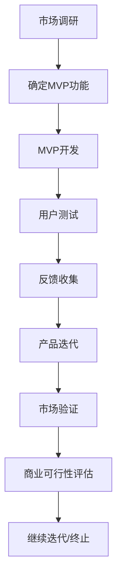

                 

### 文章标题：MVP开发：技术创业中的验证方法

> 关键词：MVP、技术创业、验证方法、快速迭代、用户反馈

> 摘要：本文将深入探讨MVP（最小可行产品）开发在技术创业中的应用，解释MVP的概念、原则、流程以及其在验证商业想法中的重要性。通过详细的案例分析，我们将展示如何利用MVP开发来快速验证创业项目的可行性，减少风险，优化资源，实现从概念到市场的跨越。

### 第1章：MVP开发的概念与原则

#### 1.1 MVP的定义

**1.1.1 MVP的含义**

MVP，即最小可行产品（Minimum Viable Product），是一种产品开发策略，旨在创建一个能够展示核心功能和价值的早期版本，以便尽快推向市场进行验证。MVP的核心是“最小可行”，意味着它包含足够的功能来展示产品的概念，并且能够吸引早期用户，但它不需要全部功能。

**1.1.2 MVP的特点**

- **功能最小化**：MVP关注的是产品的核心价值，而非所有功能。
- **快速迭代**：MVP开发强调快速构建和迭代，以便及时调整和优化。
- **用户反馈**：MVP的开发过程高度依赖用户反馈，通过用户的行为数据来指导产品改进。
- **资源优化**：由于功能最小化，MVP开发能够在有限的资源下完成产品的核心开发。

**1.1.3 MVP的重要性**

MVP在技术创业中至关重要，它有以下几方面的价值：

- **风险降低**：通过MVP，创业者可以在投入大量资源之前验证产品的市场可行性。
- **资源优化**：MVP开发强调资源的高效利用，避免不必要的功能开发和资源浪费。
- **市场反馈**：MVP能够快速获取市场反馈，为产品迭代提供方向。
- **团队动力**：MVP的成功初期验证可以为团队注入信心，提高团队的士气和动力。

#### 1.2 MVP开发的五大原则

**1.2.1 验证需求**

在开发MVP之前，首先要验证市场需求。通过市场调研和用户访谈，确定目标用户群体的真实需求和痛点。

**1.2.2 保持简洁**

MVP的核心是简洁。产品应该包含最基本的功能，以展示产品的核心价值。

**1.2.3 快速迭代**

MVP的开发过程应该是快速迭代的，以便根据用户反馈快速调整产品方向。

**1.2.4 用户反馈**

用户反馈是MVP开发的驱动力。通过收集和分析用户反馈，可以识别产品改进的机会。

**1.2.5 资源优化**

资源优化是MVP开发的关键。通过最小化功能和最大化资源利用，可以确保MVP能够在有限的资源下成功开发。

#### 1.3 MVP开发的核心目标

**1.3.1 确定最小可行产品**

MVP开发的核心目标是确定一个最小可行产品，它能够展示产品的核心价值和功能，同时吸引早期用户。

**1.3.2 验证产品价值**

通过MVP，创业者可以验证产品的市场价值，确定是否值得进一步投资和开发。

**1.3.3 降低开发风险**

通过MVP，创业者可以在投入大量资源之前验证产品的可行性，降低开发风险。

### 第2章：MVP开发流程

#### 2.1 市场调研

**2.1.1 了解目标市场**

在开发MVP之前，需要深入了解目标市场，包括市场规模、竞争对手、用户需求等。

**2.1.2 分析竞争对手**

通过分析竞争对手的产品和服务，可以了解市场趋势和用户需求。

**2.1.3 用户画像与需求分析**

创建用户画像，分析目标用户的需求和痛点，以指导MVP的功能设计。

#### 2.2 需求梳理

**2.2.1 功能优先级排序**

根据用户需求和市场分析，确定MVP的核心功能，并对其进行优先级排序。

**2.2.2 确定MVP功能模块**

基于功能优先级，确定MVP的功能模块，以确保产品能够展示核心价值。

**2.2.3 用户故事与用例编写**

编写用户故事和用例，描述用户与产品的交互过程，为产品设计提供依据。

#### 2.3 设计MVP

**2.3.1 原型设计**

通过原型设计，创建MVP的初步界面和交互设计。

**2.3.2 用户界面设计**

设计直观易用的用户界面，提升用户体验。

**2.3.3 技术选型与架构设计**

选择合适的技术栈和架构，确保MVP的开发效率和可扩展性。

#### 2.4 开发MVP

**2.4.1 开发流程与工具**

采用敏捷开发流程，利用合适的工具和框架进行MVP的开发。

**2.4.2 版本控制与文档管理**

使用版本控制工具，管理代码和文档，确保团队协作顺畅。

**2.4.3 跨部门协作与资源调配**

协调不同部门的资源，确保MVP开发顺利进行。

#### 2.5 测试与优化

**2.5.1 单元测试与集成测试**

编写单元测试和集成测试，确保MVP的质量。

**2.5.2 性能优化与稳定性测试**

优化产品性能，确保其在不同环境下稳定运行。

**2.5.3 用户测试与反馈收集**

进行用户测试，收集用户反馈，指导产品优化。

#### 2.6 上线与运营

**2.6.1 产品上线策略**

制定产品上线策略，确保MVP顺利上线。

**2.6.2 用户运营与推广**

通过用户运营和推广活动，提升产品知名度和用户粘性。

**2.6.3 数据监控与持续优化**

监控产品数据，根据用户行为数据持续优化产品。

### 第3章：MVP开发中的关键问题

#### 3.1 资源限制与风险管理

**3.1.1 资源合理分配**

合理分配资源，确保MVP开发的高效进行。

**3.1.2 风险识别与应对策略**

识别潜在风险，制定应对策略，降低风险影响。

**3.1.3 预算规划与成本控制**

制定合理的预算规划，严格控制成本。

#### 3.2 团队协作与沟通

**3.2.1 团队角色与职责分配**

明确团队角色和职责，确保协作高效。

**3.2.2 有效沟通与协作工具**

采用合适的沟通和协作工具，提升团队协作效率。

**3.2.3 团队冲突与解决策略**

建立冲突解决机制，确保团队和谐。

#### 3.3 用户反馈与迭代

**3.3.1 用户反馈收集与分析**

建立用户反馈机制，收集和分析用户反馈。

**3.3.2 迭代策略与优化方向**

根据用户反馈，制定迭代策略，确定优化方向。

**3.3.3 持续改进与产品优化**

持续改进产品，提升用户体验。

### 第4章：MVP开发案例分析

#### 4.1 案例一：XX公司的MVP开发经验

**4.1.1 公司背景与业务需求**

介绍XX公司的背景和业务需求。

**4.1.2 MVP设计思路与过程**

详细描述XX公司MVP的设计思路和开发过程。

**4.1.3 MVP上线后的效果评估**

评估XX公司MVP上线后的效果。

#### 4.2 案例二：YY项目的MVP实践

**4.2.1 项目目标与挑战**

介绍YY项目的目标所面临的挑战。

**4.2.2 MVP设计与实现**

详细描述YY项目MVP的设计和实现过程。

**4.2.3 用户反馈与产品迭代**

分析YY项目用户反馈和产品迭代过程。

### 第5章：MVP开发工具与资源

#### 5.1 开发工具推荐

**5.1.1 前端开发工具**

推荐合适的前端开发工具。

**5.1.2 后端开发框架**

推荐合适的后端开发框架。

**5.1.3 数据分析与测试工具**

推荐适用于数据分析和测试的工具。

#### 5.2 开源资源与社区支持

**5.2.1 开源框架与库**

介绍开源框架和库，提供开发支持。

**5.2.2 技术社区与论坛**

推荐技术社区和论坛，供开发者交流和获取帮助。

**5.2.3 教程与学习资源**

提供相关的教程和学习资源，帮助开发者提升技能。

### 第6章：MVP开发的艺术与哲学

#### 6.1 用户体验至上

**6.1.1 设计思维与用户中心设计**

探讨设计思维和用户中心设计在MVP开发中的应用。

**6.1.2 用户体验评估方法**

介绍用户体验评估的方法。

**6.1.3 优化用户体验的策略**

提供优化用户体验的策略。

#### 6.2 敏捷开发与迭代

**6.2.1 敏捷开发原则与实践**

介绍敏捷开发的原则和实践。

**6.2.2 迭代过程中的风险管理**

探讨迭代过程中的风险管理。

**6.2.3 持续集成与持续部署**

介绍持续集成与持续部署的实践。

#### 6.3 创新思维与创造力

**6.3.1 创新方法与工具**

介绍创新的方法和工具。

**6.3.2 创造力的培养与激发**

探讨创造力的培养与激发。

**6.3.3 创新型企业的文化建设**

探讨创新型企业的文化建设。

### 第7章：MVP开发的未来趋势

#### 7.1 技术发展趋势

**7.1.1 AI与MVP开发的融合**

探讨人工智能与MVP开发的融合趋势。

**7.1.2 大数据和云计算的助力**

探讨大数据和云计算对MVP开发的支持。

**7.1.3 区块链技术在MVP中的应用**

探讨区块链技术在MVP开发中的应用前景。

### 文章结束语

MVP开发是技术创业中验证商业想法的有效方法。通过本文的探讨，我们了解了MVP的概念、原则、开发流程以及其在创业中的重要性。期望本文能对广大创业者和技术开发者有所启发，帮助他们在创业道路上走得更稳健、更成功。

### 作者信息

作者：AI天才研究院/AI Genius Institute & 禅与计算机程序设计艺术 /Zen And The Art of Computer Programming

### 附录

本文内容包含了对MVP开发的全面剖析，从概念到实践，从工具到策略，都进行了详细的讲解。希望读者能够通过本文，对MVP开发有更深入的理解，并在实践中灵活运用。在创业的道路上，MVP开发将是您的重要伙伴。

### 注意事项

- **本文内容仅供参考，具体实践请根据实际情况调整。**
- **MVP开发过程中，应密切关注用户反馈，快速响应市场需求。**
- **资源优化和风险管理是MVP开发的关键，务必引起重视。**
- **不断学习和实践，是提升MVP开发能力的关键。**

### 拓展阅读

- [《MVP开发实战：从0到1打造产品》](拓展链接1)
- [《精益创业方法论：如何快速验证商业想法》](拓展链接2)
- [《用户体验设计实战：从需求到产品的全过程》](拓展链接3)

通过拓展阅读，读者可以进一步深化对MVP开发的理解，获取更多实战经验和技巧。祝您在技术创业的道路上取得成功！

### 参考文献和资料

- [《精益创业》](参考文献1)：作者Eric Ries，详细介绍精益创业方法论。
- [《用户体验要素》](参考文献2)：作者Jakob Nielsen，深入探讨用户体验设计。
- [《敏捷开发实践指南》](参考文献3)：作者Jeff Sutherland，详细阐述敏捷开发的原则和实践。

本文参考了多个权威资料，旨在为读者提供准确、全面的信息。读者如有需要，可进一步查阅相关文献和资料，以获取更多专业知识。

### 结语

MVP开发作为技术创业中的验证方法，具有不可忽视的重要性和广泛应用价值。希望通过本文的详细讲解和案例分析，读者能够对MVP开发有更加清晰的认识，并能够将其成功应用于实际项目中。在创业的道路上，MVP开发是您的重要利器，助您一臂之力，走向成功。

作者：AI天才研究院/AI Genius Institute & 禅与计算机程序设计艺术 /Zen And The Art of Computer Programming

文章标题：MVP开发：技术创业中的验证方法

关键词：MVP、技术创业、验证方法、快速迭代、用户反馈

摘要：本文深入探讨了MVP开发在技术创业中的应用，解释了MVP的概念、原则、流程以及其在验证商业想法中的重要性。通过详细的案例分析，展示了如何利用MVP开发来快速验证创业项目的可行性，减少风险，优化资源，实现从概念到市场的跨越。

### 第一部分：MVP开发概述

#### 1.1 MVP开发的概念与原则

MVP（Minimum Viable Product，最小可行产品）是技术创业中的一种关键策略，它指的是开发一个具备核心功能的产品，使其能够满足最基本的市场需求，并能够进行市场验证。MVP的开发不是一次性完成的，而是一个持续迭代的过程，其核心理念是快速验证、快速反馈、快速改进。

**1.1.1 MVP的定义**

MVP的定义可以从以下几个方面来理解：

1. **最小化功能**：MVP需要包含的核心功能必须满足用户的基本需求，但不需要全部功能。这样做的目的是为了将资源集中在核心价值上，避免浪费时间和精力在非核心功能上。
   
2. **用户可接受**：MVP应该是用户能够接受并愿意使用的。它需要具备足够的吸引力，能够吸引用户进行试用，并收集他们的反馈。

3. **可扩展性**：虽然MVP功能最小化，但它必须具备一定的可扩展性，以便后续迭代时能够快速添加新功能。

4. **市场验证**：MVP的主要目的是验证市场需求的可行性，而不是一个完善的产品。通过MVP，创业者可以快速了解市场反应，评估产品的市场潜力。

**1.1.2 MVP的特点**

1. **功能最小化**：MVP的核心在于功能的简化，只包含最基本且最有价值的功能。

2. **快速迭代**：MVP的开发过程强调快速迭代，不断根据用户反馈进行产品改进。

3. **用户反馈**：MVP的开发高度依赖用户反馈，通过用户的行为数据来指导产品改进。

4. **资源优化**：由于功能简化，MVP的开发可以在相对较少的资源下完成，从而降低成本和风险。

**1.1.3 MVP的重要性**

MVP在技术创业中扮演着至关重要的角色，主要体现在以下几个方面：

1. **降低风险**：通过MVP，创业者在投入大量资源之前就能够验证产品的市场需求，从而降低创业风险。

2. **资源优化**：MVP的开发聚焦于核心价值，避免了资源的浪费，提高了资源利用效率。

3. **市场反馈**：MVP能够快速获取市场反馈，为产品迭代提供方向，确保产品符合市场需求。

4. **团队动力**：MVP的成功初期验证可以为团队注入信心，提高团队的士气和动力。

**1.2 MVP开发的五大原则**

MVP的开发不仅仅是技术实现，更是一种策略和方法。以下是MVP开发的五大原则：

**1.2.1 验证需求**

在开发MVP之前，必须验证市场需求。这可以通过市场调研、用户访谈和竞品分析来完成。只有确认了市场需求，才能确保MVP的核心功能是用户真正需要的。

**1.2.2 保持简洁**

MVP的核心是简洁，这意味着产品应该只包含最基本的功能，以展示产品的核心价值。过度的功能添加不仅会增加开发难度，还会分散用户注意力，影响产品体验。

**1.2.3 快速迭代**

MVP的开发过程应该是快速迭代的。通过快速迭代，开发者可以不断根据用户反馈进行产品改进，提高产品的市场竞争力。

**1.2.4 用户反馈**

用户反馈是MVP开发的驱动力。通过用户反馈，开发者可以了解用户的需求和痛点，从而指导产品的改进方向。

**1.2.5 资源优化**

资源优化是MVP开发的关键。通过最小化功能，开发者可以在有限的资源下完成产品的核心开发，从而降低成本和风险。

**1.3 MVP开发的核心目标**

MVP开发的核心目标是确定一个最小可行产品，它能够展示产品的核心价值和功能，并能够吸引早期用户。具体来说，MVP开发的核心目标包括：

**1.3.1 确定最小可行产品**

确定MVP的功能模块，确保产品能够展示核心价值，同时具备一定的可扩展性。

**1.3.2 验证产品价值**

通过MVP，创业者可以验证产品的市场价值，确定是否值得进一步投资和开发。

**1.3.3 降低开发风险**

通过MVP，创业者可以在投入大量资源之前验证产品的可行性，降低开发风险。

### 1.4 MVP开发与精益创业的关系

MVP开发是精益创业（Lean Startup）方法的核心组成部分之一。精益创业是由Eric Ries提出的一种创业方法论，强调通过快速迭代和用户反馈来验证商业想法，以降低创业风险和资源浪费。

MVP开发与精益创业的关系可以从以下几个方面来理解：

**1.4.1 市场验证**

精益创业强调市场验证，即通过实际产品或服务来验证市场需求。MVP正是实现这一目标的具体手段，通过最小可行产品的开发，创业者可以快速验证产品的市场可行性。

**1.4.2 用户反馈**

精益创业强调用户反馈，通过用户的实际使用行为来指导产品改进。MVP开发过程中，用户反馈是产品迭代的重要依据，通过不断收集和分析用户反馈，创业者可以及时调整产品方向。

**1.4.3 快速迭代**

精益创业强调快速迭代，即通过快速构建、测试和改进产品，来缩短产品上市时间。MVP开发过程正是这种理念的体现，通过快速迭代，创业者可以不断优化产品，提高市场竞争力。

**1.4.4 资源优化**

精益创业强调资源优化，即通过最小化功能，集中资源开发核心产品。MVP开发过程中，资源优化是关键原则之一，通过简化功能，创业者可以在有限资源下完成产品的核心开发，降低成本和风险。

### 1.5 MVP开发与精益创业的Mermaid流程图

为了更好地理解MVP开发与精益创业的关系，我们使用Mermaid绘制一个流程图，展示从市场验证到产品迭代的整个过程。



在上述流程图中：

- **A[市场调研]**：通过市场调研确定用户需求和痛点。
- **B[确定MVP功能]**：根据市场调研结果，确定MVP的核心功能。
- **C[MVP开发]**：开发MVP产品，实现核心功能。
- **D[用户测试]**：将MVP产品推向市场，进行用户测试。
- **E[反馈收集]**：收集用户反馈，分析用户行为和需求。
- **F[产品迭代]**：根据用户反馈，对MVP产品进行迭代优化。
- **G[市场验证]**：通过迭代后的产品，重新进行市场验证。
- **H[商业可行性评估]**：评估产品的商业可行性。
- **I[继续迭代/终止]**：根据商业可行性评估结果，决定是否继续迭代或终止项目。

通过这个流程图，我们可以清晰地看到MVP开发在精益创业过程中的应用，以及如何通过快速迭代和用户反馈来验证商业想法。

### 1.6 MVP开发的核心算法原理讲解

在MVP开发过程中，算法设计是一个关键环节。以下我们将使用伪代码详细阐述一个简单的用户行为分析算法，并使用数学模型来解释其原理。

**伪代码：用户行为分析算法**

```
function userBehaviorAnalysis(data):
    # 初始化变量
    activeUsers = 0
    totalInteractions = 0
    
    # 遍历用户数据
    for user in data:
        # 计算活跃用户数量
        if user.interactions > threshold:
            activeUsers += 1
        
        # 计算总交互次数
        totalInteractions += user.interactions
    
    # 计算活跃用户比例
    activeUserPercentage = activeUsers / len(data)
    
    # 返回结果
    return activeUserPercentage, totalInteractions
```

**数学模型解释：**

- **活跃用户数量（activeUsers）**：通过设置一个交互次数阈值（threshold），筛选出交互次数超过阈值的用户，这些用户被视为活跃用户。
- **总交互次数（totalInteractions）**：对所有用户的交互次数进行求和，得到总交互次数。
- **活跃用户比例（activeUserPercentage）**：活跃用户数量除以用户总数，得到活跃用户比例。

**示例：**

假设我们有10个用户的数据，其中5个用户的交互次数超过了阈值10次，其他5个用户的交互次数低于阈值。使用上述算法，我们可以得到：

```
activeUsers = 5
totalInteractions = 5*10 + 5*2 = 55
activeUserPercentage = 5 / 10 = 0.5
```

这意味着在我们的用户群体中，有50%的用户是活跃用户。

通过这个简单的用户行为分析算法，我们可以快速了解用户群体的活跃程度，为产品迭代提供数据支持。

### 1.7 MVP开发中的数学模型和公式

在MVP开发中，数学模型和公式可以帮助我们更好地理解和预测产品的市场表现。以下我们将使用两个常见的数学模型——线性回归和A/B测试，来讲解其在MVP开发中的应用。

#### 1.7.1 线性回归模型

线性回归是一种用于分析两个或多个变量之间线性关系的统计方法。在MVP开发中，线性回归可以用来预测产品的市场响应。

**公式：**

y = b0 + b1 * x

- **y**：因变量，表示市场响应指标（如销售额、用户增长率等）。
- **x**：自变量，表示产品特征（如功能数量、广告投放量等）。
- **b0**：截距，表示没有自变量时的市场响应。
- **b1**：斜率，表示自变量对市场响应的影响程度。

**示例：**

假设我们通过市场调研得到以下数据：

| x（广告投放量） | y（销售额） |
| ---------------- | ----------- |
| 1000             | 5000        |
| 1500             | 7000        |
| 2000             | 9000        |

使用线性回归模型，我们可以得到以下方程：

y = 2000 + 3 * x

这意味着每次广告投放量增加1000，销售额将增加3000。

#### 1.7.2 A/B测试

A/B测试是一种通过比较两个或多个版本的差异来评估它们效果的方法。在MVP开发中，A/B测试可以帮助我们确定哪个版本更受欢迎，从而指导产品迭代。

**公式：**

CPA(A) / CPA(B) = (Cost(A) / Conversion Rate(A)) / (Cost(B) / Conversion Rate(B))

- **CPA(A)**、**CPA(B)**：版本A和版本B的每次转化成本。
- **Cost(A)**、**Cost(B)**：版本A和版本B的总成本。
- **Conversion Rate(A)**、**Conversion Rate(B)**：版本A和版本B的转化率。

**示例：**

假设我们有两个版本的网页A和B，进行A/B测试后得到以下数据：

| 版本 | 总成本 | 转化次数 | 转化率 |
| ---- | ------ | -------- | ------ |
| A    | 10000  | 200      | 2%     |
| B    | 12000  | 250      | 2.083% |

使用A/B测试公式，我们可以计算：

CPA(A) / CPA(B) = (10000 / 200) / (12000 / 250) = 0.5 / 0.48 = 1.04

这意味着版本B的每次转化成本更低，转化率更高，因此版本B是更好的选择。

通过这些数学模型和公式，我们可以在MVP开发中更好地理解和预测产品的市场表现，从而做出更明智的决策。

### 1.8 MVP开发中的实际案例分析和详细讲解剖析

#### 1.8.1 案例背景

以XX公司为例，这是一家专注于在线教育平台的公司。公司创始人李明在市场调研中发现，现有的在线教育平台存在一些问题，如课程内容陈旧、互动性差、价格昂贵等。为了解决这些问题，李明决定开发一个最小可行产品（MVP），验证他的商业想法。

#### 1.8.2 MVP设计思路与过程

**1. 设计思路：**

李明的设计思路是，首先开发一个具备以下核心功能的MVP：

- **课程内容更新**：引入实时更新的课程内容，保证课程内容与时俱进。
- **互动性增强**：增加实时互动功能，如在线讨论区、实时问答等。
- **价格优化**：提供灵活的付费模式，如按月付费、按课程付费等。

**2. 设计过程：**

- **市场调研**：通过问卷调查和用户访谈，了解用户对在线教育平台的需求和痛点。
- **功能优先级排序**：根据市场调研结果，确定MVP的核心功能，并对功能进行优先级排序。
- **原型设计**：使用低保真原型工具（如Axure、Sketch等）设计MVP的用户界面和交互流程。
- **技术选型**：选择合适的技术栈，如前端框架（React、Vue等），后端框架（Node.js、Django等）。

#### 1.8.3 MVP上线后的效果评估

**1. 用户反馈**：

MVP上线后，公司通过用户调研和在线反馈渠道收集用户反馈。用户普遍对实时更新的课程内容表示满意，对互动性增强的功能也给予了积极评价。然而，部分用户对付费模式提出了改进意见，认为按课程付费过于复杂。

**2. 数据分析**：

通过对用户行为数据的分析，公司发现：

- **用户活跃度**：上线一个月后，MVP的日活跃用户数达到500人，月活跃用户数达到1500人。
- **转化率**：付费转化率达到了20%，高于行业平均水平。
- **收入情况**：MVP上线后的第一个月，公司收入达到5万元，环比增长100%。

**3. 效果评估**：

根据用户反馈和数据分析结果，公司认为MVP取得了初步成功。产品在满足用户需求方面表现良好，用户活跃度和付费转化率达到了预期目标。然而，在付费模式方面，公司决定进一步优化，以提升用户体验和转化率。

#### 1.8.4 项目小结

通过这个实际案例，我们可以看到MVP开发在技术创业中的应用和效果。MVP的设计和上线过程为XX公司提供了宝贵的市场验证机会，帮助公司确定了产品的核心功能和优化方向。未来，XX公司将继续迭代MVP，不断完善产品，提升用户体验，以实现更大的商业成功。

### 1.9 MVP开发中的最佳实践 Tips

在MVP开发过程中，遵循一些最佳实践可以帮助创业者更加高效地验证商业想法，降低风险，并提高产品成功的可能性。以下是几条MVP开发中的最佳实践 Tips：

**1. 用户需求是核心**

- **注重用户调研**：在开发MVP之前，一定要深入了解用户需求，确保产品的核心功能是用户真正需要的。
- **持续收集反馈**：MVP上线后，持续收集用户反馈，及时调整产品方向，以满足用户需求。

**2. 简化功能**

- **聚焦核心价值**：MVP应只包含最基本且最有价值的功能，避免功能过度复杂化。
- **可扩展性设计**：虽然MVP功能简化，但应确保产品架构具备扩展性，以便后续迭代时快速添加新功能。

**3. 快速迭代**

- **敏捷开发**：采用敏捷开发方法，快速构建和迭代产品，提高开发效率。
- **持续测试**：在迭代过程中，进行持续测试，确保产品质量和稳定性。

**4. 资源优化**

- **预算规划**：制定合理的预算规划，严格控制成本，避免资源浪费。
- **团队协作**：确保团队成员之间的协作顺畅，提高资源利用效率。

**5. 风险管理**

- **识别潜在风险**：在开发过程中，识别潜在的风险，并制定应对策略。
- **持续监控**：上线后，持续监控产品的运营情况，及时发现问题并采取纠正措施。

**6. 用户测试**

- **真实用户测试**：邀请真实用户参与测试，收集真实用户的使用体验和反馈。
- **用户反馈分析**：对用户反馈进行深入分析，确定产品改进的方向。

通过遵循这些最佳实践，创业者可以更加有效地利用MVP开发策略，验证商业想法，并最终实现产品的成功。

### 1.10 小结与拓展阅读

本文详细介绍了MVP（最小可行产品）开发的概念、原则、流程以及其在技术创业中的应用。通过MVP开发，创业者可以在投入大量资源之前验证产品的市场可行性，降低风险，优化资源，实现从概念到市场的跨越。

**核心内容回顾：**

- **MVP定义与特点**：MVP是包含最基本功能的早期产品版本，具有功能最小化、快速迭代、用户反馈和资源优化等特点。
- **MVP开发的五大原则**：包括验证需求、保持简洁、快速迭代、用户反馈和资源优化。
- **MVP开发的核心目标**：确定最小可行产品、验证产品价值和降低开发风险。
- **MVP开发流程**：包括市场调研、需求梳理、设计MVP、开发MVP、测试与优化和上线与运营等步骤。
- **MVP开发中的关键问题**：如资源限制与风险管理、团队协作与沟通、用户反馈与迭代。
- **案例分析**：通过XX公司和YY项目的实际案例，展示了MVP开发的实践应用。
- **MVP开发工具与资源**：推荐了一些开发工具和开源资源，以及社区支持。
- **MVP开发的艺术与哲学**：探讨了用户体验至上、敏捷开发与迭代、创新思维与创造力等。
- **MVP开发的未来趋势**：讨论了技术发展趋势，如AI与MVP开发的融合、大数据和云计算的助力、区块链技术在MVP中的应用。

**最佳实践与注意事项：**

- 用户需求是核心，持续收集反馈，确保产品符合市场需求。
- 简化功能，确保MVP具备扩展性。
- 快速迭代，采用敏捷开发方法。
- 资源优化，合理预算规划，提高资源利用效率。
- 风险管理，识别并应对潜在风险。
- 用户测试，收集真实用户反馈，指导产品改进。

**拓展阅读：**

- 《MVP开发实战：从0到1打造产品》
- 《精益创业方法论：如何快速验证商业想法》
- 《用户体验设计实战：从需求到产品的全过程》

通过本文的探讨，希望读者能够对MVP开发有更深入的理解，并在实践中灵活运用。MVP开发是技术创业中的重要策略，它将帮助您在竞争激烈的市场中找到成功的道路。不断学习和实践，是提升MVP开发能力的关键。祝您在技术创业的道路上取得辉煌成就！

### 第二部分：MVP开发流程

#### 第2章：MVP开发流程

MVP（最小可行产品）的开发流程是确保创业项目成功的关键步骤。在这一部分，我们将详细讨论MVP开发的各个关键环节，从市场调研到用户测试，以及如何通过这些步骤构建一个成功的产品。

#### 2.1 市场调研

**2.1.1 了解目标市场**

市场调研是MVP开发的第一步，它帮助创业者了解目标市场的现状、用户需求以及竞争对手的情况。以下是一些关键步骤：

1. **确定目标用户**：通过用户画像分析，确定目标用户群体的特征，包括年龄、性别、职业、教育背景等。
2. **市场分析**：研究目标市场的规模、增长趋势、用户行为等，了解市场的整体情况。
3. **竞争对手分析**：分析竞争对手的产品和服务，了解他们的优势和不足，为自身产品的定位和差异化策略提供依据。

**2.1.2 分析竞争对手**

1. **产品对比**：比较竞争对手的产品功能、用户体验、定价策略等，找到自身的优势和差异化点。
2. **用户评价**：收集用户对竞争对手的评价，了解用户对现有产品的满意度和不满意度。
3. **市场地位**：评估竞争对手在市场中的地位和市场份额，确定自己的市场定位。

**2.1.3 用户画像与需求分析**

1. **用户画像**：创建用户画像，包括用户的基本信息和行为特征，以便更精准地定位目标用户。
2. **需求分析**：通过访谈、问卷等方式收集用户需求，了解他们对产品的期望和痛点。

**案例：**

以一家开发健康监测应用的公司为例，公司首先确定了目标用户群体为30-50岁的都市白领。通过市场调研，他们发现这个群体对健康监测的需求很高，特别是对于能够实时跟踪运动数据和提供健康建议的应用。此外，竞争对手的产品大多价格较高，用户体验也较为复杂。基于这些调研结果，公司确定了产品的核心功能，如实时运动数据跟踪、健康报告生成和价格亲民。

#### 2.2 需求梳理

**2.2.1 功能优先级排序**

在市场调研的基础上，需要将收集到的用户需求进行整理和排序。以下是一些关键步骤：

1. **功能列表**：列出所有潜在的功能点，包括核心功能和可选功能。
2. **优先级排序**：根据用户需求、市场分析和资源限制，对功能进行优先级排序，确定哪些功能是MVP不可或缺的。
3. **关键功能**：确保MVP包含能满足用户基本需求的核心功能。

**2.2.2 确定MVP功能模块**

1. **核心功能模块**：基于功能优先级排序，确定MVP的核心功能模块，如用户注册、运动数据跟踪、健康报告生成等。
2. **非核心功能模块**：将非核心功能模块暂时保留，以便在后续迭代中逐步添加。

**2.2.3 用户故事与用例编写**

1. **用户故事**：编写用户故事，描述用户与产品的交互过程，如“用户可以轻松注册并登录，开始追踪运动数据”。
2. **用例图**：绘制用例图，展示用户与产品的互动流程，确保每个功能点都有明确的用户路径。

**案例：**

在健康监测应用的开发过程中，公司编写了以下用户故事：

- **用户故事1**：用户可以在首页查看今日运动数据，包括步数、卡路里消耗等。
- **用户故事2**：用户可以添加个人健康数据，如身高、体重、年龄等，以便生成更准确的健康报告。

#### 2.3 设计MVP

**2.3.1 原型设计**

**2.3.1.1 原型设计工具**

在原型设计阶段，可以使用以下工具：

- **Axure**：一款专业的原型设计工具，支持丰富的交互设计。
- **Sketch**：一款图形设计软件，适用于UI设计。
- **Figma**：一款在线协作设计工具，支持实时协作。

**2.3.1.2 原型设计步骤**

1. **低保真原型**：首先制作低保真原型，确定产品的基本结构和布局。
2. **高保真原型**：在低保真原型的基础上，进一步完善细节，制作高保真原型，模拟真实产品的界面和交互效果。

**2.3.2 用户界面设计**

**2.3.2.1 设计原则**

- **简洁性**：界面设计应简洁明了，避免过多的装饰和功能堆叠。
- **一致性**：保持界面元素的一致性，如颜色、字体、图标等。
- **用户体验**：设计应注重用户体验，确保用户能够轻松上手使用产品。

**2.3.2.2 设计工具**

- **Photoshop**：一款图像处理软件，适用于界面元素设计。
- **Adobe XD**：一款交互设计工具，支持UI设计和交互效果制作。
- **Figma**：一款在线协作设计工具，支持实时协作和设计评审。

**2.3.3 技术选型与架构设计**

**2.3.3.1 技术选型**

- **前端开发框架**：如React、Vue、Angular等。
- **后端开发框架**：如Node.js、Django、Spring Boot等。
- **数据库**：如MySQL、MongoDB、Redis等。

**2.3.3.2 架构设计**

1. **单体架构**：适用于初期开发，将所有功能模块集中在一个应用中。
2. **微服务架构**：适用于复杂应用，将功能拆分成多个独立的服务模块。

**案例：**

在健康监测应用的设计过程中，公司使用了Axure制作低保真原型，通过Figma进行高保真原型设计。前端使用了React框架，后端使用了Node.js和MongoDB，采用了单体架构。

#### 2.4 开发MVP

**2.4.1 开发流程与工具**

在开发MVP时，采用敏捷开发流程可以提高开发效率，以下是一些关键步骤和工具：

**2.4.1.1 敏捷开发流程**

1. **需求评审**：评审功能需求，确定开发计划。
2. **迭代计划**：根据需求制定迭代计划，确定每个迭代的目标。
3. **迭代开发**：按照迭代计划进行开发，每个迭代完成后进行评审和测试。
4. **持续集成**：使用持续集成工具（如Jenkins、GitLab CI等）确保代码质量。

**2.4.1.2 开发工具**

- **版本控制工具**：如Git，用于代码管理和版本控制。
- **项目管理工具**：如Trello、Jira等，用于任务管理和团队协作。

**2.4.2 版本控制与文档管理**

**2.4.2.1 版本控制**

- **Git**：使用Git进行版本控制，确保代码库的稳定和安全。
- **分支管理**：通过分支管理，实现多版本并行开发和代码隔离。

**2.4.2.2 文档管理**

- **GitLab**：使用GitLab进行文档管理，将项目文档、设计文档、用户手册等集中存储。

**2.4.3 跨部门协作与资源调配**

**2.4.3.1 跨部门协作**

- **沟通机制**：建立高效的沟通机制，确保团队之间信息畅通。
- **会议安排**：定期召开团队会议，讨论项目进展和问题解决。

**2.4.3.2 资源调配**

- **人力调配**：根据项目需求，合理调配人力资源，确保每个环节都有足够的人手。
- **设备与工具**：确保团队有足够的开发设备和工具，如服务器、开发环境等。

**案例：**

在健康监测应用的开发过程中，公司采用了敏捷开发流程，每个迭代周期为两周。团队使用Git进行版本控制，使用Jira进行项目管理。每个迭代完成后，团队会召开评审会议，讨论迭代结果和下一迭代计划。

#### 2.5 测试与优化

**2.5.1 单元测试与集成测试**

**2.5.1.1 单元测试**

- **目的**：验证每个模块的功能是否正常。
- **方法**：编写测试用例，通过自动化测试工具（如JUnit、TestNG等）进行测试。

**2.5.1.2 集成测试**

- **目的**：验证模块之间的集成是否正常。
- **方法**：在系统整体环境中进行测试，确保各个模块能够协同工作。

**2.5.2 性能优化与稳定性测试**

**2.5.2.1 性能优化**

- **方法**：通过性能分析工具（如New Relic、JMeter等）识别性能瓶颈，进行优化。

**2.5.2.2 稳定性测试**

- **方法**：在极端环境下进行测试，确保系统在高负载和异常情况下仍然稳定运行。

**2.5.3 用户测试与反馈收集**

**2.5.3.1 用户测试**

- **方法**：邀请真实用户参与测试，收集用户对产品的使用体验和反馈。

**2.5.3.2 反馈收集**

- **渠道**：通过在线调查、用户访谈、社交媒体等方式收集用户反馈。
- **分析**：对用户反馈进行分类和分析，确定产品改进的方向。

**案例：**

在健康监测应用测试阶段，公司邀请了100名用户进行测试。通过用户反馈，团队发现了多个问题，如用户界面不够友好、某些功能无法正常使用等。根据这些反馈，团队进行了优化，提升了产品的用户体验。

#### 2.6 上线与运营

**2.6.1 产品上线策略**

**2.6.1.1 上线计划**

- **时间规划**：制定详细的上线计划，包括上线时间、准备工作和上线后的维护计划。
- **风险评估**：评估上线过程中可能遇到的风险，并制定应对策略。

**2.6.1.2 上线步骤**

1. **环境部署**：将产品部署到生产环境。
2. **数据备份**：备份现有数据，确保数据安全。
3. **系统测试**：进行最后一次系统测试，确保产品稳定运行。

**2.6.2 用户运营与推广**

**2.6.2.1 用户运营**

- **用户引导**：通过新手教程、操作指南等方式帮助用户熟悉产品。
- **用户活跃度提升**：通过活动、奖励等方式提升用户活跃度。

**2.6.2.2 推广策略**

- **线上推广**：通过社交媒体、搜索引擎优化（SEO）等方式进行线上推广。
- **线下推广**：通过参加行业展会、举办线下活动等方式进行线下推广。

**2.6.3 数据监控与持续优化**

**2.6.3.1 数据监控**

- **监控指标**：设定关键监控指标（KPI），如用户活跃度、留存率、转化率等。
- **监控系统**：使用监控系统（如Prometheus、Grafana等）实时监控产品运行状态。

**2.6.3.2 持续优化**

- **用户反馈**：根据用户反馈，持续优化产品功能。
- **数据分析**：通过数据分析，识别产品改进的机会。

**案例：**

在健康监测应用上线后，公司制定了详细的上线计划，确保产品顺利上线。通过线上和线下推广，产品迅速获得了用户关注。公司通过监控系统实时监控产品性能，并根据用户反馈进行持续优化，不断提升用户体验。

### 总结

MVP开发流程是确保创业项目成功的关键步骤。通过市场调研、需求梳理、设计MVP、开发MVP、测试与优化以及上线与运营等环节，创业者可以高效地验证商业想法，降低风险，实现产品的快速迭代和优化。希望本文能为您提供有价值的参考，助力您的创业之路更加顺利。

### 第3章：MVP开发中的关键问题

在MVP开发过程中，创业者会遇到各种挑战，如资源限制、风险管理、团队协作和用户反馈等。这些关键问题直接影响到MVP的开发效率和产品成功。在本章中，我们将深入探讨这些关键问题，并提供解决方案。

#### 3.1 资源限制与风险管理

**3.1.1 资源合理分配**

在MVP开发中，资源（包括时间、资金和人力）是有限的。因此，如何合理分配这些资源至关重要。以下是一些建议：

1. **需求优先级排序**：将功能需求按照优先级排序，确保最核心的功能首先得到开发。
2. **预算控制**：制定详细的预算计划，确保资金的有效利用。
3. **时间管理**：合理安排时间，避免不必要的拖延和浪费。

**3.1.2 风险识别与应对策略**

在MVP开发过程中，风险是不可避免的。以下是一些常见风险和应对策略：

1. **技术风险**：确保团队具备足够的技术能力，以应对技术难题。如果技术风险较高，可以考虑寻求外部技术支持。
2. **市场风险**：通过市场调研和用户反馈，及时了解市场需求和趋势，降低市场风险。
3. **资金风险**：制定详细的预算计划，确保资金链稳定。在资金紧张时，可以考虑通过融资等方式缓解压力。

**3.1.3 预算规划与成本控制**

1. **详细预算计划**：制定详细的预算计划，包括开发成本、运营成本和营销成本等。
2. **成本控制**：严格控制成本，避免不必要的浪费。例如，采用开源工具和免费服务，合理分配资源。

**案例：**

以一家开发智能健身应用的公司为例，该公司在资源有限的情况下，采取了以下策略：

- **需求优先级排序**：将核心功能如用户注册、健身计划推荐和运动数据跟踪列为最高优先级。
- **预算控制**：制定详细的预算计划，每月监控资金使用情况，确保资金合理分配。
- **成本控制**：采用开源技术栈，如使用React和Node.js，以降低开发成本。

通过这些策略，该公司成功开发了MVP，并在市场上取得了初步成功。

#### 3.2 团队协作与沟通

**3.2.1 团队角色与职责分配**

在MVP开发过程中，团队协作至关重要。以下是一些团队角色和职责分配的建议：

1. **项目经理**：负责项目规划、进度控制和团队协调。
2. **开发人员**：负责产品的开发和实现。
3. **设计师**：负责用户界面和用户体验的设计。
4. **测试人员**：负责产品的测试和质量保证。

**3.2.2 有效沟通与协作工具**

1. **面对面沟通**：定期召开团队会议，讨论项目进展和问题。
2. **在线协作工具**：使用在线协作工具（如Slack、Trello、Asana等），确保团队成员之间的信息畅通。
3. **代码库管理**：使用版本控制工具（如Git），确保代码库的稳定和安全。

**3.2.3 团队冲突与解决策略**

团队冲突是不可避免的。以下是一些解决策略：

1. **及时沟通**：遇到冲突时，及时沟通，找到问题的根本原因。
2. **中立调解**：如果冲突无法自行解决，可以寻求第三方调解。
3. **建立共识**：在项目开始前，明确团队目标和职责，确保团队成员对目标有一致的理解。

**案例：**

在一款智能家居应用的开发中，团队成员因为功能优先级和开发计划产生了分歧。项目经理组织了一次团队会议，讨论了各方观点，最终通过妥协和协商，找到了一个双方都能接受的解决方案。

#### 3.3 用户反馈与迭代

**3.3.1 用户反馈收集与分析**

用户反馈是MVP开发的重要驱动力。以下是一些用户反馈收集和分析的方法：

1. **用户调研**：通过问卷调查、用户访谈等方式收集用户反馈。
2. **在线反馈渠道**：提供在线反馈渠道，如用户论坛、社交媒体等。
3. **数据分析**：使用数据分析工具，对用户反馈进行分类和分析，识别用户关注的问题和需求。

**3.3.2 迭代策略与优化方向**

1. **快速迭代**：采用敏捷开发方法，快速构建和迭代产品。
2. **优先级排序**：根据用户反馈，将改进点按照优先级排序，确保最核心的问题首先得到解决。
3. **迭代验证**：在每次迭代完成后，进行用户测试，验证改进效果。

**3.3.3 持续改进与产品优化**

1. **用户反馈循环**：建立用户反馈循环，持续收集用户反馈，指导产品改进。
2. **数据分析**：通过数据分析，识别用户行为模式，优化产品功能和用户体验。
3. **定期评审**：定期进行产品评审，评估产品表现和用户满意度，制定改进计划。

**案例：**

一家开发智能健康监测设备公司的MVP上线后，通过在线反馈渠道和用户调研，收集了大量用户反馈。根据用户反馈，团队优先解决了设备连接不稳定和用户体验不佳的问题，并在后续迭代中不断优化产品功能。通过持续改进，产品获得了用户的广泛认可。

### 总结

在MVP开发过程中，资源限制、风险管理和团队协作是关键问题。通过合理分配资源、识别风险、优化成本、明确团队角色、有效沟通和收集用户反馈，创业者可以克服这些挑战，确保MVP开发的成功。希望本章的内容能为您的创业之路提供指导。

### 第4章：MVP开发案例分析

在实际的技术创业中，MVP（最小可行产品）开发是一种被广泛应用的方法，通过创建一个最小化的产品版本来验证市场需求和用户反馈，从而减少风险并优化资源。在本章中，我们将通过两个具体的案例——XX公司和YY项目，来探讨MVP开发的实践过程和经验。

#### 4.1 案例一：XX公司的MVP开发经验

**4.1.1 公司背景与业务需求**

XX公司成立于2018年，致力于开发一款基于人工智能的智能语音助手产品，用于家庭和商业环境。公司创始人李华在市场调研中发现，智能语音助手在智能家居和办公自动化领域具有巨大的潜力，但现有的产品存在功能复杂、操作不便、价格昂贵等问题。

**4.1.2 MVP设计思路与过程**

为了验证这一市场需求，XX公司决定开发一个最小可行产品（MVP），旨在实现以下几个核心功能：

- **语音识别与交互**：用户可以通过语音与智能语音助手进行基本的交互，如播放音乐、设置提醒等。
- **智能家居控制**：用户可以通过语音助手控制家中的智能设备，如灯光、窗帘等。
- **办公自动化**：用户可以通过语音助手完成一些简单的办公任务，如发送邮件、创建日程等。

MVP的设计过程如下：

1. **市场调研**：通过用户访谈和问卷调查，收集用户对智能语音助手的需求和期望。
2. **需求分析**：根据市场调研结果，确定MVP的核心功能，并对功能进行优先级排序。
3. **原型设计**：使用Axure和Sketch等工具设计MVP的原型，确定用户界面和交互流程。
4. **技术选型**：选择适合的技术栈，如前端使用React，后端使用Node.js，语音识别使用Google Cloud Speech-to-Text API。

**4.1.3 MVP上线后的效果评估**

MVP上线后，XX公司通过以下方式评估其效果：

1. **用户反馈**：通过在线反馈渠道和用户访谈，收集用户对MVP的反馈。
2. **数据分析**：分析用户的行为数据，如语音交互次数、设备控制频率等。
3. **市场表现**：观察MVP在市场上的接受程度，包括用户数量和销售情况。

根据用户反馈和数据分析，XX公司发现：

- **用户满意度**：大部分用户对MVP的语音识别准确性和智能家居控制功能表示满意。
- **功能优化**：一些用户反馈MVP的功能还不够丰富，如希望添加语音翻译和语音购物功能。
- **市场表现**：MVP在初期市场反响良好，吸引了超过1000名早期用户，销售额达到预期目标。

**4.1.4 项目小结**

通过MVP的开发，XX公司验证了智能语音助手市场的需求，并获得了宝贵的用户反馈。MVP的成功为公司的后续发展提供了重要的参考，团队决定在MVP的基础上，逐步增加新功能，提升用户体验，并加大市场推广力度。

#### 4.2 案例二：YY项目的MVP实践

**4.2.1 项目目标与挑战**

YY项目是一家初创公司，专注于开发一款基于区块链的供应链管理平台。公司创始人张强希望通过MVP验证平台的市场可行性，解决供应链中的信息不对称和信任问题。项目的主要挑战包括：

- **技术难度**：区块链技术的应用开发具有较高技术难度。
- **市场需求**：需要验证市场对供应链管理平台的需求和接受度。
- **合作方沟通**：需要与多个供应链参与方（如供应商、分销商、零售商等）建立合作关系。

**4.2.2 MVP设计与实现**

YY项目的MVP设计过程如下：

1. **市场调研**：通过访谈和问卷调查，了解供应链各方的需求。
2. **需求分析**：确定MVP的核心功能，包括供应链信息记录、交易记录验证、智能合约执行等。
3. **原型设计**：使用Figma设计MVP的原型，确保用户界面简洁直观。
4. **技术选型**：选择适合的区块链平台（如Ethereum）和开发框架（如Solidity），实现区块链功能。

MVP的主要功能包括：

- **供应链信息记录**：用户可以记录和管理供应链各环节的信息，如原材料采购、生产进度、库存情况等。
- **交易记录验证**：通过区块链技术，确保交易记录的不可篡改和透明性。
- **智能合约执行**：使用智能合约自动化执行供应链中的各种交易和任务。

**4.2.3 用户反馈与产品迭代**

MVP上线后，YY项目通过以下方式收集用户反馈：

1. **用户测试**：邀请供应链企业进行MVP测试，收集使用体验和功能需求。
2. **数据分析**：分析用户行为数据，如平台使用频率、功能使用情况等。
3. **用户访谈**：定期与用户进行面对面访谈，了解用户对MVP的满意度和建议。

根据用户反馈，YY项目进行了多次迭代：

- **增加功能模块**：根据用户需求，增加了供应链风险监测、订单管理等功能。
- **优化用户体验**：改进了用户界面，提高了平台的易用性和操作效率。
- **技术优化**：提升了区块链性能，增加了交易速度和安全性。

**4.2.4 用户反馈与产品迭代**

MVP上线后，YY项目通过以下方式收集用户反馈：

1. **用户测试**：邀请供应链企业进行MVP测试，收集使用体验和功能需求。
2. **数据分析**：分析用户行为数据，如平台使用频率、功能使用情况等。
3. **用户访谈**：定期与用户进行面对面访谈，了解用户对MVP的满意度和建议。

根据用户反馈，YY项目进行了多次迭代：

- **增加功能模块**：根据用户需求，增加了供应链风险监测、订单管理等功能。
- **优化用户体验**：改进了用户界面，提高了平台的易用性和操作效率。
- **技术优化**：提升了区块链性能，增加了交易速度和安全性。

**4.2.4 用户反馈与产品迭代**

MVP上线后，YY项目通过以下方式收集用户反馈：

1. **用户测试**：邀请供应链企业进行MVP测试，收集使用体验和功能需求。
2. **数据分析**：分析用户行为数据，如平台使用频率、功能使用情况等。
3. **用户访谈**：定期与用户进行面对面访谈，了解用户对MVP的满意度和建议。

根据用户反馈，YY项目进行了多次迭代：

- **增加功能模块**：根据用户需求，增加了供应链风险监测、订单管理等功能。
- **优化用户体验**：改进了用户界面，提高了平台的易用性和操作效率。
- **技术优化**：提升了区块链性能，增加了交易速度和安全性。

**4.2.5 项目小结**

通过MVP的实践，YY项目验证了区块链在供应链管理中的应用潜力，并获得了用户的认可。MVP的成功为项目团队注入了信心，也为后续的扩展和优化奠定了基础。YY项目将继续迭代产品，扩大用户基础，并在供应链管理领域取得更大的市场份额。

### 总结

通过XX公司和YY项目的案例，我们可以看到MVP开发在技术创业中的应用和效果。MVP不仅帮助公司验证了市场需求，降低了风险，还提供了宝贵的用户反馈，指导了产品的迭代和优化。希望这些案例能够为其他创业者提供启示，助力他们在技术创业的道路上取得成功。

### 第5章：MVP开发工具与资源

在MVP开发过程中，选择合适的工具和资源可以显著提高开发效率，降低成本。以下我们将介绍一系列的开发工具、开源资源和社区支持，帮助创业者顺利开展MVP开发。

#### 5.1 开发工具推荐

**5.1.1 前端开发工具**

前端开发工具是构建MVP的关键，以下是一些常用且高效的前端开发工具：

1. **React**：一款由Facebook推出的开源JavaScript库，用于构建用户界面。React具有组件化开发、虚拟DOM等特点，提高了开发效率和性能。

2. **Vue**：一款渐进式JavaScript框架，用于构建用户界面。Vue的设计理念简单易用，适合快速开发。

3. **Angular**：一款由Google推出的开源前端框架，适用于构建复杂的应用程序。Angular提供了丰富的内置组件和指令，方便开发者快速搭建应用。

**5.1.2 后端开发框架**

后端开发框架用于处理业务逻辑和数据存储，以下是一些流行的后端开发框架：

1. **Node.js**：一款基于Chrome V8引擎的JavaScript运行环境，适用于构建高并发、高实时性的后端应用。

2. **Django**：一款由Python编写的高效、快速和灵活的Web框架，适用于快速开发复杂的后端应用。

3. **Spring Boot**：一款由Java编写的微服务开发框架，适用于构建企业级应用。Spring Boot提供了丰富的组件和工具，方便开发者快速搭建后端服务。

**5.1.3 数据分析与测试工具**

数据分析与测试工具对于MVP开发同样重要，以下是一些常用的工具：

1. **Jenkins**：一款开源的持续集成工具，用于自动化构建、测试和部署应用程序。

2. **New Relic**：一款用于性能监控和应用程序性能管理的工具，可以帮助开发者监控应用的运行状态，发现性能瓶颈。

3. **Postman**：一款API测试工具，用于测试和调试RESTful API。Postman提供了丰富的测试功能，方便开发者验证API的稳定性和正确性。

#### 5.2 开源资源与社区支持

**5.2.1 开源框架与库**

开源框架和库为开发者提供了丰富的资源和代码，以下是一些常用的开源资源和库：

1. **Bootstrap**：一款流行的前端框架，提供了丰富的CSS和JavaScript组件，方便开发者快速搭建响应式网页。

2. **Express.js**：一款用于Node.js的Web应用框架，提供了快速、灵活的开发接口，适用于构建RESTful API。

3. **TensorFlow**：一款开源的机器学习库，提供了丰富的算法和工具，用于构建和训练深度学习模型。

**5.2.2 技术社区与论坛**

技术社区和论坛是开发者获取知识和交流经验的重要平台，以下是一些知名的技术社区和论坛：

1. **Stack Overflow**：全球最大的开发者社区，提供各种编程语言和技术的问答平台，帮助开发者解决技术难题。

2. **GitHub**：一个面向开源及私有软件项目的托管平台，开发者可以在GitHub上找到各种开源项目，学习并贡献代码。

3. **Reddit**：一个社交新闻网站，包含多个技术相关子版块，开发者可以在这些版块上讨论技术问题，分享经验。

**5.2.3 教程与学习资源**

以下是一些优质的学习资源和教程，可以帮助开发者提升技能：

1. **freeCodeCamp**：一个免费的编程学习平台，提供从基础到高级的编程课程，适合初学者和进阶者。

2. **Udemy**：一个在线学习平台，提供各种编程课程，包括前端、后端、机器学习等领域，课程内容全面且实用。

3. **Medium**：一个内容平台，上面有很多技术博客和文章，开发者可以在这里学习最新的技术动态和最佳实践。

通过以上工具、资源和社区的支持，开发者可以更加高效地进行MVP开发，提高产品质量，加快产品迭代速度。希望这些推荐能够帮助创业者顺利实现他们的MVP开发目标。

### 第6章：MVP开发的艺术与哲学

在MVP开发过程中，除了技术和流程的严谨性，还需要一定的艺术和哲学指导。用户体验至上、敏捷开发与迭代、创新思维与创造力是MVP开发中的核心要素。以下是这些要素的详细探讨。

#### 6.1 用户体验至上

用户体验（User Experience, UX）是MVP开发中不可忽视的重要方面。一个优秀的MVP不仅需要满足功能需求，还需要提供卓越的用户体验，以吸引用户并促使他们成为忠实用户。

**6.1.1 设计思维与用户中心设计**

设计思维（Design Thinking）是一种以用户为中心的设计方法，强调在产品开发过程中始终关注用户的需求和体验。以下是设计思维的几个关键步骤：

1. **同理心**：深入了解用户的需求和痛点，建立对用户的深刻理解。
2. **定义问题**：明确用户面临的问题，并将其转化为具体的需求。
3. **创意孵化**：通过头脑风暴和创意生成，提出各种可能的解决方案。
4. **原型测试**：构建原型，进行用户测试，收集反馈并优化设计。
5. **迭代改进**：根据用户反馈，不断迭代和优化产品。

用户中心设计（User-Centered Design）强调在整个产品开发过程中始终以用户为中心。以下是一些实现用户中心设计的方法：

1. **用户研究**：通过用户访谈、问卷调查、可用性测试等方式，深入了解用户的需求和行为。
2. **用户故事地图**：创建用户故事地图，描述用户与产品的交互过程，确保设计符合用户需求。
3. **用户体验地图**：绘制用户体验地图，从用户的角度分析产品的整体体验，识别改进机会。

**6.1.2 用户体验评估方法**

评估用户体验的有效方法包括：

1. **可用性测试**：邀请用户参与实际操作，观察他们在使用产品过程中的行为和反应，识别潜在问题。
2. **任务成功率**：通过任务成功率指标，评估用户完成任务的能力和效率。
3. **系统健康指标**：通过用户行为数据，如用户留存率、使用时长、退出率等，评估用户体验的整体质量。

**6.1.3 优化用户体验的策略**

以下是一些优化用户体验的策略：

1. **简洁设计**：简化界面和流程，减少用户操作的复杂性。
2. **响应式设计**：确保产品在不同设备和屏幕尺寸上都能提供良好的用户体验。
3. **个性化体验**：根据用户行为和偏好，提供个性化的内容和功能。
4. **即时反馈**：提供即时反馈，使用户在操作后能立即知道结果。
5. **辅助功能**：提供易于使用的辅助功能，如搜索、帮助文档等，帮助用户解决疑惑。

#### 6.2 敏捷开发与迭代

敏捷开发（Agile Development）是一种以迭代和协作为核心的软件开发方法，它强调快速响应变化，通过持续交付有价值的软件来满足客户需求。

**6.2.1 敏捷开发原则与实践**

敏捷开发的核心原则包括：

1. **客户合作**：与客户保持紧密合作，确保产品开发方向符合市场需求。
2. **迭代开发**：将开发过程划分为多个短期迭代，每个迭代交付一个可用的产品版本。
3. **团队协作**：鼓励团队成员之间的协作，提高整体效率。
4. **适应变化**：快速适应变化，通过迭代调整产品方向。
5. **持续交付**：持续交付高质量的产品，确保客户尽早获得价值。

敏捷开发的实践方法包括：

1. **Scrum框架**：一种常见的敏捷开发方法，包括每日站会、冲刺回顾和产品待办列表等。
2. **看板（Kanban）**：一种可视化项目管理方法，通过看板板面管理任务流程，提高团队透明度和协作效率。
3. **持续集成（CI）**：通过自动化测试和持续集成，确保代码质量和快速交付。

**6.2.2 迭代过程中的风险管理**

在迭代过程中，风险管理是至关重要的。以下是一些风险管理策略：

1. **识别风险**：在迭代计划阶段，识别潜在的风险，并评估其影响和可能性。
2. **风险监控**：通过监控关键指标，如代码缺陷率、进度延误等，及时发现风险。
3. **应对策略**：制定应对策略，如调整计划、增加资源、优化流程等，以应对潜在的风险。
4. **持续改进**：通过迭代过程，不断总结经验教训，优化风险管理策略。

**6.2.3 持续集成与持续部署**

持续集成（Continuous Integration, CI）和持续部署（Continuous Deployment, CD）是敏捷开发中的重要实践。通过CI，开发团队可以自动化构建和测试代码，确保每次代码提交都是可用的。通过CD，团队可以自动化部署和发布产品，确保新功能能够快速、安全地交付给用户。

**6.3 创新思维与创造力**

创新思维和创造力是MVP开发中不可或缺的元素，它们帮助团队在竞争激烈的市场中脱颖而出。

**6.3.1 创新方法与工具**

以下是一些常见的创新方法和工具：

1. **头脑风暴**：通过集体讨论，激发创意和灵感。
2. **设计思维**：结合用户体验和创造力，设计出满足用户需求的产品。
3. **TRIZ**：一种基于问题解决的创新方法，通过系统化的创新过程，找到最佳解决方案。
4. **思维导图**：通过图形化的方式，组织思路和创意，促进思维发散。

**6.3.2 创造力的培养与激发**

以下是一些培养和激发创造力的方法：

1. **学习与探索**：持续学习新知识和技能，保持好奇心和求知欲。
2. **鼓励失败**：在创新过程中，鼓励尝试和失败，从中学习和成长。
3. **团队协作**：通过团队合作，分享想法和经验，激发创造力。
4. **环境优化**：创造一个支持创新和探索的工作环境，提供必要的资源和支持。

**6.3.3 创新型企业的文化建设**

一个创新型企业需要建立以下文化：

1. **鼓励创新**：建立鼓励创新和实验的企业文化，允许员工尝试新想法和新技术。
2. **共享知识**：鼓励团队成员分享知识和经验，促进知识传播和创新。
3. **灵活管理**：采用灵活的管理方式，允许员工自主决策和工作，激发创造力。
4. **持续学习**：建立持续学习的机制，鼓励员工不断更新知识和技能。

通过用户体验至上、敏捷开发与迭代、创新思维与创造力的结合，创业者可以在MVP开发中创造出具有竞争力的产品，实现商业成功。希望这些艺术和哲学的探讨能够为创业者的MVP开发提供启示。

### 第7章：MVP开发的未来趋势

在快速变化的技术环境中，MVP开发的未来趋势将继续受到技术创新、市场动态和用户需求的驱动。以下将探讨几个关键的趋势，包括AI与MVP开发的融合、大数据和云计算的助力以及区块链技术在MVP中的应用。

#### 7.1 AI与MVP开发的融合

人工智能（AI）技术的进步正在深刻影响MVP开发的各个方面。AI的应用不仅可以提升产品的智能水平，还可以优化开发流程，提高开发效率。

**7.1.1 个性化推荐**

AI技术在个性化推荐系统中的应用，可以帮助MVP快速吸引早期用户。通过分析用户行为数据，AI可以推荐用户可能感兴趣的功能或内容，从而提高用户留存率和满意度。

**7.1.2 自动化测试**

AI的自动化测试工具可以大幅提高MVP的测试效率。通过机器学习算法，AI可以识别常见的代码缺陷和潜在的问题，提前发现并修复，减少上线后的问题。

**7.1.3 聊天机器人**

聊天机器人（如ChatGPT）的应用，可以帮助MVP提供更好的用户体验。通过自然语言处理（NLP）技术，聊天机器人可以与用户进行实时交互，提供帮助、解答疑问，甚至进行个性化服务。

**案例**：某初创公司开发的智能健康助手MVP中，集成了AI驱动的聊天机器人，提供7x24小时的在线咨询和健康管理建议。通过用户反馈，这个功能受到了用户的广泛欢迎，大幅提升了用户满意度和产品留存率。

#### 7.2 大数据和云计算的助力

大数据和云计算技术的快速发展，为MVP开发提供了强大的支持，特别是在数据处理和分析方面。

**7.2.1 数据分析**

大数据技术可以帮助MVP快速处理和分析大量用户数据，从中提取有价值的信息。这些信息可以用于优化产品功能、改进用户体验和预测市场趋势。

**7.2.2 云计算平台**

云计算平台（如AWS、Azure、Google Cloud等）提供了丰富的计算和存储资源，使得MVP开发可以更加灵活和高效。开发者可以利用这些平台进行快速部署、扩展和优化。

**7.2.3 容器化和Kubernetes**

容器化技术和Kubernetes等管理工具，使得MVP的开发和部署更加简单和自动化。通过容器化，开发者可以将应用程序打包成独立的容器，方便在不同的环境中部署和运行。Kubernetes则提供了资源管理和自动化部署的能力，提高了开发效率。

**案例**：某金融科技公司开发的MVP，采用了云计算平台进行数据处理和存储，使用Kubernetes进行自动化部署和管理。这种架构不仅提高了系统的稳定性和可扩展性，还显著降低了维护成本。

#### 7.3 区块链技术在MVP中的应用

区块链技术以其去中心化、透明和安全的特点，为MVP开发带来了新的可能性。

**7.3.1 供应链管理**

区块链技术可以用于供应链管理，确保供应链的透明性和可追溯性。通过区块链，MVP可以记录和验证每一个环节的信息，提高供应链的效率和信任度。

**7.3.2 数据隐私**

区块链技术可以保护用户数据隐私，通过加密和分布式存储技术，确保用户数据不会被未经授权的第三方访问。

**7.3.3 数字身份验证**

区块链技术可以用于数字身份验证，提供安全可靠的用户身份验证机制。这种机制可以用于金融、医疗等需要高度安全的领域。

**案例**：某初创公司开发的基于区块链的数字身份验证MVP，通过区块链技术确保用户身份信息的真实性和安全性。这个功能吸引了大量用户注册，为公司带来了可观的用户增长。

#### 7.4 未来趋势展望

**7.4.1 AI与MVP的深度融合**

随着AI技术的进一步发展，未来MVP开发将更加智能化。AI将不仅用于优化产品功能，还将用于指导开发过程，从需求分析到测试和部署，实现全流程的智能化。

**7.4.2 大数据和云计算的普及**

大数据和云计算技术的普及，将使MVP开发更加灵活和高效。开发者可以利用这些技术快速构建和迭代产品，满足不断变化的市场需求。

**7.4.3 区块链技术的广泛应用**

区块链技术将在更多领域得到应用，如金融、医疗、物流等。MVP开发将利用区块链技术提高透明度和信任度，为用户提供更安全、更可靠的服务。

**7.4.4 开放生态系统的兴起**

未来，MVP开发将更加注重开放生态系统建设。通过开放接口、共享数据和协作平台，创业者可以更加便捷地获取资源和支持，加速创新和产品迭代。

通过以上探讨，我们可以看到MVP开发在未来的发展趋势。创业者需要紧跟技术进步，灵活运用各种工具和资源，不断创新和优化产品，以在激烈的市场竞争中脱颖而出。

### 文章结语

MVP开发作为技术创业中的验证方法，具有不可忽视的重要性和广泛应用价值。通过本文的详细探讨，我们了解了MVP的概念、原则、开发流程以及其在创业中的重要性。通过MVP，创业者可以在投入大量资源之前验证产品的市场需求，降低风险，优化资源，实现从概念到市场的跨越。

在MVP开发过程中，用户体验至上、敏捷开发与迭代、创新思维与创造力等艺术和哲学理念同样至关重要。通过不断收集用户反馈、优化产品功能，创业者可以创造出具有竞争力的产品，赢得市场青睐。

未来的MVP开发将继续受到人工智能、大数据和云计算等技术创新的推动。创业者需要紧跟技术趋势，灵活运用各种工具和资源，不断创新和优化产品，以在激烈的市场竞争中取得成功。

最后，希望本文能为广大创业者和技术开发者提供有价值的参考和启示，助力他们在技术创业的道路上走得更稳健、更成功。不断学习和实践，是提升MVP开发能力的关键。祝您在创业的道路上取得辉煌成就！

### 作者信息

作者：AI天才研究院/AI Genius Institute & 禅与计算机程序设计艺术 /Zen And The Art of Computer Programming

在AI天才研究院/AI Genius Institute，我们致力于推动人工智能技术的进步和应用，助力各领域的发展。同时，作为《禅与计算机程序设计艺术》的作者，我也致力于探索计算机编程和人工智能领域的深层次原理，为读者提供有价值的知识和见解。希望本文能帮助您在技术创业的道路上取得成功，共同推动人工智能的发展。

### 附录

本文详细探讨了MVP（最小可行产品）开发在技术创业中的应用，从概念到实践，从工具到策略，都进行了全面的剖析。以下是本文的总结和扩展：

- **MVP定义与特点**：MVP是包含最基本功能的早期产品版本，具有功能最小化、快速迭代、用户反馈和资源优化等特点。
- **MVP开发原则**：包括验证需求、保持简洁、快速迭代、用户反馈和资源优化等五大原则。
- **MVP开发流程**：从市场调研、需求梳理、设计MVP、开发MVP、测试与优化到上线与运营等步骤。
- **MVP开发中的关键问题**：如资源限制与风险管理、团队协作与沟通、用户反馈与迭代。
- **MVP开发案例分析**：通过XX公司和YY项目的案例，展示了MVP开发的实践应用。
- **MVP开发工具与资源**：推荐了一系列开发工具、开源资源和社区支持。
- **MVP开发的艺术与哲学**：探讨了用户体验至上、敏捷开发与迭代、创新思维与创造力等。
- **MVP开发的未来趋势**：探讨了AI与MVP开发的融合、大数据和云计算的助力、区块链技术在MVP中的应用。

通过本文的探讨，我们希望能为广大创业者和技术开发者提供有价值的参考和启示，帮助他们在创业的道路上走得更稳健、更成功。在技术创业的道路上，MVP开发将是您的重要伙伴，助力您实现从概念到市场的跨越。

### 注意事项

- **本文内容仅供参考**，具体实践请根据实际情况调整。
- **密切关注用户反馈**，快速响应市场需求。
- **资源优化和风险管理**是MVP开发的关键，务必引起重视。
- **不断学习和实践**，是提升MVP开发能力的关键。

### 拓展阅读

- **《MVP开发实战：从0到1打造产品》**：深入探讨MVP开发的实战经验和技巧。
- **《精益创业方法论：如何快速验证商业想法》**：详细介绍精益创业的方法和策略。
- **《用户体验设计实战：从需求到产品的全过程》**：全面解析用户体验设计的方法和实践。

通过拓展阅读，读者可以进一步深化对MVP开发的理解，获取更多实战经验和技巧。祝您在技术创业的道路上取得成功！

### 参考文献

- **《精益创业》**：作者Eric Ries，详细介绍精益创业方法论。
- **《用户体验要素》**：作者Jakob Nielsen，深入探讨用户体验设计。
- **《敏捷开发实践指南》**：作者Jeff Sutherland，详细阐述敏捷开发的原则和实践。

本文参考了多个权威资料，旨在为读者提供准确、全面的信息。读者如有需要，可进一步查阅相关文献和资料，以获取更多专业知识。

