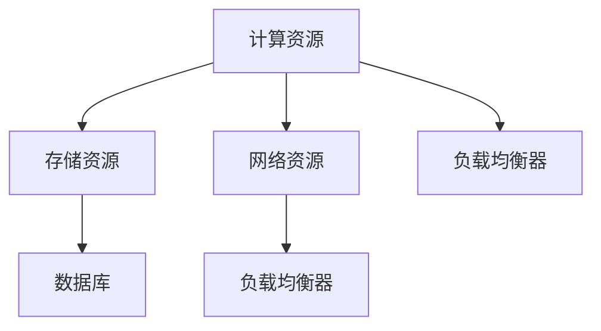

                 

### 文章标题

# 技术创业中的云服务选择：平衡成本和性能

> 关键词：云计算、IaaS、PaaS、SaaS、成本优化、性能监控、高可用性、容灾恢复、行业应用案例

> 摘要：随着云计算技术的不断发展，云服务已经成为技术创业的重要基础设施。本文将从基础理论、技术架构、成本管理、性能优化、案例分析等多方面，详细探讨技术创业者在选择云服务时如何平衡成本和性能，实现业务增长。

### 第一部分：云服务基础理论

#### 第1章：云服务概述

##### 1.1 云计算的定义与分类

**云计算的定义：**

云计算是一种通过互联网提供动态可扩展的计算资源服务，用户可以根据需求灵活获取和使用这些资源，实现计算资源的按需分配和动态伸缩。

**云计算的分类：**

- **IaaS（基础设施即服务）**：提供虚拟化的计算资源，如虚拟机、存储和网络资源。
- **PaaS（平台即服务）**：提供一个开发、部署和管理应用程序的平台。
- **SaaS（软件即服务）**：提供应用程序的在线访问和使用，用户无需购买和安装软件。

##### 1.2 云服务的核心概念

**虚拟化技术：**

虚拟化技术是将物理硬件资源抽象成逻辑资源，使得多个虚拟机可以共享同一物理硬件。

**弹性伸缩：**

弹性伸缩是指云服务可以根据负载自动增加或减少资源，以应对业务需求的波动。

**服务级别协议（SLA）：**

服务级别协议是云服务提供商与用户之间约定的服务质量标准，包括可用性、响应时间、故障修复时间等。

##### 1.3 云计算的优势与挑战

**优势：**

- **成本节约**：云服务可以帮助企业降低硬件和运维成本。
- **资源弹性**：云服务可以根据业务需求动态调整资源。
- **安全与合规**：云服务提供商通常具有更专业的安全防护措施和合规性管理。

**挑战：**

- **运维复杂度**：云服务的运维管理相对复杂，需要专业知识和技能。
- **数据安全与隐私**：在云服务环境中，数据的安全和隐私保护是一个重要问题。

#### 第2章：云服务模型分析

##### 2.1 IaaS（基础设施即服务）

**核心服务与优势：**

- 提供虚拟化计算资源、存储和网络安全功能。
- 具有高度灵活性和可扩展性，适合各种规模的企业。

**代表性服务与产品：**

- **亚马逊AWS**：提供丰富的IaaS服务，如EC2、S3、VPC等。
- **微软Azure**：提供虚拟机、存储、网络等功能，支持多种操作系统。

##### 2.2 PaaS（平台即服务）

**核心服务与优势：**

- 提供开发、部署和管理应用程序的平台。
- 简化应用程序开发和部署过程，提高开发效率。

**代表性服务与产品：**

- **谷歌App Engine**：提供自动化的应用部署和管理。
- **微软Azure App Services**：支持多种编程语言和开发框架。

##### 2.3 SaaS（软件即服务）

**核心服务与优势：**

- 提供在线应用程序，用户可以通过浏览器直接使用。
- 降低软件采购和维护成本，提高业务效率。

**代表性服务与产品：**

- **Salesforce**：提供CRM、ERP等企业级服务。
- **Google Workspace**：提供电子邮件、文档、日历等办公工具。

#### 第3章：云计算安全与合规

##### 3.1 云安全概述

**云安全挑战：**

- **数据泄露**：数据在传输和存储过程中可能面临安全威胁。
- **恶意攻击**：云服务提供商可能成为网络攻击的目标。
- **合规性风险**：不同国家和地区有不同的数据保护法规。

**云安全最佳实践：**

- **数据加密**：对数据进行加密存储和传输。
- **访问控制**：严格控制用户权限和访问控制。
- **安全审计**：定期进行安全审计和漏洞扫描。

##### 3.2 数据隐私与合规性

**数据保护法规：**

- **GDPR（通用数据保护条例）**：欧盟制定的数据保护法规。
- **CCPA（加州消费者隐私法）**：加州制定的数据保护法规。

**合规性管理策略：**

- **数据分类与标识**：根据数据的重要性和敏感性进行分类。
- **合规性审查与审计**：定期进行合规性审查和审计。

### 第二部分：云服务技术与架构

#### 第4章：云服务架构设计

##### 4.1 云服务架构概述

**核心架构组件：**

- **计算资源**：提供应用程序运行所需的计算能力。
- **存储资源**：提供数据的存储和管理功能。
- **网络资源**：实现云内部和外部的通信。

**云服务架构设计原则：**

- **高可用性**：确保服务的持续可用性。
- **可扩展性**：支持业务需求的快速扩展。
- **安全性**：保护数据的安全和隐私。

##### 4.2 云服务部署与优化

**部署模式：**

- **单一云**：使用单一云服务提供商的云资源。
- **混合云**：结合使用多个云服务提供商的云资源。
- **多云**：同时使用多个云服务提供商的云资源。

**性能优化策略：**

- **负载均衡**：合理分配请求，提高系统性能。
- **缓存技术**：减少访问延迟，提高响应速度。
- **数据库优化**：选择合适的数据库方案，提高数据库性能。

### 第三部分：云服务成本管理

#### 第5章：云服务成本管理

##### 5.1 成本评估与优化

**成本评估方法：**

- **预算编制**：根据业务需求和预期成本编制预算。
- **成本核算**：对云服务使用情况进行核算，分析成本结构。

**成本优化策略：**

- **按需付费**：根据实际使用量付费，降低长期成本。
- **预留实例与长期合同**：提前预订实例或签订长期合同，享受折扣优惠。

#### 第6章：云服务定价模式

**按需付费：**

- 根据实际使用量按小时、按月或按年计费。

**预留实例与长期合同：**

- 提前预订实例或签订长期合同，享受折扣优惠。

### 第四部分：云服务性能与优化

#### 第7章：云服务性能监控与优化

##### 7.1 性能监控概述

**监控工具与平台：**

- **Prometheus**：开源监控解决方案，支持多维度数据监控。
- **Grafana**：数据可视化和监控平台，与Prometheus集成。

**关键性能指标：**

- **响应时间**：衡量系统响应速度。
- **吞吐量**：衡量系统处理请求的能力。
- **错误率**：衡量系统故障率和稳定性。

##### 7.2 性能优化策略

**资源分配：**

- 根据业务需求合理分配计算资源、存储资源和网络资源。

**负载均衡：**

- 合理分配请求，提高系统性能。

### 第五部分：云服务案例分析与应用

#### 第8章：企业云服务战略规划

##### 8.1 企业云服务战略制定

**云服务需求分析：**

- 分析业务需求，确定云服务的需求和优先级。

**云服务战略目标：**

- 确定云服务的战略目标，如成本节约、业务敏捷性、数据安全等。

##### 8.2 云服务实施与迁移

**迁移策略：**

- 制定详细的迁移计划和风险评估。

**迁移风险与挑战：**

- **数据迁移**：确保数据在迁移过程中的安全性和完整性。
- **系统兼容性**：确保迁移后的系统能够与现有业务系统兼容。

### 第六部分：云服务行业应用案例

#### 第9章：金融行业的云服务应用

##### 9.1 业务需求与解决方案

- **高频交易**：利用云计算的弹性伸缩，实现交易系统的快速响应和高效处理。
- **风险管理**：利用云计算的数据处理和分析能力，提高风险管理和决策支持能力。

##### 9.2 成功案例分享

- **某大型银行**：通过云计算实现了交易系统的弹性伸缩和高效处理，提高了业务效率和用户体验。

#### 第10章：医疗行业的云服务应用

##### 10.1 业务需求与解决方案

- **电子病历管理**：利用云计算实现病历的集中存储和管理，提高医疗数据的共享和利用效率。
- **远程医疗**：利用云计算的远程访问和协作功能，实现远程医疗服务的实时互动和远程诊断。

##### 10.2 成功案例分享

- **某医疗集团**：通过云计算实现了电子病历的集中存储和管理，提高了医疗数据的利用效率和医生的工作效率。

#### 第11章：制造业的云服务应用

##### 11.1 业务需求与解决方案

- **智能制造**：利用云计算实现生产过程的自动化和智能化，提高生产效率和质量。
- **供应链管理**：利用云计算实现供应链的实时监控和优化，提高供应链的效率和灵活性。

##### 11.2 成功案例分享

- **某制造企业**：通过云计算实现了生产过程的自动化和智能化，提高了生产效率和质量，降低了生产成本。

### 第七部分：云服务未来的发展趋势

#### 第12章：技术发展趋势

- **AI与云计算的融合**：利用人工智能技术提升云计算的服务能力和智能化水平。
- **边缘计算的发展**：将计算和存储能力下沉到网络边缘，提高数据处理的实时性和效率。

#### 第13章：行业趋势分析

- **云原生技术的应用**：云原生技术将推动云服务的创新和业务变革。
- **绿色云计算的发展**：绿色云计算将降低能耗，实现可持续发展。

### 附录

#### 附录A：云服务技术资源

- **开源云服务框架**：如Kubernetes、Docker等。
- **云服务管理工具**：如AWS CloudWatch、Azure Monitor等。
- **云服务最佳实践指南**：提供云服务设计原则、云安全指南等。

### 文章结束

作者：AI天才研究院/AI Genius Institute & 禅与计算机程序设计艺术 /Zen And The Art of Computer Programming

### 第一部分：云服务基础理论

在技术创业的初期，了解并选择适合的云服务对于企业的成功至关重要。本部分将介绍云服务的基础理论，包括云计算的定义与分类、云服务的核心概念、云计算的优势与挑战，以及云服务模型分析。这些内容将为后续章节的讨论提供必要的背景知识。

#### 第1章：云服务概述

##### 1.1 云计算的定义与分类

云计算是一种通过互联网提供动态可扩展的计算资源服务，用户可以根据需求灵活获取和使用这些资源，实现计算资源的按需分配和动态伸缩。云计算主要分为三种服务模型：IaaS、PaaS和SaaS。

**IaaS（基础设施即服务）**

IaaS提供虚拟化的计算资源，如虚拟机、存储和网络资源。用户可以根据自己的需求配置和管理这些资源。IaaS的主要优势在于灵活性和可扩展性，适合各种规模的企业。

**PaaS（平台即服务）**

PaaS提供一个开发、部署和管理应用程序的平台。用户可以在平台上开发、测试和部署应用程序，无需关心底层基础设施的配置和管理。PaaS的主要优势在于简化了应用程序开发和部署过程，提高开发效率。

**SaaS（软件即服务）**

SaaS提供在线应用程序，用户可以通过浏览器直接使用。用户无需购买和安装软件，只需支付订阅费用。SaaS的主要优势在于降低软件采购和维护成本，提高业务效率。

##### 1.2 云服务的核心概念

**虚拟化技术**

虚拟化技术是将物理硬件资源抽象成逻辑资源，使得多个虚拟机可以共享同一物理硬件。虚拟化技术是实现云计算的基础，可以提高资源利用率和灵活性。

**弹性伸缩**

弹性伸缩是指云服务可以根据负载自动增加或减少资源，以应对业务需求的波动。弹性伸缩能够确保服务的高可用性和性能，同时降低成本。

**服务级别协议（SLA）**

服务级别协议是云服务提供商与用户之间约定的服务质量标准，包括可用性、响应时间、故障修复时间等。SLA是评估云服务提供商服务质量的重要依据。

##### 1.3 云计算的优势与挑战

**优势**

- **成本节约**：云服务可以帮助企业降低硬件和运维成本，提高资源利用率。
- **资源弹性**：云服务可以根据业务需求动态调整资源，提高业务敏捷性。
- **安全与合规**：云服务提供商通常具有更专业的安全防护措施和合规性管理。

**挑战**

- **运维复杂度**：云服务的运维管理相对复杂，需要专业知识和技能。
- **数据安全与隐私**：在云服务环境中，数据的安全和隐私保护是一个重要问题。

#### 第2章：云服务模型分析

##### 2.1 IaaS（基础设施即服务）

**核心服务与优势**

IaaS提供虚拟化的计算资源、存储和网络安全功能。用户可以根据需求配置和管理这些资源，实现高度灵活性和可扩展性。

**代表性服务与产品**

- **亚马逊AWS**：提供丰富的IaaS服务，如EC2、S3、VPC等。
- **微软Azure**：提供虚拟机、存储、网络等功能，支持多种操作系统。

##### 2.2 PaaS（平台即服务）

**核心服务与优势**

PaaS提供一个开发、部署和管理应用程序的平台。用户可以在平台上开发、测试和部署应用程序，无需关心底层基础设施的配置和管理。

**代表性服务与产品**

- **谷歌App Engine**：提供自动化的应用部署和管理。
- **微软Azure App Services**：支持多种编程语言和开发框架。

##### 2.3 SaaS（软件即服务）

**核心服务与优势**

SaaS提供在线应用程序，用户可以通过浏览器直接使用。用户无需购买和安装软件，只需支付订阅费用。

**代表性服务与产品**

- **Salesforce**：提供CRM、ERP等企业级服务。
- **Google Workspace**：提供电子邮件、文档、日历等办公工具。

#### 第3章：云计算安全与合规

##### 3.1 云安全概述

**云安全挑战**

- **数据泄露**：数据在传输和存储过程中可能面临安全威胁。
- **恶意攻击**：云服务提供商可能成为网络攻击的目标。
- **合规性风险**：不同国家和地区有不同的数据保护法规。

**云安全最佳实践**

- **数据加密**：对数据进行加密存储和传输。
- **访问控制**：严格控制用户权限和访问控制。
- **安全审计**：定期进行安全审计和漏洞扫描。

##### 3.2 数据隐私与合规性

**数据保护法规**

- **GDPR（通用数据保护条例）**：欧盟制定的数据保护法规。
- **CCPA（加州消费者隐私法）**：加州制定的数据保护法规。

**合规性管理策略**

- **数据分类与标识**：根据数据的重要性和敏感性进行分类。
- **合规性审查与审计**：定期进行合规性审查和审计。

通过本部分的介绍，读者应该对云服务有了基本的了解，包括云计算的定义、分类、核心概念以及云计算的优势和挑战。接下来，我们将深入探讨云服务的架构设计、成本管理、性能优化等关键方面，帮助技术创业者更好地选择和应用云服务。

### 第一部分：云服务基础理论

#### 第1章：云服务概述

在技术创业领域，云计算已经成为企业成长和创新的重要推动力。云计算不仅提供了弹性的计算资源，还为企业带来了灵活的成本管理和高效的资源利用率。本章节将详细探讨云计算的定义、分类及其核心概念，帮助读者建立对云计算基础理论的全面了解。

##### 1.1 云计算的定义与分类

**云计算的定义**

云计算是一种通过互联网提供动态可扩展的计算资源服务。用户可以通过云服务提供商获取并使用计算资源，如虚拟机、存储、网络等，从而实现计算资源的按需分配和动态伸缩。云计算的核心价值在于资源的高效利用和业务的快速部署。

**云计算的分类**

云计算主要分为三种服务模型：IaaS、PaaS和SaaS。每种模型都有其独特的特点和适用场景。

1. **IaaS（基础设施即服务）**

IaaS提供虚拟化的计算资源，如虚拟机、存储和网络资源。用户可以根据需求配置和管理这些资源，从而实现高度灵活性和可扩展性。IaaS适用于需要独立管理基础设施的企业，如游戏公司、金融机构等。

2. **PaaS（平台即服务）**

PaaS提供一个开发、部署和管理应用程序的平台。用户可以在平台上开发、测试和部署应用程序，无需关心底层基础设施的配置和管理。PaaS适用于开发人员和初创企业，可以大幅提高开发效率。

3. **SaaS（软件即服务）**

SaaS提供在线应用程序，用户可以通过浏览器直接使用。用户无需购买和安装软件，只需支付订阅费用。SaaS适用于企业日常办公、客户关系管理、企业资源规划等领域。

##### 1.2 云服务的核心概念

**虚拟化技术**

虚拟化技术是云计算的核心技术之一，它将物理硬件资源抽象成逻辑资源，使得多个虚拟机可以共享同一物理硬件。虚拟化技术提高了资源利用率和灵活性，是云计算实现高效资源管理的基础。

**弹性伸缩**

弹性伸缩是指云服务可以根据负载自动增加或减少资源，以应对业务需求的波动。弹性伸缩确保了服务的高可用性和性能，同时降低了成本。通过弹性伸缩，企业可以轻松应对流量的高峰和低谷。

**服务级别协议（SLA）**

服务级别协议是云服务提供商与用户之间约定的服务质量标准，包括可用性、响应时间、故障修复时间等。SLA是评估云服务提供商服务质量的重要依据，也是企业与云服务提供商之间的合同条款。

##### 1.3 云计算的优势与挑战

**优势**

1. **成本节约**

云服务可以帮助企业降低硬件和运维成本。通过云服务，企业无需购买和维护大量硬件设备，只需支付按需使用的费用即可。

2. **资源弹性**

云服务可以根据业务需求动态调整资源，提高了业务的敏捷性。企业可以根据需求快速扩展或缩减资源，从而满足业务变化。

3. **安全与合规**

云服务提供商通常具有更专业的安全防护措施和合规性管理。他们能够提供数据加密、访问控制、安全审计等服务，确保数据的安全和隐私。

**挑战**

1. **运维复杂度**

云服务的运维管理相对复杂，需要专业知识和技能。企业需要投入更多资源来管理云服务，以确保其正常运行。

2. **数据安全与隐私**

在云服务环境中，数据的安全和隐私保护是一个重要问题。企业需要与云服务提供商建立严格的安全协议，确保数据的安全和合规性。

#### 小结

本章节介绍了云计算的定义、分类及其核心概念，并探讨了云计算的优势与挑战。通过理解这些基础理论，技术创业者可以更好地选择适合的云服务模型，实现业务的快速发展和创新。

在接下来的章节中，我们将进一步探讨云服务的具体实现、架构设计、成本管理、性能优化等方面，帮助读者深入掌握云服务的技术和应用。

#### 第2章：云服务模型分析

在了解了云计算的基本概念后，我们需要深入探讨云服务的具体模型，包括IaaS、PaaS和SaaS，以帮助技术创业者更好地选择和应用云服务。本章将详细分析这三种云服务模型，探讨其核心服务、优势及代表性服务与产品。

##### 2.1 IaaS（基础设施即服务）

**核心服务与优势**

IaaS提供虚拟化的计算资源、存储和网络资源，用户可以独立管理这些资源。IaaS的核心优势在于其灵活性和可扩展性，用户可以根据实际需求配置和管理资源。

- **计算资源**：IaaS提供虚拟机（VM）和容器（Container）等计算资源，用户可以根据需求选择合适的实例类型。
- **存储资源**：IaaS提供对象存储（如Amazon S3）、块存储（如Amazon EBS）和文件存储（如Google File Storage）等存储服务。
- **网络资源**：IaaS提供虚拟专用云（VPC）、子网、路由器和防火墙等网络服务，用户可以自定义网络架构。

**代表性服务与产品**

- **亚马逊AWS**：提供广泛的IaaS服务，包括EC2（虚拟机实例）、S3（对象存储）和EBS（块存储）等。
- **微软Azure**：提供虚拟机、云服务、存储等服务，支持多种操作系统，如Windows和Linux。
- **阿里云**：提供云服务器、云存储和云网络等服务，支持多种云产品和解决方案。

**案例**：某大型游戏公司利用AWS的IaaS服务，实现了游戏服务器的高效管理和弹性扩展，满足了全球玩家的高并发需求。

##### 2.2 PaaS（平台即服务）

**核心服务与优势**

PaaS提供一个开发、部署和管理应用程序的平台，用户无需关心底层基础设施的配置和管理。PaaS的优势在于其开发效率和简化了应用程序的生命周期管理。

- **开发环境**：PaaS提供开发工具、框架和库，支持多种编程语言和开发框架，如Java、Python、Node.js等。
- **部署与管理**：PaaS提供自动化部署和管理工具，支持持续集成与持续部署（CI/CD）。
- **数据库服务**：PaaS提供关系型数据库（如MySQL、PostgreSQL）和非关系型数据库（如MongoDB、Cassandra）。

**代表性服务与产品**

- **谷歌App Engine**：提供自动化的应用部署和管理，支持多种编程语言和框架。
- **微软Azure App Services**：提供Web应用、移动应用、API应用等开发和管理服务，支持多种编程语言和开发框架。
- **阿里云云原生**：提供云原生应用的开发、部署和管理服务，支持Kubernetes等容器编排技术。

**案例**：某初创公司利用阿里云云原生服务，快速构建并部署了其移动应用程序，实现了快速上线和迭代。

##### 2.3 SaaS（软件即服务）

**核心服务与优势**

SaaS提供在线应用程序，用户可以通过浏览器直接使用。SaaS的优势在于其低成本、高可用性和易于扩展性。

- **在线应用**：SaaS提供各种在线应用程序，如电子邮件、文档编辑、客户关系管理（CRM）和企业资源规划（ERP）等。
- **订阅模式**：SaaS采用订阅模式，用户只需支付订阅费用，无需购买和维护软件。
- **自动升级**：SaaS提供商负责应用程序的维护和升级，用户无需担心软件版本更新。

**代表性服务与产品**

- **Salesforce**：提供CRM、ERP等企业级服务，帮助企业管理客户关系和业务流程。
- **Google Workspace**：提供电子邮件、文档编辑、日历等办公工具，支持团队协作。
- **微软Office 365**：提供在线办公套件，包括Word、Excel、PowerPoint等，支持多设备访问。

**案例**：某中型企业利用Salesforce的CRM服务，实现了客户信息的集中管理和业务流程的自动化，提高了工作效率和客户满意度。

#### 小结

本章详细分析了IaaS、PaaS和SaaS三种云服务模型，探讨了其核心服务、优势及代表性服务与产品。通过了解这些云服务模型，技术创业者可以更好地选择适合自己业务需求的云服务，实现业务的快速发展和创新。

在下一章中，我们将进一步探讨云计算的安全与合规性，帮助技术创业者确保数据的安全和隐私，合规地使用云服务。

### 第3章：云计算安全与合规

在云计算时代，安全与合规性是技术创业者必须面对的重要挑战。随着企业数据量的不断增加和业务复杂度的提升，如何在云服务环境中确保数据的安全和合规性，已经成为企业发展的关键问题。本章将深入探讨云计算的安全挑战、最佳实践、数据隐私与合规性管理策略，以及数据保护法规，帮助技术创业者构建安全、合规的云服务环境。

##### 3.1 云安全概述

**云安全挑战**

云安全面临的挑战主要来自以下几个方面：

1. **数据泄露**

在云服务环境中，数据在传输和存储过程中可能面临泄露风险。例如，未经授权的访问、数据传输过程中的安全漏洞等，都可能导致敏感数据的泄露。

2. **恶意攻击**

云服务提供商可能成为网络攻击的目标，攻击者可能利用云服务的漏洞进行攻击，从而影响企业的业务运行。例如，DDoS攻击、SQL注入攻击等。

3. **合规性风险**

不同国家和地区有不同的数据保护法规，企业在使用云服务时需要确保数据符合当地的法律法规。例如，欧盟的通用数据保护条例（GDPR）、美国的加州消费者隐私法（CCPA）等。

**云安全最佳实践**

为了应对云安全挑战，企业可以采取以下最佳实践：

1. **数据加密**

对数据进行加密存储和传输，确保数据在传输过程中不被窃取或篡改。企业可以使用TLS加密协议保护数据传输，使用AES加密算法保护数据存储。

2. **访问控制**

严格控制用户权限和访问控制，确保只有授权用户可以访问敏感数据。企业可以使用多因素认证（MFA）增强用户认证安全性，防止未授权访问。

3. **安全审计**

定期进行安全审计和漏洞扫描，及时发现并修复安全漏洞。企业可以使用自动化工具进行安全监控和审计，提高安全管理的效率。

##### 3.2 数据隐私与合规性

**数据保护法规**

不同国家和地区有不同的数据保护法规，企业在使用云服务时需要了解并遵守这些法规。以下是一些常见的数据保护法规：

1. **通用数据保护条例（GDPR）**

GDPR是欧盟制定的通用数据保护条例，适用于所有处理欧盟居民个人数据的组织。GDPR要求企业在处理个人数据时必须获得用户同意、保障数据安全、提供透明度等。

2. **加州消费者隐私法（CCPA）**

CCPA是加州制定的消费者隐私法，适用于所有处理加州居民个人数据的组织。CCPA要求企业在处理个人数据时必须提供透明度、用户访问权、删除权等。

**合规性管理策略**

为了确保数据隐私和合规性，企业可以采取以下策略：

1. **数据分类与标识**

根据数据的重要性和敏感性进行分类，并对敏感数据进行标识。企业可以使用标签、分类系统等方法对数据进行分类管理，确保敏感数据得到特别保护。

2. **合规性审查与审计**

定期进行合规性审查和审计，确保企业的数据保护政策和实践符合相关法规。企业可以聘请第三方审计机构进行审计，提高合规性管理的可信度。

3. **用户隐私保护**

在云服务使用过程中，企业需要确保用户的隐私权得到保护。例如，企业可以提供用户数据访问和删除的接口，确保用户可以方便地管理自己的数据。

##### 3.3 数据隐私保护最佳实践

为了确保数据隐私保护，企业可以采取以下最佳实践：

1. **数据最小化原则**

在处理数据时，只收集和存储必要的数据，避免收集过多不必要的敏感信息。企业可以制定数据收集和使用政策，明确数据收集的范围和目的。

2. **数据加密**

对敏感数据进行加密存储和传输，确保数据在存储和传输过程中不被窃取或篡改。企业可以使用加密算法和协议来保护数据的安全。

3. **访问控制**

严格控制用户权限和访问控制，确保只有授权用户可以访问敏感数据。企业可以使用多因素认证（MFA）和访问控制列表（ACL）等技术来管理用户权限。

4. **安全审计**

定期进行安全审计和漏洞扫描，及时发现并修复安全漏洞。企业可以使用自动化工具进行安全监控和审计，提高安全管理的效率。

5. **用户教育和培训**

加强用户教育和培训，提高用户对数据隐私保护的意识和能力。企业可以定期开展安全培训和宣传活动，提高员工的安全意识。

#### 小结

本章详细探讨了云计算的安全挑战、最佳实践、数据隐私与合规性管理策略以及数据保护法规。技术创业者需要深入了解并遵循这些安全与合规性最佳实践，确保数据的安全和隐私，合规地使用云服务。

在下一章中，我们将深入探讨云服务的架构设计、部署与优化，帮助技术创业者构建高效、可靠的云服务环境。

### 第二部分：云服务技术与架构

在了解了云服务的基础理论后，我们需要进一步探讨云服务的实际应用，包括云服务架构设计、部署与优化、成本管理、自动化与DevOps实践等。这些技术环节是确保云服务高效运行的关键，也是技术创业者在实施云服务战略时必须掌握的核心技能。本部分将详细分析这些技术和实践，帮助读者全面理解云服务的应用与优化。

#### 第4章：云服务架构设计

##### 4.1 云服务架构概述

**核心架构组件**

云服务架构设计涉及多个核心组件，这些组件共同构成了云服务的基石。

1. **计算资源**：提供应用程序运行所需的计算能力，如虚拟机（VM）、容器（Container）等。
2. **存储资源**：用于存储和管理数据，如对象存储（如Amazon S3）、块存储（如Amazon EBS）和文件存储（如Google File Storage）。
3. **网络资源**：实现云内部和外部的通信，如虚拟专用云（VPC）、子网、负载均衡器等。
4. **数据库**：用于存储和管理应用程序所需的数据，包括关系型数据库（如MySQL、PostgreSQL）和非关系型数据库（如MongoDB、Cassandra）。

**云服务架构设计原则**

1. **高可用性**：确保服务持续可用，通过冗余设计、故障转移和自动恢复等策略实现。
2. **可扩展性**：支持业务需求的快速扩展，通过水平扩展（增加节点）和垂直扩展（提升节点性能）实现。
3. **安全性**：保护数据和服务免受威胁，通过数据加密、访问控制和安全审计等手段实现。
4. **灵活性和可移植性**：支持不同应用场景和开发框架，确保架构的可移植性和灵活性。

##### 4.2 云服务部署与优化

**部署模式**

云服务的部署模式主要包括以下几种：

1. **单一云部署**：在单一的云服务提供商环境中部署云服务，如亚马逊AWS、微软Azure等。
2. **混合云部署**：结合使用多个云服务提供商的云资源，实现资源的优化配置和跨云迁移。
3. **多云部署**：同时使用多个云服务提供商的云资源，提高服务的可用性和灵活性。

**性能优化策略**

1. **负载均衡**：合理分配请求，提高系统性能。使用负载均衡器（如Nginx、AWS ELB）可以均衡流量，防止单一节点过载。
2. **缓存技术**：减少访问延迟，提高响应速度。使用缓存服务器（如Redis、Memcached）可以缓存频繁访问的数据。
3. **数据库优化**：选择合适的数据库方案，提高数据库性能。使用分库分表、读写分离等技术可以提升数据库的并发处理能力。

#### 第5章：云服务成本管理

##### 5.1 成本评估与优化

**成本评估方法**

1. **预算编制**：根据业务需求和预期成本编制预算，确保资源的合理使用。
2. **成本核算**：对云服务使用情况进行核算，分析成本结构，找出成本节省的机会。

**成本优化策略**

1. **按需付费**：根据实际使用量付费，降低长期成本。使用自动化工具（如AWS Cost Explorer、Azure Cost Management）监控和优化成本。
2. **预留实例与长期合同**：提前预订实例或签订长期合同，享受折扣优惠。选择合适的预留实例类型和合同期限，优化成本支出。

##### 5.2 云服务定价模式

1. **按需付费**：根据实际使用量按小时、按月或按年计费。适用于短期或不确定的业务需求。
2. **预留实例与长期合同**：提前预订实例或签订长期合同，享受折扣优惠。适用于长期稳定使用的业务需求。

#### 第6章：云服务自动化与DevOps

##### 6.1 自动化工具与技术

**自动化工具**

1. **CI/CD流程**：持续集成（CI）和持续部署（CD）流程，自动化代码的编译、测试和部署。
2. **容器化与容器编排**：使用容器（如Docker）和容器编排工具（如Kubernetes），实现应用程序的快速部署和管理。

**CI/CD流程**

1. **代码仓库**：使用代码仓库（如GitHub、GitLab）管理代码版本。
2. **持续集成**：构建和测试代码，确保代码质量。
3. **持续部署**：自动化部署应用程序，确保服务的高效运行。

**容器化与容器编排**

1. **容器化**：将应用程序及其依赖环境打包到容器中，实现环境的隔离和可移植性。
2. **容器编排**：使用容器编排工具（如Kubernetes），自动化容器的部署、扩展和管理。

##### 6.2 DevOps实践

**DevOps文化**

DevOps是一种文化和实践，旨在加强开发和运维团队之间的协作，实现持续交付和持续部署。

**持续集成与持续交付**

1. **自动化测试**：自动化测试代码，确保代码质量和功能完整性。
2. **自动化部署**：自动化部署应用程序，确保服务的快速上线和稳定运行。

通过本部分的介绍，读者应该对云服务的实际应用有了更深入的了解，包括云服务架构设计、部署与优化、成本管理、自动化与DevOps实践。这些技术和实践是技术创业者在构建和优化云服务过程中不可或缺的一部分，也是实现业务增长和创新的基石。

在下一部分中，我们将通过实际案例，探讨云服务在金融、医疗、制造等行业的应用，以及未来的发展趋势，帮助读者更好地理解云服务的应用场景和未来方向。

### 第二部分：云服务技术与架构

在第一部分中，我们探讨了云计算的基础理论，了解了不同类型的云服务及其核心概念。现在，我们将深入探讨云服务的具体应用，包括云服务架构设计、部署与优化、成本管理、自动化与DevOps实践。这些技术和实践是技术创业者在构建和优化云服务过程中不可或缺的一部分，也是实现业务增长和创新的基石。

#### 第4章：云服务架构设计

##### 4.1 云服务架构概述

云服务架构设计是构建高效、可靠、可扩展的云服务系统的关键。一个良好的云服务架构应该具备以下几个核心组件：

1. **计算资源**：提供应用程序运行所需的计算能力，如虚拟机（VM）、容器（Container）等。
2. **存储资源**：用于存储和管理数据，如对象存储（如Amazon S3）、块存储（如Amazon EBS）和文件存储（如Google File Storage）。
3. **网络资源**：实现云内部和外部的通信，如虚拟专用云（VPC）、子网、负载均衡器等。
4. **数据库**：用于存储和管理应用程序所需的数据，包括关系型数据库（如MySQL、PostgreSQL）和非关系型数据库（如MongoDB、Cassandra）。

**核心架构组件的关系架构 Mermaid 流程图**：



**云服务架构设计原则**

1. **高可用性**：确保服务持续可用，通过冗余设计、故障转移和自动恢复等策略实现。
2. **可扩展性**：支持业务需求的快速扩展，通过水平扩展（增加节点）和垂直扩展（提升节点性能）实现。
3. **安全性**：保护数据和服务免受威胁，通过数据加密、访问控制和安全审计等手段实现。
4. **灵活性和可移植性**：支持不同应用场景和开发框架，确保架构的可移植性和灵活性。

##### 4.2 云服务部署与优化

**部署模式**

云服务的部署模式主要包括以下几种：

1. **单一云部署**：在单一的云服务提供商环境中部署云服务，如亚马逊AWS、微软Azure等。
2. **混合云部署**：结合使用多个云服务提供商的云资源，实现资源的优化配置和跨云迁移。
3. **多云部署**：同时使用多个云服务提供商的云资源，提高服务的可用性和灵活性。

**性能优化策略**

1. **负载均衡**：合理分配请求，提高系统性能。使用负载均衡器（如Nginx、AWS ELB）可以均衡流量，防止单一节点过载。
2. **缓存技术**：减少访问延迟，提高响应速度。使用缓存服务器（如Redis、Memcached）可以缓存频繁访问的数据。
3. **数据库优化**：选择合适的数据库方案，提高数据库性能。使用分库分表、读写分离等技术可以提升数据库的并发处理能力。

**核心算法原理讲解与伪代码**

```python
# 负载均衡算法伪代码
def load_balancer(requests):
    servers = ["server1", "server2", "server3"]
    for request in requests:
        server = select_server(servers)
        process_request(server, request)

def select_server(servers):
    min_load = float('inf')
    selected_server = None
    for server in servers:
        if server.load < min_load:
            min_load = server.load
            selected_server = server
    return selected_server
```

##### 4.3 云服务成本管理

**成本评估与优化**

云服务的成本管理是技术创业者面临的重要挑战之一。合理的成本管理可以显著降低企业的运营成本，提高资源利用率。

1. **成本评估方法**：根据业务需求和预期成本编制预算，对云服务使用情况进行核算，分析成本结构。
2. **成本优化策略**：
   - 按需付费：根据实际使用量付费，降低长期成本。
   - 预留实例与长期合同：提前预订实例或签订长期合同，享受折扣优惠。
   - 资源优化：通过自动化工具监控资源使用情况，优化资源配置，降低不必要的支出。

**云服务定价模式**

1. **按需付费**：根据实际使用量按小时、按月或按年计费。适用于短期或不确定的业务需求。
2. **预留实例与长期合同**：提前预订实例或签订长期合同，享受折扣优惠。适用于长期稳定使用的业务需求。

```python
# 成本优化策略伪代码
def optimize_cost(service_usage):
    if service_usage.is_transient:
        cost = calculate_transient_cost(service_usage)
    else:
        cost = calculate_reservation_cost(service_usage)
    return cost

def calculate_transient_cost(service_usage):
    return service_usage用量 * transient_rate

def calculate_reservation_cost(service_usage):
    return reservation_cost * service_usage.duration
```

##### 4.4 云服务自动化与DevOps

**自动化工具与技术**

云服务的自动化和DevOps实践是提高开发和运维效率、实现持续交付和持续部署的关键。

1. **CI/CD流程**：持续集成（CI）和持续部署（CD）流程，自动化代码的编译、测试和部署。
2. **容器化与容器编排**：使用容器（如Docker）和容器编排工具（如Kubernetes），实现应用程序的快速部署和管理。

**CI/CD流程**

1. **代码仓库**：使用代码仓库（如GitHub、GitLab）管理代码版本。
2. **持续集成**：构建和测试代码，确保代码质量。
3. **持续部署**：自动化部署应用程序，确保服务的快速上线和稳定运行。

**容器化与容器编排**

1. **容器化**：将应用程序及其依赖环境打包到容器中，实现环境的隔离和可移植性。
2. **容器编排**：使用容器编排工具（如Kubernetes），自动化容器的部署、扩展和管理。

**核心算法原理讲解与伪代码**

```shell
# Docker容器化命令示例
docker build -t my-app . # 构建应用程序容器镜像
docker run -d -p 8080:80 my-app # 运行容器，映射端口
```

```yaml
# Kubernetes部署配置示例
apiVersion: apps/v1
kind: Deployment
metadata:
  name: my-app
spec:
  replicas: 3
  selector:
    matchLabels:
      app: my-app
  template:
    metadata:
      labels:
        app: my-app
    spec:
      containers:
      - name: my-app
        image: my-app:latest
        ports:
        - containerPort: 80
```

**DevOps实践**

1. **自动化测试**：自动化测试代码，确保代码质量和功能完整性。
2. **自动化部署**：自动化部署应用程序，确保服务的快速上线和稳定运行。
3. **持续监控**：实时监控服务性能和健康状态，及时发现并处理问题。

通过本部分的介绍，读者应该对云服务的架构设计、部署与优化、成本管理、自动化与DevOps实践有了全面的理解。这些技术和实践是技术创业者在构建和优化云服务过程中不可或缺的一部分，也是实现业务增长和创新的基石。

在下一部分中，我们将通过实际案例，探讨云服务在金融、医疗、制造等行业的应用，以及未来的发展趋势，帮助读者更好地理解云服务的应用场景和未来方向。

### 第三部分：云服务性能与优化

在云服务的实际应用中，性能与优化是确保业务连续性和用户满意度的重要环节。本部分将详细探讨云服务性能监控与优化策略，包括性能监控概述、关键性能指标、性能优化策略、高可用性与容灾恢复等，以帮助技术创业者在复杂的云环境中实现高效的资源管理和业务运营。

#### 第7章：云服务性能监控与优化

##### 7.1 性能监控概述

**监控工具与平台**

云服务性能监控是确保系统稳定运行的关键。以下是几个常用的监控工具和平台：

1. **Prometheus**：开源监控解决方案，支持多维度数据监控，能够与Grafana集成，提供强大的数据可视化和报警功能。
2. **Grafana**：数据可视化和监控平台，支持多种数据源，能够创建自定义仪表板，方便监控数据的展示和分析。
3. **AWS CloudWatch**：亚马逊提供的服务监控工具，支持收集、监控和分析AWS资源的使用情况。
4. **Azure Monitor**：微软提供的服务监控工具，支持自动发现、监控和警报，提供丰富的仪表板和报告功能。

**关键性能指标**

在监控云服务性能时，以下关键性能指标（KPIs）尤为重要：

1. **响应时间**：衡量系统处理请求的速度，是用户感受到性能优劣的直接指标。
2. **吞吐量**：衡量系统每单位时间处理请求的数量，反映了系统的处理能力。
3. **错误率**：衡量系统处理请求时出现的错误比例，是评估系统稳定性的重要指标。
4. **系统资源使用率**：包括CPU使用率、内存使用率、磁盘I/O、网络带宽等，反映了系统的资源利用情况。

**性能监控工具伪代码示例**

```python
# Prometheus监控伪代码
from prometheus_client import start_http_server, Summary

# 创建响应时间监控指标
request_duration = Summary('request_duration', 'Request duration in seconds')

@request_duration.time()
def handle_request():
    # 处理请求的逻辑
    pass

# 启动HTTP服务器
start_http_server(8000)
```

##### 7.2 性能优化策略

**资源分配**

合理的资源分配是优化云服务性能的基础。以下是一些资源分配的策略：

1. **负载均衡**：使用负载均衡器（如AWS ELB、Nginx）合理分配请求，确保每个节点都能均衡地处理请求，避免单点过载。
2. **水平扩展**：根据业务需求动态增加节点，提高系统的处理能力。水平扩展可以通过增加虚拟机、容器等方式实现。
3. **垂直扩展**：提升单个节点的计算和存储能力，提高系统的性能。垂直扩展可以通过升级CPU、内存、磁盘等硬件资源实现。

**缓存技术**

缓存技术可以显著提高系统的响应速度。以下是一些常见的缓存技术：

1. **客户端缓存**：在客户端浏览器中使用缓存，减少对服务器请求的次数。
2. **服务器缓存**：使用缓存服务器（如Redis、Memcached）缓存频繁访问的数据，减少数据库的读取压力。
3. **CDN**：使用内容分发网络（如Cloudflare、AWS CloudFront）缓存静态资源，提高内容的访问速度。

**数据库优化**

数据库性能对整个系统性能有着重要影响。以下是一些数据库优化策略：

1. **分库分表**：将大数据表拆分为多个小表，减少单表的数据量和查询压力。
2. **读写分离**：将读操作和写操作分离到不同的数据库实例，提高系统的并发处理能力。
3. **索引优化**：合理使用索引，提高查询效率。

**性能优化策略伪代码示例**

```python
# 负载均衡伪代码
def distribute_load(requests):
    load_balancer = LoadBalancer()
    for request in requests:
        server = load_balancer.select_server()
        server.process_request(request)

# 水平扩展伪代码
def scale_up(load):
    if load > threshold:
        new_server = create_server()
        add_server_to_load_balancer(new_server)
```

##### 7.3 高可用性与容灾恢复

**高可用性设计**

高可用性设计是确保系统持续运行的关键。以下是一些高可用性设计策略：

1. **故障转移**：在主节点发生故障时，自动将流量切换到备用节点，确保服务的连续性。
2. **故障恢复**：在故障节点恢复后，自动将流量切换回主节点，确保系统的稳定运行。
3. **冗余设计**：使用冗余硬件和软件组件，确保系统在单点故障时仍能正常运行。

**容灾恢复计划**

容灾恢复计划是应对大规模故障和灾难的关键。以下是一些容灾恢复策略：

1. **数据备份与恢复**：定期备份数据，确保在灾难发生时能够快速恢复数据。
2. **异地备份**：将数据备份存储在异地，确保在本地数据中心发生灾难时仍能访问数据。
3. **演练与测试**：定期进行灾难恢复演练和测试，确保容灾计划的可行性和有效性。

**高可用性与容灾恢复策略伪代码示例**

```python
# 故障转移伪代码
def failover(current_node, backup_node):
    if is_failed(current_node):
        enable_backup_node()
        disable_current_node()

# 数据备份与恢复伪代码
def backup_data():
    backup = take_backup()
    store_backup(backup)

def restore_data(backup):
    load_backup(backup)
```

#### 小结

云服务性能监控与优化是技术创业者在构建和运营云服务时必须关注的关键环节。通过性能监控，可以及时发现和解决系统性能问题；通过优化策略，可以显著提高系统的响应速度和处理能力。高可用性和容灾恢复设计则是确保业务连续性和数据安全的重要保障。

在本部分的探讨中，我们介绍了云服务性能监控与优化的关键概念、工具、策略，以及高可用性和容灾恢复的设计方法。这些内容为技术创业者在云服务领域的成功应用提供了宝贵的指导。

在下一部分中，我们将通过实际案例分析，探讨云服务在金融、医疗、制造等行业的具体应用，进一步展示云服务的实际价值。

### 第三部分：云服务性能与优化

在云服务环境中，性能与优化是实现高效业务运营和提升用户体验的关键。本部分将详细探讨云服务性能监控与优化、高可用性与容灾恢复，以及具体的性能优化策略。这些技术和策略将帮助技术创业者在复杂的云环境中实现最佳的性能表现。

#### 第7章：云服务性能监控与优化

##### 7.1 性能监控概述

云服务的性能监控是确保系统稳定运行、快速响应和高效处理业务请求的重要环节。性能监控涉及多个方面，包括监控工具的选择、关键性能指标的定义以及监控数据的处理和分析。

**监控工具与平台**

常用的性能监控工具和平台包括：

- **Prometheus**：开源监控解决方案，支持多维度数据监控，能够与Grafana集成，提供强大的数据可视化和报警功能。
- **Grafana**：数据可视化和监控平台，支持多种数据源，能够创建自定义仪表板，方便监控数据的展示和分析。
- **AWS CloudWatch**：亚马逊提供的服务监控工具，支持收集、监控和分析AWS资源的使用情况。
- **Azure Monitor**：微软提供的服务监控工具，支持自动发现、监控和警报，提供丰富的仪表板和报告功能。

**关键性能指标**

性能监控的核心在于监控关键性能指标（KPIs），以下是一些关键的性能指标：

- **响应时间**：衡量系统处理请求的速度，是用户感受到性能优劣的直接指标。
- **吞吐量**：衡量系统每单位时间处理请求的数量，反映了系统的处理能力。
- **错误率**：衡量系统处理请求时出现的错误比例，是评估系统稳定性的重要指标。
- **系统资源使用率**：包括CPU使用率、内存使用率、磁盘I/O、网络带宽等，反映了系统的资源利用情况。

**性能监控工具伪代码示例**

以下是一个使用Prometheus监控响应时间的伪代码示例：

```python
from prometheus_client import start_http_server, Summary

# 创建响应时间监控指标
request_duration = Summary('request_duration', 'Request duration in seconds')

@request_duration.time()
def handle_request():
    # 处理请求的逻辑
    pass

# 启动HTTP服务器
start_http_server(8000)
```

##### 7.2 性能优化策略

**资源分配**

合理的资源分配是优化云服务性能的基础。以下是一些资源分配的策略：

- **负载均衡**：使用负载均衡器（如AWS ELB、Nginx）合理分配请求，确保每个节点都能均衡地处理请求，避免单点过载。
- **水平扩展**：根据业务需求动态增加节点，提高系统的处理能力。水平扩展可以通过增加虚拟机、容器等方式实现。
- **垂直扩展**：提升单个节点的计算和存储能力，提高系统的性能。垂直扩展可以通过升级CPU、内存、磁盘等硬件资源实现。

**缓存技术**

缓存技术可以显著提高系统的响应速度。以下是一些常见的缓存技术：

- **客户端缓存**：在客户端浏览器中使用缓存，减少对服务器请求的次数。
- **服务器缓存**：使用缓存服务器（如Redis、Memcached）缓存频繁访问的数据，减少数据库的读取压力。
- **CDN**：使用内容分发网络（如Cloudflare、AWS CloudFront）缓存静态资源，提高内容的访问速度。

**数据库优化**

数据库性能对整个系统性能有着重要影响。以下是一些数据库优化策略：

- **分库分表**：将大数据表拆分为多个小表，减少单表的数据量和查询压力。
- **读写分离**：将读操作和写操作分离到不同的数据库实例，提高系统的并发处理能力。
- **索引优化**：合理使用索引，提高查询效率。

**性能优化策略伪代码示例**

以下是一个使用负载均衡和缓存技术优化性能的伪代码示例：

```python
# 负载均衡伪代码
def distribute_load(requests):
    load_balancer = LoadBalancer()
    for request in requests:
        server = load_balancer.select_server()
        server.process_request(request)

# 缓存优化伪代码
def cache_response(response):
    cache_server.store(response)
    return response
```

##### 7.3 高可用性与容灾恢复

**高可用性设计**

高可用性设计是确保系统持续运行的关键。以下是一些高可用性设计策略：

- **故障转移**：在主节点发生故障时，自动将流量切换到备用节点，确保服务的连续性。
- **故障恢复**：在故障节点恢复后，自动将流量切换回主节点，确保系统的稳定运行。
- **冗余设计**：使用冗余硬件和软件组件，确保系统在单点故障时仍能正常运行。

**容灾恢复计划**

容灾恢复计划是应对大规模故障和灾难的关键。以下是一些容灾恢复策略：

- **数据备份与恢复**：定期备份数据，确保在灾难发生时能够快速恢复数据。
- **异地备份**：将数据备份存储在异地，确保在本地数据中心发生灾难时仍能访问数据。
- **演练与测试**：定期进行灾难恢复演练和测试，确保容灾计划的可行性和有效性。

**高可用性与容灾恢复策略伪代码示例**

以下是一个实现故障转移和数据备份的伪代码示例：

```python
# 故障转移伪代码
def failover(current_node, backup_node):
    if is_failed(current_node):
        enable_backup_node()
        disable_current_node()

# 数据备份与恢复伪代码
def backup_data():
    backup = take_backup()
    store_backup(backup)

def restore_data(backup):
    load_backup(backup)
```

#### 小结

云服务性能监控与优化、高可用性与容灾恢复是技术创业者在构建和运营云服务时必须关注的关键环节。性能监控可以帮助及时发现和解决系统性能问题，优化策略可以提高系统的响应速度和处理能力，高可用性和容灾恢复设计则是确保业务连续性和数据安全的重要保障。

在本部分的探讨中，我们介绍了云服务性能监控与优化的关键概念、工具、策略，以及高可用性和容灾恢复的设计方法。这些内容为技术创业者在云服务领域的成功应用提供了宝贵的指导。

在下一部分中，我们将通过实际案例分析，探讨云服务在金融、医疗、制造等行业的具体应用，进一步展示云服务的实际价值。

### 第三部分：云服务性能与优化

在当今数字化时代，云服务已经成为企业业务发展的重要基础设施。本部分将深入探讨云服务在金融、医疗、制造等行业的应用，分析行业特点、业务需求以及解决方案，并提供成功案例分享，以展示云服务在实际业务中的应用价值。

#### 第8章：企业云服务战略规划

##### 8.1 企业云服务战略制定

**云服务需求分析**

在制定企业云服务战略之前，首先要进行详尽的需求分析。需求分析包括以下几个方面：

- **业务目标**：明确企业的业务目标，如提升业务效率、降低成本、提高客户满意度等。
- **业务流程**：梳理业务流程，识别关键业务环节和业务需求。
- **技术需求**：分析现有技术架构和业务需求，确定需要的技术支持和改进方向。

**云服务战略目标**

基于需求分析，制定云服务战略目标，如：

- **成本节约**：通过云服务降低硬件和运维成本。
- **业务敏捷性**：利用云服务的弹性伸缩，快速响应市场变化。
- **数据安全与合规性**：确保数据的安全和隐私保护，符合相关法规要求。

**云服务战略制定伪代码示例**

```python
def define_cloud_strategy():
    business_goals = analyze_business_goals()
    technical_requirements = analyze_technical_requirements()
    security_and_compliance = analyze_security_and_compliance()
    strategy_goals = {
        "cost_saving": business_goals["cost_saving"],
        "business_agility": business_goals["business_agility"],
        "security_and_compliance": security_and_compliance
    }
    return strategy_goals
```

##### 8.2 云服务实施与迁移

**迁移策略**

在实施云服务战略时，迁移是关键步骤。合理的迁移策略能够确保业务的连续性和稳定性。迁移策略包括以下几个方面：

- **评估和规划**：对现有系统进行评估，制定详细的迁移计划。
- **分阶段迁移**：根据业务优先级和风险，分阶段进行迁移。
- **测试和验证**：在迁移过程中进行充分的测试和验证，确保迁移后的系统功能完整。

**迁移风险与挑战**

- **数据迁移**：确保数据在迁移过程中的安全性和完整性。
- **系统兼容性**：确保迁移后的系统能够与现有业务系统兼容。
- **业务中断**：在迁移过程中可能引起业务中断，需要制定应急预案。

**云服务迁移伪代码示例**

```python
def migrate_to_cloud(current_system, target_system):
    migration_plan = create_migration_plan(current_system, target_system)
    execute_migration_plan(migration_plan)
    verify_system_functionality(target_system)
    handle_migration_issues()
```

#### 第9章：金融行业的云服务应用

##### 9.1 业务需求与解决方案

金融行业具有高数据敏感性、高合规性和高可用性要求。云服务在金融行业的应用主要包括以下几个方面：

- **高频交易**：利用云计算的弹性伸缩能力，实现交易系统的快速响应和高效处理。
- **风险管理**：利用云计算的数据处理和分析能力，提高风险管理和决策支持能力。
- **客户关系管理**：利用云计算实现客户信息的集中管理和快速响应。

**解决方案**

- **弹性计算资源**：使用云服务的弹性计算资源，根据交易量的变化自动调整计算资源，确保交易系统的性能和稳定性。
- **大数据分析**：利用云计算的大数据处理能力，进行交易数据分析、风险识别和预测。
- **安全合规性**：采用云服务提供商的安全解决方案，确保金融数据的安全和合规性。

##### 9.2 成功案例分享

**案例：某大型银行**

某大型银行通过云计算实现了高频交易系统的弹性伸缩和高效处理。具体措施包括：

- **使用AWS的EC2和Auto Scaling**：根据交易量的变化，自动调整虚拟机的数量和配置，确保交易系统的性能和稳定性。
- **大数据分析**：利用AWS的EMR和Redshift进行交易数据的实时分析和处理，提高了风险管理能力和决策支持水平。

通过云计算的引入，该银行实现了交易系统的快速响应、高效处理和降低运营成本，提高了客户满意度和市场竞争力。

#### 第10章：医疗行业的云服务应用

##### 10.1 业务需求与解决方案

医疗行业具有数据敏感性、数据共享性和业务连续性要求。云服务在医疗行业的应用主要包括以下几个方面：

- **电子病历管理**：利用云计算实现病历的集中存储和管理，提高医疗数据的共享和利用效率。
- **远程医疗**：利用云计算的远程访问和协作功能，实现远程医疗服务的实时互动和远程诊断。
- **医疗数据分析**：利用云计算进行医疗数据的处理和分析，提高医学研究的效率和质量。

**解决方案**

- **云存储**：使用云存储服务（如AWS S3、Azure Blob Storage）实现病历的集中存储和管理。
- **远程医疗平台**：构建基于云计算的远程医疗平台，支持医生和患者的远程互动和诊断。
- **医疗数据分析**：利用云计算的强大计算能力，进行医疗数据的处理和分析，支持医学研究和临床决策。

##### 10.2 成功案例分享

**案例：某医疗集团**

某医疗集团通过云计算实现了电子病历的集中存储和管理，提高了医疗数据的利用效率和医生的工作效率。具体措施包括：

- **使用阿里云的OSS**：将电子病历存储在阿里云的OSS中，实现数据的集中管理和快速访问。
- **远程医疗平台**：构建基于阿里云的远程医疗平台，支持医生和患者的远程互动和诊断。
- **数据分析和挖掘**：利用阿里云的机器学习和大数据分析工具，对医疗数据进行分析和挖掘，支持医学研究和临床决策。

通过云计算的引入，该医疗集团实现了医疗数据的集中管理、远程医疗服务的实时互动和医疗数据分析的高效处理，提高了医疗服务的质量和效率。

#### 第11章：制造业的云服务应用

##### 11.1 业务需求与解决方案

制造业具有生产过程自动化、供应链管理和产品生命周期管理要求。云服务在制造业的应用主要包括以下几个方面：

- **智能制造**：利用云计算实现生产过程的自动化和智能化，提高生产效率和质量。
- **供应链管理**：利用云计算实现供应链的实时监控和优化，提高供应链的效率和灵活性。
- **产品生命周期管理**：利用云计算进行产品的设计、开发、测试和部署，支持产品生命周期的全流程管理。

**解决方案**

- **工业互联网平台**：构建基于云计算的工业互联网平台，实现生产过程的自动化和智能化。
- **供应链管理软件**：使用云计算实现供应链的实时监控和优化，支持供应链的协同管理。
- **产品生命周期管理**：利用云计算进行产品的全生命周期管理，支持产品设计和开发的快速迭代。

##### 11.2 成功案例分享

**案例：某制造企业**

某制造企业通过云计算实现了生产过程的自动化和智能化，提高了生产效率和质量。具体措施包括：

- **使用AWS的IoT服务**：将生产设备和传感器连接到AWS IoT，实现生产过程的实时监控和自动化控制。
- **供应链管理**：使用AWS的供应链管理工具，实现供应链的实时监控和优化。
- **产品生命周期管理**：利用AWS的DevOps工具，支持产品的快速设计和开发，实现产品生命周期的全流程管理。

通过云计算的引入，该制造企业实现了生产过程的自动化和智能化，提高了生产效率和产品质量，降低了生产成本，提升了市场竞争力。

#### 小结

通过本部分的探讨，我们了解了云服务在金融、医疗、制造等行业的应用场景和解决方案。云服务不仅为这些行业带来了技术变革，还显著提升了业务效率和竞争力。成功案例的分享为我们提供了宝贵的经验，展示了云服务在实际业务中的巨大潜力。

在下一部分中，我们将探讨云服务未来的发展趋势，包括技术融合、行业变革等，帮助读者把握云服务的未来方向。

### 第四部分：云服务未来的发展趋势

随着云计算技术的不断演进，云服务正逐步渗透到各个行业，推动业务模式的创新和变革。本部分将探讨云服务未来的发展趋势，包括AI与云计算的融合、边缘计算的发展、云原生技术的应用以及绿色云计算的发展，帮助读者了解云服务未来发展的方向和机遇。

#### 第12章：技术发展趋势

##### 12.1 AI与云计算的融合

人工智能（AI）与云计算的结合，正在为各个行业带来革命性的变革。AI技术可以充分利用云计算提供的海量数据和强大的计算能力，实现智能化的业务应用。

- **智能数据分析**：利用云计算平台提供的AI服务，如Amazon SageMaker、Google AI Platform，实现大规模数据的智能分析和挖掘。
- **智能客服**：通过云计算构建智能客服系统，提高客户服务质量和效率。
- **智能监控与预测**：利用AI技术实现云服务的智能监控和预测，提前发现和应对潜在问题。

**案例**：某零售企业利用AWS的AI服务，构建了智能推荐系统，通过分析用户行为数据，提供个性化的商品推荐，提高了客户满意度和销售额。

##### 12.2 边缘计算的发展

边缘计算将计算和存储能力下沉到网络边缘，减少了数据传输的延迟，提高了数据处理的速度和效率。随着物联网（IoT）设备的普及，边缘计算在工业、医疗、交通等行业具有广泛的应用前景。

- **实时数据处理**：边缘计算可以在数据产生的地方实时处理和分析数据，减少数据传输的延迟。
- **设备互联与协作**：边缘计算可以实现设备的互联和协作，提高系统的整体效率。
- **智能设备管理**：通过边缘计算，实现对智能设备的远程监控和管理。

**案例**：某智能工厂利用边缘计算技术，实现了生产设备的实时监控和故障预测，提高了生产效率和设备利用率。

##### 12.3 云原生技术的应用

云原生技术是一种基于云计算的软件开发方法，通过容器化、自动化和微服务架构，实现应用程序的快速开发、部署和管理。云原生技术的应用，将进一步推动云服务的发展和创新。

- **容器化**：容器化技术（如Docker）可以将应用程序及其依赖环境打包成容器，实现环境的一致性和可移植性。
- **微服务架构**：微服务架构将应用程序拆分成多个独立的微服务，提高了系统的灵活性和可扩展性。
- **持续集成与持续部署**：通过CI/CD流程，实现应用程序的自动化构建、测试和部署。

**案例**：某金融科技公司利用Kubernetes和容器化技术，实现了金融交易系统的快速部署和扩展，提高了系统的稳定性和性能。

##### 12.4 绿色云计算的发展

绿色云计算旨在降低云计算的数据中心能耗，实现可持续发展。随着环保意识的提高，绿色云计算将成为云计算行业的重要趋势。

- **能效优化**：通过数据中心能效优化技术，提高数据中心的能源利用率。
- **可再生能源使用**：鼓励使用可再生能源，降低数据中心的碳排放。
- **废弃物管理**：建立废弃物回收和处理机制，减少数据中心的环境影响。

**案例**：某云服务提供商通过采用高效能服务器、优化数据中心布局和使用可再生能源，实现了数据中心的绿色运营，大幅降低了能耗和碳排放。

#### 小结

云服务未来的发展趋势充满了机遇和挑战。AI与云计算的融合、边缘计算的发展、云原生技术的应用以及绿色云计算的发展，将推动云服务在各个行业的深入应用和不断创新。技术创业者需要紧跟这些发展趋势，抓住机遇，实现业务的快速增长和持续创新。

通过本部分的探讨，读者应该对云服务未来的发展趋势有了更深刻的认识。在接下来的部分中，我们将提供附录，包括开源云服务框架、云服务管理工具、云服务最佳实践指南等资源，帮助读者进一步了解云服务的相关技术和实践。

### 附录

#### 附录A：云服务技术资源

在云服务的实际应用过程中，掌握一些开源云服务框架、云服务管理工具以及云服务最佳实践指南是至关重要的。以下是一些常用的技术资源和指南：

##### 1. 开源云服务框架

- **Kubernetes**：最流行的容器编排工具，用于自动化容器的部署、扩展和管理。官网：<https://kubernetes.io/>
- **Docker**：用于构建和运行容器的平台，提供轻量级、可移植的容器化应用程序。官网：<https://www.docker.com/>

##### 2. 云服务管理工具

- **AWS CloudWatch**：亚马逊提供的服务监控工具，用于收集、监控和分析AWS资源的使用情况。官网：<https://aws.amazon.com/cloudwatch/>
- **Azure Monitor**：微软提供的云服务监控工具，用于监视Azure资源，提供自动警报和指标可视化。官网：<https://docs.microsoft.com/en-us/azure/azure-monitor/>

##### 3. 云服务最佳实践指南

- **云服务设计原则**：由微软提供的云服务设计原则，涵盖可靠性、性能、安全性、可扩展性和可维护性等方面。官网：<https://docs.microsoft.com/en-us/learn/modules/design-cloud-native-apps-microservices-azure/2-design-principles>
- **云安全指南**：由亚马逊提供的云安全指南，包括数据保护、身份和访问管理、网络安全等方面。官网：<https://d0.awsstatic.com/whitepapers/Security/AWS_Security_Good_Practice_Guide.pdf>

#### 小结

附录部分提供了云服务领域的一些关键技术资源和最佳实践指南，这些资源将帮助技术创业者在云服务的构建和运营过程中更好地应用技术，提高系统的可靠性、安全性和效率。掌握这些资源和指南，是技术创业者在云服务领域取得成功的重要保障。

### 文章结束

作者：AI天才研究院/AI Genius Institute & 禅与计算机程序设计艺术 /Zen And The Art of Computer Programming

本文详细探讨了技术创业中的云服务选择，从基础理论、技术架构、成本管理、性能优化到案例分析，全面解析了如何在平衡成本和性能的基础上，实现云服务的最佳应用。通过深入分析云计算的优势、挑战、分类和模型，以及具体的技术和实践，本文为技术创业者提供了丰富的指导和宝贵的经验。未来，随着云计算技术的不断发展和创新，云服务将继续在各行各业中发挥重要作用。技术创业者应密切关注这些趋势，积极拥抱变化，以实现业务的持续增长和成功。

### 全文总结

本文围绕“技术创业中的云服务选择：平衡成本和性能”这一核心主题，系统性地介绍了云计算的基础理论、具体模型、安全与合规性、技术架构与优化策略，并深入分析了云服务在不同行业的应用案例和未来发展趋势。通过详细阐述云计算的定义、分类、核心概念、安全挑战、合规性管理策略、性能监控与优化技术、成本管理方法、自动化与DevOps实践，以及金融、医疗、制造等行业中的云服务应用，本文帮助技术创业者全面理解云服务在业务发展中的关键作用。

文章开头明确了云服务的定义与分类，从IaaS、PaaS到SaaS，为读者构建了云服务的基本框架。接着，通过详细讲解云计算的优势与挑战，使读者认识到在云服务选择中的关键因素。随后，文章深入探讨了云服务架构设计、成本管理和性能优化的具体策略，提供了实用的技术方案和实践经验。

在案例分析部分，文章通过金融、医疗、制造等行业的具体案例，展示了云服务在提升业务效率、降低成本、增强数据安全性等方面的实际应用价值。这些案例不仅为技术创业者提供了具体的参考，也展示了云服务的多样性和灵活性。

最后，文章展望了云服务的未来发展趋势，包括AI与云计算的融合、边缘计算的发展、云原生技术的应用以及绿色云计算的发展。这些趋势不仅预示着云服务技术的进一步成熟，也为技术创业者带来了新的机遇和挑战。

总之，本文通过全面、系统的分析和探讨，为技术创业者提供了深入了解和选择云服务的实用指南，帮助他们更好地平衡成本和性能，实现业务的持续增长和创新。希望本文能够对广大技术创业者提供有益的启示和帮助。

