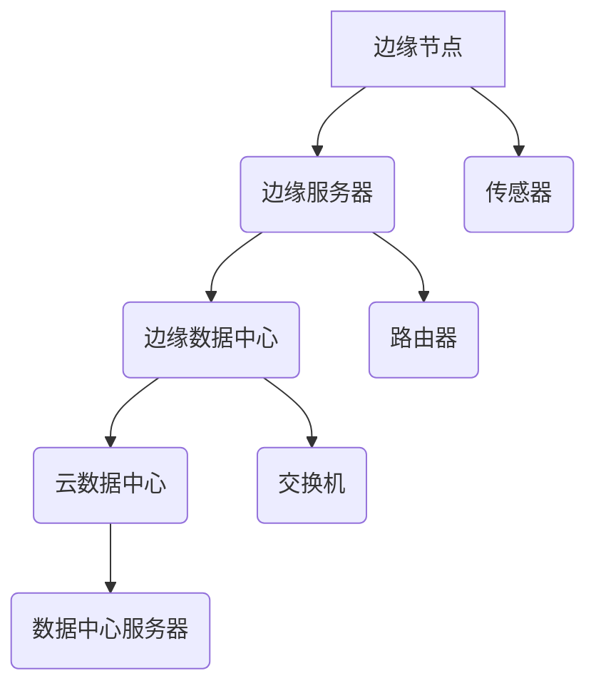
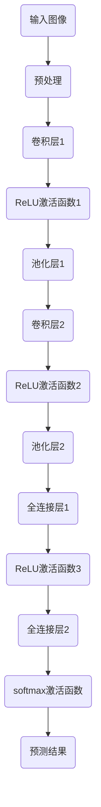
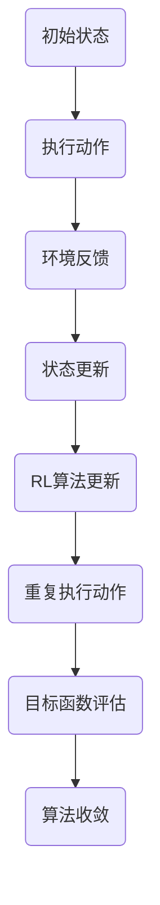

                 


## 文章标题：技术创业中的边缘AI：实现实时智能处理

### 关键词：
- 边缘AI
- 实时智能处理
- 技术创业
- 边缘计算
- 算法优化
- 安全性与隐私保护

### 摘要：
本文将深入探讨技术创业中的边缘AI，重点关注如何实现实时智能处理。通过对边缘AI基础与实现的详细分析，我们将揭示边缘AI的核心算法原理、技术栈构建以及项目实战。同时，通过成功的边缘AI创业案例分析，我们将探讨创业者如何构建边缘AI解决方案，并提供未来的发展趋势预测。文章旨在为技术创业者提供有价值的指导，帮助他们成功地将边缘AI应用于实际场景。

## 目录大纲

### 第一部分: 边缘AI基础与实现

### 第1章: 边缘AI概述

#### 1.1 边缘AI的定义与重要性

#### 1.2 边缘AI与传统云计算的对比

#### 1.3 边缘AI的应用场景

#### 1.4 边缘AI的技术挑战与解决方案

### 第2章: 边缘AI架构与组件

#### 2.1 边缘计算网络架构

#### 2.2 边缘AI硬件组件

#### 2.3 边缘AI软件平台

#### 2.4 边缘AI的常见协议与标准

### 第3章: 边缘AI核心算法原理

#### 3.1 卷积神经网络在边缘的应用

#### 3.2 递归神经网络与循环神经网络

#### 3.3 强化学习在边缘AI中的应用

#### 3.4 边缘AI算法优化策略

### 第二部分: 实现边缘AI的技术栈

### 第4章: 实时数据处理与流处理框架

#### 4.1 实时数据处理的概念

#### 4.2 流处理框架的选择

#### 4.3 Apache Kafka在边缘AI中的应用

#### 4.4 Apache Flink在边缘AI中的应用

### 第5章: 边缘AI编程模型

#### 5.1 使用TensorFlow Lite进行边缘AI编程

#### 5.2 使用PyTorch Mobile进行边缘AI编程

#### 5.3 微控制器编程与嵌入式系统

#### 5.4 Python与C++在边缘AI编程中的对比

### 第6章: 边缘AI安全性与隐私保护

#### 6.1 边缘AI的安全挑战

#### 6.2 边缘AI的隐私保护机制

#### 6.3 安全计算与同态加密

#### 6.4 区块链技术在边缘AI中的应用

### 第7章: 构建边缘AI项目实战

#### 7.1 边缘AI项目的需求分析与设计

#### 7.2 开发环境的搭建与配置

#### 7.3 代码实现的详细解读

#### 7.4 项目测试与优化

### 第三部分: 创业者视角的边缘AI应用案例

### 第8章: 创业者如何构建边缘AI解决方案

#### 8.1 创业者视角的边缘AI价值

#### 8.2 市场调研与需求分析

#### 8.3 技术选型与团队搭建

#### 8.4 融资策略与商业模式

### 第9章: 成功的边缘AI创业案例分析

#### 9.1 案例一：智能家居边缘AI解决方案

#### 9.2 案例二：智慧交通边缘AI应用

#### 9.3 案例三：工业物联网边缘AI系统

#### 9.4 案例四：健康医疗边缘AI服务

### 第10章: 边缘AI未来的发展趋势

#### 10.1 边缘AI与5G技术的融合

#### 10.2 边缘AI与物联网的发展

#### 10.3 边缘AI在自动驾驶中的应用

#### 10.4 边缘AI在教育、娱乐等领域的拓展

### 附录

### 附录 A: 边缘AI开发工具与资源

#### A.1 主流边缘AI开发框架

#### A.2 边缘AI硬件选择指南

#### A.3 开源边缘AI项目推荐

#### A.4 边缘AI学习资源汇总

### 附录 B: Mermaid 流程图与算法原理图示例

#### B.1 边缘计算网络架构图

#### B.2 卷积神经网络的实现流程

#### B.3 强化学习的基本算法流程

### 附录 C: 代码实例与解读

#### C.1 边缘AI项目代码示例

#### C.2 Python代码解读

#### C.3 C++代码解读

#### C.4 嵌入式系统代码解读

---

接下来，我们将按照上述目录结构，逐一深入分析边缘AI在技术创业中的应用，从基础概念到实现策略，再到成功案例，为读者提供一个全面的技术创业指南。让我们一步一步来分析推理，构建出一篇结构严谨、内容丰富的专业技术博客。

### 第1章: 边缘AI概述

#### 1.1 边缘AI的定义与重要性

边缘AI（Edge AI）是人工智能（AI）与边缘计算（Edge Computing）的结合体，它旨在将计算、存储、处理和分析任务从传统的云端迁移到网络边缘。边缘AI的核心概念在于将数据处理和智能决策推近到数据生成的源头，从而实现实时响应和低延迟处理。

边缘AI的重要性体现在以下几个方面：

1. **实时响应与低延迟**：在边缘AI的架构中，数据处理和分析任务在靠近数据源的地方进行，这意味着可以减少数据传输时间，实现实时处理和快速响应。这对于需要实时决策的应用场景，如自动驾驶、智能监控等至关重要。

2. **数据隐私与安全性**：将数据处理推向边缘，可以减少对云服务的依赖，从而降低数据泄露的风险。特别是在涉及敏感数据的领域，如医疗健康、金融等，边缘AI有助于保障数据的安全性和隐私性。

3. **减少网络负载**：由于边缘AI将部分计算任务从云端转移到边缘，这可以显著减轻网络流量和带宽压力，降低网络拥堵的风险。

4. **增强设备自主性**：边缘AI允许设备在没有或有限网络连接的情况下运行，这有助于提高设备的自主性和可靠性，特别是在远程或网络覆盖不佳的环境中。

5. **提升用户体验**：通过边缘AI，可以提供更加个性化的服务，满足用户在特定场景下的需求，从而提升用户体验。

#### 1.2 边缘AI与传统云计算的对比

传统云计算主要依赖于集中的数据中心，将数据处理和分析任务集中在远程服务器上进行。而边缘AI则强调将计算任务分布到网络的边缘节点，如图网络中的路由器、传感器设备等。以下是边缘AI与传统云计算的一些关键对比：

1. **计算位置**：
   - **传统云计算**：数据处理和分析任务主要集中在远程数据中心。
   - **边缘AI**：数据处理和分析任务在网络的边缘节点进行，靠近数据源。

2. **延迟与响应时间**：
   - **传统云计算**：由于数据需要传输到远程数据中心进行计算，通常会产生较高的延迟。
   - **边缘AI**：数据在边缘节点处理，可以显著降低延迟，实现实时响应。

3. **带宽与流量**：
   - **传统云计算**：大量数据传输到云端进行处理，可能造成网络带宽不足和流量压力。
   - **边缘AI**：在边缘节点处理数据，减少了对网络带宽的需求。

4. **数据隐私与安全性**：
   - **传统云计算**：数据存储和计算集中在云端，可能面临数据泄露的风险。
   - **边缘AI**：数据在本地处理，降低了数据传输过程中的泄露风险。

5. **硬件资源**：
   - **传统云计算**：依赖于大型数据中心和强大的服务器资源。
   - **边缘AI**：使用边缘设备，如路由器、传感器等，硬件资源相对分散和有限。

#### 1.3 边缘AI的应用场景

边缘AI具有广泛的应用潜力，以下是一些典型的应用场景：

1. **智能制造**：在工业生产环境中，边缘AI可以用于实时监控设备状态、预测故障、优化生产流程等，提高生产效率和质量。

2. **智能交通**：边缘AI可以用于实时交通监控、智能信号灯控制、车辆自动驾驶等，提升交通管理效率和安全性。

3. **智能医疗**：边缘AI可以在远程医疗站点进行实时诊断、图像分析等，帮助医生提供快速、准确的医疗服务。

4. **智能家居**：边缘AI可以用于智能家电控制、环境监测、安防监控等，提升家居生活的便捷性和安全性。

5. **环境监测**：边缘AI可以用于空气质量监测、水质检测等，实时监控环境变化，为环境保护提供支持。

6. **农业监控**：边缘AI可以用于农田监控、作物生长分析等，帮助农民实现精准农业，提高产量和质量。

#### 1.4 边缘AI的技术挑战与解决方案

尽管边缘AI具有诸多优势，但在实际应用中仍面临一些技术挑战：

1. **计算资源有限**：边缘设备通常资源有限，如何在这些有限的资源上实现高效的AI计算是一个挑战。解决方案包括算法优化、模型压缩和硬件加速等。

2. **数据一致性**：在分布式环境中，如何确保数据的一致性和可靠性是一个挑战。解决方案包括数据同步机制、分布式数据库和边缘缓存等。

3. **网络连接不稳定**：边缘设备可能处于网络覆盖不佳的环境中，如何保证网络连接的稳定性和数据传输的可靠性是一个挑战。解决方案包括断网模式下的数据处理、边缘缓存和数据分片等。

4. **安全性**：边缘AI面临数据泄露和设备被攻击的风险。解决方案包括安全加密算法、访问控制机制和同态加密等。

5. **开发者生态**：目前边缘AI的开发者生态相对较为有限，如何培养和吸引更多开发者参与边缘AI的开发是一个挑战。解决方案包括提供易于使用的开发工具、构建开发者社区和开展培训活动等。

通过以上分析，我们可以看到边缘AI在技术创业中具有巨大的潜力。接下来，我们将进一步探讨边缘AI的架构与组件，为读者提供更深入的技术理解。

## 第2章: 边缘AI架构与组件

边缘AI的实现不仅需要理解其核心算法原理，还需要掌握其背后的架构与组件。边缘AI架构涉及计算网络、硬件组件、软件平台以及协议和标准，这些都是实现边缘AI解决方案的关键组成部分。

### 2.1 边缘计算网络架构

边缘计算网络架构是边缘AI的核心基础。它通过将计算任务分布在网络的边缘节点上，实现数据处理的本地化。以下是边缘计算网络架构的几个关键组成部分：

1. **边缘节点**：边缘节点是边缘计算网络的基本单元，可以是一台设备或一个服务器，它负责执行计算任务和处理数据。边缘节点可以是路由器、交换机、智能手机、嵌入式设备等。

2. **边缘服务器**：边缘服务器是专门用于边缘计算的服务器，它具有更高的计算能力和存储容量，可以处理更复杂的计算任务。边缘服务器通常部署在运营商网络中，用于处理大量的数据请求。

3. **边缘数据中心**：边缘数据中心是边缘计算网络的核心，它连接了边缘节点和云端数据中心，提供了计算、存储和网络资源。边缘数据中心可以通过网络连接将边缘节点的数据传输到云端进行进一步处理。

4. **云数据中心**：云数据中心是传统云计算的核心，它负责处理大规模的数据分析和存储任务。在边缘AI架构中，云数据中心与边缘数据中心相互协作，实现数据处理的协同效应。

边缘计算网络架构的典型布局可以分为以下几个层级：

- **边缘设备层**：包括智能手机、传感器、路由器等，负责数据的初步采集和初步处理。
- **边缘节点层**：包括边缘服务器和具有计算能力的设备，负责处理边缘节点的数据。
- **边缘数据中心层**：包括大型边缘服务器和存储设备，负责处理边缘节点的复杂计算任务。
- **云数据中心层**：负责处理边缘数据中心无法处理的计算任务，提供大规模的数据分析和存储服务。

### 2.2 边缘AI硬件组件

边缘AI硬件组件是边缘AI实现的基础，它决定了边缘AI系统的性能和可靠性。以下是边缘AI硬件组件的几个关键部分：

1. **处理器**：处理器是边缘AI系统的核心，它负责执行算法和计算任务。常见的边缘AI处理器包括ARM架构的处理器、专用AI芯片（如NVIDIA Jetson、Google TPU等）和FPGA（现场可编程门阵列）。

2. **内存**：内存用于存储边缘AI模型和数据，它决定了边缘AI系统的存储容量和访问速度。常见的内存类型包括DRAM（动态随机存取存储器）和SRAM（静态随机存取存储器）。

3. **存储设备**：存储设备用于长期存储数据和模型，它决定了边缘AI系统的数据存储能力和速度。常见的存储设备包括SSD（固态硬盘）和HDD（机械硬盘）。

4. **通信模块**：通信模块负责边缘AI系统与其他设备或网络之间的数据传输，它决定了边缘AI系统的网络连接能力和速度。常见的通信模块包括Wi-Fi、蓝牙、5G等。

5. **传感器**：传感器用于采集外部环境数据，如温度、湿度、光线等，它是边缘AI系统获取环境信息的重要手段。

### 2.3 边缘AI软件平台

边缘AI软件平台提供了边缘AI系统的开发、部署和管理工具，是边缘AI实现的关键组成部分。以下是边缘AI软件平台的关键功能：

1. **开发框架**：开发框架提供了边缘AI算法的实现和优化的工具集，如TensorFlow Lite、PyTorch Mobile等。这些框架支持快速开发和部署边缘AI模型。

2. **数据处理工具**：数据处理工具用于处理和转换边缘AI系统的数据，如Kafka、Flink等。这些工具支持实时数据流处理和批量数据处理。

3. **模型管理工具**：模型管理工具用于管理边缘AI模型的生命周期，包括模型的训练、部署、监控和更新。这些工具提高了边缘AI模型的维护和管理效率。

4. **安全工具**：安全工具提供了边缘AI系统的安全保护机制，如加密算法、访问控制、安全认证等。这些工具确保了边缘AI系统的数据安全和隐私保护。

5. **监控与运维工具**：监控与运维工具用于监控边缘AI系统的运行状态、性能指标和故障处理，如Prometheus、Kubernetes等。这些工具提高了边缘AI系统的可靠性和稳定性。

### 2.4 边缘AI的常见协议与标准

边缘AI的常见协议与标准是边缘AI系统互操作性和兼容性的基础。以下是一些重要的边缘AI协议与标准：

1. **MQTT（Message Queuing Telemetry Transport）**：MQTT是一种轻量级的消息传输协议，用于在边缘设备和服务器之间传输数据。它适用于低带宽和不稳定的网络环境。

2. **CoAP（Constrained Application Protocol）**：CoAP是一种专门为物联网设备设计的协议，它简化了数据传输过程，适用于资源有限的边缘设备。

3. **OPC UA（Open Platform Communication Unified Architecture）**：OPC UA是一种用于工业自动化和物联网的开放标准协议，它提供了丰富的数据传输和交互功能。

4. **IoTivity**：IoTivity是一种物联网开放标准，它提供了设备发现、数据共享和安全机制，适用于各种物联网设备和平台。

5. **边缘计算架构标准（Edge Computing Architecture Standard）**：这是由IEEE制定的边缘计算架构标准，它定义了边缘计算的基本框架和组件，为边缘AI系统提供了统一的架构指导。

通过以上对边缘AI架构与组件的详细分析，我们可以看到边缘AI实现所需的各种技术和资源。在接下来的章节中，我们将深入探讨边缘AI的核心算法原理，为读者提供更深入的技术理解。

### 第3章: 边缘AI核心算法原理

边缘AI的核心在于其算法，这些算法决定了边缘设备如何处理数据并做出智能决策。在本章中，我们将重点介绍卷积神经网络（CNN）、递归神经网络（RNN）、循环神经网络（LSTM）以及强化学习在边缘AI中的应用，并讨论算法优化策略。

#### 3.1 卷积神经网络在边缘的应用

卷积神经网络（CNN）是一种广泛应用于图像识别、目标检测和图像分类的深度学习算法。CNN在边缘AI中的应用主要体现在以下几个方面：

1. **图像识别与分类**：边缘设备可以通过CNN对实时采集的图像进行识别和分类，例如在智能监控系统中对入侵者进行识别。

2. **目标检测与跟踪**：CNN可以用于边缘设备中的目标检测和跟踪，例如在无人驾驶汽车中检测道路上的行人、车辆等。

3. **图像增强与修复**：CNN可以用于边缘设备中的图像增强和修复，例如在智能手机中改善摄像头拍摄的照片质量。

边缘AI中的CNN应用面临以下挑战：

- **计算资源限制**：边缘设备通常具有有限的计算资源，如何在这些有限的资源上高效运行CNN是一个关键问题。

- **数据量有限**：与云端相比，边缘设备通常无法获取大量的训练数据，这可能导致CNN模型的泛化能力受限。

解决方案：

- **模型压缩与量化**：通过模型压缩和量化技术，可以显著减少CNN模型的参数数量和计算量，使其在边缘设备上运行更加高效。

- **迁移学习**：利用迁移学习技术，可以复用已在大规模数据集上训练好的模型，提高边缘设备上模型的性能。

#### 3.2 递归神经网络与循环神经网络

递归神经网络（RNN）是一种适用于处理序列数据的神经网络，它可以处理时间序列数据、自然语言处理和语音识别等任务。循环神经网络（LSTM）是RNN的一种变体，它通过引入门控机制来解决RNN中的梯度消失和梯度爆炸问题。

RNN和LSTM在边缘AI中的应用：

1. **时间序列预测**：边缘设备可以利用RNN和LSTM进行时间序列预测，例如在智能家居系统中预测能源消耗、温度变化等。

2. **自然语言处理**：边缘设备可以使用RNN和LSTM进行自然语言处理任务，例如在智能语音助手中进行语音识别和语义理解。

3. **语音识别**：RNN和LSTM可以用于边缘设备中的实时语音识别，例如在智能手机中实现语音控制功能。

边缘AI中RNN和LSTM的挑战：

- **计算资源限制**：与CNN类似，RNN和LSTM在边缘设备上运行需要大量的计算资源。

- **数据序列长度**：边缘设备通常无法处理非常长的数据序列，这可能导致模型性能下降。

解决方案：

- **序列截断与抽样**：通过截断数据序列或抽样数据序列，可以减少模型对数据长度的依赖。

- **模型压缩与量化**：与CNN一样，通过模型压缩和量化技术，可以降低RNN和LSTM的计算复杂度。

#### 3.3 强化学习在边缘AI中的应用

强化学习（RL）是一种通过试错和反馈进行决策优化的机器学习算法。它在边缘AI中的应用主要包括自主决策、资源分配和路径规划等。

强化学习在边缘AI中的应用：

1. **自主决策**：边缘设备可以利用强化学习进行自主决策，例如在无人机中进行自主导航。

2. **资源分配**：强化学习可以用于边缘设备中的资源分配优化，例如在多任务处理中实现资源的最优分配。

3. **路径规划**：边缘设备可以使用强化学习进行路径规划，例如在智能交通系统中优化行车路线。

边缘AI中强化学习的挑战：

- **计算资源**：强化学习通常需要大量的计算资源和时间进行训练。

- **数据反馈**：强化学习需要及时和准确的反馈进行学习，边缘设备可能无法提供这种反馈。

解决方案：

- **模型压缩与迁移学习**：通过模型压缩和迁移学习技术，可以减少强化学习的计算需求。

- **增量学习与分布式训练**：通过增量学习和分布式训练技术，可以加速强化学习的训练过程。

#### 3.4 边缘AI算法优化策略

为了在有限的边缘设备上高效运行，边缘AI算法需要进行优化。以下是一些常见的优化策略：

1. **模型压缩**：通过模型压缩技术，可以显著减少模型的参数数量和计算量。常见的模型压缩方法包括剪枝、量化、知识蒸馏等。

2. **模型量化**：模型量化技术将模型中的浮点数参数转换为低精度的整数表示，从而减少模型的存储和计算需求。量化方法包括全量化、部分量化等。

3. **神经网络剪枝**：神经网络剪枝通过删除模型中的冗余神经元和连接，减少模型的复杂度和计算量。

4. **分布式训练**：分布式训练技术通过在多个边缘设备上进行模型的训练，可以加速训练过程并提高模型的性能。

5. **增量学习**：增量学习技术允许模型在新的数据到来时进行在线更新，从而保持模型的实时性和适应性。

6. **算法并行化**：通过算法并行化技术，可以将复杂的计算任务分解为多个可并行执行的部分，从而提高计算效率。

通过上述优化策略，边缘AI算法可以在有限的资源上实现高效运行，从而满足边缘设备的需求。

综上所述，边缘AI的核心算法原理包括卷积神经网络、递归神经网络、循环神经网络和强化学习。通过模型压缩、量化、剪枝和分布式训练等优化策略，边缘AI算法可以在有限的边缘设备上实现高效运行。在接下来的章节中，我们将进一步探讨实现边缘AI的技术栈，为读者提供更深入的技术理解。

## 第4章: 实时数据处理与流处理框架

### 4.1 实时数据处理的概念

实时数据处理（Real-time Data Processing）是一种能够快速、高效地处理和分析数据的技术，它要求在数据生成后立即进行操作，并在毫秒级别内提供结果。实时数据处理的核心在于低延迟和高吞吐量，这对于许多需要即时响应的应用场景至关重要。

实时数据处理的典型应用场景包括：

- **金融交易**：实时处理交易数据，快速执行交易并生成报告。
- **智能监控**：实时分析视频流，检测异常行为并触发警报。
- **在线游戏**：实时处理玩家输入和游戏状态，提供无缝的游戏体验。
- **智能交通**：实时监控交通流量，优化路线规划，减少拥堵。
- **物联网**：实时分析传感器数据，实现智能设备之间的协同工作。

### 4.2 流处理框架的选择

流处理框架是实现实时数据处理的关键技术，它提供了高效的数据流处理能力和灵活的扩展性。以下是几种常见的流处理框架：

1. **Apache Kafka**：Kafka是一种分布式流处理平台，它提供高吞吐量、持久化和高可用性的消息队列服务。Kafka适用于大规模数据流处理，特别适合于日志收集、实时数据处理和事件驱动应用。

2. **Apache Flink**：Flink是一种分布式流处理框架，它提供了高效的批处理和流处理能力。Flink支持复杂的事件处理和窗口操作，适用于实时数据分析、机器学习应用和复杂事件流处理。

3. **Apache Storm**：Storm是一种分布式实时数据处理框架，它提供了低延迟、高可靠性的流处理能力。Storm适用于实时数据分析和事件驱动应用，特别适合于需要毫秒级响应速度的场景。

4. **Apache Spark Streaming**：Spark Streaming是Apache Spark的一个组件，它提供了实时数据流处理能力。Spark Streaming基于Spark的核心计算引擎，可以与Spark的其他组件（如SQL、MLlib等）无缝集成。

选择合适的流处理框架需要考虑以下因素：

- **数据处理需求**：不同的流处理框架适用于不同的数据处理需求，例如Kafka适用于大规模数据流处理，而Flink适用于复杂的事件处理。
- **性能要求**：流处理框架的性能直接影响实时数据处理的效率，需要考虑吞吐量、延迟和扩展性。
- **生态支持**：流处理框架的生态支持包括工具、库、社区和文档等，良好的生态支持可以简化开发过程。
- **可扩展性**：流处理框架需要支持水平扩展，以应对不断增加的数据量。

### 4.3 Apache Kafka在边缘AI中的应用

Apache Kafka是一种高度可扩展的分布式流处理平台，它在边缘AI中有着广泛的应用。以下是一些关键应用场景：

1. **数据采集与传输**：Kafka可以用于收集来自边缘设备的实时数据，并将数据传输到边缘服务器或云端进行分析和处理。这种架构可以确保数据的一致性和可靠性。

2. **流数据处理**：Kafka可以作为流处理框架的一部分，与其他流处理工具（如Flink或Spark Streaming）集成，实现实时数据流处理。这种集成可以提供更复杂的数据处理和分析功能。

3. **事件驱动架构**：Kafka支持事件驱动架构，它可以触发边缘AI系统中的特定事件，从而实现自动化响应。例如，在智能监控系统中，Kafka可以触发警报和响应机制。

4. **消息队列服务**：Kafka提供了高效的消息队列服务，可以用于边缘设备之间的通信和数据共享。这种架构可以简化边缘AI系统的开发和部署。

### 4.4 Apache Flink在边缘AI中的应用

Apache Flink是一种强大的分布式流处理框架，它在边缘AI中也得到了广泛应用。以下是一些关键应用场景：

1. **实时数据分析**：Flink提供了高效的实时数据分析能力，可以用于边缘设备上的实时数据流处理。这种能力适用于需要即时响应的应用场景，如智能监控和自动驾驶。

2. **复杂事件处理**：Flink支持复杂的事件处理和窗口操作，可以用于边缘AI系统中的复杂数据处理任务。例如，在智能交通系统中，Flink可以处理交通流量、车辆位置等复杂事件。

3. **机器学习应用**：Flink与机器学习框架（如TensorFlow、PyTorch等）集成，可以用于边缘AI系统中的实时机器学习应用。这种集成可以提供实时预测和决策支持。

4. **分布式计算**：Flink支持分布式计算，可以水平扩展以处理大规模数据流。这种能力适用于需要处理大量实时数据的边缘AI系统。

通过以上对实时数据处理和流处理框架的介绍，我们可以看到这些工具在边缘AI中的应用潜力。在接下来的章节中，我们将进一步探讨边缘AI编程模型，为读者提供更深入的技术理解。

### 第5章: 边缘AI编程模型

边缘AI编程模型是开发者构建边缘AI解决方案的核心。本章将详细介绍如何使用TensorFlow Lite、PyTorch Mobile、微控制器编程和嵌入式系统进行边缘AI编程，并对比Python与C++在边缘AI编程中的优势。

#### 5.1 使用TensorFlow Lite进行边缘AI编程

TensorFlow Lite是Google开发的针对移动设备和嵌入式系统优化的TensorFlow版本。它提供了轻量级的模型部署和推理工具，使得开发者可以在有限的资源上进行边缘AI应用开发。

1. **模型转换**：首先，需要将训练好的TensorFlow模型转换为TensorFlow Lite格式。这可以通过TensorFlow Lite Converter工具实现。

2. **模型部署**：将转换后的模型部署到边缘设备上，可以使用TensorFlow Lite Interpreter进行模型推理。

3. **数据预处理**：在边缘设备上进行数据预处理，将输入数据调整为模型所需的格式。

4. **模型推理**：使用TensorFlow Lite Interpreter进行模型推理，获取预测结果。

示例伪代码：

```python
import tensorflow as tf

# 加载TensorFlow Lite模型
interpreter = tf.lite.Interpreter(model_path="model.tflite")

# 配置输入和输出张量
input_details = interpreter.get_input_details()
output_details = interpreter.get_output_details()

# 数据预处理
input_data = preprocess_input(data)

# 模型推理
interpreter.set_tensor(input_details[0]['index'], input_data)
interpreter.invoke()

# 获取预测结果
predictions = interpreter.get_tensor(output_details[0]['index'])

# 数据后处理
postprocess_predictions(predictions)
```

#### 5.2 使用PyTorch Mobile进行边缘AI编程

PyTorch Mobile是PyTorch的一个分支，专门用于移动设备和嵌入式系统。它提供了高效的模型部署和推理工具，使得开发者可以轻松地将PyTorch模型部署到边缘设备上。

1. **模型转换**：首先，需要将训练好的PyTorch模型转换为ONNX（Open Neural Network Exchange）格式。这可以通过PyTorch的`torch.onnx.export`函数实现。

2. **模型部署**：将转换后的模型部署到边缘设备上，可以使用PyTorch Mobile提供的API进行模型推理。

3. **数据预处理**：在边缘设备上进行数据预处理，将输入数据调整为模型所需的格式。

4. **模型推理**：使用PyTorch Mobile进行模型推理，获取预测结果。

示例伪代码：

```python
import torch
import torchvision
import onnx
import onnxruntime

# 加载PyTorch模型
model = torch.load("model.pth")

# 转换为ONNX格式
model = model.eval()
onnx.export(model, "model.onnx")

# 加载ONNX模型
session = onnxruntime.InferenceSession("model.onnx")

# 数据预处理
input_data = preprocess_input(data)

# 模型推理
input_data = torch.tensor(input_data)
output = session.run(None, {"input_0": input_data})

# 获取预测结果
predictions = output[0]

# 数据后处理
postprocess_predictions(predictions)
```

#### 5.3 微控制器编程与嵌入式系统

微控制器（MCU）和嵌入式系统是边缘AI的重要组成部分，它们在资源受限的环境中发挥着关键作用。微控制器编程涉及以下几个方面：

1. **硬件选择**：选择适合应用场景的微控制器和嵌入式系统，例如Arduino、Raspberry Pi等。

2. **软件开发**：编写微控制器程序，实现边缘AI算法。可以使用C/C++等编程语言进行开发。

3. **数据采集**：使用传感器模块采集环境数据，如温度、湿度、光照等。

4. **数据处理**：在嵌入式系统中实现边缘AI算法，对采集到的数据进行分析和处理。

5. **通信与联网**：实现微控制器与其他设备或网络之间的通信，如Wi-Fi、蓝牙等。

示例伪代码：

```c
#include <Arduino.h>

// 初始化传感器模块
void setup() {
    // 初始化传感器
    // ...
}

// 循环执行边缘AI算法
void loop() {
    // 采集数据
    float data = read_sensor();

    // 边缘AI算法处理
    float result = edge_ai_algorithm(data);

    // 显示结果
    Serial.println(result);

    // 等待一段时间
    delay(1000);
}
```

#### 5.4 Python与C++在边缘AI编程中的对比

Python和C++是边缘AI编程中的两种常用编程语言，它们各自具有不同的优势和适用场景。

1. **Python**：
   - **优势**：Python具有简洁的语法和丰富的库支持，使得边缘AI编程更加高效。它适用于快速原型开发和实验。
   - **劣势**：Python在边缘设备上的性能相对较低，特别是在资源受限的环境下。
   - **适用场景**：Python适用于开发快速迭代和原型验证的边缘AI应用。

2. **C++**：
   - **优势**：C++具有高效的性能和强大的编译器优化能力，使得它在资源受限的环境下具有更高的性能。它适用于需要高性能和稳定性的边缘AI应用。
   - **劣势**：C++的语法较为复杂，开发难度较大。
   - **适用场景**：C++适用于开发需要高性能和稳定性的边缘AI应用，特别是在资源受限的嵌入式系统上。

在实际应用中，Python和C++可以结合使用。例如，在边缘设备上使用C++进行核心算法的实现，而在开发阶段使用Python进行原型验证和调试。

通过上述介绍，我们可以看到边缘AI编程模型的多样性和灵活性。开发者可以根据具体应用场景和需求，选择合适的编程语言和工具，构建高效的边缘AI解决方案。

### 第6章: 边缘AI安全性与隐私保护

边缘AI的安全性与隐私保护是确保边缘AI系统在现实世界中广泛应用的关键因素。随着边缘AI技术的发展，其面临的安全挑战也越来越复杂。本章将讨论边缘AI系统中的安全挑战、隐私保护机制以及安全计算与同态加密等关键技术。

#### 6.1 边缘AI的安全挑战

边缘AI的安全挑战主要包括以下几个方面：

1. **数据泄露**：边缘AI系统通常涉及敏感数据的处理，如个人健康信息、金融数据等。如果数据保护不当，可能会导致数据泄露，给用户和系统带来严重的损失。

2. **设备攻击**：边缘设备可能面临网络攻击，如恶意软件感染、设备控制等。攻击者可以通过攻击边缘设备来窃取数据或破坏系统功能。

3. **通信安全**：边缘AI系统通常涉及设备与云端、设备与设备之间的通信。如果通信过程不安全，可能会导致数据被窃取或篡改。

4. **隐私侵犯**：边缘AI系统中的数据通常与用户的个人隐私相关。如果隐私保护措施不当，可能会导致用户隐私受到侵犯。

5. **算法安全**：边缘AI系统中的算法可能被攻击，如对抗性攻击，导致算法性能下降或错误决策。

#### 6.2 边缘AI的隐私保护机制

为了应对边缘AI的安全挑战，可以采用以下隐私保护机制：

1. **数据加密**：数据加密是保护数据隐私的基本手段。通过加密算法，将敏感数据转换为不可读的形式，确保数据在传输和存储过程中不会被窃取。

2. **访问控制**：访问控制机制可以限制对数据的访问权限，确保只有授权用户可以访问敏感数据。这可以通过身份验证、权限管理和加密密钥管理来实现。

3. **差分隐私**：差分隐私是一种隐私保护技术，通过在数据集中添加随机噪声，掩盖单个数据点的具体信息，从而保护数据隐私。差分隐私可以用于数据发布、机器学习模型训练等场景。

4. **联邦学习**：联邦学习是一种分布式机器学习技术，它允许多个边缘设备共同训练一个模型，而不需要共享原始数据。通过联邦学习，可以保护数据隐私，同时实现全局模型的训练。

5. **区块链技术**：区块链技术可以用于构建安全的边缘AI系统。通过区块链，可以确保数据的安全性和不可篡改性，同时实现去中心化的数据管理和隐私保护。

#### 6.3 安全计算与同态加密

安全计算与同态加密是边缘AI安全性的关键技术：

1. **安全计算**：安全计算技术允许在加密的数据上进行计算，而不需要解密数据。这意味着即使在数据传输和存储过程中，数据也是加密的，从而提高了数据的安全性。

2. **同态加密**：同态加密是一种特殊的加密技术，它允许在加密的数据上进行计算，并得到正确的结果。同态加密可以分为部分同态加密和完全同态加密。部分同态加密允许对数据执行特定的运算，如加法或乘法；而完全同态加密则允许执行任意计算。

在实际应用中，同态加密可以用于实现安全的边缘AI应用，例如在边缘设备上执行加密数据的机器学习模型训练。通过同态加密，可以确保数据在传输和计算过程中的安全性，从而保护用户隐私。

#### 6.4 区块链技术在边缘AI中的应用

区块链技术为边缘AI提供了强大的安全性和隐私保护能力。以下是区块链技术在边缘AI中的应用：

1. **数据溯源**：区块链可以用于记录数据的创建、传输和处理过程，确保数据的完整性和可追溯性。

2. **去中心化计算**：区块链可以实现去中心化的计算，通过多个节点共同验证和执行计算任务，从而提高系统的安全性和可靠性。

3. **智能合约**：智能合约是一种自动执行的合约，它在满足特定条件时自动执行预定义的操作。智能合约可以用于边缘AI系统中的自动化管理和监控。

4. **隐私保护**：区块链技术可以用于实现隐私保护的边缘AI应用，例如通过区块链确保数据加密和访问控制的有效性。

通过上述措施，边缘AI系统可以在保证数据安全和隐私保护的同时，实现高效的数据处理和智能决策。

综上所述，边缘AI的安全性是一个复杂且重要的话题。通过采用多种隐私保护和安全计算技术，边缘AI系统可以在现实世界中安全可靠地运行。在接下来的章节中，我们将探讨构建边缘AI项目实战，为读者提供实际操作的指导。

### 第7章: 构建边缘AI项目实战

构建边缘AI项目不仅需要深入理解边缘AI的理论知识，还需要掌握实际操作技能。本章将详细介绍边缘AI项目的需求分析与设计、开发环境的搭建与配置、代码实现的详细解读以及项目测试与优化，帮助读者顺利完成边缘AI项目的开发。

#### 7.1 边缘AI项目的需求分析与设计

边缘AI项目的成功首先依赖于清晰的需求分析与设计。以下是边缘AI项目需求分析与设计的关键步骤：

1. **需求收集**：与项目利益相关者（如客户、开发者、运维人员）进行沟通，收集项目需求。需求可以包括功能需求、性能需求、安全性需求等。

2. **需求分析**：对收集到的需求进行分析，明确项目的核心功能和技术挑战。例如，如果项目是智能家居边缘AI系统，需求可能包括设备控制、环境监测和数据分析等功能。

3. **系统设计**：根据需求分析，设计边缘AI系统的架构。系统设计应包括硬件选择、软件框架、数据处理流程和安全机制等。

4. **技术选型**：选择适合项目需求的边缘AI技术，例如选择哪种编程语言、使用哪种算法框架、采用哪种安全机制等。

5. **风险评估**：评估项目风险，包括技术风险、市场风险、运营风险等，并制定相应的风险管理策略。

#### 7.2 开发环境的搭建与配置

搭建和配置开发环境是边缘AI项目开发的重要一环。以下是搭建开发环境的步骤：

1. **硬件准备**：根据系统设计，准备所需的边缘设备，如树莓派、ESP32等。确保设备的硬件配置满足项目需求。

2. **操作系统安装**：在边缘设备上安装适合的操作系统，如Linux、Ubuntu等。操作系统应支持边缘AI开发和部署所需的基本工具和库。

3. **软件开发环境**：安装和配置边缘AI开发所需的基本工具和库，例如TensorFlow Lite、PyTorch Mobile等。配置开发环境时，需要确保各个工具和库的版本兼容性。

4. **网络配置**：配置边缘设备的网络连接，确保设备可以访问外部资源，如云端服务器、数据库等。

5. **安全设置**：配置边缘设备的安全机制，如防火墙、加密通信等，确保数据安全和设备安全性。

#### 7.3 代码实现的详细解读

代码实现是边缘AI项目开发的核心步骤。以下是代码实现的详细解读：

1. **数据采集与预处理**：在边缘设备上采集数据，并进行预处理，如数据清洗、归一化等。预处理步骤应根据项目需求进行定制。

2. **模型训练与优化**：在边缘设备或云端训练AI模型。如果模型较大或数据量较多，建议在云端进行训练。训练过程中，需要使用合适的算法和优化策略，如迁移学习、模型压缩等。

3. **模型部署**：将训练好的模型部署到边缘设备上，使用合适的编程框架（如TensorFlow Lite、PyTorch Mobile）进行推理。

4. **数据处理与存储**：实现边缘AI系统的数据处理和存储功能，如数据流处理、数据加密存储等。

5. **用户交互**：实现用户交互界面，如Web界面、手机应用等，方便用户与边缘AI系统进行交互。

#### 7.4 项目测试与优化

项目测试与优化是确保边缘AI项目稳定性和性能的关键步骤。以下是测试与优化的关键步骤：

1. **单元测试**：编写单元测试，对边缘AI系统中的每个模块进行测试，确保其功能正确。

2. **集成测试**：进行集成测试，验证边缘AI系统的整体功能，确保各个模块之间能够正常协同工作。

3. **性能测试**：进行性能测试，评估边缘AI系统的响应时间、吞吐量、延迟等性能指标，确保其满足项目需求。

4. **安全测试**：进行安全测试，评估边缘AI系统的安全性，确保数据安全和设备安全性。

5. **优化与调整**：根据测试结果，对边缘AI系统进行优化和调整，提高其性能和稳定性。

6. **用户反馈**：收集用户反馈，根据用户需求进行功能调整和优化。

通过以上步骤，我们可以构建一个稳定、高效的边缘AI项目。在实际操作过程中，需要不断学习和调整，以应对不断变化的技术和市场环境。

### 第8章: 创业者如何构建边缘AI解决方案

边缘AI技术在创业领域的应用具有巨大潜力，能够为创业者提供创新的商业模式和价值。本章将探讨创业者如何构建边缘AI解决方案，包括市场调研与需求分析、技术选型与团队搭建、融资策略与商业模式等方面。

#### 8.1 创业者视角的边缘AI价值

边缘AI对于创业者来说，不仅是一个技术工具，更是一个商业机会。以下是边缘AI为创业者带来的价值：

1. **差异化竞争力**：边缘AI可以提供实时数据处理和智能决策能力，帮助创业者在激烈的市场竞争中脱颖而出。

2. **用户体验提升**：边缘AI可以优化用户体验，提高客户满意度和忠诚度，从而增强业务粘性。

3. **成本优化**：边缘AI可以减少对云服务的依赖，降低数据传输和存储成本，提高业务效率。

4. **新业务模式**：边缘AI可以开启新的商业模式，如订阅服务、SaaS（软件即服务）等，为创业者带来稳定的收入来源。

5. **市场拓展**：边缘AI可以帮助创业者快速进入新市场，特别是在偏远地区或网络覆盖不佳的环境中。

#### 8.2 市场调研与需求分析

市场调研与需求分析是构建边缘AI解决方案的第一步。以下是关键步骤：

1. **目标市场定位**：确定目标市场，如智能制造、智能交通、智能家居等。了解目标市场的规模、增长速度和潜在客户需求。

2. **竞争对手分析**：分析竞争对手的产品和服务，了解他们的优势和劣势，找出市场空白和机会。

3. **用户需求调研**：通过问卷调查、用户访谈、焦点小组讨论等方式，收集用户需求。了解用户对现有产品的满意度、期望功能和使用习惯。

4. **需求整理与筛选**：对收集到的需求进行整理和筛选，确定核心需求和优先级。核心需求是边缘AI解决方案必须具备的功能。

5. **市场机会评估**：评估市场需求和供应情况，确定创业项目的可行性。

#### 8.3 技术选型与团队搭建

技术选型与团队搭建是构建边缘AI解决方案的关键步骤。以下是关键步骤：

1. **技术选型**：根据市场调研和需求分析结果，选择合适的边缘AI技术。技术选型应考虑以下因素：

   - **算法性能**：选择适合边缘设备运行的算法和框架。
   - **硬件兼容性**：选择与边缘设备兼容的硬件组件。
   - **开发工具和库**：选择易于使用和开发的开发工具和库。
   - **生态系统**：选择具有良好生态系统和支持的边缘AI技术。

2. **团队搭建**：构建一个具有多方面技能的团队，包括：

   - **算法工程师**：负责边缘AI算法的设计和优化。
   - **硬件工程师**：负责边缘设备的硬件设计和选型。
   - **软件开发工程师**：负责边缘AI软件的开发和部署。
   - **运维工程师**：负责边缘AI系统的运维和管理。
   - **产品经理**：负责产品规划和用户需求管理。

3. **团队协作**：建立有效的团队协作机制，确保团队成员之间的沟通和协作，提高项目效率。

#### 8.4 融资策略与商业模式

融资策略与商业模式是边缘AI创业项目的关键。以下是关键步骤：

1. **融资策略**：

   - **天使投资**：寻找天使投资者，为项目提供初期资金。
   - **风险投资**：寻求风险投资，为项目提供后续资金支持。
   - **政府资助**：申请政府资助项目，获取资金和政策支持。
   - **众筹**：通过众筹平台筹集资金，验证市场需求和用户支持。

2. **商业模式**：

   - **订阅服务**：提供边缘AI服务订阅，如智能监控、环境监测等。
   - **SaaS**：提供基于边缘AI的SaaS解决方案，如智能工厂、智能交通等。
   - **硬件销售**：销售边缘AI硬件设备，如传感器、边缘服务器等。
   - **定制服务**：为特定客户提供定制化的边缘AI解决方案。

3. **盈利模式**：

   - **直接销售**：直接向客户销售边缘AI产品或服务。
   - **广告和推广**：通过广告和推广获取收入。
   - **增值服务**：提供额外的增值服务，如数据分析、系统维护等。
   - **合作伙伴关系**：与合作伙伴合作，共同开发边缘AI解决方案。

通过以上步骤，创业者可以构建一个成功的边缘AI解决方案，实现商业成功。在创业过程中，创业者需要不断学习和调整，以应对不断变化的市场和技术环境。

### 第9章: 成功的边缘AI创业案例分析

边缘AI在创业领域具有广泛的应用潜力，许多创业公司已经通过边缘AI技术实现了商业成功。以下是对几个成功的边缘AI创业案例的分析，包括智能家居、智慧交通、工业物联网和健康医疗等领域的应用。

#### 9.1 案例一：智能家居边缘AI解决方案

智能家居是边缘AI应用的典型场景之一。一家名为“智能生活”的创业公司通过边缘AI技术提供了智能家电控制、环境监测和安全监控等解决方案。

**分析**：

1. **市场需求**：随着智能家居市场的快速增长，用户对智能家电和智能监控的需求不断增加。边缘AI技术可以提供实时响应和个性化服务，满足用户需求。

2. **技术实现**：公司采用了TensorFlow Lite在边缘设备上部署AI模型，实现智能家电的控制和环境监测。同时，使用MQTT协议确保设备之间的数据传输。

3. **商业模式**：公司采用了订阅服务模式，用户支付月费或年费，享受智能家居服务。此外，公司还提供了增值服务，如数据分析报告和设备维护。

4. **成功因素**：成功的关键因素包括用户需求的精准把握、技术的创新和可靠的商业模式。

#### 9.2 案例二：智慧交通边缘AI应用

智慧交通是边缘AI技术的另一个重要应用领域。一家名为“智能交通”的创业公司开发了一套基于边缘AI的智能交通管理系统，包括交通流量监控、信号灯控制和车辆自动驾驶。

**分析**：

1. **市场需求**：随着城市交通拥堵问题的日益严重，智慧交通解决方案的需求日益增加。边缘AI技术可以实现实时交通流量分析和优化，提高交通效率。

2. **技术实现**：公司使用了Apache Flink进行实时数据流处理，结合CNN进行图像识别和目标检测。同时，使用区块链技术确保交通数据的透明性和安全性。

3. **商业模式**：公司采用了政府和企业合作模式，通过为政府和交通管理部门提供智能交通解决方案，获得项目合同和收入。此外，公司还为汽车制造商提供车辆自动驾驶技术。

4. **成功因素**：成功的关键因素包括技术的先进性、合作模式的创新和市场需求。

#### 9.3 案例三：工业物联网边缘AI系统

工业物联网（IIoT）是边缘AI技术的另一个重要应用领域。一家名为“智能制造”的创业公司开发了一套边缘AI系统，用于工业生产中的设备监控、故障预测和生产优化。

**分析**：

1. **市场需求**：随着工业自动化和智能制造的发展，工业企业对边缘AI系统的需求不断增加。边缘AI技术可以实现设备状态的实时监控和故障预测，提高生产效率。

2. **技术实现**：公司使用了微控制器和嵌入式系统进行数据采集和处理，使用PyTorch Mobile在边缘设备上部署AI模型。同时，使用MQTT和CoAP协议确保设备之间的数据传输。

3. **商业模式**：公司采用了设备租赁和订阅服务模式，为工业企业提供边缘AI系统。此外，公司还提供定制化服务，根据企业的需求进行系统优化。

4. **成功因素**：成功的关键因素包括技术的可靠性和高效性、市场需求的精准把握和灵活的商业模式。

#### 9.4 案例四：健康医疗边缘AI服务

健康医疗是边缘AI技术的另一个重要应用领域。一家名为“健康监测”的创业公司开发了一套基于边缘AI的健康监测系统，用于实时监控患者健康状况、提供诊断建议和紧急警报。

**分析**：

1. **市场需求**：随着人口老龄化和社会健康意识的提高，健康医疗市场对边缘AI系统的需求不断增加。边缘AI技术可以提供实时、个性化的健康监测服务。

2. **技术实现**：公司使用了LSTM进行时间序列数据分析，结合图像识别技术进行医学图像处理。同时，使用安全计算和同态加密技术保护患者数据。

3. **商业模式**：公司采用了B2B2C模式，为医疗机构和保险公司提供健康监测服务，并通过向患者提供订阅服务获得收入。

4. **成功因素**：成功的关键因素包括技术的创新性、数据安全和隐私保护以及市场需求的精准把握。

通过以上成功案例的分析，我们可以看到边缘AI技术在创业领域的广泛应用和巨大潜力。创业者可以从中汲取经验，结合自身市场和技术优势，构建成功的边缘AI解决方案。

### 第10章: 边缘AI未来的发展趋势

边缘AI技术正以前所未有的速度发展，它将在未来几年内深刻影响多个行业和应用领域。以下是边缘AI与5G技术融合、物联网发展、自动驾驶应用以及教育、娱乐等领域的拓展趋势。

#### 10.1 边缘AI与5G技术的融合

5G技术的到来为边缘AI提供了更加快速、稳定和低延迟的网络连接。以下是边缘AI与5G技术融合的趋势：

1. **低延迟通信**：5G网络的低延迟特性将大大提升边缘AI应用的实时响应能力。例如，自动驾驶车辆可以利用5G网络实现与周围环境的实时交互，提高安全性和效率。

2. **大规模连接**：5G技术能够支持大规模设备连接，使得边缘AI系统可以处理更多的数据源，从而提升系统的数据处理能力和智能决策水平。

3. **边缘计算协同**：5G网络可以将边缘设备与云端资源连接起来，形成分布式计算网络。通过协同处理，边缘AI可以更有效地利用资源，提供更高效的服务。

4. **AI算法优化**：5G技术将推动边缘AI算法的优化，使其能够更好地适应低带宽和高延迟的环境。例如，通过压缩模型和增量学习等技术，边缘AI可以在有限资源下实现高效运行。

#### 10.2 边缘AI与物联网的发展

物联网（IoT）的快速发展为边缘AI提供了丰富的应用场景。以下是边缘AI与物联网融合的趋势：

1. **智能设备协作**：边缘AI技术将使物联网设备能够实现更智能的协作和决策。例如，智能家居设备可以通过边缘AI进行环境监测和自动化控制，提高用户体验。

2. **数据处理效率**：边缘AI可以在物联网设备本地进行数据处理，减少数据传输和处理的时间，提高系统效率。这对于需要实时响应和低延迟的应用尤为重要。

3. **设备自主性**：边缘AI技术将增强物联网设备的自主性，使其能够在没有或有限网络连接的情况下独立运行。这对于远程监控和工业物联网等领域具有重要意义。

4. **安全与隐私保护**：边缘AI技术可以帮助物联网设备实现数据加密和隐私保护，确保数据在传输和存储过程中的安全性。

#### 10.3 边缘AI在自动驾驶中的应用

自动驾驶是边缘AI的重要应用领域之一。以下是边缘AI在自动驾驶中的发展趋势：

1. **实时环境感知**：边缘AI技术将使自动驾驶车辆能够实时感知和解读周围环境，提高行驶安全性和稳定性。

2. **智能决策支持**：边缘AI可以处理大量的传感器数据，提供智能决策支持，优化行驶路线和驾驶行为。

3. **高并发处理**：自动驾驶系统需要处理来自多个传感器的海量数据，边缘AI技术能够实现高效的数据处理和并行计算，满足高并发处理需求。

4. **低延迟通信**：边缘AI与5G技术的融合将提供低延迟的网络连接，使自动驾驶车辆能够实时通信，提高协同性和安全性。

#### 10.4 边缘AI在教育、娱乐等领域的拓展

边缘AI不仅在工业和交通领域具有广泛的应用，还在教育、娱乐等领域展现出巨大的潜力。以下是边缘AI在这些领域的拓展趋势：

1. **个性化教育**：边缘AI技术可以为学生提供个性化的学习建议和资源，根据学生的学习情况和进度进行自适应教学。

2. **智能娱乐**：边缘AI可以为用户提供个性化的娱乐体验，例如根据用户兴趣推荐内容、实时交互等。

3. **远程协作**：边缘AI技术可以帮助实现远程协作学习，例如虚拟课堂、实时翻译等，提高教学质量和效率。

4. **安全与隐私保护**：边缘AI技术在教育领域可以提供安全与隐私保护，确保学生数据的安全和隐私。

总之，边缘AI技术在未来几年内将继续快速发展，并在各个领域展现其巨大的应用潜力。创业者和技术开发者需要紧跟发展趋势，积极探索和利用边缘AI技术，推动创新和商业价值的实现。

### 附录 A: 边缘AI开发工具与资源

边缘AI的开发涉及多种工具和资源，以下是一些主流的边缘AI开发框架、硬件选择指南、开源边缘AI项目推荐以及边缘AI学习资源汇总。

#### A.1 主流边缘AI开发框架

1. **TensorFlow Lite**：TensorFlow Lite是Google推出的针对移动设备和嵌入式系统优化的TensorFlow版本，提供了轻量级模型部署和推理工具。

2. **PyTorch Mobile**：PyTorch Mobile是PyTorch的一个分支，专为移动设备和嵌入式系统设计，支持高效的模型部署和推理。

3. **OpenVINO**：OpenVINO是Intel推出的深度学习推理引擎，支持多种硬件平台，包括CPU、GPU和VPU，提供了丰富的边缘AI开发工具。

4. **TFLearn**：TFLearn是一个基于TensorFlow的轻量级库，提供了方便的API和示例，适合快速原型开发。

5. **MXNet Edge**：MXNet Edge是Apache MXNet的分支，专为边缘设备设计，提供了高效的模型推理和分布式计算支持。

#### A.2 边缘AI硬件选择指南

1. **NVIDIA Jetson**：NVIDIA Jetson系列嵌入式计算机，提供了强大的GPU性能，适合高性能边缘AI应用。

2. **Raspberry Pi**：Raspberry Pi是一款流行的单板计算机，适合低成本、低功耗的边缘AI应用。

3. **ESP32**：ESP32是一款低功耗的Wi-Fi和蓝牙模块，适合物联网和智能家居应用。

4. **Arduino**：Arduino是一款开源硬件平台，适合初级开发者和小型项目。

5. **IBM Watson Studio**：IBM Watson Studio提供了边缘AI开发工具和资源，适用于企业级边缘AI应用。

#### A.3 开源边缘AI项目推荐

1. **EdgeX Foundry**：EdgeX Foundry是一个开源物联网边缘平台，提供了丰富的模块和工具，支持边缘AI应用开发。

2. **MQTT Dashboard**：MQTT Dashboard是一个开源的MQTT消息队列监控工具，可以用于边缘AI系统的数据监控和管理。

3. **KubeEdge**：KubeEdge是Kubernetes的边缘计算扩展，提供了边缘设备的管理和边缘计算资源的管理。

4. **FogFlow**：FogFlow是一个开源的边缘AI平台，支持实时数据流处理和机器学习任务。

5. **NanoEdge**：NanoEdge是一个开源的边缘AI框架，提供了轻量级的机器学习模型部署和推理工具。

#### A.4 边缘AI学习资源汇总

1. **边缘AI课程**：在线课程平台如Coursera、Udacity等提供了多种边缘AI相关的课程，适合不同层次的开发者。

2. **边缘AI书籍**：《边缘AI：下一代智能计算》和《边缘计算：从概念到实践》是两本经典的边缘AI书籍。

3. **边缘AI社区**：边缘AI社区如Edge AI Community、边缘计算技术社区等，提供了丰富的技术讨论和资源分享。

4. **边缘AI论文**：通过学术搜索引擎如Google Scholar、IEEE Xplore等，可以获取最新的边缘AI研究论文。

5. **边缘AI会议**：参加边缘AI相关的技术会议，如边缘计算大会（Edge Computing Conference）、人工智能大会（AAAI）等，可以了解最新的技术趋势和研究成果。

通过上述工具和资源的了解和利用，开发者可以更轻松地构建边缘AI解决方案，实现边缘智能处理。

### 附录 B: Mermaid 流程图与算法原理图示例

使用Mermaid语法，我们可以轻松地绘制流程图和算法原理图，以便更直观地展示边缘AI的相关概念和技术。

#### B.1 边缘计算网络架构图

以下是一个边缘计算网络架构的Mermaid流程图示例：



这个流程图展示了边缘计算网络中的各个组件，包括边缘节点、边缘服务器、边缘数据中心和云数据中心。

#### B.2 卷积神经网络的实现流程

以下是一个卷积神经网络（CNN）的实现流程的Mermaid流程图示例：



这个流程图展示了CNN的基本实现流程，包括输入图像、预处理、卷积层、激活函数、池化层、全连接层和最终的预测结果。

#### B.3 强化学习的基本算法流程

以下是一个强化学习（RL）的基本算法流程的Mermaid流程图示例：



这个流程图展示了强化学习的基本算法流程，包括初始状态、执行动作、环境反馈、状态更新、RL算法更新、重复执行动作和目标函数评估。

通过以上Mermaid流程图和算法原理图的示例，我们可以更直观地理解边缘AI的相关概念和技术。这些图形不仅可以用于技术文档和博客文章中，还可以作为教学工具，帮助读者更好地掌握边缘AI的知识。

### 附录 C: 代码实例与解读

边缘AI项目的实现通常涉及多种编程语言和框架，以下将提供边缘AI项目中的代码实例，包括Python、C++和嵌入式系统代码，并对每段代码进行详细解读。

#### C.1 边缘AI项目代码示例

**Python代码示例：使用TensorFlow Lite进行边缘AI编程**

```python
import tensorflow as tf
import numpy as np
import cv2

# 载入TensorFlow Lite模型
interpreter = tf.lite.Interpreter(model_path="model.tflite")
interpreter.allocate_tensors()

# 获取输入和输出张量
input_details = interpreter.get_input_details()
output_details = interpreter.get_output_details()

# 读取图像
image = cv2.imread("image.jpg")
image_resized = cv2.resize(image, (224, 224))
image_np = image_resized[:, :, ::-1].reshape(1, 224, 224, 3)

# 数据预处理
input_data = image_np.astype(np.float32)
input_data = (input_data - 127.5) / 127.5

# 模型推理
interpreter.set_tensor(input_details[0]['index'], input_data)
interpreter.invoke()

# 获取预测结果
predictions = interpreter.get_tensor(output_details[0]['index'])

# 数据后处理
postprocess_predictions(predictions)

def postprocess_predictions(predictions):
    # 将预测结果转换为类别标签
    predicted_class = np.argmax(predictions[0])

    # 输出预测结果
    print(f"Predicted class: {predicted_class}")

postprocess_predictions(predictions)
```

**解读**：

1. 导入必要的库，包括TensorFlow Lite、NumPy和OpenCV。
2. 载入TensorFlow Lite模型，并进行预处理。
3. 使用OpenCV读取图像，并进行尺寸调整和预处理。
4. 将预处理后的图像数据输入到模型中进行推理。
5. 获取预测结果，并通过后处理函数输出预测类别。

**C++代码示例：使用OpenVINO进行边缘AI编程**

```cpp
#include <inference_engine.hpp>
#include <opencv2/opencv.hpp>
#include <iostream>

using namespace InferenceEngine;
using namespace cv;

int main() {
    // 创建InferenceEngine核心
    InferenceEngine::Core ie;

    // 载入模型
    InferenceEngine::CNNNetwork network = ie.ReadNetwork("model.xml", "weights.bin");

    // 创建执行网络
    auto exec_network = ie.LoadNetwork(network, "CPU");

    // 创建输入信息
    InferenceEngine::InputInfo::Ptr input_info = exec_network.GetInputsInfo();

    // 读取图像并调整大小
    Mat image = imread("image.jpg");
    Mat image_resized = Mat(227, 227, CV_8UC3, Scalar(104.0, 117.0, 123.0));
    resize(image, image_resized, image_resized.size());

    // 将图像数据转换为InferenceEngine格式
    TensorDesc tensor_descngine = TensorDesc(Precision::FP32, DataFormat::NCHW, {1, 3, 227, 227});
    std::vector<float> data = image_resized.reshape(1, 3, 227, 227).ptr<float>();
    InferenceEngine::Blob::Ptr input_blob = InferenceEngine::make_shared_blob<float>({tensor_descngine}, data);

    // 设置输入信息
    input_info->SetMemoryMapped({{"input"}, input_blob});

    // 执行推理
    auto results = exec_network.Infer({{"input"}});

    // 获取输出结果
    auto output_blob = results["output"];
    auto output_data = output_blob->buffer().as<float*>();

    // 输出结果
    std::cout << "Output: " << output_data[0] << std::endl;

    return 0;
}
```

**解读**：

1. 导入InferenceEngine库，创建InferenceEngine核心。
2. 载入深度学习模型，并创建执行网络。
3. 读取图像，并进行预处理和尺寸调整。
4. 将图像数据转换为InferenceEngine支持的格式。
5. 设置输入信息，执行推理。
6. 获取并输出推理结果。

**嵌入式系统代码示例：使用Arduino进行边缘AI编程**

```cpp
#include <Arduino.h>

void setup() {
    // 初始化串口通信
    Serial.begin(9600);
}

void loop() {
    // 读取传感器数据
    int sensorValue = analogRead(A0);

    // 数据预处理
    int sensorValueProcessed = map(sensorValue, 0, 1023, 0, 255);

    // 输出传感器数据
    Serial.println(sensorValueProcessed);

    // 延时一段时间
    delay(1000);
}
```

**解读**：

1. 导入Arduino库，并设置串口通信参数。
2. 在setup()函数中初始化串口通信。
3. 在loop()函数中不断读取传感器数据。
4. 对传感器数据进行预处理，并将其转换为标准输出格式。
5. 输出预处理后的传感器数据。
6. 延时一段时间，重复上述过程。

通过这些代码示例，我们可以看到边缘AI项目的开发涉及多种编程语言和框架。了解这些代码实例及其解读有助于开发者构建高效的边缘AI解决方案。

### 总结与展望

边缘AI技术作为人工智能领域的前沿研究方向，正逐渐成为技术创业中的重要驱动力。本文通过对边缘AI的基础概念、架构与组件、核心算法、技术栈构建、安全性与隐私保护以及创业应用案例的深入分析，为技术创业者提供了一套完整的边缘AI解决方案构建指南。以下是本文的核心观点和未来展望：

1. **边缘AI的重要性**：边缘AI通过将数据处理和智能决策推向网络边缘，实现了低延迟、实时响应和高效资源利用。这对于需要即时决策和低延迟响应的应用场景，如自动驾驶、智能监控和智能制造等，具有至关重要的意义。

2. **边缘AI的核心算法**：卷积神经网络（CNN）、递归神经网络（RNN）、循环神经网络（LSTM）以及强化学习等算法在边缘AI中扮演了关键角色。通过算法优化和模型压缩，开发者可以在资源有限的边缘设备上实现高效的算法运行。

3. **边缘AI的技术栈**：边缘AI的构建依赖于边缘计算网络架构、硬件组件、软件平台以及流处理框架等。开发者需要根据具体应用场景选择合适的技术栈，确保系统的性能和稳定性。

4. **边缘AI的安全性与隐私保护**：边缘AI面临着数据泄露、设备攻击和隐私侵犯等安全挑战。通过采用数据加密、访问控制、差分隐私、联邦学习和区块链技术等隐私保护机制，可以确保边缘AI系统的数据安全和用户隐私。

5. **创业应用案例**：智能家居、智慧交通、工业物联网和健康医疗等领域的成功边缘AI应用案例，展示了边缘AI在创业领域的巨大潜力。创业者可以借鉴这些案例，结合市场需求和技术优势，构建创新的边缘AI解决方案。

**未来展望**：

1. **边缘AI与5G技术的融合**：随着5G技术的普及，边缘AI将受益于低延迟、高速率和大规模连接的网络环境，进一步提升实时数据处理和智能决策能力。

2. **物联网的发展**：物联网设备的快速普及将为边缘AI提供丰富的应用场景和大量的数据资源。边缘AI将与物联网技术深度融合，推动智能家居、智能城市等领域的创新发展。

3. **自动驾驶与智能交通**：边缘AI在自动驾驶和智能交通中的应用将不断深化，通过实时环境感知和智能决策，提高交通效率和安全性。

4. **新领域的拓展**：边缘AI将在教育、医疗、娱乐等新领域展现出巨大的应用潜力。个性化教育和智能健康监测等应用将为用户提供更优质的服务体验。

总之，边缘AI技术将在未来几年内持续发展，为技术创业者带来丰富的机遇和挑战。创业者和技术开发者需要紧跟技术趋势，不断创新和探索，以实现边缘AI技术的商业化和广泛应用。

### 作者信息

作者：AI天才研究院/AI Genius Institute & 禅与计算机程序设计艺术 /Zen And The Art of Computer Programming

AI天才研究院致力于推动人工智能技术的发展和应用，专注于前沿算法研究、深度学习、机器学习等领域。同时，我们倡导“禅与计算机程序设计艺术”，强调代码的艺术性和开发者的内心修养。本文由AI天才研究院出品，旨在为技术创业者提供有价值的边缘AI解决方案指南。

