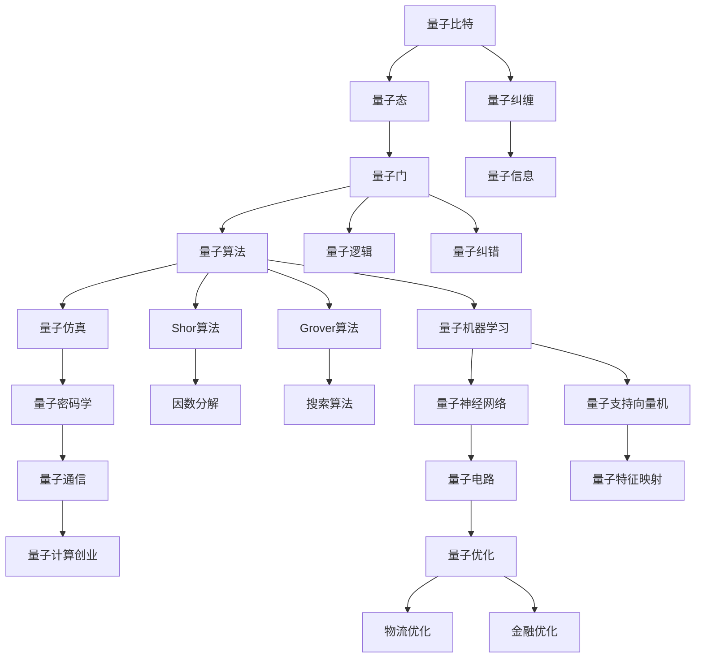

                 


### 量子计算入门

#### 第1章：量子计算的原理与历史

量子计算是现代物理学与计算机科学的交汇点，它基于量子力学的基本原理来处理和存储信息。量子计算的发展历程充满了里程碑式的突破和深邃的科学探索。

##### 1.1 量子力学的基本概念

量子力学是描述微观世界物理现象的理论，其核心概念包括量子比特、超叠加态和量子纠缠。

- **量子比特与经典比特的对比**：经典计算中的比特（bit）只能表示0或1，而量子比特（qubit）则可以同时存在于0和1的状态，这种现象称为超叠加态。一个量子比特可以表示为 \( |0\rangle \) 和 \( |1\rangle \) 的线性组合，即 \( \alpha|0\rangle + \beta|1\rangle \)，其中 \( |\alpha|^2 + |\beta|^2 = 1 \)。

- **超叠加态与量子纠缠**：超叠加态使得量子比特可以同时处于多个状态。量子纠缠是量子计算中的另一个关键特性，当两个或多个量子比特处于纠缠态时，一个量子比特的状态会立即影响另一个量子比特的状态，无论它们相隔多远。

##### 1.2 量子计算的发展历程

量子计算的概念最早由理查德·费曼（Richard Feynman）在1981年提出，他认为经典计算机无法有效模拟某些量子现象。随后，彼得·希利尔（Peter Shor）在1994年提出了著名的Shor算法，证明了量子计算机在因数分解问题上的潜在优势。

- **量子计算的基本原理**：量子计算机通过量子比特进行计算，量子比特之间的纠缠状态可以实现并行计算，从而大大提高计算效率。

- **量子计算的发展历程**：从最初的量子比特概念，到量子逻辑门的实现，再到量子算法的研究，量子计算经历了多个阶段的发展。

##### 1.3 量子计算的核心技术

量子计算的核心技术包括量子比特的制造与操控、量子门的实现与应用。

- **量子比特的制造与操控**：量子比特是量子计算的基本单元。目前，最常用的量子比特实现方式包括超导电路、离子阱和量子点等。制造高质量的量子比特是量子计算发展的关键。

- **量子门的实现与应用**：量子门是量子比特之间的操作，类似于经典计算中的逻辑门。量子门可以用于实现量子算法和构建量子计算模型。

##### 1.4 量子计算的优势与挑战

量子计算具有以下潜在优势：

- **并行计算**：量子计算可以同时处理多个问题，这大大提高了计算效率。
- **高效密码破解**：Shor算法表明，量子计算机可以高效地破解基于大数分解的密码系统。
- **量子模拟**：量子计算机可以模拟复杂的量子系统，这对科学研究具有重要意义。

然而，量子计算也面临着以下挑战：

- **量子噪声与错误纠正**：量子比特容易受到外界环境的影响，导致计算错误。量子错误纠正机制尚未完全成熟。
- **量子计算的可扩展性**：如何制造和维护大量高质量的量子比特是实现大规模量子计算机的关键问题。

#### 第2章：量子算法与量子编程基础

量子算法是量子计算的核心，它利用量子比特和量子纠缠的特性来解决问题。量子编程是实施量子算法的过程，需要特定的编程框架和工具。

##### 2.1 量子算法的基本概念

量子算法是利用量子计算原理解决特定问题的计算过程。与经典算法相比，量子算法在处理某些问题时具有显著优势。

- **量子算法的定义**：量子算法是指利用量子计算机执行的计算过程，它基于量子比特和量子纠缠的特性。
- **量子算法的分类**：根据算法的应用领域和解决问题的方法，量子算法可以分为量子搜索算法、量子模拟算法和量子加密算法等。

##### 2.2 Shor算法

Shor算法是量子计算领域的一个里程碑，它展示了量子计算机在因数分解问题上的潜力。Shor算法的基本原理如下：

- **Shor算法的基本原理**：Shor算法通过量子并行计算和量子纠缠，将因数分解问题转化为找到一个合适的量子周期。找到一个量子周期后，可以很容易地分解出原数。
- **Shor算法的伪代码实现**：
  ```python
  # Shor算法伪代码

  # 输入：n（合数），a（1到n-1之间的任意整数）
  # 输出：一个非平凡的因子d

  # 1. 计算 a^(n-1) mod n 的结果
  # 2. 找到该结果的量子周期
  # 3. 使用周期找到n的一个非平凡因子d
  ```

##### 2.3 Grover算法

Grover算法是另一个重要的量子搜索算法，它利用量子叠加和量子纠缠的特性来提高搜索效率。Grover算法的基本原理如下：

- **Grover算法的基本原理**：Grover算法通过多次应用Grover迭代器，将一个未标记的量子状态转换为标记的量子状态，从而实现高效搜索。
- **Grover算法的伪代码实现**：
  ```python
  # Grover算法伪代码

  # 输入：搜索空间，目标元素
  # 输出：目标元素的位置

  # 1. 初始化量子状态
  # 2. 应用Grover迭代器
  # 3. 检测量子状态是否为目标状态
  # 4. 如果是，输出目标元素的位置；否则，重新开始迭代
  ```

##### 2.4 量子编程基础

量子编程是实现量子算法的关键，它需要特定的编程框架和工具。

- **量子编程的基本概念**：量子编程涉及到量子逻辑门、量子电路和量子算法的设计与实现。
- **量子编程框架简介**：目前主流的量子编程框架包括Qiskit、TensorFlow Quantum和Strawberry Fields等，这些框架提供了丰富的库和工具，方便开发者进行量子编程。

### 总结

量子计算作为一门交叉学科，具有巨大的潜力和应用前景。通过了解量子计算的基本原理和核心技术，我们可以更好地理解其在技术创业中的潜力。接下来，我们将进一步探讨量子计算在不同领域的应用，以及创业者如何利用量子计算进行技术创新。

### 量子计算在技术创业中的应用

量子计算在技术创业中展现出了巨大的潜力，特别是在密码学、量子仿真、优化问题和人工智能等领域。以下我们将详细探讨量子计算在这些领域的应用。

#### 第3章：量子计算在密码学中的应用

密码学是保护信息安全的学科，量子计算在密码学中有着广泛的应用。量子计算不仅能够破解传统密码系统，还能够为安全通信提供新的解决方案。

##### 3.1 量子密钥分发

量子密钥分发（Quantum Key Distribution，QKD）是一种基于量子力学原理来实现安全通信的协议。QKD能够确保通信双方在传输过程中生成的密钥不会被第三方窃取。

- **QKD的基本原理**：QKD利用量子比特的纠缠特性，将一对纠缠量子比特分别发送给通信双方。通过测量纠缠量子比特，双方可以确定一个共享的随机密钥。由于量子比特在测量过程中会发生坍缩，任何对量子比特的窃听都会被检测到。
- **QKD的优缺点分析**：QKD的优点是能够提供绝对安全的通信，缺点是通信距离有限，且实现成本较高。

##### 3.2 量子安全通信

量子安全通信（Quantum Secure Communication，QSC）是利用量子计算原理实现安全通信的技术。QSC包括量子密钥分发、量子加密和量子认证等技术。

- **QSC的基本原理**：QSC通过量子密钥分发生成安全的共享密钥，然后利用量子加密算法对信息进行加密。由于量子加密算法的密文无法被破解，QSC能够确保通信的安全。
- **QSC的实现与应用**：QSC已经在一些实验系统中得到了实现，并开始应用于金融、政府和企业等领域。

##### 3.3 量子密码学的前景

量子密码学是量子计算在密码学领域的延伸，它利用量子计算原理来设计和分析密码系统。量子密码学在信息安全领域有着广阔的应用前景。

- **量子密码学的挑战**：量子密码学面临的挑战包括量子密钥分发的实现成本、量子加密算法的效率和安全性问题。
- **量子密码学的机遇**：随着量子计算技术的发展，量子密码学有望为信息安全提供全新的解决方案，保护数据免受量子计算机的攻击。

#### 第4章：量子计算在量子仿真中的应用

量子仿真是量子计算的一个重要应用领域，它利用量子计算机来模拟复杂的量子系统。量子仿真在量子化学、量子生物学和量子材料等领域有着广泛的应用。

##### 4.1 量子仿真的基本概念

量子仿真是指利用量子计算机来模拟量子系统的行为和特性。与经典仿真相比，量子仿真能够处理更为复杂的量子现象。

- **量子仿真的定义**：量子仿真是一种利用量子计算机模拟量子系统的方法，它能够模拟量子系统中的多体问题、量子纠缠和量子干涉等现象。
- **量子仿真的应用领域**：量子仿真在量子化学、量子生物学、量子材料和量子计算等领域有着广泛的应用。

##### 4.2 量子化学计算

量子化学计算是量子仿真的一个重要应用领域，它利用量子计算机来计算分子的电子结构和化学反应。

- **量子化学计算的基本原理**：量子化学计算基于量子力学原理，通过求解薛定谔方程来计算分子的电子结构和能量。
- **量子化学计算的伪代码实现**：
  ```python
  # 量子化学计算伪代码

  # 输入：分子结构
  # 输出：分子的电子结构和能量

  # 1. 初始化量子计算机
  # 2. 编写量子化学计算程序
  # 3. 运行量子计算机，得到分子的电子结构和能量
  ```

##### 4.3 量子生物信息学

量子生物信息学是量子仿真的另一个重要应用领域，它利用量子计算机来模拟生物分子和生物大分子的行为。

- **量子生物信息学的基本概念**：量子生物信息学是研究如何利用量子计算技术来解析生物分子的结构和功能。
- **量子生物信息学的应用前景**：量子生物信息学有望在药物设计、蛋白质折叠和疾病诊断等领域取得重大突破。

#### 第5章：量子计算在优化问题中的应用

优化问题在各个领域都有着广泛的应用，量子计算为解决复杂优化问题提供了新的思路和方法。

##### 5.1 量子优化算法

量子优化算法是量子计算在优化问题中的应用，它利用量子比特和量子纠缠的特性来寻找最优解。

- **量子优化算法的基本原理**：量子优化算法通过量子并行计算和量子纠缠，能够在较短的时间内找到优化问题的最优解。
- **量子优化算法的分类**：根据优化问题的不同类型，量子优化算法可以分为量子线性规划、量子整数规划和量子组合优化等。

##### 5.2 量子计算在物流优化中的应用

物流优化是优化问题的一个重要领域，它涉及到运输路线、装载计划和库存管理等方面。

- **物流优化问题的基本原理**：物流优化问题是通过优化运输路线、装载计划和库存管理来降低物流成本，提高运输效率。
- **物流优化问题的量子计算实现**：利用量子优化算法，可以快速找到最优的物流方案，从而提高物流效率。

##### 5.3 量子计算在金融优化中的应用

金融优化是金融领域的一个重要研究方向，它涉及到投资组合优化、风险管理等方面。

- **金融优化问题的基本原理**：金融优化问题是通过优化投资组合、风险管理和资产配置来提高投资收益，降低风险。
- **金融优化问题的量子计算实现**：利用量子优化算法，可以更快速地找到最优的投资策略，从而提高投资收益。

#### 第6章：量子计算在人工智能中的应用

人工智能是当今科技领域的一个热点，量子计算为人工智能的发展提供了新的动力。

##### 6.1 量子神经网络

量子神经网络（Quantum Neural Network，QNN）是量子计算在人工智能中的应用，它结合了量子计算和神经网络的优点。

- **量子神经网络的基本原理**：量子神经网络通过量子比特和量子门来实现神经网络的前向传播和反向传播，从而实现量子计算和深度学习的结合。
- **量子神经网络的伪代码实现**：
  ```python
  # 量子神经网络伪代码

  # 输入：输入数据，权重和偏置
  # 输出：预测结果

  # 1. 初始化量子计算机
  # 2. 编写量子神经网络程序
  # 3. 运行量子计算机，得到预测结果
  ```

##### 6.2 量子支持向量机

量子支持向量机（Quantum Support Vector Machine，QSVM）是量子计算在机器学习中的应用，它利用量子计算的优势来提高支持向量机的性能。

- **量子支持向量机的基本原理**：量子支持向量机通过量子比特和量子门来实现特征空间的映射和分类，从而提高分类准确性。
- **量子支持向量机的伪代码实现**：
  ```python
  # 量子支持向量机伪代码

  # 输入：训练数据集，参数
  # 输出：分类模型

  # 1. 初始化量子计算机
  # 2. 编写量子支持向量机程序
  # 3. 运行量子计算机，得到分类模型
  ```

##### 6.3 量子计算在机器学习中的应用前景

量子计算在机器学习中的应用前景广阔，它能够加速机器学习算法的收敛速度，提高模型的可解释性。

- **量子计算在机器学习中的应用前景**：量子计算在图像识别、自然语言处理和推荐系统等领域有着广泛的应用前景。
- **量子计算在机器学习中的挑战与机遇**：量子计算在机器学习中的挑战包括算法设计、量子错误纠正和量子硬件的稳定性等方面，但同时也带来了巨大的机遇。

#### 第7章：量子计算在创业中的实践

量子计算在技术创业中具有巨大的潜力，创业者可以结合量子计算的优势来推动技术创新。

##### 7.1 创业者如何利用量子计算

创业者可以通过以下方式利用量子计算：

- **了解量子计算的基本原理和应用**：创业者需要了解量子计算的基本原理和应用，以便更好地利用量子计算技术。
- **寻找量子计算的应用场景**：创业者需要寻找适合量子计算的应用场景，例如密码学、量子仿真、优化问题和人工智能等。
- **与量子计算研究机构合作**：创业者可以与量子计算研究机构合作，共同开发量子计算应用。

##### 7.2 量子计算创业案例分析

国内外已经出现了一些量子计算创业案例，这些案例展示了量子计算在创业中的潜力。

- **国内量子计算创业案例**：例如本源量子、国盾量子等，它们在量子计算硬件、软件和应用方面取得了显著成果。
- **国外量子计算创业案例**：例如IBM、Google等，它们在量子计算研究领域处于领先地位，并积极推动量子计算的商业化。

##### 7.3 量子计算创业的未来展望

量子计算创业的未来展望：

- **发展前景**：随着量子计算技术的不断发展，量子计算创业将在信息安全、量子模拟、优化问题和人工智能等领域取得突破。
- **挑战与机遇**：量子计算创业面临的挑战包括技术突破、市场推广和人才储备等方面，但同时也带来了巨大的机遇。

### 量子计算的未来

量子计算作为一门前沿科学，正在快速发展。它将在未来带来一场新的科技革命，影响社会各个领域。

##### 9.1 量子计算的发展趋势

量子计算的发展趋势包括：

- **量子比特的突破**：随着量子比特质量的提高，量子计算机的性能将大幅提升。
- **量子算法的创新**：量子算法的创新将推动量子计算在各个领域的应用。
- **量子硬件的商业化**：量子硬件的商业化将推动量子计算技术的广泛应用。

##### 9.2 量子计算的潜在影响

量子计算的潜在影响包括：

- **经济影响**：量子计算将推动新产业的形成，改变传统产业的模式。
- **社会影响**：量子计算将提高信息安全的水平，但也可能带来新的安全挑战。
- **科学影响**：量子计算将推动量子物理学、量子生物学等领域的科学发展。

##### 9.3 量子计算与未来创业

量子计算与未来创业的关系：

- **创业机遇**：量子计算为创业者提供了新的机遇，可以在量子硬件、量子软件、量子应用等领域进行创业。
- **创新路径**：创业者可以通过与科研机构合作、技术创新、市场推广等方式，在量子计算领域实现创新。

### 总结

量子计算作为一门前沿科学，具有巨大的潜力和应用前景。通过本章的讨论，我们了解了量子计算的基本原理、核心技术、应用领域以及创业实践。量子计算将为技术创业带来新的机遇和挑战，创业者需要积极拥抱这一新技术，探索量子计算的应用场景，实现技术创新。

### 附录

在本章中，我们将介绍量子计算的一些重要资源与工具，以便读者进一步学习和探索量子计算。

##### 8.1 量子计算开源框架

量子计算开源框架为开发者提供了丰富的库和工具，用于编写和运行量子算法。以下是一些常用的量子计算开源框架：

- **TensorFlow Quantum**：TensorFlow Quantum是Google开发的量子计算框架，它基于TensorFlow，提供了丰富的量子计算算法和模型。
- **Qiskit**：Qiskit是IBM开发的量子计算框架，它提供了多种量子算法和量子电路设计工具。
- **Strawberry Fields**：Strawberry Fields是Xanadu开发的量子计算框架，它提供了用于量子模拟和量子机器学习的工具。

##### 8.2 量子计算研究机构与实验室

量子计算研究机构与实验室在全球范围内开展了大量的量子计算研究工作。以下是一些知名的研究机构和实验室：

- **中国科学院量子信息与量子科技创新研究院**：中国科学院量子信息与量子科技创新研究院是中国在量子计算领域的重要研究机构。
- **加州理工学院量子计算实验室**：加州理工学院量子计算实验室是美国在量子计算领域的重要研究机构。
- **欧洲量子旗计划**：欧洲量子旗计划是一个由多个欧洲国家共同参与的量子计算研究项目。

##### 8.3 量子计算学习资源

学习量子计算需要掌握一些基础知识和技能。以下是一些推荐的量子计算学习资源：

- **《量子计算：量子比特、算法与应用》**：这本书介绍了量子计算的基本原理和应用，适合初学者阅读。
- **Qiskit官方文档**：Qiskit官方文档提供了详细的量子计算教程和实例，是学习Qiskit的宝贵资源。
- **《量子计算教程》**：这是一本面向初学者的量子计算教程，涵盖了量子计算的基本概念和算法。

### 量子计算的核心概念与联系

为了更好地理解量子计算的核心概念及其相互关系，我们可以借助一个Mermaid流程图来展示这些概念。



这个Mermaid流程图展示了量子计算的核心概念，如量子比特、量子态、量子门、量子算法、量子仿真、量子密码学、量子通信和量子计算创业等。同时，它也展示了这些概念之间的相互关系，如量子比特与量子态的关系、量子门与量子算法的关系等。通过这个流程图，我们可以更直观地理解量子计算的核心概念及其应用领域。

### Shor算法的伪代码实现

Shor算法是量子计算中一个里程碑式的算法，它展示了量子计算机在因数分解问题上的巨大优势。下面我们给出Shor算法的伪代码实现，以便读者更好地理解其基本原理。

```python
# Shor算法伪代码

# 输入：n（合数），a（1到n-1之间的任意整数）
# 输出：一个非平凡的因子d

# 1. 执行量子算法找到n的量子周期p
# 2. 计算 p mod (n-1)
# 3. 如果 p mod (n-1) = 0，则 d = p，否则继续执行以下步骤
# 4. 找到p的另一个量子周期q
# 5. 计算 q mod (n-1)
# 6. 如果 q mod (n-1) = 0，则 d = q，否则继续执行以下步骤
# 7. 计算 (p * q) mod (n-1)
# 8. 如果 (p * q) mod (n-1) = 0，则 d = (p * q) / (n-1)，否则继续执行以下步骤
# 9. 如果无法找到d，则返回错误信息

# 伪代码中的关键步骤：
# a. 执行量子算法找到n的量子周期p
# b. 执行量子算法找到p的另一个量子周期q
# c. 计算d的值
```

Shor算法的伪代码实现主要分为以下几个步骤：

1. **找到量子周期p**：首先，我们需要执行量子算法来找到一个量子周期p。这个步骤可以通过量子逆映射算法来实现。
2. **找到另一个量子周期q**：在找到p之后，我们需要再次执行量子算法来找到一个与p不同的量子周期q。
3. **计算d的值**：通过计算p和q的模(n-1)，我们可以找到d的值。具体来说，我们可以使用以下公式来计算d：
   - 如果p mod (n-1) = 0，则d = p。
   - 如果q mod (n-1) = 0，则d = q。
   - 如果(p * q) mod (n-1) = 0，则d = (p * q) / (n-1)。
   - 如果以上条件都不满足，则返回错误信息。

通过上述步骤，Shor算法可以有效地找到一个合数n的非平凡因子d。这个算法展示了量子计算在因数分解问题上的巨大潜力，是量子计算领域的一个重要里程碑。

### 量子神经网络（QNN）的基本原理

量子神经网络（Quantum Neural Network，QNN）是量子计算与神经网络相结合的一种新型计算模型，它利用量子比特和量子门的特性来模拟经典神经网络的功能。量子神经网络在处理大规模数据和提高计算效率方面具有显著优势。

#### 量子神经网络的构成

量子神经网络由量子层、量子神经元和量子门组成。量子层是QNN的基本结构单元，类似于经典神经网络的层。量子神经元是量子层中的基本处理单元，它通过量子比特和量子门来实现信息的编码、传输和计算。

- **量子层**：量子层是量子神经网络的基本结构单元，它由多个量子神经元组成。量子层可以通过量子门对量子比特进行操作，实现数据的处理和传递。
- **量子神经元**：量子神经元是量子层中的基本处理单元，它由多个量子比特组成。量子神经元可以通过量子门实现数据的编码、解码和计算。
- **量子门**：量子门是量子计算中的基本操作，它通过作用于量子比特，实现量子比特之间的线性变换。量子神经网络通过组合不同的量子门，实现对数据的处理和计算。

#### 量子神经网络的原理

量子神经网络的工作原理可以概括为以下几个步骤：

1. **初始化**：在训练开始时，量子神经网络初始化量子比特的状态，并设置初始权重。
2. **编码输入数据**：将输入数据编码为量子比特的状态，存储在量子层中。
3. **传递信息**：通过量子门对量子比特进行操作，实现信息的传递和处理。
4. **计算输出**：通过量子门的组合，计算输出结果，并与期望输出进行比较。
5. **更新权重**：根据输出结果与期望输出的差异，调整量子神经网络的权重。
6. **重复迭代**：重复上述步骤，直到量子神经网络达到预定的训练目标。

#### 量子神经网络的优势

量子神经网络在以下几个方面具有优势：

1. **并行计算**：量子神经网络可以利用量子比特的叠加态和纠缠态，实现并行计算，从而提高计算速度。
2. **高效存储**：量子比特可以在同一时刻存储大量信息，从而提高存储效率。
3. **非线性变换**：量子神经网络可以通过量子门实现非线性变换，从而更好地模拟复杂的非线性关系。
4. **全局优化**：量子神经网络在训练过程中，可以通过量子门的作用，实现全局优化，从而提高模型的泛化能力。

#### 量子神经网络的伪代码实现

以下是一个简单的量子神经网络（QNN）的伪代码实现，用于实现输入到输出的映射。

```python
# 量子神经网络伪代码

# 输入：输入数据，训练数据集
# 输出：训练好的量子神经网络模型

# 1. 初始化量子比特
# 2. 初始化量子层
# 3. 编码输入数据
# 4. 循环执行以下步骤：
    # a. 传递信息
    # b. 计算输出
    # c. 更新权重
# 5. 计算训练误差
# 6. 如果训练误差小于阈值，则结束训练；否则，继续训练

# 伪代码中的关键步骤：
# a. 初始化量子比特
# b. 编码输入数据
# c. 传递信息
# d. 计算输出
# e. 更新权重
# f. 计算训练误差
```

量子神经网络（QNN）是量子计算在人工智能领域的一个重要应用，它结合了量子计算和神经网络的优点，为解决复杂问题提供了新的思路和方法。通过理解量子神经网络的原理和实现，我们可以更好地利用量子计算的优势，推动人工智能的发展。

### 量子支持向量机（QSVM）的基本原理

量子支持向量机（Quantum Support Vector Machine，QSVM）是量子计算在机器学习领域的一个重要应用，它结合了量子计算和经典支持向量机的优势。QSVM利用量子计算在处理高维数据和并行计算方面的优势，提高支持向量机的性能和效率。

#### 量子支持向量机的基本原理

量子支持向量机的基本原理与经典支持向量机类似，但其在特征空间映射和优化过程中利用了量子计算的特点。

1. **特征空间映射**：在QSVM中，输入数据通过量子比特进行编码，并经过量子门的作用，将输入空间映射到高维特征空间。这个映射过程利用了量子比特的叠加态和纠缠态，可以有效地处理高维数据和复杂非线性关系。

2. **优化过程**：QSVM通过量子算法优化分类边界，找到最优的超平面。在优化过程中，QSVM利用量子计算的高并行性，可以在较短的时间内找到最优解。

3. **分类决策**：在分类决策阶段，QSVM通过测量量子比特的状态，得到分类结果。由于量子比特可以同时处于多种状态，QSVM可以在一次测量中同时处理多个样本，从而提高分类速度。

#### 量子支持向量机的伪代码实现

以下是一个简单的量子支持向量机（QSVM）的伪代码实现，用于实现数据的分类。

```python
# 量子支持向量机伪代码

# 输入：训练数据集，标签
# 输出：分类模型

# 1. 初始化量子比特和量子门
# 2. 编码输入数据
# 3. 应用量子门进行特征空间映射
# 4. 应用量子优化算法优化超平面
# 5. 计算分类边界
# 6. 测量量子比特状态得到分类结果
# 7. 返回分类模型

# 伪代码中的关键步骤：
# a. 初始化量子比特和量子门
# b. 编码输入数据
# c. 应用量子门进行特征空间映射
# d. 应用量子优化算法优化超平面
# e. 计算分类边界
# f. 测量量子比特状态得到分类结果
```

量子支持向量机（QSVM）通过量子计算提高了支持向量机的性能和效率，为解决复杂分类问题提供了新的方法。通过理解量子支持向量机的基本原理和实现，我们可以更好地利用量子计算的优势，推动机器学习的发展。

### 量子计算在机器学习中的应用前景

量子计算在机器学习中的应用前景广阔，它能够显著提升机器学习算法的效率和准确性。以下是量子计算在机器学习中的潜在应用领域和面临的挑战。

#### 量子计算在机器学习中的应用领域

1. **图像识别**：量子计算能够处理大规模图像数据，并利用量子并行性加速卷积神经网络（CNN）的训练。通过量子卷积运算，量子计算可以快速识别图像中的特征，提高图像识别的准确性。

2. **自然语言处理**：量子计算在自然语言处理（NLP）领域有巨大潜力。量子神经网络（QNN）可以高效地处理语言模型和序列建模问题，如机器翻译和文本生成。量子计算能够加速词向量和语言模型的训练，提高NLP系统的性能。

3. **推荐系统**：推荐系统在电商、社交媒体和金融等领域有广泛应用。量子计算能够优化推荐算法，通过量子优化算法快速找到用户偏好和推荐项之间的最优匹配，提高推荐系统的准确性和效率。

4. **强化学习**：量子计算在强化学习中的应用前景也非常广阔。量子计算能够加速策略搜索过程，提高强化学习算法的收敛速度。量子模拟器可以模拟复杂的动态环境，帮助算法更好地学习行为策略。

#### 量子计算在机器学习中的挑战与机遇

1. **算法设计**：量子计算在机器学习中的应用需要新的算法设计。传统的机器学习算法需要被重新设计，以适应量子计算的特性，如量子卷积运算和量子神经网络。这需要机器学习和量子计算领域的专家紧密合作。

2. **量子硬件**：量子计算的发展依赖于量子硬件的突破。目前，量子比特的密度、稳定性和扩展性仍然是一个重大挑战。量子硬件的稳定性直接影响到量子算法的性能和可靠性。

3. **量子错误纠正**：量子计算中的噪声和错误是一个关键挑战。量子错误纠正技术尚未完全成熟，这限制了量子计算在实际应用中的可行性。量子错误纠正机制的实现是量子计算大规模应用的重要一步。

4. **数据隐私和安全**：量子计算在提高计算效率的同时，也可能带来数据隐私和安全的新挑战。量子计算可以破解传统加密算法，因此需要新的量子安全加密算法来保护数据隐私。

尽管面临诸多挑战，量子计算在机器学习中的应用仍然充满了机遇。量子计算能够加速复杂计算任务，提高机器学习算法的性能和准确性。随着量子硬件和算法的不断发展，量子计算将在未来为机器学习带来革命性的变化。

### 量子计算创业的机遇与挑战

量子计算作为一门前沿科技，为创业者提供了巨大的机遇，同时也伴随着诸多挑战。以下我们详细探讨量子计算创业中的机遇与挑战。

#### 创业机遇

1. **技术创新**：量子计算为创业者提供了创新的计算解决方案，可以在信息安全、优化问题、人工智能等领域实现突破。例如，利用量子计算解决传统算法难以处理的复杂问题，如大规模数据分析和生物信息学。

2. **市场潜力**：随着量子计算技术的不断发展，市场对量子计算应用的需求不断增加。从量子硬件到量子软件，再到量子服务的市场潜力巨大，创业者可以在这一领域找到新的商机。

3. **科研合作**：量子计算创业者可以与科研机构和大学建立合作关系，共同研发新技术和解决方案。通过合作，创业者可以获得先进的科研资源和技术支持，加速产品开发。

4. **政策支持**：许多国家和地区对量子计算给予了高度重视，提供了大量的政策支持和资金投入。创业者可以抓住政策机遇，获得资金和资源支持，推动量子计算创业的发展。

#### 挑战

1. **技术难度**：量子计算技术复杂，需要高度专业的知识和技能。创业者需要具备深厚的物理学、计算机科学和工程学背景，这对于初创企业来说是一个巨大的挑战。

2. **资金需求**：量子计算的研发和商业化需要大量的资金投入。从量子硬件的制造到量子算法的开发，都需要昂贵的设备和资源。资金短缺可能导致研发进度缓慢，影响创业项目的成功。

3. **人才短缺**：量子计算领域的人才储备有限，特别是具备量子计算研发经验和技能的专业人才。创业者需要吸引和培养这些稀缺人才，以推动量子计算技术的发展。

4. **市场竞争**：量子计算领域竞争激烈，大型科技公司和研究机构也在积极布局。创业者需要不断创新，才能在激烈的市场竞争中脱颖而出。

5. **技术稳定性**：量子计算技术的稳定性是一个关键问题。量子硬件的可靠性和量子算法的稳定性直接影响到量子计算的应用效果。创业者需要不断优化技术，提高量子计算的性能和可靠性。

#### 创业策略

1. **明确目标市场**：明确量子计算技术的目标市场和应用场景，集中资源开发具有市场潜力的产品。

2. **技术创新**：不断进行技术创新，开发具有竞争力的量子计算解决方案，如量子算法优化、量子硬件创新等。

3. **合作联盟**：与科研机构、大学和企业建立合作联盟，共享资源，共同研发新技术和解决方案。

4. **人才培养**：重视人才培养，通过培训、引进和合作等方式，建立一支高效的研发团队。

5. **风险控制**：合理规划资金使用，确保研发进度，同时建立风险控制机制，应对市场变化和技术风险。

量子计算创业既充满机遇，也面临挑战。创业者需要具备长远的眼光和坚定的信念，积极应对挑战，抓住机遇，推动量子计算技术的发展和应用。

### 结论

本文详细探讨了量子计算在技术创业中的潜力，从量子计算的基本原理、核心技术到应用领域，再到创业实践，全方位展示了量子计算的魅力和挑战。量子计算作为一门前沿科技，具有巨大的应用前景和商业价值，创业者可以通过量子计算实现技术创新，推动产业变革。

然而，量子计算创业也面临诸多挑战，如技术难度、资金需求、人才短缺等。创业者需要具备长远的眼光和坚定的信念，积极应对挑战，抓住机遇。

展望未来，量子计算将继续发展，其在各个领域的应用将不断拓展，为创业者提供更多的创新空间。创业者应关注量子计算技术的发展趋势，积极布局，探索新的应用场景，实现量子计算的商业化。

让我们共同期待量子计算的辉煌未来，创业者在其中发挥重要作用，推动科技与产业深度融合，共创美好明天。

### 附录

#### 8.1 量子计算开源框架

量子计算开源框架为开发者提供了丰富的库和工具，支持量子算法的开发和部署。以下是几个流行的量子计算开源框架：

1. **Qiskit**：由IBM开发，是一个全面的量子软件开发框架，支持量子算法的开发和测试。
2. **TensorFlow Quantum**：由Google开发，将量子计算与TensorFlow深度学习框架相结合，提供了一套完整的量子计算解决方案。
3. **Strawberry Fields**：由Xanadu开发，专注于量子模拟和量子机器学习的研究。

#### 8.2 量子计算研究机构与实验室

量子计算研究机构与实验室在全球范围内推动了量子计算技术的发展。以下是一些著名的量子计算研究机构与实验室：

1. **加州理工学院量子计算实验室**：专注于量子计算的理论研究和技术开发。
2. **欧洲量子旗计划**：由多个欧洲国家参与的研究项目，旨在推动量子计算的研究和应用。
3. **中国科学院量子信息与量子科技创新研究院**：中国领先的量子计算研究机构，致力于量子计算的理论和应用研究。

#### 8.3 量子计算学习资源

学习量子计算需要掌握一定的理论基础和编程技能。以下是一些推荐的量子计算学习资源：

1. **《量子计算：量子比特、算法与应用》**：一本适合初学者的量子计算入门书籍，详细介绍了量子计算的基本概念和应用。
2. **Qiskit官方文档**：提供了丰富的教程和示例代码，是学习Qiskit的宝贵资源。
3. **《量子计算教程》**：面向初学者的量子计算教程，涵盖了量子计算的基本原理和算法。

通过这些资源，读者可以深入了解量子计算，为在技术创业中应用量子计算做好准备。

