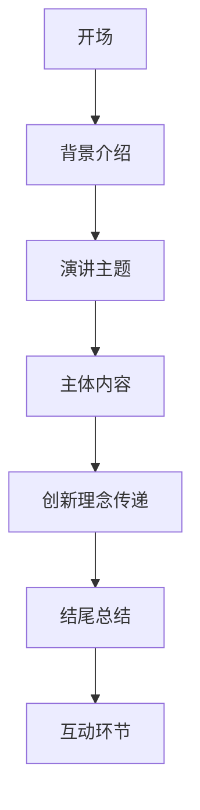

                 

### 文章标题

技术创业的商业演讲技巧：有效传递创新理念

### 关键词

技术创业，商业演讲，创新理念，沟通技巧，演讲框架，故事化，视觉呈现，非语言沟通，互动与提问技巧，数学模型

### 摘要

本文旨在探讨技术创业者如何在商业演讲中有效传递创新理念。通过分析技术创业的现状与挑战，本文提出了商业演讲在技术创业中的重要性。文章详细介绍了技术创业者的沟通障碍，以及商业演讲的核心概念和技巧。通过构建有力的演讲框架、故事化的演讲技巧、视觉呈现的力量、非语言沟通因素以及互动与提问技巧，本文为技术创业者提供了实用的商业演讲策略。同时，通过实战演练和效果评估，本文帮助创业者提升演讲能力，从而在技术创业道路上更加成功。最后，文章总结了最佳实践、注意事项和拓展阅读，为技术创业者的沟通之路提供全面指导。

#### 第一部分：准备与核心概念

##### 1. 引言：技术创业与商业演讲的必要性

在当今快速发展的技术时代，技术创业已经成为推动经济增长和社会进步的重要力量。然而，技术创业并非一帆风顺，创业者面临着诸多挑战。在这个充满竞争的市场中，如何有效传递自己的创新理念，吸引投资者、合作伙伴和用户的关注，成为技术创业者成功的关键。

商业演讲作为企业沟通的重要手段，对于技术创业者来说尤为重要。首先，商业演讲是技术创业者向外界展示自己创新理念、吸引投资的关键途径。通过演讲，创业者可以清晰地阐述自己的产品或服务，展示其独特性和市场潜力。其次，商业演讲有助于创业者建立个人品牌，提升企业的知名度。此外，商业演讲还可以促进创业者与其他行业人士的交流合作，拓展人脉资源。

然而，技术创业者在进行商业演讲时往往面临一些沟通障碍。一方面，技术背景与商业需求之间存在一定的差距，使得技术创业者难以用通俗易懂的语言表达复杂的技术概念。另一方面，许多技术创业者缺乏演讲技巧，导致演讲内容难以引起听众的兴趣和共鸣。因此，提升商业演讲能力成为技术创业者亟需解决的问题。

##### 2. 技术创业者的沟通障碍

技术创业者在沟通中常常遇到以下障碍：

1. **技术背景与商业需求之间的差距**：技术创业者通常拥有深厚的专业知识，但在表达商业理念时，往往难以将其与市场需求相结合。这导致他们在演讲中无法准确传达产品的市场价值和竞争力。

2. **语言表达问题**：技术创业者可能在日常交流中习惯了专业术语，但在商业演讲中，为了吸引更广泛的听众，需要使用简洁明了、通俗易懂的语言。

3. **缺乏演讲技巧**：许多技术创业者缺乏演讲经验，不擅长把握演讲节奏、调动听众情绪，导致演讲效果不佳。

4. **非语言因素的不重视**：演讲中的姿态、表情、语调等非语言因素同样重要，但技术创业者往往忽视这些细节，影响演讲的整体效果。

##### 3. 商业演讲的核心概念

商业演讲的核心概念包括演讲的目的、结构、听众分析等方面。首先，演讲的目的是为了传递信息、建立信任、激发兴趣和推动行动。技术创业者需要明确演讲的目标，以便在有限的时间内有效地传达关键信息。

其次，演讲的结构应包括开场、主体和结尾三个部分。开场要吸引听众的注意力，可以通过引入有趣的故事、提出引人深思的问题或展示引人瞩目的成果来实现。主体部分应围绕演讲主题展开，逻辑清晰、内容丰富，可以使用案例、数据、图表等多种形式来增强说服力。结尾部分则要总结演讲要点，强调产品或服务的价值，并鼓励听众采取行动。

最后，听众分析是商业演讲的关键。技术创业者需要了解听众的背景、需求和兴趣点，以便有针对性地调整演讲内容和风格。通过了解听众的特点，创业者可以更好地设计演讲内容，使其更具吸引力和说服力。

##### 4. 创新理念的有效传递

创新理念是技术创业的核心，如何在商业演讲中有效传递创新理念至关重要。首先，创新理念的定义和特征需要明确。创新理念不仅包括技术创新，还涵盖商业模式、用户体验等多方面的创新。

其次，传递创新理念的方法包括：

1. **故事化**：通过讲述具有启发性和共鸣力的故事，使听众更好地理解创新理念。故事可以包括创业者自身的经历、产品的应用场景或成功案例。

2. **视觉呈现**：利用图表、图片、视频等视觉元素，直观地展示创新理念。视觉元素可以增强演讲的吸引力和说服力。

3. **数据支持**：通过展示数据，证明创新理念的有效性和市场潜力。数据可以包括市场调研结果、实验数据等。

4. **案例分享**：通过分享成功案例，展示创新理念的实际应用和价值。案例可以来自创业者自身的产品或服务，也可以是行业内的其他成功案例。

##### 5. Mermaid流程图：技术创业中的演讲架构

为了更好地展示技术创业中的演讲架构，我们可以使用Mermaid流程图来描述演讲的各个阶段及其核心任务。



在这个流程图中，A代表开场，目的是吸引听众的注意力；B是背景介绍，为演讲主题做铺垫；C是演讲主题，明确演讲的核心内容；D是主体内容，围绕演讲主题展开；E是创新理念传递，展示创业者的核心优势；F是结尾总结，强调演讲要点；G是互动环节，鼓励听众参与和提问。

通过这个流程图，技术创业者可以更好地组织演讲内容，确保演讲结构清晰、逻辑严密，从而提高演讲效果。

##### 6. 总结与引言

在第一部分中，我们探讨了技术创业与商业演讲的必要性，分析了技术创业者的沟通障碍，介绍了商业演讲的核心概念和创新理念的有效传递。同时，通过Mermaid流程图展示了技术创业中的演讲架构。这些内容为技术创业者提供了商业演讲的基础知识，为他们后续提升演讲能力奠定了基础。在接下来的部分中，我们将深入探讨商业演讲的核心技巧，帮助技术创业者更好地传递创新理念。

#### 第二部分：核心技巧

在第一部分中，我们为技术创业者奠定了商业演讲的基础。然而，要成为一名出色的演讲者，仅仅掌握基础概念是不够的。在第二部分中，我们将详细介绍一系列核心技巧，包括构建有力的演讲框架、故事化的演讲技巧、视觉呈现的力量、非语言沟通因素以及互动与提问技巧。通过这些技巧，技术创业者将能够更加有效地传递创新理念，吸引听众的关注和认同。

##### 6. 构建有力的演讲框架

构建一个有力的演讲框架是确保演讲成功的关键。一个良好的演讲框架可以帮助演讲者清晰地传达信息，同时引导听众跟随演讲思路。以下是构建有力演讲框架的步骤：

1. **明确演讲主题**：确定演讲的核心内容，确保主题明确、具体，以便听众能够迅速理解演讲的重点。

2. **设定演讲目标**：明确演讲的目的，包括传递知识、激发兴趣、推动行动等。设定目标可以帮助演讲者有针对性地准备演讲内容。

3. **设计开场**：开场是吸引听众注意力的重要环节。可以使用引人入胜的故事、有趣的事实或引人深思的问题来开场。

4. **构建主体内容**：主体内容是演讲的核心，应包括几个关键部分：
    - **引入背景**：简要介绍相关背景信息，使听众对演讲主题有初步了解。
    - **提出问题**：通过提出问题引发听众的兴趣和思考。
    - **展示解决方案**：详细讲解创新理念或解决方案，使用数据、案例和图表等增强说服力。
    - **总结要点**：在主体内容结束时，总结关键点，确保听众对演讲内容有清晰的认识。

5. **设计结尾**：结尾部分要强调演讲要点，可以使用有力的结论、呼吁行动或提出问题来结束演讲，使听众在离开时仍对演讲内容保持关注。

6. **预留互动环节**：在演讲结束时预留互动环节，鼓励听众提问和参与讨论，有助于加深听众对演讲内容的理解和记忆。

##### 7. 故事化的演讲技巧

故事化是增强演讲吸引力和说服力的有效方法。通过讲述有趣、真实的的故事，演讲者可以更好地传达创新理念，使听众产生共鸣。以下是故事化演讲的技巧：

1. **选择合适的主题**：选择与演讲主题相关的故事，确保故事能够生动地展现创新理念。

2. **构建故事情节**：一个好的故事需要具备起承转合的情节。在演讲中，可以通过以下步骤构建故事情节：
    - **引入**：介绍故事的背景和主角，引起听众的兴趣。
    - **发展**：讲述故事的主要过程，展示主角面临的挑战和问题。
    - **高潮**：讲述主角如何克服困难，实现目标。
    - **结尾**：总结故事，强调演讲主题，使听众产生共鸣。

3. **使用对话和细节**：对话和细节可以增强故事的真实感和吸引力。在讲述故事时，可以适当使用对话来展示角色的性格和情感。

4. **情感共鸣**：通过讲述情感丰富、富有共鸣力的故事，演讲者可以更好地与听众建立情感联系，使演讲更具感染力。

5. **结合视觉元素**：使用图片、视频等视觉元素，可以帮助演讲者更生动地展示故事情节，增强听众的体验。

##### 8. 视觉呈现的力量

视觉呈现是增强演讲效果的另一个重要因素。通过图表、图片、视频等视觉元素，演讲者可以更直观地传达信息，使演讲更加生动有趣。以下是视觉呈现的技巧：

1. **选择合适的视觉元素**：根据演讲内容和目的，选择合适的视觉元素。例如，数据可以用图表展示，场景可以用图片或视频展示。

2. **设计简洁的布局**：确保视觉元素的布局简洁明了，避免过多细节和复杂的设计，以免分散听众的注意力。

3. **使用图表和数据**：图表和数据可以直观地展示信息，增强演讲的说服力。在制作图表时，可以使用直观的图表类型，如柱状图、折线图、饼图等。

4. **结合文字说明**：在视觉元素旁边添加简短的文字说明，帮助听众更好地理解视觉元素所传达的信息。

5. **使用动态元素**：动态元素，如动画、视频等，可以增强演讲的趣味性和互动性，使演讲更加生动。

6. **视觉与内容的匹配**：视觉元素应与演讲内容紧密匹配，避免出现与内容无关的视觉元素，以免干扰听众的理解。

##### 9. 沟通中的非语言因素

非语言因素在沟通中同样重要，它们可以增强演讲的效果，使演讲更具说服力和吸引力。以下是几个重要的非语言因素：

1. **姿态**：自信、开放的姿态可以增强演讲者的可信度。例如，站立时双脚分开与肩同宽，保持自然的肢体动作，避免频繁地摆弄笔或其他物品。

2. **表情**：表情可以传达演讲者的情感和态度。例如，微笑可以增加演讲的亲和力，而严肃的表情可以增强演讲的说服力。

3. **语调**：语调的变化可以增加演讲的节奏感和吸引力。例如，使用抑扬顿挫的语调可以吸引听众的注意力，而适度的停顿可以让听众有时间消化和理解演讲内容。

4. **眼神交流**：与听众保持眼神交流可以增强互动性，使演讲更加生动。例如，扫视整个听众席，与不同区域的听众进行眼神交流。

5. **手势**：适当的手势可以增强演讲的感染力。例如，用手势强调重要观点，或用手势引导听众的注意力。

##### 10. 互动与提问技巧

互动和提问是演讲中的重要环节，它们可以帮助演讲者更好地了解听众的需求和兴趣，增强演讲的吸引力和参与度。以下是互动和提问的技巧：

1. **吸引听众注意力**：在演讲中适当引入互动环节，如提问、讨论或演示等，吸引听众的注意力。

2. **设计开放性问题**：开放性问题可以激发听众的思考和讨论。例如，使用“你认为呢？”或“你有什么想法？”等引导性问题。

3. **鼓励听众参与**：在演讲中鼓励听众参与，如邀请他们分享观点、提出问题或参与演示等。

4. **积极回应**：对听众的提问和参与给予积极的回应，如认真倾听、给予肯定或提出建设性的反馈。

5. **适时引导**：在互动环节中，适时引导听众的讨论方向，确保讨论与演讲主题相关。

6. **总结互动内容**：在互动环节结束时，总结讨论的主要观点，使听众对演讲内容有更深刻的理解。

##### 11. 数学模型和公式讲解：有效传递信息的数学原理

在技术创业的商业演讲中，数学模型和公式是传递信息的重要工具，它们可以帮助听众更好地理解复杂的技术概念。以下是关于如何有效传递数学模型和公式的一些原则和技巧：

1. **逻辑推理与信息传递的关系**：数学模型和公式通过逻辑推理来传递信息。逻辑推理是一种从已知事实出发，通过推理和归纳得出结论的方法。在演讲中，使用逻辑推理可以将抽象的数学概念转化为易于理解的信息。

2. **数学模型的作用**：数学模型是对现实世界问题的抽象和简化，它们可以帮助演讲者更清晰地解释技术原理。例如，线性回归模型可以用来描述两个变量之间的关系，这在产品推荐系统或市场分析中非常有用。

3. **伪代码的应用**：伪代码是一种描述算法逻辑的简明语言，它可以帮助演讲者清晰地解释数学模型的工作原理。例如，在介绍神经网络时，可以使用伪代码来展示前向传播和反向传播的步骤。

    ```python
    # 前向传播
    for each layer in the network:
        output = activation(function(W * input + b))
    # 反向传播
    for each layer in reverse order:
        delta = (output - expected) * activation_derivative(output)
        delta_weight = learning_rate * delta * input
        weights -= delta_weight
    ```

4. **影响听众认知的心理学原理**：听众的认知过程受到多种因素的影响，如注意力的集中度、信息处理能力等。在讲解数学模型和公式时，需要注意这些因素，以便更好地传递信息。例如，通过使用类比和故事来解释复杂的数学概念，可以帮助听众更好地理解和记忆。

5. **示例说明**：提供具体的数学模型和公式的例子，可以帮助听众更好地理解其应用场景。例如，在介绍机器学习算法时，可以展示线性回归模型在预测房价中的应用。

    $$ y = b_0 + b_1 \cdot x $$

    其中，$y$是房价，$x$是影响房价的因素，$b_0$和$b_1$是模型的参数。

6. **互动与提问**：在讲解数学模型和公式时，鼓励听众提问和参与讨论，可以帮助他们更好地理解和消化所学的知识。例如，可以提问听众：“你们认为这个模型有哪些局限性？”或“这个模型在实际应用中遇到了哪些挑战？”

通过上述技巧，技术创业者可以在商业演讲中有效地传递数学模型和公式，帮助听众更好地理解复杂的技术概念。

##### 12. 总结与引言

在第二部分中，我们详细介绍了技术创业商业演讲的核心技巧，包括构建有力的演讲框架、故事化的演讲技巧、视觉呈现的力量、非语言沟通因素以及互动与提问技巧。同时，我们还探讨了如何通过数学模型和公式讲解有效传递信息。这些技巧和方法将为技术创业者提供实用的工具，帮助他们更好地传递创新理念，吸引听众的关注和认同。在接下来的部分中，我们将通过实战演练和案例分析，进一步深化这些技巧的应用，帮助技术创业者提升演讲能力。

#### 第三部分：实战演练

在前两部分中，我们探讨了技术创业商业演讲的核心概念和技巧。然而，理论知识只有通过实践才能真正掌握。在本部分中，我们将通过具体的实战演练和案例分析，帮助技术创业者将所学技巧应用到实际路演和演讲中。我们将详细讨论演讲准备与练习、演讲技巧应用案例以及项目实战：技术创业路演准备。

##### 13. 演讲准备与练习

演讲准备是成功演讲的关键。以下是演讲准备与练习的几个关键步骤：

1. **确定演讲主题和目标**：明确演讲的主题和目标，确保演讲内容有针对性地传达关键信息。例如，如果演讲目标是向投资者展示公司的技术优势，那么演讲内容应重点突出技术创新和市场潜力。

2. **撰写演讲稿**：撰写演讲稿时，要确保内容简洁明了、逻辑清晰。演讲稿应包括开场、主体和结尾三个部分，每个部分都要有明确的主题和要点。

3. **制作演示文稿**：使用演示软件（如PowerPoint、Keynote等）制作演示文稿，确保视觉元素简洁、美观，并能够有效传达信息。演示文稿中的图表、图片和视频等元素应与演讲内容紧密相关。

4. **练习演讲**：在正式演讲前，进行充分的练习。可以请同事或朋友担任听众，模拟演讲场景，以检测演讲效果。练习时，要注意演讲的时间控制、语速、语调和肢体语言等细节。

5. **收集反馈**：在练习演讲后，收集反馈意见，了解听众的反应和建议。根据反馈调整演讲内容和技巧，以提高演讲效果。

##### 14. 演讲技巧应用案例

为了更好地理解如何在实际演讲中应用所学技巧，下面我们将分析两个具体的演讲技巧应用案例：一个成功的演讲案例和一个失败的演讲案例。

**成功的演讲案例：**

案例名称：某人工智能创业公司路演

**演讲背景**：这家初创公司正在寻求融资，希望通过演讲向投资者展示其人工智能技术的优势和市场潜力。

**演讲技巧应用**：

- **构建有力的演讲框架**：演讲者首先介绍了公司的背景和愿景，然后详细讲解了人工智能技术的应用场景和优势。演讲结构清晰，逻辑严谨。

- **故事化的演讲技巧**：演讲者通过讲述公司团队的努力和成果，使听众产生了强烈的共鸣。例如，演讲者讲述了一个关于如何通过人工智能优化物流流程的故事，使听众深刻体会到技术的实际价值。

- **视觉呈现的力量**：演讲者使用了大量的图表、数据和视频，直观地展示了公司的技术实力和市场前景。视觉元素与演讲内容紧密结合，增强了演讲的说服力。

- **互动与提问技巧**：演讲者在演讲过程中积极与听众互动，回答了听众的提问，并邀请听众参与讨论。这种互动使演讲更加生动有趣，增强了听众的参与感。

**演讲效果**：演讲结束后，投资者对公司的技术和市场前景表示了浓厚的兴趣，最终成功获得了融资。

**失败的演讲案例：**

案例名称：某物联网设备公司发布会

**演讲背景**：这家公司发布了一款新的物联网设备，希望通过演讲向市场和投资者展示其创新特点和市场潜力。

**演讲技巧应用**：

- **缺乏有力的演讲框架**：演讲者没有明确地设定演讲主题和目标，导致演讲内容散乱，缺乏逻辑性。

- **缺乏故事化**：演讲者没有通过有趣的故事来展示产品的优势和应用场景，使得演讲内容枯燥乏味。

- **视觉呈现不足**：演讲者使用了少量的图表和数据，视觉元素与演讲内容脱节，未能有效传达信息。

- **互动与提问不足**：演讲者没有与听众互动，回答问题的态度也显得不积极，导致听众的参与度较低。

**演讲效果**：演讲结束后，听众对公司的产品和市场前景反响平平，公司的市场推广效果也不理想。

**案例分析总结**：

通过对比这两个案例，我们可以看到成功演讲与失败演讲之间的差异。成功的演讲注重演讲框架的构建、故事化的表达、视觉呈现的增强以及积极的互动与提问。而失败的演讲则缺乏这些关键要素，导致演讲效果不佳。技术创业者可以从成功案例中学习经验，从失败案例中吸取教训，提升自己的演讲能力。

##### 15. 项目实战：技术创业路演准备

为了帮助技术创业者更好地准备技术创业路演，以下是一个具体的实战步骤：

**项目背景**：某智能医疗设备公司计划在即将举行的技术创业路演中向投资者展示其智能医疗设备的技术优势和市场潜力。

**实战步骤**：

1. **确定路演目标**：明确路演的目标，如获得投资、建立合作伙伴关系或扩大市场份额。

2. **撰写演讲稿**：根据路演目标，撰写演讲稿，确保内容简洁明了、逻辑清晰。演讲稿应包括公司背景、技术优势、市场前景、融资需求等关键信息。

3. **制作演示文稿**：使用演示软件制作演示文稿，确保视觉元素简洁、美观，并能够有效传达信息。演示文稿中的图表、图片和视频等元素应与演讲内容紧密结合。

4. **场景模拟**：邀请同事或朋友模拟路演场景，进行模拟演讲。模拟过程中，注意时间控制、语速、语调和肢体语言等细节。

5. **收集反馈**：在模拟演讲后，收集反馈意见，了解模拟听众的反应和建议。根据反馈调整演讲内容和技巧。

6. **技术准备**：确保演示文稿和演示设备的正常运行，如PPT、投影仪、音频设备等。

7. **练习演讲**：在正式路演前，进行充分的练习，熟悉演讲内容，提高自信心。

8. **路演当天**：提前到达现场，进行最后的准备工作，确保一切就绪。

通过以上实战步骤，技术创业者可以更好地准备技术创业路演，提高演讲的成功率。

##### 16. 代码实际案例与解读

为了更好地展示如何在演讲中运用代码实际案例，以下是一个具体的代码示例及其解读：

**代码示例**：

```python
# 导入必要的库
import numpy as np
import matplotlib.pyplot as plt

# 创建数据集
x = np.array([0, 1, 2, 3, 4, 5])
y = np.array([0, 1, 4, 9, 16, 25])

# 训练线性回归模型
w = np.linalg.lstsq(x[:, np.newaxis], y, rcond=None)[0]

# 绘制数据点和拟合线
plt.scatter(x, y, color='blue')
plt.plot(x, w[0] * x + w[1], color='red')
plt.xlabel('x')
plt.ylabel('y')
plt.title('线性回归模型')
plt.show()
```

**代码解读**：

1. **导入库**：首先，我们导入了NumPy和matplotlib两个库，用于数据处理和绘图。

2. **创建数据集**：接着，我们创建了一个简单的数据集，其中`x`是自变量，`y`是因变量。

3. **训练线性回归模型**：使用`np.linalg.lstsq`函数训练线性回归模型，该函数返回模型参数`w`，其中`w[0]`是斜率，`w[1]`是截距。

4. **绘制数据点和拟合线**：使用matplotlib绘制数据点和拟合线，使听众能够直观地理解线性回归模型的应用。

通过这个代码示例，技术创业者可以在演讲中展示如何使用Python进行数据分析和建模，从而增强演讲的实用性和专业性。

##### 17. 最佳实践 tips

为了确保技术创业者在商业演讲中能够更加成功，以下是一些建议和最佳实践：

1. **提前准备**：演讲前务必进行充分的准备工作，包括撰写演讲稿、制作演示文稿和进行模拟演讲。

2. **了解听众**：在演讲前了解听众的背景、需求和兴趣点，以便有针对性地调整演讲内容和风格。

3. **简明扼要**：演讲内容要简洁明了，避免使用过于复杂的专业术语，使听众能够轻松理解。

4. **故事化表达**：使用故事化的方式传达创新理念，增加演讲的吸引力和说服力。

5. **视觉呈现**：使用图表、图片和视频等视觉元素，使演讲更加生动有趣。

6. **互动与提问**：积极与听众互动，鼓励提问和参与讨论，提高听众的参与度和记忆效果。

7. **练习演讲**：在正式演讲前进行充分的练习，熟悉演讲内容，提高自信心。

8. **注意非语言因素**：姿态、表情、语调和眼神交流等非语言因素同样重要，它们可以增强演讲的效果。

9. **收集反馈**：演讲后收集听众的反馈意见，了解演讲的优点和不足，以便不断改进。

通过遵循这些最佳实践，技术创业者可以显著提升商业演讲的效果，更好地传递创新理念。

##### 18. 小结

在第三部分中，我们通过实战演练和案例分析，深入探讨了技术创业商业演讲的核心技巧和实际应用。我们详细介绍了演讲准备与练习、演讲技巧应用案例以及项目实战：技术创业路演准备。同时，我们通过代码实际案例与解读，展示了如何将技术实际应用到演讲中。通过这些实践，技术创业者可以更好地准备和进行商业演讲，从而有效传递创新理念，吸引听众的关注和认同。在接下来的部分中，我们将讨论演讲效果评估方法和持续改进与职业发展，帮助技术创业者不断提升演讲能力。

#### 第四部分：评估与改进

在技术创业的商业演讲中，评估演讲效果是确保持续改进和提升演讲能力的关键环节。通过科学的方法评估演讲效果，技术创业者可以了解演讲的优势和不足，进而有针对性地进行调整和优化。以下是演讲效果评估的方法和持续改进与职业发展的策略。

##### 19. 演讲效果评估方法

1. **听众反馈**：听众反馈是评估演讲效果的重要手段。可以通过以下方式收集听众反馈：
    - **问卷调查**：在演讲结束后，发放问卷，询问听众对演讲内容的理解程度、演讲者的表现以及演讲的总体满意度。
    - **口头反馈**：鼓励听众在演讲结束后提出问题或分享感受，直接了解他们的看法。
    - **在线反馈**：利用社交媒体、电子邮件等方式收集听众的在线反馈。

2. **演讲评分系统**：建立一套评分系统，对演讲的各个方面进行量化评估，如内容丰富度、逻辑性、表达能力、互动性等。评分系统可以采用五分制或百分制，确保评估标准明确、客观。

3. **视频回放**：录制演讲视频，事后观看回放，分析演讲中的优点和不足。注意观察肢体语言、语调、表情等方面，了解自己是否有效地传达了信息。

4. **数据分析**：分析演讲后的数据，如观众数量、参与互动的人数、社交媒体分享次数等。这些数据可以反映演讲的吸引力和影响力。

##### 20. 持续改进与职业发展

1. **学习与培训**：持续学习和参加培训是提升演讲能力的重要途径。可以参加演讲培训班、阅读相关书籍和文章，学习最新的演讲技巧和趋势。

2. **模拟练习**：定期进行模拟练习，模拟真实的演讲场景，提高应对突发事件和压力的能力。练习过程中，可以邀请同事或朋友担任听众，进行反馈和改进。

3. **观看优秀演讲**：观看优秀的商业演讲视频，学习优秀演讲者的表现和技巧。可以关注行业专家、成功创业者的演讲，了解他们的演讲风格和内容设计。

4. **反思与总结**：每次演讲后，进行反思和总结，分析成功和失败的原因。记录演讲过程中的亮点和不足，制定改进计划，并在下一次演讲中实施。

5. **职业规划**：将演讲能力作为职业发展的一部分，设定长期和短期目标。可以通过参加行业会议、研讨会等活动，扩大人脉资源，提升职业影响力。

通过以上方法和策略，技术创业者可以不断提高演讲效果，实现职业发展的目标。

##### 21. 总结

在第四部分中，我们讨论了演讲效果评估方法和持续改进与职业发展的策略。通过听众反馈、演讲评分系统、视频回放和数据分析等方法，技术创业者可以准确评估演讲效果，发现优势和不足。同时，通过学习与培训、模拟练习、观看优秀演讲和反思总结等策略，技术创业者可以不断提升演讲能力，实现职业发展的目标。在技术创业的道路上，有效的商业演讲是传递创新理念、吸引投资者和合作伙伴的关键。通过不断评估和改进，技术创业者可以更好地应对挑战，实现企业的长期成功。

#### 附录

##### 22. 常用工具与资源

为了帮助技术创业者在商业演讲中更好地准备和展示，以下是常用工具和资源的推荐：

1. **演示软件**：
    - PowerPoint（微软）
    - Keynote（苹果）
    - Google Slides（谷歌）

2. **绘图工具**：
    - Lucidchart（在线流程图和图表制作工具）
    - draw.io（免费的在线绘图工具）
    - Visio（微软）

3. **演讲培训资源**：
    - TED演讲（观看优秀演讲者的演示技巧）
    - 《演讲的力量》（作者：克里斯·安德森）
    - 公共演讲课程（在线课程平台，如Coursera、Udemy等）

4. **数据可视化工具**：
    - Tableau（数据可视化平台）
    - D3.js（Web上交互式数据可视化库）
    - Matplotlib（Python数据可视化库）

5. **代码演示工具**：
    - PyCharm（Python集成开发环境）
    - Jupyter Notebook（交互式开发环境）
    - Repl.it（在线编程环境）

通过使用这些工具和资源，技术创业者可以更加高效地准备和展示商业演讲，提升演讲的质量和效果。

##### 23. 拓展阅读

为了进一步深入探讨技术创业的商业演讲技巧，以下是几本推荐的相关书籍和文章：

1. **书籍**：
    - 《影响力：说服的心理学》（作者：罗伯特·西奥迪尼）
    - 《演讲的力量》（作者：克里斯·安德森）
    - 《掌控谈话：如何实现有效沟通》（作者：杰瑞·魏斯）

2. **文章**：
    - 《如何在5分钟内打动听众？》（作者：Mike Monteiro）
    - 《如何用故事讲述你的创业之路》（作者：李笑来）
    - 《视觉呈现的力量：如何用图表和数据增强演讲效果》（作者：Stephen Few）

3. **网站和博客**：
    - TED官网（ted.com）
    - 快公司（fastcompany.com）
    - 讯飞博客（xufei1234567890.github.io）

通过阅读这些书籍、文章和访问相关网站，技术创业者可以获取更多的灵感和方法，进一步提升商业演讲能力。

##### 结语：技术创业者的沟通之路

技术创业是一条充满挑战和机遇的道路。在这条道路上，商业演讲是传递创新理念、吸引投资者和合作伙伴的重要手段。通过掌握有效的演讲技巧，技术创业者可以更好地展示自己的创新成果，实现企业的长期发展。

本文从准备与核心概念、核心技巧到实战演练和评估改进，全面探讨了技术创业的商业演讲技巧。通过构建有力的演讲框架、故事化的表达、视觉呈现的力量、非语言沟通因素以及互动与提问技巧，技术创业者可以提升演讲效果，有效传递创新理念。

在技术创业的道路上，沟通是关键。通过不断学习和实践，技术创业者可以不断提升自己的演讲能力，成为出色的沟通者。让我们共同努力，在技术创业的舞台上闪耀光芒，实现企业的辉煌。

