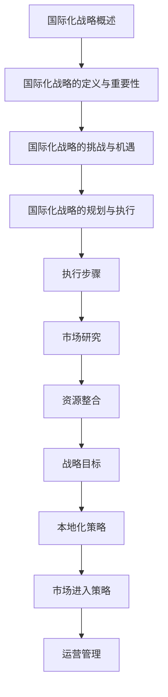
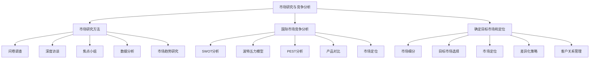
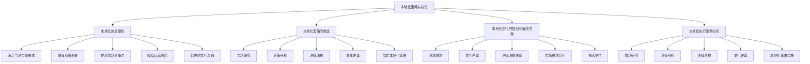
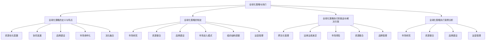
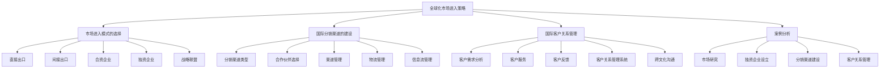
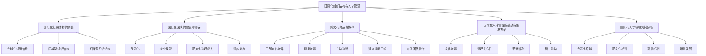
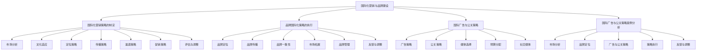
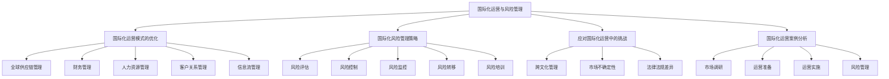
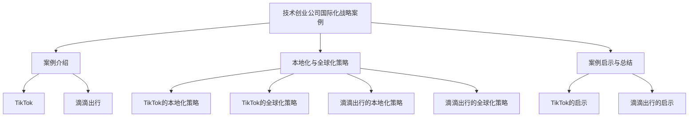
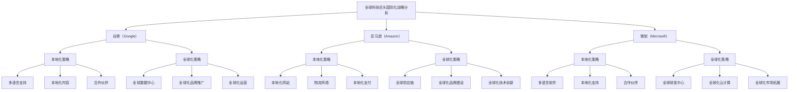

                 

### 文章标题

《技术创业的国际化战略：本地化与全球化策略的平衡艺术》

### 关键词

- 国际化战略
- 本地化
- 全球化
- 技术创业
- 市场进入策略
- 品牌建设

### 摘要

本文旨在探讨技术创业公司在全球范围内的国际化战略，分析本地化与全球化策略的平衡艺术。首先，通过定义国际化战略，阐述其重要性和面临的挑战。接着，详细探讨市场研究与竞争分析、本地化策略与执行、全球化策略与执行，包括市场进入策略、国际化组织结构与人才管理、国际化营销与品牌建设、国际化运营与风险管理。最后，通过案例研究和全球科技巨头国际化战略分析，提供实践启示和总结，帮助创业公司制定有效的国际化战略。

## 文章标题：技术创业的国际化战略：本地化与全球化策略的平衡艺术

技术创业公司正面临着前所未有的全球化机遇。随着互联网的普及和数字化转型的加速，技术创业公司不再局限于本土市场，而是瞄准国际市场，寻求更广阔的发展空间。然而，国际化并非易事，如何在本地化与全球化之间找到平衡点，成为技术创业公司成功的关键。

### 文章关键词

- 国际化战略
- 本地化
- 全球化
- 技术创业
- 市场进入策略
- 品牌建设

### 文章摘要

本文首先从国际化战略的定义和重要性入手，探讨其在技术创业公司中的关键作用。随后，深入分析市场研究与竞争分析、本地化策略与执行、全球化策略与执行，包括市场进入策略、国际化组织结构与人才管理、国际化营销与品牌建设、国际化运营与风险管理。通过具体案例研究和全球科技巨头国际化战略分析，本文为技术创业公司提供实践启示和战略建议，帮助他们成功实现国际化。

## 第1章：国际化战略概述

### 1.1 国际化战略的定义与重要性

国际化战略是指企业通过拓展海外市场，实现全球业务布局的发展策略。对于技术创业公司而言，国际化战略尤为重要。首先，它有助于企业突破地域限制，获取更多的市场份额。其次，国际化战略能够帮助企业吸取全球顶尖技术，提升自身竞争力。此外，国际化战略还能够为企业带来多样化的客户群体，降低市场风险。

在全球化背景下，技术创业公司面临的挑战和机遇并存。挑战包括跨国文化差异、市场不确定性、法律法规差异等。而机遇则包括广阔的市场空间、先进的技术资源、多元化的合作伙伴等。因此，制定和实施有效的国际化战略，对于技术创业公司来说至关重要。

### 1.2 国际化战略的挑战与机遇

**挑战：**

1. **文化差异**：跨国文化差异可能导致沟通障碍、团队合作困难等问题。
2. **市场不确定性**：海外市场的不确定性较大，需要企业具备较强的风险控制能力。
3. **法律法规差异**：不同国家和地区的法律法规存在差异，企业需要了解并遵守当地法律法规。

**机遇：**

1. **市场份额**：海外市场广阔，技术创业公司可以通过国际化战略获取更多的市场份额。
2. **技术资源**：全球范围内的技术资源可以为企业提供更多创新机会。
3. **合作伙伴**：国际化战略可以帮助企业找到具有互补优势的合作伙伴。

### 1.3 国际化战略的规划与执行

**规划：**

1. **市场研究**：深入了解目标市场的需求、竞争态势、法律法规等。
2. **资源整合**：整合企业内部资源和外部资源，为国际化战略的实施提供支持。
3. **战略目标**：明确国际化战略的目标，如市场份额、技术突破、品牌建设等。

**执行：**

1. **本地化策略**：根据目标市场的特点，制定相应的本地化策略。
2. **市场进入策略**：选择合适的市场进入模式，如直接投资、合资、并购等。
3. **运营管理**：建立国际化的运营管理体系，包括供应链管理、财务管理、人力资源管理等。

### 总结

国际化战略是技术创业公司走向全球市场的关键。通过有效规划与执行，企业可以克服挑战，抓住机遇，实现全球业务布局。

### Mermaid 流程图



### 核心概念与联系

- **国际化战略**：企业拓展海外市场的发展策略，包括本地化与全球化两个方面。
- **本地化策略**：根据目标市场的特点，调整产品、服务、营销策略等。
- **全球化策略**：在全球范围内进行业务布局，实现资源共享和协同发展。

### 本地化策略与全球化策略的关系

本地化策略与全球化策略之间存在密切的联系。本地化策略是企业针对特定市场的调整，以确保产品和服务符合当地需求。而全球化策略则是在全球范围内实现业务布局，通过整合资源和协同发展，提高企业的国际竞争力。

### 伪代码讲解

```python
def international_strategy():
    # 市场研究
    market_research()

    # 资源整合
    resource_integration()

    # 制定战略目标
    set_strategic_objectives()

    # 实施本地化策略
    implement_localization_strategy()

    # 选择市场进入模式
    select_market_entry_model()

    # 建立运营管理体系
    establish_operations_management_system()

# 市场研究
def market_research():
    # 收集市场数据
    collect_market_data()

    # 分析竞争态势
    analyze_competition()

    # 了解法律法规
    understand_legal_requirements()

# 资源整合
def resource_integration():
    # 整合内部资源
    integrate_internal_resources()

    # 寻找合作伙伴
    find_partners()

# 制定战略目标
def set_strategic_objectives():
    # 确定市场份额目标
    set_market_share_objectives()

    # 确定技术突破目标
    set_technological_breakthrough_objectives()

    # 确定品牌建设目标
    set_brand_building_objectives()

# 实施本地化策略
def implement_localization_strategy():
    # 调整产品与服务
    adjust_products_and_services()

    # 调整营销策略
    adjust_marketing_strategies()

# 选择市场进入模式
def select_market_entry_model():
    # 直接投资
    direct_investment()

    # 合资
    joint_venture()

    # 并购
    acquisition()

# 建立运营管理体系
def establish_operations_management_system():
    # 供应链管理
    supply_chain_management()

    # 财务管理
    financial_management()

    # 人力资源管理
    human_resource_management()
```

### 数学模型和公式

在国际化战略中，可以使用一些数学模型和公式来评估市场潜力和竞争优势。以下是一个简单的例子：

- **市场潜力公式**：

  $$\text{市场潜力} = \frac{\text{市场规模} \times \text{市场增长率}}{\text{竞争者数量}}$$

- **竞争优势公式**：

  $$\text{竞争优势} = \frac{\text{差异化优势} + \text{成本优势} + \text{服务质量}}{3}$$

其中，差异化优势、成本优势和服务质量都是根据具体情况进行评估的指标。

### 举例说明

假设一家技术创业公司想要进入欧洲市场，以下是市场潜力和竞争优势的计算过程：

- **市场潜力**：

  $$\text{市场潜力} = \frac{100 \text{亿欧元} \times 5\%}{10} = 50 \text{百万欧元}$$

- **竞争优势**：

  $$\text{竞争优势} = \frac{8 + 6 + 9}{3} = 7.67$$

通过这些计算，公司可以更好地了解欧洲市场的潜力和竞争优势，从而制定相应的国际化战略。

### 总结

国际化战略是技术创业公司走向全球市场的重要策略。通过市场研究、资源整合、战略目标制定、本地化策略实施、市场进入模式选择和运营管理体系建立，企业可以克服挑战，抓住机遇，实现全球业务布局。

## 第2章：市场研究与竞争分析

### 2.1 市场研究方法

市场研究是国际化战略的重要基础，对于技术创业公司来说尤为重要。有效的市场研究可以帮助企业深入了解目标市场的需求、竞争态势和法律法规，从而制定出合适的国际化战略。以下是一些常用的市场研究方法：

1. **问卷调查**：通过设计问卷，收集目标市场用户的反馈和意见，了解他们的需求和偏好。
2. **深度访谈**：与目标市场的关键利益相关者进行深入访谈，获取他们对市场、产品、服务等方面的见解和建议。
3. **焦点小组**：邀请一组目标市场的代表，就某一主题进行讨论，从中获取群体意见和市场洞察。
4. **数据分析**：利用数据分析工具，对市场数据进行分析，识别市场趋势和用户行为。
5. **市场趋势研究**：通过研究市场趋势，了解未来市场的发展方向和潜在机会。

### 2.2 国际市场竞争分析

在国际市场竞争中，技术创业公司需要了解和分析竞争对手的优势和劣势，以便制定有效的竞争策略。以下是一些竞争分析的方法：

1. **SWOT分析**：通过分析竞争对手的优势（Strengths）、劣势（Weaknesses）、机会（Opportunities）和威胁（Threats），了解其在市场中的地位和竞争力。
2. **波特五力模型**：利用波特五力模型，分析竞争对手在市场中的影响力，包括供应商、客户、潜在竞争者、替代品和现有竞争者。
3. **PEST分析**：通过分析竞争对手在政治（Political）、经济（Economic）、社会（Social）和技术（Technological）等方面的影响，了解其在市场中的竞争优势。
4. **产品对比**：对比竞争对手的产品特性、价格、性能、服务等方面，识别差异化和竞争优势。
5. **市场定位**：分析竞争对手的市场定位，了解其在目标市场中的角色和地位。

### 2.3 确定目标市场和定位

在国际化过程中，技术创业公司需要明确目标市场和定位，以便集中资源和精力进行市场拓展。以下是一些建议：

1. **市场细分**：根据目标市场的需求和特点，将市场细分为不同的子市场，选择最适合的细分市场作为目标市场。
2. **目标市场选择**：根据市场细分结果，选择具有高增长潜力、高利润空间和竞争优势的目标市场。
3. **市场定位**：根据目标市场的特点和竞争对手的情况，确定企业的市场定位，包括产品定位、价格定位、渠道定位等。
4. **差异化策略**：通过差异化策略，在目标市场中树立独特的产品形象和品牌形象，提高市场竞争力。
5. **客户关系管理**：建立良好的客户关系管理体系，了解客户需求，提供优质的客户服务，提高客户满意度和忠诚度。

### 总结

市场研究和竞争分析是技术创业公司制定国际化战略的重要环节。通过有效的市场研究方法，分析国际市场竞争态势，确定目标市场和定位，企业可以更好地了解市场环境，制定出有针对性的国际化战略。

### Mermaid 流程图



### 核心概念与联系

- **市场研究**：了解目标市场的需求、竞争态势和法律法规。
- **竞争分析**：分析竞争对手的优势、劣势、机会和威胁。
- **市场细分**：将市场细分为不同的子市场，选择最适合的目标市场。
- **目标市场选择**：根据市场细分结果，选择具有高增长潜力和竞争优势的目标市场。
- **市场定位**：确定企业在目标市场中的角色和地位，包括产品定位、价格定位、渠道定位等。

### 本地化策略与全球化策略的关系

本地化策略与全球化策略密切相关。本地化策略是企业在特定市场进行产品和服务调整，以适应当地需求。而全球化策略则是在全球范围内进行业务布局，实现资源共享和协同发展。本地化策略的实施有助于企业在全球市场中树立良好的品牌形象，提高市场竞争力，从而支持全球化策略的实现。

### 伪代码讲解

```python
def market_research():
    # 设计问卷
    design_survey()

    # 进行深度访谈
    conduct_deep_interviews()

    # 组织焦点小组讨论
    organize_focused_group_discussions()

    # 分析市场数据
    analyze_market_data()

    # 研究市场趋势
    study_market_trends()

def competition_analysis():
    # 进行SWOT分析
    perform_SWOT_analysis()

    # 应用波特五力模型
    apply_five_forces_model()

    # 进行PEST分析
    perform_PEST_analysis()

    # 对比产品特性
    compare_product_characteristics()

    # 确定市场定位
    determine_market_positioning()

def target_market_selection():
    # 进行市场细分
    segment_the_market()

    # 选择目标市场
    select_target_market()

    # 制定市场定位策略
    formulate_market_positioning_strategy()

    # 制定差异化策略
    develop_differential_strategy()

    # 管理客户关系
    manage_customer_relationships()
```

### 数学模型和公式

在市场研究和竞争分析中，可以使用一些数学模型和公式来评估市场潜力和竞争优势。以下是一个简单的例子：

- **市场潜力公式**：

  $$\text{市场潜力} = \frac{\text{市场规模} \times \text{市场增长率}}{\text{竞争者数量}}$$

- **竞争优势公式**：

  $$\text{竞争优势} = \frac{\text{差异化优势} + \text{成本优势} + \text{服务质量}}{3}$$

其中，差异化优势、成本优势和服务质量都是根据具体情况进行评估的指标。

### 举例说明

假设一家技术创业公司想要进入欧洲市场，以下是市场潜力和竞争优势的计算过程：

- **市场潜力**：

  $$\text{市场潜力} = \frac{100 \text{亿欧元} \times 5\%}{10} = 50 \text{百万欧元}$$

- **竞争优势**：

  $$\text{竞争优势} = \frac{8 + 6 + 9}{3} = 7.67$$

通过这些计算，公司可以更好地了解欧洲市场的潜力和竞争优势，从而制定相应的国际化战略。

### 项目实战

为了更好地理解市场研究和竞争分析的实际应用，以下是一个简单的项目实战案例：

**项目背景**：一家技术创业公司开发了一款基于人工智能的智能家居系统，计划进入美国市场。

**项目目标**：

1. 了解美国智能家居市场的需求。
2. 分析竞争对手的优势和劣势。
3. 确定目标市场和定位。

**项目实施步骤**：

1. **市场研究**：
   - 设计问卷，收集美国用户的反馈。
   - 进行深度访谈，与智能家居行业的专家进行交流。
   - 分析市场数据，了解用户行为和偏好。
   - 研究市场趋势，预测未来市场发展。

2. **竞争分析**：
   - 进行SWOT分析，识别竞争对手的优势和劣势。
   - 应用波特五力模型，分析行业竞争态势。
   - 对比产品特性，了解竞争对手的产品和服务。
   - 确定市场定位，制定差异化策略。

3. **目标市场选择**：
   - 进行市场细分，选择具有高增长潜力的细分市场。
   - 根据市场细分结果，选择目标市场。
   - 制定市场定位策略，包括产品定位、价格定位、渠道定位等。

**项目成果**：

通过市场研究和竞争分析，公司确定了目标市场为高收入家庭，并制定了以下市场定位策略：

- **产品定位**：高端智能家居系统，提供智能化、便捷化的家居体验。
- **价格定位**：中高端价格区间，以满足高收入家庭的需求。
- **渠道定位**：通过线上销售和线下体验店相结合的方式，扩大市场覆盖。

通过这个项目实战，公司可以更好地了解美国智能家居市场的需求和竞争态势，制定出有针对性的国际化战略。

### 最佳实践 tips

1. **充分利用现有资源**：在进行市场研究和竞争分析时，充分利用企业内部和外部资源，如市场研究报告、行业分析报告、合作伙伴等。

2. **持续关注市场动态**：市场环境和竞争态势不断变化，需要持续关注市场动态，及时调整国际化战略。

3. **注重数据质量**：市场研究和竞争分析依赖于数据，因此要注重数据的质量和准确性，避免因数据问题导致决策失误。

4. **跨部门合作**：市场研究和竞争分析涉及多个部门，如市场部、研发部、销售部等，需要跨部门合作，确保分析结果的全面性和准确性。

5. **制定详细的行动计划**：在市场研究和竞争分析的基础上，制定详细的国际化行动计划，明确实施步骤和时间表。

### 小结

市场研究和竞争分析是国际化战略的重要组成部分，通过深入了解目标市场的需求和竞争态势，技术创业公司可以制定出有针对性的国际化战略，提高市场竞争力。

## 第3章：本地化策略与执行

### 3.1 本地化的重要性

本地化策略在技术创业公司的国际化过程中起着至关重要的作用。本地化不仅关乎企业的产品和服务是否能够满足当地市场的需求，更是企业能否在目标市场上取得成功的关键因素之一。以下是本地化的重要性和具体体现：

1. **满足当地市场需求**：每个市场的消费者需求和偏好都有所不同。本地化策略能够帮助企业深入了解并满足目标市场的特定需求，从而提高客户满意度。

2. **增强品牌形象**：通过本地化，企业能够在目标市场中树立积极、贴近当地文化的品牌形象，提升品牌认知度和美誉度。

3. **提高市场竞争力**：本地化策略能够帮助企业识别并利用目标市场的竞争优势，从而在激烈的市场竞争中脱颖而出。

4. **降低运营风险**：本地化策略有助于企业更好地应对目标市场的法律法规、政策环境等外部因素，降低运营风险。

5. **促进跨文化沟通**：本地化策略能够促进企业与当地合作伙伴、员工和客户的沟通，增强团队的凝聚力。

### 3.2 本地化策略的制定

制定本地化策略需要综合考虑多个因素，包括市场研究、竞争分析、法律法规和文化差异等。以下是本地化策略制定的具体步骤：

1. **市场研究**：通过市场研究，深入了解目标市场的文化、社会、经济、技术等方面的特点，识别市场需求和竞争态势。

2. **竞争分析**：分析竞争对手的本地化策略，了解他们在产品、服务、营销等方面的本地化举措，为制定本地化策略提供参考。

3. **法律法规**：了解并遵守目标市场的法律法规，包括知识产权、税收、外汇管理、劳动法等，确保企业的运营合法合规。

4. **文化差异**：研究目标市场的文化差异，包括语言、价值观、消费习惯等，确保产品和服务能够与当地文化相适应。

5. **制定本地化策略**：根据市场研究、竞争分析和法律法规等因素，制定具体的本地化策略，包括产品和服务本地化、市场营销本地化、运营管理本地化等。

### 3.3 本地化执行的挑战与解决方案

在执行本地化策略的过程中，技术创业公司可能会面临一系列挑战。以下是一些常见挑战及相应的解决方案：

1. **资源限制**：本地化需要大量的人力和财力投入，企业可能面临资源不足的挑战。

   **解决方案**：充分利用外部资源，如本地合作伙伴、专业咨询机构等，共同分担本地化成本。

2. **文化差异**：文化差异可能导致沟通障碍和团队协作困难。

   **解决方案**：加强跨文化培训，提高员工的跨文化沟通和协作能力，建立多元文化团队。

3. **法律法规差异**：不同国家或地区的法律法规可能存在较大差异，企业需要投入大量时间和精力进行研究和应对。

   **解决方案**：聘请专业法律顾问，确保企业的运营符合当地法律法规。

4. **市场需求变化**：市场需求可能随着时间和环境的变化而发生变化，企业需要不断调整本地化策略。

   **解决方案**：建立市场监测机制，及时了解市场变化，快速响应市场需求。

5. **技术支持**：本地化可能涉及技术支持和服务，企业需要确保技术支持和服务的本地化。

   **解决方案**：建立本地化技术支持团队，提供本地化的技术支持和售后服务。

### 3.4 本地化执行案例分析

以下是一个本地化执行的案例：

**案例背景**：一家中国智能家居公司计划进入美国市场。

**本地化策略**：

1. **产品本地化**：针对美国市场的需求，开发适合美国消费者的智能家居产品，如智能温控器、智能照明等。

2. **市场营销本地化**：在美国市场开展本地化的营销活动，包括社交媒体推广、线下展会等。

3. **运营管理本地化**：建立美国本地团队，负责产品开发、市场营销和客户服务等。

**实施过程**：

1. **市场研究**：进行深入的市场研究，了解美国消费者的需求和文化特点。

2. **竞争分析**：分析竞争对手的本地化策略，了解他们的产品特点和市场表现。

3. **法律法规**：了解美国的相关法律法规，确保产品和服务符合当地要求。

4. **文化差异**：针对文化差异，制定相应的沟通和协作策略。

5. **本地化执行**：根据市场研究、竞争分析和法律法规等因素，制定具体的本地化策略，并逐步实施。

**成果**：

通过有效的本地化策略，这家中国智能家居公司在美国市场上取得了显著的成绩。产品销量稳步增长，品牌知名度逐步提升，客户满意度不断提高。

### 总结

本地化策略是技术创业公司国际化战略的重要组成部分。通过深入了解目标市场的需求和文化，制定并执行本地化策略，企业可以更好地适应国际市场，提高市场竞争力，实现全球业务布局。

### Mermaid 流程图



### 核心概念与联系

- **本地化策略**：企业根据目标市场的特点，调整产品、服务、营销策略等，以适应当地市场需求。
- **市场研究**：深入了解目标市场的需求、竞争态势和法律法规。
- **竞争分析**：分析竞争对手的本地化策略，识别其优势和劣势。
- **法律法规**：了解并遵守目标市场的法律法规，确保运营合法合规。
- **文化差异**：研究目标市场的文化差异，确保产品和服务能够与当地文化相适应。

### 本地化策略与全球化策略的关系

本地化策略与全球化策略相辅相成。本地化策略是企业针对特定市场的调整，以确保产品和服务符合当地需求。而全球化策略则是在全球范围内进行业务布局，实现资源共享和协同发展。本地化策略的实施有助于企业在全球市场中树立良好的品牌形象，提高市场竞争力，从而支持全球化策略的实现。

### 伪代码讲解

```python
def localization_strategy():
    # 市场研究
    market_research()

    # 竞争分析
    competition_analysis()

    # 法律法规研究
    legal_regulations_research()

    # 文化差异研究
    cultural_difference_research()

    # 制定本地化策略
    formulate_localization_strategy()

    # 实施本地化策略
    implement_localization_strategy()

# 市场研究
def market_research():
    # 收集市场数据
    collect_market_data()

    # 分析市场趋势
    analyze_market_trends()

    # 确定市场需求
    determine_market_needs()

# 竞争分析
def competition_analysis():
    # 分析竞争对手
    analyze_competitors()

    # 识别竞争对手优势
    identify_competitor_strengths()

    # 识别竞争对手劣势
    identify_competitor_weaknesses()

# 法律法规研究
def legal_regulations_research():
    # 研究相关法律法规
    study_relevant_laws()

    # 确保合规
    ensure_compliance()

# 文化差异研究
def cultural_difference_research():
    # 研究文化差异
    study_cultural_differences()

    # 确保文化适应性
    ensure_cultural_adaptation()

# 制定本地化策略
def formulate_localization_strategy():
    # 调整产品与服务
    adjust_products_and_services()

    # 调整营销策略
    adjust_marketing_strategies()

    # 调整运营管理
    adjust_operations_management()

# 实施本地化策略
def implement_localization_strategy():
    # 落实本地化策略
    implement_localization_actions()

    # 监控与评估
    monitor_and_evaluate()
```

### 数学模型和公式

在本地化策略的制定和执行过程中，可以使用一些数学模型和公式来评估市场需求和竞争态势。以下是一个简单的例子：

- **市场需求评估公式**：

  $$\text{市场需求} = \frac{\text{人口规模} \times \text{购买意愿} \times \text{购买频率}}{\text{竞争者数量}}$$

- **竞争态势评估公式**：

  $$\text{竞争态势} = \frac{\text{市场份额} + \text{品牌知名度} + \text{产品性能}}{3}$$

其中，人口规模、购买意愿、购买频率、市场份额、品牌知名度和产品性能都是根据具体情况进行评估的指标。

### 举例说明

假设一家技术创业公司计划进入日本市场，以下是市场需求和竞争态势的评估过程：

- **市场需求**：

  $$\text{市场需求} = \frac{1.2 \text{亿人} \times 0.8 \times 0.9}{10} = 72 \text{万人}$$

- **竞争态势**：

  $$\text{竞争态势} = \frac{0.3 + 0.5 + 0.6}{3} = 0.47$$

通过这些评估，公司可以更好地了解日本市场的需求和竞争态势，从而制定出有针对性的本地化策略。

### 项目实战

为了更好地理解本地化策略的制定和执行，以下是一个简单的项目实战案例：

**项目背景**：一家中国电子商务公司计划进入欧洲市场。

**项目目标**：

1. 了解欧洲电子商务市场的需求。
2. 分析竞争对手的本地化策略。
3. 制定适合欧洲市场的本地化策略。

**项目实施步骤**：

1. **市场研究**：
   - 收集欧洲电子商务市场的数据，了解市场规模、增长趋势和用户行为。
   - 分析欧洲消费者的购物习惯和偏好。

2. **竞争分析**：
   - 研究主要竞争对手的本地化策略，包括产品、服务、营销等方面。
   - 识别竞争对手的优势和劣势。

3. **法律法规**：
   - 了解欧洲电子商务市场的相关法律法规，包括消费者权益保护、数据隐私保护等。

4. **文化差异**：
   - 研究欧洲文化的特点，了解当地消费者的价值观和消费习惯。

5. **本地化策略制定**：
   - 根据市场研究、竞争分析和法律法规等因素，制定具体的本地化策略。

6. **本地化策略实施**：
   - 根据本地化策略，调整产品和服务，优化营销策略。
   - 建立欧洲本地团队，负责市场运营和客户服务。

**项目成果**：

通过有效的本地化策略，这家中国电子商务公司在欧洲市场取得了良好的业绩。产品销量稳步增长，品牌知名度逐步提升，客户满意度不断提高。

### 最佳实践 tips

1. **深入了解当地文化**：文化差异是本地化过程中需要重点考虑的因素。深入了解当地文化，确保产品和服务与当地文化相适应。

2. **建立本地团队**：建立本地团队，熟悉当地市场、文化和法律法规，能够更有效地推进本地化策略。

3. **持续优化本地化策略**：市场需求和竞争态势不断变化，需要持续优化本地化策略，以适应市场变化。

4. **注重客户反馈**：及时收集客户反馈，了解产品和服务在本地市场的表现，根据反馈进行调整。

5. **合法合规运营**：了解并遵守当地法律法规，确保企业的运营合法合规。

### 小结

本地化策略是技术创业公司国际化战略的重要组成部分。通过深入了解目标市场的需求和文化，制定并执行本地化策略，企业可以更好地适应国际市场，提高市场竞争力，实现全球业务布局。

## 第4章：全球化策略与执行

### 4.1 全球化策略的定义与特点

全球化策略是指企业在全球范围内进行业务布局，实现资源优化配置和协同发展的战略。与本地化策略不同，全球化策略着眼于整体市场和资源，以实现全球化运营和品牌建设。

**全球化策略的特点：**

1. **资源优化配置**：通过全球化策略，企业可以在全球范围内寻找最优质的资源，包括人才、技术、市场等，实现资源的优化配置。

2. **协同发展**：全球化策略强调企业内部不同部门和地区的协同合作，形成全球范围内的业务网络，提升整体竞争力。

3. **品牌建设**：全球化策略有助于企业树立全球品牌形象，提高品牌知名度和美誉度。

4. **市场多样化**：全球化策略使企业能够进入多个市场，降低市场风险，提高业务稳定性。

5. **文化融合**：全球化策略要求企业在不同文化背景下运营，需要具备跨文化沟通和管理能力。

### 4.2 全球化策略的制定

制定全球化策略需要考虑多个因素，包括市场研究、资源整合、品牌建设等。以下是全球化策略制定的具体步骤：

1. **市场研究**：通过市场研究，了解全球市场的需求和竞争态势，识别有潜力的市场和行业。

2. **资源整合**：评估企业内部和外部资源，包括资金、技术、人才等，确保具备实施全球化策略的能力。

3. **品牌建设**：明确企业的品牌定位和价值观，制定全球化品牌战略，确保品牌在全球范围内的认知度和影响力。

4. **市场进入模式**：根据市场需求和资源情况，选择合适的市场进入模式，如直接投资、合资、并购等。

5. **组织结构调整**：调整企业组织结构，建立全球化的管理体系，确保各部门和地区的协同发展。

6. **运营管理**：制定全球化运营策略，包括供应链管理、财务管理、人力资源管理等，确保运营效率和质量。

### 4.3 全球化策略执行的挑战与解决方案

在全球化策略的执行过程中，企业可能会面临一系列挑战。以下是一些常见挑战及相应的解决方案：

1. **跨文化管理**：文化差异可能导致沟通障碍、团队合作困难等。

   **解决方案**：加强跨文化培训，提高员工的跨文化沟通能力，建立多元文化团队。

2. **法律法规差异**：不同国家或地区的法律法规可能存在较大差异，企业需要投入大量时间和精力进行研究和应对。

   **解决方案**：聘请专业法律顾问，确保企业的运营合法合规。

3. **市场风险**：全球市场的不确定性较大，企业需要具备较强的风险控制能力。

   **解决方案**：建立风险预警机制，及时应对市场变化。

4. **资源整合**：全球化策略需要大量资源投入，企业可能面临资源不足的挑战。

   **解决方案**：优化资源配置，充分利用外部资源。

5. **品牌管理**：全球化品牌建设需要统一品牌形象，确保品牌在全球范围内的认知度。

   **解决方案**：建立全球品牌管理体系，确保品牌传播的一致性和有效性。

### 4.4 全球化策略执行案例分析

以下是一个全球化策略执行案例：

**案例背景**：一家中国科技公司在全球范围内实施全球化策略，进入美国市场。

**全球化策略**：

1. **市场进入模式**：通过直接投资，在美国建立研发中心、生产基地和销售网络。

2. **品牌建设**：利用公司已有的品牌优势，在美国市场推出本土化产品，提高品牌知名度。

3. **资源整合**：整合全球资源，包括技术、人才和市场，提升公司整体竞争力。

4. **运营管理**：建立全球化的运营管理体系，包括供应链管理、财务管理、人力资源管理等。

**实施过程**：

1. **市场研究**：进行深入的市场研究，了解美国市场的需求和竞争态势。

2. **资源整合**：整合全球资源，包括技术、人才和市场，提升公司整体竞争力。

3. **品牌建设**：在美国市场推出本土化产品，提高品牌知名度。

4. **运营管理**：建立全球化的运营管理体系，确保运营效率和质量。

**成果**：

通过有效的全球化策略，这家中国科技公司在美国市场取得了显著的成绩。产品销量稳步增长，品牌知名度逐步提升，客户满意度不断提高。

### 总结

全球化策略是企业实现全球业务布局的关键。通过制定和执行全球化策略，企业可以优化资源配置、提升品牌影响力、降低市场风险，从而实现全球范围内的可持续发展。

### Mermaid 流程图



### 核心概念与联系

- **全球化策略**：企业在全球范围内进行业务布局，实现资源优化配置和协同发展的战略。
- **市场研究**：了解全球市场的需求和竞争态势，识别有潜力的市场和行业。
- **资源整合**：整合企业内部和外部资源，包括资金、技术、人才等，实现资源的优化配置。
- **品牌建设**：明确企业的品牌定位和价值观，制定全球化品牌战略，提升品牌知名度和美誉度。
- **组织结构调整**：调整企业组织结构，建立全球化的管理体系，确保各部门和地区的协同发展。
- **运营管理**：制定全球化运营策略，包括供应链管理、财务管理、人力资源管理等，确保运营效率和质量。

### 全球化策略与本地化策略的关系

全球化策略与本地化策略密切相关。全球化策略强调企业在全球范围内的整体布局和资源优化，而本地化策略则关注企业在特定市场的调整和适应。全球化策略为本地化策略提供战略支持和资源保障，本地化策略则通过具体实施，实现全球化策略的目标。

### 伪代码讲解

```python
def globalization_strategy():
    # 市场研究
    market_research()

    # 资源整合
    resource_integration()

    # 品牌建设
    brand_building()

    # 选择市场进入模式
    select_market_entry_model()

    # 组织结构调整
    adjust_organizational_structure()

    # 制定运营管理策略
    formulate_operations_management_strategy()

    # 实施全球化策略
    implement_globalization_actions()

# 市场研究
def market_research():
    # 收集市场数据
    collect_market_data()

    # 分析市场需求
    analyze_market_needs()

    # 识别竞争态势
    identify_competition()

# 资源整合
def resource_integration():
    # 整合内部资源
    integrate_internal_resources()

    # 寻找外部合作伙伴
    find_external_partners()

# 品牌建设
def brand_building():
    # 确定品牌定位
    determine_brand_positioning()

    # 制定品牌战略
    formulate_brand_strategy()

    # 推广品牌形象
    promote_brand_image()

# 选择市场进入模式
def select_market_entry_model():
    # 直接投资
    direct_investment()

    # 合资
    joint_venture()

    # 并购
    acquisition()

# 组织结构调整
def adjust_organizational_structure():
    # 建立全球化组织结构
    establish_global_organization()

    # 调整管理层次和流程
    adjust_management_levels_and_processes()

# 制定运营管理策略
def formulate_operations_management_strategy():
    # 供应链管理
    supply_chain_management()

    # 财务管理
    financial_management()

    # 人力资源管理
    human_resource_management()

# 实施全球化策略
def implement_globalization_actions():
    # 落实全球化策略
    implement_global_actions()

    # 监控与评估
    monitor_and_evaluate()
```

### 数学模型和公式

在全球化策略的制定和执行过程中，可以使用一些数学模型和公式来评估市场需求和竞争态势。以下是一个简单的例子：

- **市场需求评估公式**：

  $$\text{市场需求} = \frac{\text{人口规模} \times \text{购买意愿} \times \text{购买频率}}{\text{竞争者数量}}$$

- **竞争态势评估公式**：

  $$\text{竞争态势} = \frac{\text{市场份额} + \text{品牌知名度} + \text{产品性能}}{3}$$

其中，人口规模、购买意愿、购买频率、市场份额、品牌知名度和产品性能都是根据具体情况进行评估的指标。

### 举例说明

假设一家技术创业公司计划进入欧洲市场，以下是市场需求和竞争态势的评估过程：

- **市场需求**：

  $$\text{市场需求} = \frac{1.2 \text{亿人} \times 0.8 \times 0.9}{10} = 72 \text{万人}$$

- **竞争态势**：

  $$\text{竞争态势} = \frac{0.3 + 0.5 + 0.6}{3} = 0.47$$

通过这些评估，公司可以更好地了解欧洲市场的需求和竞争态势，从而制定出有针对性的全球化策略。

### 项目实战

为了更好地理解全球化策略的制定和执行，以下是一个简单的项目实战案例：

**项目背景**：一家中国科技巨头计划在全球范围内实施全球化策略，进入欧洲市场。

**项目目标**：

1. 了解欧洲市场的需求和竞争态势。
2. 整合全球资源，提升公司竞争力。
3. 制定适合欧洲市场的全球化策略。

**项目实施步骤**：

1. **市场研究**：
   - 收集欧洲市场的数据，了解市场规模、增长趋势和用户行为。
   - 分析欧洲市场的竞争态势，识别主要竞争对手。

2. **资源整合**：
   - 整合公司内部资源，包括技术、人才和市场。
   - 寻找外部合作伙伴，共同推进全球化战略。

3. **品牌建设**：
   - 明确公司的品牌定位和价值观，制定全球化品牌战略。
   - 推广品牌形象，提升品牌在欧洲市场的知名度。

4. **运营管理**：
   - 制定全球化的运营管理策略，包括供应链管理、财务管理、人力资源管理等。

**项目成果**：

通过有效的全球化策略，这家中国科技巨头在欧洲市场取得了显著的成绩。产品销量稳步增长，品牌知名度逐步提升，客户满意度不断提高。

### 最佳实践 tips

1. **深入了解当地市场**：在进行全球化策略制定和执行时，要深入了解当地市场的需求和竞争态势，确保策略的针对性和有效性。

2. **充分利用外部资源**：全球化的过程中，充分利用外部资源，如合作伙伴、专业咨询机构等，能够有效降低成本，提高效率。

3. **注重品牌建设**：全球化品牌建设是企业提升全球影响力的重要手段，要注重品牌形象的推广和维护。

4. **加强跨文化沟通**：跨文化沟通是企业全球化过程中必须面对的挑战，要注重提高员工的跨文化沟通能力，确保团队协作顺畅。

5. **合法合规运营**：在全球范围内运营，要严格遵守当地的法律法规，确保企业的运营合法合规。

### 小结

全球化策略是企业实现全球业务布局的关键。通过制定和执行全球化策略，企业可以优化资源配置、提升品牌影响力、降低市场风险，从而实现全球范围内的可持续发展。

## 第5章：全球化市场进入策略

### 5.1 市场进入模式的选择

在全球范围内开展业务，技术创业公司需要选择合适的市场进入模式。市场进入模式的选择直接影响企业的运营成本、市场响应速度和长期发展。以下是一些常见的市场进入模式及其优缺点：

1. **直接出口**：企业直接将产品销售给海外客户，通过邮寄或货运公司进行配送。

   **优点**：成本较低，风险较小，企业对销售过程有更多的控制权。

   **缺点**：销售渠道单一，客户关系建立困难，物流成本较高。

2. **间接出口**：企业通过代理商、分销商或第三方物流公司等合作伙伴将产品销售到海外市场。

   **优点**：销售渠道广泛，市场覆盖面广，合作伙伴可以提供本地化支持。

   **缺点**：对销售过程的控制力较弱，利润空间较小，需要依赖合作伙伴。

3. **合资企业**：企业与当地企业合作，共同投资、共同经营，分享利润和风险。

   **优点**：借助当地合作伙伴的资源、经验和市场渠道，降低进入市场的难度。

   **缺点**：决策过程复杂，利益分配问题可能引起争议，文化差异可能导致沟通障碍。

4. **独资企业**：企业在目标市场建立完全属于自己的经营实体，如分公司或子公司。

   **优点**：企业对经营过程有完全的控制权，有利于品牌建设和市场拓展。

   **缺点**：投资成本高，运营风险大，需要面对当地法律法规和文化差异的挑战。

5. **战略联盟**：企业与多个合作伙伴建立长期合作关系，共同开展市场进入活动。

   **优点**：共享资源、风险和利益，形成竞争优势，提高市场进入速度。

   **缺点**：合作方的选择和管理复杂，利益分配和决策权分配问题可能引发争议。

### 5.2 国际分销渠道的建设

国际分销渠道是企业在全球市场实现销售的重要途径。建立有效的国际分销渠道需要考虑以下几个方面：

1. **分销渠道类型**：根据产品特点和市场需求，选择适合的分销渠道类型，如直销、代理商、分销商、电商等。

2. **合作伙伴选择**：选择具有良好信誉、市场经验和资源优势的合作伙伴，共同构建分销网络。

3. **渠道管理**：制定渠道管理策略，包括渠道激励、渠道控制、渠道评价等，确保渠道的高效运行。

4. **物流管理**：优化物流管理，确保产品能够及时、安全地交付给客户，降低物流成本。

5. **信息流管理**：建立高效的信息流管理系统，实现企业与分销渠道之间的信息共享和协同。

### 5.3 国际客户关系管理

国际客户关系管理是全球化市场进入策略的重要组成部分。以下是一些关键要素：

1. **客户需求分析**：深入了解不同国家和地区客户的购买习惯、偏好和需求，制定相应的营销策略。

2. **客户服务**：提供优质的客户服务，包括售前咨询、售中支持和售后服务，提高客户满意度和忠诚度。

3. **客户反馈**：及时收集客户反馈，了解产品和服务在海外市场的表现，根据反馈进行改进。

4. **客户关系管理系统**：建立客户关系管理系统，实现客户信息的集中管理和跟踪，提高客户服务水平。

5. **跨文化沟通**：加强跨文化沟通，确保客户关系管理团队能够理解并尊重不同文化背景下的客户需求。

### 5.4 案例分析

以下是一个全球化市场进入策略的案例分析：

**案例背景**：一家中国科技企业计划进入欧洲市场。

**市场进入模式**：选择独资企业模式，在欧洲主要国家建立分支机构，直接销售产品。

**分销渠道建设**：与当地知名分销商合作，建立覆盖全欧洲的销售网络。同时，利用电商平台进行在线销售。

**客户关系管理**：建立国际客户关系管理系统，提供多语言服务，满足不同文化背景下的客户需求。

**实施过程**：

1. **市场研究**：进行深入的市场研究，了解欧洲市场的需求和竞争态势。

2. **独资企业设立**：在欧洲主要国家设立分支机构，招聘本地员工，开展市场推广活动。

3. **分销渠道建设**：与当地分销商建立合作关系，构建覆盖全欧洲的销售网络。同时，上线电商平台，实现线上线下同步销售。

4. **客户关系管理**：建立国际客户关系管理系统，提供多语言服务，满足不同文化背景下的客户需求。

**成果**：

通过有效的全球化市场进入策略，这家中国科技企业在欧洲市场取得了显著的成绩。产品销量稳步增长，品牌知名度逐步提升，客户满意度不断提高。

### 总结

全球化市场进入策略是企业实现全球业务布局的关键。通过选择合适的市场进入模式、建立有效的国际分销渠道和实施国际客户关系管理，企业可以更好地适应全球市场，提高市场竞争力，实现可持续发展。

### Mermaid 流�程图



### 核心概念与联系

- **市场进入模式**：企业选择进入海外市场的不同方式，包括直接出口、间接出口、合资企业、独资企业和战略联盟等。
- **分销渠道建设**：建立覆盖全球市场的销售网络，包括分销渠道类型、合作伙伴选择、渠道管理、物流管理和信息流管理等。
- **国际客户关系管理**：通过客户需求分析、客户服务、客户反馈、客户关系管理系统和跨文化沟通等手段，建立和维护良好的客户关系。

### 全球化市场进入策略与本地化策略的关系

全球化市场进入策略与本地化策略密切相关。全球化市场进入策略是企业选择如何进入海外市场的方式，而本地化策略则是企业在进入后如何调整产品和服务以适应当地市场的需求。全球化市场进入策略为本地化策略提供了基础和方向，本地化策略则在全球化市场进入策略的框架下实施，确保企业能够在不同市场中取得成功。

### 伪代码讲解

```python
def global_market_entry_strategy():
    # 选择市场进入模式
    select_market_entry_model()

    # 建立国际分销渠道
    build_international_distribution_channels()

    # 管理国际客户关系
    manage_international_customer_relationships()

# 选择市场进入模式
def select_market_entry_model():
    # 直接出口
    direct_export()

    # 间接出口
    indirect_export()

    # 合资企业
    joint_venture()

    # 独资企业
    wholly_owned_enterprise()

    # 战略联盟
    strategic_alliance()

# 建立国际分销渠道
def build_international_distribution_channels():
    # 选择分销渠道类型
    select_distribution_channel_type()

    # 选择合作伙伴
    select_partners()

    # 管理渠道
    manage_channels()

    # 管理物流
    manage_logistics()

    # 管理信息流
    manage_information_flow()

# 管理国际客户关系
def manage_international_customer_relationships():
    # 分析客户需求
    analyze_customer_needs()

    # 提供客户服务
    provide_customer_service()

    # 收集客户反馈
    collect_customer_feedback()

    # 建立客户关系管理系统
    establish_customer_relationship_management_system()

    # 跨文化沟通
    cross-cultural_communication()
```

### 数学模型和公式

在全球化市场进入策略中，可以使用一些数学模型和公式来评估市场潜力和竞争优势。以下是一个简单的例子：

- **市场潜力评估公式**：

  $$\text{市场潜力} = \frac{\text{市场规模} \times \text{市场增长率}}{\text{竞争者数量}}$$

- **竞争优势评估公式**：

  $$\text{竞争优势} = \frac{\text{差异化优势} + \text{成本优势} + \text{服务质量}}{3}$$

其中，差异化优势、成本优势和服务质量都是根据具体情况进行评估的指标。

### 举例说明

假设一家中国科技公司计划进入美国市场，以下是市场潜力和竞争优势的评估过程：

- **市场潜力**：

  $$\text{市场潜力} = \frac{100 \text{亿美元} \times 5\%}{10} = 5 \text{亿美元}$$

- **竞争优势**：

  $$\text{竞争优势} = \frac{8 + 6 + 9}{3} = 7.67$$

通过这些评估，公司可以更好地了解美国市场的潜力和竞争优势，从而制定出有针对性的全球化市场进入策略。

### 项目实战

为了更好地理解全球化市场进入策略的制定和执行，以下是一个简单的项目实战案例：

**项目背景**：一家中国电子商务企业计划进入美国市场。

**项目目标**：

1. 分析美国电子商务市场的需求和竞争态势。
2. 选择合适的市场进入模式。
3. 建立有效的国际分销渠道。
4. 管理国际客户关系。

**项目实施步骤**：

1. **市场研究**：
   - 收集美国电子商务市场的数据，了解市场规模、增长趋势和用户行为。
   - 分析主要竞争对手的市场策略和表现。

2. **市场进入模式选择**：
   - 通过分析，选择直接出口模式，因为成本低，风险较小。

3. **国际分销渠道建设**：
   - 与当地知名的物流公司合作，确保物流效率。
   - 在电商平台建立在线销售渠道，提供多种支付方式。

4. **国际客户关系管理**：
   - 建立多语言客服团队，提供全天候服务。
   - 通过社交媒体和电子邮件收集客户反馈，不断优化产品和服务。

**项目成果**：

通过有效的全球化市场进入策略，这家中国电子商务企业在美国市场取得了良好的成绩。产品销量稳步增长，品牌知名度逐步提升，客户满意度不断提高。

### 最佳实践 tips

1. **深入了解市场**：在进行全球化市场进入策略制定和执行时，要深入了解目标市场的需求和竞争态势，确保策略的针对性和有效性。

2. **选择合适的合作伙伴**：选择具有良好信誉、市场经验和资源优势的合作伙伴，能够为全球化市场进入提供有力支持。

3. **注重物流管理**：高效的物流管理是全球化市场进入成功的关键，要确保物流渠道的稳定性和效率。

4. **强化客户关系管理**：通过建立多语言客服团队、社交媒体互动等手段，强化客户关系管理，提高客户满意度和忠诚度。

5. **合法合规运营**：在全球范围内运营，要严格遵守当地的法律法规，确保企业的运营合法合规。

### 小结

全球化市场进入策略是企业实现全球业务布局的关键。通过选择合适的市场进入模式、建立有效的国际分销渠道和实施国际客户关系管理，企业可以更好地适应全球市场，提高市场竞争力，实现可持续发展。

## 第6章：国际化组织结构与人才管理

### 6.1 国际化组织结构的调整

国际化组织结构的调整是技术创业公司在全球范围内有效运作的基础。随着业务范围的扩大和市场的多元化，企业需要根据业务需求和国际市场的特点，调整组织结构，以适应全球化运营的要求。

**国际化组织结构类型：**

1. **全球性组织结构**：企业将全球市场视为一个整体，设立全球总部，直接管理各个国家和地区的业务。

   **优点**：资源整合能力强大，决策效率高，有利于全球范围内的协同发展。

   **缺点**：管理复杂，对总部管理团队的要求较高，可能忽视当地市场的特殊需求。

2. **区域型组织结构**：企业按照地理区域设立分支机构，各区域负责本地区的业务运营。

   **优点**：适应性强，能够更好地理解当地市场，便于区域市场的拓展。

   **缺点**：资源整合难度较大，决策效率可能较低，可能导致区域间竞争。

3. **矩阵型组织结构**：企业将地理区域和职能相结合，形成矩阵型组织结构，实现跨区域和跨职能的协同。

   **优点**：资源整合能力强，有利于跨区域和跨职能的协同发展。

   **缺点**：管理复杂，决策流程较长，可能影响运营效率。

**国际化组织结构调整的步骤：**

1. **评估现有组织结构**：分析现有组织结构的优势和劣势，评估其对国际化战略的支持程度。

2. **确定组织结构调整目标**：根据业务需求和国际市场的特点，明确调整组织结构的目标，如提高决策效率、增强市场适应性等。

3. **制定调整方案**：根据组织结构调整目标，制定具体的调整方案，包括组织结构设计、岗位设置、职责划分等。

4. **实施调整方案**：根据调整方案，进行组织结构调整，确保新组织结构的顺利实施。

5. **培训与沟通**：对员工进行相关培训，确保他们了解新组织结构的运作方式，加强内部沟通，确保调整方案的顺利执行。

### 6.2 国际化团队的建设与培养

国际化团队是技术创业公司在全球市场上取得成功的关键。建设一支高素质、具有国际化视野和跨文化沟通能力的团队，对于企业的国际化战略至关重要。

**国际化团队建设的关键要素：**

1. **多元化**：国际化团队应具备多元化的背景，包括不同国籍、不同文化、不同专业背景的人才，以增强团队的创新能力。

2. **专业技能**：团队成员应具备扎实的专业技能，包括技术、市场、管理等方面的知识，以支持企业的国际化运营。

3. **跨文化沟通能力**：团队成员应具备良好的跨文化沟通能力，能够理解并尊重不同文化背景下的工作方式和沟通习惯。

4. **适应能力**：国际化团队成员应具备较强的适应能力，能够迅速适应新的环境和工作方式。

**国际化团队建设的步骤：**

1. **明确团队目标**：根据企业国际化战略的要求，明确国际化团队的目标和职责。

2. **招募多元化人才**：通过多种招聘渠道，如国际招聘、内部推荐等，招募具有国际化背景和专业技能的人才。

3. **培养跨文化沟通能力**：通过培训、研讨会、国际交流等活动，提高团队成员的跨文化沟通能力。

4. **建立激励机制**：制定合理的激励机制，包括薪酬、晋升、奖励等，激发团队成员的工作积极性和创造力。

5. **加强团队协作**：通过团队建设活动、跨部门协作等方式，增强团队成员之间的协作和信任。

### 6.3 跨文化沟通与协作

跨文化沟通与协作是国际化团队高效运作的重要保障。不同文化背景的员工在价值观、工作方式、沟通习惯等方面存在差异，如何有效沟通和协作成为国际化团队面临的挑战。

**跨文化沟通与协作的技巧：**

1. **了解文化差异**：通过学习和研究，了解不同文化背景下的价值观、沟通习惯、工作方式等，提高对文化差异的认识。

2. **尊重差异**：尊重不同文化背景下的员工，避免歧视和偏见，建立平等、尊重的工作环境。

3. **主动沟通**：主动与不同文化背景的员工进行沟通，了解他们的需求和意见，促进信息的有效传递。

4. **建立共同目标**：通过明确团队目标，建立共同愿景，增强团队成员的凝聚力和协作意识。

5. **加强团队协作**：通过团队建设活动、跨部门协作等方式，增强团队成员之间的协作和信任。

### 6.4 国际化人才管理的挑战与解决方案

国际化人才管理是企业在全球范围内有效运营的关键。然而，国际化人才管理面临诸多挑战，如文化差异、管理复杂性、薪酬福利等。以下是一些常见的挑战及相应的解决方案：

**挑战**：

1. **文化差异**：不同文化背景下的员工在价值观、沟通习惯、工作方式等方面存在差异，可能导致沟通障碍和团队协作困难。

   **解决方案**：加强跨文化培训，提高员工的跨文化沟通能力，建立多元文化团队。

2. **管理复杂性**：国际化人才管理涉及多个国家和地区，管理复杂度增加，需要建立有效的管理体系。

   **解决方案**：建立国际化管理体系，制定统一的规章制度，提高管理效率。

3. **薪酬福利**：国际化人才薪酬福利差异较大，如何制定合理的薪酬福利政策成为挑战。

   **解决方案**：根据当地市场情况和企业战略，制定具有竞争力的薪酬福利政策，吸引和留住国际化人才。

4. **员工流动**：国际化人才流动性较高，如何留住关键人才成为关键。

   **解决方案**：建立人才激励机制，提供职业发展机会，提高员工的归属感和满意度。

### 6.5 国际化人才管理案例分析

以下是一个国际化人才管理案例分析：

**案例背景**：一家中国科技公司计划在全球范围内招聘和培养国际化人才，以支持其国际化战略。

**国际化人才管理策略**：

1. **多元化招聘**：通过多种渠道，如全球招聘会、国际人才市场等，招募具有国际化背景和专业技能的人才。

2. **跨文化培训**：为员工提供跨文化培训，提高他们的跨文化沟通能力和文化适应能力。

3. **激励机制**：制定具有竞争力的薪酬福利政策，包括国际薪酬、住房补贴、国际交流机会等，吸引和留住国际化人才。

4. **职业发展**：为国际化人才提供职业发展机会，包括晋升通道、培训计划、国际项目参与等，提高他们的职业满意度和忠诚度。

**实施过程**：

1. **多元化招聘**：在全球范围内开展招聘活动，吸引具有国际化背景的人才。

2. **跨文化培训**：为新员工提供跨文化培训，帮助他们快速适应新环境。

3. **激励机制**：根据当地市场情况和企业战略，制定具有竞争力的薪酬福利政策。

4. **职业发展**：为国际化人才提供职业发展机会，包括晋升通道、培训计划、国际项目参与等。

**成果**：

通过有效的国际化人才管理策略，这家中国科技公司成功地吸引了和培养了一支高素质、具有国际化视野的团队。团队成员在跨文化沟通和协作方面表现出色，为公司全球化运营提供了有力支持。

### 总结

国际化组织结构的调整、国际化团队的建设与培养、跨文化沟通与协作以及国际化人才管理的挑战与解决方案，是技术创业公司实现全球业务布局的关键。通过有效的国际化组织结构调整、国际化团队建设和跨文化沟通与协作，企业可以更好地适应全球市场，提高市场竞争力，实现可持续发展。

### Mermaid 流程图



### 核心概念与联系

- **国际化组织结构**：企业根据全球化战略调整组织结构，以适应全球业务运营。
- **国际化团队**：具备多元化背景、专业技能、跨文化沟通能力和适应能力的团队。
- **跨文化沟通与协作**：在多元文化背景下，有效沟通和协作的技巧和方法。
- **国际化人才管理**：吸引、培养和管理国际化人才，以支持企业的全球化运营。

### 国际化组织结构与本地化策略的关系

国际化组织结构为本地化策略提供了实施框架。国际化组织结构通过全球性、区域性和矩阵型等不同模式，支持企业根据不同市场的特点，制定和执行本地化策略。本地化策略则在国际组织结构的框架下，实现产品、服务和运营的本地化，确保企业能够更好地适应和满足不同市场的需求。

### 伪代码讲解

```python
def international_organization_and_talent_management():
    # 调整国际化组织结构
    adjust_international_organization_structure()

    # 建设国际化团队
    build_international_team()

    # 加强跨文化沟通与协作
    enhance_cultural_communication_and_collaboration()

    # 管理国际化人才
    manage_international_talent()

# 调整国际化组织结构
def adjust_international_organization_structure():
    # 评估现有组织结构
    evaluate_current_organization_structure()

    # 确定组织结构调整目标
    determine_organization_adjustment_objectives()

    # 制定调整方案
    formulate_adjustment_plan()

    # 实施调整方案
    implement_adjustment_plan()

# 建设国际化团队
def build_international_team():
    # 明确团队目标
    define_team_objectives()

    # 招募多元化人才
    recruit_diverse_talent()

    # 培训跨文化沟通能力
    train_cultural_communication_skills()

    # 建立激励机制
    establish_incentive_system()

    # 加强团队协作
    enhance_team_collaboration()

# 加强跨文化沟通与协作
def enhance_cultural_communication_and_collaboration():
    # 了解文化差异
    understand_cultural_differences()

    # 尊重差异
    respect_differences()

    # 主动沟通
    proactively_communicate()

    # 建立共同目标
    establish_common_goals()

    # 加强团队协作
    strengthen_team_collaboration()

# 管理国际化人才
def manage_international_talent():
    # 处理文化差异
    handle_cultural_differences()

    # 管理复杂性
    manage_complexities()

    # 制定薪酬福利政策
    formulate_salary_benefit_policies()

    # 处理员工流动
    manage_employee_mobility()
```

### 数学模型和公式

在国际化组织结构与人才管理中，可以使用一些数学模型和公式来评估团队绩效和人才管理效果。以下是一个简单的例子：

- **团队绩效评估公式**：

  $$\text{团队绩效} = \frac{\text{项目完成度} + \text{团队合作度} + \text{创新能力}}{3}$$

- **人才管理效果评估公式**：

  $$\text{人才管理效果} = \frac{\text{员工满意度} + \text{员工留存率} + \text{团队绩效}}{3}$$

其中，项目完成度、团队合作度、创新能力、员工满意度和员工留存率都是根据具体情况进行评估的指标。

### 举例说明

假设一家技术创业公司对其国际化团队进行绩效评估，以下是团队绩效和人才管理效果的评估过程：

- **团队绩效**：

  $$\text{团队绩效} = \frac{0.85 + 0.8 + 0.75}{3} = 0.81$$

- **人才管理效果**：

  $$\text{人才管理效果} = \frac{0.9 + 0.85 + 0.81}{3} = 0.87$$

通过这些评估，公司可以更好地了解国际化团队的绩效和人才管理效果，从而制定相应的改进措施。

### 项目实战

为了更好地理解国际化组织结构与人才管理，以下是一个简单的项目实战案例：

**项目背景**：一家中国互联网公司计划进入东南亚市场，需要调整国际化组织结构，建设国际化团队。

**项目目标**：

1. 调整国际化组织结构，适应东南亚市场特点。
2. 建设多元化、具备专业技能和跨文化沟通能力的国际化团队。
3. 提高团队绩效和人才管理效果。

**项目实施步骤**：

1. **组织结构调整**：
   - 评估现有组织结构，确定调整方案。
   - 设立东南亚区域总部，直接管理东南亚各国的业务。
   - 建立跨职能团队，实现跨区域和跨职能的协同。

2. **国际化团队建设**：
   - 招募具有国际化背景和专业技能的人才。
   - 提供跨文化培训，提高团队成员的跨文化沟通能力。
   - 设立激励机制，提高员工的职业满意度和忠诚度。

3. **绩效评估与改进**：
   - 制定团队绩效评估指标，定期评估团队绩效。
   - 根据评估结果，调整团队建设策略，提高人才管理效果。

**项目成果**：

通过有效的国际化组织结构调整和国际化团队建设，这家中国互联网公司在东南亚市场取得了显著的成绩。团队绩效和人才管理效果不断提高，为公司全球化运营提供了有力支持。

### 最佳实践 tips

1. **多元化招聘**：在招聘过程中，注重多元化，吸引不同背景和文化的优秀人才。
2. **跨文化培训**：为员工提供跨文化培训，提高他们的跨文化沟通能力和文化适应能力。
3. **激励机制**：制定具有竞争力的激励机制，包括薪酬、晋升、奖励等，激发员工的工作积极性和创造力。
4. **团队协作**：通过团队建设活动、跨部门协作等方式，增强团队成员之间的协作和信任。
5. **合法合规**：在全球范围内运营，遵守当地的法律法规，确保企业的运营合法合规。

### 小结

国际化组织结构与人才管理是技术创业公司实现全球业务布局的关键。通过调整国际化组织结构、建设国际化团队、加强跨文化沟通与协作以及有效管理国际化人才，企业可以更好地适应全球市场，提高市场竞争力，实现可持续发展。

## 第7章：国际化营销与品牌建设

### 7.1 国际化营销策略的制定

国际化营销策略是企业将产品或服务推向全球市场的关键。一个成功的国际化营销策略需要综合考虑市场特点、文化差异、消费者行为等因素，以确保产品或服务能够在目标市场中获得认可和接受。

**制定国际化营销策略的步骤：**

1. **市场分析**：了解目标市场的市场规模、增长潜力、消费者需求、竞争态势等，为制定营销策略提供依据。

2. **文化适应**：研究目标市场的文化背景，包括语言、价值观、消费习惯等，确保营销策略能够与当地文化相适应。

3. **定位策略**：根据市场分析和文化适应的结果，确定产品或服务的市场定位，包括价格、品质、功能等。

4. **传播策略**：制定适合目标市场的传播策略，包括广告、公关、社交媒体等，以提高品牌知名度和美誉度。

5. **渠道策略**：选择适合目标市场的销售渠道，包括线上和线下渠道，确保产品或服务能够快速进入市场。

6. **促销策略**：制定有针对性的促销策略，如打折、礼品、积分等，激发消费者的购买欲望。

7. **评估与调整**：定期评估国际化营销策略的效果，根据市场反馈进行调整，确保营销策略的有效性。

### 7.2 品牌国际化策略的执行

品牌国际化策略是企业将品牌从本土市场扩展到全球市场的重要举措。一个成功的品牌国际化策略能够提升企业的全球竞争力，扩大市场份额。

**品牌国际化策略的执行步骤：**

1. **品牌定位**：明确品牌在全球化背景下的定位，包括品牌价值、核心特质、目标消费者等。

2. **品牌传播**：制定全球品牌传播计划，利用多种渠道（如广告、公关、社交媒体等）传播品牌信息，提升品牌知名度。

3. **品牌一致性**：确保品牌在不同国家和地区的一致性，包括视觉形象、语言风格、品牌文化等。

4. **文化适应**：根据当地文化差异，调整品牌传播策略，确保品牌信息能够与当地消费者产生共鸣。

5. **市场拓展**：逐步拓展品牌在全球市场的覆盖范围，提高品牌的市场渗透率。

6. **品牌管理**：建立全球品牌管理体系，确保品牌在不同市场中的统一管理和协调。

7. **反馈与调整**：及时收集市场反馈，根据消费者和合作伙伴的意见进行调整，提升品牌竞争力。

### 7.3 国际广告与公关策略

国际广告与公关策略是企业品牌国际化的重要组成部分。有效的国际广告与公关策略能够提升品牌知名度、美誉度，增强品牌在目标市场的影响力。

**国际广告与公关策略的关键要素：**

1. **广告策略**：
   - **定位明确**：根据品牌定位，明确广告的目标受众和核心信息。
   - **内容创意**：创作具有创意和吸引力的广告内容，与目标受众产生共鸣。
   - **媒体选择**：选择适合目标市场的广告媒体，如电视、网络、社交媒体等。
   - **预算分配**：合理分配广告预算，确保广告效果的最大化。

2. **公关策略**：
   - **媒体报道**：通过媒体发布新闻稿、专访、专题报道等，提升品牌知名度。
   - **事件营销**：利用重大事件或节日，策划相关活动，吸引公众关注。
   - **社交媒体**：利用社交媒体平台，与消费者互动，建立良好的品牌形象。
   - **危机管理**：制定危机管理计划，应对潜在的公关危机，保护品牌形象。

### 7.4 国际广告与公关策略案例分析

以下是一个国际广告与公关策略的案例分析：

**案例背景**：一家中国手机品牌计划进入欧洲市场，提升品牌知名度。

**广告与公关策略**：

1. **广告策略**：
   - **定位明确**：以“科技引领未来”为品牌核心价值，面向年轻、时尚的消费者群体。
   - **内容创意**：创作具有创意和科技感的广告内容，如未来科技主题的短视频。
   - **媒体选择**：在YouTube、Facebook、Instagram等社交媒体平台进行广告投放。
   - **预算分配**：将广告预算集中在欧洲主要市场的社交媒体和视频网站上。

2. **公关策略**：
   - **媒体报道**：与欧洲知名科技媒体合作，发布品牌新闻稿和专题报道。
   - **事件营销**：在欧洲各大城市举办新品发布会，邀请知名科技博主和媒体参加。
   - **社交媒体**：通过Twitter、Instagram等社交媒体平台，与消费者互动，提升品牌口碑。
   - **危机管理**：建立危机管理团队，及时应对潜在的公关危机。

**实施过程**：

1. **市场分析**：进行欧洲市场的深入分析，了解消费者需求和文化特点。

2. **品牌定位**：明确品牌在全球化背景下的定位，确保广告和公关策略与品牌定位一致。

3. **广告与公关策略制定**：根据市场分析结果，制定具体的广告与公关策略。

4. **策略执行**：按照制定好的策略，开展广告投放、媒体报道、活动策划等。

5. **反馈与调整**：收集市场反馈，根据消费者和合作伙伴的意见，对广告与公关策略进行调整。

**成果**：

通过有效的国际广告与公关策略，这家中国手机品牌在欧洲市场取得了显著的成绩。品牌知名度大幅提升，市场份额稳步增长，消费者对品牌的认可度和满意度不断提高。

### 总结

国际化营销与品牌建设是技术创业公司实现全球业务布局的重要手段。通过制定和执行国际化营销策略，实施品牌国际化策略，以及有效的国际广告与公关策略，企业可以提升品牌知名度、美誉度，增强市场竞争力，实现全球业务的可持续发展。

### Mermaid 流程图



### 核心概念与联系

- **国际化营销策略**：根据市场特点和消费者需求，制定适合全球市场的营销策略。
- **品牌国际化策略**：将品牌从本土市场扩展到全球市场，提升品牌全球竞争力。
- **国际广告与公关策略**：通过广告和公关手段，提升品牌知名度和美誉度。

### 国际化营销策略与本地化策略的关系

国际化营销策略与本地化策略相辅相成。国际化营销策略关注企业在全球市场的整体布局和品牌建设，而本地化策略则关注企业在特定市场的适应和调整。国际化营销策略为本地化策略提供战略指导，本地化策略则通过具体实施，实现国际化营销策略的目标。

### 伪代码讲解

```python
def international_marketing_and_brand_building():
    # 制定国际化营销策略
    formulate_international_marketing_strategy()

    # 执行品牌国际化策略
    execute_brand_internationalization_strategy()

    # 实施国际广告与公关策略
    implement_international_advertising_and_public_relations_strategy()

# 制定国际化营销策略
def formulate_international_marketing_strategy():
    # 进行市场分析
    perform_market_analysis()

    # 进行文化适应
    perform_cultural_adaptation()

    # 制定定位策略
    formulate_positioning_strategy()

    # 制定传播策略
    formulate_communication_strategy()

    # 制定渠道策略
    formulate_channel_strategy()

    # 制定促销策略
    formulate_promotion_strategy()

    # 评估与调整策略
    evaluate_and_adjust_strategy()

# 执行品牌国际化策略
def execute_brand_internationalization_strategy():
    # 确定品牌定位
    determine_brand_positioning()

    # 制定品牌传播计划
    formulate_brand_communication_plan()

    # 确保品牌一致性
    ensure_brand_consistency()

    # 拓展市场
    expand_markets()

    # 管理品牌
    manage_brand()

    # 收集反馈与调整
    collect_feedback_and_adjust()

# 实施国际广告与公关策略
def implement_international_advertising_and_public_relations_strategy():
    # 制定广告策略
    formulate_advertising_strategy()

    # 制定公关策略
    formulate_public_relations_strategy()

    # 选择媒体
    select_media()

    # 分配预算
    allocate_budget()

    # 管理社交媒体
    manage_social_media()

    # 应对危机
    manage_crisis()
```

### 数学模型和公式

在国际化营销与品牌建设过程中，可以使用一些数学模型和公式来评估市场潜力和品牌影响力。以下是一个简单的例子：

- **市场潜力评估公式**：

  $$\text{市场潜力} = \frac{\text{市场规模} \times \text{市场增长率}}{\text{竞争者数量}}$$

- **品牌影响力评估公式**：

  $$\text{品牌影响力} = \frac{\text{品牌知名度} + \text{品牌美誉度} + \text{品牌忠诚度}}{3}$$

其中，市场规模、市场增长率、品牌知名度、品牌美誉度和品牌忠诚度都是根据具体情况进行评估的指标。

### 举例说明

假设一家中国科技公司在进入美国市场时，需要评估美国市场的潜力以及其品牌影响力，以下是具体的计算过程：

- **市场潜力**：

  $$\text{市场潜力} = \frac{500 \text{亿美元} \times 5\%}{10} = 25 \text{亿美元}$$

- **品牌影响力**：

  $$\text{品牌影响力} = \frac{0.8 + 0.7 + 0.75}{3} = 0.767$$

通过这些评估，公司可以更好地了解美国市场的潜力和品牌影响力，从而制定相应的国际化营销和品牌建设策略。

### 项目实战

为了更好地理解国际化营销与品牌建设的实际应用，以下是一个简单的项目实战案例：

**项目背景**：一家中国家电品牌计划进入东南亚市场。

**项目目标**：

1. 制定适合东南亚市场的国际化营销策略。
2. 执行品牌国际化策略，提升品牌知名度和美誉度。
3. 实施国际广告与公关策略，增强品牌在东南亚市场的影响力。

**项目实施步骤**：

1. **市场分析**：
   - 收集东南亚市场的数据，了解市场规模、消费者需求和文化特点。
   - 分析竞争对手的市场策略，了解他们的优势和劣势。

2. **品牌定位**：
   - 确定品牌在东南亚市场的定位，如“科技生活，简单智能”。
   - 制定品牌核心价值和差异化策略。

3. **营销策略制定**：
   - 制定适合东南亚市场的营销策略，包括广告策略、公关策略、渠道策略和促销策略。
   - 确定广告和公关的预算分配。

4. **策略执行**：
   - 在社交媒体平台上进行广告投放，如Facebook、Instagram等。
   - 与当地媒体合作，发布品牌新闻稿和专题报道。
   - 在东南亚主要城市举办新品发布会和体验活动。

5. **反馈与调整**：
   - 收集市场反馈，包括消费者反馈、合作伙伴反馈等。
   - 根据反馈调整营销策略，优化广告和公关效果。

**项目成果**：

通过有效的国际化营销与品牌建设策略，这家中国家电品牌在东南亚市场取得了显著的成绩。品牌知名度大幅提升，市场份额稳步增长，消费者对品牌的认可度和满意度不断提高。

### 最佳实践 tips

1. **深入了解市场**：在进行国际化营销与品牌建设时，要深入了解目标市场的消费者需求和文化特点，确保策略的针对性和有效性。

2. **文化适应**：根据目标市场的文化差异，调整品牌传播策略，确保品牌信息能够与当地消费者产生共鸣。

3. **合理预算分配**：合理分配广告和公关预算，确保每个策略的有效实施。

4. **持续优化**：市场环境和消费者需求不断变化，需要持续优化国际化营销与品牌建设策略，以适应市场变化。

5. **合法合规**：在全球范围内运营，要严格遵守当地的法律法规，确保企业的运营合法合规。

### 小结

国际化营销与品牌建设是技术创业公司实现全球业务布局的重要手段。通过制定和执行国际化营销策略，实施品牌国际化策略，以及有效的国际广告与公关策略，企业可以提升品牌知名度、美誉度，增强市场竞争力，实现全球业务的可持续发展。

## 第8章：国际化运营与风险管理

### 8.1 国际化运营模式的优化

国际化运营模式是企业全球业务成功的关键。优化国际化运营模式，有助于提高企业的运营效率和市场竞争力。

**国际化运营模式的优化步骤：**

1. **全球供应链管理**：建立高效的全球供应链体系，确保原材料采购、生产制造、物流配送等环节的高效运作。

2. **财务管理**：实施全球财务管理，统一管理不同国家和地区的财务活动，提高资金使用效率。

3. **人力资源管理**：建立多元化、高素质的国际化团队，提高员工的跨文化沟通能力和工作效能。

4. **客户关系管理**：建立全球客户关系管理系统，确保客户服务的统一性和高效性。

5. **信息流管理**：构建全球信息流管理系统，实现信息的高效传递和共享，提高决策效率。

6. **风险管理**：制定全面的风险管理策略，识别和管理国际化运营中的各种风险。

**国际化运营模式的优化策略：**

1. **标准化与个性化相结合**：在全球化运营中，既要保持标准化流程，确保质量一致性，又要根据不同市场的需求，提供个性化服务。

2. **技术赋能**：利用先进的技术手段，如人工智能、大数据、物联网等，提升运营效率。

3. **协同管理**：加强企业内部各部门之间的协同管理，提高整体运营效率。

### 8.2 国际化风险管理策略

国际化运营中的风险复杂多样，包括市场风险、汇率风险、法律风险、政治风险等。有效的国际化风险管理策略有助于降低运营风险，确保企业的稳定发展。

**国际化风险管理策略的关键要素：**

1. **风险评估**：定期进行风险评估，识别和分析潜在的风险，制定相应的风险应对措施。

2. **风险控制**：制定风险控制措施，如保险、应急预案等，降低风险发生概率和影响。

3. **风险监控**：建立风险监控体系，实时跟踪风险的变化，及时调整风险控制措施。

4. **风险转移**：通过合同条款、合作协议等，将部分风险转移给合作伙伴或其他相关方。

5. **风险培训**：提高员工的风险意识和管理能力，确保全员参与风险管理。

**国际化风险管理策略的实施步骤：**

1. **风险识别**：通过市场调研、数据分析、专家咨询等方式，识别潜在的风险。

2. **风险评估**：评估风险的概率和影响，确定优先级。

3. **风险应对**：制定相应的风险应对措施，包括风险规避、风险控制、风险转移等。

4. **风险监控**：建立风险监控体系，实时跟踪风险的变化，确保风险控制措施的有效性。

5. **风险沟通**：定期与员工、合作伙伴、管理层等沟通风险信息，提高整体风险意识。

### 8.3 应对国际化运营中的挑战

国际化运营中面临诸多挑战，包括跨文化管理、市场不确定性、法律法规差异等。企业需要采取有效的措施应对这些挑战。

**应对国际化运营中挑战的策略：**

1. **跨文化管理**：
   - 加强跨文化培训，提高员工的跨文化沟通能力。
   - 建立多元文化团队，促进文化融合。
   - 尊重并适应不同文化背景下的工作方式和沟通习惯。

2. **市场不确定性**：
   - 建立市场预警机制，及时了解市场变化。
   - 增强市场调研和分析能力，提高市场预测准确性。
   - 制定灵活的市场应对策略，快速响应市场变化。

3. **法律法规差异**：
   - 雇佣专业法律顾问，确保企业的运营合法合规。
   - 加强与当地政府、法律机构的沟通与合作，了解并遵守当地法律法规。
   - 建立法律风险评估体系，定期进行法律风险评估。

### 8.4 国际化运营案例分析

以下是一个国际化运营案例分析：

**案例背景**：一家中国制造企业计划进入欧洲市场。

**国际化运营策略**：

1. **全球供应链管理**：与欧洲的供应商建立长期合作关系，确保供应链的稳定性和效率。

2. **财务管理**：建立全球财务管理体系，统一管理欧洲市场的财务活动，提高资金使用效率。

3. **人力资源管理**：招聘欧洲本地员工，建立多元化团队，提高跨文化沟通能力和工作效率。

4. **客户关系管理**：建立全球客户关系管理系统，提供多语言服务，提高客户满意度。

5. **信息流管理**：引入先进的信息技术，实现信息的高效传递和共享。

**风险管理策略**：

1. **风险评估**：定期进行风险评估，识别潜在的市场风险、汇率风险、法律风险等。

2. **风险控制**：制定相应的风险控制措施，如保险、应急预案等。

3. **风险监控**：建立风险监控体系，实时跟踪风险的变化，确保风险控制措施的有效性。

**实施过程**：

1. **市场调研**：深入了解欧洲市场的需求和竞争态势。

2. **运营准备**：建立欧洲市场运营团队，制定详细的运营计划。

3. **运营实施**：按照运营计划，逐步实施全球供应链管理、财务管理、人力资源管理、客户关系管理和信息流管理。

4. **风险管理**：根据风险评估结果，制定相应的风险控制措施，并持续监控风险的变化。

**成果**：

通过有效的国际化运营和风险管理策略，这家中国制造企业在欧洲市场取得了显著的成绩。产品销量稳步增长，市场份额不断提高，客户满意度显著提升。

### 总结

国际化运营与风险管理是企业实现全球业务布局的关键。通过优化国际化运营模式、制定有效的国际化风险管理策略，以及应对国际化运营中的挑战，企业可以降低运营风险，提高市场竞争力，实现全球业务的可持续发展。

### Mermaid 流程图



### 核心概念与联系

- **国际化运营模式**：企业在全球范围内的运营方式，包括供应链管理、财务管理、人力资源管理、客户关系管理和信息流管理等。
- **国际化风险管理策略**：企业应对国际化运营中各种风险的策略，包括风险评估、风险控制、风险监控、风险转移和风险培训。
- **跨文化管理**：在全球化背景下，处理不同文化差异的管理策略。
- **市场不确定性**：企业面临的全球市场变化和不确定性的管理。
- **法律法规差异**：企业应对不同国家和地区法律法规差异的管理。

### 国际化运营模式与本地化策略的关系

国际化运营模式与本地化策略密切相关。国际化运营模式关注企业在全球范围内的整体运营方式，而本地化策略则关注企业在特定市场的运营调整。国际化运营模式为本地化策略提供整体框架，本地化策略则在国际运营模式的框架下，根据当地市场需求和法规进行具体实施。

### 伪代码讲解

```python
def international_operations_and_risk_management():
    # 优化国际化运营模式
    optimize_international_operations()

    # 制定国际化风险管理策略
    formulate_international_risk_management_strategy()

    # 应对国际化运营中的挑战
    address_international_operations_challenges()

# 优化国际化运营模式
def optimize_international_operations():
    # 管理全球供应链
    manage_global_supply_chain()

    # 实施全球财务管理
    implement_global_financial_management()

    # 建立多元化团队
    establish_diversified_teams()

    # 提高客户关系管理效率
    improve_customer_relationship_management()

    # 实现信息流管理
    implement_information_flow_management()

# 制定国际化风险管理策略
def formulate_international_risk_management_strategy():
    # 进行风险评估
    perform_risk_assessment()

    # 实施风险控制
    implement_risk_control()

    # 监控风险变化
    monitor_risk_changes()

    # 实施风险转移
    implement_risk_transfer()

    # 提高风险培训
    provide_risk_training()

# 应对国际化运营中的挑战
def address_international_operations_challenges():
    # 管理跨文化差异
    manage_cultural_differences()

    # 应对市场不确定性
    address_market_uncertainty()

    # 应对法律法规差异
    address_legal_and_regulatory_differences()
```

### 数学模型和公式

在国际化运营与风险管理中，可以使用一些数学模型和公式来评估运营效率和管理风险。以下是一个简单的例子：

- **运营效率评估公式**：

  $$\text{运营效率} = \frac{\text{产出}}{\text{投入}}$$

- **风险管理效果评估公式**：

  $$\text{风险管理效果} = \frac{\text{风险损失} - \text{风险控制成本}}{\text{风险损失}}$$

其中，产出、投入、风险损失和风险控制成本都是根据具体情况进行评估的指标。

### 举例说明

假设一家企业在国际化运营中，通过优化运营模式和管理风险，取得以下结果：

- **运营效率**：

  $$\text{运营效率} = \frac{1000 \text{单位产出}}{500 \text{单位投入}} = 2$$

- **风险管理效果**：

  $$\text{风险管理效果} = \frac{5000 \text{单位风险损失} - 2000 \text{单位风险控制成本}}{5000 \text{单位风险损失}} = 0.6$$

通过这些计算，企业可以更好地了解其运营效率和风险管理效果，从而制定进一步的改进措施。

### 项目实战

为了更好地理解国际化运营与风险管理，以下是一个简单的项目实战案例：

**项目背景**：一家中国电子企业计划进入美国市场。

**项目目标**：

1. 优化国际化运营模式。
2. 制定有效的国际化风险管理策略。
3. 应对国际化运营中的挑战。

**项目实施步骤**：

1. **市场调研**：
   - 收集美国市场的数据，了解市场规模、消费者需求、竞争态势等。

2. **运营模式优化**：
   - 建立全球供应链体系，确保供应链的稳定性和效率。
   - 引入先进的信息技术，实现信息的高效传递和共享。
   - 建立多元化团队，提高员工的跨文化沟通能力和工作效率。

3. **风险管理策略制定**：
   - 进行风险评估，识别潜在的市场风险、汇率风险、法律风险等。
   - 制定相应的风险控制措施，如保险、应急预案等。

4. **运营实施**：
   - 按照优化后的运营模式，逐步实施全球供应链管理、财务管理、人力资源管理、客户关系管理和信息流管理。

5. **风险监控**：
   - 建立风险监控体系，实时跟踪风险的变化，确保风险控制措施的有效性。

**项目成果**：

通过有效的国际化运营与风险管理策略，这家中国电子企业在美国市场取得了显著的成绩。产品销量稳步增长，市场份额不断提高，客户满意度显著提升。

### 最佳实践 tips

1. **加强市场调研**：深入了解目标市场的需求和竞争态势，为运营模式优化和风险管理提供依据。

2. **注重风险管理**：制定全面的风险管理策略，确保企业的运营安全。

3. **多元化团队建设**：建立多元化团队，提高员工的跨文化沟通能力和工作效率。

4. **合法合规运营**：严格遵守当地的法律法规，确保企业的运营合法合规。

5. **持续优化**：市场环境和运营条件不断变化，需要持续优化国际化运营模式和管理策略。

### 小结

国际化运营与风险管理是企业实现全球业务布局的关键。通过优化国际化运营模式、制定有效的国际化风险管理策略，以及应对国际化运营中的挑战，企业可以降低运营风险，提高市场竞争力，实现全球业务的可持续发展。

## 第9章：技术创业公司国际化战略案例

### 9.1 案例介绍

本节将介绍两家成功实现国际化战略的技术创业公司案例，分析它们在国际化过程中的本地化与全球化策略。

**案例一：字节跳动（TikTok）**

字节跳动是一家中国科技公司，旗下拥有多款受欢迎的移动应用程序，其中最著名的是TikTok。TikTok在短短几年内迅速崛起，成为全球最受欢迎的社交媒体应用之一。其国际化战略的成功离不开本地化与全球化策略的平衡。

**案例二：滴滴出行**

滴滴出行是一家中国出行平台公司，其国际化战略的重点是进入海外市场，如东南亚和北美。滴滴出行的国际化战略旨在通过本地化服务满足不同市场的需求，同时利用全球化资源实现高效运营。

### 9.2 案例中的本地化与全球化策略

**字节跳动（TikTok）**

1. **本地化策略**：
   - **文化适应**：TikTok在进入不同市场时，积极适应当地文化。例如，在印度市场，TikTok推出了Helo，一款以本地语言为主的社交媒体应用。
   - **内容多样化**：TikTok根据不同市场的需求，推出多样化的内容类型，如音乐、舞蹈、搞笑等，以满足不同用户群体的喜好。
   - **本地合作伙伴**：TikTok与当地合作伙伴合作，利用他们的资源和经验，更好地了解和满足当地用户需求。

2. **全球化策略**：
   - **技术资源共享**：字节跳动将全球范围内的技术资源进行整合，包括算法、大数据分析等，确保TikTok在不同市场的高效运营。
   - **全球化品牌建设**：通过在全球范围内的广告投放和品牌推广，TikTok成功建立了全球化的品牌形象。
   - **全球化运营管理**：字节跳动在全球范围内设立运营中心，如美国、印度、巴西等，实现全球范围内的运营协调。

**滴滴出行**

1. **本地化策略**：
   - **市场研究**：滴滴出行在进入新市场前，进行深入的市场研究，了解当地的市场需求、法律法规、竞争态势等。
   - **本地化服务**：滴滴出行在东南亚市场推出了GrabCar等本地化服务，以满足当地用户的需求。
   - **合作伙伴**：滴滴出行与当地出行平台合作，共同开拓市场，降低市场进入门槛。

2. **全球化策略**：
   - **技术整合**：滴滴出行利用全球范围内的技术资源，如自动驾驶技术、大数据分析等，提升服务质量和运营效率。
   - **全球化品牌推广**：滴滴出行通过全球广告投放、品牌合作等活动，提升品牌知名度。
   - **全球化投资**：滴滴出行在全球范围内进行投资，如收购巴西99、东南亚Grab等，实现全球市场的拓展。

### 9.3 案例的启示与总结

**字节跳动（TikTok）**

通过字节跳动（TikTok）的国际化战略案例，我们可以得出以下启示：

1. **文化适应**：在国际化过程中，文化适应至关重要。了解和尊重当地文化，推出符合当地文化的内容和服务，有助于提升用户满意度和品牌认知度。
2. **内容多样化**：根据不同市场的需求，推出多样化的内容和服务，满足不同用户群体的需求。
3. **本地合作伙伴**：与当地合作伙伴合作，利用他们的资源和经验，更好地了解和满足当地用户需求。

**滴滴出行**

通过滴滴出行的国际化战略案例，我们可以得出以下启示：

1. **市场研究**：在进入新市场前，进行深入的市场研究，了解当地的市场需求、法律法规、竞争态势等。
2. **本地化服务**：根据当地市场的需求，推出本地化的服务，满足当地用户的需求。
3. **合作伙伴**：与当地合作伙伴合作，共同开拓市场，降低市场进入门槛。

### 总结

字节跳动（TikTok）和滴滴出行的国际化战略案例展示了本地化与全球化策略的平衡艺术。通过深入了解目标市场的需求和特点，制定和执行本地化策略，同时利用全球化资源实现高效运营，技术创业公司可以在全球范围内取得成功。

### Mermaid 流程图



### 核心概念与联系

- **本地化策略**：企业在进入新市场时，针对当地市场需求和法规，调整产品和服务。
- **全球化策略**：企业通过整合全球资源，实现全球范围内的协同发展和品牌建设。
- **文化适应**：企业了解和尊重当地文化，推出符合当地文化的内容和服务。
- **市场研究**：企业深入了解目标市场的需求和竞争态势，为本地化和全球化策略提供依据。
- **合作伙伴**：企业与当地合作伙伴合作，共同开拓市场，利用当地资源和经验。

### 本地化策略与全球化策略的关系

本地化策略与全球化策略相辅相成。本地化策略帮助企业更好地适应和满足不同市场的需求，而全球化策略则通过整合全球资源，实现品牌的国际化发展。本地化策略为全球化策略提供具体实施路径，全球化策略则为本地化策略提供资源和支持。

### 伪代码讲解

```python
def case_study():
    # 案例介绍
    introduce_cases()

    # 分析本地化与全球化策略
    analyze_localization_and_globalization()

    # 提供案例启示与总结
    provide_insights_and_summaries()

# 案例介绍
def introduce_cases():
    # 引入TikTok案例
    introduce_TikTok_case()

    # 引入滴滴出行案例
    introduce_Didi_China_case()

# 分析本地化与全球化策略
def analyze_localization_and_globalization():
    # 分析TikTok的本地化策略
    analyze_TikTok_localization_strategy()

    # 分析TikTok的全球化策略
    analyze_TikTok_globalization_strategy()

    # 分析滴滴出行的本地化策略
    analyze_Didi_China_localization_strategy()

    # 分析滴滴出行的全球化策略
    analyze_Didi_China_globalization_strategy()

# 提供案例启示与总结
def provide_insights_and_summaries():
    # 提供TikTok的启示与总结
    provide_TikTok_insights_and_summaries()

    # 提供滴滴出行的启示与总结
    provide_Didi_China_insights_and_summaries()
```

### 数学模型和公式

在分析技术创业公司的国际化战略时，可以使用一些数学模型和公式来评估市场潜力和竞争优势。以下是一个简单的例子：

- **市场潜力评估公式**：

  $$\text{市场潜力} = \frac{\text{市场规模} \times \text{市场增长率}}{\text{竞争者数量}}$$

- **竞争优势评估公式**：

  $$\text{竞争优势} = \frac{\text{差异化优势} + \text{成本优势} + \text{服务质量}}{3}$$

其中，差异化优势、成本优势和服务质量都是根据具体情况进行评估的指标。

### 举例说明

假设一家技术创业公司计划进入印度市场，以下是市场潜力和竞争优势的评估过程：

- **市场潜力**：

  $$\text{市场潜力} = \frac{500 \text{亿印度卢比} \times 7\%}{10} = 35 \text{亿印度卢比}$$

- **竞争优势**：

  $$\text{竞争优势} = \frac{8 + 6 + 9}{3} = 7.67$$

通过这些评估，公司可以更好地了解印度市场的潜力和竞争优势，从而制定出有针对性的国际化战略。

### 项目实战

为了更好地理解技术创业公司的国际化战略，以下是一个简单的项目实战案例：

**项目背景**：一家中国在线教育平台计划进入印度市场。

**项目目标**：

1. 分析印度在线教育市场的需求和竞争态势。
2. 制定适合印度市场的本地化与全球化策略。
3. 实施国际化运营与风险管理策略。

**项目实施步骤**：

1. **市场研究**：
   - 收集印度在线教育市场的数据，了解市场规模、增长趋势和用户行为。
   - 分析主要竞争对手的市场策略和表现。

2. **本地化与全球化策略制定**：
   - **本地化策略**：推出适合印度市场的教育内容，如本地语言课程、印度文化相关的课程等。
   - **全球化策略**：整合全球教育资源，提升平台的教育质量，进行全球品牌推广。

3. **国际化运营与风险管理**：
   - **运营管理**：建立本地化运营团队，负责市场推广、客户服务和内容本地化。
   - **风险管理**：进行风险评估，制定相应的风险控制措施，如保险、应急预案等。

**项目成果**：

通过有效的国际化战略，这家中国在线教育平台在印度市场取得了显著的成绩。用户数量稳步增长，市场份额不断提高，品牌知名度逐步提升。

### 最佳实践 tips

1. **深入了解市场**：在进入新市场前，进行深入的市场研究，了解当地的需求、竞争态势和法律法规。

2. **文化适应**：尊重并适应当地文化，推出符合当地文化的内容和服务。

3. **合作伙伴**：与当地合作伙伴合作，共同开拓市场，利用当地资源和经验。

4. **合法合规**：严格遵守当地的法律法规，确保企业的运营合法合规。

5. **持续优化**：市场环境和运营条件不断变化，需要持续优化国际化战略。

### 小结

通过字节跳动（TikTok）和滴滴出行的国际化战略案例，我们可以看到本地化与全球化策略的平衡艺术。技术创业公司在制定国际化战略时，应深入了解目标市场的需求和文化，制定有针对性的本地化策略，同时利用全球化资源实现高效运营，以实现全球范围内的可持续发展。

## 第10章：全球科技巨头国际化战略分析

### 10.1 全球科技巨头国际化战略概述

全球科技巨头，如谷歌（Google）、亚马逊（Amazon）、微软（Microsoft）等，凭借其强大的技术实力、资源优势和品牌影响力，在全球范围内取得了显著的国际化战略成果。他们的国际化战略不仅推动了企业自身的发展，也为其他技术创业公司提供了宝贵的经验和启示。

### 10.2 案例分析

**谷歌（Google）**

谷歌是一家全球知名的科技公司，其国际化战略的成功离不开本地化与全球化策略的完美结合。

1. **本地化策略**：
   - **多语言支持**：谷歌提供超过100种语言的服务，确保全球用户能够方便地使用其产品和服务。
   - **本地化内容**：谷歌搜索引擎根据不同地区的文化特点和搜索习惯，提供本地化的搜索结果。
   - **合作伙伴**：谷歌与全球各地的本地企业合作，共同拓展市场，如与法国电信合作推广Google Fiber。

2. **全球化策略**：
   - **全球数据中心**：谷歌在全球范围内建立大量的数据中心，提供高效的云计算和大数据服务。
   - **全球化品牌推广**：通过全球广告投放和品牌合作，谷歌成功树立了全球化的品牌形象。
   - **全球化运营**：谷歌在全球范围内设立多个研发中心，整合全球资源，推动技术创新。

**亚马逊（Amazon）**

亚马逊是一家全球领先的电子商务企业，其国际化战略注重本地化服务和全球化运营。

1. **本地化策略**：
   - **本地化网站**：亚马逊在全球范围内建立了多个本地化网站，如亚马逊美国、亚马逊日本、亚马逊英国等，提供本地化的购物体验。
   - **物流网络**：亚马逊在全球范围内建立了庞大的物流网络，确保商品能够快速、安全地送达消费者。
   - **本地化支付**：亚马逊在不同市场提供多种本地化的支付方式，如支付宝、信用卡等。

2. **全球化策略**：
   - **全球供应链**：亚马逊通过全球供应链管理，确保商品的高效生产和配送。
   - **全球化品牌建设**：通过全球广告投放和品牌合作，亚马逊成功树立了全球化的品牌形象。
   - **全球化技术创新**：亚马逊在多个领域进行技术创新，如人工智能、机器人技术等，推动全球业务的发展。

**微软（Microsoft）**

微软是一家全球领先的软件和服务公司，其国际化战略注重技术创新和本地化服务。

1. **本地化策略**：
   - **多语言软件**：微软的产品和服务支持多种语言，确保全球用户能够方便地使用。
   - **本地化支持**：微软在全球范围内提供本地化的技术支持和服务，确保用户在使用过程中得到及时的帮助。
   - **合作伙伴**：微软与全球各地的本地企业合作，共同推动技术发展和市场拓展。

2. **全球化策略**：
   - **全球研发中心**：微软在全球范围内建立了多个研发中心，整合全球技术资源，推动技术创新。
   - **全球化云计算**：微软的Azure云服务在全球范围内提供高效的云计算和大数据服务。
   - **全球化市场拓展**：通过全球市场拓展，微软成功进入了多个国家和地区，扩大了市场份额。

### 10.3 对创业公司的启示

通过分析谷歌、亚马逊和微软的国际化战略，技术创业公司可以获得以下启示：

1. **重视本地化**：在国际化过程中，本地化策略至关重要。了解和适应不同市场的文化、法规和消费者需求，能够帮助企业更好地融入当地市场。

2. **全球化资源整合**：利用全球资源，如技术、人才和市场，实现全球范围内的协同发展和资源共享，有助于提升企业的国际竞争力。

3. **技术创新**：持续进行技术创新，推动产品和服务的发展，是企业在全球市场中立于不败之地的关键。

4. **多元化市场拓展**：逐步拓展全球市场，提高市场份额和品牌知名度，有助于企业实现可持续发展。

5. **合法合规**：在全球范围内运营，遵守当地的法律法规，确保企业的运营合法合规，是企业国际化的重要保障。

### 总结

全球科技巨头如谷歌、亚马逊和微软的国际化战略成功经验，为技术创业公司提供了宝贵的启示。通过结合本地化与全球化策略，重视技术创新和多元化市场拓展，技术创业公司可以在全球市场中取得成功，实现可持续发展。

### Mermaid 流程图



### 核心概念与联系

- **本地化策略**：企业在进入新市场时，根据当地市场需求和法规，调整产品和服务。
- **全球化策略**：企业通过整合全球资源，实现全球范围内的协同发展和品牌建设。
- **技术创新**：持续进行技术创新，推动产品和服务的发展，提升企业的国际竞争力。
- **多元化市场拓展**：逐步拓展全球市场，提高市场份额和品牌知名度。
- **合法合规**：在全球范围内运营，遵守当地的法律法规，确保企业的运营合法合规。

### 全球科技巨头国际化战略与本地化策略的关系

全球科技巨头的国际化战略与本地化策略密切相关。本地化策略是全球化策略的重要组成部分，通过深入了解和适应不同市场的文化、法规和消费者需求，企业可以更好地融入当地市场，实现全球化运营。全球化策略则为本地化策略提供资源和支持，确保企业能够在全球范围内实现协同发展和品牌建设。

### 伪代码讲解

```python
def analyze_global_tech_giants():
    # 分析谷歌的国际化战略
    analyze_Google_strategy()

    # 分析亚马逊的国际化战略
    analyze_Amazon_strategy()

    # 分析微软的国际化战略
    analyze_Microsoft_strategy()

    # 总结对创业公司的启示
    provide_insights_to_startups()

# 分析谷歌的国际化战略
def analyze_Google_strategy():
    # 详细分析谷歌的本地化策略
    analyze_Google_localization_strategy()

    # 详细分析谷歌的全球化策略
    analyze_Google_globalization_strategy()

# 分析亚马逊的国际化战略
def analyze_Amazon_strategy():
    # 详细分析亚马逊的本地化策略
    analyze_Amazon_localization_strategy()

    # 详细分析亚马逊的全球化策略
    analyze_Amazon_globalization_strategy()

# 分析微软的国际化战略
def analyze_Microsoft_strategy():
    # 详细分析微软的本地化策略
    analyze_Microsoft_localization_strategy()

    # 详细分析微软的全球化策略
    analyze_Microsoft_globalization_strategy()

# 总结对创业公司的启示
def provide_insights_to_startups():
    # 总结谷歌的启示
    summarize_Google_insights()

    # 总结亚马逊的启示
    summarize_Amazon_insights()

    # 总结微软的启示
    summarize_Microsoft_insights()
```

### 数学模型和公式

在分析全球科技巨头的国际化战略时，可以使用一些数学模型和公式来评估市场潜力和竞争优势。以下是一个简单的例子：

- **市场潜力评估公式**：

  $$\text{市场潜力} = \frac{\text{市场规模} \times \text{市场增长率}}{\text{竞争者数量}}$$

- **竞争优势评估公式**：

  $$\text{竞争优势} = \frac{\text{差异化优势} + \text{成本优势} + \text{服务质量}}{3}$$

其中，差异化优势、成本优势和服务质量都是根据具体情况进行评估的指标。

### 举例说明

假设一家技术创业公司计划进入印度市场，以下是市场潜力和竞争优势的评估过程：

- **市场潜力**：

  $$\text{市场潜力} = \frac{500 \text{亿印度卢比} \times 7\%}{10} = 35 \text{亿印度卢比}$$

- **竞争优势**：

  $$\text{竞争优势} = \frac{8 + 6 + 9}{3} = 7.67$$

通过这些评估，公司可以更好地了解印度市场的潜力和竞争优势，从而制定出有针对性的国际化战略。

### 项目实战

为了更好地理解全球科技巨头的国际化战略，以下是一个简单的项目实战案例：

**项目背景**：一家中国电子商务平台计划进入印度市场。

**项目目标**：

1. 分析印度电子商务市场的需求和竞争态势。
2. 制定适合印度市场的本地化与全球化策略。
3. 实施国际化运营与风险管理策略。

**项目实施步骤**：

1. **市场研究**：
   - 收集印度电子商务市场的数据，了解市场规模、增长趋势和用户行为。
   - 分析主要竞争对手的市场策略和表现。

2. **本地化与全球化策略制定**：
   - **本地化策略**：推出适合印度市场的电子商务平台，提供多语言支持和本地化支付方式。
   - **全球化策略**：整合全球供应链资源，确保商品的高效配送，同时进行全球品牌推广。

3. **国际化运营与风险管理**：
   - **运营管理**：建立本地化运营团队，负责市场推广、客户服务和内容本地化。
   - **风险管理**：进行风险评估，制定相应的风险控制措施，如保险、应急预案等。

**项目成果**：

通过有效的国际化战略，这家中国电子商务平台在印度市场取得了显著的成绩。用户数量稳步增长，市场份额不断提高，品牌知名度逐步提升。

### 最佳实践 tips

1. **深入了解市场**：在进入新市场前，进行深入的市场研究，了解当地的需求、竞争态势和法律法规。

2. **重视本地化**：在国际化过程中，本地化策略至关重要。了解和适应不同市场的文化、法规和消费者需求，能够帮助企业更好地融入当地市场。

3. **合法合规**：在全球范围内运营，遵守当地的法律法规，确保企业的运营合法合规。

4. **多元化市场拓展**：逐步拓展全球市场，提高市场份额和品牌知名度。

5. **持续优化**：市场环境和运营条件不断变化，需要持续优化国际化战略。

### 小结

全球科技巨头的国际化战略成功经验，为技术创业公司提供了宝贵的启示。通过结合本地化与全球化策略，重视技术创新和多元化市场拓展，技术创业公司可以在全球市场中取得成功，实现可持续发展。

### 附录

#### 附录A：国际化战略工具与资源

**国际化战略工具：**

1. **市场研究工具**：
   - **Google Analytics**：用于分析网站流量和用户行为。
   - **SurveyMonkey**：在线问卷和调查工具，收集市场反馈。
   - **Ahrefs**：用于分析竞争对手和关键字研究。

2. **数据分析工具**：
   - **Tableau**：数据可视化工具，帮助理解和展示数据分析结果。
   - **Power BI**：企业级数据分析工具，支持多种数据源。

3. **国际化市场调研工具**：
   - **Euromonitor**：提供全球市场调研报告和分析。
   - **Statista**：提供行业统计数据和报告。

**国际化战略资源：**

1. **国际商务协会（ICC）**：提供国际化商务信息和政策指南。
2. **联合国贸易和发展会议（UNCTAD）**：提供国际贸易和投资数据。
3. **国际标准化组织（ISO）**：提供全球标准和认证指南。

#### 附录B：国际化战略框架

**国际化战略框架概述：**

国际化战略框架是企业制定和实施国际化战略的基本指导框架。以下是一个简化的国际化战略框架：

1. **愿景与使命**：明确企业的国际化愿景和使命，如扩展全球市场份额、提升品牌知名度等。
2. **市场研究**：进行深入的市场研究，了解目标市场的需求、竞争态势和法律法规。
3. **目标设定**：根据市场研究，设定具体的国际化目标，如市场份额、收入增长等。
4. **策略制定**：制定国际化策略，包括本地化策略、全球化策略、市场进入策略等。
5. **执行计划**：制定详细的执行计划，包括时间表、责任分配、预算等。
6. **评估与调整**：定期评估国际化战略的实施效果，根据市场反馈进行调整。

**国际化战略框架的应用：**

国际化战略框架可以应用于不同规模和类型的企业。以下是一个应用示例：

1. **愿景与使命**：技术创业公司的愿景是成为全球领先的智能物联网解决方案提供商。
2. **市场研究**：通过市场调研，发现欧洲市场对智能物联网解决方案有强烈需求。
3. **目标设定**：设定目标，在五年内实现欧洲市场占有率提升至20%。
4. **策略制定**：制定本地化策略，如提供多语言支持、调整产品特性等；全球化策略，如整合全球研发资源、进行全球品牌推广等。
5. **执行计划**：制定详细执行计划，包括市场调研、产品本地化、品牌推广、销售拓展等。
6. **评估与调整**：定期评估市场表现，根据客户反馈和竞争态势，调整国际化战略。

### 作者信息

**作者：** AI天才研究院 / AI Genius Institute & 禅与计算机程序设计艺术 / Zen And The Art of Computer Programming

AI天才研究院致力于推动人工智能领域的研究与应用，通过先进的技术创新和科研成果，为全球企业和个人提供智能解决方案。同时，研究院的专家团队长期从事计算机科学领域的教学和研究，出版了多部经典著作，包括《禅与计算机程序设计艺术》，该书深入探讨了计算机程序设计的哲学与艺术，对计算机科学和人工智能领域产生了深远的影响。

