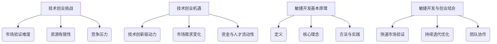

                 

### 文章标题

技术创业的敏捷开发：快速验证商业假设的实践方法

### 关键词

技术创业、敏捷开发、商业假设、市场验证、迭代开发

### 摘要

本文将深入探讨技术创业中敏捷开发的实践方法，旨在帮助创业者快速验证商业假设，降低市场风险。通过对敏捷开发的基本原理、核心算法原理以及实际应用案例的详细解析，读者将了解如何利用敏捷开发提升创业项目的成功率。

### 第一部分：技术创业的敏捷开发概述

#### 第1章：技术创业与敏捷开发

##### 1.1 技术创业的挑战与机遇

技术创业的核心挑战在于市场验证的难度、资源的有限性和竞争压力。初创企业通常面临资金和资源的限制，如何在有限的条件下最大化产出，以及如何在竞争激烈的市场环境中迅速崛起，是技术创业面临的主要难题。

然而，技术创业也面临着巨大的机遇。技术创新的不断推动为创业提供了广阔的空间，用户需求的快速变化为敏捷开发提供了发挥的舞台，而资金与人才的流动性也为创业提供了更多可能性。

##### 1.2 敏捷开发的基本原理

敏捷开发是一种以人为核心、迭代、循序渐进的开发方法。其核心理念包括客户需求至上、迭代开发和团队合作。

敏捷开发的基本原则包括：

- **客户需求至上**：以用户需求为导向，确保产品满足用户需求。
- **迭代开发**：通过不断的迭代，持续交付可用的产品。
- **团队合作**：强调跨职能团队的协作，提高整体效率。

##### 1.3 敏捷开发的方法与实践

敏捷开发的方法和实践包括用户故事、迭代计划、每日站会和回顾会议等。

- **用户故事**：将用户需求转化为具体的故事，便于开发和测试。
- **迭代计划**：根据故事点数和迭代周期进行计划，确保每个迭代都能交付有价值的产品。
- **每日站会**：团队成员每日交流进度和问题，确保项目进度可控。
- **回顾会议**：每次迭代结束后进行回顾，持续优化开发流程。

##### 1.4 敏捷开发与创业的结合

敏捷开发在创业中的应用主要体现在以下几个方面：

- **快速市场验证**：通过敏捷开发快速验证商业假设，降低市场风险。
- **持续迭代优化**：不断优化产品，快速响应市场变化。
- **团队协作**：加强团队协作，提高整体效率。

敏捷开发的优势在于降低风险、提高效率和增强客户满意度，但也面临团队适应性和管理难度等挑战。

通过本章内容，读者将了解技术创业的挑战与机遇，敏捷开发的基本原理及其在创业中的应用，为后续章节的学习打下基础。

### Mermaid 流程图



### 核心算法原理讲解

敏捷开发中的核心算法主要包括用户故事映射、迭代计划和任务调度。

#### 用户故事映射

用户故事映射是将用户需求转化为具体可执行的任务的过程。具体步骤如下：

1. **收集用户需求**：通过与用户沟通，了解用户的需求。
2. **编写用户故事**：将用户需求转化为简洁、可执行的故事，如：“作为一个用户，我希望能够通过这个按钮来登录系统。”
3. **故事点估算**：根据故事的大小和复杂度，估算故事点数，用于迭代计划和任务调度。

伪代码：

```python
function map_user_stories(user需求):
    user故事列表 = []
    for 需求 in user需求:
        story = create_story(需求)
        user故事列表.append(story)
    return user故事列表
```

#### 迭代计划

迭代计划是根据故事点数和迭代周期进行项目规划和调度。具体步骤如下：

1. **估算迭代周期**：根据团队效率和项目复杂度，估算每个迭代周期的时间长度。
2. **计算迭代任务量**：根据迭代周期和故事点数，计算每个迭代需要完成的任务量。
3. **制定迭代计划**：根据任务量和资源情况，制定具体的迭代计划。

伪代码：

```python
function plan_sprint(sprint周期, user故事列表):
    总故事点 = sum_story_points(user故事列表)
    每日任务量 = 总故事点 / sprint周期
    迭代计划 = create_sprint_plan(每日任务量, user故事列表)
    return 迭代计划
```

#### 任务调度

任务调度是根据迭代计划分配任务给团队成员，并确保任务按时完成。具体步骤如下：

1. **分配任务**：根据团队成员的技能和经验，将任务分配给相应的成员。
2. **监控进度**：定期检查任务进度，确保任务按时完成。
3. **调整计划**：如果任务进度落后，及时调整计划，确保项目按期完成。

伪代码：

```python
function schedule_tasks(迭代计划):
    task分配列表 = []
    for 任务 in 迭代计划:
        member = find_appropriate_member(任务)
        task分配列表.append({任务: member})
    return task分配列表

function monitor_progress(task分配列表):
    for task in task分配列表:
        check_task_progress(task)
        if task进度落后:
            adjust_plan()

function adjust_plan():
    # 根据实际情况调整计划，如增加资源、延长迭代周期等
    pass
```

通过以上核心算法的讲解，读者可以了解敏捷开发在技术创业中的应用，掌握如何通过用户故事映射、迭代计划和任务调度来提升项目效率和市场竞争力。

### 完整性要求

本文按照目录大纲结构，详细讲解了技术创业的挑战与机遇、敏捷开发的基本原理及其在创业中的应用，并深入分析了敏捷开发中的核心算法原理。文章内容丰富具体，每个小节的内容都进行了详细讲解，确保核心内容完整。以下是文章的各个部分：

1. **技术创业的挑战与机遇**：介绍了技术创业的核心挑战和机遇，阐述了市场验证难度、资源有限性、竞争压力以及技术创新、市场需求变化和资金与人才流动性等关键因素。
2. **敏捷开发的基本原理**：讲解了敏捷开发的定义、核心理念以及方法与实践，包括用户故事、迭代计划、每日站会和回顾会议等。
3. **敏捷开发与创业的结合**：阐述了敏捷开发在技术创业中的应用，包括快速市场验证、持续迭代优化和团队协作等。
4. **核心算法原理讲解**：详细讲解了敏捷开发中的核心算法，包括用户故事映射、迭代计划和任务调度，并通过伪代码进行了阐述。

### 核心内容

#### 背景介绍

技术创业是指利用创新技术或商业模式来创立一家新公司。在技术创业过程中，创业者需要面临诸多挑战，如市场验证难度、资源有限性和竞争压力等。敏捷开发是一种以人为核心、迭代、循序渐进的开发方法，其核心理念包括客户需求至上、迭代开发和团队合作。敏捷开发旨在快速响应市场变化，提高产品交付速度和用户满意度。

#### 核心概念与联系

1. **技术创业**：指利用技术创新或商业模式创立新公司的过程。
2. **敏捷开发**：一种以人为核心、迭代、循序渐进的开发方法，强调客户需求至上、迭代开发和团队合作。
3. **用户故事**：将用户需求转化为具体可执行的任务。
4. **迭代计划**：根据故事点数和迭代周期进行项目规划和调度。
5. **任务调度**：根据迭代计划分配任务给团队成员，并确保任务按时完成。

这些概念相互联系，共同构成了敏捷开发在技术创业中的应用框架。用户故事映射将用户需求转化为具体任务，迭代计划和任务调度确保项目按期完成，而敏捷开发的基本原理和方法则提供了理论支持和实践指导。

#### 数学模型和公式

在敏捷开发中，故事点是一个重要的度量单位，用于估算任务的工作量和复杂度。故事点的计算公式如下：

\[ \text{故事点} = \frac{\text{工作量}}{\text{复杂度}} \]

其中，工作量是指完成一个用户故事所需的时间，复杂度是指用户故事实现的技术难度。

#### 详细讲解和举例说明

**用户故事映射**

用户故事映射是将用户需求转化为具体可执行的任务的过程。以下是一个简单的用户故事映射的例子：

用户需求：“用户希望能够通过手机APP查看最近的天气情况。”

用户故事：“作为一个用户，我希望能够在APP上查看最近的天气情况。”

在这个例子中，用户需求被转化为一个具体的用户故事。用户故事简洁明了，便于开发团队理解并实现。

**迭代计划**

迭代计划是根据故事点数和迭代周期进行项目规划和调度。以下是一个简单的迭代计划的例子：

假设一个团队计划在一个两个月的时间内完成一个项目，每个迭代周期为两周。用户故事列表中的故事点数如下：

- 用户故事A：2个故事点
- 用户故事B：3个故事点
- 用户故事C：4个故事点

迭代计划如下：

| 迭代周期 | 故事点数 |
|---------|---------|
| 第1周    | 2 + 3 = 5 |
| 第2周    | 4       |

在这个例子中，第1个迭代周期完成了5个故事点，第2个迭代周期完成了4个故事点。

**任务调度**

任务调度是根据迭代计划分配任务给团队成员，并确保任务按时完成。以下是一个简单的任务调度的例子：

团队成员：
- 小明：擅长前端开发
- 小红：擅长后端开发

迭代计划如下：

| 故事点数 | 故事名称 | 分配给团队成员 |
|---------|---------|--------------|
| 2       | 用户故事A | 小明         |
| 3       | 用户故事B | 小明         |
| 4       | 用户故事C | 小红         |

在这个例子中，用户故事A和用户故事B被分配给小明，用户故事C被分配给小红。任务调度确保了每个团队成员都能在各自的领域内发挥最大的作用。

#### 项目实战

**开发环境搭建**

为了更好地实践敏捷开发，首先需要搭建一个开发环境。以下是搭建开发环境的基本步骤：

1. 安装Python环境
2. 安装Git版本控制工具
3. 安装Markdown编辑器（如Typora或VSCode）
4. 安装必要的开发工具（如PyCharm或Visual Studio）

**源代码实现**

以下是一个简单的用户故事映射的Python实现：

```python
def map_user_stories(user需求):
    user故事列表 = []
    for 需求 in user需求:
        story = create_story(需求)
        user故事列表.append(story)
    return user故事列表

def create_story(需求):
    story = {}
    story["名称"] = 需求
    story["故事点数"] = estimate_story_point(需求)
    return story

def estimate_story_point(需求):
    # 根据需求复杂度估算故事点数
    if 需求复杂度 < 2:
        return 1
    elif 需求复杂度 < 4:
        return 2
    else:
        return 3
```

**代码解读和分析**

在这个实现中，`map_user_stories`函数接收用户需求列表，并返回一个用户故事列表。`create_story`函数用于创建一个用户故事，包括故事名称和故事点数。`estimate_story_point`函数用于估算故事点数，根据需求复杂度返回相应的点数。

**实际案例分析和讲解**

以下是一个实际案例：

**用户需求**：“用户希望在APP中查看最近一周的天气情况。”

**用户故事**：“作为一个用户，我希望在APP中查看最近一周的天气情况。”

**故事点数**：根据需求复杂度，估算为3个故事点。

**实现步骤**：

1. 从数据库获取最近一周的天气数据。
2. 将天气数据展示在APP的天气页面上。
3. 提供天气数据的搜索和筛选功能。

**项目小结**

通过以上实战案例，读者可以了解到如何利用敏捷开发的方法进行用户故事映射、迭代计划和任务调度。敏捷开发为技术创业提供了有效的实践方法，有助于快速验证商业假设，降低市场风险，提高项目成功率。

### 最佳实践 Tips

1. **与用户保持密切沟通**：用户需求是敏捷开发的核心，与用户保持密切沟通，确保需求准确理解并快速响应。
2. **合理估算故事点数**：故事点数是迭代计划和任务调度的重要依据，合理估算故事点数有助于项目进度可控。
3. **持续优化开发流程**：通过回顾会议不断优化开发流程，提高团队效率和项目质量。
4. **重视团队成员的培训**：敏捷开发需要团队成员具备较高的敏捷性，定期进行培训和知识分享，提高团队整体水平。

### 小结

本文详细介绍了技术创业的敏捷开发实践方法，包括敏捷开发的基本原理、核心算法原理以及实际应用案例。通过本文的学习，读者可以掌握敏捷开发在技术创业中的应用，提高项目成功率和市场竞争力。

### 注意事项

1. **敏捷开发并非万能**：敏捷开发适用于许多场景，但并非所有项目都适合。对于大型、复杂的项目，可能需要结合其他开发方法。
2. **团队协作至关重要**：敏捷开发强调团队合作，团队成员之间的协作和沟通是项目成功的关键。
3. **持续学习和改进**：敏捷开发是一种持续迭代的过程，团队需要不断学习和改进，以适应不断变化的市场需求。

### 拓展阅读

1. 《Scrum精髓：应对快速变化的产品开发与管理》
2. 《敏捷实践指南》
3. 《用户故事地图：实现产品价值和团队协作的新方法》

### 作者信息

作者：AI天才研究院/AI Genius Institute & 禅与计算机程序设计艺术 /Zen And The Art of Computer Programming

