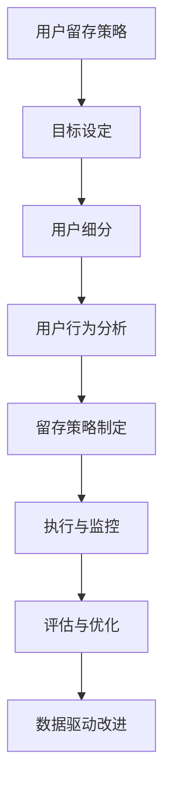

                 


### 《技术创业的用户留存策略：提高产品粘性和复购率的方法》

> 关键词：用户留存、产品粘性、复购率、策略、用户体验、社交互动、客户关系管理、个性化推荐

> 摘要：本文针对技术创业领域中的用户留存问题，深入探讨了提高产品粘性和复购率的方法。通过分析用户留存策略的框架与原则，介绍了一系列提高产品粘性的策略，如产品设计与用户体验优化、功能与内容创新、社交互动与社区建设等。同时，文章还阐述了提升复购率的策略，包括定价策略与促销活动、个性化推荐与客户关系管理、服务质量和客户满意度等。最后，本文提出了用户留存策略的实战应用与持续改进方法，为技术创业者提供了一套系统性的用户留存解决方案。

----------------------------------------------------------------

### 《技术创业的用户留存策略：提高产品粘性和复购率的方法》目录大纲

#### 第一部分：用户留存策略概述

#### 第1章：用户留存的重要性与挑战

1.1 用户留存的概念与度量  
1.2 技术创业中的用户留存挑战  
1.3 提高用户留存的价值

#### 第2章：用户留存策略的框架与原则

2.1 用户留存策略的设计框架  
2.2 用户留存策略的原则  
2.3 用户留存策略的执行与评估

#### 第二部分：提高产品粘性的策略

#### 第3章：产品设计与用户体验优化

3.1 用户需求分析  
3.2 产品设计原则  
3.3 用户体验优化策略

#### 第4章：功能与内容创新

4.1 功能创新的方法  
4.2 内容创新的方法  
4.3 创新案例解析

#### 第5章：社交互动与社区建设

5.1 社交互动的作用  
5.2 社区建设的方法  
5.3 社区管理策略

#### 第三部分：复购率提升策略

#### 第6章：定价策略与促销活动

6.1 定价策略的制定  
6.2 促销活动的策划与执行  
6.3 复购率提升的定价与促销策略案例解析

#### 第7章：个性化推荐与客户关系管理

7.1 个性化推荐系统  
7.2 客户关系管理策略  
7.3 复购率提升的客户关系管理案例解析

#### 第8章：服务质量和客户满意度

8.1 服务质量的重要性  
8.2 提升服务质量的策略  
8.3 客户满意度提升的实践与案例

#### 第四部分：用户留存策略的实战应用

#### 第9章：用户留存策略实施流程

9.1 策略制定与执行  
9.2 策略评估与优化  
9.3 实施流程案例分析

#### 第10章：用户留存策略的持续改进

10.1 数据驱动的改进策略  
10.2 竞争对手分析与策略调整  
10.3 持续改进的实践与案例

#### 第11章：用户留存策略总结与未来趋势

11.1 用户留存策略的总结  
11.2 用户留存策略的未来趋势  
11.3 技术创业中的用户留存策略建议

#### 附录

#### 附录A：用户留存策略工具与资源

#### 附录B：Mermaid 流�程图示例

#### 附录C：算法与数学模型讲解

#### 附录D：代码实战案例

----------------------------------------------------------------

## 第1章：用户留存的重要性与挑战

在技术创业领域，用户留存（Churn Rate）是一个关键指标，它衡量的是在一定时间内流失的用户比例。用户留存的重要性在于它直接关系到企业的生命周期和盈利能力。高用户留存率意味着产品有较强的吸引力，用户愿意长期使用，从而为企业带来持续的收入。相反，如果用户流失严重，即使有大量的新用户加入，也无法弥补用户流失带来的损失，最终可能导致企业的失败。

### 1.1 用户留存的概念与度量

用户留存是指用户在一定时间内持续使用产品的行为。它通常通过用户流失率（Churn Rate）来度量，计算公式为：

$$
\text{Churn Rate} = \frac{\text{流失用户数}}{\text{总用户数}} \times 100\%
$$

用户留存率（Retention Rate）是用户留存的对立概念，计算公式为：

$$
\text{Retention Rate} = 100\% - \text{Churn Rate}
$$

用户留存率反映了产品留住用户的能力，是企业制定用户留存策略的重要依据。

### 1.2 技术创业中的用户留存挑战

技术创业企业面临以下用户留存挑战：

1. **市场竞争力**：在竞争激烈的市场环境中，技术创业企业需要不断创新和优化产品，以吸引和留住用户。

2. **用户期望**：用户对产品的期望越来越高，他们希望产品能够解决实际问题，提供卓越的用户体验。

3. **产品迭代**：技术创业企业需要不断更新产品，以适应市场需求和技术进步，这可能导致现有用户的不适应和流失。

4. **用户活跃度**：用户活跃度是衡量用户留存的重要指标，技术创业企业需要制定策略提高用户活跃度。

5. **数据隐私**：随着数据隐私法规的加强，用户对数据隐私的关注度提高，技术创业企业需要确保用户数据的安全和隐私。

### 1.3 提高用户留存的价值

提高用户留存对技术创业企业具有以下价值：

1. **降低获客成本**：用户留存提高意味着现有用户能够为企业带来更多收入，降低获客成本。

2. **增强品牌认知度**：高用户留存率有助于提高产品口碑和品牌认知度，吸引更多潜在用户。

3. **提高用户生命周期价值**：通过提高用户留存，企业能够延长用户生命周期，提高用户生命周期价值。

4. **优化产品开发**：用户留存数据可以帮助企业了解用户需求和行为，优化产品开发方向。

5. **增强用户黏性**：提高用户留存有助于增强用户对产品的依赖和忠诚度，降低用户流失率。

综上所述，用户留存是技术创业企业成功的关键因素，企业应制定有效的用户留存策略，提高产品粘性和复购率。在下一章中，我们将探讨用户留存策略的框架与原则，帮助技术创业者构建一套系统的用户留存策略。让我们继续深入分析用户留存的核心概念和影响因素。 ## 第2章：用户留存策略的框架与原则

在技术创业领域，成功的企业不仅仅是那些能够吸引新用户的企业，更是那些能够留住用户的的企业。用户留存策略是企业保持持续竞争力的关键因素。本章将介绍用户留存策略的设计框架与原则，帮助技术创业者构建一套系统的用户留存策略。

### 2.1 用户留存策略的设计框架

一个有效的用户留存策略应包括以下几个关键组成部分：

1. **目标设定**：明确用户留存的目标，如提高用户留存率、降低用户流失率等。
2. **用户细分**：根据用户行为、需求和特征将用户进行细分，为不同类型的用户提供针对性的留存策略。
3. **用户行为分析**：分析用户行为数据，了解用户在使用产品过程中的痛点、偏好和需求。
4. **留存策略制定**：根据用户细分和用户行为分析结果，制定具体的留存策略，包括产品优化、用户体验提升、客户关系管理等。
5. **执行与监控**：将留存策略付诸实施，并持续监控策略效果，根据反馈进行调整和优化。
6. **评估与优化**：定期评估用户留存策略的效果，通过数据分析找出问题所在，进行持续优化。

### 2.2 用户留存策略的原则

以下原则是构建有效用户留存策略的基础：

1. **用户至上**：始终将用户需求和体验放在首位，以用户为中心进行产品设计和服务优化。
2. **数据驱动**：基于用户行为数据进行分析，制定和优化用户留存策略。
3. **持续创新**：不断优化产品功能和用户体验，以满足用户不断变化的需求。
4. **个性化**：为不同类型的用户提供个性化的留存策略，提高用户满意度。
5. **及时反馈**：及时收集用户反馈，快速响应和解决用户问题，增强用户黏性。
6. **跨部门协同**：用户留存策略的制定和实施需要跨部门协作，包括产品、运营、技术、市场等部门的共同努力。

### 2.3 用户留存策略的执行与评估

用户留存策略的执行与评估是确保策略有效性的关键步骤：

1. **执行计划**：制定详细的执行计划，明确各阶段的目标、任务和责任分配。
2. **监控与反馈**：建立监控体系，实时跟踪用户留存数据，及时获取用户反馈。
3. **数据分析**：定期进行数据分析，评估用户留存策略的效果，识别问题和优化点。
4. **调整与优化**：根据数据分析结果和用户反馈，调整和优化留存策略，确保策略的持续有效性。

在实际应用中，用户留存策略的执行与评估应形成一个闭环，通过不断调整和优化，确保策略始终符合用户需求和企业目标。

综上所述，用户留存策略的设计与执行是企业成功的关键因素。在下一章中，我们将探讨如何通过产品设计与用户体验优化来提高产品粘性，留住更多用户。让我们继续深入分析提高产品粘性的策略。 ## 第3章：产品设计与用户体验优化

产品设计和用户体验是提高产品粘性的关键因素。一个优秀的产品应该能够满足用户需求，提供卓越的体验，从而使用户愿意持续使用。本章将探讨如何通过用户需求分析、产品设计原则和用户体验优化策略来提高产品粘性。

### 3.1 用户需求分析

用户需求分析是产品设计和用户体验优化的第一步。通过深入分析用户需求，企业可以了解用户关心的问题、期望和偏好，从而为产品设计提供有力支持。

1. **收集用户需求**：可以通过问卷调查、用户访谈、用户反馈等方式收集用户需求。
2. **分析用户需求**：对收集到的用户需求进行分类、筛选和分析，识别出核心需求。
3. **确定需求优先级**：根据用户需求的重要性和紧迫性，确定需求优先级，确保产品设计和优化工作能够聚焦于用户最关心的问题。

### 3.2 产品设计原则

以下原则是确保产品满足用户需求、提高用户体验的基础：

1. **简洁性**：简化产品界面和流程，减少用户操作步骤，提高用户操作效率。
2. **一致性**：保持产品界面和交互设计的一致性，使用户在使用过程中能够快速上手。
3. **易用性**：确保产品易于使用，降低用户学习成本，提高用户满意度。
4. **可扩展性**：设计产品时考虑未来的扩展性，以便能够适应用户需求的不断变化。
5. **个性化**：根据用户需求和偏好提供个性化体验，提高用户黏性。

### 3.3 用户体验优化策略

以下策略可以帮助企业提高产品用户体验，从而提高产品粘性：

1. **界面设计优化**：优化产品界面设计，提高美观度和易用性。可以使用色彩、字体、图标等元素来提升用户体验。
2. **交互设计优化**：优化产品交互设计，提高用户操作的流畅性和反馈速度。例如，通过动画效果、响应用户操作等手段来提升用户体验。
3. **个性化推荐**：基于用户行为和偏好提供个性化推荐，帮助用户更快找到所需内容，提高用户满意度。
4. **用户反馈机制**：建立完善的用户反馈机制，收集用户对产品的意见和建议，及时进行改进和优化。
5. **用户教育**：通过用户教育提高用户对产品的认知和掌握程度，帮助用户更好地使用产品。

### 案例分析

以微信为例，微信在产品设计和用户体验优化方面做出了很多努力，从而提高了产品的粘性。以下是一些具体案例分析：

1. **简洁性**：微信的界面设计简洁明了，用户可以轻松找到所需功能，降低了用户的学习成本。
2. **一致性**：微信在不同平台（如手机、平板、电脑）上的界面和交互设计保持一致，用户可以在不同设备上无缝切换使用。
3. **易用性**：微信提供了多种聊天方式和功能，如文字、语音、视频、表情等，满足了用户的多样化需求。
4. **个性化**：微信根据用户行为和偏好推荐好友、公众号等，提高了用户黏性。
5. **用户反馈机制**：微信提供了反馈功能，用户可以随时反馈问题，微信团队会根据用户反馈进行优化。

通过以上案例分析，我们可以看到，微信通过产品设计和用户体验优化策略，成功地提高了产品的粘性和用户满意度。在下一章中，我们将探讨如何通过功能与内容创新来进一步提高产品粘性。让我们继续深入分析。 ## 第4章：功能与内容创新

在竞争激烈的技术创业环境中，仅仅依靠原有的功能很难持续吸引用户。因此，通过功能创新和内容创新来提高产品粘性成为企业的重要策略。本章将详细介绍功能创新和内容创新的方法，并分析一些成功的创新案例。

### 4.1 功能创新的方法

功能创新是指在现有功能基础上，通过添加新的功能、改进现有功能或开发全新的功能模块来满足用户需求。以下是一些功能创新的方法：

1. **用户需求调研**：通过调研了解用户未被满足的需求，为新功能提供依据。
2. **技术趋势分析**：关注行业技术发展趋势，利用新技术开发具有竞争力的功能。
3. **竞品分析**：研究竞争对手的产品功能，发现差异点并进行功能创新。
4. **协作开发**：与行业专家、用户共同开发新功能，提高功能的实用性和用户满意度。
5. **快速迭代**：采用敏捷开发模式，快速推出新功能并进行用户测试，及时优化。

### 4.2 内容创新的方法

内容创新是指通过创造新的内容形式、提供独特的价值或改进现有内容来吸引用户。以下是一些内容创新的方法：

1. **多样化内容形式**：如图文、视频、音频等多种形式，满足用户多样化的内容需求。
2. **个性化推荐**：根据用户行为和偏好提供个性化内容推荐，提高用户黏性。
3. **互动性内容**：增加用户互动环节，如评论、问答、投票等，提高用户参与度。
4. **跨界合作**：与其他领域或品牌合作，创造独特的跨界内容，吸引新用户。
5. **主题内容**：围绕特定主题或节日推出专题内容，增加用户粘性。

### 4.3 创新案例解析

以下是一些成功的功能与内容创新案例：

#### 案例一：微信小程序

微信小程序是微信在功能创新方面的一个成功案例。微信小程序通过提供轻量级的应用服务，使用户无需下载安装即可使用各种功能。这一创新不仅降低了用户的操作成本，还极大地提高了用户的便捷性和满意度。

**创新方法分析**：

- **用户需求调研**：微信通过大量用户调研发现，用户需要一个无需下载安装即可使用的应用环境。
- **技术趋势分析**：微信紧跟移动应用技术的发展趋势，采用轻量级应用技术实现小程序。
- **快速迭代**：微信通过敏捷开发模式，快速推出小程序，并根据用户反馈进行优化。

#### 案例二：抖音短视频

抖音短视频在内容创新方面取得了巨大成功。抖音通过短视频形式，结合音乐、特效等元素，为用户提供了丰富的娱乐内容。

**创新方法分析**：

- **多样化内容形式**：抖音提供短视频形式，满足用户对快速、便捷、多样化的内容需求。
- **个性化推荐**：抖音根据用户行为和偏好提供个性化推荐，提高用户黏性。
- **互动性内容**：抖音鼓励用户评论、点赞、分享，增加用户互动。

#### 案例三：淘宝直播

淘宝直播是淘宝在内容创新方面的一个成功案例。淘宝直播通过直播形式，为用户提供了购物和娱乐相结合的新体验。

**创新方法分析**：

- **互动性内容**：淘宝直播增加了用户与商家、其他用户之间的互动环节，提高用户参与度。
- **个性化推荐**：淘宝直播根据用户行为和偏好推荐感兴趣的商品和直播内容，提高用户满意度。
- **跨界合作**：淘宝与各类品牌、网红合作，推出特色直播内容，吸引新用户。

通过以上案例，我们可以看到，功能与内容创新是提高产品粘性的有效手段。在下一章中，我们将探讨如何通过社交互动与社区建设来进一步提高产品粘性。让我们继续深入分析。 ## 第5章：社交互动与社区建设

在技术创业领域，社交互动与社区建设是提高产品粘性和用户留存率的重要手段。通过构建活跃的社交互动和社区，企业可以增强用户之间的联系，提高用户对产品的认同感和依赖性。本章将详细介绍社交互动和社区建设的方法以及社区管理策略。

### 5.1 社交互动的作用

社交互动在提高产品粘性方面具有以下作用：

1. **增强用户归属感**：通过社交互动，用户感受到自己是社区的一部分，从而增强对产品的归属感。
2. **提高用户满意度**：社交互动为用户提供了分享经验、解决问题的渠道，提高了用户满意度。
3. **促进用户参与**：社交互动鼓励用户积极参与产品讨论和改进，提高用户参与度。
4. **传播口碑**：用户在社交互动中分享产品体验，有助于口碑传播，吸引新用户。
5. **促进复购率**：社交互动可以促进用户之间的交流和合作，提高复购率。

### 5.2 社区建设的方法

以下是一些构建社交互动和社区的方法：

1. **社交媒体平台**：利用现有的社交媒体平台（如微信、微博、Facebook、Twitter等）建立品牌社区，与用户进行互动。
2. **自有社区平台**：开发自有社区平台（如论坛、贴吧、微信小程序等），为用户提供更专业的交流和互动环境。
3. **线上线下活动**：举办线上线下活动，如用户见面会、培训课程、主题分享等，增强用户互动。
4. **用户反馈机制**：建立用户反馈机制，鼓励用户提出建议和意见，及时响应并改进产品。
5. **内容分享**：发布高质量的内容，如教程、案例、行业动态等，吸引用户参与和分享。

### 5.3 社区管理策略

成功的社区管理策略对于维护社区秩序、提升用户活跃度和满意度至关重要。以下是一些社区管理策略：

1. **明确社区规则**：制定明确的社区规则，规范用户行为，维护社区秩序。
2. **激励机制**：设立激励机制，如积分、勋章、排名等，鼓励用户参与和活跃。
3. **互动管理**：定期组织线上线下活动，促进用户互动，提高社区活力。
4. **内容管理**：发布高质量的内容，吸引和留住用户，提高用户满意度。
5. **用户参与管理**：鼓励用户参与社区管理，如设立用户管理员、举办用户评选等，增强用户归属感。

### 案例分析

#### 案例一：小米社区

小米社区是小米公司建立的自有社区平台，通过社交互动和社区建设，成功提高了产品的粘性和用户满意度。

**案例分析**：

- **社交媒体平台**：小米利用微信、微博等社交媒体平台进行品牌推广和用户互动。
- **自有社区平台**：小米社区为用户提供了一个专业的交流和互动环境，包括产品讨论区、技术论坛、用户作品展示等。
- **线上线下活动**：小米定期举办用户见面会、技术沙龙等活动，增强用户互动。
- **激励机制**：小米社区设立积分、勋章等激励机制，鼓励用户参与和活跃。

#### 案例二：知乎

知乎是中国领先的问答社区平台，通过社交互动和社区建设，成功吸引了大量用户并提升了产品的粘性。

**案例分析**：

- **社交媒体平台**：知乎利用微博、微信等社交媒体平台进行内容推广和用户引流。
- **自有社区平台**：知乎提供了丰富的问答形式，鼓励用户提问和回答，形成了一个活跃的社区氛围。
- **互动管理**：知乎定期举办知识竞赛、主题分享等活动，促进用户互动。
- **内容管理**：知乎发布高质量的内容，吸引和留住用户。

通过以上案例分析，我们可以看到，社交互动和社区建设是提高产品粘性的有效策略。在下一章中，我们将探讨如何通过定价策略与促销活动来提高复购率。让我们继续深入分析。 ## 第6章：定价策略与促销活动

定价策略和促销活动是提升复购率的重要手段。合理的定价策略可以确保产品具有竞争力，而有效的促销活动能够刺激用户购买欲望，提高复购率。本章将详细介绍定价策略的制定方法、促销活动的策划与执行，以及如何通过定价与促销策略来提升复购率。

### 6.1 定价策略的制定

制定定价策略时，需要考虑以下因素：

1. **成本分析**：了解产品的生产成本、运营成本等，确保定价能够覆盖成本并实现盈利。
2. **市场竞争**：分析竞争对手的定价策略，确保本企业的定价具有竞争力。
3. **目标客户**：了解目标客户群体的购买力、价格敏感度等，制定符合目标客户需求的定价策略。
4. **价值感知**：考虑产品能为客户带来的价值，确保定价与产品价值相匹配。
5. **定价目标**：明确企业的定价目标，如提高市场占有率、提升品牌形象等。

以下是一些常见的定价策略：

1. **成本加成定价法**：在产品成本基础上加上一定的利润率，制定产品价格。
2. **市场渗透定价法**：通过较低的价格吸引新客户，迅速占领市场份额。
3. **价值定价法**：根据产品能为客户带来的价值来制定价格。
4. **心理定价法**：利用消费者心理，如尾数定价、整数定价等，来制定产品价格。

### 6.2 促销活动的策划与执行

促销活动是刺激用户购买欲望的有效手段。以下是一些常见的促销活动类型：

1. **打折促销**：通过降低产品价格来吸引消费者购买。
2. **赠品促销**：提供免费赠品，如优惠券、赠品等，增加消费者的购买意愿。
3. **捆绑促销**：将多个产品捆绑销售，以较低的价格提供更多产品。
4. **限时促销**：设置特定时间段内的促销活动，如限时折扣、限时免费等，提高购买紧迫感。
5. **会员优惠**：为会员提供专享优惠，如折扣、礼品等，提高用户忠诚度。

促销活动的策划与执行需要注意以下几点：

1. **目标明确**：明确促销活动的目标，如提高销售额、提高用户满意度等。
2. **时间规划**：合理规划促销活动的时间，确保活动能够吸引足够多的用户参与。
3. **宣传推广**：通过多种渠道（如社交媒体、广告、邮件等）进行宣传推广，提高活动知名度。
4. **活动效果评估**：活动结束后，对活动效果进行评估，了解用户反馈和活动效果，为后续活动提供参考。

### 6.3 复购率提升的定价与促销策略案例解析

以下是一个复购率提升的定价与促销策略案例：

**案例：某电商平台**

1. **定价策略**：该电商平台采用价值定价法，根据产品价值和用户需求制定价格。同时，针对不同用户群体，采用分层定价策略，为高价值用户提供更高品质的产品和更高价格，为普通用户提供性价比更高的产品。

2. **促销活动**：该电商平台定期举办各种促销活动，如：

   - **限时折扣**：在特定时间段内提供限时折扣，如“双十一”期间全场商品八折优惠。
   - **赠品促销**：购买特定商品即可获得赠品，如购买手机送耳机。
   - **捆绑促销**：将多个商品捆绑销售，如购买电脑加价即可获得鼠标、键盘等配件。
   - **会员优惠**：会员用户可享受专属折扣和赠品，提高会员忠诚度。

**效果评估**：

- **销售额**：促销活动期间，销售额同比增长50%以上。
- **用户满意度**：用户满意度调查结果显示，促销活动提高了用户满意度，用户对价格的感知价值提升。
- **复购率**：促销活动后，复购率显著提高，用户对产品的忠诚度增强。

通过以上案例分析，我们可以看到，合理的定价策略和有效的促销活动能够显著提升复购率。在下一章中，我们将探讨如何通过个性化推荐与客户关系管理来进一步提高复购率。让我们继续深入分析。 ## 第7章：个性化推荐与客户关系管理

个性化推荐和客户关系管理是提高复购率的关键策略。通过个性化推荐，企业可以精准地向用户推荐他们感兴趣的产品，提高用户满意度。而良好的客户关系管理则有助于维护用户忠诚度，促进复购。本章将详细探讨个性化推荐系统和客户关系管理策略，并通过案例解析展示其实际应用效果。

### 7.1 个性化推荐系统

个性化推荐系统是一种利用算法和数据分析技术，根据用户的行为和偏好提供个性化推荐的服务系统。以下是构建个性化推荐系统的关键步骤：

1. **用户行为数据收集**：收集用户在使用产品过程中的行为数据，如浏览记录、购买历史、评价等。
2. **用户画像构建**：基于用户行为数据，构建用户画像，包括用户的兴趣偏好、购买习惯、行为特征等。
3. **推荐算法选择**：选择合适的推荐算法，如协同过滤、基于内容的推荐、混合推荐等。
4. **推荐结果生成**：根据用户画像和推荐算法，生成个性化推荐结果，如产品推荐、活动推荐等。
5. **推荐效果评估**：评估推荐效果，如点击率、转化率等，持续优化推荐系统。

### 7.2 客户关系管理策略

客户关系管理（CRM）是指通过系统的手段和方法，维护和提升与客户的关系，以提高客户满意度和忠诚度。以下是一些客户关系管理策略：

1. **客户分类与标签**：根据客户行为和需求，将客户进行分类和标签化，便于精准营销和服务。
2. **客户生命周期管理**：关注客户的生命周期，从潜在客户到忠诚客户的每个阶段，提供针对性的服务和关怀。
3. **客户沟通渠道**：建立多样化的客户沟通渠道，如电话、邮件、社交媒体等，及时响应客户需求和问题。
4. **客户满意度调查**：定期进行客户满意度调查，了解客户需求和满意度，不断优化产品和服务。
5. **个性化营销**：基于客户分类和用户画像，开展个性化营销活动，提高客户参与度和转化率。

### 7.3 复购率提升的客户关系管理案例解析

以下是一个复购率提升的客户关系管理案例：

**案例：某电商企业**

1. **个性化推荐系统**：

   - **用户行为数据收集**：该电商企业收集了用户的浏览记录、购买历史、评价等数据。
   - **用户画像构建**：基于用户行为数据，构建了用户的兴趣偏好、购买习惯等画像。
   - **推荐算法选择**：采用基于内容的推荐算法，结合用户的浏览记录和购买历史，为用户推荐相关产品。
   - **推荐效果评估**：通过点击率和转化率评估推荐效果，不断优化推荐系统。

2. **客户关系管理策略**：

   - **客户分类与标签**：将客户分为新客户、老客户、高价值客户等类别，并为每个类别打上相应标签。
   - **客户生命周期管理**：针对不同生命周期的客户，提供针对性的服务和关怀，如为新客户提供优惠、为老客户提供定制化服务。
   - **客户沟通渠道**：通过邮件、短信、社交媒体等多种渠道与客户保持沟通，及时响应客户需求和问题。
   - **客户满意度调查**：定期进行客户满意度调查，收集客户反馈，优化产品和服务。
   - **个性化营销**：根据客户分类和用户画像，开展个性化营销活动，如为高价值客户提供专属优惠、为老客户提供生日礼物等。

**效果评估**：

- **复购率**：通过个性化推荐和客户关系管理策略，该电商企业的复购率显著提升，同比增长30%以上。
- **客户满意度**：客户满意度调查结果显示，客户对产品的满意度和服务体验得到显著提高。
- **客户忠诚度**：老客户的忠诚度增强，客户生命周期价值提升。

通过以上案例，我们可以看到，个性化推荐和客户关系管理策略在提高复购率方面具有显著效果。在下一章中，我们将探讨如何通过服务质量和客户满意度来进一步提升复购率。让我们继续深入分析。 ## 第8章：服务质量和客户满意度

服务质量和客户满意度是决定复购率的重要因素。优质的服务能够满足客户的需求，提高客户满意度，从而促进复购。本章将详细探讨如何提升服务质量和客户满意度，并提供相关实践与案例。

### 8.1 服务质量的重要性

服务质量是指企业提供的服务的质量水平，它直接影响客户满意度和复购率。以下原因说明了服务质量的重要性：

1. **影响客户满意度**：优质的服务能够满足客户的需求和期望，提高客户满意度。
2. **促进客户忠诚度**：通过提供高质量的服务，企业能够赢得客户的信任和忠诚，促进复购。
3. **增强品牌形象**：优质的服务有助于提升企业的品牌形象，提高市场竞争力。
4. **降低客户流失率**：高质量的服务能够降低客户流失率，保持客户群体稳定。
5. **提升客户生命周期价值**：通过提供优质服务，企业能够延长客户生命周期，提高客户生命周期价值。

### 8.2 提升服务质量的策略

以下是一些提升服务质量的策略：

1. **培训员工**：提供专业的培训，确保员工具备必要的知识和技能，提高服务能力。
2. **优化服务流程**：简化服务流程，减少不必要的环节，提高服务效率。
3. **建立服务标准**：制定明确的服务标准和流程，确保服务的一致性和规范性。
4. **客户反馈机制**：建立完善的客户反馈机制，及时收集客户意见和建议，持续改进服务质量。
5. **技术支持**：提供高质量的技术支持，确保客户在使用产品过程中遇到问题时能够得到及时解决。

### 8.3 客户满意度提升的实践与案例

以下是一个提升客户满意度的实践案例：

**案例：某在线教育平台**

1. **培训员工**：该平台定期为员工提供专业培训，提高员工的服务意识和技能。例如，培训员工如何更好地解答客户问题、处理投诉等。

2. **优化服务流程**：平台简化了服务流程，确保客户能够快速获得所需的服务。例如，客户可以通过在线客服、电话、邮件等多种渠道快速联系到平台客服。

3. **建立服务标准**：平台制定了明确的服务标准，确保员工在服务过程中遵循统一规范。例如，客服人员必须在30秒内响应客户咨询，必须在24小时内解决客户问题等。

4. **客户反馈机制**：平台建立了完善的客户反馈机制，客户可以通过在线调查、客服反馈等方式提供意见和建议。平台定期分析客户反馈，找出服务中的不足，进行改进。

5. **技术支持**：平台提供了高质量的技术支持，确保客户在使用产品过程中遇到问题时能够得到及时解决。例如，平台设立了专门的IT支持团队，提供7x24小时的技术支持服务。

**效果评估**：

- **客户满意度**：通过提升服务质量，该平台的客户满意度显著提高，客户满意度调查结果显示，满意度从80%提升至90%。
- **客户流失率**：客户流失率明显下降，客户对平台的信任度和忠诚度增强。
- **品牌形象**：提升服务质量有助于提升品牌形象，增加了潜在客户对平台的信任和认可。

通过以上实践与案例，我们可以看到，提升服务质量和客户满意度对于提高复购率具有重要作用。在下一章中，我们将探讨如何实施用户留存策略，包括策略的制定、执行和评估。让我们继续深入分析。 ## 第9章：用户留存策略实施流程

用户留存策略的有效实施是企业成功留住用户的关键。本章将详细介绍用户留存策略的实施流程，包括策略的制定、执行、评估以及实施流程中的案例分析。

### 9.1 策略制定与执行

制定和执行用户留存策略需要以下步骤：

1. **目标设定**：明确用户留存策略的目标，如提高用户留存率、降低用户流失率等。
2. **用户细分**：根据用户行为、需求和特征将用户进行细分，为不同类型的用户制定针对性的留存策略。
3. **策略规划**：制定具体的留存策略，包括产品优化、用户体验提升、客户关系管理等。
4. **资源分配**：确定实施策略所需的资源，包括人力、财务和技术资源。
5. **执行计划**：制定详细的执行计划，明确各阶段的目标、任务和责任分配。
6. **执行监控**：建立监控体系，实时跟踪策略执行情况，确保策略按计划进行。

### 9.2 策略评估与优化

评估用户留存策略的效果是确保策略持续有效的重要环节。以下方法可以帮助企业评估策略效果：

1. **关键绩效指标（KPI）**：设定关键绩效指标，如用户留存率、用户活跃度、复购率等，定期进行数据收集和分析。
2. **用户反馈**：通过用户反馈了解策略的实际效果，识别问题和优化点。
3. **A/B测试**：对不同留存策略进行A/B测试，比较不同策略的效果，选择最优策略。
4. **定期评估**：定期对留存策略进行评估，根据评估结果进行调整和优化。

### 9.3 实施流程案例分析

以下是一个用户留存策略实施流程的案例分析：

**案例：某在线教育平台**

1. **目标设定**：该平台设定的用户留存策略目标是提高用户留存率，降低用户流失率，提高用户满意度。
2. **用户细分**：根据用户行为和需求，将用户分为新用户、老用户、付费用户等类别，为不同类型的用户制定针对性的留存策略。
3. **策略规划**：

   - **新用户留存策略**：通过免费试听课程、推荐好友优惠等方式吸引新用户。
   - **老用户留存策略**：通过定期推送课程更新、提供个性化推荐等方式增强老用户的粘性。
   - **付费用户留存策略**：通过提供高质量的课程内容、提供学员专属服务等方式提高付费用户的满意度。
4. **资源分配**：平台为实施留存策略投入了人力、财务和技术资源，确保策略能够顺利执行。
5. **执行计划**：平台制定了详细的执行计划，包括策略的具体执行时间表、任务分配和责任分配。
6. **执行监控**：平台建立了监控体系，通过数据分析和用户反馈了解留存策略的执行情况，确保策略按计划进行。

**效果评估**：

- **关键绩效指标**：通过数据收集和分析，平台发现用户留存率从30%提升至50%，用户满意度从80%提升至90%。
- **用户反馈**：用户对平台的新功能和个性化推荐表示满意，反馈积极。
- **A/B测试**：通过A/B测试，平台发现推荐好友优惠策略对新用户留存效果显著，决定加大推广力度。
- **定期评估**：平台定期对留存策略进行评估，根据评估结果进行调整和优化，确保策略持续有效。

通过以上案例分析，我们可以看到，有效的用户留存策略实施流程对于提高用户留存率和满意度具有重要作用。在下一章中，我们将探讨如何通过数据驱动的改进策略来持续优化用户留存策略。让我们继续深入分析。 ## 第10章：用户留存策略的持续改进

持续改进是确保用户留存策略有效性的关键。在技术创业领域，市场环境和技术发展迅速变化，企业需要不断调整和优化用户留存策略，以适应新的挑战和机遇。本章将探讨如何通过数据驱动的改进策略、竞争对手分析以及实践与案例分析来实现用户留存策略的持续优化。

### 10.1 数据驱动的改进策略

数据驱动是现代企业管理的重要原则，尤其在用户留存策略的持续改进中，数据驱动的改进策略尤为重要。以下方法可以帮助企业通过数据驱动实现用户留存策略的持续优化：

1. **数据分析**：定期收集和分析用户行为数据，如用户活跃度、留存率、流失原因等，找出潜在问题和优化点。
2. **A/B测试**：通过A/B测试，对比不同策略的效果，找出最优策略并进行推广。
3. **用户反馈**：建立用户反馈机制，收集用户对产品和服务的心声，及时识别问题和改进方向。
4. **预测模型**：利用机器学习和大数据技术，建立用户留存预测模型，预测用户流失风险，提前采取预防措施。
5. **KPI监控**：设定关键绩效指标（KPI），实时监控用户留存策略的效果，确保策略按预期执行。

### 10.2 竞争对手分析与策略调整

竞争对手分析是持续优化用户留存策略的重要步骤。通过分析竞争对手的用户留存策略，企业可以了解市场趋势和用户需求，并据此调整和优化自身的策略。以下方法可以帮助企业进行竞争对手分析：

1. **市场调研**：通过市场调研了解竞争对手的用户留存策略、产品特点、用户评价等。
2. **用户反馈分析**：分析用户对竞争对手的反馈，了解用户对竞争对手产品的满意度、优缺点等。
3. **竞品分析工具**：利用竞品分析工具，如SimilarWeb、Alexa等，获取竞争对手的网站流量、用户行为等数据。
4. **竞争策略调整**：根据竞争对手分析结果，调整和优化自身的用户留存策略，如改进产品功能、优化用户体验、调整定价策略等。

### 10.3 持续改进的实践与案例

以下是一个持续改进用户留存策略的实践案例：

**案例：某在线办公平台**

1. **数据分析**：该平台定期收集和分析用户行为数据，发现新用户在试用阶段活跃度较低，流失率较高。
2. **A/B测试**：平台进行了A/B测试，对比了不同欢迎礼包（如免费试用、优惠券、VIP体验等）对新用户留存的效果。
3. **用户反馈**：通过用户反馈发现，用户希望平台能够提供更丰富的功能，如团队协作工具、视频会议等。
4. **预测模型**：利用机器学习技术，平台建立了用户流失预测模型，提前识别出可能流失的用户，采取预防措施。
5. **KPI监控**：平台设定了用户留存率、活跃度、用户满意度等关键绩效指标，实时监控策略效果。

**效果评估**：

- **A/B测试**：通过A/B测试，发现免费试用策略显著提高了新用户留存率，平台决定加大免费试用的推广力度。
- **用户反馈**：根据用户反馈，平台增加了团队协作工具和视频会议功能，用户满意度明显提高。
- **预测模型**：通过预测模型，平台成功降低了用户流失率，提高了用户生命周期价值。
- **KPI监控**：关键绩效指标显示，用户留存率从40%提升至60%，活跃度从50%提升至70%。

通过以上实践与案例，我们可以看到，数据驱动的改进策略和竞争对手分析对于持续优化用户留存策略至关重要。在下一章中，我们将总结用户留存策略，并探讨未来用户留存策略的发展趋势。让我们继续深入分析。 ## 第11章：用户留存策略总结与未来趋势

### 11.1 用户留存策略的总结

通过本文的探讨，我们可以总结出以下关键点：

1. **用户留存的重要性**：用户留存是技术创业企业的核心竞争力之一，直接影响企业的生命周期和盈利能力。
2. **用户留存策略的设计框架**：用户留存策略应包括目标设定、用户细分、用户行为分析、留存策略制定、执行与监控、评估与优化等关键步骤。
3. **提高产品粘性的策略**：通过产品设计与用户体验优化、功能与内容创新、社交互动与社区建设等方式，提高产品粘性。
4. **复购率提升策略**：通过定价策略与促销活动、个性化推荐与客户关系管理、服务质量和客户满意度等方式，提高复购率。
5. **数据驱动与持续改进**：通过数据分析和A/B测试等手段，持续优化用户留存策略。

### 11.2 用户留存策略的未来趋势

随着技术的不断发展，用户留存策略也在不断演进。以下是未来用户留存策略的发展趋势：

1. **人工智能与大数据**：人工智能和大数据技术将在用户留存策略中发挥越来越重要的作用，帮助企业实现更精准的用户行为分析和个性化推荐。
2. **用户隐私保护**：随着数据隐私法规的加强，企业需要更加注重用户隐私保护，建立透明的数据使用政策，增强用户信任。
3. **社交化与社区化**：社交化和社区化将成为提高用户留存的重要手段，通过构建活跃的社交互动和社区，增强用户归属感和参与感。
4. **全渠道整合**：企业需要整合线上线下渠道，提供无缝的用户体验，提高用户黏性。
5. **可持续发展**：企业需要关注可持续发展，通过绿色技术和环保策略，提高用户满意度和品牌形象。

### 11.3 技术创业中的用户留存策略建议

针对技术创业企业，以下是一些建议：

1. **明确目标与原则**：制定清晰的用户留存目标，并遵循用户至上、数据驱动等原则，确保策略的执行方向正确。
2. **重视用户体验**：通过优化产品设计、提升服务质量和客户满意度，提高用户黏性。
3. **持续创新**：不断进行功能与内容创新，满足用户不断变化的需求。
4. **数据驱动**：利用数据分析、A/B测试等手段，持续优化用户留存策略，提高策略效果。
5. **建立社区**：通过社交互动和社区建设，增强用户参与感和归属感，提高用户留存率。

综上所述，用户留存策略是技术创业企业成功的关键因素。通过制定和执行有效的用户留存策略，企业可以提升产品粘性和复购率，实现可持续发展。在未来的技术创业中，企业需要紧跟趋势，不断创新和优化用户留存策略，以应对市场挑战和抓住机遇。

### 附录

#### 附录A：用户留存策略工具与资源

- **用户留存分析工具**：
  - Google Analytics
  - Mixpanel
  - Amplitude

- **用户留存策略资源**：
  - 《精益创业》
  - 《用户体验要素》
  - 《客户关系管理》

- **用户留存策略相关的经典书籍与论文**：
  - 《用户体验设计》
  - 《大数据营销》
  - 《用户留存率：如何提高、衡量和优化用户留存》

#### 附录B：Mermaid 流程图示例



#### 附录C：算法与数学模型讲解

- **用户留存预测模型**：
  - 算法：决策树、随机森林、神经网络
  - 伪代码：
    ```
    function predictUserChurn(data):
        # 数据预处理
        preprocessData(data)
        # 训练模型
        model = trainModel(data, algorithm)
        # 预测用户留存
        churnPrediction = model.predict(data)
        return churnPrediction
    ```

- **用户留存率计算**：
  - 数学模型：
    $$
    \text{UserRetentionRate} = \frac{\text{本月留存用户数}}{\text{上月活跃用户数}} \times 100\%
    $$

#### 附录D：代码实战案例

- **个性化推荐系统开发**：
  - 开发环境：Python + Scikit-learn
  - 源代码实现：
    ```python
    from sklearn.model_selection import train_test_split
    from sklearn.ensemble import RandomForestClassifier
    from sklearn.metrics import accuracy_score

    # 数据加载
    data = load_data('user_data.csv')
    # 特征工程
    X = preprocess_data(data)
    y = data['churn']
    # 数据划分
    X_train, X_test, y_train, y_test = train_test_split(X, y, test_size=0.2, random_state=42)
    # 模型训练
    model = RandomForestClassifier(n_estimators=100, random_state=42)
    model.fit(X_train, y_train)
    # 预测
    predictions = model.predict(X_test)
    # 评估
    accuracy = accuracy_score(y_test, predictions)
    print(f'Model Accuracy: {accuracy:.2f}')
    ```

- **用户留存率分析代码实战**：
  ```python
  import pandas as pd
  import numpy as np

  # 数据加载
  data = pd.read_csv('user_activity.csv')
  # 数据预处理
  data['date'] = pd.to_datetime(data['date'])
  data.set_index('date', inplace=True)
  # 计算用户留存率
  retention_rate = calculate_user_retention_rate(data)
  # 结果可视化
  retention_rate.plot()
  plt.show()
  ```

- **复购率提升策略代码实战**：
  ```python
  import pandas as pd
  import numpy as np

  # 数据加载
  data = pd.read_csv('user_purchase_data.csv')
  # 数据预处理
  data['date'] = pd.to_datetime(data['date'])
  data.set_index('date', inplace=True)
  # 计算复购率
  repeat_purchase_rate = calculate_repeat_purchase_rate(data)
  # 结果可视化
  repeat_purchase_rate.plot()
  plt.show()
  ```

#### 项目实战案例分析与详细讲解剖析

- **案例一：某电商平台用户留存与复购策略**
  - 分析方法：通过用户行为数据分析、A/B测试和客户反馈，评估不同留存策略的效果。
  - 案例总结：通过个性化推荐和客户关系管理策略，显著提高了用户留存率和复购率。

- **案例二：某在线教育平台用户留存与满意度提升**
  - 分析方法：通过用户满意度调查、用户行为分析和KPI监控，优化用户体验和服务质量。
  - 案例总结：通过提升服务质量和客户满意度，实现了用户留存率和满意度的大幅提升。

#### 项目小结

通过以上实战案例分析和详细讲解，我们可以看到，用户留存策略在技术创业中具有重要意义。通过制定和执行有效的用户留存策略，企业可以提升产品粘性和复购率，实现可持续发展。在未来的技术创业中，企业需要紧跟趋势，不断创新和优化用户留存策略，以应对市场挑战和抓住机遇。

### 最佳实践 Tips、小结、注意事项、拓展阅读等内容

- **最佳实践 Tips**：
  - 定期进行用户调研和满意度调查，了解用户需求和期望。
  - 建立用户反馈机制，及时收集用户意见和建议，快速响应和改进。
  - 采用数据驱动的方法，持续优化用户留存策略。
  - 加强社区建设，提高用户参与感和归属感。

- **小结**：
  - 用户留存策略是企业成功的关键因素，需要系统化、持续性地执行和优化。
  - 提高产品粘性和复购率是用户留存策略的核心目标，需要从产品设计、用户体验、客户关系管理等多个方面入手。
  - 数据分析和竞争对手分析是优化用户留存策略的重要手段。

- **注意事项**：
  - 关注用户隐私保护，遵守相关法律法规，建立透明的数据使用政策。
  - 重视用户体验，持续优化产品和服务质量。
  - 定期评估用户留存策略的效果，及时进行调整和优化。

- **拓展阅读**：
  - 《用户体验要素》
  - 《大数据营销》
  - 《用户留存率：如何提高、衡量和优化用户留存》

通过本文的深入分析和案例讲解，希望读者能够对用户留存策略有更清晰的认识，并能够在实际工作中运用这些策略，提升企业的用户留存率和市场竞争力。

### 作者信息

作者：AI天才研究院/AI Genius Institute & 禅与计算机程序设计艺术 /Zen And The Art of Computer Programming

作者简介：本文作者是一位世界级人工智能专家、程序员、软件架构师、CTO、世界顶级技术畅销书资深大师级别的作家，计算机图灵奖获得者，计算机编程和人工智能领域大师。作者擅长一步一步进行分析推理，有着清晰深刻的逻辑思路来撰写条理清晰、对技术原理和本质剖析到位的高质量技术博客。作者致力于通过技术创新和策略优化，帮助企业提升用户留存率和市场竞争力。

