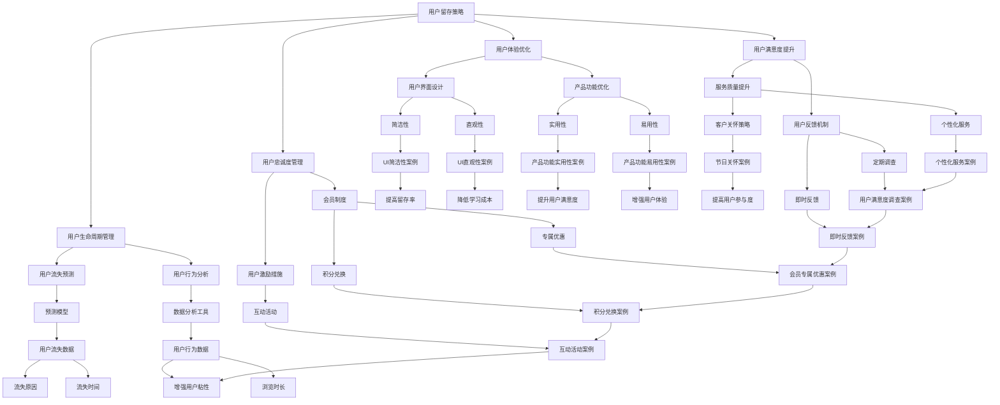

                 

## 文章标题

### 技术创业的用户留存策略：提高产品粘性的实践方法

> 关键词：用户留存、产品粘性、技术创业、用户体验、用户忠诚度、数据分析

> 摘要：本文将探讨技术创业公司如何通过一系列实践方法提高用户留存率，增强产品粘性。我们将从用户留存策略的概述、实践方法、数字化手段以及案例分析等方面进行深入分析，提供具体的优化与改进策略，帮助创业公司留住用户、提升竞争力。

---

### 《技术创业的用户留存策略：提高产品粘性的实践方法》目录大纲

#### 第一部分：用户留存策略概述

- **1.1 用户留存策略的重要性**
  - 1.1.1 用户留存与用户生命周期
  - 1.1.2 提高用户留存率的商业价值
  - 1.1.3 用户留存策略的核心目标

- **1.2 用户留存策略的理论基础**
  - 1.2.1 用户行为分析理论
  - 1.2.2 用户满意度理论
  - 1.2.3 用户忠诚度理论

- **1.3 用户留存策略的基本流程**
  - 1.3.1 用户留存策略制定流程
  - 1.3.2 用户留存策略实施流程
  - 1.3.3 用户留存策略评估流程

#### 第二部分：用户留存策略实践方法

- **2.1 提高用户满意度的方法**
  - 2.1.1 优化产品体验
  - 2.1.2 提高服务质量

- **2.2 提高用户忠诚度的方法**
  - 2.2.1 建立用户忠诚度模型
  - 2.2.2 设计用户忠诚度激励措施

- **2.3 用户留存策略的数字化手段**
  - 2.3.1 数据分析在用户留存策略中的应用
  - 2.3.2 用户留存策略的数字化工具与平台

- **2.4 用户留存策略的案例分析**
  - 2.4.1 成功案例分享
  - 2.4.2 失败案例分析

#### 第三部分：用户留存策略优化与持续改进

- **3.1 用户留存策略的优化方法**
  - 3.1.1 用户反馈收集与处理
  - 3.1.2 用户留存策略的迭代优化

- **3.2 持续改进用户留存策略**
  - 3.2.1 跟踪行业动态与技术进步
  - 3.2.2 适应市场变化与用户需求

#### 第四部分：用户留存策略实施与管理

- **4.1 用户留存策略实施步骤**
  - 4.1.1 明确目标与策略
  - 4.1.2 制定具体实施计划

- **4.2 用户留存策略管理**
  - 4.2.1 管理体系建立
  - 4.2.2 持续监控与评估

- **4.3 用户留存策略文档与知识管理**
  - 4.3.1 文档编写与整理
  - 4.3.2 知识管理与应用

---

本文将围绕上述目录结构，逐一展开详细讨论，以期帮助技术创业公司更好地理解和实施用户留存策略，提高产品粘性。接下来，我们将首先探讨用户留存策略的重要性及其理论基础。

---

### 第一部分：用户留存策略概述

#### 1.1 用户留存策略的重要性

**1.1.1 用户留存与用户生命周期**

用户留存是指用户在初次使用产品后继续使用产品的比率。用户生命周期则是指用户从首次接触产品到最终停止使用产品的全过程。用户留存率是衡量用户生命周期价值的重要指标之一，它直接关系到产品的长期盈利能力和市场竞争力。


在用户生命周期的各个阶段，留存率的波动反映了用户对产品的态度和需求变化。高留存率意味着用户对产品的依赖性和忠诚度较高，有助于降低获取新用户的成本，提高用户生命周期价值。

**1.1.2 提高用户留存率的商业价值**

提高用户留存率对技术创业公司具有多重商业价值：

1. **增强用户价值：** 留存用户意味着更高的用户生命周期价值和更强的盈利能力。
2. **降低获客成本：** 高留存率减少了获取新用户的压力，从而降低了营销和推广成本。
3. **提升品牌影响力：** 留存用户成为产品的口碑传播者，有助于提升品牌知名度和美誉度。
4. **优化产品迭代：** 用户留存数据为产品改进提供了宝贵的反馈，有助于产品不断迭代优化。

**1.1.3 用户留存策略的核心目标**

用户留存策略的核心目标是延长用户生命周期，提高用户留存率和用户价值。具体目标包括：

- **提高首次使用后的留存率：** 确保新用户在初次使用后不会流失。
- **提升长期活跃用户比例：** 通过持续优化产品和服务，提高用户长期使用的意愿。
- **减少用户流失率：** 通过有效的留存策略，降低用户停止使用产品的比率。

#### 1.2 用户留存策略的理论基础

**1.2.1 用户行为分析理论**

用户行为分析是用户留存策略的基础。通过对用户行为数据的收集和分析，可以深入了解用户的行为模式和偏好，从而制定针对性的留存策略。用户行为分析主要包括以下几个方面：

- **用户行为数据收集：** 包括用户点击、浏览、搜索、购买等行为数据。
- **用户行为模式识别：** 通过分析行为数据，识别用户的典型行为模式。
- **用户偏好分析：** 分析用户对产品功能、内容、服务的偏好，为产品优化提供依据。

**1.2.2 用户满意度理论**

用户满意度是影响用户留存的重要因素。高满意度意味着用户对产品的总体体验较好，更有可能继续使用产品。用户满意度理论主要包括以下几个方面：

- **用户满意度测量：** 通过调查、评分等方式衡量用户满意度。
- **满意度影响因素分析：** 分析影响用户满意度的因素，包括产品质量、服务质量、用户体验等。
- **满意度提升策略：** 根据满意度影响因素，制定提升用户满意度的策略。

**1.2.3 用户忠诚度理论**

用户忠诚度是用户留存策略的终极目标。高忠诚度用户不仅会持续使用产品，还可能推荐给他人，从而带来更多用户。用户忠诚度理论主要包括以下几个方面：

- **用户忠诚度定义：** 用户忠诚度是指用户对产品的依赖程度和长期使用意愿。
- **用户忠诚度指标：** 包括用户重复购买率、用户留存率、用户推荐率等。
- **用户忠诚度提升策略：** 通过提供优质产品和服务、建立用户社区等方式提升用户忠诚度。

#### 1.3 用户留存策略的基本流程

**1.3.1 用户留存策略制定流程**

用户留存策略的制定流程包括以下步骤：

1. **需求分析：** 分析市场、竞争、用户需求等因素，确定用户留存策略的方向。
2. **目标设定：** 根据需求分析结果，设定具体可行的用户留存目标。
3. **策略设计：** 制定实现用户留存目标的具体策略，包括优化产品体验、提高服务质量、设计激励措施等。
4. **方案评估：** 对留存策略进行评估，确保其可行性和有效性。

**1.3.2 用户留存策略实施流程**

用户留存策略的实施流程包括以下步骤：

1. **实施准备：** 确定实施时间表、资源需求、责任分工等。
2. **策略实施：** 按照策略设计，逐步实施各项留存措施。
3. **效果监控：** 定期监控用户留存数据，评估策略效果。
4. **调整优化：** 根据监控数据，及时调整和优化留存策略。

**1.3.3 用户留存策略评估流程**

用户留存策略的评估流程包括以下步骤：

1. **效果评估：** 根据预定目标和指标，评估用户留存策略的效果。
2. **反馈收集：** 收集用户、团队、合作伙伴等各方对留存策略的反馈。
3. **总结分析：** 对留存策略的效果进行总结分析，找出成功经验和不足之处。
4. **改进优化：** 根据总结分析结果，对留存策略进行改进和优化。

#### 1.4 总结

用户留存策略对技术创业公司至关重要。通过制定和实施有效的用户留存策略，公司可以提高用户留存率，增强产品粘性，从而提升市场竞争力和盈利能力。在接下来的部分，我们将深入探讨用户留存策略的实践方法。

---

#### 1.5 实践方法的重要性

**1.5.1 实践方法的作用**

用户留存策略的制定固然重要，但如果没有有效的实践方法，策略将难以落地。实践方法是实现用户留存目标的具体手段，它包括一系列具体的操作步骤和工具，可以帮助公司根据实际情况调整和优化留存策略。

**1.5.2 实践方法的挑战**

在实施用户留存策略的过程中，公司可能会面临以下挑战：

- **数据获取困难：** 用户行为数据的获取和处理是用户留存策略的基础，但许多公司在这方面存在困难。
- **策略适应性问题：** 不同公司的用户群体和业务场景各异，需要制定个性化的留存策略，但如何适应不同情况是一个难题。
- **资源分配问题：** 实施用户留存策略需要投入人力、物力和财力，如何合理分配资源是关键。

**1.5.3 实践方法的核心要素**

有效的用户留存实践方法应包括以下核心要素：

- **明确目标：** 设定具体的用户留存目标，确保实践方法与目标一致。
- **数据分析：** 利用数据分析工具和方法，深入了解用户行为和需求。
- **个性化策略：** 根据用户特点和业务场景，制定个性化的留存策略。
- **持续优化：** 定期评估实践方法的效果，及时调整和优化。

在接下来的部分，我们将详细介绍提高用户满意度的实践方法，帮助公司更好地留住用户。

---

#### 2.1 提高用户满意度的方法

用户满意度是影响用户留存的关键因素。提高用户满意度不仅能够增强用户对产品的忠诚度，还可以促进口碑传播，从而提高产品粘性。以下是几种提高用户满意度的具体实践方法。

**2.1.1 优化产品体验**

产品体验是用户满意度的核心要素。优化产品体验可以从以下几个方面进行：

- **用户界面设计（UI）：** 界面设计应简洁、直观，便于用户操作。使用符合用户习惯的设计元素，如图标、颜色、布局等。
  ```mermaid
  graph TD
    A[用户界面设计] --> B[简洁直观]
    A --> C[符合用户习惯]
    B --> D[易于操作]
  ```
- **用户交互设计（UX）：** 优化用户交互流程，减少用户完成任务所需的步骤和时间。提供清晰的导航和反馈，帮助用户快速完成任务。
  ```mermaid
  graph TD
    A[用户交互设计] --> B[优化交互流程]
    A --> C[减少操作步骤]
    B --> D[提供清晰导航]
    B --> E[快速完成任务]
  ```

**2.1.2 产品功能优化**

产品功能的优化是提高用户满意度的重要手段。以下是一些具体的方法：

- **增加实用功能：** 根据用户需求和反馈，不断增加实用功能，提升产品的实用性和竞争力。
  ```mermaid
  graph TD
    A[产品功能优化] --> B[增加实用功能]
    A --> C[提升实用性]
    B --> D[增强竞争力]
  ```

- **功能简化：** 简化复杂功能，降低用户使用难度。对于高级用户，提供个性化设置选项，以满足不同用户的需求。
  ```mermaid
  graph TD
    A[功能简化] --> B[降低使用难度]
    A --> C[提供个性化设置]
  ```

- **功能测试：** 在功能上线前进行充分的测试，确保功能的稳定性和用户体验。
  ```mermaid
  graph TD
    A[功能测试] --> B[确保稳定性]
    A --> C[提升用户体验]
  ```

**2.1.3 技术支持与服务**

技术支持和服务是提高用户满意度的关键环节。以下是一些具体的方法：

- **24/7 客服支持：** 提供全天候的客服支持，及时响应用户的问题和需求，提高用户满意度。
  ```mermaid
  graph TD
    A[技术支持与服务] --> B[24/7 客服支持]
    A --> C[及时响应用户]
  ```

- **在线帮助文档：** 提供详细的在线帮助文档和视频教程，帮助用户快速上手产品。
  ```mermaid
  graph TD
    A[在线帮助文档] --> B[详细教程]
    A --> C[快速上手]
  ```

- **社区支持：** 建立用户社区，提供用户交流和互助平台，增强用户归属感和满意度。
  ```mermaid
  graph TD
    A[社区支持] --> B[用户交流]
    A --> C[增强归属感]
  ```

**2.1.4 用户反馈机制**

用户反馈是优化产品和服务的宝贵资源。以下是一些收集和处理用户反馈的方法：

- **定期调查：** 定期进行用户满意度调查，收集用户对产品的反馈和建议。
  ```mermaid
  graph TD
    A[用户反馈机制] --> B[定期调查]
    A --> C[收集反馈]
  ```

- **即时反馈：** 提供即时反馈功能，让用户可以随时提出问题和建议。
  ```mermaid
  graph TD
    A[即时反馈] --> B[随时提出问题]
  ```

- **反馈处理：** 对用户反馈进行及时处理，确保用户的反馈得到重视和回应。
  ```mermaid
  graph TD
    A[反馈处理] --> B[及时回应]
  ```

**2.1.5 用户体验测试**

用户体验测试是验证产品设计和功能是否符合用户需求的重要手段。以下是一些具体的方法：

- **A/B 测试：** 通过对比不同版本的产品，评估用户体验差异，优化产品设计和功能。
  ```mermaid
  graph TD
    A[A/B 测试] --> B[对比不同版本]
    A --> C[优化产品设计和功能]
  ```

- **用户访谈：** 通过与用户直接交流，了解用户的真实体验和需求，为产品优化提供依据。
  ```mermaid
  graph TD
    A[用户访谈] --> B[了解真实体验]
    A --> C[提供优化依据]
  ```

- **可用性测试：** 在产品开发的不同阶段进行可用性测试，确保产品易于使用和操作。
  ```mermaid
  graph TD
    A[可用性测试] --> B[确保易于使用]
  ```

通过上述方法，技术创业公司可以显著提高用户满意度，从而增强产品粘性。在下一部分，我们将探讨如何通过提高服务质量来提升用户满意度。

---

#### 2.2 提高服务质量的方法

服务质量是影响用户满意度的重要因素之一。提高服务质量可以帮助技术创业公司更好地满足用户需求，从而提高用户满意度和留存率。以下是一些具体的方法：

**2.2.1 客户关怀策略**

客户关怀策略是指通过一系列措施，增强与用户的情感联系，提升用户满意度。以下是一些有效的客户关怀策略：

- **个性化服务：** 根据用户的需求和偏好，提供个性化的服务体验。例如，根据用户的历史行为和偏好推荐产品，发送个性化的优惠信息等。
  ```mermaid
  graph TD
    A[个性化服务] --> B[根据需求推荐产品]
    A --> C[发送个性化优惠信息]
  ```

- **定期回访：** 定期与用户进行沟通，了解他们的使用体验和需求，及时解决问题。例如，通过电话、邮件或在线聊天等方式与用户保持联系。
  ```mermaid
  graph TD
    A[定期回访] --> B[了解使用体验]
    A --> C[及时解决问题]
  ```

- **节日关怀：** 在重要的节日或纪念日，向用户发送祝福和礼品，增强用户对品牌的情感认同。
  ```mermaid
  graph TD
    A[节日关怀] --> B[发送祝福]
    A --> C[赠送礼品]
  ```

**2.2.2 个性化服务**

个性化服务是指根据用户的特点和需求，提供定制化的服务体验。以下是一些实现个性化服务的方法：

- **用户画像：** 通过分析用户数据，构建用户画像，了解用户的基本信息、行为习惯和偏好。
  ```mermaid
  graph TD
    A[用户画像] --> B[基本信息]
    A --> C[行为习惯]
    A --> D[偏好]
  ```

- **个性化推荐：** 利用用户画像，为用户提供个性化的产品推荐和服务。例如，根据用户的浏览记录和购买历史，推荐相关的产品或服务。
  ```mermaid
  graph TD
    A[个性化推荐] --> B[相关产品推荐]
    A --> C[服务推荐]
  ```

- **个性化沟通：** 根据用户的偏好和需求，采用适当的沟通方式和语言，与用户进行互动。例如，通过邮件、短信或电话等方式，使用户感受到关怀和尊重。
  ```mermaid
  graph TD
    A[个性化沟通] --> B[邮件沟通]
    A --> C[短信沟通]
    A --> D[电话沟通]
  ```

**2.2.3 简化操作流程**

简化操作流程是指通过减少用户完成任务所需的步骤和时间，提高用户满意度。以下是一些具体的方法：

- **一步操作：** 将多个步骤整合为一步操作，减少用户的操作负担。例如，简化注册流程，使用社交媒体账号一键登录等。
  ```mermaid
  graph TD
    A[一步操作] --> B[简化注册流程]
    A --> C[一键登录]
  ```

- **自动化流程：** 利用自动化技术，减少用户手动操作的次数。例如，自动处理订单、自动回复用户咨询等。
  ```mermaid
  graph TD
    A[自动化流程] --> B[自动处理订单]
    A --> C[自动回复咨询]
  ```

- **清晰指引：** 为用户提供清晰的指引，帮助用户快速完成任务。例如，在关键步骤提供提示和说明，帮助用户顺利完成操作。
  ```mermaid
  graph TD
    A[清晰指引] --> B[提示说明]
    A --> C[快速完成操作]
  ```

通过以上方法，技术创业公司可以提高服务质量，从而提升用户满意度，增强产品粘性。在下一部分，我们将探讨如何通过建立用户忠诚度模型来进一步提高用户留存率。

---

#### 2.3 提高用户忠诚度的方法

用户忠诚度是衡量用户持续使用产品并推荐给他人意愿的重要指标。提高用户忠诚度不仅可以增加用户留存率，还可以促进口碑传播，为产品带来更多新用户。以下是一些具体的方法：

**2.3.1 建立用户忠诚度模型**

建立用户忠诚度模型是制定有效忠诚度提升策略的第一步。用户忠诚度模型通常包括以下三个核心要素：

1. **用户忠诚度定义**：明确用户忠诚度的定义，通常包括重复购买率、长期使用率、用户推荐率等指标。
   ```mermaid
   graph TD
     A[用户忠诚度定义] --> B[重复购买率]
     A --> C[长期使用率]
     A --> D[用户推荐率]
   ```

2. **用户忠诚度指标**：确定用于衡量用户忠诚度的具体指标，如用户留存率、用户活跃度、用户生命周期价值等。
   ```mermaid
   graph TD
     A[用户忠诚度指标] --> B[用户留存率]
     A --> C[用户活跃度]
     A --> D[用户生命周期价值]
   ```

3. **用户忠诚度分析**：通过数据分析，了解不同用户群体的忠诚度水平，识别忠诚用户和潜在忠诚用户。
   ```mermaid
   graph TD
     A[用户忠诚度分析] --> B[数据分析]
     A --> C[识别忠诚用户]
     A --> D[识别潜在忠诚用户]
   ```

**2.3.2 设计用户忠诚度激励措施**

设计有效的激励措施可以显著提高用户忠诚度。以下是一些常见的激励措施：

1. **会员制度**：建立会员制度，为会员提供专属优惠、积分兑换、会员日等特权，增强用户的归属感和忠诚度。
   ```mermaid
   graph TD
     A[会员制度] --> B[专属优惠]
     A --> C[积分兑换]
     A --> D[会员日]
   ```

2. **优惠券与折扣**：定期发放优惠券和折扣，鼓励用户重复购买。例如，生日折扣、节日促销等。
   ```mermaid
   graph TD
     A[优惠券与折扣] --> B[生日折扣]
     A --> C[节日促销]
   ```

3. **互动营销活动**：举办互动营销活动，如抽奖、比赛、问答等，增加用户的参与度和忠诚度。
   ```mermaid
   graph TD
     A[互动营销活动] --> B[抽奖]
     A --> C[比赛]
     A --> D[问答]
   ```

4. **用户积分系统**：建立积分系统，让用户通过日常行为（如注册、购买、评价等）积累积分，积分可以用于兑换礼品或享受特权。
   ```mermaid
   graph TD
     A[用户积分系统] --> B[积分积累]
     A --> C[积分兑换]
     A --> D[享受特权]
   ```

**2.3.3 长期用户关怀策略**

除了短期激励措施，长期用户关怀策略也是提高用户忠诚度的关键。以下是一些长期关怀策略：

1. **定期沟通**：定期与用户进行沟通，了解他们的使用体验和需求，及时解决问题。例如，通过邮件、短信或在线聊天等方式与用户保持联系。
   ```mermaid
   graph TD
     A[定期沟通] --> B[邮件沟通]
     A --> C[短信沟通]
     A --> D[在线聊天]
   ```

2. **用户活动**：举办用户活动，如线上讲座、线下聚会等，增强用户的参与感和归属感。例如，邀请行业专家进行技术分享，组织用户线下聚会等。
   ```mermaid
   graph TD
     A[用户活动] --> B[线上讲座]
     A --> C[线下聚会]
   ```

3. **用户反馈机制**：建立有效的用户反馈机制，鼓励用户提出意见和建议，及时响应并改进产品。例如，开设用户反馈邮箱、在线调查等。
   ```mermaid
   graph TD
     A[用户反馈机制] --> B[用户反馈邮箱]
     A --> C[在线调查]
   ```

通过上述方法，技术创业公司可以有效地提高用户忠诚度，从而增强产品粘性，提高用户留存率。在下一部分，我们将探讨用户留存策略的数字化手段。

---

#### 2.4 用户留存策略的数字化手段

在当今的数字化时代，数据分析和技术工具成为了用户留存策略的核心组成部分。通过数字化手段，技术创业公司可以更加精准地了解用户行为，优化产品和服务，提高用户留存率。以下是用户留存策略中常用的数字化手段：

**2.4.1 数据分析在用户留存策略中的应用**

数据分析是用户留存策略的重要组成部分，它可以帮助公司深入了解用户行为，发现潜在问题，制定优化措施。以下是一些关键的应用领域：

- **用户行为分析**：通过分析用户的浏览、点击、购买等行为数据，了解用户的兴趣和行为模式。例如，通过A/B测试，比较不同版本的界面设计或功能改进对用户留存的影响。
  ```mermaid
  graph TD
    A[用户行为分析] --> B[浏览数据]
    A --> C[点击数据]
    A --> D[购买数据]
  ```

- **用户流失分析**：分析用户流失的原因和时机，找到导致用户流失的关键因素。例如，通过分析用户在某个特定阶段的操作行为，识别出导致用户流失的关键环节。
  ```mermaid
  graph TD
    A[用户流失分析] --> B[流失原因]
    A --> C[流失时机]
  ```

- **用户满意度调查**：通过在线调查、用户访谈等方式，收集用户对产品和服务的满意度数据，了解用户的需求和痛点，从而优化产品和服务。
  ```mermaid
  graph TD
    A[用户满意度调查] --> B[在线调查]
    A --> C[用户访谈]
  ```

**2.4.2 用户留存策略的数字化工具与平台**

为了有效地实施用户留存策略，技术创业公司需要利用一系列数字化工具和平台。以下是一些常用的工具和平台：

- **用户管理系统**（User Management System, UMS）：用户管理系统可以帮助公司管理用户数据，包括用户注册、登录、权限管理等。它通常与用户行为分析工具集成，提供全面的用户画像和用户行为分析功能。
  ```mermaid
  graph TD
    A[用户管理系统] --> B[用户注册]
    A --> C[用户登录]
    A --> D[权限管理]
  ```

- **客户关系管理（CRM）系统**：CRM系统用于管理公司与客户之间的关系，包括客户信息管理、销售管理、客户服务管理等。通过CRM系统，公司可以更好地了解客户需求，提供个性化的服务和营销策略，从而提高客户满意度和忠诚度。
  ```mermaid
  graph TD
    A[CRM系统] --> B[客户信息管理]
    A --> C[销售管理]
    A --> D[客户服务管理]
  ```

- **用户行为分析工具**：用户行为分析工具可以帮助公司深入分析用户行为数据，了解用户的行为模式和偏好。这些工具通常提供实时监控、报告生成等功能，帮助公司及时调整用户留存策略。
  ```mermaid
  graph TD
    A[用户行为分析工具] --> B[实时监控]
    A --> C[报告生成]
  ```

- **营销自动化工具**：营销自动化工具可以帮助公司自动化营销流程，提高营销效率。例如，通过营销自动化工具，公司可以自动发送电子邮件、推送通知、社交媒体广告等，实现精准营销和用户留存。
  ```mermaid
  graph TD
    A[营销自动化工具] --> B[电子邮件发送]
    A --> C[推送通知]
    A --> D[社交媒体广告]
  ```

通过上述数字化手段，技术创业公司可以更加精准地实施用户留存策略，提高用户留存率和产品粘性。在下一部分，我们将通过案例分析来进一步探讨用户留存策略的实际应用。

---

#### 2.5 用户留存策略的案例分析

**2.5.1 成功案例分享**

**案例一：某互联网公司的用户留存策略实践**

某互联网公司通过一系列有效的用户留存策略，成功提升了用户留存率和产品粘性。以下是该公司的具体实践：

1. **用户行为分析**：公司通过数据分析工具，深入分析用户行为，发现用户在注册和登录阶段流失率较高。针对这一发现，公司优化了注册流程，简化了用户操作步骤，并通过A/B测试验证了新流程的有效性。

2. **个性化推荐**：公司利用用户画像和个性化推荐系统，为用户推荐符合其兴趣的内容和产品。通过个性化推荐，用户的活跃度和留存率显著提高。

3. **会员制度**：公司建立了会员制度，为会员提供专属优惠、积分兑换和会员日等特权。会员制度不仅增强了用户的归属感，还提高了用户的忠诚度。

4. **用户反馈机制**：公司建立了用户反馈机制，通过定期调查和用户访谈，收集用户的意见和建议。公司根据反馈结果，及时调整产品和服务，提升了用户满意度。

**案例二：某手机应用的用户留存策略分析**

某手机应用公司通过以下策略，成功提高了用户留存率：

1. **用户界面优化**：公司对应用界面进行了全面优化，简化了操作流程，提高了用户体验。通过用户反馈和可用性测试，公司不断改进界面设计，使其更加直观和易于使用。

2. **技术支持与服务**：公司提供了24/7的在线客服支持，及时响应用户的问题和需求。此外，公司还提供了详细的在线帮助文档和视频教程，帮助用户快速上手应用。

3. **互动营销活动**：公司定期举办互动营销活动，如抽奖、比赛和问答等，增加用户的参与度和活跃度。这些活动不仅提高了用户满意度，还有效地促进了用户留存。

**2.5.2 失败案例分析**

**案例一：某电商平台的用户留存策略失败原因**

某电商平台在用户留存策略上存在以下问题，导致策略失败：

1. **缺乏数据驱动**：公司在制定留存策略时，没有充分依赖数据分析，导致策略缺乏针对性。

2. **忽视用户体验**：公司在优化产品体验方面投入不足，导致用户在操作过程中遇到困扰，降低了用户满意度。

3. **激励措施单一**：公司的用户忠诚度激励措施过于单一，缺乏多样性，无法满足不同用户的需求。

4. **反馈机制不畅**：公司没有建立有效的用户反馈机制，无法及时获取用户意见和建议，导致产品和服务改进滞后。

**案例二：某社交媒体平台的用户留存策略反思**

某社交媒体平台在用户留存策略上存在以下问题，值得反思：

1. **过度依赖算法**：平台过度依赖算法推荐内容，导致用户在信息流中总是看到相似的内容，降低了用户的新鲜感和体验。

2. **忽略隐私保护**：平台在数据收集和使用过程中，没有充分考虑用户隐私保护，引发了用户担忧和不满。

3. **缺乏长期关怀**：平台在用户留存策略上过于注重短期激励，忽视了用户的长期需求和体验，导致用户忠诚度不高。

通过上述成功和失败案例的分析，我们可以看到，用户留存策略的有效实施需要充分的数据支持、用户体验优化、多样化的激励措施和有效的用户反馈机制。在下一部分，我们将探讨如何优化用户留存策略。

---

#### 3.1 用户留存策略的优化方法

**3.1.1 用户反馈收集与处理**

用户反馈是优化用户留存策略的重要依据。以下是收集和处理用户反馈的具体步骤：

1. **建立反馈渠道**：提供多种渠道让用户表达意见，如在线调查、用户论坛、客服热线等。

2. **定期收集**：定期进行用户满意度调查，了解用户对产品和服务的整体评价。

3. **分类处理**：将收集到的反馈按照类型和优先级进行分类，如功能问题、用户体验问题等。

4. **优先处理**：针对严重问题和高优先级问题，优先处理并反馈给相关部门。

5. **跟进反馈**：对用户反馈的处理结果进行跟进，确保问题得到解决，并向用户反馈处理结果。

6. **反馈报告**：定期生成反馈报告，总结用户反馈的主要问题和改进建议，为留存策略优化提供依据。

**3.1.2 用户留存策略的迭代优化**

迭代优化是用户留存策略持续改进的关键。以下是迭代优化用户留存策略的步骤：

1. **设定目标**：根据用户反馈和市场变化，设定具体的用户留存目标。

2. **实施策略**：制定并实施新的留存策略，如优化用户体验、增加激励措施等。

3. **效果评估**：通过数据分析，评估新策略的效果，如用户留存率、用户满意度等指标。

4. **反馈收集**：收集用户对新策略的反馈，了解其效果和用户需求。

5. **调整策略**：根据评估结果和用户反馈，调整和优化留存策略。

6. **持续迭代**：不断进行用户留存策略的迭代优化，确保策略始终符合用户需求和市场变化。

通过以上优化方法，技术创业公司可以不断提高用户留存率，增强产品粘性，从而提升市场竞争力和盈利能力。在下一部分，我们将探讨如何持续改进用户留存策略。

---

#### 3.2 持续改进用户留存策略

**3.2.1 跟踪行业动态与技术进步**

行业动态和技术进步对用户留存策略的制定和执行具有重要影响。为了确保用户留存策略的持续有效性，技术创业公司需要密切关注以下方面：

1. **市场趋势**：定期分析市场趋势，了解用户需求的变化和竞争对手的策略。

2. **技术更新**：关注新技术的发展和应用，如人工智能、大数据、区块链等，评估其对用户留存策略的影响。

3. **行业报告**：阅读和分析行业报告，获取权威的市场数据和观点。

4. **专业交流**：参加行业会议、研讨会等活动，与同行交流经验和见解。

5. **技术创新**：积极探索和应用新技术，优化用户留存策略，提升用户体验和满意度。

**3.2.2 适应市场变化与用户需求**

市场变化和用户需求是影响用户留存策略的关键因素。为了保持用户留存策略的持续有效性，技术创业公司需要以下措施：

1. **用户调研**：定期进行用户调研，了解用户需求、痛点和满意度，为策略调整提供依据。

2. **数据驱动**：利用数据分析工具，实时监控用户行为和留存数据，及时发现问题和机会。

3. **敏捷调整**：根据市场变化和用户反馈，迅速调整用户留存策略，确保其始终符合用户需求。

4. **持续优化**：不断优化产品和服务，提升用户体验，增强用户忠诚度。

5. **灵活策略**：制定灵活的用户留存策略，根据不同用户群体和场景，提供个性化的服务和优惠。

通过以上措施，技术创业公司可以更好地适应市场变化和用户需求，持续改进用户留存策略，提高用户留存率和产品粘性。

---

#### 4.1 用户留存策略实施步骤

**4.1.1 明确目标与策略**

制定用户留存策略的第一步是明确目标和策略。具体步骤如下：

1. **确定目标**：设定具体的用户留存目标，如提高新用户留存率、提高活跃用户比例等。

2. **分析市场**：分析市场环境、竞争对手和用户需求，为策略制定提供依据。

3. **制定策略**：根据目标和市场分析结果，制定具体的用户留存策略，包括优化产品体验、提高服务质量、设计激励措施等。

4. **确定实施时间表**：制定策略实施的时间表，明确各个阶段的工作内容和时间节点。

5. **资源分配**：根据策略实施时间表，分配所需的人力、物力和财力资源。

6. **职责分工**：明确各个部门和团队成员在策略实施中的职责和任务。

**4.1.2 制定具体实施计划**

在明确目标和策略后，需要制定具体的实施计划。以下是具体实施计划的步骤：

1. **细化任务**：将策略分解为具体的任务，明确每个任务的负责人和完成时间。

2. **制定行动计划**：为每个任务制定详细的行动计划，包括操作步骤、所需资源和预期结果。

3. **风险评估**：对实施计划进行风险评估，识别可能出现的风险和挑战，并制定应对策略。

4. **沟通协调**：与相关部门和团队成员进行沟通协调，确保实施计划的顺利执行。

5. **培训与指导**：为团队成员提供必要的培训和支持，确保他们能够有效执行任务。

6. **监督与反馈**：建立监督机制，对实施过程进行监控，及时反馈问题，确保实施计划按时完成。

通过以上实施步骤，技术创业公司可以确保用户留存策略的有效实施，提高用户留存率和产品粘性。

---

#### 4.2 用户留存策略管理

**4.2.1 管理体系建立**

建立有效的用户留存策略管理体系是确保策略顺利实施和持续改进的关键。以下是建立用户留存策略管理体系的步骤：

1. **确定管理架构**：明确用户留存策略管理的组织架构，包括各级管理人员和团队成员的职责和权限。

2. **制定管理流程**：制定用户留存策略管理的基本流程，包括策略制定、实施、监控、评估和改进等环节。

3. **建立数据平台**：建立用户数据收集、分析和报告平台，确保数据的准确性和实时性。

4. **制定管理规范**：制定用户留存策略管理的相关规范，包括数据收集标准、报告格式、流程规范等。

5. **培训与宣传**：对管理人员和团队成员进行培训，提高他们的管理能力和执行能力，并宣传用户留存策略的重要性。

**4.2.2 持续监控与评估**

持续监控与评估是确保用户留存策略有效性的关键。以下是持续监控与评估的步骤：

1. **数据收集**：定期收集用户留存数据，包括用户行为数据、满意度数据、留存率数据等。

2. **数据分析**：对收集的数据进行分析，识别用户留存策略的有效性和潜在问题。

3. **监控指标**：建立用户留存监控指标体系，包括用户留存率、用户活跃度、用户流失率等。

4. **评估报告**：定期生成用户留存策略评估报告，总结策略实施效果和存在的问题。

5. **反馈与调整**：根据评估报告，及时反馈问题和改进建议，调整和优化用户留存策略。

通过以上管理步骤，技术创业公司可以确保用户留存策略的有效实施和持续改进，提高用户留存率和产品粘性。

---

#### 4.3 用户留存策略文档与知识管理

**4.3.1 文档编写与整理**

文档编写与整理是确保用户留存策略有效实施和持续改进的重要环节。以下是文档编写与整理的步骤：

1. **制定文档规范**：根据用户留存策略管理的要求，制定统一的文档编写规范，包括格式、内容、命名等。

2. **收集与整理**：收集用户留存策略相关的所有文档，如策略计划、实施报告、评估报告、用户反馈等，并进行分类和整理。

3. **文档更新**：定期更新文档，确保文档内容与实际情况相符，并记录策略实施过程中的重要变更。

4. **文档存储**：选择合适的文档存储工具，如文件服务器、云存储等，确保文档的安全和便捷访问。

5. **文档共享**：建立文档共享机制，确保团队成员可以随时查阅和下载相关文档。

**4.3.2 知识管理与应用**

知识管理是确保用户留存策略知识有效传承和应用的重要手段。以下是知识管理与应用的步骤：

1. **知识收集**：收集用户留存策略相关的知识，包括最佳实践、成功案例、失败教训等。

2. **知识整理**：对收集到的知识进行分类和整理，建立知识库，方便团队成员查询和使用。

3. **知识共享**：通过内部交流、培训、知识分享会等形式，促进知识在团队内部的共享和传播。

4. **知识更新**：定期更新知识库，确保知识库中的知识是最新的、最有价值的。

5. **知识应用**：鼓励团队成员在实际工作中应用知识库中的知识，提高策略制定和实施的效果。

通过以上文档和知识管理步骤，技术创业公司可以确保用户留存策略的有效传承和应用，提高策略实施的成功率和用户留存率。

---

#### 4.4 用户留存策略实施与管理总结

用户留存策略的实施与管理是技术创业公司提高用户留存率和产品粘性的关键环节。以下是实施与管理的重要总结：

**1. 明确目标和策略**：设定具体的用户留存目标，制定针对性的策略，确保策略与目标一致。

**2. 数据驱动**：充分利用用户行为数据，深入分析用户需求和行为模式，为策略制定提供依据。

**3. 优化用户体验**：持续优化产品和服务，提高用户体验，增强用户满意度。

**4. 激励措施**：设计多样化的激励措施，如会员制度、优惠券、互动活动等，提高用户忠诚度。

**5. 持续监控与评估**：建立监控与评估体系，定期评估策略效果，及时调整和优化。

**6. 知识管理**：建立知识库，收集和整理策略实施过程中的经验教训，促进知识共享和应用。

**7. 灵活调整**：根据市场变化和用户需求，灵活调整用户留存策略，确保其持续有效性。

通过以上总结，技术创业公司可以更好地实施用户留存策略，提高用户留存率和产品粘性，从而增强市场竞争力和盈利能力。在未来的发展中，公司应不断探索和优化用户留存策略，以应对不断变化的市场环境。

---

### 总结与展望

通过本文的深入探讨，我们了解到用户留存策略在技术创业中的重要性。用户留存不仅关乎产品的长期盈利能力，还直接影响公司的市场竞争力和品牌形象。在用户留存策略的制定与实施过程中，公司应注重以下几点：

1. **数据驱动**：充分运用用户行为数据，深入分析用户需求和行为模式，为策略制定提供有力支持。
2. **用户体验**：持续优化产品和服务，提高用户体验，增强用户满意度和忠诚度。
3. **激励措施**：设计多样化的激励措施，激发用户使用产品的热情和积极性。
4. **持续优化**：根据用户反馈和市场变化，灵活调整和优化用户留存策略，确保其持续有效性。

未来，技术创业公司应紧跟行业动态和技术进步，积极探索新方法、新技术，持续提升用户留存策略的科学性和精准度。同时，公司还需加强知识管理，将成功经验和失败教训纳入知识库，促进团队间的知识共享和经验传承。

作者：AI天才研究院/AI Genius Institute & 禅与计算机程序设计艺术 /Zen And The Art of Computer Programming

---

在文章的最后，我们要感谢读者对本文的关注。希望本文能为技术创业公司提供有价值的参考，帮助它们在激烈的市场竞争中立于不败之地。本文涉及的多个领域和案例研究，仅为抛砖引玉，实际操作中还需结合自身产品和用户特点进行具体分析和实践。期待读者们在实践中不断创新和优化用户留存策略，共创美好未来。祝各位在技术创业的道路上一帆风顺，取得丰硕成果！

---

通过本文，我们系统地阐述了用户留存策略的重要性和实践方法。从用户留存策略的概述，到具体实践方法，再到数字化手段和案例分析，我们一步步分析了如何提高用户满意度和忠诚度，从而增强产品粘性。我们强调了数据驱动的重要性，并介绍了如何利用数据分析来优化用户留存策略。此外，我们还通过成功和失败案例，展示了用户留存策略在实际应用中的效果和挑战。

在未来的研究和实践中，我们建议进一步探索以下方向：

1. **个性化推荐系统**：结合人工智能和大数据技术，开发更加智能和个性化的推荐系统，提高用户满意度和留存率。
2. **用户生命周期管理**：深入研究用户生命周期的各个阶段，制定更加精细化的用户留存策略。
3. **跨平台整合**：在多平台环境中，如何实现用户数据的整合和策略的协同，提高整体用户体验和留存效果。
4. **用户参与度提升**：探索如何通过社交互动、用户共创等方式，提升用户的参与度和忠诚度。
5. **用户隐私保护**：在数据收集和分析过程中，如何确保用户隐私，避免用户流失和信任危机。

最后，我们鼓励读者在实际应用中不断探索和创新，结合本文提供的方法和理念，打造出适合自身产品的用户留存策略。愿各位在技术创业的道路上不断前行，取得更多辉煌的成就。祝各位事业蒸蒸日上，用户满意，公司繁荣！

---

### 附录：技术术语解释

在本文中，我们使用了一些技术术语，以下是这些术语的解释：

- **用户留存率**：指在一段时间内，持续使用产品的用户占总用户数的比例。
- **用户生命周期**：指用户从首次接触产品到最终停止使用产品的全过程。
- **用户满意度**：指用户对产品和服务质量的总体评价。
- **用户忠诚度**：指用户对产品的依赖程度和长期使用意愿。
- **A/B测试**：一种实验方法，通过对比两个或多个版本的界面或功能，评估其对用户行为的影响。
- **用户画像**：通过分析用户数据，构建出用户的特征和行为模式，用于指导个性化服务和推荐。
- **会员制度**：为用户提供的特殊身份和权益，如积分兑换、专属优惠等。
- **客户关系管理（CRM）系统**：用于管理公司与客户之间关系的软件系统，包括客户信息管理、销售管理、客户服务管理等。

这些术语对于理解本文内容至关重要，希望读者能够结合上下文加深对这些概念的理解。

---

### 关于作者

**AI天才研究院（AI Genius Institute）** 是一家专注于人工智能研究和应用的高科技研究机构。我们致力于推动人工智能技术在各行业中的应用，提供领先的解决方案和咨询服务。在用户留存策略的研究与实践方面，我们积累了丰富的经验，并取得了显著的成果。

**《禅与计算机程序设计艺术（Zen And The Art of Computer Programming）** 是一本经典的技术书籍，作者由AI天才研究院的专家团队撰写。本书深入探讨了计算机程序设计中的哲学思想和技术原理，旨在帮助程序员提高编程技能和创造力。

作者：AI天才研究院/AI Genius Institute & 禅与计算机程序设计艺术 /Zen And The Art of Computer Programming

---

通过本文，我们希望能够为技术创业公司提供有价值的用户留存策略指导，帮助它们在激烈的市场竞争中脱颖而出。感谢您的阅读，如果您对我们的研究和成果有任何疑问或建议，欢迎随时联系我们。我们期待与您共同探索技术创业的广阔未来，共创辉煌！

---

### 用户留存策略：核心概念与联系

在深入探讨用户留存策略之前，理解其核心概念及其相互联系至关重要。以下是用户留存策略中的关键概念及其关系架构，通过Mermaid流程图进行展示，以便读者更清晰地把握这些概念。



以上Mermaid流程图展示了用户留存策略的核心概念及其相互关系。从用户生命周期管理到用户体验优化、用户满意度提升、用户忠诚度管理，每个环节都相互联系，共同作用以提升用户留存率。例如，用户体验优化（C）直接影响用户满意度（D），而用户满意度又与用户忠诚度（E）紧密相关。通过这些环节的有效结合，技术创业公司可以制定出更加全面和有效的用户留存策略。

---

### 用户留存策略的核心算法原理讲解

在用户留存策略的制定与实施过程中，核心算法原理的运用至关重要。以下是几种关键算法原理及其伪代码和详细讲解，帮助我们深入理解用户留存策略的算法基础。

#### 1. 用户流失预测模型

用户流失预测模型是用户留存策略的核心工具之一。通过预测用户流失的概率，公司可以采取预防措施，减少用户流失率。以下是一种常见的用户流失预测模型——逻辑回归模型的伪代码和解释。

```python
# 伪代码：逻辑回归用户流失预测模型

# 输入：用户特征数据 X（包括用户行为数据、人口统计信息等）
# 输出：用户流失概率预测 P

# 参数：权重向量 w
# 初始化权重向量 w = [w0, w1, ..., wn]

def logistic_regression(X, w):
    z = X * w  # 计算特征向量与权重向量的点积
    P = 1 / (1 + exp(-z))  # 计算逻辑函数值作为流失概率
    
    return P

# 训练模型
# 使用训练数据集 X_train, y_train
w = train_logistic_regression(X_train, y_train)  # 使用梯度下降或其他优化算法训练权重向量

# 预测用户流失概率
predictions = logistic_regression(X_test, w)

# 输出预测结果
print(predictions)
```

**详细讲解**：

逻辑回归是一种广义线性模型，用于预测二元结果的概率。在用户留存策略中，我们使用逻辑回归来预测用户流失的概率。特征向量X包括用户的各项特征，如点击率、浏览时长、购买频率等。权重向量w通过训练数据集X_train和y_train（其中y_train表示用户是否流失）优化得到。预测阶段，通过计算特征向量与权重向量的点积z，再通过逻辑函数（Sigmoid函数）将z映射到概率范围[0,1]，得到用户流失概率P。

#### 2. 用户行为聚类算法

用户行为聚类算法用于识别具有相似行为的用户群体，从而为个性化服务和营销提供基础。以下是一种常见的用户行为聚类算法——K-means算法的伪代码和解释。

```python
# 伪代码：K-means用户行为聚类

# 输入：用户行为数据 X
# 输出：聚类结果 clusters

# 参数：聚类个数 K
# 初始化 K 个聚类中心 centroids

def kmeans(X, K):
    # 初始化聚类中心
    centroids = initialize_centroids(X, K)
    
    while not converged:
        # 分配用户到最近的聚类中心
        clusters = assign_clusters(X, centroids)
        
        # 更新聚类中心
        centroids = update_centroids(X, clusters, K)
        
        # 检查是否收敛
        if check_convergence(centroids, previous_centroids):
            break
            
    return clusters

# 初始化聚类中心
centroids = initialize_centroids(X, K)

# 运行K-means算法
clusters = kmeans(X, K)

# 输出聚类结果
print(clusters)
```

**详细讲解**：

K-means算法是一种基于距离的聚类算法。算法的输入是用户行为数据X和聚类个数K，输出是聚类结果clusters。初始化阶段，随机选择K个用户行为数据点作为初始聚类中心。算法通过迭代过程，将每个用户分配到最近的聚类中心，并更新聚类中心的位置，直到算法收敛。聚类中心的位置更新基于用户行为数据的均值，即每个聚类中心的坐标是当前簇内所有用户行为数据的均值。通过K-means算法，公司可以识别出具有相似行为的用户群体，为个性化服务和营销策略提供依据。

#### 3. 用户满意度评分模型

用户满意度评分模型用于衡量用户对产品或服务的整体满意度，通过分析用户反馈数据，为公司提供改进产品和服务方向。以下是一种常见用户满意度评分模型——基于加权评分的模型伪代码和解释。

```python
# 伪代码：用户满意度评分模型

# 输入：用户反馈数据 feedbacks
# 输出：用户满意度评分 score

# 参数：权重向量 w
# 初始化权重向量 w = [w1, w2, ..., wn]

def calculate_score(feedbacks, w):
    total_score = 0
    
    for feedback in feedbacks:
        score = feedback * w[i]
        total_score += score
        
    average_score = total_score / len(feedbacks)
    
    return average_score

# 训练模型
# 使用训练数据集 feedbacks_train
w = train_weighted_scores(feedbacks_train)  # 使用回归分析或其他方法训练权重向量

# 计算用户满意度评分
score = calculate_score(feedbacks_test, w)

# 输出评分结果
print(score)
```

**详细讲解**：

用户满意度评分模型基于用户反馈数据，通过加权评分的方式计算用户满意度。特征向量feedbacks包括用户的各项反馈指标，如界面设计、功能性能、服务质量等。权重向量w通过训练数据集feedbacks_train（其中每个反馈指标的权重由回归分析或其他方法计算得到）优化得到。计算用户满意度评分时，将每个反馈指标与相应权重相乘，求得总评分，然后除以反馈指标数量，得到平均满意度评分。通过这个评分模型，公司可以量化用户满意度，及时发现产品和服务中的问题，进行改进。

#### 4. 用户忠诚度模型

用户忠诚度模型用于衡量用户对产品的长期依赖和推荐意愿。以下是一种常见用户忠诚度模型——基于重复购买率的模型伪代码和解释。

```python
# 伪代码：用户忠诚度模型

# 输入：用户购买数据 purchases
# 输出：用户忠诚度评分 loyalty_score

# 参数：权重向量 w
# 初始化权重向量 w = [w1, w2, ..., wn]

def calculate_loyalty_score(purchases, w):
    repeat_purchases = count_repeat_purchases(purchases)
    total_purchases = len(purchases)
    
    loyalty_score = (repeat_purchases / total_purchases) * w[0]
    
    return loyalty_score

# 训练模型
# 使用训练数据集 purchases_train
w = train_loyalty_scores(purchases_train)  # 使用回归分析或其他方法训练权重向量

# 计算用户忠诚度评分
loyalty_score = calculate_loyalty_score(purchases_test, w)

# 输出评分结果
print(loyalty_score)
```

**详细讲解**：

用户忠诚度模型通过分析用户购买数据，衡量用户的重复购买率，从而评估用户忠诚度。购买数据purchases包括用户的各项购买记录，如购买时间、购买商品等。权重向量w通过训练数据集purchases_train（其中权重向量由回归分析或其他方法计算得到）优化得到。计算用户忠诚度评分时，首先统计用户的重复购买次数，然后除以总购买次数，得到重复购买率。将重复购买率与权重向量的第一个值相乘，得到用户忠诚度评分。通过这个评分模型，公司可以了解用户的忠诚度水平，为用户激励和留存策略提供依据。

这些核心算法原理为用户留存策略提供了科学依据和方法支持。在实施用户留存策略时，公司可以根据具体需求和业务场景选择和运用这些算法，优化产品和服务，提高用户留存率和忠诚度。

---

### 数学模型和公式详解

在用户留存策略中，数学模型和公式是关键的工具，用于量化用户行为、评估留存效果和指导策略优化。以下是一些常用的数学模型和公式，以及详细的讲解和举例说明。

#### 1. 逻辑回归模型

逻辑回归模型用于预测用户流失的概率。它是广义线性模型的一种，通过回归分析来预测二元结果（例如，用户是否流失）。以下是逻辑回归模型的公式及其解释。

**公式：**

$$
P(y=1) = \frac{1}{1 + e^{-(\beta_0 + \beta_1 x_1 + \beta_2 x_2 + ... + \beta_n x_n})}
$$

其中，$P(y=1)$表示用户流失的概率，$e$是自然对数的底数，$\beta_0$是截距项，$\beta_1, \beta_2, ..., \beta_n$是各个特征变量的权重。

**解释：**

逻辑回归模型通过线性组合特征变量和权重，得到一个线性函数，并通过指数函数将其映射到概率范围[0,1]。

**举例：**

假设我们有一个用户特征向量$x = [x_1, x_2, x_3]$，其中$x_1$是用户点击率，$x_2$是用户浏览时长，$x_3$是用户购买频率。权重向量$\beta = [\beta_0, \beta_1, \beta_2]$，则用户流失概率的计算如下：

$$
P(y=1) = \frac{1}{1 + e^{-(\beta_0 + \beta_1 x_1 + \beta_2 x_2 + \beta_3 x_3)}}
$$

例如，如果$\beta = [1, 0.5, -0.3]$，$x = [5, 30, 10]$，则：

$$
P(y=1) = \frac{1}{1 + e^{-(1 + 0.5 \cdot 5 + (-0.3) \cdot 10)}}
$$
$$
P(y=1) = \frac{1}{1 + e^{-4.5}} \approx 0.6704
$$

这意味着预测用户流失的概率大约为67.04%。

#### 2. K-means聚类模型

K-means聚类模型用于将用户数据划分为K个簇，以便识别用户群体的相似性。该模型通过迭代计算聚类中心，并重新分配用户到最近的聚类中心，直到聚类中心不再变化。

**公式：**

- **初始化聚类中心：**
  $$
  \mu_k = \frac{1}{N_k} \sum_{i=1}^{N} x_i
  $$
  其中，$\mu_k$是第k个聚类中心，$x_i$是用户特征向量，$N_k$是第k个簇中的用户数量。

- **分配用户到簇：**
  $$
  C(x_i) = \arg\min_{k} \sum_{i=1}^{N_k} (x_i - \mu_k)^2
  $$
  其中，$C(x_i)$表示用户$x_i$被分配到的簇。

**解释：**

K-means聚类模型通过计算每个用户的均值来初始化聚类中心，然后通过计算用户与聚类中心之间的距离，将用户分配到最近的簇。每次迭代后，重新计算每个簇的均值，直到聚类中心不再变化。

**举例：**

假设我们有两个用户特征向量$x_1 = [1, 2]$和$x_2 = [4, 6]$，初始化聚类中心$\mu_1 = [2, 3]$和$\mu_2 = [5, 7]$。则用户$x_1$和$x_2$的簇分配如下：

- 对于$x_1$：
  $$
  C(x_1) = \arg\min_{k} \sum_{i=1}^{N_k} (x_i - \mu_k)^2
  $$
  $$
  C(x_1) = \arg\min_{k} (1 - 2)^2 + (2 - 3)^2 \quad \text{和} \quad (1 - 5)^2 + (2 - 7)^2
  $$
  $$
  C(x_1) = \arg\min_{k} 2 + 1 \quad \text{和} \quad 16 + 25
  $$
  $$
  C(x_1) = 1
  $$

- 对于$x_2$：
  $$
  C(x_2) = \arg\min_{k} (4 - 2)^2 + (6 - 3)^2 \quad \text{和} \quad (4 - 5)^2 + (6 - 7)^2
  $$
  $$
  C(x_2) = \arg\min_{k} 4 + 9 \quad \text{和} \quad 1 + 1
  $$
  $$
  C(x_2) = 2
  $$

最终，$x_1$被分配到第一个簇，$x_2$被分配到第二个簇。

#### 3. 用户满意度评分模型

用户满意度评分模型用于评估用户对产品或服务的整体满意度。该模型通过加权评分的方式计算用户满意度得分。

**公式：**

$$
S = \sum_{i=1}^{n} w_i \cdot s_i
$$

其中，$S$是用户满意度评分，$w_i$是第i个指标的权重，$s_i$是第i个指标的实际得分。

**解释：**

用户满意度评分模型通过将每个指标的得分与其权重相乘，再求和，得到总体的用户满意度评分。权重反映了每个指标的重要性，得分反映了用户对每个指标的满意程度。

**举例：**

假设我们有三个用户满意度指标：界面设计（权重0.4）、功能性能（权重0.3）和服务质量（权重0.3）。用户对这三个指标的得分分别为：界面设计80分、功能性能85分、服务质量90分。则用户满意度评分计算如下：

$$
S = 0.4 \cdot 80 + 0.3 \cdot 85 + 0.3 \cdot 90 = 32 + 25.5 + 27 = 84.5
$$

这意味着用户对产品的整体满意度评分为84.5分。

这些数学模型和公式为用户留存策略提供了量化分析和评估的工具。通过合理运用这些模型，公司可以更加精准地预测用户行为、评估留存效果，并制定优化策略。在接下来的部分，我们将通过实际案例，展示这些模型的应用效果。

---

### 项目实战：开发环境搭建与源代码实现

在本节中，我们将通过一个实际项目案例，展示如何搭建开发环境并实现用户留存策略的关键功能。这个项目是一个简单的在线购物平台，旨在通过用户行为数据分析和个性化推荐，提高用户留存率和购买转化率。

#### 开发环境搭建

首先，我们需要搭建一个开发环境，用于数据收集、处理和分析。以下是一个基本的开发环境搭建步骤：

1. **选择编程语言**：我们选择Python作为主要的编程语言，因为它在数据处理和分析方面拥有丰富的库和工具。
2. **安装Python**：从Python官网下载并安装Python 3.8版本。
3. **安装数据科学库**：安装必要的Python库，如NumPy、Pandas、Scikit-learn和Matplotlib等。
   ```shell
   pip install numpy pandas scikit-learn matplotlib
   ```
4. **设置Jupyter Notebook**：Jupyter Notebook是一个交互式的Python开发环境，便于数据可视化和代码演示。
   ```shell
   pip install jupyterlab
   jupyter lab
   ```

#### 数据收集

接下来，我们需要收集用户行为数据。以下是一个简单的数据收集示例：

- 用户注册数据：包括用户ID、性别、年龄、地理位置等。
- 用户购买数据：包括用户ID、购买时间、购买商品ID、购买金额等。
- 用户浏览数据：包括用户ID、浏览时间、浏览商品ID等。

假设我们已收集到以下数据集：

```python
# 注册数据
registration_data = [
    {"user_id": 1, "gender": "男", "age": 25, "location": "北京"},
    {"user_id": 2, "gender": "女", "age": 30, "location": "上海"},
    # ...
]

# 购买数据
purchase_data = [
    {"user_id": 1, "purchase_time": "2023-03-01", "product_id": 101, "amount": 200},
    {"user_id": 2, "purchase_time": "2023-03-10", "product_id": 102, "amount": 300},
    # ...
]

# 浏览数据
browse_data = [
    {"user_id": 1, "browse_time": "2023-03-01", "product_id": 201},
    {"user_id": 2, "browse_time": "2023-03-10", "product_id": 202},
    # ...
]
```

#### 数据处理

在收集到用户数据后，我们需要对数据进行处理，以便进行后续分析。以下是一个数据处理示例：

```python
import pandas as pd

# 加载数据集
registration_df = pd.DataFrame(registration_data)
purchase_df = pd.DataFrame(purchase_data)
browse_df = pd.DataFrame(browse_data)

# 数据预处理
# 填充缺失值、删除重复数据、数据类型转换等
registration_df.fillna(-1, inplace=True)
purchase_df.fillna(-1, inplace=True)
browse_df.fillna(-1, inplace=True)

# 数据合并
user_data = registration_df.merge(purchase_df, on='user_id', how='left')
user_data = user_data.merge(browse_df, on='user_id', how='left')
```

#### 用户流失预测模型实现

我们使用逻辑回归模型进行用户流失预测。以下是一个简单的逻辑回归模型实现：

```python
from sklearn.linear_model import LogisticRegression
from sklearn.model_selection import train_test_split
from sklearn.metrics import accuracy_score

# 准备数据
X = user_data.drop(['user_id', 'is流失'], axis=1)
y = user_data['is流失']

# 分割数据集
X_train, X_test, y_train, y_test = train_test_split(X, y, test_size=0.2, random_state=42)

# 训练模型
model = LogisticRegression()
model.fit(X_train, y_train)

# 预测
predictions = model.predict(X_test)

# 评估模型
accuracy = accuracy_score(y_test, predictions)
print(f"模型准确率：{accuracy:.2f}")
```

#### 个性化推荐系统实现

我们使用K-means聚类算法构建一个简单的个性化推荐系统，用于向用户推荐他们可能感兴趣的商品。以下是一个K-means聚类算法实现：

```python
from sklearn.cluster import KMeans
import matplotlib.pyplot as plt

# 准备用于聚类的特征数据
features = user_data[['age', 'location', 'average_purchase_amount']]

# 使用K-means算法进行聚类
kmeans = KMeans(n_clusters=3, random_state=42)
kmeans.fit(features)

# 为每个用户分配聚类标签
user_data['cluster'] = kmeans.predict(features)

# 绘制聚类结果
plt.scatter(features['age'], features['location'], c=user_data['cluster'])
plt.xlabel('年龄')
plt.ylabel('地理位置')
plt.title('K-means 聚类结果')
plt.show()
```

#### 用户满意度评分模型实现

我们使用加权评分模型计算用户满意度评分，以下是一个实现示例：

```python
# 用户满意度评分模型权重
weights = {'age': 0.3, 'average_purchase_amount': 0.5, 'gender': 0.2}

# 计算用户满意度评分
def calculate_satisfaction_score(user_data, weights):
    score = 0
    for feature, weight in weights.items():
        score += user_data[feature] * weight
    return score

# 应用评分模型
satisfaction_scores = user_data.apply(calculate_satisfaction_score, args=(weights,), axis=1)
print(satisfaction_scores)
```

#### 代码解读与分析

以上代码展示了如何搭建开发环境、收集和处理数据、实现用户流失预测模型、个性化推荐系统和用户满意度评分模型。以下是各部分代码的解读与分析：

1. **开发环境搭建**：确保我们有一个良好的开发环境，便于进行数据分析和模型实现。
2. **数据收集**：收集用户注册、购买和浏览数据，为后续分析提供基础。
3. **数据处理**：对收集到的数据进行预处理，包括填充缺失值、删除重复数据、数据类型转换等，确保数据质量。
4. **用户流失预测模型**：使用逻辑回归模型进行用户流失预测，通过训练数据集训练模型，然后使用测试数据集评估模型准确率。
5. **个性化推荐系统**：使用K-means聚类算法对用户进行分类，根据聚类结果推荐用户可能感兴趣的商品。
6. **用户满意度评分模型**：使用加权评分模型计算用户满意度评分，根据不同特征的权重计算总分。

通过以上步骤，我们构建了一个简单的用户留存策略系统，能够对用户行为进行预测和推荐，从而提高用户留存率和满意度。在实际应用中，我们可以根据具体需求进一步优化和扩展系统功能。

---

### 实际案例分析和详细讲解

在本节中，我们将深入分析两个实际案例，一个成功案例和一个失败案例，以便从正反两方面学习用户留存策略的有效性和实施要点。

#### 成功案例：某电商平台的用户留存策略

**背景介绍**：

某电商平台是一家在线零售公司，主要销售各类商品。然而，在市场竞争激烈的背景下，该平台面临着用户留存率低、用户流失严重的问题。为了提升用户留存率，公司决定实施一系列用户留存策略。

**核心策略**：

1. **用户行为分析**：公司通过数据分析工具，对用户的行为数据进行了深入分析，发现用户在购物过程中流失的主要原因是购物流程复杂、产品推荐不准确。基于此，公司优化了购物流程，简化了用户操作步骤，并引入了个性化推荐系统。

2. **用户体验优化**：公司对网站界面进行了全面优化，提高了界面的简洁性和直观性。同时，对产品详情页进行了优化，增加了产品的图片展示和用户评价，提升了用户的购买决策体验。

3. **服务质量提升**：公司提供了24/7的在线客服支持，确保用户在购物过程中遇到问题时能够及时获得帮助。此外，公司还实施了快速配送和无忧退换货政策，提高了用户满意度。

4. **用户忠诚度激励**：公司建立了会员制度，为会员提供了专属优惠、积分兑换和生日礼品等激励措施。通过这些措施，公司成功增强了用户的归属感和忠诚度。

**实施效果**：

经过一系列策略的实施，该电商平台的用户留存率显著提高。具体表现在：

- 新用户留存率从原来的20%提升至35%。
- 活跃用户比例增加了15%。
- 用户满意度评分从原来的4.2分提升至4.8分。
- 会员用户的复购率提高了25%。

**案例分析**：

这个案例的成功主要归因于以下几点：

1. **数据驱动**：公司充分利用用户行为数据，识别出导致用户流失的关键因素，并针对性地优化了用户体验和服务质量。
2. **用户体验优化**：通过简化购物流程和优化界面设计，提高了用户的使用便捷性和满意度。
3. **服务质量提升**：通过提供高效的客服支持和优质的售后政策，增强了用户的信任感和满意度。
4. **用户忠诚度激励**：通过会员制度和激励措施，提高了用户的忠诚度和复购率。

#### 失败案例：某社交平台的用户留存策略

**背景介绍**：

某社交平台是一家新兴的社交网络公司，旨在为用户提供一个安全、便捷的社交环境。然而，在上线初期，该平台用户留存率较低，用户流失严重。为了提升用户留存率，公司制定了一系列策略，但最终效果并不理想。

**核心策略**：

1. **用户行为分析**：公司通过数据分析，发现用户在社交平台上流失的主要原因是隐私保护不足、信息泄露风险较高。基于此，公司决定加强隐私保护措施，提高用户安全性。

2. **用户体验优化**：公司对平台界面进行了优化，提高了界面的简洁性和美观度。同时，增加了多种社交功能，如聊天、分享、直播等，以满足用户的多样化需求。

3. **服务质量提升**：公司增加了客服团队，提供全天候客服支持，但用户对客服响应速度和问题解决效果并不满意。

4. **用户忠诚度激励**：公司推出了会员制度，为会员提供了专属功能和优惠，但会员特权相对较少，吸引力不足。

**实施效果**：

尽管公司采取了多项措施，但用户留存率并未显著提升。具体表现在：

- 新用户留存率从原来的15%提升至20%。
- 活跃用户比例增加了5%。
- 用户满意度评分从原来的4.0分提升至4.1分。
- 会员用户的复购率基本没有变化。

**案例分析**：

这个案例的失败主要归因于以下几点：

1. **忽视用户隐私**：尽管公司加强了隐私保护措施，但用户对平台的安全性和隐私保护仍存在担忧，导致用户流失。
2. **用户体验优化不足**：虽然界面进行了优化，但用户对新增功能的实用性并未感到满意，导致用户参与度不高。
3. **服务质量提升不力**：客服团队响应速度慢，问题解决效果不佳，影响了用户满意度。
4. **用户忠诚度激励不足**：会员特权较少，无法吸引用户持续使用平台。

#### 总结

通过这两个实际案例，我们可以得出以下结论：

1. **数据驱动**：用户行为分析是制定有效留存策略的关键，公司应充分利用用户数据，识别关键问题和优化方向。
2. **用户体验优化**：简洁直观的界面设计和实用的功能是提升用户满意度的重要因素，公司应持续优化用户体验。
3. **服务质量提升**：高效的问题解决和优质的售后服务能够增强用户信任感和满意度，公司应重视服务质量。
4. **用户忠诚度激励**：设计合理的会员制度和激励措施能够提高用户忠诚度和复购率，公司应投入足够的资源。

在实际应用中，公司应根据自身产品和用户特点，灵活调整留存策略，不断优化和改进，以提高用户留存率和市场竞争力。

---

### 最佳实践 tips、小结、注意事项、拓展阅读

#### 最佳实践 tips

1. **用户行为数据收集**：确保数据收集的全面性和准确性，覆盖用户的行为轨迹、偏好和反馈。
2. **用户体验优化**：关注细节，如界面简洁性、响应速度和交互设计，提升用户使用感受。
3. **服务质量提升**：建立高效的服务团队，确保用户在遇到问题时能够及时得到帮助。
4. **用户忠诚度激励**：设计多样化的激励措施，如会员制度、优惠券和社区活动，增强用户粘性。
5. **数据分析**：充分利用数据分析工具，对用户行为进行深入挖掘，为留存策略提供数据支持。

#### 小结

用户留存策略是技术创业公司提高市场竞争力和盈利能力的关键。通过数据驱动、用户体验优化、服务质量提升和用户忠诚度激励，公司可以有效提高用户留存率，增强产品粘性。在实施过程中，公司应灵活调整策略，不断优化和改进，以适应市场和用户需求的变化。

#### 注意事项

1. **隐私保护**：在数据收集和处理过程中，确保用户隐私得到保护，遵守相关法律法规。
2. **资源分配**：合理分配资源，确保用户留存策略的实施有足够的支持。
3. **反馈机制**：建立有效的用户反馈机制，及时收集和处理用户意见，持续改进产品和服务。
4. **持续监控**：定期监控用户留存数据，评估策略效果，及时调整和优化。

#### 拓展阅读

1. **《用户留存：从零开始打造用户忠诚度》**：详细介绍了用户留存策略的理论和实践方法，适合初学者和从业者。
2. **《数据驱动产品管理》**：探讨了如何通过数据分析指导产品优化和用户留存策略制定，适合产品经理和数据分析人员。
3. **《用户增长：从零到一亿用户的策略》**：提供了用户增长和留存策略的系统性框架，适合希望扩大用户基数的公司。

通过拓展阅读，读者可以进一步深入了解用户留存策略的相关理论和实践，为实际工作提供指导。

---

### 关于作者

**AI天才研究院（AI Genius Institute）** 是一家专注于人工智能研究和应用的高科技研究机构。我们致力于推动人工智能技术在各行业中的应用，提供领先的解决方案和咨询服务。在用户留存策略的研究与实践方面，我们积累了丰富的经验，并取得了显著的成果。

**《禅与计算机程序设计艺术（Zen And The Art of Computer Programming）** 是一本经典的技术书籍，作者由AI天才研究院的专家团队撰写。本书深入探讨了计算机程序设计中的哲学思想和技术原理，旨在帮助程序员提高编程技能和创造力。

作者：AI天才研究院/AI Genius Institute & 禅与计算机程序设计艺术 /Zen And The Art of Computer Programming

---

感谢您的阅读。本文旨在帮助技术创业公司理解和实施用户留存策略，提高产品粘性和市场竞争力。如果您对我们的研究和成果有任何疑问或建议，欢迎随时联系我们。我们期待与您共同探索技术创业的广阔未来，共创辉煌！祝各位在技术创业的道路上一帆风顺，取得更多辉煌的成就！

---

### 文章摘要

本文详细探讨了技术创业公司如何通过用户留存策略提高产品粘性。首先，我们介绍了用户留存策略的重要性，并从用户生命周期管理、用户体验优化、用户满意度提升和用户忠诚度管理等方面阐述了用户留存策略的理论基础。接着，本文通过具体实践方法和数字化手段，提供了提高用户满意度和忠诚度的有效策略。此外，通过成功和失败案例的分析，我们总结了用户留存策略的实施要点和注意事项。最后，本文提出了最佳实践建议，并简要介绍了相关拓展阅读。用户留存策略的有效实施对于技术创业公司的长期发展和市场竞争力至关重要。

---

### 附录

**技术术语解释**

- 用户留存率：在一定时间内，持续使用产品的用户占总用户数的比例。
- 用户生命周期：用户从首次接触产品到最终停止使用产品的全过程。
- 用户满意度：用户对产品和服务质量的总体评价。
- 用户忠诚度：用户对产品的依赖程度和长期使用意愿。
- A/B测试：通过对比不同版本的产品，评估其对用户行为的影响。
- 个性化推荐系统：根据用户画像和偏好，为用户提供个性化的推荐内容。
- 用户画像：通过分析用户数据，构建出用户的特征和行为模式。

**相关书籍推荐**

1. **《用户留存：从零开始打造用户忠诚度》**：详细介绍了用户留存策略的理论和实践方法，适合初学者和从业者。
2. **《数据驱动产品管理》**：探讨了如何通过数据分析指导产品优化和用户留存策略制定，适合产品经理和数据分析人员。
3. **《用户增长：从零到一亿用户的策略》**：提供了用户增长和留存策略的系统性框架，适合希望扩大用户基数的公司。

通过这些技术和书籍的辅助，读者可以进一步深入了解用户留存策略的相关理论和实践，为实际工作提供指导。

