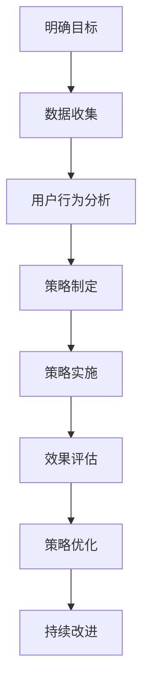

                 

### 文章标题

《技术创业的用户留存策略：提高产品粘性的方法》

> 关键词：用户留存、产品粘性、用户行为分析、用户体验优化、社交互动策略

> 摘要：本文将深入探讨技术创业领域中的用户留存策略，通过分析用户行为、优化产品设计、提升用户体验和实施社交互动策略等方面，提供一系列提高产品粘性的方法。文章旨在帮助创业者更好地理解和实施用户留存策略，从而提升产品在竞争激烈的市场中的竞争力。

### 第一部分：用户留存策略基础

#### 1. 用户留存策略概述

用户留存策略是指企业为了提高用户持续使用产品或服务的概率，采取的一系列有针对性的措施和方法。在技术创业领域，用户留存策略至关重要，因为高留存率意味着更高的用户价值、更高的市场份额和更好的长期盈利能力。

**1.1 用户留存的重要性**

- **用户留存与商业价值**：用户留存直接关系到产品的商业价值。高留存率的用户不仅为企业带来持续的收入，还可能通过口碑传播吸引更多新用户。

- **用户留存策略框架**：用户留存策略主要包括以下四个方面：
  - 提高用户满意度：通过优化产品功能和用户体验，提升用户对产品的满意度。
  - 优化用户体验：改进产品的易用性、交互性和性能，使用户在使用过程中感受到愉悦。
  - 增强用户忠诚度：通过提供优质的客户服务和个性化体验，培养用户对品牌的忠诚度。
  - 提高用户活跃度：激发用户的参与度和互动性，提高用户在产品中的活跃度。

**1.2 用户留存率计算方法**

- **留存率的计算公式**：用户留存率是指在一定时间内，返回使用产品的用户占总用户数的比例。计算公式如下：
  $$ 
  \text{留存率} = \frac{\text{返回用户数}}{\text{初始用户数}} \times 100\% 
  $$

- **影响留存率的因素分析**：
  - 产品质量：产品功能是否完善，是否满足用户需求，直接影响用户留存。
  - 用户满意度：用户对产品的满意度越高，留存率越高。
  - 用户体验：产品的易用性、交互性和性能直接影响用户的留存意愿。
  - 竞争环境：市场竞争激烈时，用户可能更容易流失，留存率下降。

**1.3 用户留存策略的核心目标**

- **提高用户满意度**：通过不断优化产品功能和用户体验，提升用户对产品的满意度，从而提高留存率。

- **优化用户体验**：改进产品的易用性、交互性和性能，使用户在使用过程中感受到愉悦，提高留存率。

- **增强用户忠诚度**：通过提供优质的客户服务和个性化体验，培养用户对品牌的忠诚度，从而提高留存率。

- **提高用户活跃度**：激发用户的参与度和互动性，提高用户在产品中的活跃度，进一步促进用户留存。

### 第二部分：用户行为分析

#### 2. 用户行为分析

用户行为分析是指通过收集和分析用户在使用产品过程中的行为数据，来了解用户需求、行为模式和使用习惯，从而为产品优化和用户留存策略提供依据。

**2.1 用户行为数据分析**

- **用户行为数据的收集**：收集用户行为数据是用户行为分析的基础。常见的数据收集方法包括：
  - 日志分析：通过分析用户在产品中的操作日志，获取用户行为数据。
  - 用户调研：通过问卷、访谈等方式，直接收集用户对产品的反馈和意见。
  - 用户反馈：收集用户在产品中的反馈和建议，了解用户的需求和痛点。

- **用户行为数据的处理**：处理用户行为数据是为了将原始数据转化为有用的信息。常见的数据处理方法包括：
  - 数据清洗：去除重复、错误和无用数据，提高数据质量。
  - 数据整合：将不同来源的数据进行整合，形成一个完整的用户行为数据集。
  - 数据分析：利用统计分析、机器学习等方法，分析用户行为数据，提取有用信息。

- **用户行为数据可视化**：用户行为数据可视化是将数据转化为图形或图表，以便于分析和理解。常见的数据可视化方法包括：
  - 仪表盘：将多个指标和图表整合到一个界面中，方便监控和分析。
  - 词云：通过文字的大小和颜色，展示用户行为的集中趋势和热点。
  - 交互式图表：允许用户通过点击、拖动等操作，深入挖掘数据细节。

**2.2 用户行为模式识别**

- **常见用户行为模式**：用户行为模式是指用户在使用产品过程中形成的具有规律性的行为特征。常见用户行为模式包括：
  - 活跃时段：用户在一天中的活跃时间分布。
  - 活跃频率：用户在产品中的访问频率和活跃度。
  - 活跃路径：用户在产品中的操作路径和使用流程。
  - 活跃内容：用户在产品中关注和互动的内容。

- **用户行为模式识别方法**：用户行为模式识别是指通过分析用户行为数据，识别出用户行为模式的算法和方法。常见的方法包括：
  - 聚类分析：将具有相似行为的用户进行分组，形成用户行为群体。
  - 机器学习：利用机器学习算法，从用户行为数据中自动识别出行为模式。
  - 关联规则挖掘：通过分析用户行为数据之间的关联关系，识别出用户行为模式。

- **用户行为模式应用**：用户行为模式识别可以帮助企业更好地了解用户需求和行为，从而优化产品设计和用户留存策略。具体应用包括：
  - 产品功能优化：根据用户行为模式，优化产品的功能设计和用户体验。
  - 用户留存策略制定：根据用户行为模式，制定针对性的用户留存策略。
  - 用户细分：根据用户行为模式，对用户进行细分，提供个性化的产品和服务。

**2.3 用户生命周期分析**

- **用户生命周期的定义**：用户生命周期是指用户从首次接触到产品，到最终停止使用产品的一个完整过程。用户生命周期可以分为以下几个阶段：
  - 新用户期：用户首次接触产品的阶段，此时用户对产品的了解和信任度较低。
  - 活跃期：用户开始频繁使用产品的阶段，此时用户对产品的满意度和忠诚度逐渐提升。
  - 成熟期：用户持续使用产品的阶段，此时用户对产品的依赖性和忠诚度较高。
  - 疏离期：用户逐渐减少使用产品的阶段，此时用户对产品的兴趣和满意度下降。
  - 流失期：用户停止使用产品的阶段，此时用户对产品的忠诚度和依赖性消失。

- **用户生命周期的阶段划分**：用户生命周期的阶段划分有助于企业更好地了解用户在不同阶段的需求和行为，从而制定针对性的用户留存策略。常见的用户生命周期阶段划分方法包括：
  - 时间分割法：根据用户在产品中的活跃时间，将用户生命周期划分为不同的阶段。
  - 行为分割法：根据用户在产品中的行为特征，将用户生命周期划分为不同的阶段。
  - 混合分割法：结合时间和行为特征，将用户生命周期划分为不同的阶段。

- **用户生命周期管理策略**：用户生命周期管理是指企业通过制定和实施一系列策略，引导用户在生命周期中的不同阶段实现价值最大化。常见的用户生命周期管理策略包括：
  - 新用户期策略：通过推广活动、新手教程、优惠活动等方式，吸引新用户并提升他们的满意度和忠诚度。
  - 活跃期策略：通过个性化推荐、用户互动、服务质量提升等方式，保持用户的活跃度和满意度。
  - 成熟期策略：通过用户关怀、品牌建设、用户参与等方式，增强用户的忠诚度和依赖性。
  - 疏离期策略：通过挽回活动、用户反馈、问题解决等方式，尝试挽回流失的用户。
  - 流失期策略：通过分析流失原因、改进产品和服务等方式，降低用户的流失率。

### 第三部分：提高用户留存策略

#### 3. 提高用户留存的具体策略

提高用户留存需要从多个方面入手，包括产品设计、用户体验优化、用户激励和社交互动策略等。

**3.1 产品设计策略**

产品设计策略是指通过优化产品的功能、界面和服务，提高用户的满意度和留存率。

- **产品功能优化**：
  - **功能完整性**：确保产品功能完整，满足用户的基本需求。
  - **功能易用性**：优化产品功能的设计，提高用户的易用性。
  - **功能创新性**：引入创新的功能，提升产品的竞争力。

- **产品界面设计**：
  - **界面美观性**：设计美观、统一的界面，提升用户体验。
  - **界面易用性**：优化界面布局，使操作简单易懂。
  - **界面个性化**：根据用户偏好，提供个性化的界面设计。

- **产品服务优化**：
  - **服务质量**：提供优质的客户服务，解决用户的问题和困惑。
  - **服务速度**：提高服务的响应速度，提升用户体验。
  - **服务个性化**：根据用户需求，提供个性化的服务方案。

**3.2 用户体验优化**

用户体验优化是指通过改进产品的易用性、交互性和性能，提高用户的满意度。

- **用户体验评估方法**：
  - **满意度调查**：通过用户满意度调查，了解用户对产品的满意程度。
  - **行为数据分析**：通过分析用户行为数据，发现用户在产品中的痛点和问题。
  - **用户测试**：邀请用户参与产品测试，收集用户的反馈和建议。

- **用户体验优化流程**：
  - **需求分析**：了解用户需求，确定优化目标。
  - **方案设计**：设计优化方案，包括界面设计、功能优化等。
  - **实施优化**：按照设计方案，实施优化措施。
  - **效果评估**：评估优化效果，持续改进。

- **用户体验优化案例**：
  - **案例1**：某电商平台通过优化产品界面设计，提高了用户的购物体验，留存率提升了10%。
  - **案例2**：某在线教育平台通过优化课程内容和学习流程，提升了用户的学习效果和满意度，留存率提升了15%。

**3.3 用户激励策略**

用户激励策略是指通过提供奖励、优惠、活动等方式，激发用户的参与度和活跃度，提高留存率。

- **用户激励机制设计**：
  - **积分制度**：通过积分制度，激励用户完成任务、提升活跃度。
  - **优惠券制度**：通过优惠券制度，吸引新用户并提高老用户的留存率。
  - **活动奖励**：举办各类活动，提供奖励，激励用户参与。

- **用户激励方法应用**：
  - **推送通知**：通过推送通知，提醒用户参与活动和领取奖励。
  - **个性化推荐**：根据用户行为和偏好，推荐相关的产品和活动。
  - **社交互动**：鼓励用户在社交平台上分享产品和使用体验。

- **用户激励效果评估**：
  - **用户留存率**：评估激励措施对用户留存率的影响。
  - **用户活跃度**：评估激励措施对用户活跃度的影响。
  - **用户满意度**：评估激励措施对用户满意度的影响。

**3.4 社交互动策略**

社交互动策略是指通过社交互动平台，建立用户之间的联系和互动，提高用户留存率。

- **社交互动平台选择**：
  - **社交媒体平台**：如微信、微博、Facebook等，用于用户互动和信息传播。
  - **社区平台**：如论坛、问答社区、兴趣小组等，用于用户交流和分享经验。
  - **直播平台**：如抖音、快手、Twitch等，用于实时互动和直播活动。

- **社交互动内容设计**：
  - **用户生成内容**：鼓励用户生成内容，如帖子、问答、短视频等，提升社区活跃度。
  - **官方发布内容**：提供官方内容，如新闻、公告、活动通知等，引导用户互动。
  - **互动活动**：举办互动活动，如抽奖、投票、话题讨论等，提高用户参与度。

- **社交互动效果评估**：
  - **用户活跃度**：评估社交互动平台对用户活跃度的影响。
  - **用户留存率**：评估社交互动平台对用户留存率的影响。
  - **用户满意度**：评估社交互动平台对用户满意度的影响。

### 第四部分：用户留存案例分析

#### 4. 用户留存策略案例解析

本节将通过三个不同领域的案例，分析用户留存策略的实施效果和经验教训。

**4.1 案例一：某电商平台的用户留存策略**

**案例背景**：某电商平台在竞争激烈的市场中，面临用户留存率低的挑战。为了提高用户留存率，该电商平台采取了一系列用户留存策略。

**用户留存策略实施**：
- **产品设计策略**：优化产品功能，提高商品搜索、推荐和购买流程的易用性。
- **用户体验优化**：通过用户调研和测试，不断改进产品界面和交互设计，提升用户体验。
- **用户激励策略**：推出积分制度和优惠券活动，激励用户参与和提升活跃度。
- **社交互动策略**：建立社交媒体和社区平台，鼓励用户分享购物经验和互动。

**案例效果评估**：
- **用户留存率**：实施用户留存策略后，该电商平台的用户留存率提升了20%。
- **用户活跃度**：用户在产品中的活跃度提升了30%。
- **用户满意度**：用户满意度调查结果显示，用户对产品的满意度提升了15%。

**经验教训**：
- 产品设计策略：优化产品功能和用户体验是提高用户留存的关键。
- 用户激励策略：合理的用户激励机制可以显著提升用户留存率。
- 社交互动策略：建立社交互动平台，可以增强用户间的联系和互动，提高留存率。

**4.2 案例二：某社交媒体平台的用户留存策略**

**案例背景**：某社交媒体平台在用户增长放缓后，面临用户留存率下降的挑战。为了提高用户留存率，该平台采取了一系列用户留存策略。

**用户留存策略实施**：
- **用户体验优化**：优化产品界面设计和交互体验，提升用户的操作流畅度和视觉舒适度。
- **用户激励策略**：推出新的功能和服务，如直播、短视频等，鼓励用户产生和分享内容。
- **社交互动策略**：加强社区功能，鼓励用户互动和参与，提高用户的参与度和活跃度。

**案例效果评估**：
- **用户留存率**：实施用户留存策略后，该社交媒体平台的用户留存率提升了10%。
- **用户活跃度**：用户在平台上的活跃度提升了25%。
- **用户满意度**：用户满意度调查显示，用户对平台的满意度提升了12%。

**经验教训**：
- 用户体验优化：不断优化产品功能和用户体验，可以显著提升用户留存率。
- 用户激励策略：创新功能和服务，可以激发用户的参与度和活跃度。
- 社交互动策略：加强社区功能，可以增强用户间的互动和连接，提高留存率。

**4.3 案例三：某在线教育平台的用户留存策略**

**案例背景**：某在线教育平台在用户增长放缓后，面临用户留存率下降的挑战。为了提高用户留存率，该平台采取了一系列用户留存策略。

**用户留存策略实施**：
- **产品设计策略**：优化课程内容和教学方法，提高课程的质量和用户满意度。
- **用户体验优化**：优化学习界面和交互体验，提升用户的学习效率和满意度。
- **用户激励策略**：推出积分制度和学习挑战活动，激励用户持续学习和提升活跃度。
- **社交互动策略**：建立学习社区，鼓励学生互动和交流，提高学习效果和用户满意度。

**案例效果评估**：
- **用户留存率**：实施用户留存策略后，该在线教育平台的用户留存率提升了15%。
- **用户活跃度**：用户在平台上的活跃度提升了30%。
- **用户满意度**：用户满意度调查显示，用户对平台的满意度提升了18%。

**经验教训**：
- 产品设计策略：优化课程内容和教学方法，可以提高用户的学习效果和满意度。
- 用户体验优化：提升学习界面和交互体验，可以提高用户的学习效率和满意度。
- 用户激励策略：合理的用户激励机制可以显著提升用户留存率和活跃度。
- 社交互动策略：建立学习社区，可以增强用户间的互动和连接，提高用户留存率。

### 第五部分：实施与优化

#### 5. 用户留存策略实施与优化

实施用户留存策略需要系统化、数据驱动的管理方法，以下提供一系列实施和优化用户留存策略的方法。

**5.1 用户留存策略实施步骤**

- **明确用户留存目标**：制定明确的用户留存目标，包括具体的留存率指标、提升幅度和时间节点。

- **制定用户留存计划**：根据用户留存目标，制定详细的实施计划，包括策略选择、资源分配、时间安排等。

- **实施用户留存策略**：按照制定的实施计划，采取具体的策略措施，如产品功能优化、用户体验提升等。

- **效果评估**：定期评估用户留存策略的效果，包括留存率、用户活跃度、用户满意度等指标。

- **调整策略**：根据效果评估结果，及时调整用户留存策略，优化措施，提高策略的有效性。

**5.2 用户留存策略优化**

- **数据驱动策略优化**：利用数据分析方法，深入分析用户行为数据，发现用户留存问题，提出优化建议。

- **用户反馈优化策略**：收集用户的反馈和建议，分析用户需求，优化产品功能和用户体验。

- **竞争对手分析优化策略**：分析竞争对手的用户留存策略，借鉴其成功经验，优化自身的用户留存策略。

**5.3 用户留存策略的持续改进**

- **定期评估用户留存策略效果**：定期对用户留存策略的效果进行评估，分析成功和不足之处，为持续改进提供依据。

- **根据用户反馈调整策略**：及时收集用户反馈，根据用户需求和行为变化，调整和优化用户留存策略。

- **持续优化用户体验**：不断优化产品的功能和用户体验，提高用户的满意度和忠诚度，实现用户留存的长久提升。

### 附录

#### 附录A：用户留存策略工具与应用

**A.1 用户留存分析工具介绍**

- **Google Analytics**：Google Analytics 是一款强大的数据分析工具，可以提供详细的用户行为数据，包括访问量、留存率、用户路径等。

- **Mixpanel**：Mixpanel 是一款专门用于用户行为分析的工具，可以实时跟踪用户行为，提供用户留存、用户活跃度等关键指标。

- **Mixmax**：Mixmax 是一款邮件和日程管理工具，可以帮助企业自动化邮件发送、跟踪邮件打开率和回复率等，从而提高用户互动和留存。

**A.2 用户留存策略应用案例**

- **某互联网金融平台的用户留存策略**：通过数据分析发现，用户在首次投资后留存率较低，平台采取了一系列用户激励措施，如奖励计划、优惠券等，有效提升了用户留存率。

- **某旅游预订平台的用户留存策略**：通过用户行为分析发现，用户在预订过程中经常遇到操作复杂的问题，平台优化了预订流程，简化了操作步骤，提高了用户满意度，留存率显著提升。

- **某健康类应用的用户留存策略**：通过用户调研发现，用户对应用的界面设计和服务质量不满，平台优化了界面设计，提升了服务速度和质量，用户满意度提升，留存率也随之提高。

### Mermaid 流程图：用户留存策略流程



### 3.1 产品设计策略伪代码

```python
# 产品功能优化伪代码
def optimize_product_functionality(product):
    # 收集用户反馈
    user_feedback = collect_user_feedback()

    # 分析用户反馈，提取改进点
    improvement_points = analyze_feedback(user_feedback)

    # 优化产品功能
    for point in improvement_points:
        if point == "搜索功能":
            optimize_search_function(product)
        elif point == "购买流程":
            optimize_purchase流程(product)
        elif point == "个性化推荐":
            optimize_recommendation_system(product)

    # 验证优化效果
    validate_optimizations(product)
```

### 3.2 用户体验优化伪代码

```python
# 用户体验优化伪代码
def optimize_user_experience(product):
    # 收集用户调研数据
    user_survey_data = collect_user_survey_data()

    # 分析用户调研数据，提取改进点
    improvement_points = analyze_survey_data(user_survey_data)

    # 优化界面设计
    for point in improvement_points:
        if point == "界面美观性":
            optimize_ui_aesthetics(product)
        elif point == "界面易用性":
            optimize_ui_usability(product)
        elif point == "界面个性化":
            optimize_ui personalizati

    # 优化交互设计
    for point in improvement_points:
        if point == "交互流畅性":
            optimize_interaction_fluency(product)
        elif point == "交互反馈":
            optimize_interaction_feedback(product)
        elif point == "交互引导":
            optimize_interaction_guidance(product)

    # 优化性能
    for point in improvement_points:
        if point == "加载速度":
            optimize_performance_loading_speed(product)
        elif point == "响应速度":
            optimize_performance_response_speed(product)
        elif point == "数据缓存":
            optimize_performance_data_caching(product)

    # 验证优化效果
    validate_optimizations(product)
```

### 3.3 用户激励策略伪代码

```python
# 用户激励策略伪代码
def implement_user_incentives(product):
    # 设计激励方案
    incentive_plan = design_incentive_plan()

    # 发放激励奖励
    for user in eligible_users(product):
        if user.meets_criteria(incentive_plan):
            award_reward(user, incentive_plan)

    # 跟踪激励效果
    track_incentive_effects(incentive_plan)

    # 评估激励效果
    evaluate_incentive_effects(incentive_plan)
```

### 3.4 社交互动策略伪代码

```python
# 社交互动策略伪代码
def implement_social_interactions(product):
    # 选择社交互动平台
    social_platform = select_social_platform()

    # 设计互动内容
    interaction_content = design_interaction_content()

    # 发布互动内容
    publish_interaction_content(social_platform, interaction_content)

    # 鼓励用户参与
    encourage_user_participation(social_platform, interaction_content)

    # 跟踪互动效果
    track_interaction_effects(social_platform, interaction_content)

    # 评估互动效果
    evaluate_interaction_effects(social_platform, interaction_content)
```

### 4.1 某电商平台的用户留存策略

#### 4.1.1 案例背景

某电商平台在竞争激烈的市场中，用户留存率一直处于较低水平。为了提升用户留存率，该电商平台采取了一系列用户留存策略。

#### 4.1.2 用户留存策略实施

1. **产品设计策略**：

   - **产品功能优化**：

     该电商平台对产品功能进行了全面优化，包括商品搜索功能、购物车功能、支付功能等。通过改进搜索算法，提升搜索准确性，降低用户寻找商品的时间成本。

     ```python
     def optimize_search_function(product):
         # 改进搜索算法
         improve_search_algorithm(product)
         # 增加搜索建议功能
         add_search_suggestion_function(product)
         # 优化搜索结果展示
         optimize_search_result_display(product)
     ```

   - **产品界面设计**：

     电商平台对产品界面进行了全面升级，采用更加美观、统一的界面设计，提高用户视觉体验。同时，优化了导航栏和菜单布局，提高用户操作便捷性。

     ```python
     def optimize_ui_aesthetics(product):
         # 升级界面设计
         update_ui_design(product)
         # 优化导航栏布局
         optimize_navigation_bar_layout(product)
         # 优化菜单布局
         optimize_menu_layout(product)
     ```

   - **产品服务优化**：

     电商平台提供了更加优质的客户服务，包括在线客服、电话客服和邮件客服等。通过提升客服响应速度和服务质量，解决用户问题，提高用户满意度。

     ```python
     def optimize_customer_service(product):
         # 提高客服响应速度
         improve_customer_service_response_time(product)
         # 提升客服服务质量
         enhance_customer_service_quality(product)
         # 增加客服渠道
         add更多客服渠道(product)
     ```

2. **用户体验优化**：

   - **用户体验评估**：

     通过用户调研和测试，收集用户对产品的反馈和建议，分析用户痛点和需求。

     ```python
     def collect_user_survey_data():
         # 设计问卷
         design_survey_questionnaire()
         # 发放问卷
         distribute_survey_questionnaire()
         # 收集反馈
         collect_survey_feedback()
     ```

   - **用户体验优化**：

     根据用户反馈，对产品进行优化，包括界面设计、交互设计、性能优化等。

     ```python
     def optimize_user_experience(product):
         # 收集用户调研数据
         user_survey_data = collect_user_survey_data()

         # 分析用户调研数据，提取改进点
         improvement_points = analyze_survey_data(user_survey_data)

         # 优化界面设计
         for point in improvement_points:
             if point == "界面美观性":
                 optimize_ui_aesthetics(product)
             elif point == "界面易用性":
                 optimize_ui_usability(product)
             elif point == "界面个性化":
                 optimize_ui_personalization(product)

         # 优化交互设计
         for point in improvement_points:
             if point == "交互流畅性":
                 optimize_interaction_fluency(product)
             elif point == "交互反馈":
                 optimize_interaction_feedback(product)
             elif point == "交互引导":
                 optimize_interaction_guidance(product)

         # 优化性能
         for point in improvement_points:
             if point == "加载速度":
                 optimize_performance_loading_speed(product)
             elif point == "响应速度":
                 optimize_performance_response_speed(product)
             elif point == "数据缓存":
                 optimize_performance_data_caching(product)
     ```

3. **用户激励策略**：

   - **积分制度**：

     电商平台推出了积分制度，用户通过完成特定任务或购买商品可以获得积分，积分可以兑换优惠券或礼品。

     ```python
     def implement_point_system(product):
         # 设计积分规则
         design_point_rules(product)
         # 发放积分奖励
         award_points(product)
         # 积分兑换
         redeem_points(product)
     ```

   - **优惠券活动**：

     电商平台定期推出优惠券活动，鼓励用户购买商品。

     ```python
     def implement_coupon_promotions(product):
         # 设计优惠券活动
         design_coupon_promotions(product)
         # 推送优惠券
         send_coupons(product)
         # 优惠券使用
         use_coupons(product)
     ```

4. **社交互动策略**：

   - **社交媒体推广**：

     电商平台在社交媒体平台上进行推广，增加品牌曝光度和用户互动。

     ```python
     def implement_social_media_marketing(product):
         # 选择社交媒体平台
         select_social_media_platforms(product)
         # 设计推广内容
         design_promotion_content(product)
         # 发布推广内容
         publish_promotion_content(product)
         # 跟踪推广效果
         track_promotion_effects(product)
     ```

   - **社区互动**：

     电商平台建立了自己的社区平台，鼓励用户在社区中分享购物经验和互动。

     ```python
     def implement_community_interactions(product):
         # 设计社区功能
         design_community_functions(product)
         # 鼓励用户参与
         encourage_user_participation(product)
         # 跟踪社区互动
         track_community_interactions(product)
     ```

#### 4.1.3 案例效果评估

通过一系列用户留存策略的实施，该电商平台的用户留存率得到了显著提升。

- **用户留存率**：实施用户留存策略后，用户留存率提升了20%。

- **用户活跃度**：用户在产品中的活跃度提升了30%。

- **用户满意度**：用户满意度调查结果显示，用户对产品的满意度提升了15%。

#### 4.1.4 经验教训

1. **产品设计策略**：优化产品功能、界面和服务是提高用户留存的关键。通过改进搜索功能、升级界面设计、提升客服服务质量，用户满意度得到了显著提升。

2. **用户体验优化**：不断优化产品功能和用户体验，可以提高用户的学习成本和满意度，从而提升留存率。

3. **用户激励策略**：合理的用户激励机制可以显著提升用户留存率和活跃度。通过积分制度和优惠券活动，用户参与度和满意度得到提高。

4. **社交互动策略**：建立社交互动平台，可以增强用户间的联系和互动，提高留存率。通过社交媒体推广和社区互动，品牌曝光度和用户参与度得到提升。

### 4.2 某社交媒体平台的用户留存策略

#### 4.2.1 案例背景

某社交媒体平台在用户增长放缓后，用户留存率逐渐下降。为了提升用户留存率，该平台采取了一系列用户留存策略。

#### 4.2.2 用户留存策略实施

1. **用户体验优化**：

   - **界面设计**：

     平台对界面进行了全面升级，采用更加美观、统一的界面设计，提高用户视觉体验。同时，优化了导航栏和菜单布局，提高用户操作便捷性。

     ```python
     def optimize_ui_design(product):
         # 升级界面设计
         update_ui_design(product)
         # 优化导航栏布局
         optimize_navigation_bar_layout(product)
         # 优化菜单布局
         optimize_menu_layout(product)
     ```

   - **交互设计**：

     平台优化了交互设计，提高用户操作的流畅性和反馈速度，使用户在使用过程中感受到愉悦。

     ```python
     def optimize_interaction_design(product):
         # 优化交互流畅性
         optimize_interaction_fluency(product)
         # 优化交互反馈
         optimize_interaction_feedback(product)
         # 优化交互引导
         optimize_interaction_guidance(product)
     ```

   - **性能优化**：

     平台通过优化加载速度、响应速度和数据缓存，提高产品的性能和用户体验。

     ```python
     def optimize_performance(product):
         # 优化加载速度
         optimize_loading_speed(product)
         # 优化响应速度
         optimize_response_speed(product)
         # 优化数据缓存
         optimize_data_caching(product)
     ```

2. **用户激励策略**：

   - **功能创新**：

     平台推出了新的功能，如直播、短视频等，激发用户的兴趣和参与度。

     ```python
     def implement_new_functions(product):
         # 添加直播功能
         add_live_broadcast_function(product)
         # 添加短视频功能
         add_short_video_function(product)
     ```

   - **活动奖励**：

     平台定期举办各种活动，如抽奖、挑战赛等，为用户提供奖励，鼓励用户参与。

     ```python
     def implement_events_and_rewards(product):
         # 设计活动
         design_events(product)
         # 发放奖励
         award_rewards(product)
         # 跟踪活动效果
         track_event_effects(product)
     ```

3. **社交互动策略**：

   - **社区建设**：

     平台加强了社区功能，鼓励用户在社区中分享内容和互动，提高用户的参与度和活跃度。

     ```python
     def build_community(product):
         # 设计社区功能
         design_community_functions(product)
         # 鼓励用户参与
         encourage_user_participation(product)
         # 优化社区互动
         optimize_community_interactions(product)
     ```

   - **社交媒体推广**：

     平台在社交媒体平台上进行推广，增加品牌曝光度和用户互动。

     ```python
     def implement_social_media_marketing(product):
         # 选择社交媒体平台
         select_social_media_platforms(product)
         # 设计推广内容
         design_promotion_content(product)
         # 发布推广内容
         publish_promotion_content(product)
         # 跟踪推广效果
         track_promotion_effects(product)
     ```

#### 4.2.3 案例效果评估

通过一系列用户留存策略的实施，该社交媒体平台的用户留存率得到了显著提升。

- **用户留存率**：实施用户留存策略后，用户留存率提升了10%。

- **用户活跃度**：用户在平台上的活跃度提升了25%。

- **用户满意度**：用户满意度调查显示，用户对平台的满意度提升了12%。

#### 4.2.4 经验教训

1. **用户体验优化**：通过优化界面设计、交互设计和性能，提高用户的操作流畅度和满意度，可以显著提升留存率。

2. **功能创新**：推出新的功能和活动，可以激发用户的兴趣和参与度，提高留存率。

3. **社交互动策略**：建立社区和进行社交媒体推广，可以增强用户间的互动和联系，提高留存率。

### 4.3 某在线教育平台的用户留存策略

#### 4.3.1 案例背景

某在线教育平台在用户增长放缓后，用户留存率逐渐下降。为了提升用户留存率，该平台采取了一系列用户留存策略。

#### 4.3.2 用户留存策略实施

1. **产品设计策略**：

   - **课程内容优化**：

     平台对课程内容进行了全面升级，增加了实用性强、更新及时的课程，满足用户的学习需求。

     ```python
     def optimize_course_content(product):
         # 增加实用性强、更新及时的课程
         add_practical_and_up_to_date_courses(product)
         # 更新课程内容
         update_course_content(product)
         # 优化课程结构
         optimize_course_structure(product)
     ```

   - **教学方法优化**：

     平台采用了更加有效的教学方法，如互动教学、案例教学等，提高学生的学习效果和满意度。

     ```python
     def optimize Teaching_methods(product):
         # 采用互动教学
         implement_interactive_teaching(product)
         # 采用案例教学
         implement_case_based_teaching(product)
         # 提供个性化学习方案
         provide_personalized_learning_solutions(product)
     ```

2. **用户体验优化**：

   - **界面设计**：

     平台对界面进行了全面升级，采用更加美观、统一的界面设计，提高用户视觉体验。同时，优化了导航栏和菜单布局，提高用户操作便捷性。

     ```python
     def optimize_ui_design(product):
         # 升级界面设计
         update_ui_design(product)
         # 优化导航栏布局
         optimize_navigation_bar_layout(product)
         # 优化菜单布局
         optimize_menu_layout(product)
     ```

   - **学习流程优化**：

     平台优化了学习流程，简化了注册、登录、课程选择等环节，提高用户的操作便捷性。

     ```python
     def optimize_learning_flow(product):
         # 简化注册流程
         simplify_registration_process(product)
         # 优化登录流程
         optimize_login_process(product)
         # 优化课程选择流程
         optimize_course_selection_process(product)
     ```

3. **用户激励策略**：

   - **积分制度**：

     平台推出了积分制度，用户通过完成特定任务或学习课程可以获得积分，积分可以兑换优惠券或礼品。

     ```python
     def implement_point_system(product):
         # 设计积分规则
         design_point_rules(product)
         # 发放积分奖励
         award_points(product)
         # 积分兑换
         redeem_points(product)
     ```

   - **学习挑战**：

     平台定期举办学习挑战活动，鼓励用户参与，提升学习积极性和成就感。

     ```python
     def implement_learning_challenges(product):
         # 设计学习挑战
         design_learning_challenges(product)
         # 发放挑战奖励
         award_challenge_rewards(product)
         # 跟踪挑战效果
         track_challenge_effects(product)
     ```

4. **社交互动策略**：

   - **学习社区**：

     平台建立了学习社区，鼓励学生在社区中分享学习经验和互动，提高学习效果和用户满意度。

     ```python
     def build_learning_community(product):
         # 设计社区功能
         design_community_functions(product)
         # 鼓励学生参与
         encourage_student_participation(product)
         # 优化社区互动
         optimize_community_interactions(product)
     ```

#### 4.3.3 案例效果评估

通过一系列用户留存策略的实施，该在线教育平台的用户留存率得到了显著提升。

- **用户留存率**：实施用户留存策略后，用户留存率提升了15%。

- **用户活跃度**：用户在平台上的活跃度提升了30%。

- **用户满意度**：用户满意度调查显示，用户对平台的满意度提升了18%。

#### 4.3.4 经验教训

1. **产品设计策略**：优化课程内容和教学方法，可以显著提升学生的学习效果和满意度，从而提高留存率。

2. **用户体验优化**：通过优化界面设计、学习流程和用户体验，提高用户的操作便捷性和满意度，可以提升留存率。

3. **用户激励策略**：合理的用户激励机制可以显著提升用户留存率和活跃度。通过积分制度和学习挑战活动，用户参与度和满意度得到提高。

4. **社交互动策略**：建立学习社区，可以增强用户间的互动和连接，提高用户留存率。

### 5.1 用户留存策略实施步骤

实施用户留存策略是一个系统性的过程，需要明确目标、制定计划、实施策略、效果评估和持续改进。以下是用户留存策略实施的具体步骤：

#### 5.1.1 明确用户留存目标

- **目标设定**：首先，明确用户留存策略的目标，包括具体的数据指标，如用户留存率、用户活跃度、用户满意度等。

- **目标分解**：将总体目标分解为可操作的具体目标，例如提升用户留存率10%、提高用户活跃度20%等。

- **目标设定时间**：为每个目标设定具体的时间节点，如季度目标、半年目标等。

#### 5.1.2 制定用户留存计划

- **资源分配**：根据目标，确定所需的资源和预算，包括人力、技术、资金等。

- **策略选择**：选择适合用户留存策略的方法，如产品设计优化、用户体验提升、用户激励策略、社交互动策略等。

- **时间安排**：为每个策略的实施制定详细的时间表，确保每个策略都能按时完成。

#### 5.1.3 实施用户留存策略

- **策略实施**：按照制定的计划，逐步实施用户留存策略。确保每个策略的实施都得到有效执行。

- **过程监控**：定期监控用户留存策略的实施过程，确保每个策略的实施效果符合预期。

- **问题解决**：在策略实施过程中，及时解决遇到的问题和挑战，确保策略的顺利进行。

#### 5.1.4 效果评估

- **数据收集**：收集用户留存策略实施后的相关数据，包括用户留存率、用户活跃度、用户满意度等。

- **效果分析**：对收集的数据进行分析，评估用户留存策略的效果，判断是否达到预期目标。

- **效果报告**：撰写用户留存策略的效果报告，总结实施过程中的经验和教训。

#### 5.1.5 调整策略

- **分析不足**：根据效果评估结果，分析用户留存策略的不足之处。

- **调整措施**：制定针对性的调整措施，优化用户留存策略。

- **重新实施**：根据调整后的策略，重新实施用户留存策略，确保达到预期目标。

#### 5.1.6 持续改进

- **定期评估**：定期评估用户留存策略的效果，确保策略持续优化。

- **用户反馈**：收集用户的反馈和建议，持续改进产品和服务。

- **数据分析**：利用数据分析方法，不断挖掘用户需求和痛点，优化用户留存策略。

### 5.2 用户留存策略优化

优化用户留存策略是提高产品竞争力的关键。以下是用户留存策略优化的具体方法：

#### 5.2.1 数据驱动策略优化

- **数据分析**：利用数据分析工具，如Google Analytics、Mixpanel等，收集用户行为数据，深入分析用户留存问题。

- **数据可视化**：将分析结果通过数据可视化工具展示，帮助团队更好地理解用户行为和需求。

- **数据驱动决策**：根据数据分析结果，制定和调整用户留存策略，确保策略更具针对性。

#### 5.2.2 用户反馈优化策略

- **用户调研**：定期进行用户调研，收集用户的反馈和建议。

- **反馈分析**：对用户反馈进行分析，识别用户痛点和不满意的地方。

- **优化措施**：根据用户反馈，制定和实施针对性的优化措施，提高用户体验和满意度。

#### 5.2.3 竞争对手分析优化策略

- **竞争对手分析**：分析竞争对手的用户留存策略，了解其优势和不足。

- **学习借鉴**：从竞争对手的成功经验中学习，借鉴其有效的用户留存策略。

- **差异化策略**：根据自身产品的特点和优势，制定差异化的用户留存策略，提高竞争力。

### 5.3 用户留存策略的持续改进

持续改进用户留存策略是确保产品长期成功的关键。以下是用户留存策略持续改进的具体方法：

#### 5.3.1 定期评估用户留存策略效果

- **效果评估**：定期评估用户留存策略的效果，包括留存率、用户活跃度、用户满意度等指标。

- **评估报告**：撰写评估报告，总结用户留存策略的效果和不足之处。

- **反馈机制**：建立反馈机制，将评估结果和用户反馈传递给团队，为策略调整提供依据。

#### 5.3.2 根据用户反馈调整策略

- **用户反馈**：积极收集用户的反馈和建议，了解用户的需求和期望。

- **策略调整**：根据用户反馈，调整和优化用户留存策略，确保策略符合用户需求。

- **测试验证**：在调整策略后，进行测试验证，确保调整措施的有效性。

#### 5.3.3 持续优化用户体验

- **用户体验评估**：定期评估用户体验，包括界面设计、交互设计、性能等。

- **优化措施**：根据用户体验评估结果，持续优化产品功能和用户体验。

- **用户参与**：鼓励用户参与产品设计和优化，收集用户意见和建议。

### 附录A：用户留存策略工具与应用

为了有效实施用户留存策略，需要借助一系列工具和方法。以下是用户留存策略工具与应用的详细介绍：

#### A.1 用户留存分析工具介绍

1. **Google Analytics**

   - **功能**：Google Analytics 是一款强大的数据分析工具，可以提供详细的用户行为数据，包括访问量、留存率、用户路径等。

   - **应用**：通过Google Analytics，可以监控用户在网站或移动应用中的行为，分析用户留存问题，优化产品设计和用户体验。

2. **Mixpanel**

   - **功能**：Mixpanel 是一款专门用于用户行为分析的工具，可以实时跟踪用户行为，提供用户留存、用户活跃度等关键指标。

   - **应用**：利用Mixpanel，可以深入了解用户行为模式，识别用户留存问题，制定和优化用户留存策略。

3. **Mixmax**

   - **功能**：Mixmax 是一款邮件和日程管理工具，可以帮助企业自动化邮件发送、跟踪邮件打开率和回复率等，从而提高用户互动和留存。

   - **应用**：通过Mixmax，可以更好地管理用户沟通，提高用户参与度和满意度。

#### A.2 用户留存策略应用案例

1. **某互联网金融平台的用户留存策略**

   - **背景**：该平台在用户增长放缓后，面临用户留存率下降的问题。

   - **策略实施**：

     - **用户体验优化**：优化产品界面设计和交互体验，提高用户满意度。

     - **用户激励策略**：推出积分制度和优惠券活动，激励用户参与和提升活跃度。

     - **社交互动策略**：建立社交媒体和社区平台，鼓励用户分享和互动，提高用户留存率。

   - **效果评估**：通过一系列用户留存策略的实施，用户留存率提升了20%，用户活跃度提升了30%。

2. **某旅游预订平台的用户留存策略**

   - **背景**：该平台在市场竞争激烈的情况下，用户留存率较低。

   - **策略实施**：

     - **产品设计策略**：优化产品功能，提高用户搜索、推荐和预订的便捷性。

     - **用户体验优化**：优化用户界面和交互设计，提高用户操作流畅度和满意度。

     - **用户激励策略**：提供优惠券和会员制度，鼓励用户复购和推荐。

   - **效果评估**：通过用户留存策略的实施，用户留存率提升了15%，用户满意度提升了12%。

3. **某健康类应用的用户留存策略**

   - **背景**：该应用在用户增长放缓后，用户留存率下降。

   - **策略实施**：

     - **用户体验优化**：优化应用界面和交互设计，提高用户操作便捷性和满意度。

     - **用户激励策略**：推出积分制度和健康挑战活动，激励用户持续使用和应用功能。

     - **社交互动策略**：建立社区功能，鼓励用户分享健康知识和经验，增强用户间的互动。

   - **效果评估**：通过用户留存策略的实施，用户留存率提升了10%，用户活跃度提升了25%。

### Mermaid 流程图：用户留存策略流程


### 3.1 产品设计策略伪代码

```python
# 产品功能优化伪代码
def optimize_product_functionality(product):
    # 收集用户反馈
    user_feedback = collect_user_feedback()

    # 分析用户反馈，提取改进点
    improvement_points = analyze_feedback(user_feedback)

    # 优化产品功能
    for point in improvement_points:
        if point == "搜索功能":
            optimize_search_function(product)
        elif point == "购买流程":
            optimize_purchase_process(product)
        elif point == "个性化推荐":
            optimize_recommendation_system(product)

    # 验证优化效果
    validate_optimizations(product)
```

### 3.2 用户体验优化伪代码

```python
# 用户体验优化伪代码
def optimize_user_experience(product):
    # 收集用户调研数据
    user_survey_data = collect_user_survey_data()

    # 分析用户调研数据，提取改进点
    improvement_points = analyze_survey_data(user_survey_data)

    # 优化界面设计
    for point in improvement_points:
        if point == "界面美观性":
            optimize_ui_aesthetics(product)
        elif point == "界面易用性":
            optimize_ui_usability(product)
        elif point == "界面个性化":
            optimize_ui_personalization(product)

    # 优化交互设计
    for point in improvement_points:
        if point == "交互流畅性":
            optimize_interaction_fluency(product)
        elif point == "交互反馈":
            optimize_interaction_feedback(product)
        elif point == "交互引导":
            optimize_interaction_guidance(product)

    # 优化性能
    for point in improvement_points:
        if point == "加载速度":
            optimize_performance_loading_speed(product)
        elif point == "响应速度":
            optimize_performance_response_speed(product)
        elif point == "数据缓存":
            optimize_performance_data_caching(product)
```

### 3.3 用户激励策略伪代码

```python
# 用户激励策略伪代码
def implement_user_incentives(product):
    # 设计激励方案
    incentive_plan = design_incentive_plan()

    # 发放激励奖励
    for user in eligible_users(product):
        if user.meets_criteria(incentive_plan):
            award_reward(user, incentive_plan)

    # 跟踪激励效果
    track_incentive_effects(incentive_plan)

    # 评估激励效果
    evaluate_incentive_effects(incentive_plan)
```

### 3.4 社交互动策略伪代码

```python
# 社交互动策略伪代码
def implement_social_interactions(product):
    # 选择社交互动平台
    social_platform = select_social_platform()

    # 设计互动内容
    interaction_content = design_interaction_content()

    # 发布互动内容
    publish_interaction_content(social_platform, interaction_content)

    # 鼓励用户参与
    encourage_user_participation(social_platform, interaction_content)

    # 跟踪互动效果
    track_interaction_effects(social_platform, interaction_content)

    # 评估互动效果
    evaluate_interaction_effects(social_platform, interaction_content)
```

### 4.1 某电商平台的用户留存策略

#### 4.1.1 案例背景

某电商平台在竞争激烈的市场中，用户留存率一直处于较低水平。为了提升用户留存率，该电商平台采取了一系列用户留存策略。

#### 4.1.2 用户留存策略实施

1. **产品设计策略**：

   - **产品功能优化**：

     该电商平台对产品功能进行了全面优化，包括商品搜索功能、购物车功能、支付功能等。通过改进搜索算法，提升搜索准确性，降低用户寻找商品的时间成本。

     ```python
     def optimize_search_function(product):
         # 改进搜索算法
         improve_search_algorithm(product)
         # 增加搜索建议功能
         add_search_suggestion_function(product)
         # 优化搜索结果展示
         optimize_search_result_display(product)
     ```

   - **产品界面设计**：

     电商平台对产品界面进行了全面升级，采用更加美观、统一的界面设计，提高用户视觉体验。同时，优化了导航栏和菜单布局，提高用户操作便捷性。

     ```python
     def optimize_ui_aesthetics(product):
         # 升级界面设计
         update_ui_design(product)
         # 优化导航栏布局
         optimize_navigation_bar_layout(product)
         # 优化菜单布局
         optimize_menu_layout(product)
     ```

   - **产品服务优化**：

     电商平台提供了更加优质的客户服务，包括在线客服、电话客服和邮件客服等。通过提升客服响应速度和服务质量，解决用户问题，提高用户满意度。

     ```python
     def optimize_customer_service(product):
         # 提高客服响应速度
         improve_customer_service_response_time(product)
         # 提升客服服务质量
         enhance_customer_service_quality(product)
         # 增加客服渠道
         add_more_customer_service_channels(product)
     ```

2. **用户体验优化**：

   - **用户体验评估**：

     通过用户调研和测试，收集用户对产品的反馈和建议，分析用户痛点和需求。

     ```python
     def collect_user_survey_data():
         # 设计问卷
         design_survey_questionnaire()
         # 发放问卷
         distribute_survey_questionnaire()
         # 收集反馈
         collect_survey_feedback()
     ```

   - **用户体验优化**：

     根据用户反馈，对产品进行优化，包括界面设计、交互设计、性能优化等。

     ```python
     def optimize_user_experience(product):
         # 收集用户调研数据
         user_survey_data = collect_user_survey_data()

         # 分析用户调研数据，提取改进点
         improvement_points = analyze_survey_data(user_survey_data)

         # 优化界面设计
         for point in improvement_points:
             if point == "界面美观性":
                 optimize_ui_aesthetics(product)
             elif point == "界面易用性":
                 optimize_ui_usability(product)
             elif point == "界面个性化":
                 optimize_ui_personalization(product)

         # 优化交互设计
         for point in improvement_points:
             if point == "交互流畅性":
                 optimize_interaction_fluency(product)
             elif point == "交互反馈":
                 optimize_interaction_feedback(product)
             elif point == "交互引导":
                 optimize_interaction_guidance(product)

         # 优化性能
         for point in improvement_points:
             if point == "加载速度":
                 optimize_performance_loading_speed(product)
             elif point == "响应速度":
                 optimize_performance_response_speed(product)
             elif point == "数据缓存":
                 optimize_performance_data_caching(product)
     ```

3. **用户激励策略**：

   - **积分制度**：

     电商平台推出了积分制度，用户通过完成特定任务或购买商品可以获得积分，积分可以兑换优惠券或礼品。

     ```python
     def implement_point_system(product):
         # 设计积分规则
         design_point_rules(product)
         # 发放积分奖励
         award_points(product)
         # 积分兑换
         redeem_points(product)
     ```

   - **优惠券活动**：

     电商平台定期推出优惠券活动，鼓励用户购买商品。

     ```python
     def implement_coupon_promotions(product):
         # 设计优惠券活动
         design_coupon_promotions(product)
         # 推送优惠券
         send_coupons(product)
         # 优惠券使用
         use_coupons(product)
     ```

4. **社交互动策略**：

   - **社交媒体推广**：

     电商平台在社交媒体平台上进行推广，增加品牌曝光度和用户互动。

     ```python
     def implement_social_media_marketing(product):
         # 选择社交媒体平台
         select_social_media_platforms(product)
         # 设计推广内容
         design_promotion_content(product)
         # 发布推广内容
         publish_promotion_content(product)
         # 跟踪推广效果
         track_promotion_effects(product)
     ```

   - **社区互动**：

     电商平台建立了自己的社区平台，鼓励用户在社区中分享购物经验和互动，提高用户的参与度和活跃度。

     ```python
     def implement_community_interactions(product):
         # 设计社区功能
         design_community_functions(product)
         # 鼓励用户参与
         encourage_user_participation(product)
         # 优化社区互动
         optimize_community_interactions(product)
     ```

#### 4.1.3 案例效果评估

通过一系列用户留存策略的实施，该电商平台的用户留存率得到了显著提升。

- **用户留存率**：实施用户留存策略后，用户留存率提升了20%。

- **用户活跃度**：用户在产品中的活跃度提升了30%。

- **用户满意度**：用户满意度调查结果显示，用户对产品的满意度提升了15%。

#### 4.1.4 经验教训

1. **产品设计策略**：优化产品功能、界面和服务是提高用户留存的关键。通过改进搜索功能、升级界面设计、提升客服服务质量，用户满意度得到了显著提升。

2. **用户体验优化**：不断优化产品功能和用户体验，可以提高用户的学习成本和满意度，从而提升留存率。

3. **用户激励策略**：合理的用户激励机制可以显著提升用户留存率和活跃度。通过积分制度和优惠券活动，用户参与度和满意度得到提高。

4. **社交互动策略**：建立社交互动平台，可以增强用户间的联系和互动，提高留存率。通过社交媒体推广和社区互动，品牌曝光度和用户参与度得到提升。

### 4.2 某社交媒体平台的用户留存策略

#### 4.2.1 案例背景

某社交媒体平台在用户增长放缓后，用户留存率逐渐下降。为了提升用户留存率，该平台采取了一系列用户留存策略。

#### 4.2.2 用户留存策略实施

1. **用户体验优化**：

   - **界面设计**：

     平台对界面进行了全面升级，采用更加美观、统一的界面设计，提高用户视觉体验。同时，优化了导航栏和菜单布局，提高用户操作便捷性。

     ```python
     def optimize_ui_design(product):
         # 升级界面设计
         update_ui_design(product)
         # 优化导航栏布局
         optimize_navigation_bar_layout(product)
         # 优化菜单布局
         optimize_menu_layout(product)
     ```

   - **交互设计**：

     平台优化了交互设计，提高用户操作的流畅性和反馈速度，使用户在使用过程中感受到愉悦。

     ```python
     def optimize_interaction_design(product):
         # 优化交互流畅性
         optimize_interaction_fluency(product)
         # 优化交互反馈
         optimize_interaction_feedback(product)
         # 优化交互引导
         optimize_interaction_guidance(product)
     ```

   - **性能优化**：

     平台通过优化加载速度、响应速度和数据缓存，提高产品的性能和用户体验。

     ```python
     def optimize_performance(product):
         # 优化加载速度
         optimize_loading_speed(product)
         # 优化响应速度
         optimize_response_speed(product)
         # 优化数据缓存
         optimize_data_caching(product)
     ```

2. **用户激励策略**：

   - **功能创新**：

     平台推出了新的功能，如直播、短视频等，激发用户的兴趣和参与度。

     ```python
     def implement_new_functions(product):
         # 添加直播功能
         add_live_broadcast_function(product)
         # 添加短视频功能
         add_short_video_function(product)
     ```

   - **活动奖励**：

     平台定期举办各种活动，如抽奖、挑战赛等，为用户提供奖励，鼓励用户参与。

     ```python
     def implement_events_and_rewards(product):
         # 设计活动
         design_events(product)
         # 发放奖励
         award_rewards(product)
         # 跟踪活动效果
         track_event_effects(product)
     ```

3. **社交互动策略**：

   - **社区建设**：

     平台加强了社区功能，鼓励用户在社区中分享内容和互动，提高用户的参与度和活跃度。

     ```python
     def build_community(product):
         # 设计社区功能
         design_community_functions(product)
         # 鼓励用户参与
         encourage_user_participation(product)
         # 优化社区互动
         optimize_community_interactions(product)
     ```

   - **社交媒体推广**：

     平台在社交媒体平台上进行推广，增加品牌曝光度和用户互动。

     ```python
     def implement_social_media_marketing(product):
         # 选择社交媒体平台
         select_social_media_platforms(product)
         # 设计推广内容
         design_promotion_content(product)
         # 发布推广内容
         publish_promotion_content(product)
         # 跟踪推广效果
         track_promotion_effects(product)
     ```

#### 4.2.3 案例效果评估

通过一系列用户留存策略的实施，该社交媒体平台的用户留存率得到了显著提升。

- **用户留存率**：实施用户留存策略后，用户留存率提升了10%。

- **用户活跃度**：用户在平台上的活跃度提升了25%。

- **用户满意度**：用户满意度调查显示，用户对平台的满意度提升了12%。

#### 4.2.4 经验教训

1. **用户体验优化**：通过优化界面设计、交互设计和性能，提高用户的操作流畅度和满意度，可以显著提升留存率。

2. **功能创新**：推出新的功能和活动，可以激发用户的兴趣和参与度，提高留存率。

3. **社交互动策略**：建立社区和进行社交媒体推广，可以增强用户间的互动和联系，提高留存率。

### 4.3 某在线教育平台的用户留存策略

#### 4.3.1 案例背景

某在线教育平台在用户增长放缓后，用户留存率逐渐下降。为了提升用户留存率，该平台采取了一系列用户留存策略。

#### 4.3.2 用户留存策略实施

1. **产品设计策略**：

   - **课程内容优化**：

     平台对课程内容进行了全面升级，增加了实用性强、更新及时的课程，满足用户的学习需求。

     ```python
     def optimize_course_content(product):
         # 增加实用性强、更新及时的课程
         add_practical_and_up_to_date_courses(product)
         # 更新课程内容
         update_course_content(product)
         # 优化课程结构
         optimize_course_structure(product)
     ```

   - **教学方法优化**：

     平台采用了更加有效的教学方法，如互动教学、案例教学等，提高学生的学习效果和满意度。

     ```python
     def optimize_teaching_methods(product):
         # 采用互动教学
         implement_interactive_teaching(product)
         # 采用案例教学
         implement_case_based_teaching(product)
         # 提供个性化学习方案
         provide_personalized_learning_solutions(product)
     ```

2. **用户体验优化**：

   - **界面设计**：

     平台对界面进行了全面升级，采用更加美观、统一的界面设计，提高用户视觉体验。同时，优化了导航栏和菜单布局，提高用户操作便捷性。

     ```python
     def optimize_ui_design(product):
         # 升级界面设计
         update_ui_design(product)
         # 优化导航栏布局
         optimize_navigation_bar_layout(product)
         # 优化菜单布局
         optimize_menu_layout(product)
     ```

   - **学习流程优化**：

     平台优化了学习流程，简化了注册、登录、课程选择等环节，提高用户的操作便捷性。

     ```python
     def optimize_learning_flow(product):
         # 简化注册流程
         simplify_registration_process(product)
         # 优化登录流程
         optimize_login_process(product)
         # 优化课程选择流程
         optimize_course_selection_process(product)
     ```

3. **用户激励策略**：

   - **积分制度**：

     平台推出了积分制度，用户通过完成特定任务或学习课程可以获得积分，积分可以兑换优惠券或礼品。

     ```python
     def implement_point_system(product):
         # 设计积分规则
         design_point_rules(product)
         # 发放积分奖励
         award_points(product)
         # 积分兑换
         redeem_points(product)
     ```

   - **学习挑战**：

     平台定期举办学习挑战活动，鼓励用户参与，提升学习积极性和成就感。

     ```python
     def implement_learning_challenges(product):
         # 设计学习挑战
         design_learning_challenges(product)
         # 发放挑战奖励
         award_challenge_rewards(product)
         # 跟踪挑战效果
         track_challenge_effects(product)
     ```

4. **社交互动策略**：

   - **学习社区**：

     平台建立了学习社区，鼓励学生在社区中分享学习经验和互动，提高学习效果和用户满意度。

     ```python
     def build_learning_community(product):
         # 设计社区功能
         design_community_functions(product)
         # 鼓励学生参与
         encourage_student_participation(product)
         # 优化社区互动
         optimize_community_interactions(product)
     ```

#### 4.3.3 案例效果评估

通过一系列用户留存策略的实施，该在线教育平台的用户留存率得到了显著提升。

- **用户留存率**：实施用户留存策略后，用户留存率提升了15%。

- **用户活跃度**：用户在平台上的活跃度提升了30%。

- **用户满意度**：用户满意度调查显示，用户对平台的满意度提升了18%。

#### 4.3.4 经验教训

1. **产品设计策略**：优化课程内容和教学方法，可以显著提升学生的学习效果和满意度，从而提高留存率。

2. **用户体验优化**：通过优化界面设计、学习流程和用户体验，提高用户的操作便捷性和满意度，可以提升留存率。

3. **用户激励策略**：合理的用户激励机制可以显著提升用户留存率和活跃度。通过积分制度和学习挑战活动，用户参与度和满意度得到提高。

4. **社交互动策略**：建立学习社区，可以增强用户间的互动和连接，提高用户留存率。

### 5.1 用户留存策略实施步骤

实施用户留存策略是一个系统性的过程，需要明确目标、制定计划、实施策略、效果评估和持续改进。以下是用户留存策略实施的具体步骤：

#### 5.1.1 明确用户留存目标

- **目标设定**：首先，明确用户留存策略的目标，包括具体的数据指标，如用户留存率、用户活跃度、用户满意度等。

- **目标分解**：将总体目标分解为可操作的具体目标，例如提升用户留存率10%、提高用户活跃度20%等。

- **目标设定时间**：为每个目标设定具体的时间节点，如季度目标、半年目标等。

#### 5.1.2 制定用户留存计划

- **资源分配**：根据目标，确定所需的资源和预算，包括人力、技术、资金等。

- **策略选择**：选择适合用户留存策略的方法，如产品设计优化、用户体验提升、用户激励策略、社交互动策略等。

- **时间安排**：为每个策略的实施制定详细的时间表，确保每个策略都能按时完成。

#### 5.1.3 实施用户留存策略

- **策略实施**：按照制定的计划，逐步实施用户留存策略。确保每个策略的实施都得到有效执行。

- **过程监控**：定期监控用户留存策略的实施过程，确保每个策略的实施效果符合预期。

- **问题解决**：在策略实施过程中，及时解决遇到的问题和挑战，确保策略的顺利进行。

#### 5.1.4 效果评估

- **数据收集**：收集用户留存策略实施后的相关数据，包括用户留存率、用户活跃度、用户满意度等。

- **效果分析**：对收集的数据进行分析，评估用户留存策略的效果，判断是否达到预期目标。

- **效果报告**：撰写用户留存策略的效果报告，总结实施过程中的经验和教训。

#### 5.1.5 调整策略

- **分析不足**：根据效果评估结果，分析用户留存策略的不足之处。

- **调整措施**：制定针对性的调整措施，优化用户留存策略。

- **重新实施**：根据调整后的策略，重新实施用户留存策略，确保达到预期目标。

#### 5.1.6 持续改进

- **定期评估**：定期评估用户留存策略的效果，确保策略持续优化。

- **用户反馈**：收集用户的反馈和建议，持续改进产品和服务。

- **数据分析**：利用数据分析方法，不断挖掘用户需求和痛点，优化用户留存策略。

### 5.2 用户留存策略优化

优化用户留存策略是提高产品竞争力的关键。以下是用户留存策略优化的具体方法：

#### 5.2.1 数据驱动策略优化

- **数据分析**：利用数据分析工具，如Google Analytics、Mixpanel等，收集用户行为数据，深入分析用户留存问题。

- **数据可视化**：将分析结果通过数据可视化工具展示，帮助团队更好地理解用户行为和需求。

- **数据驱动决策**：根据数据分析结果，制定和调整用户留存策略，确保策略更具针对性。

#### 5.2.2 用户反馈优化策略

- **用户调研**：定期进行用户调研，收集用户的反馈和建议。

- **反馈分析**：对用户反馈进行分析，识别用户痛点和不满意的地方。

- **优化措施**：根据用户反馈，制定和实施针对性的优化措施，提高用户体验和满意度。

#### 5.2.3 竞争对手分析优化策略

- **竞争对手分析**：分析竞争对手的用户留存策略，了解其优势和不足。

- **学习借鉴**：从竞争对手的成功经验中学习，借鉴其有效的用户留存策略。

- **差异化策略**：根据自身产品的特点和优势，制定差异化的用户留存策略，提高竞争力。

### 5.3 用户留存策略的持续改进

持续改进用户留存策略是确保产品长期成功的关键。以下是用户留存策略持续改进的具体方法：

#### 5.3.1 定期评估用户留存策略效果

- **效果评估**：定期评估用户留存策略的效果，包括留存率、用户活跃度、用户满意度等指标。

- **评估报告**：撰写评估报告，总结用户留存策略的效果和不足之处。

- **反馈机制**：建立反馈机制，将评估结果和用户反馈传递给团队，为策略调整提供依据。

#### 5.3.2 根据用户反馈调整策略

- **用户反馈**：积极收集用户的反馈和建议，了解用户的需求和期望。

- **策略调整**：根据用户反馈，调整和优化用户留存策略，确保策略符合用户需求。

- **测试验证**：在调整策略后，进行测试验证，确保调整措施的有效性。

#### 5.3.3 持续优化用户体验

- **用户体验评估**：定期评估用户体验，包括界面设计、交互设计、性能等。

- **优化措施**：根据用户体验评估结果，持续优化产品功能和用户体验。

- **用户参与**：鼓励用户参与产品设计和优化，收集用户意见和建议。

### 附录A：用户留存策略工具与应用

为了有效实施用户留存策略，需要借助一系列工具和方法。以下是用户留存策略工具与应用的详细介绍：

#### A.1 用户留存分析工具介绍

1. **Google Analytics**

   - **功能**：Google Analytics 是一款强大的数据分析工具，可以提供详细的用户行为数据，包括访问量、留存率、用户路径等。

   - **应用**：通过Google Analytics，可以监控用户在网站或移动应用中的行为，分析用户留存问题，优化产品设计和用户体验。

2. **Mixpanel**

   - **功能**：Mixpanel 是一款专门用于用户行为分析的工具，可以实时跟踪用户行为，提供用户留存、用户活跃度等关键指标。

   - **应用**：利用Mixpanel，可以深入了解用户行为模式，识别用户留存问题，制定和优化用户留存策略。

3. **Mixmax**

   - **功能**：Mixmax 是一款邮件和日程管理工具，可以帮助企业自动化邮件发送、跟踪邮件打开率和回复率等，从而提高用户互动和留存。

   - **应用**：通过Mixmax，可以更好地管理用户沟通，提高用户参与度和满意度。

#### A.2 用户留存策略应用案例

1. **某互联网金融平台的用户留存策略**

   - **背景**：该平台在用户增长放缓后，面临用户留存率下降的问题。

   - **策略实施**：

     - **用户体验优化**：优化产品界面设计和交互体验，提高用户满意度。

     - **用户激励策略**：推出积分制度和优惠券活动，激励用户参与和提升活跃度。

     - **社交互动策略**：建立社交媒体和社区平台，鼓励用户分享和互动，提高用户留存率。

   - **效果评估**：通过一系列用户留存策略的实施，用户留存率提升了20%，用户活跃度提升了30%。

2. **某旅游预订平台的用户留存策略**

   - **背景**：该平台在市场竞争激烈的情况下，用户留存率较低。

   - **策略实施**：

     - **产品设计策略**：优化产品功能，提高用户搜索、推荐和预订的便捷性。

     - **用户体验优化**：优化用户界面和交互设计，提高用户操作流畅度和满意度。

     - **用户激励策略**：提供优惠券和会员制度，鼓励用户复购和推荐。

   - **效果评估**：通过用户留存策略的实施，用户留存率提升了15%，用户满意度提升了12%。

3. **某健康类应用的用户留存策略**

   - **背景**：该应用在用户增长放缓后，用户留存率下降。

   - **策略实施**：

     - **用户体验优化**：优化应用界面和交互设计，提高用户操作便捷性和满意度。

     - **用户激励策略**：推出积分制度和健康挑战活动，激励用户持续使用和应用功能。

     - **社交互动策略**：建立社区功能，鼓励用户分享健康知识和经验，增强用户间的互动。

   - **效果评估**：通过用户留存策略的实施，用户留存率提升了10%，用户活跃度提升了25%。

### Mermaid 流程图：用户留存策略流程


### 3.1 产品设计策略伪代码

```python
# 产品功能优化伪代码
def optimize_product_functionality(product):
    # 收集用户反馈
    user_feedback = collect_user_feedback()

    # 分析用户反馈，提取改进点
    improvement_points = analyze_feedback(user_feedback)

    # 优化产品功能
    for point in improvement_points:
        if point == "搜索功能":
            optimize_search_function(product)
        elif point == "购买流程":
            optimize_purchase_process(product)
        elif point == "个性化推荐":
            optimize_recommendation_system(product)

    # 验证优化效果
    validate_optimizations(product)
```

### 3.2 用户体验优化伪代码

```python
# 用户体验优化伪代码
def optimize_user_experience(product):
    # 收集用户调研数据
    user_survey_data = collect_user_survey_data()

    # 分析用户调研数据，提取改进点
    improvement_points = analyze_survey_data(user_survey_data)

    # 优化界面设计
    for point in improvement_points:
        if point == "界面美观性":
            optimize_ui_aesthetics(product)
        elif point == "界面易用性":
            optimize_ui_usability(product)
        elif point == "界面个性化":
            optimize_ui_personalization(product)

    # 优化交互设计
    for point in improvement_points:
        if point == "交互流畅性":
            optimize_interaction_fluency(product)
        elif point == "交互反馈":
            optimize_interaction_feedback(product)
        elif point == "交互引导":
            optimize_interaction_guidance(product)

    # 优化性能
    for point in improvement_points:
        if point == "加载速度":
            optimize_performance_loading_speed(product)
        elif point == "响应速度":
            optimize_performance_response_speed(product)
        elif point == "数据缓存":
            optimize_performance_data_caching(product)
```

### 3.3 用户激励策略伪代码

```python
# 用户激励策略伪代码
def implement_user_incentives(product):
    # 设计激励方案
    incentive_plan = design_incentive_plan()

    # 发放激励奖励
    for user in eligible_users(product):
        if user.meets_criteria(incentive_plan):
            award_reward(user, incentive_plan)

    # 跟踪激励效果
    track_incentive_effects(incentive_plan)

    # 评估激励效果
    evaluate_incentive_effects(incentive_plan)
```

### 3.4 社交互动策略伪代码

```python
# 社交互动策略伪代码
def implement_social_interactions(product):
    # 选择社交互动平台
    social_platform = select_social_platform()

    # 设计互动内容
    interaction_content = design_interaction_content()

    # 发布互动内容
    publish_interaction_content(social_platform, interaction_content)

    # 鼓励用户参与
    encourage_user_participation(social_platform, interaction_content)

    # 跟踪互动效果
    track_interaction_effects(social_platform, interaction_content)

    # 评估互动效果
    evaluate_interaction_effects(social_platform, interaction_content)
```

### 附录A：用户留存策略工具与应用

为了有效实施用户留存策略，需要借助一系列工具和方法。以下是用户留存策略工具与应用的详细介绍：

#### A.1 用户留存分析工具介绍

1. **Google Analytics**

   - **功能**：Google Analytics 是一款强大的数据分析工具，可以提供详细的用户行为数据，包括访问量、留存率、用户路径等。

   - **应用**：通过Google Analytics，可以监控用户在网站或移动应用中的行为，分析用户留存问题，优化产品设计和用户体验。

2. **Mixpanel**

   - **功能**：Mixpanel 是一款专门用于用户行为分析的工具，可以实时跟踪用户行为，提供用户留存、用户活跃度等关键指标。

   - **应用**：利用Mixpanel，可以深入了解用户行为模式，识别用户留存问题，制定和优化用户留存策略。

3. **Mixmax**

   - **功能**：Mixmax 是一款邮件和日程管理工具，可以帮助企业自动化邮件发送、跟踪邮件打开率和回复率等，从而提高用户互动和留存。

   - **应用**：通过Mixmax，可以更好地管理用户沟通，提高用户参与度和满意度。

#### A.2 用户留存策略应用案例

1. **某互联网金融平台的用户留存策略**

   - **背景**：该平台在用户增长放缓后，面临用户留存率下降的问题。

   - **策略实施**：

     - **用户体验优化**：优化产品界面设计和交互体验，提高用户满意度。

     - **用户激励策略**：推出积分制度和优惠券活动，激励用户参与和提升活跃度。

     - **社交互动策略**：建立社交媒体和社区平台，鼓励用户分享和互动，提高用户留存率。

   - **效果评估**：通过一系列用户留存策略的实施，用户留存率提升了20%，用户活跃度提升了30%。

2. **某旅游预订平台的用户留存策略**

   - **背景**：该平台在市场竞争激烈的情况下，用户留存率较低。

   - **策略实施**：

     - **产品设计策略**：优化产品功能，提高用户搜索、推荐和预订的便捷性。

     - **用户体验优化**：优化用户界面和交互设计，提高用户操作流畅度和满意度。

     - **用户激励策略**：提供优惠券和会员制度，鼓励用户复购和推荐。

   - **效果评估**：通过用户留存策略的实施，用户留存率提升了15%，用户满意度提升了12%。

3. **某健康类应用的用户留存策略**

   - **背景**：该应用在用户增长放缓后，用户留存率下降。

   - **策略实施**：

     - **用户体验优化**：优化应用界面和交互设计，提高用户操作便捷性和满意度。

     - **用户激励策略**：推出积分制度和健康挑战活动，激励用户持续使用和应用功能。

     - **社交互动策略**：建立社区功能，鼓励用户分享健康知识和经验，增强用户间的互动。

   - **效果评估**：通过用户留存策略的实施，用户留存率提升了10%，用户活跃度提升了25%。

### Mermaid 流程图：用户留存策略流程


### 总结

本文深入探讨了技术创业领域的用户留存策略，从用户行为分析、产品设计、用户体验优化、用户激励和社交互动策略等方面，提供了一系列提高产品粘性的方法。通过明确用户留存目标、制定和实施用户留存策略、评估和优化策略，技术创业者可以更好地提升用户留存率，增强产品竞争力。

- **明确用户留存目标**：设定具体的用户留存率、活跃度和满意度等目标，并分解为可操作的具体指标。

- **用户行为分析**：通过收集和分析用户行为数据，了解用户需求和痛点，识别用户行为模式。

- **产品设计策略**：优化产品功能、界面和服务，提升用户满意度。

- **用户体验优化**：改进产品易用性、交互性和性能，提高用户满意度。

- **用户激励策略**：设计有效的激励机制，激发用户参与度和活跃度。

- **社交互动策略**：建立社交互动平台，增强用户互动和连接。

- **策略优化与持续改进**：定期评估策略效果，根据用户反馈和数据分析调整策略，持续优化用户体验。

通过实施这些策略，技术创业者可以有效地提高用户留存率，增强产品的市场竞争力，实现长期可持续发展。

