                 

### 文章标题：技术创业的知识管理：沉淀和传承创新经验

关键词：知识管理、技术创业、经验沉淀、知识传承、创新经验

摘要：本文围绕技术创业过程中的知识管理展开，旨在探讨如何通过有效的知识管理方法，实现创新经验的沉淀和传承。文章首先概述了技术创业环境下的知识管理需求，然后详细介绍了知识管理的基本框架、知识沉淀方法、知识传承策略以及创新经验的传承与传播。通过实例分析和实践指导，本文为技术创业者提供了系统化的知识管理思路，助力企业持续创新和可持续发展。

### 目录大纲

1. **知识管理概述**  
   1.1 技术创业环境下的知识管理需求  
   1.2 知识管理的核心概念  
   1.3 知识管理的目的和挑战

2. **知识管理的基本框架**  
   2.1 知识生命周期管理  
   2.2 知识获取与收集  
   2.3 知识分类与组织  
   2.4 知识共享与传播  
   2.5 知识应用与创新

3. **知识沉淀方法**  
   3.1 文档化知识管理  
   3.2 隐性知识管理  
   3.3 知识图谱技术

4. **知识传承策略**  
   4.1 知识传承的方法与工具  
   4.2 知识管理文化建设

5. **创新经验传承与传播**  
   5.1 创新经验传承的实践  
   5.2 传承创新经验的文化建设

6. **知识管理与创新循环**  
   6.1 知识管理与创新的关系  
   6.2 知识管理对创新的支持  
   6.3 创新对知识管理的反作用

7. **附录**  
   7.1 知识管理工具与应用案例  
   7.2 知识管理参考文献与资源

### 背景介绍

在技术创业的浪潮中，知识管理成为了企业发展的关键因素。技术创业环境具有高度的不确定性和快速变化的特点，创业者需要迅速应对市场变化，抓住机会，实现产品的快速迭代。在这个过程中，知识管理不仅有助于提高企业的核心竞争力，还能确保创新经验的积累和传承，为企业的可持续发展提供动力。

知识管理涉及到多个方面，包括知识的获取、存储、共享、应用和创新。对于技术创业者来说，如何有效地管理知识，使其在企业内部得到充分利用，成为了一个亟待解决的问题。本文将围绕知识管理的核心概念、基本框架、沉淀方法、传承策略以及创新经验的传承与传播展开讨论，旨在为技术创业者提供系统化的知识管理思路，助力企业实现持续创新和成长。

### 核心概念与联系

在探讨知识管理之前，我们需要明确一些核心概念，并理解它们之间的相互关系。以下是知识管理中一些重要的核心概念及其相互联系：

#### 1. 知识

知识是指经过整理和系统化的信息，它可以通过语言、图像、符号等形式进行传递。知识不仅仅包括事实和理论，还包括技能、经验和洞察力。

#### 2. 知识管理

知识管理是指对知识进行有效获取、存储、共享、应用和创新的过程。它的目标是最大化知识的价值，提高组织的竞争力和创新能力。

#### 3. 知识生命周期

知识生命周期是指知识从产生到消亡的全过程，包括知识的创建、获取、存储、共享、应用和更新等阶段。知识管理需要对知识生命周期进行有效管理，以确保知识的持续价值。

#### 4. 知识共享与传播

知识共享与传播是指将知识在企业内部或外部进行有效传递和交流的过程。有效的知识共享与传播能够促进知识的流动，提高组织的整体创新能力。

#### 5. 知识应用与创新

知识应用与创新是指将知识应用于实际工作中，并在此基础上进行创新。知识的应用和创新能够推动组织的发展，提高市场竞争力。

#### 关系架构

以下是这些核心概念之间的Mermaid流程图表示：

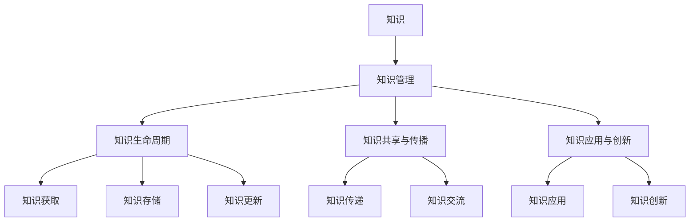

通过这个流程图，我们可以清晰地看到知识管理是如何贯穿于知识生命周期的各个阶段，以及如何通过知识共享与传播、知识应用与创新来推动组织的发展。

### 知识管理的基本框架

知识管理是一个系统性工程，涉及到多个关键环节，包括知识生命周期管理、知识获取与收集、知识分类与组织、知识共享与传播以及知识应用与创新。以下将详细阐述这些环节及其相互关系。

#### 知识生命周期管理

知识生命周期管理是指对知识从创建到消亡的全过程进行管理。这个过程包括以下几个关键阶段：

1. **知识创建**：知识创建是知识生命周期的起点，它通常来自于个人经验、团队协作、外部学习等多种途径。
2. **知识获取**：知识获取是指通过各种手段收集和获取外部知识和内部知识，如文献检索、内部交流、外部合作等。
3. **知识存储**：知识存储是指将获取的知识进行整理、分类，并存储在适当的知识库或文档中，以便于后续检索和使用。
4. **知识共享与传播**：知识共享与传播是指将知识在企业内部或外部进行传递和交流，促进知识的流动和扩散。
5. **知识应用与创新**：知识应用与创新是指将知识应用于实际工作中，并在此基础上进行创新，推动组织的进步。

以下是知识生命周期管理的Mermaid流程图：

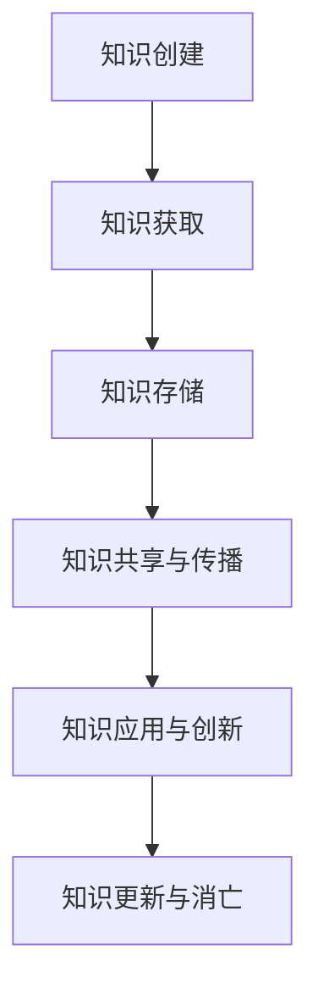

#### 知识获取与收集

知识获取与收集是知识管理的基础环节。有效的知识获取与收集能够确保组织拥有丰富的知识资源。以下是知识获取与收集的关键步骤：

1. **内部知识获取**：通过内部交流、团队协作、文档整理等方式获取组织内部的隐性知识和显性知识。
2. **外部知识获取**：通过外部合作、文献检索、市场调研等方式获取外部知识。
3. **知识筛选与分类**：对获取的知识进行筛选和分类，确保知识的准确性和相关性。
4. **知识整合与优化**：将不同来源的知识进行整合，去除重复和冗余信息，优化知识结构。

以下是知识获取与收集的Mermaid流程图：

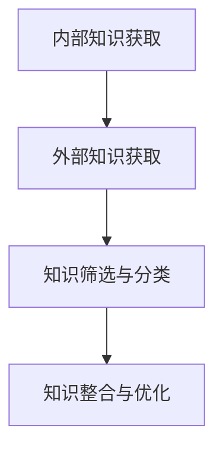

#### 知识分类与组织

知识分类与组织是知识管理的重要环节，它有助于提高知识的可访问性和利用率。以下是知识分类与组织的关键步骤：

1. **知识分类标准**：制定统一的分类标准，如按照知识类型、应用领域、重要性等级等进行分类。
2. **知识库建设**：建立知识库，将分类后的知识存储在知识库中，确保知识的有序存储和快速检索。
3. **知识标签管理**：为知识库中的知识添加标签，便于多维度检索和查找。
4. **知识更新与维护**：定期对知识库中的知识进行更新和维护，确保知识的时效性和准确性。

以下是知识分类与组织的Mermaid流程图：

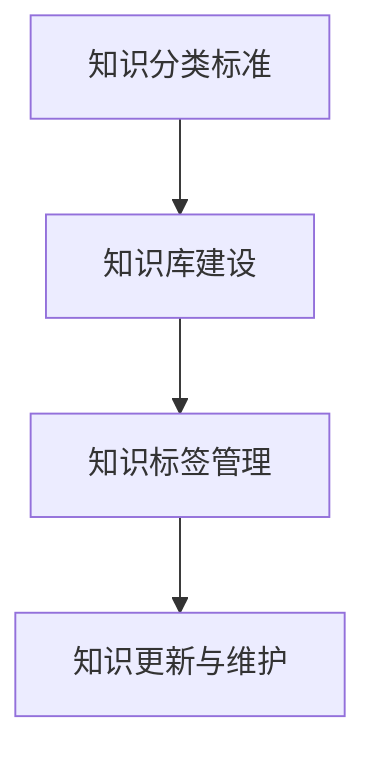

#### 知识共享与传播

知识共享与传播是知识管理的核心目标之一，它有助于提升组织内部的知识流动和创新能力。以下是知识共享与传播的关键步骤：

1. **共享平台建设**：建立共享平台，如企业内部网、知识论坛、协作工具等，提供知识共享的空间。
2. **知识推送与通知**：通过推送和通知机制，确保知识共享的及时性和有效性。
3. **知识交流与讨论**：鼓励团队成员之间进行知识交流和讨论，促进知识的互动和创新。
4. **知识评价与反馈**：对知识共享的效果进行评价和反馈，不断优化知识共享机制。

以下是知识共享与传播的Mermaid流程图：

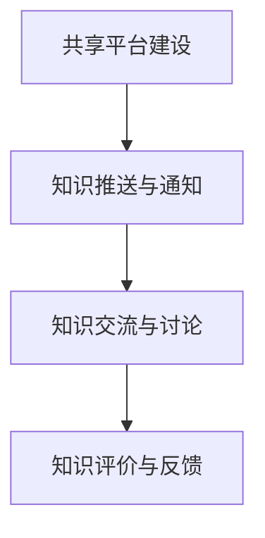

#### 知识应用与创新

知识应用与创新是知识管理的最终目标，它将知识转化为实际价值，推动组织的持续发展。以下是知识应用与创新的关键步骤：

1. **知识应用策略**：制定知识应用策略，明确知识在不同业务场景中的应用方向和方式。
2. **知识转化与创新**：将知识应用于实际工作中，通过创新思维和方法，提升工作效率和创新能力。
3. **知识反馈与优化**：通过实践反馈，对知识应用的效果进行评价和优化，确保知识的持续价值。

以下是知识应用与创新的Mermaid流程图：

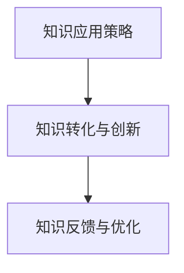

通过以上对知识管理基本框架的详细阐述，我们可以看到，知识管理不仅包括知识的获取、存储、共享和应用，还需要对整个知识生命周期进行有效管理。只有这样，才能确保知识的持续创新和价值最大化，为技术创业企业的发展提供有力支持。

### 文档化知识管理

在知识管理中，文档化知识管理是一个重要的组成部分。通过文档化，可以将隐性知识转化为显性知识，便于存储、共享和应用。以下将详细探讨文档化知识管理的原理、文档撰写规范、文档库建设与维护，以及文档检索与利用。

#### 文档化知识管理的原理

文档化知识管理是指通过创建、存储、共享和利用文档，实现知识的管理和传承。其核心原理包括：

1. **知识显性化**：将隐性知识转化为文档形式，使其变得更加明确和易于传递。
2. **知识系统化**：通过文档对知识进行系统化整理，使其结构清晰，便于查阅和使用。
3. **知识标准化**：制定统一的文档撰写规范，确保文档的质量和一致性。
4. **知识共享与传播**：通过文档库实现知识的共享与传播，促进知识的流动和扩散。
5. **知识创新**：在文档编写和利用过程中，激发新的思维和创意，促进知识的创新。

以下是文档化知识管理的Mermaid流程图：

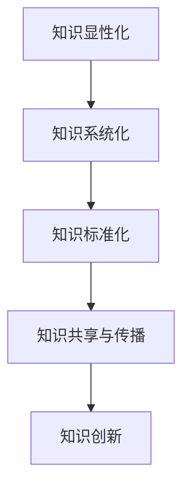

#### 文档撰写规范

为了确保文档的质量和一致性，需要制定详细的文档撰写规范。以下是文档撰写规范的主要内容：

1. **文档结构**：每个文档应包含封面、目录、摘要、正文和参考文献等部分。
2. **文档格式**：统一使用特定的文档格式（如Markdown、Word等），并遵循格式规范。
3. **内容要求**：确保文档内容完整、准确、清晰，避免冗余和错误。
4. **术语和定义**：统一术语和定义，确保文档内部的一致性。
5. **修订记录**：记录文档的修订历史，确保文档的可追溯性和可靠性。

以下是文档撰写规范的Mermaid流程图：

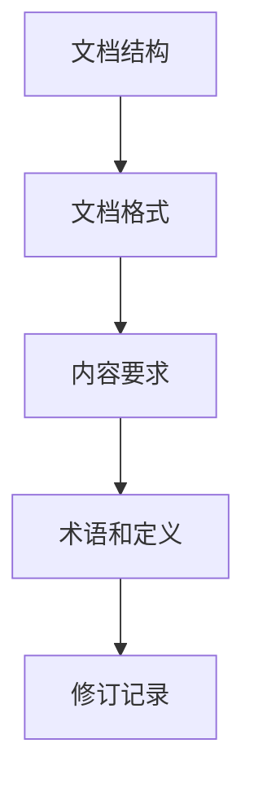

#### 文档库建设与维护

文档库是文档化知识管理的重要组成部分，它为知识的存储、共享和利用提供了平台。以下是文档库建设与维护的关键步骤：

1. **文档库规划**：根据企业需求，规划文档库的结构和功能，如分类、标签、权限管理等。
2. **文档上传**：将各类文档上传到文档库中，并进行分类和标签管理。
3. **文档审核**：对上传的文档进行审核，确保文档的质量和准确性。
4. **文档备份**：定期对文档库进行备份，确保文档的安全性和完整性。
5. **文档更新**：根据实际需求，定期更新文档库中的文档，确保知识的时效性。

以下是文档库建设与维护的Mermaid流程图：

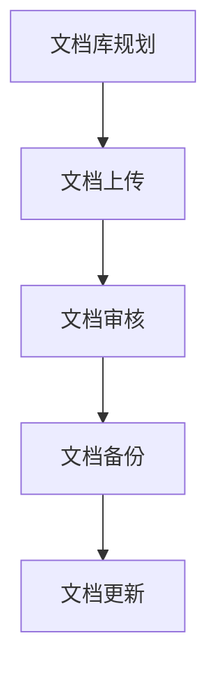

#### 文档检索与利用

文档检索与利用是文档化知识管理的核心目标之一。以下是如何实现高效的文档检索与利用：

1. **检索机制**：建立高效的文档检索机制，如全文检索、关键字检索等，便于快速找到所需文档。
2. **利用工具**：提供文档利用工具，如文档查看器、编辑器等，便于团队成员对文档进行查阅、修改和使用。
3. **知识地图**：构建知识地图，展示文档之间的关系和知识体系，便于团队成员理解和应用知识。
4. **知识分享**：鼓励团队成员在文档利用过程中，分享心得体会和改进建议，促进知识的传播和创新。

以下是文档检索与利用的Mermaid流程图：

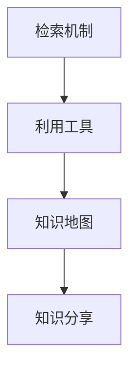

通过文档化知识管理，企业可以更好地管理和利用知识，促进创新和可持续发展。本文对文档化知识管理的原理、撰写规范、文档库建设和维护、文档检索与利用进行了详细探讨，为技术创业者提供了实用的知识管理方法。

### 隐性知识管理

隐性知识是指难以用语言、文字等明确表达的知识，通常存在于个体或团队中，如个人经验、技能、直觉和洞察力等。隐性知识在技术创业中具有巨大的价值，但同时也具有难以获取和共享的特点。因此，隐性知识管理成为知识管理的一个重要环节。以下将详细探讨隐性知识的特性、转化方法、共享平台以及管理案例分析。

#### 隐性知识的特性

隐性知识的特性主要包括以下几个方面：

1. **个体性**：隐性知识通常与个体紧密相关，具有个体特有的经验和技能。
2. **情境依赖性**：隐性知识往往依赖于特定的工作环境、情境和情境因素。
3. **不易表达性**：隐性知识难以用语言或文字进行准确表达，往往需要通过实践、演示和体验来传递。
4. **不易共享性**：由于隐性知识的个体性和情境依赖性，使其在共享和传播过程中面临较大的挑战。

以下是隐性知识特性的Mermaid流程图：

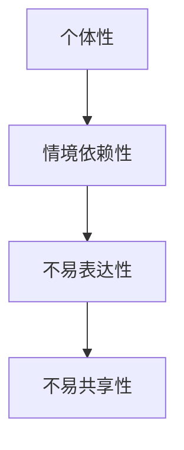

#### 隐性知识转化方法

隐性知识转化为显性知识是隐性知识管理的关键。以下是一些常用的隐性知识转化方法：

1. **经验分享会**：通过组织经验分享会，邀请具有丰富隐性知识的个体分享他们的经验和心得，使隐性知识转化为显性知识。
2. **案例编写**：编写典型案例，将隐性知识转化为具体的案例，便于其他团队成员学习和借鉴。
3. **知识图谱**：利用知识图谱技术，将隐性知识以图形形式进行表达和展示，提高知识的可访问性和可理解性。
4. **故事化**：通过故事化的方式，将隐性知识进行生动描述，使其更具吸引力，提高知识的传播效果。

以下是隐性知识转化方法的Mermaid流程图：

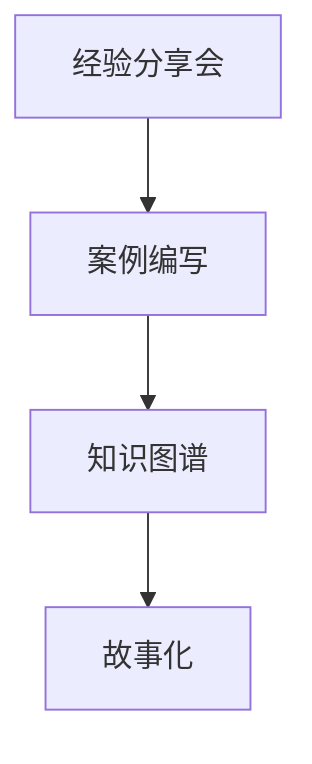

#### 隐性知识共享平台

隐性知识共享平台是支持隐性知识管理的重要工具。以下是一些常用的隐性知识共享平台：

1. **内部论坛**：建立内部论坛，提供一个开放、互动的平台，使团队成员能够分享经验和知识。
2. **协作工具**：利用协作工具，如团队聊天软件、知识库等，促进团队成员之间的知识交流和共享。
3. **虚拟现实（VR）**：通过虚拟现实技术，提供一个沉浸式的知识共享环境，使团队成员能够直观地理解和应用隐性知识。
4. **社交网络**：利用企业内部社交网络，鼓励团队成员之间建立联系，促进知识共享和互动。

以下是隐性知识共享平台的Mermaid流程图：

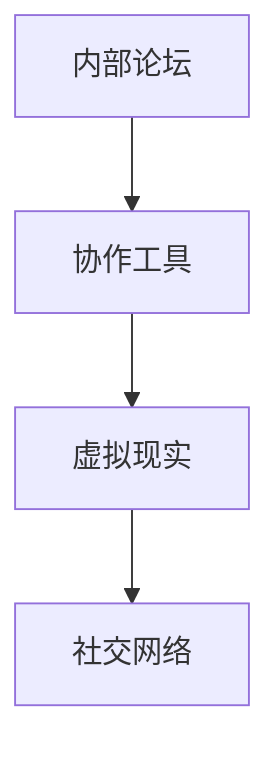

#### 隐性知识管理案例分析

以下是一个隐性知识管理的实际案例，通过该案例可以更好地理解隐性知识管理的方法和效果。

**案例：某互联网公司的新产品开发团队**

某互联网公司的新产品开发团队在项目开发过程中，积累了大量的隐性知识，如项目经验、技术难点和解决方案等。为了更好地管理和利用这些隐性知识，团队采取了以下措施：

1. **经验分享会**：定期组织经验分享会，邀请团队成员分享项目经验和心得，使隐性知识转化为显性知识。
2. **案例编写**：编写典型案例，将项目中的技术难点和解决方案进行详细描述，为其他项目团队提供参考。
3. **知识图谱**：利用知识图谱技术，将项目中的关键技术节点和关系进行可视化展示，提高知识的可访问性和理解性。
4. **内部论坛**：建立内部论坛，提供一个开放、互动的平台，使团队成员能够分享经验和知识。
5. **协作工具**：利用团队聊天软件和知识库，促进团队成员之间的知识交流和共享。

通过这些措施，该团队有效地管理和利用了隐性知识，提高了项目开发效率和质量。同时，隐性知识的管理和共享也为团队带来了新的创新思维和灵感，推动了公司的持续发展。

通过以上对隐性知识管理的探讨，我们可以看到，隐性知识在技术创业中具有重要的价值，但同时也面临较大的管理挑战。通过有效的隐性知识管理方法，企业可以更好地管理和利用隐性知识，提高创新能力和核心竞争力。

### 知识图谱技术

知识图谱技术是近年来在知识管理领域迅速兴起的一项重要技术，通过将知识以图谱的形式进行表达和组织，实现知识的结构化、可视化和智能化。知识图谱在知识管理中的应用具有广泛的前景和潜力。以下将详细探讨知识图谱的基本概念、构建方法、应用以及其在知识管理中的价值。

#### 知识图谱的基本概念

知识图谱是一种由实体、属性和关系构成的数据结构，用于表示复杂的知识关系。它将各种数据源中的知识进行整合和关联，形成一个统一的、语义化的知识网络。知识图谱的核心要素包括：

1. **实体**：知识图谱中的基本单元，代表具体的事物，如人、地点、组织等。
2. **属性**：实体的特征或属性，用于描述实体的具体信息，如年龄、职位、地点等。
3. **关系**：实体之间的关联，表示实体之间的逻辑关系，如属于、工作于、位于等。

以下是知识图谱的基本概念的Mermaid流程图：

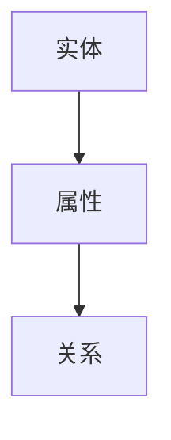

#### 知识图谱的构建方法

知识图谱的构建是一个复杂的过程，通常包括数据采集、数据清洗、实体识别、关系抽取、知识融合和知识存储等步骤。以下是知识图谱构建的基本流程：

1. **数据采集**：从各种数据源（如数据库、网页、文献等）中采集相关的知识数据。
2. **数据清洗**：对采集到的数据进行分析和处理，去除冗余和错误信息，提高数据的准确性和一致性。
3. **实体识别**：通过自然语言处理技术，识别文本中的实体，如人名、地名、组织名等。
4. **关系抽取**：从文本中提取实体之间的关系，如工作于、位于等。
5. **知识融合**：将不同来源的知识进行整合和融合，形成统一的知识结构。
6. **知识存储**：将构建好的知识图谱存储在图数据库中，以便于后续的查询和应用。

以下是知识图谱构建方法的Mermaid流程图：

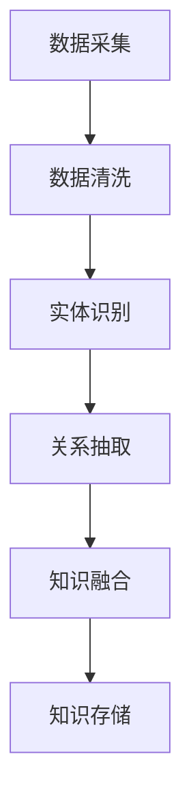

#### 知识图谱的应用

知识图谱在知识管理中有广泛的应用，以下是一些典型的应用场景：

1. **智能搜索**：通过知识图谱，实现对海量信息的结构化搜索，提高搜索效率和准确性。
2. **智能问答**：利用知识图谱，构建智能问答系统，为用户提供精准、快速的答案。
3. **推荐系统**：基于知识图谱，构建推荐系统，为用户提供个性化的信息和服务。
4. **知识可视化**：通过知识图谱，将复杂的知识关系以可视化的形式进行展示，提高知识的可理解性。

以下是知识图谱应用的Mermaid流程图：

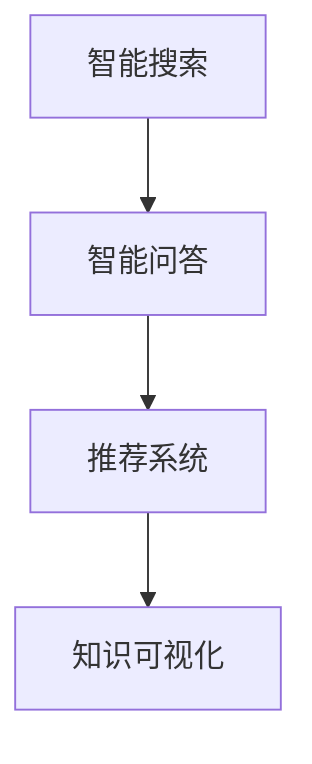

#### 知识图谱在知识管理中的价值

知识图谱在知识管理中的价值主要体现在以下几个方面：

1. **知识结构化**：通过知识图谱，将分散的知识进行结构化整理，形成统一的知识网络，提高知识的可访问性和利用率。
2. **知识关联**：知识图谱能够揭示知识之间的关联，帮助用户发现新的知识联系和洞察。
3. **知识推理**：基于知识图谱，可以进行知识推理，推断出新的结论和知识，为决策提供支持。
4. **知识创新**：通过知识图谱，激发新的思维和创意，促进知识的创新和应用。

以下是知识图谱在知识管理中的价值的Mermaid流程图：

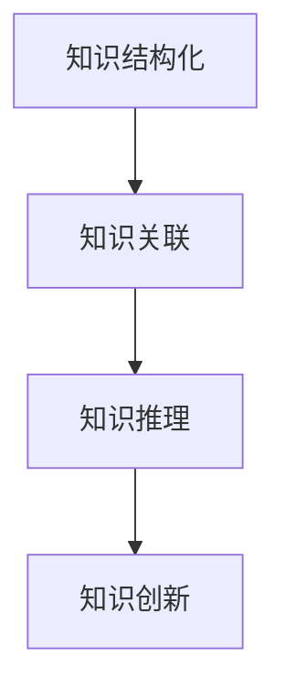

通过以上对知识图谱技术的详细探讨，我们可以看到，知识图谱作为一种强大的知识管理工具，具有广泛的应用前景和价值。通过知识图谱，企业可以更好地管理和利用知识，提高创新能力和市场竞争力。

### 知识传承的方法与工具

知识传承是知识管理中至关重要的一环，它关系到企业创新能力的持续提升和团队的稳定发展。有效的知识传承方法与工具能够确保企业在人员流动、技术变革和市场变化中，依然能够保持竞争优势。以下将详细探讨知识传承的重要性、传承方式、传承工具选择，并结合实际案例进行分析。

#### 知识传承的重要性

知识传承对于企业具有重要意义，主要体现在以下几个方面：

1. **创新能力**：通过知识传承，将团队成员的经验和智慧积累下来，为后续项目提供宝贵的技术和市场洞察，推动企业的创新和发展。
2. **团队稳定性**：知识传承有助于保持团队的稳定性，减少因人员流失而带来的业务中断和技能断层，确保项目顺利推进。
3. **知识积累**：通过知识传承，企业能够不断积累知识资产，形成独特的竞争优势，为未来的发展奠定基础。
4. **组织学习**：知识传承是组织学习的重要环节，它能够促进企业内部的知识共享和交流，提升整体学习能力和适应能力。

#### 知识传承的方式

知识传承主要包括以下几种方式：

1. **师徒制**：通过师徒关系，将资深员工的经验和技术传授给新员工，使新员工能够快速成长和适应工作。
2. **文档化**：通过编写文档、制作教程和手册，将知识和经验以文字、图片、视频等形式记录下来，便于查阅和传播。
3. **内部培训**：组织定期的内部培训，邀请资深员工或外部专家授课，提高团队的整体技能水平。
4. **案例分析**：通过分析成功或失败的项目案例，总结经验教训，使团队成员能够从中学习和借鉴。
5. **知识分享会**：定期举办知识分享会，鼓励团队成员分享自己的知识和经验，促进知识的流动和传播。

以下是知识传承方式的Mermaid流程图：

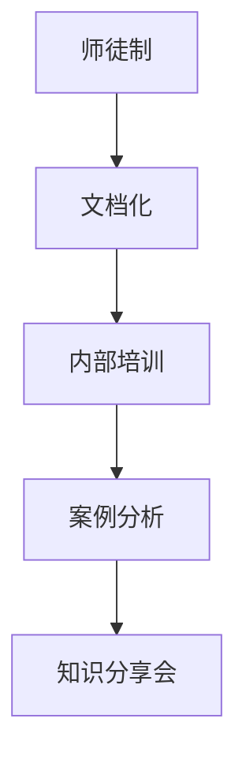

#### 知识传承工具选择

选择合适的知识传承工具能够提高知识传承的效率和质量。以下是一些常用的知识传承工具：

1. **知识库**：知识库是一种集中存储和管理知识资产的工具，支持文档、图片、视频等多种格式，便于团队成员查阅和利用。
2. **协作平台**：协作平台提供实时沟通和协作功能，支持多人在线编辑和协作，提高知识共享和传承的效率。
3. **在线学习系统**：在线学习系统提供丰富的课程资源和学习工具，支持自主学习、在线考试和成绩统计，有助于提升团队技能。
4. **虚拟培训室**：虚拟培训室提供沉浸式的培训环境，支持在线授课、实时互动和远程培训，适用于大范围的知识传承。
5. **社交网络**：企业社交网络提供便捷的知识分享和交流平台，支持成员之间的互动和知识传递。

以下是知识传承工具选择的Mermaid流程图：

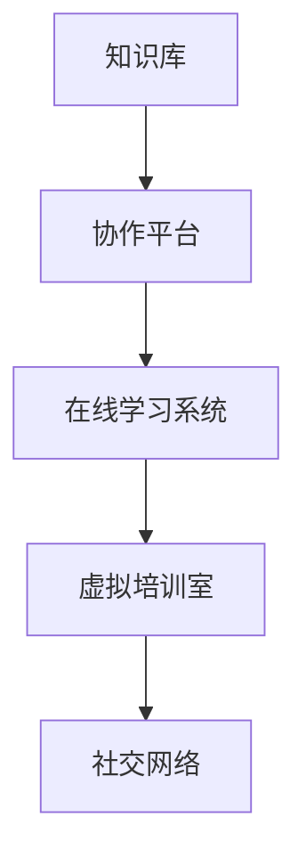

#### 实际案例分析

以下是一个知识传承的实际案例，通过该案例可以更好地理解知识传承的方法和效果。

**案例：某高科技企业的技术传承**

某高科技企业为加强技术传承，采取了以下措施：

1. **师徒制**：企业成立了师徒制项目，安排资深技术人员担任导师，对新员工进行一对一的技术指导，帮助他们快速融入团队和工作。
2. **文档化**：技术人员在完成项目后，编写详细的文档和教程，记录项目的技术方案、流程和心得体会，存入企业知识库，供新员工参考和学习。
3. **内部培训**：企业定期组织内部培训，邀请资深技术人员分享项目经验和技术心得，提升团队整体技能水平。
4. **知识分享会**：技术人员定期举办知识分享会，分享自己的知识和经验，促进团队成员之间的交流和合作。
5. **在线学习系统**：企业引入在线学习系统，提供丰富的课程资源和学习工具，支持技术人员自主学习，提高技术能力和知识水平。

通过以上措施，该企业成功地实现了技术传承，新员工能够在短时间内掌握关键技术，项目团队的整体技能水平得到了显著提升，为企业的发展提供了有力支持。

通过以上对知识传承的方法与工具的探讨，我们可以看到，有效的知识传承对于企业的长期发展具有重要意义。通过多种传承方式和工具的综合应用，企业可以确保知识得到有效传承，提高创新能力和市场竞争力。

### 知识管理文化建设

在知识管理中，知识管理文化的建设至关重要。知识管理文化是指组织内部关于知识管理的一系列价值观、态度和行为模式，它影响着组织成员对知识管理的认知、接受和执行。以下将详细探讨知识管理文化的内涵、建设策略、评估与改进，以及其在技术创业中的应用。

#### 知识管理文化的内涵

知识管理文化的内涵可以从以下几个方面进行理解：

1. **知识共享价值观**：知识管理文化强调知识共享的重要性，鼓励员工将知识和经验进行分享，认为共享知识是提升个人和团队价值的重要途径。
2. **终身学习理念**：知识管理文化倡导终身学习，鼓励员工不断学习和更新知识，以适应快速变化的技术和市场环境。
3. **知识创新氛围**：知识管理文化创造一个鼓励创新的环境，鼓励员工敢于尝试新的想法和方法，勇于挑战现有的知识和技术。
4. **透明化沟通**：知识管理文化强调透明化沟通，鼓励开放、坦诚的沟通方式，使知识能够在组织内部自由流动。
5. **知识责任制**：知识管理文化建立知识责任制，明确每个员工在知识管理中的角色和责任，确保知识得到有效管理和利用。

以下是知识管理文化内涵的Mermaid流程图：

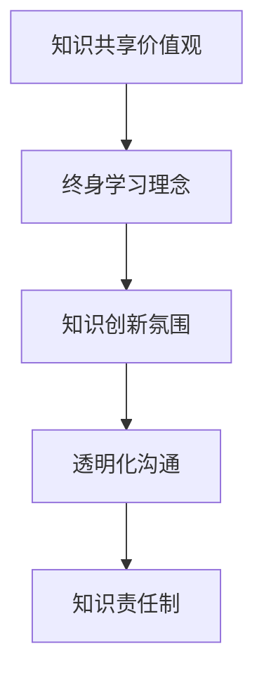

#### 建设知识管理文化的策略

建设知识管理文化是一个长期而系统的过程，以下是一些有效的建设策略：

1. **高层领导支持**：高层领导的支持是知识管理文化建设的基石，他们需要明确表达对知识管理的重视，并通过实际行动推动知识管理文化的落地。
2. **培训与教育**：通过培训和教育，提高员工对知识管理的认知和理解，培养员工的知识管理意识和能力。
3. **激励机制**：建立激励机制，鼓励员工积极参与知识管理活动，如知识分享、知识创新等，使知识管理成为员工的自觉行为。
4. **建立知识社区**：建立知识社区，提供一个交流、分享和学习的平台，促进员工之间的互动和知识流动。
5. **营造开放氛围**：营造一个开放、包容的工作氛围，鼓励员工敢于表达自己的想法，对不同的观点持开放态度。
6. **文化建设活动**：定期举办知识管理文化活动，如知识竞赛、知识分享会等，增强员工对知识管理的兴趣和参与度。

以下是建设知识管理文化策略的Mermaid流程图：

```mermaid
graph TD
    A[高层领导支持] --> B[培训与教育]
    B --> C[激励机制]
    C --> D[建立知识社区]
    D --> E[营造开放氛围]
    E --> F[文化建设活动]
```

#### 知识管理文化的评估与改进

评估知识管理文化是确保其有效性的重要手段。以下是一些常见的评估方法和改进措施：

1. **问卷调查**：通过问卷调查，收集员工对知识管理文化的看法和反馈，了解知识管理文化在员工中的渗透程度和效果。
2. **访谈与观察**：通过访谈和观察，深入了解员工在知识管理活动中的行为和态度，识别存在的问题和改进方向。
3. **知识管理绩效指标**：建立知识管理绩效指标，如知识共享次数、知识创新成果等，对知识管理文化进行量化评估。
4. **知识管理审计**：定期进行知识管理审计，检查知识管理流程和制度的有效性，发现潜在的问题和风险。

以下是知识管理文化评估与改进的Mermaid流程图：

```mermaid
graph TD
    A[问卷调查] --> B[访谈与观察]
    B --> C[知识管理绩效指标]
    C --> D[知识管理审计]
```

#### 知识管理文化在技术创业中的应用

知识管理文化在技术创业中具有重要作用，以下是一些应用实例：

1. **快速响应市场变化**：通过知识管理文化，技术创业团队能够快速获取和共享市场信息，及时响应市场变化，调整战略和产品方向。
2. **促进团队协作**：知识管理文化鼓励团队成员之间的知识共享和协作，提高团队的整体执行力和创新能力。
3. **培养创新人才**：知识管理文化为员工提供了学习和成长的环境，培养了一批具有创新意识和能力的人才，为企业的长期发展奠定基础。
4. **知识积累与传承**：知识管理文化确保了企业知识得到有效积累和传承，为企业的可持续发展提供知识支持。

以下是知识管理文化在技术创业中应用的Mermaid流程图：

```mermaid
graph TD
    A[快速响应市场变化] --> B[促进团队协作]
    B --> C[培养创新人才]
    C --> D[知识积累与传承]
```

通过以上对知识管理文化建设的探讨，我们可以看到，知识管理文化对于企业的知识管理和创新具有重要影响。通过有效的知识管理文化建设，企业可以打造一个知识共享、创新驱动的组织氛围，提高竞争力和市场地位。

### 创新经验传承的实践

在技术创业过程中，创新经验的传承对于企业的持续发展和竞争力的提升至关重要。以下将详细介绍创新经验的定义与分类、创新经验的整理与筛选、创新经验的传承方法以及创新经验的传播途径。

#### 创新经验的定义与分类

创新经验是指在技术创业过程中，通过实际操作和总结所积累的关于创新方法、流程、策略和工具等方面的经验和知识。创新经验可以分为以下几类：

1. **技术突破经验**：指在技术研发过程中，通过创新性思维和技术手段，实现技术突破和产品创新的经验。
2. **市场拓展经验**：指在市场推广和销售过程中，通过创新的市场策略和推广手段，实现市场拓展和销售业绩的经验。
3. **项目管理经验**：指在项目管理过程中，通过创新的项目管理方法和工具，实现项目高效推进和成功交付的经验。
4. **团队管理经验**：指在团队管理过程中，通过创新的管理理念和方法，实现团队高效协作和创新能力提升的经验。
5. **客户关系经验**：指在与客户互动过程中，通过创新的服务理念和手段，实现客户满意度和忠诚度提升的经验。

以下是创新经验分类的Mermaid流程图：

```mermaid
graph TD
    A[技术突破经验] --> B[市场拓展经验]
    B --> C[项目管理经验]
    C --> D[团队管理经验]
    D --> E[客户关系经验]
```

#### 创新经验的整理与筛选

创新经验的整理与筛选是传承创新经验的重要环节。以下是一些具体的步骤和方法：

1. **经验收集**：通过访谈、问卷调查、文档整理等方式，收集团队成员在技术创业过程中的创新经验。
2. **经验分类**：根据创新经验的内容和特点，对其进行分类整理，确保每个创新经验都有明确的归属类别。
3. **经验筛选**：对收集到的创新经验进行筛选，去除重复、冗余和无效的经验，确保留下的经验具有实际应用价值和参考意义。
4. **经验优化**：对筛选出的创新经验进行进一步优化，通过总结提炼，使其更加清晰、具体和易于理解和应用。

以下是创新经验整理与筛选的Mermaid流程图：

```mermaid
graph TD
    A[经验收集] --> B[经验分类]
    B --> C[经验筛选]
    C --> D[经验优化]
```

#### 创新经验的传承方法

创新经验的传承方法主要包括以下几种：

1. **内部培训**：通过组织内部培训，邀请有经验的团队成员进行分享和讲解，使其他团队成员能够学习和掌握创新经验。
2. **文档化**：将创新经验整理成文档，包括操作指南、教程和案例等，存入企业知识库，供团队成员随时查阅和学习。
3. **经验分享会**：定期举办经验分享会，鼓励团队成员分享自己的创新经验，促进知识共享和交流。
4. **师徒制**：通过师徒关系，将有经验的团队成员作为导师，指导新成员学习和传承创新经验。
5. **在线学习平台**：建立在线学习平台，提供创新经验的课程和学习资源，支持团队成员自主学习。

以下是创新经验传承方法的Mermaid流程图：

```mermaid
graph TD
    A[内部培训] --> B[文档化]
    B --> C[经验分享会]
    C --> D[师徒制]
    D --> E[在线学习平台]
```

#### 创新经验的传播途径

创新经验的传播途径包括以下几种：

1. **内部传播**：通过企业内部的知识管理平台、论坛、邮件列表等，将创新经验在企业内部进行传播。
2. **外部传播**：通过参加行业会议、发表学术论文、发布技术博客等方式，将创新经验向外部进行传播，提升企业的知名度和技术影响力。
3. **合作伙伴传播**：与合作伙伴共享创新经验，通过合作项目、联合研发等方式，共同推进创新和应用。
4. **社区传播**：加入技术社区，参与技术讨论和分享，将创新经验在社区内进行传播，吸引更多的关注和讨论。

以下是创新经验传播途径的Mermaid流程图：

```mermaid
graph TD
    A[内部传播] --> B[外部传播]
    B --> C[合作伙伴传播]
    C --> D[社区传播]
```

通过以上对创新经验传承实践的详细探讨，我们可以看到，创新经验的整理、筛选、传承和传播对于技术创业企业的持续发展具有重要意义。通过有效的创新经验管理，企业可以确保创新成果得到传承和扩散，为未来的发展提供源源不断的动力。

### 传承创新经验的文化建设

传承创新经验的文化建设是技术创业企业可持续发展的重要保障。创新文化作为企业文化的一部分，对于激发员工的创新意识、促进知识的传播和应用具有深远的影响。以下将详细探讨创新文化的重要性、建设创新文化的措施、创新文化的评估与优化，以及创新文化在技术创业中的影响。

#### 创新文化的重要性

创新文化是一种以创新为核心价值观的文化，它鼓励员工勇于创新、持续学习和不断改进。创新文化的重要性主要体现在以下几个方面：

1. **激发创新意识**：创新文化能够激发员工的创新意识，鼓励员工主动思考问题、寻找解决方案，从而推动企业的持续创新。
2. **促进知识传播**：创新文化鼓励知识共享和交流，促进企业内部的知识传播和应用，提高企业的整体知识水平。
3. **提升竞争力**：创新文化使企业能够快速适应市场变化，持续推出有竞争力的产品和服务，提高企业的市场竞争力。
4. **增强团队凝聚力**：创新文化能够增强团队的凝聚力，使团队成员之间相互支持、共同进步，提高团队的整体绩效。

以下是创新文化重要性的Mermaid流程图：

```mermaid
graph TD
    A[激发创新意识] --> B[促进知识传播]
    B --> C[提升竞争力]
    C --> D[增强团队凝聚力]
```

#### 建设创新文化的措施

建设创新文化是一个系统工程，需要从多个方面进行综合施策。以下是一些关键措施：

1. **高层领导支持**：高层领导的支持是创新文化建设的基石，他们需要明确表达对创新文化的重视，并通过实际行动推动创新文化的落地。
2. **创新激励机制**：建立创新激励机制，如创新奖项、股权激励等，鼓励员工积极参与创新活动，对创新成果进行奖励。
3. **培训与教育**：通过培训和教育，提高员工对创新文化的认知和理解，培养员工的创新意识和能力。
4. **创新平台建设**：建立创新平台，如创新实验室、创新工作室等，为员工提供创新实践的空间和资源。
5. **开放沟通机制**：营造开放、包容的沟通环境，鼓励员工敢于表达自己的想法，对不同的观点持开放态度。
6. **知识共享与传播**：鼓励知识共享和交流，建立知识共享平台，促进企业内部的知识传播和应用。

以下是建设创新文化措施的Mermaid流程图：

```mermaid
graph TD
    A[高层领导支持] --> B[创新激励机制]
    B --> C[培训与教育]
    C --> D[创新平台建设]
    D --> E[开放沟通机制]
    E --> F[知识共享与传播]
```

#### 创新文化的评估与优化

评估创新文化是确保其有效性的重要手段。以下是一些常见的评估方法和优化措施：

1. **问卷调查**：通过问卷调查，收集员工对创新文化的看法和反馈，了解创新文化在员工中的渗透程度和效果。
2. **访谈与观察**：通过访谈和观察，深入了解员工在创新活动中的行为和态度，识别创新文化存在的问题和改进方向。
3. **创新绩效指标**：建立创新绩效指标，如创新项目数量、创新成果转化率等，对创新文化进行量化评估。
4. **创新审计**：定期进行创新审计，检查创新文化建设的有效性，发现潜在的问题和风险。

以下是创新文化评估与优化的Mermaid流程图：

```mermaid
graph TD
    A[问卷调查] --> B[访谈与观察]
    B --> C[创新绩效指标]
    C --> D[创新审计]
```

#### 创新文化在技术创业中的影响

创新文化在技术创业中具有重要作用，以下是一些具体影响：

1. **提升创新能力**：创新文化能够激发员工的创新意识，促进创新活动的开展，提高企业的整体创新能力。
2. **推动知识传播**：创新文化鼓励知识共享和交流，促进企业内部的知识传播和应用，提高企业的知识水平。
3. **增强团队凝聚力**：创新文化使团队成员之间相互支持、共同进步，增强团队的凝聚力，提高团队的整体绩效。
4. **提升市场竞争力**：创新文化使企业能够快速适应市场变化，持续推出有竞争力的产品和服务，提升企业的市场竞争力。

以下是创新文化在技术创业中影响的Mermaid流程图：

```mermaid
graph TD
    A[提升创新能力] --> B[推动知识传播]
    B --> C[增强团队凝聚力]
    C --> D[提升市场竞争力]
```

通过以上对传承创新经验的文化建设的探讨，我们可以看到，创新文化对于技术创业企业的发展具有重要意义。通过有效的创新文化建设，企业可以打造一个创新驱动、知识共享的生态系统，提升企业的核心竞争力，实现可持续发展。

### 知识管理与创新循环

知识管理与创新之间存在着密切的联系和相互促进作用。知识管理为创新提供了知识基础和支持环境，而创新则通过新的知识和解决方案不断丰富和扩展知识库。以下将详细探讨知识管理与创新的关系、知识管理对创新的支持、创新对知识管理的反作用，以及如何实现知识管理与创新的良性循环。

#### 知识管理与创新的关系

知识管理与创新之间的关系可以概括为以下几个方面：

1. **知识是创新的源泉**：创新依赖于丰富的知识储备，只有拥有充足的知识资源，企业才能在创新过程中灵活应对各种挑战，提出新的解决方案。
2. **创新是知识的延伸**：创新是知识应用和拓展的过程，通过创新，企业可以将知识转化为实际的产品和服务，实现知识的价值最大化。
3. **知识管理是创新的基础**：知识管理通过系统地获取、整理、共享和应用知识，为创新提供了持续的知识支持，确保创新的顺利进行。
4. **创新促进知识更新**：创新活动会产生新的知识，这些新知识需要通过知识管理进行整合和传播，形成企业的知识资产。

以下是知识管理与创新关系的Mermaid流程图：

```mermaid
graph TD
    A[知识是创新的源泉] --> B[创新是知识的延伸]
    B --> C[知识管理是创新的基础]
    C --> D[创新促进知识更新]
```

#### 知识管理对创新的支持

知识管理对创新的支持主要体现在以下几个方面：

1. **知识获取与积累**：知识管理通过系统化的知识获取和积累，为创新提供了丰富的知识资源，使创新活动有据可依。
2. **知识共享与传播**：知识管理通过共享和传播机制，促进知识的流动和扩散，使创新者能够快速获取和应用相关知识，提高创新效率。
3. **知识应用与创新**：知识管理通过将知识应用于实际工作中，激发新的思维和创意，为创新提供方向和灵感。
4. **知识更新与优化**：知识管理通过定期更新和优化知识库，确保知识的时效性和准确性，为创新提供最新的知识支持。

以下是知识管理对创新支持的Mermaid流程图：

```mermaid
graph TD
    A[知识获取与积累] --> B[知识共享与传播]
    B --> C[知识应用与创新]
    C --> D[知识更新与优化]
```

#### 创新对知识管理的反作用

创新对知识管理也产生重要的反作用，具体表现在以下几个方面：

1. **知识创新**：创新活动会产生新的知识，这些新知识需要通过知识管理进行整合、分类和传播，丰富企业的知识库。
2. **知识更新**：创新活动推动了知识的更新和优化，使知识库中的知识更加贴近实际需求，提高知识的实用性和价值。
3. **知识结构优化**：创新活动促使知识结构更加合理和科学，通过新的知识关联和整合，提高知识的整体价值。
4. **知识管理流程优化**：创新活动会暴露知识管理中的问题和不足，通过反思和改进，优化知识管理的流程和机制，提高知识管理的效率。

以下是创新对知识管理反作用的Mermaid流程图：

```mermaid
graph TD
    A[知识创新] --> B[知识更新]
    B --> C[知识结构优化]
    C --> D[知识管理流程优化]
```

#### 实现知识管理与创新的良性循环

为了实现知识管理与创新的良性循环，企业可以采取以下措施：

1. **建立知识共享机制**：通过知识共享平台，促进知识的流动和传播，为创新提供知识支持。
2. **构建创新激励机制**：建立创新激励机制，鼓励员工积极参与创新活动，对创新成果进行奖励。
3. **加强知识更新与维护**：定期更新和优化知识库，确保知识的时效性和准确性，为创新提供最新的知识支持。
4. **优化知识管理流程**：通过流程优化，提高知识管理的效率，为创新活动提供高效的支持。
5. **推动知识创新**：鼓励员工在创新过程中产生新的知识，通过知识管理将其整合和传播，形成企业的知识资产。

以下是实现知识管理与创新良性循环的Mermaid流程图：

```mermaid
graph TD
    A[建立知识共享机制] --> B[构建创新激励机制]
    B --> C[加强知识更新与维护]
    C --> D[优化知识管理流程]
    D --> E[推动知识创新]
```

通过以上措施，企业可以构建一个知识管理与创新相互促进、相互支撑的生态系统，实现知识管理与创新的良性循环，推动企业的持续创新和可持续发展。

### 附录

#### A. 知识管理工具与应用案例

**知识管理工具介绍**

在知识管理中，选择合适的工具至关重要。以下是一些常用的知识管理工具及其特点：

1. **Confluence**：Confluence是一个团队协作平台，支持文档编写、知识库管理和项目跟踪等功能。它具有易用性和灵活性，适合中小型团队使用。

2. **Trello**：Trello是一款基于看板（Kanban）方法的任务管理工具，支持卡片、列表和标签等功能，适用于项目管理和知识共享。

3. **Evernote**：Evernote是一个多平台的知识笔记工具，支持文本、图片、音频等多种格式，适合个人和团队的知识收集和整理。

**知识管理工具应用案例**

以下是一个知识管理工具应用案例：

**案例：某科技公司利用Confluence进行知识管理**

某科技公司通过Confluence建立了一个内部知识库，用于存储和分享公司的技术文档、产品文档和项目经验。具体应用包括：

1. **技术文档存储**：公司将所有技术文档上传到Confluence，并按照技术领域进行分类，便于员工查阅和更新。

2. **项目经验分享**：项目经理在项目结束后，将项目文档、经验总结和教训记录在Confluence中，为新项目提供参考。

3. **知识库维护**：公司定期组织知识库维护活动，检查和更新知识库中的内容，确保知识的时效性和准确性。

#### B. 知识管理参考文献与资源

**知识管理相关书籍推荐**

1. **《知识管理：战略、工具与技术》**：本书详细介绍了知识管理的理论基础和实践方法，适合初学者和专业人士阅读。

2. **《知识管理方法论》**：本书从方法论的角度出发，探讨了知识管理的关键概念、流程和技术，对知识管理的实践具有指导意义。

**知识管理学术论文精选**

1. **“Knowledge Management and Organizational Performance: A Meta-Analysis”**：这篇论文通过元分析的方法，研究了知识管理对组织绩效的影响。

2. **“The Impact of Knowledge Management on Innovation in SMEs”**：这篇论文探讨了知识管理对中小企业创新的影响，提供了有益的实践参考。

**知识管理相关网站与论坛**

1. **知识管理协会（KMWorld）**：KMWorld是一个专注于知识管理的行业网站，提供最新的知识管理新闻、文章和资源。

2. **维基百科（Wikipedia）**：维基百科上的知识管理词条提供了丰富的知识管理背景信息和相关资源。

通过以上附录部分的内容，读者可以深入了解知识管理的工具、书籍、学术论文和网站资源，为实际工作提供有益的参考和指导。

