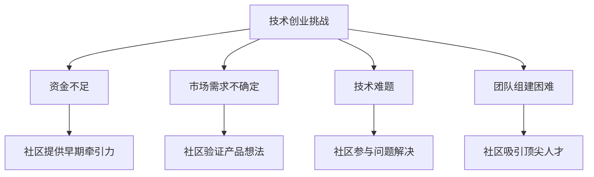
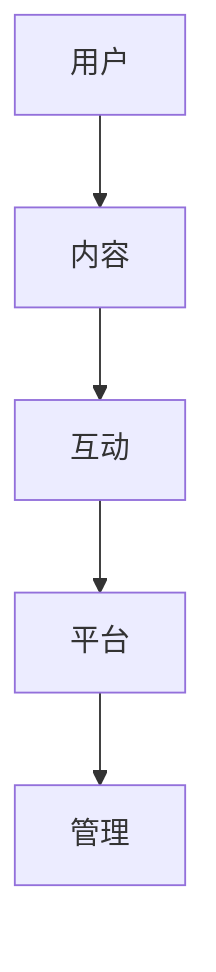

                 

### 第1章：技术创业与社区运营的关系

在技术创业的浪潮中，社区运营扮演着至关重要的角色。这一章节将深入探讨技术创业的挑战、社区运营的核心概念及其重要性，以及社区运营的基本原则。

#### 1.1.1 技术创业的挑战与社区运营的重要性

技术创业绝非易事，面临诸多挑战。以下是技术创业中常见的挑战以及为什么社区运营能够缓解这些问题：

**伪代码：**

```plaintext
function technicalStartupChallenges() {
    challenges = [
        "资金不足",
        "市场需求不确定",
        "技术难题",
        "团队组建困难"
    ]

    for (challenge in challenges) {
        if (challenge == "资金不足") {
            print("Community can provide early traction and user feedback, attracting investors.")
        }
        if (challenge == "市场需求不确定") {
            print("Active community can help validate product ideas and understand user needs.")
        }
        if (challenge == "技术难题") {
            print("Community members can contribute to problem-solving and innovation.")
        }
        if (challenge == "团队组建困难") {
            print("A vibrant community can attract top talent and promote the startup culture.")
        }
    }
}
```

**Mermaid 流程图：**



#### 1.2.1 社区运营的定义与目标

社区运营不仅仅是建立一个网站或论坛，它更是一个动态的、多层次的互动过程。以下是社区运营的定义和目标：

**数学公式：**

$$
\text{社区运营} = \text{用户互动} + \text{内容创作} + \text{社群管理}
$$

**伪代码：**

```plaintext
function communityManagementObjectives() {
    objectives = [
        "提高用户粘性",
        "增加用户参与度",
        "提升品牌知名度",
        "获取用户反馈"
    ]

    for (objective in objectives) {
        print(objective)
    }
}
```

#### 1.3.1 社区运营的基本原则

成功的社区运营依赖于一系列基本原则，包括建立用户信任、创造有价值的内容和激励用户参与。以下是详细说明：

**建立用户信任：**

**数学公式：**

$$
\text{信任} = \text{真实性} \times \text{可靠性} \times \text{一致性}
$$

**伪代码：**

```plaintext
function buildUserTrust() {
    trustFactors = [
        "真实性：确保信息的真实性，避免虚假宣传",
        "可靠性：提供高质量的内容和服务，保持承诺",
        "一致性：保持一致的价值观和行为，建立稳定的社区文化"
    ]

    for (factor in trustFactors) {
        print(factor)
    }
}
```

**创造有价值的内容：**

**伪代码：**

```plaintext
function createValuableContent() {
    contentTypes = [
        "教育性内容：传授知识，帮助用户成长",
        "互动性内容：鼓励用户互动，增加参与度",
        "故事性内容：讲述用户故事，建立情感联系",
        "实用性内容：提供实用工具或指南，解决用户问题"
    ]

    for (contentType in contentTypes) {
        print(contentType)
    }
}
```

**激励用户参与：**

**伪代码：**

```plaintext
function motivateUserInvolvement() {
    involvementStrategies = [
        "奖励机制：提供积分、徽章等奖励，激励用户参与",
        "互动活动：组织问答、比赛等活动，增加用户互动",
        "角色扮演：赋予用户不同角色，如社区经理、内容贡献者，增加责任感",
        "反馈机制：倾听用户意见，及时回应，增强用户参与感"
    ]

    for (strategy in involvementStrategies) {
        print(strategy)
    }
}
```

通过这些步骤和策略，技术创业者可以有效地建立和维护一个活跃的用户社区，从而在技术创业的道路上获得更多的支持和帮助。在下一章中，我们将深入探讨用户社区的核心概念和如何进行用户社区的分析。

---

作者：AI天才研究院/AI Genius Institute & 禅与计算机程序设计艺术 /Zen And The Art of Computer Programming

---

## 第2章：用户社区的核心概念

用户社区是技术创业的基石，理解其核心概念对于成功运营至关重要。在这一章节中，我们将深入探讨用户社区的构成要素、用户行为分析以及社区生命周期的分析。

### 2.1 用户社区的构成要素

用户社区由多种要素构成，包括用户、内容、互动、平台和管理。以下是这些要素的详细解释：

**数学公式：**

$$
\text{用户社区} = \text{用户} + \text{内容} + \text{互动} + \text{平台} + \text{管理}
$$

**Mermaid 流程图：**



**伪代码：**

```plaintext
function communityComponents() {
    components = ["用户", "内容", "互动", "平台", "管理"]

    for (component in components) {
        print(component)
    }
}
```

#### 2.1.1 用户

用户是社区的核心，他们的参与和活跃度直接关系到社区的成功。以下是用户的关键特征：

- **多样性**：社区中用户背景和技能的多样性有助于丰富讨论和创意。
- **活跃度**：活跃用户（例如活跃论坛成员、经常发表评论的用户）是社区动力的源泉。
- **参与感**：用户的参与感可以通过反馈、投票、内容贡献等方式来衡量。

**伪代码：**

```plaintext
function userKeyFeatures() {
    features = ["多样性", "活跃度", "参与感"]

    for (feature in features) {
        print(feature)
    }
}
```

#### 2.1.2 内容

内容是社区的核心资产，它包括帖子、博客、视频、图片等。高质量的内容可以吸引和留住用户，促进社区互动：

- **教育性内容**：提供教程、案例研究、最佳实践等，帮助用户学习和提升技能。
- **互动性内容**：如问答、投票、讨论等，增加用户参与度和互动性。
- **故事性内容**：通过分享用户故事和成功案例，建立情感联系，增强社区凝聚力。

**伪代码：**

```plaintext
function contentTypes() {
    types = ["教育性内容", "互动性内容", "故事性内容"]

    for (type in types) {
        print(type)
    }
}
```

#### 2.1.3 互动

互动是用户社区的灵魂，它通过评论、私信、点赞、分享等方式实现。以下是互动的重要性和策略：

- **互动重要性**：互动是用户参与和社区活力的关键指标。
- **互动策略**：包括实时聊天、定期活动、社区管理员的激励等。

**伪代码：**

```plaintext
function interactionImportance() {
    print("互动是社区活力的关键指标。")
}

function interactionStrategies() {
    strategies = ["实时聊天", "定期活动", "管理员激励"]

    for (strategy in strategies) {
        print(strategy)
    }
}
```

#### 2.1.4 平台

平台是用户社区的基础设施，它提供内容发布、用户互动和数据管理的功能。以下是平台选择的关键点：

- **易用性**：平台需要简单易用，以便用户轻松参与。
- **功能丰富**：平台应提供多样化的互动工具和内容类型。
- **扩展性**：平台应具备良好的扩展性，以适应社区成长和需求变化。

**伪代码：**

```plaintext
function platformSelection() {
    criteria = ["易用性", "功能丰富", "扩展性"]

    for (criteria in criteria) {
        print(criteria)
    }
}
```

#### 2.1.5 管理

管理是确保社区健康发展的关键，它包括用户管理、内容管理和社区治理等方面。以下是管理的核心职责：

- **用户管理**：包括用户注册、身份验证、权限设置等。
- **内容管理**：包括内容审核、发布、分类和存档等。
- **社区治理**：包括制定社区规则、处理争议和确保社区安全等。

**伪代码：**

```plaintext
function communityManagement() {
    responsibilities = ["用户管理", "内容管理", "社区治理"]

    for (responsibility in responsibilities) {
        print(responsibility)
    }
}
```

通过深入理解用户社区的构成要素，技术创业者可以更好地规划和运营社区，从而促进用户的参与和社区的可持续发展。

### 2.2 用户行为分析

用户行为分析是理解用户需求和优化社区体验的关键。以下是如何进行用户行为分析及其重要性：

#### 2.2.1 用户行为分析的重要性

用户行为分析有助于：

- **了解用户需求**：通过分析用户行为，可以识别用户关注点和需求。
- **优化社区功能**：根据用户行为数据，调整和优化社区功能。
- **提高用户满意度**：通过个性化的用户体验，提升用户满意度和忠诚度。

**伪代码：**

```plaintext
function importanceOfUserBehaviorAnalysis() {
    benefits = [
        "了解用户需求",
        "优化社区功能",
        "提高用户满意度"
    ]

    for (benefit in benefits) {
        print(benefit)
    }
}
```

#### 2.2.2 用户行为分析的方法

进行用户行为分析，可以采用以下方法：

- **日志分析**：通过日志记录用户在社区中的行为。
- **问卷调查**：收集用户反馈，了解他们的看法和建议。
- **用户访谈**：与用户直接交流，深入了解他们的需求和体验。

**伪代码：**

```plaintext
function userBehaviorAnalysisMethods() {
    methods = ["日志分析", "问卷调查", "用户访谈"]

    for (method in methods) {
        print(method)
    }
}
```

#### 2.2.3 用户行为分析工具

以下是几种常用的用户行为分析工具：

- **Google Analytics**：用于网站流量和用户行为的全面分析。
- **Mixpanel**：提供深度的用户行为追踪和分析功能。
- **Hotjar**：提供热图和用户行为记录，帮助理解用户在网站上的活动。

**伪代码：**

```plaintext
function behaviorAnalysisTools() {
    tools = ["Google Analytics", "Mixpanel", "Hotjar"]

    for (tool in tools) {
        print(tool)
    }
}
```

通过用户行为分析，技术创业者可以更好地理解用户，从而制定更有效的社区运营策略，提升用户参与度和社区活跃度。

### 2.3 社区生命周期分析

用户社区的发展可以分为不同的阶段，每个阶段都有其特点和挑战。以下是对社区生命周期的详细分析：

#### 2.3.1 社区启动阶段

**特点：** 社区刚刚启动，用户数量有限，内容较少。

**策略：** 
- **吸引早期用户**：通过推广活动和优质内容吸引早期用户。
- **建立基础规则**：制定社区规则，确保社区健康发展。

**伪代码：**

```plaintext
function startupPhase() {
    characteristics = ["用户数量有限", "内容较少"]

    strategies = [
        "吸引早期用户",
        "建立基础规则"
    ]

    for (characteristic in characteristics) {
        print(characteristic)
    }
    for (strategy in strategies) {
        print(strategy)
    }
}
```

#### 2.3.2 社区成长阶段

**特点：** 用户数量逐渐增加，社区内容丰富，互动活跃。

**策略：**
- **内容多样化**：增加多种类型的内容，满足不同用户需求。
- **用户参与激励**：通过奖励和活动，激励用户参与和贡献内容。

**伪代码：**

```plaintext
function growthPhase() {
    characteristics = ["用户数量增加", "内容丰富", "互动活跃"]

    strategies = [
        "内容多样化",
        "用户参与激励"
    ]

    for (characteristic in characteristics) {
        print(characteristic)
    }
    for (strategy in strategies) {
        print(strategy)
    }
}
```

#### 2.3.3 社区成熟阶段

**特点：** 社区稳定发展，用户活跃度较高，社区文化形成。

**策略：**
- **社区文化维护**：维护和强化社区文化，保持用户粘性。
- **持续创新**：不断推出新功能和内容，保持社区活力。

**伪代码：**

```plaintext
function maturePhase() {
    characteristics = ["稳定发展", "用户活跃度高", "社区文化形成"]

    strategies = [
        "社区文化维护",
        "持续创新"
    ]

    for (characteristic in characteristics) {
        print(characteristic)
    }
    for (strategy in strategies) {
        print(strategy)
    }
}
```

#### 2.3.4 社区衰退阶段

**特点：** 用户活跃度下降，社区内容减少。

**策略：**
- **用户召回**：通过活动和优惠，召回老用户。
- **社区更新**：推出新的社区功能或内容，吸引新用户。

**伪代码：**

```plaintext
function declinePhase() {
    characteristics = ["用户活跃度下降", "内容减少"]

    strategies = [
        "用户召回",
        "社区更新"
    ]

    for (characteristic in characteristics) {
        print(characteristic)
    }
    for (strategy in strategies) {
        print(strategy)
    }
}
```

通过分析社区生命周期，技术创业者可以更好地理解和应对社区发展的不同阶段，制定相应的策略，确保社区健康、稳定和持续地发展。

---

作者：AI天才研究院/AI Genius Institute & 禅与计算机程序设计艺术 /Zen And The Art of Computer Programming

---

## 第3章：建立用户社区

建立用户社区是技术创业的关键一步。在这一章节中，我们将探讨如何进行社区定位与规划、选择合适的社区平台以及设置社区基础功能。

### 3.1 社区定位与规划

社区定位与规划是建立用户社区的第一步，它决定了社区的发展方向和目标用户群体。以下是社区定位与规划的详细步骤：

#### 3.1.1 确定社区目标

**数学公式：**

$$
\text{社区目标} = \text{产品目标} + \text{用户需求}
$$

**伪代码：**

```plaintext
function defineCommunityGoals() {
    productGoals = "提供高效编程工具"
    userNeeds = "解决编程过程中的难题"

    communityGoal = productGoals + " " + userNeeds
    print(communityGoal)
}
```

#### 3.1.2 确定目标用户

**数学公式：**

$$
\text{目标用户} = \text{用户特征} \times \text{用户需求}
$$

**伪代码：**

```plaintext
function identifyTargetUsers() {
    userFeatures = ["程序员", "技术爱好者", "高校学生"]
    userNeeds = ["提高编程效率", "学习新技能", "分享编程经验"]

    targetUsers = userFeatures.map(feature => feature + ": " + userNeeds)
    for (user in targetUsers) {
        print(user)
    }
}
```

#### 3.1.3 制定社区规则

**数学公式：**

$$
\text{社区规则} = \text{价值观} \times \text{行为准则}
$$

**伪代码：**

```plaintext
function createCommunityRules() {
    values = ["互助合作", "开放分享", "尊重他人"]
    guidelines = ["遵守社区准则", "尊重他人观点", "积极贡献内容"]

    communityRules = values.map((value, index) => value + " - " + guidelines[index])
    for (rule in communityRules) {
        print(rule)
    }
}
```

#### 3.1.4 制定社区发展战略

**伪代码：**

```plaintext
function developCommunityStrategy() {
    strategies = [
        "内容多样化：提供不同类型的编程教程和案例",
        "用户互动：组织编程比赛和问答活动",
        "合作伙伴：与知名技术博客和平台合作推广"
    ]

    for (strategy in strategies) {
        print(strategy)
    }
}
```

通过这些步骤，技术创业者可以明确社区的定位与规划，为后续的社区建设奠定坚实基础。

### 3.2 社区平台的选择与搭建

选择合适的社区平台是社区成功的关键。以下是如何选择和搭建社区平台：

#### 3.2.1 选择社区平台

**数学公式：**

$$
\text{社区平台选择} = \text{功能需求} \times \text{成本预算}
$$

**伪代码：**

```plaintext
function chooseCommunityPlatform() {
    functionalRequirements = ["论坛", "博客", "问答系统"]
    budget = 5000美元

    suitablePlatforms = ["Discourse", "WordPress with BuddyPress", "Stack Overflow for Teams"]
    for (platform in suitablePlatforms) {
        print(platform)
    }
}
```

#### 3.2.2 搭建社区平台

**步骤：**
1. **安装平台**：根据所选平台的文档进行安装。
2. **配置环境**：设置域名、SSL证书、服务器等。
3. **设计界面**：定制主题和布局，确保用户体验良好。
4. **测试功能**：确保所有功能正常运行，如论坛、博客、问答系统等。

**伪代码：**

```plaintext
function buildCommunityPlatform() {
    steps = [
        "安装平台",
        "配置环境",
        "设计界面",
        "测试功能"
    ]

    for (step in steps) {
        print(step)
    }
}
```

通过合理选择和搭建社区平台，技术创业者可以创建一个功能齐全、用户体验良好的用户社区。

### 3.3 社区基础功能的设置

社区基础功能是用户参与和互动的保障，以下是如何设置这些基础功能：

#### 3.3.1 用户注册与登录

**数学公式：**

$$
\text{用户注册与登录} = \text{身份验证} + \text{用户权限设置}
$$

**伪代码：**

```plaintext
function setupUserRegistrationAndLogin() {
    functionalities = ["电子邮件验证", "社交账号登录", "角色权限设置"]

    for (functionality in functionalities) {
        print(functionality)
    }
}
```

#### 3.3.2 内容发布与评论

**数学公式：**

$$
\text{内容发布与评论} = \text{内容审核} + \text{评论管理}
$$

**伪代码：**

```plaintext
function setupContentPostingAndCommenting() {
    functionalities = ["文章发布", "评论审核", "点赞功能"]

    for (functionality in functionalities) {
        print(functionality)
    }
}
```

#### 3.3.3 用户互动与通知

**数学公式：**

$$
\text{用户互动与通知} = \text{私信系统} + \text{通知推送}
$$

**伪代码：**

```plaintext
function setupUserInteractionAndNotifications() {
    functionalities = ["私信系统", "邮件通知", "推送通知"]

    for (functionality in functionalities) {
        print(functionality)
    }
}
```

#### 3.3.4 数据统计与分析

**数学公式：**

$$
\text{数据统计与分析} = \text{用户行为分析} + \text{社区活跃度分析}
$$

**伪代码：**

```plaintext
function setupDataAnalytics() {
    functionalities = ["用户行为分析", "社区活跃度分析", "访问统计"]

    for (functionality in functionalities) {
        print(functionality)
    }
}
```

通过设置这些基础功能，技术创业者可以建立一个稳定、易于使用的用户社区，为后续的运营奠定基础。

---

作者：AI天才研究院/AI Genius Institute & 禅与计算机程序设计艺术 /Zen And The Art of Computer Programming

---

## 第4章：内容运营策略

内容运营是社区运营的核心，其质量直接影响社区的活跃度和用户满意度。在这一章节中，我们将详细探讨内容运营策略，包括内容类型与内容策略、内容创作与发布流程，以及用户互动与反馈机制。

### 4.1 内容类型与内容策略

内容类型是社区吸引和维护用户的关键，不同的内容类型能够满足不同用户的需求。以下是几种主要的内容类型及其策略：

#### 4.1.1 教育性内容

**定义**：教育性内容旨在传授知识、技能和最佳实践。

**策略**：
- **教程与指南**：提供详细、易于理解的教程，帮助用户学习和应用。
- **案例分析**：通过实际案例，展示如何解决特定问题。
- **专家分享**：邀请行业专家进行讲座或分享，提升内容的专业性。

**伪代码：**

```plaintext
function educationalContent() {
    types = ["教程与指南", "案例分析", "专家分享"]

    for (type in types) {
        print(type)
    }
}
```

#### 4.1.2 互动性内容

**定义**：互动性内容鼓励用户参与和交流。

**策略**：
- **问答**：建立问答系统，解答用户疑问，促进知识共享。
- **讨论区**：设置讨论区，鼓励用户就特定话题进行讨论。
- **投票与调查**：通过投票和调查，收集用户意见，增强参与感。

**伪代码：**

```plaintext
function interactiveContent() {
    types = ["问答", "讨论区", "投票与调查"]

    for (type in types) {
        print(type)
    }
}
```

#### 4.1.3 故事性内容

**定义**：故事性内容通过讲述用户故事和案例，建立情感联系。

**策略**：
- **用户故事**：分享成功案例和用户故事，展示社区的实际价值。
- **行业动态**：报道行业新闻和趋势，提升社区的时效性。
- **品牌故事**：讲述品牌故事，增强用户对品牌的认同感。

**伪代码：**

```plaintext
function narrativeContent() {
    types = ["用户故事", "行业动态", "品牌故事"]

    for (type in types) {
        print(type)
    }
}
```

#### 4.1.4 实用性内容

**定义**：实用性内容提供实际工具和资源，帮助用户解决问题。

**策略**：
- **工具推荐**：推荐实用的编程工具和资源，提高用户工作效率。
- **代码片段**：分享实用的代码片段和脚本，解决常见问题。
- **资源链接**：提供高质量的学习资源和链接，方便用户学习。

**伪代码：**

```plaintext
function practicalContent() {
    types = ["工具推荐", "代码片段", "资源链接"]

    for (type in types) {
        print(type)
    }
}
```

通过多样化的内容类型和相应的策略，技术创业者可以吸引不同类型的用户，提升社区的粘性和活跃度。

### 4.2 内容创作与发布流程

内容创作和发布流程是确保内容质量的关键环节。以下是详细的步骤和注意事项：

#### 4.2.1 内容创作

**步骤**：
1. **需求分析**：确定内容类型和主题，了解用户需求。
2. **内容规划**：制定内容计划，确保内容丰富和连续。
3. **内容创作**：撰写或制作内容，确保高质量和有价值。

**伪代码：**

```plaintext
function contentCreation() {
    steps = ["需求分析", "内容规划", "内容创作"]

    for (step in steps) {
        print(step)
    }
}
```

#### 4.2.2 内容发布

**步骤**：
1. **内容审核**：确保内容符合社区规则和标准。
2. **内容发布**：将内容发布到社区，并设置合适的标签和分类。
3. **内容推广**：通过社交媒体和其他渠道，推广新内容。

**伪代码：**

```plaintext
function contentRelease() {
    steps = ["内容审核", "内容发布", "内容推广"]

    for (step in steps) {
        print(step)
    }
}
```

#### 4.2.3 注意事项

- **保持一致性**：定期发布内容，保持社区的活跃度。
- **用户参与**：鼓励用户评论和反馈，增强互动性。
- **优化更新**：定期更新旧内容，保持内容的时效性和相关性。

**伪代码：**

```plaintext
function contentOperationAttention() {
    attentionPoints = ["保持一致性", "用户参与", "优化更新"]

    for (point in attentionPoints) {
        print(point)
    }
}
```

### 4.3 用户互动与反馈机制

用户互动和反馈机制是社区活力的关键，以下是详细的策略和措施：

#### 4.3.1 用户互动策略

- **实时互动**：通过聊天室、实时问答等工具，实现即时互动。
- **奖励机制**：设立积分、徽章等奖励，鼓励用户参与和贡献。
- **活动策划**：定期举办线上或线下活动，增强用户参与感。

**伪代码：**

```plaintext
function userInteractionStrategies() {
    strategies = ["实时互动", "奖励机制", "活动策划"]

    for (strategy in strategies) {
        print(strategy)
    }
}
```

#### 4.3.2 用户反馈机制

- **反馈收集**：设立反馈渠道，如反馈表单、评论、私信等。
- **及时响应**：对用户的反馈进行及时处理和回应，提升用户满意度。
- **反馈分析**：定期分析用户反馈，调整和优化社区功能。

**伪代码：**

```plaintext
function feedbackMechanism() {
    mechanisms = ["反馈收集", "及时响应", "反馈分析"]

    for (mechanism in mechanisms) {
        print(mechanism)
    }
}
```

通过这些内容运营策略，技术创业者可以建立一个活跃、有价值的用户社区，为技术创业之路提供坚实的支持。

---

作者：AI天才研究院/AI Genius Institute & 禅与计算机程序设计艺术 /Zen And The Art of Computer Programming

---

## 第5章：社群管理策略

社群管理是确保用户社区健康、活跃和有序发展的关键环节。在这一章节中，我们将详细探讨社群管理的策略，包括管理团队建设、用户管理策略以及争议与冲突处理。

### 5.1 管理团队建设

管理团队是社群运营的中坚力量，一个高效的管理团队能够有效提升社群的整体运营效果。以下是建设管理团队的步骤和关键要素：

#### 5.1.1 确定管理团队的角色和职责

**数学公式：**

$$
\text{管理团队角色} = \text{社区经理} + \text{内容编辑} + \text{活动策划} + \text{用户支持}
$$

**伪代码：**

```plaintext
function defineManagementRoles() {
    roles = ["社区经理", "内容编辑", "活动策划", "用户支持"]

    for (role in roles) {
        print(role)
    }
}
```

**社区经理**：负责整体社区的战略规划和日常运营，确保社区目标的实现。

**内容编辑**：负责内容创作、审核和发布，提升社区内容的质量和多样性。

**活动策划**：负责策划和执行各类线上和线下活动，增强用户参与感。

**用户支持**：负责解答用户疑问、处理用户反馈和投诉，提升用户满意度。

#### 5.1.2 培训和激励管理团队

**数学公式：**

$$
\text{团队培训} = \text{技能提升} + \text{团队协作} + \text{领导能力}
$$

**伪代码：**

```plaintext
function trainAndMotivateManagementTeam() {
    trainingComponents = ["技能提升", "团队协作", "领导能力"]

    for (component in trainingComponents) {
        print(component)
    }
}
```

**技能提升**：定期组织技能培训，提升团队成员的专业能力。

**团队协作**：通过团队建设活动，增强团队成员之间的合作和信任。

**领导能力**：培养团队成员的领导能力，提升团队的整体执行力。

#### 5.1.3 建立有效的沟通机制

**数学公式：**

$$
\text{沟通机制} = \text{定期会议} + \text{即时沟通} + \text{反馈系统}
$$

**伪代码：**

```plaintext
function establishCommunicationMechanisms() {
    mechanisms = ["定期会议", "即时沟通", "反馈系统"]

    for (mechanism in mechanisms) {
        print(mechanism)
    }
}
```

**定期会议**：定期召开团队会议，讨论社区运营策略和成果。

**即时沟通**：采用即时通讯工具，如Slack或Telegram，实现团队成员间的快速沟通。

**反馈系统**：建立反馈机制，收集团队成员的意见和建议，持续改进管理团队的工作方式。

通过以上步骤，技术创业者可以建设一个高效、协作的管理团队，为社区运营提供有力支持。

### 5.2 用户管理策略

用户管理是社群运营的核心之一，有效的用户管理策略能够提升用户的满意度和社区的整体活跃度。以下是用户管理的策略：

#### 5.2.1 用户分类与标签管理

**数学公式：**

$$
\text{用户分类与标签} = \text{用户行为} + \text{用户兴趣}
$$

**伪代码：**

```plaintext
function manageUserCategoriesAndTags() {
    categories = ["活跃用户", "贡献者", "潜在用户", "沉默用户"]
    tags = ["编程爱好者", "人工智能专家", "开源贡献者"]

    for (category in categories) {
        print(category)
    }
    for (tag in tags) {
        print(tag)
    }
}
```

**活跃用户**：积极参与社区互动的用户，如活跃发帖者和评论者。

**贡献者**：对社区有显著贡献的用户，如经常分享教程和资源的用户。

**潜在用户**：尚未充分参与社区，但表现出兴趣和潜力的用户。

**沉默用户**：较少参与社区互动，但可能对社区有一定关注度的用户。

通过分类和标签管理，技术创业者可以更好地了解和定位不同类型的用户，制定相应的运营策略。

#### 5.2.2 用户激励与奖励机制

**数学公式：**

$$
\text{用户激励与奖励} = \text{参与度} + \text{满意度} + \text{忠诚度}
$$

**伪代码：**

```plaintext
function motivateUsersWithRewards() {
    rewards = ["积分系统", "徽章奖励", "独家内容"]

    for (reward in rewards) {
        print(reward)
    }
}
```

**积分系统**：通过积分奖励用户参与度和贡献度。

**徽章奖励**：颁发不同类型的徽章，表彰用户的特定成就。

**独家内容**：提供只有特定用户群体可以访问的独家内容，增强用户归属感。

通过激励和奖励机制，技术创业者可以提升用户的参与度和满意度，增强社区的凝聚力。

#### 5.2.3 用户反馈与改进

**数学公式：**

$$
\text{用户反馈与改进} = \text{用户需求} + \text{社区发展}
$$

**伪代码：**

```plaintext
function handleUserFeedbackAndImprovement() {
    feedbackSteps = ["反馈收集", "反馈分析", "改进实施"]

    for (step in feedbackSteps) {
        print(step)
    }
}
```

**反馈收集**：通过问卷调查、评论和私信等方式收集用户反馈。

**反馈分析**：对用户反馈进行系统分析，识别用户的主要需求和痛点。

**改进实施**：根据反馈调整和优化社区功能，提升用户体验。

通过用户反馈与改进机制，技术创业者可以持续优化社区运营，提升用户满意度。

### 5.3 争议与冲突处理

在用户社区中，争议和冲突难以避免。有效的处理策略能够维护社区秩序和和谐氛围。以下是处理争议和冲突的策略：

#### 5.3.1 制定明确的社区规则

**数学公式：**

$$
\text{社区规则} = \text{行为准则} + \text{争议解决流程}
$$

**伪代码：**

```plaintext
function establishClearCommunityRules() {
    rules = ["尊重他人", "禁止恶意攻击", "不传播虚假信息"]

    for (rule in rules) {
        print(rule)
    }
}
```

**行为准则**：明确用户在社区中的行为规范。

**争议解决流程**：制定争议解决的步骤和程序，确保公正、透明的处理。

#### 5.3.2 建立争议解决团队

**数学公式：**

$$
\text{争议解决团队} = \text{中立成员} + \text{法律顾问}
$$

**伪代码：**

```plaintext
function establishDisputeResolutionTeam() {
    members = ["中立成员", "法律顾问"]

    for (member in members) {
        print(member)
    }
}
```

**中立成员**：负责调解和裁决争议，确保中立和公正。

**法律顾问**：提供法律咨询，处理涉及法律问题的争议。

#### 5.3.3 及时响应和处理争议

**数学公式：**

$$
\text{争议处理} = \text{及时响应} + \text{公正裁决} + \text{反馈机制}
$$

**伪代码：**

```plaintext
function handleDisputesPromptlyAndFairly() {
    steps = ["及时响应", "公正裁决", "反馈机制"]

    for (step in steps) {
        print(step)
    }
}
```

**及时响应**：在发现争议后，迅速采取行动，避免事态恶化。

**公正裁决**：根据事实和证据，公正处理争议，维护社区秩序。

**反馈机制**：向争议双方和社区成员反馈处理结果，提升透明度和信任度。

通过以上社群管理策略，技术创业者可以建立和维护一个健康、活跃和有序的用户社区，为技术创业的成功提供坚实的支持。

---

作者：AI天才研究院/AI Genius Institute & 禅与计算机程序设计艺术 /Zen And The Art of Computer Programming

---

## 第6章：营销推广策略

在技术创业中，有效的营销推广策略是吸引潜在用户、提升品牌知名度和促进社区增长的关键。在这一章节中，我们将详细探讨营销推广策略，包括社交媒体营销、内容营销和KOL（意见领袖）与合作策略。

### 6.1 社交媒体营销

社交媒体营销是现代营销推广的重要组成部分，通过社交媒体平台可以快速触达广泛的用户群体。以下是社交媒体营销的关键步骤和策略：

#### 6.1.1 选择合适的社交媒体平台

**数学公式：**

$$
\text{社交媒体平台选择} = \text{目标用户} \times \text{平台特性}
$$

**伪代码：**

```plaintext
function chooseSocialMediaPlatforms() {
    targetUsers = ["程序员", "技术爱好者", "高校学生"]
    platforms = ["LinkedIn", "Twitter", "GitHub", "Reddit"]

    suitablePlatforms = []

    for (user in targetUsers) {
        for (platform in platforms) {
            if (user matches platform characteristic) {
                suitablePlatforms.push(platform)
            }
        }
    }

    for (platform in suitablePlatforms) {
        print(platform)
    }
}
```

**LinkedIn**：适合职业人士和技术专家，有助于建立专业形象。

**Twitter**：快速传播信息，适合实时互动。

**GitHub**：与开源项目紧密相关，适合技术社区推广。

**Reddit**：讨论性强，适合吸引大量用户参与。

#### 6.1.2 制定社交媒体内容策略

**数学公式：**

$$
\text{社交媒体内容策略} = \text{教育性内容} + \text{互动性内容} + \text{品牌推广内容}
$$

**伪代码：**

```plaintext
function createSocialMediaContentStrategy() {
    contentTypes = ["教育性内容", "互动性内容", "品牌推广内容"]

    for (contentType in contentTypes) {
        print(contentType)
    }
}
```

**教育性内容**：如教程、技术文章、案例分析，帮助用户学习和解决实际问题。

**互动性内容**：如问答、调查、竞赛，鼓励用户参与和互动。

**品牌推广内容**：如品牌故事、产品介绍、用户案例，提升品牌知名度和影响力。

#### 6.1.3 利用社交媒体广告

**数学公式：**

$$
\text{社交媒体广告} = \text{精准定位} + \text{广告投放} + \text{效果分析}
$$

**伪代码：**

```plaintext
function utilizeSocialMediaAdvertising() {
    steps = ["精准定位", "广告投放", "效果分析"]

    for (step in steps) {
        print(step)
    }
}
```

**精准定位**：根据用户兴趣、行为和属性，选择合适的广告受众。

**广告投放**：制定广告内容和投放计划，确保广告效果最大化。

**效果分析**：监控广告效果，通过数据分析和用户反馈，持续优化广告策略。

通过社交媒体营销，技术创业者可以扩大用户基础、提升品牌知名度，并促进社区的增长和活跃度。

### 6.2 内容营销

内容营销是建立品牌权威、吸引潜在用户和促进销售的重要手段。以下是如何制定和执行内容营销策略：

#### 6.2.1 内容营销的目标

**数学公式：**

$$
\text{内容营销目标} = \text{品牌知名度提升} + \text{用户转化} + \text{用户忠诚度提高}
$$

**伪代码：**

```plaintext
function defineContentMarketingGoals() {
    goals = ["品牌知名度提升", "用户转化", "用户忠诚度提高"]

    for (goal in goals) {
        print(goal)
    }
}
```

#### 6.2.2 内容创作策略

**数学公式：**

$$
\text{内容创作策略} = \text{多样化内容类型} + \text{持续更新} + \text{高质量内容}
$$

**伪代码：**

```plaintext
function createContentMarketingStrategy() {
    contentTypes = ["教程", "案例分析", "博客文章", "视频教程"]

    for (contentType in contentTypes) {
        print(contentType)
    }
}
```

**多样化内容类型**：结合教程、案例分析、博客文章和视频教程等多种形式，满足不同用户的需求。

**持续更新**：定期发布新内容，保持品牌的活跃度和用户的关注度。

**高质量内容**：内容需要具有实用性和可读性，解决用户实际问题。

#### 6.2.3 内容推广策略

**数学公式：**

$$
\text{内容推广策略} = \text{社交媒体推广} + \text{搜索引擎优化} + \text{合作伙伴推广}
$$

**伪代码：**

```plaintext
function promoteContentMarketing() {
    promotionMethods = ["社交媒体推广", "搜索引擎优化", "合作伙伴推广"]

    for (method in promotionMethods) {
        print(method)
    }
}
```

**社交媒体推广**：通过社交媒体平台分享内容，吸引潜在用户。

**搜索引擎优化**：优化内容SEO，提高内容在搜索引擎中的排名。

**合作伙伴推广**：与相关行业网站、博客和社区合作，扩大内容的影响力。

通过有效的内容营销策略，技术创业者可以建立品牌权威，吸引潜在用户，并促进用户转化。

### 6.3 KOL（意见领袖）与合作策略

KOL（意见领袖）在营销推广中发挥着重要作用，他们拥有庞大的粉丝群体和高度的影响力，能够快速传播品牌信息。以下是与KOL合作的策略：

#### 6.3.1 选择合适的KOL

**数学公式：**

$$
\text{选择KOL} = \text{粉丝质量} + \text{粉丝活跃度} + \text{内容影响力}
$$

**伪代码：**

```plaintext
function selectAppropriateKOLs() {
    criteria = ["粉丝质量", "粉丝活跃度", "内容影响力"]

    for (criteria in criteria) {
        print(criteria)
    }
}
```

**粉丝质量**：KOL的粉丝群体是否与目标用户匹配。

**粉丝活跃度**：粉丝群体的互动活跃度，如评论、转发、点赞等。

**内容影响力**：KOL发布的内容是否能够引起广泛关注和讨论。

#### 6.3.2 制定合作计划

**数学公式：**

$$
\text{合作计划} = \text{内容合作} + \text{活动合作} + \text{品牌代言}
$$

**伪代码：**

```plaintext
function createCollaborationPlan() {
    collaborationTypes = ["内容合作", "活动合作", "品牌代言"]

    for (type in collaborationTypes) {
        print(type)
    }
}
```

**内容合作**：与KOL共同创作内容，如博客文章、视频教程等。

**活动合作**：与KOL共同举办线上或线下活动，提升品牌知名度。

**品牌代言**：邀请KOL作为品牌代言人，增强品牌形象。

通过有效的KOL合作策略，技术创业者可以快速提升品牌知名度和影响力。

---

作者：AI天才研究院/AI Genius Institute & 禅与计算机程序设计艺术 /Zen And The Art of Computer Programming

---

## 第7章：数据运营策略

在技术创业中，数据运营策略是提升用户参与度、优化运营效果和实现可持续增长的关键。在这一章节中，我们将深入探讨用户数据分析、社区活跃度分析以及营销效果分析的方法和策略。

### 7.1 用户数据分析

用户数据分析是理解用户行为、需求和偏好，从而优化社区运营的重要手段。以下是用户数据分析的方法和工具：

#### 7.1.1 用户数据分析方法

**数学公式：**

$$
\text{用户数据分析} = \text{行为数据} + \text{交互数据} + \text{反馈数据}
$$

**伪代码：**

```plaintext
function analyzeUserData() {
    dataTypes = ["行为数据", "交互数据", "反馈数据"]

    for (dataType in dataTypes) {
        print(dataType)
    }
}
```

**行为数据**：记录用户在社区中的活动，如发帖、评论、点赞等。

**交互数据**：分析用户之间的互动，如回复、私信、参与活动等。

**反馈数据**：收集用户对社区功能的反馈和评价。

#### 7.1.2 用户数据分析工具

**数学公式：**

$$
\text{数据分析工具} = \text{开源工具} + \text{商业工具} + \text{定制工具}
$$

**伪代码：**

```plaintext
function chooseDataAnalysisTools() {
    tools = ["Google Analytics", "Mixpanel", "Custom Analytics"]

    for (tool in tools) {
        print(tool)
    }
}
```

**Google Analytics**：提供全面的网站流量分析和用户行为追踪。

**Mixpanel**：专注于用户行为分析和用户参与度提升。

**Custom Analytics**：定制化数据分析工具，根据具体需求进行开发。

通过有效的用户数据分析，技术创业者可以更好地了解用户行为，制定针对性的运营策略。

### 7.2 社区活跃度分析

社区活跃度是衡量社区健康和用户参与程度的重要指标。以下是社区活跃度分析的方法和策略：

#### 7.2.1 社区活跃度分析方法

**数学公式：**

$$
\text{社区活跃度} = \text{帖子数量} + \text{用户互动} + \text{活动参与度}
$$

**伪代码：**

```plaintext
function analyzeCommunityActivity() {
    activityMetrics = ["帖子数量", "用户互动", "活动参与度"]

    for (metric in activityMetrics) {
        print(metric)
    }
}
```

**帖子数量**：社区内帖子的总数，反映社区的活跃程度。

**用户互动**：用户之间的互动，如回复、点赞、分享等，衡量社区的互动性。

**活动参与度**：用户参与线上或线下活动的次数和频率，反映社区的活跃度。

#### 7.2.2 社区活跃度策略

**数学公式：**

$$
\text{活跃度策略} = \text{内容激励} + \text{互动激励} + \text{活动策划}
$$

**伪代码：**

```plaintext
function enhanceCommunityActivity() {
    strategies = ["内容激励", "互动激励", "活动策划"]

    for (strategy in strategies) {
        print(strategy)
    }
}
```

**内容激励**：通过奖励机制，鼓励用户发布高质量的内容。

**互动激励**：通过点赞、评论奖励，激励用户互动。

**活动策划**：定期举办线上线下活动，增强用户的参与感。

通过这些策略，技术创业者可以提升社区活跃度，保持社区的活力和用户的粘性。

### 7.3 营销效果分析

营销效果分析是评估营销策略的有效性，优化营销投入的重要环节。以下是营销效果分析的方法和工具：

#### 7.3.1 营销效果分析方法

**数学公式：**

$$
\text{营销效果分析} = \text{转化率} + \text{ROI（投资回报率）} + \text{用户参与度}
$$

**伪代码：**

```plaintext
function analyzeMarketingEffectiveness() {
    metrics = ["转化率", "ROI", "用户参与度"]

    for (metric in metrics) {
        print(metric)
    }
}
```

**转化率**：评估营销活动带来的实际转化效果。

**ROI（投资回报率）**：计算营销投入和回报的比率，评估营销投资的效益。

**用户参与度**：衡量用户对营销活动的参与程度和互动情况。

#### 7.3.2 营销效果分析工具

**数学公式：**

$$
\text{营销分析工具} = \text{Google Analytics} + \text{Mixpanel} + \text{HubSpot}
$$

**伪代码：**

```plaintext
function chooseMarketingAnalysisTools() {
    tools = ["Google Analytics", "Mixpanel", "HubSpot"]

    for (tool in tools) {
        print(tool)
    }
}
```

**Google Analytics**：提供全面的网站流量分析和用户行为追踪。

**Mixpanel**：专注于用户行为分析和用户参与度提升。

**HubSpot**：提供营销自动化和客户关系管理工具，帮助分析营销效果。

通过这些方法和工具，技术创业者可以全面评估营销活动的效果，优化营销策略，实现更好的营销回报。

---

作者：AI天才研究院/AI Genius Institute & 禅与计算机程序设计艺术 /Zen And The Art of Computer Programming

---

## 第8章：社区运营实战

在技术创业中，成功运营用户社区需要实践经验和深思熟虑的策略。在这一章节中，我们将通过成功和失败的案例，总结社区运营的经验和教训，并分享最佳实践和技巧。

### 8.1 成功案例分析

成功案例是社区运营的最佳参考，以下是一些成功的社区运营案例，以及它们的关键因素和成功经验：

#### 案例一：GitHub

**关键因素**：
- **平台定位明确**：GitHub 定位为开发者社区，提供代码托管和协作平台。
- **用户参与度高**：鼓励用户提交代码、报告问题和提出建议，提升社区的活跃度和用户满意度。
- **持续创新**：不断推出新功能和改进，如GitHub Actions，增加了社区的价值。

**成功经验**：
- **明确社区定位**：确保社区目标明确，满足用户的特定需求。
- **激发用户参与**：通过奖励和激励机制，鼓励用户积极参与社区活动。
- **持续改进**：不断优化和升级平台，以保持用户的兴趣和参与度。

#### 案例二：Stack Overflow

**关键因素**：
- **高质量内容**：提供丰富的技术问答，帮助开发者解决问题。
- **社区治理**：建立一套有效的社区规则和管理机制，确保社区秩序和内容质量。
- **多样性**：涵盖广泛的编程语言和技术领域，满足不同开发者的需求。

**成功经验**：
- **高质量内容策略**：通过高质量的内容吸引和留住用户。
- **有效治理**：建立透明、公正的治理机制，维护社区秩序。
- **多样性**：提供多样化的内容，满足不同用户的需求。

#### 案例三：Reddit

**关键因素**：
- **用户互动**：鼓励用户之间进行讨论和互动，提高社区活跃度。
- **社区文化**：建立独特的社区文化，如Reddit的金子法则，鼓励用户积极分享和互助。
- **内容多样性**：提供多种类型的内容，满足用户的多样化需求。

**成功经验**：
- **用户互动策略**：通过互动活动、投票和评论，提高用户参与度。
- **社区文化建设**：建立积极的社区文化，增强用户归属感。
- **内容多样化**：提供多种类型的内容，吸引更多用户。

### 8.2 失败案例分析

失败的案例同样具有教育意义，以下是一些社区运营失败的原因和教训：

#### 案例一：Google+ 的失败

**失败原因**：
- **缺乏明确的社区目标**：Google+ 在推出时缺乏明确的定位，导致用户难以找到适合的社区。
- **用户体验不佳**：界面设计复杂，功能不够直观，导致用户流失。
- **内容质量低**：用户活跃度低，导致社区内容质量下降。

**教训**：
- **明确社区目标**：确保社区有明确的定位和目标，满足用户的特定需求。
- **优化用户体验**：提供简单、直观的用户界面，提升用户体验。
- **内容质量**：确保社区内容的质量，通过激励机制鼓励高质量内容的产生。

#### 案例二：Facebook Groups 的失败

**失败原因**：
- **过度商业化**：Facebook Groups 在商业化过程中，过度强调广告和商业活动，导致用户体验下降。
- **用户隐私问题**：对用户隐私的关注不足，导致用户信任度降低。
- **内容管理不善**：社区内容管理不善，导致垃圾信息和低质量内容泛滥。

**教训**：
- **平衡商业化和用户体验**：确保商业活动不会影响用户体验，保持社区的纯净。
- **重视用户隐私**：保护用户隐私，建立透明的隐私政策。
- **有效内容管理**：建立有效的内容管理机制，确保社区内容的健康和高质量。

### 8.3 经验与教训总结

通过成功和失败的案例分析，我们可以总结出以下经验和教训：

- **明确社区定位**：确保社区有明确的定位和目标，满足用户的特定需求。
- **优化用户体验**：提供简单、直观的用户界面，提升用户体验。
- **高质量内容**：确保社区内容的质量，通过激励机制鼓励高质量内容的产生。
- **用户参与**：通过互动活动、投票和评论，提高用户参与度。
- **社区文化**：建立积极的社区文化，增强用户归属感。
- **内容多样性**：提供多种类型的内容，满足用户的多样化需求。
- **平衡商业化和用户体验**：确保商业活动不会影响用户体验，保持社区的纯净。
- **保护用户隐私**：建立透明的隐私政策，保护用户隐私。
- **有效治理**：建立透明、公正的治理机制，维护社区秩序。

通过这些经验和教训，技术创业者可以更好地运营用户社区，实现社区的长期可持续发展。

---

作者：AI天才研究院/AI Genius Institute & 禅与计算机程序设计艺术 /Zen And The Art of Computer Programming

---

## 第9章：社区运营工具与资源

在社区运营中，选择合适的工具和资源是确保运营效率和效果的关键。在这一章节中，我们将详细介绍一些常用的社区运营工具，以及如何获取和利用这些资源。

### 9.1 常用社区运营工具介绍

**1. Forum Software**

**Discourse**：一个现代化的论坛软件，提供易用性、灵活性和丰富的功能。

**Flarum**：一个轻量级、开源的论坛软件，设计简洁，易于集成。

**2. Blog Platforms**

**WordPress**：一个功能强大的内容管理系统，适合建立博客和社区。

**Medium**：一个以内容为主的平台，适合发布长篇文章和故事。

**3. Question and Answer Systems**

**Stack Overflow for Teams**：一个为团队定制的问答系统，提供私有和协作功能。

**Socrates**：一个开源的问答系统，适合小型社区。

**4. Community Management Tools**

**Zapier**：一个自动化工具，可以整合多种社区管理工具，提高效率。

**Hootsuite**：一个社交媒体管理工具，帮助跟踪和管理社交媒体上的社区互动。

**5. Analytics and Reporting Tools**

**Google Analytics**：一个全面的网站分析工具，提供详细的用户行为数据。

**Mixpanel**：一个专注于用户行为的分析工具，帮助理解用户参与度和留存率。

通过这些工具，技术创业者可以高效地管理用户社区，提升社区运营效果。

### 9.2 社区运营资源获取与利用

**1. 获取社区运营资源**

- **在线课程和教程**：许多在线课程和教程提供社区运营的知识和技巧。
- **行业报告**：行业报告和数据分析报告可以帮助了解市场和用户需求。
- **开源社区**：许多开源社区提供免费的工具和资源，如代码库、博客和论坛。

**2. 利用社区运营资源**

- **培训和学习**：利用在线课程和教程，提升团队成员的运营技能。
- **数据分析**：通过行业报告和数据分析工具，深入了解用户行为和需求。
- **资源共享**：在开源社区中寻找和分享资源，提升社区的多样性和活跃度。

### 9.3 社区运营工具的选型与优化

**1. 工具选型**

- **需求分析**：根据社区运营的具体需求，选择合适的工具。
- **成本效益**：考虑工具的成本和潜在效益，确保投入产出比最大化。
- **用户反馈**：参考其他用户的反馈和评价，选择最受欢迎和实用的工具。

**2. 工具优化**

- **定制化**：根据社区的特点，对工具进行定制化设置，提高用户体验。
- **集成和自动化**：通过集成和自动化工具，提高运营效率。
- **定期评估**：定期评估工具的效果和适用性，根据需要调整和优化。

通过选择和优化社区运营工具，技术创业者可以提升社区运营的效率和质量。

---

作者：AI天才研究院/AI Genius Institute & 禅与计算机程序设计艺术 /Zen And The Art of Computer Programming

---

## 第10章：社区运营实践指南

成功的社区运营是一个系统性的过程，需要明确的目标、合理的规划和有效的执行。在这一章节中，我们将提供一份社区运营实践指南，包括流程规划、团队建设以及效果评估和优化。

### 10.1 社区运营流程规划

有效的流程规划是社区运营成功的关键。以下是社区运营流程规划的步骤：

#### 10.1.1 制定社区运营目标

**步骤**：
1. 确定社区的核心目标，如用户增长、活跃度提升或品牌知名度增加。
2. 将目标具体化，如每月增加1000名新用户或提高用户互动率20%。

**伪代码：**

```plaintext
function setCommunityOperationGoals() {
    goals = ["用户增长", "活跃度提升", "品牌知名度增加"]

    for (goal in goals) {
        print(goal)
    }
}
```

#### 10.1.2 制定社区运营策略

**步骤**：
1. 根据目标，制定具体的运营策略，如内容策略、互动策略和营销策略。
2. 确定每个策略的实施细节和预期效果。

**伪代码：**

```plaintext
function createCommunityOperationStrategies() {
    strategies = ["内容策略", "互动策略", "营销策略"]

    for (strategy in strategies) {
        print(strategy)
    }
}
```

#### 10.1.3 制定社区运营计划

**步骤**：
1. 制定详细的社区运营计划，包括每个阶段的具体任务和时间表。
2. 确保计划的可执行性，并考虑潜在的风险和挑战。

**伪代码：**

```plaintext
function developCommunityOperationPlan() {
    stages = ["启动阶段", "成长阶段", "成熟阶段"]

    for (stage in stages) {
        print(stage)
    }
}
```

#### 10.1.4 监控和调整

**步骤**：
1. 定期监控社区运营的效果，如用户增长、互动率和用户满意度。
2. 根据监控数据，及时调整运营策略和计划。

**伪代码：**

```plaintext
function monitorAndAdjustOperations() {
    metrics = ["用户增长", "互动率", "用户满意度"]

    for (metric in metrics) {
        print(metric)
    }
}
```

### 10.2 社区运营团队建设

一个高效的社区运营团队是实现成功运营的基础。以下是团队建设的步骤和要点：

#### 10.2.1 确定团队成员角色

**步骤**：
1. 确定社区运营所需的核心角色，如社区经理、内容编辑、活动策划和用户支持。
2. 明确每个角色的职责和期望成果。

**伪代码：**

```plaintext
function defineTeamMemberRoles() {
    roles = ["社区经理", "内容编辑", "活动策划", "用户支持"]

    for (role in roles) {
        print(role)
    }
}
```

#### 10.2.2 培训和激励

**步骤**：
1. 提供定期的培训，提升团队成员的专业能力和技能。
2. 设定激励机制，如绩效奖金和荣誉称号，激发团队成员的积极性和创造力。

**伪代码：**

```plaintext
function trainAndMotivateTeamMembers() {
    trainingComponents = ["专业技能提升", "团队协作", "激励机制"]

    for (component in trainingComponents) {
        print(component)
    }
}
```

#### 10.2.3 团队协作和沟通

**步骤**：
1. 建立有效的沟通机制，如定期团队会议和即时通讯工具。
2. 鼓励团队成员之间的合作和知识共享。

**伪代码：**

```plaintext
function enhanceTeamCollaborationAndCommunication() {
    mechanisms = ["定期会议", "即时通讯工具", "知识共享"]

    for (mechanism in mechanisms) {
        print(mechanism)
    }
}
```

### 10.3 社区运营效果的评估与优化

评估社区运营效果是优化运营策略的关键。以下是评估和优化的步骤：

#### 10.3.1 数据收集与分析

**步骤**：
1. 收集社区运营的数据，如用户行为、互动率和用户满意度。
2. 使用数据分析工具，如Google Analytics和Mixpanel，对数据进行分析。

**伪代码：**

```plaintext
function collectAndAnalyzeData() {
    dataSources = ["用户行为数据", "互动率数据", "用户满意度数据"]

    for (source in dataSources) {
        print(source)
    }
}
```

#### 10.3.2 制定优化策略

**步骤**：
1. 根据数据分析结果，识别问题和机会。
2. 制定具体的优化策略，如改进内容质量、增强用户互动或调整营销策略。

**伪代码：**

```plaintext
function developOptimizationStrategies() {
    optimizationAreas = ["内容质量", "用户互动", "营销策略"]

    for (area in optimizationAreas) {
        print(area)
    }
}
```

#### 10.3.3 实施和跟踪优化效果

**步骤**：
1. 实施优化策略，并监控效果。
2. 定期跟踪和评估优化效果，确保策略的有效性。

**伪代码：**

```plaintext
function implementAndTrackOptimizationEffects() {
    trackingSteps = ["实施优化策略", "监控效果", "评估优化效果"]

    for (step in trackingSteps) {
        print(step)
    }
}
```

通过以上实践指南，技术创业者可以系统地规划和运营用户社区，实现社区的长期可持续发展。

---

作者：AI天才研究院/AI Genius Institute & 禅与计算机程序设计艺术 /Zen And The Art of Computer Programming

---

## 附录

### 附录A：社区运营常用工具列表

- **论坛软件**：
  - Discourse
  - Flarum
  - phpBB

- **博客平台**：
  - WordPress
  - Medium
  - Blogger

- **问答系统**：
  - Stack Overflow for Teams
  - Socrates
  - StackExchange

- **社区管理工具**：
  - Slack
  - Trello
  - Asana

- **数据分析工具**：
  - Google Analytics
  - Mixpanel
  - HubSpot

- **社交媒体管理工具**：
  - Hootsuite
  - Buffer
  - Sprout Social

### 附录B：社区运营资源汇总

- **在线课程**：
  - Coursera: Community Management
  - Udemy: How to Build a Successful Online Community

- **书籍**：
  - "The Art of Community" by Jono Bacon
  - "Community Building" by Richard Millington

- **行业报告**：
  - "The State of Community Management" by Spiceworks
  - "Community Management Study" by Nielsen Norman Group

- **开源社区**：
  - GitHub
  - Reddit
  - Stack Overflow

### 附录C：参考文献与推荐阅读

- Bacon, J. (2010). *The Art of Community: Building the New Age of Participation*. O'Reilly Media.
- Millington, R. (2012). *Building Communities Online: Strategies and Tactics for the Network Age*. Wiley.
- Spiceworks. (2017). *The State of Community Management*. Spiceworks.
- Nielsen Norman Group. (2015). *Community Management Study*. Nielsen Norman Group.
- GitHub. (n.d.). GitHub Community. Retrieved from https://github.community/
- Reddit. (n.d.). Reddit. Retrieved from https://www.reddit.com/
- Stack Overflow. (n.d.). Stack Overflow. Retrieved from https://stackoverflow.com/

通过这些工具、资源和参考文献，技术创业者可以更好地理解和实施社区运营策略，提升用户社区的质量和活跃度。

