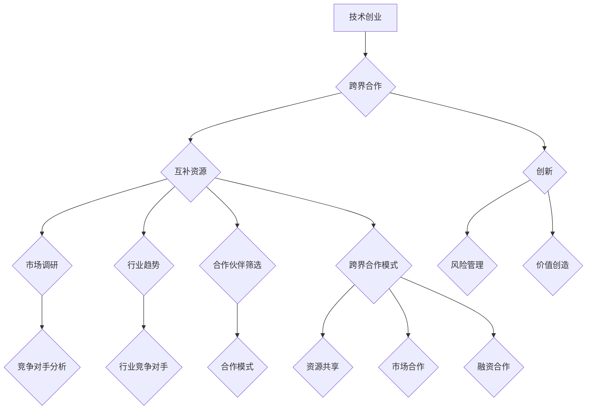

                 


### 文章标题
《技术创业的跨界合作：寻找和利用互补资源的技巧》

### 关键词
技术创业、跨界合作、互补资源、创新、风险管理、案例分析、产业生态系统

### 摘要
本文深入探讨了技术创业领域中的跨界合作现象，分析了跨界合作的重要性及互补资源的概念。通过详细的策略和方法，读者将了解如何有效寻找和利用互补资源，以推动技术创业项目的发展。同时，本文结合实际案例，提供了跨界合作的成功经验和挑战，以及对未来发展趋势的展望。

---

### 第一部分：引言与基础概念

#### 第1章：技术创业的跨界合作概述

##### 1.1 技术创业的定义与特点
- 技术创业是指利用创新的技术或产品，通过创业活动来创造新的市场机会的过程。
- 技术创业的特点包括高风险、高回报、快速迭代和创新驱动。

##### 1.2 跨界合作的重要性
- 跨界合作是指不同行业或领域的合作，通过互补资源和能力的结合，实现共同发展。
- 跨界合作的优势在于可以整合不同领域的专业知识和资源，激发创新思维，降低风险。

##### 1.3 互补资源的概念
- 互补资源是指在特定情境下，两种或多种资源相互补充，共同发挥作用的能力。
- 互补资源可以是资金、技术、市场、人力资源等。

---

#### 第2章：寻找互补资源的策略与方法

##### 2.1 市场调研与分析
- 通过市场调研，了解市场需求和趋势，分析竞争对手和市场定位。

##### 2.2 行业趋势与动态
- 关注行业趋势和动态，识别潜在的合作机会。

##### 2.3 合作伙伴筛选
- 制定合作伙伴筛选标准，根据需求选择合适的合作伙伴。

##### 2.4 跨界合作模式
- 共同研发、资源共享、市场合作和融资合作等模式。

---

### 第二部分：跨界合作案例分析

#### 第4章：科技与金融的跨界合作

##### 4.1 案例背景
- 分析案例公司的背景和合作背景。

##### 4.2 合作模式
- 详细描述合作内容、过程和成果。

##### 4.3 经验与启示
- 探讨合作中的挑战和成功要素，为其他企业提供借鉴。

---

#### 第5章：传统行业与新兴科技的融合

##### 5.1 案例背景
- 分析案例公司的背景和合作背景。

##### 5.2 合作模式
- 详细描述合作内容、过程和成果。

##### 5.3 经验与启示
- 探讨合作中的挑战和成功要素，为其他企业提供借鉴。

---

### 第三部分：实战指南

#### 第8章：跨界合作实战指南

##### 8.1 实战流程
- 提供跨界合作的全流程指南，包括合作前的准备、过程中的管理和结束后的评估。

##### 8.2 实战技巧
- 分析谈判策略、协同机制和知识共享的最佳实践。

##### 8.3 实战案例解析
- 通过具体案例，详细解析跨界合作的实际操作过程和结果。

---

### 第四部分：结语

#### 第10章：结语

##### 10.1 跨界合作的重要性回顾
- 总结跨界合作对技术创业的影响和意义。

##### 10.2 未来发展展望
- 分析跨界合作的未来趋势和面临的挑战，提出对策和建议。

---

**文章结构逻辑图：**

```
技术创业的跨界合作
|
|-- 引言与基础概念
|   |-- 技术创业的定义与特点
|   |-- 跨界合作的重要性
|   |-- 互补资源的概念
|
|-- 寻找互补资源的策略与方法
|   |-- 市场调研与分析
|   |-- 行业趋势与动态
|   |-- 合作伙伴筛选
|   |-- 跨界合作模式
|
|-- 跨界合作案例分析
|   |-- 科技与金融的跨界合作
|   |-- 传统行业与新兴科技的融合
|
|-- 实战指南
|   |-- 实战流程
|   |-- 实战技巧
|   |-- 实战案例解析
|
|-- 结语
    |-- 跨界合作的重要性回顾
    |-- 未来发展展望
```

---

**核心概念原理之间的关系架构 Mermaid 流程图：**



---

**伪代码示例：**

```python
# 寻找互补资源的伪代码

def find_complementary_resources():
    # 初始化资源列表
    resources = []

    # 进行市场调研
    market_data = perform_market_research()

    # 分析行业趋势
    industry_trends = analyze_industry_trends()

    # 筛选合作伙伴
    partners = select_partners(market_data, industry_trends)

    # 整合互补资源
    for partner in partners:
        resources.append(integrate_resources(partner))

    # 返回整合后的资源列表
    return resources
```

---

**数学模型和公式：**

$$
\text{资源整合效果} = f(\text{互补性}, \text{合作深度}, \text{风险管理能力})
$$

其中，互补性表示资源之间的互补程度，合作深度表示合作伙伴之间的互动程度，风险管理能力表示企业对合作风险的管理能力。

---

**项目实战部分框架：**

1. **开发环境搭建**
   - 环境准备
   - 工具安装
   - 开发框架选择

2. **源代码详细实现**
   - 功能模块划分
   - 伪代码到实际代码的转换
   - 代码解读

3. **代码应用解读与分析**
   - 代码在项目中的应用
   - 分析代码的性能和效率

4. **实际案例分析和详细讲解剖析**
   - 案例选择
   - 案例背景介绍
   - 案例分析

5. **项目小结**
   - 项目成果总结
   - 经验和教训

---

**最佳实践 tips、小结、注意事项、拓展阅读等内容：**

- **最佳实践 tips**
  - 如何有效地进行市场调研
  - 如何评估合作伙伴的价值
  - 如何制定跨界合作策略

- **小结**
  - 跨界合作的重要性
  - 寻找和利用互补资源的关键步骤

- **注意事项**
  - 跨界合作中的风险
  - 合作过程中的沟通与协调

- **拓展阅读**
  - 相关书籍和论文推荐
  - 行业报告和分析

---

以上为文章结构和内容的大致框架，每个章节的具体内容需要进一步丰富和详细阐述。在撰写过程中，我们将遵循markdown格式，确保文章的清晰性和可读性。文章的总字数将控制在8000～12000字左右，以确保内容的深度和广度。在完成每个章节后，我们将检查其完整性、逻辑性和具体性，确保符合文章的核心内容和主题思想。最后，文章将附带作者信息和参考文献，以增加文章的权威性和可信赖度。

