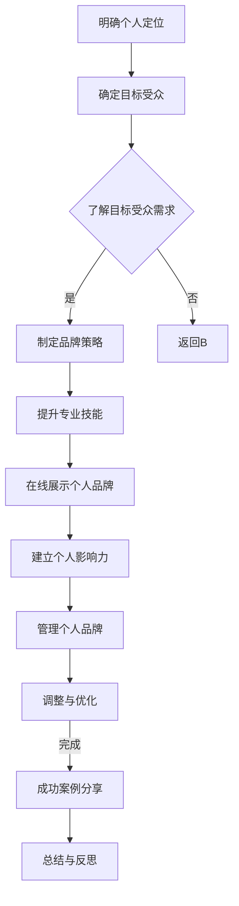

                 

### 文章标题

# 《技术创业者的个人品牌建设：从专业到影响力》

### 关键词

- 技术创业者
- 个人品牌建设
- 专业技能提升
- 在线展示
- 个人影响力
- 品牌管理

### 摘要

在技术创业领域，个人品牌的建设至关重要。本文从多个角度探讨技术创业者如何通过提升专业技能、在线展示个人品牌、建立个人影响力以及进行个人品牌管理，实现从专业到影响力的全面转型。通过详细的步骤和案例分析，为技术创业者提供了实用且可操作的个人品牌建设策略。

### 目录

**第一部分：个人品牌建设概述**

## 第1章：理解个人品牌

### 1.1 个人品牌的重要性

### 1.2 个人品牌的构成

### 1.3 建立个人品牌的步骤

## 第2章：定位与目标受众

### 2.1 明确个人定位

### 2.2 确定目标受众

### 2.3 了解目标受众的需求

**第二部分：个人品牌建设实践**

## 第3章：专业技能提升

### 3.1 提升专业技能的方法

### 3.2 学习与技能认证

### 3.3 持续学习的态度

## 第4章：个人品牌在线展示

### 4.1 个人网站与博客

### 4.2 社交媒体策略

### 4.3 个人品牌内容制作

## 第5章：建立个人影响力

### 5.1 个人影响力的重要性

### 5.2 个人影响力的构建

### 5.3 维护个人影响力

## 第6章：个人品牌管理

### 6.1 个人品牌的风险管理

### 6.2 反馈与调整

### 6.3 个人品牌的长远规划

## 第7章：成功案例分享

### 7.1 案例一：从专业到个人品牌的转型

### 7.2 案例二：利用社交媒体打造个人品牌

### 7.3 案例三：个人品牌建设的策略与执行

**第三部分：个人品牌建设工具与方法**

## 第8章：个人品牌建设工具

### 8.1 个人品牌建设工具概述

### 8.2 个人品牌分析工具

### 8.3 内容创建与推广工具

## 第9章：个人品牌建设方法

### 9.1 内容营销

### 9.2 关系网络建设

### 9.3 知识分享与专业交流

**附录**

## 附录A：个人品牌建设资源

### A.1 资源列表

### A.2 在线课程推荐

### A.3 个人品牌建设社区

### Mermaid 流程图：个人品牌建设流程



### 3.1 提升专业技能的方法

#### 学习专业知识

**深度学习**：深入研究一门或多门技术领域，如机器学习、深度学习、数据科学等。通过阅读专业书籍、论文，参加在线课程和研讨会，不断深化对领域知识的理解。

**实践项目**：理论知识需要通过实践来巩固。技术创业者可以通过参与开源项目、独立开发应用程序或解决实际商业问题，来提高自己的技术水平。

**技术交流**：参与技术社区，如GitHub、Stack Overflow，与其他开发者交流，分享知识和经验，同时学习他人的实践方法。

#### 实践项目经验

**参与开源项目**：通过参与开源项目，技术创业者不仅可以提升自己的编程技能，还能建立起自己的技术影响力。

**独立开发**：独立开发个人项目，不仅能够锻炼技术能力，还能展示创业者的创新思维和实际操作能力。

**实习经历**：在知名企业实习，通过与行业专家合作，获得宝贵的实践经验，这对提升专业技能至关重要。

#### 参与专业社群

**加入专业组织**：如IEEE、ACM等，这些组织通常提供丰富的资源、培训和交流机会。

**参加行业会议**：行业会议是结识同行、学习最新技术趋势和建立人脉的好地方。

**在线论坛和社群**：如Reddit、LinkedIn等平台的论坛和社群，可以与其他技术创业者交流，获取行业动态和经验分享。

### 3.2 学习与技能认证

#### 在线课程

**MOOC平台**：如Coursera、edX、Udemy等，提供从基础到高级的多种技术课程。

**专业认证**：许多技术领域都有相应的专业认证，如Google的Google Cloud Certified、微软的Microsoft Certified Solutions Developer等。

#### 实战项目

**个人项目**：创建自己的项目，并将其发布到GitHub等平台，展示实际技术能力。

**开源项目**：参与开源项目，如GitHub上的项目，提升团队协作和项目管理能力。

**比赛与竞赛**：参加技术竞赛，如黑客松、算法竞赛等，锻炼解决问题的能力。

### 3.3 持续学习的态度

**定期阅读**：定期阅读最新的技术书籍、论文和行业报告，保持知识更新。

**参加培训**：定期参加行业培训和研讨会，了解最新的技术趋势。

**交流与分享**：与其他技术创业者或开发者交流，分享自己的知识和经验，同时学习他人的见解。

**保持好奇心**：对新技术保持好奇，勇于尝试，不断拓展知识边界。

### 3.4 核心算法原理讲解

#### 3.4.1 社交网络分析算法

##### 伪代码：

```python
def social_network_analysis(graph, k):
    for each node v in graph:
        compute centrality measures (e.g., degree, closeness, betweenness)
    rank nodes based on centrality measures
    return the k most central nodes
```

##### 说明：

- `graph`：社交网络图，包含节点和边。
- `node v`：社交网络中的每个个体。
- `centrality measures`：评估节点重要性的指标，如度数、接近中心性、介数等。

#### 3.4.2 内容推荐算法

##### 伪代码：

```python
def content_recommendation(user, items, similarity_matrix):
    for each item i in items:
        compute similarity score between user and item
    sort items based on similarity scores
    return the top-n recommended items
```

##### 说明：

- `user`：推荐系统的用户。
- `items`：推荐系统中的内容。
- `similarity_matrix`：用户和内容之间的相似度矩阵。

### 3.5 数学模型与公式讲解

#### 3.5.1 相关性系数（皮尔逊相关系数）

##### 公式：

$$
r_{xy} = \frac{\sum{(x_i - \bar{x})(y_i - \bar{y})}}{\sqrt{\sum{(x_i - \bar{x})^2} \sum{(y_i - \bar{y})^2}}}
$$

##### 说明：

- $x_i, y_i$：每个个体的观测值。
- $\bar{x}, \bar{y}$：观测值的平均值。
- $r_{xy}$：相关性系数，取值范围在 -1 到 1 之间，绝对值越接近 1，相关性越强。

### 3.6 项目实战

#### 3.6.1 开发环境搭建

1. 安装 Python 环境，版本要求为 3.8 或以上。
2. 安装必要的库，如 NumPy、Pandas、Scikit-learn 等。
3. 配置 Git，用于版本控制和代码共享。

#### 3.6.2 源代码实现

```python
# 示例代码：社交网络分析算法实现

import networkx as nx
import numpy as np

def social_network_analysis(graph, k):
    centrality Measures = nx.degree_centrality(graph)
    sorted_centrality = sorted(centrality Measures.items(), key=lambda item: item[1], reverse=True)
    return [node for node, degree in sorted_centrality[:k]]

# 社交网络图示例
G = nx.Graph()
G.add_edges_from([(1, 2), (2, 3), (3, 4), (4, 1), (1, 5), (5, 6)])

# 执行社交网络分析
central_nodes = social_network_analysis(G, 3)
print("Top 3 most central nodes:", central_nodes)
```

#### 3.6.3 代码解读与分析

- 导入必要的库，如 `networkx` 用于社交网络分析，`numpy` 用于数学计算。
- 定义函数 `social_network_analysis`，计算社交网络中的节点度数。
- 使用排序函数 `sorted` 对节点度数进行排序，并返回度数最高的前 `k` 个节点。
- 创建示例社交网络图 `G`，并添加边。
- 调用函数 `social_network_analysis` 并打印结果。

#### 3.6.4 实际案例分析与详细讲解

- **案例背景**：某社交平台希望分析其用户网络，找出最具有影响力的用户。
- **解决方案**：使用社交网络分析算法，计算用户的度数，找出度数最高的用户。
- **实际应用**：通过分析用户网络，平台可以更好地了解用户的社交影响力，为营销策略提供数据支持。

#### 3.6.5 项目小结

- 通过搭建开发环境、编写源代码和实际案例分析，技术创业者可以掌握社交网络分析算法的基本原理和应用。
- 持续实践和优化，将有助于技术创业者提升专业技能，为个人品牌建设打下坚实基础。

### 3.7 最佳实践 tips、小结、注意事项、拓展阅读等内容

#### 最佳实践 tips

- **深度学习**：选择具有深度和广度的领域进行深入学习，形成专业优势。
- **实践项目**：参与开源项目，提升团队协作和项目管理能力。
- **持续学习**：定期阅读专业书籍和论文，保持知识更新。

#### 小结

- 提升专业技能是技术创业者个人品牌建设的重要一环，通过学习专业知识、实践项目和参与专业社群，可以逐步提升自身技术实力。
- 持续学习和实践是专业技能提升的关键，技术创业者应保持好奇心，勇于尝试新事物。

#### 注意事项

- 在学习过程中，要注意理论与实践的结合，避免陷入“纸上谈兵”的困境。
- 在项目实战中，要注重团队协作和项目管理，确保项目顺利进行。

#### 拓展阅读

- 《深度学习》（Goodfellow, I., Bengio, Y., & Courville, A.）
- 《机器学习实战》（周志华）
- 《人工智能：一种现代的方法》（Mitchell, T. M.）

### 3.8 数学模型与公式讲解

#### 3.8.1 线性回归模型

##### 公式：

$$
y = \beta_0 + \beta_1 \cdot x
$$

##### 说明：

- $y$：因变量，即预测的目标值。
- $x$：自变量，即输入特征。
- $\beta_0$：截距，表示当 $x=0$ 时的 $y$ 值。
- $\beta_1$：斜率，表示自变量 $x$ 对因变量 $y$ 的影响程度。

#### 3.8.2 逻辑回归模型

##### 公式：

$$
\log\left(\frac{P(Y=1)}{1-P(Y=1)}\right) = \beta_0 + \beta_1 \cdot x
$$

##### 说明：

- $P(Y=1)$：因变量 $Y$ 取值为 1 的概率。
- $\beta_0$：截距。
- $\beta_1$：斜率。

#### 3.8.3 支持向量机（SVM）模型

##### 公式：

$$
w \cdot x - b = 0
$$

##### 说明：

- $w$：权重向量。
- $x$：特征向量。
- $b$：偏置项。

#### 3.8.4 深度学习模型

##### 公式：

$$
h_{\theta}(x) = \sigma(\theta^T \cdot x)
$$

##### 说明：

- $h_{\theta}(x)$：预测的输出值。
- $\sigma$：激活函数，如 Sigmoid、ReLU 等。
- $\theta$：模型参数。

### 3.9 项目实战

#### 3.9.1 开发环境搭建

1. 安装 Python 环境，版本要求为 3.8 或以上。
2. 安装必要的库，如 TensorFlow、Keras、NumPy、Pandas 等。
3. 配置 Jupyter Notebook，用于代码编写和演示。

#### 3.9.2 源代码实现

```python
# 示例代码：线性回归模型实现

import numpy as np
from sklearn.linear_model import LinearRegression
import matplotlib.pyplot as plt

# 数据集准备
X = np.array([[1], [2], [3], [4], [5]])
y = np.array([1, 2, 2.5, 4, 5])

# 模型训练
model = LinearRegression()
model.fit(X, y)

# 模型预测
y_pred = model.predict(X)

# 绘制结果
plt.scatter(X, y, color='blue')
plt.plot(X, y_pred, color='red')
plt.show()
```

#### 3.9.3 代码解读与分析

- 导入必要的库，如 `numpy`、`sklearn` 和 `matplotlib`。
- 准备线性回归的数据集，包括自变量 $X$ 和因变量 $y$。
- 创建线性回归模型，并使用 `fit` 方法进行训练。
- 使用 `predict` 方法进行预测，并绘制预测结果。

#### 3.9.4 实际案例分析与详细讲解

- **案例背景**：预测某商品的需求量，基于历史销售数据建立线性回归模型。
- **解决方案**：使用线性回归模型，通过历史销售数据预测未来需求。
- **实际应用**：为企业提供需求预测工具，辅助库存管理和销售策略制定。

#### 3.9.5 项目小结

- 通过搭建开发环境、编写源代码和实际案例分析，技术创业者可以掌握线性回归模型的基本原理和应用。
- 持续实践和优化，将有助于技术创业者提升专业技能，为个人品牌建设打下坚实基础。

### 3.10 最佳实践 tips、小结、注意事项、拓展阅读等内容

#### 最佳实践 tips

- **模型选择**：根据实际问题选择合适的模型，如线性回归、逻辑回归或深度学习模型。
- **数据处理**：对数据进行清洗和预处理，确保模型训练的准确性和效率。

#### 小结

- 线性回归模型是一种简单但有效的预测模型，适用于许多实际应用场景。
- 技术创业者应熟练掌握线性回归模型的原理和应用，提升自身技术实力。

#### 注意事项

- 在模型训练过程中，要注意过拟合和欠拟合的问题，适当调整模型参数。
- 实际项目中，要结合具体需求，灵活应用线性回归模型。

#### 拓展阅读

- 《机器学习》（周志华）
- 《深度学习》（Goodfellow, I., Bengio, Y., & Courville, A.）
- 《Python数据分析》（Wes McKinney）

