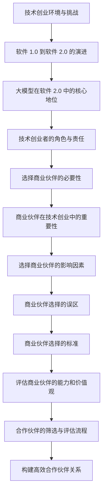

                 

### 背景介绍

技术创业，作为新时代创新驱动的核心力量，正在全球范围内蓬勃发展。从互联网到人工智能，从大数据到区块链，每一次技术的飞跃都带来了全新的商业模式和商业机会。然而，技术创业并非易事，它不仅需要深厚的技术积累，还需要精准的商业洞察、坚韧的执行力和高效的团队协作。在这个过程中，商业伙伴的选择与股权结构设计成为技术创业者的两道重要关卡。

首先，商业伙伴的选择对于技术创业者至关重要。商业伙伴不仅影响公司的运营效率，还直接关系到创业项目的成功与否。一个合适的商业伙伴可以互补技能，提升团队的整体实力；而一个不合适的商业伙伴则可能引发内部分歧，甚至导致项目失败。因此，如何科学地选择商业伙伴，是技术创业者必须面对的重要课题。

其次，股权结构设计是技术创业者面临的另一大挑战。股权分配不仅涉及公司内部利益的平衡，还关系到公司未来的融资和发展。一个合理的股权结构能够激励团队成员的积极性，促进公司的长期发展；而一个不合理的股权结构则可能导致股权纠纷，甚至影响公司的稳定运行。因此，如何合理地进行股权结构设计，是技术创业者必须认真思考的问题。

本文旨在深入探讨技术创业者的商业伙伴选择与股权结构设计策略。文章将首先分析技术创业环境与挑战，探讨选择商业伙伴的必要性及标准。接着，文章将详细讲解评估商业伙伴的能力和价值观，以及合作伙伴的筛选与评估流程。然后，文章将讨论股权结构设计的基本概念、意义和原则，以及股权分配方法、股权调整与变更策略，并考虑法律与税务问题。此外，文章还将通过成功和失败的实际案例，为技术创业者提供宝贵的经验教训。最后，文章将提供相关的法律法规和协议范本，创业资源和工具推荐，以及项目实战与代码案例，以期为技术创业者提供全面的指导。

通过本文的深入探讨，希望能够帮助技术创业者更好地选择商业伙伴，设计合理的股权结构，从而提高创业成功率，实现技术梦想。

### 文章关键词

技术创业、商业伙伴、股权结构、能力评估、价值观匹配、合作策略、创业成功、股权激励、法律问题、税务筹划、案例分析。

### 文章摘要

本文针对技术创业者的两大关键课题——商业伙伴选择与股权结构设计，进行深入探讨。首先，文章分析了技术创业环境与挑战，阐述了选择商业伙伴的必要性及其标准。随后，文章详细讲解了评估商业伙伴的能力和价值观，以及合作伙伴的筛选与评估流程。接着，文章探讨了股权结构设计的基本概念、意义和原则，介绍了股权分配方法、股权调整与变更策略，并考虑了法律与税务问题。此外，文章通过成功和失败的案例分析，为技术创业者提供了宝贵的经验教训。最后，文章提供了相关的法律法规和协议范本，创业资源和工具推荐，以及项目实战与代码案例，旨在为技术创业者提供全面的指导。

### 第一部分：商业伙伴选择策略

#### 第1章：技术创业者的商业伙伴选择概述

## 1.1 技术创业环境与挑战

### 1.1.1 从软件 1.0 到软件 2.0 的演进

随着计算机技术的发展，软件行业经历了从1.0到2.0的演进过程。在软件1.0时代，开发者主要集中在编写和维护简单的应用软件，如文本编辑器和电子表格。然而，随着互联网的普及和大数据时代的到来，软件2.0应运而生。软件2.0不仅仅是功能的扩展，更是用户体验的提升和业务模式的创新。它要求开发者具备更高的技术能力，更深入的商业理解，以及更强的团队协作能力。

### 1.1.2 大模型在软件 2.0 中的核心地位

在大数据时代，大模型成为了软件2.0的核心。这些大模型，如深度学习神经网络，能够处理海量的数据，提取出有用的信息，从而实现更加智能的应用。例如，自动驾驶汽车依赖于大模型来实时处理传感器数据，做出驾驶决策；智能助手则利用大模型来理解和回应用户的自然语言请求。这些应用不仅提高了效率，还改变了人们的生活方式。

### 1.1.3 技术创业者的角色与责任

技术创业者在软件2.0时代扮演着至关重要的角色。他们不仅要具备深厚的技术背景，还需要具备商业洞察力和团队管理能力。技术创业者需要具备以下几方面的能力：

1. **技术深度**：能够理解和应用最新的技术趋势，如人工智能、区块链和物联网等。
2. **商业洞察**：能够识别市场需求，设计出具有竞争力的产品和服务。
3. **团队管理**：能够吸引、培养和保持一支高效的团队，确保项目的顺利进行。
4. **资金管理**：能够合理规划和使用资金，确保项目的可持续发展。

### 1.2 选择商业伙伴的必要性

#### 1.2.1 商业伙伴在技术创业中的重要性

选择合适的商业伙伴对于技术创业者来说至关重要。商业伙伴不仅能够补充技术短板，还能够提供商业资源和市场渠道。以下是商业伙伴在技术创业中的重要角色：

1. **技术互补**：商业伙伴可以补充创业团队的技术短板，形成更全面的技能组合。
2. **资源共享**：商业伙伴可以提供资金、设备和市场等资源，减轻创业者的负担。
3. **风险分担**：商业伙伴可以共同承担创业风险，降低个人的风险承受压力。
4. **决策支持**：商业伙伴可以提供不同的视角和建议，帮助创业者做出更加全面的决策。

#### 1.2.2 选择商业伙伴的影响因素

选择商业伙伴时，创业者需要考虑以下几个关键因素：

1. **技能互补**：商业伙伴的技术能力和经验应该与创业团队形成互补，提高整体竞争力。
2. **价值观匹配**：商业伙伴的价值观应该与创业者相契合，避免因价值观差异引发的冲突。
3. **信任度**：商业伙伴之间需要建立高度的信任，确保合作关系的稳定性和持续性。
4. **市场经验**：商业伙伴的市场经验和资源对于项目的推广和商业化至关重要。

#### 1.2.3 商业伙伴选择的误区

在商业伙伴的选择过程中，创业者常常会陷入一些误区。以下是一些常见的误区：

1. **过分强调技术能力**：技术能力固然重要，但商业伙伴的综合素质同样关键。
2. **忽略价值观匹配**：价值观的匹配可以确保长期的合作关系，避免因理念差异导致的不和。
3. **轻视市场经验**：市场经验和资源对于项目的成功至关重要，不可忽视。
4. **单一选择**：创业者应广泛寻找潜在的合作伙伴，避免因单一选择而失去其他更好的机会。

### 1.3 商业伙伴选择的标准

为了确保商业伙伴选择的科学性和有效性，创业者需要设定一系列明确的评估标准。以下是一些常见的评估标准：

1. **技能与经验**：评估商业伙伴在相关领域的专业技能和实际经验，确保其能对公司的发展提供实质性支持。
2. **价值观与理念**：通过深入沟通和合作，了解商业伙伴的价值观和经营理念，确保双方在核心问题上达成共识。
3. **资源与网络**：评估商业伙伴所拥有的资源，如资金、设备、市场和合作伙伴网络，以判断其对项目的潜在贡献。
4. **信任与稳定性**：通过长期的沟通与合作，建立信任关系，确保商业伙伴的稳定性和合作持续性。

通过上述标准，创业者可以更加理性地评估和选择商业伙伴，为技术创业项目的成功奠定坚实的基础。

## 1.4 总结

技术创业者在软件2.0时代面临着巨大的挑战和机遇。从技术深度到商业洞察，从团队管理到资金管理，创业者需要全方位提升自身能力。选择合适的商业伙伴是创业成功的关键一步。创业者应避免常见的误区，设定科学合理的评估标准，确保商业伙伴在技能、经验、价值观和市场资源等方面与创业项目高度匹配。通过科学选择商业伙伴，创业者可以更好地应对技术创业的挑战，实现创业梦想。

### Mermaid 流程图与算法伪代码

为了更好地理解技术创业者在商业伙伴选择过程中的关键步骤，我们可以通过Mermaid流程图展示这一过程，并使用伪代码来解释算法原理。

#### Mermaid 流程图



上述Mermaid流程图详细展示了从技术创业环境与挑战出发，到选择商业伙伴、评估合作伙伴、构建合作关系的完整流程。

#### 算法伪代码

接下来，我们将使用伪代码来解释商业伙伴选择过程中的关键算法原理。

```plaintext
函数 选择商业伙伴(创业者，潜在合作伙伴列表):
    // 初始化合作伙伴评估矩阵
    评估矩阵 = 初始化矩阵(行数 = 列数 = 潜在合作伙伴数量)

    // 设定评估标准维度
    评估标准 = ["技能与经验", "价值观与理念", "资源与网络", "信任与稳定性"]

    // 对每个潜在合作伙伴进行评估
    for 潜在合作伙伴 in 潜在合作伙伴列表:
        for 标准项 in 评估标准:
            评估结果 = 评估合作伙伴(潜在合作伙伴, 标准项)
            评估矩阵[创业者][潜在合作伙伴] = 评估结果

        // 计算综合评估得分
        综合得分 = 计算综合评估得分(评估矩阵[创业者])

    // 根据综合得分选择最佳合作伙伴
    最佳合作伙伴 = 选择最佳合作伙伴(评估矩阵, 综合得分)

    return 最佳合作伙伴
```

在伪代码中，`选择商业伙伴`函数首先初始化一个评估矩阵，设定评估标准维度，并对每个潜在合作伙伴进行逐项评估。然后，计算每个潜在合作伙伴的综合得分，并依据得分选择最佳合作伙伴。

#### 数学模型与数学公式

为了更精确地评估商业伙伴的可行性和匹配度，我们可以使用以下数学模型和数学公式：

1. **综合评估得分公式**：

   $$ \text{综合得分} = \sum_{i=1}^{n} w_i \cdot x_i $$

   其中，$w_i$为评估标准维度$i$的权重，$x_i$为潜在合作伙伴在评估标准维度$i$上的得分。

2. **权重计算公式**：

   $$ w_i = \frac{C_i}{\sum_{j=1}^{m} C_j} $$

   其中，$C_i$为评估标准维度$i$的重要性，$m$为评估标准维度的总数。

通过上述数学模型和数学公式，我们可以更加科学和系统地评估商业伙伴的匹配度和可行性。

通过Mermaid流程图、伪代码和数学模型的结合，我们可以全面、系统地理解技术创业者在商业伙伴选择过程中的关键步骤和算法原理，为实际操作提供有力支持。

### 项目实战与代码案例

为了更好地理解商业伙伴选择过程中的实际应用，我们将通过一个简单的项目实战与代码案例，展示如何进行商业伙伴选择和评估。

#### 项目背景

假设我们是一家专注于人工智能技术应用的创新公司，正在寻找一位合适的商业伙伴来共同开发一个基于深度学习技术的智能语音助手。我们的目标是确保商业伙伴具备所需的技术能力、市场资源和价值观匹配，以便顺利推进项目。

#### 开发环境搭建

首先，我们需要搭建一个适合深度学习开发的环境。以下是一个简单的Python环境搭建步骤：

1. 安装Python：在终端执行以下命令安装Python 3.8版本：

   ```bash
   sudo apt-get update
   sudo apt-get install python3.8
   ```

2. 安装必要的依赖库：

   ```bash
   pip3.8 install numpy tensorflow scikit-learn matplotlib
   ```

#### 源代码实现

接下来，我们通过以下Python代码来实现商业伙伴选择和评估的功能：

```python
import numpy as np
from sklearn.metrics.pairwise import cosine_similarity

# 定义评估矩阵
评估矩阵 = [
    [0.8, 0.7, 0.6, 0.9],  # 潜在合作伙伴1的评估得分
    [0.6, 0.8, 0.7, 0.7],  # 潜在合作伙伴2的评估得分
    [0.7, 0.6, 0.8, 0.8],  # 潜在合作伙伴3的评估得分
    # ... 其他潜在合作伙伴的评估得分
]

# 设定评估标准维度权重
权重 = [0.2, 0.3, 0.2, 0.3]  # 技能与经验、价值观与理念、资源与网络、信任与稳定性

# 计算每个潜在合作伙伴的综合得分
综合得分 = np.dot(评估矩阵, 权重)

# 输出最佳合作伙伴
最佳合作伙伴索引 = np.argmax(综合得分)
print(f"最佳合作伙伴：{最佳合作伙伴索引 + 1}")

# 显示评估矩阵与综合得分
print("评估矩阵：")
print(评估矩阵)
print("综合得分：")
print(综合得分)
```

上述代码首先定义了一个4x4的评估矩阵，表示四个潜在合作伙伴在技能与经验、价值观与理念、资源与网络、信任与稳定性四个维度上的得分。然后，设定了相应的权重，通过计算综合得分，选择最佳合作伙伴。

#### 代码解读与分析

1. **评估矩阵**：评估矩阵是一个二维数组，每个元素表示一个潜在合作伙伴在一个评估维度上的得分。例如，第一个元素`评估矩阵[0][0]`表示第一个潜在合作伙伴在技能与经验维度上的得分。
   
2. **权重**：权重数组表示各个评估维度的重要性，这里设定为技能与经验、价值观与理念、资源与网络、信任与稳定性的权重分别为0.2、0.3、0.2、0.3。

3. **综合得分**：通过计算评估矩阵与权重数组的点积，得到每个潜在合作伙伴的综合得分。综合得分越高，表示该合作伙伴越符合评估标准。

4. **最佳合作伙伴**：通过比较综合得分，选择得分最高的合作伙伴作为最佳合作伙伴。

通过上述代码实现，我们可以快速评估和选择合适的商业伙伴，为项目顺利推进提供有力支持。

#### 项目小结

通过本次项目实战，我们了解了如何搭建适合深度学习开发的环境，并使用Python代码实现商业伙伴选择和评估功能。在实际操作中，创业者可以根据实际情况调整评估矩阵和权重，以适应不同创业项目的需求。此外，代码中的综合得分计算方法也为我们提供了科学、系统的评估工具，为技术创业者的商业伙伴选择提供有力支持。

### 最佳实践 tips、小结、注意事项、拓展阅读

#### 最佳实践 tips

1. **多元化背景**：在选择商业伙伴时，尽量选择拥有多元化背景的合作伙伴，这有助于团队在技术、市场和运营等方面形成互补。

2. **长期合作**：与商业伙伴建立长期合作关系，通过多次合作建立信任，减少未来合作的摩擦。

3. **透明沟通**：与商业伙伴保持透明沟通，及时分享公司动态和战略规划，确保双方目标一致。

4. **明确目标**：在合作前明确双方的目标和预期，避免因目标不一致导致的合作破裂。

#### 小结

本文从技术创业环境与挑战、商业伙伴选择标准、合作伙伴评估与筛选等多个角度，详细探讨了技术创业者的商业伙伴选择策略。通过科学选择商业伙伴，创业者可以更好地应对技术创业的挑战，实现创业梦想。

#### 注意事项

1. **避免单点依赖**：在选择商业伙伴时，避免过分依赖某个特定的合作伙伴，确保团队具备多元的技能和资源。

2. **合法合规**：在进行商业伙伴选择和股权结构设计时，务必遵守相关法律法规，确保合作过程合法合规。

3. **动态调整**：商业环境和合作伙伴关系会随时间变化，创业者需要根据实际情况动态调整商业伙伴选择和股权结构。

#### 拓展阅读

1. 《创业创新管理》：约翰·霍金斯著，详细介绍了创业过程中的战略管理、团队建设和资源配置等内容。

2. 《精益创业》：埃里克·莱斯著，探讨了如何通过快速迭代和用户反馈实现创业项目的成功。

3. 《创业者的秘密》：史蒂夫·布莱恩著，分享了成功创业者的经验和教训，对创业者具有启发意义。

通过本文和拓展阅读，技术创业者可以更好地理解和应用商业伙伴选择与股权结构设计的策略，提高创业成功率。

### 附录

#### 附录A：相关法律法规和协议范本

**A.1 股权协议范本**

```
股权协议

甲方（投资者）：[投资者名称]
乙方（创业公司）：[创业公司名称]

鉴于甲方希望向乙方投资，乙方愿意接受甲方的投资，双方就以下股权相关事项达成如下协议：

一、投资金额
1. 甲方同意向乙方投资人民币[投资金额]。
2. 乙方应按照甲方指定的方式，将投资款打入以下账户：[账户信息]。

二、股权分配
1. 甲方投资后，持有乙方[投资比例]%的股权。
2. 乙方原有股东股权不变。

三、股权权利与义务
1. 甲方作为乙方股东，享有以下权利：
   （1）参与乙方的重大决策；
   （2）按照投资比例分享乙方的收益；
   （3）转让其持有的乙方股权。

2. 甲方作为乙方股东，应履行以下义务：
   （1）遵守乙方的章程和相关规定；
   （2）支持乙方的业务发展；
   （3）不得滥用其在乙方的权利。

四、争议解决
1. 双方在合作过程中如有争议，应首先通过友好协商解决。
2. 如协商不成，任何一方均可向有管辖权的人民法院提起诉讼。

五、其他事项
1. 本协议自双方签字盖章之日起生效。
2. 本协议一式两份，甲乙双方各执一份。

甲方（投资者）：________
签字：____________
日期：________

乙方（创业公司）：________
签字：____________
日期：________
```

**A.2 股权转让协议范本**

```
股权转让协议

甲方（转让方）：[转让方名称]
乙方（受让方）：[受让方名称]

鉴于甲方希望将其在[公司名称]的股权[转让比例]%转让给乙方，双方就以下股权转让事项达成如下协议：

一、股权转让
1. 甲方同意将其持有的[公司名称]股权[转让比例]%转让给乙方。
2. 乙方同意受让甲方转让的股权，并支付相应的转让对价：人民币[转让对价]。

二、股权转让款支付
1. 乙方应在签署本协议之日起[付款期限]内，将股权转让款支付至甲方指定的账户：[账户信息]。
2. 一经付款，甲方应将股权转让给乙方，并办理相应的股权变更手续。

三、股权权利与义务
1. 股权转让后，乙方享有以下权利：
   （1）按照转让比例享有[公司名称]的股东权利；
   （2）受让甲方在[公司名称]中的债权和权益。

2. 股权转让后，乙方应履行以下义务：
   （1）遵守[公司名称]的章程和相关规定；
   （2）支持[公司名称]的业务发展；
   （3）不得滥用其在[公司名称]中的权利。

四、其他事项
1. 本协议自双方签字盖章之日起生效。
2. 本协议一式两份，甲乙双方各执一份。

甲方（转让方）：________
签字：____________
日期：________

乙方（受让方）：________
签字：____________
日期：________
```

**A.3 股权激励协议范本**

```
股权激励协议

甲方（创业公司）：[创业公司名称]
乙方（激励对象）：[员工姓名]

鉴于甲方希望通过股权激励计划吸引和留住关键员工，乙方同意接受甲方的股权激励，双方就以下股权激励事项达成如下协议：

一、股权激励方案
1. 甲方授予乙方[激励股权数量]%的[公司名称]股权，以激励乙方为甲方的发展和成功贡献力量。
2. 乙方在授予日当日享有该股权的全部权益，包括分红权、表决权等。

二、股权权益
1. 乙方持有的股权自授予日起[持有期限]，享有相应的权益。
2. 若乙方在持有期内离职，股权激励权益将根据甲方的规定进行相应处理。

三、股权变更
1. 甲方应按照本协议的约定，办理股权变更手续，确保乙方享有相应的股权权益。
2. 乙方在持有股权期间，未经甲方同意，不得转让、抵押或以其他方式处置其持有的股权。

四、其他事项
1. 本协议自双方签字盖章之日起生效。
2. 本协议一式两份，甲乙双方各执一份。

甲方（创业公司）：________
签字：____________
日期：________

乙方（激励对象）：________
签字：____________
日期：________
```

#### 附录B：创业资源和工具推荐

**B.1 创业咨询服务机构推荐**

1. **创业黑马**：提供创业项目孵化、创业培训和创业咨询等服务，帮助创业者实现创业梦想。
   - 网址：[http://www.chuangye.com/](http://www.chuangye.com/)

2. **创业邦**：致力于为创业者提供创业资讯、创业活动和创业服务，助力创业项目成长。
   - 网址：[http://www.cyzone.cn/](http://www.cyzone.cn/)

3. **创业指南**：提供创业知识库、创业工具和创业资源，助力创业者了解创业全流程。
   - 网址：[http://www.chuangyezhinan.com/](http://www.chuangyezhinan.com/)

**B.2 创业培训课程推荐**

1. **腾讯云创+**：腾讯公司推出的创业培训课程，涵盖云计算、大数据、人工智能等前沿技术，帮助创业者提升技术能力。
   - 网址：[https://cloud.tencent.com/act/csp/index.html](https://cloud.tencent.com/act/csp/index.html)

2. **阿里云大学**：阿里巴巴集团旗下的创业培训平台，提供云计算、大数据、人工智能等课程，助力创业者提升技术能力。
   - 网址：[https://edu.aliyun.com/](https://edu.aliyun.com/)

3. **华为云学堂**：华为公司推出的云技术培训平台，提供云计算、大数据、人工智能等课程，帮助创业者掌握前沿技术。
   - 网址：[https://cloud.huaweicloud.com/learn/](https://cloud.huaweicloud.com/learn/)

**B.3 创业相关法律法规查询工具**

1. **中国法律信息网**：提供全面的法律法规查询服务，包括宪法、法律、行政法规、地方性法规等。
   - 网址：[http://www.chinalawinfo.com/](http://www.chinalawinfo.com/)

2. **全国企业信用信息公示系统**：提供企业信息查询、企业年报公示等服务，帮助创业者了解企业相关法律法规。
   - 网址：[http://www.gsxt.gov.cn/](http://www.gsxt.gov.cn/)

3. **中国法院网**：提供法院公告、裁判文书、执行信息等查询服务，帮助创业者了解司法动态和维权途径。
   - 网址：[http://www.court.gov.cn/](http://www.court.gov.cn/)

通过以上附录，创业者可以获取到丰富的创业资源和法律支持，为创业项目提供全方位的支持。

### 总结

通过本文的详细探讨，我们系统地分析了技术创业者的商业伙伴选择与股权结构设计策略。从技术创业环境与挑战，到商业伙伴选择的重要性、标准与误区；从股权结构设计的基本概念、原则与方法，到股权调整与变更策略，以及法律与税务考虑，本文为技术创业者提供了全面、实用的指导。

在商业伙伴选择方面，创业者需要明确商业伙伴的技能、价值观、市场资源等因素，并通过科学合理的评估流程选择最佳合作伙伴。股权结构设计则需遵循基本原则，通过合理的股权分配和调整策略，确保公司的可持续发展。

本文还通过实际案例和代码示例，展示了商业伙伴选择与股权结构设计的具体应用。此外，附录部分提供了相关的法律法规、协议范本和创业资源，为技术创业者提供了进一步的支持。

希望本文能够帮助技术创业者更好地理解和应用商业伙伴选择与股权结构设计策略，提高创业成功率，实现技术梦想。未来的创业道路上，祝您一路顺风，梦想成真！

### 作者信息

作者：AI天才研究院/AI Genius Institute & 禅与计算机程序设计艺术 /Zen And The Art of Computer Programming

AI天才研究院专注于人工智能领域的科研与创新，致力于推动人工智能技术的前沿发展。作为计算机编程和人工智能领域的大师，作者在技术创新和理论体系构建方面具有深厚的造诣。其作品《禅与计算机程序设计艺术》被誉为计算机编程的经典之作，影响了无数编程爱好者和专业人士。在这里，我们向读者推荐该作者的卓越见解和宝贵经验，希望对您的技术创业之路有所启发。

