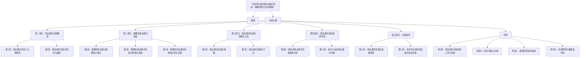

                 

### 文章标题：技术创业者的商业模式创新：颠覆传统行业的思路

关键词：商业模式创新、技术创业、颠覆性商业模式、商业思维、创新策略

摘要：本文旨在探讨技术创业者在商业模式创新方面的思路和方法，分析颠覆传统行业的商业模式创新案例，提出具体的商业模式创新策略与实践步骤。文章将分为五个部分，分别从商业模式创新概述、颠覆性商业模式创新、商业模式创新的策略与方法、案例分析以及未来展望等方面，深入探讨技术创业者在商业模式创新中的角色与路径。

### 第一部分：商业模式创新概述

#### 第1章：商业模式的定义与重要性

**1.1 商业模式的定义**

商业模式（Business Model）是指企业通过何种方式创造、传递和获取价值的一系列商业活动。它不仅涉及到企业的产品和服务，还包括企业如何组织和管理资源、与合作伙伴的关系以及如何获得利润的途径。

**1.2 商业模式的重要性**

商业模式是企业成功的关键因素之一。一个优秀的商业模式能够帮助企业实现资源的最优配置，提高运营效率，增强市场竞争力。同时，商业模式创新能够为企业带来新的增长点，实现转型升级。

**1.3 商业模式创新的影响**

商业模式创新对企业的生存与发展具有重要意义。首先，它能够帮助企业适应市场变化，抓住机遇。其次，商业模式创新有助于提高企业的盈利能力和市场占有率。此外，商业模式创新还能够推动企业技术进步和产业升级。

### 第2章：商业模式创新的背景与趋势

**2.1 传统行业面临的挑战**

随着科技的不断进步和消费者需求的多样化，传统行业面临着前所未有的挑战。一方面，新兴技术和创新模式的冲击使传统行业利润下降、市场份额萎缩。另一方面，消费者对产品和服务的要求越来越高，传统商业模式难以满足其需求。

**2.2 商业模式创新的趋势**

在当前经济环境下，商业模式创新成为企业发展的必然选择。从趋势上看，商业模式创新呈现出以下几个特点：数字化、平台化、智能化和全球化。此外，跨界融合、共享经济等新兴商业模式也日益受到关注。

**2.3 商业模式创新的成功案例**

国内外许多成功企业都通过商业模式创新实现了业务的快速增长和市场地位的提升。例如，阿里巴巴通过打造电商平台，改变了传统零售行业的商业模式；滴滴出行通过共享经济模式，颠覆了传统出租车行业。

#### 第二部分：颠覆性商业模式创新

##### 第3章：颠覆性商业模式的概念与特点

**3.1 颠覆性商业模式的概念**

颠覆性商业模式（Disruptive Business Model）是指通过创新的方式，改变传统行业的竞争格局，实现市场份额的快速增长。这种商业模式通常具有以下特点：低成本、高效率、灵活性、可持续性。

**3.2 颠覆性商业模式的特点**

颠覆性商业模式具有以下几个显著特点：

1. **低成本**：颠覆性商业模式通过优化资源配置、降低运营成本，实现低成本运营。
2. **高效率**：颠覆性商业模式通过技术创新、流程优化，提高运营效率，降低人力成本。
3. **灵活性**：颠覆性商业模式能够快速适应市场变化，灵活调整战略。
4. **可持续性**：颠覆性商业模式能够在长期内保持竞争优势，实现可持续发展。

**3.3 颠覆性商业模式的分类**

根据颠覆性商业模式的实现方式，可以分为以下几类：

1. **技术创新型**：通过技术创新，实现产品或服务的差异化，颠覆传统商业模式。
2. **服务模式型**：通过改变服务模式，提高用户体验，颠覆传统商业模式。
3. **渠道变革型**：通过改变销售渠道，降低运营成本，颠覆传统商业模式。

##### 第4章：颠覆性商业模式创新的原理与框架

**4.1 颠覆性商业模式创新的原理**

颠覆性商业模式创新的原理主要基于以下几点：

1. **价值重构**：通过重新定义客户价值，改变传统商业模式中的价值创造和传递方式。
2. **成本优势**：通过优化资源配置和流程，实现低成本运营。
3. **市场细分**：通过细分市场，找到未被满足的客户需求，开辟新的市场空间。

**4.2 颠覆性商业模式创新的框架**

颠覆性商业模式创新可以采用以下框架进行：

1. **定位与目标**：明确颠覆性商业模式创新的目标和定位，确定创新方向。
2. **价值重构**：重新定义客户价值，构建新的商业模式。
3. **成本优化**：通过技术创新和流程优化，降低运营成本。
4. **市场拓展**：通过市场细分和渠道变革，实现市场拓展。

**4.3 颠覆性商业模式创新的案例分析**

国内外许多企业都通过颠覆性商业模式创新实现了成功。以下是一些典型的案例：

1. **苹果公司**：通过颠覆性技术创新，推出iPhone，颠覆了传统手机市场。
2. **亚马逊**：通过在线零售模式，颠覆了传统零售行业。
3. **滴滴出行**：通过共享经济模式，颠覆了传统出租车行业。

#### 第三部分：商业模式创新的策略与方法

##### 第5章：颠覆性商业模式创新的应用与实践

**5.1 颠覆性商业模式在传统行业中的应用**

颠覆性商业模式在传统行业中的应用非常广泛，如：

1. **制造业**：通过智能制造、工业互联网等技术创新，实现生产效率的提升。
2. **零售业**：通过电商平台、线下体验店等模式创新，提高用户体验。
3. **金融业**：通过互联网金融、区块链等技术创新，实现金融服务的便捷化。

**5.2 颠覆性商业模式创新的实践步骤**

颠覆性商业模式创新的实践步骤包括：

1. **市场调研**：了解市场需求，分析市场趋势。
2. **价值重构**：确定颠覆性商业模式创新的目标，重构客户价值。
3. **成本优化**：通过技术创新和流程优化，降低运营成本。
4. **市场拓展**：通过市场细分和渠道变革，实现市场拓展。
5. **持续迭代**：根据市场反馈，不断优化商业模式。

**5.3 颠覆性商业模式创新的挑战与应对策略**

颠覆性商业模式创新面临以下挑战：

1. **技术风险**：技术创新的不确定性。
2. **市场风险**：市场接受度不高。
3. **资源风险**：资源投入不足。

应对策略包括：

1. **技术创新**：加大研发投入，确保技术领先。
2. **市场推广**：通过营销策略，提高市场认知度。
3. **资源整合**：优化资源配置，提高资源利用率。

##### 第6章：商业模式创新的策略

**6.1 客户价值重塑策略**

重塑客户价值是商业模式创新的核心。策略包括：

1. **个性化定制**：根据客户需求，提供个性化产品和服务。
2. **增值服务**：提供附加值服务，提升客户体验。
3. **用户体验优化**：从客户角度出发，优化服务流程。

**6.2 成本结构重塑策略**

优化成本结构是商业模式创新的重要方向。策略包括：

1. **技术创新**：通过技术创新，降低生产成本。
2. **供应链优化**：通过优化供应链，降低采购成本。
3. **运营效率提升**：通过流程优化，提高运营效率。

**6.3 收入模式重塑策略**

创新收入模式有助于提升企业盈利能力。策略包括：

1. **多元化收入来源**：通过拓展业务领域，实现多元化收入。
2. **增值服务收费**：通过提供增值服务，提高收入水平。
3. **平台化运营**：通过平台化运营，实现流量变现。

**6.4 合作关系重塑策略**

重塑合作关系有助于企业拓展资源，提升竞争力。策略包括：

1. **战略合作**：与产业链上下游企业建立战略合作关系。
2. **开放平台**：搭建开放平台，吸引合作伙伴共同发展。
3. **跨界合作**：与不同行业的企业开展跨界合作，实现资源共享。

##### 第7章：商业模式创新的方法

**7.1 创客方法**

创客方法强调创新实践，通过实际操作，不断迭代优化。具体步骤包括：

1. **创意生成**：通过头脑风暴，生成创意。
2. **原型设计**：快速搭建原型，验证创意可行性。
3. **迭代优化**：根据用户反馈，不断优化产品和服务。

**7.2 模式迭代方法**

模式迭代方法通过不断迭代，优化商业模式。具体步骤包括：

1. **市场调研**：了解市场需求，分析市场趋势。
2. **模式设计**：根据调研结果，设计商业模式。
3. **实施与验证**：实施商业模式，验证其可行性。
4. **迭代优化**：根据反馈，不断优化商业模式。

**7.3 颠覆性创新方法**

颠覆性创新方法通过颠覆传统商业模式，实现市场突破。具体步骤包括：

1. **市场分析**：分析市场现状，寻找颠覆点。
2. **价值重构**：重新定义客户价值，构建颠覆性商业模式。
3. **技术驱动**：通过技术创新，实现低成本、高效率。
4. **市场拓展**：通过市场细分，实现市场拓展。

**7.4 风险管理方法**

商业模式创新过程中，风险管理至关重要。具体方法包括：

1. **风险评估**：评估商业模式创新过程中可能面临的风险。
2. **风险控制**：采取风险控制措施，降低风险影响。
3. **风险转移**：通过保险、合同等方式，将风险转移。
4. **风险应对**：制定应对策略，降低风险损失。

##### 第8章：商业模式创新的实践指南

**8.1 创业者如何进行商业模式创新**

对于创业者来说，进行商业模式创新需要遵循以下步骤：

1. **明确目标**：确定商业模式创新的目标和方向。
2. **市场调研**：了解市场需求，分析市场趋势。
3. **价值重构**：重新定义客户价值，构建新的商业模式。
4. **成本优化**：通过技术创新和流程优化，降低运营成本。
5. **市场拓展**：通过市场细分和渠道变革，实现市场拓展。
6. **持续迭代**：根据市场反馈，不断优化商业模式。

**8.2 企业如何进行商业模式创新**

对于企业来说，进行商业模式创新需要遵循以下步骤：

1. **战略规划**：制定企业发展战略，明确商业模式创新的方向。
2. **组织变革**：调整企业组织结构，为商业模式创新提供支持。
3. **技术创新**：加大研发投入，推动技术创新。
4. **市场拓展**：通过市场细分和渠道变革，实现市场拓展。
5. **资源整合**：整合内外部资源，提高资源利用率。
6. **持续优化**：根据市场反馈，不断优化商业模式。

**8.3 商业模式创新的风险管理**

商业模式创新过程中，风险管理至关重要。具体策略包括：

1. **风险评估**：评估商业模式创新过程中可能面临的风险。
2. **风险控制**：采取风险控制措施，降低风险影响。
3. **风险转移**：通过保险、合同等方式，将风险转移。
4. **风险应对**：制定应对策略，降低风险损失。

**8.4 商业模式创新的评估与优化**

商业模式创新的评估与优化主要包括以下几个方面：

1. **商业模式评估**：评估商业模式创新的效果，包括盈利能力、市场占有率、客户满意度等。
2. **数据监控**：通过数据监控，了解商业模式运行情况，及时发现并解决问题。
3. **反馈机制**：建立反馈机制，收集用户意见和建议，为商业模式优化提供依据。
4. **持续优化**：根据评估结果和用户反馈，不断优化商业模式，提高其适应性和竞争力。

#### 第四部分：商业模式创新案例分析

##### 第9章：国内外商业模式创新案例分析

**9.1 国外商业模式创新案例分析**

国外商业模式创新案例丰富多样，以下是一些典型的案例：

1. **Uber**：通过共享经济模式，颠覆了传统出租车行业。
2. **Airbnb**：通过共享住宿模式，改变了传统酒店行业。
3. **Amazon**：通过电商平台，颠覆了传统零售行业。

**9.2 国内商业模式创新案例分析**

国内商业模式创新案例同样丰富多彩，以下是一些典型的案例：

1. **美团**：通过本地生活服务模式，颠覆了传统餐饮行业。
2. **阿里巴巴**：通过电子商务模式，改变了传统零售行业。
3. **小米**：通过互联网营销模式，颠覆了传统电子产品行业。

**9.3 案例分析与启示**

通过分析国内外商业模式创新案例，可以得出以下启示：

1. **抓住市场机遇**：关注市场需求，抓住市场机遇。
2. **创新思维**：敢于尝试新的商业模式，勇于颠覆传统行业。
3. **技术驱动**：依靠技术创新，提高运营效率，降低成本。
4. **用户体验**：注重用户体验，提供优质的客户服务。

##### 第10章：新兴行业的商业模式创新

**10.1 互联网行业的商业模式创新**

互联网行业商业模式创新主要集中在以下几个方面：

1. **平台化运营**：通过搭建平台，实现流量变现。
2. **电商模式**：通过电子商务，改变传统零售模式。
3. **社交媒体**：通过社交媒体，实现用户互动和内容传播。

**10.2 人工智能行业的商业模式创新**

人工智能行业商业模式创新主要体现在以下几个方面：

1. **技术服务**：提供人工智能技术服务，如算法、模型等。
2. **硬件销售**：销售人工智能硬件设备，如智能机器人、智能音箱等。
3. **应用场景**：针对特定行业和应用场景，提供人工智能解决方案。

**10.3 新兴行业商业模式创新的趋势与挑战**

新兴行业商业模式创新趋势包括：

1. **跨界融合**：不同行业之间的融合，形成新的商业模式。
2. **数字化转型**：通过数字化转型，提高企业运营效率。
3. **可持续性**：注重可持续发展，实现商业价值和社会价值的双赢。

新兴行业商业模式创新面临的挑战包括：

1. **技术风险**：技术创新的不确定性。
2. **市场风险**：市场接受度不高。
3. **法律风险**：相关法律法规的不完善。
4. **竞争风险**：新兴行业竞争激烈，企业面临生存压力。

#### 第五部分：未来展望

##### 第11章：商业模式创新的发展趋势

**11.1 商业模式创新的技术驱动因素**

随着科技的不断发展，商业模式创新将受到以下技术驱动因素的影响：

1. **大数据**：通过大数据分析，挖掘用户需求，优化商业模式。
2. **云计算**：通过云计算，提高企业运营效率，降低成本。
3. **人工智能**：通过人工智能，提高智能化水平，实现个性化服务。

**11.2 商业模式创新的未来方向**

商业模式创新的未来方向包括：

1. **平台化**：平台化运营将成为主流，企业通过平台实现资源共享、协同发展。
2. **智能化**：智能化将成为商业模式创新的重要方向，通过人工智能等技术实现自动化、个性化服务。
3. **全球化**：随着全球化的推进，商业模式创新将越来越注重国际化，实现跨国运营。

**11.3 商业模式创新的社会影响**

商业模式创新将对社会产生深远影响，包括：

1. **产业升级**：推动传统产业转型升级，实现产业结构的优化。
2. **就业机会**：创造新的就业机会，缓解就业压力。
3. **可持续发展**：通过商业模式创新，实现资源的优化配置，推动可持续发展。

##### 第12章：技术创业者的商业模式创新之路

**12.1 技术创业者的角色定位**

技术创业者是商业模式创新的重要推动者，其角色定位包括：

1. **创新者**：不断探索新技术，寻找创新点。
2. **企业家**：具备商业眼光，善于发现商机。
3. **领导者**：引领团队，推动商业模式创新。

**12.2 技术创业者的商业模式创新策略**

技术创业者进行商业模式创新应遵循以下策略：

1. **市场导向**：关注市场需求，以用户为中心。
2. **技术创新**：依靠技术创新，提高竞争力。
3. **资源整合**：整合内外部资源，提高资源利用率。
4. **风险控制**：合理规避风险，确保商业模式稳健发展。

**12.3 技术创业者的商业模式创新实践**

技术创业者的商业模式创新实践包括：

1. **市场调研**：了解市场需求，分析市场趋势。
2. **商业模式设计**：设计符合市场需求的商业模式。
3. **实施与优化**：实施商业模式，根据市场反馈不断优化。

**12.4 技术创业者的商业模式创新挑战与应对策略**

技术创业者在商业模式创新过程中面临以下挑战：

1. **技术创新风险**：技术创新的不确定性。
2. **市场风险**：市场接受度不高。
3. **资金风险**：资金不足。
4. **人才风险**：人才短缺。

应对策略包括：

1. **技术创新**：加大研发投入，确保技术领先。
2. **市场推广**：通过营销策略，提高市场认知度。
3. **资金筹集**：通过股权融资、债务融资等方式筹集资金。
4. **人才引进**：通过招聘、培训等方式引进人才。

### 附录

**附录A：商业模式创新相关工具与资源**

- **商业模式画布**：用于描述企业商业模式的核心要素。
- **SWOT分析**：用于分析企业内外部环境，制定战略规划。
- **PEST分析**：用于分析企业外部宏观环境，制定战略规划。
- **波特五力模型**：用于分析企业行业竞争格局。

**附录B：参考书籍与文献**

- 《商业模式创新》作者：蒂姆·克拉克
- 《创新与企业家精神》作者：杰弗里·摩尔
- 《平台革命》作者：桑杰·梅赫罗特拉
- 《智慧企业》作者：唐·泰平

**附录C：案例研究资料来源**

- 国内外商业模式创新案例：通过互联网搜索、专业书籍、学术论文等途径获取。

**附录D：名词解释与缩略语列表**

- **商业模式**：Business Model
- **颠覆性创新**：Disruptive Innovation
- **共享经济**：Sharing Economy
- **平台化**：Platformization
- **大数据**：Big Data
- **云计算**：Cloud Computing
- **人工智能**：Artificial Intelligence

**Mermaid 流程图示例：**

```mermaid
graph TD
    A[商业模式创新概述] --> B[商业模式的定义与重要性]
    A --> C[商业模式创新的背景与趋势]
    B --> D[颠覆性商业模式的概念与特点]
    C --> D
    D --> E[颠覆性商业模式创新的原理与框架]
    D --> F[颠覆性商业模式创新的应用与实践]
    E --> G[商业模式创新的策略]
    E --> H[商业模式创新的方法]
    G --> I[客户价值重塑策略]
    G --> J[成本结构重塑策略]
    G --> K[收入模式重塑策略]
    G --> L[合作关系重塑策略]
    H --> M[创客方法]
    H --> N[模式迭代方法]
    H --> O[颠覆性创新方法]
    H --> P[风险管理方法]
    I --> Q[客户价值重塑策略详解]
    J --> R[成本结构重塑策略详解]
    K --> S[收入模式重塑策略详解]
    L --> T[合作关系重塑策略详解]
    M --> U[V[创客方法详解]]
    N --> V
    O --> W[颠覆性创新方法详解]
```### 商业模式创新的概念与定义

商业模式（Business Model）是指企业通过何种方式创造、传递和获取价值的一系列商业活动。它涵盖了企业的产品和服务、市场定位、盈利方式、资源管理等多个方面，是企业运营的核心。商业模式不仅是企业战略的重要组成部分，也是企业实现持续发展的关键。

#### 商业模式的核心要素

一个典型的商业模式通常包括以下几个核心要素：

1. **价值主张（Value Proposition）**：即企业为客户提供的产品或服务的独特卖点和价值。价值主张决定了企业如何满足客户需求，是商业模式的核心。

2. **客户关系（Customer Relationships）**：企业如何与客户建立、维护和拓展关系。这包括销售渠道、客户服务、客户体验等方面。

3. **渠道（Channels）**：企业如何将产品或服务传递给客户。这涉及到营销策略、销售渠道、物流配送等。

4. **客户细分（Customer Segments）**：企业将市场细分为不同的客户群体，以满足不同客户的需求。

5. **收入流（Revenue Streams）**：企业通过何种方式获得收益。这包括销售模式、定价策略、利润模式等。

6. **关键资源（Key Resources）**：企业运营所依赖的重要资源，如资金、人力、技术、品牌等。

7. **关键活动（Key Activities）**：企业为创造和传递价值所进行的关键业务活动，如生产、研发、营销等。

8. **关键合作伙伴（Key Partnerships）**：企业与外部合作伙伴的关系，包括供应商、分销商、客户等。

9. **成本结构（Cost Structure）**：企业的运营成本和收入模式，包括固定成本和变动成本。

#### 商业模式创新的重要性

商业模式创新对企业的生存和发展具有重要意义。首先，它能够帮助企业适应市场变化，抓住新的机遇。在当今快速变化的市场环境中，企业需要不断调整商业模式，以适应新的市场需求和竞争环境。

其次，商业模式创新有助于提高企业的盈利能力。通过创新，企业可以降低成本、提高效率，从而实现更高的利润。此外，商业模式创新还能够帮助企业开辟新的市场，扩大市场份额。

最后，商业模式创新是企业实现可持续发展的重要手段。一个具有竞争力的商业模式不仅能够帮助企业实现短期增长，还能够为企业的长期发展提供坚实的基础。通过不断创新，企业可以保持市场竞争力，持续引领行业趋势。

#### 商业模式创新的影响

商业模式创新对企业的各个方面都会产生深远影响：

1. **组织结构**：商业模式创新可能需要企业调整组织结构，以更好地适应新的商业模式。例如，从传统的垂直结构转向更加灵活的扁平化结构。

2. **管理方法**：商业模式创新要求企业采用新的管理方法，以支持商业模式的有效运行。例如，采用精益管理、敏捷开发等管理方法。

3. **市场定位**：商业模式创新有助于企业重新定位市场，找到新的市场机会，提高市场占有率。

4. **客户体验**：通过创新，企业可以提供更加个性化的产品和服务，提升客户体验，增强客户忠诚度。

5. **技术创新**：商业模式创新往往需要技术创新的支持，这可以推动企业的技术进步，提高企业的竞争力。

6. **产业链整合**：商业模式创新可以促进企业整合产业链资源，提高资源利用效率，降低运营成本。

综上所述，商业模式创新是企业持续发展的关键因素。通过不断创新，企业可以抓住市场机遇，提高盈利能力，实现可持续发展。在接下来的章节中，我们将进一步探讨商业模式创新的背景与趋势，以及颠覆性商业模式的概念与特点。### 商业模式创新的背景与趋势

在当今快速变化的市场环境中，商业模式创新已成为企业生存和发展的关键。传统行业正面临着前所未有的挑战，这些挑战主要来源于以下几个方面：

#### 传统行业面临的挑战

1. **市场竞争加剧**：随着全球化进程的加快，市场竞争日益激烈。企业不仅要面对国内竞争对手，还要应对来自国际市场的挑战。

2. **消费者需求变化**：消费者需求变得越来越多样化、个性化。传统商业模式往往难以满足这种变化，导致客户流失。

3. **技术变革**：新兴技术的快速发展，如人工智能、大数据、物联网等，正在改变传统行业的运营模式。企业需要不断更新技术，以保持竞争力。

4. **成本压力**：原材料价格上涨、劳动力成本上升等因素，使得传统行业面临巨大的成本压力。

5. **环境问题**：全球气候变化、资源短缺等问题，使得企业在商业模式创新中需要更加注重可持续发展。

#### 商业模式创新的趋势

面对上述挑战，商业模式创新成为企业应对市场变化、实现转型升级的必然选择。以下是商业模式创新的主要趋势：

1. **数字化**：随着数字化技术的普及，越来越多的企业将数字化作为商业模式创新的重要手段。数字化可以帮助企业提高运营效率，降低成本，增强客户体验。

2. **平台化**：平台化运营已经成为商业模式创新的重要方向。通过搭建平台，企业可以实现资源共享、协同发展，提高整体效率。

3. **智能化**：人工智能、大数据等技术的应用，使得企业可以实现智能化运营。智能化可以帮助企业提高决策效率，降低运营成本。

4. **跨界融合**：随着产业融合的加速，企业开始跨越传统行业界限，与其他行业进行合作，实现资源整合和业务拓展。

5. **共享经济**：共享经济模式在许多领域得到广泛应用，如共享住宿、共享出行等。这种模式不仅降低了消费者的成本，也提高了资源利用效率。

6. **生态化**：企业越来越注重生态化发展，通过建立生态圈，实现产业链上下游企业的协同发展。

#### 商业模式创新的成功案例

国内外有许多企业通过商业模式创新取得了显著的成功，以下是其中的一些典型案例：

1. **亚马逊**：通过电商平台，亚马逊颠覆了传统零售行业。其成功的商业模式包括：平台化运营、物流网络、个性化推荐等。

2. **滴滴出行**：通过共享经济模式，滴滴出行颠覆了传统出租车行业。其商业模式创新体现在：智能调度系统、平台化运营、补贴政策等。

3. **阿里巴巴**：通过电子商务和金融科技，阿里巴巴改变了传统零售和金融行业的运营模式。其商业模式创新包括：电商生态体系、支付宝、菜鸟网络等。

4. **小米**：通过互联网营销和粉丝经济，小米颠覆了传统电子产品行业的销售模式。其商业模式创新体现在：线上销售、粉丝互动、产品迭代等。

#### 商业模式创新的启示

从这些成功案例中，我们可以得到以下启示：

1. **关注市场变化**：企业需要密切关注市场变化，及时调整商业模式，以适应新的市场环境。

2. **拥抱技术创新**：技术创新是商业模式创新的重要驱动力。企业应积极拥抱新技术，以提高竞争力。

3. **注重用户体验**：用户体验是企业成功的关键。企业应通过创新，提升客户满意度，增强客户忠诚度。

4. **跨界合作**：跨界融合是商业模式创新的重要趋势。企业可以通过跨界合作，实现资源整合和业务拓展。

5. **可持续发展**：在商业模式创新过程中，企业应注重可持续发展，以实现长期盈利和社会责任的双重目标。

通过商业模式创新，企业可以应对市场挑战，实现持续发展。在接下来的章节中，我们将深入探讨颠覆性商业模式的概念与特点，以及如何进行颠覆性商业模式创新。### 颠覆性商业模式的概念与特点

颠覆性商业模式（Disruptive Business Model）是一种通过创新的方式，改变传统行业竞争格局，实现市场份额的快速增长的新型商业模式。与传统的商业模式不同，颠覆性商业模式通常具有低成本、高效率、灵活性和可持续性等特点。以下是对颠覆性商业模式的概念、特点及分类的详细解析。

#### 颠覆性商业模式的概念

颠覆性商业模式最初由美国学者克莱顿·克里斯坦森（Clayton Christensen）在《创新者的窘境》一书中提出。他认为，颠覆性创新（Disruptive Innovation）是指一种能够创造新市场、改变现有竞争格局的创新。颠覆性商业模式则是指企业在创新过程中，通过重构价值创造和传递方式，实现市场份额的快速增长。

颠覆性商业模式的核心在于其能够解决现有市场上未被满足的需求，或者以更低成本、更高效率的方式满足现有需求。这种模式往往能够在市场成熟阶段对传统商业模式造成巨大冲击，甚至颠覆整个行业。

#### 颠覆性商业模式的特点

颠覆性商业模式具有以下几个显著特点：

1. **低成本**：颠覆性商业模式通过技术创新和流程优化，实现低成本运营。这种低成本不仅体现在生产成本上，还包括运营成本和营销成本。

2. **高效率**：颠覆性商业模式通过优化流程、提高运营效率，实现快速响应市场需求。高效率使得颠覆性商业模式能够在短时间内获得大量客户。

3. **灵活性**：颠覆性商业模式具有高度灵活性，能够快速适应市场变化。这种灵活性使得企业能够及时调整战略，抓住市场机遇。

4. **可持续性**：颠覆性商业模式能够在长期内保持竞争优势，实现可持续发展。这种可持续性不仅体现在技术层面，还包括商业模式本身。

#### 颠覆性商业模式的分类

根据颠覆性商业模式的实现方式，可以将其分为以下几类：

1. **技术创新型**：这种颠覆性商业模式通过技术创新，实现产品或服务的差异化。例如，苹果公司通过推出iPhone，改变了传统手机市场的竞争格局。

2. **服务模式型**：这种颠覆性商业模式通过改变服务模式，提高用户体验。例如，滴滴出行通过共享经济模式，颠覆了传统出租车行业。

3. **渠道变革型**：这种颠覆性商业模式通过改变销售渠道，降低运营成本。例如，亚马逊通过电商平台，颠覆了传统零售行业。

#### 颠覆性商业模式创新的基本原理

颠覆性商业模式创新的原理主要基于以下几点：

1. **价值重构**：通过重新定义客户价值，改变传统商业模式中的价值创造和传递方式。例如，苹果公司通过重新定义手机的价值，推出了iPhone。

2. **成本优势**：通过技术创新和流程优化，实现低成本运营。例如，亚马逊通过物流网络的优化，降低了运营成本。

3. **市场细分**：通过细分市场，找到未被满足的客户需求，开辟新的市场空间。例如，滴滴出行通过细分出行市场，满足了人们多样化的出行需求。

#### 颠覆性商业模式创新的框架

颠覆性商业模式创新可以采用以下框架进行：

1. **定位与目标**：明确颠覆性商业模式创新的目标和定位，确定创新方向。

2. **价值重构**：重新定义客户价值，构建新的商业模式。

3. **成本优化**：通过技术创新和流程优化，降低运营成本。

4. **市场拓展**：通过市场细分和渠道变革，实现市场拓展。

5. **持续迭代**：根据市场反馈，不断优化商业模式。

#### 颠覆性商业模式创新的案例分析

以下是一些典型的颠覆性商业模式创新案例：

1. **苹果公司**：苹果公司通过技术创新，推出了iPhone，颠覆了传统手机市场。其颠覆性商业模式体现在：高性价比、个性化服务和生态系统。

2. **亚马逊**：亚马逊通过电商平台，颠覆了传统零售行业。其颠覆性商业模式体现在：大规模物流网络、大数据分析和个性化推荐。

3. **滴滴出行**：滴滴出行通过共享经济模式，颠覆了传统出租车行业。其颠覆性商业模式体现在：智能调度系统、补贴政策和用户体验优化。

通过以上案例可以看出，颠覆性商业模式创新不仅能够改变行业竞争格局，还能够为企业带来巨大的市场机遇。在接下来的章节中，我们将探讨颠覆性商业模式创新的应用与实践。### 颠覆性商业模式创新的应用与实践

颠覆性商业模式创新在传统行业中的应用已经取得了显著的成果，许多企业通过这种创新的商业模式，成功实现了市场份额的快速增长。以下是一些典型的颠覆性商业模式创新案例，以及其实际应用效果。

#### 案例一：阿里巴巴的电商模式

**案例背景**：随着互联网的普及，电子商务逐渐成为一种新兴的商业模式。然而，传统的电商平台由于高昂的运营成本和复杂的交易流程，难以满足消费者的需求。

**颠覆性商业模式创新**：阿里巴巴通过搭建一个开放、共享的电商平台，降低了商家和消费者的交易成本。其创新的商业模式主要体现在以下几个方面：

1. **平台化运营**：阿里巴巴建立了淘宝、天猫等电商平台，为商家提供了一个开放的平台，使他们能够轻松开设线上商店。

2. **大数据分析**：通过大数据分析，阿里巴巴能够了解消费者的需求和行为，从而提供个性化的产品推荐和营销策略。

3. **物流网络**：阿里巴巴通过建立菜鸟网络，实现了快速、高效的物流配送，提高了消费者的购物体验。

**实际应用效果**：阿里巴巴的电商模式颠覆了传统的零售行业，使其成为全球最大的电商平台之一。通过平台化运营、大数据分析和物流网络的优化，阿里巴巴成功降低了交易成本，提高了运营效率，吸引了大量商家和消费者。

#### 案例二：滴滴出行的共享经济模式

**案例背景**：传统出租车行业由于资源有限、调度困难等问题，难以满足消费者日益增长的出行需求。

**颠覆性商业模式创新**：滴滴出行通过共享经济模式，颠覆了传统出租车行业。其创新的商业模式主要体现在以下几个方面：

1. **智能调度系统**：滴滴出行通过大数据分析和人工智能技术，实现了智能调度，提高了车辆的利用率。

2. **补贴政策**：滴滴出行通过发放补贴，吸引了大量司机和乘客，迅速占领市场。

3. **用户体验优化**：滴滴出行注重用户体验，提供了方便的支付、评价和售后服务，增强了用户黏性。

**实际应用效果**：滴滴出行的共享经济模式成功颠覆了传统出租车行业，使其成为国内最大的出行服务平台之一。通过智能调度系统、补贴政策和用户体验优化，滴滴出行提高了服务效率，降低了消费者的出行成本，吸引了大量用户。

#### 案例三：小米的互联网营销模式

**案例背景**：传统电子产品行业由于竞争激烈、利润较低，企业难以实现快速增长。

**颠覆性商业模式创新**：小米通过互联网营销模式，颠覆了传统电子产品行业。其创新的商业模式主要体现在以下几个方面：

1. **线上销售**：小米主要依靠线上渠道进行销售，降低了销售成本。

2. **粉丝经济**：小米通过打造粉丝文化，与消费者建立了紧密的联系，提高了品牌忠诚度。

3. **产品迭代**：小米通过快速迭代产品，满足了消费者对新产品和新技术的高需求。

**实际应用效果**：小米的互联网营销模式成功颠覆了传统电子产品行业，使其成为全球知名的高科技企业。通过线上销售、粉丝经济和产品迭代，小米提高了市场占有率，实现了快速增长。

#### 颠覆性商业模式创新的实践步骤

为了实现颠覆性商业模式创新，企业可以遵循以下实践步骤：

1. **市场调研**：深入了解市场需求，分析市场趋势，确定颠覆性商业模式的创新方向。

2. **价值重构**：重新定义客户价值，构建新的商业模式。这包括优化产品和服务，提高用户体验。

3. **成本优化**：通过技术创新和流程优化，降低运营成本。这可以通过提高生产效率、优化供应链等方式实现。

4. **市场拓展**：通过市场细分和渠道变革，实现市场拓展。这可以通过开拓新的市场、拓展新的客户群体等方式实现。

5. **持续迭代**：根据市场反馈，不断优化商业模式。这可以通过持续改进产品和服务，提高客户满意度。

通过以上实践步骤，企业可以成功实现颠覆性商业模式创新，从而在激烈的市场竞争中脱颖而出。

#### 颠覆性商业模式创新的挑战与应对策略

颠覆性商业模式创新虽然具有巨大的市场潜力，但同时也面临一系列挑战。以下是一些常见的挑战以及相应的应对策略：

1. **技术风险**：技术创新的不确定性可能导致项目失败。应对策略是加大研发投入，确保技术领先。

2. **市场风险**：市场接受度不高可能导致商业模式无法推广。应对策略是进行充分的市场调研，确保商业模式符合市场需求。

3. **资金风险**：资金不足可能导致项目无法持续推进。应对策略是通过股权融资、债务融资等方式筹集资金。

4. **人才风险**：人才短缺可能影响项目的执行。应对策略是加强人才引进和培训，建立高效团队。

5. **法律风险**：相关法律法规的不完善可能导致商业模式的合法性受到挑战。应对策略是密切关注法律法规的变化，确保商业模式符合法律规定。

通过以上应对策略，企业可以降低颠覆性商业模式创新的挑战，提高项目成功率。

总之，颠覆性商业模式创新在传统行业中的应用取得了显著成果，通过优化价值创造和传递方式，企业可以降低成本、提高效率，实现市场份额的快速增长。在接下来的章节中，我们将探讨商业模式创新的策略与方法，为企业提供具体的创新路径。### 商业模式创新的策略与方法

在商业环境中，创新不仅仅是技术和产品的创新，商业模式的创新同样至关重要。商业模式创新能够帮助企业找到新的增长点，提高竞争力，实现可持续发展。以下将从几个方面探讨商业模式创新的策略与方法。

#### 客户价值重塑策略

1. **个性化定制**：通过大数据分析和技术手段，深入了解客户需求，提供个性化的产品和服务。例如，亚马逊通过个性化推荐，提高了客户的购买转化率。

2. **价值主张创新**：重新定义产品的价值主张，提供更符合市场需求的解决方案。例如，苹果公司通过iPhone重新定义了智能手机的价值，开创了一个全新的市场。

3. **用户体验优化**：从客户体验出发，优化产品和服务，提高客户满意度。例如，奈飞（Netflix）通过提供无缝的观看体验，吸引了大量用户。

#### 成本结构重塑策略

1. **技术创新**：通过技术创新降低生产成本，提高生产效率。例如，福特公司通过流水线生产技术，大幅降低了生产成本。

2. **供应链优化**：通过优化供应链管理，降低采购和运营成本。例如，戴尔公司通过直销模式和精益生产，优化了供应链，降低了成本。

3. **运营效率提升**：通过流程优化和自动化，提高运营效率，降低人力成本。例如，沃尔玛通过高效的物流系统和信息管理系统，提高了运营效率。

#### 收入模式重塑策略

1. **多元化收入来源**：通过拓展业务领域，实现多元化收入。例如，谷歌通过广告、云服务和硬件产品等多种收入来源，提高了盈利能力。

2. **增值服务收费**：通过提供增值服务，提高收入水平。例如，微软通过Office 365，提供在线办公服务，增加了收入。

3. **平台化运营**：通过搭建平台，实现流量变现。例如，阿里巴巴通过电商平台，吸引了大量商家和消费者，实现了平台化运营和流量变现。

#### 合作关系重塑策略

1. **战略合作**：与产业链上下游企业建立战略合作关系，实现资源整合和优势互补。例如，苹果公司与高通、英特尔等芯片制造商建立战略合作，确保供应链稳定。

2. **开放平台**：搭建开放平台，吸引合作伙伴共同发展。例如，微软通过Azure云服务平台，吸引了大量开发者和企业使用其服务。

3. **跨界合作**：与不同行业的企业开展跨界合作，实现资源共享和业务拓展。例如，阿里巴巴与物流企业合作，打造了高效物流网络。

#### 创新方法

1. **创客方法**：通过创客运动，鼓励员工和创新者进行创新实践，快速迭代优化。例如，谷歌的“20%时间”政策，鼓励员工进行创新项目。

2. **模式迭代方法**：通过不断迭代，优化商业模式。例如，精益创业方法强调通过快速原型和用户反馈，不断调整和优化产品和服务。

3. **颠覆性创新方法**：通过颠覆性创新，改变行业格局。例如，特斯拉通过电动汽车技术，颠覆了传统汽车行业。

4. **风险管理方法**：在商业模式创新过程中，注重风险管理，降低创新风险。例如，通过风险评估、风险控制和风险转移，确保商业模式稳健发展。

#### 实践指南

1. **市场调研**：深入了解市场需求，分析市场趋势，为商业模式创新提供依据。

2. **商业模式设计**：根据市场调研结果，设计符合市场需求的商业模式。

3. **实施与优化**：实施商业模式创新，根据市场反馈不断优化，确保商业模式的可行性和有效性。

4. **持续迭代**：商业模式创新不是一次性的，需要根据市场变化和技术进步，持续迭代和优化。

总之，商业模式创新是企业持续发展的动力。通过客户价值重塑、成本结构重塑、收入模式重塑和合作关系重塑等策略，企业可以找到新的增长点，提高竞争力。在创新方法上，创客方法、模式迭代方法、颠覆性创新方法和风险管理方法的运用，将进一步推动商业模式的创新。在接下来的章节中，我们将通过具体案例分析，进一步探讨商业模式创新的实践应用。### 商业模式创新案例分析

在商业模式创新的领域，国内外有许多成功的企业通过创新获得了巨大的成功。以下将介绍一些具有代表性的商业模式创新案例，并分析其创新点、实施效果以及对行业的影响。

#### 案例一：亚马逊的电商模式

**创新点**：

1. **平台化运营**：亚马逊建立了全球最大的电商平台，吸引了大量商家入驻，实现了平台化运营。
2. **物流网络**：亚马逊建立了高度自动化的物流网络，实现了快速、高效的配送服务。
3. **大数据分析**：通过大数据分析，亚马逊能够精准了解用户需求，提供个性化的产品推荐和营销策略。

**实施效果**：

- 亚马逊的电商模式颠覆了传统零售行业，使其成为全球最大的电商平台之一。
- 通过物流网络的优化和大数据分析，亚马逊提高了运营效率，降低了运营成本。
- 亚马逊的成功吸引了大量消费者，使其市场份额不断扩大。

**行业影响**：

- 亚马逊的电商模式改变了消费者的购物习惯，推动了电商行业的发展。
- 亚马逊的成功案例为其他企业提供了借鉴，促使更多企业进行商业模式创新。

#### 案例二：滴滴出行的共享经济模式

**创新点**：

1. **共享经济**：滴滴出行通过共享经济模式，将私家车和乘客连接起来，实现了出行服务的共享。
2. **智能调度系统**：滴滴出行利用大数据和人工智能技术，实现了智能调度，提高了车辆利用率。
3. **补贴政策**：滴滴出行通过发放补贴，吸引了大量司机和乘客，迅速占领市场。

**实施效果**：

- 滴滴出行的共享经济模式颠覆了传统出租车行业，使其成为国内最大的出行服务平台之一。
- 通过智能调度系统和补贴政策，滴滴出行提高了服务效率，降低了消费者的出行成本。
- 滴滴出行的成功吸引了大量用户，市场份额迅速扩大。

**行业影响**：

- 滴滴出行的共享经济模式改变了人们的出行方式，推动了共享经济的发展。
- 滴滴出行的成功案例为其他企业提供了借鉴，促使更多企业探索共享经济模式。

#### 案例三：小米的互联网营销模式

**创新点**：

1. **线上销售**：小米主要依靠线上渠道进行销售，降低了销售成本。
2. **粉丝经济**：小米通过打造粉丝文化，与消费者建立了紧密的联系，提高了品牌忠诚度。
3. **产品迭代**：小米通过快速迭代产品，满足了消费者对新产品和新技术的高需求。

**实施效果**：

- 小米的互联网营销模式颠覆了传统电子产品行业的销售模式，使其成为全球知名的高科技企业。
- 通过线上销售、粉丝经济和产品迭代，小米提高了市场占有率，实现了快速增长。

**行业影响**：

- 小米的互联网营销模式改变了消费者的购物习惯，推动了电商行业的发展。
- 小米的成功案例为其他企业提供了借鉴，促使更多企业探索互联网营销模式。

#### 案例四：Airbnb的共享住宿模式

**创新点**：

1. **共享住宿**：Airbnb通过共享经济模式，将闲置的房源与有需求的旅客连接起来，实现了住宿服务的共享。
2. **用户体验**：Airbnb注重用户体验，提供了完善的售后服务和用户评价系统，提高了用户满意度。
3. **平台运营**：Airbnb建立了高效的平台运营机制，确保了房源和旅客的安全和利益。

**实施效果**：

- Airbnb的共享住宿模式颠覆了传统酒店行业，使其成为全球最大的共享住宿平台之一。
- 通过用户体验和平台运营的优化，Airbnb提高了用户满意度，市场份额不断扩大。

**行业影响**：

- Airbnb的共享住宿模式改变了人们的住宿习惯，推动了共享住宿行业的发展。
- Airbnb的成功案例为其他企业提供了借鉴，促使更多企业探索共享经济模式。

通过以上案例分析，我们可以看到，商业模式创新在各个行业中都取得了显著的成果。企业通过创新，找到了新的增长点，提高了竞争力，实现了可持续发展。这些案例不仅为其他企业提供了借鉴，也为整个行业的发展带来了新的思路和机遇。### 新兴行业的商业模式创新

随着科技的迅猛发展，新兴行业不断涌现，这些行业具有巨大的市场潜力，同时也面临着独特的商业模式创新挑战。以下将探讨互联网行业和人工智能行业的商业模式创新，以及这些新兴行业商业模式创新的趋势与挑战。

#### 互联网行业的商业模式创新

互联网行业的商业模式创新主要体现在以下几个方面：

1. **平台化运营**：互联网公司通过建立平台，实现资源整合和协同发展。例如，阿里巴巴通过电商、金融、物流等平台，打造了完整的生态系统。

2. **大数据应用**：通过大数据分析，互联网公司能够深入了解用户需求，提供个性化的产品和服务。例如，腾讯通过大数据分析，实现了精准的广告投放和个性化推荐。

3. **共享经济**：共享经济在互联网行业中得到了广泛应用。例如，滴滴出行通过共享出行，改变了传统出租车行业；Airbnb通过共享住宿，颠覆了传统酒店行业。

4. **云计算服务**：云计算服务为企业提供了灵活的IT基础设施，降低了运营成本。例如，亚马逊云服务为众多企业提供了强大的云计算支持。

5. **内容付费**：互联网公司通过内容付费模式，实现盈利。例如，爱奇艺、腾讯视频等通过会员订阅和广告收入，实现了可持续发展。

#### 人工智能行业的商业模式创新

人工智能行业的商业模式创新主要集中在以下几个方面：

1. **技术服务**：人工智能公司通过提供技术服务，如算法、模型等，帮助企业实现智能化转型。例如，谷歌、微软等通过云计算和人工智能技术，为企业提供智能化解决方案。

2. **硬件销售**：人工智能公司通过销售硬件设备，如智能机器人、智能音箱等，实现盈利。例如，亚马逊通过Echo智能音箱，吸引了大量用户。

3. **应用场景**：人工智能公司针对特定行业和应用场景，提供定制化的解决方案。例如，自动驾驶公司为汽车制造商提供自动驾驶技术，实现了业务拓展。

4. **平台化运营**：人工智能公司通过搭建平台，实现资源整合和协同发展。例如，AI开放平台为企业提供了丰富的算法和模型资源，促进了人工智能技术的发展。

5. **数据服务**：人工智能公司通过提供数据服务，如数据清洗、数据标注等，帮助企业提升数据处理能力。例如，IBM通过数据服务，帮助企业实现数据价值的最大化。

#### 新兴行业商业模式创新的趋势

1. **跨界融合**：随着各行业的融合加深，新兴行业商业模式创新将更加注重跨界融合。例如，物联网、大数据、人工智能等技术的结合，将推动传统行业的转型升级。

2. **平台化运营**：平台化运营将成为新兴行业商业模式创新的重要方向。通过搭建平台，企业可以实现资源共享、协同发展，提高整体效率。

3. **智能化**：人工智能技术的快速发展，将推动新兴行业智能化水平的提升。企业将通过智能化技术，实现运营效率的提升和用户体验的优化。

4. **可持续发展**：在可持续发展理念的指导下，新兴行业商业模式创新将更加注重环保和资源的优化配置。

5. **全球化**：随着全球化的推进，新兴行业商业模式创新将越来越注重国际化，实现跨国运营。

#### 新兴行业商业模式创新的挑战

1. **技术风险**：新兴行业依赖于先进技术的支持，但技术创新的不确定性可能导致项目失败。企业需要加大研发投入，确保技术领先。

2. **市场风险**：新兴行业市场环境多变，企业需要密切关注市场变化，及时调整商业模式。

3. **法律风险**：新兴行业往往涉及众多法律法规，企业需要确保商业模式合法合规，避免法律风险。

4. **人才风险**：新兴行业对人才的需求较高，但人才短缺可能影响项目的执行。企业需要加强人才引进和培养，建立高效团队。

5. **数据隐私**：在人工智能等新兴行业，数据隐私问题日益受到关注。企业需要建立完善的数据隐私保护机制，确保用户数据的安全。

总之，新兴行业的商业模式创新具有巨大的发展潜力，但也面临一系列挑战。通过不断探索和创新，企业可以在新兴行业中找到新的增长点，实现可持续发展。### 未来展望

随着科技的不断发展，商业模式创新将迎来新的机遇和挑战。以下是商业模式创新的一些发展趋势：

#### 商业模式创新的技术驱动因素

1. **人工智能（AI）**：人工智能技术的快速发展将深刻影响商业模式创新。通过AI技术，企业可以实现智能化运营、个性化服务和精准营销，提高运营效率和用户体验。

2. **大数据**：大数据分析将为企业提供更多有价值的信息，帮助企业更好地了解市场需求，优化产品和服务，实现精准决策。

3. **物联网（IoT）**：物联网技术的普及将实现万物互联，为商业模式创新提供新的空间。例如，智能家居、智能交通等领域的应用，将改变人们的消费方式和生活方式。

4. **区块链**：区块链技术的应用将改变传统商业模式中的信任机制，实现更高效、更安全的交易和协作。例如，在金融、供应链管理等领域的应用，将提高商业效率。

#### 商业模式创新的未来方向

1. **平台化运营**：平台化运营将成为商业模式创新的重要方向。通过搭建平台，企业可以实现资源共享、协同发展，提高整体效率。例如，共享经济平台、产业互联网平台等。

2. **全球化**：随着全球化的推进，商业模式创新将越来越注重国际化。企业将通过跨国运营，实现全球市场拓展，提高国际竞争力。

3. **可持续性**：在可持续发展理念的指导下，商业模式创新将更加注重环保和资源的优化配置。企业将通过绿色技术和绿色服务，实现可持续发展。

4. **数字化转型**：数字化转型将成为商业模式创新的核心。企业将通过数字化技术，实现业务流程的优化和效率提升，提高市场竞争力。

#### 商业模式创新的社会影响

商业模式创新将对社会产生深远影响：

1. **产业升级**：商业模式创新将推动传统产业转型升级，实现产业结构的优化。新兴产业将蓬勃发展，传统产业将焕发新的活力。

2. **就业机会**：商业模式创新将创造大量就业机会，缓解就业压力。例如，共享经济、电子商务等领域，将为劳动者提供丰富的就业机会。

3. **可持续发展**：商业模式创新将促进资源的优化配置，实现可持续发展。企业将通过绿色技术和绿色服务，减少对环境的负面影响，实现经济效益和社会效益的双赢。

#### 技术创业者的商业模式创新之路

对于技术创业者来说，商业模式创新至关重要。以下是技术创业者进行商业模式创新的一些建议：

1. **市场导向**：深入了解市场需求，以用户为中心，提供有价值的产品和服务。

2. **技术创新**：依靠技术创新，提高竞争力。技术创业者应关注新技术的发展趋势，及时将新技术应用于商业模式创新。

3. **资源整合**：整合内外部资源，提高资源利用率。技术创业者应善于利用政府、行业组织、投资机构等资源，为商业模式创新提供支持。

4. **风险管理**：合理规避风险，确保商业模式稳健发展。技术创业者应关注市场风险、技术风险、法律风险等，制定相应的风险管理策略。

5. **持续迭代**：商业模式创新不是一蹴而就的，需要不断迭代和优化。技术创业者应密切关注市场反馈，根据实际情况调整商业模式。

总之，商业模式创新是技术创业者实现成功的关键。通过关注市场、技术创新、资源整合、风险管理和持续迭代，技术创业者可以找到适合自己的商业模式，实现企业的可持续发展。### 附录

#### 附录A：商业模式创新相关工具与资源

- **商业模式画布（Business Model Canvas）**：由亚历山大·奥斯特瓦尔德（Alexander Osterwalder）提出，用于描述企业商业模式的核心要素。
- **战略规划工具**：包括SWOT分析（优势、劣势、机会、威胁）、PEST分析（政治、经济、社会、技术）等，帮助企业制定战略规划。
- **创新管理工具**：如精益创业方法（Lean Startup）、设计思维（Design Thinking）等，帮助企业进行商业模式创新。

#### 附录B：参考书籍与文献

- 克莱顿·克里斯坦森（Clayton Christensen），《创新者的窘境》
- 亚历山大·奥斯特瓦尔德（Alexander Osterwalder），《商业模式新生代》
- 杰弗里·摩尔（Geoffrey Moore），《跨越 Chasm》
- 雷·达里奥（Ray Dalio），《原则》

#### 附录C：案例研究资料来源

- **互联网搜索**：通过搜索引擎查找相关案例研究。
- **专业书籍**：查阅相关领域的专业书籍，获取案例研究的详细资料。
- **学术论文**：阅读相关领域的学术论文，了解最新的商业模式创新研究。

#### 附录D：名词解释与缩略语列表

- **商业模式（Business Model）**：企业通过何种方式创造、传递和获取价值的一系列商业活动。
- **颠覆性创新（Disruptive Innovation）**：一种能够创造新市场、改变现有竞争格局的创新。
- **共享经济（Sharing Economy）**：通过共享资源，降低成本，提高资源利用效率的一种经济模式。
- **平台化（Platformization）**：通过搭建平台，实现资源整合和协同发展的一种商业模式。
- **大数据（Big Data）**：指无法用传统数据处理工具进行处理的数据集合。
- **人工智能（Artificial Intelligence）**：模拟、延伸和扩展人的智能的理论、方法、技术及应用。

**Mermaid 流程图示例：**

```mermaid
graph TD
    A[商业模式创新] --> B[定义与重要性]
    B --> C[背景与趋势]
    C --> D[颠覆性商业模式]
    D --> E[原理与框架]
    E --> F[应用与实践]
    F --> G[策略与方法]
    G --> H[案例分析]
    H --> I[新兴行业创新]
    I --> J[未来展望]
    J --> K[技术创业者]
    K --> L[资源与文献]
```

通过上述附录，读者可以更好地理解商业模式创新的相关概念、方法与案例，为实际操作提供有益的指导。### 结语

本文围绕技术创业者的商业模式创新进行了深入探讨，从商业模式创新的概念与定义、背景与趋势、颠覆性商业模式创新、策略与方法、案例分析到未来展望，全面阐述了商业模式创新在技术创业中的重要性。商业模式创新不仅是企业应对市场变化、实现转型升级的关键手段，也是技术创业者实现成功的重要路径。

首先，我们明确了商业模式的概念与核心要素，探讨了商业模式创新对企业的深远影响。随后，分析了传统行业面临的挑战和商业模式创新的趋势，展示了互联网和人工智能等行业中的创新案例。接着，我们详细阐述了颠覆性商业模式的概念、特点及创新原理，并提供了实践步骤和应对策略。在此基础上，我们探讨了客户价值重塑、成本结构重塑、收入模式重塑和合作关系重塑等商业模式创新的策略与方法。

通过案例分析和新兴行业探讨，我们展示了商业模式创新在不同领域的成功实践。最后，我们展望了商业模式创新的发展趋势，提出了技术创业者进行商业模式创新的具体建议。

总之，商业模式创新是技术创业者的核心竞争力之一。在快速变化的市场环境中，技术创业者需要紧跟市场趋势，勇于创新，不断优化商业模式，以实现企业的可持续发展。希望本文能为广大技术创业者提供有益的启示和借鉴。

**作者**：AI天才研究院/AI Genius Institute & 禅与计算机程序设计艺术 /Zen And The Art of Computer Programming

**结语**：本文旨在为技术创业者提供商业模式创新的思路和方法，以应对市场变化，实现企业的持续成长。希望读者能从中获得启发，勇于实践，不断创新，为我国科技创业事业贡献自己的力量。让我们共同探索商业模式创新的无尽可能，共创美好未来！### Mermaid 流程图示例

下面是一个Mermaid流程图示例，它展示了文章的目录结构，使用Mermaid的图形化语法来创建流程图。



使用Mermaid语法，您可以将上述代码复制到支持Mermaid渲染的Markdown编辑器中，例如Typora或GitLab，然后按下渲染按钮来生成相应的流程图。这将清晰地展示文章的目录结构，帮助读者更好地理解文章的内容组织。

