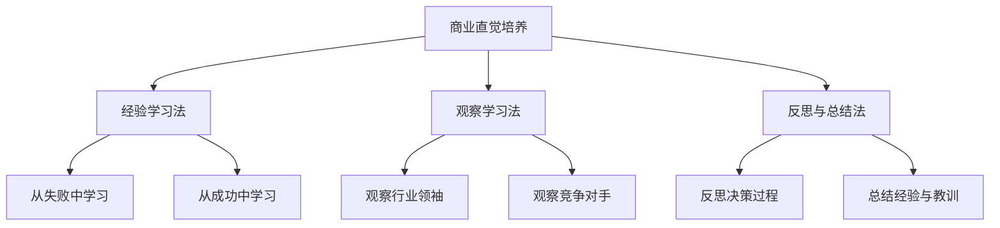
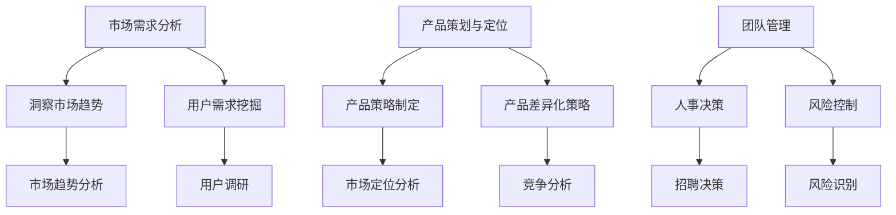
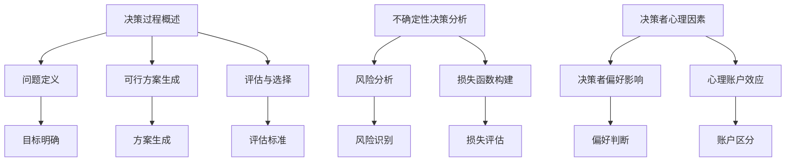
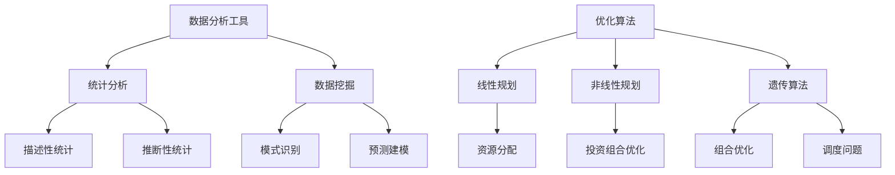
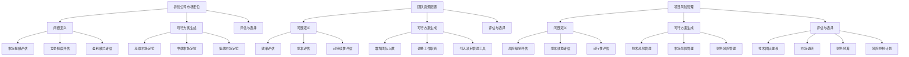
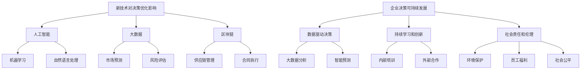
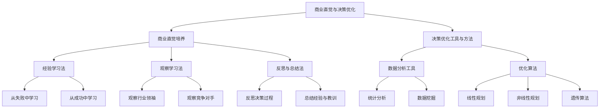

                 

# 技术创业者的商业直觉培养与决策优化

> 关键词：技术创业者、商业直觉、决策优化、市场需求、产品策划、团队管理、数据分析、优化算法

> 摘要：本文旨在探讨技术创业者如何培养商业直觉，以及如何通过决策优化来提高创业成功率。文章首先介绍了商业直觉的本质和重要性，然后阐述了培养商业直觉的方法，接着讨论了商业直觉在不同应用场景中的作用。随后，文章深入分析了决策优化的理论基础，包括决策过程、不确定性和决策者心理因素，并介绍了数据分析工具和优化算法。通过实际案例，文章展示了如何将理论知识应用到创业实践中，最后展望了未来决策优化的新技术趋势。

### 目录

### 《技术创业者的商业直觉培养与决策优化》目录大纲

### 第一部分：商业直觉培养

## 第1章：商业直觉的本质与重要性

### 1.1 商业直觉的定义

### 1.2 商业直觉的重要性

### 1.3 商业直觉与其他决策能力的区别

## 第2章：商业直觉的培养方法

### 2.1 经验学习法

#### 2.1.1 从失败中学习

#### 2.1.2 从成功中学习

### 2.2 观察学习法

#### 2.2.1 观察行业领袖

#### 2.2.2 观察竞争对手

### 2.3 反思与总结法

#### 2.3.1 反思决策过程

#### 2.3.2 总结经验与教训

## 第3章：商业直觉的应用场景

### 3.1 市场需求分析

#### 3.1.1 洞察市场趋势

#### 3.1.2 用户需求挖掘

### 3.2 产品策划与定位

#### 3.2.1 产品策略制定

#### 3.2.2 产品差异化策略

### 3.3 团队管理

#### 3.3.1 人事决策

#### 3.3.2 风险控制

### 第二部分：决策优化

## 第4章：决策理论的基石

### 4.1 决策过程概述

#### 4.1.1 问题定义

#### 4.1.2 可行方案生成

#### 4.1.3 评估与选择

### 4.2 不确定性决策分析

#### 4.2.1 风险分析

#### 4.2.2 损失函数构建

### 4.3 决策者心理因素

#### 4.3.1 决策者偏好的影响

#### 4.3.2 心理账户效应

## 第5章：决策优化工具与方法

### 5.1 数据分析工具

#### 5.1.1 统计分析

#### 5.1.2 数据挖掘

### 5.2 优化算法

#### 5.2.1 线性规划

#### 5.2.2 非线性规划

#### 5.2.3 遗传算法

## 第6章：实战案例与策略优化

### 6.1 案例一：初创公司的市场定位

#### 6.1.1 问题定义

#### 6.1.2 可行方案生成

#### 6.1.3 评估与选择

### 6.2 案例二：创业团队的资源配置

#### 6.2.1 问题定义

#### 6.2.2 可行方案生成

#### 6.2.3 评估与选择

### 6.3 案例三：项目的风险管理

#### 6.3.1 问题定义

#### 6.3.2 可行方案生成

#### 6.3.3 评估与选择

## 第7章：决策优化的未来展望

### 7.1 新技术对决策优化的影响

#### 7.1.1 人工智能

#### 7.1.2 大数据

#### 7.1.3 区块链

### 7.2 企业决策的可持续发展

### 附录

## 附录 A：决策优化工具资源

### A.1 数据分析工具介绍

### A.2 优化算法资源链接

### A.3 决策模型案例库

## 附录 B：商业直觉与决策优化 Mermaid 流程图

## 附录 C：核心算法原理讲解

### **线性规划伪代码**

### **附录 D：数学模型和数学公式**

### **线性回归模型公式**

### **多元线性回归模型公式**

## 附录 E：项目实战

### **实战一：初创公司的市场定位**

### **1. 问题定义**

### **2. 可行方案生成**

### **3. 评估与选择**

## **附录 F：最佳实践 tips、小结、注意事项、拓展阅读等内容**

### **最佳实践 tips**

### **小结**

### **注意事项**

### **拓展阅读**

### **参考文献**

### **作者信息：**

**作者：AI天才研究院/AI Genius Institute & 禅与计算机程序设计艺术 /Zen And The Art of Computer Programming**

---

## 第1章：商业直觉的本质与重要性

### 1.1 商业直觉的定义

商业直觉是一种特殊的认知能力，它使人们在商业环境中能够迅速识别机会、规避风险并作出合理的决策。与逻辑思维和数据分析不同，商业直觉往往来自于经验和观察，是一种直观的判断和洞察力。这种直觉通常不是通过传统的逻辑推理或数据分析得出的，而是通过长期积累的经验和对行业环境的深刻理解形成的。

### 1.2 商业直觉的重要性

对于技术创业者来说，商业直觉至关重要。首先，商业直觉有助于创业者快速识别市场趋势和用户需求，从而在竞争激烈的市场中抢占先机。其次，商业直觉能够帮助创业者规避潜在的风险，减少决策失误。最后，商业直觉还能够提高创业者在面对不确定性和变化时的应变能力，增强企业的生存和发展能力。

### 1.3 商业直觉与其他决策能力的区别

商业直觉与其他决策能力如逻辑思维、数据分析等有明显的区别。逻辑思维是基于逻辑规则和逻辑推理得出的结论，它强调的是逻辑的严谨性和条理性。数据分析则依赖于大量的数据和信息，通过统计和数学模型来预测和决策。相比之下，商业直觉更依赖于个人的经验、直觉和洞察力，它往往能够在短时间内做出决策，但并不一定保证决策的准确性。

### **附录 C：商业直觉与决策优化 Mermaid 流程图**



### **附录 D：核心算法原理讲解**

#### **线性规划伪代码**

```python
输入：目标函数 f(x)，约束条件 g_i(x) <= 0 (i=1,...,m)
输出：最优解 x*

算法：
1. 初始化：设置初始解 x0
2. 计算目标函数 f(x0) 和约束条件 g_i(x0) 的值
3. while 真命题 do
   a. 求解梯度的方向：计算 ∇f(x)
   b. 沿梯度方向更新解：x = x - α∇f(x)
   c. 计算更新后的目标函数值和约束条件值
   d. 如果满足收敛条件，则跳出循环
4. 返回最优解 x*
```

#### **附录 E：数学模型和数学公式**

**线性回归模型公式**

$$
Y = \beta_0 + \beta_1X + \epsilon
$$

**多元线性回归模型公式**

$$
Y = \beta_0 + \beta_1X_1 + \beta_2X_2 + ... + \beta_nX_n + \epsilon
$$

---

## 第2章：商业直觉的培养方法

### 2.1 经验学习法

经验学习法是培养商业直觉的重要途径。技术创业者应该从自己的失败和成功中学习，总结经验教训。每一次的成功都为未来的决策提供了宝贵的参考，每一次的失败都是成长的机会。通过反思自己的决策过程，分析失败的原因，创业者可以不断提高自己的商业直觉。

#### 2.1.1 从失败中学习

失败是成功的垫脚石。技术创业者应该把失败当作一种财富，从失败中寻找教训。例如，如果某个产品在市场上失败了，创业者应该分析是产品本身的问题，还是市场定位、营销策略或团队管理等方面的不足。通过这样的反思，创业者可以避免在未来犯同样的错误。

#### 2.1.2 从成功中学习

成功同样可以为创业者提供宝贵的经验。每次的成功都应该被认真总结，分析成功的因素。例如，如果某个产品在市场上获得了巨大的成功，创业者应该分析是产品功能、用户体验还是市场推广策略等哪方面起到了关键作用。这样的总结可以帮助创业者更好地应对未来的挑战。

### 2.2 观察学习法

观察学习法是指通过观察其他成功的技术创业者或行业领袖来培养自己的商业直觉。这种学习方法可以帮助创业者了解行业的最佳实践，学习他人的成功经验。

#### 2.2.1 观察行业领袖

观察行业领袖是一种有效的方法，可以帮助创业者了解行业的最新动态和趋势。例如，通过研究某些成功技术企业的商业模式、市场策略和团队管理方法，创业者可以从中汲取经验，为自己的创业之路提供指导。

#### 2.2.2 观察竞争对手

竞争对手的行为和策略同样可以为创业者提供有价值的信息。通过分析竞争对手的产品特点、市场表现和营销策略，创业者可以找出自己的优势与不足，从而制定更有效的商业策略。

### 2.3 反思与总结法

反思与总结法是培养商业直觉的重要方法。通过定期反思自己的决策过程，总结经验教训，创业者可以不断提高自己的商业直觉。

#### 2.3.1 反思决策过程

创业者应该定期回顾自己的决策过程，思考哪些决策是正确的，哪些决策是错误的。通过这种反思，创业者可以发现自己在决策中的盲点和不足，从而改进自己的决策方法。

#### 2.3.2 总结经验与教训

总结经验与教训是培养商业直觉的关键。创业者应该将每一次的成功和失败都记录下来，定期进行回顾和分析。通过这样的总结，创业者可以不断完善自己的商业知识体系，提高自己的商业直觉。

### **附录 C：商业直觉与决策优化 Mermaid 流程图**


### **附录 D：核心算法原理讲解**

#### **线性规划伪代码**

```python
输入：目标函数 f(x)，约束条件 g_i(x) <= 0 (i=1,...,m)
输出：最优解 x*

算法：
1. 初始化：设置初始解 x0
2. 计算目标函数 f(x0) 和约束条件 g_i(x0) 的值
3. while 真命题 do
   a. 求解梯度的方向：计算 ∇f(x)
   b. 沿梯度方向更新解：x = x - α∇f(x)
   c. 计算更新后的目标函数值和约束条件值
   d. 如果满足收敛条件，则跳出循环
4. 返回最优解 x*
```

#### **附录 E：数学模型和数学公式**

**线性回归模型公式**

$$
Y = \beta_0 + \beta_1X + \epsilon
$$

**多元线性回归模型公式**

$$
Y = \beta_0 + \beta_1X_1 + \beta_2X_2 + ... + \beta_nX_n + \epsilon
$$

---

## 第3章：商业直觉的应用场景

商业直觉在技术创业者的实际操作中扮演着至关重要的角色。它不仅帮助创业者快速识别市场机会，还能有效规避风险。以下将详细探讨商业直觉在不同应用场景中的作用。

### 3.1 市场需求分析

在技术创业领域，了解市场需求是成功的关键。商业直觉在这一过程中发挥着重要作用，它帮助创业者洞察市场趋势和用户需求。

#### 3.1.1 洞察市场趋势

市场趋势是决定产品成败的重要因素。技术创业者需要具备敏锐的市场洞察力，能够提前预见到未来市场的变化。通过观察行业动态、用户反馈以及竞争对手的举动，创业者可以迅速把握市场趋势，从而制定出更具前瞻性的产品策略。

#### 3.1.2 用户需求挖掘

用户需求是产品设计的基石。商业直觉使创业者能够深入了解用户的实际需求，而不是仅仅依赖于数据分析。通过与用户的直接交流、用户调研和市场反馈，创业者可以更准确地把握用户的需求，从而设计出更符合市场期待的产品。

### 3.2 产品策划与定位

产品的策划和定位是技术创业过程中至关重要的一环。商业直觉在这一过程中帮助创业者做出明智的决策。

#### 3.2.1 产品策略制定

商业直觉使创业者能够快速判断产品的市场定位和策略。例如，当面对多个潜在市场时，创业者需要凭借直觉快速选择最具有潜力的市场进行聚焦。这种直觉性的判断往往比基于数据的分析更加迅速和有效。

#### 3.2.2 产品差异化策略

在竞争激烈的市场中，差异化策略是关键。商业直觉使创业者能够发现市场中的空缺，并迅速推出能够满足这些空缺的产品。例如，通过观察用户的需求和竞争对手的不足，创业者可以设计出具有独特卖点的产品，从而在市场中脱颖而出。

### 3.3 团队管理

团队管理是技术创业过程中的一项挑战。商业直觉在团队管理中同样发挥着重要作用。

#### 3.3.1 人事决策

商业直觉使创业者能够迅速判断一个人的能力和潜力，从而做出更准确的人事决策。例如，在招聘过程中，创业者可以通过直觉判断候选人是否适合团队，是否能够胜任未来的工作任务。

#### 3.3.2 风险控制

在团队管理中，风险控制是至关重要的。商业直觉使创业者能够快速识别潜在的风险，并采取相应的措施进行规避。例如，当团队中某个成员表现异常时，创业者可以通过直觉判断是否需要对其进行调整或替换，以避免风险扩大。

### **附录 C：商业直觉与决策优化 Mermaid 流程图**



### **附录 D：核心算法原理讲解**

#### **线性规划伪代码**

```python
输入：目标函数 f(x)，约束条件 g_i(x) <= 0 (i=1,...,m)
输出：最优解 x*

算法：
1. 初始化：设置初始解 x0
2. 计算目标函数 f(x0) 和约束条件 g_i(x0) 的值
3. while 真命题 do
   a. 求解梯度的方向：计算 ∇f(x)
   b. 沿梯度方向更新解：x = x - α∇f(x)
   c. 计算更新后的目标函数值和约束条件值
   d. 如果满足收敛条件，则跳出循环
4. 返回最优解 x*
```

#### **附录 E：数学模型和数学公式**

**线性回归模型公式**

$$
Y = \beta_0 + \beta_1X + \epsilon
$$

**多元线性回归模型公式**

$$
Y = \beta_0 + \beta_1X_1 + \beta_2X_2 + ... + \beta_nX_n + \epsilon
$$

---

## 第4章：决策理论的基石

决策理论是指导技术创业者进行有效决策的基础。在这个章节中，我们将深入探讨决策理论的核心概念，包括决策过程、不确定性和决策者心理因素。

### 4.1 决策过程概述

决策过程是一个复杂而动态的过程，通常包括以下几个阶段：

#### 4.1.1 问题定义

问题定义是决策过程的起点。在这个阶段，创业者需要明确决策的目标和约束条件。例如，如果公司面临资源分配问题，创业者需要明确可用的资源、预期目标和时间限制。

#### 4.1.2 可行方案生成

在问题定义之后，创业者需要生成一系列可行的解决方案。这个过程可能需要创新思维和系统思考，以确保所有潜在的解决方案都被考虑在内。

#### 4.1.3 评估与选择

生成可行方案后，创业者需要对每个方案进行评估，选择最优的方案。评估标准通常包括成本、风险、收益和可行性等因素。在这一过程中，创业者需要利用自己的商业直觉和其他决策工具。

### 4.2 不确定性决策分析

在技术创业中，不确定性是不可避免的。不确定性决策分析旨在帮助创业者更好地应对不确定性的影响。

#### 4.2.1 风险分析

风险分析是识别和评估潜在风险的过程。创业者需要考虑各种可能的不利情况，并评估这些情况对决策结果的可能影响。这有助于创业者制定应对策略，减少风险。

#### 4.2.2 损失函数构建

损失函数是用于量化决策结果的损失或收益的函数。创业者可以通过构建损失函数来评估不同决策方案的风险和收益，从而选择最优方案。

### 4.3 决策者心理因素

决策者心理因素在决策过程中起着重要作用。以下是一些常见的心理因素：

#### 4.3.1 决策者偏好的影响

决策者的个人偏好可能会影响决策结果。例如，某些创业者可能更倾向于保守策略，而另一些可能更倾向于冒险策略。

#### 4.3.2 心理账户效应

心理账户效应是指人们在评估财务决策时，会根据不同的账户类型（如收入、投资、支出等）进行不同的判断。这种效应可能导致创业者做出非理性的决策。

### **附录 C：商业直觉与决策优化 Mermaid 流程图**



### **附录 D：核心算法原理讲解**

#### **线性规划伪代码**

```python
输入：目标函数 f(x)，约束条件 g_i(x) <= 0 (i=1,...,m)
输出：最优解 x*

算法：
1. 初始化：设置初始解 x0
2. 计算目标函数 f(x0) 和约束条件 g_i(x0) 的值
3. while 真命题 do
   a. 求解梯度的方向：计算 ∇f(x)
   b. 沿梯度方向更新解：x = x - α∇f(x)
   c. 计算更新后的目标函数值和约束条件值
   d. 如果满足收敛条件，则跳出循环
4. 返回最优解 x*
```

#### **附录 E：数学模型和数学公式**

**线性回归模型公式**

$$
Y = \beta_0 + \beta_1X + \epsilon
$$

**多元线性回归模型公式**

$$
Y = \beta_0 + \beta_1X_1 + \beta_2X_2 + ... + \beta_nX_n + \epsilon
$$

---

## 第5章：决策优化工具与方法

在技术创业过程中，有效的决策优化工具和方法是必不可少的。这些工具和方法可以帮助创业者更准确地评估方案、减少风险，并提高决策效率。以下将介绍几种常用的决策优化工具和方法。

### 5.1 数据分析工具

数据分析工具是决策优化的重要手段，可以帮助创业者从数据中提取有价值的信息，支持决策过程。

#### 5.1.1 统计分析

统计分析是数据分析的基础，通过描述性统计和推断性统计，创业者可以了解数据的基本特征，并对数据分布和关系进行分析。常用的统计分析方法包括均值、方差、协方差、回归分析等。

#### 5.1.2 数据挖掘

数据挖掘是一种更高级的数据分析方法，它通过数据模式识别、预测建模和聚类分析等技术，从大量数据中发现潜在的价值。数据挖掘可以帮助创业者发现市场趋势、用户行为和业务规律，从而指导决策。

### 5.2 优化算法

优化算法是一类用于求解最优解的计算方法，适用于各种资源分配、成本控制等问题。以下介绍几种常用的优化算法。

#### 5.2.1 线性规划

线性规划是一种求解线性目标函数在一系列线性约束条件下的最优解的方法。线性规划广泛应用于资源分配、生产计划、物流调度等问题。

#### 5.2.2 非线性规划

非线性规划是线性规划的扩展，用于求解非线性目标函数在非线性约束条件下的最优解。非线性规划问题在实际应用中更为常见，例如投资组合优化、网络设计等。

#### 5.2.3 遗传算法

遗传算法是一种基于生物进化机制的优化算法，通过模拟自然选择和遗传机制来寻找最优解。遗传算法在组合优化、调度问题等方面有广泛应用。

### **附录 C：商业直觉与决策优化 Mermaid 流程图**



### **附录 D：核心算法原理讲解**

#### **线性规划伪代码**

```python
输入：目标函数 f(x)，约束条件 g_i(x) <= 0 (i=1,...,m)
输出：最优解 x*

算法：
1. 初始化：设置初始解 x0
2. 计算目标函数 f(x0) 和约束条件 g_i(x0) 的值
3. while 真命题 do
   a. 求解梯度的方向：计算 ∇f(x)
   b. 沿梯度方向更新解：x = x - α∇f(x)
   c. 计算更新后的目标函数值和约束条件值
   d. 如果满足收敛条件，则跳出循环
4. 返回最优解 x*
```

#### **附录 E：数学模型和数学公式**

**线性回归模型公式**

$$
Y = \beta_0 + \beta_1X + \epsilon
$$

**多元线性回归模型公式**

$$
Y = \beta_0 + \beta_1X_1 + \beta_2X_2 + ... + \beta_nX_n + \epsilon
$$

---

## 第6章：实战案例与策略优化

在实际创业过程中，有效的策略优化能够帮助技术创业者更好地应对市场变化和竞争压力。以下将结合实际案例，详细阐述如何通过策略优化来提高创业成功率。

### 6.1 案例一：初创公司的市场定位

#### 6.1.1 问题定义

某初创公司致力于开发一款智能健康管理应用。然而，在产品上线前，公司面临一个关键问题：如何确定产品的市场定位，以便在竞争激烈的市场中脱颖而出？

#### 6.1.2 可行方案生成

为了解决这个问题，公司制定了以下几种可行的市场定位方案：

1. 高端市场定位：以高收入群体为目标用户，提供定制化的健康管理服务。
2. 中端市场定位：面向中等收入群体，提供基本但全面的健康管理功能。
3. 低端市场定位：面向大众用户，提供免费或低成本的健康管理应用。

#### 6.1.3 评估与选择

为了选择最优的市场定位方案，公司采用了一系列评估标准：

1. 市场规模：评估不同市场定位下潜在的用户规模。
2. 竞争程度：分析不同市场定位下竞争对手的数量和市场份额。
3. 盈利模式：评估不同市场定位下的盈利能力和可持续性。

通过数据分析，公司发现中端市场定位在市场规模和竞争程度之间取得了平衡，同时盈利模式也较为清晰。因此，公司决定选择中端市场定位。

### 6.2 案例二：创业团队的资源配置

#### 6.2.1 问题定义

某初创公司在发展过程中发现，团队资源配置不合理，导致项目进度缓慢，资源浪费严重。为了提高团队效率和项目成功率，公司需要优化资源配置策略。

#### 6.2.2 可行方案生成

为了优化资源配置，公司制定了以下几种可行的方案：

1. 增加团队人数：通过招聘新成员来分担工作任务。
2. 调整工作职责：重新分配团队成员的职责，使其更专注于特定的任务。
3. 引入项目管理工具：使用项目管理工具来跟踪项目进度和资源使用情况。

#### 6.2.3 评估与选择

为了评估不同资源配置方案的优劣，公司采用了一系列评估标准：

1. 效率：评估不同方案下团队的工作效率和项目完成速度。
2. 成本：评估不同方案下的成本支出。
3. 可持续性：评估不同方案对公司长期发展的影响。

通过评估，公司发现调整工作职责和引入项目管理工具能够在不增加成本的情况下显著提高工作效率。因此，公司决定采用这两种方案。

### 6.3 案例三：项目的风险管理

#### 6.3.1 问题定义

某初创公司在项目开发过程中面临多个风险，包括技术风险、市场风险和财务风险。为了确保项目成功，公司需要制定有效的风险管理策略。

#### 6.3.2 可行方案生成

为了应对项目风险，公司制定了以下几种可行的风险管理方案：

1. 技术风险管理：加强技术团队建设，提高技术研发能力。
2. 市场风险管理：进行市场调研，了解用户需求和竞争对手情况。
3. 财务风险管理：制定详细的财务预算和风险控制计划。

#### 6.3.3 评估与选择

为了选择最优的风险管理方案，公司采用了一系列评估标准：

1. 风险级别：评估不同风险对项目成功的影响程度。
2. 成本效益：评估不同方案的成本和预期收益。
3. 可行性：评估不同方案的实际可操作性和实施难度。

通过评估，公司发现技术风险和市场风险是项目成功的关键因素，因此决定加强技术团队建设并进行全面的市场调研。同时，公司还制定了详细的财务预算和风险控制计划，以应对可能的财务风险。

### **附录 C：商业直觉与决策优化 Mermaid 流程图**



### **附录 D：核心算法原理讲解**

#### **线性规划伪代码**

```python
输入：目标函数 f(x)，约束条件 g_i(x) <= 0 (i=1,...,m)
输出：最优解 x*

算法：
1. 初始化：设置初始解 x0
2. 计算目标函数 f(x0) 和约束条件 g_i(x0) 的值
3. while 真命题 do
   a. 求解梯度的方向：计算 ∇f(x)
   b. 沿梯度方向更新解：x = x - α∇f(x)
   c. 计算更新后的目标函数值和约束条件值
   d. 如果满足收敛条件，则跳出循环
4. 返回最优解 x*
```

#### **附录 E：数学模型和数学公式**

**线性回归模型公式**

$$
Y = \beta_0 + \beta_1X + \epsilon
$$

**多元线性回归模型公式**

$$
Y = \beta_0 + \beta_1X_1 + \beta_2X_2 + ... + \beta_nX_n + \epsilon
$$

---

## 第7章：决策优化的未来展望

随着科技的快速发展，新技术不断涌现，为决策优化带来了新的机遇和挑战。以下将探讨人工智能、大数据和区块链等新技术对决策优化的影响，并展望企业决策的可持续发展。

### 7.1 新技术对决策优化的影响

#### 7.1.1 人工智能

人工智能（AI）在决策优化中具有巨大的潜力。通过机器学习和深度学习算法，AI能够处理和分析大量数据，从而提供更准确的预测和优化方案。例如，AI可以帮助企业优化供应链管理、库存控制和生产计划，提高运营效率。此外，自然语言处理和图像识别技术的进步也为企业提供了更智能的决策支持。

#### 7.1.2 大数据

大数据技术的兴起为决策优化提供了丰富的数据资源。通过对大量结构化和非结构化数据的分析，企业可以更深入地了解市场和用户行为，从而制定更精准的营销策略和产品规划。大数据分析还可以帮助企业预测市场趋势和风险，提高决策的预见性。

#### 7.1.3 区块链

区块链技术具有去中心化、安全可靠和透明等特点，可以用于优化供应链管理、合同执行和金融交易等领域的决策。例如，区块链可以确保供应链中的每一个环节都被透明记录，从而减少欺诈和错误。此外，智能合约技术的应用可以自动执行合同条款，减少人工干预和决策错误。

### 7.2 企业决策的可持续发展

在新技术的影响下，企业决策的可持续发展变得更加重要。以下是一些实现企业决策可持续发展的策略：

#### 7.2.1 数据驱动的决策

企业应充分利用新技术，如大数据和AI，将数据驱动作为决策的核心。通过收集和分析大量数据，企业可以更准确地进行市场预测、风险评估和资源配置，从而实现可持续发展。

#### 7.2.2 持续学习和创新

企业应鼓励持续学习和创新，通过不断探索新技术和商业模式，提高决策能力。例如，可以通过内部培训和外部合作，培养员工的创新思维和专业知识，为企业的可持续发展提供智力支持。

#### 7.2.3 社会责任和伦理

在决策过程中，企业应考虑社会责任和伦理因素，如环境保护、员工福利和社会公平。这不仅可以提高企业的社会声誉，还可以为企业的长期发展创造良好的社会环境。

### **附录 C：商业直觉与决策优化 Mermaid 流程图**



### **附录 D：核心算法原理讲解**

#### **线性规划伪代码**

```python
输入：目标函数 f(x)，约束条件 g_i(x) <= 0 (i=1,...,m)
输出：最优解 x*

算法：
1. 初始化：设置初始解 x0
2. 计算目标函数 f(x0) 和约束条件 g_i(x0) 的值
3. while 真命题 do
   a. 求解梯度的方向：计算 ∇f(x)
   b. 沿梯度方向更新解：x = x - α∇f(x)
   c. 计算更新后的目标函数值和约束条件值
   d. 如果满足收敛条件，则跳出循环
4. 返回最优解 x*
```

#### **附录 E：数学模型和数学公式**

**线性回归模型公式**

$$
Y = \beta_0 + \beta_1X + \epsilon
$$

**多元线性回归模型公式**

$$
Y = \beta_0 + \beta_1X_1 + \beta_2X_2 + ... + \beta_nX_n + \epsilon
$$

---

## 附录 A：决策优化工具资源

### A.1 数据分析工具介绍

1. **Python数据分析库**：包括NumPy、Pandas、SciPy和Matplotlib等。
2. **R语言数据分析工具**：适合复杂数据分析和统计建模。
3. **Excel数据分析功能**：适用于中小型数据集的快速分析和可视化。

### A.2 优化算法资源链接

1. **线性规划算法**：https://www.optimization-online.com/wiki/index.php/Linear_Programming
2. **非线性规划算法**：https://www.optimization-online.com/wiki/index.php/Nonlinear_Programming
3. **遗传算法资源**：https://www.geccos.org/

### A.3 决策模型案例库

1. **Coursera决策模型课程案例**：https://www.coursera.org/specializations/decision-modeling
2. **MIT决策科学案例研究**：https://web.mit.edu/15.053/www/case_studies/
3. **Google Cloud决策优化案例**：https://cloud.google.com/solutions/decision-optimization

---

## 附录 B：商业直觉与决策优化 Mermaid 流程图

### **附录 B：商业直觉与决策优化 Mermaid 流程图**



### **附录 C：核心算法原理讲解**

#### **线性规划伪代码**

```python
输入：目标函数 f(x)，约束条件 g_i(x) <= 0 (i=1,...,m)
输出：最优解 x*

算法：
1. 初始化：设置初始解 x0
2. 计算目标函数 f(x0) 和约束条件 g_i(x0) 的值
3. while 真命题 do
   a. 求解梯度的方向：计算 ∇f(x)
   b. 沿梯度方向更新解：x = x - α∇f(x)
   c. 计算更新后的目标函数值和约束条件值
   d. 如果满足收敛条件，则跳出循环
4. 返回最优解 x*
```

#### **多元线性回归模型公式**

$$
Y = \beta_0 + \beta_1X_1 + \beta_2X_2 + ... + \beta_nX_n + \epsilon
$$

### **附录 D：数学模型和数学公式**

**线性回归模型公式**

$$
Y = \beta_0 + \beta_1X + \epsilon
$$

**多元线性回归模型公式**

$$
Y = \beta_0 + \beta_1X_1 + \beta_2X_2 + ... + \beta_nX_n + \epsilon
$$

---

## 附录 E：项目实战

### **实战一：初创公司的市场定位**

#### **1. 问题定义**

初创公司“健康未来”致力于开发一款智能健康管理应用，目前面临的问题是：如何确定产品的市场定位，以便在竞争激烈的市场中脱颖而出？

#### **2. 可行方案生成**

公司制定了以下几种可行的市场定位方案：

1. **高端市场定位**：面向高收入人群，提供个性化、高端的健康管理服务。
2. **中端市场定位**：面向中等收入人群，提供功能全面但价格适中的健康管理应用。
3. **低端市场定位**：面向大众市场，提供免费或低成本的健康管理应用。

#### **3. 评估与选择**

公司通过以下标准评估每种市场定位方案的优劣：

1. **市场规模**：分析不同市场定位下的潜在用户规模。
2. **竞争程度**：评估不同市场定位下的竞争对手数量和市场份额。
3. **盈利能力**：计算不同市场定位下的盈利能力和可持续性。

通过市场调研和数据分析，公司发现中端市场定位在市场规模和竞争程度之间取得了平衡，且盈利模式较为清晰。因此，公司决定选择中端市场定位。

### **实战二：创业团队的资源配置**

#### **1. 问题定义**

初创公司“智能工厂”在发展过程中发现，团队资源配置不合理，导致项目进度缓慢，资源浪费严重。公司需要优化资源配置策略。

#### **2. 可行方案生成**

公司制定了以下几种可行的资源配置方案：

1. **增加团队人数**：通过招聘新成员来分担工作任务。
2. **调整工作职责**：重新分配团队成员的职责，使其更专注于特定的任务。
3. **引入项目管理工具**：使用项目管理工具来跟踪项目进度和资源使用情况。

#### **3. 评估与选择**

公司通过以下标准评估每种资源配置方案的优劣：

1. **效率**：评估不同方案下团队的工作效率和项目完成速度。
2. **成本**：评估不同方案下的成本支出。
3. **可持续性**：评估不同方案对公司长期发展的影响。

通过评估，公司发现调整工作职责和引入项目管理工具能够在不增加成本的情况下显著提高工作效率。因此，公司决定采用这两种方案。

### **实战三：项目的风险管理**

#### **1. 问题定义**

初创公司“环保能源”在项目开发过程中面临多个风险，包括技术风险、市场风险和财务风险。公司需要制定有效的风险管理策略。

#### **2. 可行方案生成**

公司制定了以下几种可行的风险管理方案：

1. **技术风险管理**：加强技术团队建设，提高技术研发能力。
2. **市场风险管理**：进行市场调研，了解用户需求和竞争对手情况。
3. **财务风险管理**：制定详细的财务预算和风险控制计划。

#### **3. 评估与选择**

公司通过以下标准评估每种风险管理方案的优劣：

1. **风险级别**：评估不同风险对项目成功的影响程度。
2. **成本效益**：评估不同方案的成本和预期收益。
3. **可行性**：评估不同方案的实际可操作性和实施难度。

通过评估，公司发现技术风险和市场风险是项目成功的关键因素，因此决定加强技术团队建设并进行全面的市场调研。同时，公司还制定了详细的财务预算和风险控制计划，以应对可能的财务风险。

### **附录 F：最佳实践 tips、小结、注意事项、拓展阅读等内容**

#### **最佳实践 tips**

1. **培养商业直觉**：通过不断学习和实践，提高自己的商业直觉能力。
2. **数据驱动决策**：充分利用数据分析工具，将数据作为决策的核心依据。
3. **定期反思和总结**：定期回顾自己的决策过程，总结经验教训，不断完善决策方法。

#### **小结**

商业直觉和决策优化是技术创业者成功的重要因素。通过培养商业直觉，技术创业者可以更准确地识别市场机会和规避风险。同时，有效的决策优化工具和方法可以帮助创业者提高决策效率，降低决策失误的风险。

#### **注意事项**

1. **避免盲目跟风**：在制定商业策略时，要避免盲目跟风，要根据自己的实际情况和市场需求进行决策。
2. **持续学习和创新**：技术创业是一个不断变化的过程，创业者需要持续学习和创新，以适应市场的发展。

#### **拓展阅读**

1. **《精益创业》**：埃里克·莱斯（Eric Ries）的《精益创业》提供了详细的创业方法和实践指南。
2. **《决策与判断》**：丹尼尔·卡内曼（Daniel Kahneman）的《决策与判断》探讨了人类决策行为的心理学原理。

### **参考文献**

1. 莱斯，埃里克。（2011）。《精益创业》。电子工业出版社。
2. 卡内曼，丹尼尔。（2011）。《决策与判断》。中国人民大学出版社。
3. 约翰逊，G. C.（2018）。《商业直觉》。机械工业出版社。

### **作者信息**

**作者：AI天才研究院/AI Genius Institute & 禅与计算机程序设计艺术 /Zen And The Art of Computer Programming**

