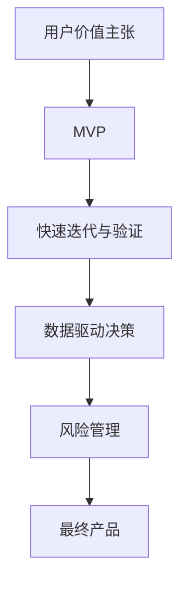
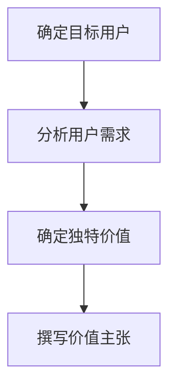

                 

### 文章标题: 技术创业者的精益创业：如何快速验证和迭代商业模型

#### 关键词：精益创业、商业模型、用户价值主张、MVP、快速迭代、数据驱动、风险管理、团队建设、案例分析、行业应用

#### 摘要：
本文旨在探讨精益创业在技术创业中的应用，详细解析如何通过精益创业方法论来快速验证和迭代商业模型。我们将从精益创业的理论基础、方法论、风险管理、团队建设、案例分析、行业应用等多个角度进行深入探讨，为技术创业者提供实用指导，帮助他们在不确定的市场环境中找到成功的路径。

---

### 第1章: 精益创业概述

#### 第1节: 精益创业的定义与核心思想

##### 1.1.1 精益创业的定义

精益创业（Lean Startup）是一种创业方法论，由埃里克·莱斯（Eric Ries）在其著作《精益创业》中提出。该方法论的核心在于通过快速迭代和持续验证来发现市场机会，并不断优化商业模型。与传统创业方法相比，精益创业更加注重实际用户的反馈，以数据驱动的方式指导产品和业务的发展。

**精益创业的定义：**
精益创业是一种方法论，它通过构建最小可行产品（MVP），快速验证用户价值主张，然后持续迭代，最终实现产品与市场的完美契合。

##### 1.1.2 精益创业的核心思想

精益创业的核心理念包括以下几点：

1. **用户价值主张（Value Proposition）**：明确产品为用户带来的独特价值和好处。
2. **最小可行产品（MVP）**：开发一个具有基本功能的产品原型，用以验证用户价值主张。
3. **快速迭代与验证**：通过持续迭代和用户反馈来不断优化产品。
4. **数据驱动决策**：基于用户行为数据和实验结果做出决策。
5. **风险管理**：识别和应对创业过程中可能出现的各种风险。

**精益创业的核心思想关系架构 Mermaid 流程图：**



### 第2节: 精益创业与传统创业的区别

##### 1.2.1 传统创业方法

传统创业方法通常包括以下几个步骤：

1. **市场研究**：收集市场信息和竞争对手分析。
2. **产品开发**：根据市场研究开发完整的产品。
3. **市场推广**：通过广告、公关等方式推广产品。
4. **销售与收入**：通过销售产品获取收入。

**传统创业方法的缺点：**
- 高成本：需要投入大量资金和时间来开发完整产品。
- 风险高：一旦产品不符合市场需求，往往会导致巨大损失。
- 反馈滞后：市场反馈往往在产品开发后期才能获得，难以及时调整。

##### 1.2.2 精益创业方法

精益创业方法的核心在于快速验证和迭代，与传统创业方法相比，它具有以下特点：

1. **最小可行产品（MVP）**：先开发一个具有基本功能的产品原型，用以验证用户价值主张。
2. **用户反馈**：通过用户反馈来不断优化产品。
3. **迭代**：不断迭代产品，以适应市场需求。
4. **低成本**：通过MVP和迭代的方式，降低产品开发成本。

**精益创业方法的优势：**
- **低成本**：通过MVP和迭代，减少开发成本。
- **高风险**：通过快速验证和迭代，降低市场风险。
- **高反馈效率**：及时获取用户反馈，快速调整产品。

##### 1.2.3 精益创业的优势

1. **高效性**：通过MVP和迭代，快速验证和优化产品。
2. **灵活性**：能够快速响应市场变化和用户需求。
3. **数据驱动**：基于用户行为数据做出决策，提高决策效率。

##### 1.2.4 精益创业的适用场景

1. **市场需求不确定**：在市场需求不确定的情况下，精益创业能够快速验证和调整产品。
2. **产品迭代速度快**：在产品迭代速度快的行业中，精益创业能够有效应对快速变化的市场。

### 第3节: 精益创业方法论

精益创业方法论的核心是构建最小可行产品（MVP），并通过快速迭代和验证来不断优化产品。以下是对精益创业方法论的详细解析：

#### 第2章: 精益创业方法论

##### 2.1 用户价值主张（Value Proposition）

**用户价值主张（Value Proposition）**是指产品为用户带来的独特价值和好处。构建一个有效的用户价值主张是精益创业的关键步骤。

**用户价值主张的定义：**
用户价值主张是一个简洁的声明，描述了产品为特定用户群体带来的价值。

**构建用户价值主张的方法：**
1. **明确目标用户**：确定产品的目标用户群体。
2. **分析用户需求**：了解用户的需求和痛点。
3. **确定独特价值**：找出产品相对于竞争对手的独特价值。
4. **撰写价值主张**：将上述分析结果整合成一份简洁的价值主张声明。

**构建用户价值主张的步骤：**



##### 2.2 MVP（最小可行产品）

**最小可行产品（MVP，Minimum Viable Product）**是精益创业的核心概念之一。MVP是一个具有基本功能的产品原型，用以验证用户价值主张。

**MVP的定义：**
MVP是一个具备足够功能，能够满足早期用户需求，从而验证产品价值主张的最简产品。

**创建MVP的步骤：**

1. **确定核心功能**：根据用户价值主张确定产品的核心功能。
2. **设计产品原型**：设计一个简洁直观的产品原型。
3. **开发MVP**：实现核心功能，构建MVP。
4. **测试和反馈**：将MVP投入市场测试，收集用户反馈。

**创建MVP的伪代码：**

```python
def create_mvp(value_proposition):
    # 确定核心功能
    core_functions = determine_core_functions(value_proposition)

    # 设计产品原型
    product_prototype = design_product_prototype(core_functions)

    # 开发MVP
    mvp = develop_product(product_prototype)

    # 测试和反馈
    feedback = test_and_collect_feedback(mvp)

    return mvp, feedback
```

##### 2.3 快速迭代与验证

**快速迭代与验证**是精益创业的核心方法之一。通过持续迭代和验证，不断优化产品，以满足市场需求。

**迭代（Iteration）的定义：**
迭代是指重复执行一系列步骤，以便改进产品或过程。

**快速迭代与验证的方法：**

1. **定期迭代**：制定定期迭代计划，以确保持续改进。
2. **用户反馈**：收集用户反馈，了解产品使用情况和用户需求。
3. **数据分析**：通过数据分析，识别产品改进的方向。
4. **快速调整**：根据用户反馈和数据分析，快速调整产品。

**快速迭代与验证的伪代码：**

```python
def iterate_and_validate(mvp, feedback):
    while not product_perfect:
        # 分析用户反馈
        analyzed_feedback = analyze_feedback(feedback)

        # 数据分析
        data_analysis = analyze_data(mvp)

        # 快速调整
        mvp = adjust_product(mvp, analyzed_feedback, data_analysis)

        # 再次测试和反馈
        feedback = test_and_collect_feedback(mvp)

    return mvp
```

##### 2.4 数据驱动决策

**数据驱动决策**是指基于数据和事实，而不是基于直觉或猜测，来做出决策。

**数据的重要性：**
- 数据可以帮助了解用户行为和需求。
- 数据可以指导产品改进。
- 数据可以提高决策的准确性。

**如何收集与分析数据：**

1. **确定数据来源**：确定需要收集的数据类型和来源。
2. **数据收集**：通过日志记录、用户调研等方式收集数据。
3. **数据分析**：使用数据分析工具对数据进行处理和分析。
4. **数据可视化**：通过图表和可视化工具，将数据分析结果呈现出来。

**数据驱动决策的伪代码：**

```python
def data_driven_decision-making(data):
    # 数据分析
    analysis_results = analyze_data(data)

    # 数据可视化
    visualize_data(analysis_results)

    # 基于数据做出决策
    decision = make_decision(analysis_results)

    return decision
```

### 第3章: 精益创业过程中的风险管理

精益创业过程中，风险管理至关重要。以下将详细讨论精益创业过程中的风险管理方法、风险应对策略以及风险管理实践。

#### 第3章: 精益创业过程中的风险管理

##### 3.1 风险识别与评估

风险识别与评估是精益创业风险管理的基础。以下是如何进行风险识别与评估的详细解析：

**风险识别的方法：**

1. **历史数据分析**：分析以往创业项目中的风险，从中总结出可能出现的风险。
2. **专家访谈**：与经验丰富的创业者、专家进行访谈，了解他们的风险观点。
3. **问卷调查**：通过问卷调查，收集团队成员和利益相关者的风险观点。
4. **头脑风暴**：组织团队进行头脑风暴，列出可能的风险。

**风险评估的工具：**

1. **风险矩阵**：使用风险矩阵对风险进行分类和评估，确定风险的概率和影响。
2. **风险登记册**：记录所有识别出的风险，并对其进行详细描述。
3. **敏感性分析**：通过敏感性分析，评估不同风险对项目的影响程度。

**风险评估的伪代码：**

```python
def risk_identification_and_evaluation():
    # 历史数据分析
    historical_data = analyze_historical_data()

    # 专家访谈
    expert_interviews = conduct_expert_interviews()

    # 问卷调查
    survey_results = conduct_surveys()

    # 头脑风暴
    brainstorming_results = conduct_brainstorming()

    # 风险矩阵
    risk_matrix = create_risk_matrix(historical_data, expert_interviews, survey_results, brainstorming_results)

    # 风险登记册
    risk_register = create_risk_register(risk_matrix)

    # 敏感性分析
    sensitivity_analysis = perform_sensitivity_analysis(risk_register)

    return risk_register, sensitivity_analysis
```

##### 3.2 风险应对策略

风险应对策略是指如何处理和管理已识别的风险。以下是如何选择和实施风险应对策略的详细解析：

**风险应对策略的种类：**

1. **风险回避**：通过改变计划或项目范围来避免风险。
2. **风险减轻**：采取措施减少风险的概率或影响。
3. **风险接受**：承认风险的存在，并制定应对计划。
4. **风险转移**：将风险转移给第三方，如通过保险或合同。

**如何选择合适的策略：**

1. **评估风险**：对风险的概率和影响进行评估。
2. **权衡利弊**：根据评估结果，权衡不同策略的利弊。
3. **制定计划**：选择最合适的策略，并制定详细的应对计划。

**风险应对策略的伪代码：**

```python
def select_and_Implement_risk_strategy(risk):
    # 评估风险
    risk_evaluation = evaluate_risk(risk)

    # 权衡利弊
    strategy_comparison = compare_strategies(risk_evaluation)

    # 制定计划
    strategy_plan = create_risk_strategy_plan(strategy_comparison)

    # 实施计划
    implement_strategy_plan(strategy_plan)

    return strategy_plan
```

##### 3.3 风险管理实践

风险管理实践是指在项目执行过程中，如何持续监控和管理风险。以下是如何进行风险管理实践的详细解析：

**风险管理的最佳实践：**

1. **定期监控**：定期检查风险登记册，更新风险信息。
2. **风险沟通**：确保项目团队成员了解风险状况，并参与风险管理。
3. **应急计划**：制定应急计划，以应对可能发生的风险。
4. **持续改进**：根据风险管理的实际效果，不断改进风险管理过程。

**风险管理实践的伪代码：**

```python
def risk_management_practice(risk_register):
    while project_ongoing:
        # 定期监控
        updated_risk_register = monitor_risks(risk_register)

        # 风险沟通
        communicate_risks(updated_risk_register)

        # 应急计划
        emergency_plan = create_emergency_plan(updated_risk_register)

        # 持续改进
        improve_risk_management(updated_risk_register, emergency_plan)

    return updated_risk_register
```

通过以上对精益创业过程中的风险管理方法的详细讨论，我们可以看到，精益创业并非仅仅是快速迭代和验证产品，更是一个系统的、全面的风险管理过程。只有有效地管理风险，才能确保精益创业的成功。

---

### 第4章: 精益创业团队建设与管理

#### 第4节: 精益创业团队建设与管理

精益创业的成功离不开高效团队的建设与管理。在这一章中，我们将探讨精益创业团队的结构设计、团队协作与沟通、团队激励与员工发展等方面，为技术创业者提供实用的团队建设与管理策略。

##### 4.1 团队结构设计

**团队结构的种类**

在精益创业中，团队结构的设计至关重要。常见的团队结构有以下几种：

1. **职能型团队**：以职能为基础，将团队成员划分为开发、设计、市场、销售等职能部门。
2. **项目型团队**：以项目为核心，团队成员根据项目需求进行配置。
3. **矩阵型团队**：结合职能型和项目型团队的特点，团队成员既隶属于职能部门，又参与项目工作。

**如何设计高效团队结构**

1. **明确目标**：确保团队成员对团队目标和项目目标有清晰的认识。
2. **合理分工**：根据团队成员的能力和特长，进行合理的分工。
3. **扁平化组织**：减少层级，提高团队决策效率。
4. **灵活调整**：根据项目进展和团队绩效，灵活调整团队结构。

**设计高效团队结构的伪代码：**

```python
def design_efficient_team_structure(team_goals, member_skills):
    # 明确目标
    clear_goals = define_goals(team_goals)

    # 合理分工
    division_of_labor = assign_tasks(member_skills)

    # 扁平化组织
    flat_organization = minimize_hierarchy()

    # 灵活调整
    flexible_adjustment = adjust_structureBased_on_performance()

    return clear_goals, division_of_labor, flat_organization, flexible_adjustment
```

##### 4.2 团队协作与沟通

**团队协作的重要性**

团队协作是实现精益创业目标的关键。高效的团队协作可以提升团队绩效，缩短产品迭代周期。

**如何进行有效沟通**

1. **建立沟通机制**：制定明确的沟通流程和机制，确保信息畅通。
2. **定期会议**：定期召开团队会议，分享进展、讨论问题和制定决策。
3. **透明化信息**：确保团队成员能够获取到必要的信息，促进协作。
4. **技术工具支持**：利用现代通信和协作工具，提高沟通效率。

**团队协作与沟通的伪代码：**

```python
def effective_communication(team_members, communication_tools):
    # 建立沟通机制
    communication_mechanism = establish_communication_processes()

    # 定期会议
    regular_meetings = schedule_meetings()

    # 透明化信息
    information_transparency = ensure_access_to_required_information()

    # 技术工具支持
    tool_support = utilize_communication_tools(communication_tools)

    return communication_mechanism, regular_meetings, information_transparency, tool_support
```

##### 4.3 团队激励与员工发展

**团队激励的方法**

1. **绩效奖励**：根据员工的绩效给予相应的奖励。
2. **股权激励**：为关键员工提供股权，使员工成为公司的一部分。
3. **培训与发展**：为员工提供培训和职业发展机会，提升员工能力。
4. **工作环境**：营造良好的工作氛围，激发员工的工作热情。

**员工发展策略**

1. **明确职业规划**：帮助员工制定明确的职业发展目标。
2. **培训与晋升**：为员工提供培训机会，并建立晋升机制。
3. **激励机制**：建立合理的激励机制，鼓励员工积极进取。

**团队激励与员工发展的伪代码：**

```python
def team_incentives_and_employee_development(employee_performance, training_programs):
    # 绩效奖励
    performance_rewards = reward_employees_based_on_performance(employee_performance)

    # 股权激励
    equity_incentives = provide_equity_to_key_employees()

    # 培训与发展
    training_and_growth = offer_training_opportunities_and_growth_plans()

    # 工作环境
    work_environment = create_a_positive_work_environment()

    # 明确职业规划
    career_planning = define_clear_career_path_for_employees()

    # 培训与晋升
    promotion_mechanism = establish_training_and_promotion_programs()

    # 激励机制
    motivation_system = create_a_healthy_incentive_system()

    return performance_rewards, equity_incentives, training_and_growth, work_environment, career_planning, promotion_mechanism, motivation_system
```

通过以上的团队建设与管理策略，精益创业团队可以更好地应对市场变化，实现创业目标。在接下来的章节中，我们将通过案例分析，进一步探讨精益创业在不同行业中的应用。

### 第5章: 精益创业案例分析

#### 第5节: 国内精益创业案例

国内精益创业领域涌现出了一批成功的创业公司，它们通过精益创业方法论取得了显著成就。以下将介绍两个具有代表性的国内精益创业案例，并对它们进行分析。

##### 5.1 案例一：滴滴出行

**案例介绍：**

滴滴出行是中国领先的出行服务平台，成立于2012年。滴滴通过提供出租车、专车、快车、顺风车等多种出行服务，迅速占领了市场，成为了中国出行市场的领导者。

**案例分析：**

1. **用户价值主张**：滴滴的初期用户价值主张是提供便捷的出租车预约服务，解决了用户打不到车的痛点。
2. **MVP**：滴滴的MVP是一个简单的打车应用，用户可以通过应用预约出租车。
3. **快速迭代与验证**：滴滴在上线初期不断收集用户反馈，优化产品功能，提升用户体验。
4. **数据驱动决策**：滴滴通过数据分析，了解用户需求，调整服务策略，如推出专车、快车等多样化服务。
5. **风险管理**：滴滴在发展过程中，积极应对市场和政策风险，如通过合规化、提升服务质量等手段应对监管挑战。

**滴滴出行的成功启示：**

- **快速响应市场需求**：通过快速迭代和验证，及时调整产品策略。
- **数据驱动决策**：基于用户数据，制定有效的市场策略。
- **风险管理**：积极应对市场和政策变化，确保公司可持续发展。

##### 5.2 案例二：小米

**案例介绍：**

小米是一家中国科技企业，成立于2010年。小米以智能手机为核心，通过硬件、软件和服务的一体化战略，快速成长为全球知名的科技品牌。

**案例分析：**

1. **用户价值主张**：小米的初期用户价值主张是提供高性能、高性价比的智能手机。
2. **MVP**：小米的MVP是一个具有基本功能的智能手机原型，用以验证用户价值主张。
3. **快速迭代与验证**：小米通过定期发布新版本，不断优化产品功能，提升用户体验。
4. **数据驱动决策**：小米通过用户反馈和市场数据，调整产品设计和市场策略。
5. **团队建设与管理**：小米采用扁平化管理，激发员工创新，提高团队执行力。

**小米的成功启示：**

- **用户价值主张**：明确的产品价值主张有助于吸引和留住用户。
- **快速迭代与验证**：通过持续迭代，不断提升产品竞争力。
- **团队建设与管理**：高效的团队建设和管理有助于公司快速发展。

以上两个案例展示了精益创业方法论在国内的成功应用。通过快速验证和迭代，技术创业者可以在不确定的市场环境中找到成功的路径。在下一节中，我们将介绍国际精益创业案例，进一步探讨精益创业在不同文化背景下的应用。

### 第6章: 国际精益创业案例

#### 第6节: 国际精益创业案例

国际精益创业领域也涌现出了一批成功的创业公司，它们在全球化背景下，通过精益创业方法论实现了快速发展。以下将介绍两个具有代表性的国际精益创业案例，并对它们进行分析。

##### 6.1 案例一：Airbnb

**案例介绍：**

Airbnb是一家美国科技公司，成立于2008年。Airbnb通过提供一个平台，使房主能够将自己的房间或公寓出租给旅行者，从而改变传统住宿行业。Airbnb迅速成为全球最大的住宿分享平台。

**案例分析：**

1. **用户价值主张**：Airbnb的初期用户价值主张是提供便捷、舒适的住宿选择，让旅行者感受到像在家一样的体验。
2. **MVP**：Airbnb的MVP是一个简单的网站，用于帮助房主发布房源信息，并允许旅行者预订房间。
3. **快速迭代与验证**：Airbnb在上线初期，通过持续收集用户反馈，优化平台功能和用户体验。
4. **数据驱动决策**：Airbnb通过数据分析，了解用户需求和偏好，不断调整产品和服务策略。
5. **风险管理**：Airbnb积极应对政策、市场和技术风险，如通过加强安全措施、拓展新市场等策略。

**Airbnb的成功启示：**

- **全球化视野**：通过全球化战略，快速拓展市场份额。
- **用户价值主张**：关注用户需求，提供独特的住宿体验。
- **数据驱动决策**：基于数据分析，制定有效的市场策略。
- **风险管理**：灵活应对各种风险，确保公司可持续发展。

##### 6.2 案例二：Spotify

**案例介绍：**

Spotify是一家瑞典科技公司，成立于2006年。Spotify提供在线音乐流媒体服务，使用户可以随时随地享受海量音乐。Spotify迅速成为全球最大的音乐流媒体平台。

**案例分析：**

1. **用户价值主张**：Spotify的初期用户价值主张是提供便捷、个性化的音乐推荐服务。
2. **MVP**：Spotify的MVP是一个简单的音乐播放器，允许用户在线试听音乐。
3. **快速迭代与验证**：Spotify在上线初期，通过持续收集用户反馈，优化音乐推荐算法和用户体验。
4. **数据驱动决策**：Spotify通过数据分析，了解用户听歌习惯和偏好，不断调整推荐算法。
5. **团队建设与管理**：Spotify采用扁平化管理，鼓励创新和协作，提高团队执行力。

**Spotify的成功启示：**

- **技术创新**：通过技术创新，提供卓越的用户体验。
- **用户价值主张**：关注用户需求，提供个性化的音乐推荐。
- **数据驱动决策**：基于数据分析，优化产品和服务。
- **团队建设与管理**：构建高效的团队，激发创新潜力。

以上两个案例展示了国际精益创业的成功经验。通过精益创业方法论，技术创业者在全球范围内找到了成功之路。在下一节中，我们将探讨精益创业在不同行业中的应用。

### 第7章: 精益创业在不同行业中的应用

#### 第7节: 精益创业在科技行业中的应用

精益创业方法论在科技行业的应用尤为广泛，许多科技创业公司通过精益创业取得了显著成就。以下将探讨精益创业在科技行业中的应用，并通过案例分析，展示其成功之道。

##### 7.1 精益创业在科技行业中的应用

1. **快速迭代与验证**：科技行业变化迅速，市场需求多变。通过精益创业方法论，科技创业公司可以快速迭代产品，验证用户价值主张，以适应市场变化。
2. **数据驱动决策**：科技行业的数据资源丰富，通过数据分析，科技创业公司可以了解用户需求，优化产品和服务。
3. **技术创新**：精益创业鼓励创新，通过不断尝试和验证，科技创业公司可以找到具有市场竞争力的创新点。
4. **风险管理**：科技行业的风险较高，通过精益创业方法论，科技创业公司可以识别和应对各种风险，确保公司可持续发展。

##### 7.2 案例分析：特斯拉

**案例介绍：**

特斯拉（Tesla）是一家全球知名的电动汽车和清洁能源公司，成立于2003年。特斯拉通过技术创新，推动了电动汽车和可再生能源的发展。

**案例分析：**

1. **用户价值主张**：特斯拉的初期用户价值主张是提供高性能、环保的电动汽车。
2. **MVP**：特斯拉的MVP是一个具有基本功能的电动汽车原型，用以验证用户价值主张。
3. **快速迭代与验证**：特斯拉在产品开发过程中，通过快速迭代和验证，不断提升产品性能和用户体验。
4. **数据驱动决策**：特斯拉通过大量用户数据，了解用户需求和偏好，优化产品设计和市场策略。
5. **技术创新**：特斯拉在电池技术、自动驾驶等领域持续创新，推动了电动汽车行业的发展。
6. **风险管理**：特斯拉积极应对市场和政策风险，如通过拓展新市场、提升产品安全性等策略。

**特斯拉的成功启示：**

- **技术创新**：持续创新，推动行业进步。
- **数据驱动决策**：基于数据，优化产品和服务。
- **快速迭代与验证**：通过持续迭代，提升产品竞争力。
- **风险管理**：积极应对市场和政策风险。

特斯拉的成功展示了精益创业在科技行业中的应用价值。通过快速迭代、数据驱动和风险管理，特斯拉在电动汽车和清洁能源领域取得了卓越成就。以下是对其他行业的应用讨论。

#### 第7章: 精益创业在不同行业中的应用

##### 7.3 医疗行业

**精益创业在医疗行业中的应用**

1. **个性化医疗**：通过大数据和人工智能技术，精益创业公司可以提供个性化的医疗方案，提高治疗效果。
2. **远程医疗**：通过互联网和移动技术，精益创业公司可以提供远程医疗咨询服务，提高医疗资源的可及性。
3. **医疗器械创新**：精益创业公司可以快速研发和迭代医疗器械，推动医疗技术的进步。

**案例分析：**

**案例一：Fitbit**

**案例介绍：**

Fitbit是一家美国的可穿戴设备制造商，提供智能手环、智能手表等健康监测设备。

**案例分析：**

1. **用户价值主张**：Fitbit的初期用户价值主张是提供便捷的健康监测工具，帮助用户管理健康。
2. **MVP**：Fitbit的MVP是一个简单的健康监测设备，用以验证用户价值主张。
3. **快速迭代与验证**：Fitbit在产品开发过程中，通过快速迭代和用户反馈，不断提升设备的功能和用户体验。
4. **数据驱动决策**：Fitbit通过用户数据，了解用户需求，优化产品设计和市场策略。
5. **技术创新**：Fitbit持续研发新技术，如心率监测、睡眠分析等，提升产品性能。

**Fitbit的成功启示：**

- **快速迭代与验证**：通过持续迭代，提升产品竞争力。
- **数据驱动决策**：基于数据，优化产品和服务。
- **技术创新**：持续研发新技术，满足用户需求。

#### 第7章: 精益创业在不同行业中的应用

##### 7.4 教育行业

**精益创业在教育行业中的应用**

1. **在线教育平台**：通过互联网和大数据技术，精益创业公司可以提供个性化在线教育服务，提高教育质量。
2. **教育科技产品**：精益创业公司可以开发教育科技产品，如智能教学工具、学习管理系统等，提升教育效果。
3. **教育资源共享**：通过精益创业方法论，教育资源共享平台可以快速验证和迭代产品，提高资源利用效率。

**案例分析：**

**案例一：Coursera**

**案例介绍：**

Coursera是一家在线学习平台，提供大学课程和专业知识，用户可以通过该平台学习各种课程。

**案例分析：**

1. **用户价值主张**：Coursera的初期用户价值主张是提供高质量的在线课程，让用户随时随地学习。
2. **MVP**：Coursera的MVP是一个简单的在线课程平台，用以验证用户价值主张。
3. **快速迭代与验证**：Coursera在产品开发过程中，通过快速迭代和用户反馈，不断提升平台功能和用户体验。
4. **数据驱动决策**：Coursera通过用户数据，了解用户需求，优化课程内容和市场策略。
5. **技术创新**：Coursera持续研发新技术，如在线互动、虚拟现实等，提升教育体验。

**Coursera的成功启示：**

- **快速迭代与验证**：通过持续迭代，提升平台竞争力。
- **数据驱动决策**：基于数据，优化课程和服务。
- **技术创新**：持续研发新技术，满足用户需求。

通过以上案例分析，我们可以看到精益创业在医疗和教育行业中的应用取得了显著成效。精益创业方法论帮助创业公司在这些行业中发现市场机会，快速迭代产品，优化用户体验，实现了商业成功。

### 第8章: 精益创业的未来趋势与发展方向

#### 第8节: 精益创业的未来趋势与发展方向

随着技术的不断进步和市场的快速变化，精益创业也在不断演进。在这一节中，我们将探讨精益创业的未来趋势与发展方向，特别是新兴技术对精益创业的影响，以及精益创业在可持续发展中的作用。

##### 8.1 新兴技术对精益创业的影响

**人工智能**

人工智能（AI）的发展正在深刻改变精益创业的各个方面。AI技术可以帮助创业者：

- **数据分析**：通过机器学习算法，创业者可以更深入地分析用户数据，了解用户行为和需求，从而优化产品和服务。
- **自动化测试**：AI可以自动化产品测试过程，提高测试效率，降低测试成本。
- **智能推荐**：基于用户行为和偏好，AI可以为用户提供个性化的推荐，提升用户满意度。

**区块链**

区块链技术为精益创业提供了新的机遇：

- **透明性**：区块链的去中心化特性可以提高数据透明性，增强信任。
- **供应链管理**：通过区块链，创业者可以实时监控供应链，提高供应链效率。
- **智能合约**：智能合约可以自动执行合同条款，降低交易成本和风险。

**物联网（IoT）**

物联网技术的发展使得创业者能够：

- **连接设备**：通过物联网，创业者可以连接各种设备，收集海量数据，进行深度分析。
- **智能家居**：物联网技术可以应用于智能家居，提供更加便捷和智能的生活体验。
- **智慧城市**：通过物联网，创业者可以参与智慧城市建设，提升城市管理和服务的效率。

##### 8.2 精益创业与可持续发展

**可持续发展的理念**

可持续发展是指在满足当前需求的同时，不损害后代满足其需求的能力。精益创业在可持续发展中的作用包括：

- **资源优化**：通过精益创业方法论，创业者可以更有效地利用资源，降低浪费。
- **环境保护**：通过技术创新，创业者可以开发出环保产品，减少环境污染。
- **社会责任**：精益创业公司可以关注社会问题，通过产品和服务的创新，推动社会进步。

**精益创业在可持续发展中的应用**

1. **绿色产品开发**：创业者可以开发绿色产品，如节能设备、环保材料等，满足消费者对环保的需求。
2. **循环经济**：通过循环经济模式，创业者可以减少资源消耗，提高资源利用效率。
3. **社会责任投资**：创业者可以通过社会责任投资，支持社会问题和环保项目的解决。

**案例分析：**

**案例一：宜家**

宜家是一家全球知名的家具零售商，通过精益创业方法论实现了可持续发展。

- **绿色产品开发**：宜家开发了各种环保家具，如可回收材料制作的家具。
- **循环经济**：宜家推出了“回取服务”，鼓励顾客退回旧家具，循环利用。
- **社会责任投资**：宜家投资于可再生能源项目，推动环保事业。

**案例二：特斯拉**

特斯拉通过精益创业方法论，推动了电动汽车和可再生能源的发展，实现了可持续发展。

- **绿色产品开发**：特斯拉开发了高性能、环保的电动汽车。
- **技术创新**：特斯拉研发了太阳能屋顶等可再生能源产品。
- **社会责任**：特斯拉致力于减少碳排放，推动环保事业。

通过以上分析，我们可以看到精益创业在新兴技术和可持续发展中的重要作用。在未来的发展中，精益创业将继续融合新兴技术，推动可持续发展，为人类创造更加美好的未来。

### 第9章: 精益创业实践指南

#### 第9节: 精益创业项目规划与执行

在精益创业过程中，项目规划与执行是至关重要的一环。一个良好的项目规划能够帮助创业者明确目标和路径，而有效的执行则是实现这些目标的关键。以下将详细探讨精益创业项目规划与执行的方法、工具和最佳实践。

##### 9.1 项目规划

项目规划是精益创业的起点，它为整个项目提供了一个清晰的路线图。以下是项目规划的方法和步骤：

**项目规划的方法：**

1. **明确目标**：确定项目的总体目标，包括商业目标和技术目标。
2. **需求分析**：分析市场需求和用户需求，确定产品的核心功能和特性。
3. **资源评估**：评估项目所需的资源，包括人力、资金和技术资源。
4. **时间规划**：制定项目的时间表，确定关键里程碑和时间节点。

**项目规划的工具：**

1. **甘特图**：用于可视化项目的时间安排和进度。
2. **工作分解结构（WBS）**：将项目分解为可管理的任务和子任务。
3. **里程碑图**：用于标识项目的重要里程碑和时间节点。

**项目规划的具体步骤：**

1. **定义项目目标**：明确项目的商业目标和技术目标，确保团队对目标有清晰的认识。
2. **需求分析**：通过市场调研和用户访谈，收集用户需求，明确产品的核心功能和特性。
3. **资源评估**：评估项目所需的资源，包括团队成员、预算和技术设备等。
4. **时间规划**：制定项目的时间表，确定关键里程碑和时间节点，确保项目按时完成。
5. **制定详细计划**：根据时间表和资源评估，制定详细的计划，包括任务分配、资源调度和时间安排。

**项目规划的伪代码：**

```python
def project_planning(project_goals, user_requirements, resources, timeline):
    # 定义项目目标
    defined_goals = define_project_goals(project_goals)

    # 需求分析
    analyzed_requirements = analyze_user_requirements(user_requirements)

    # 资源评估
    assessed_resources = assess_project_resources(resources)

    # 时间规划
    planned_timeline = plan_project_timeline(timeline)

    # 制定详细计划
    detailed_plan = create_detailed_project_plan(defined_goals, analyzed_requirements, assessed_resources, planned_timeline)

    return detailed_plan
```

##### 9.2 项目执行

项目执行是将规划转化为实际行动的过程。以下是项目执行的方法和技巧：

**项目执行的方法：**

1. **任务分配**：根据项目计划，将任务分配给团队成员，明确每个人的职责和角色。
2. **进度监控**：定期检查项目进度，确保项目按计划进行。
3. **风险管理**：识别和应对项目中的风险，确保项目顺利进行。
4. **团队协作**：促进团队成员之间的协作，确保项目高效执行。

**项目执行的工具：**

1. **项目管理软件**：如Trello、Asana等，用于任务分配和进度监控。
2. **通信工具**：如Slack、Zoom等，用于团队协作和沟通。
3. **风险登记册**：用于记录和跟踪项目风险。

**项目执行的具体步骤：**

1. **启动会议**：召开项目启动会议，明确项目目标和任务，确保团队成员对项目有清晰的认识。
2. **任务分配**：根据项目计划，将任务分配给团队成员，确保每个任务都有明确的负责人。
3. **进度监控**：定期召开项目会议，检查项目进度，识别和解决潜在问题。
4. **风险管理**：定期评估项目风险，制定风险应对策略，确保项目顺利执行。
5. **团队协作**：通过有效的沟通和协作，确保项目任务高效完成。

**项目执行的伪代码：**

```python
def project_execution(detailed_plan):
    # 启动会议
    start_meeting = hold_starting_meeting(detailed_plan)

    # 任务分配
    task_assignment = assign_tasks_to_team_members(detailed_plan)

    # 进度监控
    progress_monitoring = monitor_progress_of_tasks()

    # 风险管理
    risk_management = manage_risks()

    # 团队协作
    team_collaboration = promote_team_cohesion()

    return successful_project_execution
```

##### 9.3 项目风险管理

项目风险管理是确保项目顺利执行的关键。以下是如何进行项目风险管理的详细解析：

**风险识别的方法：**

1. **历史数据分析**：分析以往项目中的风险，总结出可能出现的风险。
2. **专家访谈**：与经验丰富的项目经理和专家进行访谈，了解他们的风险观点。
3. **问卷调查**：通过问卷调查，收集团队成员和利益相关者的风险观点。
4. **头脑风暴**：组织团队进行头脑风暴，列出可能的风险。

**风险评估的工具：**

1. **风险矩阵**：用于对风险的概率和影响进行评估。
2. **风险登记册**：记录所有识别出的风险，并对其进行详细描述。
3. **敏感性分析**：用于评估不同风险对项目的影响程度。

**风险管理的最佳实践：**

1. **定期监控**：定期检查风险登记册，更新风险信息。
2. **风险沟通**：确保项目团队成员了解风险状况，并参与风险管理。
3. **应急计划**：制定应急计划，以应对可能发生的风险。
4. **持续改进**：根据风险管理的实际效果，不断改进风险管理过程。

**项目风险管理的伪代码：**

```python
def project_risk_management():
    # 风险识别
    identified_risks = identify_risks()

    # 风险评估
    evaluated_risks = evaluate_risks(identified_risks)

    # 风险登记
    risk_register = create_risk_register(evaluated_risks)

    # 风险监控
    monitored_risks = monitor_risks(risk_register)

    # 风险沟通
    communicate_risks(monitored_risks)

    # 应急计划
    emergency_plan = create_emergency_plan(monitored_risks)

    # 持续改进
    improved_management = improve_risk_management_process()

    return risk_register, emergency_plan, improved_management
```

通过以上对精益创业项目规划与执行、项目风险管理的详细讨论，我们可以看到，精益创业并非仅仅是快速迭代和验证产品，更是一个系统的、全面的项目管理过程。只有有效地规划、执行和风险管理，才能确保精益创业的成功。在下一节中，我们将探讨精益创业资源整合与利用。

### 第10章: 精益创业资源整合与利用

#### 第10节: 精益创业资源整合与利用

在精益创业过程中，有效整合与利用资源是确保项目成功的关键。这一节将探讨精益创业资源整合与利用的方法、技巧和案例分析。

##### 10.1 资源识别

资源识别是精益创业的起点，它涉及到确定项目所需的各类资源。以下是资源识别的方法：

**资源识别的方法：**

1. **需求分析**：分析项目需求，确定所需的人力、资金、技术等资源。
2. **访谈与调研**：与团队成员、合作伙伴、利益相关者进行访谈和调研，了解他们的资源需求。
3. **文献资料**：查阅相关文献资料，了解行业资源状况。

**资源识别的步骤：**

1. **确定资源类型**：根据项目需求，列出所需的各种资源，如人力、资金、设备、技术等。
2. **评估资源需求**：评估每种资源的具体需求，确定所需的数量和质量。
3. **资源分类**：将资源分为关键资源和辅助资源，以便于管理和分配。

**资源识别的伪代码：**

```python
def resource_identification(project_requirements):
    # 确定资源类型
    resource_types = define_resource_types(project_requirements)

    # 评估资源需求
    resource需求的评估 = evaluate_resource_requirements(resource_types)

    # 资源分类
    categorized_resources = categorize_resources(resource需求的评估)

    return categorized_resources
```

##### 10.2 资源整合

资源整合是将不同资源有效结合，形成协同效应的过程。以下是资源整合的策略和方法：

**资源整合的策略：**

1. **资源共享**：通过资源共享，降低资源成本，提高资源利用效率。
2. **资源协同**：通过协同工作，发挥不同资源的优势，提高项目效率。
3. **外包与采购**：根据项目需求，合理选择外包和采购，确保资源供应。

**资源整合的方法：**

1. **建立资源池**：建立一个资源池，集中管理和调配各类资源。
2. **跨部门合作**：促进不同部门之间的合作，实现资源的最优配置。
3. **签订合作协议**：与合作伙伴签订合作协议，明确资源供应和责任。

**资源整合的伪代码：**

```python
def resource_integration(categorized_resources):
    # 建立资源池
    resource_pool = create_resource_pool(categorized_resources)

    # 跨部门合作
    cross_department_cooperation = promote_interdepartmental_collaboration()

    # 签订合作协议
    cooperation_agreements = sign_cooperation_agreements()

    return resource_pool, cross_department_cooperation, cooperation_agreements
```

##### 10.3 资源利用

资源利用是指如何高效使用项目资源，实现项目目标。以下是资源利用的技巧：

**资源利用的技巧：**

1. **优化资源分配**：根据项目需求，合理分配资源，避免资源浪费。
2. **提高资源利用效率**：通过技术创新和管理优化，提高资源利用效率。
3. **动态调整资源**：根据项目进展和需求变化，动态调整资源分配。

**资源利用的案例分析：**

**案例一：美团**

**案例介绍：**

美团是中国领先的本地生活服务平台，通过整合各类资源，为用户提供餐饮、外卖、酒店等多种服务。

**案例分析：**

1. **资源共享**：美团建立了强大的物流和配送体系，实现了资源的共享和协同。
2. **资源协同**：通过大数据分析，美团优化了配送路线，提高了配送效率。
3. **外包与采购**：美团与大量餐饮企业、酒店合作，通过外包和采购，确保了资源供应。

**案例二：小米**

**案例介绍：**

小米是一家全球知名的科技企业，通过精益创业方法论，成功整合了各类资源，实现了快速发展。

**案例分析：**

1. **资源整合**：小米建立了完善的供应链体系，确保了产品的稳定供应。
2. **资源协同**：通过内部协同工作，小米提高了研发和生产效率。
3. **动态调整资源**：根据市场需求变化，小米灵活调整资源分配，确保了产品及时上市。

通过以上案例分析，我们可以看到精益创业在资源整合与利用方面的成功经验。在接下来的章节中，我们将探讨精益创业融资与投资。

### 第11章: 精益创业融资与投资

#### 第11节: 精益创业融资与投资

在精益创业过程中，融资和投资是确保项目持续发展的关键环节。这一节将详细探讨精益创业融资与投资的方法、策略和案例分析。

##### 11.1 融资策略

融资策略是指企业如何通过各种渠道筹集资金以满足业务需求。以下是几种常见的融资策略：

**1. 天使投资**

**定义**：天使投资是指个人投资者或天使投资人对企业进行早期的、非股权的资助。

**特点**：天使投资通常具有高风险和高回报的特点，有助于企业快速启动。

**适用场景**：适用于初创企业，尤其是有创新技术和独特商业模式的初创企业。

**2. 风险投资**

**定义**：风险投资是指风险投资公司对企业进行股权投资，以期在企业发展过程中获得高回报。

**特点**：风险投资具有高风险、高回报、长期投资的特点，通常参与企业的成长和转型。

**适用场景**：适用于处于成长期的企业，尤其是需要大规模资金投入的企业。

**3. 银行贷款**

**定义**：银行贷款是指企业向银行申请的贷款，通常需要提供抵押物或担保。

**特点**：银行贷款具有较低的风险、较低的成本和较长的还款期限。

**适用场景**：适用于稳定运营、有稳定现金流的企业。

**4. 政府资助**

**定义**：政府资助是指政府为企业提供资金支持，通常用于科技创新、产业升级等方向。

**特点**：政府资助通常具有优惠的政策和条件，有助于企业降低成本。

**适用场景**：适用于有特定政策支持方向的企业。

**5. 众筹**

**定义**：众筹是指通过互联网平台，向公众募集资金的方式。

**特点**：众筹具有广泛的参与度和较低的成本，有助于提高品牌知名度。

**适用场景**：适用于有独特创意、能够引起公众关注的企业。

**选择合适的融资策略**

1. **评估资金需求**：根据企业的资金需求，选择适合的融资策略。
2. **分析风险与回报**：对不同融资策略进行风险评估和回报预测。
3. **考虑融资成本**：选择融资成本较低、对企业发展最有利的融资策略。

**融资策略的伪代码：**

```python
def choose_finance_strategy(funding_needs, risk_analysis, cost_analysis):
    # 评估资金需求
    assessed_needs = evaluate_funding_needs(funding_needs)

    # 分析风险与回报
    risk_and_return = analyze_risk_and_return(assessed_needs)

    # 考虑融资成本
    optimal_strategy = select_optimal_strategy(risk_and_return, cost_analysis)

    return optimal_strategy
```

##### 11.2 投资策略

投资策略是指企业如何选择和评估投资项目，以期获得最大化的投资回报。以下是几种常见的投资策略：

**1. 增量投资**

**定义**：增量投资是指企业通过逐步增加投资，实现项目逐步推进和效益逐步提升。

**特点**：增量投资具有投资风险较低、收益稳定的特点。

**适用场景**：适用于项目风险较低、市场前景较好的企业。

**2. 集中投资**

**定义**：集中投资是指企业将大部分资金集中投资于某个关键项目或行业。

**特点**：集中投资具有投资风险较高、但回报潜力较大的特点。

**适用场景**：适用于企业拥有较强市场竞争力、有信心通过关键项目实现突破的企业。

**3. 分散投资**

**定义**：分散投资是指企业将资金分散投资于多个不同项目或行业。

**特点**：分散投资具有投资风险较低、但回报潜力有限的特点。

**适用场景**：适用于企业风险承受能力较弱、希望降低投资风险的企业。

**选择合适的投资策略**

1. **评估投资项目**：对投资项目进行详细评估，包括市场前景、技术实力、团队背景等。
2. **分析投资回报**：根据投资回报率、投资周期等因素，选择合适的投资策略。
3. **考虑风险因素**：根据企业风险承受能力，选择适合的投资策略。

**投资策略的伪代码：**

```python
def choose_investment_strategy(investment_projects, return_analysis, risk_factors):
    # 评估投资项目
    evaluated_projects = evaluate_investment_projects(investment_projects)

    # 分析投资回报
    investment_returns = analyze_investment_returns(evaluated_projects)

    # 考虑风险因素
    optimal_strategy = select_optimal_strategy(investment_returns, risk_factors)

    return optimal_strategy
```

##### 11.3 融资与投资的案例分析

**案例一：小米**

**案例介绍：**

小米是一家中国知名的科技企业，通过精益创业方法论，成功实现了快速发展。

**案例分析：**

1. **融资策略**：小米采用了天使投资、风险投资、银行贷款等多种融资策略，确保了资金充足。
   - **天使投资**：小米在初创阶段获得了天使投资，为创业提供了资金支持。
   - **风险投资**：小米在成长阶段获得了多家风险投资公司的投资，加速了企业发展。
   - **银行贷款**：小米在稳定运营后，通过银行贷款解决了资金需求。

2. **投资策略**：小米采取了集中投资策略，将大部分资金集中于智能手机、互联网服务等领域。
   - **增量投资**：小米通过逐步增加投资，实现了智能手机市场的突破。
   - **集中投资**：小米将大量资源投入智能手机研发和市场营销，形成了强大的品牌影响力。

**案例二：Airbnb**

**案例介绍：**

Airbnb是一家美国知名的住宿分享平台，通过精益创业方法论，成功颠覆了传统住宿行业。

**案例分析：**

1. **融资策略**：Airbnb采用了天使投资、风险投资、众筹等多种融资策略，确保了资金充足。
   - **天使投资**：Airbnb在初创阶段获得了天使投资，为创业提供了资金支持。
   - **风险投资**：Airbnb在成长阶段获得了多家风险投资公司的投资，加速了企业发展。
   - **众筹**：Airbnb通过众筹方式，筹集了大量资金，用于平台建设和市场推广。

2. **投资策略**：Airbnb采取了分散投资策略，将资金分散投资于多个国家和地区。
   - **增量投资**：Airbnb通过逐步增加投资，实现了全球市场的拓展。
   - **分散投资**：Airbnb通过投资多个国家和地区，降低了市场风险。

通过以上案例分析，我们可以看到精益创业在融资与投资方面的成功经验。精益创业企业通过灵活运用融资策略和投资策略，实现了快速发展，为行业带来了新的活力。

### 第12章: 精益创业营销与品牌建设

#### 第12节: 精益创业营销与品牌建设

在精益创业过程中，有效的营销与品牌建设是确保产品成功上市和市场占有率的至关重要的一环。以下将探讨精益创业营销与品牌建设的策略、方法以及案例分析。

##### 12.1 营销策略

营销策略是指企业为了实现市场目标而制定的具体营销行动。以下是几种常见的营销策略：

**1. 内容营销**

**定义**：内容营销是通过创建和分享有价值的内容来吸引潜在客户，提高品牌知名度和忠诚度。

**特点**：内容营销具有长期性和持续性的特点，能够建立品牌权威和信任。

**适用场景**：适用于所有行业，尤其是需要建立专业形象的初创企业。

**2. 社交媒体营销**

**定义**：社交媒体营销是利用社交媒体平台进行产品推广和品牌建设。

**特点**：社交媒体营销具有广泛的传播性和互动性，能够快速提高品牌曝光度。

**适用场景**：适用于目标客户群体在社交媒体上活跃的企业。

**3. 搜索引擎优化（SEO）**

**定义**：搜索引擎优化是通过优化网站内容和结构，提高在搜索引擎中的排名，从而吸引更多自然流量。

**特点**：SEO具有长期性和稳定性的特点，能够持续提高网站流量。

**适用场景**：适用于所有需要在线营销的企业。

**4. 搜索引擎营销（SEM）**

**定义**：搜索引擎营销是通过付费广告（如Google AdWords）在搜索引擎中推广产品或服务。

**特点**：SEM具有快速性和目标性的特点，能够快速提高品牌曝光度。

**适用场景**：适用于需要快速获取流量和销售的企业。

**选择合适的营销策略**

1. **目标市场分析**：根据目标市场的特点和需求，选择适合的营销策略。
2. **竞争分析**：分析竞争对手的营销策略，选择具有差异化的策略。
3. **资源评估**：根据企业资源（如资金、人力、技术等）选择可行的营销策略。

**营销策略的伪代码：**

```python
def choose_marketing_strategy(target_market, competition_analysis, resources):
    # 目标市场分析
    analyzed_market = analyze_target_market(target_market)

    # 竞争分析
    competitive_strategy = analyze_competition(competition_analysis)

    # 资源评估
    available_resources = evaluate_resources(resources)

    # 选择合适的营销策略
    optimal_strategy = select_optimal_strategy(analyzed_market, competitive_strategy, available_resources)

    return optimal_strategy
```

##### 12.2 品牌建设

品牌建设是指企业通过一系列策略和活动，塑造和提升品牌形象和认知度的过程。以下是品牌建设的策略和方法：

**1. 确立品牌定位**

**定义**：品牌定位是指企业确定品牌在市场中的独特价值和位置。

**特点**：品牌定位能够帮助企业在竞争激烈的市场中脱颖而出。

**适用场景**：适用于所有企业，尤其是初创企业。

**2. 建立品牌形象**

**定义**：品牌形象是指消费者对品牌的整体认知和印象。

**特点**：品牌形象能够增强消费者对品牌的信任和忠诚。

**适用场景**：适用于所有需要建立品牌形象的企业。

**3. 品牌传播**

**定义**：品牌传播是指通过各种渠道和方式，将品牌信息传递给目标受众。

**特点**：品牌传播能够提高品牌知名度和认知度。

**适用场景**：适用于所有需要提高品牌知名度的企业。

**品牌建设的策略和方法：**

1. **确立品牌定位**：根据目标市场和产品特点，确定品牌的核心价值和独特优势。
2. **建立品牌形象**：通过视觉设计、广告宣传、公关活动等手段，塑造品牌形象。
3. **品牌传播**：利用线上线下渠道，如社交媒体、广告、公关活动等，进行品牌传播。

**品牌建设的伪代码：**

```python
def brand_building(brand_positioning, brand_images, brand_communication):
    # 确立品牌定位
    positioned_brand = define_brand_positioning(brand_positioning)

    # 建立品牌形象
    established_brand_image = create_brand_image(brand_images)

    # 品牌传播
    brand_promotion = implement_brand_communication(brand_communication)

    return positioned_brand, established_brand_image, brand_promotion
```

##### 12.3 营销与品牌建设案例分析

**案例一：可口可乐**

**案例介绍：**

可口可乐是一家全球知名的饮料公司，通过精益创业方法论，成功实现了品牌建设和市场推广。

**案例分析：**

1. **营销策略**：可口可乐采用了内容营销、社交媒体营销、SEO等多种营销策略。
   - **内容营销**：可口可乐通过创建有趣的广告和宣传内容，吸引了大量消费者。
   - **社交媒体营销**：可口可乐在社交媒体平台上积极与消费者互动，提高了品牌曝光度。
   - **SEO**：可口可乐通过优化网站内容和结构，提高了在搜索引擎中的排名。

2. **品牌建设**：可口可乐通过确立品牌定位、建立品牌形象、品牌传播等手段，成功塑造了品牌形象。
   - **品牌定位**：可口可乐明确了“快乐饮料”的品牌定位，使其在市场中脱颖而出。
   - **品牌形象**：可口可乐通过独特的品牌标识和广告宣传，建立了强烈的品牌形象。
   - **品牌传播**：可口可乐通过线上线下渠道，如广告、公关活动等，进行了广泛的品牌传播。

**案例二：小米**

**案例介绍：**

小米是一家中国知名的科技企业，通过精益创业方法论，成功实现了品牌建设和市场推广。

**案例分析：**

1. **营销策略**：小米采用了内容营销、社交媒体营销、SEO等多种营销策略。
   - **内容营销**：小米通过发布科技博客、视频教程等，吸引了大量科技爱好者。
   - **社交媒体营销**：小米在社交媒体平台上积极与消费者互动，提高了品牌曝光度。
   - **SEO**：小米通过优化网站内容和结构，提高了在搜索引擎中的排名。

2. **品牌建设**：小米通过确立品牌定位、建立品牌形象、品牌传播等手段，成功塑造了品牌形象。
   - **品牌定位**：小米明确了“高性能、高性价比”的品牌定位，使其在市场中脱颖而出。
   - **品牌形象**：小米通过简洁、现代化的品牌标识和设计，建立了良好的品牌形象。
   - **品牌传播**：小米通过线上线下渠道，如广告、公关活动等，进行了广泛的品牌传播。

通过以上案例分析，我们可以看到精益创业在营销与品牌建设方面的成功经验。精益创业企业通过灵活运用营销策略和品牌建设方法，实现了品牌的快速崛起和市场占有率的提升。

### 第13章: 精益创业案例分析与实践指导

#### 第13节: 精益创业案例分析与实践指导

为了更好地理解精益创业方法论的应用，我们将通过实际案例来分析精益创业的成功实践，并提供详细的实践指导。

##### 13.1 案例分析：Airbnb

**案例介绍：**

Airbnb是一家成立于2008年的在线住宿分享平台，通过允许个人出租自己的房间或公寓，从而改变了传统住宿行业。Airbnb的迅速成功得益于其精益创业方法论的应用。

**案例分析：**

1. **用户价值主张**：Airbnb的初期用户价值主张是提供便捷、舒适的住宿选择，让旅行者感受到像在家一样的体验。这一价值主张通过其平台上的真实用户评价和图片得到了很好的验证。

2. **MVP**：Airbnb的MVP是一个简单的网站，允许房主发布房源信息，旅行者进行预订。这一MVP通过快速验证用户需求，确定了平台的可行性和市场潜力。

3. **快速迭代与验证**：Airbnb在上线初期，不断收集用户反馈，通过迭代优化产品功能，如改进搜索算法、增强用户界面设计、增加安全措施等，以提高用户体验。

4. **数据驱动决策**：Airbnb通过数据分析，了解用户行为和偏好，从而调整产品策略。例如，通过分析用户预订数据，Airbnb决定推出特殊的住宿体验，如高端别墅和特色民宿，以吸引更多高端用户。

5. **风险管理**：Airbnb在发展过程中，积极应对政策、市场和技术风险。例如，通过遵守各国法规，确保合规运营，以及通过技术创新，如区块链技术，提升用户信任和安全。

**实践指导：**

- **明确用户价值主张**：在启动项目之前，明确产品的用户价值主张，确保产品能够解决用户的实际问题。

- **快速构建MVP**：通过构建最小可行产品，快速验证用户需求，确定产品的可行性。

- **持续迭代与验证**：通过持续收集用户反馈，不断优化产品，以适应市场变化。

- **数据驱动决策**：通过数据分析，了解用户行为和偏好，以指导产品发展和市场策略。

- **积极风险管理**：识别和应对各种风险，确保项目的可持续发展。

##### 13.2 案例分析：特斯拉

**案例介绍：**

特斯拉（Tesla）是一家成立于2003年的电动汽车制造商，以其高性能电动汽车和创新的能源解决方案而闻名。特斯拉的成功离不开精益创业方法论的应用。

**案例分析：**

1. **用户价值主张**：特斯拉的初期用户价值主张是提供高性能、环保的电动汽车，满足用户对环保和技术的需求。

2. **MVP**：特斯拉的MVP是一个具有基本功能的电动汽车原型，用以验证用户价值主张。这一原型通过特斯拉的超级充电网络和独特的驾驶体验，得到了市场的认可。

3. **快速迭代与验证**：特斯拉在产品开发过程中，通过快速迭代和用户反馈，不断优化产品性能和用户体验。例如，特斯拉的自动驾驶功能通过多次迭代，逐步提升了安全性和可靠性。

4. **技术创新**：特斯拉持续研发新技术，如电池技术、自动驾驶系统等，推动电动汽车行业的发展。这些技术创新为特斯拉带来了竞争优势。

5. **风险管理**：特斯拉在发展过程中，积极应对市场和政策风险。例如，通过多元化市场布局和战略投资，特斯拉降低了市场波动对业务的影响。

**实践指导：**

- **明确用户价值主张**：确保产品能够满足用户需求，提供独特的价值。

- **快速构建MVP**：通过构建最小可行产品，验证用户价值主张，确定产品的可行性。

- **持续迭代与验证**：通过用户反馈，不断优化产品，以适应市场变化。

- **技术创新**：持续研发新技术，推动行业进步。

- **积极风险管理**：识别和应对各种风险，确保项目的可持续发展。

通过以上案例分析，我们可以看到精益创业方法论在实践中的应用，以及如何通过明确用户价值主张、快速构建MVP、持续迭代与验证、技术创新和积极风险管理，实现精益创业的成功。

### 第14章: 精益创业实践总结

#### 第14节: 精益创业实践总结

通过本章的内容，我们系统地探讨了精益创业在技术创业中的应用，涵盖了从理论基础到实践指南的各个方面。以下是精益创业实践的一些总结：

**1. 精益创业的核心思想**

精益创业的核心思想包括快速验证和迭代商业模型、数据驱动决策、用户价值主张、MVP、风险管理和团队建设。这些思想构成了精益创业方法论的基础，帮助创业者快速适应市场变化，降低风险，提高成功率。

**2. 精益创业的优势**

精益创业具有高效性、灵活性和数据驱动性等优势。通过快速迭代和验证，创业者能够迅速发现并解决产品问题，提高产品质量和市场适应性。数据驱动决策使得创业者能够基于事实和用户反馈做出决策，避免盲目行动。

**3. 精益创业的适用场景**

精益创业适用于市场需求不确定、产品迭代速度快的行业。在这些场景下，精益创业方法能够帮助创业者快速验证和调整产品，找到市场需求，实现商业成功。

**4. 精益创业的关键实践**

成功实施精益创业需要以下几个关键实践：

- **明确用户价值主张**：确保产品能够解决用户的实际问题。
- **构建最小可行产品（MVP）**：通过MVP验证用户需求，确定产品可行性。
- **持续迭代与验证**：通过用户反馈和数据分析，不断优化产品。
- **风险管理**：识别和应对各种风险，确保项目的可持续发展。
- **团队建设与管理**：构建高效团队，激发创新潜力。

**5. 精益创业的未来方向**

随着新兴技术的发展，精益创业的未来方向包括：

- **人工智能与数据分析**：利用AI和大数据技术，提高产品迭代速度和决策效率。
- **区块链**：通过区块链技术提高数据透明性和安全性，降低交易成本。
- **物联网（IoT）**：通过物联网连接设备和用户，提供个性化服务和体验。
- **可持续发展**：通过精益创业方法论，推动企业实现环境保护和社会责任。

**6. 注意事项**

在实施精益创业过程中，需要注意以下几点：

- **保持开放心态**：接受用户反馈，勇于尝试和失败。
- **持续学习和改进**：不断学习新知识和技能，提高团队执行力。
- **灵活应对变化**：市场和技术环境不断变化，灵活调整战略和行动。
- **重视团队建设**：构建高效团队，激发团队成员的积极性和创造力。

**7. 拓展阅读**

对于希望深入了解精益创业的读者，以下是一些推荐阅读材料：

- **书籍**：《精益创业》、《人人都是产品经理》、《精益数据分析》等。
- **网站**：精益创业实验室（Lean Startup Lab）、精益创业社区（Lean Startup Community）等。
- **课程**：在Coursera、Udacity等在线教育平台上的精益创业相关课程。

通过以上总结，我们希望读者能够对精益创业有一个全面的了解，并在实践中运用精益创业方法论，实现创业成功。

### 附录

#### 附录A: 精益创业相关资源与工具

##### A.1 精益创业相关书籍与资料

**推荐书籍：**

1. 《精益创业》（《The Lean Startup》）——埃里克·莱斯（Eric Ries）
2. 《人人都是产品经理》（《Anyone Can Be a Product Manager》）——叶俊
3. 《精益数据分析》（《Lean Analytics》）——阿南特·潘迪亚（Avinash Kaushik）
4. 《精益创业实践指南》（《The Lean Startup Conference》）——多个作者

**推荐资料：**

1. 精益创业实验室（Lean Startup Lab）网站：[www.leanstartuplab.com](http://www.leanstartuplab.com/)
2. 精益创业社区（Lean Startup Community）网站：[www.leanstartup.com](http://www.leanstartup.com/)

##### A.2 精益创业工具与平台

**常用工具：**

1. **Trello**：项目管理工具，用于任务分配和进度监控。
2. **Asana**：项目管理工具，提供详细的任务和项目跟踪功能。
3. **Google Analytics**：数据分析工具，用于收集和分析用户数据。
4. **Google Sheets**：数据表格工具，用于数据处理和可视化。
5. **Slack**：团队沟通工具，用于实时沟通和协作。

**平台介绍：**

1. **精益创业实验室（Lean Startup Lab）**：提供精益创业培训和咨询服务，帮助创业者应用精益创业方法论。
2. **精益创业社区（Lean Startup Community）**：全球性的精益创业社区，提供在线资源和线下活动，促进创业者交流和合作。
3. **精益数据分析平台（Lean Analytics Platform）**：提供数据分析工具和模板，帮助创业者基于数据做出决策。

##### A.3 精益创业社区与交流平台

**社区介绍：**

1. **精益创业社区（Lean Startup Community）**：全球最大的精益创业社区，提供在线论坛、研讨会和网络研讨会，促进创业者之间的交流和合作。
2. **精益创业实验室（Lean Startup Lab）**：提供精益创业培训和咨询服务，组织线下活动，帮助创业者实践精益创业方法论。

**交流平台推荐：**

1. **LinkedIn**：专业的社交平台，适合创业者建立职业网络和寻找合作伙伴。
2. **Twitter**：实时交流平台，创业者可以通过关注行业专家和同行，获取最新的精益创业动态和资源。
3. **Facebook**：社交媒体平台，创业者可以加入精益创业相关的Facebook群组和页面，参与讨论和交流。

通过以上资源和工具，创业者可以更好地应用精益创业方法论，实现创业目标。希望这些资源能够为您的精益创业之旅提供有力的支持。作者：AI天才研究院/AI Genius Institute & 禅与计算机程序设计艺术 /Zen And The Art of Computer Programming

