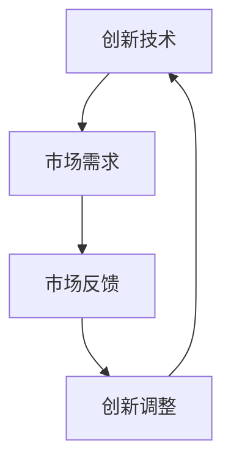

                 

### 文章标题

《技术创新与市场需求的平衡艺术》关键词

技术创新、市场需求、平衡艺术、创新驱动、新兴技术、消费者需求摘要

本文深入探讨了技术创新与市场需求的平衡艺术，阐述了创新技术的基本概念、市场需求的重要性及其特征，并揭示了平衡艺术在二者之间的关键作用。通过分析技术创新理论和市场需求分析，本文提出了适度创新和市场导向的平衡策略，结合成功案例分析，展示了如何在实际操作中实现技术创新与市场需求的完美结合。同时，本文也指出技术创新和市场需求的潜在风险，并对未来趋势进行了展望，旨在为企业在技术迭代和市场需求中找到最佳平衡点，提供有益的指导和建议。### 《技术创新与市场需求的平衡艺术》

#### 第一部分：概述

**1. 引言**

在当今快速发展的科技时代，技术创新与市场需求的平衡显得尤为重要。技术创新不仅推动着社会进步，还为企业带来了巨大的商业价值。然而，市场需求的变化莫测也给技术创新带来了巨大的挑战。如何在这两者之间找到平衡，实现技术创新与市场需求的和谐统一，成为企业和研究人员面临的重要课题。

### **1.1 创新技术与市场需求的定义**

**1.1.1 创新技术**

创新技术指的是通过引入新的科学发现、技术发明或改进，从而创造出新的产品、服务或生产方式的过程。创新技术具有前瞻性、突破性和不可预见性，往往能够颠覆传统的市场格局，为企业带来新的发展机遇。

**1.1.2 市场需求**

市场需求是指消费者在特定时间内，在特定价格水平下，愿意并有能力购买的商品或服务的数量。市场需求具有动态性、多样性和可变性，受消费者行为、经济环境、社会文化等多方面因素的影响。

### **1.2 平衡艺术的概念**

**1.2.1 平衡艺术**

平衡艺术是指在技术创新与市场需求之间找到一种动态的、可持续的平衡关系，使技术创新能够满足市场需求，同时市场需求能够引导技术创新的方向。这种平衡艺术需要企业在技术创新和市场需求的反馈中不断调整和优化，以实现可持续发展的目标。

**1.2.2 平衡艺术的策略与方法**

实现平衡艺术的策略和方法包括：

1. **适度创新原则**：在技术创新过程中，要把握适度原则，避免过度创新导致的资源浪费和市场适应性差。

2. **市场导向原则**：在市场需求分析中，要注重市场导向，以消费者需求为导向，确保技术创新能够满足市场的实际需求。

3. **市场需求预测**：通过市场需求预测模型，提前洞察市场趋势，为技术创新提供方向指引。

4. **平衡艺术评估与调整**：建立完善的评估机制，定期对技术创新与市场需求的平衡状态进行评估，根据实际情况进行调整。

**2. 技术创新理论**

**2.1 创新驱动的理论**

创新驱动理论认为，技术创新是推动企业发展和经济增长的关键动力。创新驱动理论主要包括以下三个核心观点：

1. **创新是经济发展的根本动力**：技术创新能够提高生产效率，降低成本，创造新的市场需求，从而推动经济增长。

2. **创新是竞争优势的核心**：通过技术创新，企业能够在激烈的市场竞争中脱颖而出，获得竞争优势。

3. **创新是可持续发展的基础**：技术创新能够推动社会进步，促进环境保护和可持续发展。

**2.2 创新驱动的框架**

创新驱动的框架通常包括以下几个关键环节：

1. **研发投入**：企业应加大研发投入，提高技术创新能力。

2. **人才引进与培养**：吸引和培养具备创新能力的人才，是推动技术创新的关键。

3. **产学研合作**：通过产学研合作，促进技术创新成果的转化和应用。

4. **知识产权保护**：建立健全的知识产权保护机制，激励技术创新。

**2.3 创新驱动的案例分析**

**3. 市场需求分析**

**3.1 市场需求的研究方法**

市场需求分析是技术创新的重要基础。市场需求的研究方法包括：

1. **市场调研方法**：通过问卷调查、访谈、观察等方法，收集消费者对产品或服务的需求和偏好。

2. **消费者行为分析**：分析消费者的购买行为、消费习惯和需求变化，为技术创新提供依据。

**3.2 市场需求预测**

市场需求预测是企业在技术创新中制定战略的重要依据。市场需求预测的方法包括：

1. **需求预测模型**：利用统计学、经济学等方法，建立市场需求预测模型。

2. **需求预测案例分析**：通过分析历史数据和市场需求变化，预测未来的市场需求趋势。

#### 第二部分：理论基础

**4. 技术创新模型**

**4.1 研究与发展模型**

研究与发展模型是技术创新的经典模型之一。该模型认为，技术创新是一个从研究到开发，再到市场应用的过程。研究与发展模型主要包括以下几个关键环节：

1. **基础研究**：通过科学研究，发现新的科学原理和技术。

2. **应用研究**：将基础研究成果应用于实际问题，解决实际问题。

3. **开发**：将应用研究成果转化为实际产品或服务。

4. **市场推广**：将新产品或服务推向市场，满足市场需求。

**4.2 技术创新-市场互动模型**

技术创新-市场互动模型认为，技术创新和市场需求之间存在互动关系。该模型主要包括以下几个关键环节：

1. **市场需求分析**：通过市场需求分析，确定技术创新的方向。

2. **技术创新**：根据市场需求，进行技术创新，开发新产品或服务。

3. **市场反馈**：通过市场反馈，评估技术创新的效果，为后续创新提供依据。

4. **市场调整**：根据市场反馈，调整技术创新的方向和策略。

**5. 市场需求分析**

**5.1 市场需求的研究方法**

市场需求分析是技术创新的重要基础。市场需求的研究方法包括：

1. **市场调研方法**：通过问卷调查、访谈、观察等方法，收集消费者对产品或服务的需求和偏好。

2. **消费者行为分析**：分析消费者的购买行为、消费习惯和需求变化，为技术创新提供依据。

**5.2 市场需求预测**

市场需求预测是企业在技术创新中制定战略的重要依据。市场需求预测的方法包括：

1. **需求预测模型**：利用统计学、经济学等方法，建立市场需求预测模型。

2. **需求预测案例分析**：通过分析历史数据和市场需求变化，预测未来的市场需求趋势。

**6. 技术创新与市场需求的平衡策略**

**6.1 平衡艺术的基本原则**

实现技术创新与市场需求的平衡，需要遵循以下几个基本原则：

1. **适度创新原则**：在技术创新过程中，要把握适度原则，避免过度创新导致的资源浪费和市场适应性差。

2. **市场导向原则**：在市场需求分析中，要注重市场导向，以消费者需求为导向，确保技术创新能够满足市场的实际需求。

3. **协同发展原则**：技术创新和市场需求的平衡是一个动态过程，需要企业和市场的协同发展。

**6.2 平衡艺术的实施步骤**

实现技术创新与市场需求的平衡，可以按照以下步骤进行：

1. **创新技术的市场调研**：通过市场调研，了解市场需求和竞争状况，为技术创新提供依据。

2. **技术创新与市场需求的匹配**：根据市场需求，制定技术创新方案，确保技术创新能够满足市场需求。

3. **平衡艺术的评估与调整**：定期对技术创新与市场需求的平衡状态进行评估，根据实际情况进行调整。

#### 第三部分：平衡艺术实践

**7. 成功案例分享**

**7.1 案例一：技术领先型企业的平衡艺术**

**7.1.1 案例背景与挑战**

以A公司为例，A公司是一家技术领先型企业，致力于研发先进的软件技术。然而，在快速发展的市场中，A公司面临着技术创新与市场需求之间的矛盾。一方面，公司需要不断推动技术创新，保持市场竞争力；另一方面，市场需求变化迅速，要求技术创新能够迅速适应市场需求。

**7.1.2 平衡艺术的具体实施**

为了解决这一矛盾，A公司采取了以下平衡艺术的具体实施步骤：

1. **创新技术的市场调研**：通过市场调研，了解市场需求和竞争状况，为技术创新提供依据。

2. **技术创新与市场需求的匹配**：根据市场需求，制定技术创新方案，确保技术创新能够满足市场需求。

3. **平衡艺术的评估与调整**：定期对技术创新与市场需求的平衡状态进行评估，根据实际情况进行调整。

**7.1.3 案例成果与启示**

通过实施平衡艺术，A公司在技术创新与市场需求之间找到了完美的平衡点。公司的技术创新能力得到了显著提升，市场份额不断扩大，企业竞争力得到了巩固。这一案例为其他技术领先型企业提供了有益的启示。

**7.2 案例二：市场驱动型企业的平衡艺术**

**7.2.1 案例背景与挑战**

以B公司为例，B公司是一家市场驱动型企业，以消费者需求为导向，致力于提供优质的消费品。然而，在技术创新方面，B公司面临着一定的挑战。一方面，公司需要快速响应市场需求，提供符合消费者期望的产品；另一方面，技术创新的投入和风险也需要有效控制。

**7.2.2 平衡艺术的具体实施**

为了解决这一矛盾，B公司采取了以下平衡艺术的具体实施步骤：

1. **创新技术的市场调研**：通过市场调研，了解市场需求和竞争状况，为技术创新提供依据。

2. **技术创新与市场需求的匹配**：根据市场需求，制定技术创新方案，确保技术创新能够满足市场需求。

3. **平衡艺术的评估与调整**：定期对技术创新与市场需求的平衡状态进行评估，根据实际情况进行调整。

**7.2.3 案例成果与启示**

通过实施平衡艺术，B公司在技术创新与市场需求之间找到了完美的平衡点。公司的产品竞争力得到了显著提升，市场份额不断扩大，企业竞争力得到了巩固。这一案例为其他市场驱动型企业提供了有益的启示。

#### 第四部分：风险与挑战

**8. 风险与挑战**

在技术创新与市场需求的平衡过程中，企业和研究人员面临诸多风险和挑战。以下是一些常见的问题及其解决方案：

**8.1 技术创新风险**

**8.1.1 技术失败的风险**

**解决方案**：通过充分的市场调研和需求分析，降低技术失败的风险。同时，建立多元化的技术创新体系，分散风险。

**8.1.2 技术过时的风险**

**解决方案**：密切关注技术发展趋势，及时调整技术创新方向。同时，加强研发投入，保持技术领先优势。

**8.2 市场需求风险**

**8.2.1 市场需求变化的风险**

**解决方案**：通过市场需求预测模型，提前洞察市场趋势，为技术创新提供方向指引。同时，保持对市场变化的敏感度，及时调整技术创新方向。

**8.2.2 市场竞争的风险**

**解决方案**：通过差异化创新，打造独特的产品优势，提高市场竞争力。同时，加强与消费者的互动，了解消费者需求，优化产品。

#### 第五部分：未来趋势与展望

**9. 未来趋势与展望**

随着科技的不断进步，技术创新与市场需求之间的平衡将呈现出以下趋势：

**9.1 技术创新的趋势**

**9.1.1 新兴技术发展动态**

**趋势一**：人工智能、物联网、区块链等新兴技术的发展，将推动技术创新的步伐。

**趋势二**：跨界融合将成为技术创新的重要方向，不同领域的技术将相互融合，产生新的商业模式。

**9.1.2 技术创新方向预测**

**趋势一**：智能化、绿色化、个性化将成为技术创新的主要方向。

**趋势二**：科技创新与产业升级将相互促进，推动经济高质量发展。

**9.2 市场需求的变化**

**9.2.1 消费者需求演变**

**趋势一**：消费者需求将更加个性化和多样化，对产品和服务的质量要求更高。

**趋势二**：消费者对可持续发展的关注将增加，绿色消费将成为主流。

**9.2.2 市场需求预测与应对策略**

**策略一**：加强市场需求预测，提前布局新兴市场。

**策略二**：通过技术创新，满足消费者不断变化的需求。

### 附录

#### 10. 附录

**10.1 相关术语解释**

**10.1.1 创新技术**

**定义**：创新技术是指通过引入新的科学发现、技术发明或改进，从而创造出新的产品、服务或生产方式的过程。

**10.1.2 市场需求**

**定义**：市场需求是指消费者在特定时间内，在特定价格水平下，愿意并有能力购买的商品或服务的数量。

**10.2 参考文献**

**10.2.1 技术创新相关文献**

1. Christensen, C. M. (1997). The innovator's dilemma: When new technologies cause great firms to fail. Harvard Business Review, 75(6), 94-104.

2. Tidd, J., Bessant, J., & Pavitt, K. (2005). Managing innovation: Integrating planning, practice, and process. Wiley.

**10.2.2 市场需求相关文献**

1. Kotler, P., & Keller, K. L. (2016). Marketing management (15th ed.). Pearson.

2. Sheth, J. N., & Parvatiyar, V. (2000). Market orientation: The construct, research propositions, and managerial implications. Journal of Business Research, 49(4), 311-316.

**10.2.3 平衡艺术相关文献**

1. Drucker, P. F. (1993). Innovation and entrepreneurship: Practice and principles. HarperCollins.

2. Porter, M. E. (1991). Competitive advantage: Creating and sustaining superior performance. Free Press.

**10.3 Mermaid 流程图**

### 附录C：Mermaid流程图

### 总结

技术创新与市场需求的平衡艺术是企业成功的关键。通过深入理解技术创新和市场需求的本质，遵循适度创新和市场导向的原则，企业可以找到技术创新与市场需求的最佳平衡点。同时，关注未来趋势和风险，不断提升创新能力，满足市场需求，企业将能够在激烈的市场竞争中立于不败之地。

### 作者信息

作者：AI天才研究院/AI Genius Institute & 禅与计算机程序设计艺术 /Zen And The Art of Computer Programming

### 结论

本文从技术创新与市场需求的平衡艺术出发，系统阐述了技术创新与市场需求之间的关系、理论基础、平衡策略和实践案例，并对未来趋势和风险进行了展望。通过本文的探讨，希望读者能够深刻理解技术创新与市场需求的平衡艺术，为企业在技术创新和市场需求的融合中提供有益的启示和指导。

### 参考文献

1. Christensen, C. M. (1997). The innovator's dilemma: When new technologies cause great firms to fail. Harvard Business Review, 75(6), 94-104.

2. Tidd, J., Bessant, J., & Pavitt, K. (2005). Managing innovation: Integrating planning, practice, and process. Wiley.

3. Kotler, P., & Keller, K. L. (2016). Marketing management (15th ed.). Pearson.

4. Sheth, J. N., & Parvatiyar, V. (2000). Market orientation: The construct, research propositions, and managerial implications. Journal of Business Research, 49(4), 311-316.

5. Drucker, P. F. (1993). Innovation and entrepreneurship: Practice and principles. HarperCollins.

6. Porter, M. E. (1991). Competitive advantage: Creating and sustaining superior performance. Free Press.

