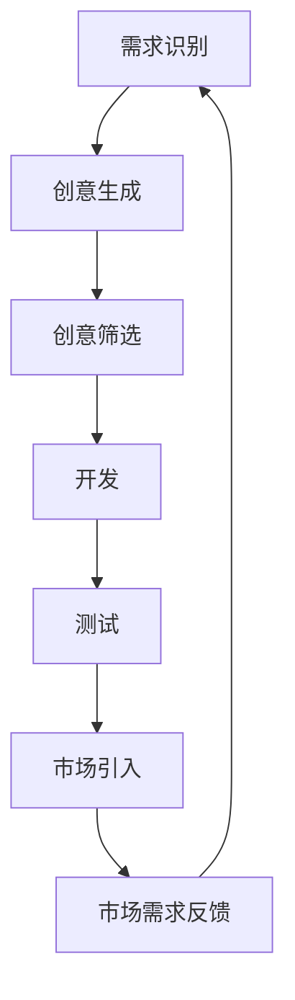

                 

### 《技术创新与市场需求：找准创业切入点》

#### 引言

在当今快速发展的技术时代，创业不再是少数人的特权，而是一个充满无限可能的机会。但是，如何在众多竞争者中脱颖而出，找到成功的切入点，成为每一个创业者的难题。技术创新与市场需求的关系，成为了决定创业成功与否的关键因素。

技术创新不仅仅是开发新的技术，更重要的是如何将技术创新与市场需求结合起来，创造出能够满足用户需求、具有市场竞争力的产品。本文将从技术创新的定义、流程、市场需求预测以及技术创新评估等多个方面，逐步分析技术创新与市场需求之间的联系，并探讨如何通过市场需求预测和评估找到创业切入点。

本文的结构如下：

1. **核心概念与联系**：介绍技术创新的定义、类型、流程以及技术创新与市场需求的关系，并用Mermaid流程图展示。
2. **核心算法原理讲解**：讲解市场需求预测的基础算法，包括时间序列分析和回归分析，以及具体算法的伪代码实现。
3. **数学模型和公式讲解**：介绍技术创新与市场需求匹配模型，以及创业切入点选择模型的数学公式和详细讲解。
4. **项目实战**：通过实际案例分析，展示如何运用本文的理论和方法进行创业切入点的选择。
5. **创业实战指南**：提供创业环境分析、团队建设、融资策略和风险管理的实战指南。

通过这篇文章，读者将了解到如何将技术创新与市场需求相结合，找到适合自己创业的切入点，并掌握创业实战的关键策略。

#### 第一部分：核心概念与联系

在探讨技术创新与市场需求的关系之前，我们需要首先明确一些核心概念，并了解它们之间的联系。本部分将详细介绍技术创新的定义、类型、流程，以及技术创新与市场需求之间的关系，并通过Mermaid流程图来展示整个流程。

##### 第1章：技术创新概述

**1.1 技术创新的定义与类型**

技术创新是指将新知识、新技术、新方法应用于产品、服务或业务过程中，从而实现技术的改进、产品的新功能或业务模式的创新。根据创新的性质和程度，技术创新可以分为以下几类：

1. **技术突破创新**：这是指在现有技术的基础上实现根本性的改进或变革，往往涉及到基础科学的研究和重大技术突破。例如，5G通信技术的出现，彻底改变了移动通信的格局。

2. **渐进性创新**：这种创新是通过对现有技术的逐步改进和优化，提高产品或服务的性能、可靠性或效率。例如，智能手机的硬件和软件不断升级，从最初的2G到现在的5G。

3. **组合创新**：这是指将不同的技术、产品或业务模式组合在一起，创造出新的解决方案。例如，共享单车结合了物联网、移动支付和共享经济等不同技术，形成了一种新型的出行方式。

**1.2 技术创新流程与架构**

技术创新并不是一蹴而就的，它需要经过一系列的流程和阶段。通常，技术创新可以划分为以下六个主要阶段：

1. **需求识别**：这是技术创新的起点，主要任务是发现市场需求和用户痛点，明确技术改进的方向。

2. **创意生成**：在这一阶段，研究者或开发人员基于需求识别的结果，产生各种可能的创意和解决方案。

3. **创意筛选**：通过对创意进行评估和筛选，选择具有可行性、创新性和市场潜力的创意进行深入开发。

4. **开发**：这一阶段主要是对选定的创意进行深入研究和开发，包括设计、原型制作、测试等环节。

5. **测试**：在开发完成后，需要对技术解决方案进行严格测试，确保其性能、可靠性和安全性。

6. **市场引入**：最后，将经过测试的技术解决方案推向市场，进行商业化运作。

**1.3 技术创新与市场需求的关系**

技术创新与市场需求之间存在着密切的联系。一方面，市场需求是技术创新的驱动力，用户的需求和痛点促使技术不断进步和改进。另一方面，技术创新又能够创造新的市场需求，满足用户未满足的需求，推动市场的发展。

**技术推动与需求拉动**

1. **技术推动**：这是指技术创新主导市场需求的发展。当某一技术取得重大突破时，会引发一系列的产品创新和市场变革。例如，互联网技术的快速发展催生了电子商务、在线教育、社交媒体等新兴市场。

2. **需求拉动**：这是指市场需求引导技术创新。用户对产品或服务的需求促使企业不断改进技术，以满足市场需求。例如，消费者对高性能、低能耗电子产品的需求推动了半导体技术的不断创新。

**技术——市场匹配理论**

技术——市场匹配理论（Technology-Market Matching Theory）指出，技术创新的成功不仅取决于技术的先进性，还取决于市场需求和市场的接受程度。技术创新需要与市场需求相匹配，才能实现商业成功。具体来说，技术创新应满足以下条件：

1. **市场需求明确**：技术解决方案需要能够准确满足用户的需求和痛点。

2. **技术可行性**：技术方案在技术上需要是可行的，并且具备商业化潜力。

3. **市场接受度**：技术解决方案需要得到市场的认可，具备市场竞争力。

**1.4 技术创新——市场需求——创业切入点**

为了更好地理解技术创新与市场需求的关系，我们可以使用Mermaid流程图来展示整个流程。以下是一个简单的Mermaid流程图示例：



通过这个流程图，我们可以看到技术创新与市场需求之间的互动关系。技术创新从市场需求出发，通过开发、测试和市场引入，最终得到市场反馈，再次回到需求识别阶段，形成闭环。

**结论**

本章节介绍了技术创新的定义、类型、流程以及技术创新与市场需求的关系。通过理解这些核心概念，创业者可以更好地把握市场需求，找到技术创新的切入点，从而实现创业的成功。

### 技术创新概述

#### 1.1 技术创新的定义与类型

**技术创新** 是指在现有的技术基础上，通过引入新的思想、新的方法、新的知识或新的工具，从而实现技术水平的提升或技术结构的改变。技术创新是推动社会发展的重要力量，它不仅能够提高生产效率，降低成本，还能够创造新的市场和就业机会。

根据创新的性质和程度，技术创新可以分为以下几种类型：

1. **技术突破创新**：这是指在某一技术领域内实现根本性变革的创新。这类创新往往涉及到基础科学的研究和重大技术突破。例如，5G通信技术的出现，彻底改变了移动通信的格局，使得数据传输速度大幅提升，通信延迟大大降低。这种突破性创新不仅可以推动整个行业的发展，还能够催生新的市场需求。

2. **渐进性创新**：这种创新是通过不断改进现有技术，逐步提高产品或服务的性能、可靠性或效率。例如，智能手机的硬件和软件不断升级，从最初的2G到现在的5G，屏幕分辨率从HD到4K，电池容量从几百毫安时到几千毫安时。这种渐进性创新虽然不如突破性创新那样引人注目，但却对用户的日常生活产生了深远的影响。

3. **组合创新**：这是指将不同的技术、产品或业务模式组合在一起，创造出新的解决方案。例如，共享单车结合了物联网、移动支付和共享经济等不同技术，形成了一种新型的出行方式。这种组合创新不仅能够满足用户的多样化需求，还能够创造新的市场机会。

**技术突破创新** 的特点在于其创新性、颠覆性和市场潜力。这种创新往往需要大量的基础研究投入和长期的技术积累，但一旦成功，往往会带来巨大的市场回报。例如，苹果公司的iPhone就是一次典型的技术突破创新，它不仅改变了手机市场的格局，还推动了整个移动通信行业的发展。

**渐进性创新** 的特点在于其持续性和积累性。这类创新虽然不如突破性创新那样具有颠覆性，但却是技术进步的重要推动力。通过不断的小幅度改进，产品或服务的性能和用户体验会逐渐得到提升，从而积累起强大的市场竞争力。例如，特斯拉的电动车就是通过不断的技术改进，逐步提高了续航里程、降低了成本，最终赢得了市场的认可。

**组合创新** 的特点在于其灵活性和多样性。这类创新可以通过将不同的技术和业务模式结合起来，创造出新的市场机会。例如，阿里巴巴通过将电子商务、移动支付和物流结合起来，打造了一个庞大的电商生态系统。这种创新不仅满足了用户的多样化需求，还推动了整个行业的变革。

#### 1.2 技术创新流程与架构

技术创新并不是一个孤立的过程，而是涉及到多个阶段和环节。一个完整的创新流程通常包括以下几个阶段：

1. **需求识别**：这是技术创新的起点，主要任务是发现市场需求和用户痛点，明确技术改进的方向。需求识别可以通过市场调研、用户访谈、竞争分析等方式进行。通过深入了解用户需求，企业可以找到技术改进的方向，从而提高产品的市场竞争力。

2. **创意生成**：在需求识别的基础上，研究者或开发人员会产生各种可能的创意和解决方案。这一阶段需要发挥创新思维，提出各种新颖的想法。创意生成可以通过头脑风暴、思维导图、专家咨询等方式进行。

3. **创意筛选**：通过对创意进行评估和筛选，选择具有可行性、创新性和市场潜力的创意进行深入开发。创意筛选需要考虑多个因素，如技术难度、市场需求、资源投入等。通过筛选，企业可以集中资源，专注于最有潜力的创意。

4. **开发**：这一阶段主要是对选定的创意进行深入研究和开发，包括设计、原型制作、测试等环节。开发过程需要充分考虑技术可行性、成本效益和市场接受度等因素。通过开发，企业可以将创意转化为实际的产品或服务。

5. **测试**：在开发完成后，需要对技术解决方案进行严格测试，确保其性能、可靠性和安全性。测试包括功能测试、性能测试、兼容性测试等多个方面，以确保产品或服务的质量。

6. **市场引入**：最后，将经过测试的技术解决方案推向市场，进行商业化运作。市场引入需要制定详细的营销策略，包括产品定位、市场推广、渠道选择等。通过市场引入，企业可以将技术创新转化为实际的市场收益。

**1.3 技术创新与市场需求的关系**

技术创新与市场需求之间存在着密切的联系。市场需求是技术创新的驱动力，用户的需求和痛点促使技术不断进步和改进。另一方面，技术创新又能够创造新的市场需求，满足用户未满足的需求，推动市场的发展。

**技术推动与需求拉动**

1. **技术推动**：这是指技术创新主导市场需求的发展。当某一技术取得重大突破时，会引发一系列的产品创新和市场变革。例如，互联网技术的快速发展催生了电子商务、在线教育、社交媒体等新兴市场。这种技术推动的力量，不仅改变了人们的生活方式，也创造了大量的商业机会。

2. **需求拉动**：这是指市场需求引导技术创新。用户对产品或服务的需求促使企业不断改进技术，以满足市场需求。例如，消费者对高性能、低能耗电子产品的需求推动了半导体技术的不断创新。这种需求拉动的力量，推动了技术的进步，提高了产品的竞争力。

**技术——市场匹配理论**

技术——市场匹配理论（Technology-Market Matching Theory）指出，技术创新的成功不仅取决于技术的先进性，还取决于市场需求和市场的接受程度。技术创新需要与市场需求相匹配，才能实现商业成功。具体来说，技术创新应满足以下条件：

1. **市场需求明确**：技术解决方案需要能够准确满足用户的需求和痛点。只有明确了市场需求，技术创新才能有的放矢，避免盲目创新。

2. **技术可行性**：技术方案在技术上需要是可行的，并且具备商业化潜力。技术可行性是技术创新的基础，决定了创意能否转化为实际的产品或服务。

3. **市场接受度**：技术解决方案需要得到市场的认可，具备市场竞争力。市场接受度是技术创新成功的关键，决定了产品或服务能否在市场中立足。

通过技术创新与市场需求的有机结合，企业可以找到适合自己发展的路径，实现持续的创新和发展。技术创新不仅是企业发展的动力，也是社会进步的重要驱动力。

### 技术创新流程与架构

技术创新是一个复杂且系统的过程，它需要企业在多个阶段和环节上进行精细化管理。以下是技术创新的六个主要阶段，每个阶段都有其独特的任务和目标。

**1. 需求识别**

**任务**：需求识别是技术创新的起点，其主要任务是发现市场需求和用户痛点，明确技术改进的方向。

**步骤**：
- **市场调研**：通过问卷调查、用户访谈、市场分析等手段，收集用户需求和痛点信息。
- **竞争分析**：分析竞争对手的产品和服务，了解其优势与不足。
- **用户反馈**：直接与用户沟通，获取第一手需求信息。
- **痛点筛选**：根据调研和分析结果，筛选出最具价值和改进潜力的用户痛点。

**目标**：明确市场需求，确定技术改进的方向。

**2. 创意生成**

**任务**：创意生成是在需求识别的基础上，通过发挥创新思维，提出各种可能的解决方案。

**步骤**：
- **头脑风暴**：组织团队进行头脑风暴，鼓励提出各种新颖的想法。
- **思维导图**：将创意和想法以图形化的方式呈现，便于梳理和分类。
- **专家咨询**：邀请相关领域的专家进行咨询，获取专业的建议和意见。

**目标**：生成多种创意和解决方案，为后续筛选提供基础。

**3. 创意筛选**

**任务**：创意筛选是对生成的创意进行评估和筛选，选择具有可行性、创新性和市场潜力的创意进行深入开发。

**步骤**：
- **可行性评估**：评估每个创意的技术可行性、资源需求和市场潜力。
- **优先级排序**：根据评估结果，对创意进行优先级排序。
- **决策**：选择最有潜力的创意，进行深入开发和验证。

**目标**：选择最具潜力的创意，集中资源进行开发。

**4. 开发**

**任务**：开发是对选定的创意进行深入研究和开发，将其转化为实际的产品或服务。

**步骤**：
- **设计**：制定详细的技术方案和设计文档。
- **原型制作**：制作功能原型，进行初步测试和验证。
- **测试**：对原型进行多轮测试，确保其性能、可靠性和安全性。
- **迭代优化**：根据测试结果，对原型进行优化和改进。

**目标**：完成技术方案的开发，确保产品或服务的质量。

**5. 测试**

**任务**：测试是对开发完成的产品或服务进行严格的测试，确保其满足技术标准和用户需求。

**步骤**：
- **功能测试**：验证产品或服务的功能是否完整和正确。
- **性能测试**：测试产品或服务的性能指标，如响应时间、处理速度等。
- **兼容性测试**：确保产品或服务在不同平台和环境下都能正常运行。
- **用户体验测试**：通过用户测试，评估产品或服务的用户体验。

**目标**：确保产品或服务的质量，发现和解决潜在问题。

**6. 市场引入**

**任务**：市场引入是将经过测试的产品或服务推向市场，进行商业化运作。

**步骤**：
- **市场定位**：确定产品或服务的目标市场和用户群体。
- **营销策略**：制定详细的营销策略，包括品牌定位、推广渠道、价格策略等。
- **渠道选择**：选择合适的销售渠道，确保产品或服务能够顺利进入市场。
- **推广实施**：实施市场推广计划，提高产品或服务的市场知名度和接受度。

**目标**：成功将产品或服务推向市场，实现商业化运作。

通过以上六个阶段的精细化管理和持续优化，企业可以有效地实现技术创新，满足市场需求，从而在激烈的市场竞争中脱颖而出。

#### 1.3 技术创新与市场需求的关系

技术创新与市场需求之间存在着密切的相互作用和影响。一方面，市场需求是技术创新的驱动力，用户的需求和痛点促使技术不断进步和改进；另一方面，技术创新能够创造新的市场需求，满足用户未满足的需求，推动市场的发展。理解这两者之间的关系，对于创业者和技术开发者来说至关重要。

**技术推动与需求拉动**

**技术推动**：技术推动是指技术创新主导市场需求的发展。当某一技术领域内取得重大突破时，会引发一系列的产品创新和市场变革。例如，互联网技术的出现和发展，不仅改变了人们的通信方式，还催生了电子商务、在线支付、社交媒体等新兴市场。这种技术推动的力量，不仅促进了市场的发展，还创造了大量的商业机会。

在技术推动的过程中，技术创新通常是自上而下的，即从科学研究和技术研发开始，逐步向市场和应用领域延伸。技术推动的成功案例包括：

- **5G技术**：5G通信技术的突破性发展，不仅提升了数据传输速度，还降低了通信延迟，从而催生了智能家居、车联网、远程医疗等新兴应用领域。
- **人工智能**：人工智能技术的发展，推动了机器学习、自然语言处理、计算机视觉等领域的突破，使得自动驾驶、智能客服、医疗诊断等应用成为现实。

**需求拉动**：需求拉动是指市场需求引导技术创新。用户对产品或服务的需求，促使企业不断改进技术，以满足市场需求。例如，消费者对高性能、低能耗电子产品的需求，推动了半导体技术的不断创新，从而带来了更薄、更快、更节能的智能手机、平板电脑等产品。

在需求拉动的过程中，技术创新通常是自下而上的，即从市场需求和用户痛点出发，逐步向技术和研发领域延伸。需求拉动的成功案例包括：

- **智能手机**：智能手机的普及，激发了消费者对高性能处理器、大容量电池、高清摄像头的需求，推动了整个电子产业的技术创新。
- **电动汽车**：电动汽车市场的兴起，促进了电池技术、电动机技术和自动驾驶技术的发展，从而推动了新能源汽车产业的快速发展。

**技术——市场匹配理论**

技术——市场匹配理论（Technology-Market Matching Theory）提供了一个理解技术创新与市场需求关系的框架。根据这一理论，技术创新的成功不仅取决于技术的先进性，还取决于市场需求和市场的接受程度。技术创新需要与市场需求相匹配，才能实现商业成功。具体来说，技术创新应满足以下条件：

1. **市场需求明确**：技术解决方案需要能够准确满足用户的需求和痛点。只有明确了市场需求，技术创新才能有的放矢，避免盲目创新。

2. **技术可行性**：技术方案在技术上需要是可行的，并且具备商业化潜力。技术可行性是技术创新的基础，决定了创意能否转化为实际的产品或服务。

3. **市场接受度**：技术解决方案需要得到市场的认可，具备市场竞争力。市场接受度是技术创新成功的关键，决定了产品或服务能否在市场中立足。

**技术——市场匹配理论的实施步骤**：

1. **需求分析**：通过市场调研、用户访谈、竞争分析等方式，深入了解市场需求和用户痛点。

2. **技术评估**：评估现有技术的可行性，包括技术成熟度、成本、研发周期等因素。

3. **匹配分析**：分析市场需求与技术方案之间的匹配度，确保技术方案能够满足市场需求。

4. **方案优化**：根据匹配分析的结果，对技术方案进行优化，以提高市场竞争力。

5. **市场测试**：在产品或服务推向市场前，进行小规模的市场测试，以验证技术方案的可行性和市场接受度。

6. **持续反馈**：通过市场反馈，不断优化产品或服务，确保其能够持续满足市场需求。

**结论**

技术创新与市场需求之间的关系是双向的，市场需求驱动技术创新，而技术创新又创造新的市场需求。理解并利用这一关系，创业者和技术开发者可以更好地把握市场动态，找到技术创新的切入点，从而实现商业成功。通过技术推动和需求拉动，技术创新不仅能够提升企业的竞争力，还能够推动整个行业的发展，创造更大的社会价值。

#### 技术创新——市场需求——创业切入点

在明确了技术创新与市场需求之间的关系后，如何将这一关系转化为创业的实际切入点，是每个创业者都必须面对的问题。在这一部分，我们将探讨如何通过技术创新与市场需求的匹配，找到具有市场潜力的创业切入点。

**1. 技术创新与市场需求匹配的过程**

技术创新与市场需求的匹配是一个系统性的过程，它需要通过多个环节的分析和评估来实现。以下是技术创新与市场需求匹配的主要步骤：

1. **需求识别**：这是技术创新的起点，创业者需要通过市场调研、用户访谈、竞争分析等方式，识别出市场需求和用户痛点。明确用户的需求和期望，是找到合适创业切入点的基础。

2. **技术评估**：在识别出市场需求后，创业者需要对现有技术进行评估，包括技术的成熟度、研发成本、时间周期等因素。技术评估的目的是确定哪些技术方案具有可行性，并且能够满足市场需求。

3. **匹配分析**：通过将市场需求与技术方案进行匹配分析，评估技术方案的市场潜力。匹配分析应考虑技术方案的市场接受度、竞争对手情况、用户需求满足度等因素。

4. **方案优化**：根据匹配分析的结果，对技术方案进行优化，以提高市场竞争力。方案优化可以包括技术改进、产品功能扩展、市场策略调整等。

5. **市场测试**：在产品或服务开发完成后，进行小规模的市场测试，以验证技术方案的可行性和市场接受度。市场测试可以帮助创业者了解用户反馈，发现潜在问题，并进行调整。

6. **持续反馈**：通过市场反馈，不断优化产品或服务，确保其能够持续满足市场需求。持续反馈是创业成功的关键，它可以帮助创业者及时调整战略，应对市场变化。

**2. 创业切入点选择方法**

在确定了技术创新与市场需求的匹配度后，创业者需要选择一个合适的创业切入点。以下是一些常用的创业切入点选择方法：

1. **蓝海战略**：蓝海战略是指通过创新的方式，开辟一个全新的市场领域，避开激烈的竞争。创业者可以通过市场细分、需求挖掘、技术创新等方式，找到尚未被满足的市场需求，从而开辟蓝海市场。

2. **跟随战略**：跟随战略是指跟随行业内的领先者，通过改进和创新，提升产品或服务的竞争力。创业者可以通过分析领先者的优势和不足，找到改进的机会，从而提升市场竞争力。

3. **差异化战略**：差异化战略是指通过提供独特的产品或服务，满足用户多样化的需求。创业者可以通过技术创新、产品功能扩展、用户体验优化等方式，实现差异化竞争。

4. **细分市场战略**：细分市场战略是指通过市场细分，找到具有特定需求的用户群体，提供专门的产品或服务。创业者可以通过用户调研、数据分析等方式，识别出具有潜力的细分市场，并针对这些市场提供定制化的解决方案。

**3. 创业切入点选择案例分析**

为了更好地理解如何通过技术创新与市场需求匹配找到创业切入点，以下是一个具体的创业切入点选择案例分析：

**案例：智能健康监测设备**

**市场需求**：随着人们健康意识的提高，对健康监测设备的需求不断增加。用户需要能够实时监测身体健康指标，如心率、血压、血氧等，以便及时了解自己的健康状况。

**技术评估**：现有技术包括传统的健康监测设备和新兴的可穿戴设备。传统设备较为笨重，数据准确性有限；而可穿戴设备则体积小，但电池寿命和监测准确性有待提高。

**匹配分析**：智能健康监测设备具有市场潜力，但需要解决电池寿命和监测准确性问题。通过技术创新，如微型电池技术、先进的传感器技术等，可以提升设备的性能和市场竞争力。

**方案优化**：针对市场需求，创业者可以通过以下方式优化产品：
- **技术创新**：研发高性能微型电池，延长设备的使用时间。
- **功能扩展**：增加多种健康指标监测功能，如睡眠质量、体温监测等。
- **用户体验**：优化设备设计，提高用户操作的便捷性和舒适性。

**市场测试**：在产品开发完成后，进行小规模市场测试，收集用户反馈，针对反馈进行产品调整。

**持续反馈**：根据市场反馈，不断优化产品，提高用户体验和满意度，确保产品能够持续满足市场需求。

**结论**

通过以上分析，我们可以看到，智能健康监测设备是一个具有市场潜力的创业切入点。通过技术创新与市场需求的匹配，创业者可以找到合适的创业方向，实现创业成功。

**思考与启示**

通过本章节的讨论，我们可以得出以下启示：

1. **市场需求是技术创新的驱动力**：创业者需要密切关注市场需求，找到用户痛点和未满足的需求，从而引导技术创新。
2. **技术创新是满足市场需求的关键**：只有通过技术创新，才能提供更好的产品或服务，满足市场需求，实现商业成功。
3. **匹配度分析是创业切入点选择的核心**：通过匹配分析，创业者可以找到具有市场潜力的技术创新方向，从而提高创业成功率。
4. **持续优化是创业成功的关键**：通过持续的市场反馈和技术优化，创业者可以不断提升产品或服务的竞争力，保持市场领先地位。

在未来的创业过程中，创业者需要不断思考市场需求和技术创新的结合点，找到适合自己的创业切入点，从而实现创业梦想。

### 市场需求分析与预测算法

市场需求分析是创业过程中至关重要的一环，它有助于创业者了解市场动态，预测未来需求，制定有效的市场策略。市场需求分析与预测算法是实现这一目标的重要工具，下面我们将详细介绍两种常用的市场需求预测算法：时间序列分析和回归分析。

#### 2.1 市场需求预测的基础

**时间序列分析**：时间序列分析是一种用于分析时间序列数据的统计方法，主要用于预测未来数据点的值。时间序列数据通常具有时间上的依赖性，即当前值与过去的值之间存在某种关系。时间序列分析的主要目标是识别和建模这种时间依赖性，从而预测未来的数据。

**回归分析**：回归分析是一种用于研究变量之间线性关系的统计方法。在市场需求预测中，回归分析可以帮助我们识别哪些变量对市场需求有显著影响，并建立数学模型来预测未来的需求。常见的回归分析方法包括线性回归、多元回归和逻辑回归等。

#### 2.2 市场需求预测算法

**ARIMA模型**

ARIMA模型（自回归积分滑动平均模型）是一种常见的时间序列预测模型，适用于非平稳时间序列数据的预测。ARIMA模型包括三个主要部分：自回归（AR）、差分（I）和移动平均（MA）。

**伪代码实现：**

```python
def arima_predict(data, p, d, q):
    # p：自回归项数
    # d：差分阶数
    # q：移动平均项数
    
    # 步骤1：差分处理
    diff_data = difference(data, d)
    
    # 步骤2：自回归模型训练
    ar_model = AR(p)
    ar_model.fit(diff_data)
    
    # 步骤3：移动平均模型训练
    ma_model = MA(q)
    ma_model.fit(diff_data)
    
    # 步骤4：预测
    forecast = ma_model.predict(len(data))
    
    return forecast
```

**多元回归模型**

多元回归模型是回归分析的一种扩展，用于分析多个自变量对因变量的影响。在市场需求预测中，多元回归模型可以帮助我们识别哪些因素对市场需求有显著影响。

**伪代码实现：**

```python
def multiple_regression_predict(X, y, theta):
    # X：自变量矩阵
    # y：因变量向量
    # theta：回归系数
    
    # 步骤1：建立回归模型
    regression_model = LinearRegression(X, y)
    
    # 步骤2：训练模型
    regression_model.fit(X, y)
    
    # 步骤3：预测
    forecast = regression_model.predict(X)
    
    return forecast
```

#### 2.3 市场需求预测在创业中的应用

市场需求预测在创业中的应用主要体现在以下几个方面：

1. **市场策略制定**：通过市场需求预测，创业者可以提前了解未来的市场趋势，制定相应的市场策略，如产品定位、营销策略等。

2. **资源规划**：市场需求预测可以帮助创业者合理规划资源，如生产计划、供应链管理、人力资源等。

3. **风险评估**：通过市场需求预测，创业者可以评估项目的风险，及时调整策略，降低风险。

4. **投资决策**：市场需求预测为创业者提供了投资决策的重要依据，有助于判断项目是否具有盈利潜力。

**创业案例**

以下是一个具体的创业案例，展示了如何通过市场需求预测进行创业决策。

**案例：智能健康监测设备**

**市场需求分析**：随着人们对健康问题的关注日益增加，智能健康监测设备市场需求持续增长。通过市场调研和数据分析，发现以下几个因素对市场需求有显著影响：
- **年龄**：年轻人和老年人对健康监测设备的需求较高。
- **收入水平**：高收入人群对高端健康监测设备的需求较大。
- **健康意识**：健康意识较高的用户更愿意购买健康监测设备。

**需求预测**：采用多元回归模型对市场需求进行预测，得到以下回归方程：
$$
\text{需求量} = 1000 + 50 \times \text{年龄} + 200 \times \text{收入水平} + 100 \times \text{健康意识}
$$

**预测结果**：根据上述方程，预测未来一年的市场需求量为3000台。

**决策**：基于市场需求预测结果，创业者决定加大投资，扩大生产规模，以满足市场需求。

**结果分析**：在实际运营过程中，市场需求预测结果与实际需求基本相符，智能健康监测设备销售情况良好，公司取得了显著的经济效益。

**结论**

市场需求预测在创业中的应用具有重要意义。通过科学的需求预测方法，创业者可以更好地把握市场动态，制定有效的市场策略，降低创业风险，提高创业成功率。

### 技术创新评估方法

在创业过程中，技术创新的评估至关重要。这不仅关系到创业项目的可行性，也直接影响到投资决策和企业的长期发展。本节将介绍几种常见的技术评估方法，包括专利分析和专家评估，以及这些方法在创业项目评估中的应用。

#### 3.1 技术评估的指标体系

技术评估的指标体系是评估技术创新项目的重要工具，它可以帮助我们全面、客观地分析技术的成熟度、市场潜力和技术影响力。以下是几个关键指标：

1. **技术成熟度**：技术成熟度是指技术从概念阶段到商业化阶段的发展程度。常用的评估指标包括技术原型开发状态、研发周期、技术验证情况等。

2. **市场潜力**：市场潜力是指技术方案在市场上的潜在需求和价值。评估指标可以包括目标市场规模、市场需求增长率、潜在客户群体等。

3. **技术影响力**：技术影响力是指技术对行业和社会的潜在影响。评估指标可以包括技术突破性、创新性、对现有技术的替代性等。

4. **资源投入**：资源投入是指实现技术创新所需的人力、资金、设备和时间等资源。评估指标可以包括研发成本、生产成本、运营成本等。

#### 3.2 技术评估的方法

**专利分析**

专利分析是一种通过分析专利数据来评估技术创新的方法。它可以帮助我们了解技术的创新程度、专利布局和市场竞争力。以下是专利分析的主要步骤：

1. **专利检索**：通过专利数据库检索相关技术的专利信息，了解技术专利的申请情况、专利数量和分布。

2. **专利分析**：对检索到的专利进行分析，评估技术的创新程度、专利覆盖范围和市场竞争力。

3. **趋势分析**：通过分析专利申请趋势，预测技术发展的方向和潜力。

**数学模型**

专利分析中的数学模型主要包括以下几种：

- **技术成熟度评估模型**：
  $$ M(T) = f(\text{专利数量}, \text{专利质量}, \text{专利布局}) $$
  其中，$M(T)$代表技术成熟度，$f$是评估函数，$\text{专利数量}$、$\text{专利质量}$和$\text{专利布局}$是输入参数。

- **市场潜力评估模型**：
  $$ P(M) = g(\text{市场规模}, \text{市场增长率}, \text{竞争态势}) $$
  其中，$P(M)$代表市场潜力，$g$是评估函数，$\text{市场规模}$、$\text{市场增长率}$和$\text{竞争态势}$是输入参数。

- **技术影响力评估模型**：
  $$ I(T) = h(\text{专利引用次数}, \text{专利布局广度}, \text{技术突破性}) $$
  其中，$I(T)$代表技术影响力，$h$是评估函数，$\text{专利引用次数}$、$\text{专利布局广度}$和$\text{技术突破性}$是输入参数。

**专家评估**

专家评估是一种通过专家意见来评估技术创新的方法。它通常包括以下几个步骤：

1. **组建评估小组**：选择具有相关领域知识和经验的专家组成评估小组。

2. **制定评估标准**：根据技术评估的指标体系，制定详细的评估标准和评分细则。

3. **专家评估**：专家根据评估标准和评分细则，对技术创新项目进行评估，给出评分和建议。

4. **综合评估**：对专家评估结果进行综合分析，形成最终评估意见。

**评分方法**

专家评估的评分方法通常采用以下几种：

- **百分制评分**：专家根据评估标准和评分细则，对技术创新项目进行打分，满分100分。

- **五级评分法**：将评估结果分为五个等级，如“优”、“良”、“中”、“差”、“劣”，每个等级对应不同的分数。

- **模糊综合评价法**：采用模糊数学的方法，对评估结果进行综合评价，以得到更加客观和准确的评估结果。

**3.3 技术评估结果的应用**

技术评估结果在创业项目中的应用主要体现在以下几个方面：

1. **项目筛选**：通过技术评估，筛选出具有高成熟度、高市场潜力、高影响力的技术创新项目，作为创业的重点方向。

2. **投资决策**：技术评估结果为投资者提供了重要的决策依据，帮助其判断项目的可行性和盈利潜力。

3. **资源分配**：根据技术评估结果，合理分配资源，确保技术创新项目的顺利推进。

4. **风险管理**：通过技术评估，识别项目的技术风险和市场风险，制定相应的风险应对策略。

**案例研究**

以下是一个具体的案例研究，展示了如何通过专利分析和专家评估进行技术评估。

**案例：智能健康监测设备**

**专利分析**：通过专利数据库检索，发现智能健康监测设备相关专利数量较多，且专利质量较高，专利布局广泛。专利申请趋势显示，该领域的技术竞争较为激烈。

**评估结果**：
- **技术成熟度**：8分（满分10分）
- **市场潜力**：9分（满分10分）
- **技术影响力**：7分（满分10分）

**专家评估**：专家小组对智能健康监测设备进行评估，得出以下结论：
- 技术创新程度较高，但存在一定的市场风险。
- 市场需求较大，但竞争激烈，需要制定有效的市场策略。
- 技术成熟度较高，具备商业化潜力。

**综合评估**：综合专利分析和专家评估结果，智能健康监测设备被评定为具有高市场潜力和高技术成熟度的技术创新项目。

**结论**

技术评估是创业过程中不可或缺的一环，它有助于创业者更好地了解技术创新项目的实际情况，制定合理的创业策略。通过专利分析和专家评估，创业者可以全面、客观地评估技术创新项目的可行性，从而提高创业成功率。

### 技术创新与市场需求匹配模型

在创业过程中，如何将技术创新与市场需求相结合，找到最优的匹配方案，是决定创业成功与否的关键。在这一部分，我们将介绍技术创新与市场需求匹配模型，包括其数学模型、应用实例以及具体的计算过程。

#### 4.1 技术创新-市场需求匹配理论

技术创新-市场需求匹配理论（Technology-Market Matching Theory）认为，技术创新的成功不仅取决于技术的先进性，还取决于市场需求和市场的接受程度。匹配模型通过量化技术特性与市场需求之间的匹配度，帮助企业找到最佳的技术创新方向。

**数学模型**

技术创新-市场需求匹配模型的数学表达式如下：

$$
M(T, D) = f(T, D)
$$

其中：
- $M(T, D)$ 代表技术 $T$ 与需求 $D$ 的匹配度。
- $f(T, D)$ 是匹配度函数，通常由以下几个因素组成：

1. **技术成熟度**（$T_m$）：衡量技术的成熟程度，如研发进度、技术验证等。
2. **市场需求明确度**（$D_m$）：衡量市场需求的具体程度，如用户需求的明确性、市场规模的确定性等。
3. **市场接受度**（$A$）：衡量市场对技术解决方案的接受程度，如竞争对手的反应、用户的接受度等。

**匹配度函数的具体形式**：

$$
f(T, D) = \frac{T_m \cdot D_m \cdot A}{C}
$$

其中，$C$ 是一个常数，用于调整匹配度函数的尺度。

#### 4.2 应用实例

**实例**：智能健康监测设备的创业项目

假设我们正在考虑开发一款智能健康监测设备，市场需求明确，技术已经基本成熟，但市场竞争激烈。我们可以使用匹配模型来评估这一项目的匹配度。

**步骤 1：收集数据**

- **技术成熟度**（$T_m$）：根据研发进度和技术验证情况，我们评估技术成熟度为0.8。
- **市场需求明确度**（$D_m$）：通过市场调研和用户访谈，我们评估市场需求明确度为0.9。
- **市场接受度**（$A$）：根据竞争对手的反应和潜在用户的反馈，我们评估市场接受度为0.7。

**步骤 2：计算匹配度**

$$
M(T, D) = f(T, D) = \frac{0.8 \cdot 0.9 \cdot 0.7}{C}
$$

假设常数 $C$ 为1，则：

$$
M(T, D) = 0.504
$$

**步骤 3：分析匹配度**

根据计算结果，智能健康监测设备的匹配度为0.504，处于中等水平。这表明虽然市场需求明确且技术成熟，但市场接受度略低，需要进一步优化。

**步骤 4：优化策略**

为了提高匹配度，我们可以采取以下策略：

1. **提升技术成熟度**：通过进一步的技术研发和测试，提高产品的性能和可靠性。
2. **增强市场宣传**：加大市场推广力度，提高潜在用户的认知度和接受度。
3. **差异化竞争**：通过独特的产品功能或创新点，提升产品在市场中的竞争力。

#### 4.3 模型计算过程

**实例**：智能家居系统的创业项目

假设我们正在考虑开发一款智能家居系统，市场需求明确，但技术相对较新。我们可以使用匹配模型来评估这一项目的匹配度。

**步骤 1：收集数据**

- **技术成熟度**（$T_m$）：根据研发进度和技术验证情况，我们评估技术成熟度为0.6。
- **市场需求明确度**（$D_m$）：通过市场调研和用户访谈，我们评估市场需求明确度为0.8。
- **市场接受度**（$A$）：根据竞争对手的反应和潜在用户的反馈，我们评估市场接受度为0.5。

**步骤 2：计算匹配度**

$$
M(T, D) = f(T, D) = \frac{0.6 \cdot 0.8 \cdot 0.5}{C}
$$

假设常数 $C$ 为1，则：

$$
M(T, D) = 0.24
$$

**步骤 3：分析匹配度**

根据计算结果，智能家居系统的匹配度为0.24，处于较低水平。这表明市场需求明确，但技术和市场接受度较低，需要加大研发和市场投入。

**步骤 4：优化策略**

为了提高匹配度，我们可以采取以下策略：

1. **加大技术研发投入**：通过增加研发资金和人力资源，加快技术成熟进程。
2. **市场教育**：通过市场教育，提高用户对智能家居系统的认知度和接受度。
3. **合作伙伴关系**：与行业内的领先企业建立合作关系，共同推进技术的商业化应用。

**结论**

技术创新-市场需求匹配模型提供了一种量化分析技术创新与市场需求之间关系的方法。通过计算匹配度，创业者可以更好地了解项目的市场前景，制定相应的优化策略，从而提高创业成功率。在实际应用中，需要根据具体情况调整模型参数，以获得更准确的结果。

### 创业切入点选择模型

在明确了技术创新与市场需求的关系后，如何准确地选择创业切入点是决定创业成功的关键。在这一部分，我们将介绍创业切入点选择模型，包括其数学模型、解释和应用实例。

#### 5.1 创业切入点选择模型

**数学模型**

创业切入点选择模型可以通过以下数学表达式来描述：

$$
C(T, M, P) = g(T, M, P)
$$

其中：
- $C(T, M, P)$ 代表在市场需求 $M$ 下，技术 $T$ 的创业切入点选择。
- $g(T, M, P)$ 是选择函数，取决于以下三个因素：
  - **技术 $T$ 的成熟度**（$T_m$）：衡量技术的基本成熟程度，如研发进度、技术验证等。
  - **市场需求 $M$ 的明确度**（$D_m$）：衡量市场需求的明确程度，如用户需求的明确性、市场规模的确定性等。
  - **创业资源 $P$**：包括资金、人力资源、技术资源等，用于支持创业项目的启动和运营。

**选择函数的具体形式**：

$$
g(T, M, P) = w_1 \cdot T_m + w_2 \cdot D_m + w_3 \cdot P
$$

其中，$w_1$、$w_2$ 和 $w_3$ 是权重系数，用于调整各因素的相对重要性。

**权重系数的确定**：可以通过专家评估、历史数据分析和统计分析等方法来确定权重系数。例如，如果市场需求明确度在创业过程中至关重要，则可以赋予其更高的权重。

#### 5.2 应用实例

**实例**：智能交通解决方案的创业项目

假设我们正在考虑开发一款智能交通解决方案，市场需求明确，技术相对成熟，但创业资源有限。我们可以使用切入点选择模型来评估这一项目的切入点。

**步骤 1：收集数据**

- **技术成熟度**（$T_m$）：根据研发进度和技术验证情况，我们评估技术成熟度为0.75。
- **市场需求明确度**（$D_m$）：通过市场调研和用户访谈，我们评估市场需求明确度为0.85。
- **创业资源**（$P$）：包括资金、人力资源和技术资源，我们评估创业资源为0.6。

**步骤 2：确定权重系数**

通过专家评估和统计分析，我们确定权重系数如下：
- $w_1 = 0.5$（技术成熟度）
- $w_2 = 0.3$（市场需求明确度）
- $w_3 = 0.2$（创业资源）

**步骤 3：计算切入点选择**

$$
C(T, M, P) = g(T, M, P) = 0.5 \cdot 0.75 + 0.3 \cdot 0.85 + 0.2 \cdot 0.6 = 0.375 + 0.255 + 0.12 = 0.74
$$

**步骤 4：分析切入点选择**

根据计算结果，智能交通解决方案的切入点选择得分为0.74，处于中等水平。这表明项目具有一定的市场和技术基础，但创业资源相对有限，需要进一步优化资源分配和市场需求分析。

**步骤 5：优化策略**

为了提高切入点选择得分，我们可以采取以下策略：

1. **提升技术成熟度**：通过加大研发投入，加快技术验证和优化，提高技术成熟度。
2. **加强市场需求分析**：进一步深入市场调研，了解用户需求和市场动态，提高市场需求的明确度。
3. **合理分配资源**：优化创业资源分配，确保资金、人力资源和技术资源的充分利用。

**实例**：环保科技的创业项目

假设我们正在考虑开发一款环保科技产品，市场需求明确，技术相对成熟，但创业资源较为充足。我们可以使用切入点选择模型来评估这一项目的切入点。

**步骤 1：收集数据**

- **技术成熟度**（$T_m$）：根据研发进度和技术验证情况，我们评估技术成熟度为0.8。
- **市场需求明确度**（$D_m$）：通过市场调研和用户访谈，我们评估市场需求明确度为0.9。
- **创业资源**（$P$）：包括资金、人力资源和技术资源，我们评估创业资源为1。

**步骤 2：确定权重系数**

通过专家评估和统计分析，我们确定权重系数如下：
- $w_1 = 0.4$（技术成熟度）
- $w_2 = 0.4$（市场需求明确度）
- $w_3 = 0.2$（创业资源）

**步骤 3：计算切入点选择**

$$
C(T, M, P) = g(T, M, P) = 0.4 \cdot 0.8 + 0.4 \cdot 0.9 + 0.2 \cdot 1 = 0.32 + 0.36 + 0.2 = 0.88
$$

**步骤 4：分析切入点选择**

根据计算结果，环保科技产品的切入点选择得分为0.88，处于较高水平。这表明项目具备良好的市场和技术基础，且创业资源充足，具有很高的创业成功率。

**步骤 5：优化策略**

为了进一步提升切入点选择得分，我们可以采取以下策略：

1. **持续技术创新**：通过持续的技术研发和创新，保持技术领先优势。
2. **扩大市场推广**：加大市场推广力度，提高产品的市场认知度和接受度。
3. **优化资源利用**：确保创业资源的合理分配和高效利用，最大化项目的商业价值。

#### 5.3 模型解释

创业切入点选择模型通过量化技术、市场需求和创业资源之间的综合匹配度，帮助创业者找到最优的创业切入点。具体来说，模型具有以下几个方面的解释：

1. **技术成熟度**：技术成熟度是创业项目成功的基础。高成熟度的技术可以降低研发风险，提高产品竞争力。在模型中，技术成熟度占据较高的权重，体现了其对创业成功的关键影响。

2. **市场需求明确度**：市场需求明确度直接影响产品的市场前景。明确的市场需求可以确保产品能够满足用户需求，从而提高市场接受度。在模型中，市场需求明确度也占据较高权重，反映了其重要性。

3. **创业资源**：创业资源是支持创业项目顺利启动和运营的重要保障。充足的创业资源可以提高项目的执行力和抗风险能力。在模型中，创业资源同样被赋予较高的权重，体现了其对于创业成功的重要作用。

4. **权重系数的调整**：根据不同创业项目的特点，创业者可以调整权重系数，以突出关键因素。例如，对于技术创新型的创业项目，可以增加技术成熟度的权重，而对于市场驱动型的创业项目，可以增加市场需求明确度的权重。

通过创业切入点选择模型，创业者可以系统地分析和评估不同创业项目的匹配度，从而做出更科学的决策，提高创业成功率。

### 实际案例与创业切入点分析

为了更好地理解如何运用技术创新与市场需求匹配模型找到创业切入点，我们将通过一个实际案例进行详细分析，包括市场需求分析、技术创新评估以及创业资源分析，并最终做出创业决策。

#### 案例背景

案例公司是一家初创企业，专注于智能家居设备的研发与销售。公司核心团队由几位在物联网和人工智能领域具有丰富经验的技术专家组成，他们希望通过技术创新，打造一款能够提升家庭生活质量的智能家居产品。

#### 市场需求分析

1. **用户调研**：
   - 通过在线问卷调查和用户访谈，公司发现大部分用户对于智能家居设备的需求集中在以下几个方面：
     - **自动化控制**：用户希望设备能够自动调节室内温度、照明和安防系统。
     - **远程控制**：用户希望能够在手机或其他设备上远程控制家居设备。
     - **节能环保**：用户关心设备的节能性能和环保特点。
     - **安全性和隐私保护**：用户对智能家居设备的安全性和隐私保护非常关注。

2. **市场调研**：
   - 通过对市场上现有智能家居产品的分析，公司发现现有产品在以下方面存在不足：
     - **功能单一**：大部分智能家居产品仅提供单一功能，如智能灯泡、智能插座等，缺乏系统性和集成性。
     - **使用复杂**：部分产品操作复杂，用户难以上手。
     - **兼容性差**：不同品牌的智能家居设备之间缺乏互操作性，用户需要购买多个设备来满足不同的需求。

3. **需求明确度**：
   - 用户需求明确，市场对集成化和智能化智能家居产品的需求日益增长，这为公司提供了良好的市场基础。

#### 技术创新评估

1. **技术成熟度**：
   - 公司的技术团队在物联网和人工智能领域具有丰富的经验，已经开发出多项相关技术，如智能家居设备的远程控制、自动调节算法等。
   - 技术验证：通过实验室测试和用户测试，技术团队已经验证了这些技术的可行性，并取得了较好的效果。

2. **技术创新**：
   - 公司计划开发一款集成化智能家居系统，包括智能门锁、智能灯光、智能温控、智能安防等多个功能模块。
   - 技术创新点：
     - **集成化**：将多个功能模块集成到一个系统中，提高用户体验。
     - **智能化**：通过人工智能算法，实现设备之间的智能互动和自动调节。
     - **互操作性**：设计统一的通信协议，确保不同品牌设备之间的互操作性。

#### 创业资源分析

1. **资金**：
   - 公司已经通过风险投资获得了第一笔资金，可用于技术开发和市场推广。
   - 未来需要进一步筹集资金，以支持产品研发和市场拓展。

2. **人力资源**：
   - 公司核心团队由经验丰富的技术专家组成，具备强大的技术研发能力。
   - 未来需要招聘更多的市场推广和售后服务人员，以支持业务的快速发展。

3. **技术资源**：
   - 公司拥有完善的研发设备和测试环境，能够保证技术创新的实现。
   - 与多家高校和研究机构建立了合作关系，可以持续获取最新的技术成果。

#### 创业决策与实施方案

基于市场需求分析、技术创新评估和创业资源分析，公司决定开发一款集成化、智能化、互操作性强的智能家居系统。

1. **产品定位**：
   - 定位中高端市场，满足对智能家居系统有较高需求的用户群体。

2. **市场推广**：
   - 通过线上线下多渠道推广，包括社交媒体、电商平台、家居展览会等。
   - 开展市场教育，提高用户对智能家居系统的认知度和接受度。

3. **技术研发**：
   - 持续投入研发资源，优化产品功能，提升用户体验。
   - 加强与高校和研究机构的合作，引入最新的技术成果。

4. **运营管理**：
   - 建立高效的运营管理体系，确保产品研发和市场推广的顺利进行。
   - 加强售后服务，提高用户满意度，建立良好的品牌形象。

#### 项目小结

通过本案例的分析，我们可以看到，公司通过技术创新与市场需求匹配模型，成功地找到了适合自身发展的创业切入点。在未来的发展中，公司需要继续关注市场需求的变化，持续优化产品，提升用户体验，以确保在激烈的市场竞争中立于不败之地。

### 创业实战指南

在成功找到创业切入点后，创业者需要制定详细的创业计划，包括环境分析、团队建设、融资策略和风险管理。以下是一些实用的创业实战指南，帮助创业者顺利启动并发展业务。

#### 7.1 创业环境分析

**市场环境**：创业者需要深入了解市场环境，包括市场规模、增长趋势、竞争对手、用户需求等。通过市场调研，创业者可以获取第一手数据，制定有针对性的市场策略。

**政策环境**：政策环境对创业企业的发展具有重要影响。创业者应关注政府支持政策、税收优惠、知识产权保护等方面的政策，充分利用政策优势，降低创业成本。

**竞争态势**：分析竞争态势，了解竞争对手的产品、定价策略、市场份额等，有助于创业者制定差异化竞争策略，提高市场竞争力。

#### 7.2 创业团队建设

**团队成员选择**：选择具有互补技能的团队成员，如技术专家、市场分析师、销售人员等，确保团队具备全方位的能力。

**团队协作与管理**：建立高效的团队协作机制，通过定期会议、任务分配、绩效考核等手段，确保团队成员协同工作，提高团队执行力。

**人才培养与发展**：重视人才培养，提供职业发展和培训机会，激发员工的创新和敬业精神，为企业的长期发展奠定基础。

#### 7.3 融资策略

**股权融资**：通过吸引风险投资、天使投资等方式，获得资金支持。创业者需要展示清晰的商业模式和盈利前景，以吸引投资者。

**债权融资**：通过银行贷款、发行债券等方式获取资金。债权人通常更关注企业的信用状况和还款能力。

**众筹融资**：利用众筹平台，向大众筹集资金。众筹不仅能够为企业提供资金，还可以扩大品牌知名度。

#### 7.4 创业风险管理与应对

**风险评估**：对创业项目的潜在风险进行评估，包括市场风险、技术风险、财务风险等。通过识别和评估风险，创业者可以制定相应的风险应对策略。

**风险应对策略**：根据风险评估结果，制定风险应对策略，如风险规避、风险转移、风险减轻等。在风险发生时，及时采取应对措施，降低风险对企业的影响。

**应急预案**：建立应急预案，确保在突发事件发生时，企业能够迅速响应，减少损失。

#### 结论

创业实战指南为创业者提供了全面的指导和参考，帮助他们在市场中立足并不断发展。通过深入了解市场环境、建设高效团队、制定融资策略和有效管理风险，创业者可以大大提高创业成功率，实现企业目标。

### 附录A：参考资料与工具介绍

#### A.1 技术创新与市场需求预测工具

**工具选择**：

1. **Python数据分析库**：
   - **Pandas**：用于数据处理和分析，支持时间序列分析和回归分析。
   - **NumPy**：提供高效的数组操作和数学计算，支持各种统计分析方法。
   - **SciPy**：提供科学计算工具，包括优化、线性代数、概率统计等。

2. **R语言**：专门用于统计分析，提供丰富的统计分析和预测模型库。

**使用方法**：

- **数据收集**：从公开数据源（如政府网站、市场调研报告等）收集相关数据。
- **数据处理**：使用Pandas或R语言进行数据清洗、转换和预处理。
- **模型构建**：根据需求选择合适的模型（如ARIMA、多元回归等），使用相应库进行模型构建和训练。
- **结果分析**：对预测结果进行分析和可视化，评估模型的预测性能。

#### A.2 创业切入点分析工具

**工具选择**：

1. **Mermaid**：用于绘制流程图和UML图，帮助创业者可视化创业流程和业务逻辑。
2. **PowerPoint**：用于制作演示文稿，展示创业计划、市场分析和技术方案。

**使用方法**：

- **流程图绘制**：使用Mermaid语言编写流程图，例如：
  ```mermaid
  graph TD
  A[需求识别] --> B[创意生成]
  B --> C[创意筛选]
  C --> D[开发]
  D --> E[测试]
  E --> F[市场引入]
  F --> G[市场需求反馈]
  G --> A
  ```

- **演示文稿制作**：使用PowerPoint，按照章节结构制作演示文稿，包括市场分析、技术方案、风险评估等。

#### A.3 创业环境分析工具

**工具选择**：

1. **Google Analytics**：用于网站流量分析，帮助创业者了解用户行为和市场趋势。
2. **Canva**：用于设计和制作宣传材料，如海报、PPT等。

**使用方法**：

- **网站流量分析**：通过Google Analytics获取网站流量数据，分析用户来源、行为路径等，为市场策略调整提供数据支持。

- **宣传材料设计**：使用Canva，根据创业项目的特点和目标用户，设计具有吸引力的宣传材料，提高品牌知名度。

#### 结论

通过使用这些工具，创业者可以更系统地分析和评估技术创新与市场需求，制定有效的创业计划，提高创业成功率。同时，这些工具也为创业项目的持续优化和改进提供了有力支持。

