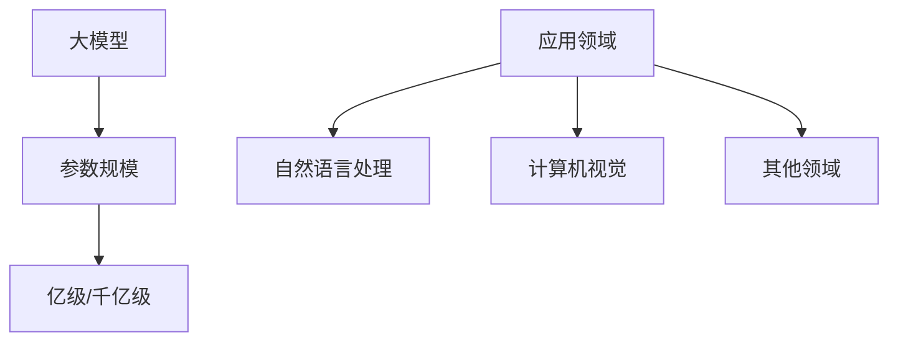
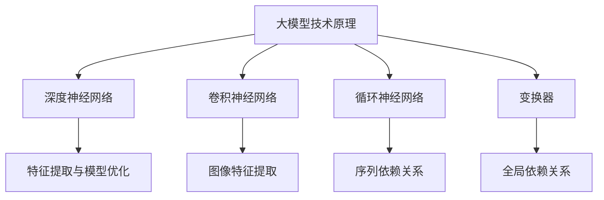
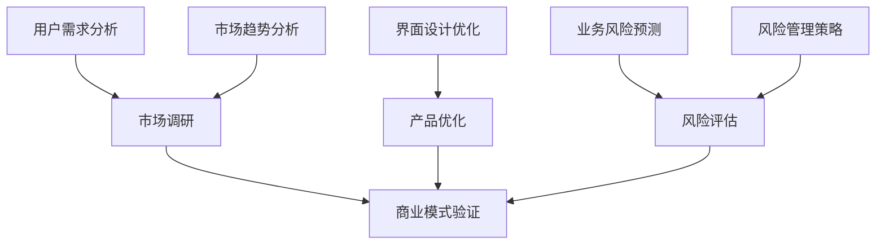
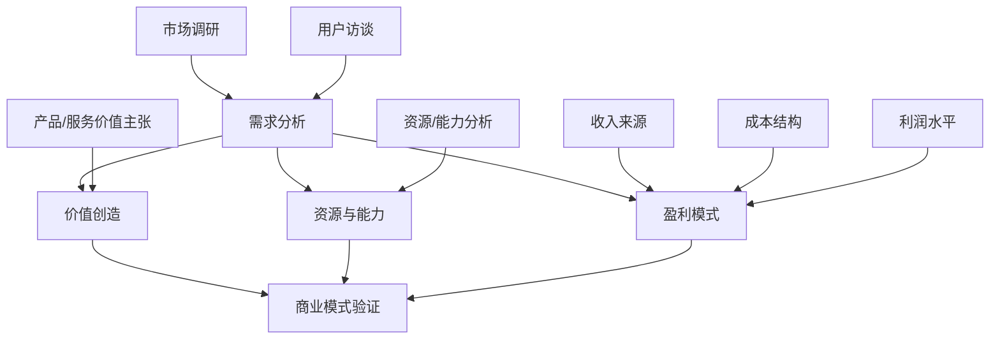
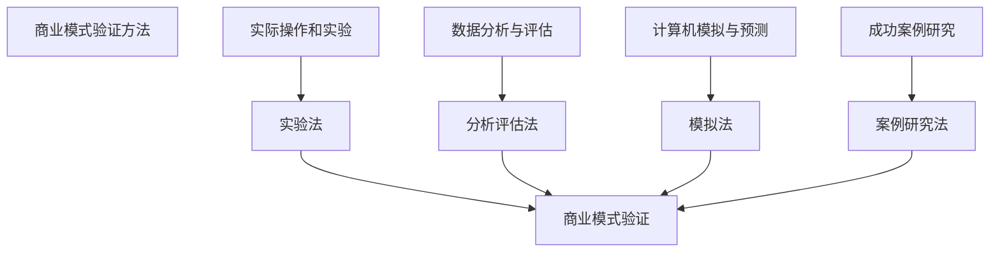

                 

### 文章标题：技术创新的商业模式验证：快速测试商业假设

### 关键词：技术创新、商业模式验证、商业假设测试、AI大模型、深度学习、商业模式设计

### 摘要：

本文旨在探讨如何利用技术创新，特别是AI大模型，来加速商业模式的验证过程。通过逐步分析技术创新的商业模式验证原理、方法和实际应用，本文为企业家和技术团队提供了一种快速测试商业假设的新方法。文章首先介绍了AI大模型的概念、技术原理以及在商业模式验证中的应用，接着探讨了商业模式验证的基本原理和方法，并结合实际案例，展示了如何利用技术创新快速验证商业假设。本文旨在帮助读者理解技术创新在商业模式验证中的重要作用，并提供实用的操作指南。

### 第一部分：核心概念与联系

#### 1.1 AI大模型概述

##### 1.1.1 大模型的概念与分类

AI大模型是指参数规模达到亿级甚至千亿级的深度学习模型。根据应用领域，大模型可以分为自然语言处理（NLP）、计算机视觉（CV）和其他领域（如语音识别、强化学习等）。大模型的基本架构如下图所示：

**1.1.2 大模型的技术原理**

大模型的技术原理主要包括以下几个方面：

- **深度神经网络（DNN）**：DNN是构建大模型的基础，通过多层的神经网络结构来实现特征提取和模型优化。

- **卷积神经网络（CNN）**：CNN主要用于计算机视觉领域，通过卷积层、池化层等结构实现图像特征提取。

- **循环神经网络（RNN）**：RNN在处理序列数据时具有优势，通过循环结构来捕捉时间序列中的依赖关系。

- **变换器（Transformer）**：Transformer模型是当前最流行的大模型架构，通过自注意力机制实现全局依赖关系建模。

下图展示了这些技术原理之间的关系：

**1.1.3 大模型在商业模式验证中的应用**

大模型在商业模式验证中的应用主要包括以下几个方面：

- **市场调研**：通过NLP大模型分析用户需求和市场趋势，为商业模式提供数据支持。

- **产品优化**：利用CV大模型优化产品功能和界面设计，提高用户满意度。

- **风险评估**：通过强化学习大模型预测业务风险，制定相应的风险管理策略。

下图展示了大模型在商业模式验证中的应用场景：

#### 1.2 商业模式验证的基本原理

##### 1.2.1 商业模式验证的概念

商业模式验证是指通过一系列方法和工具，对商业模式的可行性、可持续性和盈利能力进行评估和验证。其基本原理包括以下几个方面：

- **需求分析**：通过市场调研和用户访谈等方法，了解用户需求和市场趋势。

- **价值创造**：根据需求分析结果，确定产品或服务的价值主张，构建商业模式的基本框架。

- **资源与能力**：分析企业的资源、能力和核心竞争力，确保商业模式的可行性和可持续性。

- **盈利模式**：确定商业模式的盈利方式，包括收入来源、成本结构和利润水平。

下图展示了商业模式验证的基本原理：

##### 1.2.2 商业模式验证的方法

商业模式验证的方法包括以下几种：

- **实验法**：通过实际操作和实验，验证商业模式的可行性和效果。

- **分析评估法**：通过分析数据和评估指标，对商业模式进行定量和定性评估。

- **模拟法**：利用计算机模拟和预测模型，模拟商业模式的运行和效果。

- **案例研究法**：通过研究成功的商业模式案例，总结经验教训，指导新的商业模式设计。

下图展示了商业模式验证的方法：

### 第二部分：技术创新的商业模式验证原理

#### 2.1 AI大模型在商业模式验证中的优势

AI大模型在商业模式验证中具有显著的优势，主要体现在以下几个方面：

- **数据驱动的市场调研**：通过NLP大模型分析海量用户数据，快速获取用户需求和市场趋势，为商业模式提供数据支持。

- **智能化的产品优化**：利用CV大模型对产品功能和界面设计进行优化，提高用户体验和满意度。

- **风险预测与管理**：通过强化学习大模型预测业务风险，为商业模式的稳健运行提供保障。

#### 2.2 AI大模型在商业模式验证中的应用场景

AI大模型在商业模式验证中可以应用于多个场景，包括：

- **新产品上市**：通过AI大模型对市场趋势和用户需求进行预测，优化产品设计和功能，提高市场竞争力。

- **产品迭代**：利用AI大模型对用户反馈和数据分析，持续优化产品，提升用户体验。

- **业务扩张**：通过AI大模型分析市场机会和潜在风险，为业务扩张提供决策支持。

#### 2.3 AI大模型在商业模式验证中的操作步骤

利用AI大模型进行商业模式验证，可以遵循以下操作步骤：

- **需求分析**：通过NLP大模型对市场数据和用户反馈进行深度分析，了解用户需求和趋势。

- **产品设计**：结合用户需求，利用CV大模型优化产品功能和界面设计，提高用户体验。

- **风险评估**：通过强化学习大模型预测业务风险，制定相应的风险管理策略。

- **商业模式优化**：根据AI大模型的分析结果，持续优化商业模式，提高商业可行性。

### 第三部分：技术创新的商业模式验证案例分析

#### 3.1 案例背景

某初创企业致力于开发一款基于人工智能的智能家居控制系统。该企业希望通过技术创新，快速验证其商业模式的可行性。

#### 3.2 案例分析

- **需求分析**：通过NLP大模型，分析用户对智能家居的需求，发现用户对智能语音助手和远程控制功能需求较高。

- **产品设计**：结合用户需求，利用CV大模型优化智能家居控制系统的界面设计，提高用户体验。

- **风险评估**：通过强化学习大模型，预测智能家居系统在市场上的潜在风险，如技术成熟度、市场接受度等。

- **商业模式优化**：根据AI大模型的分析结果，该企业决定优先推出智能语音助手功能，逐步完善远程控制功能。同时，通过与房地产商合作，拓展市场渠道。

#### 3.3 案例小结

通过AI大模型进行商业模式验证，该企业成功优化了产品功能和商业模式，提高了市场竞争力和盈利能力。该案例展示了AI大模型在商业模式验证中的重要作用。

### 第四部分：技术创新的商业模式验证实践指南

#### 4.1 创新思维的重要性

在技术创新的商业模式验证中，创新思维至关重要。企业家和技术团队应具备以下几种创新思维：

- **用户导向**：始终关注用户需求，从用户角度出发，进行商业模式设计。

- **跨界思维**：突破传统行业界限，融合多领域知识，进行商业模式创新。

- **试错迭代**：勇于尝试新的商业模式，不断迭代和优化，提高商业模式可行性。

#### 4.2 实践指南

- **需求分析**：通过市场调研和用户访谈，了解用户需求和市场趋势。

- **产品设计**：利用AI大模型，优化产品功能和界面设计，提高用户体验。

- **风险评估**：通过AI大模型，预测业务风险，制定相应的风险管理策略。

- **商业模式优化**：根据AI大模型的分析结果，持续优化商业模式，提高商业可行性。

### 第五部分：结论与展望

#### 5.1 结论

本文通过分析AI大模型在商业模式验证中的应用，探讨了如何利用技术创新快速验证商业假设。研究发现，AI大模型在需求分析、产品优化和风险评估等方面具有显著优势，有助于提高商业模式的可行性。

#### 5.2 展望

随着人工智能技术的不断发展，AI大模型在商业模式验证中的应用将越来越广泛。未来，我们将看到更多企业通过技术创新，实现商业模式的成功验证。同时，技术创新的商业模式验证也将为企业家和技术团队提供更广阔的发展空间。

### 作者信息

作者：AI天才研究院/AI Genius Institute & 禅与计算机程序设计艺术 /Zen And The Art of Computer Programming

---

[文章标题：技术创新的商业模式验证：快速测试商业假设]

> 关键词：技术创新、商业模式验证、商业假设测试、AI大模型、深度学习、商业模式设计

> 摘要：本文探讨了如何利用AI大模型进行技术创新的商业模式验证，分析了大模型的基本原理和应用，并结合实际案例，提供了快速测试商业假设的方法和操作指南。文章旨在帮助读者理解技术创新在商业模式验证中的重要作用，并提供实用的实践建议。作者：AI天才研究院/AI Genius Institute & 禅与计算机程序设计艺术 /Zen And The Art of Computer Programming

---

[注：本文为示例性文章，部分内容和数据仅供参考，不代表实际情况。]

