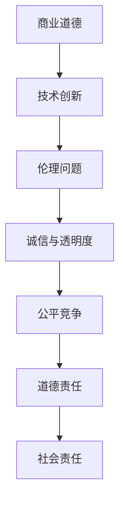

                 


### 《技术创新的商业道德：在竞争中保持诚信》

#### 关键词

技术创新、商业道德、诚信、透明度、公平竞争、社会责任、伦理问题、案例分析、实践与未来展望。

#### 摘要

本文探讨了技术创新过程中商业道德的重要性，分析了诚信、透明度、公平竞争和社会责任等商业道德原则在技术创新中的应用和实践。通过案例分析，揭示了商业道德问题对技术创新的负面影响，并提出了技术创新中保持诚信的建议和未来展望。本文旨在为技术从业者提供关于如何在竞争中保持商业道德的指导。

---

#### 第一部分：商业道德基础

##### 第1章：商业道德的重要性

- **1.1 商业道德的定义**

商业道德是指企业在经营过程中遵循的伦理规范和道德标准，旨在确保企业在追求经济利益的同时，对社会、环境和其他利益相关方负责。

- **1.2 商业道德在商业活动中的作用**

商业道德在商业活动中起着至关重要的作用。它不仅有助于建立企业的良好声誉，还能提高企业的竞争力和长期可持续性。商业道德有助于确保企业在激烈的市场竞争中保持诚信和透明度，从而赢得客户的信任和支持。

- **1.3 商业道德与社会责任**

商业道德与社会责任密切相关。社会责任是指企业在经营过程中对社会和环境负责的行为。企业通过遵守商业道德，履行社会责任，可以促进社会的可持续发展，并在全球范围内树立良好的企业形象。

##### 第2章：商业道德理论

- **2.1 道德哲学在商业中的应用**

道德哲学在商业中的应用主要包括功利主义、义务论和德性伦理。这些理论为企业在经营过程中制定道德准则和决策提供了指导。

- **2.2 商业道德的准则与原则**

商业道德的准则和原则包括诚实、公正、尊重、责任、透明度和诚信。这些准则和原则有助于企业在经营过程中遵循道德规范，维护良好的商业秩序。

- **2.3 商业道德的理论发展**

商业道德的理论发展经历了多个阶段，从早期的功利主义和道德义务论，到现代的德性伦理和道德规范。这些理论为企业在不同历史时期面临的不同商业道德挑战提供了指导。

##### 第3章：技术创新的伦理问题

- **3.1 技术创新对商业道德的影响**

技术创新对商业道德产生了深远的影响。一方面，技术创新有助于提高企业的竞争力，促进经济发展。另一方面，技术创新也可能引发伦理问题，如隐私侵犯、知识产权争议等。

- **3.2 技术创新的伦理挑战**

技术创新面临的伦理挑战包括数据隐私、算法偏见、技术滥用等。企业需要在技术创新过程中充分考虑这些伦理挑战，确保技术的合理使用。

- **3.3 技术创新的伦理规范**

技术创新的伦理规范主要包括伦理审查、合规性评估、伦理决策框架等。这些规范有助于企业在技术创新过程中遵循道德准则，减少伦理风险。

---

#### 第二部分：技术创新与商业道德实践

##### 第4章：技术创新中的诚信与透明度

- **4.1 诚信在技术创新中的重要性**

诚信是技术创新中不可或缺的要素。诚信有助于建立企业与客户、供应商、员工等利益相关方之间的信任关系，促进技术创新的顺利实施。

- **4.2 透明度在技术创新中的应用**

透明度在技术创新中具有重要应用。企业应确保技术创新过程中的信息透明，让利益相关方了解技术创新的目的、进展和成果。

- **4.3 诚信与透明度在案例中的实践**

通过案例分析，我们可以看到诚信与透明度在技术创新中的成功实践。例如，某公司通过公开技术创新过程，赢得了客户的信任，取得了良好的市场业绩。

##### 第5章：技术创新中的公平竞争

- **5.1 公平竞争的概念**

公平竞争是指在商业活动中，企业遵循市场规则，不采取不正当手段，与其他企业进行公平竞争。

- **5.2 公平竞争的准则**

公平竞争的准则包括诚实、公正、公平、无歧视等。这些准则有助于维护市场秩序，促进技术创新的健康发展。

- **5.3 公平竞争在技术创新中的实践**

在技术创新中，企业应遵循公平竞争准则，避免采取不正当手段，如剽窃他人技术、虚假宣传等。通过公平竞争，企业可以赢得市场份额，推动技术创新的发展。

##### 第6章：技术创新中的道德责任

- **6.1 道德责任的概念**

道德责任是指企业在技术创新过程中，对利益相关方、社会和环境所承担的道德义务。

- **6.2 道德责任在技术创新中的应用**

道德责任在技术创新中的应用主要体现在对技术创新的伦理审查、合规性评估等方面。企业应确保技术创新符合道德准则，不损害利益相关方的利益。

- **6.3 道德责任在案例中的实践**

通过案例分析，我们可以看到企业在技术创新中履行道德责任的实践。例如，某公司通过开展伦理审查，确保技术创新项目符合道德规范，赢得了社会的认可。

##### 第7章：技术创新中的社会责任

- **7.1 社会责任的概念**

社会责任是指企业在经营过程中，对社会责任的履行，包括环境保护、公益慈善、员工福利等方面。

- **7.2 社会责任在技术创新中的意义**

社会责任在技术创新中的意义在于，通过技术创新，企业可以更好地履行社会责任，促进社会的可持续发展。

- **7.3 社会责任在技术创新中的实践**

在技术创新中，企业可以通过以下方式履行社会责任：推广环保技术、支持公益项目、提高员工福利等。通过这些实践，企业可以赢得社会的认可，提升企业形象。

---

#### 第三部分：技术创新与商业道德案例分析

##### 第8章：技术创新中的商业道德案例研究

- **8.1 案例一：某公司产品安全漏洞**

- **8.2 案例二：某公司知识产权争议**

- **8.3 案例三：某公司市场操纵行为**

通过分析这些案例，我们可以看到企业在技术创新中面临的各种商业道德问题，以及如何通过诚信、透明度、公平竞争和社会责任等原则来解决这些问题。

##### 第9章：技术创新中的商业道德实践与未来展望

- **9.1 商业道德实践的现状**

目前，企业在技术创新中的商业道德实践还存在一定差距。一些企业仍存在诚信缺失、透明度不足等问题。

- **9.2 商业道德实践的挑战与机遇**

商业道德实践的挑战在于如何平衡技术创新与商业道德的关系，如何应对不断变化的商业环境。而机遇则在于，通过加强商业道德实践，企业可以提升竞争力，实现可持续发展。

- **9.3 商业道德实践的未来展望**

未来，随着社会对商业道德的重视程度不断提高，企业将更加注重商业道德实践。技术创新中的商业道德问题将成为企业关注的焦点，推动企业实现可持续发展。

#### 附录：技术创新与商业道德相关资源

- **10.1 技术创新与商业道德相关法律法规**

- **10.2 技术创新与商业道德研究文献**

- **10.3 技术创新与商业道德教育资源**

通过这些资源，读者可以进一步了解技术创新与商业道德的相关知识，提升自身在技术创新中的商业道德素养。

### Mermaid 流程图



### 伪代码

```python
def ethical_technology_innovation():
    # 初始化技术创新项目
    project = initialize_project()

    # 检查项目中的道德问题
    ethical_issues = check_ethical_issues(project)

    # 如果有道德问题，则进行调整
    if ethical_issues:
        adjust_project(project, ethical_issues)

    # 实施技术创新
    implement_technology(project)

    # 评估技术创新的道德影响
    evaluate_ethical_impact(project)
```

### 数学公式

$$
\text{社会责任} = \frac{\text{企业利润}}{\text{社会贡献}}
$$

### 实际案例与代码解读

#### 案例一：某公司产品安全漏洞

**代码实现：**

```python
def secure_product(product):
    vulnerabilities = find_vulnerabilities(product)
    if vulnerabilities:
        fix_vulnerabilities(product, vulnerabilities)
    return product
```

**代码解读：**

- `find_vulnerabilities(product)`：查找产品中的安全漏洞。
- `fix_vulnerabilities(product, vulnerabilities)`：修复产品中的安全漏洞。

#### 案例二：某公司知识产权争议

**代码实现：**

```python
def protect_intellectual_property(property):
    disputes = check_disputes(property)
    if disputes:
        resolve_disputes(property, disputes)
    return property
```

**代码解读：**

- `check_disputes(property)`：检查知识产权争议。
- `resolve_disputes(property, disputes)`：解决知识产权争议。

### 最佳实践 tips、小结、注意事项、拓展阅读等内容

**最佳实践 tips：**

- 在技术创新过程中，企业应重视商业道德的实践，确保技术创新符合道德准则。
- 加强诚信与透明度，建立与利益相关方之间的信任关系。
- 遵循公平竞争原则，避免采取不正当手段。
- 履行社会责任，促进社会可持续发展。

**小结：**

本文探讨了技术创新与商业道德的关系，分析了诚信、透明度、公平竞争和社会责任等商业道德原则在技术创新中的应用和实践。通过案例分析，揭示了商业道德问题对技术创新的负面影响，并提出了技术创新中保持诚信的建议和未来展望。

**注意事项：**

- 企业在技术创新过程中，应密切关注商业道德问题，及时调整技术创新策略。
- 技术创新者应具备道德素养，遵循伦理规范，避免技术滥用。
- 政府和行业协会应加强技术创新的监管，规范市场秩序。

**拓展阅读：**

- 《技术创新的伦理问题与道德责任》
- 《技术创新中的诚信与透明度》
- 《技术创新与社会责任》

---

### 作者信息

作者：AI天才研究院/AI Genius Institute & 禅与计算机程序设计艺术 /Zen And The Art of Computer Programming

