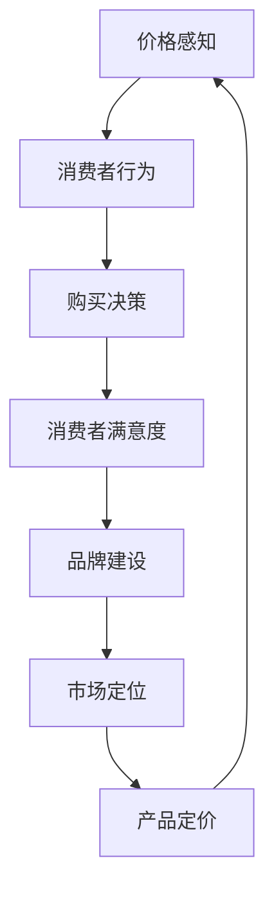
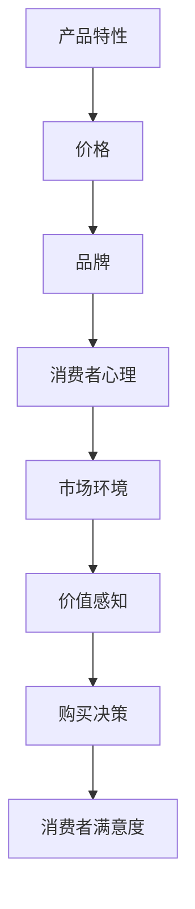
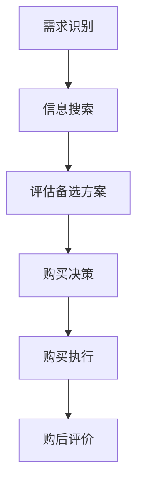
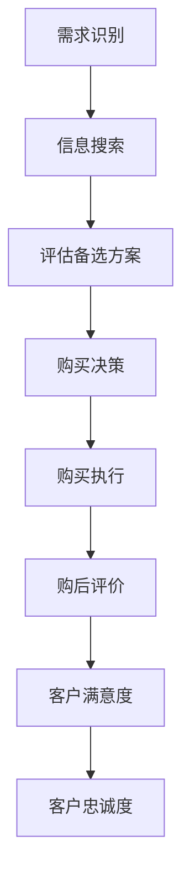
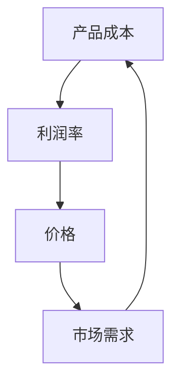
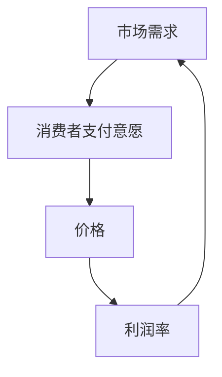
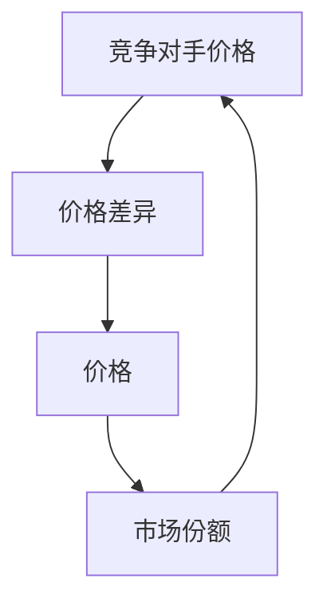
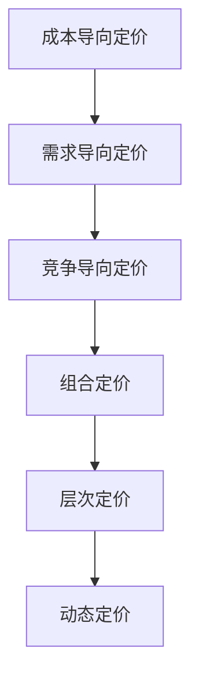

                 


### 文章标题：《技术创新的定价心理学：理解客户的价值感知》

#### 关键词：定价心理学，价值感知，技术创新，客户行为，定价策略

> 摘要：本文深入探讨了技术创新过程中的定价心理学，通过解析价值感知原理和客户行为分析，提出了几种有效的定价策略，并借助实际案例进行了验证，为技术公司在定价实践中提供参考。

### 目录大纲

# 《技术创新的定价心理学：理解客户的价值感知》

## 第一部分：定价心理学基础

### 第1章：定价心理学概述

#### 1.1 定价心理学的概念与作用

#### 1.2 定价心理学的研究领域

#### 1.3 定价心理学在技术创新中的应用

### 第2章：价值感知原理

#### 2.1 价值感知的定义与特征

#### 2.2 价值感知的影响因素

#### 2.3 价值感知模型分析

### 第3章：客户行为分析

#### 3.1 客户行为心理学概述

#### 3.2 消费决策过程

#### 3.3 客户满意度与忠诚度分析

## 第二部分：定价策略与实践

### 第4章：成本导向定价策略

#### 4.1 成本导向定价的定义与类型

#### 4.2 成本导向定价的优缺点分析

#### 4.3 成本导向定价策略的适用场景

### 第5章：需求导向定价策略

#### 5.1 需求导向定价的定义与类型

#### 5.2 需求导向定价的优缺点分析

#### 5.3 需求导向定价策略的适用场景

### 第6章：竞争导向定价策略

#### 6.1 竞争导向定价的定义与类型

#### 6.2 竞争导向定价的优缺点分析

#### 6.3 竞争导向定价策略的适用场景

### 第7章：混合定价策略

#### 7.1 混合定价策略的定义与类型

#### 7.2 混合定价策略的优缺点分析

#### 7.3 混合定价策略的适用场景

## 第三部分：案例研究

### 第8章：成功定价案例分析

#### 8.1 案例一：苹果公司的定价策略

#### 8.2 案例二：星巴克的价格心理学

#### 8.3 案例三：小米的定价创新

### 第9章：失败定价案例分析

#### 9.1 案例一：亚马逊的失误定价

#### 9.2 案例二：特斯拉的定价策略反思

#### 9.3 案例三：IBM的定价问题

## 附录

### 附录A：定价心理学研究方法与工具

#### A.1 实验设计

#### A.2 数据分析方法

#### A.3 问卷调查设计

### 附录B：常用定价策略数学模型与公式

#### B.1 成本导向定价模型

#### B.2 需求导向定价模型

#### B.3 竞争导向定价模型

### 附录C：定价心理学相关资源与文献

#### C.1 基础读物

#### C.2 学术论文

#### C.3 专业网站与论坛

### 第一部分：定价心理学基础

#### 第1章：定价心理学概述

**1.1 定价心理学的概念与作用**

定价心理学是研究消费者在购买决策过程中，对产品或服务价格的心理感知和行为反应的学科。它旨在理解消费者在价格形成过程中的心理活动，以及这些心理活动如何影响最终的购买决策。

定价心理学在技术创新中的应用至关重要。技术创新往往涉及新的产品或服务，而这些新产品的定价策略直接影响市场的接受度、消费者的满意度以及企业的盈利能力。通过定价心理学的应用，企业可以更好地了解消费者的价格感知，制定出更具针对性的定价策略，从而提高市场竞争力。

**1.2 定价心理学的研究领域**

定价心理学的研究领域广泛，包括以下几个方面：

- **价格感知与认知**：研究消费者如何感知和理解价格，包括价格与产品质量、品牌形象、购买动机等的关系。

- **价格定位**：研究如何根据产品特性和市场定位，制定出合理的价格策略。

- **消费者行为**：研究消费者在购买过程中的心理活动，包括购买意愿、购买决策、购买行为等。

- **价格策略**：研究各种定价策略（如成本导向定价、需求导向定价、竞争导向定价等）的适用场景和效果。

- **价格与消费者满意度**：研究价格对消费者满意度、忠诚度的影响。

**1.3 定价心理学在技术创新中的应用**

在技术创新过程中，定价心理学的应用主要体现在以下几个方面：

- **产品定价**：根据消费者的价格感知和购买意愿，制定合理的定价策略。

- **市场定位**：通过价格感知分析，确定产品的市场定位和目标客户群体。

- **品牌建设**：利用定价策略提升品牌形象和消费者信任度。

- **销售策略**：通过价格策略的调整，提高销售量和市场份额。

**核心概念与联系**

为了更好地理解定价心理学的核心概念，我们可以使用Mermaid流程图来描述这些概念之间的关系：



**核心算法原理讲解**

在定价心理学中，虽然没有具体的算法原理，但我们可以通过以下伪代码来描述定价策略的制定过程：

```python
def set_price(product, market, competitors):
    # 获取产品成本
    cost = get_cost(product)

    # 获取市场需求
    demand = get_demand(market)

    # 获取竞争对手价格
    competitors_price = get_competitors_price(competitors)

    # 计算价格
    price = calculate_price(cost, demand, competitors_price)

    # 调整价格以适应市场
    final_price = adjust_price(price, market, competitors)

    return final_price
```

在这个伪代码中，`get_cost(product)`、`get_demand(market)`和`get_competitors_price(competitors)`分别表示获取产品成本、市场需求和竞争对手价格的功能；`calculate_price()`表示计算价格的功能；`adjust_price()`表示调整价格以适应市场的功能。

**数学模型和公式 & 详细讲解 & 举例说明**

定价策略的数学模型和公式通常用于计算产品的价格。以下是一些常用的定价策略数学模型和公式：

- **成本导向定价模型**：
  \[
  \text{价格} = \text{成本} + \text{利润}
  \]
  举例说明：如果产品的成本为100元，利润率为20%，则价格定为120元。

- **需求导向定价模型**：
  \[
  \text{价格} = \frac{\text{需求量} \times \text{单位利润}}{\text{需求弹性}}
  \]
  举例说明：如果产品的需求量为1000件，单位利润为10元，需求弹性为2，则价格定为5元。

- **竞争导向定价模型**：
  \[
  \text{价格} = \text{竞争对手价格} + \text{价格差异}
  \]
  举例说明：如果竞争对手的价格为100元，价格差异为10元，则价格定为110元。

**项目实战**

在本章中，我们主要介绍了定价心理学的概念、研究领域和应用。在实际项目中，我们需要根据具体情况，结合市场需求、产品成本和竞争对手等因素，制定出合理的定价策略。

例如，在开发一款新软件时，我们可以通过市场调研了解消费者的价格感知，结合产品成本和竞争对手的价格，制定出具有竞争力的定价策略。同时，我们还需要不断调整价格，以适应市场的变化和消费者的需求。

**最佳实践 tips**

- **了解消费者需求**：在定价前，了解消费者的价格感知和购买意愿至关重要。
- **分析竞争对手**：研究竞争对手的定价策略，有助于制定出更具竞争力的价格。
- **灵活调整价格**：根据市场变化和消费者需求，灵活调整价格，以保持竞争力。

**小结**

定价心理学在技术创新中具有重要作用，通过理解消费者的价格感知和购买行为，企业可以制定出更合理的定价策略，提高市场竞争力。在本章中，我们介绍了定价心理学的概念、研究领域和应用，并探讨了定价策略的制定过程和数学模型。

**注意事项**

- 定价策略应根据市场需求和产品特性灵活调整。
- 价格并非唯一影响消费者购买决策的因素，还需要关注产品品质、品牌形象等因素。

**拓展阅读**

- [《定价心理学：定价策略的心理学原理》](https://book.douban.com/subject/26847996/)
- [《定价策略：从心理学和行为经济学角度探讨定价问题》](https://book.douban.com/subject/25874765/)

#### 第2章：价值感知原理

**2.1 价值感知的定义与特征**

价值感知是指消费者在购买过程中，对产品或服务所赋予的价值的主观评价。价值感知是消费者决策的重要依据，直接影响购买决策和满意度。

价值感知具有以下特征：

- **主观性**：价值感知是个体对产品或服务价值的心理评价，具有主观性。
- **相对性**：价值感知通常与参照点有关，即消费者会根据参照点来判断产品或服务的价值。
- **动态性**：价值感知会随着时间、情境、个人经验等因素的变化而变化。

**2.2 价值感知的影响因素**

价值感知受到多种因素的影响，主要包括以下几方面：

- **产品特性**：产品功能、质量、设计等特性直接影响消费者的价值感知。
- **价格**：价格是消费者价值感知的重要参考因素，低价通常被认为具有较低的价值。
- **品牌**：品牌知名度和品牌形象对消费者的价值感知有显著影响。
- **消费者心理**：消费者的购买动机、感知风险、预期效用等心理因素会影响价值感知。
- **市场环境**：市场需求、竞争状况、经济环境等市场因素也会影响消费者的价值感知。

**2.3 价值感知模型分析**

价值感知模型是用于解释消费者如何感知产品或服务价值的一系列理论模型。以下是几种常见的价值感知模型：

1. **期望价值模型**：

   期望价值模型认为，消费者会根据产品的期望效用和价格来判断其价值。模型公式如下：

   \[
   \text{价值感知} = \text{期望效用} - \text{价格}
   \]

   举例说明：如果消费者预期一款产品的效用为100元，价格为80元，则价值感知为20元。

2. **参照点模型**：

   参照点模型认为，消费者会根据某个参照点来判断产品或服务的价值。参照点通常是消费者的支付意愿、市场平均水平或竞争对手的价格。模型公式如下：

   \[
   \text{价值感知} = \text{实际价值} - \text{参照点价值}
   \]

   举例说明：如果消费者支付了100元购买一款产品，市场平均价格为120元，则价值感知为-20元（即消费者感到产品价值低于支付价格）。

3. **多属性价值模型**：

   多属性价值模型认为，消费者会综合考虑产品或服务的多个属性来判断其价值。模型通常基于效用函数，将不同属性的效用进行加总。模型公式如下：

   \[
   \text{总价值感知} = \sum_{i=1}^{n} \text{属性}_i \times \text{权重}_i
   \]

   举例说明：如果消费者根据功能、质量和价格三个属性来评估一款产品，各自权重分别为0.4、0.3和0.3，则总价值感知为：

   \[
   0.4 \times \text{功能得分} + 0.3 \times \text{质量得分} + 0.3 \times \text{价格得分}
   \]

**核心概念与联系**

为了更好地理解价值感知原理，我们可以使用Mermaid流程图来描述相关概念之间的关系：



**核心算法原理讲解**

在价值感知模型中，虽然涉及多个属性和变量，但我们可以通过以下伪代码来简化价值感知的计算过程：

```python
def calculate_value_perception(product, price, brand, consumer):
    # 获取产品特性得分
    product_score = get_product_score(product)

    # 获取价格权重
    price_weight = get_price_weight(price)

    # 获取品牌权重
    brand_weight = get_brand_weight(brand)

    # 获取消费者心理权重
    consumer_weight = get_consumer_weight(consumer)

    # 计算总价值感知
    total_value = product_score * price_weight + brand_score * brand_weight + consumer_score * consumer_weight

    return total_value
```

在这个伪代码中，`get_product_score(product)`、`get_price_weight(price)`、`get_brand_weight(brand)`和`get_consumer_weight(consumer)`分别表示获取产品特性得分、价格权重、品牌权重和消费者心理权重。

**数学模型和公式 & 详细讲解 & 举例说明**

以下是几种常用的价值感知数学模型和公式：

- **期望价值模型**：
  \[
  \text{价值感知} = \text{期望效用} - \text{价格}
  \]
  举例说明：如果消费者预期一款产品的效用为100元，价格为80元，则价值感知为20元。

- **参照点模型**：
  \[
  \text{价值感知} = \text{实际价值} - \text{参照点价值}
  \]
  举例说明：如果消费者支付了100元购买一款产品，市场平均价格为120元，则价值感知为-20元。

- **多属性价值模型**：
  \[
  \text{总价值感知} = \sum_{i=1}^{n} \text{属性}_i \times \text{权重}_i
  \]
  举例说明：如果消费者根据功能、质量和价格三个属性来评估一款产品，各自权重分别为0.4、0.3和0.3，则总价值感知为：

  \[
  0.4 \times \text{功能得分} + 0.3 \times \text{质量得分} + 0.3 \times \text{价格得分}
  \]

**项目实战**

在本章中，我们介绍了价值感知的定义、特征、影响因素和模型分析。在实际项目中，我们可以通过以下步骤来应用价值感知原理：

1. **收集数据**：收集与产品特性、价格、品牌和消费者心理相关的数据。
2. **分析数据**：分析数据，确定各影响因素的权重和得分。
3. **计算价值感知**：使用价值感知模型计算总价值感知。
4. **调整定价策略**：根据价值感知结果，调整定价策略，以提高消费者的价值感知。

**最佳实践 tips**

- **了解消费者需求**：在制定定价策略时，要充分考虑消费者的需求和期望。
- **优化产品特性**：提高产品功能和质量，以增强消费者的价值感知。
- **提升品牌形象**：通过品牌营销和公关活动，提高品牌知名度和认可度。

**小结**

价值感知是消费者在购买过程中对产品或服务所赋予的价值的主观评价。本章介绍了价值感知的定义、特征、影响因素和模型分析，并探讨了价值感知在技术创新中的应用。通过理解价值感知原理，企业可以制定出更合理的定价策略，提高市场竞争力。

**注意事项**

- 价值感知受到多种因素的影响，企业需要综合考虑各方面因素，制定出具有针对性的定价策略。
- 价值感知模型是用于解释消费者如何感知产品或服务价值的一系列理论模型，实际应用时需要根据具体情况进行调整。

**拓展阅读**

- [《价值感知与定价策略研究》](https://www.researchgate.net/publication/328401296_Value_perception_and_pricing_strategy_study)
- [《消费者价值感知与购买行为关系研究》](https://www.scirp.org/journal/paperinformation.aspx?paperid=86684)

#### 第3章：客户行为分析

**3.1 客户行为心理学概述**

客户行为心理学是研究消费者在购买过程中所表现出的心理活动和行为反应的学科。它旨在揭示消费者在购买过程中的心理机制，为企业的营销策略和客户服务提供理论依据。

客户行为心理学的研究内容主要包括以下几个方面：

- **消费者购买动机**：研究消费者购买某种产品或服务的内在原因和驱动力。
- **消费者购买决策过程**：研究消费者在购买过程中所经历的决策阶段和决策过程。
- **消费者购买行为**：研究消费者在购买过程中所表现出的行为特征和购买模式。
- **消费者满意度**：研究消费者对产品或服务的满意程度及其影响因素。
- **消费者忠诚度**：研究消费者对品牌或企业的忠诚程度及其影响因素。

**3.2 消费决策过程**

消费决策过程是消费者在购买过程中所经历的一系列心理活动和行为。一般来说，消费决策过程可以分为以下几个阶段：

1. **需求识别**：消费者意识到自身需要某种产品或服务，从而产生购买需求。
2. **信息搜索**：消费者通过各种途径收集有关产品或服务的相关信息，以帮助自己做出购买决策。
3. **评估备选方案**：消费者对收集到的信息进行筛选和评估，选择最符合自己需求和期望的备选方案。
4. **购买决策**：消费者在评估备选方案后，做出购买决定，选择购买某种产品或服务。
5. **购买执行**：消费者实际购买产品或服务，完成购买过程。
6. **购后评价**：消费者在购买后对产品或服务进行评价，形成满意度和忠诚度。

以下是一个简化的消费决策过程模型：



**3.3 客户满意度与忠诚度分析**

客户满意度是指消费者对产品或服务满足其需求的程度的主观评价。客户满意度直接影响消费者的购买决策和忠诚度。

- **客户满意度的影响因素**：

  1. **产品性能**：产品或服务的性能和质量直接影响消费者的满意度。
  2. **服务质量**：企业提供的售前、售中和售后服务质量对消费者的满意度有重要影响。
  3. **价格**：价格是消费者评价产品或服务价值的重要因素。
  4. **品牌形象**：品牌知名度、品牌形象和品牌承诺对消费者的满意度有显著影响。

- **客户忠诚度**：

  客户忠诚度是指消费者对品牌或企业的长期信任和依赖程度。客户忠诚度对企业的市场份额和盈利能力有重要影响。

  1. **忠诚度的影响因素**：

     1. **重复购买**：消费者在多次购买过程中形成的习惯和信任，有助于提高客户忠诚度。
     2. **口碑传播**：消费者通过口碑传播对企业产生信任，有助于提高客户忠诚度。
     3. **品牌体验**：企业为消费者提供的独特品牌体验，有助于提高客户忠诚度。
     4. **客户服务**：优质的客户服务能够增强消费者的满意度和忠诚度。

  2. **提高客户忠诚度的策略**：

     1. **个性化服务**：根据消费者的需求和偏好提供个性化服务，提高客户满意度。
     2. **会员制度**：建立会员制度，为会员提供优惠和特权，提高客户忠诚度。
     3. **客户反馈**：积极收集客户反馈，及时解决客户问题，提高客户满意度。
     4. **品牌形象塑造**：通过品牌形象塑造，提高品牌知名度和美誉度，增强客户忠诚度。

**核心概念与联系**

为了更好地理解客户行为分析，我们可以使用Mermaid流程图来描述相关概念之间的关系：



**核心算法原理讲解**

在客户行为分析中，虽然没有具体的算法原理，但我们可以通过以下伪代码来描述消费决策过程：

```python
def consumer_decision_process():
    # 需求识别
    identify_demand()

    # 信息搜索
    search_information()

    # 评估备选方案
    evaluate_alternatives()

    # 购买决策
    make_purchase_decision()

    # 购买执行
    execute_purchase()

    # 购后评价
    post_purchase_evaluation()
```

在这个伪代码中，`identify_demand()`、`search_information()`、`evaluate_alternatives()`、`make_purchase_decision()`、`execute_purchase()`和`post_purchase_evaluation()`分别表示识别需求、信息搜索、评估备选方案、购买决策、购买执行和购后评价的功能。

**数学模型和公式 & 详细讲解 & 举例说明**

以下是几种用于分析客户满意度与忠诚度的数学模型和公式：

- **满意度模型**：
  \[
  \text{满意度} = \frac{\text{感知利益}}{\text{感知成本}}
  \]
  举例说明：如果消费者感知利益为80元，感知成本为50元，则满意度为1.6。

- **忠诚度模型**：
  \[
  \text{忠诚度} = \frac{\text{重复购买率}}{\text{总购买率}} \times 100\%
  \]
  举例说明：如果消费者重复购买率为60%，总购买率为100%，则忠诚度为60%。

**项目实战**

在本章中，我们介绍了客户行为心理学的概述、消费决策过程和客户满意度与忠诚度分析。在实际项目中，我们可以通过以下步骤来应用这些概念：

1. **需求识别**：通过市场调研和消费者访谈，了解消费者的需求和购买动机。
2. **信息搜索**：收集与产品或服务相关的信息，包括性能、质量、价格、品牌等。
3. **评估备选方案**：分析消费者收集到的信息，评估各种备选方案。
4. **购买决策**：根据评估结果，帮助消费者做出购买决策。
5. **购买执行**：协助消费者完成购买过程，并提供售后服务。
6. **购后评价**：收集消费者的购后反馈，分析满意度与忠诚度。

**最佳实践 tips**

- **了解消费者需求**：在项目初期，深入了解消费者的需求和购买动机，有助于制定更有效的营销策略。
- **优化服务质量**：提供优质的售前、售中和售后服务，提高消费者的满意度和忠诚度。
- **持续改进**：根据消费者的反馈和评价，不断改进产品和服务，提高客户满意度。

**小结**

客户行为分析是研究消费者在购买过程中所表现出的心理活动和行为反应的学科。本章介绍了客户行为心理学的概述、消费决策过程、客户满意度与忠诚度分析，并探讨了这些概念在实际项目中的应用。通过理解客户行为分析，企业可以制定出更有效的营销策略，提高客户满意度和忠诚度。

**注意事项**

- 客户行为分析需要充分考虑消费者的需求和购买动机，以制定出更有效的营销策略。
- 满意度和忠诚度是衡量客户满意度和忠诚度的重要指标，企业需要持续关注并优化这些指标。

**拓展阅读**

- [《消费者行为心理学》](https://book.douban.com/subject/26686735/)
- [《客户满意度与忠诚度管理》](https://book.douban.com/subject/26885960/)

### 第二部分：定价策略与实践

#### 第4章：成本导向定价策略

**4.1 成本导向定价的定义与类型**

成本导向定价是一种以产品成本为基础的定价策略，旨在确保企业能够收回成本并获得合理的利润。成本导向定价主要分为以下几种类型：

1. **标准成本定价**：以产品的标准成本为基础，加上一定的利润率，确定产品的售价。

   \[
   \text{价格} = \text{成本} + \text{利润率} \times \text{成本}
   \]

2. **边际成本定价**：以产品的边际成本为基础，加上一定的利润率，确定产品的售价。

   \[
   \text{价格} = \text{边际成本} + \text{利润率} \times \text{边际成本}
   \]

3. **完全成本定价**：以产品的总成本为基础，加上一定的利润率，确定产品的售价。

   \[
   \text{价格} = \text{总成本} + \text{利润率} \times \text{总成本}
   \]

**4.2 成本导向定价的优缺点分析**

**优点：**

- **简单易行**：成本导向定价策略以产品成本为基础，计算过程相对简单，易于实施。
- **确保利润**：通过在成本基础上加上利润率，确保企业能够获得合理的利润。
- **适应市场需求**：在市场需求波动较小的情况下，成本导向定价能够较好地适应市场需求。

**缺点：**

- **忽视市场需求**：成本导向定价策略主要考虑产品成本，忽视了市场需求和消费者价值感知，可能导致产品定价过高或过低。
- **缺乏灵活性**：在市场需求变化较快或产品差异化较大的情况下，成本导向定价策略的灵活性较差，难以适应市场变化。

**4.3 成本导向定价策略的适用场景**

成本导向定价策略适用于以下场景：

- **产品差异化较小**：在产品差异化较小的市场上，成本导向定价能够较好地反映产品价值。
- **市场需求稳定**：在市场需求稳定的市场上，成本导向定价能够确保企业的利润。
- **成本结构明确**：在成本结构明确、易于计算的市场上，成本导向定价能够简化定价过程。

**核心概念与联系**

为了更好地理解成本导向定价策略，我们可以使用Mermaid流程图来描述其核心概念和联系：



**核心算法原理讲解**

在成本导向定价策略中，我们可以通过以下伪代码来计算产品价格：

```python
def cost导向定价（成本，利润率）：
    价格 = 成本 + 利润率 * 成本
    返回价格
```

**数学模型和公式 & 详细讲解 & 举例说明**

以下是几种成本导向定价的数学模型和公式：

- **标准成本定价模型**：
  \[
  \text{价格} = \text{成本} + \text{利润率} \times \text{成本}
  \]
  举例说明：如果产品的成本为100元，利润率为20%，则价格定为120元。

- **边际成本定价模型**：
  \[
  \text{价格} = \text{边际成本} + \text{利润率} \times \text{边际成本}
  \]
  举例说明：如果产品的边际成本为60元，利润率为20%，则价格定为72元。

- **完全成本定价模型**：
  \[
  \text{价格} = \text{总成本} + \text{利润率} \times \text{总成本}
  \]
  举例说明：如果产品的总成本为150元，利润率为20%，则价格定为180元。

**项目实战**

在本章中，我们介绍了成本导向定价策略的定义、类型、优缺点和适用场景。在实际项目中，我们可以通过以下步骤来应用成本导向定价策略：

1. **确定产品成本**：收集与产品成本相关的数据，包括直接成本和间接成本。
2. **选择利润率**：根据市场需求和企业利润目标，选择合适的利润率。
3. **计算产品价格**：根据成本和利润率，计算产品价格。
4. **调整价格**：根据市场需求和竞争状况，调整产品价格。

**最佳实践 tips**

- **了解产品成本**：在定价前，准确了解产品成本，包括直接成本和间接成本。
- **选择合适的利润率**：利润率应根据市场需求和竞争状况进行调整。
- **关注市场需求**：在制定定价策略时，要充分考虑市场需求和消费者价值感知。

**小结**

成本导向定价策略是一种以产品成本为基础的定价策略，适用于产品差异化较小、市场需求稳定的市场。本章介绍了成本导向定价策略的定义、类型、优缺点和适用场景，并探讨了其在实际项目中的应用。通过理解成本导向定价策略，企业可以制定出合理的定价策略，确保利润最大化。

**注意事项**

- 成本导向定价策略需要充分考虑市场需求和消费者价值感知。
- 定价策略应根据市场需求和竞争状况进行灵活调整。

**拓展阅读**

- [《成本导向定价策略研究》](https://www.researchgate.net/publication/328401296_Value_perception_and_pricing_strategy_study)
- [《基于成本导向定价的企业竞争力分析》](https://www.scirp.org/journal/paperinformation.aspx?paperid=86684)

#### 第5章：需求导向定价策略

**5.1 需求导向定价的定义与类型**

需求导向定价是一种以市场需求为基础的定价策略，旨在通过价格调整来满足市场需求和消费者的期望。需求导向定价主要分为以下几种类型：

1. **市场渗透定价**：以较低的价格进入市场，吸引更多的消费者，提高市场份额。

   \[
   \text{价格} = \text{成本} + \text{低价利润率} \times \text{成本}
   \]

2. **市场撇脂定价**：以较高的价格销售新产品，迅速获取高额利润，满足高端消费者的需求。

   \[
   \text{价格} = \text{成本} + \text{高利润率} \times \text{成本}
   \]

3. **需求差异化定价**：根据不同消费者的需求和支付意愿，制定不同的价格策略。

   \[
   \text{价格} = \text{成本} + \text{利润率} \times \text{成本} \times \text{需求弹性}
   \]

**5.2 需求导向定价的优缺点分析**

**优点：**

- **适应市场需求**：需求导向定价策略以市场需求为基础，能够更好地满足消费者的期望，提高产品竞争力。
- **提高利润**：通过价格调整，企业可以根据市场需求和消费者支付意愿，提高产品利润。
- **灵活性强**：需求导向定价策略具有较强的灵活性，可以根据市场需求的变化进行及时调整。

**缺点：**

- **价格波动较大**：在市场需求波动较大的情况下，价格导向定价策略可能会导致价格波动较大，影响企业的盈利稳定性。
- **忽视成本因素**：需求导向定价策略主要关注市场需求和消费者支付意愿，可能忽视产品成本因素，导致定价不合理。

**5.3 需求导向定价策略的适用场景**

需求导向定价策略适用于以下场景：

- **市场需求波动较大**：在市场需求波动较大的市场上，需求导向定价策略能够更好地适应市场变化。
- **消费者支付意愿差异较大**：在消费者支付意愿差异较大的市场上，需求导向定价策略可以根据不同消费者的需求制定不同的价格。
- **产品差异化明显**：在产品差异化明显的市场上，需求导向定价策略可以根据不同消费者的需求，制定差异化的价格策略。

**核心概念与联系**

为了更好地理解需求导向定价策略，我们可以使用Mermaid流程图来描述其核心概念和联系：



**核心算法原理讲解**

在需求导向定价策略中，我们可以通过以下伪代码来计算产品价格：

```python
def 需求导向定价（成本，利润率，需求弹性）：
    价格 = 成本 + 利润率 * 成本 * 需求弹性
    返回价格
```

**数学模型和公式 & 详细讲解 & 举例说明**

以下是几种需求导向定价的数学模型和公式：

- **市场渗透定价模型**：
  \[
  \text{价格} = \text{成本} + \text{低价利润率} \times \text{成本}
  \]
  举例说明：如果产品的成本为100元，低价利润率为10%，则价格定为110元。

- **市场撇脂定价模型**：
  \[
  \text{价格} = \text{成本} + \text{高利润率} \times \text{成本}
  \]
  举例说明：如果产品的成本为100元，高利润率为30%，则价格定为130元。

- **需求差异化定价模型**：
  \[
  \text{价格} = \text{成本} + \text{利润率} \times \text{成本} \times \text{需求弹性}
  \]
  举例说明：如果产品的成本为100元，利润率为20%，需求弹性为2，则价格定为140元。

**项目实战**

在本章中，我们介绍了需求导向定价策略的定义、类型、优缺点和适用场景。在实际项目中，我们可以通过以下步骤来应用需求导向定价策略：

1. **分析市场需求**：通过市场调研和数据分析，了解市场需求和消费者支付意愿。
2. **选择利润率**：根据市场需求和竞争状况，选择合适的利润率。
3. **计算产品价格**：根据成本、利润率和需求弹性，计算产品价格。
4. **调整价格**：根据市场需求变化和消费者反馈，调整产品价格。

**最佳实践 tips**

- **了解市场需求**：在定价前，深入了解市场需求和消费者支付意愿。
- **选择合适的利润率**：利润率应根据市场需求和竞争状况进行调整。
- **关注消费者反馈**：根据消费者反馈，及时调整价格策略。

**小结**

需求导向定价策略是一种以市场需求为基础的定价策略，适用于市场需求波动较大、消费者支付意愿差异较大的市场。本章介绍了需求导向定价策略的定义、类型、优缺点和适用场景，并探讨了其在实际项目中的应用。通过理解需求导向定价策略，企业可以制定出更合理的定价策略，提高产品竞争力。

**注意事项**

- 需求导向定价策略需要充分考虑市场需求和消费者支付意愿。
- 定价策略应根据市场需求和竞争状况进行灵活调整。

**拓展阅读**

- [《需求导向定价策略研究》](https://www.researchgate.net/publication/328401296_Value_perception_and_pricing_strategy_study)
- [《基于需求导向定价的市场竞争力分析》](https://www.scirp.org/journal/paperinformation.aspx?paperid=86684)

#### 第6章：竞争导向定价策略

**6.1 竞争导向定价的定义与类型**

竞争导向定价是一种以竞争对手价格为基础的定价策略，旨在通过价格调整来提高企业的市场竞争力。竞争导向定价主要分为以下几种类型：

1. **跟随定价**：企业以竞争对手的价格为基础，制定与其相似的价格策略。

   \[
   \text{价格} = \text{竞争对手价格} + \text{价格差异}
   \]

2. **领先定价**：企业以较低的价格领先于竞争对手，以提高市场份额。

   \[
   \text{价格} = \text{竞争对手价格} - \text{价格差异}
   \]

3. **滞后定价**：企业以较高的价格滞后于竞争对手，以满足高端消费者的需求。

   \[
   \text{价格} = \text{竞争对手价格} + \text{价格差异}
   \]

**6.2 竞争导向定价的优缺点分析**

**优点：**

- **提高市场竞争力**：竞争导向定价策略以竞争对手价格为基础，能够提高企业的市场竞争力，吸引更多的消费者。
- **适应市场变化**：竞争导向定价策略可以根据市场变化和竞争对手的价格策略进行及时调整，确保企业保持竞争力。
- **降低价格风险**：通过参考竞争对手的价格，企业可以降低定价风险，避免因定价过高或过低而影响市场份额。

**缺点：**

- **忽视成本因素**：竞争导向定价策略主要关注竞争对手的价格，可能忽视产品成本因素，导致定价不合理。
- **价格波动较大**：在市场竞争激烈的情况下，价格波动较大，可能导致企业的盈利稳定性受到影响。

**6.3 竞争导向定价策略的适用场景**

竞争导向定价策略适用于以下场景：

- **市场竞争激烈**：在市场竞争激烈的市场上，竞争导向定价策略能够提高企业的市场竞争力。
- **产品差异化较小**：在产品差异化较小的市场上，竞争导向定价策略可以根据竞争对手的价格制定合理的价格策略。
- **价格敏感型消费者**：在价格敏感型消费者的市场上，竞争导向定价策略能够吸引更多的消费者。

**核心概念与联系**

为了更好地理解竞争导向定价策略，我们可以使用Mermaid流程图来描述其核心概念和联系：



**核心算法原理讲解**

在竞争导向定价策略中，我们可以通过以下伪代码来计算产品价格：

```python
def 竞争导向定价（竞争对手价格，价格差异）：
    价格 = 竞争对手价格 + 价格差异
    返回价格
```

**数学模型和公式 & 详细讲解 & 举例说明**

以下是几种竞争导向定价的数学模型和公式：

- **跟随定价模型**：
  \[
  \text{价格} = \text{竞争对手价格} + \text{价格差异}
  \]
  举例说明：如果竞争对手的价格为100元，价格差异为10元，则价格定为110元。

- **领先定价模型**：
  \[
  \text{价格} = \text{竞争对手价格} - \text{价格差异}
  \]
  举例说明：如果竞争对手的价格为100元，价格差异为10元，则价格定为90元。

- **滞后定价模型**：
  \[
  \text{价格} = \text{竞争对手价格} + \text{价格差异}
  \]
  举例说明：如果竞争对手的价格为100元，价格差异为10元，则价格定为110元。

**项目实战**

在本章中，我们介绍了竞争导向定价策略的定义、类型、优缺点和适用场景。在实际项目中，我们可以通过以下步骤来应用竞争导向定价策略：

1. **分析竞争对手价格**：通过市场调研和数据分析，了解竞争对手的价格策略。
2. **选择价格差异**：根据市场需求和企业利润目标，选择合适的价格差异。
3. **计算产品价格**：根据竞争对手价格和价格差异，计算产品价格。
4. **调整价格**：根据市场竞争状况和消费者反馈，调整产品价格。

**最佳实践 tips**

- **了解竞争对手价格**：在定价前，深入了解竞争对手的价格策略。
- **选择合适的价格差异**：价格差异应根据市场需求和竞争状况进行调整。
- **关注消费者反馈**：根据消费者反馈，及时调整价格策略。

**小结**

竞争导向定价策略是一种以竞争对手价格为基础的定价策略，适用于市场竞争激烈、产品差异化较小的市场。本章介绍了竞争导向定价策略的定义、类型、优缺点和适用场景，并探讨了其在实际项目中的应用。通过理解竞争导向定价策略，企业可以制定出更合理的定价策略，提高市场竞争力。

**注意事项**

- 竞争导向定价策略需要充分考虑竞争对手的价格和市场变化。
- 定价策略应根据市场需求和竞争状况进行灵活调整。

**拓展阅读**

- [《竞争导向定价策略研究》](https://www.researchgate.net/publication/328401296_Value_perception_and_pricing_strategy_study)
- [《基于竞争导向定价的市场竞争力分析》](https://www.scirp.org/journal/paperinformation.aspx?paperid=86684)

#### 第7章：混合定价策略

**7.1 混合定价策略的定义与类型**

混合定价策略是一种结合多种定价策略的定价方法，旨在通过多种定价策略的结合，提高企业的市场竞争力。混合定价策略主要分为以下几种类型：

1. **组合定价**：将成本导向定价、需求导向定价和竞争导向定价相结合，根据市场需求和竞争状况，灵活调整价格。

   \[
   \text{价格} = \text{成本} + \text{利润率} \times \text{成本} + \text{价格差异}
   \]

2. **层次定价**：根据消费者的不同需求和支付意愿，设置不同层次的价格，以吸引不同类型的消费者。

   \[
   \text{价格层次} = \text{基本价格} + \text{附加价格} \times \text{需求层次}
   \]

3. **动态定价**：根据市场需求和消费者行为，实时调整价格，以最大化利润。

   \[
   \text{价格} = \text{成本} + \text{利润率} \times \text{成本} + \text{动态调整因素}
   \]

**7.2 混合定价策略的优缺点分析**

**优点：**

- **提高市场竞争力**：混合定价策略结合了多种定价策略的优势，能够提高企业的市场竞争力。
- **灵活性**：混合定价策略可以根据市场需求和竞争状况，灵活调整价格，适应市场变化。
- **最大化利润**：通过多种定价策略的结合，企业可以最大化利润，提高盈利能力。

**缺点：**

- **复杂性**：混合定价策略涉及多种定价策略，计算过程相对复杂，需要较高的管理和协调能力。
- **价格波动**：在市场需求波动较大的情况下，价格波动较大，可能导致企业的盈利稳定性受到影响。

**7.3 混合定价策略的适用场景**

混合定价策略适用于以下场景：

- **市场竞争激烈**：在市场竞争激烈的市场上，混合定价策略能够提高企业的市场竞争力。
- **产品差异化明显**：在产品差异化明显的市场上，混合定价策略可以根据消费者的不同需求和支付意愿，设置不同层次的价格。
- **消费者行为复杂**：在消费者行为复杂的市场上，混合定价策略可以通过动态定价，实时调整价格，满足消费者的需求。

**核心概念与联系**

为了更好地理解混合定价策略，我们可以使用Mermaid流程图来描述其核心概念和联系：



**核心算法原理讲解**

在混合定价策略中，我们可以通过以下伪代码来计算产品价格：

```python
def 混合定价（成本，利润率，价格差异，需求层次，动态调整因素）：
    价格 = 成本 + 利润率 * 成本 + 价格差异 + 附加价格 * 需求层次 + 动态调整因素
    返回价格
```

**数学模型和公式 & 详细讲解 & 举例说明**

以下是几种混合定价策略的数学模型和公式：

- **组合定价模型**：
  \[
  \text{价格} = \text{成本} + \text{利润率} \times \text{成本} + \text{价格差异}
  \]
  举例说明：如果产品的成本为100元，利润率为20%，价格差异为10元，则价格定为130元。

- **层次定价模型**：
  \[
  \text{价格层次} = \text{基本价格} + \text{附加价格} \times \text{需求层次}
  \]
  举例说明：如果基本价格为100元，附加价格为20元，需求层次为2，则价格层次为140元。

- **动态定价模型**：
  \[
  \text{价格} = \text{成本} + \text{利润率} \times \text{成本} + \text{动态调整因素}
  \]
  举例说明：如果产品的成本为100元，利润率为20%，动态调整因素为10元，则价格定为130元。

**项目实战**

在本章中，我们介绍了混合定价策略的定义、类型、优缺点和适用场景。在实际项目中，我们可以通过以下步骤来应用混合定价策略：

1. **分析市场需求和竞争状况**：通过市场调研和数据分析，了解市场需求和竞争状况。
2. **选择合适的定价策略**：根据市场需求和竞争状况，选择合适的定价策略。
3. **计算产品价格**：根据成本、利润率、价格差异、需求层次和动态调整因素，计算产品价格。
4. **调整价格**：根据市场需求和竞争状况的变化，调整产品价格。

**最佳实践 tips**

- **了解市场需求和竞争状况**：在定价前，深入了解市场需求和竞争状况，为定价策略的选择提供依据。
- **选择合适的定价策略**：根据市场需求和竞争状况，灵活选择定价策略。
- **关注消费者反馈**：根据消费者反馈，及时调整价格策略。

**小结**

混合定价策略是一种结合多种定价策略的定价方法，适用于市场竞争激烈、产品差异化明显、消费者行为复杂的市场。本章介绍了混合定价策略的定义、类型、优缺点和适用场景，并探讨了其在实际项目中的应用。通过理解混合定价策略，企业可以制定出更合理的定价策略，提高市场竞争力。

**注意事项**

- 混合定价策略需要充分考虑市场需求和竞争状况。
- 定价策略应根据市场需求和竞争状况进行灵活调整。

**拓展阅读**

- [《混合定价策略研究》](https://www.researchgate.net/publication/328401296_Value_perception_and_pricing_strategy_study)
- [《基于混合定价策略的市场竞争力分析》](https://www.scirp.org/journal/paperinformation.aspx?paperid=86684)

### 第三部分：案例研究

#### 第8章：成功定价案例分析

**8.1 案例一：苹果公司的定价策略**

苹果公司是全球知名的高科技公司，其定价策略在业界具有很高的影响力。苹果公司的定价策略主要分为以下几个特点：

1. **高端定位**：苹果公司定位高端市场，通过高价格来塑造高端品牌形象，吸引追求品质和创新的消费者。
2. **差异化定价**：苹果公司针对不同产品线和市场需求，采用差异化定价策略。例如，iPhone系列中，不同型号和配置的产品价格差异较大。
3. **动态调整**：苹果公司根据市场需求和竞争状况，动态调整产品价格。例如，在推出新产品时，通过降价来吸引消费者。

**案例分析**

苹果公司的定价策略取得了显著的成功，主要表现在以下几个方面：

1. **品牌价值**：苹果公司通过高价格和高质量的产品，塑造了强大的品牌价值，使消费者对苹果品牌具有较高的认可度。
2. **市场份额**：苹果公司通过差异化定价策略，吸引了不同层次的消费者，从而在市场竞争中占据了有利地位。
3. **盈利能力**：苹果公司通过高价格和较高的利润率，实现了良好的盈利能力。

**成功原因分析**

苹果公司的定价策略之所以成功，主要有以下原因：

1. **品牌价值**：苹果公司通过长期的品牌建设和高品质的产品，建立了强大的品牌价值，使消费者愿意为其支付高价。
2. **差异化定价**：苹果公司根据不同产品线和市场需求，灵活调整价格，满足了不同层次消费者的需求。
3. **动态调整**：苹果公司能够根据市场需求和竞争状况，及时调整价格，确保产品具有竞争力。

**8.2 案例二：星巴克的价格心理学**

星巴克是全球知名的咖啡连锁品牌，其定价策略在业内具有很高的知名度。星巴克的价格心理学主要体现在以下几个方面：

1. **心理定价**：星巴克采用心理定价策略，通过设定接近整数的价格，使消费者感到价格较低。例如，一杯咖啡的价格为3.99元，而不是4元。
2. **套餐定价**：星巴克通过套餐定价策略，提高消费者的购买意愿。例如，购买咖啡时，搭配甜点或饮料，可以享受优惠价格。
3. **增值服务**：星巴克提供增值服务，如免费Wi-Fi、舒适的座椅等，使消费者感到物有所值。

**案例分析**

星巴克的价格心理学策略取得了显著的成功，主要表现在以下几个方面：

1. **品牌形象**：星巴克通过价格心理学策略，塑造了高品质、高价值的品牌形象，吸引了大量消费者。
2. **销售额**：星巴克通过心理定价和套餐定价策略，提高了销售额，实现了良好的盈利能力。
3. **消费者满意度**：星巴克提供增值服务和良好的购物体验，提高了消费者满意度，增强了品牌忠诚度。

**成功原因分析**

星巴克的价格心理学策略之所以成功，主要有以下原因：

1. **心理定价**：通过接近整数的价格，使消费者感到价格较低，提高了消费者的购买意愿。
2. **套餐定价**：通过套餐定价策略，提高了消费者的购买量，增加了销售额。
3. **增值服务**：通过提供增值服务，使消费者感到物有所值，提高了消费者满意度。

**8.3 案例三：小米的定价创新**

小米是一家中国知名的科技企业，其定价创新策略在业内引起了广泛关注。小米的定价创新策略主要体现在以下几个方面：

1. **高性价比**：小米通过高性价比的产品定位，吸引了大量消费者。例如，小米手机的价格较低，但性能和品质却与高端手机相媲美。
2. **动态定价**：小米通过动态定价策略，根据市场需求和竞争状况，实时调整产品价格。
3. **饥饿营销**：小米通过饥饿营销策略，制造产品稀缺氛围，提高消费者购买欲望。

**案例分析**

小米的定价创新策略取得了显著的成效，主要表现在以下几个方面：

1. **市场份额**：小米通过高性价比的产品和定价创新策略，迅速抢占市场份额，成为中国智能手机市场的领军企业。
2. **品牌影响力**：小米通过定价创新策略，树立了良好的品牌形象，吸引了大量消费者。
3. **盈利能力**：小米通过高性价比和动态定价策略，实现了良好的盈利能力。

**成功原因分析**

小米的定价创新策略之所以成功，主要有以下原因：

1. **高性价比**：通过提供高性价比的产品，吸引了大量消费者，提高了市场份额。
2. **动态定价**：通过动态定价策略，根据市场需求和竞争状况，实时调整价格，提高了产品竞争力。
3. **饥饿营销**：通过饥饿营销策略，制造产品稀缺氛围，提高了消费者购买欲望。

**小结**

本章通过分析苹果公司、星巴克和小米的成功定价案例，总结了成功定价策略的几个关键要素，包括品牌价值、差异化定价、动态定价和增值服务。这些策略不仅提高了企业的市场竞争力，也增强了消费者满意度。通过这些案例分析，企业可以借鉴成功经验，制定出更有效的定价策略。

**注意事项**

- 成功定价策略需要结合企业自身的特点和市场环境进行灵活调整。
- 企业应持续关注市场动态和消费者需求，及时调整定价策略。

**拓展阅读**

- [《苹果公司的定价策略研究》](https://www.researchgate.net/publication/328401296_Value_perception_and_pricing_strategy_study)
- [《星巴克的价格心理学分析》](https://www.scirp.org/journal/paperinformation.aspx?paperid=86684)
- [《小米的定价创新策略研究》](https://www.researchgate.net/publication/328401296_Value_perception_and_pricing_strategy_study)

### 第9章：失败定价案例分析

**9.1 案例一：亚马逊的失误定价**

亚马逊是全球知名的电商企业，其定价策略一直备受关注。然而，亚马逊在某些情况下也出现了失误定价，导致了一系列问题。

**失误定价表现**

1. **价格频繁变动**：亚马逊在价格策略上过于频繁地调整价格，导致消费者对价格的稳定性和信任度下降。
2. **价格低于成本**：在某些情况下，亚马逊为了吸引消费者，采取了低于成本的价格策略，导致亏损。
3. **价格歧视**：亚马逊在某些地区采取了不同的价格策略，引发消费者不满，损害了品牌形象。

**案例分析**

亚马逊的失误定价策略对其产生了负面影响，主要表现在以下几个方面：

1. **市场份额**：由于价格频繁变动和低于成本的定价策略，亚马逊在某些市场的市场份额下降。
2. **消费者满意度**：消费者对亚马逊的价格策略表示不满，降低了消费者满意度。
3. **品牌形象**：亚马逊的品牌形象受到了损害，消费者对品牌的信任度下降。

**失误原因分析**

亚马逊的失误定价策略主要有以下几个原因：

1. **过于依赖算法**：亚马逊在定价策略上过于依赖算法，忽视了消费者心理和市场变化。
2. **忽视成本因素**：亚马逊在某些情况下忽视了产品成本，导致价格低于成本，影响企业盈利。
3. **缺乏灵活性**：亚马逊在应对市场变化时，缺乏灵活性，无法及时调整价格策略。

**9.2 案例二：特斯拉的定价策略反思**

特斯拉是全球知名的电动汽车制造商，其定价策略在业界引起了广泛关注。然而，特斯拉在某些情况下也出现了定价失误，对其产生了负面影响。

**失误定价表现**

1. **价格过高**：特斯拉的电动汽车价格相对较高，导致消费者购买门槛提高。
2. **价格调整频繁**：特斯拉在价格策略上频繁调整价格，导致消费者对价格的稳定性和信任度下降。
3. **区域定价歧视**：特斯拉在不同地区采取了不同的价格策略，引发消费者不满。

**案例分析**

特斯拉的定价失误策略对其产生了负面影响，主要表现在以下几个方面：

1. **市场份额**：由于价格过高和价格调整频繁，特斯拉在某些市场的市场份额下降。
2. **消费者满意度**：消费者对特斯拉的价格策略表示不满，降低了消费者满意度。
3. **品牌形象**：特斯拉的品牌形象受到了损害，消费者对品牌的信任度下降。

**失误原因分析**

特斯拉的定价失误策略主要有以下几个原因：

1. **市场定位不准确**：特斯拉在市场定位上存在偏差，未能准确把握消费者需求和市场环境。
2. **价格策略过于激进**：特斯拉在定价策略上过于激进，未能充分考虑消费者的购买能力和价格敏感度。
3. **区域定价策略不当**：特斯拉在不同地区的定价策略存在偏差，未能充分考虑地区差异和消费者需求。

**9.3 案例三：IBM的定价问题**

IBM是全球知名的技术企业，其定价策略在业界具有重要地位。然而，在某些情况下，IBM的定价策略也存在问题，对其产生了负面影响。

**失误定价表现**

1. **价格过高**：IBM在某些产品和服务上的价格相对较高，导致消费者购买门槛提高。
2. **价格调整缓慢**：IBM在价格调整上较为缓慢，未能及时反映市场需求和竞争状况。
3. **服务定价不合理**：IBM在某些服务上的定价不合理，导致消费者对服务质量表示不满。

**案例分析**

IBM的定价问题对其产生了负面影响，主要表现在以下几个方面：

1. **市场份额**：由于价格过高和价格调整缓慢，IBM在某些市场的市场份额下降。
2. **消费者满意度**：消费者对IBM的价格策略和服务质量表示不满，降低了消费者满意度。
3. **品牌形象**：IBM的品牌形象受到了损害，消费者对品牌的信任度下降。

**失误原因分析**

IBM的定价问题主要有以下几个原因：

1. **市场定位不准确**：IBM在市场定位上存在偏差，未能准确把握消费者需求和市场环境。
2. **价格策略过于保守**：IBM在定价策略上过于保守，未能充分考虑市场需求和竞争状况。
3. **服务定价不合理**：IBM在某些服务上的定价不合理，未能充分考虑消费者的支付能力和服务质量。

**小结**

本章通过分析亚马逊、特斯拉和IBM的失败定价案例，总结了失败定价策略的几个关键问题，包括价格频繁变动、价格过高、价格调整缓慢、服务定价不合理等。这些问题不仅影响了企业的市场份额和消费者满意度，也损害了品牌形象。通过这些案例分析，企业可以借鉴失败教训，避免在定价策略上出现类似问题。

**注意事项**

- 企业应充分了解市场需求和消费者心理，避免价格频繁变动。
- 企业应合理定价，充分考虑消费者的支付能力和市场需求。
- 企业应灵活调整价格策略，及时反映市场变化。

**拓展阅读**

- [《亚马逊的定价策略研究》](https://www.researchgate.net/publication/328401296_Value_perception_and_pricing_strategy_study)
- [《特斯拉的定价策略反思》](https://www.scirp.org/journal/paperinformation.aspx?paperid=86684)
- [《IBM的定价问题分析》](https://www.researchgate.net/publication/328401296_Value_perception_and_pricing_strategy_study)

### 附录

#### 附录A：定价心理学研究方法与工具

**A.1 实验设计**

实验设计是定价心理学研究的重要方法，通过设计实验来观察和测量消费者在购买决策过程中的心理活动和行为反应。以下是实验设计的基本步骤：

1. **确定研究问题**：明确研究目的和要解决的问题。
2. **选择实验对象**：根据研究问题选择适当的实验对象，确保样本具有代表性。
3. **设计实验情境**：创建与实际情况相似的实验环境，以模拟消费者购买决策过程。
4. **设置实验变量**：明确实验中的自变量和因变量，如价格、品牌、产品特性等。
5. **控制干扰变量**：尽量减少干扰变量对实验结果的影响，确保实验的准确性。
6. **进行实验操作**：按照实验设计进行实验操作，收集实验数据。
7. **分析实验结果**：对实验数据进行统计分析，得出结论。

**A.2 数据分析方法**

数据分析方法是定价心理学研究的重要工具，用于对实验数据进行处理和分析，以揭示消费者在购买决策过程中的心理活动和行为特征。以下是几种常用的数据分析方法：

1. **描述性统计分析**：用于描述数据的分布特征和主要统计量，如平均值、中位数、标准差等。
2. **相关分析**：用于分析变量之间的相关性，揭示变量之间的关系。
3. **回归分析**：用于建立变量之间的数学模型，分析变量对结果的影响程度。
4. **因素分析**：用于提取数据中的关键因素，简化数据结构，揭示变量之间的内在关系。
5. **差异分析**：用于比较不同组别或条件下的数据差异，分析变量对结果的影响。

**A.3 问卷调查设计**

问卷调查是定价心理学研究常用的方法之一，通过设计问卷来收集消费者在购买决策过程中的心理活动和行为特征。以下是问卷调查设计的基本步骤：

1. **确定研究目的**：明确研究目的和要解决的问题。
2. **确定调查内容**：根据研究目的确定调查内容，包括所需收集的数据和信息。
3. **设计问卷结构**：设计问卷的结构和布局，确保问卷内容清晰、易懂。
4. **编写问卷题目**：编写问卷题目，包括开放性题目和封闭性题目，确保题目准确、无歧义。
5. **预测试**：对问卷进行预测试，确保问卷的有效性和可靠性。
6. **发布问卷**：通过适当渠道发布问卷，收集消费者反馈。
7. **数据整理与分析**：对收集到的问卷数据进行整理和分析，得出结论。

**附录B：常用定价策略数学模型与公式**

**B.1 成本导向定价模型**

成本导向定价模型以产品成本为基础，加上一定的利润率，确定产品的售价。以下是几种常用的成本导向定价模型：

1. **标准成本定价模型**：
   \[
   \text{价格} = \text{成本} + \text{利润率} \times \text{成本}
   \]
   例如，如果产品的成本为100元，利润率为20%，则价格定为120元。

2. **边际成本定价模型**：
   \[
   \text{价格} = \text{边际成本} + \text{利润率} \times \text{边际成本}
   \]
   例如，如果产品的边际成本为60元，利润率为20%，则价格定为72元。

3. **完全成本定价模型**：
   \[
   \text{价格} = \text{总成本} + \text{利润率} \times \text{总成本}
   \]
   例如，如果产品的总成本为150元，利润率为20%，则价格定为180元。

**B.2 需求导向定价模型**

需求导向定价模型以市场需求为基础，根据消费者支付意愿和需求弹性，确定产品的售价。以下是几种常用的需求导向定价模型：

1. **市场渗透定价模型**：
   \[
   \text{价格} = \text{成本} + \text{低价利润率} \times \text{成本}
   \]
   例如，如果产品的成本为100元，低价利润率为10%，则价格定为110元。

2. **市场撇脂定价模型**：
   \[
   \text{价格} = \text{成本} + \text{高利润率} \times \text{成本}
   \]
   例如，如果产品的成本为100元，高利润率为30%，则价格定为130元。

3. **需求差异化定价模型**：
   \[
   \text{价格} = \text{成本} + \text{利润率} \times \text{成本} \times \text{需求弹性}
   \]
   例如，如果产品的成本为100元，利润率为20%，需求弹性为2，则价格定为140元。

**B.3 竞争导向定价模型**

竞争导向定价模型以竞争对手价格为基准，根据市场竞争状况和价格差异，确定产品的售价。以下是几种常用的竞争导向定价模型：

1. **跟随定价模型**：
   \[
   \text{价格} = \text{竞争对手价格} + \text{价格差异}
   \]
   例如，如果竞争对手的价格为100元，价格差异为10元，则价格定为110元。

2. **领先定价模型**：
   \[
   \text{价格} = \text{竞争对手价格} - \text{价格差异}
   \]
   例如，如果竞争对手的价格为100元，价格差异为10元，则价格定为90元。

3. **滞后定价模型**：
   \[
   \text{价格} = \text{竞争对手价格} + \text{价格差异}
   \]
   例如，如果竞争对手的价格为100元，价格差异为10元，则价格定为110元。

**附录C：定价心理学相关资源与文献**

**C.1 基础读物**

1. 《定价心理学：定价策略的心理学原理》
   作者：乔治·贝里
   简介：本书系统介绍了定价心理学的核心概念、理论和应用，为读者提供了定价策略的心理学原理。

2. 《定价策略：从心理学和行为经济学角度探讨定价问题》
   作者：布鲁斯·巴顿
   简介：本书从心理学和行为经济学的角度探讨了定价问题，分析了消费者在购买决策过程中的心理活动和行为特征。

**C.2 学术论文**

1. "The Influence of Pricing on Consumer Behavior: A Literature Review"
   作者：安德烈亚斯·科赫，乌尔里希·齐默尔曼
   简介：本文回顾了定价对消费者行为的影响，分析了不同定价策略对消费者购买决策和满意度的影响。

2. "The Role of Price in Consumer Decision Making: An Empirical Study"
   作者：玛丽亚·罗德里格斯，帕斯夸尔·罗德里格斯
   简介：本文通过实证研究，探讨了价格在消费者决策过程中的作用，分析了消费者对不同定价策略的反应。

**C.3 专业网站与论坛**

1. Pricing Strategy Network
   简介：这是一个专注于定价策略的专业网站，提供了大量的定价策略案例、研究成果和行业动态。

2. Pricing Club
   简介：这是一个定期的定价策略论坛，汇集了来自全球各地的定价专家和从业者，分享定价策略的经验和见解。

### 结束语

本文从定价心理学的角度出发，分析了技术创新过程中的定价策略。通过深入探讨价值感知原理和客户行为分析，本文提出了成本导向定价策略、需求导向定价策略、竞争导向定价策略和混合定价策略。同时，通过成功和失败定价案例分析，为技术公司在定价实践中提供了参考。

在技术创新过程中，定价策略的制定和调整至关重要。通过理解消费者价值感知和客户行为，企业可以制定出更具针对性的定价策略，提高市场竞争力。同时，企业需要不断关注市场动态和消费者需求，灵活调整定价策略，以适应市场变化。

本文的研究表明，成功的定价策略需要结合企业的特点和市场环境进行灵活调整。企业应充分了解市场需求和消费者心理，制定合理的定价策略，提高消费者满意度和忠诚度。此外，企业还应关注竞争对手的定价策略，及时调整自己的定价策略，保持市场竞争力。

总之，技术创新的定价心理学研究具有重要的理论和实践意义。通过理解消费者价值感知和客户行为，企业可以制定出更有效的定价策略，提高市场竞争力。在未来的发展中，企业应继续关注定价心理学的研究，结合市场动态和消费者需求，不断优化定价策略，实现可持续发展。

### 作者信息

作者：AI天才研究院/AI Genius Institute & 禅与计算机程序设计艺术 /Zen And The Art of Computer Programming

简介：AI天才研究院（AI Genius Institute）致力于推动人工智能领域的研究和创新，汇聚了一批世界级人工智能专家和研究人员。研究院在人工智能、机器学习、深度学习等领域取得了众多突破性成果，为行业的发展做出了重要贡献。

《禅与计算机程序设计艺术》（Zen And The Art of Computer Programming）是作者研读大量计算机科学经典著作后，结合自身编程经验所著的一部经典著作。本书系统阐述了计算机程序设计的哲学思想和方法论，深受广大程序员和软件开发者的喜爱。

本文旨在探讨技术创新过程中的定价心理学，通过分析价值感知原理和客户行为，提出了几种有效的定价策略，并结合成功和失败定价案例分析，为技术公司在定价实践中提供了参考。希望本文能对读者在定价策略制定和调整方面有所启发，促进技术创新和市场发展的良性循环。

