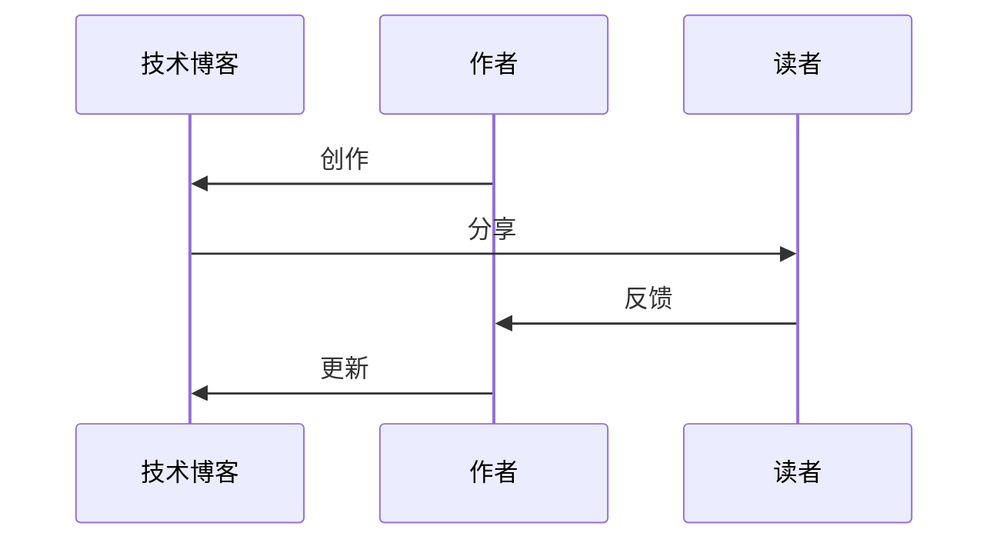
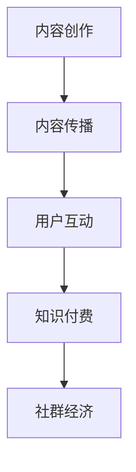
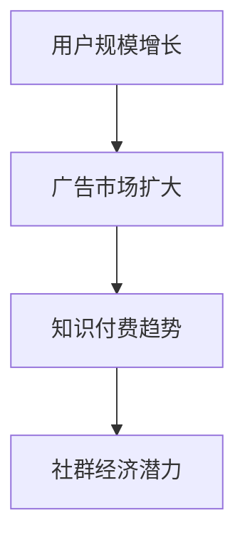
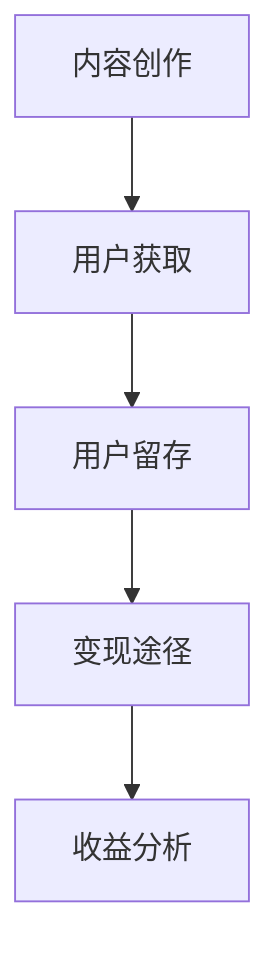

                 

### 第1章：技术博客变现的背景与趋势

#### 1.1 技术博客的定义与价值

**1.1.1 技术博客的定义与价值**

**核心概念与联系**

首先，让我们明确什么是技术博客。技术博客是一种在线媒体形式，主要由个人或团队撰写，专注于技术领域的知识分享。它不仅包括技术文章，还包括代码示例、项目实战、算法讲解等多种内容形式。技术博客的价值主要体现在以下几个方面：

1. **知识传播**：技术博客是技术知识的重要传播渠道。通过博客，作者可以将复杂的技术概念和算法用通俗易懂的语言进行阐述，帮助更多的读者理解和掌握这些知识。
2. **个人品牌**：技术博客是建立个人品牌的重要途径。通过持续的创作和分享，作者可以在技术社区中建立起自己的影响力，吸引更多的关注和认可。
3. **变现渠道**：技术博客也是实现内容变现的重要平台。通过广告、知识付费、技术服务等多种方式，作者可以从博客中获得经济回报。

**Mermaid 流程图**

下面是一个简单的 Mermaid 流程图，展示了技术博客的核心概念和联系：

**核心算法原理讲解**

在这个模型中，作者通过技术博客进行内容创作，读者通过阅读获取知识，并给予反馈。这一过程不断循环，使得技术博客能够持续更新和改进。

**数学模型和数学公式**

为了衡量技术博客的变现效果，我们可以使用投资回报率（ROI）这一指标：

$$
ROI = \frac{净利润}{投入成本}
$$

其中，净利润是指博客通过广告、知识付费等途径获得的总收入减去所有相关成本。投入成本包括博客建设、维护、推广等费用。

**详细讲解与举例说明**

假设一个博客通过广告变现获得了10,000元净利润，而投入成本为5,000元，则其ROI为：

$$
ROI = \frac{10,000}{5,000} = 2
$$

这意味着每投入1元，博客可以获得2元的回报。

通过以上分析，我们可以看到技术博客不仅具有知识传播、个人品牌建设等价值，同时也提供了多种变现途径，具有巨大的市场前景。

#### 1.2 内容创业的兴起

**1.2.1 内容创业的兴起**

内容创业是指利用互联网平台，通过创作和传播有价值的内容来获取经济收益的一种商业模式。近年来，随着互联网的普及和内容消费的增加，内容创业逐渐兴起，并在多个领域取得了显著成果。

**核心概念与联系**

1. **自媒体**：自媒体是指个人或小型团队通过互联网平台进行内容创作和传播，代表形式包括博客、微博、微信公众号等。
2. **知识付费**：知识付费是指用户为获取高质量的知识内容而付费的行为，常见形式包括在线课程、电子书、付费问答等。
3. **社群经济**：社群经济是指通过建立和维护用户社群，实现内容共享和商业变现的一种模式。

**Mermaid 流程图**

**核心算法原理讲解**

内容创业的核心算法原理可以概括为：内容创作 → 内容传播 → 用户互动 → 知识付费 → 社群经济。这一过程形成了一个闭环，使得内容创业能够持续发展。

**数学模型和数学公式**

为了更好地理解内容创业的盈利模式，我们可以使用以下数学模型：

$$
收益 = 单价 \times 销售量
$$

其中，单价是指用户为获取知识内容所支付的费用，销售量是指通过内容创业获得的付费用户数量。

**详细讲解与举例说明**

假设一个内容创业项目通过在线课程获得了1000名付费用户，单价为200元，则其总收益为：

$$
收益 = 200 \times 1000 = 200,000 \text{元}
$$

通过以上分析，我们可以看到内容创业不仅为创作者提供了经济回报，同时也为用户提供了高质量的知识内容，实现了多方共赢。

#### 1.3 技术博客变现的市场前景

**1.3.1 技术博客变现的市场前景**

随着互联网技术的发展和用户需求的增长，技术博客变现的市场前景非常广阔。以下是几个关键点：

1. **用户规模增长**：随着越来越多的程序员和技术爱好者加入互联网，技术博客的用户规模持续扩大，为变现提供了坚实基础。
2. **广告市场扩大**：广告是技术博客变现的主要途径之一。随着互联网广告市场的不断扩大，技术博客的广告收入也在逐年增加。
3. **知识付费趋势**：随着用户对高质量知识内容的需求增加，知识付费市场正在快速增长。技术博客通过提供专业的知识内容，可以吸引更多付费用户。
4. **社群经济潜力**：技术博客通过建立用户社群，可以实现内容共享和商业变现。社群经济在技术博客变现中具有巨大的潜力。

**Mermaid 流程图**

**核心算法原理讲解**

技术博客变现的市场前景可以通过以下核心算法原理来解释：

1. **用户规模增长**：用户规模的增加意味着更多的潜在读者和广告客户，从而提高了博客的变现潜力。
2. **广告市场扩大**：广告市场的扩大为技术博客提供了更多的广告机会和更高的广告收入。
3. **知识付费趋势**：知识付费趋势的增长为技术博客提供了新的变现途径，通过提供专业的知识内容，博客可以获得更多的付费用户。
4. **社群经济潜力**：社群经济潜力为技术博客提供了长期稳定的收益来源，通过建立和维护用户社群，博客可以实现持续的商业变现。

**数学模型和数学公式**

为了量化技术博客变现的市场前景，我们可以使用以下数学模型：

$$
总收益 = 广告收入 + 知识付费收入 + 社群经济收入
$$

其中，广告收入、知识付费收入和社群经济收入分别是博客通过广告、知识付费和社群经济获得的收入。

**详细讲解与举例说明**

假设一个技术博客的月广告收入为10,000元，知识付费收入为5,000元，社群经济收入为3,000元，则其月总收益为：

$$
总收益 = 10,000 + 5,000 + 3,000 = 18,000 \text{元}
$$

通过以上分析，我们可以看到技术博客变现的市场前景非常广阔，具有巨大的发展潜力。

### 第2章：技术博客变现的框架与策略

#### 2.1 技术博客变现的基本框架

**2.1.1 技术博客变现的基本框架**

技术博客变现的基本框架包括内容创作、用户获取、用户留存和变现途径四个核心环节。以下是对每个环节的详细解析：

**内容创作**

内容创作是技术博客变现的基础。一篇高质量的技术博客需要具备以下几个特点：

1. **专业性**：内容需要深入浅出地讲解技术原理和算法，确保读者能够理解并掌握相关知识点。
2. **实用性**：内容应具有实际应用价值，帮助读者解决实际问题。
3. **独特性**：内容应具有独特性，避免与已有内容重复，提供新的观点和见解。

**用户获取**

用户获取是技术博客变现的关键。以下是一些有效的用户获取策略：

1. **搜索引擎优化（SEO）**：通过优化博客内容，提高在搜索引擎中的排名，吸引更多潜在读者。
2. **社交媒体推广**：利用微博、微信公众号、知乎等社交媒体平台，发布博客文章的摘要或链接，吸引读者访问博客。
3. **合作伙伴关系**：与其他技术博客或网站建立合作关系，互相推广，扩大用户群体。

**用户留存**

用户留存是技术博客变现的重要保障。以下是一些提高用户留存的方法：

1. **定期更新**：保持博客内容的新鲜度，定期发布高质量的文章，吸引用户持续关注。
2. **互动交流**：鼓励用户在评论区留言，与读者进行互动交流，提高用户的参与度和忠诚度。
3. **会员制度**：提供会员专属内容或服务，提高用户的付费意愿和留存率。

**变现途径**

技术博客变现的途径多样，以下是一些常见的变现方式：

1. **广告收入**：通过在博客中投放广告，获取广告收入。可以选择联盟广告、按点击付费（CPC）或按展示付费（CPM）等广告模式。
2. **知识付费**：提供高质量的技术课程、电子书、付费问答等服务，通过知识付费获取收入。
3. **技术服务**：为有需求的用户提供定制化的技术解决方案或咨询服务，获取服务收入。
4. **会员制**：提供会员专属内容或服务，收取会员费用，实现收入来源的多样化。

**Mermaid 流程图**

**核心算法原理讲解**

技术博客变现的核心算法原理可以概括为：

1. **内容创作**：通过高质量的内容吸引潜在用户。
2. **用户获取**：通过各种渠道扩大用户群体。
3. **用户留存**：提高用户参与度和忠诚度，确保用户持续关注博客。
4. **变现途径**：选择合适的变现方式，实现收入最大化。

**数学模型和数学公式**

为了量化技术博客的变现效果，可以使用以下数学模型：

$$
收益 = 广告收入 + 知识付费收入 + 服务收入 + 会员收入
$$

其中，广告收入、知识付费收入、服务收入和会员收入分别是博客通过广告、知识付费、技术服务和会员制获得的收入。

**详细讲解与举例说明**

假设一个技术博客的广告收入为1000元/月，知识付费收入为500元/月，服务收入为200元/月，会员收入为300元/月，则其月收益为：

$$
收益 = 1000 + 500 + 200 + 300 = 2000 \text{元}
$$

通过以上分析，我们可以看到技术博客变现的基本框架包括内容创作、用户获取、用户留存和变现途径四个环节，每个环节都有其关键要素和策略。只有通过合理规划和有效执行，才能实现技术博客的持续变现。

#### 2.2 内容创作与定位

**2.2.1 内容创作与定位**

内容创作是技术博客变现的基础，而内容定位则是决定博客能否吸引目标用户的关键。以下是如何进行内容创作与定位的详细解析：

**内容创作**

1. **选题策略**：选择热门且有价值的技术话题，确保内容能够吸引读者的兴趣。可以通过关注技术社区、论坛和博客，了解读者的关注点和需求。
2. **深度分析**：对所选话题进行深入分析，挖掘其中的核心概念和原理。可以通过查阅相关文献、技术博客和论坛，掌握最新的技术动态和研究成果。
3. **结构布局**：确保文章结构清晰，逻辑严谨。可以采用“引言 - 正文 - 结论”的结构，先介绍背景和目的，再详细阐述内容，最后总结和展望。

**案例解析**

以“深度学习中的神经网络架构”为例，我们可以按照以下步骤进行内容创作：

1. **选题策略**：选择当前热门的深度学习领域，聚焦于神经网络架构这一子领域。
2. **深度分析**：介绍神经网络架构的基本概念，包括卷积神经网络（CNN）、循环神经网络（RNN）和生成对抗网络（GAN）等，分析它们的优缺点和应用场景。
3. **结构布局**：首先介绍神经网络架构的背景和重要性，然后详细讲解各种神经网络架构的原理和实现，最后分析这些架构在实际应用中的效果和挑战。

**内容定位**

1. **目标用户**：确定博客的目标用户群体，例如程序员、研究人员、学生等。了解他们的需求、兴趣和行为习惯，以便为他们提供有价值的内容。
2. **内容风格**：根据目标用户的特点，确定博客的内容风格。例如，对于程序员，可以采用技术性、实用性的风格；对于研究人员，可以采用深入分析、学术性的风格。
3. **差异化竞争**：在众多技术博客中脱颖而出，需要明确自己的特色和差异化竞争。可以通过独特的视角、深入的分析或实践案例，为读者提供独特的内容体验。

**案例解析**

假设我们要创建一个专注于深度学习领域的博客，目标用户为程序员和研究人员。我们可以按照以下策略进行内容定位：

1. **目标用户**：确定博客的目标用户为对深度学习有浓厚兴趣的程序员和研究人员。
2. **内容风格**：采用技术性、实用性和深入分析的风格，确保内容既有深度又具有实用性。
3. **差异化竞争**：通过深入分析最新的深度学习研究论文，分享实践中的经验教训，提供独特的技术见解，为读者带来不一样的学习体验。

通过以上内容创作与定位的详细解析，我们可以看到，成功的技术博客需要具备高质量的原创内容、明确的定位和独特的差异化竞争。只有通过不断优化内容创作和定位策略，才能吸引更多的目标用户，实现博客的持续变现。

#### 2.3 用户群体分析与运营

**2.3.1 用户群体分析与运营**

用户群体分析是技术博客运营的关键环节，通过深入了解用户特征和行为，可以优化内容创作和推广策略，提高用户参与度和留存率。以下是用户群体分析与运营的详细解析：

**用户群体分析**

1. **用户特征**：了解用户的基本特征，包括年龄、性别、职业、教育背景等。这些信息有助于确定博客的目标用户群体，为内容创作提供方向。
2. **用户行为**：分析用户的阅读习惯、互动行为和付费意愿等。例如，可以通过博客的访问量、点击率、评论数量等指标，了解用户的兴趣点和需求。
3. **用户需求**：根据用户特征和行为，挖掘用户的需求。例如，对于程序员，他们可能更关注最新技术动态、实战案例和技术教程；对于研究人员，他们可能更关注前沿研究论文和学术讨论。

**运营策略**

1. **内容推送**：根据用户需求，制定内容推送策略。可以采用多种推送方式，如定期发布、热点话题推送、节假日推送等，确保内容能够及时传达给用户。
2. **互动交流**：通过评论、问答、线上讲座等方式，与用户进行互动交流。这不仅有助于了解用户的反馈，还能提高用户的参与度和忠诚度。
3. **社群运营**：建立用户社群，如微信群、QQ群、技术论坛等，为用户提供交流和学习平台。社群运营需要注重内容丰富、氛围活跃，以及定期举办线上线下活动。
4. **用户画像**：基于用户数据，建立用户画像，了解用户的兴趣和行为特征。这有助于个性化推荐内容，提高内容的相关性和用户体验。
5. **用户激励**：通过积分、优惠券、会员特权等方式，激励用户参与互动和推广。这可以增加用户的粘性，提高用户的留存率。

**案例分析**

以“深度学习博客”为例，我们可以进行以下用户群体分析与运营：

1. **用户特征**：用户主要集中在18-35岁的程序员和研究人员，男性占比较高，教育背景主要为本科及以上。
2. **用户行为**：用户更关注深度学习领域的最新技术动态、实战案例和技术教程，互动行为主要集中在评论和问答区。
3. **用户需求**：用户需要高质量、深入浅出的技术内容，以及实践中的经验和教训。

**运营策略**

1. **内容推送**：每周发布一篇深度学习领域的原创技术文章，同时关注热点话题，及时推送相关内容。
2. **互动交流**：在文章发布后，鼓励用户留言讨论，及时回复用户的问题和反馈，提高用户的参与度。
3. **社群运营**：建立微信群和QQ群，定期举办线上讲座和线下聚会，为用户提供交流和学习平台。
4. **用户画像**：通过分析用户数据，了解用户的兴趣点，为每个用户推荐个性化的内容。
5. **用户激励**：设立积分制度，鼓励用户参与互动和推广，提供优惠券和会员特权等激励措施。

通过以上用户群体分析与运营的详细解析，我们可以看到，深入分析用户特征、行为和需求，结合有效的运营策略，是提高技术博客用户参与度和留存率的关键。只有不断优化用户运营，才能实现技术博客的持续发展和变现。

### 第3章：广告变现模式解析

#### 3.1 广告变现模式解析

广告变现是技术博客常见的变现方式之一，通过在博客中展示广告，博客可以获得广告收入。以下是对广告变现模式的详细解析：

**广告变现原理**

广告变现的基本原理是博客主通过与广告平台合作，在博客中展示广告，根据广告的展示量或点击量获取收入。广告收入来源主要包括以下几种：

1. **展示广告**：展示广告（Display Ads）是在博客页面中展示的广告，通常以横幅广告、插页广告等形式出现。广告主为每次广告展示支付费用，通常采用按展示付费（CPM）模式。
2. **点击广告**：点击广告（Click Ads）是在博客文章内容中插入的链接广告，用户点击链接后，广告主为每次点击支付费用，通常采用按点击付费（CPC）模式。
3. **转化广告**：转化广告（Conversion Ads）是在博客中展示的广告，用户通过点击广告完成特定操作（如注册、购买等），广告主为每次转化支付费用，通常采用按转化付费（CPA）模式。

**广告平台选择**

选择合适的广告平台是广告变现的关键。以下是一些常见的广告平台及其特点：

1. **Google AdSense**：Google AdSense 是全球最大的广告平台之一，支持展示广告和点击广告。它具有广泛的广告网络和精准的广告投放，但申请门槛较高。
2. **Media.net**：Media.net 是由 Yahoo! 和 AOL 共同运营的广告平台，与 Google AdSense 类似，提供高质量的广告内容。
3. **Bing Ads**：Bing Ads 是微软的在线广告平台，支持展示广告和点击广告。它在全球拥有大量的广告客户，广告投放效果较好。
4. **淘宝联盟**：淘宝联盟是阿里巴巴旗下的广告平台，主要面向电商广告。它支持展示广告、点击广告和转化广告，适合电商类博客。
5. **联盟广告平台**：如阿里妈妈、广点通等，这些平台提供多样化的广告形式和较高的广告收入。

**广告投放策略**

为了提高广告收入，博客主需要制定合理的广告投放策略。以下是一些广告投放策略：

1. **广告位置**：选择广告收入最高的位置进行投放，如博客顶部、侧边栏、文章内容中等。
2. **广告形式**：根据博客内容和用户需求，选择合适的广告形式。例如，对于技术博客，展示广告和点击广告效果较好。
3. **广告频次**：合理控制广告频次，避免过度广告影响用户体验。通常，每篇文章中放置1-3个广告较为合适。
4. **广告内容**：确保广告内容与博客内容相关，提高广告的点击率和转化率。
5. **数据监控**：定期监控广告投放数据，分析广告效果，调整广告策略。

**案例分析**

以一个技术博客为例，我们可以进行以下广告投放：

1. **广告平台选择**：选择 Google AdSense 和淘宝联盟，因为这两个平台适合技术博客，广告质量较高。
2. **广告位置**：在博客顶部和侧边栏放置展示广告，在文章内容中放置点击广告。
3. **广告形式**：展示广告主要投放技术相关广告，点击广告主要投放电商类广告。
4. **广告频次**：每篇文章放置2个广告，避免影响用户体验。
5. **数据监控**：每周监控广告数据，分析广告收入、点击率等指标，优化广告策略。

通过以上广告变现模式解析，我们可以看到，广告变现是技术博客重要的变现途径。通过合理选择广告平台、制定广告投放策略，博客主可以从中获得稳定的经济回报。

#### 3.2 广告平台与选择

**3.2 广告平台与选择**

在选择广告平台时，博客主需要考虑多个因素，如广告收益、广告质量、用户体验等。以下是一些常见的广告平台及其优缺点：

**Google AdSense**

**优点：**
1. **广告质量高**：Google AdSense 拥有广泛的广告网络，可以提供高质量的广告内容。
2. **收益稳定**：Google AdSense 具有较高的广告收益，尤其是对于流量较高的博客。
3. **自动化管理**：Google AdSense 提供自动化的广告投放和收益管理，简化了博客主的运营工作。

**缺点：**
1. **申请门槛高**：Google AdSense 的申请门槛较高，需要博客具备一定的流量和内容质量。
2. **广告相关性强**：广告与博客内容的相关性较高，但有时会显示一些与内容不相关的广告。

**Media.net**

**优点：**
1. **广告多样性**：Media.net 提供多种广告形式，包括展示广告、点击广告和转化广告，满足不同博客的需求。
2. **收益潜力大**：Media.net 的广告收益潜力较大，尤其是对于高流量博客。

**缺点：**
1. **广告质量参差不齐**：Media.net 的广告质量不如 Google AdSense，有时会显示一些低质量广告。
2. **支持力度有限**：Media.net 的技术支持和客户服务相对有限。

**Bing Ads**

**优点：**
1. **广告投放灵活**：Bing Ads 支持展示广告和点击广告，可以根据博客内容和用户需求灵活投放广告。
2. **广告成本较低**：Bing Ads 的广告成本相对较低，适合预算有限的博客主。

**缺点：**
1. **广告收入较低**：Bing Ads 的广告收入相对较低，尤其是对于高流量博客。
2. **广告效果监测困难**：Bing Ads 的广告效果监测相对困难，需要博客主自行分析数据。

**淘宝联盟**

**优点：**
1. **电商广告优势明显**：淘宝联盟主要面向电商广告，适合电商类博客。
2. **广告投放灵活**：淘宝联盟支持展示广告、点击广告和转化广告，可以根据博客内容和用户需求灵活投放广告。

**缺点：**
1. **广告质量参差不齐**：淘宝联盟的广告质量参差不齐，有时会显示一些低质量广告。
2. **广告收益较低**：淘宝联盟的广告收益相对较低，尤其是对于非电商类博客。

**联盟广告平台**

**优点：**
1. **广告形式多样**：联盟广告平台提供多种广告形式，满足不同博客的需求。
2. **广告收益较高**：联盟广告平台的广告收益相对较高，尤其是对于高流量博客。

**缺点：**
1. **广告质量参差不齐**：联盟广告平台的广告质量参差不齐，需要博客主自行筛选。
2. **运营成本较高**：联盟广告平台的运营成本相对较高，需要博客主投入更多的时间和精力。

综上所述，博客主在选择广告平台时，应综合考虑广告收益、广告质量、用户体验和运营成本等因素。根据自身博客的特点和需求，选择最合适的广告平台，以实现最佳的广告变现效果。

#### 3.3 广告投放策略

**3.3 广告投放策略**

为了提高广告收入，博客主需要制定合理的广告投放策略。以下是一些关键策略：

**1. 选择合适的广告位置**

广告位置直接影响广告的展示效果和点击率。以下是一些常用的广告位置：

- **顶部广告**：顶部广告位于博客页面的顶部，易于被用户注意到。但过多会影响用户体验，建议每篇博客只放置1-2个顶部广告。
- **侧边栏广告**：侧边栏广告位于博客页面的侧边，不影响用户阅读正文内容。但点击率相对较低，适合展示展示广告。
- **文章内容广告**：文章内容广告位于博客文章中，与内容紧密结合，点击率较高。但过多会影响用户体验，建议每篇博客只放置1-2个内容广告。

**2. 选择合适的广告形式**

不同广告形式具有不同的效果，博客主应根据自身博客内容和用户需求选择合适的广告形式：

- **展示广告**：展示广告以横幅、插页等形式展示，适用于宣传品牌或产品。优点是制作简单，展示效果直观；缺点是点击率相对较低。
- **点击广告**：点击广告以链接形式嵌入博客内容，用户点击链接后跳转到广告页面。优点是点击率高，用户参与度高；缺点是广告成本较高。
- **转化广告**：转化广告以特定操作（如注册、购买等）为目标，用户完成操作后广告主支付费用。优点是转化率高，收益稳定；缺点是广告制作复杂，需要较高技术支持。

**3. 控制广告频次**

广告频次过高会影响用户体验，降低用户留存率。博客主应根据博客流量和用户反馈，合理控制广告频次：

- **每篇文章放置1-3个广告**：建议每篇文章放置1-3个广告，避免过多广告影响用户体验。
- **不同广告形式结合使用**：结合使用展示广告、点击广告和转化广告，提高广告收入。

**4. 选择相关性的广告**

广告内容与博客内容的相关性直接影响点击率和转化率。博客主应选择与博客主题相关、用户感兴趣的广告：

- **内容匹配**：确保广告内容与博客内容匹配，提高用户点击意愿。
- **目标用户匹配**：根据博客目标用户特征，选择符合目标用户需求的广告。

**5. 监控广告效果**

定期监控广告效果，分析广告收入、点击率、转化率等指标，优化广告策略：

- **数据收集**：收集广告数据，包括展示次数、点击次数、转化次数等。
- **数据分析**：分析广告效果，找出优化点，如调整广告位置、形式、频次等。
- **优化调整**：根据数据分析结果，调整广告策略，提高广告收入。

通过以上广告投放策略，博客主可以更好地管理广告，提高广告收入。同时，合理控制广告频次，确保用户体验，实现广告收入与用户体验的双赢。

### 第4章：知识付费变现模式

#### 4.1 知识付费的兴起

**4.1 知识付费的兴起**

知识付费是一种用户为获取高质量知识内容而支付费用的新兴商业模式。近年来，随着互联网技术的发展和用户对高质量知识内容需求的增加，知识付费市场迅速崛起。以下是知识付费兴起的几个关键因素：

**用户需求增长**

1. **教育需求提升**：随着社会对教育质量的重视，用户对在线教育和培训的需求不断增加。在线课程、电子书、付费问答等知识付费形式满足了用户多样化的学习需求。
2. **职业发展需求**：在职场上，用户为了提升职业技能和竞争力，愿意为专业知识和技能培训付费。例如，IT技术培训、金融投资培训等。
3. **个人兴趣发展**：用户对个人兴趣和爱好方面的知识需求也促使知识付费市场的发展，如音乐、绘画、编程等领域的知识内容。

**互联网技术发展**

1. **在线支付便捷**：随着移动支付的普及和互联网技术的发展，用户在线支付变得更加便捷，为知识付费提供了技术保障。
2. **内容分发高效**：互联网技术使得知识内容的分发和传播更加高效，用户可以随时随地获取所需的知识内容。
3. **个性化推荐**：大数据和人工智能技术为知识付费平台提供了个性化推荐功能，提高了用户的学习体验和付费意愿。

**行业趋势分析**

1. **市场潜力巨大**：知识付费市场呈现出快速增长的趋势，根据相关数据，全球知识付费市场规模逐年扩大，预计未来将继续保持高速增长。
2. **垂直领域发展**：知识付费在各个垂直领域如教育、职业培训、个人兴趣等都有较大的发展空间，不同领域的内容和形式多样化。
3. **平台竞争加剧**：随着知识付费市场的快速发展，各类知识付费平台如雨后春笋般涌现，平台之间的竞争日益激烈，促使平台不断提高内容质量和用户体验。

通过以上分析，我们可以看到知识付费的兴起是由于用户需求增长、互联网技术发展和行业趋势共同推动的结果。知识付费不仅为用户提供了有价值的内容，也为内容创作者提供了新的变现途径，具有广阔的市场前景。

#### 4.2 知识付费的产品形式

**4.2 知识付费的产品形式**

知识付费产品形式多样，每种形式都有其独特的特点和适用场景。以下是一些常见的知识付费产品形式及其特点：

**1. 在线课程**

**特点：**
- **内容丰富**：在线课程通常包含视频讲解、文本教材、练习题等多种形式，内容丰富且结构清晰。
- **互动性强**：通过直播授课、在线讨论区等互动形式，学员可以与讲师和其他学员实时交流，提高学习效果。
- **灵活方便**：学员可以随时随地进行学习，不受时间和地点限制。

**适用场景：**
- **专业技能提升**：如编程、数据科学、金融分析等专业技能培训。
- **兴趣爱好培养**：如绘画、音乐、烹饪等兴趣爱好的培养。

**2. 电子书**

**特点：**
- **便携性高**：电子书可以随时阅读，方便携带，支持多种阅读设备。
- **内容精炼**：电子书通常以短小精悍的形式呈现，内容精炼且易于阅读。
- **价格便宜**：与实体书相比，电子书价格更为亲民。

**适用场景：**
- **知识普及**：如科普读物、行业报告等。
- **专业书籍**：如技术书籍、专业著作等。

**3. 付费问答**

**特点：**
- **即时性**：用户可以即时提问，获得专业人士的解答。
- **针对性**：针对用户的具体问题，提供个性化的解决方案。
- **专业性强**：付费问答通常由领域内的专业人士进行解答，确保解答的质量。

**适用场景：**
- **学术咨询**：如学术论文写作、学术研究问题等。
- **技术支持**：如编程问题、系统维护等。

**4. 专业咨询**

**特点：**
- **定制化**：根据用户的需求，提供个性化的咨询服务。
- **深度交流**：与专业人士进行深入交流，获取专业指导。
- **效果显著**：针对用户的具体问题，提供可行的解决方案。

**适用场景：**
- **职业发展**：如求职指导、职业规划等。
- **业务咨询**：如市场分析、战略规划等。

**5. 实战项目**

**特点：**
- **实践性强**：通过实际项目操作，学习知识和技能。
- **互动性强**：在项目过程中，与导师和其他学员进行互动，提高实践能力。
- **成果显著**：完成项目后，可以获得实际的成果和经验。

**适用场景：**
- **技能提升**：如编程项目、数据分析项目等。
- **创业指导**：如创业项目辅导、市场调研等。

通过以上知识付费产品形式的介绍，我们可以看到，每种产品形式都有其独特的特点和适用场景。博客主可以根据自身优势和用户需求，选择合适的知识付费产品形式，实现内容变现。

#### 4.3 知识付费的运营策略

**4.3 知识付费的运营策略**

为了有效地运营知识付费产品，博客主需要制定一系列策略，从内容制作、推广、用户管理到售后服务，全面覆盖运营的各个方面。以下是知识付费的运营策略解析：

**1. 内容制作**

**内容质量是知识付费产品的核心**。为了确保内容的质量和吸引力，博客主应遵循以下原则：

- **专业性**：内容必须具有专业性，确保信息的准确性和权威性。
- **实用性**：内容应具有实际应用价值，帮助用户解决实际问题。
- **针对性**：根据目标用户的需求，制定针对性的内容策略。
- **多样化**：结合文本、视频、音频等多种形式，提高内容的多样性和吸引力。

**2. 推广策略**

**有效的推广是知识付费产品成功的关键**。以下是一些推广策略：

- **搜索引擎优化（SEO）**：通过优化博客内容和网站结构，提高在搜索引擎中的排名，吸引更多潜在用户。
- **社交媒体推广**：利用微博、微信公众号、知乎等社交媒体平台，发布知识付费产品的推广信息，扩大影响力。
- **合作推广**：与其他博主、机构或媒体进行合作，共同推广知识付费产品。
- **内容营销**：通过创作高质量的内容，如博客文章、案例分享等，吸引潜在用户。

**3. 用户管理**

**用户管理是知识付费运营的重要环节**。以下是一些用户管理策略：

- **用户画像**：通过数据分析，了解用户的特征和行为，为用户提供个性化的服务。
- **用户互动**：通过评论区、社群等渠道，与用户进行互动，提高用户参与度和忠诚度。
- **用户反馈**：及时收集用户反馈，优化产品和服务，提高用户满意度。
- **用户分层**：根据用户的购买行为、活跃度等特征，对用户进行分层管理，提供差异化服务。

**4. 售后服务**

**优质的售后服务是提高用户满意度和口碑的关键**。以下是一些售后服务策略：

- **客户支持**：提供7x24小时客户支持，解答用户的问题和疑虑。
- **售后服务**：确保用户在使用知识付费产品后，能够得到及时的帮助和支持。
- **用户评价**：鼓励用户对产品和服务进行评价，提高产品的曝光度和信誉度。
- **持续更新**：定期更新知识付费产品，确保内容的时效性和实用性。

**5. 数据分析**

**数据分析是知识付费运营的重要工具**。以下是一些数据分析策略：

- **用户行为分析**：分析用户的阅读、购买、互动等行为，了解用户需求，优化产品和服务。
- **营销效果分析**：分析推广活动的效果，优化推广策略，提高投入产出比。
- **收益分析**：通过收益数据分析，了解产品的盈利情况，优化产品定价和营销策略。

通过以上知识付费的运营策略，博客主可以有效地管理知识付费产品，提高用户满意度和口碑，实现持续的内容变现。

#### 4.4 知识付费变现案例分析

**4.4 知识付费变现案例分析**

为了更好地理解知识付费变现的实践方法，我们可以通过两个典型的成功案例来进行分析和解读。

**案例一：** 知乎Live

**背景介绍**：知乎Live是知乎推出的一种知识付费产品，用户可以通过购买Live课程，实时聆听专业人士的分享和解答。

**核心策略**：
1. **内容质量**：知乎Live邀请各领域的专业人士进行分享，确保内容的权威性和专业性。
2. **互动性强**：Live课程中，用户可以实时提问，讲师和助教会进行解答，提高用户的参与感和满意度。
3. **针对性推广**：知乎通过数据分析，了解用户的兴趣和需求，推荐相关的Live课程。

**收益模式**：
- **课程费用**：用户购买Live课程，支付一定费用。
- **广告收入**：在Live课程中，可以嵌入广告，获得广告收入。
- **增值服务**：提供VIP会员服务，用户可以享受更多专属权益。

**案例小结**：知乎Live通过高质量的内容、互动性强的课程和精准的推广，成功实现了知识付费变现。

**案例二：** 腾讯课堂

**背景介绍**：腾讯课堂是腾讯推出的一款在线教育平台，提供各种专业的在线课程，用户可以通过购买课程来学习。

**核心策略**：
1. **内容多样化**：腾讯课堂涵盖多个领域，如IT、金融、语言等，满足不同用户的需求。
2. **名师效应**：邀请知名讲师授课，利用名师效应吸引学员。
3. **智能推荐**：通过大数据和人工智能技术，为用户推荐个性化的课程。

**收益模式**：
- **课程销售**：用户购买课程，支付一定费用。
- **平台费用**：讲师在腾讯课堂销售课程，需要支付一定的平台费用。
- **广告收入**：在课程页面和推广过程中，可以嵌入广告，获得广告收入。

**案例小结**：腾讯课堂通过多样化的课程内容、名师效应和智能推荐，实现了知识付费的广泛覆盖和成功变现。

通过以上两个案例分析，我们可以看到，知识付费的成功离不开高质量的内容、互动性强的课程和精准的推广。同时，多样化的收益模式和有效的用户管理策略也是实现知识付费变现的重要因素。

### 第5章：技术服务与咨询变现

#### 5.1 技术服务的价值

技术服务是指博客主通过提供专业的技术解决方案或咨询服务，为有需求的用户提供个性化服务。技术服务在技术博客变现中具有独特的价值，主要体现在以下几个方面：

**1. 提升博客专业性**

通过提供技术服务，博客主可以展示自己在某一技术领域的专业能力和经验，提升博客的专业形象。这有助于吸引更多的专业用户和潜在客户，增强博客的公信力和影响力。

**2. 增加用户粘性**

技术服务可以为用户提供实际帮助，解决他们在技术使用过程中遇到的问题。这不仅可以提高用户的满意度，还可以增强用户对博客的依赖性，提高用户的留存率。

**3. 拓展业务范围**

通过提供技术服务，博客主可以拓展业务范围，不仅限于内容创作，还可以涉足技术解决方案和咨询服务。这有助于博客主实现多元化变现，提高收入来源的稳定性。

**4. 提高收入水平**

技术服务通常具有较高收费，相较于广告收入和知识付费，技术服务可以为博客主带来更高的收入。通过提供高质量的技术服务，博客主可以实现较高的盈利水平。

**5. 建立客户关系**

通过技术服务，博客主可以与客户建立长期的合作关系。这不仅可以增加客户的忠诚度，还可以为博客带来更多的口碑推广和潜在客户。

**案例分析**

以一个专注于数据科学领域的博客为例，博客主可以通过提供以下技术服务来提升博客价值：

1. **数据咨询**：为客户提供数据分析和处理咨询服务，帮助他们解决实际的数据问题。
2. **数据项目外包**：承接客户的数据分析项目，提供从数据收集、处理到分析的全流程服务。
3. **算法培训**：为有需求的企业或个人提供数据科学和机器学习算法的培训，提高他们的技术水平。

通过以上技术服务，博客主不仅能够展示自己的专业能力，还可以增加用户粘性，拓展业务范围，提高收入水平，并建立长期客户关系。

#### 5.2 咨询服务的开展

**5.2 咨询服务的开展**

咨询服务是技术博客变现的重要途径之一。通过为用户提供专业的技术咨询服务，博客主可以创造额外的收入来源。以下是开展咨询服务的详细步骤和方法：

**1. 确定服务领域**

首先，博客主需要明确自己擅长的技术领域和感兴趣的咨询服务方向。这有助于在咨询过程中提供专业、高质量的服务，提高客户的满意度。

**2. 制定服务方案**

根据确定的咨询领域，博客主可以制定详细的服务方案。服务方案应包括服务内容、服务流程、收费标准和服务承诺等。例如，一个专注于大数据咨询的博客主可以提供以下服务：

- **数据需求分析**：与客户沟通，了解其数据需求。
- **数据采集与处理**：为客户采集和处理数据。
- **数据分析与报告**：对客户数据进行分析，并提供详细报告。
- **技术支持与培训**：为客户提供技术支持，并进行相关培训。

**3. 宣传推广**

为了吸引更多客户，博客主需要通过多种渠道宣传和推广自己的咨询服务。以下是一些推广方法：

- **博客文章**：在博客中发布有关咨询服务的文章，介绍服务内容和优势。
- **社交媒体**：利用微博、微信公众号等社交媒体平台，发布咨询服务的推广信息。
- **行业论坛**：在技术论坛和社区中发布帖子，分享咨询服务的经验和案例。
- **合作伙伴**：与相关行业的企业或组织建立合作关系，共同推广咨询服务。

**4. 建立信任**

建立信任是开展咨询服务的关键。以下是一些提高客户信任度的方法：

- **专业资质**：展示博客主的资质和荣誉，如专业证书、研究成果等。
- **成功案例**：分享咨询服务的成功案例，展示博客主的专业能力和实际效果。
- **客户推荐**：鼓励满意的客户为咨询服务推荐新客户。
- **用户反馈**：积极回应客户反馈，提高服务质量。

**5. 服务跟进**

在咨询服务过程中，博客主需要保持与客户的沟通，及时了解客户的需求和反馈。以下是一些服务跟进的方法：

- **定期沟通**：定期与客户进行电话或邮件沟通，了解项目进展和客户满意度。
- **问题解决**：及时解决客户在服务过程中遇到的问题，提高客户满意度。
- **售后服务**：提供完善的售后服务，确保客户在使用服务后得到满意的解决方案。

通过以上步骤和方法，博客主可以有效地开展咨询服务，提高客户满意度，实现技术博客的变现。

#### 5.3 技术服务与咨询的盈利模式

**5.3 技术服务与咨询的盈利模式**

技术服务与咨询是技术博客变现的重要途径之一，其盈利模式主要包括以下几种：

**1. 服务收费**

这是最直接、最常见的盈利模式。博客主通过提供技术服务或咨询服务，按照服务内容和时间收取费用。服务收费可以按项目收费、按小时收费或按成果收费。例如：

- **项目收费**：根据项目的大小和复杂程度，一次性收取服务费用。
- **按小时收费**：按照服务提供的时间，每小时收取一定费用。
- **按成果收费**：根据服务的结果或效果，如完成的项目或达到的目标，收取相应费用。

**2. 会员制收费**

博客主可以设置会员制度，为会员提供专属的技术服务或咨询服务。会员需要支付一定费用才能享受这些服务。会员制度可以提供以下特权：

- **专属咨询**：为会员提供一对一的专属咨询服务。
- **优先支持**：在博客主的技术支持中，会员享有优先权，优先解决他们的问题。
- **专属课程**：为会员提供专属的技术课程或培训，确保他们能够获得最新、最实用的技术知识。

**3. 广告与合作收入**

在提供技术服务和咨询服务的过程中，博客主可以通过以下方式获得广告和合作收入：

- **广告收入**：在博客或服务页面中放置广告，通过广告展示获得收入。
- **合作收入**：与相关企业或机构合作，提供联合服务或推广活动，从中获得收入。

**4. 佣金收入**

如果博客主为第三方平台或企业提供服务，可以通过佣金收入来盈利。例如，博客主可以作为中介，帮助双方达成交易，从中抽取一定比例的佣金。

**5. 产品销售**

博客主可以开发与技术服务相关的产品，如电子书、课程等，通过销售这些产品获得收入。例如，博客主可以编写一本关于某个技术领域的电子书，然后通过博客进行销售。

**案例分析**

以一个专注于数据科学领域的博客为例，其技术服务与咨询的盈利模式可能包括：

1. **服务收费**：博客主提供数据分析服务，按项目收费，每次项目收费5000元。
2. **会员制收费**：博客主设置会员制度，每年收取会员费2000元，会员享有专属咨询和优先支持。
3. **广告与合作收入**：在博客和咨询服务页面中放置广告，获得广告收入；与数据科学企业合作，提供联合培训，获得合作收入。
4. **佣金收入**：博客主作为中介，帮助数据科学企业与客户达成合作，从中抽取10%的佣金。
5. **产品销售**：博客主编写一本关于数据科学的电子书，通过博客进行销售，每本书售价100元。

通过以上盈利模式，博客主可以实现多元化的收入来源，提高博客的变现能力。

### 第6章：会员制与社群变现

#### 6.1 会员制的优势

**6.1 会员制的优势**

会员制是一种通过向用户提供付费会员服务，实现长期稳定收益的商业模式。在技术博客变现中，会员制具有以下显著优势：

**1. 提高用户粘性**

会员制可以为用户提供专属的权益和服务，如高级内容、专属咨询、优先支持等。这些权益可以增强用户的参与感和归属感，提高用户的留存率和忠诚度。

**2. 建立用户社群**

会员制有助于建立稳定的用户社群。通过社群互动，博客主可以更好地了解用户需求，提供个性化服务，同时用户之间也可以进行交流和互助，形成良好的社区氛围。

**3. 稳定收入来源**

会员制可以提供稳定的收入来源。相比于广告收入和知识付费，会员费用通常较高，且会员续费率较高，有利于博客主实现长期稳定的收益。

**4. 增加用户互动**

会员制鼓励用户之间的互动，通过论坛、社群等活动，用户可以分享经验、讨论问题，提高用户的参与度和活跃度。这有助于博客主更好地了解用户需求，优化服务。

**5. 降低推广成本**

会员制可以降低博客的推广成本。通过会员的口碑传播，新用户更容易被吸引，减少了对传统营销手段的依赖。

**6. 提升用户体验**

会员制可以提供高质量的服务和内容，提升用户体验。例如，为会员提供高级内容、优先支持等，使会员感受到更好的服务和价值。

**案例分析**

以一个专注于数据科学领域的博客为例，会员制的优势体现在以下几个方面：

1. **提高用户粘性**：会员制提供高级内容、专属咨询等权益，使会员对博客保持高度关注和依赖。
2. **建立用户社群**：通过会员社群，用户可以分享数据科学经验和问题，形成良好的社区氛围。
3. **稳定收入来源**：会员每年支付2000元的会员费用，博客主可以获得稳定的收入。
4. **增加用户互动**：会员社群中的论坛和活动鼓励用户互动，提高用户的活跃度和参与度。
5. **降低推广成本**：会员的口碑传播为新用户吸引带来大量流量，减少了对广告和推广的依赖。
6. **提升用户体验**：为会员提供高质量的内容和优先支持，使会员感受到更好的服务和价值。

通过以上分析，我们可以看到会员制在技术博客变现中具有显著的优势，可以有效提高用户粘性、建立用户社群、稳定收入来源、增加用户互动、降低推广成本和提升用户体验。

### 第6章：会员制与社群变现

#### 6.2 社群建设的策略

**6.2 社群建设的策略**

社群建设是技术博客变现的重要组成部分，通过有效的社群管理，可以提升用户参与度和忠诚度，从而实现持续变现。以下是社群建设的详细策略：

**1. 定位社群目标**

首先，博客主需要明确社群的目标和定位。这包括确定社群的主题、目标用户群体和核心价值。例如，一个专注于数据科学的社群，可以定位为数据科学爱好者、从业者和研究者，提供专业知识和交流平台。

**2. 建立社群规则**

为了维护社群的秩序和氛围，博客主需要制定明确的社群规则。这些规则应包括社群的核心价值观、行为准则、互动规范等。通过明确的规则，可以确保社群的良性发展和用户的良好体验。

**3. 创造高质量内容**

内容是社群的核心。博客主需要持续创作高质量的内容，包括技术文章、案例分析、讲座视频等，以满足社群成员的需求。高质量的内容不仅能够吸引新成员，还能提高社群的粘性。

**4. 促进用户互动**

互动是社群活跃的关键。博客主可以通过以下方式促进用户互动：

- **举办线上活动**：定期举办线上讨论、讲座、问答等活动，鼓励成员参与。
- **设立讨论区**：在社群中设立专门的讨论区，方便成员交流和提问。
- **奖励机制**：设置积分、勋章等奖励机制，鼓励成员积极参与互动。

**5. 维护社群氛围**

良好的社群氛围是社群持续发展的重要保障。博客主需要积极维护社群氛围，包括：

- **及时回应问题**：及时回答成员的问题，提供帮助。
- **处理违规行为**：对违规行为进行及时处理，维护社群秩序。
- **树立榜样**：通过榜样成员的示范作用，引导社群成员形成积极、健康的社群文化。

**6. 数据分析与优化**

通过数据分析，博客主可以了解社群的活跃度、成员行为和需求，从而优化社群管理策略。以下是一些关键指标：

- **活跃度指标**：如发帖量、回复量、活动参与率等。
- **用户行为指标**：如用户访问量、停留时长、互动频率等。
- **用户满意度**：通过调查问卷等方式，了解用户对社群的满意度。

**7. 持续改进**

社群建设是一个持续的过程。博客主需要根据社群的发展情况和用户反馈，不断改进社群管理策略，提高社群的运营效果。

通过以上社群建设策略，博客主可以有效地提升社群活跃度、用户满意度和忠诚度，从而实现技术博客的持续变现。

### 第6章：会员制与社群变现

#### 6.3 会员制与社群的盈利模式

**6.3 会员制与社群的盈利模式**

会员制与社群变现是技术博客实现长期稳定收入的重要手段。以下是会员制与社群的具体盈利模式分析：

**会员制盈利模式**

**1. 会员费收入**

会员制的基础是会员费收入。博客主可以设置不同级别的会员，例如普通会员、高级会员、VIP会员等，每个级别对应不同的会员费用。会员费可以是年费、月费或一次性费用。例如：

- **普通会员**：每年收费100元，提供基础服务。
- **高级会员**：每年收费300元，提供更多高级服务和特权。
- **VIP会员**：每年收费500元，提供VIP专属内容和个性化服务。

**2. 会员续费收入**

会员续费是会员制收入的重要来源。通过提供优质的服务和良好的用户体验，提高会员的续费率。以下策略有助于提高会员续费率：

- **定期更新内容**：保持会员内容的持续更新，确保会员始终有新的内容可以阅读。
- **增值服务**：为会员提供额外的增值服务，如专属咨询、优先支持等。
- **会员优惠**：为续费的会员提供优惠，如折扣、赠品等。

**3. 会员专属活动收入**

举办会员专属活动，如线上讲座、沙龙、线下聚会等，可以收取一定费用。这些活动不仅增加了会员的参与感，还可以为博客主带来额外收入。

**社群盈利模式**

**1. 广告收入**

社群中的广告收入来源于社群内部的广告投放。博客主可以在社群中放置广告，如横幅广告、推荐广告等，通过广告展示获得收入。

**2. 联合推广收入**

通过与第三方企业或机构合作，进行联合推广，可以获得推广收入。例如，与某技术公司合作，在社群中进行产品推广，从中获得收入分成。

**3. 知识付费收入**

社群可以为用户提供高质量的知识内容，如付费课程、电子书等。通过销售这些内容，获得知识付费收入。

**4. 会员活动收入**

举办会员专属活动，如线上讲座、线下聚会等，可以收取一定费用。这些活动不仅增加了会员的参与感，还可以为博客主带来额外收入。

**案例分析**

以一个专注于编程技术的博客为例，其会员制与社群的盈利模式如下：

1. **会员费收入**：普通会员每年收费100元，高级会员每年收费300元，VIP会员每年收费500元。
2. **会员续费收入**：通过定期更新内容和提供增值服务，提高会员的续费率。
3. **会员专属活动收入**：举办线上讲座、线下聚会等，每次活动收取50元费用。
4. **广告收入**：在社群中放置广告，每季度收取广告费1000元。
5. **联合推广收入**：与编程教育机构合作，进行产品推广，获得推广收入分成。

通过以上盈利模式，博客主可以实现多元化的收入来源，提高博客的变现能力。

### 第7章：综合案例分析

#### 7.1 成功案例分享

**成功案例一：**“Python编程教程”博客

**背景介绍**：“Python编程教程”博客是由一位资深Python开发者创建的，专注于Python编程技术的分享和教学。博客主通过高质量的技术文章、实战案例和视频教程，吸引了大量Python编程爱好者。

**关键策略**：

1. **内容创作**：博客主持续更新高质量的技术文章和实战案例，确保内容的专业性和实用性。
2. **互动交流**：博客主积极回复读者的评论和问题，与读者保持良好的互动，提高用户满意度。
3. **社群建设**：博客主创建了Python编程的社群，定期举办线上讲座和线下聚会，为用户提供交流和学习的平台。
4. **会员制**：博客主推出会员制度，为会员提供高级内容、专属咨询和优先支持等特权。

**收益模式**：

- **广告收入**：通过在博客中投放广告，获得广告收入。
- **知识付费**：销售Python编程课程和电子书，获得知识付费收入。
- **会员收入**：通过会员制度，收取会员费用，实现长期稳定收入。
- **技术服务**：提供Python编程咨询服务，获得服务收入。

**案例总结**：通过高质量的内容、互动交流、社群建设和多元化的收益模式，“Python编程教程”博客成功实现了技术博客的变现。

**成功案例二：**“深度学习之旅”博客

**背景介绍**：“深度学习之旅”博客专注于深度学习领域的知识分享和技术教程。博客主通过深入浅出的文章、实战案例和在线课程，吸引了大量深度学习爱好者。

**关键策略**：

1. **内容创作**：博客主定期发布深度学习领域的原创文章和实战案例，确保内容的专业性和实用性。
2. **合作伙伴**：博客主与多家深度学习相关的企业、机构和专家合作，共同推广深度学习知识。
3. **社群建设**：博客主创建了深度学习的社群，定期举办线上讲座和线下聚会，为用户提供交流和学习的平台。
4. **知识付费**：博客主推出深度学习在线课程和电子书，通过知识付费获得收入。

**收益模式**：

- **广告收入**：通过在博客中投放广告，获得广告收入。
- **知识付费**：销售深度学习课程和电子书，获得知识付费收入。
- **会员收入**：通过会员制度，收取会员费用，实现长期稳定收入。
- **技术服务**：提供深度学习咨询服务，获得服务收入。

**案例总结**：通过高质量的内容、合作伙伴关系、社群建设和多元化的收益模式，“深度学习之旅”博客成功实现了技术博客的变现。

#### 7.2 失败案例分析

**失败案例一：**“编程入门”博客

**背景介绍**：“编程入门”博客由一位程序员创建，旨在为初学者提供编程入门教程。然而，博客在运营过程中遇到了一系列问题，导致最终失败。

**原因分析**：

1. **内容质量不高**：博客主缺乏专业背景，文章内容过于简单，缺乏深度和实用性，难以吸引读者。
2. **互动不足**：博客主未积极与读者互动，回复不及时，导致读者流失。
3. **缺乏特色**：博客内容与其他入门教程类似，缺乏独特性和创新性，难以在众多同类型博客中脱颖而出。
4. **变现模式单一**：博客主要依赖广告收入，未尝试其他变现途径，导致收入不稳定。

**失败总结**：“编程入门”博客因内容质量不高、互动不足、缺乏特色和单一变现模式，最终导致失败。

**失败案例二：**“AI技术前沿”博客

**背景介绍**：“AI技术前沿”博客专注于人工智能领域的知识分享和技术动态。然而，博客在运营过程中未能取得预期效果。

**原因分析**：

1. **更新频率低**：博客主未能定期更新内容，导致读者流失。
2. **内容质量不稳定**：部分文章内容质量较低，缺乏深度和实用性，影响读者体验。
3. **推广不足**：博客主未积极进行推广，导致博客的知名度和影响力较低。
4. **变现模式不当**：博客主尝试多种变现方式，但未能找到合适的模式，导致收益不稳定。

**失败总结**：“AI技术前沿”博客因更新频率低、内容质量不稳定、推广不足和变现模式不当，最终未能实现预期效果。

通过以上成功和失败案例分析，我们可以看到，技术博客的成功需要高质量的内容、互动交流、特色创新和多元化的变现模式。同时，博客主需要积极推广和持续优化，以应对不断变化的市场环境。

### 第7章：综合案例分析

#### 7.3 案例启示与建议

通过对成功和失败案例分析，我们可以总结出一些关于技术博客变现的启示与建议，以帮助博客主更好地实现内容变现。

**1. 高质量内容是核心**

成功案例中的博客主都注重内容的质量和实用性。博客主应确保文章内容深入浅出，涵盖核心概念和实际应用，以满足读者的需求。同时，定期更新内容，保持博客的新鲜度和活跃度。

**2. 互动交流提升用户体验**

成功的博客主与读者保持良好的互动，通过回复评论、举办线上活动等方式，提高用户的参与度和满意度。这不仅可以增强用户的忠诚度，还可以为博客带来更多的口碑推广。

**3. 多元化变现模式**

成功的博客主通常采用多种变现模式，如广告收入、知识付费、会员收入等，以实现多元化的收入来源。博客主应根据自身特点和用户需求，选择适合的变现模式，提高收益的稳定性。

**4. 社群建设增强用户粘性**

社群建设是提升用户粘性和忠诚度的有效途径。博客主应建立稳定的用户社群，通过定期举办活动、提供专属内容等方式，增强用户的归属感和参与感。

**5. 优化用户体验**

成功的博客主注重用户体验，通过优化网站结构、提高页面加载速度等方式，提供优质的阅读体验。这不仅可以提高用户留存率，还可以为博客带来更多的流量和关注。

**6. 数据分析与持续优化**

博客主应通过数据分析了解用户行为和需求，持续优化博客内容和运营策略。通过分析广告效果、知识付费转化率等指标，博客主可以更好地调整变现策略，提高变现效果。

**7. 风险管理**

在变现过程中，博客主应充分了解市场风险和政策法规，确保合规运营。例如，对于广告投放，博客主应选择信誉良好的广告平台，避免因违规广告带来的风险。

通过以上启示与建议，博客主可以更好地把握技术博客变现的机遇，实现内容变现的持续发展。

### 第8章：未来趋势与挑战

#### 8.1 技术博客变现的发展趋势

技术博客变现正面临着一系列积极的发展趋势，这些趋势不仅为博客主提供了新的机遇，也带来了新的挑战。以下是对技术博客变现未来发展的一些预测：

**1. 内容个性化**

随着大数据和人工智能技术的发展，内容个性化将成为技术博客变现的重要趋势。博客主可以通过分析用户的阅读行为、兴趣和需求，提供个性化的内容推荐，从而提高用户满意度和粘性。

**2. 社交媒体整合**

社交媒体平台将继续在技术博客变现中发挥重要作用。博客主可以通过与社交媒体平台的深度整合，扩大内容的传播范围，吸引更多潜在用户。同时，社交媒体平台也将提供更多的变现工具和渠道，如社交媒体内嵌购物、直播带货等。

**3. 知识付费多样化**

知识付费将呈现多样化的趋势。除了传统的在线课程、电子书等形式，博客主还可以探索付费问答、实时直播、在线研讨会等新的知识付费模式，满足用户多样化的学习需求。

**4. 精准营销和广告优化**

精准营销和广告优化技术将进一步发展，博客主可以通过数据分析、用户画像等手段，实现更精准的广告投放，提高广告的点击率和转化率，从而增加广告收入。

**5. 跨平台合作与生态构建**

技术博客变现将越来越依赖于跨平台合作和生态构建。博客主可以通过与其他平台、企业或机构的合作，共同构建内容生态，实现资源共享和互利共赢。

**6. 法律法规和伦理规范**

随着技术博客变现的快速发展，相关法律法规和伦理规范也将不断完善。博客主需要关注政策变化，确保内容创作和运营的合规性，避免因法律风险而影响变现效果。

#### 8.2 政策与市场环境的影响

政策与市场环境对技术博客变现有着深远的影响。以下是对政策与市场环境可能产生的影响的详细分析：

**1. 政策监管**

政府相关部门对互联网内容的管理日益严格，尤其是在版权保护、广告规范和用户数据安全等方面。博客主需要严格遵守相关法律法规，确保内容创作的合规性，以避免法律风险。

**2. 广告市场变化**

广告市场的变化将对技术博客变现产生重要影响。随着广告监管的加强，广告平台和广告主将更加注重广告内容的合规性和真实性。博客主需要选择信誉良好的广告平台，确保广告质量，提高广告收入。

**3. 用户需求变化**

随着用户需求的不断变化，博客主需要关注用户的新需求，调整内容创作和运营策略。例如，随着短视频和直播的兴起，博客主可以尝试结合这些新兴形式，提供更丰富的内容形式。

**4. 市场竞争加剧**

技术博客变现市场的竞争将越来越激烈。博客主需要不断提升自身的内容质量和运营能力，才能在激烈的市场竞争中脱颖而出。此外，博客主还可以通过差异化竞争，提供独特的价值，吸引更多用户。

**5. 技术创新驱动**

技术创新将继续驱动技术博客变现的发展。博客主需要紧跟技术趋势，利用新技术和工具，优化内容创作和运营流程，提高用户体验和变现效果。

#### 8.3 未来挑战与应对策略

尽管技术博客变现前景广阔，但仍面临一系列挑战。以下是对未来挑战的详细分析及应对策略：

**1. 内容同质化**

随着越来越多的博客主进入市场，内容同质化问题日益严重。博客主需要注重内容创新，挖掘独特的视角和深度分析，以避免与竞争对手的内容重复，提升内容的价值。

**2. 盈利模式单一**

许多博客主过于依赖广告收入，导致盈利模式单一。博客主应探索多元化的盈利模式，如知识付费、会员制、技术服务等，以降低风险，提高收入稳定性。

**3. 数据隐私保护**

随着数据隐私保护法规的加强，博客主需要更加重视用户数据的保护。博客主应采取有效的数据保护措施，确保用户数据的隐私和安全。

**4. 市场竞争加剧**

随着市场竞争的加剧，博客主需要不断提高自身的内容质量和用户体验，以吸引和留住用户。此外，博客主可以通过建立品牌形象，提高市场竞争力。

**5. 技术更新快速**

技术更新速度加快，博客主需要不断学习新知识、新技术，以保持内容的专业性和实用性。博客主可以通过参加技术研讨会、学习在线课程等方式，不断提升自己的技术能力。

通过以上分析，我们可以看到，技术博客变现在未来将面临一系列挑战，但同时也充满机遇。博客主需要紧跟市场趋势，优化内容创作和运营策略，不断创新和改进，以实现持续发展和变现。

