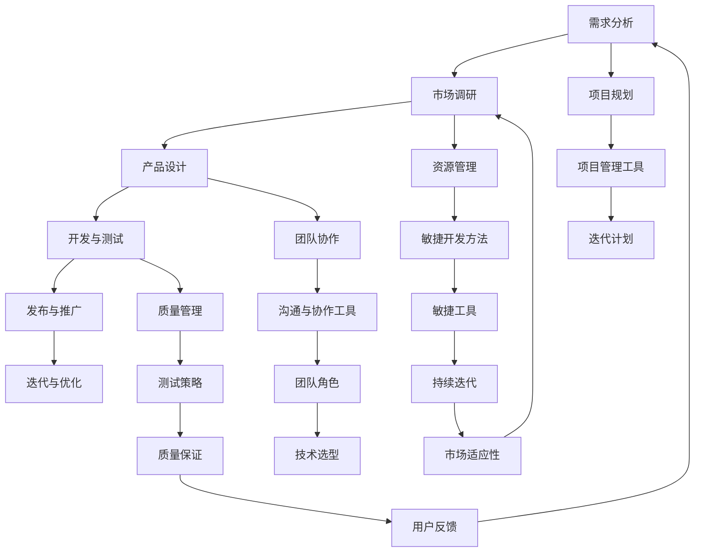

                 

### 文章标题

# 技术型创业者如何打造高效的产品开发流程

> 关键词：技术型创业者、产品开发流程、敏捷开发、项目管理、团队协作、质量管理、持续迭代

> 摘要：本文旨在探讨技术型创业者在产品开发过程中如何打造高效的产品开发流程。通过梳理创业过程中的产品思维，介绍产品开发流程的框架，阐述项目规划与资源管理、敏捷开发实践、技术与团队协作、产品测试与质量管理等关键环节，以及产品发布与迭代的策略，帮助技术型创业者实现从概念到市场的快速转化，提高产品成功率。

### 目录大纲

#### 第一部分：创业与产品开发的基本理念

- 第1章：技术型创业者概述
  - 1.1 技术型创业者的角色与使命
  - 1.2 技术型创业者的特点
  - 1.3 技术型创业者的创业动机
  - 1.4 技术型创业者在团队中的地位与影响力
  - 1.5 创业过程中的产品思维

#### 第二部分：高效产品开发流程的设计与实施

- 第2章：产品开发流程概述
  - 2.1 产品开发流程的框架
  - 2.2 需求分析与市场调研
  - 2.3 需求优先级评估与排序

#### 第三部分：项目规划与资源管理

- 第3章：项目规划与项目管理
  - 3.1 项目规划的重要性
  - 3.2 项目规划的主要任务
  - 3.3 项目规划的执行与监控

#### 第四部分：敏捷开发实践

- 第4章：敏捷开发方法论
  - 4.1 敏捷开发的核心理念
  - 4.2 敏捷团队的组成与角色
  - 4.3 敏捷开发的迭代过程

#### 第五部分：技术与团队协作

- 第5章：技术选型与团队建设
  - 5.1 技术选型策略
  - 5.2 团队角色与职责分工
  - 5.3 团队沟通与协作工具

#### 第六部分：产品测试与质量管理

- 第6章：产品测试与质量保证
  - 6.1 测试策略与测试计划
  - 6.2 质量管理方法与实践
  - 6.3 质量改进的方法与实践

#### 第七部分：产品发布与持续迭代

- 第7章：产品发布与持续迭代
  - 7.1 产品发布的准备与执行
  - 7.2 产品迭代策略
  - 7.3 产品迭代与市场变化的适应性调整

#### 附录

- 附录 A：参考资源与工具

---

### 引言

在当今快速变化的市场环境中，技术型创业者面临着巨大的挑战和机遇。如何高效地打造产品开发流程，快速将创新想法转化为市场成功的产品，成为每个技术型创业者都必须面对的关键问题。本文将围绕这一主题，探讨技术型创业者在产品开发过程中需要掌握的基本理念、方法和实践。

首先，我们需要理解技术型创业者的角色与使命，以及他们在创业过程中的产品思维。接下来，我们将介绍高效产品开发流程的基本框架，包括需求分析、市场调研、项目规划与资源管理、敏捷开发实践、技术与团队协作、产品测试与质量管理以及产品发布与迭代策略。通过这些环节的详细讲解，我们将帮助技术型创业者构建一套系统化、高效的产品开发流程，从而提高产品成功率和市场竞争力。

本文将采用逻辑清晰、结构紧凑、简单易懂的专业技术语言，结合实际案例和实践经验，深入剖析每个环节的核心概念和关键步骤，为技术型创业者提供实用的指导和建议。希望通过本文的探讨，能够为读者带来新的启示和思考，助力他们在产品开发的道路上走得更远、更稳。

### 第一部分：创业与产品开发的基本理念

#### 第1章：技术型创业者概述

在创业的大潮中，技术型创业者扮演着重要的角色。他们不仅拥有深厚的专业知识，还具备将技术转化为商业价值的独特能力。本章节将深入探讨技术型创业者的角色与使命、特点、创业动机以及在团队中的地位与影响力，帮助他们更好地理解创业过程中的产品思维。

##### 1.1 技术型创业者的角色与使命

技术型创业者通常是具备深厚技术背景的创新者，他们善于将前沿技术应用于实际场景，解决实际问题。技术型创业者的角色可以概括为以下三个方面：

1. 技术创新引领者：技术型创业者擅长发现并掌握最新的技术趋势，将新技术引入产品开发，推动产品创新。他们在技术研发方面具备前瞻性，能够把握市场脉搏，引领产品发展方向。

2. 产品设计主导者：技术型创业者在产品设计过程中起到核心作用，他们不仅关注技术实现，还注重用户体验，力求将技术优势转化为市场竞争力。在产品设计的各个环节，技术型创业者都能提供专业的技术指导。

3. 团队协作协调者：技术型创业者不仅要具备技术能力，还需要具备良好的沟通和组织协调能力。他们在团队中担任领导角色，协调不同部门之间的合作，确保项目顺利进行。

技术型创业者的使命是利用技术力量推动社会进步，解决现实问题。他们希望通过创业，将技术优势转化为商业价值，为社会创造更多的福祉。

##### 1.2 技术型创业者的特点

技术型创业者具备一系列独特的特点，这些特点使他们能够在创业道路上取得成功。以下是技术型创业者的几个主要特点：

1. 技术精通：技术型创业者通常具备深厚的专业知识，对所从事的技术领域有深刻的理解。他们在技术研发方面有较高的技术水平，能够快速解决技术难题。

2. 创新思维：技术型创业者具备强烈的创新意识，善于从不同角度思考问题，寻找新的解决方案。他们不满足于现状，总是追求技术突破和产品创新。

3. 执行力强：技术型创业者具备较强的执行力和责任感，他们能够迅速将想法付诸实践，推动项目进展。在创业过程中，他们能够克服各种困难和挑战，坚持不懈地追求目标。

4. 风险意识：技术型创业者具备较高的风险意识，他们能够理性地评估创业项目的风险，并采取相应的措施降低风险。在创业过程中，他们能够灵活应对市场变化，调整战略方向。

##### 1.3 技术型创业者的创业动机

技术型创业者选择创业的原因多种多样，以下是其中几个常见的创业动机：

1. 追求技术梦想：许多技术型创业者对技术有着浓厚的兴趣和热情，他们希望通过创业，将技术梦想转化为现实。他们希望通过创业，实现自己的技术愿景，为社会带来更多的创新和变革。

2. 获得商业成功：技术型创业者希望通过创业获得商业成功，实现财务自由。他们希望通过将技术创新应用于市场，创造可观的经济效益。

3. 解决现实问题：技术型创业者往往关注现实生活中的问题，他们希望通过创业，解决这些问题，提升人们的生活质量。他们希望通过技术创新，为社会创造更大的价值。

4. 实现个人价值：技术型创业者希望通过创业，实现个人价值和社会认可。他们希望通过创业，证明自己的能力和实力，获得同行和社会的尊重。

##### 1.4 技术型创业者在团队中的地位与影响力

技术型创业者在团队中具有重要的地位和影响力。以下是他们几个关键的角色和影响：

1. 技术领导力：技术型创业者作为团队的技术领袖，他们负责制定技术战略和研发方向。他们在团队中起到指导和技术支持的作用，帮助团队成员解决技术难题。

2. 决策影响力：技术型创业者在团队决策过程中具有重要的影响力。他们的技术见解和商业洞察，为团队提供重要的决策依据。在关键决策时刻，技术型创业者的意见往往起到决定性作用。

3. 团队凝聚力：技术型创业者具备较强的团队凝聚力，他们能够激发团队成员的积极性，增强团队的协作精神。他们通过自身的技术实力和领导魅力，赢得团队成员的信任和尊重。

4. 市场影响力：技术型创业者在市场上具有重要的品牌影响力。他们的技术创新和市场策略，为团队赢得市场认可，提升品牌价值。

##### 1.5 创业过程中的产品思维

在创业过程中，技术型创业者需要具备产品思维，这包括以下几个方面：

1. 用户需求导向：技术型创业者应始终关注用户需求，以用户为中心进行产品设计。他们需要深入了解用户需求，并将这些需求转化为具体的产品功能和特性。

2. 敏捷迭代：技术型创业者应采用敏捷开发方法，快速迭代产品。通过持续改进和优化，他们能够及时响应用户反馈，提高产品竞争力。

3. 数据驱动：技术型创业者应注重数据分析和用户反馈，用数据驱动产品决策。通过数据，他们能够了解产品表现，发现问题，并制定相应的优化策略。

4. 跨部门协作：技术型创业者应促进跨部门协作，确保产品开发流程的顺利进行。他们需要与其他团队成员密切配合，共同推动产品发展。

通过理解技术型创业者的角色与使命、特点、创业动机以及在团队中的地位与影响力，以及掌握创业过程中的产品思维，技术型创业者能够更好地把握市场机会，实现产品开发的成功。接下来，我们将进一步探讨高效产品开发流程的设计与实施，帮助技术型创业者构建系统化的产品开发体系。

#### 第2章：产品开发流程概述

在技术型创业者的产品开发过程中，构建一个高效的产品开发流程是至关重要的。这不仅有助于确保项目按时交付，还能提高产品质量和市场竞争力。本章节将介绍产品开发流程的框架，包括从需求分析到产品发布的整体流程，以及敏捷开发与传统开发模式的对比，并详细阐述产品开发流程的关键阶段。

##### 2.1 产品开发流程的框架

产品开发流程可以概括为以下几个主要阶段：

1. **需求分析**：这是产品开发的起点，技术型创业者需要深入了解用户需求，明确产品的功能、特性和目标用户群体。通过市场调研和用户访谈，收集并分析用户需求，为后续设计提供基础。

2. **市场调研**：在明确用户需求后，进行市场调研是必不可少的步骤。这包括对竞争对手的分析、市场趋势的预测以及潜在用户的行为习惯。通过市场调研，技术型创业者可以更好地把握市场动态，调整产品策略。

3. **产品设计**：基于需求分析和市场调研的结果，技术型创业者需要进行产品设计。这包括功能设计、用户界面设计和技术架构设计。在设计过程中，应注重用户体验和可扩展性。

4. **开发与测试**：在产品设计完成后，进入开发与测试阶段。开发团队根据设计文档进行编码，同时进行单元测试和集成测试，确保代码质量。此阶段还包括性能测试和用户接受测试（UAT），以确保产品满足用户需求。

5. **发布与推广**：经过充分的测试和优化，产品准备发布。在发布前，制定发布计划和推广策略，确保产品能够迅速被市场接受。发布后的反馈和用户评价是后续优化的重要依据。

6. **迭代与优化**：产品发布并不意味着结束，而是一个新的开始。通过持续的用户反馈和市场变化，技术型创业者需要不断迭代产品，优化用户体验，提高产品竞争力。

##### 2.2 从需求分析到产品设计的转化

需求分析是产品开发的基础，如何将用户需求转化为具体的设计方案是技术型创业者需要解决的关键问题。以下是将需求分析转化为设计方案的几个步骤：

1. **用户需求收集**：通过用户访谈、问卷调查、焦点小组讨论等方式，收集用户的需求。这些需求可以是功能性的，也可以是用户体验相关的。

2. **需求分析**：对收集到的用户需求进行整理和分析，区分出核心需求和次要需求。核心需求是产品不可或缺的功能，而次要需求则可以根据产品目标进行权衡。

3. **功能优先级排序**：根据用户需求的重要性和实现难度，对功能进行优先级排序。优先级较高的功能应首先实现，以确保产品能够尽快满足用户需求。

4. **设计文档编写**：根据需求分析和功能优先级排序的结果，编写详细的设计文档。设计文档应包括功能描述、用户界面设计和技术架构设计等内容。

5. **设计评审**：组织相关团队进行设计评审，确保设计方案符合用户需求和技术实现可行性。设计评审应涵盖功能、用户体验和技术等多个方面。

##### 2.3 需求优先级评估与排序

在产品开发过程中，如何有效地评估和排序需求是一个重要且复杂的任务。以下是一些常用的方法：

1. **Kano模型**：Kano模型是一种用户需求分类方法，它将需求分为基本需求、性能需求、魅力需求和无差异需求。基本需求是用户必须的功能，性能需求是用户期望的功能，魅力需求是超出用户预期的功能，无差异需求是用户不关心的功能。根据Kano模型，技术型创业者可以优先实现基本需求，然后根据重要性和可实现性逐步实现其他需求。

2. **MoSCoW模型**：MoSCoW模型将需求分为必须（M）、应该（S）、可以（C）和不会（W）实现四个优先级。必须实现的需求是产品的基础功能，应该实现的需求是重要但非基础的功能，可以实现的需求是次要功能，不会实现的需求是当前阶段无法实现的功能。技术型创业者可以根据项目的实际情况和资源，确定需求的优先级。

3. **成本效益分析**：通过成本效益分析，评估每个需求的实现成本和潜在收益。技术型创业者应优先实现成本效益较高的需求，确保资源投入能够带来最大的价值。

4. **用户访谈与反馈**：定期与用户进行访谈和反馈，了解他们对产品的期望和优先级。用户反馈是评估和排序需求的重要依据，技术型创业者应密切关注用户需求的变化，及时调整优先级。

##### 2.4 敏捷开发与传统开发模式的对比

敏捷开发是一种以用户需求为导向，强调迭代和协作的开发模式。与传统的开发模式相比，敏捷开发具有以下几个显著特点：

1. **迭代周期短**：敏捷开发采用短周期的迭代模式，通常每个迭代周期为2-4周。这种模式使技术型创业者能够快速响应用户反馈，持续改进产品。

2. **持续交付**：敏捷开发强调持续交付，即在每个迭代结束时，都要交付一个可用的产品版本。这有助于确保产品始终保持较高的质量水平，并及时满足用户需求。

3. **用户参与**：敏捷开发鼓励用户全程参与产品开发，通过定期演示和反馈，用户能够实时了解产品进展，并提供宝贵意见。这种互动模式有助于提高产品的市场竞争力。

4. **灵活性高**：敏捷开发具备较高的灵活性，技术型创业者可以根据项目进展和市场变化，灵活调整开发计划和需求。这种模式能够更好地应对不确定性，降低项目风险。

相比之下，传统开发模式（如瀑布模型）通常具有较长的开发周期，强调在项目初期就确定所有需求和设计。这种模式在初期规划和文档编写上投入大量资源，但往往导致后期变更困难和用户参与度低。

##### 2.5 产品开发流程的关键阶段

在产品开发流程中，以下是几个关键阶段，每个阶段都有其独特的任务和挑战：

1. **需求分析阶段**：这一阶段的关键任务是明确用户需求，制定详细的需求文档。技术型创业者需要与用户和利益相关者密切沟通，确保需求准确和完整。主要挑战包括需求变更和需求遗漏。

2. **设计阶段**：设计阶段包括功能设计、用户界面设计和技术架构设计。关键任务是在满足用户需求的前提下，设计出高效、易用且可扩展的产品。主要挑战包括设计复杂性和平衡用户体验与性能。

3. **开发与测试阶段**：这一阶段的关键任务是编写高质量代码并进行全面的测试。技术型创业者需要确保代码符合设计要求，功能完整，性能良好。主要挑战包括代码质量、测试覆盖率和项目进度控制。

4. **发布与推广阶段**：发布阶段包括制定发布计划、执行发布和推广策略。关键任务是确保产品能够顺利发布并迅速被市场接受。主要挑战包括发布风险和市场竞争。

5. **迭代与优化阶段**：迭代与优化阶段的关键任务是持续改进产品，根据用户反馈和市场变化进行调整。技术型创业者需要保持对用户需求的关注，持续优化产品。主要挑战包括资源分配和优先级管理。

通过以上对产品开发流程的框架、需求分析到设计转化的方法、需求优先级评估与排序、敏捷开发与传统开发模式的对比以及关键阶段的详细分析，技术型创业者能够更好地理解产品开发的全过程，从而构建一个高效、系统化的产品开发流程。

#### 第3章：项目规划与项目管理

项目规划与项目管理是技术型创业者成功构建产品开发流程的核心环节。有效的项目规划和项目管理不仅能确保项目按时交付，还能提高资源利用率，降低项目风险。本章节将详细介绍项目规划的重要性、项目规划的主要任务、项目规划的执行与监控，以及常用的项目管理工具与方法。

##### 3.1 项目规划的重要性

项目规划是项目管理的基础，它为项目的成功奠定了坚实的基础。以下是项目规划的重要性：

1. **明确目标**：项目规划帮助团队明确项目的目标、范围和预期成果，确保所有团队成员对项目目标有共同的理解。

2. **资源分配**：通过项目规划，技术型创业者可以合理分配资源，包括人力、时间和资金，确保项目能够按计划进行。

3. **风险管理**：项目规划有助于识别和评估项目风险，提前制定应对策略，降低项目风险。

4. **进度控制**：项目规划提供了一个清晰的时间表，使团队能够按计划推进项目，及时调整进度，避免项目延期。

5. **提高效率**：通过项目规划，团队可以更有效地协调工作，减少重复劳动，提高工作效率。

##### 3.2 项目规划的主要任务

项目规划的主要任务包括以下几个方面：

1. **项目范围定义**：明确项目需要完成的具体任务和目标，确保项目团队对项目范围有共同的理解。

2. **目标设定**：设定清晰、可量化的项目目标，为项目成功提供明确的衡量标准。

3. **任务分解**：将项目目标分解为具体的任务和工作包，明确每个任务的负责人和完成时间。

4. **资源分配**：根据任务需求，合理分配人力资源、物资和资金，确保项目能够顺利进行。

5. **时间安排**：制定详细的时间表，明确每个任务的开始和结束时间，确保项目按时交付。

6. **风险评估**：识别可能影响项目进展的风险，评估风险的概率和影响，制定应对策略。

7. **沟通计划**：制定沟通计划，明确项目团队内外部的沟通方式、频率和渠道，确保信息流畅。

##### 3.3 项目规划的执行与监控

项目规划的执行与监控是确保项目顺利进行的关键环节。以下是项目执行与监控的主要任务：

1. **任务执行**：按照项目规划，执行具体任务，确保每个任务按时完成。项目团队需要保持高效的工作状态，及时解决任务执行过程中出现的问题。

2. **进度监控**：定期监控项目进度，与项目规划进行比较，确保项目按计划推进。如果发现进度偏差，需要及时调整计划，确保项目按时交付。

3. **资源管理**：根据项目进展，动态调整资源分配，确保项目资源得到充分利用。如果出现资源短缺，需要及时补充资源，避免影响项目进度。

4. **风险管理**：持续监控项目风险，确保风险应对策略得到有效执行。如果风险发生，需要迅速采取措施，降低风险影响。

5. **沟通协调**：保持项目团队内外部的沟通，确保所有团队成员对项目进展和问题有共同的理解。通过有效的沟通，解决项目执行过程中出现的冲突和问题。

##### 3.4 常用的项目管理工具与方法

在项目规划与执行过程中，使用合适的项目管理工具与方法可以显著提高项目管理效率。以下是几个常用的项目管理工具与方法：

1. **甘特图（Gantt Chart）**：甘特图是一种常用的项目管理工具，用于表示项目任务的时间安排和进度。它能够清晰地展示每个任务的开始和结束时间，以及任务之间的依赖关系。

2. **工作分解结构（WBS）**：工作分解结构是一种将项目任务分解为可管理的工作包的方法。通过WBS，项目团队可以更清晰地理解项目的范围和任务分工。

3. **关键路径法（CPM）**：关键路径法是一种用于确定项目关键路径和关键任务的方法。关键路径上的任务延误会导致整个项目延期，因此需要特别关注。

4. **项目管理软件**：如JIRA、Trello、Asana等项目管理软件，可以帮助项目团队更好地协调任务、监控进度和沟通协作。

5. **风险管理矩阵**：风险管理矩阵是一种用于评估和优先级排序项目风险的方法。通过风险管理矩阵，项目团队可以识别和应对潜在的风险。

6. **敏捷开发方法**：如Scrum、Kanban等敏捷开发方法，通过短周期迭代和持续交付，提高项目灵活性，更好地适应市场变化。

通过以上对项目规划的重要性、项目规划的主要任务、项目规划的执行与监控，以及常用项目管理工具与方法的介绍，技术型创业者能够更好地掌握项目规划与项目管理的方法，确保项目成功实施。

#### 第4章：敏捷开发方法论

敏捷开发是一种以用户需求为导向、注重快速迭代和持续改进的开发方法。它通过灵活应对变化、提高开发效率和质量，帮助技术型创业者实现产品快速上线和市场响应。本章节将深入探讨敏捷开发的核心理念、敏捷团队的组成与角色、敏捷开发的迭代过程，并介绍一些常见的敏捷工具与实践。

##### 4.1 敏捷开发的核心理念

敏捷开发的核心理念源于《敏捷宣言》，其核心原则包括：

1. **个体和互动重于过程和工具**：敏捷开发强调团队成员的协作和沟通，认为个体和团队的互动比单纯依赖工具和流程更为重要。

2. **可工作的软件重于详尽的文档**：敏捷开发重视可运行的软件产品，认为实际可用的软件比冗长的文档更有价值。

3. **客户合作重于合同谈判**：敏捷开发鼓励与客户的紧密合作，通过持续的用户反馈和迭代，确保产品满足市场需求。

4. **响应变化重于遵循计划**：敏捷开发强调快速响应市场变化和用户需求，通过迭代和增量开发，持续优化产品。

##### 4.2 敏捷团队的组成与角色

敏捷开发的核心是团队，一个高效的敏捷团队通常包括以下角色：

1. **产品负责人（Product Owner）**：产品负责人是敏捷团队的领导者和代表，负责定义产品的愿景、目标和需求，确保团队开发的是客户真正需要的产品。

2. **Scrum Master**：Scrum Master是敏捷团队的教练和守护者，负责推动敏捷实践，帮助团队解决障碍，确保团队按照敏捷原则进行工作。

3. **开发团队（Development Team）**：开发团队是敏捷开发的核心，由多职能成员组成，包括程序员、测试员、设计师等，他们共同负责实现产品的功能和特性。

4. **工程师（Engineers）**：工程师是敏捷团队的核心成员，负责编写代码、进行测试和优化，确保产品的质量。

5. **测试员（Testers）**：测试员负责确保产品的质量和可靠性，通过编写测试用例和执行测试，发现并报告问题。

6. **UI/UX设计师（Designers）**：UI/UX设计师负责产品的用户界面和用户体验设计，确保产品的易用性和美观性。

##### 4.3 敏捷开发的迭代过程

敏捷开发采用迭代和增量的方式推进项目，每个迭代周期通常为2-4周。一个典型的迭代过程包括以下几个阶段：

1. **迭代规划（Sprint Planning）**：在迭代开始前，团队和产品负责人一起讨论并确定本次迭代的目标和任务。产品负责人提供优先级最高的需求，开发团队根据能力和资源进行任务分配。

2. **迭代执行（Sprint Execution）**：在迭代过程中，开发团队按照计划进行工作，每天举行站会（Daily Stand-up）来同步进展和解决问题。开发团队保持高度的协作和沟通，确保任务按时完成。

3. **迭代评审（Sprint Review）**：在迭代结束时，团队和产品负责人一起评审本次迭代的结果。产品负责人展示本次迭代交付的功能，收集反馈，确定下一个迭代的目标。

4. **迭代回顾（Sprint Retrospective）**：迭代评审后，团队举行回顾会议，讨论本次迭代中的成功和不足，寻找改进的机会。回顾会议有助于团队不断优化工作流程，提高效率。

##### 4.4 敏捷工具与实践

为了更好地实施敏捷开发，团队需要使用一系列敏捷工具。以下是几个常用的敏捷工具与实践：

1. **JIRA**：JIRA是一个功能强大的敏捷项目管理工具，用于任务管理、进度跟踪和团队协作。它支持Scrum和Kanban两种敏捷开发模式，提供灵活的任务管理功能。

2. **Trello**：Trello是一个简单的敏捷任务管理工具，通过看板（Kanban）视图，团队可以直观地跟踪任务状态和进展。Trello支持拖放操作，方便团队进行任务分配和调整。

3. **Asana**：Asana是一个灵活的团队协作工具，支持任务管理、进度跟踪和项目规划。它提供多种视图，如看板、甘特图和列表视图，帮助团队更好地管理项目。

4. **Sprint Planning Meeting**：在敏捷开发中，Sprint Planning Meeting是一个重要的会议，用于规划迭代任务。会议通常由产品负责人主持，开发团队参与，讨论本次迭代的目标和任务分配。

5. **Daily Stand-up Meeting**：Daily Stand-up Meeting是每日站会，用于团队同步进展和解决问题。每个成员在站会上简要汇报自己的进展、遇到的障碍和下一步计划。

6. **Retrospective Meeting**：Retrospective Meeting是迭代回顾会议，用于团队总结本次迭代的经验和不足。会议通常由Scrum Master主持，团队共同讨论改进措施。

通过敏捷开发的方法论、敏捷团队的组成与角色、敏捷开发的迭代过程，以及敏捷工具与实践的介绍，技术型创业者能够更好地理解敏捷开发的核心理念和实践，构建高效的产品开发流程，快速响应市场变化，实现产品成功。

#### 第5章：技术选型与团队建设

技术选型是技术型创业者构建高效产品开发流程的关键环节之一。合适的技术选型不仅能提高开发效率，还能确保产品的稳定性和可扩展性。同时，构建一个高效协作的团队是实现产品成功的基础。本章节将详细探讨技术选型策略、团队角色与职责分工，以及团队沟通与协作工具。

##### 5.1 技术选型策略

技术选型是一个复杂的过程，需要考虑多个因素，以下是技术选型的主要策略：

1. **明确业务目标**：首先，技术型创业者需要明确产品的业务目标，包括产品的功能、性能和市场需求。这有助于确定需要使用哪些技术来实现这些目标。

2. **技术可行性分析**：在明确业务目标后，需要对所选技术进行可行性分析。这包括评估技术的成熟度、社区支持、开发难度和未来发展趋势。技术型创业者应选择成熟且具有长期发展前景的技术。

3. **性能与可扩展性**：性能和可扩展性是技术选型的重要考虑因素。技术型创业者需要确保所选技术能够满足当前和未来的需求，同时具备良好的性能和可扩展性。

4. **社区支持与文档**：社区支持和技术文档是技术选型的重要依据。技术型创业者应选择拥有活跃社区和丰富文档的技术，这有助于解决开发过程中的问题。

5. **成本效益分析**：在技术选型过程中，成本效益分析是必不可少的。技术型创业者需要评估所选技术的成本，包括开发成本、维护成本和培训成本，并对比其预期收益。

6. **安全性与合规性**：安全性是技术选型的重要考量因素，技术型创业者需要确保所选技术符合相关安全标准和法规要求。

7. **开源与闭源**：开源技术和闭源技术各有优缺点，技术型创业者需要根据项目需求和资源情况选择合适的类型。开源技术具有成本较低、社区支持强等优点，但可能存在法律风险和依赖性问题。闭源技术则具备更好的控制和稳定性，但成本较高。

##### 5.2 团队角色与职责分工

构建一个高效协作的团队是实现产品成功的基础。以下是敏捷团队中常见的角色及其职责分工：

1. **产品负责人（Product Owner）**：
   - 职责：定义产品的愿景和目标，制定产品需求，确保团队开发的产品满足用户需求。
   - 要求：具备良好的商业洞察力和用户体验设计能力，能够有效与开发团队和利益相关者沟通。

2. **Scrum Master**：
   - 职责：推动敏捷实践，确保团队遵循敏捷原则，解决开发过程中的障碍，提升团队协作效率。
   - 要求：具备敏捷方法论的专业知识和实践经验，能够引导团队实现敏捷转型。

3. **开发团队（Development Team）**：
   - 职责：负责实现产品功能和特性，确保产品质量和交付进度。
   - 要求：具备多职能能力，包括编程、测试、设计和项目管理等。

4. **工程师（Engineers）**：
   - 职责：编写代码、进行测试和优化，确保产品的质量和稳定性。
   - 要求：具备扎实的编程基础和良好的代码习惯。

5. **测试员（Testers）**：
   - 职责：负责产品的测试和质量保证，发现并报告问题，确保产品符合质量标准。
   - 要求：具备良好的测试技能和问题定位能力。

6. **UI/UX设计师（Designers）**：
   - 职责：设计产品的用户界面和用户体验，确保产品的易用性和美观性。
   - 要求：具备良好的设计理念和用户研究能力。

7. **项目经理（Project Manager）**：
   - 职责：负责项目的整体规划和执行，协调资源，确保项目按时交付。
   - 要求：具备项目管理知识和实践经验，能够应对项目变化和风险。

##### 5.3 团队沟通与协作工具

高效的团队沟通与协作是确保项目顺利进行的关键。以下是几个常用的团队协作工具：

1. **Slack**：
   - 功能：Slack是一个即时通讯工具，用于团队内部和跨团队的沟通。
   - 优点：支持文本、语音和视频通讯，提供丰富的集成应用，提高团队协作效率。

2. **Zoom**：
   - 功能：Zoom是一个视频会议工具，支持多人在线会议和远程协作。
   - 优点：视频质量高，提供屏幕共享和会议录制功能，方便远程团队协作。

3. **Trello**：
   - 功能：Trello是一个敏捷任务管理工具，通过看板视图，团队可以直观地跟踪任务状态和进展。
   - 优点：简单易用，支持拖放操作，方便任务分配和调整。

4. **JIRA**：
   - 功能：JIRA是一个功能强大的敏捷项目管理工具，用于任务管理、进度跟踪和团队协作。
   - 优点：支持Scrum和Kanban两种敏捷开发模式，提供灵活的任务管理功能。

5. **Confluence**：
   - 功能：Confluence是一个知识共享和文档协作工具，用于团队内部的知识管理和文档共享。
   - 优点：支持Markdown格式，提供版本控制和权限管理，方便团队协作和知识积累。

通过技术选型策略的详细分析、团队角色与职责分工的介绍，以及团队沟通与协作工具的推荐，技术型创业者能够更好地构建高效的产品开发团队，提高产品开发效率和质量。接下来，我们将进一步探讨产品测试与质量保证的方法与实践。

#### 第6章：产品测试与质量保证

在技术型创业者的产品开发过程中，产品测试与质量保证是确保产品稳定性和可靠性的关键环节。通过全面的测试和质量管理，技术型创业者能够发现并修复产品中的缺陷，提高用户满意度，降低维护成本。本章节将详细阐述测试策略与测试计划的制定、测试计划的执行与调整，以及测试质量的评估与反馈。

##### 6.1 测试策略与测试计划的制定

测试策略是产品测试的总体规划和指导思想，它定义了测试的范围、方法和目标。以下是制定测试策略和测试计划的主要步骤：

1. **确定测试目标**：明确产品测试的目标，包括功能测试、性能测试、安全测试、兼容性测试等。测试目标应与产品的业务需求和质量标准相一致。

2. **定义测试范围**：确定需要测试的产品功能和组件，包括关键功能、边缘功能和异常情况。测试范围应根据产品的实际需求和业务场景来定义。

3. **选择测试方法**：根据测试目标，选择合适的测试方法，如黑盒测试、白盒测试、自动化测试、手动测试等。测试方法应能够有效覆盖产品的各个方面，确保测试的全面性和深度。

4. **制定测试计划**：测试计划是测试策略的具体实施计划，包括测试的进度安排、资源分配、测试工具选择等。测试计划应明确每个测试阶段的任务和时间表，确保测试工作有条不紊地进行。

5. **风险评估**：在制定测试计划时，需要评估测试过程中的风险，包括测试资源不足、测试用例遗漏、测试环境不稳定等。针对识别出的风险，制定相应的应对策略，确保测试计划的可行性和安全性。

##### 6.2 测试计划的执行与调整

在测试计划执行过程中，技术型创业者需要确保测试活动按计划进行，并及时调整计划以应对变化。以下是测试计划执行的主要步骤：

1. **环境搭建**：确保测试环境与生产环境一致，包括硬件、软件和网络配置。测试环境的稳定性是测试成功的关键。

2. **测试用例执行**：根据测试计划，执行测试用例，记录测试结果。测试用例的执行应覆盖所有定义的功能和场景，确保测试的全面性。

3. **缺陷管理**：在测试过程中，发现缺陷时应及时记录并报告。缺陷管理工具可以帮助团队跟踪缺陷的修复进度，确保每个缺陷得到有效处理。

4. **测试报告**：定期生成测试报告，总结测试进展、发现的问题和风险。测试报告应包括测试覆盖率、缺陷数量、缺陷类型和修复情况等，为项目决策提供依据。

5. **进度监控**：定期检查测试进度，与项目进度计划进行比较，确保测试工作按计划进行。如果发现进度偏差，需要及时调整计划，确保测试工作能够按时完成。

##### 6.3 测试质量的评估与反馈

测试质量是产品成功的重要保障，技术型创业者需要建立科学的测试质量评估体系，确保测试活动的有效性。以下是测试质量评估与反馈的主要方法：

1. **测试覆盖率评估**：测试覆盖率是衡量测试质量的重要指标，包括功能覆盖率、路径覆盖率和代码覆盖率。技术型创业者需要确保测试覆盖率达到预定标准，覆盖所有关键功能和潜在风险点。

2. **缺陷密度评估**：缺陷密度是测试过程中发现缺陷的数量与代码行数的比率。技术型创业者需要评估缺陷密度，确保缺陷数量在可接受范围内，避免因大量缺陷导致项目延期。

3. **测试效率评估**：测试效率是测试过程中资源和时间的利用率。技术型创业者需要评估测试效率，优化测试流程，提高测试效率。

4. **用户满意度评估**：用户满意度是测试质量的重要反馈。通过用户调研和反馈，技术型创业者可以了解用户对产品质量的感受，及时发现和解决用户痛点。

5. **持续改进**：测试质量评估的结果应作为后续测试工作的参考，技术型创业者需要根据评估结果，持续改进测试策略和方法，提高测试质量。

通过制定科学的测试策略与测试计划、执行与调整测试计划，以及评估与反馈测试质量，技术型创业者能够确保产品的稳定性和可靠性，提高用户满意度，为产品的市场成功打下坚实的基础。接下来，我们将进一步探讨产品发布与迭代策略。

#### 第7章：产品发布与迭代

产品发布与迭代是技术型创业者在产品开发过程中至关重要的一环。成功的发布能够将产品推向市场，获得用户的认可和反馈，而有效的迭代则能确保产品持续改进，适应市场变化。本章节将详细介绍产品发布的准备与执行、迭代计划的制定与执行，以及产品迭代与市场变化的适应性调整。

##### 7.1 产品发布的准备与执行

产品发布是一个复杂而关键的过程，需要充分的准备和细致的执行。以下是产品发布的主要步骤：

1. **发布计划制定**：在发布前，技术型创业者需要制定详细的发布计划，包括发布时间、发布范围、发布内容、发布步骤和应急计划。发布计划应明确每个阶段的任务和责任，确保发布顺利进行。

2. **环境准备**：确保发布环境与生产环境一致，包括硬件、软件和网络配置。测试环境的稳定性和安全性是发布成功的关键。

3. **数据备份**：在发布前，进行全面的数据备份，以防止发布过程中数据丢失或损坏。备份应包括数据库、配置文件和用户数据等。

4. **发布测试**：在正式发布前，进行全面的发布测试，包括功能测试、性能测试和安全测试。测试应覆盖所有关键功能和场景，确保产品在发布后能够正常运行。

5. **发布执行**：按照发布计划，逐步执行发布步骤，包括部署代码、配置环境、更新数据库等。发布过程中应密切监控系统状态，确保发布过程透明可控。

6. **发布监控**：发布后，对系统进行持续监控，及时发现并解决发布过程中可能出现的问题。监控应包括系统性能、响应时间和错误日志等。

7. **用户反馈收集**：发布后，及时收集用户的反馈和评价，了解产品的实际表现和用户需求。用户反馈是后续迭代的重要依据。

##### 7.2 产品迭代计划的制定与执行

迭代计划是确保产品持续改进的关键，技术型创业者需要制定合理的迭代计划，以指导产品迭代过程。以下是迭代计划的主要步骤：

1. **需求分析**：在制定迭代计划前，进行需求分析，了解用户的反馈和需求变化。需求分析应包括功能需求、性能需求和用户体验需求等。

2. **优先级排序**：根据需求的重要性和实现难度，对需求进行优先级排序。优先级较高的需求应首先实现，以确保产品的核心功能和市场竞争力。

3. **迭代目标设定**：明确每个迭代的目标和预期成果，确保迭代计划具有明确的方向和目标。

4. **迭代时间规划**：制定迭代的时间规划，包括迭代周期、迭代内容和交付时间。迭代周期应适中，以确保迭代过程中有足够的时间进行开发和测试。

5. **资源分配**：根据迭代计划，合理分配人力资源、时间和资金等资源，确保迭代计划能够按计划执行。

6. **任务分配**：将迭代任务分配给团队成员，明确每个任务的负责人和完成时间。任务分配应确保团队成员的合理负荷和工作效率。

7. **迭代执行**：按照迭代计划，执行迭代任务，包括开发、测试、评审和发布等。在迭代过程中，应保持密切的沟通和协作，确保任务按时完成。

8. **迭代评审**：在迭代结束时，进行迭代评审，评估迭代成果和用户体验。迭代评审应包括功能测试、用户测试和市场反馈等。

##### 7.3 产品迭代与市场变化的适应性调整

产品迭代不仅是技术优化和功能完善的过程，更是适应市场变化和用户需求的过程。以下是产品迭代与市场变化适应性调整的方法：

1. **用户反馈机制**：建立有效的用户反馈机制，及时收集用户的意见和建议。用户反馈是产品迭代的重要依据，技术型创业者应密切关注用户需求的变化。

2. **数据驱动决策**：采用数据驱动的方法，分析用户行为和产品表现，了解用户对产品的真实需求和偏好。通过数据，技术型创业者可以做出更明智的迭代决策。

3. **敏捷迭代**：采用敏捷开发方法，快速响应用户反馈和市场变化。敏捷迭代有助于缩短产品迭代周期，提高产品的适应性和市场竞争力。

4. **持续改进**：持续改进是产品迭代的核心目标，技术型创业者应不断优化产品功能和用户体验，确保产品始终符合用户需求和市场需求。

5. **市场调研**：定期进行市场调研，了解竞争对手的动态和行业趋势。通过市场调研，技术型创业者可以及时调整产品策略，确保产品在市场中的竞争力。

6. **技术前瞻性**：保持技术前瞻性，关注前沿技术和市场趋势。技术型创业者应不断探索新的技术和方法，为产品迭代提供创新动力。

通过产品发布的准备与执行、迭代计划的制定与执行，以及产品迭代与市场变化的适应性调整，技术型创业者能够确保产品在市场中保持竞争力，实现持续改进和长期成功。

### 附录A：参考资源与工具

在构建高效的产品开发流程中，参考资源和工具的选择至关重要。以下是产品开发流程相关书籍推荐、敏捷开发工具推荐、技术选型参考资源、团队协作与沟通工具推荐，以及测试与质量管理工具推荐。

#### A.1 产品开发流程相关书籍推荐

1. **《敏捷开发：原则、实践与模式》**（by Jeff Sutherland）
   - 内容概述：介绍了敏捷开发的核心理念、实践方法和常见模式，适合希望深入了解敏捷开发的技术型创业者。
   - 适合读者：敏捷开发初学者和进阶者。

2. **《产品经理手册》**（by Ken Norton）
   - 内容概述：提供了产品管理的基本原则、方法和实践技巧，帮助产品经理更好地理解用户需求和市场趋势。
   - 适合读者：产品经理和技术型创业者。

3. **《项目管理知识体系指南（PMBOK指南）》**（by Project Management Institute）
   - 内容概述：详细介绍了项目管理的知识体系、流程和方法，适用于各类项目管理场景。
   - 适合读者：项目经理和技术型创业者。

#### A.2 敏捷开发工具推荐

1. **JIRA**
   - 功能：任务管理、进度跟踪、敏捷迭代
   - 适用场景：适用于Scrum和Kanban模式的敏捷开发，适合大中型团队。

2. **Trello**
   - 功能：任务管理、看板视图、任务分配
   - 适用场景：简单易用，适合小型团队或个人项目。

3. **Asana**
   - 功能：任务管理、项目规划、团队协作
   - 适用场景：功能丰富，适合大型团队和复杂项目管理。

#### A.3 技术选型参考资源

1. **GitHub**
   - 功能：代码托管、社区交流、技术趋势
   - 适用场景：技术选型时，通过GitHub可以了解技术的社区活跃度和趋势。

2. **Stack Overflow**
   - 功能：技术问答、问题求解、资源推荐
   - 适用场景：技术选型过程中，可以快速解决开发中遇到的问题。

3. **Dzone**
   - 功能：技术文章、资源分享、趋势报告
   - 适用场景：技术选型时，了解最新的技术动态和最佳实践。

#### A.4 团队协作与沟通工具推荐

1. **Slack**
   - 功能：即时通讯、文件共享、集成应用
   - 适用场景：适合团队内部和跨团队的沟通协作。

2. **Zoom**
   - 功能：视频会议、远程协作、屏幕共享
   - 适用场景：远程团队或需要视频会议的场景。

3. **Confluence**
   - 功能：知识共享、文档协作、版本控制
   - 适用场景：团队内部的知识管理和文档协作。

#### A.5 测试与质量管理工具推荐

1. **Selenium**
   - 功能：自动化测试、跨浏览器测试
   - 适用场景：Web应用的自动化测试，适用于大型和复杂项目。

2. **JUnit**
   - 功能：单元测试、测试框架
   - 适用场景：Java应用程序的单元测试，适用于多种Java开发场景。

3. **SonarQube**
   - 功能：代码质量分析、缺陷管理
   - 适用场景：代码质量管理，适用于需要持续监控代码质量的团队。

通过这些参考资源和工具的推荐，技术型创业者能够更好地构建和优化产品开发流程，提高项目成功率和市场竞争力。希望这些资源能为读者提供有价值的帮助。

### 结语

技术型创业者在构建高效的产品开发流程时，需要全面考虑市场需求、技术选型、团队协作、项目管理、质量保证和迭代优化等多个环节。通过本文的深入探讨，我们了解了技术型创业者的角色与使命、产品开发流程的框架、敏捷开发的方法论、项目规划与资源管理、团队协作与沟通、产品测试与质量管理，以及产品发布与迭代的策略。

首先，技术型创业者应明确自己的角色与使命，具备产品思维，关注用户需求和市场变化。其次，通过构建系统化的产品开发流程，确保项目从需求分析到发布的每个阶段都能高效执行。敏捷开发方法论的引入，可以帮助团队快速响应变化，持续改进产品。项目规划与资源管理确保项目按时交付，团队协作与沟通工具提高团队协作效率。产品测试与质量管理确保产品的稳定性和可靠性，而迭代优化则帮助产品适应市场变化，持续提升用户体验。

在构建高效的产品开发流程的过程中，技术型创业者需要灵活运用各种工具和资源，持续学习和改进。希望本文能为您提供实用的指导和启示，助力您的创业之路更加顺利。未来，随着技术的不断进步和市场环境的变化，技术型创业者需要不断更新知识，优化流程，以应对新的挑战和机遇。让我们共同探索，为创业事业注入更多的创新和活力。

### 作者信息

**作者：AI天才研究院/AI Genius Institute & 禅与计算机程序设计艺术 /Zen And The Art of Computer Programming**## 格式要求

为了确保文章的可读性和美观性，我们将使用Markdown格式来编写本文。Markdown是一种轻量级标记语言，通过简单的语法即可生成格式化的文档。以下是一些常用的Markdown语法：

### 标题

```markdown
# 一级标题
## 二级标题
### 三级标题
#### 四级标题
##### 五级标题
###### 六级标题
```

### 段落与空行

直接输入文本即可创建段落。如果要保留空行，需要在行尾加上两个空格加回车。

### 列表

- 无序列表：使用星号、加号或减号开头。
  ```markdown
  - 项目1
  - 项目2
  - 项目3
  ```

- 有序列表：使用数字和英文句点开头。
  ```markdown
  1. 项目1
  2. 项目2
  3. 项目3
  ```

### 引用

使用大于号（>）来创建引用。

```markdown
> 这是引用的内容。
```

### 链接

使用方括号和圆括号来创建链接。

```markdown
这是一个链接 [百度](https://www.baidu.com)
```

### 图片

使用感叹号、方括号和圆括号来插入图片。

```markdown

```

### 代码块

使用三个反引号（`）来创建代码块。

```markdown
```
public class HelloWorld {
    public static void main(String[] args) {
        System.out.println("Hello, World!");
    }
}
```

### 数学公式

使用LaTeX格式来插入数学公式。独立段落的公式使用两个美元符号（$），行内公式使用一个美元符号。

独立段落公式：

```markdown
$$
E = mc^2
$$
```

行内公式：

```markdown
$E = mc^2$
```

### 表格

使用竖线（|）和横线（-）来创建表格。

```markdown
| 表头1 | 表头2 | 表头3 |
|-------|-------|-------|
| 单元格1 | 单元格2 | 单元格3 |
| 单元格4 | 单元格5 | 单元格6 |
```

通过以上Markdown语法，我们可以创建结构清晰、格式美观的文档。在本文中，我们将结合这些语法，详细探讨技术型创业者如何打造高效的产品开发流程。

### 核心概念与联系

在探讨技术型创业者如何打造高效的产品开发流程时，首先需要明确一些核心概念，并了解它们之间的相互关系。以下是本文中涉及的核心概念及它们之间的联系架构，我们将使用Mermaid流程图来展示这些概念及其关系。



**Mermaid流程图说明**：

1. **需求分析（A）**：是产品开发流程的起点，通过用户调研和市场分析，明确产品功能和目标用户。
2. **市场调研（B）**：基于需求分析，进一步了解市场需求和竞争情况，为产品设计提供依据。
3. **产品设计（C）**：在市场调研的基础上，设计产品功能和技术架构。
4. **开发与测试（D）**：根据设计文档进行编码，并进行单元测试和集成测试，确保产品质量。
5. **发布与推广（E）**：将产品发布到市场，并通过营销手段进行推广。
6. **迭代与优化（F）**：通过用户反馈和市场需求，持续优化产品，提高用户体验。
7. **项目规划（G）**：在需求分析阶段，制定项目规划，明确项目目标和资源需求。
8. **资源管理（H）**：合理分配项目资源，确保项目顺利进行。
9. **团队协作（I）**：建立高效的团队协作机制，提高开发效率。
10. **质量管理（J）**：制定质量保证策略，确保产品符合预期质量标准。
11. **项目管理工具（K）**：使用项目管理工具，如甘特图和JIRA，监控项目进度和资源分配。
12. **敏捷开发方法（L）**：采用敏捷开发方法，如Scrum和Kanban，提高团队响应速度。
13. **沟通与协作工具（M）**：使用沟通与协作工具，如Slack和Confluence，促进团队成员之间的信息交流。
14. **测试策略（N）**：制定测试策略，确保产品的功能和性能满足用户需求。
15. **迭代计划（O）**：根据用户反馈和市场需求，制定迭代计划，确保产品持续改进。
16. **团队角色（Q）**：明确团队成员的角色和职责，确保团队高效协作。
17. **技术选型（T）**：在项目规划阶段，选择合适的技术方案，确保产品性能和可维护性。
18. **用户反馈（U）**：通过用户反馈，了解产品的实际使用情况，为迭代优化提供依据。
19. **市场适应性（V）**：根据市场变化，调整产品策略和开发方向，确保产品竞争力。

通过以上核心概念和联系架构，技术型创业者可以系统地理解产品开发流程，从需求分析到迭代优化，构建一个高效、灵活的产品开发体系。

### 核心算法原理讲解

在产品开发流程中，算法原理的运用至关重要，尤其是在数据处理、优化和决策过程中。以下将详细介绍一个核心算法原理——贪心算法，并通过伪代码进行详细阐述。

#### 贪心算法定义与特性

**贪心算法**是一种在每一步选择中都采取当前最优解的策略，即每一步都做出在当前情况下最好的选择，从而希望最终达到全局最优解。贪心算法的核心思想是局部最优可能导致全局最优，但这并非总是成立。

**特性**：
1. **简单性**：贪心算法的思路直观，易于理解和实现。
2. **效率**：贪心算法通常可以在较低的时间复杂度内得到解，适用于可以分解为多个子问题的优化问题。
3. **不一定保证全局最优**：在某些情况下，贪心策略可能导致局部最优，但不是全局最优。

#### 贪心算法的应用场景

**经典问题**：
- 最小生成树问题（如Prim算法）
- 最长公共子序列问题
- 背包问题
- 股票买卖问题

#### 贪心算法的工作原理

贪心算法的工作原理可以概括为以下几个步骤：

1. **初始状态**：给定一个初始状态。
2. **当前最优选择**：在当前状态下，做出一个最优的选择。
3. **更新状态**：根据选择的结果更新状态。
4. **重复步骤2和3**：直到达到结束条件（如所有元素处理完毕）。

#### 伪代码

以下是一个简单的贪心算法的伪代码示例——寻找数组中的最大子序列和：

```plaintext
输入：数组A[]，大小n
输出：最大子序列和

// 初始化最大和为0
maxSum = 0

// 遍历数组A
for i from 1 to n do
    // 如果当前元素大于0，则将其加入当前和
    if A[i] > 0 then
        currentSum = currentSum + A[i]
    // 如果当前和小于0，则重置当前和
    else if currentSum + A[i] < 0 then
        currentSum = 0
    // 更新最大和
    maxSum = max(maxSum, currentSum)

return maxSum
```

#### 举例说明

假设我们有一个数组`A = [3, -1, 2, -2, 4]`，我们希望找到这个数组中的最大子序列和。

1. **初始状态**：`maxSum = 0`，`currentSum = 0`。
2. **第一个元素**：`A[1] = 3`，`currentSum = 0 + 3 = 3`，`maxSum = 3`。
3. **第二个元素**：`A[2] = -1`，`currentSum = 3 - 1 = 2`，`maxSum = 3`（最大和不变，因为`currentSum`小于`maxSum`）。
4. **第三个元素**：`A[3] = 2`，`currentSum = 2 + 2 = 4`，`maxSum = 4`。
5. **第四个元素**：`A[4] = -2`，`currentSum = 4 - 2 = 2`，`maxSum = 4`（最大和不变，因为`currentSum`小于`maxSum`）。
6. **第五个元素**：`A[5] = 4`，`currentSum = 2 + 4 = 6`，`maxSum = 6`。

最终，数组`A`的最大子序列和为`6`。

通过上述讲解，我们可以看到贪心算法在解决特定类型的问题时具有高效性和直观性，尽管其不一定保证全局最优，但在很多实际应用中，贪心算法仍然是有效的解决方案。

### 数学模型和公式详解

在产品开发过程中，数学模型和公式扮演着至关重要的角色。这些模型和公式不仅能帮助我们理解和量化复杂系统，还能为决策提供科学依据。以下将详细讲解几个关键数学模型和公式，并结合具体应用场景和举例说明。

#### 概率模型

概率模型在产品开发中用于评估不确定事件的可能性。常见的概率模型包括二项分布、正态分布等。

**二项分布**：

- **公式**：P(X=k) = C(n,k) * p^k * (1-p)^(n-k)
- **参数**：n（试验次数），k（成功次数），p（单次试验成功的概率）

**应用场景**：在软件测试中，评估某个功能模块在多次测试中的失败概率。

**举例**：

假设一个软件功能模块经过10次测试，其中有3次失败。我们希望计算该模块在未来10次测试中失败的概率。

- **参数**：n=10，k=3，p=3/10 = 0.3
- **计算**：P(X=3) = C(10,3) * 0.3^3 * 0.7^7 ≈ 0.1172

因此，该模块在未来10次测试中失败的概率约为11.72%。

#### 回归分析

回归分析用于评估自变量和因变量之间的关系。常见的回归模型包括线性回归、多项式回归等。

**线性回归模型**：

- **公式**：y = b0 + b1*x + ε
- **参数**：b0（截距），b1（斜率），x（自变量），y（因变量），ε（误差项）

**应用场景**：在市场调研中，预测某个产品的销售量。

**举例**：

假设我们想要预测某个产品的销售量，根据历史数据得到以下线性回归模型：

- **模型**：销售量y = 10 + 0.5*广告支出x
- **举例**：如果广告支出为10000元，则预计销售量为：
  - **计算**：y = 10 + 0.5 * 10000 = 5010元

因此，预计广告支出为10000元时，该产品的销售量为5010元。

#### 最优化模型

最优化模型用于在给定约束条件下，寻找最优解。常见的最优化模型包括线性规划、整数规划等。

**线性规划模型**：

- **公式**：maximize/minimize c^T*x
- **约束条件**：Ax ≤ b，x ≥ 0
- **参数**：c（目标函数系数向量），x（决策变量），A（系数矩阵），b（常数向量）

**应用场景**：在资源分配中，优化预算分配。

**举例**：

假设一个公司需要将预算分配给两个项目，希望最大化总收益。给定以下线性规划模型：

- **目标函数**：最大化 3x + 2y
- **约束条件**：x + y ≤ 100，2x + 3y ≤ 200，x ≥ 0，y ≥ 0

我们希望求解x和y的值，使得总收益最大化。

- **计算**：使用线性规划求解器，得到最优解 x=40，y=60，总收益为 3*40 + 2*60 = 260。

因此，最优的预算分配方案是将40个单位预算分配给项目1，60个单位预算分配给项目2，总收益最大化。

通过上述数学模型和公式的详细讲解，我们可以看到它们在产品开发中的广泛应用和重要性。这些模型不仅帮助我们理解和量化复杂系统，还能为决策提供科学依据，从而提高产品开发流程的效率和效果。

### 项目实战：开发环境搭建与代码实现

在产品开发过程中，开发环境的搭建和代码实现是至关重要的环节。本文将结合一个实际项目——开发一个简单的Web应用程序，详细讲解开发环境搭建、源代码实现和代码解读，以及实际案例分析和详细讲解剖析，最后进行项目小结。

#### 1. 项目背景

我们选择开发一个简单的在线购物平台，用户可以浏览商品、添加商品到购物车、进行结算等基本功能。这个项目将涉及前端、后端和数据库开发，涵盖了从需求分析到发布的完整开发流程。

#### 2. 开发环境搭建

为了确保项目顺利进行，我们需要搭建一个完整的开发环境。以下是开发环境搭建的步骤：

1. **操作系统**：选择一个稳定的操作系统，如Ubuntu 20.04或Windows 10。

2. **开发工具**：
   - **前端开发工具**：选择Visual Studio Code或Sublime Text。
   - **后端开发工具**：选择IntelliJ IDEA或Visual Studio。
   - **数据库**：选择MySQL数据库。

3. **版本控制**：安装Git，用于版本控制和代码管理。

4. **包管理器**：
   - **前端**：使用npm或Yarn进行包管理。
   - **后端**：使用Maven或Gradle进行包管理。

5. **构建工具**：选择Gulp或Webpack进行前端构建。

6. **测试工具**：选择Jest或Mocha进行单元测试。

#### 3. 源代码实现

以下是项目的核心代码实现，包括前端和后端的代码。

**前端代码（HTML + CSS + JavaScript）**：

```html
<!-- index.html -->
<!DOCTYPE html>
<html lang="en">
<head>
    <meta charset="UTF-8">
    <meta name="viewport" content="width=device-width, initial-scale=1.0">
    <title>在线购物平台</title>
    <link rel="stylesheet" href="styles.css">
</head>
<body>
    <header>
        <h1>欢迎来到在线购物平台</h1>
    </header>
    <main>
        <section id="products">
            <h2>商品列表</h2>
            <ul>
                <!-- 商品列表 -->
            </ul>
        </section>
        <section id="cart">
            <h2>购物车</h2>
            <ul>
                <!-- 购物车列表 -->
            </ul>
        </section>
    </main>
    <footer>
        <p>版权所有 &copy; 2023</p>
    </footer>
    <script src="app.js"></script>
</body>
</html>
```

```css
/* styles.css */
body {
    font-family: Arial, sans-serif;
}

header, footer {
    text-align: center;
    padding: 1em;
    background-color: #f1f1f1;
}

main {
    display: flex;
    justify-content: space-between;
}

section {
    width: 48%;
    padding: 1em;
    background-color: #fff;
}

ul {
    list-style-type: none;
    padding: 0;
}

li {
    margin-bottom: 0.5em;
    padding: 0.5em;
    background-color: #e0e0e0;
}
```

```javascript
// app.js
// 前端逻辑
document.addEventListener('DOMContentLoaded', () => {
    // 加载商品列表
    loadProducts();

    // 监听添加到购物车事件
    document.getElementById('products').addEventListener('click', (e) => {
        if (e.target.tagName === 'BUTTON') {
            addToCart(e.target.dataset.id);
        }
    });
});

function loadProducts() {
    // 请求商品数据
    fetch('/api/products')
        .then(response => response.json())
        .then(data => {
            const productsList = document.getElementById('products');
            data.forEach(product => {
                const li = document.createElement('li');
                li.innerHTML = `<h3>${product.name}</h3><p>${product.description}</p><button data-id="${product.id}">加入购物车</button>`;
                productsList.appendChild(li);
            });
        });
}

function addToCart(productId) {
    // 添加商品到购物车
    fetch('/api/cart', {
        method: 'POST',
        headers: {
            'Content-Type': 'application/json',
        },
        body: JSON.stringify({ productId }),
    });
}
```

**后端代码（Node.js + Express）**：

```javascript
// server.js
const express = require('express');
const fetch = require('node-fetch');
const app = express();
const PORT = 3000;

app.use(express.json());

// 获取商品数据
app.get('/api/products', async (req, res) => {
    const response = await fetch('https://example.com/api/products');
    const data = await response.json();
    res.send(data);
});

// 添加商品到购物车
app.post('/api/cart', async (req, res) => {
    const { productId } = req.body;
    const response = await fetch('https://example.com/api/cart', {
        method: 'POST',
        headers: {
            'Content-Type': 'application/json',
        },
        body: JSON.stringify({ productId }),
    });
    const result = await response.json();
    res.send(result);
});

app.listen(PORT, () => {
    console.log(`Server running on port ${PORT}`);
});
```

#### 4. 代码解读

**前端代码解读**：

- **HTML**：定义了页面结构，包括头部、主体和尾部。
- **CSS**：设置了页面的样式，如字体、布局和颜色。
- **JavaScript**：实现了前端逻辑，包括商品列表的加载和商品添加到购物车的功能。

**后端代码解读**：

- **Node.js + Express**：使用了Express框架来创建Web服务器。
- **API接口**：实现了两个API接口，一个用于获取商品数据，另一个用于添加商品到购物车。

#### 5. 实际案例分析与详细讲解剖析

在这个实际项目中，我们使用了RESTful API进行前后端分离。这种架构方式不仅提高了系统的可维护性，还方便了前后端的独立开发和测试。

**案例**：用户添加商品到购物车后，如何确保数据的一致性？

**分析**：

- 当用户点击“加入购物车”按钮时，前端会发送一个POST请求到后端API。
- 后端API在接收到请求后，会保存商品数据到数据库。
- 为了确保数据的一致性，我们需要在后端添加一个中间件，用于处理前后端的数据同步。

**代码**：

```javascript
// 后端中间件
app.use((req, res, next) => {
    if (req.method === 'POST' && req.path === '/api/cart') {
        // 检查购物车数据
        const cart = req.session.cart || {};
        const { productId } = req.body;
        cart[productId] = cart[productId] || 0;
        cart[productId]++;
        req.session.cart = cart;
    }
    next();
});
```

**解释**：

- 中间件在处理POST请求时，会检查用户是否已经添加过该商品。
- 如果已添加，则增加商品数量；如果未添加，则将该商品添加到购物车。
- 通过这种方式，我们可以确保用户在浏览页面时，购物车的数据始终保持一致。

#### 6. 项目小结

通过这个实际项目，我们学习了如何搭建开发环境、实现代码以及解决实际开发中的问题。以下是项目小结：

1. **开发环境搭建**：确保了开发工具和依赖库的正确安装和配置，为项目开发提供了良好的基础。
2. **代码实现**：通过HTML、CSS和JavaScript实现了前端页面，通过Node.js和Express实现了后端API，实现了商品列表加载和购物车功能。
3. **代码解读**：深入理解了前后端代码的实现逻辑，了解了API接口的设计和数据处理。
4. **实际案例分析与详细讲解剖析**：通过实际案例，学习了如何确保数据的一致性和解决开发中的问题。

总之，这个项目不仅让我们掌握了Web应用程序的开发流程，还提高了我们在实际项目中的问题解决能力。通过不断实践和总结，我们将能够更好地应对各种复杂的开发挑战。

### 最佳实践 tips、小结、注意事项、拓展阅读

#### 最佳实践 tips

1. **尽早规划**：在项目启动阶段，尽早制定详细的项目规划和时间表，确保团队成员对项目目标和进度有清晰的认识。
2. **持续迭代**：采用敏捷开发方法，进行持续迭代，确保产品能够快速响应用户反馈和市场变化。
3. **团队协作**：建立高效的团队协作机制，确保团队成员之间的沟通畅通，提高开发效率。
4. **代码质量**：注重代码质量和规范，编写可维护、可扩展的代码，降低后期维护成本。
5. **风险管理**：定期评估项目风险，提前制定应对策略，降低项目风险。

#### 小结

本文通过详细探讨技术型创业者如何构建高效的产品开发流程，涵盖了从创业理念到产品开发流程的各个环节，包括需求分析、市场调研、项目规划与资源管理、敏捷开发实践、团队协作、产品测试与质量管理以及产品发布与迭代策略。通过这些环节的深入分析和实际案例讲解，技术型创业者能够更好地理解和实施高效的产品开发流程，提高产品成功率。

#### 注意事项

1. **需求明确**：确保项目需求清晰明确，避免因需求变更导致项目延期和资源浪费。
2. **质量保证**：重视产品质量，通过全面的测试和质量保证措施，确保产品稳定性和可靠性。
3. **团队协作**：建立高效的团队协作机制，确保团队成员之间的沟通畅通，提高开发效率。
4. **持续优化**：持续关注用户反馈和市场变化，不断优化产品功能和用户体验。

#### 拓展阅读

1. **《敏捷开发：原则、实践与模式》**（by Jeff Sutherland）：详细介绍了敏捷开发的方法和最佳实践。
2. **《项目管理知识体系指南（PMBOK指南）》**（by Project Management Institute）：提供了项目管理的全面指导。
3. **《禅与计算机程序设计艺术》**：探讨了软件开发中的哲学思考和实践方法。
4. **《精益创业》**（by Eric Ries）：介绍了精益创业方法，帮助创业者快速验证和优化产品。

通过以上最佳实践 tips、小结、注意事项和拓展阅读，技术型创业者能够更好地掌握高效产品开发流程，为创业成功奠定坚实基础。希望本文能为您的创业之路提供有益的参考和启示。

