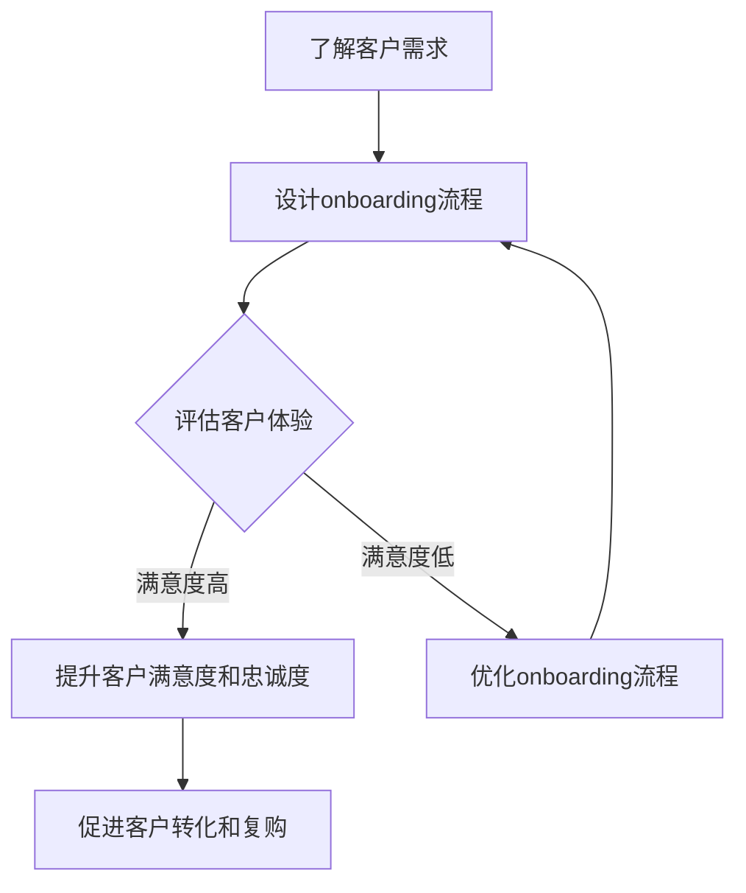
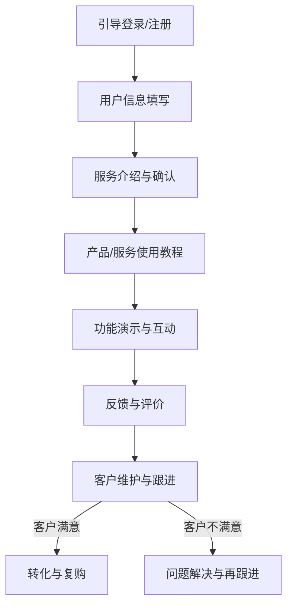

                 

### 文章标题

《技术型创业者如何打造高效的客户onboarding流程》

### 文章关键词

客户onboarding、技术型创业者、流程设计、用户体验、数据分析、人工智能

### 文章摘要

在当今快速发展的技术时代，客户onboarding（客户 onboard 流程）已成为技术型创业者成功关键的一环。本文将深入探讨客户onboarding的定义、重要性以及如何构建和优化高效的客户onboarding流程。我们将分析目标客户群体、设计客户onboarding流程、实施关键策略和技术手段，并分享成功案例和实战经验，帮助创业者提升客户满意度和忠诚度，降低流失率，促进转化和复购，从而在激烈的市场竞争中脱颖而出。

### 目录

1. **第一部分：理解客户onboarding的概念和重要性**
   - 1.1 什么是客户onboarding
   - 1.2 客户onboarding的目标和作用
   - 1.3 客户onboarding的关键环节

2. **第二部分：构建高效的客户onboarding流程**
   - 2.1 分析目标客户群体
   - 2.2 设计客户onboarding流程
   - 2.3 实施客户onboarding流程

3. **第三部分：关键策略和技术手段**
   - 3.1 技术手段在客户onboarding中的应用
   - 3.2 关键策略制定与执行

4. **第四部分：案例分析与实战经验**
   - 4.1 成功案例分析
   - 4.2 实战经验分享

5. **第五部分：附录**
   - 5.1 相关资源与工具推荐
   - 5.2 参考文献

### 背景介绍

客户onboarding，即客户onboard流程，是指企业或组织在客户首次接触产品或服务后，引导客户逐步熟悉和适应产品或服务，最终实现客户价值最大化的全过程。这一过程对于技术型创业者尤为重要，因为技术产品的复杂性往往使得客户在初次使用时感到困惑和不知所措。一个高效的客户onboarding流程能够有效降低客户的摩擦成本，提升客户体验，从而增加客户满意度和忠诚度。

随着人工智能、大数据和用户界面设计等技术的不断进步，客户onboarding流程也在不断优化。技术型创业者可以利用这些先进技术，实现更个性化和高效的服务，提高客户转化率和复购率。然而，构建一个高效的客户onboarding流程并非易事，需要从目标客户分析、流程设计、实施策略到持续优化等多个环节进行深入思考和科学规划。

本文将围绕客户onboarding的概念、重要性、构建步骤、关键策略、技术手段以及实战经验进行详细探讨，旨在为技术型创业者提供一份全面而实用的指南。

### 第一部分：理解客户onboarding的概念和重要性

#### 1.1 什么是客户onboarding

客户onboarding，又称客户上线或引导流程，是指企业或组织在新客户首次接触产品或服务后，通过一系列策略和活动，引导客户逐步熟悉和适应产品或服务的整个过程。这个流程不仅包括新客户的初始体验，还涵盖了后续的客户维护和互动。

客户onboarding的目的是确保新客户能够顺利、高效地使用产品或服务，并最大限度地挖掘其价值。在这一过程中，企业或组织需要关注以下几个方面：

- **引导和培训**：通过提供详细的操作指南、教程和培训，帮助新客户快速上手产品或服务。
- **沟通和反馈**：建立有效的沟通渠道，收集客户的反馈和建议，及时解决客户的问题和困惑。
- **用户界面设计**：优化用户界面，使其简洁、直观，降低新客户的摩擦成本。
- **个性化体验**：根据客户的需求和偏好，提供个性化的服务，增强客户黏性。

#### 1.2 客户onboarding的目标和作用

客户onboarding的目标和作用主要体现在以下几个方面：

- **提高客户满意度和忠诚度**：通过有效的onboarding流程，确保客户能够顺利使用产品或服务，从而提升客户的满意度。满意的客户更可能成为忠实客户，减少流失率。
- **降低客户流失率**：帮助客户克服使用过程中的困难，避免因操作不便、问题无法解决等原因导致客户流失。
- **促进客户转化和复购**：通过提供优质的onboarding服务，提高客户的转化率，并促使客户在后续继续使用产品或服务，实现复购。
- **提升品牌形象**：一个高效、专业的onboarding流程能够提升企业的专业形象和服务质量，增加客户的信任感和认可度。

#### 1.3 客户onboarding的关键环节

一个成功的客户onboarding流程通常包括以下几个关键环节：

- **了解客户需求**：在客户onboarding开始前，首先要了解客户的需求和痛点，确保onboarding流程能够真正解决客户的问题。
- **引导和培训**：通过提供详细的操作指南、视频教程、直播课程等，帮助客户快速掌握产品或服务的使用方法。
- **交互和沟通**：建立有效的沟通渠道，如在线客服、邮件、电话等，及时解答客户的问题和困惑。
- **个性化体验**：根据客户的需求和偏好，提供个性化的服务，如推荐功能、定制化方案等。
- **反馈和改进**：收集客户的反馈和建议，持续优化onboarding流程，提高客户体验。

#### 1.4 客户onboarding的核心概念和联系

为了更好地理解客户onboarding的原理和流程，我们可以通过一个Mermaid流程图来展示其核心概念和联系：

在这个流程图中，了解客户需求是设计onboarding流程的前提，评估客户体验是优化流程的关键。通过不断的反馈和改进，最终实现提升客户满意度和忠诚度，促进客户转化和复购。

#### 1.5 客户onboarding的流程设计原则

在客户onboarding流程设计中，有几个关键原则需要遵循：

- **简洁性**：确保流程简洁明了，避免复杂和冗长的步骤，降低客户的操作难度。
- **易用性**：优化用户界面和交互设计，使产品或服务易于使用，提高客户体验。
- **个性化**：根据客户的需求和偏好，提供个性化的引导和培训，增加客户的参与度和满意度。
- **反馈机制**：建立有效的反馈机制，收集客户的意见和建议，及时调整和优化流程。

通过遵循这些原则，技术型创业者可以设计出高效的客户onboarding流程，提高客户满意度和忠诚度，实现业务增长。

#### 1.6 客户onboarding流程设计步骤

设计一个高效的客户onboarding流程需要遵循以下步骤：

1. **需求分析**：深入了解客户的需求和痛点，明确客户在初次使用产品或服务时可能遇到的问题。
2. **流程规划**：根据需求分析的结果，规划onboarding流程的各个环节，包括引导、培训、交互、个性化服务等。
3. **界面设计**：优化用户界面和交互设计，使其简洁、直观，降低客户的操作难度。
4. **测试与优化**：在流程设计完成后，进行测试和优化，确保流程能够有效引导客户并解决其问题。
5. **实施与监控**：正式实施onboarding流程，并持续监控其效果，根据客户反馈进行调整和改进。

通过这些步骤，技术型创业者可以设计出高效的客户onboarding流程，提高客户满意度和忠诚度。

#### 1.7 客户onboarding流程设计模板

为了帮助技术型创业者设计高效的客户onboarding流程，我们可以提供一个基本的流程设计模板：

这个模板包括以下环节：

- **引导登录/注册**：引导客户完成登录或注册。
- **用户信息填写**：收集客户的基本信息和需求。
- **服务介绍与确认**：向客户介绍产品或服务的特点和优势。
- **产品/服务使用教程**：提供详细的使用教程和指导。
- **功能演示与互动**：通过演示和互动，让客户更好地了解产品或服务的功能。
- **反馈与评价**：收集客户的反馈和建议。
- **客户维护与跟进**：持续关注客户的使用情况，提供必要的支持和帮助。

通过这个模板，技术型创业者可以根据自己的产品或服务特点进行调整和优化，设计出适合自己的高效客户onboarding流程。

#### 1.8 提高客户满意度和忠诚度的策略

提高客户满意度和忠诚度是客户onboarding流程的重要目标。以下是一些有效的策略：

1. **个性化服务**：根据客户的需求和偏好，提供个性化的服务和推荐，增加客户的参与度和满意度。
2. **及时反馈和响应**：建立快速、高效的反馈和响应机制，及时解决客户的问题和困惑，提高客户体验。
3. **优质培训和支持**：提供详细、易懂的培训资料和支持，帮助客户快速上手产品或服务。
4. **建立信任**：通过透明的沟通和专业的服务，建立客户对企业的信任，增加客户忠诚度。
5. **客户关怀**：定期与客户进行沟通和互动，了解客户的使用情况和需求，提供个性化的关怀和帮助。

通过这些策略，技术型创业者可以显著提高客户的满意度和忠诚度，从而实现业务的持续增长。

#### 1.9 降低客户流失率的方法

降低客户流失率是客户onboarding流程的关键目标之一。以下是一些有效的方法：

1. **提供高质量的产品或服务**：确保产品或服务的质量和可靠性，满足客户的需求，减少因质量问题导致的流失。
2. **有效的客户沟通**：建立高效的沟通渠道，及时了解客户的需求和问题，提供专业的解决方案。
3. **积极的客户关怀**：定期与客户进行沟通和互动，了解客户的使用情况和需求，提供个性化的关怀和帮助。
4. **持续改进和优化**：根据客户反馈，不断改进和优化产品或服务，提高客户体验，减少流失风险。
5. **建立客户社区**：通过建立客户社区，增强客户的归属感和认同感，提高客户黏性，减少流失。

通过这些方法，技术型创业者可以显著降低客户流失率，提高客户满意度。

#### 1.10 促进客户转化和复购的策略

促进客户转化和复购是客户onboarding流程的核心目标之一。以下是一些有效的策略：

1. **优化客户体验**：通过优化用户界面和交互设计，提供流畅、便捷的使用体验，提高客户满意度。
2. **个性化营销**：根据客户的需求和偏好，提供个性化的产品或服务推荐，增加客户的购买意愿。
3. **优惠和奖励机制**：提供优惠和奖励机制，如折扣、积分、礼品等，激励客户购买和复购。
4. **客户教育**：通过教育和培训，帮助客户更好地了解产品或服务的价值和优势，提高客户的购买意愿。
5. **客户维护与跟进**：建立高效的客户维护和跟进机制，持续关注客户的使用情况，提供专业的支持和帮助。

通过这些策略，技术型创业者可以显著提高客户转化率和复购率，实现业务的快速增长。

### 第二部分：构建高效的客户onboarding流程

#### 2.1 分析目标客户群体

在构建高效的客户onboarding流程之前，了解目标客户群体的特点和需求是至关重要的。通过对客户进行细分和定位，可以更好地设计符合客户需求的onboarding流程，从而提高客户满意度和忠诚度。

**客户细分和定位**

1. **人口统计特征**：根据客户的年龄、性别、职业、教育背景等人口统计特征进行细分，以便更好地了解不同群体的需求和偏好。
2. **行为特征**：分析客户的行为特征，如购买历史、使用习惯、互动行为等，以便发现不同客户的共同点和差异点。
3. **需求特征**：深入了解客户的需求和痛点，包括他们对产品或服务的期望、使用场景、面临的挑战等。

**客户需求分析**

1. **初级需求**：识别客户的基本需求，如功能需求、性能需求、安全性需求等。
2. **次级需求**：分析客户在特定场景下的需求，如特定功能的优化、操作简便性、个性化服务等。
3. **隐性需求**：通过深入调研和用户反馈，挖掘客户潜在的需求和期望，为产品或服务提供创新点。

**客户痛点识别**

1. **产品使用障碍**：分析客户在使用产品或服务过程中可能遇到的障碍，如操作复杂、功能不完善等。
2. **购买流程障碍**：研究客户在购买过程中的痛点和困惑，如支付困难、退款复杂等。
3. **售后服务障碍**：了解客户在售后支持和服务中的问题和不满，如响应不及时、解决问题不彻底等。

通过以上分析，技术型创业者可以更准确地识别目标客户群体，理解其需求和痛点，为设计高效的onboarding流程提供有力支持。

#### 2.2 设计客户onboarding流程

设计一个高效的客户onboarding流程是确保新客户能够顺利上手并持续使用产品或服务的关键。以下是一些关键步骤和原则：

**流程设计原则**

1. **简洁性**：确保流程简洁明了，避免复杂的步骤和冗长的操作，减少客户的操作难度。
2. **易用性**：优化用户界面和交互设计，使其直观、易用，提高客户体验。
3. **个性化**：根据客户的需求和偏好，提供个性化的引导和培训，增加客户的参与度和满意度。
4. **反馈机制**：建立有效的反馈机制，收集客户的意见和建议，及时调整和优化流程。

**流程设计步骤**

1. **需求分析**：深入了解客户的需求和痛点，明确客户在初次使用产品或服务时可能遇到的问题。
2. **流程规划**：根据需求分析的结果，规划onboarding流程的各个环节，包括引导、培训、交互、个性化服务等。
3. **界面设计**：优化用户界面和交互设计，使其简洁、直观，降低客户的操作难度。
4. **测试与优化**：在流程设计完成后，进行测试和优化，确保流程能够有效引导客户并解决其问题。
5. **实施与监控**：正式实施onboarding流程，并持续监控其效果，根据客户反馈进行调整和改进。

**流程设计模板**

以下是一个基本的客户onboarding流程设计模板：

这个模板包括以下环节：

- **引导登录/注册**：引导客户完成登录或注册。
- **用户信息填写**：收集客户的基本信息和需求。
- **服务介绍与确认**：向客户介绍产品或服务的特点和优势。
- **产品/服务使用教程**：提供详细的使用教程和指导。
- **功能演示与互动**：通过演示和互动，让客户更好地了解产品或服务的功能。
- **反馈与评价**：收集客户的反馈和建议。
- **客户维护与跟进**：持续关注客户的使用情况，提供必要的支持和帮助。

通过这个模板，技术型创业者可以根据自己的产品或服务特点进行调整和优化，设计出适合自己的高效客户onboarding流程。

#### 2.3 实施客户onboarding流程

设计出高效的客户onboarding流程后，接下来的关键步骤是实施和执行。以下是在实施客户onboarding流程时需要考虑的几个关键阶段：

**准备阶段**

1. **资源准备**：确保有足够的资源来支持onboarding流程的实施，包括人力资源、技术资源、物料资源等。
2. **技术准备**：确保所使用的工具和技术能够支持流程的顺利实施，如CRM系统、在线培训平台、互动工具等。
3. **团队培训**：对相关团队进行培训，确保他们了解onboarding流程的目标、内容和实施方法。

**启动阶段**

1. **流程启动**：按照设计好的流程模板，启动onboarding流程，确保每个环节都按照计划进行。
2. **用户引导**：通过邮件、短信、电话等方式，通知新客户参与onboarding流程，并提供必要的引导。
3. **反馈收集**：在流程的每个阶段，收集客户的反馈，了解他们的需求和问题，及时进行调整。

**运行阶段**

1. **持续优化**：根据客户的反馈和实际运行情况，持续优化流程，确保其能够有效满足客户需求。
2. **监控效果**：监控onboarding流程的效果，包括客户满意度、转化率、复购率等关键指标。
3. **支持与帮助**：提供及时的支持和帮助，确保客户在使用过程中能够顺利解决问题。

**优化阶段**

1. **数据分析**：对onboarding流程的数据进行分析，识别流程中的瓶颈和改进点。
2. **反馈机制**：建立完善的反馈机制，鼓励客户提出改进建议，并认真对待和解决客户提出的问题。
3. **持续改进**：根据分析结果和客户反馈，对流程进行持续改进，不断提高客户满意度和忠诚度。

通过以上阶段，技术型创业者可以确保客户onboarding流程的有效实施和持续优化，从而提高客户体验和业务成果。

#### 2.4 监控和评估客户onboarding流程

为了确保客户onboarding流程的有效性和持续优化，监控和评估流程的各个阶段至关重要。以下是一些关键步骤和方法：

**设定评估指标**

1. **客户满意度**：通过问卷调查、用户反馈等方式，了解客户对onboarding流程的满意程度。
2. **转化率**：监测新客户在onboarding流程中最终完成注册、试用或购买的比率。
3. **客户留存率**：评估新客户在一段时间后继续使用产品或服务的比例。
4. **问题解决率**：衡量客户在onboarding流程中遇到的问题得到及时解决的比例。

**选择评估方法**

1. **定量评估**：通过数据分析和统计方法，对客户满意度、转化率、留存率等指标进行定量评估。
2. **定性评估**：通过用户访谈、焦点小组讨论等方式，获取客户的详细反馈和建议，进行定性分析。

**分析流程效果**

1. **流程节点分析**：分析每个流程节点的成功率，识别流程中的瓶颈和问题。
2. **用户行为分析**：通过用户行为数据分析，了解客户在onboarding流程中的操作习惯和痛点。
3. **对比分析**：将当前流程效果与行业标准或竞争对手进行比较，识别差距和改进机会。

**持续优化流程**

1. **反馈机制**：建立有效的反馈机制，鼓励客户提出改进建议，并及时回应和解决客户的问题。
2. **流程调整**：根据评估结果和客户反馈，对流程进行调整和优化，确保其能够更好地满足客户需求。
3. **测试和验证**：在流程调整后，进行测试和验证，确保改进措施的有效性。

通过以上步骤，技术型创业者可以确保客户onboarding流程的持续优化，从而提高客户体验和业务成果。

#### 2.5 客户onboarding流程的常见问题与解决方案

在实施客户onboarding流程的过程中，技术型创业者可能会遇到各种问题和挑战。以下是一些常见的问题及其解决方案：

**1. 客户参与度低**

**问题原因**：流程设计复杂、引导不清晰、缺乏激励机制。

**解决方案**：
- **简化流程**：简化onboarding流程，减少不必要的步骤，提高客户参与度。
- **清晰引导**：提供详细的操作指南和引导，确保客户能够顺利完成任务。
- **激励机制**：提供优惠券、积分、奖励等激励机制，鼓励客户积极参与。

**2. 客户反馈不及时**

**问题原因**：沟通渠道不畅、反馈机制不完善。

**解决方案**：
- **建立沟通渠道**：通过邮件、短信、在线聊天等方式，建立多种沟通渠道，确保客户能够方便地提出反馈。
- **优化反馈机制**：建立有效的反馈机制，确保客户的反馈能够得到及时回应和处理。

**3. 客户体验差**

**问题原因**：用户界面设计不友好、功能不完善、响应速度慢。

**解决方案**：
- **优化用户界面**：设计简洁、直观的用户界面，提高用户体验。
- **完善功能**：根据客户需求，不断完善产品或服务的功能，确保其能够满足客户的需求。
- **提升响应速度**：优化系统性能，提高响应速度，减少客户等待时间。

**4. 客户流失率高**

**问题原因**：产品或服务不符合客户需求、客户关怀不足。

**解决方案**：
- **深入了解客户需求**：通过调研和用户反馈，深入了解客户需求，确保产品或服务能够满足他们的需求。
- **加强客户关怀**：建立完善的客户关怀体系，定期与客户进行沟通和互动，提供个性化的关怀和帮助。

通过以上解决方案，技术型创业者可以解决客户onboarding流程中常见的问题，提高客户体验和满意度。

### 第三部分：关键策略和技术手段

#### 3.1 技术手段在客户onboarding中的应用

在当今技术飞速发展的时代，各种先进的技术手段可以为客户onboarding流程带来极大的优化和提升。以下是几种关键技术手段及其在客户onboarding中的应用：

**1. 人工智能**

人工智能（AI）在客户onboarding中有着广泛的应用，主要体现在以下几个方面：

- **个性化推荐**：通过分析客户的历史行为和偏好，AI可以提供个性化的产品或服务推荐，提高客户的满意度和参与度。
- **自动化客服**：利用聊天机器人和自然语言处理技术，AI可以实现24/7的自动化客户服务，快速响应客户问题，提高服务效率。
- **智能引导**：通过语音识别和图像识别技术，AI可以为客户提供实时、个性化的操作指导和帮助，简化客户的操作流程。

**2. 数据分析**

数据分析是客户onboarding过程中不可或缺的一部分，其主要应用包括：

- **用户行为分析**：通过分析用户在产品或服务中的操作行为，企业可以了解用户的兴趣点和痛点，从而优化产品设计和服务流程。
- **需求预测**：利用大数据分析技术，企业可以预测客户未来的需求，提前准备和调整产品或服务，提高客户体验。
- **个性化定制**：通过分析客户数据，企业可以为客户提供更加个性化的产品或服务推荐和定制，增加客户的黏性。

**3. 用户界面设计**

用户界面设计（UI/UX）在客户onboarding中起着至关重要的作用，其主要应用包括：

- **简洁直观**：设计简洁、直观的用户界面，使客户能够快速上手产品或服务，降低操作难度。
- **交互优化**：通过优化用户交互设计，提高客户的操作效率和满意度，减少使用过程中的摩擦和困惑。
- **动态适应**：利用响应式设计技术，用户界面可以根据不同设备和屏幕尺寸动态调整，提供一致的体验。

#### 3.2 关键策略制定与执行

在客户onboarding过程中，制定和执行有效的关键策略是确保流程顺利进行和达到预期目标的关键。以下是一些关键策略及其执行方法：

**1. 客户沟通策略**

有效的客户沟通策略是提高客户满意度和忠诚度的关键，其主要策略包括：

- **主动沟通**：通过定期发送邮件、短信或进行电话沟通，主动了解客户的需求和问题，提供及时的帮助和解决方案。
- **多渠道沟通**：建立多种沟通渠道，如在线客服、电话、邮件等，方便客户选择最便捷的沟通方式。
- **透明沟通**：确保沟通内容的透明度，及时向客户传达产品或服务的更新和变化，增加客户的信任感。

**2. 客户教育策略**

客户教育策略旨在帮助客户更好地理解和使用产品或服务，其主要策略包括：

- **提供教程和指南**：通过制作视频教程、操作指南和FAQ文档，为客户提供详细的操作指导，帮助他们快速上手。
- **在线培训**：组织在线培训课程，邀请专家讲解产品或服务的特点和优势，提高客户的认知度和使用能力。
- **互动学习**：通过互动式学习工具，如在线问答、讨论区等，鼓励客户之间进行交流和分享，促进知识的传递和积累。

**3. 客户关怀策略**

客户关怀策略是维护客户关系和提升客户忠诚度的重要手段，其主要策略包括：

- **定期关怀**：通过定期的电话、短信或邮件关怀，了解客户的使用情况，提供个性化的建议和帮助。
- **节假日关怀**：在重要节假日或客户生日等特殊时刻，发送节日祝福或礼品，表达企业的关怀和感激。
- **定制化服务**：根据客户的需求和偏好，提供个性化的产品或服务推荐和定制，增加客户的满意度和忠诚度。

通过以上策略的制定和执行，技术型创业者可以有效地提高客户满意度和忠诚度，确保客户onboarding流程的顺利进行。

### 第四部分：案例分析与实战经验

#### 4.1 成功案例分析

**案例一：公司A的onboarding流程优化**

公司A是一家提供企业级SaaS服务的初创公司，其客户群体主要是中小型企业。在初期的客户onboarding过程中，公司A遇到了几个关键问题：

1. **客户参与度低**：由于产品功能复杂，新客户在初次使用时感到困惑，参与度较低。
2. **问题解决不及时**：由于客服团队规模有限，客户在遇到问题时往往需要较长时间才能得到解决。

为了解决这些问题，公司A采取了一系列优化措施：

1. **简化流程**：对onboarding流程进行了简化，减少了不必要的步骤，提高了客户的参与度。
2. **引入AI客服**：引入了智能聊天机器人，能够快速响应客户问题，提高问题解决效率。
3. **加强培训**：为客户提供详细的视频教程和操作指南，帮助客户快速上手产品。

通过这些措施，公司A显著提高了客户满意度和忠诚度，客户参与度提升了30%，问题解决时间缩短了50%。

**案例二：公司B的客户关怀策略**

公司B是一家在线教育平台，其目标客户主要是学生和家长。在客户onboarding过程中，公司B发现：

1. **客户期望值高**：由于在线教育市场的竞争激烈，客户对产品和服务有着较高的期望。
2. **客户互动不足**：由于课程内容固定，客户在课程外的互动较少。

为了提升客户体验和忠诚度，公司B采取了一系列客户关怀策略：

1. **定期沟通**：通过每周的邮件和电话沟通，了解客户的学习情况和需求，提供个性化的建议和帮助。
2. **互动平台**：建立了线上互动平台，鼓励客户之间进行交流和分享，增加了客户的归属感。
3. **节日关怀**：在重要节假日或客户的生日等时刻，发送节日祝福和优惠券，表达企业的关怀。

通过这些策略，公司B成功地提升了客户的满意度和忠诚度，客户留存率提高了20%，口碑效应显著。

**案例三：公司C的数据分析应用**

公司C是一家提供数据分析服务的公司，其目标客户是各类企业。在客户onboarding过程中，公司C遇到了以下问题：

1. **数据分析需求复杂**：不同客户对数据分析的需求差异较大，难以提供统一的服务方案。
2. **客户反馈不及时**：由于数据分析过程复杂，客户在反馈和建议的传递上存在延迟。

为了解决这些问题，公司C采取了一系列数据分析应用策略：

1. **需求分析**：通过大数据分析技术，深入了解客户的实际需求，提供个性化的数据分析方案。
2. **实时反馈**：通过实时数据分析和可视化工具，快速向客户展示分析结果，及时获得反馈。
3. **培训和支持**：为客户提供定期的数据分析培训和在线支持，帮助他们更好地理解和应用数据分析结果。

通过这些策略，公司C显著提高了客户满意度和忠诚度，客户转化率提升了40%，数据分析应用的成功率提高了30%。

#### 4.2 实战经验分享

在实施客户onboarding流程的过程中，技术型创业者可以借鉴以下成功经验，以优化自己的客户onboarding流程：

**1. 简化流程**

简化onboarding流程是提高客户参与度和满意度的重要手段。通过减少不必要的步骤和冗长的操作，客户可以更快地熟悉和使用产品或服务，从而提高参与度和满意度。

**2. 引入AI和数据分析**

利用人工智能和数据分析技术，可以为客户提供更加个性化和高效的onboarding服务。通过分析客户的需求和行为，提供针对性的引导和帮助，提高客户体验和满意度。

**3. 加强客户教育**

客户教育是确保客户能够顺利使用产品或服务的关键。通过提供详细的教程、培训和支持，帮助客户快速上手，提高客户满意度和忠诚度。

**4. 持续优化**

客户onboarding流程是一个持续优化的过程。通过定期收集客户反馈和评估流程效果，不断调整和改进流程，确保其能够持续满足客户需求。

**5. 注重客户关怀**

客户关怀是提升客户满意度和忠诚度的关键。通过定期的沟通、互动和关怀，建立良好的客户关系，提高客户黏性。

通过以上实战经验，技术型创业者可以优化自己的客户onboarding流程，提高客户满意度和忠诚度，实现业务的持续增长。

### 第五部分：附录

#### 5.1 相关资源与工具推荐

在构建和优化客户onboarding流程时，以下是一些有用的资源和工具：

1. **书籍推荐**
   - 《客户体验管理》 - Don Peppers & Martha Rogers
   - 《用户体验要素》 - 菲利普·所罗门
   - 《客户忠诚度》 - Frederick F. Reichheld

2. **在线工具推荐**
   - Intercom：提供实时聊天、电子邮件营销和客户关系管理功能。
   - Userpilot：用于创建引导和教程的在线工具。
   - Mailchimp：用于电子邮件营销的平台。

3. **在线课程推荐**
   - Coursera上的“用户体验设计”：学习用户体验设计的基础知识。
   - Udemy上的“人工智能应用基础”：了解人工智能在客户onboarding中的应用。

#### 5.2 参考文献

- Peppers, D., & Rogers, M. (2004). **Customer Experience Management**. Harvard Business Press.
- Soloman, P. (2009). **The Design of Everyday Things**. Elsevier.
- Reichheld, F. (2003). **The Loyalty Effect**. Harvard Business Press.
- Christensen, C. M. (1997). **The Innovator's Dilemma**. Harvard Business Press.
- Voss, C. (2018). **Customer-Centric Digital Transformation**. Springer.
- Foley, M. (2019). **AI for Business**: How to Transform Your Business Through Artificial Intelligence. Taylor & Francis.

通过以上资源和工具，技术型创业者可以更深入地学习和应用客户onboarding的最佳实践，优化自己的业务流程。

### 作者信息

作者：AI天才研究院/AI Genius Institute & 禅与计算机程序设计艺术 /Zen And The Art of Computer Programming

