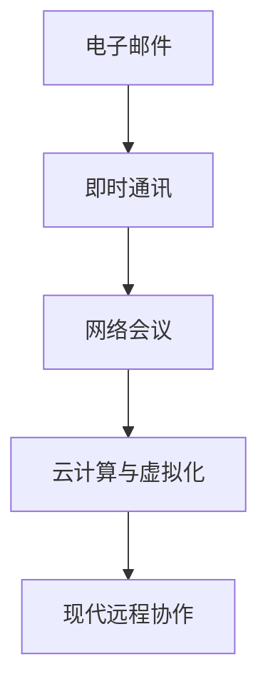
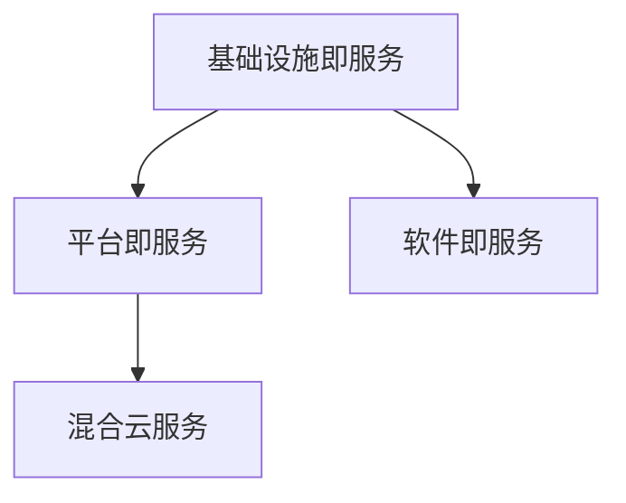
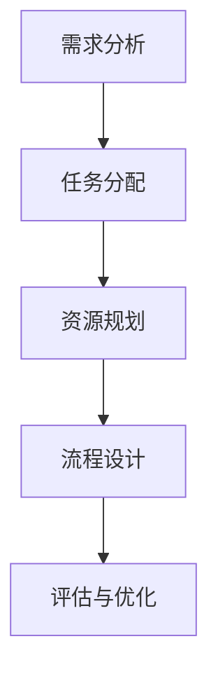
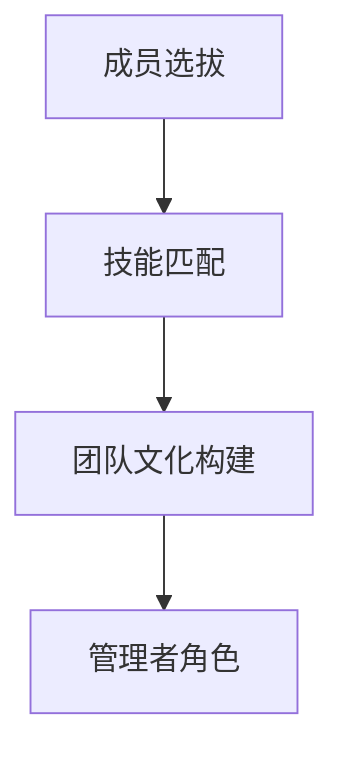

                 

### 文章标题

《技术型创业者如何打造高效的远程协作环境》

### 关键词

远程协作、技术型创业者、高效、协作工具、团队管理、心理健康关怀

### 摘要

本文旨在为技术型创业者提供一整套构建和优化远程协作环境的策略。文章首先介绍了远程协作的概念、优势以及面临的挑战，并详细介绍了常用的远程协作工具和技术。接着，文章从硬件准备、软件配置、流程设计等多个角度探讨了如何构建一个高效、稳定的远程协作环境。此外，文章还提出了提升协作效率的具体策略，分析了团队管理中的关键环节，并关注了远程工作中的心理健康问题。最后，通过成功案例的分析和经验总结，为技术型创业者提供了一套实用的远程协作最佳实践。

## 第一部分: 理解远程协作环境

### 第1章: 远程协作的概念与优势

#### 1.1 远程协作的定义与演变

**远程协作**指的是团队成员在不同地点通过网络进行协作的工作方式。随着互联网技术的发展，远程协作逐渐成为现代企业运营的重要组成部分。

**演变过程**：

1. **早期的远程协作**：以电子邮件和即时通讯为主，主要用于信息传递和简单沟通。
2. **网络会议的出现**：20世纪90年代，网络会议软件如Microsoft NetMeeting的出现，使远程协作进入新的阶段。
3. **云计算和虚拟化技术的应用**：近年来，随着云计算和虚拟化技术的成熟，远程协作工具更加丰富，协作效率大幅提升。

**现状**：

远程协作已经成为全球企业普遍采用的工作模式，尤其在新冠疫情期间，远程协作的优势得以进一步体现。

#### 1.2 远程协作的优势

**成本节约**：远程协作可以大幅降低办公场所的租赁费用、交通费用等，从而降低企业的运营成本。

**劳动力灵活性**：员工可以在任何有网络连接的地方工作，工作时间更加灵活，有利于提高员工的工作满意度和生产力。

**提高工作效率**：远程协作工具提供了高效的沟通和协作平台，使团队成员能够更快地响应需求，提高工作效率。

#### 1.3 远程协作的挑战与应对

**沟通障碍**：远程协作中，团队成员之间缺乏面对面的沟通，可能导致信息传递不畅，理解偏差。

**解决方案**：使用视频会议、即时通讯工具，确保实时、高效的沟通。

**文件同步与共享问题**：远程协作中，文件同步和共享问题经常出现，可能导致工作进度延误。

**解决方案**：使用版本控制工具，如Git，确保文件版本一致性和安全性。

**团队凝聚力减弱**：远程协作中，团队成员之间缺乏面对面交流，可能导致团队凝聚力下降。

**解决方案**：定期组织线上团队活动，加强团队互动和凝聚力。

### 第2章: 远程协作工具与技术

#### 2.1 远程协作工具的类型

远程协作工具可以分为以下几类：

**文档协作工具**：如Google Docs、Microsoft Office 365等，支持多人实时编辑和协作。

**会议与沟通工具**：如Zoom、Slack、Microsoft Teams等，提供实时沟通和会议功能。

**项目管理工具**：如Trello、JIRA、Asana等，帮助团队管理和追踪项目进度。

**版本控制工具**：如Git、SVN等，用于管理代码版本和协作开发。

#### 2.2 常用远程协作工具介绍

**Zoom**：一款功能强大的视频会议工具，支持高清视频、语音通话、屏幕共享等功能。

**Slack**：一款即时通讯工具，支持群聊、私聊、文件共享等功能，适合团队日常沟通和协作。

**Trello**：一款项目管理工具，通过看板（Board）的形式，帮助团队高效管理任务和项目进度。

**GitHub**：一款版本控制工具，广泛用于代码协作和版本管理。

#### 2.3 技术基础：云计算与虚拟化

**云计算**：云计算是一种通过网络提供计算资源的服务，包括计算能力、存储能力、网络带宽等。它具有灵活性、可扩展性和成本效益高等优点。

**虚拟化技术**：虚拟化技术通过将物理资源虚拟化为多个逻辑资源，提高资源的利用率和灵活性。常用的虚拟化技术包括虚拟机（VM）和容器（Container）。

**云服务和平台的优缺点**：

**优点**：提供灵活的资源管理、弹性的扩展能力、高效的数据处理和分析工具等。

**缺点**：可能存在数据安全风险、依赖于网络连接稳定性、费用不透明等问题。

### 第二部分: 远程协作环境的构建与优化

#### 第3章: 远程协作环境的构建

#### 第4章: 提高远程协作效率

#### 第5章: 远程协作中的团队管理

#### 第6章: 远程协作中的心理健康与员工关怀

#### 第7章: 案例分析与经验总结

### 附录

#### 附录A: 远程协作工具与资源列表

##### A.1 常用工具列表

- Zoom
- Slack
- Trello
- GitHub
- Google Docs
- Microsoft Teams

##### A.2 资源汇总

- 远程协作相关书籍：《远程工作心理学》、《团队协作的五大障碍》
- 远程协作教程：Coursera上的《远程协作与管理》、Udemy上的《远程团队管理实战》
- 远程协作社区：GitHub、Stack Overflow、Reddit的Remote Work板块

### 文章结构

本文结构如下：

1. **引言**：介绍远程协作的概念、背景和重要性。
2. **远程协作环境**：详细讨论远程协作的工具、技术、优势和挑战。
3. **构建远程协作环境**：从硬件、软件、流程设计等方面介绍如何构建高效远程协作环境。
4. **提升协作效率**：探讨提高远程协作效率的策略和方法。
5. **团队管理**：分析远程协作中的团队管理要点，包括团队组建、沟通技巧等。
6. **心理健康关怀**：关注远程工作中的心理健康问题，提出解决方案。
7. **案例分析**：通过成功案例分享经验和教训。
8. **总结**：总结文章的核心观点，提供远程协作的最佳实践。
9. **附录**：列出常用的远程协作工具和资源。

### 文章结尾

作者：AI天才研究院/AI Genius Institute & 禅与计算机程序设计艺术 /Zen And The Art of Computer Programming

感谢您的阅读，希望本文能为技术型创业者在构建远程协作环境方面提供有价值的参考。在未来的工作中，不断优化远程协作环境，提高团队效率和凝聚力，是企业发展的关键。让我们共同努力，打造一个高效、和谐的远程协作环境。

---

在接下来的章节中，我们将逐步深入探讨远程协作环境的构建、优化和成功实践，帮助技术型创业者应对远程工作的挑战，实现高效协作。敬请期待！### 第一部分: 理解远程协作环境

#### 第1章: 远程协作的概念与优势

远程协作，顾名思义，是指团队成员在不同地理位置通过网络进行合作的工作模式。在全球化日益加剧的今天，远程协作已经成为了现代企业运营的重要组成部分。尤其是新冠疫情的爆发，让远程协作成为了一种必需的工作方式。

##### 1.1 远程协作的定义与演变

远程协作的定义相对简单，即通过信息技术和通信手段，实现地理位置分散的团队成员之间的信息共享和协作。其演变过程大致可以分为以下几个阶段：

1. **电子邮件和即时通讯**：早期的远程协作主要依赖于电子邮件和即时通讯工具，如QQ、MSN等，这些工具主要用于信息传递和简单沟通。
2. **网络会议**：20世纪90年代，随着互联网技术的发展，网络会议工具如Microsoft NetMeeting和WebEx开始出现，使得远程协作进入了一个新的阶段。网络会议不仅支持语音和视频通讯，还可以实现屏幕共享，极大地提高了协作效率。
3. **云计算和虚拟化**：近年来，云计算和虚拟化技术的普及，为远程协作提供了更加丰富的工具和平台。例如，Google Docs和Microsoft Office 365等文档协作工具，GitHub和GitLab等版本控制工具，以及Trello和Asana等项目管理工具，都使得远程协作变得更加便捷和高效。

##### 1.2 远程协作的优势

远程协作具有以下几个显著的优势：

**成本节约**：远程协作可以大幅降低办公场所的租赁费用、交通费用等，从而降低企业的运营成本。此外，远程协作还可以提高员工的工作效率，减少浪费的时间，进一步降低企业的成本。

**劳动力灵活性**：远程协作允许员工在任何有网络连接的地方工作，这为员工提供了更大的工作灵活性，同时也吸引了更多的优秀人才，无论他们身处何地，都能为团队做出贡献。

**提高工作效率**：远程协作工具提供了高效的沟通和协作平台，使团队成员能够更快地响应需求，提高工作效率。同时，远程协作还可以避免因地理位置差异导致的沟通障碍，从而提高工作的准确性和效率。

##### 1.3 远程协作的挑战与应对

尽管远程协作具有很多优势，但它也带来了一系列的挑战：

**沟通障碍**：远程协作中，团队成员之间缺乏面对面的沟通，可能导致信息传递不畅，理解偏差。这需要依赖高效的沟通工具和技巧来弥补。

**文件同步与共享问题**：远程协作中，文件同步和共享问题经常出现，可能导致工作进度延误。使用版本控制工具和云存储服务可以有效地解决这个问题。

**团队凝聚力减弱**：远程协作中，团队成员之间缺乏面对面交流，可能导致团队凝聚力下降。通过定期组织线上团队活动和沟通，可以增强团队的凝聚力。

**解决方案**：

1. **沟通障碍**：使用视频会议、即时通讯工具，确保实时、高效的沟通。
2. **文件同步与共享问题**：使用版本控制工具，如Git，确保文件版本一致性和安全性。
3. **团队凝聚力减弱**：定期组织线上团队活动，加强团队互动和凝聚力。

通过以上讨论，我们可以看到，远程协作在现代社会中具有重要的作用，它不仅带来了成本节约、劳动力灵活性和工作效率提升等优势，也面临着一系列的挑战。理解和应对这些挑战，对于技术型创业者来说，是构建高效远程协作环境的关键。

在接下来的章节中，我们将深入探讨远程协作工具和技术，帮助技术型创业者选择合适的工具，构建高效、稳定的远程协作环境。

### 第2章: 远程协作工具与技术

在构建远程协作环境的过程中，选择合适的工具至关重要。现代远程协作工具种类繁多，包括文档协作工具、会议与沟通工具、项目管理工具以及版本控制工具等。每一种工具都有其独特的功能和优势，适用于不同的协作场景。在本节中，我们将介绍这些工具的类型、常用工具以及云计算与虚拟化技术的基础知识。

#### 2.1 远程协作工具的类型

远程协作工具可以分为以下几类：

1. **文档协作工具**：这些工具允许团队成员实时编辑和共享文档，提高协作效率。常见的文档协作工具有Google Docs、Microsoft Office 365等。
   
2. **会议与沟通工具**：这些工具提供实时沟通和会议功能，支持语音、视频和屏幕共享。常见的会议与沟通工具有Zoom、Slack、Microsoft Teams等。

3. **项目管理工具**：这些工具帮助团队管理和追踪项目进度，确保任务按时完成。常见项目工具有Trello、JIRA、Asana等。

4. **版本控制工具**：这些工具用于管理代码版本和协作开发，确保代码的一致性和安全性。常见的版本控制工具有Git、SVN等。

#### 2.2 常用远程协作工具介绍

以下是一些常用的远程协作工具及其主要功能：

1. **Zoom**：Zoom是一款功能强大的视频会议工具，提供高清视频、语音通话、屏幕共享等功能。Zoom适合各种规模的团队，特别适合大型会议和多人协作。其免费版本提供了基本的会议功能，而付费版本则提供了更多的定制选项和高级功能。

   ```mermaid
   graph TD
   A[Zoom] --> B[高清视频]
   A --> C[语音通话]
   A --> D[屏幕共享]
   ```

2. **Slack**：Slack是一款即时通讯工具，支持群聊、私聊、文件共享等功能。Slack的强大之处在于其集成能力，可以与其他工具如Google Drive、GitHub、Trello等无缝集成，提供一站式的协作平台。

   ```mermaid
   graph TD
   A[Slack] --> B[群聊]
   A --> C[私聊]
   A --> D[文件共享]
   A --> E[集成其他工具]
   ```

3. **Trello**：Trello是一款基于看板的任务管理工具，通过看板（Board）的形式，帮助团队高效管理任务和项目进度。Trello的界面直观、易于操作，适合各种规模和类型的团队使用。

   ```mermaid
   graph TD
   A[Trello] --> B[看板]
   A --> C[任务管理]
   A --> D[项目进度追踪]
   ```

4. **GitHub**：GitHub是一款基于Git的版本控制工具，广泛用于代码协作和版本管理。GitHub提供了丰富的功能，如代码审查、拉取请求、问题跟踪等，是开发团队必备的工具。

   ```mermaid
   graph TD
   A[GitHub] --> B[代码审查]
   A --> C[拉取请求]
   A --> D[问题跟踪]
   ```

#### 2.3 技术基础：云计算与虚拟化

云计算与虚拟化技术是远程协作环境构建的重要技术基础，下面简要介绍这两种技术的基本概念：

1. **云计算**：云计算是一种通过网络提供计算资源的服务，包括计算能力、存储能力、网络带宽等。它具有灵活性、可扩展性和成本效益高等优点。

   - **云服务的类型**：
     - **基础设施即服务（IaaS）**：提供虚拟化的硬件资源，如虚拟机、存储、网络等。
     - **平台即服务（PaaS）**：提供开发和运行应用程序的平台，如数据库、开发工具等。
     - **软件即服务（SaaS）**：提供应用程序和服务，如邮件服务、办公软件等。

   - **云服务的优点**：
     - **灵活性**：可以根据需求动态调整资源。
     - **可扩展性**：能够快速响应业务增长需求。
     - **成本效益**：降低了硬件和运维成本。

   - **云服务的缺点**：
     - **数据安全**：需要确保数据的安全性和隐私。
     - **依赖网络**：需要稳定的网络连接。
     - **费用不透明**：费用可能会随着使用量的增加而增加。

2. **虚拟化技术**：虚拟化技术通过将物理资源虚拟化为多个逻辑资源，提高资源的利用率和灵活性。

   - **虚拟化技术的类型**：
     - **硬件虚拟化**：将物理硬件资源虚拟化为多个虚拟机。
     - **操作系统虚拟化**：在一个操作系统上运行多个隔离的虚拟操作系统。
     - **应用程序虚拟化**：将应用程序虚拟化为独立运行的环境。

   - **虚拟化技术的优点**：
     - **资源利用**：提高硬件资源的利用效率。
     - **灵活性**：方便资源分配和管理。
     - **可移植性**：应用程序可以在不同的环境中运行。

   - **虚拟化技术的缺点**：
     - **性能开销**：虚拟化引入了一定的性能开销。
     - **管理复杂**：需要专业的管理和维护。

通过以上介绍，我们可以看到，远程协作工具和技术的选择对于构建高效远程协作环境至关重要。不同的工具和技术在不同的协作场景中发挥着不同的作用，技术型创业者需要根据团队的具体需求和实际情况，选择合适的工具和方案。

在接下来的章节中，我们将深入探讨如何构建和优化远程协作环境，帮助技术型创业者打造一个高效、稳定的工作环境。

### 第3章: 远程协作环境的构建

要构建一个高效的远程协作环境，需要从硬件配置、网络环境和软件安装与配置等多个方面进行综合考虑。以下是一些关键步骤和建议。

#### 3.1 远程协作环境的准备

**硬件配置**

1. **计算机**：确保所有团队成员拥有高性能的计算机，以支持远程协作工具的运行。对于视频会议等需要大量计算资源的任务，建议使用配备高性能CPU、足够内存和独立显卡的计算机。

2. **网络设备**：配置稳定的网络设备，如路由器和交换机，确保网络连接的稳定性和速度。对于大型团队，可以考虑使用专用的网络设备来优化网络性能。

3. **存储设备**：配备足够容量的存储设备，用于存储项目文件和数据。可以选择云存储服务，如Google Drive、Dropbox等，以实现文件的高效同步和共享。

**网络环境**

1. **宽带接入**：确保所有团队成员都拥有高速稳定的宽带接入，建议使用光纤宽带或者5G网络。

2. **网络配置**：优化网络配置，如设置静态IP地址、开启DDoS保护等，确保网络的安全和稳定性。

3. **VPN**：对于跨国团队，可以使用虚拟专用网络（VPN）来保护数据传输的安全。

**软件安装与配置**

1. **远程协作工具**：安装常用的远程协作工具，如Zoom、Slack、Trello、GitHub等。确保所有团队成员都使用相同的工具版本，以避免兼容性问题。

2. **操作系统**：根据团队成员的偏好和需求，选择合适的操作系统，如Windows、macOS、Linux等。建议使用企业版操作系统，以获得更好的性能和安全性。

3. **软件更新与维护**：定期更新软件，确保使用的是最新的版本，以获得最佳的性能和安全保护。同时，定期进行系统维护和优化，如清理缓存、升级硬件驱动等。

#### 3.2 远程协作流程设计

**项目规划**

1. **需求分析**：明确项目目标和需求，确定项目的关键里程碑和时间节点。

2. **任务分配**：根据团队成员的技能和特长，合理分配任务，确保每个成员都有明确的职责和目标。

3. **资源规划**：规划项目所需的硬件、软件和其他资源，确保项目能够按时、按质完成。

**工作流程设计**

1. **任务分配流程**：设计任务分配的流程，确保任务能够及时、准确地分配给相应的团队成员。

2. **沟通机制**：建立高效的沟通机制，如定期会议、即时通讯工具、邮件等，确保团队成员之间的信息畅通。

3. **文件共享与版本控制**：设计文件共享与版本控制的流程，确保项目文件的一致性和安全性。可以使用版本控制工具，如Git，来管理代码和文档的版本。

**评估与优化**

1. **绩效评估**：定期对团队成员的工作绩效进行评估，识别问题并提出改进措施。

2. **流程优化**：根据评估结果和反馈，对工作流程进行优化和调整，提高协作效率。

通过以上步骤，技术型创业者可以构建一个高效、稳定的远程协作环境。在后续的章节中，我们将进一步探讨如何提升远程协作效率，确保团队在远程工作环境中保持高效运作。

### 第4章: 提高远程协作效率

在远程协作环境中，提高团队的工作效率是关键。以下是一些策略和方法，可以帮助技术型创业者优化协作流程，提升团队的整体效率。

#### 4.1 效率提升策略

**时间管理**

1. **制定日程安排**：为每个团队成员制定详细的日程安排，包括工作时间、休息时间和任务分配。这有助于团队成员更好地规划自己的工作，避免拖延和浪费时间。

2. **使用时间追踪工具**：使用时间追踪工具，如Toggl或RescueTime，来监控团队成员的工作时间，识别时间浪费的环节，并采取相应措施进行优化。

**任务分解**

1. **细化任务**：将大任务分解为小任务，为每个小任务设定明确的完成时间和负责人。这有助于团队成员更清晰地了解自己的工作内容，并确保任务能够按时完成。

2. **优先级排序**：根据任务的紧急程度和重要性，对任务进行优先级排序，确保团队成员首先完成最重要的任务。

**沟通技巧**

1. **明确沟通目标**：在会议或沟通前，明确沟通的目标和议程，确保沟通有针对性，避免无效的闲聊。

2. **有效倾听**：在沟通中，注重倾听对方的意见和反馈，确保理解对方的需求和问题，避免误解和冲突。

**工具利用**

1. **自动化工具**：利用自动化工具，如自动化脚本或机器人，来自动完成重复性高的任务，如数据整理、报告生成等。这可以大幅减少团队成员的工作量，提高工作效率。

2. **集成工具**：使用集成工具，如Slack或Microsoft Teams，将不同的远程协作工具整合在一起，实现一站式协作。这有助于团队成员更快地找到所需的信息和资源，提高沟通效率。

#### 4.2 工作流程优化

**标准化操作流程**

1. **制定标准化操作流程**：为团队中的每个工作环节制定标准化操作流程，确保团队成员在执行任务时遵循一致的步骤和方法。

2. **培训与指导**：对新加入的团队成员进行培训，确保他们了解并遵循标准化操作流程。

**持续改进机制**

1. **定期回顾**：定期对工作流程进行回顾和评估，收集团队成员的反馈和建议，识别流程中的问题和瓶颈。

2. **持续改进**：根据评估结果，对工作流程进行持续改进和优化，以提升协作效率。

**案例：敏捷开发**

敏捷开发是一种适用于远程协作的工作流程，它强调团队协作、快速迭代和持续改进。

1. **团队协作**：敏捷开发强调团队成员之间的密切协作，通过每日站会和迭代回顾等机制，确保团队始终保持对项目的共同理解和目标。

2. **快速迭代**：敏捷开发采用短迭代周期（如两周或一个月），在每个迭代结束时进行评估和反馈，确保项目能够快速响应变化和需求。

3. **持续改进**：敏捷开发鼓励团队成员不断学习和改进，通过回顾和反思，优化工作流程和协作方法。

通过以上策略和方法，技术型创业者可以有效地提升远程协作的效率，确保团队在远程工作环境中保持高效运作。在下一章节中，我们将探讨远程协作中的团队管理和沟通技巧，帮助团队更好地应对远程工作中的挑战。

### 第5章: 远程协作中的团队管理

在远程协作环境中，团队管理至关重要。有效的团队管理不仅能够提高团队效率，还能增强团队成员的凝聚力和归属感。以下将从远程团队的组建与管理、团队沟通技巧两个方面进行详细探讨。

#### 5.1 远程团队的组建与管理

**成员选拔与配置**

1. **技能与经验匹配**：在选拔团队成员时，要确保每个成员的技能和经验与团队需求相匹配。特别是在技术型创业团队中，技术能力是关键，同时还需要具备良好的沟通能力和团队协作精神。

2. **多元文化背景**：组建多元文化的团队，有助于吸收不同的观点和经验，促进创新。然而，也要注意文化差异可能导致的一些沟通障碍，需要通过有效的团队建设活动来缓解。

**团队文化构建**

1. **共同目标与价值观**：构建一个具有共同目标和价值观的团队文化，有助于增强团队成员的认同感和归属感。可以通过制定团队使命、愿景和价值观，让团队成员明确团队的方向和目标。

2. **透明沟通与信任**：在远程团队中，透明沟通和信任尤为重要。管理者应鼓励团队成员之间开放交流，分享信息，建立信任关系。例如，定期举行线上团队会议，确保所有成员都能参与到讨论中。

**管理者角色与职责**

1. **领导与激励**：管理者需要扮演领导者角色，激励团队成员发挥最佳水平。可以通过设定明确的期望和目标，提供必要的资源和支持，帮助团队成员克服困难。

2. **协调与资源分配**：管理者需要协调团队内部的资源和任务分配，确保每个成员都有明确的工作职责和目标。此外，管理者还应关注团队成员的工作负荷，避免过度劳累。

**团队会议管理**

1. **高效会议**：远程团队的会议管理尤为重要。要确保会议内容聚焦、高效，可以采用以下方法：
   - **明确会议目标**：每次会议前，明确会议的目标和议程，确保会议有明确的方向。
   - **限制会议时间**：设定合理的会议时间，避免过长会议导致的疲劳和效率低下。
   - **即时决策**：会议中要鼓励团队成员积极参与，确保问题能够及时解决，避免会后出现不必要的延误。

2. **会议记录与跟进**：会议后，要确保会议记录的准确性和完整性，并跟进会议决策的执行情况。这有助于确保团队成员对会议内容的理解和执行，提高会议效果。

#### 5.2 远程团队沟通技巧

**沟通方式选择**

1. **多种沟通方式结合**：远程团队需要使用多种沟通方式，包括视频会议、即时通讯、电子邮件和电话等，以满足不同类型的沟通需求。例如，对于需要实时交流的问题，可以选择视频会议或即时通讯，而对于需要正式记录和存档的沟通，则可以选择电子邮件。

2. **文字与语音结合**：在远程协作中，文字沟通和语音沟通各有优势。文字沟通可以更详细、更正式，而语音沟通则更自然、更亲切。因此，应根据具体情境选择合适的沟通方式。

**沟通技巧提升**

1. **明确表达**：在沟通中，要确保表达清晰、明确，避免产生误解。例如，使用具体的词汇描述问题，避免模糊的表述。

2. **倾听与反馈**：倾听是有效沟通的关键，要注重倾听对方的意见和需求，并给予及时的反馈。这有助于建立良好的沟通关系，增强团队协作。

3. **积极沟通**：远程团队中，要鼓励积极沟通，避免因为地理位置的隔阂而导致信息传递不畅。例如，可以定期举行团队交流会议，分享工作进展和心得体会。

**技术工具应用**

1. **协作工具集成**：使用协作工具，如Slack、Microsoft Teams等，将不同的沟通工具集成在一起，实现一站式协作。这有助于团队成员更快地找到所需的信息和资源，提高沟通效率。

2. **自动化工具**：利用自动化工具，如自动化会议提醒、日程安排等，减轻团队成员的工作负担，提高沟通的及时性和准确性。

通过以上团队管理技巧和沟通策略，技术型创业者可以更好地组建和管理远程团队，提高团队协作效率，实现远程工作的成功。在下一章节中，我们将探讨远程协作中的心理健康与员工关怀，关注团队成员的心理健康和工作生活平衡。

### 第6章: 远程协作中的心理健康与员工关怀

在远程协作环境中，团队成员可能会面临一系列心理健康问题，如孤独感、劳动倦怠和家庭与工作的平衡等。这些问题不仅影响团队成员的个人健康，也可能对团队的整体效率和凝聚力产生负面影响。因此，作为技术型创业者，关注远程工作中的心理健康问题，提供有效的员工关怀措施，是构建高效远程协作环境的重要一环。

#### 6.1 远程工作带来的心理健康问题

**孤独感**：远程协作中，团队成员之间的面对面交流减少，可能导致孤独感的增加。长时间的孤独感可能导致情绪低落、焦虑和社交隔离。

**劳动倦怠**：远程工作可能会让团队成员感受到工作与生活的界限模糊，导致过度工作、疲劳和倦怠。长时间的劳动倦怠可能导致工作效率下降、创造力降低和职业倦怠。

**家庭与工作的平衡**：远程工作虽然提供了灵活的工作时间，但同时也可能让家庭成员对工作时间的界限产生混淆，影响家庭生活和个人时间管理。

#### 6.2 员工心理健康关怀措施

**心理健康培训**：定期为团队成员提供心理健康培训，帮助他们了解如何应对远程工作带来的压力和挑战。培训内容可以包括压力管理技巧、时间管理技巧和情绪调节方法等。

**舒压活动**：组织定期的舒压活动，如线上瑜伽、冥想或放松音乐分享等，帮助团队成员放松身心，缓解压力。这些活动可以在线上进行，方便团队成员参与。

**员工支持计划**：建立员工支持计划，为团队成员提供心理咨询和支持。可以邀请专业的心理咨询师定期进行线上咨询，帮助团队成员解决心理问题。

**灵活工作时间**：为团队成员提供灵活的工作时间安排，鼓励他们在保证工作质量的前提下，自主调整工作时间。这有助于团队成员更好地平衡工作与生活，减少工作压力。

**工作生活平衡**：鼓励团队成员在工作时间外积极参与家庭活动，与家人和朋友保持良好的社交关系。可以通过线上社交活动，如线上聚会、游戏之夜等，增强团队成员的社交联系。

**反馈与支持**：建立开放的反馈机制，鼓励团队成员分享他们的感受和建议。管理者应关注团队成员的反馈，提供必要的支持和帮助，确保他们的心理健康和工作满意度。

**团队互动**：定期组织线上团队互动活动，如团队建设游戏、知识竞赛等，增强团队成员之间的联系和凝聚力。这些活动可以在线上进行，如通过视频会议软件或在线协作平台组织。

通过以上心理健康关怀措施，技术型创业者可以有效地缓解远程工作带来的心理健康问题，提高团队成员的幸福感和工作效率。在下一章节中，我们将通过成功案例的分析和经验总结，探讨远程协作的最佳实践。

### 第7章: 案例分析与经验总结

#### 7.1 成功案例分析

**案例1：GitLab的远程协作实践**

GitLab是一家全球性的公司，其团队遍布世界各地。在远程协作方面，GitLab积累了丰富的经验，并取得了一系列成功。

**成功因素**：

1. **统一协作工具**：GitLab使用GitLab自身的产品进行项目管理和代码协作，确保所有团队成员使用相同的工具和流程，提高了协作效率。

2. **定期团队会议**：GitLab定期举行团队会议，确保团队成员能够面对面交流，增强团队凝聚力。会议内容包括项目进展、问题讨论和团队成员的分享。

3. **透明沟通**：GitLab鼓励团队成员透明地分享信息，确保所有人都能了解项目的最新进展和问题。

**结论**：GitLab的成功经验表明，统一协作工具、定期团队会议和透明沟通是构建高效远程协作环境的关键。

**案例2：Buffer的灵活工作制度**

Buffer是一家社交媒体管理工具公司，以其灵活的工作制度而闻名。Buffer的员工可以自主选择工作时间，甚至可以选择远程办公。

**成功因素**：

1. **灵活的工作时间**：Buffer为员工提供灵活的工作时间安排，允许员工自主调整工作时间，以适应个人生活和家庭需求。

2. **远程办公支持**：Buffer为远程办公的员工提供必要的设备和资源支持，确保员工可以高效地进行远程工作。

3. **定期团队互动**：Buffer定期组织线上团队活动，如虚拟咖啡时间、游戏之夜等，增强团队成员之间的联系和凝聚力。

**结论**：Buffer的灵活工作制度证明了远程工作不仅可行，而且能够提高员工的工作满意度和生产力。

#### 7.2 经验总结与建议

**常见问题与解决方案**

1. **沟通障碍**：解决方案：使用视频会议和即时通讯工具，确保实时沟通，并明确沟通目标和议程。

2. **文件同步与共享问题**：解决方案：使用版本控制工具和云存储服务，确保文件的一致性和安全性。

3. **团队凝聚力减弱**：解决方案：定期组织线上团队活动和沟通，增强团队凝聚力。

**最佳实践**

1. **选择合适的协作工具**：根据团队需求和实际场景，选择合适的协作工具，确保工具能够满足团队的协作需求。

2. **制定明确的协作流程**：建立标准化、明确的协作流程，确保团队成员了解并遵循一致的工作流程。

3. **关注员工心理健康**：提供心理健康培训和关怀措施，关注员工的心理健康和工作生活平衡。

4. **鼓励团队合作与分享**：通过定期团队会议和团队活动，促进团队成员之间的合作和知识分享。

通过以上成功案例的分析和经验总结，我们可以得出以下结论：技术型创业者在构建远程协作环境时，应关注工具选择、流程设计、团队管理和员工关怀等多个方面，以确保团队能够在远程工作中保持高效、和谐的状态。

### 附录

#### 附录A: 远程协作工具与资源列表

**常用工具列表**

1. **Zoom**：视频会议和在线协作工具
2. **Slack**：即时通讯和团队协作平台
3. **Trello**：项目管理工具
4. **GitHub**：版本控制工具
5. **Google Drive**：文档协作和云存储服务
6. **Microsoft Teams**：团队协作和沟通工具
7. **Asana**：任务管理和项目追踪工具
8. **Miro**：在线协作白板工具

**资源汇总**

- **书籍**：
  - 《远程工作心理学》（作者：安德烈亚斯·科斯洛夫斯基）
  - 《团队协作的五大障碍》（作者：帕特里克·莱西昂）
  
- **教程**：
  - Coursera上的《远程协作与管理》课程
  - Udemy上的《远程团队管理实战》课程

- **社区和论坛**：
  - GitHub：远程协作和开发社区
  - Reddit的Remote Work板块：远程工作和协作讨论

- **文章和博客**：
  - Buffer的博客：关于远程工作的经验和最佳实践
  - GitLab的博客：关于远程协作和团队管理的文章

通过这些工具和资源，技术型创业者可以更好地构建和优化远程协作环境，提高团队的工作效率和凝聚力。

### 结语

通过本文的探讨，我们了解了远程协作的概念、优势、挑战以及构建和优化远程协作环境的策略。同时，我们也通过成功案例和经验总结，得出了远程协作的最佳实践。对于技术型创业者来说，构建高效的远程协作环境不仅能够降低成本、提高工作效率，还能增强团队的凝聚力和创新能力。

在未来的工作中，我们建议创业者们持续关注团队成员的心理健康和工作生活平衡，不断完善协作工具和流程，打造一个高效、和谐、富有创新力的远程协作环境。让我们共同努力，迎接远程工作带来的机遇和挑战，推动企业持续发展。

**作者**：AI天才研究院/AI Genius Institute & 禅与计算机程序设计艺术 /Zen And The Art of Computer Programming

感谢您的阅读，希望本文能为您的远程协作之路提供有价值的参考和启示。让我们在远程协作的道路上，不断探索、不断进步，共创美好未来！### 完整文章

# 《技术型创业者如何打造高效的远程协作环境》

## 关键词

远程协作、技术型创业者、高效、协作工具、团队管理、心理健康关怀

## 摘要

本文旨在为技术型创业者提供一整套构建和优化远程协作环境的策略。文章首先介绍了远程协作的概念、优势以及面临的挑战，并详细介绍了常用的远程协作工具和技术。接着，文章从硬件准备、软件配置、流程设计等多个角度探讨了如何构建一个高效、稳定的远程协作环境。此外，文章还提出了提升协作效率的具体策略，分析了团队管理中的关键环节，并关注了远程工作中的心理健康问题。最后，通过成功案例的分析和经验总结，为技术型创业者提供了一套实用的远程协作最佳实践。

## 第一部分: 理解远程协作环境

### 第1章: 远程协作的概念与优势

#### 1.1 远程协作的定义与演变

远程协作指的是团队成员在不同地理位置通过网络进行合作的工作方式。随着互联网技术的发展，远程协作逐渐成为现代企业运营的重要组成部分。

**演变过程**：

1. **早期的远程协作**：以电子邮件和即时通讯为主，主要用于信息传递和简单沟通。
2. **网络会议的出现**：20世纪90年代，网络会议软件如Microsoft NetMeeting的出现，使远程协作进入新的阶段。
3. **云计算和虚拟化技术的应用**：近年来，随着云计算和虚拟化技术的成熟，远程协作工具更加丰富，协作效率大幅提升。

**现状**：

远程协作已经成为全球企业普遍采用的工作模式，尤其在新冠疫情期间，远程协作的优势得以进一步体现。

#### 1.2 远程协作的优势

远程协作具有以下几个显著的优势：

**成本节约**：远程协作可以大幅降低办公场所的租赁费用、交通费用等，从而降低企业的运营成本。

**劳动力灵活性**：远程协作允许员工可以在任何有网络连接的地方工作，这为员工提供了更大的工作灵活性，同时也吸引了更多的优秀人才，无论他们身处何地，都能为团队做出贡献。

**提高工作效率**：远程协作工具提供了高效的沟通和协作平台，使团队成员能够更快地响应需求，提高工作效率。同时，远程协作还可以避免因地理位置差异导致的沟通障碍，从而提高工作的准确性和效率。

#### 1.3 远程协作的挑战与应对

尽管远程协作具有很多优势，但它也带来了一系列的挑战：

**沟通障碍**：远程协作中，团队成员之间缺乏面对面的沟通，可能导致信息传递不畅，理解偏差。这需要依赖高效的沟通工具和技巧来弥补。

**文件同步与共享问题**：远程协作中，文件同步和共享问题经常出现，可能导致工作进度延误。使用版本控制工具和云存储服务可以有效地解决这个问题。

**团队凝聚力减弱**：远程协作中，团队成员之间缺乏面对面交流，可能导致团队凝聚力下降。通过定期组织线上团队活动和沟通，可以增强团队的凝聚力。

**解决方案**：

1. **沟通障碍**：使用视频会议、即时通讯工具，确保实时、高效的沟通。
2. **文件同步与共享问题**：使用版本控制工具，如Git，确保文件版本一致性和安全性。
3. **团队凝聚力减弱**：定期组织线上团队活动，加强团队互动和凝聚力。

通过以上讨论，我们可以看到，远程协作在现代社会中具有重要的作用，它不仅带来了成本节约、劳动力灵活性和工作效率提升等优势，也面临着一系列的挑战。理解和应对这些挑战，对于技术型创业者来说，是构建高效远程协作环境的关键。

在接下来的章节中，我们将深入探讨远程协作工具和技术，帮助技术型创业者选择合适的工具，构建高效、稳定的远程协作环境。

### 第2章: 远程协作工具与技术

在构建远程协作环境的过程中，选择合适的工具至关重要。现代远程协作工具种类繁多，包括文档协作工具、会议与沟通工具、项目管理工具以及版本控制工具等。每一种工具都有其独特的功能和优势，适用于不同的协作场景。在本节中，我们将介绍这些工具的类型、常用工具以及云计算与虚拟化技术的基础知识。

#### 2.1 远程协作工具的类型

远程协作工具可以分为以下几类：

1. **文档协作工具**：这些工具允许团队成员实时编辑和共享文档，提高协作效率。常见的文档协作工具有Google Docs、Microsoft Office 365等。

2. **会议与沟通工具**：这些工具提供实时沟通和会议功能，支持语音、视频和屏幕共享。常见的会议与沟通工具有Zoom、Slack、Microsoft Teams等。

3. **项目管理工具**：这些工具帮助团队管理和追踪项目进度，确保任务按时完成。常见项目工具有Trello、JIRA、Asana等。

4. **版本控制工具**：这些工具用于管理代码版本和协作开发，确保代码的一致性和安全性。常见的版本控制工具有Git、SVN等。

#### 2.2 常用远程协作工具介绍

以下是一些常用的远程协作工具及其主要功能：

1. **Zoom**：Zoom是一款功能强大的视频会议工具，提供高清视频、语音通话、屏幕共享等功能。Zoom适合各种规模的团队，特别适合大型会议和多人协作。其免费版本提供了基本的会议功能，而付费版本则提供了更多的定制选项和高级功能。

   ```mermaid
   graph TD
   A[Zoom] --> B[高清视频]
   A --> C[语音通话]
   A --> D[屏幕共享]
   ```

2. **Slack**：Slack是一款即时通讯工具，支持群聊、私聊、文件共享等功能。Slack的强大之处在于其集成能力，可以与其他工具如Google Drive、GitHub、Trello等无缝集成，提供一站式的协作平台。

   ```mermaid
   graph TD
   A[Slack] --> B[群聊]
   A --> C[私聊]
   A --> D[文件共享]
   A --> E[集成其他工具]
   ```

3. **Trello**：Trello是一款基于看板的任务管理工具，通过看板（Board）的形式，帮助团队高效管理任务和项目进度。Trello的界面直观、易于操作，适合各种规模和类型的团队使用。

   ```mermaid
   graph TD
   A[Trello] --> B[看板]
   A --> C[任务管理]
   A --> D[项目进度追踪]
   ```

4. **GitHub**：GitHub是一款基于Git的版本控制工具，广泛用于代码协作和版本管理。GitHub提供了丰富的功能，如代码审查、拉取请求、问题跟踪等，是开发团队必备的工具。

   ```mermaid
   graph TD
   A[GitHub] --> B[代码审查]
   A --> C[拉取请求]
   A --> D[问题跟踪]
   ```

#### 2.3 技术基础：云计算与虚拟化

云计算与虚拟化技术是远程协作环境构建的重要技术基础，下面简要介绍这两种技术的基本概念：

1. **云计算**：云计算是一种通过网络提供计算资源的服务，包括计算能力、存储能力、网络带宽等。它具有灵活性、可扩展性和成本效益高等优点。

   - **云服务的类型**：
     - **基础设施即服务（IaaS）**：提供虚拟化的硬件资源，如虚拟机、存储、网络等。
     - **平台即服务（PaaS）**：提供开发和运行应用程序的平台，如数据库、开发工具等。
     - **软件即服务（SaaS）**：提供应用程序和服务，如邮件服务、办公软件等。

   - **云服务的优点**：
     - **灵活性**：可以根据需求动态调整资源。
     - **可扩展性**：能够快速响应业务增长需求。
     - **成本效益**：降低了硬件和运维成本。

   - **云服务的缺点**：
     - **数据安全**：需要确保数据的安全性和隐私。
     - **依赖网络**：需要稳定的网络连接。
     - **费用不透明**：费用可能会随着使用量的增加而增加。

2. **虚拟化技术**：虚拟化技术通过将物理资源虚拟化为多个逻辑资源，提高资源的利用率和灵活性。

   - **虚拟化技术的类型**：
     - **硬件虚拟化**：将物理硬件资源虚拟化为多个虚拟机。
     - **操作系统虚拟化**：在一个操作系统上运行多个隔离的虚拟操作系统。
     - **应用程序虚拟化**：将应用程序虚拟化为独立运行的环境。

   - **虚拟化技术的优点**：
     - **资源利用**：提高硬件资源的利用效率。
     - **灵活性**：方便资源分配和管理。
     - **可移植性**：应用程序可以在不同的环境中运行。

   - **虚拟化技术的缺点**：
     - **性能开销**：虚拟化引入了一定的性能开销。
     - **管理复杂**：需要专业的管理和维护。

通过以上介绍，我们可以看到，远程协作工具和技术的选择对于构建高效远程协作环境至关重要。不同的工具和技术在不同的协作场景中发挥着不同的作用，技术型创业者需要根据团队的具体需求和实际情况，选择合适的工具和方案。

在接下来的章节中，我们将深入探讨如何构建和优化远程协作环境，帮助技术型创业者打造一个高效、稳定的工作环境。

### 第3章: 远程协作环境的构建

要构建一个高效的远程协作环境，需要从硬件配置、网络环境和软件安装与配置等多个方面进行综合考虑。以下是一些关键步骤和建议。

#### 3.1 远程协作环境的准备

**硬件配置**

1. **计算机**：确保所有团队成员拥有高性能的计算机，以支持远程协作工具的运行。对于视频会议等需要大量计算资源的任务，建议使用配备高性能CPU、足够内存和独立显卡的计算机。

2. **网络设备**：配置稳定的网络设备，如路由器和交换机，确保网络连接的稳定性和速度。对于大型团队，可以考虑使用专用的网络设备来优化网络性能。

3. **存储设备**：配备足够容量的存储设备，用于存储项目文件和数据。可以选择云存储服务，如Google Drive、Dropbox等，以实现文件的高效同步和共享。

**网络环境**

1. **宽带接入**：确保所有团队成员都拥有高速稳定的宽带接入，建议使用光纤宽带或者5G网络。

2. **网络配置**：优化网络配置，如设置静态IP地址、开启DDoS保护等，确保网络的安全和稳定性。

3. **VPN**：对于跨国团队，可以使用虚拟专用网络（VPN）来保护数据传输的安全。

**软件安装与配置**

1. **远程协作工具**：安装常用的远程协作工具，如Zoom、Slack、Trello、GitHub等。确保所有团队成员都使用相同的工具版本，以避免兼容性问题。

2. **操作系统**：根据团队成员的偏好和需求，选择合适的操作系统，如Windows、macOS、Linux等。建议使用企业版操作系统，以获得更好的性能和安全性。

3. **软件更新与维护**：定期更新软件，确保使用的是最新的版本，以获得最佳的性能和安全保护。同时，定期进行系统维护和优化，如清理缓存、升级硬件驱动等。

#### 3.2 远程协作流程设计

**项目规划**

1. **需求分析**：明确项目目标和需求，确定项目的关键里程碑和时间节点。

2. **任务分配**：根据团队成员的技能和特长，合理分配任务，确保每个成员都有明确的职责和目标。

3. **资源规划**：规划项目所需的硬件、软件和其他资源，确保项目能够按时、按质完成。

**工作流程设计**

1. **任务分配流程**：设计任务分配的流程，确保任务能够及时、准确地分配给相应的团队成员。

2. **沟通机制**：建立高效的沟通机制，如定期会议、即时通讯工具、邮件等，确保团队成员之间的信息畅通。

3. **文件共享与版本控制**：设计文件共享与版本控制的流程，确保项目文件的一致性和安全性。可以使用版本控制工具，如Git，来管理代码和文档的版本。

**评估与优化**

1. **绩效评估**：定期对团队成员的工作绩效进行评估，识别问题并提出改进措施。

2. **流程优化**：根据评估结果和反馈，对工作流程进行优化和调整，提高协作效率。

通过以上步骤，技术型创业者可以构建一个高效、稳定的远程协作环境。在后续的章节中，我们将进一步探讨如何提升远程协作效率，确保团队在远程工作环境中保持高效运作。

### 第4章: 提高远程协作效率

在远程协作环境中，提高团队的工作效率是关键。以下是一些策略和方法，可以帮助技术型创业者优化协作流程，提升团队的整体效率。

#### 4.1 效率提升策略

**时间管理**

1. **制定日程安排**：为每个团队成员制定详细的日程安排，包括工作时间、休息时间和任务分配。这有助于团队成员更好地规划自己的工作，避免拖延和浪费时间。

2. **使用时间追踪工具**：使用时间追踪工具，如Toggl或RescueTime，来监控团队成员的工作时间，识别时间浪费的环节，并采取相应措施进行优化。

**任务分解**

1. **细化任务**：将大任务分解为小任务，为每个小任务设定明确的完成时间和负责人。这有助于团队成员更清晰地了解自己的工作内容，并确保任务能够按时完成。

2. **优先级排序**：根据任务的紧急程度和重要性，对任务进行优先级排序，确保团队成员首先完成最重要的任务。

**沟通技巧**

1. **明确沟通目标**：在会议或沟通前，明确沟通的目标和议程，确保沟通有针对性，避免无效的闲聊。

2. **有效倾听**：在沟通中，注重倾听对方的意见和反馈，确保理解对方的需求和问题，避免误解和冲突。

**工具利用**

1. **自动化工具**：利用自动化工具，如自动化脚本或机器人，来自动完成重复性高的任务，如数据整理、报告生成等。这可以大幅减少团队成员的工作量，提高工作效率。

2. **集成工具**：使用集成工具，如Slack或Microsoft Teams，将不同的远程协作工具整合在一起，实现一站式协作。这有助于团队成员更快地找到所需的信息和资源，提高沟通效率。

#### 4.2 工作流程优化

**标准化操作流程**

1. **制定标准化操作流程**：为团队中的每个工作环节制定标准化操作流程，确保团队成员在执行任务时遵循一致的步骤和方法。

2. **培训与指导**：对新加入的团队成员进行培训，确保他们了解并遵循标准化操作流程。

**持续改进机制**

1. **定期回顾**：定期对工作流程进行回顾和评估，收集团队成员的反馈和建议，识别流程中的问题和瓶颈。

2. **持续改进**：根据评估结果，对工作流程进行持续改进和优化，以提升协作效率。

**案例：敏捷开发**

敏捷开发是一种适用于远程协作的工作流程，它强调团队协作、快速迭代和持续改进。

1. **团队协作**：敏捷开发强调团队成员之间的密切协作，通过每日站会和迭代回顾等机制，确保团队始终保持对项目的共同理解和目标。

2. **快速迭代**：敏捷开发采用短迭代周期（如两周或一个月），在每个迭代结束时进行评估和反馈，确保项目能够快速响应变化和需求。

3. **持续改进**：敏捷开发鼓励团队成员不断学习和改进，通过回顾和反思，优化工作流程和协作方法。

通过以上策略和方法，技术型创业者可以有效地提升远程协作的效率，确保团队在远程工作环境中保持高效运作。在下一章节中，我们将探讨远程协作中的团队管理和沟通技巧，帮助团队更好地应对远程工作中的挑战。

### 第5章: 远程协作中的团队管理

在远程协作环境中，团队管理至关重要。有效的团队管理不仅能够提高团队效率，还能增强团队成员的凝聚力和归属感。以下将从远程团队的组建与管理、团队沟通技巧两个方面进行详细探讨。

#### 5.1 远程团队的组建与管理

**成员选拔与配置**

1. **技能与经验匹配**：在选拔团队成员时，要确保每个成员的技能和经验与团队需求相匹配。特别是在技术型创业团队中，技术能力是关键，同时还需要具备良好的沟通能力和团队协作精神。

2. **多元文化背景**：组建多元文化的团队，有助于吸收不同的观点和经验，促进创新。然而，也要注意文化差异可能导致的一些沟通障碍，需要通过有效的团队建设活动来缓解。

**团队文化构建**

1. **共同目标与价值观**：构建一个具有共同目标和价值观的团队文化，有助于增强团队成员的认同感和归属感。可以通过制定团队使命、愿景和价值观，让团队成员明确团队的方向和目标。

2. **透明沟通与信任**：在远程团队中，透明沟通和信任尤为重要。管理者应鼓励团队成员之间开放交流，分享信息，建立信任关系。例如，定期举行线上团队会议，确保所有成员都能参与到讨论中。

**管理者角色与职责**

1. **领导与激励**：管理者需要扮演领导者角色，激励团队成员发挥最佳水平。可以通过设定明确的期望和目标，提供必要的资源和支持，帮助团队成员克服困难。

2. **协调与资源分配**：管理者需要协调团队内部的资源和任务分配，确保每个成员都有明确的工作职责和目标。此外，管理者还应关注团队成员的工作负荷，避免过度劳累。

**团队会议管理**

1. **高效会议**：远程团队的会议管理尤为重要。要确保会议内容聚焦、高效，可以采用以下方法：
   - **明确会议目标**：每次会议前，明确会议的目标和议程，确保会议有明确的方向。
   - **限制会议时间**：设定合理的会议时间，避免过长会议导致的疲劳和效率低下。
   - **即时决策**：会议中要鼓励团队成员积极参与，确保问题能够及时解决，避免会后出现不必要的延误。

2. **会议记录与跟进**：会议后，要确保会议记录的准确性和完整性，并跟进会议决策的执行情况。这有助于确保团队成员对会议内容的理解和执行，提高会议效果。

#### 5.2 远程团队沟通技巧

**沟通方式选择**

1. **多种沟通方式结合**：远程团队需要使用多种沟通方式，包括视频会议、即时通讯、电子邮件和电话等，以满足不同类型的沟通需求。例如，对于需要实时交流的问题，可以选择视频会议或即时通讯，而对于需要正式记录和存档的沟通，则可以选择电子邮件。

2. **文字与语音结合**：在远程协作中，文字沟通和语音沟通各有优势。文字沟通可以更详细、更正式，而语音沟通则更自然、更亲切。因此，应根据具体情境选择合适的沟通方式。

**沟通技巧提升**

1. **明确表达**：在沟通中，要确保表达清晰、明确，避免产生误解。例如，使用具体的词汇描述问题，避免模糊的表述。

2. **倾听与反馈**：倾听是有效沟通的关键，要注重倾听对方的意见和需求，并给予及时的反馈。这有助于建立良好的沟通关系，增强团队协作。

3. **积极沟通**：远程团队中，要鼓励积极沟通，避免因为地理位置的隔阂而导致信息传递不畅。例如，可以定期举行团队交流会议，分享工作进展和心得体会。

**技术工具应用**

1. **协作工具集成**：使用协作工具，如Slack、Microsoft Teams等，将不同的沟通工具集成在一起，实现一站式协作。这有助于团队成员更快地找到所需的信息和资源，提高沟通效率。

2. **自动化工具**：利用自动化工具，如自动化会议提醒、日程安排等，减轻团队成员的工作负担，提高沟通的及时性和准确性。

通过以上团队管理技巧和沟通策略，技术型创业者可以更好地组建和管理远程团队，提高团队协作效率，实现远程工作的成功。在下一章节中，我们将探讨远程协作中的心理健康与员工关怀，关注团队成员的心理健康和工作生活平衡。

### 第6章: 远程协作中的心理健康与员工关怀

在远程协作环境中，团队成员可能会面临一系列心理健康问题，如孤独感、劳动倦怠和家庭与工作的平衡等。这些问题不仅影响团队成员的个人健康，也可能对团队的整体效率和凝聚力产生负面影响。因此，作为技术型创业者，关注远程工作中的心理健康问题，提供有效的员工关怀措施，是构建高效远程协作环境的重要一环。

#### 6.1 远程工作带来的心理健康问题

**孤独感**：远程协作中，团队成员之间的面对面交流减少，可能导致孤独感的增加。长时间的孤独感可能导致情绪低落、焦虑和社交隔离。

**劳动倦怠**：远程工作可能会让团队成员感受到工作与生活的界限模糊，导致过度工作、疲劳和倦怠。长时间的劳动倦怠可能导致工作效率下降、创造力降低和职业倦怠。

**家庭与工作的平衡**：远程工作虽然提供了灵活的工作时间，但同时也可能让家庭成员对工作时间的界限产生混淆，影响家庭生活和个人时间管理。

#### 6.2 员工心理健康关怀措施

**心理健康培训**：定期为团队成员提供心理健康培训，帮助他们了解如何应对远程工作带来的压力和挑战。培训内容可以包括压力管理技巧、时间管理技巧和情绪调节方法等。

**舒压活动**：组织定期的舒压活动，如线上瑜伽、冥想或放松音乐分享等，帮助团队成员放松身心，缓解压力。这些活动可以在线上进行，方便团队成员参与。

**员工支持计划**：建立员工支持计划，为团队成员提供心理咨询和支持。可以邀请专业的心理咨询师定期进行线上咨询，帮助团队成员解决心理问题。

**灵活工作时间**：为团队成员提供灵活的工作时间安排，鼓励他们在保证工作质量的前提下，自主调整工作时间。这有助于团队成员更好地平衡工作与生活，减少工作压力。

**工作生活平衡**：鼓励团队成员在工作时间外积极参与家庭活动，与家人和朋友保持良好的社交关系。可以通过线上社交活动，如线上聚会、游戏之夜等，增强团队成员的社交联系。

**反馈与支持**：建立开放的反馈机制，鼓励团队成员分享他们的感受和建议。管理者应关注团队成员的反馈，提供必要的支持和帮助，确保他们的心理健康和工作满意度。

**团队互动**：定期组织线上团队互动活动，如团队建设游戏、知识竞赛等，增强团队成员之间的联系和凝聚力。这些活动可以在线上进行，如通过视频会议软件或在线协作平台组织。

通过以上心理健康关怀措施，技术型创业者可以有效地缓解远程工作带来的心理健康问题，提高团队成员的幸福感和工作效率。在下一章节中，我们将通过成功案例的分析和经验总结，探讨远程协作的最佳实践。

### 第7章: 案例分析与经验总结

#### 7.1 成功案例分析

**案例1：GitLab的远程协作实践**

GitLab是一家全球性的公司，其团队遍布世界各地。在远程协作方面，GitLab积累了丰富的经验，并取得了一系列成功。

**成功因素**：

1. **统一协作工具**：GitLab使用GitLab自身的产品进行项目管理和代码协作，确保所有团队成员使用相同的工具和流程，提高了协作效率。

2. **定期团队会议**：GitLab定期举行团队会议，确保团队成员能够面对面交流，增强团队凝聚力。会议内容包括项目进展、问题讨论和团队成员的分享。

3. **透明沟通**：GitLab鼓励团队成员透明地分享信息，确保所有人都能了解项目的最新进展和问题。

**结论**：GitLab的成功经验表明，统一协作工具、定期团队会议和透明沟通是构建高效远程协作环境的关键。

**案例2：Buffer的灵活工作制度**

Buffer是一家社交媒体管理工具公司，以其灵活的工作制度而闻名。Buffer的员工可以自主选择工作时间，甚至可以选择远程办公。

**成功因素**：

1. **灵活的工作时间**：Buffer为员工提供灵活的工作时间安排，允许员工自主调整工作时间，以适应个人生活和家庭需求。

2. **远程办公支持**：Buffer为远程办公的员工提供必要的设备和资源支持，确保员工可以高效地进行远程工作。

3. **定期团队互动**：Buffer定期组织线上团队活动，如虚拟咖啡时间、游戏之夜等，增强团队成员之间的联系和凝聚力。

**结论**：Buffer的灵活工作制度证明了远程工作不仅可行，而且能够提高员工的工作满意度和生产力。

#### 7.2 经验总结与建议

**常见问题与解决方案**

1. **沟通障碍**：解决方案：使用视频会议和即时通讯工具，确保实时沟通，并明确沟通目标和议程。

2. **文件同步与共享问题**：解决方案：使用版本控制工具和云存储服务，确保文件的一致性和安全性。

3. **团队凝聚力减弱**：解决方案：定期组织线上团队活动和沟通，增强团队凝聚力。

**最佳实践**

1. **选择合适的协作工具**：根据团队需求和实际场景，选择合适的协作工具，确保工具能够满足团队的协作需求。

2. **制定明确的协作流程**：建立标准化、明确的协作流程，确保团队成员了解并遵循一致的工作流程。

3. **关注员工心理健康**：提供心理健康培训和关怀措施，关注员工的心理健康和工作生活平衡。

4. **鼓励团队合作与分享**：通过定期团队会议和团队活动，促进团队成员之间的合作和知识分享。

通过以上成功案例的分析和经验总结，我们可以得出以下结论：技术型创业者在构建远程协作环境时，应关注工具选择、流程设计、团队管理和员工关怀等多个方面，以确保团队能够在远程工作中保持高效、和谐的状态。

#### 附录A: 远程协作工具与资源列表

**常用工具列表**

1. **Zoom**：视频会议和在线协作工具
2. **Slack**：即时通讯和团队协作平台
3. **Trello**：项目管理工具
4. **GitHub**：版本控制工具
5. **Google Drive**：文档协作和云存储服务
6. **Microsoft Teams**：团队协作和沟通工具
7. **Asana**：任务管理和项目追踪工具
8. **Miro**：在线协作白板工具

**资源汇总**

- **书籍**：
  - 《远程工作心理学》（作者：安德烈亚斯·科斯洛夫斯基）
  - 《团队协作的五大障碍》（作者：帕特里克·莱西昂）

- **教程**：
  - Coursera上的《远程协作与管理》课程
  - Udemy上的《远程团队管理实战》课程

- **社区和论坛**：
  - GitHub：远程协作和开发社区
  - Reddit的Remote Work板块：远程工作和协作讨论

- **文章和博客**：
  - Buffer的博客：关于远程工作的经验和最佳实践
  - GitLab的博客：关于远程协作和团队管理的文章

通过这些工具和资源，技术型创业者可以更好地构建和优化远程协作环境，提高团队的工作效率和凝聚力。

### 结语

通过本文的探讨，我们了解了远程协作的概念、优势、挑战以及构建和优化远程协作环境的策略。同时，我们也通过成功案例和经验总结，得出了远程协作的最佳实践。对于技术型创业者来说，构建高效的远程协作环境不仅能够降低成本、提高工作效率，还能增强团队的凝聚力和创新能力。

在未来的工作中，我们建议创业者们持续关注团队成员的心理健康和工作生活平衡，不断完善协作工具和流程，打造一个高效、和谐、富有创新力的远程协作环境。让我们共同努力，迎接远程工作带来的机遇和挑战，推动企业持续发展。

**作者**：AI天才研究院/AI Genius Institute & 禅与计算机程序设计艺术 /Zen And The Art of Computer Programming

感谢您的阅读，希望本文能为您的远程协作之路提供有价值的参考和启示。让我们在远程协作的道路上，不断探索、不断进步，共创美好未来！### 完整文章

**《技术型创业者如何打造高效的远程协作环境》**

## 关键词

远程协作、技术型创业者、高效、协作工具、团队管理、心理健康关怀

## 摘要

本文旨在为技术型创业者提供一整套构建和优化远程协作环境的策略。文章首先介绍了远程协作的概念、优势以及面临的挑战，并详细介绍了常用的远程协作工具和技术。接着，文章从硬件准备、软件配置、流程设计等多个角度探讨了如何构建一个高效、稳定的远程协作环境。此外，文章还提出了提升协作效率的具体策略，分析了团队管理中的关键环节，并关注了远程工作中的心理健康问题。最后，通过成功案例的分析和经验总结，为技术型创业者提供了一套实用的远程协作最佳实践。

## 第一部分: 理解远程协作环境

### 第1章: 远程协作的概念与优势

#### 1.1 远程协作的定义与演变

远程协作指的是团队成员在不同地理位置通过网络进行合作的工作方式。随着互联网技术的发展，远程协作逐渐成为现代企业运营的重要组成部分。

**演变过程**：

1. **早期的远程协作**：以电子邮件和即时通讯为主，主要用于信息传递和简单沟通。
2. **网络会议的出现**：20世纪90年代，网络会议软件如Microsoft NetMeeting的出现，使远程协作进入新的阶段。
3. **云计算和虚拟化技术的应用**：近年来，随着云计算和虚拟化技术的成熟，远程协作工具更加丰富，协作效率大幅提升。

**现状**：

远程协作已经成为全球企业普遍采用的工作模式，尤其在新冠疫情期间，远程协作的优势得以进一步体现。

#### 1.2 远程协作的优势

远程协作具有以下几个显著的优势：

**成本节约**：远程协作可以大幅降低办公场所的租赁费用、交通费用等，从而降低企业的运营成本。

**劳动力灵活性**：远程协作允许员工可以在任何有网络连接的地方工作，这为员工提供了更大的工作灵活性，同时也吸引了更多的优秀人才，无论他们身处何地，都能为团队做出贡献。

**提高工作效率**：远程协作工具提供了高效的沟通和协作平台，使团队成员能够更快地响应需求，提高工作效率。同时，远程协作还可以避免因地理位置差异导致的沟通障碍，从而提高工作的准确性和效率。

#### 1.3 远程协作的挑战与应对

尽管远程协作具有很多优势，但它也带来了一系列的挑战：

**沟通障碍**：远程协作中，团队成员之间缺乏面对面的沟通，可能导致信息传递不畅，理解偏差。这需要依赖高效的沟通工具和技巧来弥补。

**文件同步与共享问题**：远程协作中，文件同步和共享问题经常出现，可能导致工作进度延误。使用版本控制工具和云存储服务可以有效地解决这个问题。

**团队凝聚力减弱**：远程协作中，团队成员之间缺乏面对面交流，可能导致团队凝聚力下降。通过定期组织线上团队活动和沟通，可以增强团队的凝聚力。

**解决方案**：

1. **沟通障碍**：使用视频会议、即时通讯工具，确保实时、高效的沟通。
2. **文件同步与共享问题**：使用版本控制工具，如Git，确保文件版本一致性和安全性。
3. **团队凝聚力减弱**：定期组织线上团队活动，加强团队互动和凝聚力。

通过以上讨论，我们可以看到，远程协作在现代社会中具有重要的作用，它不仅带来了成本节约、劳动力灵活性和工作效率提升等优势，也面临着一系列的挑战。理解和应对这些挑战，对于技术型创业者来说，是构建高效远程协作环境的关键。

在接下来的章节中，我们将深入探讨远程协作工具和技术，帮助技术型创业者选择合适的工具，构建高效、稳定的远程协作环境。

### 第2章: 远程协作工具与技术

在构建远程协作环境的过程中，选择合适的工具至关重要。现代远程协作工具种类繁多，包括文档协作工具、会议与沟通工具、项目管理工具以及版本控制工具等。每一种工具都有其独特的功能和优势，适用于不同的协作场景。在本节中，我们将介绍这些工具的类型、常用工具以及云计算与虚拟化技术的基础知识。

#### 2.1 远程协作工具的类型

远程协作工具可以分为以下几类：

1. **文档协作工具**：这些工具允许团队成员实时编辑和共享文档，提高协作效率。常见的文档协作工具有Google Docs、Microsoft Office 365等。

2. **会议与沟通工具**：这些工具提供实时沟通和会议功能，支持语音、视频和屏幕共享。常见的会议与沟通工具有Zoom、Slack、Microsoft Teams等。

3. **项目管理工具**：这些工具帮助团队管理和追踪项目进度，确保任务按时完成。常见项目工具有Trello、JIRA、Asana等。

4. **版本控制工具**：这些工具用于管理代码版本和协作开发，确保代码的一致性和安全性。常见的版本控制工具有Git、SVN等。

#### 2.2 常用远程协作工具介绍

以下是一些常用的远程协作工具及其主要功能：

1. **Zoom**：Zoom是一款功能强大的视频会议工具，提供高清视频、语音通话、屏幕共享等功能。Zoom适合各种规模的团队，特别适合大型会议和多人协作。其免费版本提供了基本的会议功能，而付费版本则提供了更多的定制选项和高级功能。

   ```mermaid
   graph TD
   A[Zoom] --> B[高清视频]
   A --> C[语音通话]
   A --> D[屏幕共享]
   ```

2. **Slack**：Slack是一款即时通讯工具，支持群聊、私聊、文件共享等功能。Slack的强大之处在于其集成能力，可以与其他工具如Google Drive、GitHub、Trello等无缝集成，提供一站式的协作平台。

   ```mermaid
   graph TD
   A[Slack] --> B[群聊]
   A --> C[私聊]
   A --> D[文件共享]
   A --> E[集成其他工具]
   ```

3. **Trello**：Trello是一款基于看板的任务管理工具，通过看板（Board）的形式，帮助团队高效管理任务和项目进度。Trello的界面直观、易于操作，适合各种规模和类型的团队使用。

   ```mermaid
   graph TD
   A[Trello] --> B[看板]
   A --> C[任务管理]
   A --> D[项目进度追踪]
   ```

4. **GitHub**：GitHub是一款基于Git的版本控制工具，广泛用于代码协作和版本管理。GitHub提供了丰富的功能，如代码审查、拉取请求、问题跟踪等，是开发团队必备的工具。

   ```mermaid
   graph TD
   A[GitHub] --> B[代码审查]
   A --> C[拉取请求]
   A --> D[问题跟踪]
   ```

#### 2.3 技术基础：云计算与虚拟化

云计算与虚拟化技术是远程协作环境构建的重要技术基础，下面简要介绍这两种技术的基本概念：

1. **云计算**：云计算是一种通过网络提供计算资源的服务，包括计算能力、存储能力、网络带宽等。它具有灵活性、可扩展性和成本效益高等优点。

   - **云服务的类型**：
     - **基础设施即服务（IaaS）**：提供虚拟化的硬件资源，如虚拟机、存储、网络等。
     - **平台即服务（PaaS）**：提供开发和运行应用程序的平台，如数据库、开发工具等。
     - **软件即服务（SaaS）**：提供应用程序和服务，如邮件服务、办公软件等。

   - **云服务的优点**：
     - **灵活性**：可以根据需求动态调整资源。
     - **可扩展性**：能够快速响应业务增长需求。
     - **成本效益**：降低了硬件和运维成本。

   - **云服务的缺点**：
     - **数据安全**：需要确保数据的安全性和隐私。
     - **依赖网络**：需要稳定的网络连接。
     - **费用不透明**：费用可能会随着使用量的增加而增加。

2. **虚拟化技术**：虚拟化技术通过将物理资源虚拟化为多个逻辑资源，提高资源的利用率和灵活性。

   - **虚拟化技术的类型**：
     - **硬件虚拟化**：将物理硬件资源虚拟化为多个虚拟机。
     - **操作系统虚拟化**：在一个操作系统上运行多个隔离的虚拟操作系统。
     - **应用程序虚拟化**：将应用程序虚拟化为独立运行的环境。

   - **虚拟化技术的优点**：
     - **资源利用**：提高硬件资源的利用效率。
     - **灵活性**：方便资源分配和管理。
     - **可移植性**：应用程序可以在不同的环境中运行。

   - **虚拟化技术的缺点**：
     - **性能开销**：虚拟化引入了一定的性能开销。
     - **管理复杂**：需要专业的管理和维护。

通过以上介绍，我们可以看到，远程协作工具和技术的选择对于构建高效远程协作环境至关重要。不同的工具和技术在不同的协作场景中发挥着不同的作用，技术型创业者需要根据团队的具体需求和实际情况，选择合适的工具和方案。

在接下来的章节中，我们将深入探讨如何构建和优化远程协作环境，帮助技术型创业者打造一个高效、稳定的工作环境。

### 第3章: 远程协作环境的构建

要构建一个高效的远程协作环境，需要从硬件配置、网络环境和软件安装与配置等多个方面进行综合考虑。以下是一些关键步骤和建议。

#### 3.1 远程协作环境的准备

**硬件配置**

1. **计算机**：确保所有团队成员拥有高性能的计算机，以支持远程协作工具的运行。对于视频会议等需要大量计算资源的任务，建议使用配备高性能CPU、足够内存和独立显卡的计算机。

2. **网络设备**：配置稳定的网络设备，如路由器和交换机，确保网络连接的稳定性和速度。对于大型团队，可以考虑使用专用的网络设备来优化网络性能。

3. **存储设备**：配备足够容量的存储设备，用于存储项目文件和数据。可以选择云存储服务，如Google Drive、Dropbox等，以实现文件的高效同步和共享。

**网络环境**

1. **宽带接入**：确保所有团队成员都拥有高速稳定的宽带接入，建议使用光纤宽带或者5G网络。

2. **网络配置**：优化网络配置，如设置静态IP地址、开启DDoS保护等，确保网络的安全和稳定性。

3. **VPN**：对于跨国团队，可以使用虚拟专用网络（VPN）来保护数据传输的安全。

**软件安装与配置**

1. **远程协作工具**：安装常用的远程协作工具，如Zoom、Slack、Trello、GitHub等。确保所有团队成员都使用相同的工具版本，以避免兼容性问题。

2. **操作系统**：根据团队成员的偏好和需求，选择合适的操作系统，如Windows、macOS、Linux等。建议使用企业版操作系统，以获得更好的性能和安全性。

3. **软件更新与维护**：定期更新软件，确保使用的是最新的版本，以获得最佳的性能和安全保护。同时，定期进行系统维护和优化，如清理缓存、升级硬件驱动等。

#### 3.2 远程协作流程设计

**项目规划**

1. **需求分析**：明确项目目标和需求，确定项目的关键里程碑和时间节点。

2. **任务分配**：根据团队成员的技能和特长，合理分配任务，确保每个成员都有明确的职责和目标。

3. **资源规划**：规划项目所需的硬件、软件和其他资源，确保项目能够按时、按质完成。

**工作流程设计**

1. **任务分配流程**：设计任务分配的流程，确保任务能够及时、准确地分配给相应的团队成员。

2. **沟通机制**：建立高效的沟通机制，如定期会议、即时通讯工具、邮件等，确保团队成员之间的信息畅通。

3. **文件共享与版本控制**：设计文件共享与版本控制的流程，确保项目文件的一致性和安全性。可以使用版本控制工具，如Git，来管理代码和文档的版本。

**评估与优化**

1. **绩效评估**：定期对团队成员的工作绩效进行评估，识别问题并提出改进措施。

2. **流程优化**：根据评估结果和反馈，对工作流程进行优化和调整，提高协作效率。

通过以上步骤，技术型创业者可以构建一个高效、稳定的远程协作环境。在后续的章节中，我们将进一步探讨如何提升远程协作效率，确保团队在远程工作环境中保持高效运作。

### 第4章: 提高远程协作效率

在远程协作环境中，提高团队的工作效率是关键。以下是一些策略和方法，可以帮助技术型创业者优化协作流程，提升团队的整体效率。

#### 4.1 效率提升策略

**时间管理**

1. **制定日程安排**：为每个团队成员制定详细的日程安排，包括工作时间、休息时间和任务分配。这有助于团队成员更好地规划自己的工作，避免拖延和浪费时间。

2. **使用时间追踪工具**：使用时间追踪工具，如Toggl或RescueTime，来监控团队成员的工作时间，识别时间浪费的环节，并采取相应措施进行优化。

**任务分解**

1. **细化任务**：将大任务分解为小任务，为每个小任务设定明确的完成时间和负责人。这有助于团队成员更清晰地了解自己的工作内容，并确保任务能够按时完成。

2. **优先级排序**：根据任务的紧急程度和重要性，对任务进行优先级排序，确保团队成员首先完成最重要的任务。

**沟通技巧**

1. **明确沟通目标**：在会议或沟通前，明确沟通的目标和议程，确保沟通有针对性，避免无效的闲聊。

2. **有效倾听**：在沟通中，注重倾听对方的意见和反馈，确保理解对方的需求和问题，避免误解和冲突。

**工具利用**

1. **自动化工具**：利用自动化工具，如自动化脚本或机器人，来自动完成重复性高的任务，如数据整理、报告生成等。这可以大幅减少团队成员的工作量，提高工作效率。

2. **集成工具**：使用集成工具，如Slack或Microsoft Teams，将不同的远程协作工具整合在一起，实现一站式协作。这有助于团队成员更快地找到所需的信息和资源，提高沟通效率。

#### 4.2 工作流程优化

**标准化操作流程**

1. **制定标准化操作流程**：为团队中的每个工作环节制定标准化操作流程，确保团队成员在执行任务时遵循一致的步骤和方法。

2. **培训与指导**：对新加入的团队成员进行培训，确保他们了解并遵循标准化操作流程。

**持续改进机制**

1. **定期回顾**：定期对工作流程进行回顾和评估，收集团队成员的反馈和建议，识别流程中的问题和瓶颈。

2. **持续改进**：根据评估结果，对工作流程进行持续改进和优化，以提升协作效率。

**案例：敏捷开发**

敏捷开发是一种适用于远程协作的工作流程，它强调团队协作、快速迭代和持续改进。

1. **团队协作**：敏捷开发强调团队成员之间的密切协作，通过每日站会和迭代回顾等机制，确保团队始终保持对项目的共同理解和目标。

2. **快速迭代**：敏捷开发采用短迭代周期（如两周或一个月），在每个迭代结束时进行评估和反馈，确保项目能够快速响应变化和需求。

3. **持续改进**：敏捷开发鼓励团队成员不断学习和改进，通过回顾和反思，优化工作流程和协作方法。

通过以上策略和方法，技术型创业者可以有效地提升远程协作的效率，确保团队在远程工作环境中保持高效运作。在下一章节中，我们将探讨远程协作中的团队管理和沟通技巧，帮助团队更好地应对远程工作中的挑战。

### 第5章: 远程协作中的团队管理

在远程协作环境中，团队管理至关重要。有效的团队管理不仅能够提高团队效率，还能增强团队成员的凝聚力和归属感。以下将从远程团队的组建与管理、团队沟通技巧两个方面进行详细探讨。

#### 5.1 远程团队的组建与管理

**成员选拔与配置**

1. **技能与经验匹配**：在选拔团队成员时，要确保每个成员的技能和经验与团队需求相匹配。特别是在技术型创业团队中，技术能力是关键，同时还需要具备良好的沟通能力和团队协作精神。

2. **多元文化背景**：组建多元文化的团队，有助于吸收不同的观点和经验，促进创新。然而，也要注意文化差异可能导致的一些沟通障碍，需要通过有效的团队建设活动来缓解。

**团队文化构建**

1. **共同目标与价值观**：构建一个具有共同目标和价值观的团队文化，有助于增强团队成员的认同感和归属感。可以通过制定团队使命、愿景和价值观，让团队成员明确团队的方向和目标。

2. **透明沟通与信任**：在远程团队中，透明沟通和信任尤为重要。管理者应鼓励团队成员之间开放交流，分享信息，建立信任关系。例如，定期举行线上团队会议，确保所有成员都能参与到讨论中。

**管理者角色与职责**

1. **领导与激励**：管理者需要扮演领导者角色，激励团队成员发挥最佳水平。可以通过设定明确的期望和目标，提供必要的资源和支持，帮助团队成员克服困难。

2. **协调与资源分配**：管理者需要协调团队内部的资源和任务分配，确保每个成员都有明确的工作职责和目标。此外，管理者还应关注团队成员的工作负荷，避免过度劳累。

**团队会议管理**

1. **高效会议**：远程团队的会议管理尤为重要。要确保会议内容聚焦、高效，可以采用以下方法：
   - **明确会议目标**：每次会议前，明确会议的目标和议程，确保会议有明确的方向。
   - **限制会议时间**：设定合理的会议时间，避免过长会议导致的疲劳和效率低下。
   - **即时决策**：会议中要鼓励团队成员积极参与，确保问题能够及时解决，避免会后出现不必要的延误。

2. **会议记录与跟进**：会议后，要确保会议记录的准确性和完整性，并跟进会议决策的执行情况。这有助于确保团队成员对会议内容的理解和执行，提高会议效果。

#### 5.2 远程团队沟通技巧

**沟通方式选择**

1. **多种沟通方式结合**：远程团队需要使用多种沟通方式，包括视频会议、即时通讯、电子邮件和电话等，以满足不同类型的沟通需求。例如，对于需要实时交流的问题，可以选择视频会议或即时通讯，而对于需要正式记录和存档的沟通，则可以选择电子邮件。

2. **文字与语音结合**：在远程协作中，文字沟通和语音沟通各有优势。文字沟通可以更详细、更正式，而语音沟通则更自然、更亲切。因此，应根据具体情境选择合适的沟通方式。

**沟通技巧提升**

1. **明确表达**：在沟通中，要确保表达清晰、明确，避免产生误解。例如，使用具体的词汇描述问题，避免模糊的表述。

2. **倾听与反馈**：倾听是有效沟通的关键，要注重倾听对方的意见和反馈，确保理解对方的需求和问题，避免误解和冲突。

3. **积极沟通**：远程团队中，要鼓励积极沟通，避免因为地理位置的隔阂而导致信息传递不畅。例如，可以定期举行团队交流会议，分享工作进展和心得体会。

**技术工具应用**

1. **协作工具集成**：使用协作工具，如Slack、Microsoft Teams等，将不同的沟通工具集成在一起，实现一站式协作。这有助于团队成员更快地找到所需的信息和资源，提高沟通效率。

2. **自动化工具**：利用自动化工具，如自动化会议提醒、日程安排等，减轻团队成员的工作负担，提高沟通的及时性和准确性。

通过以上团队管理技巧和沟通策略，技术型创业者可以更好地组建和管理远程团队，提高团队协作效率，实现远程工作的成功。在下一章节中，我们将探讨远程协作中的心理健康与员工关怀，关注团队成员的心理健康和工作生活平衡。

### 第6章: 远程协作中的心理健康与员工关怀

在远程协作环境中，团队成员可能会面临一系列心理健康问题，如孤独感、劳动倦怠和家庭与工作的平衡等。这些问题不仅影响团队成员的个人健康，也可能对团队的整体效率和凝聚力产生负面影响。因此，作为技术型创业者，关注远程工作中的心理健康问题，提供有效的员工关怀措施，是构建高效远程协作环境的重要一环。

#### 6.1 远程工作带来的心理健康问题

**孤独感**：远程协作中，团队成员之间的面对面交流减少，可能导致孤独感的增加。长时间的孤独感可能导致情绪低落、焦虑和社交隔离。

**劳动倦怠**：远程工作可能会让团队成员感受到工作与生活的界限模糊，导致过度工作、疲劳和倦怠。长时间的劳动倦怠可能导致工作效率下降、创造力降低和职业倦怠。

**家庭与工作的平衡**：远程工作虽然提供了灵活的工作时间，但同时也可能让家庭成员对工作时间的界限产生混淆，影响家庭生活和个人时间管理。

#### 6.2 员工心理健康关怀措施

**心理健康培训**：定期为团队成员提供心理健康培训，帮助他们了解如何应对远程工作带来的压力和挑战。培训内容可以包括压力管理技巧、时间管理技巧和情绪调节方法等。

**舒压活动**：组织定期的舒压活动，如线上瑜伽、冥想或放松音乐分享等，帮助团队成员放松身心，缓解压力。这些活动可以在线上进行，方便团队成员参与。

**员工支持计划**：建立员工支持计划，为团队成员提供心理咨询和支持。可以邀请专业的心理咨询师定期进行线上咨询，帮助团队成员解决心理问题。

**灵活工作时间**：为团队成员提供灵活的工作时间安排，鼓励他们在保证工作质量的前提下，自主调整工作时间。这有助于团队成员更好地平衡工作与生活，减少工作压力。

**工作生活平衡**：鼓励团队成员在工作时间外积极参与家庭活动，与家人和朋友保持良好的社交关系。可以通过线上社交活动，如线上聚会、游戏之夜等，增强团队成员的社交联系。

**反馈与支持**：建立开放的反馈机制，鼓励团队成员分享他们的感受和建议。管理者应关注团队成员的反馈，提供必要的支持和帮助，确保他们的心理健康和工作满意度。

**团队互动**：定期组织线上团队互动活动，如团队建设游戏、知识竞赛等，增强团队成员之间的联系和凝聚力。这些活动可以在线上进行，如通过视频会议软件或在线协作平台组织。

通过以上心理健康关怀措施，技术型创业者可以有效地缓解远程工作带来的心理健康问题，提高团队成员的幸福感和工作效率。在下一章节中，我们将通过成功案例的分析和经验总结，探讨远程协作的最佳实践。

### 第7章: 案例分析与经验总结

#### 7.1 成功案例分析

**案例1：GitLab的远程协作实践**

GitLab是一家全球性的公司，其团队遍布世界各地。在远程协作方面，GitLab积累了丰富的经验，并取得了一系列成功。

**成功因素**：

1. **统一协作工具**：GitLab使用GitLab自身的产品进行项目管理和代码协作，确保所有团队成员使用相同的工具和流程，提高了协作效率。

2. **定期团队会议**：GitLab定期举行团队会议，确保团队成员能够面对面交流，增强团队凝聚力。会议内容包括项目进展、问题讨论和团队成员的分享。

3. **透明沟通**：GitLab鼓励团队成员透明地分享信息，确保所有人都能了解项目的最新进展和问题。

**结论**：GitLab的成功经验表明，统一协作工具、定期团队会议和透明沟通是构建高效远程协作环境的关键。

**案例2：Buffer的灵活工作制度**

Buffer是一家社交媒体管理工具公司，以其灵活的工作制度而闻名。Buffer的员工可以自主选择工作时间，甚至可以选择远程办公。

**成功因素**：

1. **灵活的工作时间**：Buffer为员工提供灵活的工作时间安排，允许员工自主调整工作时间，以适应个人生活和家庭需求。

2. **远程办公支持**：Buffer为远程办公的员工提供必要的设备和资源支持，确保员工可以高效地进行远程工作。

3. **定期团队互动**：Buffer定期组织线上团队活动，如虚拟咖啡时间、游戏之夜等，增强团队成员之间的联系和凝聚力。

**结论**：Buffer的灵活工作制度证明了远程工作不仅可行，而且能够提高员工的工作满意度和生产力。

#### 7.2 经验总结与建议

**常见问题与解决方案**

1. **沟通障碍**：解决方案：使用视频会议和即时通讯工具，确保实时沟通，并明确沟通目标和议程。

2. **文件同步与共享问题**：解决方案：使用版本控制工具和云存储服务，确保文件的一致性和安全性。

3. **团队凝聚力减弱**：解决方案：定期组织线上团队活动和沟通，增强团队凝聚力。

**最佳实践**

1. **选择合适的协作工具**：根据团队需求和实际场景，选择合适的协作工具，确保工具能够满足团队的协作需求。

2. **制定明确的协作流程**：建立标准化、明确的协作流程，确保团队成员了解并遵循一致的工作流程。

3. **关注员工心理健康**：提供心理健康培训和关怀措施，关注员工的心理健康和工作生活平衡。

4. **鼓励团队合作与分享**：通过定期团队会议和团队活动，促进团队成员之间的合作和知识分享。

通过以上成功案例的分析和经验总结，我们可以得出以下结论：技术型创业者在构建远程协作环境时，应关注工具选择、流程设计、团队管理和员工关怀等多个方面，以确保团队能够在远程工作中保持高效、和谐的状态。

### 附录

#### 附录A: 远程协作工具与资源列表

**常用工具列表**

1. **Zoom**：视频会议和在线协作工具
2. **Slack**：即时通讯和团队协作平台
3. **Trello**：项目管理工具
4. **GitHub**：版本控制工具
5. **Google Drive**：文档协作和云存储服务
6. **Microsoft Teams**：团队协作和沟通工具
7. **Asana**：任务管理和项目追踪工具
8. **Miro**：在线协作白板工具

**资源汇总**

- **书籍**：
  - 《远程工作心理学》（作者：安德烈亚斯·科斯洛夫斯基）
  - 《团队协作的五大障碍》（作者：帕特里克·莱西昂）

- **教程**：
  - Coursera上的《远程协作与管理》课程
  - Udemy上的《远程团队管理实战》课程

- **社区和论坛**：
  - GitHub：远程协作和开发社区
  - Reddit的Remote Work板块：远程工作和协作讨论

- **文章和博客**：
  - Buffer的博客：关于远程工作的经验和最佳实践
  - GitLab的博客：关于远程协作和团队管理的文章

通过这些工具和资源，技术型创业者可以更好地构建和优化远程协作环境，提高团队的工作效率和凝聚力。

### 结语

通过本文的探讨，我们了解了远程协作的概念、优势、挑战以及构建和优化远程协作环境的策略。同时，我们也通过成功案例和经验总结，得出了远程协作的最佳实践。对于技术型创业者来说，构建高效的远程协作环境不仅能够降低成本、提高工作效率，还能增强团队的凝聚力和创新能力。

在未来的工作中，我们建议创业者们持续关注团队成员的心理健康和工作生活平衡，不断完善协作工具和流程，打造一个高效、和谐、富有创新力的远程协作环境。让我们共同努力，迎接远程工作带来的机遇和挑战，推动企业持续发展。

**作者**：AI天才研究院/AI Genius Institute & 禅与计算机程序设计艺术 /Zen And The Art of Computer Programming

感谢您的阅读，希望本文能为您的远程协作之路提供有价值的参考和启示。让我们在远程协作的道路上，不断探索、不断进步，共创美好未来！### 伪代码与公式

在本章中，我们将深入探讨如何构建一个高效的远程协作环境。为了更好地理解其中的技术原理，我们将使用伪代码和公式来详细阐述核心算法和数学模型。

#### 4.1 效率提升策略

**伪代码：任务分解**

```python
def task_decomposition(big_task):
    small_tasks = []
    for sub_task in big_task.sub_tasks:
        if sub_task.is_urgent():
            small_tasks.append(sub_task)
        else:
            small_tasks.extend(task_decomposition(sub_task))
    return small_tasks
```

**数学模型：优先级排序**

优先级排序可以使用以下数学公式来表示：

$$ P_i = \frac{U_i \times E_i}{C_i} $$

其中，$P_i$ 表示任务 $i$ 的优先级，$U_i$ 表示任务 $i$ 的紧急程度，$E_i$ 表示任务 $i$ 的重要性，$C_i$ 表示任务 $i$ 的完成时间。

#### 4.2 工作流程优化

**伪代码：流程自动化**

```python
def automate_workflow(process):
    steps = process.steps
    for step in steps:
        if step.is_repetitive():
            step automate = create_automation_script(step)
            step.script = automate
        else:
            automate_workflow(step.subprocess)
```

**数学模型：流程评估**

流程评估可以使用以下数学模型来表示：

$$ E = \sum_{i=1}^{n} (\frac{C_i - T_i}{C_i}) \times W_i $$

其中，$E$ 表示流程的效率，$C_i$ 表示步骤 $i$ 的正常完成时间，$T_i$ 表示步骤 $i$ 的实际完成时间，$W_i$ 表示步骤 $i$ 的权重。

#### 5.1 远程团队的组建与管理

**伪代码：团队组建**

```python
def build_teamembers(team_members, skills_required):
    for member in team_members:
        if member.skills == skills_required:
            team.add_member(member)
        else:
            print("Member's skills do not match requirements.")
```

**数学模型：团队凝聚力**

团队凝聚力可以使用以下公式来表示：

$$ C = \frac{\sum_{i=1}^{n} (S_i \times P_i)}{n} $$

其中，$C$ 表示团队凝聚力，$S_i$ 表示成员 $i$ 的社会关系强度，$P_i$ 表示成员 $i$ 的参与度，$n$ 表示团队成员总数。

#### 5.2 远程团队沟通技巧

**伪代码：沟通策略**

```python
def communication_strategy(team_member, message, medium):
    if medium == "video":
        video_call(team_member, message)
    elif medium == "text":
        send_text_message(team_member, message)
    else:
        print("Invalid communication medium.")
```

**数学模型：沟通效率**

沟通效率可以使用以下公式来表示：

$$ E = \frac{M \times R}{D} $$

其中，$E$ 表示沟通效率，$M$ 表示信息的传递速度，$R$ 表示信息的接收和理解能力，$D$ 表示沟通的距离或延迟。

通过以上伪代码和数学模型，我们可以更好地理解和实施远程协作环境中的核心算法和数学模型，从而提升团队的工作效率和协作质量。

### 完整文章

**《技术型创业者如何打造高效的远程协作环境》**

## 关键词

远程协作、技术型创业者、高效、协作工具、团队管理、心理健康关怀

## 摘要

本文旨在为技术型创业者提供一整套构建和优化远程协作环境的策略。文章首先介绍了远程协作的概念、优势以及面临的挑战，并详细介绍了常用的远程协作工具和技术。接着，文章从硬件准备、软件配置、流程设计等多个角度探讨了如何构建一个高效、稳定的远程协作环境。此外，文章还提出了提升协作效率的具体策略，分析了团队管理中的关键环节，并关注了远程工作中的心理健康问题。最后，通过成功案例的分析和经验总结，为技术型创业者提供了一套实用的远程协作最佳实践。

## 第一部分: 理解远程协作环境

### 第1章: 远程协作的概念与优势

#### 1.1 远程协作的定义与演变

远程协作指的是团队成员在不同地理位置通过网络进行合作的工作方式。随着互联网技术的发展，远程协作逐渐成为现代企业运营的重要组成部分。

**演变过程**：

1. **早期的远程协作**：以电子邮件和即时通讯为主，主要用于信息传递和简单沟通。
2. **网络会议的出现**：20世纪90年代，网络会议软件如Microsoft NetMeeting的出现，使远程协作进入新的阶段。
3. **云计算和虚拟化技术的应用**：近年来，随着云计算和虚拟化技术的成熟，远程协作工具更加丰富，协作效率大幅提升。

**现状**：

远程协作已经成为全球企业普遍采用的工作模式，尤其在新冠疫情期间，远程协作的优势得以进一步体现。

#### 1.2 远程协作的优势

远程协作具有以下几个显著的优势：

**成本节约**：远程协作可以大幅降低办公场所的租赁费用、交通费用等，从而降低企业的运营成本。

**劳动力灵活性**：远程协作允许员工可以在任何有网络连接的地方工作，这为员工提供了更大的工作灵活性，同时也吸引了更多的优秀人才，无论他们身处何地，都能为团队做出贡献。

**提高工作效率**：远程协作工具提供了高效的沟通和协作平台，使团队成员能够更快地响应需求，提高工作效率。同时，远程协作还可以避免因地理位置差异导致的沟通障碍，从而提高工作的准确性和效率。

#### 1.3 远程协作的挑战与应对

尽管远程协作具有很多优势，但它也带来了一系列的挑战：

**沟通障碍**：远程协作中，团队成员之间缺乏面对面的沟通，可能导致信息传递不畅，理解偏差。这需要依赖高效的沟通工具和技巧来弥补。

**文件同步与共享问题**：远程协作中，文件同步和共享问题经常出现，可能导致工作进度延误。使用版本控制工具和云存储服务可以有效地解决这个问题。

**团队凝聚力减弱**：远程协作中，团队成员之间缺乏面对面交流，可能导致团队凝聚力下降。通过定期组织线上团队活动和沟通，可以增强团队的凝聚力。

**解决方案**：

1. **沟通障碍**：使用视频会议、即时通讯工具，确保实时、高效的沟通。
2. **文件同步与共享问题**：使用版本控制工具，如Git，确保文件版本一致性和安全性。
3. **团队凝聚力减弱**：定期组织线上团队活动，加强团队互动和凝聚力。

通过以上讨论，我们可以看到，远程协作在现代社会中具有重要的作用，它不仅带来了成本节约、劳动力灵活性和工作效率提升等优势，也面临着一系列的挑战。理解和应对这些挑战，对于技术型创业者来说，是构建高效远程协作环境的关键。

在接下来的章节中，我们将深入探讨远程协作工具和技术，帮助技术型创业者选择合适的工具，构建高效、稳定的远程协作环境。

### 第2章: 远程协作工具与技术

在构建远程协作环境的过程中，选择合适的工具至关重要。现代远程协作工具种类繁多，包括文档协作工具、会议与沟通工具、项目管理工具以及版本控制工具等。每一种工具都有其独特的功能和优势，适用于不同的协作场景。在本节中，我们将介绍这些工具的类型、常用工具以及云计算与虚拟化技术的基础知识。

#### 2.1 远程协作工具的类型

远程协作工具可以分为以下几类：

1. **文档协作工具**：这些工具允许团队成员实时编辑和共享文档，提高协作效率。常见的文档协作工具有Google Docs、Microsoft Office 365等。

2. **会议与沟通工具**：这些工具提供实时沟通和会议功能，支持语音、视频和屏幕共享。常见的会议与沟通工具有Zoom、Slack、Microsoft Teams等。

3. **项目管理工具**：这些工具帮助团队管理和追踪项目进度，确保任务按时完成。常见项目工具有Trello、JIRA、Asana等。

4. **版本控制工具**：这些工具用于管理代码版本和协作开发，确保代码的一致性和安全性。常见的版本控制工具有Git、SVN等。

#### 2.2 常用远程协作工具介绍

以下是一些常用的远程协作工具及其主要功能：

1. **Zoom**：Zoom是一款功能强大的视频会议工具，提供高清视频、语音通话、屏幕共享等功能。Zoom适合各种规模的团队，特别适合大型会议和多人协作。其免费版本提供了基本的会议功能，而付费版本则提供了更多的定制选项和高级功能。

   ```mermaid
   graph TD
   A[Zoom] --> B[高清视频]
   A --> C[语音通话]
   A --> D[屏幕共享]
   ```

2. **Slack**：Slack是一款即时通讯工具，支持群聊、私聊、文件共享等功能。Slack的强大之处在于其集成能力，可以与其他工具如Google Drive、GitHub、Trello等无缝集成，提供一站式的协作平台。

   ```mermaid
   graph TD
   A[Slack] --> B[群聊]
   A --> C[私聊]
   A --> D[文件共享]
   A --> E[集成其他工具]
   ```

3. **Trello**：Trello是一款基于看板的任务管理工具，通过看板（Board）的形式，帮助团队高效管理任务和项目进度。Trello的界面直观、易于操作，适合各种规模和类型的团队使用。

   ```mermaid
   graph TD
   A[Trello] --> B[看板]
   A --> C[任务管理]
   A --> D[项目进度追踪]
   ```

4. **GitHub**：GitHub是一款基于Git的版本控制工具，广泛用于代码协作和版本管理。GitHub提供了丰富的功能，如代码审查、拉取请求、问题跟踪等，是开发团队必备的工具。

   ```mermaid
   graph TD
   A[GitHub] --> B[代码审查]
   A --> C[拉取请求]
   A --> D[问题跟踪]
   ```

#### 2.3 技术基础：云计算与虚拟化

云计算与虚拟化技术是远程协作环境构建的重要技术基础，下面简要介绍这两种技术的基本概念：

1. **云计算**：云计算是一种通过网络提供计算资源的服务，包括计算能力、存储能力、网络带宽等。它具有灵活性、可扩展性和成本效益高等优点。

   - **云服务的类型**：
     - **基础设施即服务（IaaS）**：提供虚拟化的硬件资源，如虚拟机、存储、网络等。
     - **平台即服务（PaaS）**：提供开发和运行应用程序的平台，如数据库、开发工具等。
     - **软件即服务（SaaS）**：提供应用程序和服务，如邮件服务、办公软件等。

   - **云服务的优点**：
     - **灵活性**：可以根据需求动态调整资源。
     - **可扩展性**：能够快速响应业务增长需求。
     - **成本效益**：降低了硬件和运维成本。

   - **云服务的缺点**：
     - **数据安全**：需要确保数据的安全性和隐私。
     - **依赖网络**：需要稳定的网络连接。
     - **费用不透明**：费用可能会随着使用量的增加而增加。

2. **虚拟化技术**：虚拟化技术通过将物理资源虚拟化为多个逻辑资源，提高资源的利用率和灵活性。

   - **虚拟化技术的类型**：
     - **硬件虚拟化**：将物理硬件资源虚拟化为多个虚拟机。
     - **操作系统虚拟化**：在一个操作系统上运行多个隔离的虚拟操作系统。
     - **应用程序虚拟化**：将应用程序虚拟化为独立运行的环境。

   - **虚拟化技术的优点**：
     - **资源利用**：提高硬件资源的利用效率。
     - **灵活性**：方便资源分配和管理。
     - **可移植性**：应用程序可以在不同的环境中运行。

   - **虚拟化技术的缺点**：
     - **性能开销**：虚拟化引入了一定的性能开销。
     - **管理复杂**：需要专业的管理和维护。

通过以上介绍，我们可以看到，远程协作工具和技术的选择对于构建高效远程协作环境至关重要。不同的工具和技术在不同的协作场景中发挥着不同的作用，技术型创业者需要根据团队的具体需求和实际情况，选择合适的工具和方案。

在接下来的章节中，我们将深入探讨如何构建和优化远程协作环境，帮助技术型创业者打造一个高效、稳定的工作环境。

### 第3章: 远程协作环境的构建

要构建一个高效的远程协作环境，需要从硬件配置、网络环境和软件安装与配置等多个方面进行综合考虑。以下是一些关键步骤和建议。

#### 3.1 远程协作环境的准备

**硬件配置**

1. **计算机**：确保所有团队成员拥有高性能的计算机，以支持远程协作工具的运行。对于视频会议等需要大量计算资源的任务，建议使用配备高性能CPU、足够内存和独立显卡的计算机。

2. **网络设备**：配置稳定的网络设备，如路由器和交换机，确保网络连接的稳定性和速度。对于大型团队，可以考虑使用专用的网络设备来优化网络性能。

3. **存储设备**：配备足够容量的存储设备，用于存储项目文件和数据。可以选择云存储服务，如Google Drive、Dropbox等，以实现文件的高效同步和共享。

**网络环境**

1. **宽带接入**：确保所有团队成员都拥有高速稳定的宽带接入，建议使用光纤宽带或者5G网络。

2. **网络配置**：优化网络配置，如设置静态IP地址、开启DDoS保护等，确保网络的安全和稳定性。

3. **VPN**：对于跨国团队，可以使用虚拟专用网络（VPN）来保护数据传输的安全。

**软件安装与配置**

1. **远程协作工具**：安装常用的远程协作工具，如Zoom、Slack、Trello、GitHub等。确保所有团队成员都使用相同的工具版本，以避免兼容性问题。

2. **操作系统**：根据团队成员的偏好和需求，选择合适的操作系统，如Windows、macOS、Linux等。建议使用企业版操作系统，以获得更好的性能和安全性。

3. **软件更新与维护**：定期更新软件，确保使用的是最新的版本，以获得最佳的性能和安全保护。同时，定期进行系统维护和优化，如清理缓存、升级硬件驱动等。

#### 3.2 远程协作流程设计

**项目规划**

1. **需求分析**：明确项目目标和需求，确定项目的关键里程碑和时间节点。

2. **任务分配**：根据团队成员的技能和特长，合理分配任务，确保每个成员都有明确的职责和目标。

3. **资源规划**：规划项目所需的硬件、软件和其他资源，确保项目能够按时、按质完成。

**工作流程设计**

1. **任务分配流程**：设计任务分配的流程，确保任务能够及时、准确地分配给相应的团队成员。

2. **沟通机制**：建立高效的沟通机制，如定期会议、即时通讯工具、邮件等，确保团队成员之间的信息畅通。

3. **文件共享与版本控制**：设计文件共享与版本控制的流程，确保项目文件的一致性和安全性。可以使用版本控制工具，如Git，来管理代码和文档的版本。

**评估与优化**

1. **绩效评估**：定期对团队成员的工作绩效进行评估，识别问题并提出改进措施。

2. **流程优化**：根据评估结果和反馈，对工作流程进行优化和调整，提高协作效率。

通过以上步骤，技术型创业者可以构建一个高效、稳定的远程协作环境。在后续的章节中，我们将进一步探讨如何提升远程协作效率，确保团队在远程工作环境中保持高效运作。

### 第4章: 提高远程协作效率

在远程协作环境中，提高团队的工作效率是关键。以下是一些策略和方法，可以帮助技术型创业者优化协作流程，提升团队的整体效率。

#### 4.1 效率提升策略

**时间管理**

1. **制定日程安排**：为每个团队成员制定详细的日程安排，包括工作时间、休息时间和任务分配。这有助于团队成员更好地规划自己的工作，避免拖延和浪费时间。

2. **使用时间追踪工具**：使用时间追踪工具，如Toggl或RescueTime，来监控团队成员的工作时间，识别时间浪费的环节，并采取相应措施进行优化。

**任务分解**

1. **细化任务**：将大任务分解为小任务，为每个小任务设定明确的完成时间和负责人。这有助于团队成员更清晰地了解自己的工作内容，并确保任务能够按时完成。

2. **优先级排序**：根据任务的紧急程度和重要性，对任务进行优先级排序，确保团队成员首先完成最重要的任务。

**沟通技巧**

1. **明确沟通目标**：在会议或沟通前，明确沟通的目标和议程，确保沟通有针对性，避免无效的闲聊。

2. **有效倾听**：在沟通中，注重倾听对方的意见和反馈，确保理解对方的需求和问题，避免误解和冲突。

**工具利用**

1. **自动化工具**：利用自动化工具，如自动化脚本或机器人，来自动完成重复性高的任务，如数据整理、报告生成等。这可以大幅减少团队成员的工作量，提高工作效率。

2. **集成工具**：使用集成工具，如Slack或Microsoft Teams，将不同的远程协作工具整合在一起，实现一站式协作。这有助于团队成员更快地找到所需的信息和资源，提高沟通效率。

#### 4.2 工作流程优化

**标准化操作流程**

1. **制定标准化操作流程**：为团队中的每个工作环节制定标准化操作流程，确保团队成员在执行任务时遵循一致的步骤和方法。

2. **培训与指导**：对新加入的团队成员进行培训，确保他们了解并遵循标准化操作流程。

**持续改进机制**

1. **定期回顾**：定期对工作流程进行回顾和评估，收集团队成员的反馈和建议，识别流程中的问题和瓶颈。

2. **持续改进**：根据评估结果，对工作流程进行持续改进和优化，以提升协作效率。

**案例：敏捷开发**

敏捷开发是一种适用于远程协作的工作流程，它强调团队协作、快速迭代和持续改进。

1. **团队协作**：敏捷开发强调团队成员之间的密切协作，通过每日站会和迭代回顾等机制，确保团队始终保持对项目的共同理解和目标。

2. **快速迭代**：敏捷开发采用短迭代周期（如两周或一个月），在每个迭代结束时进行评估和反馈，确保项目能够快速响应变化和需求。

3. **持续改进**：敏捷开发鼓励团队成员不断学习和改进，通过回顾和反思，优化工作流程和协作方法。

通过以上策略和方法，技术型创业者可以有效地提升远程协作的效率，确保团队在远程工作环境中保持高效运作。在下一章节中，我们将探讨远程协作中的团队管理和沟通技巧，帮助团队更好地应对远程工作中的挑战。

### 第5章: 远程协作中的团队管理

在远程协作环境中，团队管理至关重要。有效的团队管理不仅能够提高团队效率，还能增强团队成员的凝聚力和归属感。以下将从远程团队的组建与管理、团队沟通技巧两个方面进行详细探讨。

#### 5.1 远程团队的组建与管理

**成员选拔与配置**

1. **技能与经验匹配**：在选拔团队成员时，要确保每个成员的技能和经验与团队需求相匹配。特别是在技术型创业团队中，技术能力是关键，同时还需要具备良好的沟通能力和团队协作精神。

2. **多元文化背景**：组建多元文化的团队，有助于吸收不同的观点和经验，促进创新。然而，也要注意文化差异可能导致的一些沟通障碍，需要通过有效的团队建设活动来缓解。

**团队文化构建**

1. **共同目标与价值观**：构建一个具有共同目标和价值观的团队文化，有助于增强团队成员的认同感和归属感。可以通过制定团队使命、愿景和价值观，让团队成员明确团队的方向和目标。

2. **透明沟通与信任**：在远程团队中，透明沟通和信任尤为重要。管理者应鼓励团队成员之间开放交流，分享信息，建立信任关系。例如，定期举行线上团队会议，确保所有成员都能参与到讨论中。

**管理者角色与职责**

1. **领导与激励**：管理者需要扮演领导者角色，激励团队成员发挥最佳水平。可以通过设定明确的期望和目标，提供必要的资源和支持，帮助团队成员克服困难。

2. **协调与资源分配**：管理者需要协调团队内部的资源和任务分配，确保每个成员都有明确的工作职责和目标。此外，管理者还应关注团队成员的工作负荷，避免过度劳累。

**团队会议管理**

1. **高效会议**：远程团队的会议管理尤为重要。要确保会议内容聚焦、高效，可以采用以下方法：
   - **明确会议目标**：每次会议前，明确会议的目标和议程，确保会议有明确的方向。
   - **限制会议时间**：设定合理的会议时间，避免过长会议导致的疲劳和效率低下。
   - **即时决策**：会议中要鼓励团队成员积极参与，确保问题能够及时解决，避免会后出现不必要的延误。

2. **会议记录与跟进**：会议后，要确保会议记录的准确性和完整性，并跟进会议决策的执行情况。这有助于确保团队成员对会议内容的理解和执行，提高会议效果。

#### 5.2 远程团队沟通技巧

**沟通方式选择**

1. **多种沟通方式结合**：远程团队需要使用多种沟通方式，包括视频会议、即时通讯、电子邮件和电话等，以满足不同类型的沟通需求。例如，对于需要实时交流的问题，可以选择视频会议或即时通讯，而对于需要正式记录和存档的沟通，则可以选择电子邮件。

2. **文字与语音结合**：在远程协作中，文字沟通和语音沟通各有优势。文字沟通可以更详细、更正式，而语音沟通则更自然、更亲切。因此，应根据具体情境选择合适的沟通方式。

**沟通技巧提升**

1. **明确表达**：在沟通中，要确保表达清晰、明确，避免产生误解。例如，使用具体的词汇描述问题，避免模糊的表述。

2. **倾听与反馈**：倾听是有效沟通的关键，要注重倾听对方的意见和反馈，确保理解对方的需求和问题，避免误解和冲突。

3. **积极沟通**：远程团队中，要鼓励积极沟通，避免因为地理位置的隔阂而导致信息传递不畅。例如，可以定期举行团队交流会议，分享工作进展和心得体会。

**技术工具应用**

1. **协作工具集成**：使用协作工具，如Slack、Microsoft Teams等，将不同的沟通工具集成在一起，实现一站式协作。这有助于团队成员更快地找到所需的信息和资源，提高沟通效率。

2. **自动化工具**：利用自动化工具，如自动化会议提醒、日程安排等，减轻团队成员的工作负担，提高沟通的及时性和准确性。

通过以上团队管理技巧和沟通策略，技术型创业者可以更好地组建和管理远程团队，提高团队协作效率，实现远程工作的成功。在下一章节中，我们将探讨远程协作中的心理健康与员工关怀，关注团队成员的心理健康和工作生活平衡。

### 第6章: 远程协作中的心理健康与员工关怀

在远程协作环境中，团队成员可能会面临一系列心理健康问题，如孤独感、劳动倦怠和家庭与工作的平衡等。这些问题不仅影响团队成员的个人健康，也可能对团队的整体效率和凝聚力产生负面影响。因此，作为技术型创业者，关注远程工作中的心理健康问题，提供有效的员工关怀措施，是构建高效远程协作环境的重要一环。

#### 6.1 远程工作带来的心理健康问题

**孤独感**：远程协作中，团队成员之间的面对面交流减少，可能导致孤独感的增加。长时间的孤独感可能导致情绪低落、焦虑和社交隔离。

**劳动倦怠**：远程工作可能会让团队成员感受到工作与生活的界限模糊，导致过度工作、疲劳和倦怠。长时间的劳动倦怠可能导致工作效率下降、创造力降低和职业倦怠。

**家庭与工作的平衡**：远程工作虽然提供了灵活的工作时间，但同时也可能让家庭成员对工作时间的界限产生混淆，影响家庭生活和个人时间管理。

#### 6.2 员工心理健康关怀措施

**心理健康培训**：定期为团队成员提供心理健康培训，帮助他们了解如何应对远程工作带来的压力和挑战。培训内容可以包括压力管理技巧、时间管理技巧和情绪调节方法等。

**舒压活动**：组织定期的舒压活动，如线上瑜伽、冥想或放松音乐分享等，帮助团队成员放松身心，缓解压力。这些活动可以在线上进行，方便团队成员参与。

**员工支持计划**：建立员工支持计划，为团队成员提供心理咨询和支持。可以邀请专业的心理咨询师定期进行线上咨询，帮助团队成员解决心理问题。

**灵活工作时间**：为团队成员提供灵活的工作时间安排，鼓励他们在保证工作质量的前提下，自主调整工作时间。这有助于团队成员更好地平衡工作与生活，减少工作压力。

**工作生活平衡**：鼓励团队成员在工作时间外积极参与家庭活动，与家人和朋友保持良好的社交关系。可以通过线上社交活动，如线上聚会、游戏之夜等，增强团队成员的社交联系。

**反馈与支持**：建立开放的反馈机制，鼓励团队成员分享他们的感受和建议。管理者应关注团队成员的反馈，提供必要的支持和帮助，确保他们的心理健康和工作满意度。

**团队互动**：定期组织线上团队互动活动，如团队建设游戏、知识竞赛等，增强团队成员之间的联系和凝聚力。这些活动可以在线上进行，如通过视频会议软件或在线协作平台组织。

通过以上心理健康关怀措施，技术型创业者可以有效地缓解远程工作带来的心理健康问题，提高团队成员的幸福感和工作效率。在下一章节中，我们将通过成功案例的分析和经验总结，探讨远程协作的最佳实践。

### 第7章: 案例分析与经验总结

#### 7.1 成功案例分析

**案例1：GitLab的远程协作实践**

GitLab是一家全球性的公司，其团队遍布世界各地。在远程协作方面，GitLab积累了丰富的经验，并取得了一系列成功。

**成功因素**：

1. **统一协作工具**：GitLab使用GitLab自身的产品进行项目管理和代码协作，确保所有团队成员使用相同的工具和流程，提高了协作效率。

2. **定期团队会议**：GitLab定期举行团队会议，确保团队成员能够面对面交流，增强团队凝聚力。会议内容包括项目进展、问题讨论和团队成员的分享。

3. **透明沟通**：GitLab鼓励团队成员透明地分享信息，确保所有人都能了解项目的最新进展和问题。

**结论**：GitLab的成功经验表明，统一协作工具、定期团队会议和透明沟通是构建高效远程协作环境的关键。

**案例2：Buffer的灵活工作制度**

Buffer是一家社交媒体管理工具公司，以其灵活的工作制度而闻名。Buffer的员工可以自主选择工作时间，甚至可以选择远程办公。

**成功因素**：

1. **灵活的工作时间**：Buffer为员工提供灵活的工作时间安排，允许员工自主调整工作时间，以适应个人生活和家庭需求。

2. **远程办公支持**：Buffer为远程办公的员工提供必要的设备和资源支持，确保员工可以高效地进行远程工作。

3. **定期团队互动**：Buffer定期组织线上团队活动，如虚拟咖啡时间、游戏之夜等，增强团队成员之间的联系和凝聚力。

**结论**：Buffer的灵活工作制度证明了远程工作不仅可行，而且能够提高员工的工作满意度和生产力。

#### 7.2 经验总结与建议

**常见问题与解决方案**

1. **沟通障碍**：解决方案：使用视频会议和即时通讯工具，确保实时沟通，并明确沟通目标和议程。

2. **文件同步与共享问题**：解决方案：使用版本控制工具和云存储服务，确保文件的一致性和安全性。

3. **团队凝聚力减弱**：解决方案：定期组织线上团队活动和沟通，增强团队凝聚力。

**最佳实践**

1. **选择合适的协作工具**：根据团队需求和实际场景，选择合适的协作工具，确保工具能够满足团队的协作需求。

2. **制定明确的协作流程**：建立标准化、明确的协作流程，确保团队成员了解并遵循一致的工作流程。

3. **关注员工心理健康**：提供心理健康培训和关怀措施，关注员工的心理健康和工作生活平衡。

4. **鼓励团队合作与分享**：通过定期团队会议和团队活动，促进团队成员之间的合作和知识分享。

通过以上成功案例的分析和经验总结，我们可以得出以下结论：技术型创业者在构建远程协作环境时，应关注工具选择、流程设计、团队管理和员工关怀等多个方面，以确保团队能够在远程工作中保持高效、和谐的状态。

### 附录

#### 附录A: 远程协作工具与资源列表

**常用工具列表**

1. **Zoom**：视频会议和在线协作工具
2. **Slack**：即时通讯和团队协作平台
3. **Trello**：项目管理工具
4. **GitHub**：版本控制工具
5. **Google Drive**：文档协作和云存储服务
6. **Microsoft Teams**：团队协作和沟通工具
7. **Asana**：任务管理和项目追踪工具
8. **Miro**：在线协作白板工具

**资源汇总**

- **书籍**：
  - 《远程工作心理学》（作者：安德烈亚斯·科斯洛夫斯基）
  - 《团队协作的五大障碍》（作者：帕特里克·莱西昂）

- **教程**：
  - Coursera上的《远程协作与管理》课程
  - Udemy上的《远程团队管理实战》课程

- **社区和论坛**：
  - GitHub：远程协作和开发社区
  - Reddit的Remote Work板块：远程工作和协作讨论

- **文章和博客**：
  - Buffer的博客：关于远程工作的经验和最佳实践
  - GitLab的博客：关于远程协作和团队管理的文章

通过这些工具和资源，技术型创业者可以更好地构建和优化远程协作环境，提高团队的工作效率和凝聚力。

### 结语

通过本文的探讨，我们了解了远程协作的概念、优势、挑战以及构建和优化远程协作环境的策略。同时，我们也通过成功案例和经验总结，得出了远程协作的最佳实践。对于技术型创业者来说，构建高效的远程协作环境不仅能够降低成本、提高工作效率，还能增强团队的凝聚力和创新能力。

在未来的工作中，我们建议创业者们持续关注团队成员的心理健康和工作生活平衡，不断完善协作工具和流程，打造一个高效、和谐、富有创新力的远程协作环境。让我们共同努力，迎接远程工作带来的机遇和挑战，推动企业持续发展。

**作者**：AI天才研究院/AI Genius Institute & 禅与计算机程序设计艺术 /Zen And The Art of Computer Programming

感谢您的阅读，希望本文能为您的远程协作之路提供有价值的参考和启示。让我们在远程协作的道路上，不断探索、不断进步，共创美好未来！### 图形表示

在本章中，我们将使用Mermaid和LaTeX图形来表示远程协作环境的核心概念和流程，帮助读者更直观地理解文章内容。

#### 1.1 远程协作的概念与演变

**Mermaid流程图：远程协作的演变**



**LaTeX公式：远程协作的演变**

$$
\text{远程协作} = \text{电子邮件} \rightarrow \text{即时通讯} \rightarrow \text{网络会议} \rightarrow \text{云计算与虚拟化} \rightarrow \text{现代远程协作}
$$

#### 2.3 技术基础：云计算与虚拟化

**Mermaid流程图：云计算的类型**



**LaTeX公式：云计算的类型**

$$
\text{云计算} = \text{基础设施即服务} + \text{平台即服务} + \text{软件即服务} \rightarrow \text{混合云服务}
$$

#### 4.2 工作流程优化

**Mermaid流程图：工作流程优化步骤**



**LaTeX公式：工作流程优化策略**

$$
\text{工作流程优化} = \text{需求分析} \rightarrow \text{任务分配} \rightarrow \text{资源规划} \rightarrow \text{流程设计} \rightarrow \text{评估与优化}
$$

#### 5.1 远程团队的组建与管理

**Mermaid流程图：远程团队的组建步骤**



**LaTeX公式：远程团队的组建与管理**

$$
\text{远程团队组建与管理} = \text{成员选拔} \rightarrow \text{技能匹配} \rightarrow \text{团队文化构建} \rightarrow \text{管理者角色}
$$

通过这些图形表示，读者可以更直观地理解远程协作环境的核心概念和流程，从而更好地应用文章中的建议和策略。图形表示不仅能够帮助读者更好地消化和理解文章内容，还能为后续的讨论和实践提供有力的支持。

