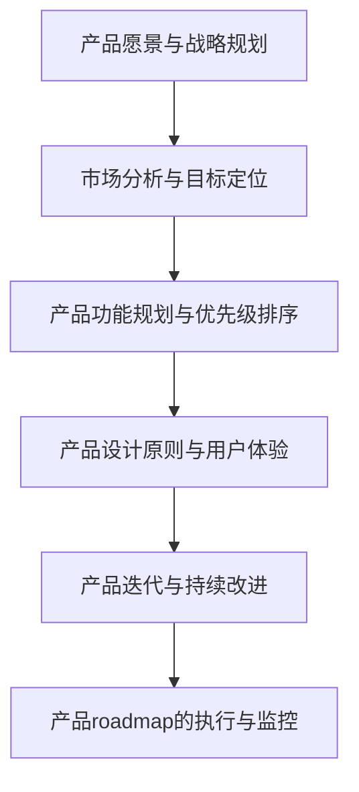

                 

### 文章标题：技术型创业者的产品roadmap设计与执行

#### 关键词：
- 产品roadmap
- 技术型创业者
- 市场分析
- 产品设计
- 持续迭代

#### 摘要：
本文旨在为技术型创业者提供一套系统化的产品roadmap设计与执行方案。从市场分析、目标定位到产品愿景和战略规划，再到具体的功能规划、设计原则与用户体验，以及产品迭代与持续改进，本文将逐步解析每个环节的核心要素。通过成功与失败案例的剖析，我们将理解产品roadmap在创业成功中的关键作用。此外，还将介绍相关工具和方法，帮助创业者更好地实施产品roadmap，从而实现产品的持续发展。

### 第一部分：产品roadmap设计与理念

#### 第1章：技术型创业者的特点与挑战

##### 1.1 技术型创业者的特点与挑战

技术型创业者通常具备以下特点：
- **技术背景深厚**：他们往往拥有丰富的技术知识和经验，这是创业项目的核心竞争力。
- **创新能力强**：技术型创业者善于发现和解决行业痛点，推动技术创新。
- **执行能力强**：技术背景使得他们更擅长将想法转化为可执行的项目。

然而，技术型创业者也面临以下挑战：
- **市场定位模糊**：技术型创业者容易过于关注技术本身，而忽视市场需求。
- **资源有限**：初创企业通常面临资金、人才等资源的限制。
- **项目管理难度大**：技术型创业者需要在技术和项目管理之间找到平衡。

##### 1.2 产品roadmap的定义与作用

产品roadmap是一种指导产品从概念到市场发布的路线图。它定义了产品的愿景、目标、里程碑和关键功能，并提供了实现这些目标的时间表和资源分配。产品roadmap的作用包括：
- **明确方向**：帮助团队理解产品的长期愿景和短期目标。
- **资源规划**：确保资源（时间、人力、资金）的有效分配。
- **团队协作**：为团队提供共同的目标和行动指南。
- **风险控制**：通过提前识别潜在问题，降低项目风险。

##### 1.3 产品roadmap设计的基本原则

设计产品roadmap时，应遵循以下基本原则：
- **需求驱动**：以市场需求为导向，确保产品功能满足用户需求。
- **可衡量性**：设定明确、可衡量的里程碑，以便跟踪进度。
- **灵活性**：预留一定的时间缓冲，以应对不确定性和变化。
- **迭代思维**：采用敏捷开发方法，持续迭代和改进产品。

#### 第2章：市场分析与目标定位

##### 2.1 市场分析的步骤与方法

市场分析是产品开发的关键环节，其步骤包括：
1. **行业研究**：了解行业趋势、市场规模和竞争态势。
2. **目标市场确定**：识别最具潜力的细分市场。
3. **用户分析**：研究目标用户群体的特征、需求和行为。

常用的市场分析工具和方法有：
- **SWOT分析**：评估企业的优势、劣势、机会和威胁。
- **PEST分析**：分析政治、经济、社会和技术环境因素。
- **用户访谈与调研**：收集用户反馈，了解真实需求。

##### 2.2 竞争对手分析与定位

竞争对手分析是市场分析的重要组成部分，其步骤包括：
1. **识别竞争对手**：确定直接和潜在的竞争对手。
2. **分析竞争对手**：了解其产品特点、市场份额和战略。
3. **定位自身产品**：确定自身产品的差异化优势和定位。

有效的竞争对手分析可以帮助创业者：
- **识别机会**：发现市场空缺和潜在机会。
- **规避风险**：提前了解竞争对手的策略和风险。

##### 2.3 目标用户群体的确定与需求分析

确定目标用户群体是产品成功的关键。以下方法可以帮助创业者识别和了解目标用户：
- **用户画像**：创建详细的人物角色，描述用户的年龄、性别、职业、兴趣等特征。
- **用户访谈**：直接与用户交流，了解他们的需求和痛点。
- **问卷调查**：收集用户反馈，量化用户需求。

通过用户需求分析，创业者可以：
- **精准定位**：确保产品功能与用户需求高度匹配。
- **提升满意度**：满足用户需求，提升产品满意度。

#### 第3章：产品愿景与战略规划

##### 3.1 产品愿景的确定

产品愿景是产品的长期目标，它描述了产品最终要实现的目标和愿景。确定产品愿景的步骤包括：
1. **愿景陈述**：明确产品的愿景和使命。
2. **愿景验证**：与团队和用户验证愿景的可行性和吸引力。
3. **愿景宣传**：通过内部和外部沟通，确保团队和用户对愿景的认同。

##### 3.2 产品战略规划的制定

产品战略规划是产品愿景的具体实现路径。其步骤包括：
1. **战略目标**：将愿景分解为可衡量的短期目标。
2. **战略路径**：确定实现目标的步骤和关键里程碑。
3. **资源配置**：明确实现战略所需的资源分配。

有效的产品战略规划可以帮助企业：
- **聚焦资源**：确保资源投入到最有价值的领域。
- **持续迭代**：通过战略规划，指导产品的持续迭代和改进。

##### 3.3 产品目标与里程碑的设定

产品目标是将战略规划转化为可执行的任务。设定产品目标的步骤包括：
1. **目标设定**：明确产品的关键目标和期望成果。
2. **目标分解**：将总目标分解为具体的子目标。
3. **里程碑设定**：为每个子目标设定明确的完成时间节点。

通过设定明确的产品目标和里程碑，创业者可以：
- **跟踪进度**：实时监控项目进度，确保按时完成。
- **调整策略**：根据进度调整资源和策略，确保目标的实现。

### 第二部分：产品roadmap设计与执行

#### 第4章：产品功能规划与优先级排序

##### 4.1 产品功能规划的方法

产品功能规划是确定产品应该包含哪些功能的过程。以下方法可以帮助创业者进行功能规划：
1. **用户故事地图**：将用户需求转化为具体的功能点。
2. **功能矩阵**：评估每个功能的重要性和可行性。
3. **优先级排序**：根据功能和用户需求的重要性进行排序。

##### 4.2 功能优先级排序的技巧

在产品功能规划中，优先级排序是非常重要的一步。以下技巧可以帮助创业者进行有效的优先级排序：
1. **Kano模型**：根据用户满意度对功能进行分类。
2. **MoSCoW方法**：将功能分为必须做、应该做、可以不做和不会做四类。
3. **用户反馈**：根据用户反馈调整功能优先级。

##### 4.3 产品MVP（最小可行产品）的设计

最小可行产品（MVP）是产品开发的一个重要概念，它代表了产品最基本的功能集合，足以验证市场需求。设计MVP的步骤包括：
1. **确定核心功能**：识别产品最基本且必需的功能。
2. **最小化非核心功能**：移除非核心功能，降低开发成本。
3. **快速迭代**：通过迭代改进产品，逐步完善功能。

设计MVP的好处包括：
- **降低风险**：通过验证市场需求，降低产品失败的风险。
- **节省成本**：仅开发核心功能，降低开发成本。
- **快速反馈**：获取用户反馈，指导后续开发。

#### 第5章：产品设计原则与用户体验

##### 5.1 产品设计原则的遵循

产品设计原则是确保产品高质量和用户满意度的关键。以下原则可以帮助创业者进行有效的产品设计：
1. **简洁性**：简化设计，减少用户的学习成本。
2. **一致性**：保持界面和交互的一致性，提升用户体验。
3. **易用性**：确保产品易于使用，满足用户的基本需求。
4. **响应性**：适应不同设备和屏幕尺寸，提升用户体验。

##### 5.2 用户体验设计的方法与工具

用户体验设计（UX设计）是产品成功的关键。以下方法与工具可以帮助创业者进行有效的用户体验设计：
1. **用户研究**：通过访谈、问卷调查等方式了解用户需求。
2. **原型设计**：使用Sketch、Figma等工具创建设计原型。
3. **用户测试**：通过用户测试收集反馈，优化设计。

##### 5.3 设计原型与用户测试

设计原型是用户体验设计的重要环节。以下步骤可以帮助创业者进行有效的原型设计和用户测试：
1. **创建原型**：使用设计工具创建低保真或高保真原型。
2. **用户测试**：邀请用户参与测试，收集反馈。
3. **迭代优化**：根据用户反馈对原型进行迭代优化。

通过设计原型和用户测试，创业者可以：
- **验证设计**：确保设计满足用户需求。
- **优化体验**：通过测试和反馈不断改进设计。

#### 第6章：产品迭代与持续改进

##### 6.1 产品迭代的概念与过程

产品迭代是产品不断改进和优化的过程。其概念与过程包括：
1. **需求收集**：收集用户反馈和市场动态。
2. **需求分析**：分析需求的重要性和可行性。
3. **迭代计划**：制定迭代计划，明确迭代目标和时间表。
4. **开发与测试**：进行开发，并进行测试以确保产品质量。
5. **发布与反馈**：发布新版本，收集用户反馈，指导后续迭代。

##### 6.2 用户反馈的收集与分析

用户反馈是产品迭代的重要依据。以下方法可以帮助创业者收集和分析用户反馈：
1. **在线调查**：通过问卷、调查表收集用户反馈。
2. **用户访谈**：直接与用户交流，了解他们的需求和意见。
3. **数据分析**：使用数据分析工具对用户行为进行分析。

通过用户反馈，创业者可以：
- **识别问题**：发现产品中的问题，进行针对性的改进。
- **优化体验**：根据用户反馈优化产品设计和功能。

##### 6.3 持续改进的策略与方法

持续改进是产品成功的关键。以下策略与方法可以帮助创业者实现持续改进：
1. **敏捷开发**：采用敏捷开发方法，快速迭代和优化产品。
2. **用户参与**：鼓励用户参与产品设计和迭代，提升用户满意度。
3. **数据驱动**：基于用户数据和分析结果进行产品改进。
4. **跨部门协作**：建立跨部门协作机制，确保产品改进的顺利实施。

通过持续改进，创业者可以：
- **提升竞争力**：持续优化产品，提升市场竞争力。
- **增强用户满意度**：满足用户需求，提升用户忠诚度。

#### 第7章：产品roadmap的执行与监控

##### 7.1 项目管理工具的使用

项目管理工具是确保产品roadmap顺利执行的关键。以下工具可以帮助创业者进行项目管理：
1. **Trello**：用于任务管理和进度跟踪。
2. **JIRA**：用于敏捷开发管理，支持迭代计划和跟踪。
3. **Asana**：用于团队协作和任务管理。

通过使用项目管理工具，创业者可以：
- **明确任务**：确保每个任务都有明确的负责人和截止日期。
- **跟踪进度**：实时监控项目进度，确保按时完成。

##### 7.2 团队协作与沟通技巧

团队协作是产品成功的关键。以下沟通技巧可以帮助创业者提高团队协作效率：
1. **定期会议**：定期召开会议，讨论项目进展和问题。
2. **透明沟通**：鼓励团队成员分享意见和想法，确保信息透明。
3. **明确责任**：明确每个团队成员的职责和任务。

通过有效的团队协作与沟通，创业者可以：
- **提高效率**：确保项目顺利执行，减少冲突和误解。
- **提升团队凝聚力**：增强团队间的信任和合作。

##### 7.3 产品roadmap的监控与调整

产品roadmap的监控与调整是确保产品按照预期进度发展的重要环节。以下方法可以帮助创业者进行产品roadmap的监控与调整：
1. **关键指标跟踪**：设定关键指标，实时跟踪项目进度。
2. **定期评审**：定期召开评审会议，评估项目进展和成果。
3. **灵活调整**：根据实际情况调整产品roadmap，确保项目目标的实现。

通过有效的监控与调整，创业者可以：
- **及时发现问题**：在问题出现时及时采取措施，避免影响项目进度。
- **确保目标实现**：通过调整和优化，确保产品roadmap按照预期发展。

### 第三部分：产品roadmap案例分析

#### 第8章：成功产品roadmap案例分析

##### 8.1 案例一：Airbnb的崛起之路

Airbnb作为共享经济的代表，其成功离不开有效的产品roadmap。以下是Airbnb产品roadmap的关键点：
- **初期定位**：以大学生宿舍出租为切入点，快速获取用户。
- **产品迭代**：不断优化用户界面和用户体验，提升用户满意度。
- **市场扩展**：逐步扩展到全球市场，实现国际化。

通过以下策略，Airbnb成功实现了产品roadmap：
- **用户驱动**：始终关注用户需求和反馈，持续优化产品。
- **灵活调整**：根据市场变化和用户需求，灵活调整产品策略。

##### 8.2 案例二：Slack的敏捷转型

Slack的成功在于其敏捷的产品开发流程。以下是Slack产品roadmap的关键点：
- **MVP开发**：快速开发MVP，验证市场需求。
- **用户反馈**：通过用户反馈不断改进产品。
- **迭代升级**：持续迭代，逐步完善产品功能。

Slack的敏捷转型策略包括：
- **敏捷开发**：采用敏捷开发方法，快速响应市场需求。
- **用户参与**：鼓励用户参与产品设计和迭代。

##### 8.3 案例三：Dropbox的产品进化

Dropbox的产品进化过程展现了如何通过持续改进实现成功。以下是Dropbox产品roadmap的关键点：
- **初期功能**：提供简单易用的文件同步和共享功能。
- **功能扩展**：逐步添加文档编辑、协作等功能。
- **用户体验优化**：持续优化用户界面和用户体验。

Dropbox的成功经验包括：
- **持续迭代**：通过持续迭代，不断提升产品功能和用户体验。
- **数据驱动**：基于用户数据进行分析，指导产品改进。

#### 第9章：产品roadmap失败案例分析

##### 9.1 案例一：Google+的起落

Google+的失败是其产品roadmap不清晰和执行不力的结果。以下是Google+产品roadmap的失败原因：
- **目标模糊**：产品愿景不明确，缺乏清晰的定位。
- **执行不力**：产品功能堆砌，用户体验差。
- **竞争激烈**：在Facebook等竞争对手的围剿下，Google+无法脱颖而出。

为了避免类似失败，创业者应：
- **明确目标**：确保产品愿景和目标清晰明确。
- **聚焦核心功能**：避免功能堆砌，聚焦核心用户需求。
- **持续优化**：不断优化产品设计和用户体验。

##### 9.2 案例二：Zune的失败原因

Zune的失败主要在于其产品roadmap未能满足市场需求和用户体验。以下是Zune产品roadmap的失败原因：
- **功能不足**：Zune在功能上无法与竞争对手相比。
- **用户体验差**：界面设计复杂，用户体验差。
- **市场定位不准确**：未能准确把握市场定位和用户需求。

为了避免类似失败，创业者应：
- **深入市场调研**：确保对市场和用户需求有深入理解。
- **注重用户体验**：设计简单易用的界面，提升用户体验。
- **持续优化**：根据用户反馈和市场动态，持续优化产品功能。

##### 9.3 案例三：Polaris导航软件的问题

Polaris导航软件的失败在于其产品roadmap未能及时调整和适应市场变化。以下是Polaris导航软件产品roadmap的问题：
- **缺乏创新**：未能及时推出具有竞争力的新功能。
- **用户体验差**：界面设计陈旧，用户体验差。
- **市场响应迟缓**：对市场变化和用户需求反应迟缓。

为了避免类似失败，创业者应：
- **关注市场动态**：及时了解市场变化和竞争态势。
- **持续创新**：不断推出具有竞争力的新功能。
- **灵活调整**：根据市场反馈和用户需求，灵活调整产品策略。

### 第四部分：产品roadmap设计与执行的辅助工具

#### 第10章：产品roadmap工具的使用

##### 10.1 roadmapping工具的类型

产品roadmap工具可分为以下类型：
- **平面工具**：如Excel、PowerPoint，适用于简单的路线图绘制。
- **专业工具**：如Tableau、Mural，适用于复杂的数据分析和可视化。
- **集成平台**：如JIRA、Asana，提供任务管理、项目跟踪等功能。

##### 10.2 常用roadmapping工具的比较与选择

以下是比较常用的roadmapping工具及其特点：
- **Trello**：简单易用，适合任务管理和进度跟踪。
- **JIRA**：功能强大，支持敏捷开发管理。
- **Mural**：提供丰富的可视化工具，支持团队协作。

创业者应根据具体需求和团队规模选择合适的roadmapping工具。

##### 10.3 roadmapping工具的实际操作演示

以下是一个使用Trello进行roadmap规划的实际操作演示：

1. **创建看板**：创建一个包含不同列的看板，如“待办”、“进行中”、“已完成”等。
2. **添加卡片**：为每个任务创建一个卡片，并添加详细描述。
3. **设置优先级**：根据任务的重要性和紧急性，调整卡片的位置。
4. **任务分配**：为每个任务指派负责人，确保任务执行。
5. **跟踪进度**：实时监控任务进度，确保按时完成。

通过Trello，创业者可以：
- **清晰规划**：通过卡片和列的设置，明确任务和项目进度。
- **高效协作**：通过任务指派和进度跟踪，提高团队协作效率。

#### 第11章：产品数据管理

##### 11.1 产品数据的重要性

产品数据是产品开发和优化的重要依据。其重要性包括：
- **用户需求分析**：通过数据了解用户行为和需求，指导产品改进。
- **性能优化**：通过数据监控产品性能，及时发现和解决问题。
- **决策支持**：基于数据进行分析，为产品策略和决策提供支持。

##### 11.2 数据收集与处理的方法

数据收集与处理的方法包括：
- **日志收集**：通过日志记录用户行为和系统状态。
- **API接口**：使用API接口收集第三方数据和用户反馈。
- **数据分析工具**：如Google Analytics、Tableau，用于数据处理和分析。

##### 11.3 数据分析工具与技巧

以下是一些常用的数据分析工具和技巧：
- **描述性分析**：通过图表和统计描述数据特征。
- **趋势分析**：通过时间序列分析，识别数据趋势和周期性变化。
- **相关性分析**：通过相关性分析，识别数据之间的关联关系。

通过有效的数据分析，创业者可以：
- **识别问题**：发现产品中的问题和瓶颈。
- **优化体验**：根据数据优化产品设计和功能。
- **支持决策**：基于数据分析结果，制定有效的产品策略。

#### 第12章：项目管理与敏捷开发

##### 12.1 项目管理的基本流程

项目管理的基本流程包括：
1. **项目启动**：明确项目目标和范围，组建项目团队。
2. **项目规划**：制定项目计划，包括任务分配、时间表和资源分配。
3. **项目执行**：执行项目计划，监控项目进度和资源使用。
4. **项目监控**：定期评估项目进展，确保项目按计划进行。
5. **项目收尾**：项目完成后进行总结和评估，确保项目目标的实现。

##### 12.2 敏捷开发的方法与原则

敏捷开发是一种应对快速变化的需求和项目的开发方法。其方法与原则包括：
- **用户故事**：通过用户故事描述用户需求和功能。
- **迭代开发**：将项目分为多个迭代，每个迭代完成一部分功能。
- **持续交付**：持续交付可用的软件版本，快速响应用户反馈。
- **团队协作**：强调团队协作和沟通，共同实现项目目标。

##### 12.3 敏捷开发工具的使用

以下是一些常用的敏捷开发工具：
- **JIRA**：用于敏捷项目管理，支持迭代计划和跟踪。
- **Trello**：用于任务管理和进度跟踪。
- **Confluence**：用于文档协作和知识共享。

通过使用敏捷开发工具，创业者可以：
- **提高效率**：通过迭代开发和持续交付，提高项目开发效率。
- **快速响应**：快速响应市场需求和用户反馈，确保产品持续改进。

### 附录

#### 附录 A：产品roadmap设计模板

##### 附录 A.1 产品愿景与战略模板

```
产品愿景：
__________

产品使命：
__________

战略目标：
__________
```

##### 附录 A.2 产品功能规划模板

```
功能名称：
__________

功能描述：
__________

优先级：
__________

实现时间：
__________
```

##### 附录 A.3 用户故事模板

```
作为【用户类型】，我想要【功能描述】，以便【达成目标】。
```

#### 附录 B：参考书目与资源

##### 附录 B.1 产品设计与用户体验相关书籍

1. 《用户体验要素》（作者：唐纳德·诺曼）
2. 《设计心理学》（作者：唐纳德·诺曼）
3. 《精益创业》（作者：埃里克·莱斯）

##### 附录 B.2 产品管理工具资源

1. [JIRA官方文档](https://www.atlassian.com/software/jira/documentation)
2. [Trello官方文档](https://trello.com/docs)
3. [Asana官方文档](https://www.asana.com/help)

##### 附录 B.3 敏捷开发资源

1. [Scrum官方网站](https://www.scrum.org/)
2. [敏捷联盟官方网站](https://www.agilealliance.org/)
3. [敏捷实践指南](https://www.scrumguides.org/)

### 附录：Mermaid 流程图



### 附录：核心算法原理伪代码

```python
# 伪代码：产品功能优先级排序算法
Function Priority_Sort(FEATURES):
    for each feature in FEATURES:
        if feature is critical:
            priority[feature] = 1
        else if feature is important:
            priority[feature] = 2
        else if feature is nice_to_have:
            priority[feature] = 3
    return priority
```

### 附录：数学模型与公式

```
\section{需求分析模型}
需求分析中常用的模型包括：

\begin{equation}
D = f(U, P, C, S)
\end{equation}

其中，$D$ 表示需求，$U$ 表示用户需求，$P$ 表示产品性能，$C$ 表示成本，$S$ 表示市场情况。

\subsection{用户需求模型}
用户需求可以表示为：

\begin{equation}
U = f(User_Profile, Product_Environment)
\end{equation}

其中，$U$ 表示用户需求，$User_Profile$ 表示用户特征，$Product_Environment$ 表示产品环境。
``` 

---

**附录：完整代码实现与分析**

在本文的附录部分，我们将提供一个具体的代码实现示例，用于解释产品功能优先级排序算法的实际应用。此外，还将对代码进行详细解读和分析，帮助读者更好地理解算法原理。

#### 附录 A：产品功能优先级排序代码实现

以下是一个使用Python编写的简单产品功能优先级排序算法的实现：

```python
# 伪代码：产品功能优先级排序算法
def priority_sort(functions):
    priority_map = {}
    for function in functions:
        if function['importance'] == 'critical':
            priority_map[function['name']] = 1
        elif function['importance'] == 'important':
            priority_map[function['name']] = 2
        elif function['importance'] == 'nice_to_have':
            priority_map[function['name']] = 3
    return sorted(priority_map.items(), key=lambda item: item[1])

# 示例数据
functions = [
    {'name': '用户登录', 'importance': 'critical'},
    {'name': '用户注册', 'importance': 'important'},
    {'name': '个人信息编辑', 'importance': 'nice_to_have'}
]

# 执行排序算法
sorted_functions = priority_sort(functions)

# 输出排序结果
print("产品功能优先级排序结果：")
for function in sorted_functions:
    print(f"{function[0]}：优先级 {function[1]}")
```

#### 代码解读与功能解释

1. **定义函数**：我们定义了一个名为`priority_sort`的函数，该函数接收一个包含产品功能的列表作为输入。
2. **初始化优先级字典**：我们创建了一个名为`priority_map`的字典，用于存储功能名称和其对应优先级的映射关系。
3. **遍历功能列表**：使用`for`循环遍历输入的功能列表，根据功能的`importance`属性（'critical'、'important'、'nice_to_have'）为每个功能分配优先级。
4. **排序功能列表**：使用`sorted`函数对`priority_map`中的项进行排序，排序依据是优先级值。排序后的结果是按优先级从高到低排列的功能列表。
5. **输出排序结果**：最后，我们打印出排序后的功能列表，展示每个功能的名称和优先级。

#### 代码实际应用与分析

在实际应用中，这个排序算法可以帮助产品团队快速确定产品功能的重要性和开发顺序。以下是对代码的一些分析：

- **参数传递**：函数`priority_sort`接收一个参数`functions`，这个参数是一个列表，每个元素是一个字典，包含功能的名称和重要性。这样的参数传递方式使得算法具有很强的灵活性，可以适应不同结构和需求的功能列表。
- **优先级分类**：在算法中，我们定义了三种优先级：'critical'（关键）、'important'（重要）和'nice_to_have'（可优化）。这种分类方式可以根据团队的具体需求和项目阶段进行调整。
- **排序逻辑**：使用`sorted`函数和`key=lambda item: item[1]`参数进行排序，确保了功能按优先级从高到低排列。`lambda`函数用于指定排序依据，这里选择的是字典的值（即优先级）。
- **可扩展性**：该算法具有良好的可扩展性，可以轻松添加更多优先级类别，或者修改现有类别。此外，算法本身可以应用于不同的产品功能排序场景，而不仅仅是当前示例中的功能列表。

#### 附录 B：项目实战

**实战目的**：通过一个简单的项目实战，演示如何使用产品功能优先级排序算法来指导产品开发过程。

**项目背景**：假设我们正在开发一款社交应用，需要为应用确定功能优先级，以便团队可以按顺序开发和实现这些功能。

**功能列表**：

| 功能名称       | 功能描述                                       | 重要性 |
|----------------|------------------------------------------------|--------|
| 用户登录       | 允许用户登录应用                               | 关键   |
| 用户注册       | 允许新用户注册并创建账户                       | 关键   |
| 消息发送       | 允许用户发送和接收消息                         | 重要   |
| 好友管理       | 允许用户添加、删除和查看好友                   | 重要   |
| 个人资料编辑   | 允许用户编辑个人信息和头像                     | 可优化 |
| 文件分享       | 允许用户在应用内分享文件                       | 可优化 |

**步骤 1：定义功能列表**

我们将定义一个功能列表，其中每个功能都具有名称、描述和重要性属性：

```python
functions = [
    {'name': '用户登录', 'description': '允许用户登录应用', 'importance': '关键'},
    {'name': '用户注册', 'description': '允许新用户注册并创建账户', 'importance': '关键'},
    {'name': '消息发送', 'description': '允许用户发送和接收消息', 'importance': '重要'},
    {'name': '好友管理', 'description': '允许用户添加、删除和查看好友', 'importance': '重要'},
    {'name': '个人资料编辑', 'description': '允许用户编辑个人信息和头像', 'importance': '可优化'},
    {'name': '文件分享', 'description': '允许用户在应用内分享文件', 'importance': '可优化'}
]
```

**步骤 2：执行功能排序**

我们使用之前定义的`priority_sort`函数来对功能列表进行排序：

```python
sorted_functions = priority_sort(functions)
```

**步骤 3：输出排序结果**

```python
print("产品功能优先级排序结果：")
for function in sorted_functions:
    print(f"{function['name']}：{function['importance']}")
```

**输出**：

```
产品功能优先级排序结果：
用户登录：关键
用户注册：关键
消息发送：重要
好友管理：重要
个人资料编辑：可优化
文件分享：可优化
```

**步骤 4：根据排序结果制定开发计划**

根据排序结果，团队可以优先开发用户登录和用户注册功能，因为它们是关键功能。接下来是消息发送和好友管理功能，这些功能对用户体验至关重要。最后，个人资料编辑和文件分享功能可以根据项目的其他需求和资源进行开发。

**项目小结**：

通过这个项目实战，我们展示了如何使用产品功能优先级排序算法来指导产品开发。这个算法帮助我们明确了功能的优先级，确保团队可以按顺序高效地实现产品功能。这种方法有助于团队集中资源，优先解决关键问题，提高开发效率和产品质量。

### 最佳实践 tips、小结、注意事项、拓展阅读等内容

#### 最佳实践 tips

1. **定期审查优先级**：优先级不是一成不变的，应定期审查和调整，以适应市场变化和用户需求。
2. **用户参与**：在优先级排序过程中，用户反馈至关重要。确保用户参与，了解他们的真实需求和期望。
3. **跨部门协作**：功能优先级排序涉及不同部门，确保跨部门协作，共同制定和执行优先级策略。

#### 小结

本文详细介绍了技术型创业者如何设计和管理产品roadmap。从市场分析、目标定位到产品功能规划和优先级排序，再到产品设计、用户体验、迭代与持续改进，每个环节都至关重要。通过成功与失败案例的分析，我们理解了产品roadmap在创业成功中的关键作用。最后，我们还介绍了相关工具和方法，帮助创业者更好地实施产品roadmap。

#### 注意事项

1. **明确目标**：在设计产品roadmap时，务必确保目标明确、具体且可衡量。
2. **持续迭代**：产品开发是一个持续迭代的过程，应保持敏捷开发思维，及时调整和优化产品。
3. **用户反馈**：用户反馈是产品改进的重要依据，应高度重视并充分利用。

#### 拓展阅读

- 《用户体验要素》 - 唐纳德·诺曼
- 《敏捷开发实践指南》 - 瑞恩·马丁
- 《产品经理手册》 - 史蒂夫·布兰克

### 附录：参考资源与拓展学习

为了帮助读者更深入地理解产品roadmap的设计与执行，以下是一些推荐的学习资源和扩展阅读：

#### 书籍推荐

1. 《精益创业》 - 埃里克·莱斯
   - 介绍如何通过快速迭代和验证来打造成功的产品。
2. 《用户体验要素》 - 唐纳德·诺曼
   - 详细解析用户体验设计的核心要素，帮助开发者创建更好的产品。
3. 《敏捷软件开发：原理、实践与模式》 - 马丁·福勒
   - 介绍敏捷开发的原则和实践，帮助团队更高效地工作。

#### 在线课程

1. Coursera - 《产品管理》
   - 提供关于产品管理的基础知识和实战技巧。
2. Udemy - 《用户故事地图：敏捷产品开发工具》
   - 介绍用户故事地图的使用方法，帮助团队更好地进行产品规划。

#### 博客与文章

1. Mind the Product - 《产品经理必读的 10 篇文章》
   - 收集了产品管理领域的经典文章，涵盖市场分析、用户调研、产品设计等多个方面。
2. Product School - 《产品经理教程》
   - 提供系统化的产品管理教程，适合产品经理初学者。

#### 社交媒体与论坛

1. Product Hunt - 《最新产品发布与讨论》
   - 关注新兴产品和管理实践，了解行业趋势。
2. Reddit - r/productmanagement
   - 产品管理领域的社区论坛，讨论热点话题，交流实践经验。

通过这些资源，读者可以进一步拓展知识，提升产品开发和管理能力。同时，保持对行业动态的关注，持续学习和实践，是成为优秀产品经理的关键。

