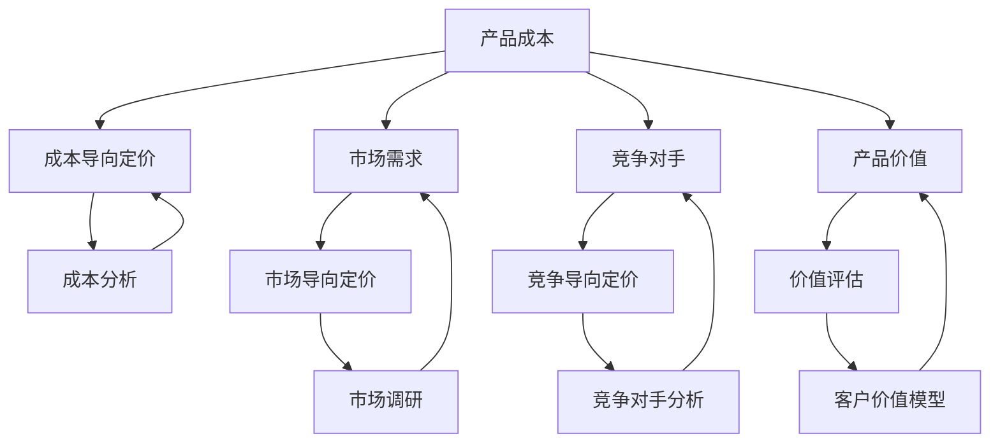

                 


### 文章标题：技术型创业者的产品定价策略与价值传递

#### 关键词：
- 产品定价策略
- 价值传递
- 技术创业者
- 成本分析
- 市场调研
- 竞争分析
- 价值评估

#### 摘要：
本文旨在探讨技术型创业者在产品定价策略和价值传递方面的关键实践。文章首先概述了产品定价策略的基础，包括成本分析、市场调研与竞争对手分析，并提出了产品价值评估的方法。随后，文章深入探讨了产品定价策略的选择与调整实践，以及价值传递策略的实现。最后，文章总结了定价策略与价值传递的协同效应，并展望了未来的趋势与挑战。

### 第一部分：技术型创业者的产品定价策略基础

#### 第1章：产品定价策略概述

**1. 定价策略的重要性**

在技术型创业领域，定价策略是影响产品成功与否的重要因素之一。合理的定价策略不仅能够确保商业模式的可行性，还能够提高企业的盈利能力。此外，定价策略对市场竞争和消费者心理也有着显著的影响。

**2. 定价策略的分类**

- **成本导向定价**：基于产品成本进行定价，考虑固定成本和变动成本，旨在确保盈利。
- **市场导向定价**：基于市场需求和消费者支付意愿进行定价，注重市场接受度和利润空间。
- **竞争导向定价**：基于竞争对手的定价策略进行定价，旨在确保在市场竞争中占据有利地位。
- **渗透定价与撇脂定价**：渗透定价旨在通过低价格快速占领市场，撇脂定价则通过高价格获取高额利润。

**3. 产品生命周期与定价策略**

- **引入期**：价格较低，主要用于吸引早期用户。
- **成长期**：价格适度提升，以适应市场需求增长。
- **成熟期**：价格稳定，以保持市场份额。
- **衰退期**：价格可能降低，以应对市场需求下降。

#### 第2章：产品成本分析

**1. 成本构成**

- **变动成本**：与产品生产量直接相关的成本。
- **固定成本**：与产品生产量无关的成本。
- **直接成本**：直接用于产品生产的成本。
- **间接成本**：间接支持产品生产的成本。

**2. 成本估算方法**

- **成本核算**：对现有成本进行详细计算和分析。
- **成本预测**：对未来成本的估算，考虑市场变化和成本控制。
- **成本控制**：通过优化供应链和生产流程，降低成本。

**3. 成本优化策略**

- **供应链优化**：通过提高供应链效率，降低采购和物流成本。
- **生产流程优化**：通过改进生产流程，提高生产效率。
- **成本分摊策略**：通过合理分摊成本，降低单位产品成本。

#### 第3章：市场调研与分析

**1. 市场调研目的与方法**

- **目的**：了解市场需求、消费者偏好和竞争环境。
- **方法**：包括定性调研和定量调研，以及竞争对手分析。

**2. 消费者行为分析**

- **需求分析**：通过数据了解消费者对产品的需求。
- **偏好分析**：通过调查和数据分析，了解消费者的偏好。
- **购买行为分析**：研究消费者购买产品的过程和影响因素。

**3. 市场趋势预测**

- **市场规模预测**：预测未来市场的大小和增长速度。
- **市场份额预测**：预测企业在市场中的占有率。
- **市场增长趋势预测**：预测市场的增长方向和潜力。

#### 第4章：竞争对手分析

**1. 竞争对手识别**

- **直接竞争对手**：提供相同或类似产品的企业。
- **间接竞争对手**：提供替代产品的企业。

**2. 竞争对手定价策略分析**

- **成本分析**：了解竞争对手的成本结构和成本优势。
- **市场分析**：分析竞争对手的市场定位和营销策略。
- **竞争策略分析**：研究竞争对手的战略和市场反应。

**3. 竞争定位策略**

- **产品差异化**：通过产品特色和功能，提高市场竞争力。
- **定位差异化**：通过市场定位和目标客户群体的区分，吸引特定消费者。
- **渠道差异化**：通过不同的销售渠道，提高产品的市场覆盖率。

#### 第5章：产品价值评估

**1. 价值评估模型**

- **客户价值模型**：从客户角度评估产品的价值。
- **成本价值模型**：从成本角度评估产品的价值。
- **竞争价值模型**：从竞争角度评估产品的价值。

**2. 产品价值主张**

- **价值主张定义**：明确产品提供给客户的核心价值。
- **价值主张分析**：分析产品的核心价值和竞争优势。
- **价值主张设计**：设计能够满足市场需求和价值主张的产品。

**3. 产品定价模型**

- **成本加成定价模型**：在成本基础上加成定价。
- **客户价值定价模型**：基于客户对产品的价值感知定价。
- **市场供需定价模型**：根据市场需求和供应关系定价。

### 第二部分：产品定价策略与价值传递实践

#### 第6章：产品定价策略实践

**1. 定价策略选择**

- **成本导向定价策略**：适用于成本控制能力较强的企业。
- **市场导向定价策略**：适用于市场需求主导的产品。
- **竞争导向定价策略**：适用于竞争激烈的市场环境。
- **渗透定价策略**：适用于新产品市场推广。
- **撇脂定价策略**：适用于高端市场和高利润产品。

**2. 定价策略调整**

- **产品生命周期定价策略**：根据产品生命周期调整价格。
- **市场环境变化定价策略**：根据市场变化调整价格。
- **竞争对手策略定价策略**：根据竞争对手的行为调整价格。

**3. 定价策略案例分析**

- **成功案例分析**：分析成功企业的定价策略。
- **失败案例分析**：分析失败企业的定价策略和教训。

#### 第7章：价值传递策略

**1. 价值传递模型**

- **产品价值传递模型**：描述产品如何为客户创造价值。
- **客户价值传递模型**：描述客户如何从产品中获益。
- **市场价值传递模型**：描述产品如何在市场中传递价值。

**2. 价值创造策略**

- **创新价值创造**：通过创新技术提高产品价值。
- **质量价值创造**：通过高质量的产品和服务提高价值。
- **服务价值创造**：通过优质的服务提升客户体验。

**3. 价值传递渠道优化**

- **渠道选择**：选择合适的销售渠道。
- **渠道管理**：优化渠道运营和管理。
- **渠道协同**：建立渠道之间的协同效应。

#### 第8章：价值传递案例分析

**1. 案例介绍**

- **成功案例介绍**：介绍成功企业的价值传递实践。
- **失败案例介绍**：介绍失败企业的价值传递实践。

**2. 案例分析**

- **定价策略分析**：分析案例中的定价策略。
- **价值创造分析**：分析案例中的价值创造方式。
- **价值传递分析**：分析案例中的价值传递渠道和效果。

**3. 案例总结与启示**

- **定价策略总结**：总结成功和失败案例的定价策略经验。
- **价值传递总结**：总结成功和失败案例的价值传递经验。
- **启示与建议**：提出针对技术型创业者的价值传递策略建议。

### 第三部分：产品定价策略与价值传递优化

#### 第9章：定价策略与价值传递优化

**1. 优化目标**

- **提高利润率**：通过优化定价策略，提高产品盈利能力。
- **提高市场份额**：通过价值传递策略，扩大市场占有率。
- **提高客户满意度**：通过优质的产品和服务，提升客户满意度。

**2. 优化方法**

- **数据驱动定价策略**：利用大数据和人工智能技术优化定价。
- **客户细分定价策略**：根据客户需求和行为，定制化定价。
- **实时动态定价策略**：根据市场变化，动态调整价格。

**3. 优化案例分析**

- **成功案例分析**：分析成功企业的优化实践。
- **失败案例分析**：分析失败企业的优化教训。

#### 第10章：定价策略与价值传递的协同效应

**1. 协同效应概念**

- **定价与价值的互动**：定价策略和价值创造、传递的相互作用。
- **定价策略与市场策略的协同**：定价策略与市场营销策略的协同作用。

**2. 协同效应实现**

- **定价策略与产品创新的协同**：通过定价策略推动产品创新。
- **定价策略与营销策略的协同**：通过定价策略提升市场营销效果。
- **定价策略与客户服务的协同**：通过定价策略优化客户服务体验。

**3. 协同效应案例分析**

- **成功案例分析**：分析成功企业的协同效应实践。
- **失败案例分析**：分析失败企业的协同效应不足。

#### 第11章：未来趋势与挑战

**1. 定价策略未来趋势**

- **技术驱动的定价策略**：利用大数据和人工智能技术，实现精准定价。
- **个性化定价策略**：根据客户需求和偏好，提供个性化的定价方案。
- **全球化定价策略**：考虑全球市场的多样性和差异性，制定全球化的定价策略。

**2. 价值传递未来趋势**

- **价值创造的创新模式**：通过技术创新，持续创造新的价值。
- **价值传递的网络效应**：通过构建生态圈，实现价值的网络化传递。
- **价值传递的可持续性**：通过可持续发展战略，实现长期的价值传递。

**3. 面临的挑战**

- **数据隐私与信息安全**：保护客户数据和信息安全。
- **竞争加剧与市场不确定性**：应对激烈的市场竞争和不确定性。
- **客户期望变化与应对策略**：适应不断变化的客户期望和需求。

### 附录

#### 附录A：定价策略与价值传递工具与资源

**1. 定价策略分析工具**

- **成本分析工具**：用于成本核算和预测。
- **市场调研工具**：用于数据收集和分析。
- **竞争对手分析工具**：用于识别和分析竞争对手。

**2. 价值评估工具**

- **客户价值评估工具**：用于评估客户对产品的价值感知。
- **成本价值评估工具**：用于计算产品的成本价值。
- **竞争价值评估工具**：用于评估产品在竞争中的价值。

**3. 其他资源**

- **行业报告**：提供市场趋势和竞争分析。
- **专业书籍**：提供定价策略和市场营销的理论知识。

---

**作者**：AI天才研究院/AI Genius Institute & 禅与计算机程序设计艺术 /Zen And The Art of Computer Programming

---

**注意**：以上内容为文章结构框架，具体内容需要进一步补充和详细阐述。以下是第1章的具体内容示例：

#### 第1章：产品定价策略概述

**背景介绍**

在技术型创业领域，产品定价策略是影响产品市场表现和公司盈利能力的重要因素。定价策略不仅需要考虑产品的成本、市场需求和竞争对手，还需要综合考虑企业的长期战略和目标。合理的定价策略能够帮助企业在竞争激烈的市场中脱颖而出，实现持续增长和盈利。

**核心概念与联系**

产品定价策略的核心概念包括成本、市场、竞争和价值。这些概念之间的关系可以用以下Mermaid流程图表示：



**核心算法原理讲解**

产品定价策略的算法原理主要包括成本加成定价模型、客户价值定价模型和市场供需定价模型。以下是这些模型的伪代码：

```python
# 成本加成定价模型
def cost_plus_margin定价（成本，加成率）：
    加成 = 成本 * 加成率
    价格 = 成本 + 加成
    return 价格

# 客户价值定价模型
def customer_value定价（客户价值，利润率）：
    价格 = 客户价值 / (1 - 利润率)
    return 价格

# 市场供需定价模型
def market_supply_demand定价（市场需求量，供应量）：
    价格 = 市场需求量 / 供应量
    return 价格
```

**数学模型和公式**

产品定价策略的数学模型包括成本模型、市场模型和竞争模型。以下是这些模型的公式和详细讲解：

1. **成本模型**

   成本模型用于计算产品的总成本，包括变动成本和固定成本。

   公式：
   $$C = FC + VC \times Q$$
   
   其中，C表示总成本，FC表示固定成本，VC表示变动成本，Q表示产品数量。

   解释：固定成本FC不随产品数量的变化而变化，变动成本VC与产品数量Q成正比。

2. **市场模型**

   市场模型用于预测市场需求量，影响产品定价策略。

   公式：
   $$D = a - bP$$
   
   其中，D表示市场需求量，a表示市场需求量最大值，b表示价格敏感度，P表示产品价格。

   解释：市场需求量随价格P的上升而下降，随价格P的下降而上升。

3. **竞争模型**

   竞争模型用于分析竞争对手的定价策略，帮助企业制定合理的竞争策略。

   公式：
   $$C_{competitor} = C_{ ours } + (P_{competitor} - P_{ours}) \times M$$
   
   其中，$C_{competitor}$表示竞争对手的成本，$C_{ours}$表示自己的成本，$P_{competitor}$表示竞争对手的价格，$P_{ours}$表示自己的价格，M表示成本差异对价格的影响系数。

   解释：竞争对手的成本高于自己的成本，价格差异会影响竞争策略。

**项目实战**

**开发环境搭建**：使用Python进行成本分析和定价策略的模拟。

**源代码详细实现和代码解读**：

```python
# 成本分析代码示例
def calculate_total_cost(fc, vc, q):
    total_cost = fc + vc * q
    return total_cost

# 定价策略代码示例
def pricing_strategy(type, cost, value, market_demand):
    if type == 'cost_plus_margin':
        margin_rate = 0.3
        price = cost + margin_rate * cost
    elif type == 'customer_value':
        profit_rate = 0.2
        price = value / (1 - profit_rate)
    elif type == 'market_supply_demand':
        price = market_demand / q
    return price
```

**代码应用解读与分析**：以上代码实现了成本分析和三种定价策略的计算。通过输入不同的成本、价值和市场需求量，可以计算出相应的定价策略。

**实际案例分析和详细讲解剖析**：以下是一个实际案例：

- **案例背景**：一家技术型创业公司开发了一款智能家居设备，成本为100元，市场需求量为1000台。
- **成本分析**：固定成本为5000元，变动成本为10元/台。
- **定价策略**：使用成本加成定价策略，加成率为30%。

   计算过程：
   - 总成本 = 5000 + 10 * 1000 = 15000元
   - 价格 = 15000 + 0.3 * 15000 = 19500元

- **案例分析**：通过成本分析，该公司的定价策略为195元/台。这种定价策略能够确保公司的盈利能力，同时也考虑了市场需求和竞争环境。

**项目小结**：

- 成本分析是产品定价策略的基础，需要综合考虑固定成本和变动成本。
- 选择合适的定价策略，如成本加成定价策略、客户价值定价策略和市场供需定价策略，能够帮助公司在竞争激烈的市场中脱颖而出。
- 通过实际案例分析和代码应用，可以更好地理解和实践产品定价策略。

**最佳实践 tips**：

- 定期进行成本分析和市场调研，以了解产品和市场的变化。
- 考虑竞争对手的定价策略和市场定位，制定有针对性的定价策略。
- 定价策略需要灵活调整，以适应市场和客户需求的变化。

**小结**：

产品定价策略是技术型创业者在产品市场中的关键决策，需要综合考虑成本、市场需求和竞争对手。通过合理的定价策略，企业能够提高盈利能力，扩大市场份额，实现可持续发展。

**注意事项**：

- 在制定定价策略时，需要充分考虑产品的成本结构、市场需求和竞争对手。
- 定价策略需要与企业的长期战略和目标相一致。
- 定价策略需要灵活调整，以适应市场和客户需求的变化。

**拓展阅读**：

- 《定价与市场营销策略》
- 《成本分析与控制》
- 《市场调研与消费者行为分析》

---

以上为第1章的具体内容示例，后续章节将根据目录大纲进一步补充和详细阐述。文章总字数将根据具体内容的详细程度进行调整，以确保满足8000～12000字的要求。在撰写过程中，将遵循逻辑清晰、结构紧凑、简单易懂的原则，力求为读者提供有价值的技术博客文章。

