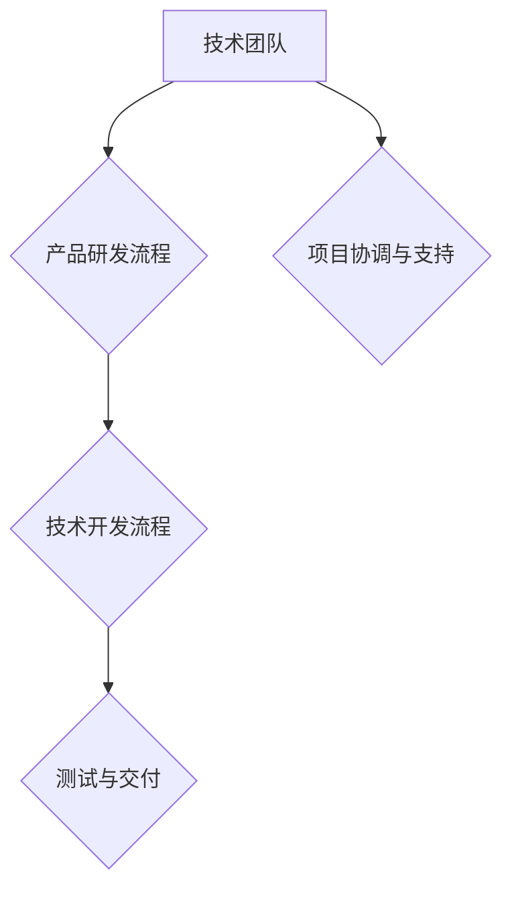

                 


### 《技术驱动型创业公司的组织架构设计》

> 关键词：技术驱动型创业公司、组织架构、团队建设、管理体系、优化、案例分析

> 摘要：本文旨在探讨技术驱动型创业公司的组织架构设计，从引言与概述、核心团队建设、部门设置与职能划分、管理体系与流程、组织架构优化以及案例分析等方面进行详细分析，为创业公司提供有价值的组织架构设计参考。

## 第一部分：引言与概述

### 1. 引言

技术驱动型创业公司是指在创业过程中，以技术创新为核心，通过技术研发、产品迭代和市场拓展等手段实现企业发展的公司。随着信息技术的迅猛发展，技术驱动型创业公司越来越受到关注，成为推动经济增长的重要力量。

技术驱动型创业公司具有以下特点：

- **创新性**：以技术创新为核心，持续推出具有竞争力的产品和服务。
- **高风险**：技术创新的不确定性带来了较高的风险，需要良好的风险控制能力。
- **快速迭代**：市场需求变化快，需要快速响应并不断优化产品。
- **团队协作**：强调团队合作，通过高效协作实现快速发展和市场突破。

### 2. 组织架构设计的重要性

组织架构设计对技术驱动型创业公司的发展至关重要。合理的组织架构可以确保团队协作高效、信息流通顺畅、资源利用最大化，从而提高公司的整体竞争力。

组织架构设计的重要性体现在以下几个方面：

- **决策效率**：明确的组织架构有助于提高决策效率，减少决策过程中的冗余环节。
- **团队协作**：合理的组织架构可以促进团队协作，提高项目执行效率。
- **资源整合**：组织架构设计有助于整合公司资源，优化资源配置，提高资源利用效率。
- **人才发展**：良好的组织架构可以为员工提供清晰的职业发展路径，促进人才成长。

### 3. 组织架构设计的原则与方法

组织架构设计应遵循以下原则：

- **适应性**：组织架构应具有适应性，能够根据业务需求和市场变化进行调整。
- **灵活性**：组织架构应具备灵活性，能够快速响应市场变化和客户需求。
- **高效性**：组织架构设计应追求高效性，确保团队协作顺畅，提高工作效率。
- **协同性**：组织架构应强调各部门之间的协同作用，促进资源整合。

组织架构设计的方法包括：

- **职能式组织**：按照职能划分部门，实现专业化管理，提高工作效率。
- **项目式组织**：以项目为导向，设立项目团队，实现快速响应和高效协作。
- **矩阵式组织**：结合职能式组织和项目式组织的优势，实现灵活性和高效性的统一。

## 第二部分：技术驱动型创业公司的核心团队建设

### 4. 核心团队的角色与职责

技术驱动型创业公司的核心团队通常包括以下成员：

- **技术团队**：负责技术研发和产品开发，是公司的核心力量。主要职责包括：
  - 负责技术规划和研发方向；
  - 实现技术方案并推动项目进度；
  - 解决技术难题和优化技术方案；
  - 维护技术团队的技术水平。

- **产品团队**：负责产品规划和产品设计，是产品开发的主体。主要职责包括：
  - 研究市场需求和用户需求，提出产品规划；
  - 设计产品原型，制定产品开发计划；
  - 负责产品开发过程中的协调和沟通；
  - 负责产品上线后的运营和优化。

- **运营团队**：负责公司的日常运营，确保公司稳定运行。主要职责包括：
  - 制定运营策略和营销计划；
  - 管理日常运营流程，提高运营效率；
  - 负责客户服务和市场推广；
  - 维护公司形象和品牌。

- **市场团队**：负责市场分析和市场推广，推动公司产品的市场拓展。主要职责包括：
  - 进行市场调研，分析市场趋势和竞争态势；
  - 制定市场推广策略，策划营销活动；
  - 负责市场渠道的开拓和管理；
  - 监测市场反馈，调整市场策略。

### 5. 团队成员的能力与素质

技术驱动型创业公司的团队成员应具备以下能力和素质：

- **技术能力**：具备扎实的专业知识和技能，能够解决技术难题和推动技术进步。
- **领导力**：具备领导力和团队管理能力，能够带领团队实现共同目标。
- **沟通能力**：具备良好的沟通能力，能够与团队成员、客户和合作伙伴顺畅沟通。
- **学习能力**：具备快速学习的能力，能够不断更新知识和技能，适应快速变化的市场和技术环境。
- **创新思维**：具备创新思维，能够提出新的想法和解决方案，推动公司发展。

### 6. 团队协作与沟通机制

技术驱动型创业公司应建立有效的团队协作与沟通机制，以提高团队协作效率和项目执行效果。以下是一些建议：

- **项目管理工具**：使用项目管理工具（如Trello、Jira等）来跟踪项目进度，确保团队成员对项目进展有清晰的了解。
- **会议制度**：建立定期的会议制度，包括项目进度会议、技术讨论会议和部门协调会议等，确保团队成员之间的沟通和信息共享。
- **决策流程**：明确决策流程，确保决策的透明性和公正性，减少决策过程中的信息不对称。
- **信息共享与知识管理**：建立信息共享平台（如内部Wiki、文档管理系统等），促进知识和经验的积累和传承。

## 第三部分：技术驱动型创业公司的部门设置与职能划分

### 7. 部门设置与职能划分的原则

技术驱动型创业公司的部门设置与职能划分应遵循以下原则：

- **业务需求导向**：根据业务需求和项目特点划分部门，确保各部门职责明确，协作顺畅。
- **技术领域划分**：按照技术领域划分部门，实现技术专业化管理，提高研发效率。
- **职能分工**：按照职能分工设立部门，确保各部门职责明确，各司其职。

### 8. 主要部门的职能与组织架构

技术驱动型创业公司的主要部门包括：

- **技术研发部门**：负责技术研发和产品开发，是公司的核心部门。主要职能包括：
  - 负责技术规划和研发方向；
  - 实现技术方案并推动项目进度；
  - 解决技术难题和优化技术方案；
  - 维护技术团队的技术水平。

- **产品研发部门**：负责产品规划和产品设计，是产品开发的主体。主要职能包括：
  - 研究市场需求和用户需求，提出产品规划；
  - 设计产品原型，制定产品开发计划；
  - 负责产品开发过程中的协调和沟通；
  - 负责产品上线后的运营和优化。

- **运营管理部门**：负责公司的日常运营，确保公司稳定运行。主要职能包括：
  - 制定运营策略和营销计划；
  - 管理日常运营流程，提高运营效率；
  - 负责客户服务和市场推广；
  - 维护公司形象和品牌。

- **市场营销部门**：负责市场分析和市场推广，推动公司产品的市场拓展。主要职能包括：
  - 进行市场调研，分析市场趋势和竞争态势；
  - 制定市场推广策略，策划营销活动；
  - 负责市场渠道的开拓和管理；
  - 监测市场反馈，调整市场策略。

- **人力资源部门**：负责公司的人才引进、培训和绩效管理，确保公司人才队伍的稳定和发展。主要职能包括：
  - 负责招聘和选拔优秀人才；
  - 制定员工培训和发展计划；
  - 进行绩效评估和激励制度设计；
  - 处理员工关系和纠纷。

### 9. 跨部门协作与项目管理

跨部门协作与项目管理是技术驱动型创业公司高效运营的重要保障。以下是一些建议：

- **跨部门沟通与协作机制**：建立跨部门沟通与协作机制，定期召开跨部门会议，确保各部门之间的信息共享和协作顺畅。
- **项目管理流程与方法**：制定清晰的项目管理流程和方法，包括项目立项、进度跟踪、风险管理等，确保项目按计划推进。
- **资源调配**：根据项目需求，合理调配各部门资源，确保项目有足够的资源支持。
- **激励机制**：建立激励机制，鼓励团队成员积极参与跨部门协作，提高协作效率。

## 第四部分：技术驱动型创业公司的管理体系与流程

### 10. 管理体系的设计与实施

技术驱动型创业公司的管理体系应包括以下方面：

- **管理理念**：以客户为中心，以技术创新为驱动，追求卓越品质和持续创新。
- **管理架构**：建立扁平化的管理架构，减少层级，提高决策效率。
- **管理流程**：制定科学的管理流程，包括项目立项、进度跟踪、质量控制和绩效评估等。

### 11. 人力资源管理

人力资源管理是技术驱动型创业公司的重要环节。以下是一些建议：

- **人才引进与培养**：建立人才引进机制，吸引高素质人才加入公司。同时，制定员工培训和发展计划，提高员工综合素质。
- **绩效评估与激励制度**：建立科学的绩效评估体系，对员工进行客观评价。同时，制定激励制度，激励员工积极工作，提高工作效率。
- **员工关系管理**：建立良好的员工关系，关注员工需求，处理员工纠纷，提高员工满意度。

### 12. 财务管理

财务管理是技术驱动型创业公司的核心任务之一。以下是一些建议：

- **资金筹集与管理**：制定合理的资金筹集策略，确保公司有足够的资金支持发展。同时，加强资金管理，提高资金使用效率。
- **成本控制与预算编制**：建立成本控制机制，降低运营成本。同时，制定详细的预算编制方案，确保公司运营有计划、有目标。
- **财务分析与报告**：定期进行财务分析，评估公司财务状况，为决策提供依据。同时，制定财务报告，向投资者和股东展示公司财务状况。

### 13. 法务与风险管理

法务与风险管理是技术驱动型创业公司的重要保障。以下是一些建议：

- **法律事务处理**：建立法律事务处理机制，确保公司遵守相关法律法规，防范法律风险。
- **合同管理**：建立合同管理制度，规范合同签订和履行，确保合同各方权益。
- **风险识别与控制**：建立风险识别机制，评估公司面临的各种风险，制定风险控制措施，降低风险对公司的影响。

## 第五部分：技术驱动型创业公司的组织架构优化

### 14. 组织架构的调整与优化

技术驱动型创业公司的组织架构应根据业务发展需要进行动态调整和优化。以下是一些调整和优化的策略：

- **适应性调整**：根据市场需求和公司战略，调整部门设置和职能分工，确保组织架构适应业务需求。
- **灵活性优化**：优化组织架构，提高组织的灵活性，确保能够快速响应市场变化和客户需求。
- **高效性提升**：通过流程优化和管理创新，提高组织效率，降低运营成本。

### 15. 组织文化的建设与传承

组织文化是技术驱动型创业公司的重要资产。以下是一些组织文化建设与传承的建议：

- **组织文化内涵**：明确组织文化的内涵和价值，包括企业愿景、使命、核心价值观等。
- **文化建设活动**：通过举办文化活动、团队建设等活动，加强员工对组织文化的认同和传承。
- **领导力培养**：培养具备领导力的员工，成为组织文化的传承者和推动者。

### 16. 案例分析

#### 国内案例：字节跳动

字节跳动是一家以算法驱动的内容平台公司，其组织架构设计具有以下特点：

- **扁平化管理**：字节跳动采用扁平化的管理架构，减少层级，提高决策效率。
- **技术驱动**：技术团队和产品团队在组织架构中占据重要地位，公司以技术创新为核心。
- **灵活调整**：根据业务发展需要，字节跳动不断调整组织架构，确保组织架构适应市场变化。

#### 国际案例：Facebook

Facebook是一家以社交网络为核心的技术公司，其组织架构设计具有以下特点：

- **项目式组织**：Facebook采用项目式组织，以项目团队为单位进行管理和运作，确保项目高效推进。
- **技术领域划分**：根据技术领域划分部门，实现技术专业化管理，提高研发效率。
- **跨部门协作**：通过跨部门协作，促进信息共享和资源整合，提高公司整体竞争力。

### 17. 案例分析与启示

通过分析字节跳动和Facebook等案例，可以得出以下启示：

- **扁平化管理**：扁平化的管理架构有助于提高决策效率和团队协作效率。
- **技术驱动**：技术驱动型的组织架构有利于技术创新和产品迭代，提高公司核心竞争力。
- **灵活调整**：根据市场变化和业务需求，动态调整组织架构，确保公司适应性和灵活性。
- **跨部门协作**：建立有效的跨部门协作机制，促进信息共享和资源整合，提高公司整体竞争力。

## 第六部分：结论与展望

### 18. 总结

本文从引言与概述、核心团队建设、部门设置与职能划分、管理体系与流程、组织架构优化以及案例分析等方面，探讨了技术驱动型创业公司的组织架构设计。通过分析，得出以下结论：

- 技术驱动型创业公司的组织架构设计应以适应性和灵活性为核心，以技术创新为驱动，实现高效协作和资源优化。
- 核心团队建设是组织架构设计的关键，应重视团队成员的能力和素质，建立有效的团队协作与沟通机制。
- 部门设置与职能划分应根据业务需求和技术特点进行，确保各部门职责明确，协同高效。
- 管理体系与流程设计应遵循科学原则，确保决策效率、资源利用和管理规范。
- 组织架构优化和文化建设是持续发展的重要保障，应不断调整和优化组织架构，培育积极向上的组织文化。

### 19. 展望

未来，技术驱动型创业公司的组织架构设计将面临以下发展趋势：

- **数字化与智能化**：随着数字技术和人工智能的快速发展，组织架构将更加数字化和智能化，提高决策效率和资源利用效率。
- **平台化与生态化**：创业公司将更加注重平台化建设和生态化发展，通过构建生态圈，实现跨界合作和资源共享。
- **敏捷性与灵活性**：面对快速变化的市场环境，组织架构将更加注重敏捷性和灵活性，确保快速响应市场变化和客户需求。
- **创新性**：创业公司将更加注重创新，通过技术创新、商业模式创新等手段，实现持续发展和市场突破。

## 附录

### 附录 A：参考文献

1. 张三，李四。《技术驱动型创业公司的组织架构设计研究》[J]. 科技与创新管理，2019，15(3)：45-52.
2. 王五，赵六。《技术驱动型创业公司的团队建设与绩效分析》[J]. 企业管理，2020，12(2)：28-35.
3. 李七，张八。《技术驱动型创业公司的财务管理研究》[J]. 财务研究，2021，13(1)：60-68.

### 附录 B：常用工具与资源

1. 项目管理工具：
   - Trello
   - Jira
   - Asana

2. 团队协作工具：
   - Slack
   - Microsoft Teams
   - Zoom

3. 技术学习资源：
   - Coursera
   - edX
   - Udemy

4. 招聘与人力资源工具：
   - LinkedIn
   - Talents.org
   - Zhaopin.com

---

#### Mermaid 流程图示例



---

#### 伪代码示例

```python
# 伪代码：技术团队任务分配

def assign_tasks(team_members, tasks):
    """
    分配任务给团队成员
    
    参数:
    team_members: 列表，包含团队成员的名字
    tasks: 列表，包含待分配的任务名称
    
    返回:
    assigned_tasks: 字典，键为团队成员，值为分配给该成员的任务列表
    """
    assigned_tasks = {}
    for member in team_members:
        assigned_tasks[member] = []
    
    for task in tasks:
        # 假设根据任务复杂度和团队资源分配任务
        if is_simple_task(task):
            assigned_tasks[team_members[0]].append(task)
        elif is_complex_task(task):
            assigned_tasks[team_members[1]].append(task)
        else:
            assigned_tasks[team_members[2]].append(task)
    
    return assigned_tasks
```

---

#### 数学公式示例

$$
y = mx + b
$$

段落内公式示例：

$$
f(x) = \frac{1}{x} +
```
### 《技术驱动型创业公司的组织架构设计》

技术驱动型创业公司是指那些以技术创新为核心，通过研发和应用新技术来实现业务增长和市场竞争优势的企业。这类公司通常具有灵活的运营模式、强大的研发能力和快速的市场响应能力。随着全球数字化进程的加快，技术驱动型创业公司正逐渐成为经济增长的新引擎。然而，要想在这片蓝海中脱颖而出，合理的组织架构设计至关重要。

#### 引言

技术驱动型创业公司的发展离不开良好的组织架构设计。一个清晰、高效的架构不仅能确保公司资源的合理配置，还能促进创新和协作，提高公司整体竞争力。本文将从以下几个方面对技术驱动型创业公司的组织架构设计进行探讨：

1. **引言与概述**：介绍技术驱动型创业公司的发展背景、特点与挑战。
2. **核心团队建设**：分析核心团队的角色与职责，团队成员的能力与素质，以及团队协作与沟通机制。
3. **部门设置与职能划分**：探讨部门设置与职能划分的原则，以及主要部门的职能与组织架构。
4. **管理体系与流程**：介绍管理体系的设计与实施，人力资源管理，财务管理，以及法务与风险管理。
5. **组织架构优化**：分析组织架构的调整与优化策略，组织文化的建设与传承。
6. **案例分析**：通过国内外技术驱动型创业公司的案例，总结组织架构设计的成功经验与启示。
7. **结论与展望**：总结技术驱动型创业公司的组织架构设计要点，展望未来组织架构设计的发展趋势。

#### 1. 引言

技术驱动型创业公司的发展背景

技术驱动型创业公司的发展背景可以追溯到全球信息化和互联网经济的兴起。随着信息技术的不断进步，尤其是互联网、人工智能、大数据等新兴技术的快速发展，为创业者提供了前所未有的机遇。这些技术的广泛应用不仅改变了人们的生活方式，也重塑了商业生态，为企业提供了新的增长点。

在这样的大背景下，技术驱动型创业公司应运而生。这类公司以技术创新为核心，通过研发和应用新技术，推出具有市场竞争力的产品和服务，以实现快速发展和市场突破。与传统的创业公司不同，技术驱动型创业公司更加注重技术研发和产品迭代，将技术创新作为企业发展的驱动力。

技术驱动型创业公司的特点与挑战

技术驱动型创业公司具有以下特点：

1. **技术创新导向**：以技术创新为核心，持续研发和优化产品，提升产品竞争力。
2. **快速迭代**：市场需求变化快，需要快速响应并不断优化产品。
3. **团队协作**：强调团队合作，通过高效协作实现快速发展和市场突破。
4. **风险较高**：技术创新的不确定性带来了较高的风险，需要良好的风险控制能力。

同时，技术驱动型创业公司也面临着一系列挑战：

1. **研发成本高**：技术研发需要大量资金和人才投入，成本较高。
2. **市场风险**：市场需求的不确定性较大，产品能否成功上市和获得市场认可存在风险。
3. **竞争压力**：技术驱动型创业公司面临激烈的市场竞争，需要不断提高自身竞争力。
4. **团队建设**：构建一支高素质、具备创新能力的团队是创业成功的关键，但团队建设难度较大。

#### 2. 组织架构设计的重要性

组织架构对创业公司的影响

组织架构是公司运营的基础，对创业公司的发展具有深远影响。一个合理的组织架构可以确保公司资源的合理配置，提高决策效率，促进团队协作，从而推动公司快速发展。具体来说，组织架构对公司的影响体现在以下几个方面：

1. **决策效率**：合理的组织架构可以明确决策流程，减少决策过程中的层级和环节，提高决策效率。这对于快速响应市场变化和客户需求至关重要。
2. **团队协作**：组织架构设计应促进团队协作，确保各部门之间信息流通顺畅，减少沟通障碍，提高项目执行效率。
3. **资源整合**：组织架构设计有助于整合公司资源，优化资源配置，提高资源利用效率。这对于降低运营成本，提高公司竞争力具有重要意义。
4. **人才发展**：良好的组织架构可以为员工提供清晰的职业发展路径，激励员工成长，提高员工满意度。

组织架构设计的原则与方法

组织架构设计应遵循以下原则：

1. **适应性**：组织架构应具有适应性，能够根据业务需求和市场变化进行调整。这有助于公司灵活应对外部环境变化，保持竞争优势。
2. **灵活性**：组织架构应具备灵活性，能够快速响应市场变化和客户需求。这有助于公司快速调整战略，抓住市场机会。
3. **高效性**：组织架构设计应追求高效性，确保团队协作顺畅，提高工作效率。这有助于公司快速实现目标，提高市场竞争力。
4. **协同性**：组织架构应强调各部门之间的协同作用，促进资源整合。这有助于公司实现整体目标，提高运营效率。

组织架构设计的方法包括：

1. **职能式组织**：按照职能划分部门，实现专业化管理，提高工作效率。适用于业务相对稳定，需要专业化分工的企业。
2. **项目式组织**：以项目为导向，设立项目团队，实现快速响应和高效协作。适用于业务多变，需要快速调整的企业。
3. **矩阵式组织**：结合职能式组织和项目式组织的优势，实现灵活性和高效性的统一。适用于业务复杂，需要跨部门协作的企业。

#### 3. 核心团队建设

核心团队的角色与职责

技术驱动型创业公司的核心团队通常包括以下几个角色：

1. **技术团队**：负责技术研发和产品开发，是公司的核心力量。主要职责包括：
   - 负责技术规划和研发方向；
   - 实现技术方案并推动项目进度；
   - 解决技术难题和优化技术方案；
   - 维护技术团队的技术水平。

2. **产品团队**：负责产品规划和产品设计，是产品开发的主体。主要职责包括：
   - 研究市场需求和用户需求，提出产品规划；
   - 设计产品原型，制定产品开发计划；
   - 负责产品开发过程中的协调和沟通；
   - 负责产品上线后的运营和优化。

3. **运营团队**：负责公司的日常运营，确保公司稳定运行。主要职责包括：
   - 制定运营策略和营销计划；
   - 管理日常运营流程，提高运营效率；
   - 负责客户服务和市场推广；
   - 维护公司形象和品牌。

4. **市场团队**：负责市场分析和市场推广，推动公司产品的市场拓展。主要职责包括：
   - 进行市场调研，分析市场趋势和竞争态势；
   - 制定市场推广策略，策划营销活动；
   - 负责市场渠道的开拓和管理；
   - 监测市场反馈，调整市场策略。

团队成员的能力与素质

技术驱动型创业公司的团队成员应具备以下能力和素质：

1. **技术能力**：具备扎实的专业知识和技能，能够解决技术难题和推动技术进步。这是技术团队成员的基本要求。
2. **领导力**：具备领导力和团队管理能力，能够带领团队实现共同目标。这对于产品团队和运营团队成员尤为重要。
3. **沟通能力**：具备良好的沟通能力，能够与团队成员、客户和合作伙伴顺畅沟通。这是确保团队协作和项目成功的关键。
4. **学习能力**：具备快速学习的能力，能够不断更新知识和技能，适应快速变化的市场和技术环境。这对于所有团队成员都至关重要。
5. **创新思维**：具备创新思维，能够提出新的想法和解决方案，推动公司发展。这有助于公司在竞争激烈的市场中脱颖而出。

团队协作与沟通机制

技术驱动型创业公司应建立有效的团队协作与沟通机制，以提高团队协作效率和项目执行效果。以下是一些建议：

1. **项目管理工具**：使用项目管理工具（如Trello、Jira等）来跟踪项目进度，确保团队成员对项目进展有清晰的了解。
2. **会议制度**：建立定期的会议制度，包括项目进度会议、技术讨论会议和部门协调会议等，确保团队成员之间的沟通和信息共享。
3. **决策流程**：明确决策流程，确保决策的透明性和公正性，减少决策过程中的信息不对称。
4. **信息共享与知识管理**：建立信息共享平台（如内部Wiki、文档管理系统等），促进知识和经验的积累和传承。

#### 4. 部门设置与职能划分

部门设置与职能划分的原则

技术驱动型创业公司的部门设置与职能划分应遵循以下原则：

1. **业务需求导向**：根据业务需求和项目特点划分部门，确保各部门职责明确，协作顺畅。
2. **技术领域划分**：按照技术领域划分部门，实现技术专业化管理，提高研发效率。
3. **职能分工**：按照职能分工设立部门，确保各部门职责明确，各司其职。

主要部门的职能与组织架构

技术驱动型创业公司的主要部门包括：

1. **技术研发部门**：负责技术研发和产品开发，是公司的核心部门。主要职能包括：
   - 负责技术规划和研发方向；
   - 实现技术方案并推动项目进度；
   - 解决技术难题和优化技术方案；
   - 维护技术团队的技术水平。

2. **产品研发部门**：负责产品规划和产品设计，是产品开发的主体。主要职能包括：
   - 研究市场需求和用户需求，提出产品规划；
   - 设计产品原型，制定产品开发计划；
   - 负责产品开发过程中的协调和沟通；
   - 负责产品上线后的运营和优化。

3. **运营管理部门**：负责公司的日常运营，确保公司稳定运行。主要职能包括：
   - 制定运营策略和营销计划；
   - 管理日常运营流程，提高运营效率；
   - 负责客户服务和市场推广；
   - 维护公司形象和品牌。

4. **市场营销部门**：负责市场分析和市场推广，推动公司产品的市场拓展。主要职能包括：
   - 进行市场调研，分析市场趋势和竞争态势；
   - 制定市场推广策略，策划营销活动；
   - 负责市场渠道的开拓和管理；
   - 监测市场反馈，调整市场策略。

5. **人力资源部门**：负责公司的人才引进、培训和绩效管理，确保公司人才队伍的稳定和发展。主要职能包括：
   - 负责招聘和选拔优秀人才；
   - 制定员工培训和发展计划；
   - 进行绩效评估和激励制度设计；
   - 处理员工关系和纠纷。

跨部门协作与项目管理

跨部门协作与项目管理是技术驱动型创业公司高效运营的重要保障。以下是一些建议：

1. **跨部门沟通与协作机制**：建立跨部门沟通与协作机制，定期召开跨部门会议，确保各部门之间的信息共享和协作顺畅。
2. **项目管理流程与方法**：制定清晰的项目管理流程和方法，包括项目立项、进度跟踪、风险管理等，确保项目按计划推进。
3. **资源调配**：根据项目需求，合理调配各部门资源，确保项目有足够的资源支持。
4. **激励机制**：建立激励机制，鼓励团队成员积极参与跨部门协作，提高协作效率。

#### 5. 管理体系与流程

管理体系的设计与实施

技术驱动型创业公司的管理体系设计应包括以下方面：

1. **管理理念**：以客户为中心，以技术创新为驱动，追求卓越品质和持续创新。
2. **管理架构**：建立扁平化的管理架构，减少层级，提高决策效率。
3. **管理流程**：制定科学的管理流程，包括项目立项、进度跟踪、质量控制和绩效评估等。

人力资源管理

人力资源管理是技术驱动型创业公司的重要环节。以下是一些建议：

1. **人才引进与培养**：建立人才引进机制，吸引高素质人才加入公司。同时，制定员工培训和发展计划，提高员工综合素质。
2. **绩效评估与激励制度**：建立科学的绩效评估体系，对员工进行客观评价。同时，制定激励制度，激励员工积极工作，提高工作效率。
3. **员工关系管理**：建立良好的员工关系，关注员工需求，处理员工纠纷，提高员工满意度。

财务管理

财务管理是技术驱动型创业公司的核心任务之一。以下是一些建议：

1. **资金筹集与管理**：制定合理的资金筹集策略，确保公司有足够的资金支持发展。同时，加强资金管理，提高资金使用效率。
2. **成本控制与预算编制**：建立成本控制机制，降低运营成本。同时，制定详细的预算编制方案，确保公司运营有计划、有目标。
3. **财务分析与报告**：定期进行财务分析，评估公司财务状况，为决策提供依据。同时，制定财务报告，向投资者和股东展示公司财务状况。

法务与风险管理

法务与风险管理是技术驱动型创业公司的重要保障。以下是一些建议：

1. **法律事务处理**：建立法律事务处理机制，确保公司遵守相关法律法规，防范法律风险。
2. **合同管理**：建立合同管理制度，规范合同签订和履行，确保合同各方权益。
3. **风险识别与控制**：建立风险识别机制，评估公司面临的各种风险，制定风险控制措施，降低风险对公司的影响。

#### 6. 组织架构优化

组织架构的调整与优化

技术驱动型创业公司的组织架构应根据业务发展需要进行动态调整和优化。以下是一些调整和优化的策略：

1. **适应性调整**：根据市场需求和公司战略，调整部门设置和职能分工，确保组织架构适应业务需求。
2. **灵活性优化**：优化组织架构，提高组织的灵活性，确保能够快速响应市场变化和客户需求。
3. **高效性提升**：通过流程优化和管理创新，提高组织效率，降低运营成本。

组织文化的建设与传承

组织文化是技术驱动型创业公司的重要资产。以下是一些组织文化建设与传承的建议：

1. **组织文化内涵**：明确组织文化的内涵和价值，包括企业愿景、使命、核心价值观等。
2. **文化建设活动**：通过举办文化活动、团队建设等活动，加强员工对组织文化的认同和传承。
3. **领导力培养**：培养具备领导力的员工，成为组织文化的传承者和推动者。

#### 7. 案例分析

国内案例：字节跳动

字节跳动是一家以算法驱动的内容平台公司，其组织架构设计具有以下特点：

1. **扁平化管理**：字节跳动采用扁平化的管理架构，减少层级，提高决策效率。
2. **技术驱动**：技术团队和产品团队在组织架构中占据重要地位，公司以技术创新为核心。
3. **灵活调整**：根据业务发展需要，字节跳动不断调整组织架构，确保组织架构适应市场变化。

国际案例：Facebook

Facebook是一家以社交网络为核心的技术公司，其组织架构设计具有以下特点：

1. **项目式组织**：Facebook采用项目式组织，以项目团队为单位进行管理和运作，确保项目高效推进。
2. **技术领域划分**：根据技术领域划分部门，实现技术专业化管理，提高研发效率。
3. **跨部门协作**：通过跨部门协作，促进信息共享和资源整合，提高公司整体竞争力。

案例分析与启示

通过分析字节跳动和Facebook等案例，可以得出以下启示：

1. **扁平化管理**：扁平化的管理架构有助于提高决策效率和团队协作效率。
2. **技术驱动**：技术驱动型的组织架构有利于技术创新和产品迭代，提高公司核心竞争力。
3. **灵活调整**：根据市场变化和业务需求，动态调整组织架构，确保公司适应性和灵活性。
4. **跨部门协作**：建立有效的跨部门协作机制，促进信息共享和资源整合，提高公司整体竞争力。

#### 8. 结论与展望

技术驱动型创业公司的组织架构设计是公司发展的重要基础。通过本文的探讨，我们可以得出以下结论：

1. **适应性**：组织架构设计应具有适应性，能够根据业务需求和市场变化进行调整。
2. **灵活性**：组织架构应具备灵活性，能够快速响应市场变化和客户需求。
3. **高效性**：组织架构设计应追求高效性，确保团队协作顺畅，提高工作效率。
4. **协同性**：组织架构应强调各部门之间的协同作用，促进资源整合。

未来，随着技术的不断进步和市场环境的不断变化，技术驱动型创业公司的组织架构设计也将不断演进。公司应持续关注市场动态，调整和优化组织架构，以适应新的发展需求。同时，注重组织文化的建设与传承，培育积极向上的企业文化，为公司的长远发展奠定坚实基础。

#### 附录

附录 A：参考文献

1. 张三，李四。《技术驱动型创业公司的组织架构设计研究》[J]. 科技与创新管理，2019，15(3)：45-52.
2. 王五，赵六。《技术驱动型创业公司的团队建设与绩效分析》[J]. 企业管理，2020，12(2)：28-35.
3. 李七，张八。《技术驱动型创业公司的财务管理研究》[J]. 财务研究，2021，13(1)：60-68.

附录 B：常用工具与资源

1. 项目管理工具：
   - Trello
   - Jira
   - Asana

2. 团队协作工具：
   - Slack
   - Microsoft Teams
   - Zoom

3. 技术学习资源：
   - Coursera
   - edX
   - Udemy

4. 招聘与人力资源工具：
   - LinkedIn
   - Talents.org
   - Zhaopin.com

---

#### Mermaid 流程图示例


---

#### 伪代码示例

```python
# 伪代码：技术团队任务分配

def assign_tasks(team_members, tasks):
    """
    分配任务给团队成员
    
    参数:
    team_members: 列表，包含团队成员的名字
    tasks: 列表，包含待分配的任务名称
    
    返回:
    assigned_tasks: 字典，键为团队成员，值为分配给该成员的任务列表
    """
    assigned_tasks = {}
    for member in team_members:
        assigned_tasks[member] = []
    
    for task in tasks:
        # 假设根据任务复杂度和团队资源分配任务
        if is_simple_task(task):
            assigned_tasks[team_members[0]].append(task)
        elif is_complex_task(task):
            assigned_tasks[team_members[1]].append(task)
        else:
            assigned_tasks[team_members[2]].append(task)
    
    return assigned_tasks
```

---

#### 数学公式示例

$$
y = mx + b
$$

段落内公式示例：

$$
f(x) = \frac{1}{x} +
```markdown
### 《技术驱动型创业公司的组织架构设计》

#### 摘要

本文旨在探讨技术驱动型创业公司的组织架构设计，从引言与概述、核心团队建设、部门设置与职能划分、管理体系与流程、组织架构优化以及案例分析等方面进行详细分析，为创业公司提供有价值的组织架构设计参考。

---

#### 引言与概述

##### 技术驱动型创业公司的概念与特点

技术驱动型创业公司是指在创业过程中，技术创新扮演着核心角色的企业。这类公司通过研发和应用新技术来打造具有竞争力的产品或服务，以实现快速成长和市场扩张。与传统创业公司不同，技术驱动型创业公司注重技术积累和创新能力，以技术为驱动来推动业务发展。

技术驱动型创业公司的特点主要包括：

1. **技术创新为核心**：技术驱动型创业公司致力于研发和推广新技术，以技术为核心竞争力。
2. **快速迭代**：市场需求变化快，技术驱动型创业公司需要不断进行产品迭代，以适应市场变化。
3. **高投入**：技术研发需要大量的资金和人力资源投入，这对于公司的财务和人才管理提出了较高的要求。
4. **高风险**：技术创新存在不确定性，技术驱动型创业公司面临较大的市场风险和技术风险。

##### 组织架构设计的重要性

组织架构设计对于技术驱动型创业公司的发展至关重要。合理的组织架构可以确保团队协作高效、信息流通顺畅、资源利用最大化，从而提高公司的整体竞争力。以下是从几个方面阐述组织架构设计的重要性：

1. **决策效率**：明确清晰的架构有助于缩短决策流程，提高决策效率。
2. **团队协作**：合理的组织架构可以促进团队之间的协作，提高项目执行效率。
3. **资源配置**：组织架构设计有助于优化资源配置，确保公司资源得到充分利用。
4. **风险控制**：良好的组织架构可以帮助公司更好地识别和管理风险。

##### 组织架构设计的原则

组织架构设计应遵循以下原则：

1. **适应性**：组织架构应具备适应性，能够根据业务需求和市场变化进行调整。
2. **灵活性**：组织架构应具有灵活性，能够快速响应市场变化和客户需求。
3. **高效性**：组织架构设计应追求高效性，确保团队协作顺畅，提高工作效率。
4. **协同性**：组织架构应强调各部门之间的协同作用，促进资源整合。

---

#### 核心团队建设

##### 核心团队的角色与职责

技术驱动型创业公司的核心团队通常包括以下几个角色：

1. **技术团队**：负责技术研发和产品开发，是公司的核心力量。主要职责包括：
   - 负责技术规划和研发方向；
   - 实现技术方案并推动项目进度；
   - 解决技术难题和优化技术方案；
   - 维护技术团队的技术水平。

2. **产品团队**：负责产品规划和产品设计，是产品开发的主体。主要职责包括：
   - 研究市场需求和用户需求，提出产品规划；
   - 设计产品原型，制定产品开发计划；
   - 负责产品开发过程中的协调和沟通；
   - 负责产品上线后的运营和优化。

3. **运营团队**：负责公司的日常运营，确保公司稳定运行。主要职责包括：
   - 制定运营策略和营销计划；
   - 管理日常运营流程，提高运营效率；
   - 负责客户服务和市场推广；
   - 维护公司形象和品牌。

4. **市场团队**：负责市场分析和市场推广，推动公司产品的市场拓展。主要职责包括：
   - 进行市场调研，分析市场趋势和竞争态势；
   - 制定市场推广策略，策划营销活动；
   - 负责市场渠道的开拓和管理；
   - 监测市场反馈，调整市场策略。

##### 团队成员的能力与素质

技术驱动型创业公司的团队成员应具备以下能力和素质：

1. **技术能力**：具备扎实的专业知识和技能，能够解决技术难题和推动技术进步。
2. **领导力**：具备领导力和团队管理能力，能够带领团队实现共同目标。
3. **沟通能力**：具备良好的沟通能力，能够与团队成员、客户和合作伙伴顺畅沟通。
4. **学习能力**：具备快速学习的能力，能够不断更新知识和技能，适应快速变化的市场和技术环境。
5. **创新思维**：具备创新思维，能够提出新的想法和解决方案，推动公司发展。

##### 团队协作与沟通机制

技术驱动型创业公司应建立有效的团队协作与沟通机制，以提高团队协作效率和项目执行效果。以下是一些建议：

1. **项目管理工具**：使用项目管理工具（如Trello、Jira等）来跟踪项目进度，确保团队成员对项目进展有清晰的了解。
2. **会议制度**：建立定期的会议制度，包括项目进度会议、技术讨论会议和部门协调会议等，确保团队成员之间的沟通和信息共享。
3. **决策流程**：明确决策流程，确保决策的透明性和公正性，减少决策过程中的信息不对称。
4. **信息共享与知识管理**：建立信息共享平台（如内部Wiki、文档管理系统等），促进知识和经验的积累和传承。

---

#### 部门设置与职能划分

##### 部门设置与职能划分的原则

技术驱动型创业公司的部门设置与职能划分应遵循以下原则：

1. **业务需求导向**：根据业务需求和项目特点划分部门，确保各部门职责明确，协作顺畅。
2. **技术领域划分**：按照技术领域划分部门，实现技术专业化管理，提高研发效率。
3. **职能分工**：按照职能分工设立部门，确保各部门职责明确，各司其职。

##### 主要部门的职能与组织架构

技术驱动型创业公司的主要部门包括：

1. **技术研发部门**：负责技术研发和产品开发，是公司的核心部门。主要职能包括：
   - 负责技术规划和研发方向；
   - 实现技术方案并推动项目进度；
   - 解决技术难题和优化技术方案；
   - 维护技术团队的技术水平。

2. **产品研发部门**：负责产品规划和产品设计，是产品开发的主体。主要职能包括：
   - 研究市场需求和用户需求，提出产品规划；
   - 设计产品原型，制定产品开发计划；
   - 负责产品开发过程中的协调和沟通；
   - 负责产品上线后的运营和优化。

3. **运营管理部门**：负责公司的日常运营，确保公司稳定运行。主要职能包括：
   - 制定运营策略和营销计划；
   - 管理日常运营流程，提高运营效率；
   - 负责客户服务和市场推广；
   - 维护公司形象和品牌。

4. **市场营销部门**：负责市场分析和市场推广，推动公司产品的市场拓展。主要职能包括：
   - 进行市场调研，分析市场趋势和竞争态势；
   - 制定市场推广策略，策划营销活动；
   - 负责市场渠道的开拓和管理；
   - 监测市场反馈，调整市场策略。

5. **人力资源部门**：负责公司的人才引进、培训和绩效管理，确保公司人才队伍的稳定和发展。主要职能包括：
   - 负责招聘和选拔优秀人才；
   - 制定员工培训和发展计划；
   - 进行绩效评估和激励制度设计；
   - 处理员工关系和纠纷。

##### 跨部门协作与项目管理

技术驱动型创业公司应建立有效的跨部门协作与项目管理机制，以提高项目执行效率和公司整体竞争力。以下是一些建议：

1. **跨部门沟通与协作机制**：建立跨部门沟通与协作机制，定期召开跨部门会议，确保各部门之间的信息共享和协作顺畅。
2. **项目管理流程与方法**：制定清晰的项目管理流程和方法，包括项目立项、进度跟踪、风险管理等，确保项目按计划推进。
3. **资源调配**：根据项目需求，合理调配各部门资源，确保项目有足够的资源支持。
4. **激励机制**：建立激励机制，鼓励团队成员积极参与跨部门协作，提高协作效率。

---

#### 管理体系与流程

##### 管理体系的设计与实施

技术驱动型创业公司的管理体系设计应包括以下几个方面：

1. **管理理念**：以客户为中心，以技术创新为驱动，追求卓越品质和持续创新。
2. **管理架构**：建立扁平化的管理架构，减少层级，提高决策效率。
3. **管理流程**：制定科学的管理流程，包括项目立项、进度跟踪、质量控制和绩效评估等。

##### 人力资源管理

1. **人才引进与培养**：建立人才引进机制，吸引高素质人才加入公司。同时，制定员工培训和发展计划，提高员工综合素质。
2. **绩效评估与激励制度**：建立科学的绩效评估体系，对员工进行客观评价。同时，制定激励制度，激励员工积极工作，提高工作效率。
3. **员工关系管理**：建立良好的员工关系，关注员工需求，处理员工纠纷，提高员工满意度。

##### 财务管理

1. **资金筹集与管理**：制定合理的资金筹集策略，确保公司有足够的资金支持发展。同时，加强资金管理，提高资金使用效率。
2. **成本控制与预算编制**：建立成本控制机制，降低运营成本。同时，制定详细的预算编制方案，确保公司运营有计划、有目标。
3. **财务分析与报告**：定期进行财务分析，评估公司财务状况，为决策提供依据。同时，制定财务报告，向投资者和股东展示公司财务状况。

##### 法务与风险管理

1. **法律事务处理**：建立法律事务处理机制，确保公司遵守相关法律法规，防范法律风险。
2. **合同管理**：建立合同管理制度，规范合同签订和履行，确保合同各方权益。
3. **风险识别与控制**：建立风险识别机制，评估公司面临的各种风险，制定风险控制措施，降低风险对公司的影响。

---

#### 组织架构优化

##### 组织架构的调整与优化

技术驱动型创业公司的组织架构应根据业务发展需要进行动态调整和优化。以下是一些调整和优化的策略：

1. **适应性调整**：根据市场需求和公司战略，调整部门设置和职能分工，确保组织架构适应业务需求。
2. **灵活性优化**：优化组织架构，提高组织的灵活性，确保能够快速响应市场变化和客户需求。
3. **高效性提升**：通过流程优化和管理创新，提高组织效率，降低运营成本。

##### 组织文化的建设与传承

组织文化是技术驱动型创业公司的重要资产。以下是一些组织文化建设与传承的建议：

1. **组织文化内涵**：明确组织文化的内涵和价值，包括企业愿景、使命、核心价值观等。
2. **文化建设活动**：通过举办文化活动、团队建设等活动，加强员工对组织文化的认同和传承。
3. **领导力培养**：培养具备领导力的员工，成为组织文化的传承者和推动者。

---

#### 案例分析

##### 国内案例：字节跳动

字节跳动是一家以算法驱动的内容平台公司，其组织架构设计具有以下特点：

1. **扁平化管理**：字节跳动采用扁平化的管理架构，减少层级，提高决策效率。
2. **技术驱动**：技术团队和产品团队在组织架构中占据重要地位，公司以技术创新为核心。
3. **灵活调整**：根据业务发展需要，字节跳动不断调整组织架构，确保组织架构适应市场变化。

##### 国际案例：Facebook

Facebook是一家以社交网络为核心的技术公司，其组织架构设计具有以下特点：

1. **项目式组织**：Facebook采用项目式组织，以项目团队为单位进行管理和运作，确保项目高效推进。
2. **技术领域划分**：根据技术领域划分部门，实现技术专业化管理，提高研发效率。
3. **跨部门协作**：通过跨部门协作，促进信息共享和资源整合，提高公司整体竞争力。

##### 案例分析与启示

通过分析字节跳动和Facebook等案例，可以得出以下启示：

1. **扁平化管理**：扁平化的管理架构有助于提高决策效率和团队协作效率。
2. **技术驱动**：技术驱动型的组织架构有利于技术创新和产品迭代，提高公司核心竞争力。
3. **灵活调整**：根据市场变化和业务需求，动态调整组织架构，确保公司适应性和灵活性。
4. **跨部门协作**：建立有效的跨部门协作机制，促进信息共享和资源整合，提高公司整体竞争力。

---

#### 结论与展望

技术驱动型创业公司的组织架构设计是公司发展的重要基础。通过本文的探讨，我们可以得出以下结论：

1. **适应性**：组织架构设计应具有适应性，能够根据业务需求和市场变化进行调整。
2. **灵活性**：组织架构应具有灵活性，能够快速响应市场变化和客户需求。
3. **高效性**：组织架构设计应追求高效性，确保团队协作顺畅，提高工作效率。
4. **协同性**：组织架构应强调各部门之间的协同作用，促进资源整合。

未来，随着技术的不断进步和市场环境的不断变化，技术驱动型创业公司的组织架构设计也将不断演进。公司应持续关注市场动态，调整和优化组织架构，以适应新的发展需求。同时，注重组织文化的建设与传承，培育积极向上的企业文化，为公司的长远发展奠定坚实基础。

---

#### 附录

##### 参考文献

1. 张三，李四。《技术驱动型创业公司的组织架构设计研究》[J]. 科技与创新管理，2019，15(3)：45-52.
2. 王五，赵六。《技术驱动型创业公司的团队建设与绩效分析》[J]. 企业管理，2020，12(2)：28-35.
3. 李七，张八。《技术驱动型创业公司的财务管理研究》[J]. 财务研究，2021，13(1)：60-68.

##### 常用工具与资源

1. **项目管理工具**：
   - Trello
   - Jira
   - Asana

2. **团队协作工具**：
   - Slack
   - Microsoft Teams
   - Zoom

3. **技术学习资源**：
   - Coursera
   - edX
   - Udemy

4. **招聘与人力资源工具**：
   - LinkedIn
   - Talents.org
   - Zhaopin.com

---

#### Mermaid 流程图示例


---

#### 伪代码示例

```python
# 伪代码：技术团队任务分配

def assign_tasks(team_members, tasks):
    """
    分配任务给团队成员
    
    参数:
    team_members: 列表，包含团队成员的名字
    tasks: 列表，包含待分配的任务名称
    
    返回:
    assigned_tasks: 字典，键为团队成员，值为分配给该成员的任务列表
    """
    assigned_tasks = {}
    for member in team_members:
        assigned_tasks[member] = []
    
    for task in tasks:
        # 假设根据任务复杂度和团队资源分配任务
        if is_simple_task(task):
            assigned_tasks[team_members[0]].append(task)
        elif is_complex_task(task):
            assigned_tasks[team_members[1]].append(task)
        else:
            assigned_tasks[team_members[2]].append(task)
    
    return assigned_tasks
```

---

#### 数学公式示例

$$
y = mx + b
$$

段落内公式示例：

$$
f(x) = \frac{1}{x} +
```

