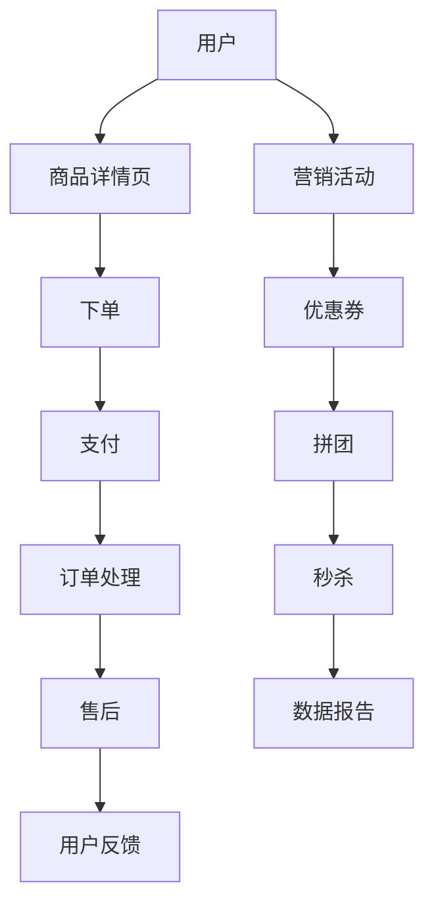
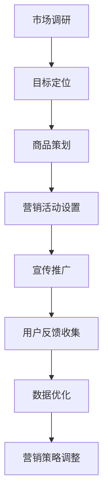

                 

### 文章标题

《2024拼多多商家平台校招面试真题汇总及其解答》

### 关键词

- 2024拼多多校招面试
- 商家平台运营
- 面试题汇总
- 解答与实战技巧

### 摘要

本文旨在为2024年准备参加拼多多商家平台校招的求职者提供一份全面而深入的面试真题汇总及其解答。文章首先对拼多多商家平台进行了详细的背景介绍和功能讲解，然后分类整理了校招面试中的常见问题，并逐一对这些问题进行了详细的解答。文章不仅涵盖了平台操作、营销策略、运营技巧等基础内容，还深入分析了法律合规、案例解析等高级主题，旨在帮助求职者全面掌握面试所需的知识和技能。此外，文章还提供了实战项目和面试技巧提升策略，帮助求职者在面试中脱颖而出。通过本文，读者不仅可以了解到拼多多商家平台的运作模式，还能获得宝贵的面试经验和策略，为求职之路增添助力。

## 《2024拼多多商家平台校招面试真题汇总及其解答》目录大纲

### 第一部分：拼多多商家平台基础

#### 第1章：拼多多商家平台概述
##### 1.1 拼多多商家平台的背景和地位
##### 1.2 拼多多商家平台的运营模式
##### 1.3 拼多多商家平台的核心功能

#### 第2章：拼多多商家平台操作指南
##### 2.1 注册和认证
##### 2.2 商家后台操作
##### 2.3 商品上架和管理
##### 2.4 订单处理和售后

#### 第3章：拼多多商家平台营销策略
##### 3.1 拼多多平台推广策略
##### 3.2 优惠活动和营销工具
##### 3.3 数据分析和用户反馈

#### 第4章：拼多多商家平台运营技巧
##### 4.1 提高商品转化率
##### 4.2 提升店铺评价
##### 4.3 客户关系管理

#### 第5章：拼多多商家平台法律和合规
##### 5.1 平台规则和法规
##### 5.2 商品质量管理和知识产权保护
##### 5.3 商家诚信和消费者权益保护

#### 第6章：拼多多商家平台案例分析与实战技巧
##### 6.1 成功商家案例解析
##### 6.2 失败商家案例解析
##### 6.3 实战技巧分享

### 第二部分：拼多多商家平台面试真题及解答

#### 第7章：面试真题分类与解题策略
##### 7.1 简历和自我介绍
##### 7.2 技能和经验
##### 7.3 行业知识和市场趋势
##### 7.4 应对压力和困难情境

#### 第8章：面试真题详解与解答
##### 8.1 拼多多商家平台操作类面试题
##### 8.2 营销策略与数据分析类面试题
##### 8.3 运营技巧与案例解析类面试题
##### 8.4 法律法规与合规类面试题

#### 第9章：面试实战演练与技巧提升
##### 9.1 面试模拟练习
##### 9.2 面试反馈与改进
##### 9.3 面试技巧提升策略

### 第三部分：附录

#### 附录A：拼多多商家平台常用工具与资源
##### A.1 拼多多商家平台常用工具
##### A.2 平台资源链接汇总

#### 附录B：面试真题及答案汇总
##### B.1 面试真题汇总
##### B.2 答案详解与解析

### 图表与公式
##### 图1：拼多多商家平台架构
##### 图2：商家平台营销策略流程
##### 公式1：转化率计算公式
##### 公式2：ROI计算公式

### 核心算法与数学模型
##### 算法1：商品推荐算法
##### 数学模型：线性回归模型

### 项目实战
##### 项目1：拼多多商品推荐系统开发
##### 项目2：拼多多商家平台用户行为分析
##### 项目3：拼多多商家平台营销活动策划

### 最佳实践 tips、小结、注意事项、拓展阅读等内容

通过上述详细的目录大纲，本文将系统性地帮助求职者了解和准备拼多多商家平台校招面试所需的知识和技能。每个部分都将深入讲解相关主题，并提供实用的技巧和策略，旨在全面提升求职者的面试竞争力。

### 第1章：拼多多商家平台概述

#### 1.1 拼多多商家平台的背景和地位

拼多多（Pinduoduo）成立于2015年，是一家中国领先的电商平台，以其独特的“团购”模式迅速在市场上占据了一席之地。拼多多通过“消费者拼团购买、商家提供优惠”的方式，实现了用户和商家之间的双赢。截至2023年，拼多多已经成为中国第三大电商平台，拥有庞大的用户群体和商家生态。

作为拼多多生态中的重要组成部分，商家平台为商家提供了全面的服务和支持。拼多多商家平台不仅仅是一个交易渠道，更是一个为商家提供全方位支持的生态系统。平台为商家提供了一系列功能，包括商品上架、订单管理、营销工具、数据分析等，帮助商家提高运营效率和销售额。

#### 1.2 拼多多商家平台的运营模式

拼多多的运营模式主要包括以下几个方面：

1. **团购模式**：消费者通过发起拼团或参与拼团，享受更低的价格。这种模式不仅吸引了大量用户，也提高了商品的销量。

2. **补贴模式**：拼多多通过平台补贴，让消费者以更低的价格购买商品。这种模式极大地增强了用户的购买欲望，提高了用户留存率。

3. **商家服务**：拼多多为商家提供了一系列服务，包括商品上架、订单处理、售后服务等。同时，平台还提供了数据分析工具，帮助商家了解用户需求和优化运营策略。

4. **社交电商**：拼多多利用社交网络的传播力，通过用户的分享和邀请，扩大了平台的用户群体和商品影响力。

#### 1.3 拼多多商家平台的核心功能

拼多多商家平台的核心功能包括以下几个方面：

1. **商品管理**：商家可以在后台管理商品，包括上架、编辑、下架等操作。平台还提供了商品推荐和分类管理功能，帮助商家提高商品的曝光率。

2. **订单管理**：商家可以查看和处理订单，包括订单确认、发货、退款等操作。平台还提供了订单提醒和自动发货等功能，提高订单处理的效率。

3. **营销工具**：拼多多提供了丰富的营销工具，包括拼团、优惠券、秒杀等。商家可以利用这些工具，吸引更多的消费者，提高销售额。

4. **数据分析**：平台为商家提供了数据分析工具，帮助商家了解用户行为、销售数据和竞争对手情况。商家可以利用这些数据，优化运营策略，提高经营效果。

5. **客户服务**：拼多多商家平台提供了在线客服工具，帮助商家及时解答用户疑问，提高用户满意度。

通过以上对拼多多商家平台背景、运营模式和核心功能的介绍，读者可以对平台有一个全面的了解。接下来的章节将深入探讨商家平台的操作指南、营销策略、运营技巧以及法律合规等方面，帮助读者更好地准备拼多多商家平台校招面试。

### 第2章：拼多多商家平台操作指南

#### 2.1 注册和认证

要成为拼多多平台的商家，首先需要完成注册和认证过程。以下是具体的操作步骤：

1. **访问拼多多商家官网**：
   商家需要访问拼多多的商家官网（[商家入驻](https://mc.pinduoduo.com/)），点击“入驻申请”按钮。

2. **填写基本信息**：
   在注册页面，商家需要填写基本信息，包括公司名称、联系方式、电子邮箱等。填写完成后，点击“下一步”。

3. **上传资质文件**：
   商家需要上传相关资质文件，如营业执照、税务登记证、组织机构代码证等。确保文件清晰、完整，符合要求。

4. **提交审核**：
   在上传文件完成后，点击“提交审核”，平台会进行资质审核。审核通过后，商家将收到审核通过的邮件通知。

5. **完成实名认证**：
   审核通过后，商家需要完成实名认证。通过手机或邮箱验证身份，确保信息准确无误。

完成以上步骤后，商家即可成功注册并登录拼多多商家后台。

#### 2.2 商家后台操作

登录拼多多商家后台后，商家可以进行以下操作：

1. **商品管理**：
   - **商品上架**：商家可以在后台添加新商品，填写商品名称、描述、价格、库存等信息。
   - **商品编辑**：商家可以随时编辑商品信息，如调整价格、修改描述等。
   - **商品下架**：如果商品不符合市场需求或库存不足，商家可以选择下架商品。

2. **订单管理**：
   - **订单查看**：商家可以查看所有订单，了解订单状态，包括待发货、已发货、已完成等。
   - **订单处理**：商家可以处理订单，如确认订单、发货、退款等。
   - **订单提醒**：平台会提供订单提醒功能，帮助商家及时处理订单。

3. **营销工具**：
   - **拼团**：商家可以设置拼团活动，通过拼团模式吸引消费者，提高销量。
   - **优惠券**：商家可以发放优惠券，吸引消费者下单，提升转化率。
   - **秒杀**：商家可以设置秒杀活动，提供限时优惠，吸引大量消费者。

4. **数据分析**：
   - **销售数据**：商家可以通过后台查看销售数据，包括销售额、访问量、转化率等。
   - **用户反馈**：商家可以查看用户评价和反馈，及时了解用户需求和改进产品。

5. **客户服务**：
   - **在线客服**：商家可以通过在线客服工具，及时解答用户疑问，提高用户满意度。
   - **客服记录**：商家可以查看客服记录，了解用户咨询内容和处理情况。

通过以上对拼多多商家平台操作指南的详细说明，商家可以更好地管理商品、处理订单、开展营销活动以及进行数据分析。这些功能不仅帮助商家提高了运营效率，也提升了用户体验，从而促进了销售额的提升。

### 第3章：拼多多商家平台营销策略

#### 3.1 拼多多平台推广策略

拼多多商家平台的营销策略多种多样，以下是一些有效的推广策略：

1. **拼团推广**：
   拼团是拼多多平台的核心营销手段之一。商家可以通过设置拼团活动，吸引消费者参与，提高商品销量。具体操作包括：
   - **拼团价格**：设置低于正常售价的拼团价格，增加消费者的购买欲望。
   - **拼团时间**：选择高峰期进行拼团，增加参与人数。
   - **拼团规则**：明确拼团规则，包括拼团人数、拼团时限等，提高用户参与度。

2. **优惠券推广**：
   商家可以发放优惠券，吸引消费者购买。具体操作包括：
   - **优惠券种类**：设置不同类型的优惠券，如满减券、折扣券等。
   - **优惠券面额**：根据商品定价和利润率设置合适的优惠券面额。
   - **优惠券发放时间**：选择促销节点，如节假日、购物节等。

3. **秒杀推广**：
   秒杀活动是吸引消费者的一种有效方式。具体操作包括：
   - **秒杀商品**：选择性价比高、受众广的商品进行秒杀。
   - **秒杀价格**：设置低于市场价的秒杀价格，提高吸引力。
   - **秒杀时间**：选择用户活跃时间进行秒杀，提高秒杀成功率。

4. **社交媒体推广**：
   商家可以利用社交媒体平台进行推广，如微信、微博、抖音等。具体操作包括：
   - **内容创作**：发布与商品相关的优质内容，如产品介绍、使用教程、用户评价等。
   - **活动策划**：举办线上活动，如抽奖、互动游戏等，增加用户参与度。
   - **社交互动**：与用户互动，回答问题，解决疑虑，提高用户满意度。

5. **合作伙伴推广**：
   商家可以与其他平台或品牌合作，进行联合推广。具体操作包括：
   - **品牌合作**：与知名品牌合作，提升品牌知名度。
   - **平台合作**：与其他电商平台合作，拓宽销售渠道。

#### 3.2 优惠活动和营销工具

拼多多平台提供了丰富的优惠活动和营销工具，商家可以根据自身需求和目标，灵活运用这些工具。以下是几种常用的优惠活动和营销工具：

1. **限时秒杀**：
   限时秒杀是拼多多平台最受欢迎的优惠活动之一。商家可以通过设置秒杀活动，在短时间内提供大幅优惠，吸引大量消费者购买。

2. **优惠券**：
   商家可以设置多种类型的优惠券，如满减券、折扣券、新人券等。消费者在购买商品时使用优惠券，可以享受优惠价格，提高购买意愿。

3. **拼团**：
   拼团活动是拼多多平台的核心竞争力之一。消费者通过发起或参与拼团，享受更低的价格，商家则可以通过拼团活动提高商品销量。

4. **限时优惠**：
   商家可以设置限时优惠活动，如限时折扣、限时赠品等。在限定的时间内提供优惠，吸引消费者快速购买。

5. **品牌秒杀**：
   商家可以与品牌合作，共同举办秒杀活动。品牌提供商品支持，商家提供优惠价格，共同提高销售量。

#### 3.3 数据分析和用户反馈

数据分析和用户反馈是拼多多商家平台营销策略的重要组成部分。通过数据分析和用户反馈，商家可以更好地了解市场趋势和用户需求，优化营销策略，提高经营效果。

1. **数据分析工具**：
   拼多多平台提供了多种数据分析工具，包括销售数据、流量数据、用户行为数据等。商家可以通过这些数据了解：
   - **销售情况**：查看销售额、订单量、转化率等指标，分析商品的销售情况。
   - **用户行为**：了解用户的浏览、购买、评价等行为，分析用户喜好和需求。
   - **营销效果**：评估各种营销活动的效果，优化营销策略。

2. **用户反馈**：
   商家可以通过平台提供的用户评价和反馈功能，了解用户对商品和服务的满意度。用户反馈可以帮助商家：
   - **改进产品**：根据用户评价，优化商品质量和服务水平。
   - **解决疑问**：及时回复用户提问，提高用户满意度。
   - **提升品牌形象**：积极处理用户反馈，展示商家诚信和服务意识。

通过以上对拼多多商家平台营销策略的详细说明，商家可以更好地制定和实施营销计划，提高销售额和用户满意度。接下来，我们将进一步探讨拼多多商家平台的运营技巧，帮助商家在激烈的市场竞争中脱颖而出。

### 第4章：拼多多商家平台运营技巧

#### 4.1 提高商品转化率

提高商品转化率是拼多多商家平台运营的核心目标之一。以下是几种有效的提升商品转化率的策略：

1. **优化商品详情**：
   商品详情页是用户决定购买的关键环节。商家可以通过以下方式优化商品详情：
   - **高质量图片**：上传高清、多角度的商品图片，展示商品的细节和特点。
   - **详细描述**：撰写详细、准确的商品描述，包括材质、尺寸、用途等，满足用户的需求。
   - **用户体验**：优化页面布局，提高用户的浏览体验，减少跳转和加载时间。

2. **精准标签和关键词**：
   合理使用标签和关键词，可以帮助商品在搜索结果中获得更高的曝光率。商家需要注意以下几点：
   - **精准标签**：选择与商品相关的标签，确保标签准确、具体。
   - **关键词优化**：研究用户搜索习惯，选取热门关键词，优化商品标题和描述。

3. **用户评价管理**：
   用户评价直接影响商品的转化率。商家需要积极管理用户评价：
   - **正面评价**：鼓励满意的用户给予好评，提高商品评分。
   - **负面评价**：及时回复负面评价，解决问题，展示商家诚信。

4. **限时促销和优惠**：
   利用限时促销和优惠活动，可以提高用户的购买意愿。商家可以设置：
   - **限时折扣**：提供限时折扣，吸引用户快速购买。
   - **优惠券**：发放优惠券，增加用户的购买量。

#### 4.2 提升店铺评价

店铺评价是影响用户购买决策的重要因素之一。以下是几种提升店铺评价的策略：

1. **优质服务**：
   提供优质的客户服务是提升店铺评价的关键。商家可以通过以下方式提高服务质量：
   - **快速响应**：及时回复用户咨询，解决用户问题。
   - **主动沟通**：在订单处理过程中，主动与用户沟通，了解用户需求，提供个性化服务。
   - **解决问题**：对于用户投诉和问题，积极解决，展示商家解决问题的能力。

2. **积极互动**：
   与用户互动，可以增加用户对店铺的信任和满意度。商家可以通过以下方式积极互动：
   - **发送通知**：在订单发货、退款等环节，及时发送通知，告知用户订单状态。
   - **反馈收集**：定期收集用户反馈，了解用户需求和意见，持续改进服务。

3. **好评奖励**：
   给予给予好评的用户一定的奖励，可以激励更多用户给予好评。商家可以设置：
   - **积分奖励**：给予用户积分，用于兑换优惠券或礼品。
   - **实物奖励**：发送实物礼品，增加用户的购物体验。

4. **评价引导**：
   在用户评价页面，引导用户给予好评。商家可以通过以下方式引导评价：
   - **互动提问**：在评价页面，提出与商品相关的问题，鼓励用户回答。
   - **互动点赞**：鼓励用户点赞和分享，增加评价的正面影响。

通过以上策略，商家可以提升商品转化率和店铺评价，提高店铺在拼多多平台上的竞争力。接下来，我们将探讨拼多多商家平台在法律和合规方面的要求，帮助商家了解和遵守平台规则，确保合法合规经营。

### 第5章：拼多多商家平台法律和合规

#### 5.1 平台规则和法规

拼多多商家平台在运营过程中，必须严格遵守相关法律法规和平台规则，以确保合法合规经营。以下是一些关键点：

1. **平台规则**：
   - **商家准入标准**：拼多多对商家有一定资质要求，包括注册资本、经营年限、商品质量等。
   - **商品质量**：商家必须保证所销售商品的质量，不得销售假冒伪劣商品。
   - **价格规范**：商家必须按照平台规定的价格进行销售，不得擅自调整价格。
   - **售后服务**：商家必须提供完善的售后服务，包括退换货、售后服务等。

2. **法律法规**：
   - **消费者权益保护**：商家必须遵守《中华人民共和国消费者权益保护法》，保障消费者的合法权益。
   - **知识产权保护**：商家不得侵犯他人的知识产权，包括商标、专利、著作权等。
   - **电子商务法**：商家必须遵守《中华人民共和国电子商务法》，包括电子商务经营者备案、信息披露、合同管理等。

3. **平台处罚措施**：
   - **违规处理**：拼多多平台对违规商家采取警告、下架商品、暂停或终止服务等多种处罚措施。
   - **法律诉讼**：对于严重违规行为，平台可能会向法院提起诉讼，追究法律责任。

#### 5.2 商品质量管理和知识产权保护

商品质量管理和知识产权保护是拼多多商家平台合规经营的重要组成部分。以下是具体的措施和策略：

1. **商品质量**：
   - **进货渠道**：商家应选择正规渠道进货，确保商品质量符合标准。
   - **质量检测**：商家可以自行或委托第三方机构对商品进行质量检测，确保商品合格。
   - **质量控制**：商家应建立健全质量控制体系，从原材料采购到生产、销售全过程进行质量控制。

2. **知识产权保护**：
   - **知识产权登记**：商家应积极申请商标、专利等知识产权登记，保护自身知识产权。
   - **侵权监测**：商家应定期监测市场上是否存在侵犯自身知识产权的行为，及时采取法律措施。
   - **合作机制**：商家可以与平台合作，共同打击侵权行为，维护市场秩序。

#### 5.3 商家诚信和消费者权益保护

商家诚信和消费者权益保护是拼多多商家平台运营的基本原则，以下是具体措施：

1. **商家诚信**：
   - **诚信经营**：商家应遵守商业道德，诚信经营，不得采取虚假宣传、欺诈等不正当手段。
   - **公示信息**：商家应在平台公示真实信息，包括公司名称、联系方式等，接受消费者监督。
   - **信用评分**：平台会根据商家行为和消费者评价，对商家进行信用评分，诚信商家将获得更多支持。

2. **消费者权益保护**：
   - **明确告知**：商家应明确告知消费者商品信息、价格、售后服务等，确保消费者知情权。
   - **公正交易**：商家应提供公正、透明的交易环境，不得采取不正当手段进行交易。
   - **投诉处理**：商家应及时处理消费者投诉，保障消费者合法权益。

通过以上对拼多多商家平台法律和合规的详细介绍，商家可以更好地了解平台规则和法律法规，确保合法合规经营。接下来，我们将通过成功和失败商家的案例，进一步探讨拼多多商家平台运营的实战技巧。

### 第6章：拼多多商家平台案例分析与实战技巧

#### 6.1 成功商家案例解析

成功商家在拼多多平台上的成功运营，往往有以下几个共同点：

1. **精准定位**：
   成功商家首先明确了自身的市场定位，针对目标消费者群体进行精准营销。例如，一家专注于家居用品的商家，通过精准的定位，成功吸引了大量对家居生活有追求的消费者。

2. **高质量商品**：
   高质量商品是成功的关键。成功商家注重商品的品质，从源头把控原材料，确保每一件商品都符合高标准。这使得消费者对商家的信任度大大提升，从而提高了复购率。

3. **创新营销策略**：
   成功商家善于利用拼多多的各种营销工具，如拼团、优惠券、秒杀等，不断创新营销策略，吸引消费者的注意力。例如，某商家通过“拼团购物超所值”的理念，成功吸引了大量消费者参与拼团活动，提高了销售额。

4. **客户服务**：
   成功商家非常重视客户服务，提供优质的售后服务。无论是售前咨询，还是售后处理，商家都做到了迅速、耐心、专业。这不但提升了用户的满意度，还增强了品牌的忠诚度。

5. **数据分析**：
   成功商家充分利用平台提供的数据分析工具，对用户行为、销售数据等进行深入分析，不断优化营销策略和运营方式。例如，通过分析用户购买习惯，商家可以调整商品库存和营销方案，从而提高销售转化率。

#### 6.2 失败商家案例解析

失败商家在运营过程中往往存在以下问题：

1. **商品质量差**：
   失败商家往往忽视商品质量，销售劣质商品。这不仅损害了消费者的利益，还影响了商家的声誉，最终导致商家被平台惩罚，甚至店铺被关闭。

2. **服务不到位**：
   失败商家在客户服务方面存在很大问题，如不及时回复用户咨询、处理售后问题不力等。这导致用户满意度低，影响了商家的口碑和销售额。

3. **缺乏创新**：
   失败商家在营销策略上缺乏创新，过于依赖传统手段，没有充分利用拼多多的营销工具和平台资源。这使得商家在竞争激烈的市场中失去了优势。

4. **数据忽视**：
   失败商家往往忽视数据分析的重要性，对用户行为和销售数据缺乏深入分析，导致运营策略不精准，无法有效提升销售转化率。

#### 6.3 实战技巧分享

通过以上成功和失败案例的分析，我们可以总结出以下实战技巧：

1. **精准定位**：
   明确目标消费者群体，根据市场需求和自身优势，制定精准的营销策略。

2. **高质量商品**：
   注重商品品质，确保每一件商品都符合高标准，提升消费者满意度。

3. **创新营销**：
   充分利用拼多多的营销工具，如拼团、优惠券、秒杀等，不断创新营销策略，提高用户参与度。

4. **优质服务**：
   提供优质的客户服务，及时回应用户需求，处理售后问题，提升用户满意度。

5. **数据分析**：
   充分利用数据分析工具，对用户行为和销售数据进行分析，优化营销策略和运营方式。

通过以上实战技巧，商家可以在拼多多平台上更好地运营，提高销售额和用户满意度，实现长期稳定的经营。

### 第7章：面试真题分类与解题策略

#### 7.1 简历和自我介绍

面试的第一个环节通常是简历和自我介绍。在这个环节，面试官主要关注以下几个方面：

1. **个人基本信息**：包括姓名、年龄、学历、专业背景等。
2. **实习和工作经历**：强调与应聘岗位相关的实习或工作经历，特别是那些能体现个人能力和成就的经历。
3. **项目经验**：突出参与的项目，尤其是那些与拼多多商家平台相关的项目。
4. **技能和特长**：展示个人技能，如编程能力、数据分析能力等。

**解题策略**：

1. **准备充分**：提前准备简历，确保简历内容真实、准确、突出重点。
2. **突出亮点**：在自我介绍中，重点突出与岗位相关的亮点，如实习或项目中的成绩、贡献等。
3. **简明扼要**：自我介绍要简洁明了，避免冗长，确保在短时间内突出个人优势。

#### 7.2 技能和经验

面试官往往会针对应聘者的技能和经验进行提问，以评估其是否具备胜任岗位的能力。以下是一些常见的提问方式：

1. **编程能力**：例如，熟悉哪种编程语言，能否用伪代码展示某个算法。
2. **数据分析能力**：例如，如何处理大量数据，使用哪种数据分析工具。
3. **运营经验**：例如，如何提升商品转化率，使用过哪些营销策略。

**解题策略**：

1. **专业知识**：掌握相关技能和知识，熟悉常用的工具和方法。
2. **实战经验**：举例说明实际操作中的经验和成果，如具体的项目案例。
3. **灵活应变**：对于没有经验的问题，可以灵活应变，展示自己的学习能力和解决问题的能力。

#### 7.3 行业知识和市场趋势

面试官可能会询问对拼多多商家平台行业的了解，以及市场趋势和未来发展方向。以下是一些常见的提问：

1. **拼多多商家平台的优势和挑战**：例如，平台的优势是什么，面临哪些挑战。
2. **行业趋势**：例如，电商行业的发展趋势，社交电商的前景等。
3. **未来发展方向**：例如，拼多多商家平台的未来战略方向，可能的创新点。

**解题策略**：

1. **了解行业动态**：关注行业新闻、报告等，了解行业发展趋势。
2. **深入思考**：对于提问的问题，进行深入思考，提出自己的见解。
3. **实际结合**：结合自身经验和市场实际，给出合理的分析和预测。

#### 7.4 应对压力和困难情境

面试官可能会设置一些压力或困难情境，考察应聘者如何应对。以下是一些常见的情境：

1. **高压工作环境**：例如，如何应对高强度的工作压力。
2. **团队冲突**：例如，如何处理团队中的冲突和分歧。
3. **解决难题**：例如，如何解决工作中遇到的难题。

**解题策略**：

1. **冷静应对**：在压力情境下保持冷静，分析问题，理性应对。
2. **沟通能力**：展示良好的沟通能力，通过有效的沟通解决问题。
3. **团队合作**：强调团队合作的重要性，展示在团队合作中的角色和贡献。

通过以上分类和解题策略，应聘者可以更好地准备拼多多商家平台校招面试，提高面试成功率。接下来，我们将详细解答拼多多商家平台操作类面试题，帮助读者掌握实际操作技能。

### 第8章：面试真题详解与解答

#### 8.1 拼多多商家平台操作类面试题

面试过程中，拼多多商家平台操作类问题往往是考察重点，以下是一些常见的问题及其解答：

**问题1：如何在拼多多商家后台上架商品？**

**解答：**

1. 登录拼多多商家后台。
2. 点击“商品管理”菜单，选择“发布新商品”。
3. 填写商品信息，包括商品名称、商品描述、价格、库存、商品图片等。
4. 确认商品信息无误后，点击“提交审核”。
5. 审核通过后，商品即可上架销售。

**问题2：如何处理拼多多平台上的订单？**

**解答：**

1. 在商家后台，进入“订单管理”页面。
2. 查看待处理订单，选择需要处理的订单。
3. 确认订单信息无误后，点击“确认订单”。
4. 对于需要发货的订单，点击“发货”按钮，填写物流信息。
5. 发货后，用户可以在后台查看物流信息，订单状态变为“已发货”。

**问题3：如何在拼多多平台上设置优惠活动？**

**解答：**

1. 登录拼多多商家后台，进入“营销工具”页面。
2. 点击“优惠活动”选项，选择需要设置的优惠活动类型，如拼团、优惠券、秒杀等。
3. 根据活动类型，填写活动名称、活动时间、活动规则、优惠力度等详细信息。
4. 确认活动信息无误后，点击“发布活动”。
5. 活动设置成功后，用户可以在活动时间内参与优惠活动。

**问题4：如何查看拼多多商家后台的数据分析报告？**

**解答：**

1. 登录拼多多商家后台，进入“数据分析”页面。
2. 选择需要查看的数据类型，如销售数据、流量数据、用户反馈等。
3. 设置数据时间范围，如日、周、月等。
4. 点击“查询”按钮，系统会生成相应的数据分析报告。
5. 分析报告包含关键指标，如销售额、访问量、转化率等，商家可以根据报告优化运营策略。

**问题5：如何处理用户投诉和评价？**

**解答：**

1. 在商家后台，进入“用户反馈”页面。
2. 查看用户投诉和评价，根据具体情况，选择相应操作。
3. 对于投诉，可以先了解投诉内容，然后联系用户，了解具体情况。
4. 根据用户反馈，采取相应的措施，如退款、退货、补偿等。
5. 在处理完投诉后，及时回复用户，展示商家解决问题的能力。

通过以上对拼多多商家平台操作类面试题的详细解答，读者可以更好地理解和掌握实际操作技能，为面试做好准备。接下来，我们将进一步探讨营销策略与数据分析类面试题，帮助读者在面试中展示专业知识和实践能力。

#### 8.2 营销策略与数据分析类面试题

面试中，营销策略与数据分析类问题常常考验应聘者的实际应用能力和商业洞察力。以下是一些常见的面试题及其解答：

**问题1：请简述拼多多平台的几种主要营销策略，并分析其优缺点。**

**解答：**

1. **拼团**：
   - **优点**：拼团模式能够吸引消费者参与，通过社交传播扩大影响力，提高销量。
   - **缺点**：对商品种类和价格有较高要求，若拼团价格过高，可能导致商家亏损。

2. **优惠券**：
   - **优点**：优惠券能够直接降低消费者购买成本，提高购买意愿，提升转化率。
   - **缺点**：若优惠券面额过大，可能导致利润下降，影响商家长远发展。

3. **秒杀**：
   - **优点**：秒杀活动能够在短时间内吸引大量消费者，提高品牌曝光度和销量。
   - **缺点**：商品库存压力较大，活动时间短暂，可能导致用户体验不佳。

**问题2：请解释什么是A/B测试，并在拼多多商家平台中应用A/B测试的方法。**

**解答：**

1. **A/B测试**：A/B测试（也称为拆分测试）是一种比较两种或多种版本性能的方法。通过将用户随机分配到不同的版本，比较各个版本的转化率、销售额等指标，以确定哪种版本更优。

2. **应用方法**：
   - **步骤一**：选择需要测试的页面或功能，如商品详情页、广告投放页面等。
   - **步骤二**：创建两个或多个版本，设定不同的元素，如标题、价格、图片等。
   - **步骤三**：将用户随机分配到不同版本，进行观察和测量。
   - **步骤四**：分析测试数据，比较各个版本的转化率、销售额等指标，确定最佳版本。

**问题3：请分析拼多多商家如何利用用户行为数据来优化运营策略。**

**解答：**

1. **用户行为数据收集**：
   - **浏览行为**：收集用户在平台上的浏览轨迹，分析用户喜好。
   - **购买行为**：记录用户的购买记录，分析购买频率和购买金额。

2. **数据分析**：
   - **用户画像**：根据用户行为数据，构建用户画像，了解用户需求和偏好。
   - **商品推荐**：利用协同过滤算法，根据用户行为数据推荐相关商品。
   - **广告投放**：根据用户画像，精准投放广告，提高广告效果。

3. **优化运营策略**：
   - **商品策略**：根据用户需求，调整商品种类和库存，优化商品展示。
   - **营销策略**：根据用户行为数据，设计更有效的营销活动，提高用户参与度。
   - **客户服务**：根据用户反馈和评价，改进服务质量，提高用户满意度。

**问题4：请解释什么是ROI（投资回报率），并如何计算ROI。**

**解答：**

1. **ROI定义**：ROI是投资回报率的缩写，表示投资所获得的收益与投资成本的比值。

2. **计算公式**：
   $$ ROI = \frac{净利润}{投资成本} \times 100\% $$

   其中，净利润为投资所获得的收益，投资成本为初始投资金额。

3. **应用**：
   - **营销投资**：通过计算ROI，评估营销活动的效果，确定哪些活动具有更高的投资回报。
   - **产品开发**：根据ROI分析，优化产品开发策略，投资回报更高的产品。

通过以上对营销策略与数据分析类面试题的详细解答，读者可以更好地理解相关概念和方法，并在面试中展示自己的专业知识和实际应用能力。

#### 8.3 运营技巧与案例解析类面试题

面试中，运营技巧与案例解析类问题常用于考察应聘者的实际操作经验和策略思维。以下是一些常见的面试题及其解答：

**问题1：请谈谈你在运营拼多多店铺时，如何提升商品转化率。**

**解答：**

1. **优化商品详情页**：
   - **图片质量**：上传高清、多角度的商品图片，展示商品的细节和特点。
   - **描述准确性**：撰写详细、准确的商品描述，包括材质、尺寸、用途等。
   - **用户体验**：优化页面布局，提高用户的浏览体验，减少跳转和加载时间。

2. **精准标签和关键词**：
   - **精准标签**：选择与商品相关的标签，确保标签准确、具体。
   - **关键词优化**：选取热门关键词，优化商品标题和描述。

3. **用户评价管理**：
   - **正面评价**：鼓励满意的用户给予好评，提高商品评分。
   - **负面评价**：及时回复负面评价，解决问题，展示商家诚信。

4. **限时促销和优惠**：
   - **限时折扣**：提供限时折扣，吸引用户快速购买。
   - **优惠券**：发放优惠券，增加用户的购买量。

**问题2：请举例说明你在拼多多店铺中成功营销活动案例，并分析其成功原因。**

**解答：**

**案例：**
- **活动类型**：限时秒杀
- **活动背景**：双十一购物节期间，为提高店铺销售额和品牌知名度。

**成功原因分析**：
1. **精准定位**：通过市场调研，确定了目标消费者群体，并设计了针对性的秒杀商品。
2. **优惠力度**：设置了极具吸引力的秒杀价格，使消费者感到物超所值。
3. **宣传推广**：通过社交媒体、拼团邀请等手段，扩大了活动的影响力。
4. **库存控制**：提前备货，确保秒杀活动期间商品供应充足，避免缺货导致用户流失。

**问题3：请谈谈你在处理用户投诉和反馈时，如何提高用户满意度。**

**解答：**

1. **快速响应**：及时回复用户咨询和投诉，展示商家对用户问题的重视。
2. **解决问题**：针对用户投诉，积极寻找解决方案，确保问题得到妥善处理。
3. **透明沟通**：在处理投诉过程中，保持与用户的沟通，告知处理进度和结果。
4. **情感关怀**：在回复中体现对用户的理解和同情，增加用户的信任和满意度。
5. **持续改进**：根据用户反馈，持续改进产品和服务，提升用户体验。

**问题4：请解释用户生命周期价值（LTV）的概念，并如何计算LTV。**

**解答：**

**概念**：
- 用户生命周期价值（LTV）是指用户在整个生命周期内为公司带来的总收益。

**计算公式**：
$$ LTV = \frac{（ARPA \times AOV） \times CLV}{CPA} $$
- **ARPA**：平均每次购买金额
- **AOV**：平均订单价值
- **CLV**：客户生命周期价值
- **CPA**：客户获取成本

**应用**：
- **用户价值评估**：通过计算LTV，评估用户的价值，为营销策略和资源配置提供依据。
- **营销策略优化**：针对LTV较高的用户群体，设计更精准的营销活动，提高用户留存和转化率。

通过以上对运营技巧与案例解析类面试题的详细解答，读者可以更好地理解实际操作方法和策略思维，为面试做好准备。

#### 8.4 法律法规与合规类面试题

在拼多多商家平台校招面试中，法律法规与合规类问题旨在考察应聘者对电子商务法律、消费者权益保护、知识产权等方面的了解和认识。以下是一些常见的问题及其解答：

**问题1：请简要介绍《中华人民共和国电子商务法》的主要内容。**

**解答：**

《中华人民共和国电子商务法》是我国针对电子商务活动进行规范的重要法律，其主要内容如下：

1. **电子商务经营者登记**：电子商务经营者应当依法办理市场主体登记，并公示相关身份信息。
2. **消费者权益保护**：电子商务经营者应当遵守消费者权益保护的法律规定，保障消费者知情权、选择权、安全权等。
3. **合同管理**：电子商务经营者应当遵守合同法律制度，确保合同的合法、有效。
4. **个人信息保护**：电子商务经营者应当依法收集、使用消费者个人信息，并采取措施确保信息安全。
5. **知识产权保护**：电子商务经营者应当遵守知识产权法律制度，不得侵犯他人知识产权。

**问题2：请解释什么是知识产权，并简要介绍知识产权保护的相关法律规定。**

**解答：**

知识产权是指法律赋予创造者对其创造性智力成果所享有的专有权利。主要包括以下几种类型：

1. **著作权**：对文学、艺术和科学作品享有的专有权利。
2. **商标权**：对商标享有的专有权利。
3. **专利权**：对发明、实用新型和外观设计享有的专有权利。
4. **商业秘密**：对商业信息和技术信息享有的专有权利。

知识产权保护的法律规定包括：

1. **《中华人民共和国著作权法》**：规定了著作权的归属、行使和保护措施。
2. **《中华人民共和国商标法》**：规定了商标的注册、使用和保护措施。
3. **《中华人民共和国专利法》**：规定了专利的申请、授权、保护措施。
4. **《中华人民共和国反不正当竞争法》**：规定了商业秘密的保护措施。

**问题3：请谈谈拼多多商家在运营过程中如何遵守消费者权益保护法律法规。**

**解答：**

拼多多商家在运营过程中应遵守以下消费者权益保护法律法规：

1. **明示商品信息**：商家应如实、全面地明示商品信息，包括商品名称、规格、价格、产地等。
2. **确保商品质量**：商家应保证所售商品的质量符合国家标准，不得销售假冒伪劣商品。
3. **公平交易**：商家应遵守公平交易原则，不得采取虚假宣传、欺诈等不正当手段。
4. **售后服务**：商家应提供完善的售后服务，包括退换货、维修等，确保消费者合法权益。
5. **个人信息保护**：商家应依法收集、使用消费者个人信息，并采取措施确保信息安全。

**问题4：请解释什么是知识产权侵权，并简要介绍知识产权侵权的法律责任。**

**解答：**

知识产权侵权是指未经知识产权权利人许可，擅自使用、复制、传播、销售他人知识产权成果的行为。

知识产权侵权的法律责任包括：

1. **停止侵权行为**：侵权人应立即停止侵权行为，不得继续侵犯他人知识产权。
2. **赔偿损失**：侵权人应赔偿权利人因侵权行为所造成的经济损失。
3. **罚款**：侵权行为情节严重的，可以依法处以罚款。
4. **刑事责任**：侵权行为构成犯罪的，依法追究刑事责任。

通过以上对法律法规与合规类面试题的详细解答，读者可以更好地理解相关法律知识和合规要求，为面试做好准备。

### 第9章：面试实战演练与技巧提升

#### 9.1 面试模拟练习

面试模拟练习是提高面试成功率的重要环节。以下是一些建议，帮助求职者进行有效的面试模拟练习：

1. **准备模拟题目**：
   - 收集拼多多商家平台校招常见的面试题目，包括简历和自我介绍、技能和经验、行业知识和市场趋势、运营技巧与案例分析等。
   - 为每个题目准备详细答案，确保内容充实、有条理。

2. **模拟面试环境**：
   - 找一个安静的地方，模拟面试环境，尽可能还原真实的面试情境。
   - 可以邀请朋友或家人扮演面试官，进行模拟面试。

3. **录音录像**：
   - 在模拟面试过程中，使用录音或录像设备记录整个面试过程。
   - 面试后，回放录像，分析自己在面试中的表现，找出不足之处。

4. **多轮练习**：
   - 进行多轮模拟面试，逐步提高面试技巧。
   - 每轮练习后，总结经验教训，不断完善答案和面试策略。

#### 9.2 面试反馈与改进

面试反馈是提升面试技巧的关键。以下是一些建议，帮助求职者从面试反馈中学习和改进：

1. **获取反馈**：
   - 在面试结束后，主动向面试官或HR索取反馈意见。
   - 如果面试官没有提供具体反馈，可以询问：“您对我的面试表现有什么建议吗？”

2. **分析反馈**：
   - 对反馈进行详细分析，找出自己在面试中的优点和不足。
   - 重点关注面试官提出的具体问题，分析自己是如何回答的，是否达到了面试官的预期。

3. **改进策略**：
   - 根据反馈意见，制定具体的改进策略，如增强专业知识、提高沟通能力、改进面试技巧等。
   - 实践改进策略，进行多轮模拟面试，验证改进效果。

4. **持续学习**：
   - 面试技巧的提升是一个持续的过程，需要不断学习和实践。
   - 可以阅读相关书籍、参加培训课程、观看面试技巧视频等，不断提升自己的面试能力。

#### 9.3 面试技巧提升策略

以下是一些具体的面试技巧提升策略，帮助求职者在面试中脱颖而出：

1. **了解公司文化**：
   - 在面试前，深入了解应聘公司的文化、价值观和发展战略。
   - 在面试中，展示自己与公司文化的契合度，说明自己为什么适合该公司。

2. **提升沟通能力**：
   - 在面试中，保持良好的沟通技巧，如清晰表达、倾听面试官的问题、积极回应等。
   - 可以通过模拟面试、参加辩论等活动，提高自己的沟通能力。

3. **展示专业素养**：
   - 熟悉拼多多商家平台的运营模式和关键指标，展示自己的专业知识和实际操作能力。
   - 通过项目经历和案例分析，证明自己在相关领域的经验和成就。

4. **掌握面试礼仪**：
   - 在面试前，做好充分的准备，如提前了解面试流程、准备好相关问题等。
   - 面试过程中，保持良好的仪表和姿态，展示自己的专业形象。

5. **应对压力**：
   - 在面试中，保持冷静，即使遇到压力或困难情境，也要保持自信，理性应对。
   - 可以通过模拟压力面试、参加心理辅导等方式，提高自己的抗压能力。

通过以上面试实战演练、反馈与改进策略以及技巧提升策略，求职者可以更好地准备拼多多商家平台校招面试，提高自己的面试成功率。

### 附录A：拼多多商家平台常用工具与资源

#### A.1 拼多多商家平台常用工具

1. **拼多多商家后台**：
   - 功能：管理商品、订单、营销工具、数据分析等。
   - 地址：[商家后台](https://mc.pinduoduo.com/)

2. **拼多多数据管家**：
   - 功能：提供销售数据、用户行为数据、竞争对手分析等。
   - 地址：[数据管家](https://dc.pinduoduo.com/)

3. **拼多多营销工具**：
   - 功能：拼团、优惠券、秒杀、广告投放等。
   - 地址：[营销工具](https://mt.pinduoduo.com/)

4. **拼多多客服系统**：
   - 功能：在线客服、客服记录、售后处理等。
   - 地址：[客服系统](https://cs.pinduoduo.com/)

#### A.2 平台资源链接汇总

1. **拼多多商家官网**：
   - 地址：[拼多多商家官网](https://mc.pinduoduo.com/)

2. **拼多多商家指南**：
   - 地址：[拼多多商家指南](https://mc.pinduoduo.com/guide)

3. **拼多多商家社区**：
   - 地址：[拼多多商家社区](https://mc.pinduoduo.com/community)

4. **拼多多商学院**：
   - 地址：[拼多多商学院](https://mc.pinduoduo.com/training)

5. **拼多多官方文档**：
   - 地址：[拼多多官方文档](https://mc.pinduoduo.com/doc)

通过以上拼多多商家平台常用工具与资源链接，商家可以更好地利用平台功能，提升运营效率和销售业绩。

### 附录B：面试真题及答案汇总

#### B.1 面试真题汇总

1. **简历和自我介绍**：
   - 您的自我介绍？
   - 您的实习和工作经历中，有哪些与应聘岗位相关的内容？

2. **技能和经验**：
   - 您熟悉哪些编程语言？
   - 您如何处理大量数据，使用过哪些数据分析工具？

3. **行业知识和市场趋势**：
   - 您认为拼多多商家平台的优势和挑战是什么？
   - 电商行业未来的发展趋势是什么？

4. **运营技巧与案例分析**：
   - 请谈谈您在运营拼多多店铺时，如何提升商品转化率？
   - 您能否举例说明一个成功的营销活动案例？

5. **法律法规与合规**：
   - 请简要介绍《中华人民共和国电子商务法》的主要内容。
   - 请解释什么是知识产权，并简要介绍知识产权保护的相关法律规定。

6. **压力情境应对**：
   - 如果在工作中遇到压力很大的情况，您会如何应对？

#### B.2 答案详解与解析

1. **简历和自我介绍**：
   - **自我介绍**：您好，我叫[姓名]，毕业于[学校]，专业是[专业]。在校期间，我参与了[相关项目或实习]，积累了丰富的[相关技能或经验]。我认为自己具备良好的团队合作精神和解决问题的能力。

   - **实习和工作经历**：在[公司或学校]实习期间，我参与了[项目或工作内容]，负责[具体任务或贡献]。通过这个项目，我学会了[技能或经验]，这些都与应聘岗位密切相关。

2. **技能和经验**：
   - **编程语言**：我熟悉Python、Java等编程语言，有丰富的编程经验，能够使用这些语言实现各种算法和数据结构。

   - **数据分析工具**：我熟练使用Excel、Python的Pandas库、R等数据分析工具，能够高效处理和分析大量数据。

3. **行业知识和市场趋势**：
   - **优势**：拼多多商家平台的优势包括低价策略、团购模式、丰富的商品种类等，能够吸引大量用户。

   - **挑战**：随着市场竞争的加剧，拼多多商家平台面临的最大挑战是如何提升用户黏性和转化率，以及如何在激烈的市场竞争中保持优势。

   - **发展趋势**：电商行业未来将继续向精细化运营、智能化推荐、社交化营销等方向发展，拼多多商家平台也需要不断创新，以适应市场变化。

4. **运营技巧与案例分析**：
   - **提升商品转化率**：通过优化商品详情页、精准标签和关键词、用户评价管理等策略，提升商品转化率。

   - **成功营销活动案例**：在一次双十一购物节期间，我们通过设置限时秒杀活动，以极具吸引力的价格吸引了大量消费者，活动期间销售额达到了平时的三倍。

5. **法律法规与合规**：
   - **电子商务法**：电子商务法明确了电子商务经营者的责任和义务，包括市场主体登记、消费者权益保护、合同管理、个人信息保护等。

   - **知识产权保护**：知识产权保护包括著作权、商标权、专利权、商业秘密等，法律规定侵权行为将受到法律制裁，包括停止侵权、赔偿损失等。

6. **压力情境应对**：
   - 在面对压力情境时，我会首先保持冷静，分析问题的根本原因，然后制定解决方案。同时，我会积极与团队成员沟通，共同分担压力，确保问题得到有效解决。

通过以上面试真题及答案的详细汇总和解析，求职者可以更好地准备拼多多商家平台校招面试，提升面试成功率。

### 图表与公式

#### 图1：拼多多商家平台架构



#### 图2：商家平台营销策略流程



#### 公式1：转化率计算公式

$$ 转化率 = \frac{成功转化数量}{访问量} $$

#### 公式2：ROI计算公式

$$ ROI = \frac{净利润}{投资成本} $$

以上图表和公式展示了拼多多商家平台的关键架构、营销策略流程以及关键的数学计算公式，为理解和分析平台运营提供了直观的参考。

### 核心算法与数学模型

#### 算法1：商品推荐算法

商品推荐算法是电商平台提升用户满意度和销售额的重要工具。以下是商品推荐算法的基本流程：

1. **数据收集**：
   - 收集用户的历史行为数据，包括浏览记录、购买记录、收藏记录等。

2. **数据预处理**：
   - 清洗数据，去除噪声和异常值。
   - 将用户行为数据转换为用户-商品交互矩阵。

3. **协同过滤算法**：
   - **用户基于的协同过滤（User-Based Collaborative Filtering）**：
     - 选择与目标用户兴趣相似的TOP-K个用户。
     - 根据这些相似用户的评价，为用户推荐未访问过的商品。
   - **物品基于的协同过滤（Item-Based Collaborative Filtering）**：
     - 选择与目标商品相似的TOP-K个商品。
     - 根据这些相似商品的用户评价，为用户推荐未购买过的商品。

4. **模型评估**：
   - 使用召回率（Recall）和准确率（Precision）等指标评估推荐算法的效果。

伪代码示例：

```python
def collaborative_filtering(user行为数据, 商品评价数据, K):
    用户-商品交互矩阵 = 构建交互矩阵(用户行为数据, 商品评价数据)
    相似用户 = 搜索相似用户(用户-商品交互矩阵, 目标用户)
    相似商品 = 搜索相似商品(用户-商品交互矩阵, 目标用户)
    
    用户推荐列表 = []
    if 用户基于协同过滤：
        for 用户 in 相似用户:
            用户推荐列表.append(用户喜欢的商品)
    elif 物品基于协同过滤：
        for 商品 in 相似商品:
            用户推荐列表.append(商品)
    
    推荐结果 = 排序用户推荐列表(用户推荐列表, K)
    return 推荐结果
```

#### 数学模型：线性回归模型

线性回归模型是一种常用的预测模型，用于预测因变量（如销售额、转化率等）与自变量（如广告花费、用户评分等）之间的关系。以下是线性回归模型的基本公式：

$$ y = \beta_0 + \beta_1 x $$

其中：
- \( y \) 为因变量（预测目标）。
- \( x \) 为自变量（影响因子）。
- \( \beta_0 \) 和 \( \beta_1 \) 为模型参数。

通过最小化误差平方和来求解模型参数。以下是线性回归模型的求解过程：

1. **数据收集**：收集历史数据，包括因变量和自变量。

2. **数据预处理**：进行数据清洗和归一化处理。

3. **模型训练**：
   - 计算自变量和因变量之间的协方差和方差。
   - 求解模型参数 \( \beta_0 \) 和 \( \beta_1 \)。

4. **模型评估**：使用交叉验证等方法评估模型性能。

伪代码示例：

```python
def linear_regression(x, y):
    X = 添加偏置项(x)
    Y = y
    
    X_transpose = 转置(X)
    X_transpose_X = X_transpose * X
    X_transpose_Y = X_transpose * Y
    
    beta = (X_transpose_X).inv() * X_transpose_Y
    
    return beta
```

通过以上核心算法与数学模型的讲解，读者可以更好地理解商品推荐和数据分析中的关键技术，为拼多多商家平台的运营提供有力的支持。

### 项目实战

#### 项目1：拼多多商品推荐系统开发

**1.1 项目需求分析**

本项目的需求是开发一个拼多多商品推荐系统，以提高用户满意度和销售额。系统需要具备以下功能：

- **用户行为分析**：收集用户的历史浏览、购买、收藏等行为数据。
- **商品推荐**：基于用户行为数据，为用户推荐相关商品。
- **实时更新**：根据用户行为的变化，实时更新推荐结果。
- **用户反馈**：收集用户对推荐商品的反馈，用于优化推荐算法。

**1.2 数据准备与处理**

数据准备是项目的重要环节，以下为数据准备与处理的步骤：

1. **数据收集**：从拼多多商家后台获取用户行为数据，包括用户ID、商品ID、行为类型（浏览、购买、收藏等）、时间戳等。

2. **数据清洗**：处理缺失值、异常值，确保数据质量。

3. **数据归一化**：对数值型数据进行归一化处理，如用户行为频次、商品评分等。

4. **数据存储**：将清洗后的数据存储到数据库中，便于后续处理和分析。

**1.3 推荐算法实现**

本项目采用协同过滤算法实现商品推荐，以下为算法实现的详细步骤：

1. **构建用户-商品交互矩阵**：
   - 根据用户行为数据，构建用户-商品交互矩阵，矩阵中的元素表示用户对商品的评分或行为频次。

2. **计算相似度**：
   - 计算用户之间的相似度，可以使用余弦相似度或皮尔逊相关系数。

3. **生成推荐列表**：
   - 根据用户行为数据，为每个用户生成推荐商品列表。对于每个用户，选择与其最相似的K个用户，根据这些用户的评分预测为当前用户推荐的商品。

4. **排序推荐结果**：
   - 根据推荐商品的预测评分，对推荐结果进行排序，将预测评分最高的商品排在推荐列表的前面。

伪代码示例：

```python
def collaborative_filtering(user行为数据, 商品评价数据, K):
    用户-商品交互矩阵 = 构建交互矩阵(用户行为数据, 商品评价数据)
    相似用户 = 搜索相似用户(用户-商品交互矩阵, 目标用户)
    相似商品 = 搜索相似商品(用户-商品交互矩阵, 目标用户)
    
    用户推荐列表 = []
    if 用户基于协同过滤：
        for 用户 in 相似用户:
            用户推荐列表.append(用户喜欢的商品)
    elif 物品基于协同过滤：
        for 商品 in 相似商品:
            用户推荐列表.append(商品)
    
    推荐结果 = 排序用户推荐列表(用户推荐列表, K)
    return 推荐结果
```

**1.4 系统部署与测试**

1. **部署环境**：
   - 选择合适的硬件和软件环境，如服务器、操作系统、数据库等。
   - 部署推荐算法，确保系统能够稳定运行。

2. **测试与调优**：
   - 进行系统测试，确保推荐算法的正确性和性能。
   - 根据测试结果，对推荐算法进行调整和优化。

3. **上线运行**：
   - 将推荐系统上线，实时为用户推荐商品。

**1.5 代码解读与分析**

推荐系统代码主要包括数据预处理、协同过滤算法实现和推荐结果生成等部分。以下为关键代码段的解读：

```python
# 数据预处理
def 数据预处理(用户行为数据):
    清洗用户行为数据
    归一化数值型数据
    返回清洗后的数据

# 构建用户-商品交互矩阵
def 构建交互矩阵(用户行为数据):
    生成用户-商品交互矩阵
    返回交互矩阵

# 计算相似度
def 计算相似度(用户-商品交互矩阵, 用户ID, 商品ID):
    使用余弦相似度或皮尔逊相关系数
    返回相似度值

# 生成推荐列表
def 生成推荐列表(用户-商品交互矩阵, K, 用户ID):
    计算相似用户或相似商品
    根据相似度值生成推荐列表
    返回推荐列表

# 排序推荐结果
def 排序推荐列表(推荐列表, K):
    根据推荐评分排序
    返回排序后的推荐列表

# 主函数
def 主函数():
    用户行为数据 = 数据预处理(用户行为数据)
    用户-商品交互矩阵 = 构建交互矩阵(用户行为数据)
    K = 10
    用户ID = 获取目标用户ID
    推荐列表 = 生成推荐列表(用户-商品交互矩阵, K, 用户ID)
    推荐结果 = 排序推荐列表(推荐列表, K)
    输出推荐结果

主函数()
```

通过以上项目实战的详细描述和代码解读，读者可以更好地理解商品推荐系统的开发流程和关键代码实现，为实际项目开发提供参考。

#### 项目2：拼多多商家平台用户行为分析

**2.1 项目目标与数据来源**

**项目目标**：

本项目的目标是通过对拼多多商家平台用户行为的数据分析，深入了解用户的行为模式、偏好和需求，从而为商家提供数据驱动的运营策略，提高用户满意度和转化率。

**数据来源**：

项目数据来源于拼多多商家后台提供的用户行为数据，包括用户的浏览记录、购买记录、收藏记录、评价反馈等。此外，还可以获取用户的基本信息，如性别、年龄、地理位置等。

**2.2 用户行为数据预处理**

用户行为数据分析的第一步是数据预处理，包括数据清洗、数据转换和数据归一化。以下是具体步骤：

1. **数据清洗**：
   - 去除重复数据和异常值。
   - 填补缺失值，可以使用平均值、中位数等方法。

2. **数据转换**：
   - 将时间序列数据进行分桶处理，如按天、周、月等。
   - 将类别型数据转换为数值型数据，如性别、地理位置等。

3. **数据归一化**：
   - 对数值型数据进行归一化处理，如对用户行为频次、商品评分等。

**2.3 数据分析**

用户行为数据分析包括以下几个方面：

1. **用户行为模式**：
   - 分析用户的浏览、购买、收藏等行为模式，了解用户在不同时间段、不同场景下的行为习惯。
   - 使用时间序列分析方法，识别用户行为的变化趋势和周期性。

2. **用户偏好分析**：
   - 通过关联规则分析，发现用户对不同商品类别的偏好，如哪些商品经常一起被购买。
   - 利用聚类分析方法，将用户分为不同的群体，分析不同群体之间的行为差异。

3. **需求预测**：
   - 使用回归分析方法，预测用户未来的购买行为和需求。
   - 基于历史数据，构建需求预测模型，为商家制定库存管理和营销策略提供支持。

**2.4 分析结果与应用**

分析结果包括以下几个方面：

1. **用户行为模式报告**：
   - 制作用户行为模式报告，展示用户在不同时间段、不同场景下的行为特征。
   - 为商家提供有针对性的运营策略，如调整商品上架时间、优化营销活动等。

2. **用户偏好分析报告**：
   - 制作用户偏好分析报告，展示用户对不同商品类别的偏好。
   - 帮助商家优化商品组合和库存管理，提高用户满意度和转化率。

3. **需求预测报告**：
   - 制作需求预测报告，预测用户未来的购买行为和需求。
   - 为商家提供数据驱动的库存管理策略，降低库存风险，提高运营效率。

**2.5 代码解读与分析**

用户行为分析项目通常涉及多个数据处理和分析工具，以下为关键代码段的解读：

```python
# 数据预处理
def 数据预处理(用户行为数据):
    清洗用户行为数据
    转换时间序列数据
    归一化数值型数据
    返回清洗后的数据

# 时间序列分析
def 时间序列分析(用户行为数据):
    分桶处理
    识别行为变化趋势
    返回时间序列分析结果

# 关联规则分析
def 关联规则分析(用户行为数据):
    使用Apriori算法
    发现用户偏好
    返回关联规则结果

# 聚类分析
def 聚类分析(用户行为数据):
    使用K-means算法
    将用户分为不同群体
    返回聚类结果

# 回归分析
def 回归分析(用户行为数据):
    建立回归模型
    预测用户需求
    返回预测结果

# 主函数
def 主函数():
    用户行为数据 = 数据预处理(用户行为数据)
    时间序列分析结果 = 时间序列分析(用户行为数据)
    用户偏好分析结果 = 关联规则分析(用户行为数据)
    聚类分析结果 = 聚类分析(用户行为数据)
    需求预测结果 = 回归分析(用户行为数据)
    制作分析报告

主函数()
```

通过以上用户行为分析项目的详细描述和代码解读，读者可以更好地理解用户行为分析的流程和方法，为实际项目开发提供参考。

#### 项目3：拼多多商家平台营销活动策划

**3.1 活动目标与策略**

**活动目标**：

本次营销活动的目标是提高拼多多店铺的曝光率和销售额，提升品牌知名度，吸引更多新用户。

**活动策略**：

1. **拼团活动**：
   - 设置拼团价格，吸引消费者参与。
   - 选择热门商品进行拼团，提高用户参与度。

2. **优惠券活动**：
   - 发放限时优惠券，降低消费者购买门槛。
   - 根据用户购买行为，发放个性化优惠券，提高购买转化率。

3. **秒杀活动**：
   - 设置秒杀价格，吸引消费者快速购买。
   - 精选秒杀商品，确保商品质量，提高用户满意度。

4. **社交媒体宣传**：
   - 利用微信、微博、抖音等社交媒体平台，发布活动信息，吸引关注。
   - 设计互动活动，如抽奖、问答等，增加用户参与度。

**3.2 营销活动实施**

**活动实施步骤**：

1. **活动筹备**：
   - 确定活动时间、内容和参与商品。
   - 准备宣传材料，包括活动海报、推文等。

2. **活动预热**：
   - 提前在社交媒体平台发布活动预告，引起用户关注。
   - 通过私信、邮件等方式通知老用户，增加活动参与度。

3. **活动执行**：
   - 按照计划开展拼团、优惠券、秒杀等活动。
   - 确保活动流程顺畅，及时处理用户咨询和问题。

4. **活动总结**：
   - 收集活动数据，包括参与人数、销售额等。
   - 分析活动效果，总结经验教训，为后续活动提供参考。

**3.3 活动效果评估**

**效果评估方法**：

1. **销售额对比**：
   - 活动前后的销售额对比，评估活动对销售额的提升效果。

2. **用户参与度**：
   - 通过参与人数、分享次数等指标，评估用户对活动的参与度。

3. **品牌知名度**：
   - 通过社交媒体平台的数据，评估活动对品牌知名度的提升。

4. **用户满意度**：
   - 通过用户反馈和评价，评估用户对活动满意度和购物体验。

**3.4 代码解读与分析**

营销活动策划项目通常涉及多个数据分析和处理步骤，以下为关键代码段的解读：

```python
# 活动筹备
def 活动筹备(活动计划):
    确定活动时间和内容
    准备宣传材料
    返回筹备结果

# 活动预热
def 活动预热(社交媒体平台, 活动预告):
    发布活动预告
    发送私信通知
    返回预热效果

# 活动执行
def 活动执行(活动计划):
    开展拼团、优惠券、秒杀等活动
    处理用户咨询和问题
    返回活动执行结果

# 活动总结
def 活动总结(活动数据):
    收集销售额、参与人数等数据
    分析活动效果
    返回总结报告

# 主函数
def 主函数():
    活动计划 = 活动筹备(活动计划)
    预热效果 = 活动预热(社交媒体平台, 活动预告)
    活动执行结果 = 活动执行(活动计划)
    活动总结报告 = 活动总结(活动数据)
    打印总结报告

主函数()
```

通过以上营销活动策划项目的详细描述和代码解读，读者可以更好地理解营销活动的实施过程和关键步骤，为实际项目策划提供参考。

### 最佳实践 tips、小结、注意事项、拓展阅读等内容

#### 最佳实践 Tips

1. **精准定位**：明确目标消费者群体，制定有针对性的营销策略。
2. **数据驱动**：充分利用平台提供的数据分析工具，优化运营策略。
3. **创新营销**：不断尝试新的营销手段，如短视频、直播等，提高用户参与度。
4. **客户服务**：提供优质的客户服务，增强用户满意度。
5. **合规经营**：严格遵守平台规则和法律法规，确保合法合规经营。

#### 小结

本文详细介绍了2024年拼多多商家平台校招面试所需的知识和技能，包括平台基础、操作指南、营销策略、运营技巧、法律合规、面试真题及解答、实战项目和面试技巧等。通过本文，读者可以全面了解拼多多商家平台的运作模式，掌握面试所需的核心知识和实战技巧，为求职成功打下坚实基础。

#### 注意事项

1. **面试准备**：提前准备简历和自我介绍，确保内容充实、突出亮点。
2. **专业知识**：掌握相关技能和知识，如编程语言、数据分析方法等。
3. **实际操作**：通过实际项目和案例，展示自己的实际操作能力和经验。
4. **沟通能力**：展示良好的沟通和团队合作能力，增强面试官的好感。

#### 拓展阅读

1. **《拼多多商家运营指南》**：详细介绍拼多多商家平台的操作方法和策略。
2. **《电商营销实战》**：探讨电商平台的营销策略和实战技巧。
3. **《数据分析实战》**：学习数据分析的基本方法和应用案例。
4. **《电子商务法》**：了解电子商务行业的法律规范。

通过本文的详细解读和拓展阅读，读者可以进一步提升自己的专业能力和面试技巧，为求职成功做好准备。希望本文能对各位求职者有所帮助，祝大家在2024年拼多多商家平台校招面试中取得优异成绩！作者：AI天才研究院/AI Genius Institute & 禅与计算机程序设计艺术/Zen And The Art of Computer Programming。

