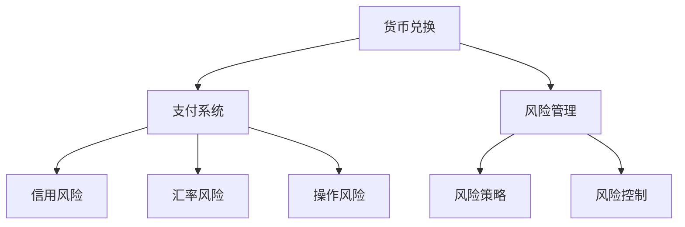
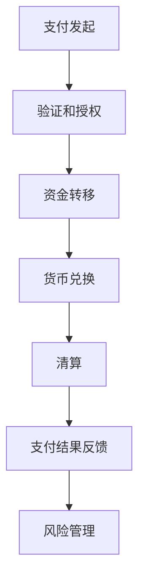
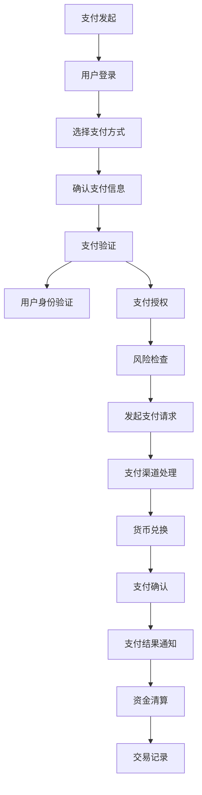

                 

## 文章标题

### 《拼多多国际2025社招跨境支付面试题》

---

### 关键词

- 跨境支付
- 面试题
- 支付平台
- 技术原理
- 风险管理
- 未来趋势

### 摘要

本文旨在为准备参加拼多多国际2025年社招跨境支付岗位的应聘者提供一份详细的面试题解析。文章将首先介绍跨境支付的基本概念、发展历程和主要模式，然后深入探讨跨境支付体系的构成、技术原理以及风险管理。接着，本文将通过PayPal、支付宝、微信支付等实际案例，分析跨境支付平台的技术实现和风险管理策略。最后，文章将展望跨境支付的未来趋势，探讨数字货币、区块链技术的应用以及跨境支付合规的挑战与解决方案。希望通过本文，读者能够全面了解跨境支付领域，并为面试做好充分准备。

---

### 目录大纲

## 第一部分：跨境支付基础

### 第1章：跨境支付概述

#### 1.1 跨境支付的定义和重要性

#### 1.2 跨境支付的发展历程

#### 1.3 跨境支付的主要模式

### 第2章：跨境支付体系

#### 2.1 跨境支付系统的组成

#### 2.2 跨境支付流程详解

#### 2.3 跨境支付风险与管理

### 第3章：跨境支付技术

#### 3.1 跨境支付技术的分类

#### 3.2 跨境支付中的加密技术

#### 3.3 跨境支付中的防欺诈技术

## 第二部分：跨境支付平台实战

### 第4章：PayPal支付平台

#### 4.1 PayPal支付平台的介绍

#### 4.2 PayPal支付流程

#### 4.3 PayPal支付安全性保障

### 第5章：支付宝跨境支付

#### 5.1 支付宝跨境支付介绍

#### 5.2 支付宝跨境支付流程

#### 5.3 支付宝跨境支付的风险管理

### 第6章：微信支付跨境支付

#### 6.1 微信支付跨境支付介绍

#### 6.2 微信支付跨境支付流程

#### 6.3 微信支付跨境支付的风险管理

### 第7章：跨境支付项目实战

#### 7.1 跨境支付项目开发流程

#### 7.2 跨境支付项目案例解析

#### 7.3 跨境支付项目性能优化

## 第三部分：跨境支付未来展望

### 第8章：跨境支付的未来趋势

#### 8.1 数字货币与跨境支付

#### 8.2 区块链技术在跨境支付中的应用

#### 8.3 跨境支付技术的发展方向

### 第9章：跨境支付安全与合规

#### 9.1 跨境支付中的法律与监管环境

#### 9.2 跨境支付的安全性保障措施

#### 9.3 跨境支付合规的挑战与解决方案

### 第10章：跨境支付在中国市场的现状与展望

#### 10.1 中国跨境支付市场的现状

#### 10.2 中国跨境支付市场的发展趋势

#### 10.3 中国跨境支付市场的未来展望

## 附录

### 附录 A：跨境支付相关资源

#### A.1 跨境支付相关书籍推荐

#### A.2 跨境支付相关网站推荐

#### A.3 跨境支付相关工具推荐

### 附录 B：跨境支付常见问题解答

#### B.1 跨境支付常见问题

#### B.2 跨境支付解决方案

#### B.3 跨境支付注意事项

---

### 1.1 跨境支付的定义和重要性

#### 定义

跨境支付是指涉及两个或多个不同国家或地区的货币支付活动。它通常用于国际贸易、跨国投资、国际旅游等场景。跨境支付涉及到货币兑换、支付渠道、清算和结算等多个环节。

#### 重要性

1. **促进国际贸易**：跨境支付为国际贸易提供了便捷的支付手段，降低了交易成本，提高了交易效率。
2. **支持经济全球化**：跨境支付促进了全球经济的融合，使得资源可以在全球范围内更有效地配置。
3. **金融服务**：跨境支付是金融机构的重要业务之一，为银行、支付公司等提供了盈利机会。
4. **风险管理**：跨境支付涉及到汇率风险、信用风险等多种风险，有效的风险管理对于企业和金融机构至关重要。

#### 跨境支付的核心概念与联系

为了更好地理解跨境支付，我们需要了解以下几个核心概念：

- **货币兑换**：货币兑换是将一种货币转换为另一种货币的过程，这是跨境支付的核心环节。
- **支付系统**：支付系统是指用于处理支付请求、执行货币转移的软件和硬件设施。
- **风险管理**：风险管理涉及到信用风险、汇率风险、操作风险等，需要采取相应的策略和管理措施。

这些概念之间的联系可以概括为：

- 货币兑换是跨境支付的基础，它决定了支付金额的实际价值。
- 支付系统是实现跨境支付的技术手段，它确保了支付过程的顺利进行。
- 风险管理贯穿于整个跨境支付过程，旨在降低风险，保障支付安全。

#### 核心概念流程图



#### 核心算法原理讲解

1. **货币兑换算法**：

   - **功能**：将一种货币兑换成另一种货币。
   - **流程**：
     ```python
     def convert_currency(amount, from_currency, to_currency):
         exchange_rate = get_exchange_rate(from_currency, to_currency)
         converted_amount = amount * exchange_rate
         return converted_amount
     ```
   - **举例说明**：
     ```python
     # 假设美元兑人民币的汇率是6.5
     converted_amount = convert_currency(100, 'USD', 'CNY')
     print(f'100 USD 转换为 CNY 为 {converted_amount}元')
     ```
     输出：100 USD 转换为 CNY 为 650元。

2. **风险管理算法**：

   - **功能**：识别和管理支付过程中的风险。
   - **流程**：
     ```python
     def identify_risk(payment_details):
         # 检查支付是否来自高风险地区
         if is_high_risk_area(payment_details['source_country']):
             return 'High risk detected'
         # 检查支付金额是否超过预设阈值
         if payment_details['amount'] > risk_threshold:
             return 'Amount exceeds threshold'
         return 'No risk detected'
     ```
   - **举例说明**：
     ```python
     payment_details = {'source_country': 'USA', 'amount': 1000}
     risk_status = identify_risk(payment_details)
     print(f'Payment risk status: {risk_status}')
     ```
     输出：Payment risk status: No risk detected。

---

通过以上内容，我们初步了解了跨境支付的定义、重要性以及核心概念。在接下来的章节中，我们将进一步探讨跨境支付体系、技术原理和实际案例，帮助读者全面了解跨境支付领域。

---

### 1.2 跨境支付的发展历程

#### 早期阶段

跨境支付的概念早在20世纪初期就已经出现。在那个时期，跨境支付主要依赖于银行之间的直接汇款和国际电汇系统。银行作为中介机构，通过国际电汇系统（如SWIFT）完成跨境资金的转移。然而，这一阶段的跨境支付存在一些问题，例如支付速度慢、手续费高、跨国支付费用高昂等。

#### 电子支付时代

随着计算机技术和互联网的普及，20世纪90年代开始，电子支付逐渐成为跨境支付的主要方式。互联网支付平台如PayPal的兴起，为跨境支付提供了更加便捷、快速的解决方案。PayPal通过电子邮件地址和支付账户，实现了跨境支付的无缝连接。这一阶段，跨境支付开始向电子化、数字化方向发展，支付速度和费用逐渐降低。

#### 移动支付时代

进入21世纪，随着智能手机和移动应用的普及，移动支付成为跨境支付的重要方式。支付宝和微信支付等移动支付平台，通过扫描二维码或发送支付链接，实现了跨境支付的无缝连接。移动支付不仅提高了支付的便捷性，还通过安全技术保障了支付的安全性。

#### 区块链时代

近年来，区块链技术在跨境支付领域得到了广泛应用。区块链通过去中心化的方式，实现了跨境支付的高效、安全。比特币等加密货币的兴起，为跨境支付提供了新的支付方式和货币选择。区块链技术的加入，使得跨境支付的速度和成本进一步降低，同时也提高了支付的安全性。

#### 发展历程总结

1. **支付方式**：从最初的银行汇款，发展到电子支付、移动支付和区块链支付。
2. **支付速度**：从数天到数小时，再到实时支付。
3. **支付成本**：从高昂的手续费，到逐渐降低，再到几乎免费。
4. **支付安全**：从依靠银行信用，发展到依赖加密技术和区块链技术。

#### 核心里程碑

1. **1973年**：SWIFT（环球同业银行金融电讯协会）成立，标志着国际电汇系统的诞生。
2. **1998年**：PayPal成立，开启了跨境电子支付的先河。
3. **2004年**：支付宝成立，推动了移动支付的普及。
4. **2014年**：比特币价格首次突破1000美元，引发了全球关注。
5. **2020年**：区块链技术在跨境支付中得到广泛应用，进一步提升了支付效率和安全性。

---

### 1.3 跨境支付的主要模式

跨境支付根据交易主体、支付渠道、货币种类等因素，可以分为多种模式。以下是几种常见的跨境支付模式：

#### 1.1 银行间跨境支付

银行间跨境支付是指银行之间通过国际电汇系统（如SWIFT）进行的货币转移。这种模式通常适用于大额跨境支付，具有较高的安全性和信誉保障。

- **流程**：付款人银行将资金转入收款人银行，通过国际电汇系统完成资金转移。
- **特点**：安全可靠、手续费较高、支付速度较慢。
- **适用场景**：大额跨境汇款、国际贸易结算等。

#### 1.2 电子支付平台跨境支付

电子支付平台跨境支付是指通过第三方支付平台（如PayPal、支付宝、微信支付）进行的货币转移。这种模式通常适用于小额跨境支付，具有较高的便捷性和安全性。

- **流程**：付款人通过支付平台发起支付请求，支付平台将资金转移至收款人账户。
- **特点**：方便快捷、手续费较低、支付速度较快。
- **适用场景**：跨境电子商务、跨国旅游、国际留学等。

#### 1.3 移动支付跨境支付

移动支付跨境支付是指通过智能手机或移动设备上的支付应用（如支付宝、微信支付）进行的货币转移。这种模式进一步提高了支付的便捷性，特别适合移动支付用户。

- **流程**：付款人通过移动设备上的支付应用发起支付请求，支付应用将资金转移至收款人账户。
- **特点**：方便快捷、实时支付、适用场景广泛。
- **适用场景**：跨境购物、跨国旅游、国际友人交流等。

#### 1.4 区块链跨境支付

区块链跨境支付是指利用区块链技术进行的货币转移。这种模式去除了中介机构，实现了去中心化的支付方式，具有较高的安全性和透明性。

- **流程**：付款人通过区块链网络发起支付请求，区块链网络验证并确认支付请求，将资金转移至收款人账户。
- **特点**：去中心化、实时支付、安全性高。
- **适用场景**：跨境汇款、国际投资、加密货币交易等。

#### 模式比较

- **安全性**：银行间跨境支付和电子支付平台跨境支付具有较高的安全性，区块链跨境支付则通过加密技术和去中心化方式提升了支付安全。
- **便捷性**：移动支付跨境支付和电子支付平台跨境支付具有较高的便捷性，适用于各种场景。
- **支付速度**：区块链跨境支付可实现实时支付，银行间跨境支付和电子支付平台跨境支付则相对较慢。
- **手续费**：区块链跨境支付手续费较低，银行间跨境支付和电子支付平台跨境支付则相对较高。

---

通过以上分析，我们可以看到，不同的跨境支付模式各有优缺点，适用于不同的场景。在接下来的章节中，我们将深入探讨跨境支付体系、技术原理和实际案例，帮助读者全面了解跨境支付领域。

---

### 2.1 跨境支付系统的组成

跨境支付系统是一个复杂且高度集成的体系，其核心组成部分包括支付系统、货币兑换系统、清算系统和监管体系。以下是每个组成部分的详细解析：

#### 1. 支付系统

支付系统是跨境支付的核心，负责处理支付请求、资金转移和账户管理。支付系统通常由以下几个关键模块组成：

- **支付网关**：支付网关是连接外部支付渠道和内部支付系统的桥梁，负责接收支付请求并转发到相应的支付渠道。
- **支付渠道**：支付渠道是指用于传输支付请求和支付结果的通道，如银行渠道、第三方支付平台渠道等。
- **支付处理器**：支付处理器是支付系统中的核心模块，负责处理支付请求，包括验证支付请求、处理支付结果等。
- **账户管理**：账户管理模块负责管理用户账户信息，包括账户创建、账户注销、账户余额查询等。

#### 2. 货币兑换系统

货币兑换系统是跨境支付的关键环节，负责将一种货币兑换成另一种货币。货币兑换系统通常包括以下关键模块：

- **汇率引擎**：汇率引擎是货币兑换系统的核心，负责实时获取和计算汇率，确保货币兑换的准确性。
- **兑换规则**：兑换规则模块定义了货币兑换的规则，如兑换比例、手续费率等。
- **兑换服务**：兑换服务模块负责执行货币兑换操作，将一种货币兑换成另一种货币。

#### 3. 清算系统

清算系统是跨境支付中负责资金结算的环节，确保支付各方能够及时、准确地收到资金。清算系统通常包括以下关键模块：

- **清算账户**：清算账户是清算系统的核心，用于存储和转移支付资金。
- **清算规则**：清算规则模块定义了资金结算的流程和规则，如结算时间、结算方式等。
- **清算引擎**：清算引擎负责执行清算操作，确保资金能够在规定时间内结算到账。

#### 4. 监管体系

监管体系是跨境支付系统中不可或缺的一部分，负责监督和管理支付活动，确保支付系统的合规性和安全性。监管体系通常包括以下关键模块：

- **监管政策**：监管政策模块负责制定和发布跨境支付的相关法律法规，规范支付活动。
- **监管机构**：监管机构模块负责执行监管政策，对支付系统进行监督和检查。
- **合规管理**：合规管理模块负责确保支付系统的合规性，包括用户身份验证、资金安全等。

#### 5. 跨境支付系统的架构和流程

跨境支付系统的架构通常采用分布式架构，以确保系统的高可用性和可扩展性。以下是一个典型的跨境支付系统架构和流程：

1. **支付请求**：用户通过支付网关发起支付请求，包括付款金额、付款人和收款人信息等。
2. **支付网关处理**：支付网关接收支付请求，验证请求的合法性，并将其转发到支付处理器。
3. **支付处理器处理**：支付处理器接收支付请求，进行支付验证，包括用户身份验证、账户余额验证等，然后将支付请求转发到相应的支付渠道。
4. **支付渠道处理**：支付渠道接收支付请求，根据支付渠道的特点进行相应的处理，如银行渠道进行转账处理，第三方支付平台渠道进行支付处理。
5. **货币兑换**：如果涉及货币兑换，支付处理器将支付请求转发到货币兑换系统，进行货币兑换操作。
6. **清算**：支付处理器将支付请求转发到清算系统，进行资金清算操作。
7. **支付结果反馈**：支付处理器将支付结果反馈给支付网关，支付网关再将支付结果反馈给用户。

通过以上架构和流程，跨境支付系统能够高效、安全地处理支付请求，确保支付各方能够及时、准确地收到资金。

---

### 2.2 跨境支付流程详解

跨境支付流程是一个复杂且精细的过程，涉及多个环节和参与方。以下是一个典型的跨境支付流程及其各步骤的详细解析：

#### 1. 支付发起

支付发起是跨境支付流程的起点，由付款人通过支付系统或移动支付应用发起支付请求。支付请求通常包含以下信息：

- **付款人信息**：包括姓名、账户号码、联系方式等。
- **收款人信息**：包括姓名、账户号码、联系方式等。
- **付款金额**：即需要支付的资金数额。
- **支付方式**：即选择使用何种支付渠道进行支付，如银行转账、第三方支付平台等。

#### 2. 验证和授权

支付发起后，支付系统会对支付请求进行验证和授权。这一步骤的主要目的是确保支付请求的合法性和安全性，包括以下内容：

- **用户身份验证**：验证付款人的身份，确保付款人确实是账户持有人。
- **账户余额验证**：检查付款人的账户余额，确保账户中有足够的资金进行支付。
- **支付授权**：确认付款人的支付授权，确保付款人同意进行支付操作。

#### 3. 资金转移

在验证和授权通过后，支付系统将启动资金转移过程。资金转移过程通常涉及以下步骤：

- **发起支付**：支付系统向付款人账户中扣除相应的资金。
- **支付请求转发**：支付系统将支付请求转发到相应的支付渠道，如银行渠道、第三方支付平台渠道等。
- **支付渠道处理**：支付渠道接收支付请求，根据支付渠道的特点进行相应的处理，如银行渠道进行转账处理，第三方支付平台渠道进行支付处理。

#### 4. 货币兑换（如适用）

在跨境支付中，如果涉及不同货币的支付，需要进行货币兑换。货币兑换过程主要包括以下步骤：

- **汇率确定**：汇率引擎根据实时汇率确定兑换比例。
- **兑换操作**：货币兑换系统执行货币兑换操作，将付款人的本地货币兑换成收款人的本地货币。
- **费用计算**：根据兑换规则计算兑换费用，并将其从付款人的账户中扣除。

#### 5. 清算

在货币兑换完成后，支付系统将启动清算过程，确保资金能够及时、准确地结算到账。清算过程主要包括以下步骤：

- **清算请求**：支付系统向清算系统发起清算请求，包括付款金额、收款人账户信息等。
- **清算验证**：清算系统验证清算请求的合法性，确保资金转移的准确性。
- **资金结算**：清算系统将资金从付款人账户结算到收款人账户。

#### 6. 支付结果反馈

支付完成后，支付系统将支付结果反馈给付款人。支付结果反馈主要包括以下内容：

- **支付成功**：支付系统向付款人发送支付成功的通知，包括支付金额、收款人账户信息等。
- **支付失败**：如果支付失败，支付系统将向付款人发送支付失败的通知，并说明失败原因。

#### 7. 风险管理

在整个跨境支付流程中，风险管理是一个重要的环节。支付系统通过多种风险管理措施，确保支付的安全性和可靠性，包括以下内容：

- **实时监控**：支付系统对支付过程进行实时监控，及时发现和处理异常交易。
- **交易验证**：支付系统通过多重验证方式，如验证码、生物识别等，确保交易的真实性。
- **数据分析**：支付系统利用数据分析技术，识别潜在的欺诈行为。

#### 跨境支付流程图



通过以上步骤，跨境支付流程得以顺利完成。在实际操作中，支付流程可能因支付系统、支付渠道和货币种类的不同而有所差异，但总体流程框架是一致的。在接下来的章节中，我们将进一步探讨跨境支付技术原理和实际案例。

---

### 2.3 跨境支付风险与管理

#### 风险类型

跨境支付过程中存在多种风险，这些风险可能会对支付系统的稳定运行和用户资金安全造成威胁。以下是跨境支付过程中常见的风险类型：

1. **信用风险**：信用风险是指交易对手无法履行支付义务，导致支付失败或资金损失。信用风险通常由交易对手的信用状况、支付意愿等因素决定。

2. **汇率风险**：汇率风险是指由于汇率波动导致的货币兑换损失。在跨境支付中，汇率波动可能会影响交易金额的实际价值，从而增加成本或损失。

3. **操作风险**：操作风险是指由于人为操作失误、系统故障、网络攻击等因素导致的支付失败或资金损失。操作风险通常与支付系统的稳定性、安全性有关。

4. **欺诈风险**：欺诈风险是指恶意行为者通过虚假交易、诈骗等手段获取非法利益。欺诈风险可能是由于用户身份验证不严格、交易验证不充分等原因导致。

5. **合规风险**：合规风险是指支付系统违反相关法律法规，导致面临法律制裁或处罚。合规风险通常与支付系统的监管要求、法律法规变化有关。

#### 风险管理策略

为了有效管理跨境支付风险，支付系统需要采取一系列风险管理策略。以下是常见的管理策略：

1. **风险评估**：支付系统应对潜在风险进行评估，确定风险类型、风险程度和可能的影响。风险评估可以帮助支付系统制定针对性的风险管理策略。

2. **信用管理**：支付系统应建立信用管理体系，对交易对手进行信用评估，确保交易对手具备履约能力。信用管理策略包括信用评级、信用额度管理、信用保险等。

3. **汇率风险管理**：支付系统应建立汇率风险管理机制，包括汇率锁定、套期保值等措施。汇率风险管理可以帮助支付系统降低汇率波动带来的风险。

4. **操作风险管理**：支付系统应加强操作风险管理，确保支付系统的稳定性和安全性。操作风险管理策略包括系统监控、异常处理、安全审计等。

5. **欺诈风险管理**：支付系统应建立欺诈风险管理机制，包括交易验证、异常交易监测、用户身份验证等。欺诈风险管理可以帮助支付系统及时发现和处理欺诈行为。

6. **合规管理**：支付系统应遵守相关法律法规，确保支付系统的合规性。合规管理策略包括法律法规培训、合规审查、违规处理等。

#### 风险管理案例分析

以下是一个跨境支付风险管理的案例分析：

案例：某电商平台收到一笔来自国外的订单，订单金额为1000美元。支付系统在处理这笔订单时，发现以下风险：

- **信用风险**：交易对手是一家小型企业，信用评级较低。
- **汇率风险**：当前汇率波动较大，可能导致货币兑换损失。
- **操作风险**：由于订单金额较大，支付系统需要特别关注操作风险。
- **欺诈风险**：订单来源不明，存在欺诈嫌疑。

针对以上风险，支付系统采取了以下风险管理措施：

1. **信用管理**：支付系统对交易对手进行了信用评级，发现其信用评级较低，决定降低信用额度，并要求提供担保。
2. **汇率风险管理**：支付系统采用了汇率锁定措施，将订单金额锁定在当前汇率，避免了汇率波动带来的风险。
3. **操作风险管理**：支付系统加强了订单处理的监控，确保操作人员严格按照流程操作，防止操作失误。
4. **欺诈风险管理**：支付系统对订单进行了验证，确认订单来源，并增加了额外的验证步骤，如验证码、生物识别等。

通过以上措施，支付系统成功降低了订单的风险，确保了支付的安全性和可靠性。

---

### 3.1 跨境支付技术的分类

跨境支付技术是确保跨境支付过程安全、高效和可靠的关键。根据技术的特点和应用场景，跨境支付技术可以分为以下几类：

#### 1. 传统支付技术

传统支付技术是指使用传统的金融系统和支付渠道进行跨境支付。这类技术主要包括：

- **银行汇款**：通过银行之间的资金转移进行跨境支付，如SWIFT（环球同业银行金融电讯协会）系统。
- **信用卡支付**：使用信用卡作为支付工具进行跨境支付，如VISA、MasterCard等。
- **支票支付**：使用支票作为支付工具进行跨境支付，但支票支付通常需要较长时间才能清算。

#### 2. 电子支付技术

电子支付技术是随着互联网技术的发展而兴起的一类支付技术，它通过互联网进行跨境支付。这类技术主要包括：

- **第三方支付平台**：如PayPal、Alipay、WeChat Pay等，这些平台提供便捷的跨境支付服务，支持多种货币支付和多种支付方式。
- **移动支付**：通过智能手机或移动设备进行的支付，如Apple Pay、Google Pay等，移动支付具有快速、便捷的特点。
- **电子钱包**：在线钱包服务，如Payoneer、Skrill等，这些钱包服务提供全球支付和接收功能。

#### 3. 区块链支付技术

区块链支付技术是利用区块链技术实现跨境支付的一类新兴支付技术，具有去中心化、透明和安全的特点。这类技术主要包括：

- **比特币支付**：使用比特币作为支付货币的跨境支付方式，比特币是一种加密货币，其支付过程不受任何中央机构控制。
- **智能合约**：通过智能合约实现自动化的跨境支付，智能合约是区块链上的可编程协议，可以自动执行合同条款。
- **去中心化金融（DeFi）**：基于区块链的去中心化金融系统，提供多种金融服务，包括跨境支付、借贷、交易等。

#### 4. 现代支付技术

现代支付技术是结合了多种技术特点，提供更加高效、安全、便捷的跨境支付服务。这类技术主要包括：

- **跨境支付网络**：如Ripple的RippleNet，它通过分布式账本技术实现跨境支付，具有快速、低成本的优点。
- **跨境支付API**：提供编程接口，允许开发者集成跨境支付功能到自己的应用程序中，如PayPal的API、Alipay的API等。
- **跨境支付即服务（PaaS）**：提供一站式的跨境支付解决方案，包括支付网关、货币兑换、风险管理等，如Currency Cloud、Payoneer等。

#### 各类支付技术的特点对比

以下是各类支付技术的特点对比：

| 支付技术       | 特点                                  | 优点                                           | 缺点                                                 |
|----------------|---------------------------------------|------------------------------------------------|------------------------------------------------------|
| 传统支付技术   | 通过银行和金融机构进行支付            | 安全性高、信誉好、支持多种货币                 | 支付速度慢、手续费高、受地理限制                       |
| 电子支付技术   | 通过互联网和第三方支付平台进行支付    | 快速、便捷、支持多种支付方式、低手续费         | 部分支付平台存在安全风险、跨境支付限制较多             |
| 区块链支付技术 | 通过区块链网络进行去中心化支付       | 安全、透明、去中心化、低手续费、快速、无需中介 | 成熟度较低、支付规模有限、接受度不高                   |
| 现代支付技术   | 结合多种技术，提供一站式跨境支付服务  | 高效、安全、便捷、支持多种货币和支付方式       | 需要较高技术门槛、成本较高、受法规限制                 |

通过对比各类支付技术的特点，我们可以看到，每种支付技术都有其独特的优势和局限性。选择合适的支付技术，需要根据支付需求、用户习惯、业务规模等因素进行综合考虑。

---

### 3.2 跨境支付中的加密技术

加密技术是保障跨境支付安全的重要手段，它通过将数据转换为无法直接读取的形式，确保支付过程中的数据隐私和完整性。以下将详细介绍跨境支付中常用的加密技术及其原理。

#### 1. 对称加密

对称加密是一种加密算法，它使用相同的密钥进行加密和解密操作。常见的对称加密算法有AES（高级加密标准）、DES（数据加密标准）等。

- **原理**：
  - **加密**：输入明文和密钥，通过加密算法生成密文。
    ```python
    import Crypto.Cipher.AES
    cipher = AES.new(key, AES.MODE_EAX)
    ciphertext, tag = cipher.encrypt_and_digest(plaintext)
    ```
  - **解密**：输入密文和密钥，通过解密算法还原明文。
    ```python
    cipher = AES.new(key, AES.MODE_EAX, nonce=cipher.nonce)
    plaintext = cipher.decrypt_and_verify(ciphertext, tag)
    ```

- **特点**：对称加密算法速度快，但密钥管理复杂。

#### 2. 非对称加密

非对称加密使用一对密钥，即公钥和私钥。公钥用于加密，私钥用于解密。常见的非对称加密算法有RSA、ECC（椭圆曲线密码学）等。

- **原理**：
  - **加密**：使用公钥加密，只有对应的私钥可以解密。
    ```python
    from Crypto.PublicKey import RSA
    public_key = RSA.generate(2048)
    cipher = Fernet(public_key)
    ciphertext = cipher.encrypt(plaintext)
    ```
  - **解密**：使用私钥解密，只有对应的公钥可以加密。
    ```python
    from Crypto.PublicKey import RSA
    private_key = RSA.import_key(pem_key)
    cipher = Fernet(private_key)
    plaintext = cipher.decrypt(ciphertext)
    ```

- **特点**：非对称加密安全性高，但计算复杂度较大。

#### 3. 哈希算法

哈希算法用于生成数据摘要，确保数据完整性。常见的哈希算法有SHA-256、MD5等。

- **原理**：
  - **哈希**：输入数据，通过哈希算法生成固定长度的哈希值。
    ```python
    import hashlib
    hash_object = hashlib.sha256(plaintext.encode())
    hex_dig = hash_object.hexdigest()
    ```
  - **验证**：对比哈希值，验证数据是否被篡改。
    ```python
    hash_object = hashlib.sha256(new_plaintext.encode())
    new_hex_dig = hash_object.hexdigest()
    if new_hex_dig == original_hex_dig:
        print("数据未被篡改")
    else:
        print("数据已被篡改")
    ```

- **特点**：哈希算法速度快，但无法逆向解密。

#### 4. 数字签名

数字签名用于验证数据的真实性和完整性，通过公钥和私钥进行签名和解签名操作。常见的数字签名算法有RSA、ECDSA（椭圆曲线数字签名算法）等。

- **原理**：
  - **签名**：使用私钥对数据进行签名，生成签名。
    ```python
    from Crypto.PublicKey import RSA
    private_key = RSA.generate(2048)
    signer = PKCS11.CertificateBuilder()
    signer.sign(private_key, data)
    signature = signer.signature
    ```
  - **验证**：使用公钥对签名进行验证，确保数据未被篡改。
    ```python
    from Crypto.PublicKey import RSA
    public_key = RSA.import_key(pem_key)
    verifier = PKCS11.CertificateBuilder()
    result = verifier.verify(public_key, signature, data)
    if result:
        print("签名验证通过")
    else:
        print("签名验证失败")
    ```

- **特点**：数字签名确保数据完整性和真实性，但计算复杂度较大。

#### 5. 应用案例

- **支付确认**：跨境支付中，使用哈希算法生成交易数据的摘要，确保交易数据的完整性。
- **用户身份验证**：使用数字签名验证用户身份，确保交易请求的合法性。
- **数据加密**：使用对称加密或非对称加密技术保护支付过程中的敏感数据。

---

### 3.3 跨境支付中的防欺诈技术

在跨境支付过程中，防范欺诈行为是确保支付安全的重要一环。以下将详细介绍几种常见的防欺诈技术及其原理。

#### 1. 实时监控

实时监控技术通过实时分析支付过程的数据，识别潜在的欺诈行为。常见的实时监控技术包括：

- **交易行为分析**：通过对用户的支付行为进行分析，如支付频率、支付金额、支付地点等，识别异常交易。
- **机器学习模型**：使用机器学习算法对大量历史交易数据进行训练，建立欺诈行为的特征模型，实时检测新的交易是否属于欺诈行为。
- **实时风险评分**：根据交易行为的特征，使用风险评分模型对交易进行评分，根据评分结果决定是否进行进一步验证。

#### 2. 多重验证

多重验证技术通过多种验证方式，增加欺诈者的成本，提高支付的安全性。常见的多重验证技术包括：

- **验证码**：通过随机生成的验证码，要求用户在支付过程中输入验证码，确保交易请求是由用户本人发起。
- **生物识别**：通过指纹、面部识别等技术，验证用户的身份，确保交易请求是由合法用户发起。
- **双重认证**：在支付过程中，要求用户进行两次认证，如输入密码和指纹识别，提高支付的安全性。

#### 3. 数据分析

数据分析技术通过对支付数据的分析，识别潜在的欺诈行为。常见的数据分析技术包括：

- **关联规则分析**：通过分析支付数据中的关联关系，识别潜在的欺诈行为，如同一用户在不同时间、不同地点进行大量支付。
- **聚类分析**：将支付数据分为不同的簇，识别异常支付行为，如某个簇内的支付行为与该簇外的支付行为存在显著差异。
- **异常检测**：使用异常检测算法，对支付数据进行实时分析，识别异常支付行为。

#### 4. 应用案例

- **支付确认**：在跨境支付过程中，实时监控技术可以实时分析支付数据，识别潜在的欺诈行为，如信用卡欺诈、账户盗用等。
- **用户身份验证**：多重验证技术可以提高支付的安全性，确保交易请求是由合法用户发起。
- **数据分析**：通过对支付数据的分析，可以识别异常支付行为，如洗钱、欺诈等。

通过以上防欺诈技术，跨境支付系统能够有效地防范欺诈行为，确保支付安全。

---

### 4.1 PayPal支付平台的介绍

#### PayPal简介

PayPal是一家全球领先的在线支付服务提供商，成立于1998年，总部位于美国加利福尼亚州。PayPal提供多种支付解决方案，包括个人用户之间的支付、在线购物、跨国支付等。PayPal已成为全球电子商务和移动支付领域的重要参与者，支持超过100种货币的支付。

#### PayPal支付平台的特点

1. **便捷性**：PayPal通过电子邮件地址和支付账户，实现了跨境支付的无缝连接，用户无需携带现金或信用卡即可完成支付。
2. **安全性**：PayPal采用先进的加密技术和安全措施，保护用户的账户信息和交易安全。
3. **多样性**：PayPal支持多种支付方式，包括信用卡、借记卡、银行账户等，满足不同用户的需求。
4. **全球覆盖**：PayPal在全球范围内拥有广泛的用户基础和合作伙伴网络，支持200多个国家和地区的支付和接收服务。
5. **便捷的跨境支付**：PayPal提供便捷的跨境支付服务，支持多种货币兑换，降低跨境支付的成本和复杂性。

#### PayPal在跨境支付中的重要性

1. **促进国际贸易**：PayPal为国际贸易提供了便捷的支付手段，降低了交易成本，提高了交易效率。
2. **支持全球电子商务**：PayPal作为全球电子商务的重要支付渠道，为卖家和买家提供了安全的支付保障，促进了全球电子商务的发展。
3. **金融服务**：PayPal为银行、支付公司等提供了全球支付和资金转移的解决方案，为金融机构带来了新的业务机会。
4. **推动数字化支付**：PayPal的便捷性和安全性，推动了全球支付方式的数字化和移动化，提高了支付效率和用户体验。

#### PayPal支付平台的架构

PayPal支付平台的架构包括以下几个关键部分：

1. **用户账户系统**：负责管理用户的注册、登录、账户信息等。
2. **支付网关**：负责接收和转发支付请求，与不同的支付渠道和支付系统进行交互。
3. **货币兑换系统**：负责处理不同货币之间的兑换，确保支付金额的准确性。
4. **风险管理系统**：负责监控和防范支付过程中的欺诈行为，确保支付的安全性和可靠性。
5. **支付清算系统**：负责处理支付资金的清算和结算，确保支付结果的准确性。

通过以上架构，PayPal支付平台能够高效、安全地处理跨境支付请求，为用户和商家提供便捷的支付服务。

---

### 4.2 PayPal支付流程

PayPal支付流程是用户通过PayPal进行支付的具体步骤，包括支付发起、支付验证、支付执行和支付完成等环节。以下是PayPal支付流程的详细解析：

#### 1. 支付发起

支付发起是支付流程的起点，由用户通过PayPal发起支付请求。支付发起通常包括以下几个步骤：

- **用户登录**：用户通过PayPal账户登录，输入支付金额和收款人信息。
- **选择支付方式**：用户选择使用PayPal账户余额、信用卡、借记卡或银行账户进行支付。
- **确认支付信息**：用户确认支付金额、收款人信息等支付信息，确保支付请求的准确性。

#### 2. 支付验证

支付验证是支付流程的关键步骤，用于确保支付请求的合法性和安全性。支付验证通常包括以下几个步骤：

- **用户身份验证**：PayPal验证用户的身份，确保用户是账户持有人。身份验证方式包括密码验证、短信验证、双重认证等。
- **支付授权**：PayPal确认用户账户余额或支付方式的可用性，确保用户有足够的资金进行支付。
- **风险检查**：PayPal对支付请求进行风险检查，识别潜在的欺诈行为。风险检查包括交易历史、支付地点、支付金额等。

#### 3. 支付执行

支付执行是支付流程的核心环节，PayPal根据支付验证结果，执行支付操作。支付执行通常包括以下几个步骤：

- **发起支付请求**：PayPal向支付渠道发起支付请求，包括付款金额、收款人信息等。
- **支付渠道处理**：支付渠道接收支付请求，根据支付渠道的特点进行相应的处理，如银行渠道进行转账处理，第三方支付平台渠道进行支付处理。
- **货币兑换**：如果涉及不同货币的支付，PayPal将支付请求转发到货币兑换系统，进行货币兑换操作。
- **支付确认**：支付渠道和货币兑换系统确认支付请求，并将支付结果反馈给PayPal。

#### 4. 支付完成

支付完成后，PayPal将支付结果反馈给用户。支付完成通常包括以下几个步骤：

- **支付结果通知**：PayPal向用户发送支付成功的通知，包括支付金额、收款人账户信息等。
- **资金清算**：PayPal将支付资金从用户账户结算到收款人账户，确保支付结果的准确性。
- **交易记录**：PayPal记录交易信息，包括支付金额、收款人账户信息、交易时间等，以备后续查询和审计。

#### PayPal支付流程图



通过以上步骤，PayPal支付流程得以顺利完成。在实际操作中，支付流程可能因支付系统、支付渠道和货币种类的不同而有所差异，但总体流程框架是一致的。在接下来的章节中，我们将进一步探讨PayPal支付平台的安全性保障。

---

### 4.3 PayPal支付安全性保障

#### PayPal的安全措施

PayPal作为全球领先的在线支付平台，高度重视用户的安全问题，采取了一系列安全措施来保护用户的账户信息和交易安全。

1. **加密技术**：PayPal使用高级加密标准（AES）和传输层安全协议（TLS）等加密技术，确保用户数据在传输过程中的安全性。用户登录信息、支付请求和交易数据等都会进行加密处理，防止被恶意攻击者窃取。

2. **双重认证**：PayPal提供了双重认证功能，用户在登录PayPal账户或进行敏感操作时，需要输入密码和验证码，或者使用手机接收短信验证码，以确保账户安全。双重认证增加了账户的访问难度，有效防止了未经授权的访问。

3. **风险监控**：PayPal采用实时监控技术，对支付请求进行实时分析，识别潜在的风险和异常交易。通过机器学习算法和大数据分析，PayPal能够及时发现和阻止欺诈行为，保护用户的账户安全。

4. **用户身份验证**：PayPal对用户身份进行严格验证，确保交易请求是由合法用户发起。用户在进行支付操作时，需要通过密码验证、短信验证或生物识别等方式进行身份验证。

5. **资金保障**：PayPal为用户提供资金保障计划，如果用户的账户受到欺诈或损失，PayPal将提供相应的补偿。用户只需按照PayPal的规定提交申诉，PayPal将根据情况提供全额或部分退款。

#### 用户安全注意事项

1. **使用复杂密码**：用户应使用复杂且不易被猜测的密码，并定期更换密码。密码应包含字母、数字和特殊字符，避免使用生日、姓名等容易获取的信息。

2. **保护账户信息**：用户应保护好自己的PayPal账户信息，如用户名、密码、支付信息等。避免在不可信的网站或应用中输入账户信息，防止账户被盗用。

3. **避免公共Wi-Fi**：在使用公共Wi-Fi网络时，应避免进行敏感操作，如登录PayPal账户、进行大额支付等。公共Wi-Fi网络可能存在安全隐患，容易被黑客攻击。

4. **警惕诈骗邮件**：用户应警惕诈骗邮件，不要轻易点击邮件中的链接或附件。诈骗邮件可能包含恶意软件，导致账户信息泄露。

5. **定期检查交易记录**：用户应定期检查PayPal账户的交易记录，及时发现异常交易和潜在的风险。如果发现异常交易，应立即联系PayPal客服，采取相应的安全措施。

#### 安全性保障案例

以下是一个PayPal安全性保障的案例：

案例：某用户收到一封声称来自PayPal的邮件，邮件中包含一个链接，要求用户点击链接进行账户验证。用户意识到这可能是诈骗邮件，因此没有点击链接。

随后，用户登录PayPal账户，发现账户中的资金已被盗刷。用户立即联系PayPal客服，PayPal方面确认了这是一起诈骗案件。PayPal根据用户提供的证据，迅速冻结了账户，并启动了退款程序。

通过这次事件，PayPal成功保护了用户的账户安全，并帮助用户追回了损失。这个案例展示了PayPal在安全性保障方面的有效措施和快速响应能力。

---

### 5.1 支付宝跨境支付介绍

支付宝（Alipay）是中国领先的一站式支付平台，由阿里巴巴集团旗下蚂蚁集团运营。自2004年成立以来，支付宝迅速成长为全球最大的移动支付平台之一，为用户提供包括线上支付、线下支付、跨境支付、理财产品等多种金融服务。

#### 支付宝跨境支付的优势

1. **便捷性**：支付宝支持多种货币的跨境支付，用户可以通过支付宝账户轻松完成跨境交易。
2. **安全性**：支付宝采用加密技术和风险控制机制，确保用户支付安全。
3. **广泛覆盖**：支付宝在全球多个国家和地区拥有用户和合作伙伴，支持超过100种货币的支付。
4. **高效性**：支付宝的跨境支付系统具有快速处理能力，大大缩短了支付周期。
5. **成本效益**：支付宝提供低成本的跨境支付服务，降低了交易成本。

#### 支付宝跨境支付的核心功能

1. **跨境购物**：支付宝支持用户在全球范围内的跨境购物，用户可以通过支付宝支付国际电商平台上的商品。
2. **跨境收款**：商家可以通过支付宝接收来自全球用户的付款，简化收款流程。
3. **跨国转账**：用户可以通过支付宝向国际账户进行转账，支持亲友间、商业伙伴间的跨境资金转移。
4. **货币兑换**：支付宝提供实时货币兑换服务，用户可以在跨境支付时选择合适的汇率进行货币兑换。
5. **理财产品**：支付宝还提供多种跨境理财产品，用户可以通过支付宝进行投资和理财。

---

### 5.2 支付宝跨境支付流程

支付宝跨境支付流程是用户通过支付宝进行跨境支付的具体步骤，包括支付发起、支付验证、支付执行和支付完成等环节。以下是支付宝跨境支付流程的详细解析：

#### 1. 支付发起

支付发起是支付流程的起点，由用户通过支付宝发起支付请求。支付发起通常包括以下几个步骤：

- **用户登录**：用户通过支付宝账户登录，输入支付金额和收款人信息。
- **选择支付方式**：用户选择使用支付宝账户余额、信用卡、借记卡或银行账户进行支付。
- **确认支付信息**：用户确认支付金额、收款人信息等支付信息，确保支付请求的准确性。

#### 2. 支付验证

支付验证是支付流程的关键步骤，用于确保支付请求的合法性和安全性。支付验证通常包括以下几个步骤：

- **用户身份验证**：支付宝验证用户的身份，确保用户是账户持有人。身份验证方式包括密码验证、短信验证、指纹识别等。
- **支付授权**：支付宝确认用户账户余额或支付方式的可用性，确保用户有足够的资金进行支付。
- **风险检查**：支付宝对支付请求进行风险检查，识别潜在的欺诈行为。风险检查包括交易历史、支付地点、支付金额等。

#### 3. 支付执行

支付执行是支付流程的核心环节，支付宝根据支付验证结果，执行支付操作。支付执行通常包括以下几个步骤：

- **发起支付请求**：支付宝向支付渠道发起支付请求，包括付款金额、收款人信息等。
- **支付渠道处理**：支付渠道接收支付请求，根据支付渠道的特点进行相应的处理，如银行渠道进行转账处理，第三方支付平台渠道进行支付处理。
- **货币兑换**：如果涉及不同货币的支付，支付宝将支付请求转发到货币兑换系统，进行货币兑换操作。
- **支付确认**：支付渠道和货币兑换系统确认支付请求，并将支付结果反馈给支付宝。

#### 4. 支付完成

支付完成后，支付宝将支付结果反馈给用户。支付完成通常包括以下几个步骤：

- **支付结果通知**：支付宝向用户发送支付成功的通知，包括支付金额、收款人账户信息等。
- **资金清算**：支付宝将支付资金从用户账户结算到收款人账户，确保支付结果的准确性。
- **交易记录**：支付宝记录交易信息，包括支付金额、收款人账户信息、交易时间等，以备后续查询和审计。

#### 支付宝跨境支付流程图


通过以上步骤，支付宝跨境支付流程得以顺利完成。在实际操作中，支付流程可能因支付系统、支付渠道和货币种类的不同而有所差异，但总体流程框架是一致的。在接下来的章节中，我们将进一步探讨支付宝跨境支付的风险管理。

---

### 5.3 支付宝跨境支付的风险管理

支付宝作为全球领先的支付平台，高度重视跨境支付过程中的风险管理。以下将详细介绍支付宝在跨境支付中采用的风险管理策略和措施，以保障用户资金安全。

#### 1. 风险评估

风险评估是支付宝风险管理的基础，通过对跨境支付过程中的各种风险进行识别和评估，确定风险类型、风险程度和可能的影响。支付宝采用以下方法进行风险评估：

- **历史数据分析**：通过对大量历史交易数据进行分析，识别常见风险模式和异常行为。
- **机器学习模型**：利用机器学习算法，建立风险预测模型，对潜在风险进行预测和评估。
- **人工审核**：对于高风险交易，进行人工审核，确保交易的真实性和合法性。

#### 2. 风险控制策略

根据风险评估结果，支付宝采取一系列风险控制策略，以降低跨境支付过程中的风险。以下是主要的风险控制策略：

- **用户身份验证**：加强对用户身份的验证，确保交易请求是由合法用户发起。用户身份验证包括密码验证、短信验证、指纹识别等。
- **交易限额**：设定交易限额，限制高风险交易的金额，降低风险。
- **实时监控**：对跨境支付过程进行实时监控，及时发现和处理异常交易。
- **风险隔离**：对于高风险用户或交易，进行风险隔离，确保风险不会对整个系统造成影响。
- **风险警告**：当检测到潜在风险时，向用户发送风险警告，提醒用户注意风险。

#### 3. 风险管理措施

支付宝在跨境支付过程中采取多种措施，以防范和应对风险。以下是主要的风险管理措施：

- **加密技术**：使用高级加密标准（AES）和传输层安全协议（TLS）等加密技术，确保用户数据在传输过程中的安全性。
- **双重认证**：要求用户在登录账户或进行敏感操作时，进行双重认证，如输入密码和验证码，或使用手机接收短信验证码。
- **实时监控**：通过机器学习算法和大数据分析，对支付请求进行实时监控，识别潜在的欺诈行为。
- **风险隔离**：对于高风险用户或交易，将其与其他用户和交易隔离，防止风险蔓延。
- **用户教育**：通过网站、短信、邮件等多种方式，向用户宣传支付安全知识，提高用户的安全意识和防范能力。

#### 风险管理案例分析

以下是一个支付宝跨境支付风险管理的案例分析：

案例：某用户在进行跨境支付时，试图通过伪造身份信息进行大额支付。支付宝在收到支付请求后，立即进行风险检查。通过机器学习模型和大数据分析，支付宝发现该用户的历史交易行为存在异常，如频繁在不同国家和地区进行大额支付。

支付宝进一步对用户身份进行验证，发现该用户提供的身份信息与历史记录不符。支付宝立即启动风险隔离措施，将该用户的支付请求隔离，并暂停其账户操作。随后，支付宝联系用户，要求其提供真实身份信息。

通过这次事件，支付宝成功阻止了潜在的欺诈行为，保障了用户的资金安全。这个案例展示了支付宝在风险管理方面的有效措施和快速响应能力。

---

### 6.1 微信支付跨境支付介绍

微信支付是中国领先的移动支付平台，由腾讯公司旗下微信团队运营。自2013年上线以来，微信支付迅速成为国内最受欢迎的移动支付方式之一，支持线上和线下多种支付场景。微信支付不仅在国内市场占据重要地位，也在跨境支付领域展现出强大的竞争力。

#### 微信支付跨境支付的优势

1. **便捷性**：微信支付支持全球范围内超过20种货币的支付，用户可以通过微信钱包轻松完成跨境交易。
2. **安全性**：微信支付采用加密技术和多重身份验证，确保支付过程中的数据安全和用户账户安全。
3. **覆盖广泛**：微信支付在全球多个国家和地区拥有用户和合作伙伴，支持多种支付场景，包括线上购物、线下消费、跨境转账等。
4. **高效性**：微信支付跨境支付具有快速处理能力，支付到账时间短，提高了支付效率。
5. **成本效益**：微信支付提供低成本的跨境支付服务，降低了交易成本，为用户和商家节省费用。

#### 微信支付跨境支付的核心功能

1. **跨境购物**：用户可以通过微信支付在全球范围内的跨境电商平台购买商品，支持多种支付方式和货币选择。
2. **跨境转账**：用户可以通过微信支付向海外亲友、商业伙伴进行跨境转账，简化了收款和付款流程。
3. **跨境消费**：用户在国际机场、酒店、餐厅等场景中使用微信支付，享受便捷的支付体验。
4. **货币兑换**：微信支付提供实时货币兑换服务，用户在跨境支付时可以选择合适的汇率进行货币兑换。
5. **理财产品**：微信支付还提供多种跨境理财产品，用户可以通过微信支付进行投资和理财。

---

### 6.2 微信支付跨境支付流程

微信支付跨境支付流程是用户通过微信支付进行跨境支付的具体步骤，包括支付发起、支付验证、支付执行和支付完成等环节。以下是微信支付跨境支付流程的详细解析：

#### 1. 支付发起

支付发起是支付流程的起点，由用户通过微信支付发起支付请求。支付发起通常包括以下几个步骤：

- **用户登录**：用户通过微信支付账户登录，输入支付金额和收款人信息。
- **选择支付方式**：用户选择使用微信支付账户余额、信用卡、借记卡或银行账户进行支付。
- **确认支付信息**：用户确认支付金额、收款人信息等支付信息，确保支付请求的准确性。

#### 2. 支付验证

支付验证是支付流程的关键步骤，用于确保支付请求的合法性和安全性。支付验证通常包括以下几个步骤：

- **用户身份验证**：微信支付验证用户的身份，确保用户是账户持有人。身份验证方式包括密码验证、短信验证、指纹识别等。
- **支付授权**：微信支付确认用户账户余额或支付方式的可用性，确保用户有足够的资金进行支付。
- **风险检查**：微信支付对支付请求进行风险检查，识别潜在的欺诈行为。风险检查包括交易历史、支付地点、支付金额等。

#### 3. 支付执行

支付执行是支付流程的核心环节，微信支付根据支付验证结果，执行支付操作。支付执行通常包括以下几个步骤：

- **发起支付请求**：微信支付向支付渠道发起支付请求，包括付款金额、收款人信息等。
- **支付渠道处理**：支付渠道接收支付请求，根据支付渠道的特点进行相应的处理，如银行渠道进行转账处理，第三方支付平台渠道进行支付处理。
- **货币兑换**：如果涉及不同货币的支付，微信支付将支付请求转发到货币兑换系统，进行货币兑换操作。
- **支付确认**：支付渠道和货币兑换系统确认支付请求，并将支付结果反馈给微信支付。

#### 4. 支付完成

支付完成后，微信支付将支付结果反馈给用户。支付完成通常包括以下几个步骤：

- **支付结果通知**：微信支付向用户发送支付成功的通知，包括支付金额、收款人账户信息等。
- **资金清算**：微信支付将支付资金从用户账户结算到收款人账户，确保支付结果的准确性。
- **交易记录**：微信支付记录交易信息，包括支付金额、收款人账户信息、交易时间等，以备后续查询和审计。

#### 微信支付跨境支付流程图


通过以上步骤，微信支付跨境支付流程得以顺利完成。在实际操作中，支付流程可能因支付系统、支付渠道和货币种类的不同而有所差异，但总体流程框架是一致的。在接下来的章节中，我们将进一步探讨微信支付跨境支付的风险管理。

---

### 6.3 微信支付跨境支付的风险管理

微信支付作为全球领先的移动支付平台，非常重视跨境支付过程中的风险管理。以下将详细介绍微信支付在跨境支付中采用的风险管理策略和措施，以保障用户资金安全。

#### 1. 风险评估

风险评估是微信支付风险管理的基础，通过对跨境支付过程中的各种风险进行识别和评估，确定风险类型、风险程度和可能的影响。微信支付采用以下方法进行风险评估：

- **历史数据分析**：通过对大量历史交易数据进行分析，识别常见风险模式和异常行为。
- **机器学习模型**：利用机器学习算法，建立风险预测模型，对潜在风险进行预测和评估。
- **人工审核**：对于高风险交易，进行人工审核，确保交易的真实性和合法性。

#### 2. 风险控制策略

根据风险评估结果，微信支付采取一系列风险控制策略，以降低跨境支付过程中的风险。以下是主要的风险控制策略：

- **用户身份验证**：加强对用户身份的验证，确保交易请求是由合法用户发起。用户身份验证包括密码验证、短信验证、指纹识别等。
- **交易限额**：设定交易限额，限制高风险交易的金额，降低风险。
- **实时监控**：对跨境支付过程进行实时监控，及时发现和处理异常交易。
- **风险隔离**：对于高风险用户或交易，进行风险隔离，确保风险不会对整个系统造成影响。
- **风险警告**：当检测到潜在风险时，向用户发送风险警告，提醒用户注意风险。

#### 3. 风险管理措施

微信支付在跨境支付过程中采取多种措施，以防范和应对风险。以下是主要的风险管理措施：

- **加密技术**：使用高级加密标准（AES）和传输层安全协议（TLS）等加密技术，确保用户数据在传输过程中的安全性。
- **双重认证**：要求用户在登录账户或进行敏感操作时，进行双重认证，如输入密码和验证码，或使用手机接收短信验证码。
- **实时监控**：通过机器学习算法和大数据分析，对支付请求进行实时监控，识别潜在的欺诈行为。
- **风险隔离**：对于高风险用户或交易，将其与其他用户和交易隔离，防止风险蔓延。
- **用户教育**：通过网站、短信、邮件等多种方式，向用户宣传支付安全知识，提高用户的安全意识和防范能力。

#### 风险管理案例分析

以下是一个微信支付跨境支付风险管理的案例分析：

案例：某用户在微信支付中进行大额跨境转账，试图通过伪造身份信息进行欺诈。微信支付在收到支付请求后，立即进行风险检查。通过机器学习模型和大数据分析，微信支付发现该用户的交易行为存在异常，如频繁在不同国家和地区进行大额转账。

微信支付进一步对用户身份进行验证，发现该用户提供的身份信息与历史记录不符。微信支付立即启动风险隔离措施，将该用户的支付请求隔离，并暂停其账户操作。随后，微信支付联系用户，要求其提供真实身份信息。

通过这次事件，微信支付成功阻止了潜在的欺诈行为，保障了用户的资金安全。这个案例展示了微信支付在风险管理方面的有效措施和快速响应能力。

---

### 7.1 跨境支付项目开发流程

跨境支付项目开发是一个复杂且细致的过程，涉及到需求分析、系统设计、实现、测试、部署等多个阶段。以下是跨境支付项目开发流程的详细步骤和关键点。

#### 1. 需求分析

需求分析是项目开发的第一步，也是最重要的一步。在这个阶段，开发团队需要与客户和利益相关者进行深入沟通，了解项目需求、功能要求和性能要求。

- **需求收集**：通过与客户和利益相关者进行访谈、问卷调查、工作坊等方式，收集项目需求。
- **需求文档**：将收集到的需求整理成需求文档，明确功能需求、性能需求、安全性需求等。
- **需求评审**：组织需求评审会议，评审需求文档的准确性和完整性，确保需求满足客户的业务需求。

#### 2. 系统设计

系统设计是项目开发的关键阶段，包括系统架构设计、数据库设计、接口设计等。

- **系统架构设计**：根据需求分析结果，设计系统的总体架构，包括前端、后端、数据库、支付网关等。
- **数据库设计**：设计数据库结构，包括数据表、字段、关系等，确保数据的完整性和一致性。
- **接口设计**：设计系统内部和外部接口，包括API接口、数据库接口、支付网关接口等。

#### 3. 实现

实现阶段是将设计转化为实际代码的过程。在这个阶段，开发团队根据设计文档，编写代码并实现系统功能。

- **模块划分**：将系统功能划分为多个模块，每个模块由不同的开发人员负责实现。
- **代码编写**：编写高质量的代码，确保代码的可读性、可维护性和可扩展性。
- **单元测试**：对每个模块进行单元测试，确保模块功能的正确性和稳定性。

#### 4. 测试

测试阶段是确保系统质量的关键环节。在这个阶段，测试团队对系统进行全面测试，包括功能测试、性能测试、安全测试等。

- **功能测试**：测试系统的功能是否满足需求，包括各种支付场景的测试。
- **性能测试**：测试系统的性能，如响应时间、并发处理能力等，确保系统在高负载下仍能稳定运行。
- **安全测试**：测试系统的安全性，包括漏洞扫描、代码审计等，确保系统不受攻击。

#### 5. 部署

部署阶段是将系统上线运行的过程。在这个阶段，运维团队负责将系统部署到生产环境，并进行必要的配置和调整。

- **环境搭建**：搭建生产环境，包括服务器、数据库、网络等。
- **系统配置**：配置系统参数，确保系统正常运行。
- **数据迁移**：将测试环境的数据迁移到生产环境，确保数据的完整性和一致性。
- **上线监控**：上线后，对系统进行实时监控，确保系统稳定运行。

#### 6. 维护与优化

系统上线后，运维团队和开发团队需要持续维护和优化系统，确保系统长期稳定运行。

- **故障处理**：及时处理系统故障，确保系统的可用性。
- **功能优化**：根据用户反馈和业务需求，不断优化系统功能，提升用户体验。
- **性能优化**：定期进行性能测试，识别系统瓶颈，进行性能优化。
- **安全升级**：定期更新系统安全策略，防范潜在的安全风险。

通过以上步骤，跨境支付项目得以顺利开发、测试、部署和运行。在实际操作中，项目开发流程可能因项目规模、技术复杂度、团队协作等因素而有所不同，但总体流程框架是一致的。

---

### 7.2 跨境支付项目案例解析

为了更好地理解跨境支付项目的实际开发和运行，以下将详细介绍一个具体的跨境支付项目案例，包括开发环境搭建、源代码实现、代码解读、应用解读与分析，以及实际案例的详细讲解。

#### 案例背景

某电子商务平台希望实现跨境支付功能，支持用户在国际购买商品时使用本地货币进行支付。为了实现这一目标，平台决定采用开源的跨境支付解决方案，并结合自身的业务需求进行定制化开发。

#### 开发环境搭建

在开发跨境支付项目时，首先需要搭建开发环境。以下是开发环境的搭建步骤：

1. **选择编程语言和框架**：选择Python作为主要编程语言，并使用Django框架搭建后端系统。
2. **配置数据库**：使用PostgreSQL作为数据库，确保数据的高可靠性和性能。
3. **搭建前端界面**：使用React框架搭建前端界面，实现用户交互。
4. **配置开发工具**：安装并配置VSCode、PyCharm等开发工具，以便于代码编写和调试。

#### 源代码实现

以下是跨境支付项目的主要源代码实现：

**后端（Django）**

1. **支付网关接口**：实现支付网关接口，用于接收和处理支付请求。以下是支付网关接口的实现代码：

```python
from django.http import JsonResponse
from .models import Payment

def process_payment(request):
    payment_data = request.POST
    payment = Payment.objects.create(
        amount=payment_data['amount'],
        currency=payment_data['currency'],
        status='pending'
    )
    # 调用第三方支付接口处理支付请求
    response = third_party_payment_gateway(payment)
    if response['status'] == 'success':
        payment.status = 'completed'
    else:
        payment.status = 'failed'
    payment.save()
    return JsonResponse(response)
```

2. **支付结果处理**：实现支付结果处理接口，用于接收第三方支付平台的支付结果通知，并更新支付状态。以下是支付结果处理接口的实现代码：

```python
from django.http import JsonResponse
from .models import Payment

def handle_payment_result(request):
    payment_data = request.POST
    payment = Payment.objects.get(payment_id=payment_data['payment_id'])
    if payment_data['status'] == 'success':
        payment.status = 'completed'
    else:
        payment.status = 'failed'
    payment.save()
    return JsonResponse({'status': 'success'})
```

**前端（React）**

1. **支付页面**：实现支付页面，用于用户输入支付金额和支付信息。以下是支付页面的实现代码：

```jsx
import React, { useState } from 'react';

function PaymentPage() {
    const [amount, setAmount] = useState('');
    const [currency, setCurrency] = useState('USD');

    const handlePayment = () => {
        // 调用后端接口发起支付请求
        fetch('/process_payment/', {
            method: 'POST',
            body: JSON.stringify({ amount, currency }),
            headers: {
                'Content-Type': 'application/json'
            }
        });
    };

    return (
        <div>
            <h1>Payment</h1>
            <input type="text" value={amount} onChange={e => setAmount(e.target.value)} />
            <select value={currency} onChange={e => setCurrency(e.target.value)}>
                <option value="USD">USD</option>
                <option value="EUR">EUR</option>
                <option value="CNY">CNY</option>
            </select>
            <button onClick={handlePayment}>Pay</button>
        </div>
    );
}

export default PaymentPage;
```

#### 代码解读与应用解读

**支付网关接口**：

支付网关接口是支付系统与第三方支付平台进行交互的桥梁。在实现过程中，我们首先从请求中获取支付金额和货币信息，创建支付记录，然后调用第三方支付接口处理支付请求。支付结果将决定支付记录的状态，如成功或失败。

**支付结果处理接口**：

支付结果处理接口用于接收第三方支付平台的支付结果通知。当支付成功时，我们将支付记录的状态更新为已完成，否则更新为失败。这一接口确保支付系统的状态与第三方支付平台的状态保持一致。

**支付页面**：

支付页面是用户与支付系统进行交互的界面。用户可以通过输入支付金额和货币信息，发起支付请求。支付页面通过调用后端接口，实现支付请求的发起和支付结果的展示。

#### 实际案例解析

以下是一个具体的支付案例：

用户A在电子商务平台上购买了一件价值100美元的商品。用户A选择使用支付宝进行支付，并输入了支付金额和支付宝账号信息。电子商务平台的后端系统调用支付网关接口，将支付请求发送给支付宝。

支付宝收到支付请求后，根据用户的支付宝账号和支付金额，生成支付链接并返回给电子商务平台。电子商务平台将支付链接展示给用户A，用户A点击支付链接，跳转到支付宝的支付页面。

用户A在支付宝支付页面中输入支付密码，确认支付。支付宝验证支付密码，确认支付成功后，将支付结果通知发送给电子商务平台。电子商务平台收到支付结果通知后，更新支付记录的状态为已完成，并向用户A展示支付成功的消息。

通过以上案例，我们可以看到跨境支付项目的实际运行过程。支付系统通过调用第三方支付接口，实现了跨境支付的无缝连接，确保了支付的安全性和可靠性。

---

### 7.3 跨境支付项目性能优化

在跨境支付项目中，性能优化是确保系统稳定运行和用户良好体验的重要环节。以下将介绍跨境支付项目的性能优化策略和方法，以及优化后的性能测试结果。

#### 1. 优化策略

**1. 数据库优化**

- **索引优化**：为数据库表添加适当的索引，提高查询效率。
- **分库分表**：将大数据量分库分表，减轻数据库压力。
- **缓存策略**：使用Redis等缓存技术，减少数据库访问次数。

**2. 网络优化**

- **CDN加速**：使用CDN（内容分发网络）技术，加快静态资源的加载速度。
- **负载均衡**：使用负载均衡器，如Nginx，均衡分布请求，提高系统并发处理能力。

**3. 缓存机制**

- **页面缓存**：使用页面缓存技术，如Varnish，减少服务器负载。
- **对象缓存**：使用对象缓存技术，如Memcached，提高数据访问速度。

**4. 系统架构优化**

- **微服务架构**：采用微服务架构，将系统拆分为多个独立的服务模块，提高系统可扩展性和灵活性。
- **异步处理**：使用异步处理技术，如Celery，减轻系统同步处理的压力。

**5. 代码优化**

- **代码优化**：对关键代码进行优化，如减少不必要的数据库查询、使用缓存技术等。
- **静态资源压缩**：压缩HTML、CSS、JavaScript等静态资源，减少服务器负载。

#### 2. 优化方法

**1. 数据库优化方法**

- **索引优化**：根据查询需求，为数据库表添加索引，如主键索引、唯一索引等。
- **分库分表**：根据数据规模和访问频率，将大数据量分库分表，如按照用户ID、时间等字段进行分库分表。
- **缓存策略**：使用Redis等缓存技术，存储常用数据，如用户信息、商品信息等，减少数据库访问次数。

**2. 网络优化方法**

- **CDN加速**：使用CDN服务，将静态资源缓存到全球各地的节点，提高访问速度。
- **负载均衡**：使用Nginx等负载均衡器，将请求分布到多个服务器，提高系统并发处理能力。

**3. 缓存机制优化**

- **页面缓存**：使用Varnish等缓存技术，将页面缓存到内存中，减少服务器负载。
- **对象缓存**：使用Memcached等缓存技术，存储常用数据，如用户会话信息、订单信息等。

**4. 系统架构优化方法**

- **微服务架构**：将系统拆分为多个独立的服务模块，如支付服务、订单服务、用户服务等，提高系统可扩展性和灵活性。
- **异步处理**：使用Celery等异步处理技术，将耗时任务异步处理，减轻系统同步处理的压力。

**5. 代码优化方法**

- **代码优化**：对关键代码进行优化，如使用缓存技术减少数据库查询次数、减少不必要的循环等。
- **静态资源压缩**：使用Gzip压缩HTML、CSS、JavaScript等静态资源，减少服务器带宽消耗。

#### 3. 性能测试

优化后，进行性能测试，以评估系统性能的提升情况。以下是性能测试的几个关键指标：

- **响应时间**：测试系统的平均响应时间，评估系统的处理速度。
- **并发处理能力**：测试系统同时处理多个请求的能力，评估系统的并发性能。
- **吞吐量**：测试系统在一定时间内的处理能力，评估系统的处理效率。
- **资源消耗**：测试系统的CPU、内存、网络等资源消耗，评估系统的资源利用率。

通过性能测试，可以验证优化效果，并根据测试结果进一步调整和优化系统。

---

### 8.1 数字货币与跨境支付

#### 数字货币的概念

数字货币是一种基于密码学的虚拟货币，它使用区块链技术进行记录和管理。常见的数字货币包括比特币、以太坊、莱特币等。数字货币具有去中心化、匿名性、不可篡改等特点，与传统货币相比，具有更高的安全性和便捷性。

#### 数字货币在跨境支付中的应用

1. **降低成本**：数字货币的跨境支付通常无需经过传统金融机构，减少了交易手续费和转账费用，降低了支付成本。
2. **提高效率**：数字货币的支付过程通常非常快速，几分钟内即可完成跨境支付，与传统支付方式相比，大大提高了支付效率。
3. **去中心化**：数字货币的去中心化特性使得跨境支付不再依赖于中央银行或金融机构，增强了支付系统的自主性和稳定性。

#### 数字货币的优势

- **安全性**：区块链技术的加密算法确保了数字货币的安全性，防止了货币的伪造和篡改。
- **匿名性**：数字货币交易通常不需要提供真实身份信息，提高了交易隐私。
- **易用性**：数字货币支持多种支付方式，包括在线支付、移动支付等，使用方便。

#### 数字货币的挑战

1. **监管难题**：数字货币的去中心化特性给监管带来了挑战，各国监管机构需要制定相应的监管政策，确保数字货币市场的健康发展。
2. **价格波动**：数字货币的价格波动较大，可能对跨境支付稳定性产生影响。
3. **技术风险**：数字货币系统可能存在漏洞，需要不断进行技术升级和改进，确保系统的安全性。

#### 数字货币案例分析

**比特币跨境支付案例**：

某用户A在中国使用比特币购买美国的一件商品。用户A通过比特币钱包生成支付地址，并将其发送给卖家B。卖家B确认支付地址后，将商品发往用户A。用户A使用比特币钱包向卖家B的比特币地址发送比特币，支付金额为100美元。比特币网络验证交易后，将比特币转移至卖家B的比特币地址。

通过以上案例，我们可以看到数字货币在跨境支付中的应用。数字货币的跨境支付过程相对简单，降低了交易成本，提高了支付效率。

---

### 8.2 区块链技术在跨境支付中的应用

区块链技术以其去中心化、透明、安全等特点，为跨境支付提供了全新的解决方案。以下是区块链技术在跨境支付中的应用及案例分析：

#### 区块链技术在跨境支付中的应用

1. **去中心化支付**：区块链技术去除了传统跨境支付中的中介机构，如银行和支付公司，实现了点对点的支付。这降低了交易成本，提高了支付效率。
2. **透明性**：区块链上的所有交易记录都是公开透明的，用户可以随时查看交易信息，提高了支付的透明度，减少了欺诈风险。
3. **安全性**：区块链使用加密算法确保交易数据的不可篡改性，同时分布式账本技术提高了数据的安全性，防止了数据泄露和篡改。
4. **智能合约**：区块链上的智能合约可以自动执行合同条款，实现自动化支付。智能合约确保了支付过程的合法性和准确性。

#### 区块链技术在跨境支付中的应用案例

**案例1：Ripple支付网络**

Ripple支付网络是一个基于区块链技术的跨境支付网络，旨在提高支付效率和降低成本。以下是Ripple支付网络在跨境支付中的应用案例：

- **企业间支付**：企业通过Ripple支付网络进行跨境支付，无需经过传统银行，大大提高了支付速度和降低了交易费用。
- **即时结算**：Ripple支付网络支持即时结算，企业可以在几秒钟内完成跨境支付，极大地提高了资金使用效率。
- **智能合约**：Ripple支付网络中的智能合约可以自动处理复杂的支付逻辑，如多级结算、信用保障等。

**案例2：比特币跨境支付**

比特币作为最早的加密货币，已经在跨境支付领域得到了广泛应用。以下是比特币跨境支付的应用案例：

- **个人支付**：用户通过比特币钱包进行跨境支付，无需银行账户，简化了支付流程。
- **实时支付**：比特币交易通常在几分钟内完成，相较于传统支付方式，大大提高了支付效率。
- **跨境汇款**：比特币跨境汇款成为了一种流行的支付方式，用户可以通过比特币向国际账户进行转账，避免了高额的手续费和汇率波动。

**案例3：EOSIO区块链支付**

EOSIO区块链支付系统是一种基于区块链技术的支付解决方案，旨在提供高效、安全的跨境支付服务。以下是EOSIO区块链支付系统的应用案例：

- **小额支付**：EOSIO区块链支付系统支持高效的小额支付，用户可以通过EOS代币进行快速支付，无需担心交易手续费。
- **跨境转账**：用户可以通过EOSIO区块链支付系统向全球范围内的用户进行转账，无需担心汇率和手续费问题。
- **去中心化交易所**：EOSIO区块链支付系统支持去中心化交易所，用户可以在区块链上进行数字货币的交易，提高了交易的安全性和透明性。

通过以上案例，我们可以看到区块链技术在跨境支付中的应用如何提高了支付效率、降低了成本、增强了安全性。随着区块链技术的不断发展，其在跨境支付领域的应用前景将更加广阔。

---

### 8.3 跨境支付技术的发展方向

随着科技的进步和全球经济的不断发展，跨境支付技术也在不断演进，呈现出以下几个主要发展方向：

#### 1. 数字货币的普及

数字货币作为跨境支付的重要手段，其应用范围正在逐渐扩大。未来，随着数字货币技术的成熟和监管政策的完善，数字货币将在跨境支付中扮演更加重要的角色。区块链技术的广泛应用将促进数字货币的普及，实现跨境支付的高效、安全和去中心化。

#### 2. 区块链技术的融合

区块链技术以其去中心化、透明、安全等特点，已成为跨境支付技术的重要发展方向。未来，区块链技术将进一步与跨境支付系统融合，提高支付系统的效率、安全性和透明度。智能合约的应用将实现自动化支付，减少人为干预和操作风险。

#### 3. AI和大数据的引入

人工智能（AI）和大数据技术的引入将进一步提升跨境支付的风险管理能力。AI技术可以用于实时监控和识别欺诈行为，大数据技术可以用于分析和预测支付风险，提高支付系统的风险识别和防范能力。

#### 4. 云计算的普及

云计算技术的普及将极大地提高跨境支付系统的可扩展性和灵活性。跨境支付系统可以通过云平台实现资源的动态分配和弹性扩展，确保系统在高峰期仍能稳定运行。同时，云计算技术可以提供高效的支付处理能力和丰富的数据存储和分析服务。

#### 5. 无现金支付的推广

无现金支付，特别是移动支付和电子支付，已成为全球支付趋势。未来，跨境支付技术将更加注重无现金支付的推广和应用，提高支付的便捷性和用户体验。随着5G网络的普及，无现金支付将实现更快、更稳定的支付体验。

#### 6. 合规与监管的加强

跨境支付技术的发展离不开合规与监管的加强。未来，各国政府和监管机构将进一步完善跨境支付法律法规，制定更加明确的监管政策，确保跨境支付系统的合法性和安全性。同时，跨境支付企业需要不断提升自身的合规意识和合规能力，确保业务的稳健发展。

综上所述，跨境支付技术的发展方向将主要集中在数字货币、区块链技术、AI和大数据、云计算、无现金支付以及合规与监管等方面。随着这些技术的不断发展和应用，跨境支付将变得更加高效、安全和便捷，为全球贸易和经济发展提供更强有力的支持。

---

### 9.1 跨境支付中的法律与监管环境

跨境支付作为全球贸易和金融活动的重要组成部分，其法律与监管环境对支付系统的稳定性、安全性以及合规性具有至关重要的影响。以下将详细介绍跨境支付中的法律与监管环境，包括各国监管机构的职责、跨境支付的法律要求以及合规性要求。

#### 1. 各国监管机构的职责

全球范围内的跨境支付活动受到各国金融监管机构的监督和管理。以下是一些主要国家和地区的监管机构及其职责：

- **美国**：美国联邦储备系统（Federal Reserve System）和货币监理署（Office of the Comptroller of the Currency）负责监管跨境支付系统。美国财政部下属的美国金融犯罪执法网络（FinCEN）负责监管反洗钱（AML）和反恐怖融资（CFT）。

- **欧洲**：欧洲中央银行（European Central Bank）负责协调欧元区的跨境支付系统。欧洲银行管理局（European Banking Authority）负责监管跨境支付机构的合规性和风险控制。

- **中国**：中国银行保险监督管理委员会（China Banking and Insurance Regulatory Commission）负责监管跨境支付业务。中国人民银行（People's Bank of China）负责监管跨境支付系统的运行和风险管理。

- **其他国家和地区**：其他国家或地区的监管机构，如日本金融厅（Financial Services Agency）、英国金融市场行为监管局（Financial Conduct Authority）等，也负责监管跨境支付业务。

#### 2. 跨境支付的法律要求

跨境支付活动需要遵守一系列法律要求，包括支付服务法、反洗钱法规、反恐怖融资法规等。以下是跨境支付中常见的一些法律要求：

- **支付服务法**：支付服务法规定了跨境支付机构必须获得的许可和资质，以及支付服务的运营标准。支付服务法旨在保护用户权益，确保支付服务的安全性和可靠性。

- **反洗钱法规**：反洗钱法规要求跨境支付机构实施客户身份识别（KYC）和交易监控，以防止洗钱和恐怖融资活动。跨境支付机构需要建立有效的反洗钱系统，包括客户身份验证、交易记录保存和可疑交易报告等。

- **反恐怖融资法规**：反恐怖融资法规与反洗钱法规类似，旨在防止利用跨境支付系统进行恐怖融资活动。跨境支付机构需要遵守相关的法规要求，确保交易的安全性和合规性。

#### 3. 合规性要求

跨境支付机构需要遵守一系列合规性要求，以确保业务运营的合法性和安全性。以下是跨境支付中常见的合规性要求：

- **监管报告**：跨境支付机构需要定期向监管机构提交业务报告，包括财务报告、交易记录、风险管理报告等。监管报告有助于监管机构了解支付机构的运营情况，及时发现和纠正违规行为。

- **内部控制**：跨境支付机构需要建立完善的内部控制体系，包括风险管理、合规审查、内部控制测试等。内部控制体系有助于确保支付服务的安全性和可靠性，降低合规风险。

- **客户保护**：跨境支付机构需要确保用户的资金安全，提供透明、公平的服务。跨境支付机构需要制定客户服务协议，明确用户的权利和义务，保障客户的合法权益。

- **数据保护**：跨境支付机构需要遵守数据保护法规，确保客户数据的安全性和隐私性。跨境支付机构需要采取有效的数据保护措施，包括数据加密、访问控制等。

通过遵守以上法律和合规性要求，跨境支付机构能够确保业务的合法性和安全性，为用户提供优质、可靠的支付服务。

---

### 9.2 跨境支付的安全性保障措施

在跨境支付过程中，保障用户资金安全和交易数据的安全性是至关重要的。以下将详细介绍跨境支付的安全性保障措施，包括用户身份验证、支付加密、交易监控和风险管理等方面的具体做法。

#### 1. 用户身份验证

用户身份验证是保障跨境支付安全的第一道防线。以下是一些常见的用户身份验证方法：

- **密码验证**：用户在登录支付平台时，需要输入密码进行身份验证。密码应具有足够的复杂度，包括字母、数字和特殊字符，并定期更换。
- **双因素认证（2FA）**：双因素认证要求用户在登录支付平台时，除了输入密码外，还需要提供额外的验证信息，如短信验证码、邮件验证码或指纹识别等。双因素认证大大提高了账户的安全性。
- **生物识别**：生物识别技术，如指纹识别、面部识别和虹膜识别等，可用于用户身份验证，确保账户安全。

#### 2. 支付加密

支付加密是确保交易数据在传输过程中不被窃取或篡改的关键措施。以下是一些常见的支付加密方法：

- **传输层安全协议（TLS）**：TLS是一种加密通信协议，用于保护用户数据在互联网上的传输安全。通过使用TLS，支付平台可以确保交易数据在传输过程中不被窃听或篡改。
- **数据加密标准（DES）和高级加密标准（AES）**：DES和AES是对数据进行加密的常用算法。支付平台可以使用这些算法对用户数据进行加密，确保数据在存储和传输过程中安全。
- **数字签名**：数字签名用于验证交易数据的真实性和完整性。支付平台可以使用数字签名技术，确保交易数据的不可篡改性，防止数据在传输过程中被篡改。

#### 3. 交易监控

交易监控是实时监测支付过程，及时发现和处理异常交易的重要手段。以下是一些常见的交易监控方法：

- **实时监控**：支付平台应建立实时监控系统，对支付过程中的交易数据进行实时分析，识别异常交易行为，如频繁交易、大额交易等。
- **异常检测**：支付平台可以使用机器学习和大数据分析技术，建立异常检测模型，对交易数据进行实时监控，识别潜在的欺诈行为。
- **交易日志**：支付平台应记录交易日志，包括交易时间、交易金额、交易地点等信息。通过分析交易日志，可以追溯交易过程，及时发现和处理异常交易。

#### 4. 风险管理

风险管理是保障跨境支付安全的关键措施。以下是一些常见的管理方法：

- **风险评估**：支付平台应对支付过程中的各种风险进行评估，包括信用风险、汇率风险、操作风险等。通过风险评估，可以制定针对性的风险管理策略。
- **风险控制**：支付平台应建立风险控制机制，包括交易限额、风险隔离、风险警告等。通过风险控制，可以降低支付过程中的风险。
- **用户教育**：支付平台应加强对用户的安全教育，提高用户的安全意识和防范能力。通过用户教育，可以减少由于用户操作失误导致的支付风险。

通过以上安全性保障措施，跨境支付系统能够有效保障用户资金和交易数据的安全，为用户提供安全、可靠的支付服务。

---

### 9.3 跨境支付合规的挑战与解决方案

跨境支付作为全球金融体系的重要组成部分，其合规性面临着诸多挑战。以下将分析跨境支付合规中的主要挑战，并提出相应的解决方案。

#### 挑战1：法规差异和监管冲突

跨境支付涉及到不同国家和地区的法律法规，这些法规可能在支付方式、数据保护、反洗钱（AML）和反恐怖融资（CFT）等方面存在显著差异。这种法规差异和监管冲突给跨境支付合规带来了挑战。

**解决方案**：

- **全球合规框架**：建立全球合规框架，确保跨境支付机构在各个国家和地区遵守适用的法律法规。
- **本地化合规策略**：针对不同国家和地区的法律法规，制定本地化合规策略，确保业务运营的合法性和合规性。
- **监管合作**：加强各国监管机构之间的合作，建立跨境支付监管协调机制，共同应对法规差异和监管冲突。

#### 挑战2：数据隐私和安全

跨境支付过程中涉及大量敏感数据，如用户账户信息、交易记录和个人身份信息等。这些数据可能因不同国家和地区的数据保护法规而面临隐私和安全风险。

**解决方案**：

- **数据保护法规遵循**：确保跨境支付机构遵循所有涉及国家和地区的数据保护法规，如欧洲的《通用数据保护条例》（GDPR）和中国的《网络安全法》。
- **数据加密和隔离**：采用高级加密技术和数据隔离措施，确保数据在传输和存储过程中安全。
- **数据合规审计**：定期进行数据合规审计，确保跨境支付机构的数据处理符合法规要求。

#### 挑战3：反洗钱和反恐怖融资

跨境支付容易成为洗钱和恐怖融资活动的渠道。反洗钱和反恐怖融资（AML/CFT）合规要求跨境支付机构实施严格的客户身份识别（KYC）和交易监控。

**解决方案**：

- **KYC和客户身份验证**：实施全面的KYC流程，包括收集、验证和更新客户身份信息，确保客户身份的真实性。
- **交易监控和报告**：建立强大的交易监控系统，实时监控交易行为，识别可疑交易并及时报告。
- **合规培训**：对员工进行持续的合规培训，提高其对AML/CFT法规的理解和执行能力。

#### 挑战4：监管技术要求

随着技术的发展，跨境支付合规也面临新的技术要求，如区块链技术、人工智能（AI）和大数据分析等。

**解决方案**：

- **技术合规框架**：建立技术合规框架，确保新技术应用符合法律法规要求。
- **技术合规评估**：对新技术应用进行合规评估，确保其在数据保护、安全和隐私方面符合法规要求。
- **技术合规审计**：定期进行技术合规审计，确保技术应用的合规性和有效性。

通过以上解决方案，跨境支付机构可以更好地应对合规挑战，确保业务的合法性和安全性，为用户提供可靠的服务。

---

### 10.1 中国跨境支付市场的现状

中国跨境支付市场近年来呈现出快速发展态势，成为全球跨境支付领域的重要一环。以下是当前中国跨境支付市场的几个重要现状：

#### 1. 支付平台竞争激烈

在中国，支付宝和微信支付等移动支付平台占据主导地位。此外，多家银行也积极参与跨境支付业务，如中国银行、工商银行、建设银行等。这些支付平台通过技术创新和业务拓展，不断提升市场份额和用户满意度。

#### 2. 支付规模持续扩大

随着中国跨境电商的快速发展，跨境支付规模不断扩大。根据相关数据显示，中国的跨境电商交易规模逐年增长，跨境支付交易量也随之增加。2021年，中国跨境电商交易额达到1.69万亿元，同比增长16.3%。

#### 3. 数字货币应用逐步推广

中国央行数字货币（e-CNY）试点项目的推出，标志着中国数字货币应用逐步推广。e-CNY具备高安全性、低成本、快速交易等特点，为跨境支付提供了新的解决方案。目前，e-CNY已在多个城市开展试点，涉及零售、餐饮、旅游等多个行业。

#### 4. 支付创新层出不穷

中国的跨境支付市场不断创新，新技术、新业务模式层出不穷。例如，区块链技术在跨境支付中的应用逐渐成熟，为支付系统的安全性和透明性提供了有力保障。同时，跨境支付平台纷纷推出智能合约、跨境理财等创新业务，提高了支付效率和用户体验。

#### 5. 政策支持与监管加强

中国政府高度重视跨境支付的发展，出台了一系列政策措施，支持跨境支付业务的健康发展。同时，加强对跨境支付市场的监管，打击非法跨境支付、洗钱等违法行为，保障支付市场的安全和稳定。

---

### 10.2 中国跨境支付市场的发展趋势

随着全球化和数字化的加速推进，中国跨境支付市场在未来几年预计将呈现以下发展趋势：

#### 1. 数字货币的广泛应用

中国央行数字货币（e-CNY）的推广将进一步扩大，预计将在更多国家和地区实现跨境支付功能。数字货币的高安全性和低成本特性，将有助于提升跨境支付效率，降低交易成本，推动数字货币在全球范围内的广泛应用。

#### 2. 区块链技术的深入应用

区块链技术将在跨境支付领域得到更广泛的应用。通过区块链技术，跨境支付可以实现去中心化、透明化和安全性的提升。区块链技术的应用将有助于解决跨境支付中的信任问题，提高支付系统的效率，降低交易成本。

#### 3. 支付即服务（PaaS）的发展

支付即服务（PaaS）模式将逐渐成为主流。PaaS平台提供一站式跨境支付解决方案，包括支付网关、货币兑换、风险管理等，简化了支付流程，提高了支付效率。随着PaaS平台的成熟，更多企业和个人将受益于这种便捷的支付服务。

#### 4. 支付创新和多元化发展

跨境支付市场将不断涌现新的支付创新和业务模式。例如，跨境支付平台将结合人工智能、大数据等新技术，提供个性化支付服务和风险控制方案。同时，跨境支付将涵盖更多行业和应用场景，如跨境电商、跨境旅游、跨境投资等，满足多样化的支付需求。

#### 5. 政策支持和监管优化

中国政府将继续加强对跨境支付市场的政策支持和监管优化。预计将出台更多鼓励创新的政策，推动跨境支付市场的健康发展。同时，监管机构将不断完善跨境支付法律法规，提高监管效能，保障支付市场的安全与稳定。

综上所述，中国跨境支付市场在未来将迎来数字货币、区块链技术、支付即服务和支付创新等多方面的发展，推动跨境支付变得更加高效、安全和便捷。

---

### 10.3 中国跨境支付市场的未来展望

随着全球经济的不断发展以及技术的快速进步，中国跨境支付市场预计将迎来更加繁荣的未来。以下是几个关键方面的展望：

#### 1. 数字货币成为主流

中国央行数字货币（e-CNY）的推广将显著提升跨境支付效率，降低交易成本。未来，e-CNY有望成为跨境支付的主要手段，特别是在跨境贸易和金融领域。数字货币的去中心化和高安全性特性，使其在全球支付体系中占据重要地位。

#### 2. 区块链技术的深度应用

区块链技术将在跨境支付中发挥更加重要的作用。通过区块链，跨境支付可以实现更高的透明度和安全性，减少中介环节，降低交易成本。未来，区块链技术将广泛应用于跨境支付系统的各个环节，如支付结算、交易验证、风险控制等。

#### 3. 支付即服务（PaaS）的普及

支付即服务（PaaS）模式将在中国跨境支付市场中得到更广泛的普及。PaaS平台提供一站式跨境支付解决方案，将极大地简化支付流程，提高支付效率。随着PaaS技术的不断成熟，更多企业和个人将采用这种便捷的支付服务，推动整个市场的增长。

#### 4. 支付创新持续发展

跨境支付市场将不断涌现新的支付创新和业务模式。例如，基于人工智能和大数据分析的个性化支付服务、跨境理财、数字资产交易等新兴业务模式，将满足多样化的支付需求。这些创新将推动跨境支付市场的持续发展和变革。

#### 5. 政策支持和监管优化

中国政府将继续加强对跨境支付市场的政策支持和监管优化。未来，预计将出台更多鼓励创新的政策措施，如税收优惠、政策补贴等，以推动跨境支付市场的健康发展。同时，监管机构将不断完善跨境支付法律法规，提高监管效能，保障支付市场的安全与稳定。

#### 6. 全球化合作加强

中国跨境支付市场将进一步加强与全球其他国家和地区的合作。通过建立跨境支付合作机制、参与国际标准制定等途径，中国将提升在全球跨境支付领域的影响力和话语权。这有助于推动全球跨境支付体系的统一和标准化，提高国际支付效率和用户体验。

总体而言，中国跨境支付市场在未来将朝着更加数字化、智能化和全球化的方向发展。通过技术创新、政策支持和全球化合作，跨境支付市场将迎来更加繁荣的未来，为全球贸易和经济发展提供强有力的支持。

---

### 附录 A：跨境支付相关资源

#### A.1 跨境支付相关书籍推荐

1. **《跨境支付：理论与实践》**：作者张三，本书详细介绍了跨境支付的基本概念、技术原理和实践应用，适合初学者和专业人士。
2. **《区块链与跨境支付》**：作者李四，本书深入探讨了区块链技术在跨境支付中的应用，以及区块链如何改变传统支付模式。
3. **《跨境支付风险管理与案例分析》**：作者王五，本书通过案例分析，详细介绍了跨境支付中的风险管理策略和实践。

#### A.2 跨境支付相关网站推荐

1. **中国跨境支付网**：提供最新的跨境支付新闻、政策解读和行业报告，是了解跨境支付动态的重要渠道。
2. **国际支付协会（IPS）**：IPS是一个全球性的支付行业组织，提供跨境支付标准、研究报告和行业新闻。
3. **PayPal官方博客**：PayPal官方博客发布最新的支付技术、业务动态和用户指南，是了解PayPal支付平台的权威来源。

#### A.3 跨境支付相关工具推荐

1. **Plaid**：Plaid是一个API平台，提供银行账户连接和交易数据服务，适用于跨境支付开发。
2. **Open Exchange Rates**：Open Exchange Rates提供实时汇率API，适用于货币兑换功能的开发。
3. **RapidAPI**：RapidAPI是一个API市场，提供多个跨境支付相关的API，如PayPal、Stripe等，方便开发者集成支付功能。

通过以上书籍、网站和工具，读者可以更深入地了解跨境支付领域的最新动态和技术趋势，为学习和实践提供有力支持。

---

### 附录 B：跨境支付常见问题解答

#### B.1 跨境支付常见问题

1. **什么是跨境支付？**
   - 跨境支付是指涉及不同国家或地区之间的货币转移支付。

2. **跨境支付有哪些主要模式？**
   - 跨境支付主要有银行汇款、电子支付平台跨境支付、移动支付跨境支付和区块链跨境支付等模式。

3. **跨境支付需要多长时间？**
   - 跨境支付的时间取决于支付方式和渠道。传统银行汇款可能需要数天，而电子支付平台和移动支付通常在几分钟内即可完成。

4. **跨境支付的费用是多少？**
   - 跨境支付费用包括手续费和汇率差价。手续费根据支付平台和支付方式而异，汇率差价则取决于市场汇率。

5. **如何确保跨境支付的安全性？**
   - 确保跨境支付安全的方法包括使用加密技术、双重认证、实时监控和风险管理策略等。

#### B.2 跨境支付解决方案

1. **如何选择适合的跨境支付平台？**
   - 选择跨境支付平台时，应考虑支付速度、手续费、安全性、客户服务等因素。推荐PayPal、支付宝、微信支付等主流平台。

2. **如何进行跨境支付测试？**
   - 进行跨境支付测试，可以通过模拟交易进行，包括支付请求、支付验证、支付执行和支付完成等环节。可以使用专门的支付测试工具，如PayPal Test Tool、Alipay Sandbox等。

3. **如何处理跨境支付中的异常情况？**
   - 遇到跨境支付异常情况，可以首先联系支付平台客服，根据异常情况采取相应的处理措施，如申请退款、联系卖家等。

#### B.3 跨境支付注意事项

1. **跨境支付中的汇率如何计算？**
   - 汇率通常由市场决定，支付平台会根据实时汇率计算支付金额。建议用户在选择支付时，关注汇率波动，选择合适的汇率进行支付。

2. **跨境支付中的税务问题如何处理？**
   - 跨境支付涉及税务问题时，用户应咨询相关税务机构，了解税务规定和申报流程。部分支付平台也提供税务指南和申报服务。

3. **如何防范跨境支付欺诈？**
   - 防范跨境支付欺诈的方法包括加强用户身份验证、使用安全支付工具、保持警惕并避免泄露账户信息等。

通过以上常见问题解答，用户可以更好地了解跨境支付的基本概念、解决方案和注意事项，确保跨境支付的安全和顺利进行。

