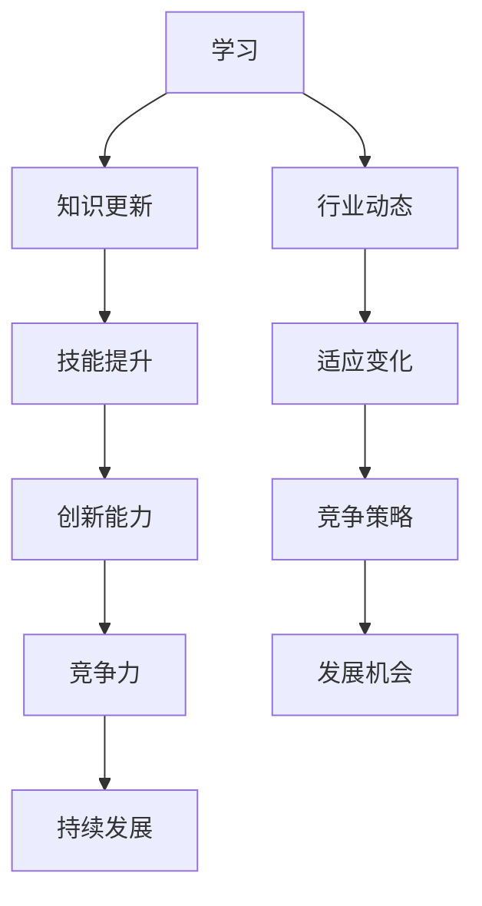

                 

### 《持续学习，跟进行业最新动态，保持竞争力》

> 关键词：持续学习、行业动态、个人竞争力、学习方法、技术趋势

> 摘要：本文将探讨在快速发展的IT行业，持续学习、紧跟行业最新动态以及如何保持个人竞争力的重要性。我们将详细分析学习的方法与实践、如何有效跟进行业动态，并提供实际操作与案例分析，帮助读者在技术领域保持领先地位。

### 引言与核心概念

#### 1.1 本书的目的与重要性

在当今这个技术日新月异的时代，持续学习对于每个IT从业者来说都是至关重要的。本书旨在阐述持续学习的重要性，以及如何通过跟进行业最新动态来保持个人竞争力。在这个信息爆炸的时代，个人竞争力的提升不仅依赖于已有的知识储备，更依赖于对行业动态的敏锐洞察力和快速适应能力。

**1.1.1 持续学习的重要性**

持续学习是个人职业发展的基础。随着技术的不断进步，新的编程语言、工具和框架层出不穷。如果停止学习，很快就会被行业淘汰。持续学习可以帮助我们：

- 保持技术领先
- 提高工作效率
- 增强解决问题的能力
- 拓宽视野，增强创新能力

**1.1.2 跟进行业最新动态的必要性**

跟进行业最新动态是了解技术发展趋势和前沿领域的重要途径。这包括：

- 新技术的出现
- 存在的技术如何改进
- 行业标准和规范的变化
- 新的商业应用场景

了解这些动态可以帮助我们：

- 及时调整学习方向
- 提早布局，抢占技术高点
- 在职业选择上更加有针对性
- 拓展新的业务机会

**1.1.3 如何保持个人竞争力**

个人竞争力的保持需要以下几个方面的努力：

- **技术深度**：不断深入学习掌握核心技术和原理
- **知识广度**：了解不同领域和交叉学科的知识
- **创新能力**：通过实践和创新不断提升自己的技能
- **个人品牌**：建立良好的个人品牌，提高行业知名度

#### 1.2 核心概念解析

**1.2.1 学习的本质与过程**

学习是一个获取、处理和应用信息的过程。它包括以下几个阶段：

- **信息收集**：通过各种渠道获取相关信息
- **理解与应用**：理解新信息并将其应用于实际问题
- **评估与反馈**：评估学习效果，获取反馈进行改进

**1.2.2 行业动态的分类与影响**

行业动态可以分为以下几个类别：

- **技术趋势**：影响未来技术发展方向
- **市场变化**：影响业务模式和市场策略
- **政策法规**：影响行业运营规范
- **社会文化**：影响技术应用场景和用户需求

了解这些动态可以帮助我们：

- 适应环境变化
- 制定合适的发展策略
- 提早发现潜在的商业机会

**1.2.3 竞争力的定义与构成**

竞争力是指个人或组织在市场中的竞争优势。它由以下几个因素构成：

- **技能与知识**：掌握核心技术和专业知识
- **创新能力**：能够不断创新，提供新的解决方案
- **个人品牌**：在行业内具有较高的知名度和影响力
- **资源整合能力**：能够有效整合内外部资源

#### Mermaid 流程图：学习与竞争力关系



### 持续学习的方法与实践

持续学习是一个系统化的过程，需要我们选择合适的方法并进行有效的实践。以下将介绍几种有效的学习方法以及如何跟进行业动态。

#### 2.1 学习方法

**2.1.1 自我驱动学习**

自我驱动学习是指通过自我激励和目标设定来推动学习进程。它包括以下几个步骤：

- **设定学习目标**：明确学习目的和期望成果
- **制定学习计划**：合理安排学习时间，确保学习进度
- **自我激励**：保持学习动力，克服学习过程中的困难
- **评估与反馈**：定期评估学习效果，获取反馈进行改进

**2.1.2 深度学习与广度学习**

深度学习是指深入掌握某一领域的知识和技能，而广度学习则是广泛涉猎不同领域的知识。两者各有优势：

- **深度学习**：有助于提升专业技能和解决问题的能力
- **广度学习**：有助于拓宽视野，增强创新思维

在实际学习中，我们应平衡深度学习和广度学习，根据个人需求和职业目标进行选择。

**2.1.3 混合学习方法**

混合学习方法是指结合不同学习方式的优点，进行综合学习。以下是一些常见的混合学习方法：

- **在线学习与线下学习相结合**：利用线上资源和线下实践相结合，提高学习效果
- **自主学习与团队合作相结合**：在自主学习的基础上，通过团队合作和讨论，深化理解
- **理论学习和实践操作相结合**：通过实践操作，加深对理论知识的理解和应用

**2.1.4 学习策略与技巧**

有效的学习策略可以提高学习效率，以下是一些常用的学习策略：

- **主动学习**：通过提问和讨论，主动获取知识
- **分散学习**：将学习内容分散在多个时间段进行学习，避免一次性消化过多信息
- **重复学习**：通过反复复习，加深对知识的理解和记忆
- **理解性学习**：不仅要记住信息，还要理解其背后的原理和逻辑关系

#### 2.2 跟进行业动态

**2.2.1 信息收集与筛选**

有效的信息收集和筛选是跟进行业动态的关键。以下是一些常用的方法：

- **阅读专业杂志和网站**：定期阅读行业内的专业杂志和网站，获取第一手资讯
- **关注行业领袖和专家**：通过社交媒体和行业活动，关注行业领袖和专家的动态
- **参加行业会议和研讨会**：通过参加行业会议和研讨会，了解最新的技术和趋势
- **利用大数据分析工具**：利用大数据分析工具，对行业数据进行挖掘和分析，获取有价值的洞察

**2.2.2 行业分析工具**

以下是一些常用的行业分析工具：

- **Google Trends**：通过分析搜索趋势，了解公众对特定话题的兴趣变化
- **TechCrunch**：提供最新的科技公司和产品动态
- **LinkedIn**：通过LinkedIn的职业动态，了解行业内的职业发展和人才流动
- **AI工具**：利用AI工具，进行文本分析和趋势预测

**2.2.3 建立个人知识网络**

建立个人知识网络可以帮助我们更好地跟进行业动态。以下是一些建议：

- **建立知识库**：整理和分类个人学习资料，建立个人知识库
- **定期更新**：定期更新知识库，确保信息的及时性和准确性
- **社交网络**：通过社交媒体和专业网络，与同行建立联系，共享知识和经验
- **学术交流**：参加学术会议和研讨会，与学术界保持紧密联系

**2.2.4 行业会议与论坛参与**

参加行业会议和论坛是了解行业动态和拓展人脉的重要途径。以下是一些建议：

- **提前准备**：提前了解会议议程和演讲者，做好参会准备
- **积极参与**：积极参与讨论和互动，扩大人脉圈
- **记录和总结**：会议结束后，及时记录和总结收获，形成知识体系

#### 2.3 保持竞争力的策略

**2.3.1 竞争力评估**

评估个人竞争力是保持竞争力的第一步。以下是一些评估方法：

- **技能评估**：通过在线测试和面试，评估自己的技术能力和知识水平
- **市场调研**：通过市场调研，了解行业对人才的需求和竞争态势
- **个人优势分析**：分析自己的优势，找到自己的核心竞争力

**2.3.2 个人品牌建设**

建立个人品牌可以帮助提高个人竞争力。以下是一些建议：

- **专业形象**：维护专业形象，保持良好的职业素养
- **社交媒体**：利用社交媒体，展示自己的专业能力和成就
- **撰写博客**：通过撰写专业博客，分享自己的知识和见解
- **参与开源项目**：参与开源项目，提升自己的技术水平

**2.3.3 职业发展规划**

明确的职业发展规划可以帮助我们更好地保持竞争力。以下是一些建议：

- **目标设定**：设定明确的职业目标，制定实现目标的计划
- **技能提升**：根据职业目标，不断提升自己的专业技能
- **行业适应**：适应行业变化，及时调整职业方向
- **持续学习**：保持持续学习，跟上行业发展趋势

**2.3.4 跨界合作与交流**

跨界合作和交流可以帮助我们拓展视野，提升竞争力。以下是一些建议：

- **跨学科学习**：学习跨学科的知识，增强创新能力
- **参与行业联盟**：参与行业联盟和论坛，与同行进行交流和合作
- **参加国际会议**：参加国际会议，了解国际市场和技术趋势
- **建立跨领域团队**：建立跨领域的团队，共同解决复杂问题

### 第三部分：实际操作与案例分析

在实际操作中，持续学习、跟进行业动态和保持竞争力需要具体的行动和实践。以下将提供三个实际案例，展示如何通过这些方法在IT领域取得成功。

#### 3.1 实践案例一：如何通过持续学习提升工作效率

**3.1.1 案例背景**

小明是一名软件工程师，他在一家大型科技公司工作。在工作中，他发现自己在一些新技术和工具上存在不足，导致工作效率低下。为了提升自己的竞争力，小明决定通过持续学习来提升工作效率。

**3.1.2 学习内容与方法**

小明选择了以下学习内容和方法：

- **深度学习**：选择了一门关于前端开发的在线课程，深入学习了React框架。
- **广度学习**：阅读了多本关于软件工程和项目管理方面的书籍，扩展了自己的知识面。
- **实践操作**：在项目中实际应用所学知识，不断积累经验。
- **知识分享**：通过写博客和参加技术分享会，与他人分享学习心得。

**3.1.3 案例结果与分析**

经过一段时间的持续学习，小明的工作效率显著提升。他不仅能够更快地完成工作任务，还能够在项目中提出创新性的解决方案。通过持续学习和实践，小明的个人品牌也得到了提升，得到了公司领导的认可和同事的尊重。

**3.2 实践案例二：如何跟进行业最新动态

**3.2.1 案例背景**

小李是一名数据分析师，他在一家互联网公司工作。随着大数据和人工智能技术的快速发展，小李意识到必须跟进行业最新动态，才能在竞争中保持优势。

**3.2.2 信息收集与分析**

小李采取了以下方法来跟进行业动态：

- **订阅专业杂志**：定期订阅《大数据时代》等专业杂志，获取行业资讯。
- **关注社交媒体**：通过LinkedIn和Twitter等社交媒体，关注行业专家和公司的动态。
- **参加行业会议**：参加行业会议和研讨会，了解最新的技术和趋势。
- **利用大数据分析工具**：通过Google Trends等工具，分析行业热点和趋势。

**3.2.3 行动计划与执行**

小李制定了一个详细的行动计划，包括：

- **每周阅读一篇专业文章**：提升自己的知识水平。
- **每月参加一次行业会议**：扩大人脉，获取行业资讯。
- **每季度更新一次知识库**：整理和更新自己的学习资料。

通过这些行动，小李能够及时了解行业动态，并迅速将其应用到实际工作中。他的数据分析报告得到了领导的赞赏，为公司带来了显著的业务增长。

**3.3 实践案例三：如何保持个人竞争力**

**3.3.1 案例背景**

张华是一名项目经理，他在一家跨国公司负责多个大型项目。随着市场竞争的加剧，张华意识到必须不断提升个人竞争力，才能在项目中脱颖而出。

**3.3.2 竞争力分析**

张华进行了以下竞争力分析：

- **技能评估**：通过在线测试，评估自己在项目管理、沟通能力和技术方面的能力。
- **市场调研**：通过调查，了解市场上对项目管理人才的需求。
- **个人优势分析**：分析自己在项目管理和团队领导方面的优势。

**3.3.3 策略实施与反馈**

张华制定了以下策略：

- **提升专业技能**：通过参加项目管理认证课程，提升自己的项目管理能力。
- **参加行业会议**：通过参加行业会议，扩大人脉，了解市场动态。
- **持续学习**：定期阅读项目管理相关的书籍和文章，保持知识的更新。

通过这些策略，张华在项目中表现出色，赢得了领导的信任和同事的尊重。他的个人品牌也在行业内得到了认可，为他带来了更多的职业机会。

### 伪代码示例：学习策略实现

```python
def learn_topic(topic):
    # 初始化学习资源
    resources = gather_resources(topic)
    
    # 自我驱动学习循环
    while not mastered_topic(topic):
        # 按照深度学习策略逐个资源学习
        for resource in resources:
            study_resource(resource)
        
        # 评估学习效果，调整学习策略
        adjust_strategy(topic)
        
    return "学习完成"

def gather_resources(topic):
    # 收集与主题相关的学习资源
    return ["书1", "书2", "在线课程"]

def study_resource(resource):
    # 学习资源中的内容
    print(f"正在学习：{resource}")

def mastered_topic(topic):
    # 判断是否掌握了主题
    return True

def adjust_strategy(topic):
    # 调整学习策略
    print("调整学习策略...")
```

### 代码案例分析

**3.4 案例分析一：使用GitHub跟踪技术趋势**

**3.4.1 案例背景**

小明是一名热衷于跟踪技术趋势的程序员。他希望通过GitHub的数据来分析当前最热门的技术趋势。

**3.4.2 GitHub API调用**

```python
import requests
import json

def get_trending_repos(language):
    url = f"https://github.com/trending/{language}"
    response = requests.get(url)
    if response.status_code == 200:
        repos = response.json()
        return repos
    else:
        return None

def analyze_repos(repos):
    # 分析最受欢迎的库
    print("Top trending repositories:")
    for repo in repos[:10]:
        print(repo['name'], repo['description'])

# 调用函数获取数据
trending_repos = get_trending_repos('python')
analyze_repos(trending_repos)
```

**3.4.3 代码实现**

在上面的代码中，我们使用GitHub API来获取指定语言（例如Python）的流行仓库列表。通过调用`get_trending_repos`函数，我们可以获取到最新的趋势数据。然后，通过`analyze_repos`函数，对获取的数据进行分析，输出前10个最受欢迎的仓库的名称和描述。

**3.4.4 结果分析**

通过分析GitHub的趋势数据，我们可以了解到当前Python领域最受欢迎的库，从而决定学习哪些技术或工具，以跟进行业动态。

```plaintext
Top trending repositories:
fastapi - Fast API, asynchronous web framework for Python that's fast as lightning.
aiohttp - asynchronous HTTP client/server framework for Python.
discord-py - A Python library for interacting with the Discord API.
redis - An in-memory data structure store, used as a database, cache and message broker.
pytorch - Tensors and dynamic computational graphs for deep learning.
pandas - Flexible and powerful data analysis toolkit for Python.
numpy - The fundamental package for scientific computing with Python.
sqlalchemy - SQL toolkit and Object Relational Mapping system for Python.
django - The web framework for perfectionists with deadlines.
flask - A micro web framework for Python.
```

这些结果告诉我们，异步编程、Web开发、数据库和深度学习等技术在Python领域非常受欢迎。因此，学习这些技术将有助于提升个人在IT行业的竞争力。

### 结语

在快速发展的IT行业，持续学习、跟进行业动态和保持竞争力是每个从业者的必修课。本文通过深入分析和实际案例，阐述了这些概念的重要性和具体实践方法。持续学习不仅可以提升我们的专业技能，还可以拓宽我们的视野，增强创新能力。跟进行业动态可以帮助我们把握技术趋势，及时调整发展方向。保持竞争力则需要我们不断提升自身实力，建立个人品牌，并积极寻求跨界合作。

让我们从现在开始，持续学习，紧跟行业动态，保持竞争力，共同迎接未来技术的挑战和机遇。作者：AI天才研究院/AI Genius Institute & 禅与计算机程序设计艺术 /Zen And The Art of Computer Programming。希望本文能够为您的职业发展提供有益的启示和帮助。

