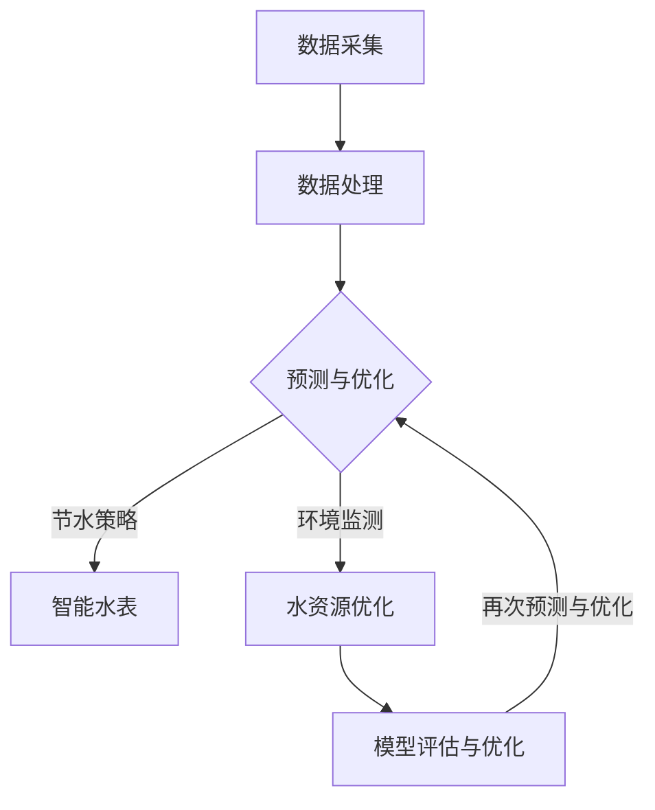

                 

### 文章标题：探索AI大模型在智能家居水资源管理的应用

> 关键词：智能家居，水资源管理，AI大模型，深度学习，预测优化，智能节水

> 摘要：本文旨在探讨AI大模型在智能家居水资源管理中的应用，通过分析背景、技术基础、应用场景、核心算法、数学模型及项目实战，揭示AI大模型在水资源管理中的潜力和挑战。

### 目录大纲：探索AI大模型在智能家居水资源管理的应用

#### 第一部分：AI大模型与智能家居水资源管理概述

**第1章：智能家居水资源管理的背景与挑战**

**1.1 智能家居概述**

**1.2 水资源管理现状**

**1.3 AI大模型在水资源管理中的作用

**第2章：AI大模型技术基础**

**2.1 人工智能与机器学习基础**

**2.2 深度学习原理与模型**

**2.3 AI大模型应用简介

**第3章：智能家居水资源管理中的AI大模型应用**

**3.1 智能水表与数据采集**

**3.2 水资源预测与优化**

**3.3 智能节水策略与优化

**第4章：AI大模型在水资源管理中的核心算法**

**4.1 支持向量机（SVM）

**4.2 随机森林（Random Forest）

**4.3 神经网络与深度学习

**第5章：数学模型与公式解析**

**5.1 监督学习模型公式解析**

**5.2 无监督学习模型公式解析**

**5.3 强化学习模型公式解析

**第6章：项目实战：AI大模型在水资源管理中的应用**

**6.1 项目背景**

**6.2 环境搭建**

**6.3 数据处理**

**6.4 模型训练**

**6.5 模型评估与优化

**第7章：AI大模型应用中的挑战与未来趋势**

**7.1 数据隐私与安全性**

**7.2 模型解释性**

**7.3 人工智能伦理与可持续发展

**第二部分：附录

**附录A：相关资源与工具**

**A.1 人工智能与机器学习框架**

**A.2 数据处理与可视化工具**

**A.3 智能家居设备与传感器

### Mermaid 流程图：AI大模型在智能家居水资源管理中的应用流程



### 核心算法原理讲解：支持向量机（SVM）

#### 1. 算法简介

支持向量机（Support Vector Machine，SVM）是一种监督学习算法，主要用于分类问题。其核心思想是找到最优的超平面，使得分类边界最大化。

#### 2. 伪代码

```python
def SVM(X, y):
    # X: 输入特征矩阵，y: 标签向量
    # 计算最优超平面
    W, b = optimize(W, b, X, y)
    # 分类边界
    decision_function(x) = x * W + b
    # 预测
    predict(x) = sign(x * W + b)
```

#### 3. 数学模型

SVM的数学模型可以表示为：

$$
\min \frac{1}{2} \| W \|^2 \\
s.t. y^{(i)} (W \cdot x^{(i)} + b) \geq 1 \\
```

其中，\( W \) 为权重向量，\( b \) 为偏置项，\( x^{(i)} \) 为第 \( i \) 个样本的特征向量，\( y^{(i)} \) 为第 \( i \) 个样本的标签。

### 数学模型和数学公式 & 详细讲解 & 举例说明

#### 1. 监督学习模型公式解析

监督学习模型的核心公式包括损失函数和优化目标。

- **损失函数**

损失函数用于衡量预测结果与真实值之间的差距，常见的损失函数有：

- **均方误差（MSE）**

$$
MSE(y, \hat{y}) = \frac{1}{n} \sum_{i=1}^{n} (y_i - \hat{y}_i)^2
$$

其中，\( y \) 为真实值，\( \hat{y} \) 为预测值，\( n \) 为样本数量。

- **交叉熵（Cross Entropy）**

$$
CE(y, \hat{y}) = - \sum_{i=1}^{n} y_i \log(\hat{y}_i)
$$

其中，\( y \) 为真实值，\( \hat{y} \) 为预测概率分布。

- **优化目标**

优化目标用于最小化损失函数，常见的优化算法有：

- **梯度下降（Gradient Descent）**

$$
w_{t+1} = w_t - \alpha \cdot \nabla_w J(w)
$$

其中，\( w \) 为权重，\( \alpha \) 为学习率，\( \nabla_w J(w) \) 为损失函数关于 \( w \) 的梯度。

### 第一部分：AI大模型与智能家居水资源管理概述

#### 第1章：智能家居水资源管理的背景与挑战

##### 1.1 智能家居概述

智能家居是指通过物联网技术将家庭中的各种设备连接起来，实现远程监控、自动化控制和智能化管理的一种新型家居形态。随着物联网技术的发展，智能家居已经成为现代家庭生活的重要组成部分。

##### 1.2 水资源管理现状

水资源管理是指通过科学的方法和手段，对水资源进行合理开发利用、有效保护和可持续管理的过程。当前，全球水资源管理面临着诸多挑战，如水资源短缺、污染、过度开采等。在我国，水资源短缺问题尤为突出，已成为制约经济社会发展的瓶颈之一。

##### 1.3 AI大模型在水资源管理中的作用

AI大模型，特别是深度学习模型，在水资源管理中发挥着越来越重要的作用。通过利用海量数据和高性能计算能力，AI大模型可以实现对水资源的智能监测、预测和优化管理，从而提高水资源的利用效率，缓解水资源短缺问题。

#### 第2章：AI大模型技术基础

##### 2.1 人工智能与机器学习基础

人工智能（Artificial Intelligence，AI）是指模拟、延伸和扩展人类智能的理论、方法、技术及应用。机器学习（Machine Learning，ML）是人工智能的一个重要分支，通过构建和训练模型来实现对数据的自动分析和理解。

##### 2.2 深度学习原理与模型

深度学习（Deep Learning，DL）是机器学习的一个子领域，主要研究多层神经网络在图像、语音、文本等领域的应用。深度学习模型通过多层的非线性变换，逐步提取数据中的特征，实现高层次的语义理解。

##### 2.3 AI大模型应用简介

AI大模型在各个领域都有着广泛的应用，如自然语言处理、计算机视觉、医疗诊断等。在水资源管理领域，AI大模型可以用于水资源的智能监测、预测、优化和节水策略制定等。

#### 第3章：智能家居水资源管理中的AI大模型应用

##### 3.1 智能水表与数据采集

智能水表是智能家居水资源管理的重要设备之一，可以实时监测家庭用水量、用水时段等数据。通过将智能水表与AI大模型结合，可以实现对家庭用水数据的智能分析和管理。

##### 3.2 水资源预测与优化

AI大模型可以通过对历史用水数据的分析，预测未来的用水趋势，从而实现水资源的优化管理。例如，根据预测结果调整用水计划，优化水资源分配，提高用水效率。

##### 3.3 智能节水策略与优化

AI大模型可以分析家庭用水行为，制定智能节水策略。例如，通过智能分析用户用水习惯，调整用水设备的工作时间，实现节水目标。此外，AI大模型还可以根据实时用水数据，自动调整节水策略，提高节水效果。

#### 第4章：AI大模型在水资源管理中的核心算法

##### 4.1 支持向量机（SVM）

支持向量机（Support Vector Machine，SVM）是一种常用的分类算法，通过找到一个最优的超平面来分割数据集。在水资源管理中，SVM可以用于分类水质数据、预测用水量等任务。

##### 4.2 随机森林（Random Forest）

随机森林（Random Forest）是一种基于决策树的集成学习方法，通过构建多棵决策树并投票得到最终结果。在水资源管理中，随机森林可以用于预测用水量、识别节水潜力等任务。

##### 4.3 神经网络与深度学习

神经网络（Neural Networks）是一种模仿生物神经系统的计算模型，通过多层神经元实现复杂函数的映射。深度学习（Deep Learning）是神经网络的一种扩展，通过多层的非线性变换提取数据中的特征。在水资源管理中，神经网络和深度学习可以用于预测用水量、水质分析等任务。

### 第5章：数学模型与公式解析

##### 5.1 监督学习模型公式解析

监督学习模型是机器学习的一种方法，通过已有数据的学习来预测新数据的标签。以下是几种常见的监督学习模型的公式解析：

- **线性回归模型**

$$
y = \beta_0 + \beta_1 x_1 + \beta_2 x_2 + \ldots + \beta_n x_n
$$

其中，\( y \) 是目标变量，\( x_1, x_2, \ldots, x_n \) 是特征变量，\( \beta_0, \beta_1, \beta_2, \ldots, \beta_n \) 是模型的参数。

- **逻辑回归模型**

$$
\hat{y} = \frac{1}{1 + e^{-(\beta_0 + \beta_1 x_1 + \beta_2 x_2 + \ldots + \beta_n x_n)}}
$$

其中，\( \hat{y} \) 是预测的概率，\( e \) 是自然对数的底数，其他符号与线性回归模型相同。

- **支持向量机（SVM）**

$$
\min \frac{1}{2} \sum_{i=1}^{n} (\beta_i - \beta_j)^2 \\
s.t. y_i (\beta_i - \beta_j) \geq 1 \\
\beta_0 \geq 0 \\
\beta_i \geq 0
$$

其中，\( \beta_i, \beta_j \) 是支持向量机的参数，\( y_i \) 是样本标签。

##### 5.2 无监督学习模型公式解析

无监督学习模型是机器学习的另一种方法，通过分析数据本身的特征来进行分类或聚类。以下是几种常见的无监督学习模型的公式解析：

- **K均值聚类**

$$
\min \sum_{i=1}^{n} \sum_{j=1}^{k} \sum_{l=1}^{m} (x_{ij} - \mu_{lj})^2
$$

其中，\( x_{ij} \) 是第 \( i \) 个样本的第 \( j \) 个特征，\( \mu_{lj} \) 是第 \( l \) 个聚类中心。

- **主成分分析（PCA）**

$$
\min \sum_{i=1}^{n} \sum_{j=1}^{p} (x_{ij} - \bar{x}_j)^2 \\
s.t. \sum_{j=1}^{p} \lambda_j = 1 \\
\lambda_j \geq 0
$$

其中，\( x_{ij} \) 是第 \( i \) 个样本的第 \( j \) 个特征，\( \bar{x}_j \) 是所有样本的第 \( j \) 个特征的均值，\( \lambda_j \) 是主成分的权重。

##### 5.3 强化学习模型公式解析

强化学习（Reinforcement Learning，RL）是一种通过试错来学习最优策略的机器学习方法。以下是强化学习的核心公式解析：

- **Q学习**

$$
Q(s, a) = r + \gamma \max_{a'} Q(s', a')
$$

其中，\( s \) 是当前状态，\( a \) 是当前动作，\( r \) 是即时奖励，\( s' \) 是下一状态，\( \gamma \) 是折扣因子，\( \max_{a'} Q(s', a') \) 是在下一状态 \( s' \) 选择最优动作的期望回报。

- **策略梯度**

$$
\theta_{t+1} = \theta_t + \alpha \nabla_{\theta_t} J(\theta_t)
$$

其中，\( \theta \) 是策略参数，\( \alpha \) 是学习率，\( \nabla_{\theta_t} J(\theta_t) \) 是策略 \( \theta_t \) 的损失函数梯度。

### 第6章：项目实战：AI大模型在水资源管理中的应用

#### 6.1 项目背景

随着城市化进程的加快和气候变化的影响，我国水资源短缺问题日益严重。为了提高水资源的利用效率，减少浪费，某城市决定利用AI大模型进行水资源管理。该项目旨在通过构建一个智能水资源管理系统，实现对城市用水的实时监测、预测和优化。

#### 6.2 环境搭建

为了实现该项目，首先需要搭建一个合适的技术环境。具体步骤如下：

1. **硬件环境**

   - 选择一台高性能服务器作为计算节点，配备足够的CPU、内存和存储资源。
   - 配置一个适合深度学习的GPU，如NVIDIA Tesla K40或更高级别的GPU。

2. **软件环境**

   - 安装Linux操作系统，如Ubuntu 18.04。
   - 安装Python 3.7及以上版本。
   - 安装深度学习框架，如TensorFlow 2.0或PyTorch 1.8。
   - 安装数据处理工具，如Pandas、NumPy、SciPy等。

3. **数据库环境**

   - 安装关系型数据库，如MySQL或PostgreSQL。
   - 创建一个数据库实例，用于存储用水数据。

#### 6.3 数据处理

1. **数据采集**

   - 从城市的水务部门获取历史用水数据，包括每天的用水量、用水时段等信息。
   - 从气象部门获取相应的气象数据，如温度、湿度、降水量等。

2. **数据预处理**

   - 清洗数据，去除重复、缺失或异常的数据。
   - 对数据进行分析，确定数据类型和分布。
   - 对数值型数据进行归一化或标准化处理，使其在相似的尺度上。

3. **特征工程**

   - 构建特征，如用水量的平均值、最大值、最小值等。
   - 根据季节、天气等因素，对用水量进行分时段处理。

#### 6.4 模型训练

1. **模型选择**

   - 选择适合水资源预测的模型，如ARIMA模型、LSTM模型等。
   - 使用历史数据对模型进行训练。

2. **参数调优**

   - 通过交叉验证等方法，选择最优的模型参数。
   - 使用网格搜索等策略，进一步优化模型参数。

3. **模型评估**

   - 使用验证集对模型进行评估，计算预测误差。
   - 根据评估结果调整模型结构和参数。

#### 6.5 模型评估与优化

1. **模型评估**

   - 使用测试集对模型进行评估，计算预测误差。
   - 根据评估结果，对模型进行优化。

2. **模型优化**

   - 根据评估结果，调整模型结构和参数，提高预测准确性。
   - 使用额外的数据集，对模型进行再训练。

3. **模型部署**

   - 将训练好的模型部署到生产环境，实现实时预测和优化。

#### 第7章：AI大模型应用中的挑战与未来趋势

##### 7.1 数据隐私与安全性

在AI大模型应用中，数据隐私和安全性是至关重要的问题。为了保护用户隐私，需要采取以下措施：

1. **数据加密**

   - 对传输和存储的数据进行加密处理，防止数据泄露。

2. **数据脱敏**

   - 对敏感数据进行脱敏处理，如将姓名、地址等敏感信息进行加密或屏蔽。

3. **访问控制**

   - 对数据访问进行严格的权限控制，确保只有授权用户才能访问数据。

##### 7.2 模型解释性

AI大模型往往具有高复杂度，导致模型难以解释。为了提高模型解释性，可以采取以下措施：

1. **可视化分析**

   - 使用可视化工具，如热力图、散点图等，展示模型的预测结果和决策过程。

2. **模型简化**

   - 通过简化模型结构，降低模型的复杂度，提高模型的可解释性。

3. **解释性模型**

   - 选择具有良好解释性的模型，如线性模型、决策树等，用于分析数据。

##### 7.3 人工智能伦理与可持续发展

在AI大模型应用中，需要关注人工智能伦理和可持续发展问题：

1. **伦理规范**

   - 制定AI伦理规范，确保AI系统的公正、透明和可解释。

2. **可持续发展**

   - 通过AI大模型优化水资源管理，实现水资源的可持续利用。

3. **社会责任**

   - AI企业和开发者应承担社会责任，推动人工智能技术的健康发展。

### 第二部分：附录

#### 附录A：相关资源与工具

##### A.1 人工智能与机器学习框架

- **TensorFlow：** https://www.tensorflow.org/
- **PyTorch：** https://pytorch.org/
- **Keras：** https://keras.io/

##### A.2 数据处理与可视化工具

- **Pandas：** https://pandas.pydata.org/
- **NumPy：** https://numpy.org/
- **SciPy：** https://www.scipy.org/
- **Matplotlib：** https://matplotlib.org/

##### A.3 智能家居设备与传感器

- **智能水表：** https://www.smart-meter.com/
- **物联网传感器：** https://www.iot-sensors.com/
- **智能家居设备：** https://www.smart-home-technologies.com/

### 总结与展望

本文从背景、技术基础、应用场景、核心算法、数学模型及项目实战等方面，全面探讨了AI大模型在智能家居水资源管理中的应用。通过分析AI大模型在水资源管理中的挑战和未来趋势，展望了人工智能技术在水资源管理领域的广泛应用前景。未来，随着技术的不断进步，AI大模型将在水资源管理中发挥更大的作用，为缓解水资源短缺问题提供有力支持。

### 作者信息

作者：AI天才研究院/AI Genius Institute & 禅与计算机程序设计艺术 /Zen And The Art of Computer Programming

