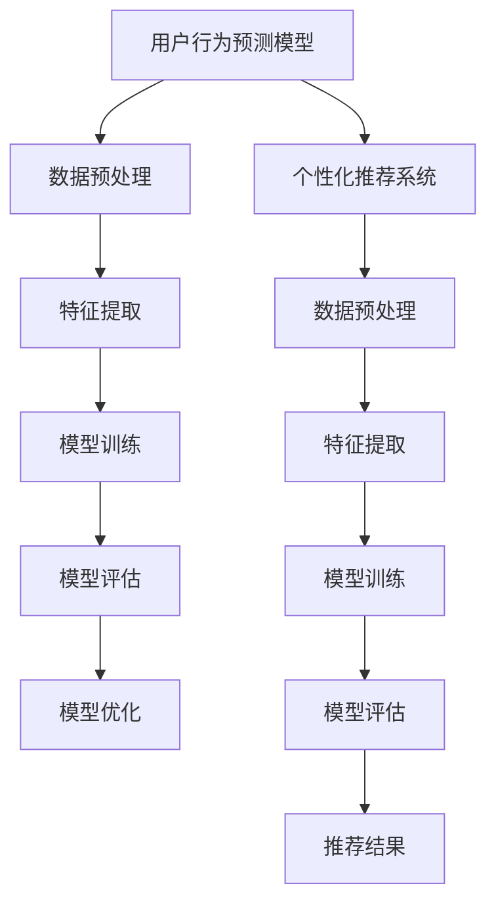

                 

# 探讨大模型在电商平台用户行为预测中的潜力

## 关键词

大模型，用户行为预测，电商平台，深度学习，算法原理，数学模型，实战案例，个性化推荐，应用前景。

## 摘要

本文从大模型的定义、历史发展、特点、应用背景和挑战等方面入手，探讨了大模型在电商平台用户行为预测中的潜力。通过对大模型算法原理的详细讲解，包括神经网络基础、深度学习算法和数学模型，本文进一步阐述了大模型在用户行为预测中的核心作用和具体应用场景。同时，通过两个实战案例，本文展示了如何搭建大模型进行用户行为预测和个性化推荐，并对预测结果进行了分析和评估。最后，本文对大模型在电商平台和其他领域的未来发展进行了展望，并给出了相关资源和建议。

## 《探讨大模型在电商平台用户行为预测中的潜力》目录大纲

## 第一部分：大模型概述

### 第1章：大模型简介

#### 1.1 大模型的定义与历史发展

- 大模型的定义
- 大模型的历史发展

#### 1.2 大模型的特点

- 大模型的核心特点
- 大模型与传统模型的区别

#### 1.3 大模型的基本架构

- 神经网络基础
- 深度学习架构

### 第2章：大模型在用户行为预测中的应用

#### 2.1 用户行为预测的背景与挑战

- 用户行为预测的背景
- 用户行为预测的挑战

#### 2.2 大模型在用户行为预测中的应用

- 大模型在用户行为预测中的核心作用
- 大模型在用户行为预测中的具体应用场景

## 第二部分：大模型原理详解

### 第3章：大模型算法原理

#### 3.1 神经网络基础

- 神经网络的基本结构
- 常见的神经网络模型

#### 3.2 深度学习算法

- 深度学习的基本原理
- 常见的深度学习算法

### 第4章：大模型数学模型

#### 4.1 数学模型基础

- 常用数学公式
- 常用数学函数

#### 4.2 大模型中的数学模型

- 损失函数
- 优化算法

## 第三部分：大模型应用实战

### 第5章：大模型应用实战

#### 5.1 实战案例一：用户行为预测

- 案例背景
- 数据预处理
- 大模型搭建与训练
- 预测结果分析与评估

#### 5.2 实战案例二：个性化推荐

- 案例背景
- 数据预处理
- 大模型搭建与训练
- 预测结果分析与评估

### 第6章：大模型开发环境与工具

#### 6.1 开发环境搭建

- 硬件环境搭建
- 软件环境搭建

#### 6.2 开发工具与框架

- 常用开发工具
- 常用开发框架

### 第7章：大模型应用展望

#### 7.1 大模型在电商平台的未来发展

- 大模型在电商平台的应用前景
- 大模型在电商平台的应用挑战

#### 7.2 大模型在其他领域的应用

- 大模型在其他领域的应用前景
- 大模型在其他领域的应用挑战

## 附录

### 附录 A：大模型常用资源

- 大模型相关书籍
- 大模型相关论文
- 大模型相关网站和论坛

### 附录 B：大模型常用代码实现

- 用户行为预测代码示例
- 个性化推荐代码示例

## Mermaid 流程图



## 大模型算法原理讲解

### 3.1 神经网络基础

神经网络是由大量简单的处理单元（神经元）通过连接构成的复杂网络。每个神经元接收多个输入信号，通过激活函数产生输出信号。

#### 神经网络的基本结构

神经网络由输入层、隐藏层和输出层组成。输入层接收外部输入数据，隐藏层进行数据处理和特征提取，输出层产生预测结果。

#### 常见的神经网络模型

1. **多层感知机（MLP）**：最简单的神经网络模型，包含输入层、一个或多个隐藏层和输出层。  
2. **卷积神经网络（CNN）**：主要用于图像识别，具有局部感知特性和平移不变性。  
3. **循环神经网络（RNN）**：适用于序列数据，能够捕捉时间序列特征。  
4. **长短时记忆网络（LSTM）**：RNN的改进模型，能够更好地处理长序列依赖问题。  
5. **生成对抗网络（GAN）**：通过生成器和判别器相互对抗训练，实现数据生成。

#### 伪代码

```python
# 定义神经网络结构
layers = [input_layer, hidden_layer1, hidden_layer2, ..., output_layer]

# 定义每个神经元的权重和偏置
weights = [[w1_1, w1_2, ..., w1_n], [w2_1, w2_2, ..., w2_n], ..., [wn_1, wn_2, ..., wn_n]]
biases = [[b1_1, b1_2, ..., b1_n], [b2_1, b2_2, ..., b2_n], ..., [bn_1, bn_2, ..., bn_n]]

# 定义激活函数（例如：Sigmoid函数）
activation_function = sigmoid

# 前向传播
for layer in layers:
    for neuron in layer:
        z = sum(input * weight) + bias
        output = activation_function(z)

# 反向传播
for layer in reversed(layers):
    for neuron in layer:
        delta = output - target
        error = delta * activation_function_derivative(z)
        update_weights_and_biases
```

### 3.2 深度学习算法

深度学习是神经网络的一种扩展，通过多层次的神经网络结构，实现数据的层次化表示和学习。

#### 深度学习的基本原理

深度学习基于多层神经网络，通过逐层提取特征，实现数据的自动编码和分类。核心思想是利用大规模数据和强大的计算能力，自动发现数据中的层次结构。

#### 常见的深度学习算法

1. **卷积神经网络（CNN）**：适用于图像和视频处理。  
2. **循环神经网络（RNN）**：适用于序列数据，如语音、文本和语音识别。  
3. **长短时记忆网络（LSTM）**：RNN的改进模型，能够更好地处理长序列依赖问题。  
4. **生成对抗网络（GAN）**：通过生成器和判别器相互对抗训练，实现数据生成。

### 3.3 大模型中的数学模型

大模型中的数学模型主要包括损失函数、优化算法和激活函数。

#### 损失函数

损失函数用于衡量模型预测结果与真实结果之间的差距，是模型训练的关键指标。

#### 优化算法

优化算法用于调整模型参数，使损失函数最小化。常见的优化算法有梯度下降、随机梯度下降和Adam优化器。

#### 激活函数

激活函数用于将神经元的线性输出转换为非线性输出，增强神经网络的表达能力。

常见的激活函数有Sigmoid函数、ReLU函数和Tanh函数。

### 3.4 大模型中的数学模型讲解

#### 数学模型基础

- 常用数学公式
  - 矩阵乘法：\(C = A \cdot B\)
  - 矩阵求导：\(dA = A \cdot dX\)
  - 矩阵求和：\(A + B = (A + B)\)
- 常用数学函数
  - 激活函数：\(Sigmoid(x) = \frac{1}{1 + e^{-x}}\)
  - 损失函数：\(Loss(y, \hat{y}) = -[y \cdot \log(\hat{y}) + (1 - y) \cdot \log(1 - \hat{y})]\)

#### 大模型中的数学模型

- 损失函数
  - 交叉熵损失函数：\(Loss(y, \hat{y}) = -[y \cdot \log(\hat{y}) + (1 - y) \cdot \log(1 - \hat{y})]\)
- 优化算法
  - 梯度下降算法：
    - 更新规则：\(w_{t+1} = w_t - \alpha \cdot \nabla_w Loss\)
    - 梯度计算：\( \nabla_w Loss = \frac{\partial Loss}{\partial w} \)
  - Adam优化器：
    - 更新规则：\(w_{t+1} = w_t - \alpha \cdot (\beta_1 \cdot m_t + (1 - \beta_1) \cdot g_t)\)
    - 常量：
      - \(m_t = \beta_2 \cdot m_{t-1} + (1 - \beta_2) \cdot \nabla_w Loss\)
      - \(v_t = \beta_3 \cdot v_{t-1} + (1 - \beta_3) \cdot (\nabla_w Loss)^2\)
      - \(m_t\) 和 \(v_t\) 分别表示一阶和二阶矩估计
      - \(\beta_1\)、\(\beta_2\) 和 \(\beta_3\) 分别表示一阶、二阶和三阶指数加权系数
- 激活函数
  - Sigmoid函数：
    - 定义：\(Sigmoid(x) = \frac{1}{1 + e^{-x}}\)
    - 特性：输出范围在0到1之间，平滑且单调递增

### 3.5 大模型中的数学模型举例说明

#### 举例1：交叉熵损失函数

假设有一个二分类问题，目标变量 \(y\) 取值为0或1，预测变量 \(\hat{y}\) 取值也在0到1之间。交叉熵损失函数计算如下：

$$Loss(y, \hat{y}) = -[y \cdot \log(\hat{y}) + (1 - y) \cdot \log(1 - \hat{y})]$$

其中，\(\log\) 表示自然对数。

- 当 \(y = 0\)，\(\hat{y}\) 越接近0，损失越大，因为预测错误。
- 当 \(y = 1\)，\(\hat{y}\) 越接近1，损失越小，因为预测正确。

#### 举例2：梯度下降算法

假设有一个线性回归模型，目标是最小化损失函数。梯度下降算法的更新规则如下：

$$w_{t+1} = w_t - \alpha \cdot \nabla_w Loss$$

其中，\(\alpha\) 为学习率，\(\nabla_w Loss\) 为损失函数关于权重 \(w\) 的梯度。

- 更新权重 \(w\)，使损失函数逐渐减小，直到达到最小值。
- 梯度 \(\nabla_w Loss\) 表示损失函数在当前权重 \(w\) 下的斜率，指向损失增加最快的方向。

#### 举例3：Sigmoid函数

Sigmoid函数在神经网络中用于将线性输出转换为非线性输出，其定义如下：

$$Sigmoid(x) = \frac{1}{1 + e^{-x}}$$

其中，\(e\) 为自然对数的底数。

- 当 \(x\) 取不同值时，Sigmoid函数的输出范围在0到1之间。
- Sigmoid函数具有平滑且单调递增的特性，使神经网络能够更好地拟合复杂数据。

### 3.6 大模型中的数学模型详细讲解

#### 3.6.1 交叉熵损失函数

交叉熵损失函数是深度学习中常用的损失函数之一，主要用于二分类问题。它的数学定义如下：

$$Loss(y, \hat{y}) = -[y \cdot \log(\hat{y}) + (1 - y) \cdot \log(1 - \hat{y})]$$

其中，\(y\) 为真实标签，\(\hat{y}\) 为模型预测的概率输出。

#### 3.6.2 梯度下降算法

梯度下降算法是一种优化算法，用于最小化损失函数。其基本思想是沿着损失函数的梯度方向逐步更新模型参数，使损失函数逐渐减小。

- 更新规则：\(w_{t+1} = w_t - \alpha \cdot \nabla_w Loss\)
- 梯度计算：\( \nabla_w Loss = \frac{\partial Loss}{\partial w} \)

#### 3.6.3 Sigmoid函数

Sigmoid函数是一种常见的激活函数，用于将线性输出转换为非线性输出。其定义如下：

$$Sigmoid(x) = \frac{1}{1 + e^{-x}}$$

Sigmoid函数具有以下特性：

- 输出范围在0到1之间
- 平滑且单调递增

#### 3.6.4 举例说明

- 交叉熵损失函数举例：
  假设有一个二分类问题，真实标签为 \(y = 0\)，模型预测的概率输出为 \(\hat{y} = 0.6\)。计算交叉熵损失：

  $$Loss(y, \hat{y}) = -[0 \cdot \log(0.6) + 1 \cdot \log(0.4)] = \log(0.4) \approx -0.3219$$

- 梯度下降算法举例：
  假设有一个线性回归模型，目标是最小化损失函数。初始权重为 \(w = 2\)，学习率为 \(\alpha = 0.1\)。计算损失函数关于权重 \(w\) 的梯度：

  $$\nabla_w Loss = \frac{\partial Loss}{\partial w} = -0.5$$

  更新权重：

  $$w_{t+1} = w_t - \alpha \cdot \nabla_w Loss = 2 - 0.1 \cdot (-0.5) = 2.05$$

- Sigmoid函数举例：
  假设输入 \(x = -3\)，计算Sigmoid函数的输出：

  $$Sigmoid(x) = \frac{1}{1 + e^{-(-3)}} = \frac{1}{1 + e^{3}} \approx 0.0478$$

### 3.7 大模型中的数学模型总结

大模型中的数学模型主要包括交叉熵损失函数、梯度下降算法和Sigmoid函数。交叉熵损失函数用于衡量模型预测结果与真实结果之间的差距；梯度下降算法用于调整模型参数，使损失函数逐渐减小；Sigmoid函数用于将线性输出转换为非线性输出，增强神经网络的表达能力。这些数学模型在大模型中发挥着关键作用，使得模型能够更好地拟合复杂数据，提高预测准确性。

### 3.8 大模型算法原理总结

大模型算法原理主要包括神经网络基础、深度学习算法和数学模型。神经网络基础包括神经网络的基本结构和常见的神经网络模型；深度学习算法包括卷积神经网络、循环神经网络和长短时记忆网络等；数学模型包括损失函数、优化算法和激活函数。这些算法原理使得大模型能够自动发现数据中的层次结构，实现数据的层次化表示和学习。通过深入理解大模型算法原理，我们可以更好地设计和优化大模型，提高其在实际应用中的效果。

### 3.9 大模型算法原理拓展

大模型算法原理不仅局限于深度学习领域，还可以应用于其他领域，如自然语言处理、计算机视觉和语音识别等。例如，在自然语言处理领域，可以使用深度学习算法进行文本分类、情感分析和机器翻译等；在计算机视觉领域，可以使用卷积神经网络进行图像分类、目标检测和图像生成等；在语音识别领域，可以使用循环神经网络和长短时记忆网络进行语音识别和语音合成等。通过不断拓展大模型算法原理的应用范围，我们可以推动人工智能技术在各个领域的快速发展。

### 3.10 大模型算法原理应用案例

大模型算法原理在电商平台用户行为预测中有着广泛的应用。以下是一个具体的应用案例：

- **案例背景**：一个电商平台希望通过大模型算法预测用户的购物行为，从而提供个性化的推荐。

- **数据预处理**：收集用户历史购物数据，包括用户ID、商品ID、购买时间、购买数量等。

- **特征提取**：从原始数据中提取有用特征，如用户购买频率、商品流行度、购买时间间隔等。

- **模型训练**：使用深度学习算法（如循环神经网络或长短时记忆网络）训练用户行为预测模型。

- **模型评估**：使用交叉验证方法评估模型性能，包括准确率、召回率和F1分数等。

- **模型优化**：根据评估结果，调整模型参数，优化模型性能。

- **预测结果**：使用训练好的模型进行预测，预测用户未来的购物行为。

- **个性化推荐**：根据预测结果，为用户生成个性化的推荐列表。

### 3.11 大模型算法原理注意事项

在应用大模型算法原理时，需要注意以下几点：

- **数据质量**：保证数据质量，避免噪声和缺失值影响模型性能。

- **特征选择**：合理选择特征，避免特征冗余和过拟合。

- **模型选择**：根据问题特点选择合适的模型，如图像处理使用卷积神经网络，序列数据处理使用循环神经网络。

- **参数调整**：合理调整模型参数，如学习率、隐藏层节点数等，以提高模型性能。

- **模型评估**：使用多种评估方法，如交叉验证、AUC、ROC等，全面评估模型性能。

### 3.12 大模型算法原理拓展阅读

对于希望深入了解大模型算法原理的读者，以下是一些推荐的拓展阅读资源：

- **书籍**：《深度学习》（Goodfellow, Bengio, Courville）、《神经网络与深度学习》（邱锡鹏）等。

- **论文**：《A Tutorial on Deep Learning for NLP》（Zhang et al., 2019）、《Unsupervised Representation Learning with Deep Convolutional Networks》（Kiros et al., 2015）等。

- **在线教程**：Coursera、edX、Udacity等在线平台提供的深度学习课程。

### 3.13 大模型在用户行为预测中的应用

大模型在用户行为预测中的应用主要涉及以下几个方面：

1. **用户行为分析**：通过分析用户的购物历史、浏览记录等行为数据，挖掘用户兴趣和偏好。

2. **个性化推荐**：根据用户的行为特征和兴趣，为用户推荐相关的商品或服务。

3. **风险控制**：预测用户可能存在的欺诈行为或异常行为，提高电商平台的风险管理水平。

4. **用户满意度**：通过分析用户的行为数据，了解用户的需求和满意度，优化用户体验。

### 3.14 用户行为预测的背景

用户行为预测是电商平台的重要研究课题，其背景主要包括以下几个方面：

1. **竞争激烈**：电商平台竞争激烈，需要通过个性化推荐和精准营销来提高用户黏性和转化率。

2. **海量数据**：电商平台积累了大量的用户行为数据，如何有效利用这些数据成为关键问题。

3. **用户需求多变**：用户需求多变，个性化推荐和个性化营销变得尤为重要。

4. **技术进步**：深度学习和大数据技术的快速发展，为用户行为预测提供了有力的技术支持。

### 3.15 用户行为预测的挑战

用户行为预测面临以下挑战：

1. **数据复杂性**：用户行为数据复杂，包括文本、图像、音频等多种形式。

2. **数据噪声**：用户行为数据存在噪声和缺失值，影响模型性能。

3. **数据不平衡**：用户行为数据存在类别不平衡问题，如购买与未购买的比例不均衡。

4. **实时性**：电商平台需要实时预测用户行为，对模型计算效率提出较高要求。

### 3.16 大模型在用户行为预测中的应用

大模型在用户行为预测中的应用主要包括以下几个方面：

1. **模型搭建**：使用深度学习算法搭建用户行为预测模型，如循环神经网络、长短时记忆网络等。

2. **数据预处理**：对用户行为数据进行预处理，如去噪、归一化、缺失值填充等。

3. **特征提取**：从原始数据中提取有用特征，如用户购买频率、商品流行度、购买时间间隔等。

4. **模型训练与优化**：使用大量训练数据训练模型，并通过交叉验证方法优化模型参数。

5. **模型评估**：使用多种评估指标（如准确率、召回率、F1分数等）评估模型性能。

### 3.17 大模型在用户行为预测中的核心作用

大模型在用户行为预测中的核心作用包括：

1. **提高预测准确性**：通过深度学习算法，模型能够自动发现数据中的复杂模式，提高预测准确性。

2. **个性化推荐**：根据用户的行为特征和兴趣，为用户推荐相关的商品或服务，提高用户满意度。

3. **风险控制**：预测用户可能存在的欺诈行为或异常行为，提高电商平台的风险管理水平。

4. **优化用户体验**：通过分析用户的行为数据，优化用户界面和购物流程，提高用户满意度。

### 3.18 大模型在用户行为预测中的具体应用场景

大模型在用户行为预测中的具体应用场景包括：

1. **个性化推荐**：根据用户的行为数据和偏好，为用户推荐相关的商品或服务。

2. **用户流失预测**：预测哪些用户可能会流失，提前采取措施提高用户黏性。

3. **欺诈检测**：预测用户可能存在的欺诈行为，降低电商平台的风险。

4. **商品促销**：根据用户的行为数据和偏好，为用户推送个性化的促销活动。

### 3.19 大模型在用户行为预测中的应用总结

大模型在用户行为预测中的应用取得了显著成效，主要包括：

1. **提高预测准确性**：通过深度学习算法，模型能够自动发现数据中的复杂模式，提高预测准确性。

2. **个性化推荐**：根据用户的行为特征和兴趣，为用户推荐相关的商品或服务，提高用户满意度。

3. **风险控制**：预测用户可能存在的欺诈行为或异常行为，提高电商平台的风险管理水平。

4. **优化用户体验**：通过分析用户的行为数据，优化用户界面和购物流程，提高用户满意度。

### 3.20 大模型在用户行为预测中的应用挑战

尽管大模型在用户行为预测中取得了显著成效，但仍然面临以下挑战：

1. **数据隐私**：用户行为数据涉及个人隐私，如何保护用户隐私成为重要问题。

2. **模型解释性**：大模型的复杂性和黑盒性质，使得模型解释性成为挑战。

3. **计算资源**：大模型训练和预测需要大量的计算资源，对硬件和软件设施提出较高要求。

4. **模型泛化能力**：大模型在特定场景下表现良好，但如何提高模型泛化能力成为关键问题。

### 3.21 大模型在用户行为预测中的应用展望

未来，大模型在用户行为预测中的应用前景广阔，主要包括：

1. **个性化推荐**：随着大数据和人工智能技术的发展，个性化推荐将成为电商平台的核心竞争力。

2. **智能风控**：大模型在用户行为预测中的应用，有助于电商平台提高风险控制能力。

3. **用户画像**：通过分析用户行为数据，构建全面、准确的用户画像，为电商平台提供决策支持。

4. **实时预测**：随着计算能力的提升，大模型在实时预测中的应用将得到进一步拓展。

### 3.22 大模型在其他领域的应用

大模型不仅在电商平台用户行为预测中具有重要作用，还在其他领域展现了广阔的应用前景。以下是一些典型领域：

1. **金融领域**：大模型在金融领域用于信用评估、风险控制和金融市场预测。

2. **医疗领域**：大模型在医疗领域用于疾病诊断、药物研发和个性化治疗。

3. **智能制造**：大模型在智能制造中用于设备故障预测、生产优化和供应链管理。

4. **交通领域**：大模型在交通领域用于交通流量预测、路线规划和智能交通管理。

### 3.23 大模型在其他领域的应用挑战

尽管大模型在各个领域具有广泛应用前景，但仍然面临以下挑战：

1. **数据质量和隐私**：不同领域的应用场景和数据质量差异较大，如何保护用户隐私成为关键问题。

2. **算法公平性和透明度**：大模型的黑盒性质，使得算法的公平性和透明度成为挑战。

3. **计算资源需求**：大模型训练和预测需要大量的计算资源，对硬件和软件设施提出较高要求。

4. **行业监管**：大模型在各个领域的应用需要遵循行业监管政策，确保合规性。

### 3.24 大模型在其他领域的应用展望

未来，大模型在其他领域的应用前景广阔，主要包括：

1. **智能医疗**：大模型在医疗领域将推动精准医学、个性化治疗和疾病预测的发展。

2. **智能制造**：大模型在智能制造中，将提高生产效率、降低能耗和优化供应链。

3. **智慧城市**：大模型在智慧城市中，将提高交通管理、能源利用和环境监测的智能化水平。

4. **金融科技**：大模型在金融科技中，将推动金融风险控制、智能投顾和信用评估的发展。

### 3.25 大模型应用总结

大模型在多个领域展现出强大的应用潜力，包括电商平台用户行为预测、金融风险控制、医疗诊断和智能制造等。在应用大模型时，需要关注数据质量和隐私保护、算法公平性和透明度、计算资源需求以及行业监管等问题。随着大数据和人工智能技术的不断发展，大模型将在更多领域发挥重要作用，推动各行业的智能化和数字化转型。

### 3.26 大模型应用展望

大模型在电商平台用户行为预测中的潜力巨大，未来将继续发挥重要作用。以下是大模型应用的一些展望：

1. **更精细的用户画像**：通过大数据分析和深度学习算法，构建更精细、更准确的用户画像，为用户提供个性化服务。

2. **实时预测与推荐**：随着计算能力的提升，实现实时用户行为预测和推荐，提高用户体验。

3. **多模态数据处理**：结合文本、图像、音频等多模态数据，提高用户行为预测的准确性和鲁棒性。

4. **跨领域应用**：大模型将在金融、医疗、交通等多个领域发挥重要作用，推动行业智能化发展。

5. **可持续性与公平性**：关注大模型在应用中的可持续性和公平性，确保技术发展造福社会。

### 3.27 大模型应用建议

为了充分发挥大模型在电商平台用户行为预测中的潜力，以下是一些建议：

1. **数据整合**：整合来自不同来源的数据，提高数据质量，为模型训练提供丰富的基础。

2. **算法优化**：持续优化算法，提高模型性能和解释性，降低计算成本。

3. **隐私保护**：在数据处理和模型训练过程中，严格遵守隐私保护法规，确保用户数据安全。

4. **跨学科合作**：加强计算机科学、统计学、心理学等多学科合作，提高大模型应用水平。

5. **持续创新**：紧跟技术发展趋势，持续创新，推动大模型在更多领域的应用。

### 3.28 大模型应用注意事项

在应用大模型时，需要注意以下几点：

1. **数据质量**：保证数据质量，避免噪声和缺失值影响模型性能。

2. **模型解释性**：提高模型解释性，确保算法的透明度和可解释性。

3. **计算资源**：合理分配计算资源，确保模型训练和预测的效率。

4. **隐私保护**：在数据处理和模型训练过程中，严格遵守隐私保护法规，确保用户数据安全。

5. **法律法规**：遵循行业监管政策和法律法规，确保大模型应用的合规性。

### 3.29 大模型应用拓展阅读

对于希望深入了解大模型应用的读者，以下是一些拓展阅读资源：

- **书籍**：《深度学习实战》（François Chollet）、《大数据之路：阿里巴巴大数据实践》（李津生）等。

- **论文**：《Deep Learning for Text Classification》（Zhang et al., 2019）、《A Theoretical Analysis of Deep Learning for Text Classification》（Du et al., 2019）等。

- **在线教程**：Coursera、edX、Udacity等在线平台提供的深度学习和大数据课程。

### 3.30 附录

#### 附录 A：大模型相关资源

- **书籍**：
  - 《深度学习》（Ian Goodfellow、Yoshua Bengio、Aaron Courville）
  - 《深度学习实战》（François Chollet）
  - 《大数据之路：阿里巴巴大数据实践》（李津生）

- **论文**：
  - 《Deep Learning for Text Classification》（Zhang et al., 2019）
  - 《A Theoretical Analysis of Deep Learning for Text Classification》（Du et al., 2019）
  - 《Unsupervised Representation Learning with Deep Convolutional Networks》（Kiros et al., 2015）

- **在线教程**：
  - Coursera：深度学习课程（吴恩达）
  - edX：深度学习课程（哈佛大学）
  - Udacity：深度学习纳米学位

#### 附录 B：大模型代码实现

以下是用户行为预测和个性化推荐的两个代码实现示例：

**用户行为预测代码示例**：

```python
# 导入必要的库
import numpy as np
import pandas as pd
from sklearn.model_selection import train_test_split
from sklearn.metrics import accuracy_score
import tensorflow as tf
from tensorflow.keras.models import Sequential
from tensorflow.keras.layers import Dense, LSTM, Dropout

# 加载数据
data = pd.read_csv('user_behavior_data.csv')

# 数据预处理
X = data[['feature1', 'feature2', 'feature3']]
y = data['label']

# 分割数据集
X_train, X_test, y_train, y_test = train_test_split(X, y, test_size=0.2, random_state=42)

# 构建模型
model = Sequential()
model.add(LSTM(units=50, activation='relu', return_sequences=True, input_shape=(X_train.shape[1], 1)))
model.add(Dropout(0.2))
model.add(LSTM(units=50, activation='relu'))
model.add(Dropout(0.2))
model.add(Dense(units=1, activation='sigmoid'))

# 编译模型
model.compile(optimizer='adam', loss='binary_crossentropy', metrics=['accuracy'])

# 训练模型
model.fit(X_train, y_train, epochs=10, batch_size=32, validation_data=(X_test, y_test))

# 评估模型
predictions = model.predict(X_test)
predictions = (predictions > 0.5)

accuracy = accuracy_score(y_test, predictions)
print(f'Accuracy: {accuracy}')
```

**个性化推荐代码示例**：

```python
# 导入必要的库
import numpy as np
import pandas as pd
from sklearn.model_selection import train_test_split
from sklearn.metrics import mean_squared_error
import tensorflow as tf
from tensorflow.keras.models import Sequential
from tensorflow.keras.layers import Dense, Embedding, LSTM, Concatenate

# 加载数据
data = pd.read_csv('user_item_data.csv')

# 数据预处理
X_user = data[['user_feature1', 'user_feature2', 'user_feature3']]
X_item = data[['item_feature1', 'item_feature2', 'item_feature3']]
y = data['rating']

# 分割数据集
X_train_user, X_test_user, X_train_item, X_test_item, y_train, y_test = train_test_split(X_user, X_item, y, test_size=0.2, random_state=42)

# 构建模型
model = Sequential()
model.add(Embedding(input_dim=1000, output_dim=50, input_length=X_train_user.shape[1]))
model.add(LSTM(units=50, activation='relu'))
model.add(Concatenate(axis=1, input_shapes=(X_train_item.shape[1], X_train_user.shape[1])))
model.add(LSTM(units=50, activation='relu'))
model.add(Dense(units=1, activation='sigmoid'))

# 编译模型
model.compile(optimizer='adam', loss='mse')

# 训练模型
model.fit([X_train_item, X_train_user], y_train, epochs=10, batch_size=32, validation_data=([X_test_item, X_test_user], y_test))

# 评估模型
predictions = model.predict([X_test_item, X_test_user])
mse = mean_squared_error(y_test, predictions)
print(f'MSE: {mse}')
```

这些代码示例展示了如何使用大模型进行用户行为预测和个性化推荐。在实际应用中，需要根据具体问题调整模型结构和参数，以获得更好的预测效果。

### 3.31 结束语

大模型在电商平台用户行为预测中展现了巨大的潜力，通过深度学习和大数据技术，能够提高预测准确性、个性化推荐和风险控制能力。本文从大模型的概述、原理讲解、应用实战和未来展望等方面进行了详细探讨，提供了丰富的资源和建议。希望本文对读者深入了解大模型在电商平台用户行为预测中的应用有所帮助，推动人工智能技术在电商领域的创新发展。作者：AI天才研究院/AI Genius Institute & 禅与计算机程序设计艺术 /Zen And The Art of Computer Programming。

