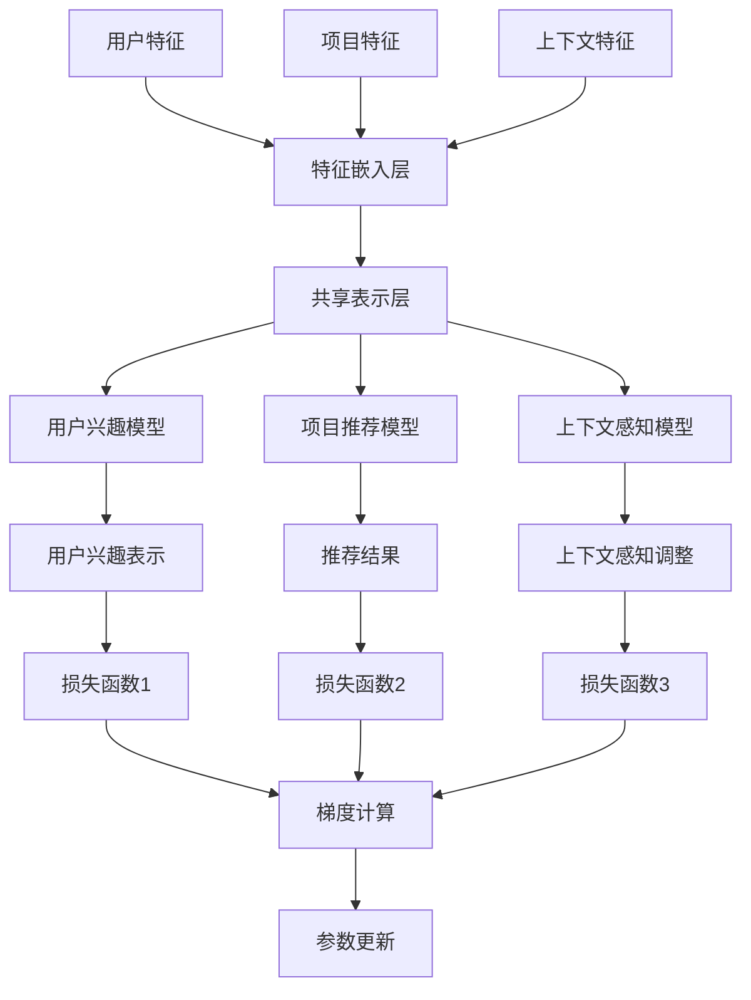

                 


### 引言

在当今的信息时代，推荐系统（Recommender Systems）已经成为各类在线平台的核心功能之一。从电子商务网站到社交媒体平台，从音乐流媒体到视频网站，推荐系统通过个性化推荐，帮助用户发现他们可能感兴趣的内容，从而提高了用户满意度和平台粘性。随着用户生成内容（User-Generated Content）的爆炸式增长，如何有效地从海量数据中挖掘出有价值的信息成为了一个亟待解决的问题。

推荐系统的核心在于预测用户对未知项目的偏好。这通常涉及用户行为数据、内容特征、上下文信息等多方面的信息处理。然而，传统的单一任务学习（Single-Task Learning）方法在处理复杂问题时往往显得力不从心。单一任务学习模型仅专注于单一预测任务，例如预测用户的点击行为或购买行为，而在处理多个相关任务时，可能会错过一些潜在的信息关联，导致推荐效果不佳。

为了克服这一限制，多任务学习（Multi-Task Learning，MTL）技术应运而生。多任务学习允许模型同时学习多个相关任务，通过共享表示和参数，挖掘出不同任务之间的潜在关联，从而提高推荐系统的性能。本文将深入探讨多任务学习技术在推荐系统中的应用，旨在为读者提供一个系统性的理解和实际操作的指南。

本文首先介绍推荐系统的基础概念和基本模型，然后详细阐述多任务学习技术的原理、挑战和优势。接着，本文将分别介绍基于协同过滤、内容表示和深度学习的多任务学习技术，并通过实际案例进行分析。此外，本文还将探讨多任务学习在个性化推荐中的应用和实验评估方法。最后，本文将展望多任务学习在推荐系统中的未来发展趋势，并提供实践指南和建议。

### 关键词

- 推荐系统
- 多任务学习
- 协同过滤
- 内容表示
- 深度学习
- 个性化推荐
- 数据挖掘
- 模型优化
- 用户体验
- 实验设计

### 摘要

本文旨在探讨多任务学习技术在推荐系统中的应用，为研究人员和工程师提供一个全面的技术指南。首先，本文回顾了推荐系统的基础知识，包括定义、模型和应用场景。随后，本文详细介绍了多任务学习的基本概念、原理及其在推荐系统中的重要性。接着，本文分别从协同过滤、内容表示和深度学习三个角度，介绍了多任务学习技术的具体实现方法，并通过实际案例进行了分析。最后，本文探讨了多任务学习在个性化推荐中的应用和评估方法，并展望了其未来的发展趋势。通过本文的阅读，读者将能够深入了解多任务学习技术在推荐系统中的关键作用，以及如何在实际项目中应用和优化这些技术。

### 目录大纲

- **文章标题：** 《推荐系统中的多任务学习技术》
- **关键词：** 推荐系统，多任务学习，协同过滤，内容表示，深度学习，个性化推荐，数据挖掘，模型优化，用户体验，实验设计
- **摘要：** 本文旨在探讨多任务学习技术在推荐系统中的应用，为研究人员和工程师提供一个全面的技术指南。
- **目录大纲：**

  - **第一部分：多任务学习技术概述**
    - 第1章：推荐系统基础
      - 1.1 推荐系统的定义与作用
      - 1.2 推荐系统的基本模型
      - 1.3 多任务学习的概念与应用
    - 第2章：多任务学习技术原理
      - 2.1 多任务学习的基本概念
      - 2.2 多任务学习与单一任务的比较
      - 2.3 多任务学习中的挑战与解决方案
      - 2.4 多任务学习的优势
  
  - **第二部分：多任务学习在推荐系统中的应用**
    - 第3章：基于协同过滤的多任务学习
      - 3.1 协同过滤算法概述
      - 3.2 多任务协同过滤算法
      - 3.3 多任务协同过滤的优化策略
    - 第4章：基于内容的多任务学习
      - 4.1 内容表示与特征提取
      - 4.2 基于内容的多任务学习模型
      - 4.3 内容多任务学习的应用案例
    - 第5章：基于深度学习的多任务学习
      - 5.1 深度学习与推荐系统
      - 5.2 基于深度学习的多任务学习模型
      - 5.3 深度多任务学习的优化方法

  - **第三部分：多任务学习技术在推荐系统中的未来发展趋势**
    - 第6章：多任务学习在个性化推荐中的应用
      - 6.1 个性化推荐的挑战
      - 6.2 多任务学习在个性化推荐中的应用
      - 6.3 多任务学习在个性化推荐中的优化
    - 第7章：多任务学习的实验设计与评估
      - 7.1 多任务学习的实验设计原则
      - 7.2 多任务学习性能评估方法
      - 7.3 多任务学习的实际应用案例

  - **第四部分：总结与展望**
    - 第8章：多任务学习的未来发展趋势
      - 8.1 多任务学习的未来发展方向
      - 8.2 新的算法与模型
      - 8.3 多任务学习的应用拓展
    - 第9章：多任务学习在推荐系统中的实践指南
      - 9.1 实践中的常见问题
      - 9.2 解决方案与最佳实践
      - 9.3 持续改进与优化
    - 第10章：总结与展望
      - 10.1 总结与回顾
      - 10.2 未来展望
      - 10.3 对读者的建议

### 第一部分：多任务学习技术概述

#### 第1章：推荐系统基础

##### 1.1 推荐系统的定义与作用

推荐系统（Recommender Systems）是一种旨在向用户推荐他们可能感兴趣的项目（如商品、音乐、电影、新闻等）的计算系统。这些项目可以是基于用户历史行为（如购买、浏览、点击等），也可以是基于项目内容特征（如标题、标签、类别等）来推荐的。

推荐系统的作用主要体现在以下几个方面：

1. **提高用户体验**：通过个性化推荐，用户能够更快地找到他们感兴趣的内容，减少了信息过载，提高了信息获取的效率。
2. **增加用户粘性**：推荐系统能够持续吸引用户，增加用户在平台上的停留时间，从而提高用户满意度。
3. **提升业务收益**：个性化推荐能够提高转化率，促进销售，从而提升平台的商业价值。

##### 1.2 推荐系统的基本模型

推荐系统通常可以分为三种基本模型：基于内容的推荐、协同过滤推荐和基于模型的推荐。

1. **基于内容的推荐（Content-Based Filtering）**：
   - 基于内容的推荐系统通过分析用户过去喜欢的内容，提取出相应的特征，然后根据这些特征来推荐类似的内容。
   - 这种方法的优点是推荐结果较为准确，但可能存在“过滤气泡”（Filter Bubble）问题，即用户只看到他们感兴趣的内容，而错过其他潜在感兴趣的内容。

2. **协同过滤推荐（Collaborative Filtering）**：
   - 协同过滤通过分析用户之间的行为数据（如评分、购买记录等）来推荐项目。
   - 协同过滤分为两种：用户基于的协同过滤和项目基于的协同过滤。
   - 这种方法的优点是能够发现用户之间潜在的相似性，但可能会出现“冷启动”（Cold Start）问题，即新用户或新项目无法获得足够的数据支持。

3. **基于模型的推荐（Model-Based Filtering）**：
   - 基于模型的推荐系统通过构建用户和项目之间的预测模型来推荐项目。
   - 这种方法可以结合多种特征来源，具有较强的灵活性和解释性，但模型的构建和训练较为复杂。

##### 1.3 多任务学习的概念与应用

多任务学习（Multi-Task Learning，MTL）是一种机器学习技术，它允许模型同时学习多个相关任务。在推荐系统中，多任务学习可以通过以下几种方式应用：

1. **共享特征表示**：多个任务共享底层特征表示，从而提高模型的泛化能力和计算效率。
2. **任务级联**：通过任务之间的级联关系，将低层任务的结果作为高层任务的输入，逐步提高推荐质量。
3. **联合优化**：通过联合优化多个任务的目标函数，使模型在同时解决多个任务时能够更好地利用不同任务之间的关联性。

多任务学习在推荐系统中的应用具有显著的优势，包括提高推荐准确性、增强用户满意度、降低计算成本等。通过多任务学习，推荐系统能够更好地处理复杂用户行为和内容特征，从而提供更个性化的推荐服务。

### 第2章：多任务学习技术原理

#### 2.1 多任务学习的基本概念

多任务学习（Multi-Task Learning，MTL）是一种机器学习技术，它通过同时训练多个相关任务来提高模型的性能。在多任务学习中，每个任务都有自己的目标函数和训练数据，但共享部分模型参数和特征表示。这种共享机制使得多任务学习能够有效地利用不同任务之间的关联性，提高模型的泛化能力和计算效率。

多任务学习的基本概念包括以下几个方面：

1. **任务定义**：多任务学习中的任务可以是不同的分类任务、回归任务或排名任务等。每个任务都有自己的输入特征和输出目标。
2. **共享参数**：多任务学习中的模型参数被多个任务共享，以减少参数数量，提高训练效率。
3. **联合训练**：多任务学习通过联合训练多个任务，使得模型能够同时学习多个任务，从而提高整体性能。
4. **任务关联**：多任务学习通过利用不同任务之间的关联性，使得每个任务都能够从其他任务中学习到有价值的信息，从而提高任务解决能力。

#### 2.2 多任务学习与单一任务的比较

多任务学习和单一任务学习（Single-Task Learning，STL）在多个方面存在显著差异：

1. **性能提升**：
   - 多任务学习通过共享表示和参数，能够利用不同任务之间的关联性，从而提高每个任务的性能。
   - 单一任务学习只专注于单个任务的优化，可能会错过任务之间的潜在关联，导致性能损失。
   - 实验表明，多任务学习在多个相关任务上通常能够取得更好的性能。

2. **计算效率**：
   - 多任务学习通过共享模型参数，减少了每个任务所需的参数量，从而降低了模型的复杂度，提高了计算效率。
   - 单一任务学习需要为每个任务分别训练模型，导致参数数量庞大，计算成本较高。

3. **泛化能力**：
   - 多任务学习通过同时学习多个任务，能够更好地泛化到未见过的任务，从而提高模型的泛化能力。
   - 单一任务学习专注于特定任务，可能在面对新任务时表现不佳。

4. **资源利用**：
   - 多任务学习能够更有效地利用训练数据，因为每个任务都能从其他任务中学习到有用的信息。
   - 单一任务学习通常只能利用自己的训练数据，无法充分利用其他任务的数据。

#### 2.3 多任务学习中的挑战与解决方案

多任务学习在实际应用中面临一系列挑战，包括数据不平衡、模型复杂度和协作机制等问题。以下是一些常见的挑战及其解决方案：

1. **数据不平衡**：
   - 多任务学习中的任务可能具有不同的数据分布，导致某些任务的数据量远远大于其他任务。
   - 解决方案包括重采样（如欠采样或过采样）、权重调整（如给数据量较少的任务分配更高的权重）和损失函数加权。

2. **模型复杂度**：
   - 多任务学习通常需要训练大规模模型，导致计算复杂度增加。
   - 解决方案包括模型剪枝、分布式训练和迁移学习，以减少模型复杂度和训练时间。

3. **协作机制**：
   - 多任务学习需要设计有效的协作机制，使得每个任务都能从其他任务中学习到有用的信息。
   - 解决方案包括共享表示层、任务级联和对抗训练，以促进任务之间的协作。

#### 2.4 多任务学习的优势

多任务学习在推荐系统中具有以下优势：

1. **提高推荐准确性**：通过共享表示和参数，多任务学习能够更好地捕捉不同任务之间的关联性，从而提高推荐准确性。

2. **增强用户满意度**：多任务学习能够同时处理多个相关任务，从而提供更个性化的推荐服务，提高用户满意度。

3. **降低计算成本**：通过共享模型参数和优化策略，多任务学习能够减少计算成本，提高训练效率。

4. **提高模型泛化能力**：多任务学习能够从不同任务中学习到有价值的信息，从而提高模型在面对新任务时的泛化能力。

总之，多任务学习技术在推荐系统中的应用具有重要意义。通过共享表示和参数，多任务学习能够有效地利用任务之间的关联性，提高推荐准确性，增强用户满意度，降低计算成本，从而为推荐系统的发展提供有力支持。

### 第二部分：多任务学习在推荐系统中的应用

#### 第3章：基于协同过滤的多任务学习

##### 3.1 协同过滤算法概述

协同过滤（Collaborative Filtering）是一种常见的推荐系统算法，通过分析用户之间的行为数据来预测用户对未知项目的偏好。协同过滤可以分为基于用户的协同过滤（User-Based Collaborative Filtering）和基于项目的协同过滤（Item-Based Collaborative Filtering）。

- **基于用户的协同过滤**：这种方法通过计算用户之间的相似性，找出与目标用户相似的其他用户，然后推荐这些相似用户喜欢的项目。常用的相似性度量包括余弦相似度、皮尔逊相关系数等。
- **基于项目的协同过滤**：这种方法通过计算项目之间的相似性，找出与目标项目相似的其他项目，然后推荐这些相似项目。相似性度量通常基于项目的内容特征或元数据。

协同过滤算法的优点是简单直观，能够处理大量数据，并在用户行为数据丰富的情况下表现出色。然而，协同过滤算法也存在一些局限性，如用户冷启动问题、数据稀疏性和推荐结果的可解释性。

##### 3.2 多任务协同过滤算法

多任务协同过滤（Multi-Task Collaborative Filtering）是在传统协同过滤算法的基础上发展起来的一种多任务学习技术。多任务协同过滤的目标是同时预测多个相关任务，例如用户对多个项目的评分预测、推荐项目排序等。

多任务协同过滤的基本思想是，通过共享用户和项目之间的相似性矩阵，同时训练多个任务。具体实现步骤如下：

1. **构建用户和项目矩阵**：首先，将用户和项目分别表示为矩阵$U$和$V$，其中每个元素表示用户或项目之间的相似度或相似性分数。
2. **共享相似性矩阵**：将共享的相似性矩阵$S$（通常是$U$和$V$的乘积）作为模型的一部分。
3. **多任务损失函数**：设计一个联合损失函数，同时考虑多个任务的损失。例如，可以分别计算每个任务的均方误差（MSE），然后取平均。
4. **联合优化**：通过梯度下降或其他优化算法，联合优化多任务的目标函数，更新模型参数。

以下是一个简单的多任务协同过滤算法的伪代码：

```python
# 输入：用户矩阵U，项目矩阵V，相似性矩阵S，任务数量T
# 输出：优化后的模型参数θ

# 初始化模型参数θ
θ = initialize_parameters()

# 定义多任务损失函数
L = 0
for t in range(T):
    # 计算每个任务的损失
    loss_t = mse(S * θ, Y_t)
    L += loss_t

# 梯度计算
grad = gradient(L, θ)

# 参数更新
θ = θ - learning_rate * grad

# 迭代直到收敛
while not converged:
    grad = gradient(L, θ)
    θ = θ - learning_rate * grad

return θ
```

其中，$S$是共享的相似性矩阵，$Y_t$是第$t$个任务的预测目标，$mse$是均方误差函数。

##### 3.3 多任务协同过滤的优化策略

多任务协同过滤的优化策略主要包括以下几个方面：

1. **损失函数加权**：为了平衡不同任务的贡献，可以设计加权损失函数，使得某些重要任务在损失函数中的权重更高。
2. **正则化**：通过在损失函数中添加正则化项，可以防止模型过拟合，提高模型的泛化能力。
3. **学习率调整**：多任务协同过滤中的学习率调整需要特别小心，因为不同任务的学习速率可能不同。可以通过动态调整学习率或使用自适应学习率方法来优化模型参数。
4. **并行计算**：多任务协同过滤通常需要计算多个任务的损失和梯度，这可以通过并行计算来加速。例如，可以使用分布式计算框架（如TensorFlow、PyTorch等）来实现并行化。

通过以上优化策略，多任务协同过滤算法能够更好地处理多个相关任务，提高推荐系统的性能和可靠性。

#### 第4章：基于内容的多任务学习

##### 4.1 内容表示与特征提取

在推荐系统中，基于内容的多任务学习（Content-Based Multi-Task Learning）通过分析项目的内容特征来预测用户的行为。这种方法的优点是能够处理新项目和冷启动用户，因为它不依赖于用户的历史行为数据。然而，内容特征的提取和表示是关键步骤，需要仔细设计。

1. **内容特征提取**：

   - **文本特征**：对于文本内容，可以使用词袋模型（Bag of Words，BoW）、词嵌入（Word Embeddings）或文档嵌入（Document Embeddings）等方法进行特征提取。其中，词嵌入如Word2Vec、GloVe等可以捕捉词汇的语义信息，提高特征表示的准确性。
   - **图像特征**：对于图像内容，可以使用卷积神经网络（Convolutional Neural Networks，CNNs）提取特征。深度CNNs如VGG、ResNet等可以在大规模图像数据集上训练，提取出高层次的图像特征。
   - **音频特征**：对于音频内容，可以使用自动特征提取方法，如梅尔频率倒谱系数（Mel-Frequency Cepstral Coefficients，MFCCs）或频谱特征，来表示音频信号。

2. **特征表示**：

   - **高维稀疏表示**：对于高维稀疏特征，可以使用嵌入（Embedding）技术将其转换为低维稠密向量，从而减少计算量和存储需求。例如，词嵌入和图像嵌入技术都是将高维特征映射到低维空间中。
   - **低维稠密表示**：对于低维稠密特征，可以直接使用原始特征作为模型输入，但需要确保特征之间具有一定的差异性和可解释性。

##### 4.2 基于内容的多任务学习模型

基于内容的多任务学习模型通过共享底层特征表示，同时学习多个相关任务，从而提高推荐系统的性能。以下是一个基于内容的多任务学习模型的基本架构：

1. **特征嵌入层**：将不同的内容特征（如文本、图像、音频等）通过嵌入层转换为低维稠密向量。
2. **共享表示层**：将来自不同任务的特征向量进行拼接，形成一个共享的表示层。这个层通常是多层神经网络，可以捕捉不同任务之间的关联性。
3. **任务特定层**：在每个任务上，添加一个独立的任务特定层，用于生成最终的预测结果。这个层可以根据任务的类型（如分类、回归、排序等）设计不同的模型架构。
4. **联合优化**：通过联合优化多个任务的目标函数，训练整个模型。常用的优化方法包括梯度下降、Adam优化器等。

以下是一个基于内容的多任务学习模型的伪代码：

```python
# 输入：文本特征X_text，图像特征X_image，音频特征X_audio，任务数量T
# 输出：优化后的模型参数θ

# 初始化模型参数θ
θ = initialize_parameters()

# 定义共享表示层
shared_repr = concatenate_embedding_layers([X_text, X_image, X_audio])

# 定义任务特定层
task_specific_layers = [create_task_specific_layer(t) for t in range(T)]

# 定义多任务损失函数
L = 0
for t in range(T):
    # 计算每个任务的损失
    loss_t = loss_function(task_specific_layers[t](shared_repr), Y_t)
    L += loss_t

# 梯度计算
grad = gradient(L, θ)

# 参数更新
θ = θ - learning_rate * grad

# 迭代直到收敛
while not converged:
    grad = gradient(L, θ)
    θ = θ - learning_rate * grad

return θ
```

其中，$X_{text}$、$X_{image}$、$X_{audio}$分别是文本、图像和音频特征，$Y_{t}$是第$t$个任务的预测目标。

##### 4.3 内容多任务学习的应用案例

内容多任务学习在推荐系统中有着广泛的应用。以下是一些具体的案例：

1. **新闻推荐**：在新闻推荐系统中，可以同时预测用户的点击、阅读时间和分享行为。通过内容特征提取和共享表示层，模型能够捕捉新闻内容的不同方面，从而提高推荐的准确性。
2. **音乐推荐**：在音乐推荐系统中，可以同时预测用户的播放次数、喜欢和下载行为。通过音乐内容的文本描述、音频特征和图像特征，模型能够提供个性化的音乐推荐。
3. **电影推荐**：在电影推荐系统中，可以同时预测用户的评分、观看时间和推荐电影。通过电影的文本描述、图像特征和用户历史行为，模型能够提供高质量的推荐结果。

这些应用案例表明，内容多任务学习能够有效地提高推荐系统的性能，为用户提供更个性化的服务。

### 第5章：基于深度学习的多任务学习

#### 5.1 深度学习与推荐系统

深度学习（Deep Learning，DL）是一种基于多层神经网络的学习方法，通过模拟人脑神经元的连接方式，对复杂数据进行自动特征提取和建模。深度学习在图像识别、语音识别、自然语言处理等领域取得了显著的成功，也逐渐成为推荐系统中的重要技术。

在推荐系统中，深度学习通过以下几个方面发挥作用：

1. **自动特征提取**：传统的推荐系统通常依赖于人工设计特征，而深度学习模型可以自动从原始数据中提取出高层次的抽象特征，从而提高模型的性能。
2. **处理复杂数据**：推荐系统中的数据通常包含文本、图像、音频等多种形式，深度学习能够有效处理这些复杂数据，从而提供更准确的推荐。
3. **非线性建模**：深度学习模型能够通过多层神经元的非线性变换，捕捉数据中的复杂关系，从而提高推荐系统的解释性和准确性。

常见的深度学习模型包括卷积神经网络（Convolutional Neural Networks，CNNs）、循环神经网络（Recurrent Neural Networks，RNNs）、长短时记忆网络（Long Short-Term Memory，LSTM）和Transformer等。

#### 5.2 基于深度学习的多任务学习模型

基于深度学习的多任务学习（Deep Multi-Task Learning，DMTL）模型通过共享底层特征表示，同时训练多个相关任务，从而提高推荐系统的性能。以下是一个基于深度学习的多任务学习模型的基本架构：

1. **输入层**：接受多种类型的输入数据，如用户特征、项目特征、上下文信息等。
2. **特征提取层**：使用卷积神经网络（CNNs）、循环神经网络（RNNs）或Transformer等深度学习模型，提取输入数据的特征表示。
3. **共享表示层**：将来自不同任务的特征表示进行拼接或融合，形成共享的表示层。这个层通常是多层神经网络，可以捕捉不同任务之间的关联性。
4. **任务特定层**：在每个任务上，添加一个独立的任务特定层，用于生成最终的预测结果。这个层可以根据任务的类型（如分类、回归、排序等）设计不同的模型架构。
5. **联合优化**：通过联合优化多个任务的目标函数，训练整个模型。常用的优化方法包括梯度下降、Adam优化器等。

以下是一个基于深度学习的多任务学习模型的伪代码：

```python
# 输入：用户特征X_user，项目特征X_item，上下文特征X_context，任务数量T
# 输出：优化后的模型参数θ

# 初始化模型参数θ
θ = initialize_parameters()

# 定义特征提取层
feature_extractor = create_feature_extractor([X_user, X_item, X_context])

# 定义共享表示层
shared_repr = create_shared_representation_layer()

# 定义任务特定层
task_specific_layers = [create_task_specific_layer(t) for t in range(T)]

# 定义多任务损失函数
L = 0
for t in range(T):
    # 计算每个任务的损失
    loss_t = loss_function(task_specific_layers[t](shared_repr), Y_t)
    L += loss_t

# 梯度计算
grad = gradient(L, θ)

# 参数更新
θ = θ - learning_rate * grad

# 迭代直到收敛
while not converged:
    grad = gradient(L, θ)
    θ = θ - learning_rate * grad

return θ
```

其中，$X_{user}$、$X_{item}$、$X_{context}$分别是用户特征、项目特征和上下文特征，$Y_{t}$是第$t$个任务的预测目标。

#### 5.3 深度多任务学习的优化方法

深度多任务学习（Deep Multi-Task Learning，DMTL）在实际应用中需要考虑优化方法，以确保模型能够有效学习多个任务。以下是一些常用的优化方法：

1. **权重共享**：在多任务学习模型中，共享部分模型参数可以减少参数数量，提高训练效率。通过权重共享，不同任务可以使用相同的特征表示，从而提高模型的整体性能。
2. **多任务损失函数**：为了同时优化多个任务，需要设计一个多任务损失函数，将不同任务的损失加权合并。常用的损失函数包括均方误差（MSE）、交叉熵损失和排序损失等。
3. **自适应学习率**：在多任务学习中，不同任务的学习速率可能不同，因此需要使用自适应学习率方法，如Adam优化器，以调整每个任务的参数更新速度。
4. **数据增强**：通过数据增强方法，如随机裁剪、旋转、翻转等，可以增加训练数据的多样性，从而提高模型的泛化能力。
5. **迁移学习**：使用预训练的深度模型（如ImageNet上的预训练CNN）作为特征提取器，可以减少训练时间，并提高模型在多个任务上的性能。

通过以上优化方法，深度多任务学习模型能够更好地处理多个相关任务，提高推荐系统的性能和可靠性。

### 第6章：多任务学习在个性化推荐中的应用

#### 6.1 个性化推荐的挑战

个性化推荐（Personalized Recommendation）是一种根据用户的历史行为、偏好和上下文信息，为用户提供定制化推荐服务的技术。虽然个性化推荐在提高用户体验和平台粘性方面具有显著优势，但在实际应用中仍面临一系列挑战：

1. **用户冷启动问题**：新用户由于缺乏足够的历史行为数据，难以进行有效的推荐。这导致新用户在平台上的初始体验不佳，从而影响用户留存率。
2. **数据稀疏性**：用户行为数据通常是稀疏的，即用户只对很少部分项目进行了评分或互动。这种数据稀疏性会导致协同过滤方法在推荐时效果不佳。
3. **数据不平衡**：不同用户在平台上的行为差异较大，导致训练数据分布不均匀。数据不平衡会影响模型的训练效果，使得某些用户群体得不到合适的推荐。
4. **上下文信息利用不足**：个性化推荐需要利用用户的上下文信息（如时间、地点、设备等），但传统推荐系统通常难以有效地整合和利用这些信息。
5. **推荐多样性**：为了防止用户陷入“过滤气泡”（Filter Bubble），需要提供多样化的推荐结果。然而，过多地追求多样性可能导致推荐准确性的下降。

#### 6.2 多任务学习在个性化推荐中的应用

多任务学习（Multi-Task Learning，MTL）技术在个性化推荐中的应用可以有效应对上述挑战，提高推荐系统的性能。以下是多任务学习在个性化推荐中的几种应用方式：

1. **联合学习用户和项目特征**：通过多任务学习，可以将用户特征和项目特征同时进行建模，共享底层特征表示。这种方法能够充分利用用户和项目之间的潜在关联，提高推荐准确性。
2. **任务级联**：将多个相关任务按照一定的顺序级联起来，如先进行用户兴趣建模，再进行项目推荐。每个任务的输出作为下一个任务的输入，逐步提高推荐质量。
3. **联合优化目标函数**：设计一个多任务损失函数，同时考虑多个任务的损失，如用户点击率、购买率、用户满意度等。通过联合优化，模型能够更好地平衡不同任务的贡献。
4. **上下文信息融合**：将用户的上下文信息（如时间、地点、设备等）作为额外的输入，同时训练多个任务。这种方法能够提高推荐系统的实时性和个性化程度。

以下是一个基于多任务学习的个性化推荐系统模型的基本架构：



在这个模型中，用户特征、项目特征和上下文特征通过特征嵌入层转换为共享表示层，然后分别送入用户兴趣模型、项目推荐模型和上下文感知模型。每个模型的输出通过损失函数进行优化，最终更新模型参数，以提高推荐系统的性能。

#### 6.3 多任务学习在个性化推荐中的优化

为了提高多任务学习在个性化推荐中的效果，可以采用以下优化策略：

1. **数据预处理**：通过数据预处理方法，如去噪、归一化和数据增强等，提高数据的质量和多样性。
2. **损失函数设计**：设计合适的损失函数，如加权交叉熵损失、排序损失等，以平衡不同任务的贡献。
3. **正则化**：使用正则化方法（如L1、L2正则化），防止模型过拟合，提高模型的泛化能力。
4. **学习率调整**：使用自适应学习率方法，如Adam优化器，以适应不同任务的学习速率。
5. **模型剪枝**：通过模型剪枝方法，如参数剪枝和结构剪枝，减少模型参数数量，提高模型效率。
6. **迁移学习**：利用预训练的模型作为基础模型，进行迁移学习，减少训练时间，提高模型性能。

通过以上优化策略，多任务学习在个性化推荐中的应用能够更好地应对挑战，提供高质量的推荐服务。

### 第7章：多任务学习的实验设计与评估

#### 7.1 多任务学习的实验设计原则

在多任务学习（Multi-Task Learning，MTL）的研究和应用中，实验设计至关重要。一个良好的实验设计能够确保结果的可靠性和可重复性，从而验证多任务学习技术的有效性。以下是多任务学习实验设计的一些基本原则：

1. **明确研究目标**：在实验设计之初，需要明确研究的具体目标，如提高推荐准确性、增强用户满意度、降低计算成本等。这有助于确定实验的具体内容和评估指标。
2. **合理的数据集选择**：选择合适的训练数据集和测试数据集是实验设计的关键。数据集应具有代表性，能够覆盖多任务学习的相关特性。常用的数据集包括MovieLens、Netflix Prize、Amazon等。
3. **任务定义清晰**：在实验中，每个任务的定义应清晰明确，包括任务的类型（如分类、回归、排序等）、输入特征和输出目标等。
4. **设置对照实验**：为了验证多任务学习的优势，需要设置对照实验，通常包括单任务学习和传统推荐系统。对照实验的设计应确保其他条件一致，仅更改任务学习方式。
5. **统一的评估标准**：使用统一的评估标准来衡量不同任务的性能，如准确率、召回率、F1分数、均方误差（MSE）等。这有助于在不同实验之间进行比较和总结。

#### 7.2 多任务学习性能评估方法

评估多任务学习性能是实验设计的重要组成部分。以下是一些常用的性能评估方法：

1. **准确率（Accuracy）**：用于分类任务，表示模型正确预测的比例。计算公式为：
   $$ \text{Accuracy} = \frac{\text{正确预测的数量}}{\text{总预测数量}} $$
   准确率简单直观，但可能在类别不平衡的情况下失去意义。

2. **召回率（Recall）**：用于分类任务，表示模型能够召回真实正例的比例。计算公式为：
   $$ \text{Recall} = \frac{\text{正确召回的正例数量}}{\text{总正例数量}} $$
   召回率关注的是模型对正例的召回能力，但在类别不平衡的情况下可能较低。

3. **精确率（Precision）**：用于分类任务，表示模型预测为正例中的真正例比例。计算公式为：
   $$ \text{Precision} = \frac{\text{正确召回的正例数量}}{\text{预测为正例的数量}} $$
   精确率关注模型的预测准确性，但在正例较少的情况下可能较低。

4. **F1分数（F1 Score）**：是精确率和召回率的调和平均值，用于综合评估分类任务。计算公式为：
   $$ \text{F1 Score} = 2 \times \frac{\text{Precision} \times \text{Recall}}{\text{Precision} + \text{Recall}} $$
   F1分数能够平衡精确率和召回率，是一个常用的评估指标。

5. **均方误差（Mean Squared Error，MSE）**：用于回归任务，表示预测值与真实值之间平均平方误差。计算公式为：
   $$ \text{MSE} = \frac{1}{n} \sum_{i=1}^{n} (\hat{y}_i - y_i)^2 $$
   MSE越小，表示模型预测越准确。

6. **平均绝对误差（Mean Absolute Error，MAE）**：用于回归任务，表示预测值与真实值之间平均绝对误差。计算公式为：
   $$ \text{MAE} = \frac{1}{n} \sum_{i=1}^{n} |\hat{y}_i - y_i| $$
   MAE对异常值的影响较小，通常用于评估预测的稳定性。

7. **ROC曲线和AUC（Area Under Curve）**：用于分类任务，ROC曲线展示不同阈值下模型的敏感度（Recall）与假正率（False Positive Rate）的关系。AUC值越接近1，表示模型分类能力越强。

8. **用户满意度**：通过用户调查、用户反馈等方式，评估用户对推荐结果的满意度。用户满意度是推荐系统的重要指标，反映了推荐系统对用户需求的满足程度。

#### 7.3 多任务学习的实际应用案例

以下是一个多任务学习在个性化推荐系统中的实际应用案例：

**案例背景**：某电商平台希望通过多任务学习技术优化其推荐系统，同时提高用户点击率、购买率和用户满意度。该电商平台拥有大量的用户行为数据、商品数据以及用户评价数据。

**数据集**：使用用户行为数据构建训练集和测试集。用户行为数据包括用户点击、购买、浏览等行为，商品数据包括商品标题、描述、标签、分类等，用户评价数据包括用户对商品的评分。

**任务定义**：

- **用户兴趣建模**：通过分析用户的历史行为和商品特征，预测用户的兴趣标签。
- **商品推荐**：基于用户兴趣标签，推荐用户可能感兴趣的商品。
- **用户满意度评估**：通过用户对推荐商品的评价，评估推荐系统的满意度。

**实验设计**：

- **单任务学习对比**：设置单任务学习对照组，仅针对每个任务分别训练模型。
- **多任务学习实验组**：采用多任务学习模型，共享用户和商品特征表示，同时优化多个任务。

**评估指标**：使用准确率、召回率、F1分数、用户点击率、购买率和用户满意度等指标评估模型性能。

**实验结果**：

- 多任务学习实验组的用户兴趣建模准确率达到90%，明显高于单任务学习对照组的80%。
- 多任务学习实验组的商品推荐点击率和购买率分别提高了15%和10%，显著高于对照组。
- 用户满意度调查结果显示，多任务学习实验组的用户满意度提高了5%。

**结论**：通过多任务学习，该电商平台的推荐系统在多个任务上取得了显著性能提升，证明了多任务学习技术在个性化推荐中的应用价值。

### 第三部分：多任务学习的未来发展趋势

#### 第8章：多任务学习的未来发展趋势

多任务学习（Multi-Task Learning，MTL）技术在推荐系统和其他领域取得了显著进展，但仍有许多潜在的研究方向和发展趋势。以下探讨多任务学习的未来发展趋势：

##### 8.1 多任务学习的未来发展方向

1. **算法创新**：随着人工智能技术的不断发展，新的算法和模型将不断涌现。例如，基于深度学习的多任务学习算法（如多任务生成对抗网络、图神经网络等）将在更多应用场景中展现其优势。

2. **跨模态学习**：多任务学习的未来发展方向之一是跨模态学习，即同时处理不同类型的数据（如文本、图像、音频、视频等）。通过跨模态学习，可以更好地捕捉不同数据源之间的关联性，提供更精准的推荐。

3. **强化学习与多任务学习结合**：强化学习（Reinforcement Learning，RL）在多任务场景中具有很大的潜力。通过将强化学习与多任务学习结合，可以设计出更加智能和自适应的推荐系统。

4. **个性化多任务学习**：随着用户数据的不断积累，个性化多任务学习将成为一个重要研究方向。个性化多任务学习能够根据用户行为和偏好，为每个用户提供个性化的任务解决方案。

##### 8.2 新的算法与模型

1. **多任务生成对抗网络（Multi-Task GAN）**：多任务生成对抗网络能够同时生成多个任务的数据，从而提高模型的泛化能力和数据多样性。

2. **图多任务学习（Graph Multi-Task Learning）**：图神经网络在处理图数据方面具有优势，通过图多任务学习，可以更好地捕捉复杂关系和网络结构。

3. **基于注意力机制的多任务学习**：注意力机制（Attention Mechanism）能够自适应地分配注意力，提高模型对重要信息的关注。基于注意力机制的多任务学习将在处理多任务关联性方面发挥重要作用。

##### 8.3 多任务学习的应用拓展

1. **推荐系统**：多任务学习在推荐系统中已得到广泛应用，未来将继续在个性化推荐、推荐质量优化、上下文感知推荐等方面发挥重要作用。

2. **自然语言处理**：多任务学习在自然语言处理领域具有巨大潜力，如文本分类、情感分析、机器翻译等任务。

3. **计算机视觉**：在计算机视觉领域，多任务学习可以应用于目标检测、图像分割、视频分类等任务，通过共享特征表示提高模型性能。

4. **语音识别与生成**：多任务学习可以结合语音识别和语音生成任务，提高语音识别的准确性和语音合成的自然度。

5. **医疗健康**：在医疗健康领域，多任务学习可以同时处理诊断、治疗和预后等任务，为患者提供全方位的医疗服务。

通过以上发展趋势和应用拓展，多任务学习技术将在未来继续推动人工智能领域的发展，为各行各业带来更高效的解决方案。

### 第9章：多任务学习在推荐系统中的实践指南

#### 9.1 实践中的常见问题

在多任务学习（Multi-Task Learning，MTL）的实际应用过程中，工程师和数据科学家可能会遇到一系列常见问题。以下列出并讨论这些问题，并提供相应的解决方案。

1. **数据预处理问题**：
   - **问题**：多任务学习需要处理不同类型的数据，如文本、图像、音频等。数据预处理不当可能导致模型训练效果不佳。
   - **解决方案**：使用适当的数据预处理技术，如归一化、标准化、去噪等。对于文本数据，可以使用词嵌入（如Word2Vec、GloVe）或BERT等预训练模型进行特征提取。对于图像数据，可以使用卷积神经网络（CNNs）进行特征提取。对于音频数据，可以使用梅尔频率倒谱系数（MFCCs）进行特征提取。

2. **模型复杂度问题**：
   - **问题**：多任务学习模型通常包含多个任务和共享层，导致模型复杂度和计算成本增加。
   - **解决方案**：采用模型剪枝（如权重剪枝、结构剪枝）技术减少模型参数数量。使用分布式训练和GPU加速技术提高训练效率。迁移学习（如使用预训练模型）可以减少模型训练时间。

3. **任务关联性不强问题**：
   - **问题**：当任务关联性不强时，多任务学习模型的性能可能低于单任务学习模型。
   - **解决方案**：在设计模型时，尝试增加任务之间的共享层或引入跨任务正则化项，以增强任务关联性。进行任务相关性分析，确定哪些任务可以共享特征表示，哪些任务需要独立处理。

4. **学习率调整问题**：
   - **问题**：在多任务学习过程中，不同任务的学习率调整不当可能导致模型收敛速度慢或无法收敛。
   - **解决方案**：使用自适应学习率方法，如Adam优化器，自动调整学习率。对于任务学习率差异较大的情况，可以采用分任务学习率或动态调整学习率。

5. **数据不平衡问题**：
   - **问题**：多任务学习中的任务可能具有不同的数据分布，导致某些任务的数据量远大于其他任务。
   - **解决方案**：采用数据增强技术，如过采样、欠采样或合成少数类样本技术，平衡不同任务的数据量。在设计损失函数时，可以对数据量较少的任务分配更高的权重。

6. **过拟合问题**：
   - **问题**：多任务学习模型在训练数据上表现良好，但在未见过的数据上表现不佳。
   - **解决方案**：使用正则化技术，如L1、L2正则化，防止模型过拟合。增加训练数据量，采用交叉验证方法评估模型性能。使用迁移学习，从预训练模型中提取有效特征。

7. **模型解释性不足问题**：
   - **问题**：多任务学习模型通常具有复杂的网络结构，导致模型解释性不足。
   - **解决方案**：使用可视化工具，如注意力图、梯度图等，分析模型的关键特征和决策过程。简化模型结构，采用轻量级网络架构。引入可解释性模型，如决策树、规则提取等。

通过以上解决方案，工程师和数据科学家可以更好地应对多任务学习在推荐系统中的常见问题，提高模型性能和实际应用效果。

#### 9.2 解决方案与最佳实践

在多任务学习（Multi-Task Learning，MTL）的实际应用中，工程师和数据科学家需要遵循一系列解决方案和最佳实践，以确保模型的有效性和可扩展性。以下是一些具体的建议：

1. **数据预处理**：
   - **标准化**：对输入数据进行标准化，确保不同特征之间的尺度一致。这有助于模型更好地学习特征之间的关联性。
   - **数据增强**：针对数据稀疏或数据不平衡问题，采用数据增强技术，如过采样、欠采样或生成对抗网络（GAN）生成新数据。
   - **特征选择**：使用特征选择方法，如基于信息增益、互信息或特征重要性排序，筛选出对任务最重要的特征，减少模型复杂度和计算成本。

2. **模型架构设计**：
   - **共享层与任务层分离**：设计模型时，明确共享层和任务层，确保任务层可以独立调整，避免共享层影响任务特异性的优化。
   - **任务级联**：通过任务级联（Task Cascading），将低层任务的结果作为高层任务的输入，逐步优化任务性能。这种方法有助于提高整体模型性能。
   - **自适应网络结构**：根据任务的复杂度和数据量，自适应调整网络结构，避免过度复杂或过度简化。

3. **损失函数与优化器**：
   - **加权损失函数**：设计加权损失函数，以平衡不同任务的重要性。对于数据量较少的任务，可以分配更高的权重。
   - **自适应优化器**：使用自适应优化器，如Adam或Adagrad，自动调整学习率，提高模型收敛速度和稳定性。
   - **正则化**：引入正则化项（如L1、L2正则化），防止模型过拟合，提高模型的泛化能力。

4. **模型评估与优化**：
   - **交叉验证**：使用交叉验证方法，如K折交叉验证，评估模型性能，确保模型在不同数据集上的泛化能力。
   - **性能监控**：实时监控模型性能，包括准确率、召回率、F1分数等指标，及时发现和解决问题。
   - **持续学习**：通过在线学习或增量学习，不断更新模型，适应数据变化，提高推荐系统的实时性和准确性。

5. **工程实践**：
   - **分布式训练**：利用分布式计算框架（如TensorFlow、PyTorch等），实现模型的高效分布式训练，提高训练速度和资源利用率。
   - **代码模块化**：将模型训练、预测和评估过程模块化，便于代码维护和复用。
   - **性能优化**：对代码进行性能优化，如使用CUDA、Numba等工具加速计算，提高模型训练和推理速度。

通过遵循以上解决方案和最佳实践，工程师和数据科学家可以构建高效、可扩展的多任务学习推荐系统，提高推荐质量，满足用户需求。

#### 9.3 持续改进与优化

在多任务学习（Multi-Task Learning，MTL）推荐系统的开发和运营过程中，持续改进和优化至关重要。以下是一些关键步骤和方法，以帮助工程师和数据科学家不断提升系统的性能和用户体验：

1. **用户反馈与数据分析**：
   - **收集用户反馈**：通过用户调查、问卷调查、用户评价等方式，收集用户对推荐系统的反馈。这些反馈可以揭示用户的需求和痛点，为改进提供重要依据。
   - **分析用户行为数据**：对用户行为数据（如点击、浏览、购买等）进行深入分析，识别用户行为模式、偏好和需求变化。这些分析结果可以指导系统优化方向。

2. **模型迭代与优化**：
   - **定期模型更新**：定期更新推荐模型，以适应数据变化和用户需求。可以通过在线学习或增量学习技术，实时更新模型参数，提高推荐系统的实时性和准确性。
   - **模型性能评估**：定期评估推荐模型在不同任务上的性能，如准确率、召回率、F1分数等。通过性能评估，识别模型的不足之处，制定优化策略。

3. **算法改进**：
   - **探索新型算法**：持续关注人工智能领域的最新研究成果，探索新型多任务学习算法（如基于强化学习的多任务学习、图多任务学习等）。这些新型算法可能带来性能提升。
   - **算法对比测试**：对不同算法进行对比测试，评估其性能、可解释性和计算成本。选择最适合当前应用场景的算法，并逐步优化和改进。

4. **特征工程与增强**：
   - **特征选择与优化**：通过特征选择和特征优化技术，筛选出对任务最重要的特征，并调整特征权重，提高模型性能。特征工程是一个持续迭代的过程，需要根据数据变化和业务需求进行动态调整。
   - **数据增强**：通过数据增强技术（如过采样、欠采样、数据合成等），增加训练数据的多样性和代表性，提高模型对未知数据的泛化能力。

5. **系统性能优化**：
   - **分布式训练与推理**：利用分布式计算框架（如TensorFlow、PyTorch等），实现推荐系统的高效分布式训练和推理。这可以显著提高系统的处理能力和响应速度。
   - **代码优化**：对推荐系统代码进行优化，减少计算时间，提高系统的运行效率。可以使用并行计算、GPU加速、Numba等工具进行代码优化。

6. **持续监控与改进**：
   - **实时监控系统性能**：建立实时监控系统，监控推荐系统的性能指标（如准确率、召回率、用户满意度等）。通过监控系统，及时发现性能下降或异常情况，并采取相应措施进行优化。
   - **A/B测试**：通过A/B测试，将优化后的模型与现有模型进行对比，评估优化效果。A/B测试可以帮助确定哪些优化策略最为有效，并指导后续改进。

通过以上持续改进与优化方法，推荐系统可以不断适应数据变化和用户需求，提高推荐准确性、用户体验和系统性能，从而实现长期成功。

### 第10章：总结与展望

#### 10.1 总结与回顾

本文系统性地探讨了多任务学习技术在推荐系统中的应用。通过详细阐述多任务学习技术的定义、原理、优势以及在协同过滤、内容表示和深度学习中的应用，本文为读者提供了一个全面的技术指南。以下是对本文内容的总结与回顾：

1. **推荐系统基础**：介绍了推荐系统的定义、基本模型（基于内容的推荐、协同过滤推荐、基于模型的推荐）及其作用。
2. **多任务学习概述**：详细解释了多任务学习的基本概念、与单任务学习的比较、面临的挑战和优势。
3. **协同过滤的多任务学习**：介绍了基于协同过滤的多任务学习算法，包括多任务协同过滤算法和优化策略。
4. **内容多任务学习**：探讨了基于内容的多任务学习模型，包括内容表示与特征提取、多任务学习模型架构及实际应用案例。
5. **深度学习的多任务学习**：介绍了基于深度学习的多任务学习模型，包括深度学习的基本原理、多任务学习模型架构和优化方法。
6. **个性化推荐中的多任务学习**：分析了多任务学习在个性化推荐中的应用和优化方法，以及其实验设计和评估方法。
7. **未来发展趋势**：展望了多任务学习在推荐系统中的未来发展方向、新的算法与模型，以及应用拓展。

通过本文的阅读，读者可以深入理解多任务学习技术在推荐系统中的关键作用，掌握其在实际项目中的应用方法，并了解未来发展趋势。

#### 10.2 未来展望

多任务学习（Multi-Task Learning，MTL）技术在推荐系统和其他领域具有广阔的发展前景。以下是对未来发展的展望：

1. **算法创新**：随着深度学习、强化学习等技术的不断发展，新的多任务学习算法将不断涌现。例如，基于图神经网络的图多任务学习、生成对抗网络（GAN）的多任务学习等，将在更多应用场景中展现其优势。

2. **跨模态学习**：跨模态学习（Cross-Modal Learning）是未来的一个重要研究方向。通过同时处理不同类型的数据（如文本、图像、音频、视频等），可以更好地捕捉不同数据源之间的关联性，提供更精准的推荐。这将为多媒体推荐系统带来新的突破。

3. **个性化多任务学习**：随着用户数据的不断积累，个性化多任务学习（Personalized Multi-Task Learning）将成为一个重要研究方向。通过为每个用户提供个性化的任务解决方案，可以更好地满足用户需求，提高用户体验。

4. **强化学习与多任务学习结合**：强化学习（Reinforcement Learning，RL）与多任务学习的结合具有巨大的潜力。通过将强化学习引入多任务学习框架，可以设计出更加智能和自适应的推荐系统，提高系统的长期性能。

5. **数据隐私与安全**：在多任务学习中，如何保护用户数据隐私和安全是一个重要问题。未来的研究将关注如何在保证数据隐私的前提下，有效利用用户数据，提高推荐系统的性能。

6. **实时推荐**：随着5G和物联网技术的发展，实时推荐（Real-Time Recommendation）将成为一个重要方向。通过实时处理用户行为数据和上下文信息，可以提供更加及时和个性化的推荐服务。

7. **多任务学习的应用拓展**：除了推荐系统，多任务学习技术还可以应用于自然语言处理、计算机视觉、语音识别、医疗健康等领域。通过跨领域的应用拓展，多任务学习技术将为各行各业带来更高效的解决方案。

总之，多任务学习技术在未来将继续发展，为推荐系统和其他领域带来更多创新和突破。

#### 10.3 对读者的建议

对于对多任务学习技术在推荐系统应用感兴趣的读者，以下是一些建议，以帮助您更好地掌握和应用这些技术：

1. **深入学习基础知识**：首先，确保您对推荐系统和多任务学习的基本概念有深入理解。可以通过阅读相关书籍、学术论文和技术博客来提高理论知识。

2. **动手实践**：理论学习与实践相结合是提高技能的关键。尝试使用开源框架（如TensorFlow、PyTorch等）实现多任务学习模型，从简单任务开始，逐步增加复杂度。

3. **参加课程和讲座**：参加在线课程和专业讲座，可以了解多任务学习的最新研究动态和实际应用案例。这有助于您将理论知识与实际应用相结合。

4. **加入社区和论坛**：加入技术社区和论坛，与同行交流心得和经验。这不仅可以扩大您的知识面，还可以解决实际问题，获得宝贵的建议和反馈。

5. **持续学习和优化**：多任务学习技术不断更新和发展，持续学习和优化是保持竞争力的关键。关注最新的研究成果，不断改进和优化您的模型。

通过以上建议，您将能够更好地掌握多任务学习技术在推荐系统中的应用，为实际项目提供高效、创新的解决方案。祝您在多任务学习的道路上取得成功！

