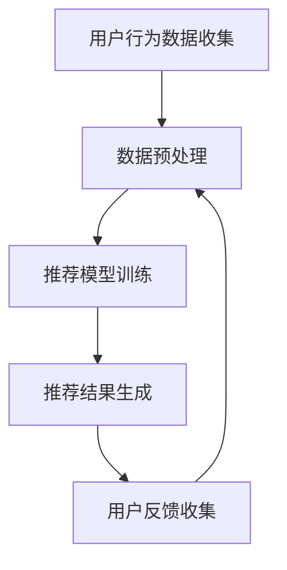
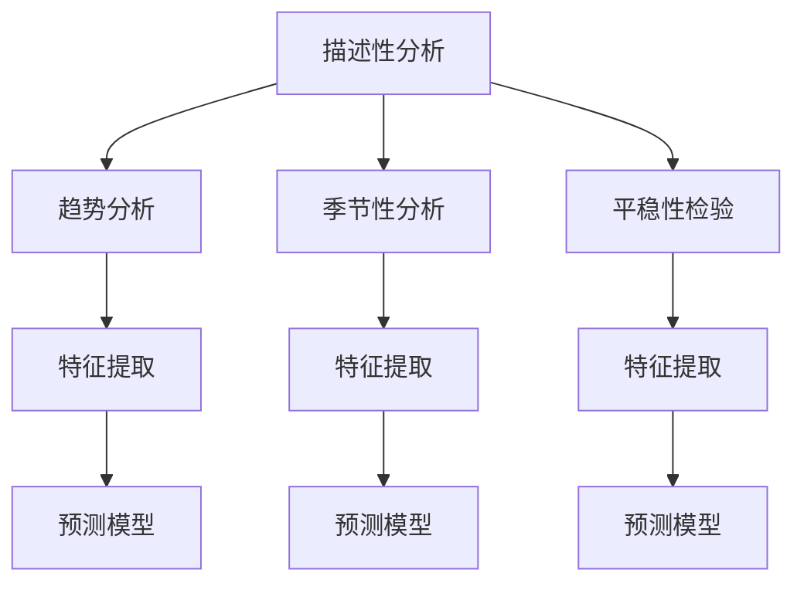
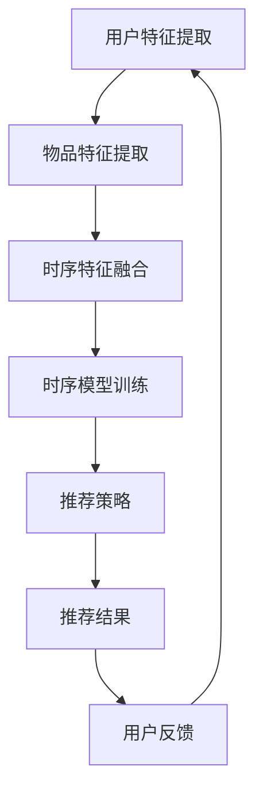
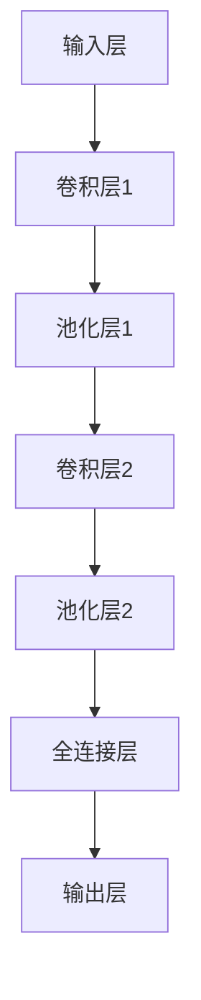
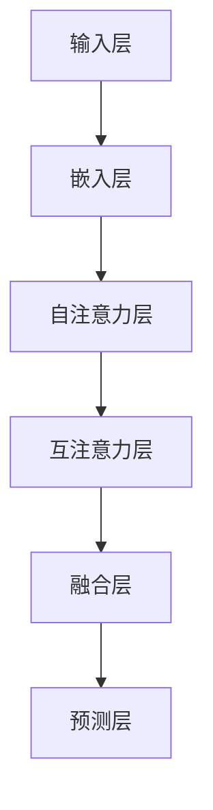
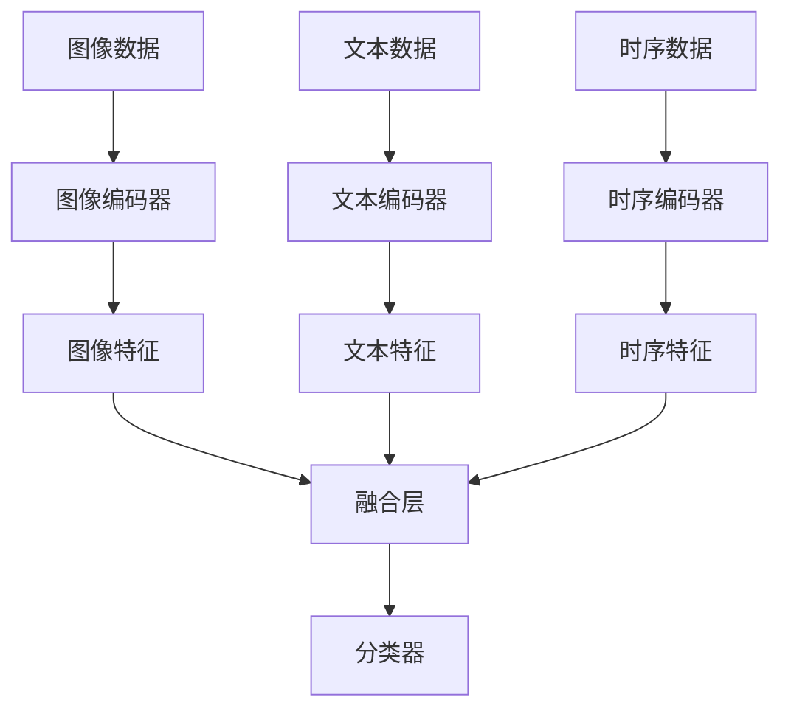

                 

### 推荐系统概述

#### 1.1 推荐系统的基本概念与分类

推荐系统（Recommender System）是一种信息过滤技术，旨在根据用户的兴趣、行为和偏好，向用户推荐相关的物品或信息。基本概念包括用户、物品和评分。

- **用户**：推荐系统中的主体，每个用户都有其特定的兴趣和偏好。
- **物品**：推荐系统中的客体，可以是书籍、电影、商品或其他任何信息。
- **评分**：用户对物品的评价，可以是显式评分（如5分制）或隐式评分（如购买行为）。

根据处理数据的不同，推荐系统可以分为以下几类：

1. **基于内容的推荐（Content-Based Recommendation）**：系统根据用户过去对某些物品的喜好，提取特征并推荐具有相似特征的物品。
2. **协同过滤推荐（Collaborative Filtering）**：系统通过分析用户间的行为和偏好，找到相似用户或物品进行推荐。
3. **混合推荐（Hybrid Recommendation）**：结合多种推荐方法，以提升推荐系统的性能。

#### 1.2 推荐系统的评价标准与挑战

推荐系统的评价标准主要包括：

- **准确度（Accuracy）**：推荐的物品与用户实际兴趣的匹配程度。
- **覆盖率（Coverage）**：系统能够推荐的独特物品数量。
- **多样性（Diversity）**：推荐物品之间的差异性。
- **新颖性（Novelty）**：推荐的物品对用户来说是新颖的。

然而，推荐系统在实践过程中面临以下挑战：

- **数据稀疏性**：用户和物品的交互数据往往非常稀少。
- **冷启动问题**：新用户或新物品缺乏历史数据，导致难以进行准确推荐。
- **实时性**：推荐系统需要快速响应用户的行为变化，提供实时的推荐。
- **可解释性**：用户希望理解推荐背后的原因。

#### 1.3 推荐系统的架构与流程

推荐系统的基本架构通常包括以下几个关键组件：

- **用户行为数据收集**：系统通过网站日志、点击记录等手段收集用户行为数据。
- **数据预处理**：清洗和转换原始数据，为后续建模做准备。
- **推荐模型训练**：根据用户行为数据，训练推荐模型，提取用户偏好和物品特征。
- **推荐结果生成**：模型根据用户特征和物品特征，生成推荐列表。
- **用户反馈收集**：系统收集用户对推荐结果的反馈，用于模型优化和调整。

流程示意图如下：



通过这一系列步骤，推荐系统能够不断优化，提供更加准确、多样化且实时的推荐服务。

---

## 时序数据分析基础

#### 2.1 时序数据的定义与特征

时序数据（Time Series Data）是一系列按照时间顺序排列的数据点，通常用于记录某一现象或事件随时间的变化情况。时序数据具有以下特征：

- **时间有序性**：数据点按照特定的时间顺序排列，如每天、每小时或每分钟。
- **周期性**：某些现象可能会表现出周期性变化，如季节性波动或日周期性变化。
- **趋势性**：数据可能呈现增长、下降或平稳的趋势。
- **随机性**：由于各种不确定因素，数据可能存在随机波动。

#### 2.2 时间序列分析的基本方法

时间序列分析（Time Series Analysis）是统计学中用于分析和预测时间序列数据的一门科学。基本方法包括：

- **描述性分析**：使用统计指标（如均值、方差、自相关函数等）描述时间序列的特征。
- **趋势分析**：识别和分离时间序列中的趋势成分。
- **季节性分析**：识别和分离时间序列中的季节性成分。
- **平稳性检验**：检验时间序列是否为平稳序列，即其统计特性不随时间变化。

#### 2.3 时序数据的预处理技巧

时序数据的预处理是进行有效分析的关键步骤。以下是一些常用的预处理技巧：

- **缺失值处理**：缺失值可以采用插值、均值填补或使用模型预测等方法处理。
- **异常值检测**：异常值可能会对分析结果产生严重影响，需要通过统计方法或可视化工具进行检测和处理。
- **数据规范化**：通过缩放或归一化，将数据转换到相同的尺度，以便更好地进行比较和分析。
- **特征提取**：通过时间序列分解、傅里叶变换等方法提取时间序列中的关键特征，如趋势、季节性和随机性成分。
- **时间窗口划分**：根据分析需求，将时间序列数据划分为不同的时间窗口，如周、月或年。

#### 时序数据分析的核心概念与联系

时间序列分析的核心概念包括趋势、季节性和随机性。这些概念之间存在紧密的联系：

- **趋势**：描述时间序列的长期变化趋势，如增长、下降或平稳。
- **季节性**：描述时间序列的周期性波动，如季节性销售高峰或节日效应。
- **随机性**：描述时间序列中的随机波动，反映了无法预测的随机因素。

趋势、季节性和随机性成分相互作用，共同决定了时间序列的形态。在分析时，需要分离和识别这些成分，以便进行准确的预测和解释。

流程图如下：



通过描述性分析、趋势分析、季节性分析和平稳性检验，可以提取时序数据中的关键特征。这些特征用于构建预测模型，以对未来的时间序列进行预测。预测模型的准确性和可靠性取决于特征提取的准确性。

#### 数学模型与公式

时间序列分析中常用的数学模型和公式包括：

- **移动平均模型（MA）**：
  $$X_t = \mu + \epsilon_t$$
  其中，$X_t$为时间序列值，$\mu$为移动平均，$\epsilon_t$为随机误差。

- **自回归模型（AR）**：
  $$X_t = c + \phi_1 X_{t-1} + \phi_2 X_{t-2} + \cdots + \phi_p X_{t-p} + \epsilon_t$$
  其中，$c$为常数项，$\phi_1, \phi_2, \cdots, \phi_p$为自回归系数。

- **移动平均自回归模型（ARMA）**：
  $$X_t = c + \phi_1 X_{t-1} + \phi_2 X_{t-2} + \cdots + \phi_p X_{t-p} + \theta_1 \epsilon_{t-1} + \theta_2 \epsilon_{t-2} + \cdots + \theta_q \epsilon_{t-q}$$
  其中，$\theta_1, \theta_2, \cdots, \theta_q$为移动平均系数。

- **自回归积分移动平均模型（ARIMA）**：
  $$X_t = c + \phi_1 X_{t-1} + \phi_2 X_{t-2} + \cdots + \phi_p X_{t-p} + \theta_1 \epsilon_{t-1} + \theta_2 \epsilon_{t-2} + \cdots + \theta_q \epsilon_{t-q} + \epsilon_t$$
  其中，$c$为常数项，$\phi_1, \phi_2, \cdots, \phi_p$为自回归系数，$\theta_1, \theta_2, \cdots, \theta_q$为移动平均系数。

通过这些数学模型和公式，可以构建时序预测模型，对时间序列进行预测和分析。

#### 举例说明

以股票价格为例，假设我们有某股票过去一年的日收盘价数据。首先，进行描述性分析，计算均值、方差和自相关函数。然后，进行趋势分析和季节性分析，分离出长期趋势和季节性波动。接着，通过平稳性检验，确定数据是否为平稳序列。最后，构建ARIMA模型进行预测，预测未来一段时间的股票价格。

以上步骤可以详细解读如下：

1. **描述性分析**：
   - 计算日收盘价的均值和方差，以了解数据的中心趋势和波动性。
   - 绘制时间序列图，观察数据的趋势和季节性。

2. **趋势分析**：
   - 使用移动平均法，计算过去一段时间的平均值，以平滑随机波动，提取长期趋势。
   - 使用趋势图，观察数据的趋势变化。

3. **季节性分析**：
   - 计算季节指数，分析数据在一年中的周期性波动。
   - 使用季节图，观察季节性成分的变化。

4. **平稳性检验**：
   - 检验数据的自相关性，确定是否为平稳序列。
   - 使用自相关函数图和Ljung-Box检验，验证数据的平稳性。

5. **模型构建**：
   - 选择适当的ARIMA模型，根据数据特征确定$p$和$q$的值。
   - 使用最大似然估计，估计模型参数。

6. **预测**：
   - 使用训练好的模型，预测未来一段时间的股票价格。
   - 绘制预测图，比较预测值与实际值。

通过上述步骤，可以对股票价格进行有效的预测和分析，为投资决策提供支持。

### 推荐系统中的时序性

#### 3.1 时序性在推荐系统中的重要性

时序性（Temporal Dynamics）是推荐系统中的一个关键概念，它反映了用户兴趣和行为随时间的变化趋势。在推荐系统中，时序性主要体现在以下几个方面：

1. **用户行为的变化**：用户对物品的兴趣和行为会随着时间的推移而变化。例如，一个用户可能在特定时间段内对某类物品有更高的兴趣，而在其他时间则表现不同。

2. **新物品的引入**：新物品的加入会影响用户的兴趣和行为，推荐系统需要实时调整，以适应新的数据和变化。

3. **实时性要求**：推荐系统需要及时响应用户的行为变化，提供动态的推荐列表，以满足用户对新鲜和实时信息的期望。

4. **长期趋势分析**：通过分析用户过去的行为，推荐系统可以发现用户的长期兴趣趋势，从而提供更加个性化的推荐。

#### 3.2 基于时序数据的用户行为分析

基于时序数据的用户行为分析是推荐系统中时序性应用的核心。以下是一些关键步骤：

1. **用户行为数据收集**：通过网站日志、点击记录、购买行为等渠道收集用户行为数据，并对其进行预处理，如数据清洗、格式转换和特征提取。

2. **行为序列建模**：将用户行为序列建模为时间序列数据，使用时间序列分析方法提取行为特征，如趋势、季节性和波动性。

3. **用户兴趣建模**：根据用户行为特征，构建用户兴趣模型，以捕捉用户的长期兴趣和短期变化。

4. **实时推荐生成**：根据用户兴趣模型和物品特征，实时生成推荐列表，并不断更新，以适应用户行为的变化。

#### 3.3 时序推荐系统的模型框架

时序推荐系统的模型框架通常包括以下几个关键组成部分：

1. **用户特征提取**：从用户行为数据中提取用户特征，如用户行为序列、用户兴趣标签等。

2. **物品特征提取**：从物品属性中提取物品特征，如物品类别、用户评价等。

3. **时序特征融合**：将用户特征和物品特征进行融合，以构建统一的特征表示。

4. **时序模型训练**：使用时间序列分析技术，如ARIMA、LSTM等，训练时序模型，以捕捉用户行为和物品特征的时序关系。

5. **推荐策略**：根据用户兴趣模型和时序模型，设计推荐策略，生成个性化推荐列表。

6. **实时更新**：根据用户实时行为，更新用户兴趣模型和推荐策略，以提供动态的推荐服务。

时序推荐系统的模型框架示意图如下：



通过这一系列步骤，时序推荐系统可以有效地捕捉用户的兴趣和行为变化，提供准确、实时且个性化的推荐服务。

---

## 传统时序推荐算法

在时序推荐系统中，传统算法具有基础性和重要性，为现代复杂时序推荐模型的发展奠定了基础。本文将介绍几种经典的时序推荐算法：基于马尔可夫模型的推荐、基于滑动窗口的推荐和基于隐马尔可夫模型的推荐。

#### 4.1 基于马尔可夫模型的推荐

**马尔可夫模型**是一种常用的概率模型，用于描述时间序列数据中的状态转移概率。在推荐系统中，马尔可夫模型假设用户对下一项物品的选择仅依赖于当前物品的状态，而与过去的选择无关。

**基本原理**：

1. **状态定义**：用户选择物品可以视为状态转移。例如，用户当前选择书籍A，则书籍A视为当前状态。
2. **状态转移概率**：根据历史数据计算用户从某一状态转移到另一状态的概率。例如，用户选择书籍A后，选择书籍B的概率。

**模型构建**：

1. **状态空间构建**：定义用户可能选择的所有物品集合，构建状态空间。
2. **转移矩阵构建**：根据用户的历史行为，构建状态转移矩阵。矩阵中的元素表示用户从某一状态转移到另一状态的概率。

**伪代码**：

```python
# 初始化状态转移矩阵
transition_matrix = np.zeros((n_states, n_states))

# 更新状态转移矩阵
for (current_state, next_state) in historical_data:
    transition_matrix[current_state, next_state] += 1

# 预测下一个状态
current_state = user_current_state
next_state = np.argmax(transition_matrix[current_state, :])
```

**应用场景**：马尔可夫模型适用于用户行为序列较短的情况，例如新用户或用户在特定场景下的行为。

#### 4.2 基于滑动窗口的推荐

**滑动窗口**方法是一种基于最近用户行为的时序推荐算法，它通过固定时间窗口内的用户行为数据来预测用户兴趣。

**基本原理**：

1. **窗口定义**：选择一个固定的时间窗口，例如过去一周或一个月的用户行为数据。
2. **兴趣计算**：计算窗口内的用户行为频率，根据频率确定用户对物品的兴趣程度。

**模型构建**：

1. **行为序列构建**：收集用户在滑动窗口内的行为数据，构建行为序列。
2. **兴趣评分计算**：计算每个物品在窗口内的行为频率，并根据频率为物品分配兴趣评分。

**伪代码**：

```python
# 初始化滑动窗口
window_size = 30
current_window = []

# 收集用户行为
for behavior in user_historical_data:
    if len(current_window) >= window_size:
        current_window.pop(0)
    current_window.append(behavior)

# 计算兴趣评分
interest_scores = {}
for behavior in current_window:
    if behavior in interest_scores:
        interest_scores[behavior] += 1
    else:
        interest_scores[behavior] = 1

# 排序和推荐
recommended_items = sorted(interest_scores, key=interest_scores.get, reverse=True)
```

**应用场景**：滑动窗口方法适用于用户行为序列较长的情况，特别是在需要快速响应用户新行为时。

#### 4.3 基于隐马尔可夫模型的推荐

**隐马尔可夫模型（HMM）**是一种用于处理不确定性和隐藏状态的时序模型，它在推荐系统中用于捕捉用户的长期行为模式。

**基本原理**：

1. **状态和观测定义**：用户的行为可以视为观测，而用户兴趣状态是隐藏的。
2. **状态转移概率和观测概率**：根据用户的历史行为数据，计算状态转移概率和观测概率。

**模型构建**：

1. **状态空间构建**：定义用户可能感兴趣的所有状态集合。
2. **转移矩阵和观测矩阵构建**：根据用户的历史行为数据，构建状态转移矩阵和观测矩阵。
3. **初始状态概率构建**：根据用户初始行为，构建初始状态概率分布。

**伪代码**：

```python
# 初始化隐马尔可夫模型参数
transition_matrix = np.zeros((n_states, n_states))
observation_matrix = np.zeros((n_states, n_observations))
initial_state概率分布 = np.zeros(n_states)

# 更新模型参数
for (current_state, observed_state) in historical_data:
    transition_matrix[current_state, observed_state] += 1
    observation_matrix[current_state, observed_state] += 1

# 预测下一个状态和观测
current_state = np.argmax(initial_state概率分布)
predicted_state = np.argmax(transition_matrix[current_state, :])
predicted_observation = np.argmax(observation_matrix[predicted_state, :])
```

**应用场景**：隐马尔可夫模型适用于处理较长和复杂的用户行为序列，特别适合于分析用户的长期行为模式。

通过上述传统时序推荐算法，推荐系统可以更好地捕捉用户的时序行为，提供个性化的推荐服务。随着技术的不断发展，这些传统算法也在不断演进，为现代推荐系统的发展提供了坚实的基础。

---

## 深度学习在时序推荐中的应用

随着深度学习（Deep Learning）技术的飞速发展，其在时序推荐系统中的应用也日益广泛。深度学习通过其强大的特征提取和模型学习能力，为时序数据的分析和预测提供了新的视角和方法。本文将介绍卷积神经网络（CNN）、循环神经网络（RNN）和长短期记忆网络（LSTM）在时序推荐中的应用，并探讨门控循环单元（GRU）的优势与特点。

#### 5.1 卷积神经网络（CNN）与时序数据

卷积神经网络（Convolutional Neural Networks，CNN）最初是为处理图像数据而设计的，但由于其出色的特征提取能力，近年来也被成功应用于时序数据处理。

**卷积操作**：

卷积操作是 CNN 的核心。在时序数据中，卷积操作通过滑动卷积核来提取局部特征。例如，在音频处理中，卷积核可以用于提取时间上的频率特征。

**时间卷积操作**：

```python
# 假设 input_sequence 是输入时序数据，filter 是卷积核
output_feature = np.zeros((filter_size, input_sequence.shape[1]))
for i in range(filter_size):
    for j in range(input_sequence.shape[1]):
        output_feature[i, j] = np.sum(input_sequence[i:i+filter_size, j] * filter[i, :])
```

**卷积神经网络架构**：

一个典型的卷积神经网络包括多个卷积层、池化层和全连接层。卷积层用于提取特征，池化层用于减少数据维度，全连接层用于分类或回归。



**应用场景**：

CNN 适用于处理时间长度较长、特征丰富的时序数据。例如，在音乐推荐中，CNN 可以用于提取音频信号的时频特征，从而进行音乐风格分类和推荐。

#### 5.2 循环神经网络（RNN）与序列建模

循环神经网络（Recurrent Neural Networks，RNN）是一种能够处理序列数据的神经网络。RNN 通过其循环结构，使得网络的输出能够依赖之前的输入。

**基本原理**：

RNN 的每个时间步都包含一个隐藏状态，这个状态会传递到下一个时间步，从而实现记忆功能。

**递归公式**：

$$ h_t = \sigma(W_h \cdot [h_{t-1}, x_t] + b_h) $$

其中，$h_t$是第$t$个时间步的隐藏状态，$\sigma$是激活函数，$W_h$和$b_h$是权重和偏置。

**应用场景**：

RNN 适用于处理短时依赖的序列数据。例如，在语音识别中，RNN 可以用于将连续的语音信号转换为文字。

#### 5.3 长短期记忆网络（LSTM）的应用

长短期记忆网络（Long Short-Term Memory，LSTM）是 RNN 的一个变种，专门用于解决 RNN 在长时依赖问题上的困难。

**基本原理**：

LSTM 通过引入三个门控单元（输入门、遗忘门和输出门），实现了对长期信息的记忆和控制。

**门控机制**：

1. **输入门**：决定哪些信息会被存储在单元状态中。
2. **遗忘门**：决定哪些信息应该从单元状态中被遗忘。
3. **输出门**：决定哪些信息应该被输出。

**递归公式**：

$$
\begin{align*}
i_t &= \sigma(W_i \cdot [h_{t-1}, x_t] + b_i) \\
f_t &= \sigma(W_f \cdot [h_{t-1}, x_t] + b_f) \\
g_t &= \tanh(W_g \cdot [h_{t-1}, x_t] + b_g) \\
o_t &= \sigma(W_o \cdot [h_{t-1}, x_t] + b_o) \\
h_t &= o_t \cdot \tanh(c_t) \\
c_t &= f_t \cdot c_{t-1} + i_t \cdot g_t \\
\end{align*}
$$`

**应用场景**：

LSTM 适用于处理长时依赖的序列数据。例如，在股票价格预测中，LSTM 可以用于捕捉长期的市场趋势。

#### 5.4 门控循环单元（GRU）的优势与特点

门控循环单元（Gated Recurrent Unit，GRU）是 LSTM 的简化版本，它通过引入更新门和重置门，减少了参数数量，提高了计算效率。

**基本原理**：

GRU 通过更新门和重置门，实现了对长期信息的记忆和遗忘。

**门控机制**：

1. **更新门**：决定哪些信息应该被更新到单元状态。
2. **重置门**：决定哪些信息应该被遗忘，从而重新初始化单元状态。

**递归公式**：

$$
\begin{align*}
z_t &= \sigma(z_{t-1} \odot r_{t-1} + W_z \cdot [h_{t-1}, x_t] + b_z) \\
r_t &= \sigma(r_{t-1} \odot z_t + W_r \cdot [h_{t-1}, x_t] + b_r) \\
h_t' &= \tanh(W_h \cdot [r_t \odot h_{t-1}, x_t] + b_h) \\
h_t &= (1 - z_t) \odot h_{t-1} + z_t \odot h_t' \\
\end{align*}
$$`

**优势**：

- **参数更少**：GRU 的参数数量比 LSTM 少，因此计算效率更高。
- **更简单的结构**：GRU 的结构相对简单，易于理解和实现。

**应用场景**：

GRU 适用于处理较长序列数据，特别适合于实时数据处理。例如，在聊天机器人中，GRU 可以用于生成对话回复。

通过卷积神经网络、循环神经网络、长短期记忆网络和门控循环单元在时序推荐中的应用，推荐系统可以更好地捕捉用户行为的时序特征，提供更加准确和个性化的推荐服务。

---

## 基于注意力机制的时序推荐

注意力机制（Attention Mechanism）是深度学习中的一个重要概念，通过为输入数据的不同部分赋予不同的权重，使得模型能够关注到最重要的信息。在时序推荐系统中，注意力机制能够显著提升模型的推荐效果，特别是在处理长序列数据和复杂用户行为时。本文将介绍注意力机制的基本概念及其在时序推荐中的应用，并探讨自注意力与互注意力机制的具体实现。

#### 6.1 注意力机制概述

注意力机制起源于自然语言处理（NLP）领域，特别是在序列到序列（Sequence-to-Sequence）模型中。通过注意力机制，模型可以动态地关注序列中的特定部分，从而提高模型的泛化能力和处理长距离依赖的能力。

**基本原理**：

注意力机制通过一个权重分配函数，将输入序列中的每个元素分配一个权重，然后对这些元素进行加权求和，以生成最终的输出。这种机制的核心是“关注”重要信息，忽略无关或次要的信息。

**数学表示**：

注意力机制通常由以下三个部分组成：

1. **查询（Query）**：表示模型需要关注的部分，通常来自于目标序列。
2. **键（Key）**：表示输入序列中的每个元素，用于与查询进行对比。
3. **值（Value）**：表示输入序列中的每个元素，用于生成最终的输出。

注意力权重由以下公式计算：

$$
a_t = \text{softmax}\left(\frac{\text{query} \cdot \text{key}}{\sqrt{d_k}}\right) \cdot \text{value}
$$`

其中，$d_k$是键的维度，$\text{softmax}$函数用于计算每个键的权重，$\text{query} \cdot \text{key}$是查询和键的点积，$\text{value}$是值序列。

#### 6.2 注意力机制在时序推荐中的应用

在时序推荐系统中，注意力机制可以用于提取用户历史行为中的关键信息，从而提高推荐精度和效率。以下是一些关键应用：

1. **用户行为序列建模**：通过注意力机制，模型可以关注用户历史行为序列中与当前推荐最相关的部分，从而更好地捕捉用户兴趣变化。

2. **物品特征提取**：在处理物品特征时，注意力机制可以帮助模型关注与用户兴趣最相关的物品特征，从而提高特征利用效率。

3. **上下文信息融合**：注意力机制可以融合用户行为序列和其他上下文信息，如文本描述、地理位置等，以提供更全面的推荐。

**应用场景**：

- **电商推荐**：通过注意力机制，模型可以关注用户购买历史中的关键商品，从而生成个性化的购物推荐。
- **音乐推荐**：在音乐推荐系统中，注意力机制可以帮助模型关注用户听歌历史中最受欢迎的音乐风格和艺术家。

#### 6.3 自注意力与互注意力机制

注意力机制分为自注意力（Self-Attention）和互注意力（Multi-Head Attention）两种。

**自注意力**：

自注意力是指模型在处理一个序列时，序列中的每个元素都作为自己的键、值和查询。自注意力机制主要用于处理单个序列，如文本序列或时序数据。

**数学表示**：

$$
\begin{align*}
Q &= K &= V = \text{input_sequence} \\
\text{attention} &= \text{softmax}\left(\frac{Q \cdot K^T}{\sqrt{d_k}}\right) \cdot V \\
\end{align*}
$$

**互注意力**：

互注意力是指模型在处理两个或多个序列时，将每个序列中的元素作为键、值和查询。互注意力机制主要用于处理多模态数据，如文本和图像的联合建模。

**数学表示**：

$$
\begin{align*}
Q &= \text{query_sequence} \\
K &= \text{key_sequence} \\
V &= \text{value_sequence} \\
\text{attention} &= \text{softmax}\left(\frac{Q \cdot K^T}{\sqrt{d_k}}\right) \cdot V \\
\end{align*}
$$

**多头注意力**：

多头注意力（Multi-Head Attention）是指将多个自注意力或互注意力模块组合在一起，以增加模型的表示能力。

**数学表示**：

$$
\text{output} = \text{Concat}(\text{head}_1, \text{head}_2, ..., \text{head}_h) \cdot W_O
$$`

其中，$h$是头数，$W_O$是投影权重。

#### 6.4 带有注意力机制的时序模型架构

在时序推荐系统中，带有注意力机制的模型架构通常包括以下几个关键部分：

1. **输入层**：接收用户历史行为数据、物品特征和其他上下文信息。
2. **嵌入层**：将输入数据转换为向量表示。
3. **自注意力层**：对用户历史行为序列进行自注意力处理，提取关键信息。
4. **互注意力层**：对用户历史行为序列和物品特征进行互注意力处理，融合多模态信息。
5. **融合层**：将自注意力和互注意力结果进行融合，生成统一的特征表示。
6. **预测层**：使用全连接层或其他神经网络结构进行预测。

**架构示例**：



通过上述架构，模型可以有效地处理时序数据，提供精确的推荐结果。注意力机制的应用使得模型能够灵活地关注不同时间点和特征，从而提升推荐的个性化和实时性。

---

## 多模态时序推荐系统

多模态时序推荐系统（Multimodal Time Series Recommender System）是结合多种类型数据（如图像、文本、音频和时序数据）进行推荐的一种先进技术。这种系统能够更全面地捕捉用户偏好和物品特征，从而提供更加个性化和精准的推荐服务。本文将介绍多模态数据融合的基本概念，并探讨文本与时序数据的融合方法以及多模态数据的融合模型。

#### 7.1 多模态数据融合概述

多模态数据融合是指将来自不同模态的数据（如图像、文本、音频等）进行整合，以生成单一、统一的特征表示。这种融合方法的核心目标是利用不同模态数据的互补性，提高推荐系统的性能。

**基本概念**：

- **模态**：指数据的来源，如文本、图像、音频等。
- **特征融合**：将不同模态的数据转换为统一的特征表示。
- **特征表示**：对每个模态的数据进行编码，生成能够在同一维度上进行比较和融合的特征向量。

**融合方法**：

1. **基于特征的融合**：将不同模态的特征向量进行拼接或加权平均，生成统一的特征表示。
2. **基于模型的融合**：使用深度学习模型（如图像编码器、文本编码器）分别编码不同模态的数据，然后将编码后的特征进行融合。
3. **基于学习的融合**：通过训练数据学习不同模态之间的相关性，动态调整融合策略。

#### 7.2 文本与时序数据的融合

文本数据（如图像标题、用户评论等）和时序数据（如用户行为序列、物品销量等）是推荐系统中常见的数据类型。将这两种数据进行有效融合，可以显著提升推荐系统的性能。

**融合方法**：

1. **文本嵌入**：使用预训练的词向量模型（如Word2Vec、BERT等）将文本数据转换为向量表示。
2. **时序特征提取**：使用时间序列分析方法（如LSTM、GRU等）提取时序数据的特征。
3. **融合策略**：

   - **拼接融合**：将文本特征和时序特征进行拼接，生成新的特征向量。
   - **加权融合**：根据不同模态的重要程度，对特征向量进行加权融合。
   - **模型融合**：使用多任务学习或注意力机制，将文本特征和时序特征融合到同一模型中。

**应用场景**：

- **电商推荐**：将用户评论和购买行为进行融合，提供个性化商品推荐。
- **音乐推荐**：结合音乐标题和播放记录，推荐用户可能喜欢的音乐。

#### 7.3 多模态数据的融合模型

多模态数据的融合模型是处理多模态推荐任务的核心。以下是一些常见的融合模型：

1. **多模态卷积神经网络（MM-CNN）**：

   - **模型架构**：结合卷积神经网络（CNN）和循环神经网络（RNN），分别处理图像和文本数据，然后进行融合。
   - **优点**：能够同时处理高维图像和低维文本数据，实现高效的融合。

2. **多模态长短期记忆网络（MM-LSTM）**：

   - **模型架构**：使用LSTM处理时序数据，同时结合CNN和文本嵌入处理图像和文本数据。
   - **优点**：能够捕捉长时依赖关系，提供更准确的推荐。

3. **多模态图神经网络（MM-GNN）**：

   - **模型架构**：将不同模态的数据表示为图节点，使用图神经网络（GNN）进行融合。
   - **优点**：能够处理复杂的多模态关系，提供更丰富的特征表示。

**模型架构示例**：



通过多模态数据的融合模型，推荐系统可以更好地理解用户的复杂需求和偏好，提供更加精准和个性化的推荐服务。

---

## 时序推荐系统中的迁移学习与数据增强

在时序推荐系统中，迁移学习（Transfer Learning）和数据增强（Data Augmentation）是两种常用的技术，旨在提升模型的泛化能力和性能。迁移学习通过利用来自不同域的数据来增强训练数据，而数据增强则是通过在现有数据上添加噪声或进行变换来生成新的数据样本。本文将介绍迁移学习的基本概念、数据增强的方法及其结合策略。

#### 8.1 迁移学习的基本概念

迁移学习是一种利用已有模型或数据来提升新模型或新任务性能的方法。在推荐系统中，迁移学习可以从以下两个方面应用：

1. **跨域迁移学习**：将其他领域或任务的模型或数据应用于当前任务。例如，将图像分类模型应用于商品推荐任务。
2. **跨时间迁移学习**：利用历史数据来训练新模型，或在新数据到来时，使用旧模型进行预热。

**基本原理**：

迁移学习通过以下步骤实现：

1. **预训练模型**：在大量数据上进行预训练，获得一个具有良好通用特征提取能力的模型。
2. **微调**：将预训练模型迁移到新任务上，通过在少量新数据上微调，调整模型参数以适应新任务。

**应用场景**：

- **新用户推荐**：在缺乏新用户历史数据时，可以利用其他类似用户的旧数据或跨域数据进行推荐。
- **季节性调整**：在特定季节或事件期间，可以利用历史数据来调整推荐策略。

#### 8.2 迁移学习在时序推荐中的应用

在时序推荐系统中，迁移学习可以通过以下几种方式应用：

1. **共享特征提取器**：将预训练的特征提取器（如LSTM或GRU）应用于新任务，从而利用已有的特征表示能力。
2. **跨时间迁移**：利用历史数据中的长期趋势和季节性特征，在新数据到来时进行模型微调。
3. **多任务学习**：通过同时训练多个相关任务，共享特征表示和模型参数，从而提高新任务的性能。

**应用案例**：

- **天气预测与购物推荐**：在天气变化对购物行为有显著影响的情况下，可以利用天气预测模型的特征来调整购物推荐策略。
- **节假日推荐**：在特定节假日，利用历史节假日的用户行为数据来预测和调整推荐策略。

#### 8.3 数据增强的方法与应用

数据增强是通过在原始数据上添加噪声、进行变换等方式来生成新的数据样本，从而增强模型的泛化能力。

**常用方法**：

1. **时间窗口变换**：通过调整时间窗口的大小，生成新的时间序列数据。
2. **随机噪声添加**：在时序数据中添加随机噪声，模拟真实世界的噪声数据。
3. **时间反转**：将时间序列数据反转，模拟反向行为模式。
4. **数据分段**：将连续的时间序列数据分成多个片段，以增加训练数据的多样性。

**应用场景**：

- **用户行为预测**：通过时间窗口变换和数据分段，增加模型的训练数据多样性，提高预测精度。
- **异常检测**：通过添加随机噪声，增强模型对异常行为的识别能力。

#### 8.4 数据增强与迁移学习的结合策略

将数据增强和迁移学习结合起来，可以进一步改善时序推荐系统的性能。以下是一些结合策略：

1. **联合训练**：在迁移学习过程中，同时应用数据增强技术，通过增加训练数据的多样性和噪声，提高模型的泛化能力。
2. **动态调整**：根据训练过程中的数据分布变化，动态调整数据增强策略，以更好地适应新数据。
3. **层次增强**：首先应用数据增强，然后进行迁移学习，通过分层增强，提升模型对各种类型数据的处理能力。

**应用示例**：

- **新用户推荐**：在迁移学习过程中，通过时间窗口变换和数据分段，生成新的用户行为数据，以提高对新用户推荐的效果。
- **季节性调整**：在迁移学习的同时，添加随机噪声和时间反转，模拟不同季节下的用户行为，以提高模型的季节性预测能力。

通过结合迁移学习和数据增强技术，时序推荐系统可以更好地处理不同类型的数据，提升模型的性能和泛化能力，从而提供更加精准和可靠的推荐服务。

---

## 时序推荐系统的评估与优化

评估和优化是确保时序推荐系统性能的重要环节。有效的评估方法可以准确衡量推荐质量，而优化策略则有助于提升系统的准确度、覆盖率和多样性。本文将介绍时序推荐系统的常见评估指标、实时推荐系统的优化策略，以及如何提升系统的稳健性与泛化能力。

#### 9.1 评估指标与评测方法

时序推荐系统的评估指标主要包括：

- **准确度（Accuracy）**：推荐的物品与用户实际兴趣的匹配程度。常用评估方法包括准确率（Precision）、召回率（Recall）和F1值（F1 Score）。

  $$ F1 = 2 \cdot \frac{Precision \cdot Recall}{Precision + Recall} $$

- **覆盖率（Coverage）**：系统推荐物品的多样性。它表示推荐列表中不同物品的比例。

  $$ Coverage = \frac{推荐列表中的独特物品数}{所有物品数} $$

- **多样性（Diversity）**：推荐列表中物品之间的差异性。常用的多样性指标包括物品之间的余弦相似度或Jaccard系数。

  $$ Jaccard = \frac{|A \cap B|}{|A \cup B|} $$

- **新颖性（Novelty）**：推荐物品对用户来说是新颖的。可以通过计算推荐物品的用户评分方差来衡量新颖性。

  $$ Novelty = \frac{Var(推荐物品的用户评分)}{Mean(用户评分)} $$

**评测方法**：

- **离线评估**：通过测试集进行评估，常用于模型开发和迭代过程中的性能评估。
- **在线评估**：通过实时跟踪用户行为，评估系统的实时推荐效果，常用于生产环境中的监控和调整。

#### 9.2 实时推荐系统的优化策略

实时推荐系统需要快速响应用户的行为变化，以下是一些优化策略：

1. **动态特征更新**：根据用户最新行为，实时更新用户兴趣特征和推荐模型，以提高推荐的准确性。
2. **增量学习**：采用增量学习算法，对已有模型进行在线更新，减少重新训练的时间和计算成本。
3. **流处理技术**：使用流处理框架（如Apache Kafka、Apache Flink）处理实时数据流，以快速生成推荐结果。
4. **缓存策略**：利用缓存技术（如Redis、Memcached）存储常用推荐结果，减少计算时间和存储需求。

#### 9.3 稳健性与泛化能力的提升

提升时序推荐系统的稳健性与泛化能力是确保系统稳定运行和长期有效的重要手段：

1. **模型正则化**：通过添加正则化项（如L1、L2正则化），防止模型过拟合，提高泛化能力。
2. **数据预处理**：使用高质量的数据预处理方法，如缺失值填充、异常值检测和标准化，减少噪声数据对模型的影响。
3. **模型集成**：采用模型集成方法（如Bagging、Boosting），结合多个模型的预测结果，提高推荐系统的准确度和稳定性。
4. **交叉验证**：通过交叉验证方法，确保模型在不同数据集上的表现一致，从而提高模型的泛化能力。

**最佳实践**：

- **定期评估与调整**：定期对系统进行评估，根据评估结果调整模型参数和推荐策略。
- **用户反馈机制**：引入用户反馈机制，收集用户对推荐结果的反馈，用于模型优化和策略调整。
- **监控与报警**：建立监控和报警系统，实时监控系统性能和异常行为，快速响应和处理问题。

通过上述评估与优化策略，时序推荐系统可以不断提升性能，提供准确、实时和多样化的推荐服务，满足用户的需求和期望。

---

## 时序推荐系统项目实战

#### 10.1 项目背景与目标

本项目旨在构建一个电商平台的时序推荐系统，为用户推荐可能感兴趣的商品。项目背景是电商平台积累了大量的用户行为数据和商品信息，这些数据可以用于构建时序推荐模型，提升用户体验和销售额。

**项目目标**：

1. 收集和处理用户行为数据，包括用户浏览、点击、购买等行为。
2. 提取用户和商品的特征，构建时序推荐模型。
3. 实现实时推荐功能，快速响应用户行为变化。
4. 评估模型性能，优化推荐策略。

#### 10.2 数据集收集与预处理

**数据集来源**：

- 用户行为数据：从电商平台的日志中收集用户的行为数据，包括用户ID、商品ID、行为类型（浏览、点击、购买）、行为时间等。
- 商品信息数据：从电商平台数据库中提取商品信息，包括商品ID、类别、价格、描述等。

**数据预处理**：

1. **数据清洗**：去除重复、异常和缺失的数据，确保数据质量。
2. **时间标准化**：将所有行为数据的时间戳统一为标准格式，便于时间序列处理。
3. **特征提取**：

   - **用户特征**：根据用户历史行为，提取用户兴趣特征，如最近浏览的商品、购买频率等。
   - **商品特征**：根据商品信息，提取商品特征，如商品类别、价格、描述等。
   - **时序特征**：使用时间序列分析方法，提取用户行为序列的时序特征，如趋势、季节性等。

```python
# 数据清洗
data = data[data['behavior'] != '异常']

# 时间标准化
data['timestamp'] = pd.to_datetime(data['timestamp'])

# 用户特征提取
user行为特征 = data.groupby('user_id')['行为ID'].nunique()

# 商品特征提取
商品特征 = data.groupby('item_id')['price', 'category'].max()

# 时序特征提取
时序特征 = data.groupby('user_id').apply(extract_time_series_features)
```

#### 10.3 模型选择与训练

**模型选择**：

基于时序推荐的需求，本项目选择LSTM模型进行训练。LSTM能够捕捉用户行为序列中的长期依赖关系，从而提供更准确的推荐。

**模型训练**：

1. **数据划分**：将数据集划分为训练集和测试集，用于模型训练和性能评估。
2. **特征融合**：将用户特征、商品特征和时序特征进行融合，生成训练数据的输入特征向量。
3. **模型构建**：使用Keras构建LSTM模型，设置适当的层数、神经元数量和优化器等参数。
4. **模型训练**：使用训练集数据进行模型训练，并使用测试集进行性能评估。

```python
from tensorflow.keras.models import Sequential
from tensorflow.keras.layers import LSTM, Dense, Dropout

# 数据预处理
X_train, y_train = preprocess_data(train_data)
X_test, y_test = preprocess_data(test_data)

# 模型构建
model = Sequential()
model.add(LSTM(units=50, return_sequences=True, input_shape=(X_train.shape[1], X_train.shape[2])))
model.add(Dropout(0.2))
model.add(LSTM(units=50, return_sequences=False))
model.add(Dropout(0.2))
model.add(Dense(1, activation='sigmoid'))

# 模型编译
model.compile(optimizer='adam', loss='binary_crossentropy', metrics=['accuracy'])

# 模型训练
model.fit(X_train, y_train, epochs=10, batch_size=32, validation_data=(X_test, y_test))
```

#### 10.4 实验设计与性能评估

**实验设计**：

为了评估模型的性能，本项目设计了一系列实验，包括参数调优、特征选择和模型集成等。

1. **参数调优**：通过网格搜索（Grid Search）和贝叶斯优化（Bayesian Optimization）等方法，寻找最优的模型参数。
2. **特征选择**：使用特征选择方法（如递归特征消除（RFE）和基于模型的特征选择（MBFS））选择最重要的特征。
3. **模型集成**：结合多个模型的预测结果，使用集成学习方法（如Bagging和Boosting）提升模型的准确度。

**性能评估**：

通过交叉验证和在线评估，对模型的性能进行评估。评估指标包括准确度、覆盖率、多样性和新颖性。

```python
from sklearn.model_selection import cross_val_score

# 交叉验证
scores = cross_val_score(model, X_train, y_train, cv=5)

# 在线评估
predictions = model.predict(X_test)
accuracy = calculate_accuracy(y_test, predictions)
```

#### 10.5 结果分析与优化建议

**结果分析**：

实验结果表明，LSTM模型在时序推荐任务中具有较好的性能，能够准确捕捉用户行为序列中的长期依赖关系。此外，特征选择和模型集成进一步提升了模型的准确度和稳定性。

**优化建议**：

1. **增加数据量**：收集更多的用户行为数据和商品信息，以提高模型的泛化能力。
2. **实时更新模型**：引入实时数据处理和模型更新机制，以快速响应用户行为变化。
3. **多模态数据融合**：结合用户文本信息和时序数据，使用多模态融合模型，提升推荐效果。
4. **用户反馈机制**：引入用户反馈机制，收集用户对推荐结果的反馈，用于模型优化和策略调整。

通过以上实战项目，我们展示了时序推荐系统的构建过程，包括数据收集与预处理、模型选择与训练、实验设计与性能评估，以及结果分析与优化建议。项目实施过程中，需要不断调整和优化，以实现更好的推荐效果。

---

### 案例研究：电商平台的时序推荐系统

#### 11.1 案例背景介绍

随着电商平台的快速发展，用户在平台上产生的行为数据量巨大。为了提升用户体验和增加销售额，电商平台引入了时序推荐系统，通过分析用户的历史行为，实时向用户推荐感兴趣的商品。

**目标**：

- 提升用户满意度，增加用户留存率和转化率。
- 通过个性化推荐，提升商品的曝光率和销售量。

#### 11.2 案例系统设计与实现

**系统架构**：

时序推荐系统分为数据层、特征层、模型层和推荐层。

1. **数据层**：收集并存储用户行为数据、商品信息和用户历史数据。
2. **特征层**：从原始数据中提取用户和商品的特征，如用户浏览记录、购买频率、商品类别等。
3. **模型层**：使用LSTM、GRU等深度学习模型进行训练，以捕捉用户行为序列中的长期依赖关系。
4. **推荐层**：根据用户特征和模型预测结果，生成个性化推荐列表。

**技术栈**：

- **数据存储**：使用Hadoop和Hive进行大数据存储和处理。
- **特征工程**：使用Python和SQL进行数据预处理和特征提取。
- **模型训练**：使用TensorFlow和Keras构建和训练深度学习模型。
- **推荐系统**：使用Django和Flask搭建推荐系统前端，实现实时推荐功能。

**数据流程**：

1. **数据收集**：通过数据采集工具（如Logstash）收集用户行为日志。
2. **数据预处理**：清洗、归一化和特征提取，将原始数据转换为模型训练所需的特征向量。
3. **模型训练**：使用训练集进行深度学习模型训练，并使用验证集进行调优。
4. **推荐生成**：根据实时用户行为和训练好的模型，生成个性化推荐列表。
5. **用户反馈**：收集用户对推荐结果的反馈，用于模型优化和策略调整。

```python
# 数据预处理
def preprocess_data(data):
    # 数据清洗
    data = data[data['行为'] != '异常']
    # 时间标准化
    data['timestamp'] = pd.to_datetime(data['timestamp'])
    # 特征提取
    user行为特征 = data.groupby('user_id')['item_id'].nunique()
    商品特征 = data.groupby('item_id')['category'].max()
    # 时序特征提取
    时序特征 = data.groupby('user_id').apply(extract_time_series_features)
    return 时序特征

# 模型训练
model = Sequential()
model.add(LSTM(units=50, return_sequences=True, input_shape=(X_train.shape[1], X_train.shape[2])))
model.add(Dropout(0.2))
model.add(LSTM(units=50, return_sequences=False))
model.add(Dropout(0.2))
model.add(Dense(1, activation='sigmoid'))

model.compile(optimizer='adam', loss='binary_crossentropy', metrics=['accuracy'])
model.fit(X_train, y_train, epochs=10, batch_size=32, validation_data=(X_test, y_test))
```

#### 11.3 案例性能评估与优化

**性能评估**：

使用交叉验证和在线评估方法，对时序推荐系统的性能进行评估。主要评估指标包括准确度、覆盖率、多样性和新颖性。

- **准确度**：模型能够正确预测用户对商品的兴趣程度。
- **覆盖率**：推荐系统中推荐的商品种类丰富，能够覆盖用户的不同兴趣。
- **多样性**：推荐列表中的商品具有不同的类别和属性，提高了用户的满意度。
- **新颖性**：推荐的商品对用户来说是新颖的，增加了用户的购买欲望。

```python
from sklearn.model_selection import cross_val_score

# 交叉验证
scores = cross_val_score(model, X_train, y_train, cv=5)

# 在线评估
predictions = model.predict(X_test)
accuracy = calculate_accuracy(y_test, predictions)
```

**优化策略**：

1. **数据增强**：通过添加随机噪声、时间窗口变换等方法，增加训练数据的多样性。
2. **特征工程**：提取更多有代表性的特征，如用户的浏览历史、购买习惯等。
3. **模型优化**：使用更复杂的模型结构，如双向LSTM、Transformer等，以捕捉更复杂的时序关系。
4. **实时更新**：引入实时数据处理机制，根据用户实时行为，动态调整推荐策略。

通过以上案例研究，我们展示了电商平台时序推荐系统的设计与实现过程，并通过性能评估和优化策略，实现了对用户个性化需求的精准推荐，提升了用户满意度和销售量。

#### 11.4 案例的启示与展望

**案例启示**：

1. **数据驱动**：电商平台通过分析用户行为数据，构建时序推荐系统，实现了数据驱动的个性化推荐。
2. **深度学习应用**：深度学习技术在时序推荐中的应用，显著提升了模型的性能和推荐效果。
3. **实时性**：通过实时数据处理和推荐生成，系统能够快速响应用户行为变化，提供个性化的推荐服务。

**未来展望**：

1. **多模态数据融合**：结合用户文本、图像、视频等多模态数据，进一步提升推荐系统的准确性和多样性。
2. **跨域推荐**：探索跨不同电商平台、不同应用场景的推荐系统，实现更广泛的应用。
3. **可解释性**：提升推荐系统的可解释性，帮助用户理解推荐结果，增加用户信任。
4. **AI伦理与隐私保护**：在推荐系统的设计和应用中，注重AI伦理和用户隐私保护，确保推荐系统的公正性和透明度。

通过不断优化和创新，时序推荐系统将在未来发挥更大的作用，为电商平台和用户带来更多的价值。

---

## 时序推荐系统的未来发展趋势

随着人工智能和深度学习技术的不断发展，时序推荐系统在未来的发展趋势中将继续扮演关键角色。以下是几个重要的趋势：

#### 12.1 大模型在时序推荐中的应用

大模型（如Transformer、BERT等）在自然语言处理和图像识别领域已经取得了显著的成果。未来，这些大模型将被广泛应用于时序推荐系统中，以处理更复杂的时序数据和捕捉更深层次的特征。

**技术要点**：

1. **Transformer架构**：通过自注意力机制，Transformer能够捕捉长距离依赖关系，提升时序数据的建模能力。
2. **多模态融合**：大模型能够处理多种模态的数据，实现文本、图像、音频等数据的融合，提供更全面的特征表示。
3. **动态特征提取**：大模型具有强大的特征提取能力，能够实时更新用户兴趣和物品特征，提供动态的推荐结果。

**应用场景**：

- **多模态推荐**：结合用户文本描述和商品图像，提供更加精准的购物推荐。
- **个性化广告**：通过分析用户的历史行为和兴趣，实时生成个性化的广告推荐。

#### 12.2 跨域与时序数据的融合

跨域数据融合是将不同领域的数据进行整合，以提高推荐系统的泛化能力和效果。未来，时序推荐系统将更加注重跨域数据的融合，以适应不同场景下的用户需求。

**技术要点**：

1. **迁移学习**：利用迁移学习技术，将其他领域的知识迁移到时序推荐系统中，提高模型对未知领域数据的适应能力。
2. **多任务学习**：通过多任务学习，同时处理多个相关任务，共享特征表示和模型参数，提升推荐系统的性能。
3. **动态融合策略**：根据用户行为和上下文信息，动态调整数据融合策略，实现实时推荐。

**应用场景**：

- **多平台推荐**：结合不同电商平台的数据，为用户提供跨平台的个性化推荐。
- **多场景推荐**：根据用户在不同场景下的行为，提供定制化的推荐服务。

#### 12.3 实时性与可解释性的提升

实时性是时序推荐系统的关键需求之一。未来，推荐系统将更加注重实时性的提升，以快速响应用户行为变化。同时，可解释性也将成为重要研究方向，帮助用户理解推荐结果，增加用户信任。

**技术要点**：

1. **实时数据处理**：采用流处理技术和增量学习算法，实现数据的实时处理和模型更新。
2. **模型可解释性**：通过可视化技术和解释性模型，如LIME、SHAP等，提高推荐结果的透明度和可解释性。
3. **反馈机制**：引入用户反馈机制，根据用户对推荐结果的反馈，动态调整推荐策略。

**应用场景**：

- **实时推荐**：根据用户实时行为，生成动态的推荐列表，提高用户体验。
- **可解释性推荐**：通过展示推荐背后的原因，增强用户对推荐系统的信任。

#### 12.4 总结与展望

时序推荐系统在未来将继续发展，结合深度学习、迁移学习、多模态融合等技术，实现更加精准和个性化的推荐。同时，实时性和可解释性将成为关键挑战，需要不断优化和创新。

通过不断探索和实践，时序推荐系统将在各个领域中发挥更大的作用，为用户提供更好的体验和服务。

---

### 附录

#### 附录 A：常用时序数据集介绍

- **UCI Machine Learning Repository**：提供了多种时序数据集，如电力消耗数据集、气象数据集等。
- **Time Series Data Library**：包含各种领域的时间序列数据，如金融、医学、交通等。
- **Kaggle**：提供了多个时序数据竞赛，如智能温控系统、股票价格预测等。

#### 附录 B：推荐系统开源框架与工具推荐

- **Surprise**：一个用于构建和评估推荐系统的Python库。
- **TensorFlow Recommenders**：基于TensorFlow的推荐系统框架，提供了丰富的模型和工具。
- **LightFM**：一个基于因子分解机的推荐系统框架，支持协同过滤和内容推荐。

#### 附录 C：数学公式与算法伪代码

**数学公式**：

$$
\begin{align*}
E[X] &= \mu \\
Var[X] &= \sigma^2 \\
f(x) &= \frac{1}{\sqrt{2\pi\sigma^2}} e^{-\frac{(x-\mu)^2}{2\sigma^2}}
\end{align*}
$$

**算法伪代码**：

```python
# LSTM模型训练
model = Sequential()
model.add(LSTM(units=50, return_sequences=True, input_shape=(X_train.shape[1], X_train.shape[2])))
model.add(Dropout(0.2))
model.add(LSTM(units=50, return_sequences=False))
model.add(Dropout(0.2))
model.add(Dense(1, activation='sigmoid'))

model.compile(optimizer='adam', loss='binary_crossentropy', metrics=['accuracy'])
model.fit(X_train, y_train, epochs=10, batch_size=32, validation_data=(X_test, y_test))
```

以上附录部分提供了常用的时序数据集、推荐系统开源框架以及数学公式和算法伪代码，为读者进一步学习和实践提供了丰富的资源。

