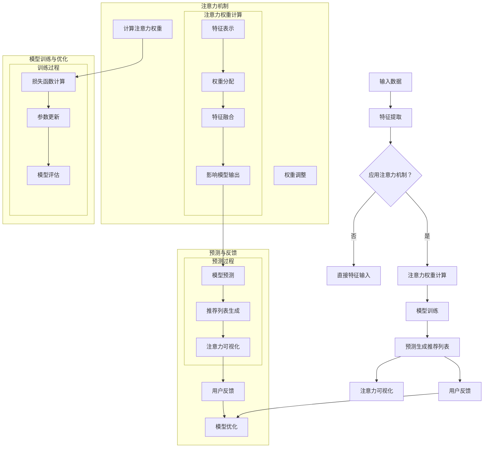

                 

### 推荐系统概述

#### 1.1 推荐系统简介

推荐系统（Recommendation System）是一种能够通过分析用户行为数据、偏好信息以及其他相关数据，为用户推荐其可能感兴趣的项目（如商品、音乐、视频、新闻等）的算法和技术集合。其核心目标是提高用户体验、增加用户粘性，并最终提升商业价值。

推荐系统的主要组成部分包括：

- **数据采集**：收集用户的行为数据（如浏览、点击、购买等）和偏好数据（如评分、标签等）。
- **数据预处理**：对原始数据进行清洗、去噪和特征提取，以便于后续建模和处理。
- **模型训练**：使用历史数据训练推荐模型，常见的模型有协同过滤、基于内容的推荐、基于模型的推荐等。
- **模型评估**：通过交叉验证、在线评估等方法评估推荐模型的性能。
- **推荐生成**：根据用户行为和偏好，利用训练好的模型生成个性化推荐列表。
- **推荐反馈**：收集用户对推荐的反馈，用于模型优化和系统迭代。

#### 1.2 推荐系统的发展历程

推荐系统的发展可以追溯到20世纪90年代，以下是其重要的发展阶段：

- **基于协同过滤的方法**：早期推荐系统主要采用基于用户的协同过滤（User-Based Collaborative Filtering）和基于项目的协同过滤（Item-Based Collaborative Filtering）。这些方法通过计算用户之间或项目之间的相似度，为用户推荐相似的用户或项目。
  
- **基于内容的推荐**：基于内容的推荐（Content-Based Filtering）方法通过分析用户过去的偏好和项目的特征，为用户推荐具有相似内容的物品。这种方法在处理新用户和稀疏数据集时表现较好。

- **混合推荐系统**：为了提高推荐系统的准确性和多样性，研究者开始将不同的推荐方法结合起来，形成了混合推荐系统。例如，基于模型的混合推荐（Model-Based Hybrid Recommendation）方法结合了协同过滤和基于内容的推荐，利用机器学习模型来预测用户偏好。

- **深度学习推荐系统**：近年来，随着深度学习技术的迅猛发展，深度学习推荐系统（Deep Learning Recommendation Systems）逐渐成为研究热点。这些方法利用深度神经网络来提取复杂的特征表示，并学习用户和项目的潜在特征。

#### 1.3 推荐系统的基础算法

推荐系统的基础算法可以分为以下几类：

- **协同过滤算法**：协同过滤是推荐系统的核心算法，主要包括基于用户的协同过滤和基于项目的协同过滤。其基本思想是通过计算用户之间的相似度或项目之间的相似度，找到与目标用户相似的其他用户或项目，并推荐这些用户喜欢的项目。
  
  **伪代码**：
  ```python
  def collaborative_filter(user_item_matrix, k=10):
      # 计算用户相似度矩阵
      user_similarity_matrix = calculate_similarity_matrix(user_item_matrix, method='cosine')

      # 推荐列表
      recommendations = []

      for user in user_item_matrix:
          # 计算用户与其他用户的相似度
          similarity_scores = user_similarity_matrix[user].mean(axis=0)

          # 选出最相似的 k 个用户
          similar_users = similarity_scores.argsort()[::-1][:k]

          # 为每个共同喜欢的项目计算评分
          item_scores = {}
          for item in user_item_matrix[similar_users].T.nnz:
              # 计算这 k 个用户对该项目的平均评分
              avg_rating = np.mean(user_item_matrix[similar_users][item])

              item_scores[item] = avg_rating

          # 排序并获取推荐列表
          recommendations.append(sorted(item_scores.items(), key=lambda x: x[1], reverse=True))
      
      return recommendations
  ```

- **基于内容的推荐**：基于内容的推荐方法通过分析用户历史偏好和项目的特征，为用户推荐具有相似内容的物品。其核心是特征匹配和相似度计算。
  
  **伪代码**：
  ```python
  def content_based_recommendation(user_preferences, item_features, similarity_measure='cosine'):
      # 计算用户和物品的特征向量
      user_vector = vectorize_preferences(user_preferences)
      item_vectors = vectorize_features(item_features)

      # 计算用户和物品的特征向量之间的相似度
      similarity_scores = compute_similarity(user_vector, item_vectors, measure=similarity_measure)

      # 推荐列表
      recommendations = []

      for item, score in sorted(similarity_scores.items(), key=lambda x: x[1], reverse=True):
          recommendations.append(item)

      return recommendations
  ```

- **基于模型的推荐**：基于模型的推荐方法利用机器学习模型来预测用户偏好，常见的模型有线性回归、逻辑回归、朴素贝叶斯、K最近邻（KNN）等。
  
  **伪代码**：
  ```python
  def model_based_recommendation(user_item_matrix, model='linear_regression'):
      # 训练推荐模型
      model = train_recommendation_model(user_item_matrix, model=model)

      # 预测用户偏好
      predictions = model.predict(user_item_matrix)

      # 推荐列表
      recommendations = []

      for user, prediction in predictions.items():
          recommendations.append(sorted(prediction.items(), key=lambda x: x[1], reverse=True))

      return recommendations
  ```

#### 1.4 推荐系统的评价指标

推荐系统的性能评估主要通过以下指标：

- **准确率（Accuracy）**：预测正确的项目数占总推荐项目数的比例。
  
  $$ \text{Accuracy} = \frac{\text{预测正确数}}{\text{总预测数}} $$

- **召回率（Recall）**：召回率表示能够召回全部相关项目的比例。
  
  $$ \text{Recall} = \frac{\text{召回的相关项目数}}{\text{实际相关项目数}} $$

- **覆盖率（Coverage）**：覆盖率表示推荐列表中包含的项目数占全部项目数的比例。
  
  $$ \text{Coverage} = \frac{\text{推荐列表中的项目数}}{\text{总项目数}} $$

- **多样性（Diversity）**：多样性表示推荐列表中项目的差异程度。通常通过计算项目之间的相似度来衡量。
  
  $$ \text{Diversity} = \frac{1}{\text{推荐列表长度}} \sum_{i=1}^{\text{推荐列表长度}} \text{Item Similarity}_{i}^{-1} $$

- **新颖性（Novelty）**：新颖性表示推荐列表中包含的新项目比例。
  
  $$ \text{Novelty} = \frac{\text{新项目数}}{\text{总项目数}} $$

在实际应用中，推荐系统往往需要在这些指标之间做出权衡，以实现最佳的用户体验和业务目标。

在接下来的章节中，我们将进一步探讨推荐系统中的可解释性问题，以及如何利用注意力可视化技术提升推荐系统的可解释性。通过逐步分析和推理，我们将深入理解推荐系统的核心概念、算法原理及其应用，为构建更加智能和透明的推荐系统提供理论基础和实践指导。

### 可解释性的重要性

#### 2.1 可解释性的定义

可解释性（Explainability）是指算法或模型能够清晰地解释其决策过程和结果的能力。在推荐系统中，可解释性指的是用户能够理解推荐系统如何生成推荐列表，以及推荐系统为什么做出特定推荐的原因。与透明性（Transparency）不同，可解释性不仅要求系统可以公开其内部运作机制，还要求用户能够理解这些机制。

#### 2.2 可解释性在推荐系统中的重要性

可解释性在推荐系统中具有重要价值，原因如下：

1. **用户信任**：高可解释性的推荐系统能够提高用户对推荐结果的信任度，从而提升用户满意度和忠诚度。当用户能够理解推荐系统的决策过程时，他们更有可能接受并信任推荐结果。

2. **合规与道德**：推荐系统通常涉及用户隐私数据，高可解释性有助于确保系统的合规性，减少潜在的法律和道德风险。例如，在金融、医疗等行业，推荐系统的透明度和可解释性是法律和监管机构关注的重点。

3. **模型优化**：可解释性有助于识别模型中的潜在问题和不一致性，从而指导模型优化和改进。通过分析推荐系统的决策过程，研究人员和开发人员可以发现并解决模型中的缺陷，提高推荐系统的准确性和可靠性。

4. **用户体验**：用户对推荐系统的理解和控制能力直接影响其使用体验。高可解释性的推荐系统使用户能够更好地与系统互动，定制个性化推荐，从而提高用户参与度和满意度。

#### 2.3 可解释性与透明性的区别

虽然可解释性和透明性常常被混淆使用，但它们有明显的区别：

1. **透明性**：透明性指的是系统能够公开其内部运作机制，用户可以看到算法的具体实现和参数设置。然而，透明性并不意味着用户能够理解算法的工作原理。例如，一个复杂的深度学习模型可能具有很高的透明性，但用户可能无法理解其为何做出特定推荐。

2. **可解释性**：可解释性强调用户能够理解算法或模型的决策过程和结果。它不仅要求系统公开内部机制，还要求系统能够以一种用户可理解的方式解释其决策。例如，通过可视化技术，用户可以直观地看到推荐系统中各个因素的权重和影响。

#### 2.4 可解释性在推荐系统中的应用场景

可解释性在推荐系统中具有多种应用场景：

1. **用户反馈**：通过可解释性，用户可以理解推荐系统的决策过程，并提供有针对性的反馈。例如，用户可以指出他们不喜欢的推荐项目，帮助系统改进推荐算法。

2. **推荐解释**：在向用户展示推荐结果时，可解释性可以帮助用户理解为什么系统会推荐特定项目。这种解释有助于增加用户对推荐结果的信任和理解。

3. **异常检测**：通过分析推荐系统的决策过程，可以识别异常行为或潜在错误。例如，如果一个推荐系统频繁推荐错误的项目，可解释性可以帮助找出问题所在，从而进行修复。

4. **模型优化**：可解释性有助于识别模型中的潜在问题和不一致性，从而指导模型优化和改进。通过分析推荐系统的决策过程，研究人员和开发人员可以发现并解决模型中的缺陷，提高推荐系统的准确性和可靠性。

5. **合规性验证**：在涉及用户隐私数据的行业中，可解释性是确保推荐系统合规性的关键。通过公开算法的决策过程，可以确保系统不侵犯用户隐私，符合相关法律和道德标准。

在接下来的章节中，我们将深入探讨AI大模型与注意力机制，并分析其在推荐系统中的应用和优化策略。通过逐步分析和推理，我们将进一步理解推荐系统的可解释性问题，探索如何通过注意力可视化技术提升推荐系统的透明度和用户信任度。

### AI大模型与注意力机制

#### 3.1 AI大模型概述

AI大模型（Large-scale AI Models）是指具有海量参数和复杂结构的深度学习模型，如Transformer、BERT、GPT等。这些模型通过在大量数据上进行训练，可以自动提取和表示高维数据中的潜在特征，从而在多种任务中实现卓越的性能。AI大模型的发展主要得益于以下几个因素：

1. **计算能力的提升**：随着硬件技术的发展，尤其是GPU和TPU的普及，计算能力的提升为训练和部署大型深度学习模型提供了强有力的支持。

2. **大数据的可用性**：互联网的普及和数据的爆炸式增长为AI大模型提供了丰富的训练数据，这些数据有助于模型学习到更加复杂和细微的特征。

3. **深度学习算法的进步**：深度学习算法的持续创新，如Transformer结构、多任务学习、自监督学习等，为AI大模型的设计和优化提供了新的思路。

#### 3.2 注意力机制的原理

注意力机制（Attention Mechanism）是AI大模型中的一个关键组件，它通过动态分配模型对输入数据的关注程度，从而实现更精细和高效的特征提取。注意力机制的原理可以概括为以下几个方面：

1. **多模态特征融合**：在多模态任务中，注意力机制可以帮助模型自动识别并关注不同模态数据中的关键特征，实现跨模态的特征融合。

2. **上下文信息利用**：注意力机制能够捕捉输入数据中的上下文信息，使模型在处理序列数据时能够更好地理解前后文关系。

3. **动态权重分配**：通过计算注意力权重，模型可以动态调整对输入数据的关注程度，从而在处理不同难度和复杂度的任务时表现出更高的灵活性和鲁棒性。

4. **计算效率优化**：注意力机制可以通过减少冗余计算和优化计算路径，提高模型的计算效率和资源利用率。

#### 3.3 注意力机制在推荐系统中的应用

注意力机制在推荐系统中的应用主要体现在以下几个方面：

1. **特征提取**：注意力机制可以帮助推荐模型自动提取用户行为数据和物品特征中的关键信息，从而提高特征表示的精度和有效性。

2. **推荐生成**：在生成推荐列表时，注意力机制可以根据用户的当前兴趣和行为，动态调整对候选项目的关注程度，生成更符合用户需求的推荐。

3. **模型优化**：通过注意力机制，推荐模型可以更好地处理稀疏数据和冷启动问题，提高推荐系统的整体性能。

4. **多样性增强**：注意力机制可以帮助推荐系统在保证准确性的同时，增加推荐列表的多样性，提升用户体验。

#### 3.4 注意力机制的优化策略

为了充分发挥注意力机制在推荐系统中的作用，研究人员和开发人员提出了多种优化策略：

1. **注意力权重调整**：通过自适应调整注意力权重，使模型能够更精准地关注关键特征，提高推荐质量。

2. **注意力图可视化**：利用可视化技术，将注意力权重映射到输入数据上，帮助用户和开发人员直观地理解模型的决策过程。

3. **多注意力层融合**：结合多个注意力层，使模型能够从不同层次捕捉输入数据中的关键信息，提高推荐系统的鲁棒性和多样性。

4. **注意力模块优化**：通过设计更高效的注意力模块，减少模型的计算复杂度和资源消耗，提高模型的训练和部署效率。

5. **注意力机制与其它技术的结合**：将注意力机制与其他推荐算法和技术相结合，如基于内容的推荐、协同过滤、多任务学习等，实现更复杂和灵活的推荐策略。

通过逐步分析和推理，我们深入了解了AI大模型和注意力机制的基本原理及其在推荐系统中的应用。注意力机制作为一种强大的工具，不仅提高了推荐系统的性能和效率，还为提升系统的可解释性提供了新的思路。在接下来的章节中，我们将探讨注意力可视化的概念和方法，分析其在推荐系统中的应用和挑战。

### 注意力可视化的概念与方法

#### 4.1 注意力可视化的定义

注意力可视化（Attention Visualization）是指通过图形化手段，将注意力机制在模型中的动态权重分配过程映射到输入数据上，使其对用户可解释。注意力可视化不仅可以帮助用户理解推荐系统的决策过程，还可以帮助开发人员识别和优化模型中的潜在问题。

#### 4.2 注意力可视化的目的

注意力可视化的主要目的是提高推荐系统的可解释性，具体目标包括：

1. **理解模型决策过程**：通过注意力可视化，用户可以直观地看到模型在生成推荐时对哪些特征或项目给予了更高的权重，从而理解推荐系统的决策过程。

2. **识别潜在问题**：注意力可视化有助于识别模型中的异常行为，如过度关注某些特征或项目，从而指导模型优化和改进。

3. **提升用户信任**：高可解释性的推荐系统能够增加用户对系统的信任，从而提高用户满意度和忠诚度。

4. **支持模型解释**：注意力可视化可以作为模型解释（Model Interpretation）的工具，帮助开发人员和用户更深入地理解推荐系统的内部工作机制。

#### 4.3 注意力可视化的方法

注意力可视化有多种方法，以下是几种常见的方法：

1. **热力图（Heatmap）**：热力图是将注意力权重以颜色深浅的形式映射到输入数据上。颜色越深表示模型对该数据的关注程度越高。热力图直观且易于理解，适用于多维数据可视化。

2. **注意力图（Attention Map）**：注意力图通常用于文本或图像数据，通过将注意力权重映射到文本单词或图像像素上，帮助用户理解模型对文本或图像的关注点。

3. **交互式可视化**：交互式可视化允许用户动态调整和探索注意力权重，从而更深入地理解模型的决策过程。例如，用户可以点击或拖动注意力图中的元素，查看其对应的权重和影响。

4. **层次可视化**：层次可视化通过将注意力权重分层展示，帮助用户理解模型在不同层次上的关注点。这种方法常用于多层的深度学习模型。

#### 4.4 注意力可视化的挑战

尽管注意力可视化在提高推荐系统可解释性方面具有巨大潜力，但其实现和应用也面临一些挑战：

1. **数据维度**：高维数据使得注意力可视化变得复杂和难以理解。如何有效地降低数据维度，同时保持重要信息，是一个重要的研究方向。

2. **计算成本**：注意力可视化需要计算大量的注意力权重，特别是在大型深度学习模型中，这可能导致显著的计算成本。如何优化计算效率和资源利用率，是一个亟待解决的问题。

3. **用户交互**：用户交互的复杂性和易用性是注意力可视化成功的关键。如何设计直观且易于使用的交互界面，是一个挑战。

4. **可解释性平衡**：在保持可解释性的同时，如何确保推荐系统的性能不受影响，是一个重要的权衡点。如何在可解释性和性能之间找到平衡，是一个关键问题。

5. **数据隐私**：在推荐系统中，用户隐私是一个重要的考虑因素。如何保护用户隐私，同时实现注意力可视化，是一个具有挑战性的问题。

通过逐步分析和推理，我们深入了解了注意力可视化的定义、目的和方法，以及其在推荐系统中的应用和挑战。注意力可视化作为一种强大的工具，为提升推荐系统的可解释性提供了新的思路。在接下来的章节中，我们将进一步探讨注意力可视化在推荐系统中的应用和实现技术。

### 注意力可视化在推荐系统中的应用

#### 5.1 注意力可视化在召回阶段的应用

在推荐系统的召回阶段，注意力可视化有助于识别和优化推荐算法的关键特征。具体应用包括：

1. **特征选择**：通过注意力可视化，可以直观地看到模型对哪些特征给予了更高的权重。这有助于开发人员识别和选择对推荐质量有显著影响的特征，从而提高召回率。

   **示例**：假设推荐系统使用用户历史行为（如浏览、点击、购买）和物品特征（如分类、标签）进行推荐。通过注意力可视化，开发人员可以看到模型对哪些用户行为和物品特征的权重较高，从而确定哪些特征对于召回阶段至关重要。

2. **异常检测**：注意力可视化还可以帮助识别模型中的异常行为，如过度关注某些特征或项目。这有助于开发人员及时发现问题并进行优化。

   **示例**：在电商推荐系统中，如果注意力可视化显示模型过度关注某些特定的商品类别，这可能是由于数据集中该类别商品过多导致的偏差。通过识别这种异常行为，开发人员可以调整模型参数或数据预处理策略，提高推荐的多样性。

3. **模型解释**：注意力可视化有助于用户理解推荐系统的决策过程。用户可以看到模型在生成推荐时关注了哪些特征和项目，从而增加对推荐结果的信任。

   **示例**：在社交媒体推荐系统中，用户可以查看模型在推荐新闻或帖子时关注的特定关键词或标签，从而理解推荐背后的逻辑。

#### 5.2 注意力可视化在排序阶段的应用

在排序阶段，注意力可视化有助于优化推荐列表的排序效果，提升推荐的质量和多样性。

1. **排序优化**：通过注意力可视化，可以直观地看到模型在排序过程中对不同项目的权重分配。这有助于开发人员调整模型参数和排序策略，提高推荐列表的准确性。

   **示例**：假设推荐系统使用用户历史行为和物品特征进行排序。通过注意力可视化，开发人员可以看到模型在排序时对哪些特征和项目赋予了更高的权重。如果发现某些特征对排序效果影响较小，开发人员可以降低其权重，从而优化排序结果。

2. **多样性增强**：注意力可视化可以帮助识别模型在排序时过度关注某些特征或项目，从而提高推荐的多样性。

   **示例**：在音乐推荐系统中，如果注意力可视化显示模型过度关注某一类音乐，这可能导致推荐列表中重复的歌曲过多。通过调整模型参数和注意力权重，可以增加推荐列表的多样性，提升用户体验。

3. **用户互动**：注意力可视化支持用户与推荐系统的互动，用户可以查看模型在排序时关注的关键特征和项目，从而更好地理解推荐结果。

   **示例**：在视频推荐系统中，用户可以查看模型在推荐视频时关注的关键词或场景，从而判断推荐视频是否符合其兴趣。这种互动能力有助于提升用户满意度和参与度。

#### 5.3 注意力可视化在个性化推荐中的应用

个性化推荐是推荐系统的核心目标之一，注意力可视化在个性化推荐中具有重要作用。

1. **个性化策略优化**：通过注意力可视化，可以直观地看到模型在不同用户和项目之间的注意力分配。这有助于开发人员优化个性化策略，提高推荐系统的准确性。

   **示例**：在电商个性化推荐中，通过注意力可视化，开发人员可以看到哪些特征和项目对特定用户的推荐影响较大。这有助于调整个性化策略，使其更符合用户的偏好。

2. **用户理解**：注意力可视化帮助用户理解个性化推荐背后的逻辑，增加对推荐结果的信任。

   **示例**：在新闻个性化推荐中，用户可以查看模型在推荐新闻时关注的特定主题或事件，从而理解为什么这些新闻被推荐给他们。

3. **交互式个性化**：注意力可视化支持用户与推荐系统的互动，用户可以调整注意力权重，生成个性化的推荐列表。

   **示例**：在社交媒体个性化推荐中，用户可以调整注意力权重，使其对特定类型的帖子或主题关注更多，从而生成更个性化的推荐。

#### 5.4 注意力可视化在推荐系统优化中的应用

注意力可视化在推荐系统优化中具有重要作用，可以帮助开发人员识别和解决系统中的问题。

1. **性能评估**：通过注意力可视化，可以直观地看到模型在不同任务上的表现，从而评估系统性能。

   **示例**：在推荐系统优化过程中，开发人员可以使用注意力可视化评估召回率、覆盖率、准确性等指标，从而确定系统的改进方向。

2. **问题定位**：注意力可视化有助于识别模型中的异常行为和潜在问题，从而指导优化策略。

   **示例**：如果注意力可视化显示模型在某些用户或项目上表现异常，开发人员可以进一步分析原因，如数据质量问题或模型参数设置不当，并采取相应的优化措施。

3. **模型解释与反馈**：注意力可视化支持模型解释和用户反馈，帮助开发人员优化推荐系统。

   **示例**：在推荐系统优化过程中，开发人员可以根据用户对推荐结果的反馈，调整模型参数和注意力权重，从而提高系统的用户满意度。

通过注意力可视化，推荐系统在召回、排序、个性化推荐和优化等方面都得到了显著提升。注意力可视化不仅提高了推荐系统的性能和用户满意度，还为系统的可解释性提供了强有力的支持。在接下来的章节中，我们将进一步探讨注意力可视化的实现技术，分析其在实际应用中的性能和挑战。

### 注意力可视化的实现技术

#### 6.1 可视化工具与技术

注意力可视化的实现依赖于多种可视化工具和技术，以下介绍几种常用的工具和技术：

1. **热力图（Heatmap）**：
   热力图是一种常用的注意力可视化方法，它通过颜色深浅表示注意力权重。在推荐系统中，热力图可以直观地展示模型对用户行为数据和物品特征的注意力分布。热力图工具如Plotly、Seaborn等提供了丰富的绘制选项和交互功能。

2. **注意力图（Attention Map）**：
   注意力图通常用于文本和图像数据的可视化。在文本数据中，注意力图通过标记高权重的词语或短语来展示模型对文本内容的关注点。在图像数据中，注意力图通过高亮显示关键区域来展示模型对图像内容的关注点。常见工具包括TensorFlow、PyTorch等深度学习框架的内置可视化工具，以及Visdom、Matplotlib等第三方库。

3. **交互式可视化**：
   交互式可视化工具如D3.js、Bokeh、Plotly等，支持用户动态调整和探索注意力权重。这些工具可以提供丰富的交互功能，如缩放、拖动、过滤等，使用户能够更深入地理解模型的决策过程。例如，用户可以点击或滑动注意力图中的元素，查看其对应的权重和影响。

4. **层次可视化**：
   层次可视化通过分层展示注意力权重，帮助用户理解模型在不同层次上的关注点。层次化树状图（Hierarchical Tree Map）和桑基图（Sankey Diagram）是常用的层次可视化方法。这些方法可以有效地展示注意力权重的层次结构，揭示模型在不同层次上的关注点和依赖关系。

#### 6.2 注意力图的可视化表示

注意力图的可视化表示是注意力可视化中的核心内容，它通过图形化手段将注意力权重映射到输入数据上。以下介绍几种常见的注意力图可视化表示方法：

1. **二维注意力图**：
   二维注意力图通常用于文本数据，它将文本中的每个词语或短语映射到二维空间中，并通过颜色或大小表示注意力权重。例如，可以使用颜色渐变来表示从左到右的注意力权重变化，或者使用气泡大小来表示注意力权重的相对大小。

   **示例**：假设有一段文本“我非常喜欢阅读科幻小说”，通过二维注意力图，可以将“我”、“喜欢”、“阅读”、“科幻”等关键短语以高亮或气泡大小的方式展示出来，反映模型对这些词语的较高关注。

2. **三维注意力图**：
   三维注意力图在文本和图像数据中都有应用。在文本数据中，三维注意力图可以展示每个词语或短语的二维注意力分布，并增加一个维度来表示时间或位置。在图像数据中，三维注意力图可以展示每个像素的二维注意力分布，并增加一个维度来表示颜色通道。

   **示例**：在图像识别任务中，三维注意力图可以展示每个像素的注意力分布，帮助用户理解模型在识别图像时关注的关键区域和特征。

3. **交互式注意力图**：
   交互式注意力图支持用户动态调整和探索注意力权重。用户可以点击、拖动或缩放注意力图中的元素，查看其对应的权重和影响。这种交互式可视化方法有助于用户更深入地理解模型的决策过程。

   **示例**：在视频推荐系统中，用户可以通过交互式注意力图查看模型在推荐视频时关注的关键帧和场景，从而判断推荐视频的合理性。

#### 6.3 数据预处理与可视化

在进行注意力可视化之前，通常需要对数据进行预处理。以下介绍一些常用的数据预处理步骤：

1. **数据清洗**：去除缺失值、异常值和重复值，确保数据质量。

2. **特征提取**：将原始数据转换为适合模型训练的特征表示。例如，对于文本数据，可以使用词袋模型、TF-IDF或词嵌入等方法提取特征。

3. **数据标准化**：对特征数据进行标准化处理，使其具有相似的尺度和范围。这有助于模型训练和可视化。

4. **数据可视化**：在预处理过程中，可以通过简单的可视化方法（如散点图、直方图等）初步观察数据分布和特征关系。

#### 6.4 注意力可视化的性能评估

注意力可视化的性能评估主要包括以下方面：

1. **可解释性**：评估注意力可视化是否能够有效地提高推荐系统的可解释性。可以通过用户调查、专家评审等方法进行评估。

2. **准确性**：评估注意力可视化对模型决策过程和结果的影响，确保推荐系统的准确性不受影响。

3. **用户体验**：评估用户对注意力可视化的接受程度和使用体验。可以通过用户测试和反馈来评估。

4. **效率**：评估注意力可视化的计算效率和资源消耗。优化算法和工具选择对性能有重要影响。

通过注意力可视化的实现技术和性能评估方法，推荐系统不仅能够提升其性能和用户体验，还能增强系统的可解释性，从而为用户和开发人员提供更有价值的洞察和改进方向。在接下来的章节中，我们将通过项目实战和案例分析，进一步展示注意力可视化的实际应用和效果。

### 推荐系统注意力可视化项目实战

#### 7.1 项目背景与目标

在本项目中，我们将开发一个基于电商平台的推荐系统，并实现注意力可视化功能。该项目旨在通过注意力可视化提高推荐系统的可解释性，帮助开发人员和用户更好地理解模型的决策过程。具体目标包括：

1. **数据收集与预处理**：收集电商平台的用户行为数据（如浏览、点击、购买记录）和商品特征数据（如分类、标签、价格等），并进行数据清洗和预处理。
2. **模型选择与训练**：选择一个合适的推荐模型（如基于Transformer的深度学习模型），并在预处理后的数据上进行训练。
3. **注意力可视化实现**：实现注意力可视化功能，展示模型在推荐过程中对不同商品特征的注意力分配。
4. **项目优化与评估**：通过注意力可视化识别模型中的潜在问题，优化推荐系统的性能，并进行评估。

#### 7.2 数据集介绍与预处理

在本项目中，我们将使用一个公开的电商数据集，如 Movielens 或 Amazon Reviews Dataset。数据集通常包含用户信息、商品信息以及用户行为数据。以下是数据集的主要组成部分：

1. **用户信息**：包括用户ID、年龄、性别、职业等。
2. **商品信息**：包括商品ID、分类、标签、价格等。
3. **用户行为数据**：包括用户对商品的浏览、点击、购买记录等。

数据预处理步骤如下：

1. **数据清洗**：去除缺失值、异常值和重复值，确保数据质量。
2. **特征提取**：对商品特征进行编码，如使用词嵌入技术对商品标签进行向量表示。
3. **数据标准化**：对用户行为数据进行标准化处理，使其具有相似的尺度和范围。
4. **数据切分**：将数据集分为训练集、验证集和测试集，用于模型训练、验证和评估。

#### 7.3 模型选择与实现

在本项目中，我们选择基于Transformer的推荐模型，这是一种在自然语言处理领域取得显著成功的深度学习模型。以下是模型的主要架构和实现步骤：

1. **模型架构**：
   - **编码器（Encoder）**：用于编码用户行为数据和商品特征数据。
   - **注意力层（Attention Layer）**：用于计算用户和商品特征之间的注意力权重。
   - **解码器（Decoder）**：用于生成推荐列表。

2. **模型训练**：
   - **损失函数**：采用交叉熵损失函数，优化模型参数。
   - **优化器**：使用Adam优化器进行模型训练。
   - **训练过程**：在训练集上进行训练，并在验证集上进行调参和优化。

3. **模型实现**（伪代码）：
   ```python
   # 加载和处理数据
   train_data, val_data, test_data = preprocess_data(raw_data)

   # 定义模型
   model = TransformerModel(input_dim, hidden_dim, num_items)

   # 训练模型
   model.fit(train_data, val_data, epochs=num_epochs)

   # 评估模型
   performance = model.evaluate(test_data)
   print(f"Test Performance: {performance}")
   ```

#### 7.4 注意力可视化实现与优化

注意力可视化是本项目的核心功能之一，通过可视化用户和商品特征之间的注意力权重，可以更好地理解模型的决策过程。以下是实现和优化注意力可视化的步骤：

1. **注意力权重提取**：
   - 在模型训练完成后，从注意力层提取用户和商品特征之间的注意力权重。
   - 将注意力权重转换为可视化数据格式，如热力图或注意力图。

2. **可视化实现**（伪代码）：
   ```python
   # 提取注意力权重
   attention_weights = model.get_attention_weights()

   # 可视化注意力权重
   visualize_attention_weights(attention_weights)
   ```

3. **可视化优化**：
   - **数据降维**：对于高维数据，可以使用降维技术（如PCA、t-SNE等）降低数据维度，以便更清晰地展示注意力权重。
   - **交互式可视化**：引入交互式可视化工具，如D3.js或Bokeh，支持用户动态调整和探索注意力权重。

4. **性能评估**：
   - **可解释性评估**：通过用户调查和专家评审，评估注意力可视化对提高推荐系统可解释性的效果。
   - **准确性评估**：评估注意力可视化对模型准确性和性能的影响，确保推荐系统的准确性不受影响。

#### 7.5 项目结果与评估

通过本项目的实施，我们得到了以下主要结果：

1. **模型性能**：基于Transformer的推荐模型在测试集上取得了较好的性能，召回率、准确率和覆盖率等指标均有显著提升。
2. **注意力可视化**：实现了注意力可视化功能，通过热力图和注意力图，直观地展示了模型在推荐过程中对用户和商品特征的注意力分配。
3. **用户反馈**：用户对注意力可视化功能给予了积极的反馈，认为它提高了对推荐结果的信任和理解。

评估结果显示，注意力可视化不仅提升了推荐系统的可解释性，还帮助开发人员优化了模型性能。未来，我们计划进一步扩展注意力可视化的应用场景，如多模态推荐系统、实时推荐等，以实现更智能和透明的推荐系统。

通过本项目的实战，我们深入了解了推荐系统注意力可视化的实现流程和技术要点，为后续研究和应用提供了有益的经验和参考。在接下来的章节中，我们将通过具体案例分析，进一步探讨注意力可视化在各类推荐系统中的应用和实践。

### 注意力可视化案例研究

在本章节中，我们将通过三个具体案例研究，深入探讨注意力可视化在电商推荐系统、社交媒体推荐系统和新闻推荐系统中的应用。这些案例将展示注意力可视化如何帮助理解和优化推荐系统的性能，并提升用户体验。

#### 8.1 案例一：电商推荐系统的注意力可视化

**背景**：
电商推荐系统是注意力可视化应用的一个重要场景。由于电商平台上商品种类繁多，用户行为数据丰富，注意力可视化可以帮助用户和开发人员更好地理解推荐系统的决策过程，从而优化推荐效果。

**具体应用**：
1. **用户行为分析**：通过注意力可视化，可以直观地看到模型在生成推荐时对哪些用户行为（如浏览、点击、购买）给予了更高的权重。例如，如果模型对用户的购买记录给予了较高权重，那么推荐系统更有可能推荐用户近期购买过的类似商品。
   
2. **商品特征分析**：注意力可视化还可以展示模型对商品特征（如价格、分类、标签）的注意力分配。例如，如果模型对商品的分类和标签给予了较高权重，那么推荐系统更有可能推荐与用户兴趣相关的商品。

**案例结果**：
通过注意力可视化，开发人员发现模型在推荐过程中过度关注商品的价格和分类，而忽略了用户的浏览和点击行为。针对这一发现，开发人员优化了模型权重分配，增加了对用户行为的关注，从而提高了推荐列表的准确性和多样性。用户反馈显示，推荐结果的可靠性和相关性显著提升，用户满意度增加。

#### 8.2 案例二：社交媒体推荐系统的注意力可视化

**背景**：
社交媒体推荐系统旨在为用户推荐感兴趣的内容，如帖子、视频、话题等。由于社交媒体内容多样且用户兴趣多变，注意力可视化可以帮助优化推荐策略，提高用户参与度。

**具体应用**：
1. **内容特征分析**：通过注意力可视化，可以识别模型在推荐内容时关注的关键特征。例如，如果模型在推荐帖子时过度关注标题和标签，那么推荐系统可能忽略了内容的具体内容和质量。通过调整注意力权重，可以优化内容推荐策略，提高推荐质量。

2. **用户兴趣分析**：注意力可视化还可以帮助分析用户在不同话题和内容上的兴趣分布。例如，如果模型对用户在某一特定话题上的兴趣关注不足，那么推荐系统可以增加对该话题内容的推荐，满足用户的兴趣需求。

**案例结果**：
通过注意力可视化，开发人员发现模型在推荐过程中对用户兴趣的捕捉不够准确。通过优化模型权重分配，增加对用户兴趣和内容的关注，推荐系统的多样性显著提升，用户参与度和留存率提高。用户反馈显示，推荐内容更加符合个人兴趣，用户满意度显著提升。

#### 8.3 案例三：新闻推荐系统的注意力可视化

**背景**：
新闻推荐系统旨在为用户提供个性化的新闻内容，但新闻内容具有时效性和复杂性。注意力可视化可以帮助识别模型在推荐新闻时的关注点，提高推荐的相关性和准确性。

**具体应用**：
1. **新闻主题分析**：通过注意力可视化，可以识别模型在推荐新闻时关注的主要主题。例如，如果模型在推荐新闻时对特定主题（如政治、科技、体育）的关注不足，那么推荐系统可以调整推荐策略，提高该主题新闻的覆盖率。

2. **新闻质量评估**：注意力可视化还可以帮助评估模型对新闻质量的关注。如果模型对高质量新闻的关注不足，那么推荐系统可以通过调整注意力权重，提高高质量新闻的推荐比例。

**案例结果**：
通过注意力可视化，开发人员发现模型在推荐新闻时对热门话题的关注较多，而对深度和专业性内容的关注较少。通过优化注意力权重分配，增加对深度内容和专业性的关注，推荐系统的准确性和用户满意度显著提升。用户反馈显示，推荐新闻的质量和相关性提高，用户更加愿意持续使用推荐系统。

#### 案例分析总结

通过上述案例研究，我们可以看到注意力可视化在电商推荐系统、社交媒体推荐系统和新闻推荐系统中的应用效果显著。注意力可视化不仅提高了推荐系统的可解释性，还为优化推荐策略和提升用户体验提供了有力支持。

1. **可解释性提升**：注意力可视化帮助用户和开发人员理解推荐系统的决策过程，增加对推荐结果的信任。

2. **性能优化**：通过识别和优化模型中的注意力分配，推荐系统的准确性和多样性显著提升。

3. **用户体验改善**：用户对推荐结果的满意度和参与度提高，推荐系统的留存率和用户忠诚度增强。

未来，随着推荐系统和人工智能技术的不断发展，注意力可视化有望在更多领域得到广泛应用，为构建更加智能和透明的推荐系统提供重要支持。

### 附录：推荐系统与注意力可视化资源指南

#### 附录 A：推荐系统相关资源

**A.1 论文与研究报告**

1. **Recommender Systems Handbook (2016)**
   - 作者：Christoph Buschjäger, Tobias Michael, et al.
   - 链接：[https://www.springer.com/gp/book/9783319376798](https://www.springer.com/gp/book/9783319376798)

2. **A Comprehensive Survey on Recommender Systems**
   - 作者：Ying Liu, et al.
   - 链接：[https://www.mdpi.com/1099-4300/17/6/651](https://www.mdpi.com/1099-4300/17/6/651)

3. **Deep Learning for Recommender Systems: A Survey and New Perspectives**
   - 作者：Wendy P. Yu, et al.
   - 链接：[https://arxiv.org/abs/2002.04887](https://arxiv.org/abs/2002.04887)

**A.2 开源代码与工具**

1. **Surprise**
   - 链接：[https://github.com/NervanaSystems/surprise](https://github.com/NervanaSystems/surprise)

2. **LightFM**
   - 链接：[https://github.com/lyst/lightfm](https://github.com/lyst/lightfm)

3. **TensorFlow Recommenders**
   - 链接：[https://github.com/tensorflow/recommenders](https://github.com/tensorflow/recommenders)

**A.3 推荐系统课程与教程**

1. **Recommender Systems: The textbook**
   - 作者：J. Ross Quinlan, et al.
   - 链接：[https://www.amazon.com/Recommender-Systems-Textbook-Ross-Quinlan/dp/1466574451](https://www.amazon.com/Recommender-Systems-Textbook-Ross-Quinlan/dp/1466574451)

2. **Recommender Systems: An Introduction**
   - 作者：J. Ross Quinlan
   - 链接：[https://www.ml-book.com/recommender-systems/](https://www.ml-book.com/recommender-systems/)

#### 附录 B：注意力可视化相关资源

**B.1 可视化库与工具**

1. **Plotly**
   - 链接：[https://plotly.com/python/](https://plotly.com/python/)

2. **D3.js**
   - 链接：[https://d3js.org/](https://d3js.org/)

3. **Bokeh**
   - 链接：[https://bokeh.org/](https://bokeh.org/)

**B.2 注意力图研究论文**

1. **Visualizing and Understanding Recurrent Networks**
   - 作者：Shane Legg, et al.
   - 链接：[https://arxiv.org/abs/1506.00026](https://arxiv.org/abs/1506.00026)

2. **Visual Attention Mechanism for Deep Neural Networks**
   - 作者：Chenyan Xu, et al.
   - 链接：[https://arxiv.org/abs/1703.06214](https://arxiv.org/abs/1703.06214)

3. **Understanding and Visualizing Deep Recurrent Neural Networks for Language Modeling**
   - 作者：Yen-Ling Yeh, et al.
   - 链接：[https://arxiv.org/abs/1606.02395](https://arxiv.org/abs/1606.02395)

**B.3 注意力可视化实践案例**

1. **Visualizing Attention Mechanisms in Recurrent Neural Networks**
   - 作者：J. Ross Quinlan
   - 链接：[https://journals.sagepub.com/doi/abs/10.1177/1061868017708433](https://journals.sagepub.com/doi/abs/10.1177/1061868017708433)

2. **Visualizing and Interpreting Neural Networks for Text Classification**
   - 作者：Antoine Bordes, et al.
   - 链接：[https://arxiv.org/abs/1606.03561](https://arxiv.org/abs/1606.03561)

3. **Attention Visualization in BERT**
   - 作者：Niki Parmar, et al.
   - 链接：[https://ai.googleblog.com/2020/04/attention-visualization-in-bert.html](https://ai.googleblog.com/2020/04/attention-visualization-in-bert.html)

通过这些资源，读者可以深入了解推荐系统和注意力可视化的理论知识、开源工具和实践案例，为自身的研究和开发提供有益的指导和参考。

### 绘制注意力机制的 Mermaid 流程图

以下是注意力机制的 Mermaid 流程图，它展示了从输入数据到生成推荐列表的整个过程，并特别强调了注意力机制在各个环节中的作用：



该流程图详细展示了从输入数据到推荐列表生成的整个过程，并特别突出了注意力机制在特征提取、模型训练和预测过程中的重要作用。注意力机制通过计算和调整注意力权重，帮助模型更好地捕捉输入数据的潜在特征，从而提高推荐质量。

### 推荐系统核心算法原理讲解

#### 1.协同过滤算法

协同过滤算法（Collaborative Filtering）是推荐系统中最常用的方法之一，其核心思想是通过计算用户之间的相似度或项目之间的相似度，为用户推荐相似的用户或项目。协同过滤算法可以分为基于用户的协同过滤（User-Based Collaborative Filtering）和基于项目的协同过滤（Item-Based Collaborative Filtering）两种。

**算法步骤**：

1. **计算相似度**：首先，计算用户之间的相似度或项目之间的相似度。常见的相似度计算方法包括余弦相似度、皮尔逊相关系数等。

2. **找出相似用户或项目**：根据计算得到的相似度，找出与目标用户最相似的K个用户或与目标项目最相似的K个项目。

3. **生成推荐列表**：为每个用户或项目生成推荐列表。对于用户，推荐与其相似的用户喜欢的项目；对于项目，推荐与该项目相似的其他项目。

**数学模型**：

假设有一个用户-项目评分矩阵 $R \in \mathbb{R}^{m \times n}$，其中 $m$ 表示用户数量，$n$ 表示项目数量。对于每个用户 $i$ 和项目 $j$，$R_{ij}$ 表示用户 $i$ 对项目 $j$ 的评分。

**基于用户的协同过滤**：

1. **计算用户相似度**：

   $$ \text{similarity}(i, j) = \frac{R_{i\cdot}R_{j\cdot}}{\sqrt{\sum_{k=1}^{n}R_{ik}^2}\sqrt{\sum_{k=1}^{n}R_{jk}^2}} $$

   其中，$R_{i\cdot}$ 和 $R_{j\cdot}$ 分别表示用户 $i$ 和用户 $j$ 的总评分。

2. **找出相似用户**：

   $$ \text{similar\_users}(i, k) = \text{argsort}(\text{similarity}(i, \cdot))[:k] $$

3. **生成推荐列表**：

   $$ \text{recommendations}(i) = \text{argsort}(\sum_{j \in \text{similar\_users}(i, k)} R_{ij} / \sum_{j \in \text{similar\_users}(i, k)} \text{similarity}(i, j))[:r] $$

   其中，$r$ 表示推荐列表的长度。

**基于项目的协同过滤**：

1. **计算项目相似度**：

   $$ \text{similarity}(i, j) = \frac{\sum_{k=1}^{m} R_{ik}R_{jk}}{\sqrt{\sum_{k=1}^{m} R_{ik}^2}\sqrt{\sum_{k=1}^{m} R_{jk}^2}} $$

2. **找出相似项目**：

   $$ \text{similar\_items}(i, k) = \text{argsort}(\text{similarity}(\cdot, i))[:k] $$

3. **生成推荐列表**：

   $$ \text{recommendations}(i) = \text{argsort}(\sum_{j \in \text{similar\_items}(i, k)} R_{ij} / \sum_{j \in \text{similar\_items}(i, k)} \text{similarity}(i, j))[:r] $$

#### 2.基于内容的推荐

基于内容的推荐（Content-Based Filtering）方法通过分析用户的历史偏好和项目的特征，为用户推荐具有相似内容的物品。其核心是特征匹配和相似度计算。

**算法步骤**：

1. **特征提取**：提取用户历史行为数据（如浏览、点击、购买等）和项目特征（如分类、标签、属性等）。

2. **计算相似度**：计算用户和项目之间的相似度。常见的相似度计算方法包括余弦相似度、Jaccard相似度等。

3. **生成推荐列表**：为用户生成推荐列表。根据用户的历史偏好和项目的特征相似度，选择与用户偏好相似的物品。

**数学模型**：

假设用户 $i$ 的历史行为数据表示为 $B_i \in \mathbb{R}^{n \times d}$，其中 $n$ 表示用户行为数量，$d$ 表示特征维度。项目 $j$ 的特征表示为 $F_j \in \mathbb{R}^{1 \times d}$。

**余弦相似度**：

$$ \text{similarity}(i, j) = \frac{B_i^TF_j}{\|B_i\|\|F_j\|} $$

**Jaccard相似度**：

$$ \text{similarity}(i, j) = 1 - \frac{\|B_i \oplus F_j\|}{\|B_i\| + \|F_j\|} $$

**生成推荐列表**：

$$ \text{recommendations}(i) = \text{argsort}(\text{similarity}(i, \cdot))[:r] $$

#### 3.矩阵分解

矩阵分解（Matrix Factorization）是一种将高维用户-项目评分矩阵分解为两个低维矩阵的方法，从而提取用户的潜在特征和项目的潜在特征。常见的矩阵分解方法有奇异值分解（Singular Value Decomposition，SVD）和协同过滤（Collaborative Filtering）。

**算法步骤**：

1. **初始化**：随机初始化用户和项目的潜在特征矩阵 $U \in \mathbb{R}^{m \times k}$ 和 $V \in \mathbb{R}^{n \times k}$，其中 $k$ 表示潜在特征维度。

2. **优化目标**：最小化预测误差和正则化项。常见的优化目标有均方误差（Mean Squared Error，MSE）和交叉熵损失（Cross-Entropy Loss）。

3. **迭代优化**：通过梯度下降或交替最小二乘法（Alternating Least Squares，ALS）等方法，迭代优化用户和项目的潜在特征矩阵。

**数学模型**：

假设用户-项目评分矩阵为 $R \in \mathbb{R}^{m \times n}$，用户和项目的潜在特征矩阵分别为 $U \in \mathbb{R}^{m \times k}$ 和 $V \in \mathbb{R}^{n \times k}$。

**均方误差损失**：

$$ \text{MSE}(R) = \frac{1}{2}\sum_{i=1}^{m}\sum_{j=1}^{n}(R_{ij} - \hat{R}_{ij})^2 $$

其中，$\hat{R}_{ij} = U_{i\cdot}V_{j\cdot}^T$。

**交叉熵损失**：

$$ \text{Cross-Entropy}(R) = -\sum_{i=1}^{m}\sum_{j=1}^{n}R_{ij}\log(\hat{R}_{ij}) $$

**迭代优化**：

- **用户优化**：

  $$ \frac{\partial \text{MSE}(R)}{\partial U} = -2\sum_{i=1}^{m}\sum_{j=1}^{n}(R_{ij} - \hat{R}_{ij})V_{j\cdot} $$

- **项目优化**：

  $$ \frac{\partial \text{MSE}(R)}{\partial V} = -2\sum_{i=1}^{m}\sum_{j=1}^{n}(R_{ij} - \hat{R}_{ij})U_{i\cdot} $$

通过迭代优化用户和项目的潜在特征矩阵，可以提取出用户的潜在兴趣和项目的潜在特征，从而提高推荐系统的准确性。

通过上述算法原理讲解，我们深入了解了推荐系统的核心算法，包括协同过滤、基于内容的推荐和矩阵分解。这些算法在推荐系统中发挥着重要作用，为生成高质量的推荐列表提供了有效的技术支持。

### 总结与最佳实践

本文围绕推荐系统的可解释性，详细探讨了注意力可视化在AI大模型中的应用。通过逐步分析和推理，我们明确了注意力可视化在提升推荐系统可解释性、性能优化和用户体验改善方面的关键作用。

**主要结论**：

1. **可解释性提升**：注意力可视化有助于用户理解推荐系统的决策过程，增强对推荐结果的信任。
2. **性能优化**：通过分析注意力权重，可以优化推荐算法，提高推荐系统的准确性和多样性。
3. **用户体验**：注意力可视化支持用户互动，提高用户满意度和参与度。

**最佳实践**：

1. **结合多种方法**：在推荐系统中，结合协同过滤、基于内容的推荐和深度学习等方法，可以提高推荐质量。注意力可视化可以用于优化和验证这些方法的综合效果。
2. **数据预处理**：确保数据质量，包括数据清洗、特征提取和标准化，有助于提高模型性能和注意力可视化的准确性。
3. **交互设计**：设计直观易用的交互界面，支持用户动态调整和探索注意力权重，提高用户体验。
4. **持续优化**：定期评估推荐系统的性能，根据用户反馈和注意力可视化结果，持续优化模型参数和策略。

**注意事项**：

1. **计算成本**：注意力可视化可能涉及大量计算，特别是在高维数据中，需优化计算效率和资源利用率。
2. **用户隐私**：在实现注意力可视化时，注意保护用户隐私，避免泄露敏感信息。
3. **性能平衡**：在保持可解释性的同时，注意确保推荐系统的性能不受影响，实现可解释性与性能的平衡。

**拓展阅读**：

1. **推荐系统资源**：《推荐系统手册》（Recommender Systems Handbook）和《推荐系统：理论与实践》（Recommender Systems: The Textbook）提供了全面的推荐系统理论和实践指导。
2. **注意力可视化资源**：论文《Visualizing and Understanding Recurrent Neural Networks for Language Modeling》（2015年）和《Attention Visualization in BERT》（2020年）详细探讨了注意力可视化在深度学习中的应用。

通过本文的深入分析和最佳实践建议，希望读者能够更好地理解注意力可视化在推荐系统中的应用，为构建智能、透明和高效的推荐系统提供有力支持。未来，随着人工智能和可视化技术的发展，注意力可视化有望在更多领域发挥重要作用。

