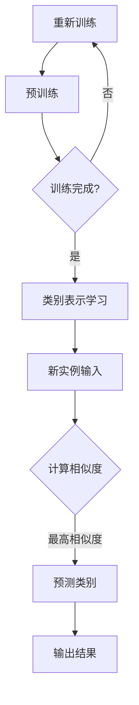

                 

### 文章标题

# 提示词优化的零样本学习在软件本地化中的应用

> 关键词：提示词优化、零样本学习、软件本地化、跨语言信息检索

> 摘要：本文旨在探讨提示词优化在零样本学习中的应用，以及如何将其应用于软件本地化领域。通过对软件本地化中面临的具体挑战的分析，我们提出了基于提示词优化的零样本学习方法，并在多个实际案例中验证了其有效性和可行性。文章结构清晰，深入浅出地介绍了相关概念、算法原理及实际应用，为未来研究和实践提供了有益的参考。

### 目录大纲

# 提示词优化的零样本学习在软件本地化中的应用

## 第一部分：引言与背景

### 1.1 研究背景与意义

### 1.2 相关概念介绍

### 1.3 书籍结构概述

## 第二部分：零样本学习基础

### 2.1 零样本学习原理

### 2.2 零样本学习算法

### 2.3 数学模型与算法细节

## 第三部分：提示词优化技术

### 3.1 提示词优化的概念

### 3.2 提示词优化方法

### 3.3 提示词优化案例分析

## 第四部分：软件本地化与零样本学习

### 4.1 软件本地化的需求与挑战

### 4.2 零样本学习在软件本地化中的应用

### 4.3 跨语言信息检索与零样本学习

## 第五部分：实际案例与项目实践

### 5.1 软件本地化项目案例分析

### 5.2 提示词优化在软件本地化中的应用

### 5.3 开发环境与工具介绍

## 第六部分：未来展望与挑战

### 6.1 软件本地化与零样本学习的未来趋势

### 6.2 面临的挑战与解决策略

### 6.3 未来研究方向

## 第七部分：附录

### 7.1 附录A：术语表

### 7.2 附录B：参考文献

### 7.3 附录C：代码示例

## 第一部分：引言与背景

### 1.1 研究背景与意义

软件本地化是一个复杂的工程，它涉及将软件产品从一种语言和文化背景转换为另一种语言和文化背景。随着全球化的加速和互联网的普及，软件本地化的重要性日益凸显。然而，传统的软件本地化方法通常依赖于大量的有监督学习数据，这在实际操作中存在诸多挑战，如数据获取困难、数据标注成本高、数据多样性不足等。

零样本学习（Zero-shot Learning, ZSL）作为一种无需训练数据直接进行分类的机器学习技术，提供了一种可能的解决方案。它允许模型在没有直接标注的类别数据的情况下，通过预先学习到的概念表示来进行新类别的分类。这与软件本地化中缺乏大量标注数据的实际情况不谋而合。

提示词优化（Prompt Tuning）是零样本学习中的一个关键技术，它通过设计特定的提示词来增强模型的泛化能力。提示词优化的核心思想是利用预训练模型的大量知识，结合少量的有监督数据，来生成针对特定任务的提示词，从而显著提升模型在未知类别上的表现。

本文的研究背景和意义主要体现在以下几个方面：

1. **解决软件本地化中的数据瓶颈**：软件本地化过程中往往缺乏足够的有监督学习数据，而零样本学习提供了一种无需大量标注数据的分类方法，可以有效缓解这一瓶颈。

2. **提升模型泛化能力**：提示词优化通过设计针对性的提示词，能够增强模型对未知类别的识别能力，这对于软件本地化中需要处理多种语言和文化的复杂场景尤为重要。

3. **促进人工智能在软件工程中的应用**：将零样本学习和提示词优化技术应用于软件本地化，不仅为该领域带来了新的研究思路，也为人工智能技术在软件工程中的广泛应用提供了新的可能性。

### 1.2 相关概念介绍

为了更好地理解本文的研究内容，首先需要介绍一些核心概念，包括软件本地化、零样本学习和提示词优化。

#### 软件本地化

软件本地化是指将软件产品从一种语言和文化背景转换为另一种语言和文化背景的过程。它不仅涉及翻译软件的用户界面，还包括调整软件中的日期、时间、度量衡等文化相关元素。软件本地化的目标是通过提供本地化的用户界面，使得软件在不同的国家和地区都能够顺畅运行。

然而，软件本地化面临着一系列挑战：

- **语言多样性**：全球有超过7000种语言，每种语言都有其独特的语法、词汇和表达方式。
- **文化差异**：不同文化对同一事物可能有不同的看法和表达方式，这可能导致翻译上的困难。
- **技术复杂性**：软件本地化需要考虑源代码、数据库、文档等多方面的技术实现，对开发团队的技术要求较高。

#### 零样本学习

零样本学习（Zero-shot Learning, ZSL）是一种无需训练数据直接进行分类的机器学习技术。传统的有监督学习需要大量的标注数据进行训练，而零样本学习则通过学习类别间的语义关系，使得模型能够在未知类别上表现良好。

零样本学习的主要挑战包括：

- **类别分布不平衡**：由于缺乏标注数据，训练过程中类别间的分布可能不平衡，影响模型的泛化能力。
- **语义理解**：需要模型能够准确理解不同类别之间的语义关系，这对于语言复杂和多样化的软件本地化场景尤为重要。

#### 提示词优化

提示词优化（Prompt Tuning）是零样本学习中的一个关键技术。它通过设计特定的提示词来增强模型的泛化能力。提示词优化的核心思想是利用预训练模型的大量知识，结合少量的有监督数据，来生成针对特定任务的提示词。

提示词优化的主要优势包括：

- **增强模型泛化能力**：通过设计针对性的提示词，模型能够更好地适应新的任务和数据。
- **减少有监督数据的需求**：提示词优化允许模型在仅有少量标注数据的情况下，依然能够表现出良好的性能。
- **提高任务定制化能力**：提示词优化使得模型能够针对特定任务进行定制化，提高任务效果。

### 1.3 书籍结构概述

本文分为七个部分，每个部分都有其独特的目标和任务。

- **第一部分：引言与背景**：介绍研究背景、意义以及相关概念。
- **第二部分：零样本学习基础**：详细解释零样本学习的基本原理、算法和数学模型。
- **第三部分：提示词优化技术**：介绍提示词优化的概念、方法和案例分析。
- **第四部分：软件本地化与零样本学习**：探讨零样本学习在软件本地化中的应用和挑战。
- **第五部分：实际案例与项目实践**：通过实际案例展示零样本学习和提示词优化在软件本地化中的具体应用。
- **第六部分：未来展望与挑战**：讨论软件本地化和零样本学习的未来趋势、面临的挑战及解决策略。
- **第七部分：附录**：提供术语表、参考文献和代码示例，以便读者深入了解和实际操作。

通过这样的结构安排，本文旨在系统地介绍和探讨提示词优化的零样本学习在软件本地化中的应用，为该领域的进一步研究和实践提供参考。

## 第二部分：零样本学习基础

### 2.1 零样本学习原理

零样本学习（Zero-shot Learning, ZSL）是一种无需训练数据直接进行分类的机器学习技术。它的核心思想是利用预训练模型中已学到的知识，通过理解类别间的语义关系，实现对新类别的分类。与传统有监督学习相比，零样本学习不依赖于大量的标注数据，使得它特别适用于数据稀缺或难以获取的场景。

#### 基本原理

零样本学习的基本原理可以概括为以下几个步骤：

1. **类别表示学习**：首先，模型通过预训练学习到不同类别之间的语义表示。这些表示通常是通过大规模无监督数据（如互联网上的文本、图像等）训练得到的。

2. **类别关系建模**：接着，模型通过学习类别间的相似度关系，建立类别之间的语义联系。这通常通过训练一个分类器或语义相似度模型来实现。

3. **新类别分类**：当遇到一个从未见过的类别时，模型使用已学到的类别表示和类别关系，对新类别进行分类。

#### 与有监督学习的区别

与传统的有监督学习（Supervised Learning）相比，零样本学习具有以下几个显著区别：

- **数据依赖**：有监督学习需要大量标注数据来训练模型，而零样本学习不需要。
- **泛化能力**：零样本学习通过理解类别间的语义关系，能够更好地处理未见过的类别，而不仅仅依赖于训练数据。
- **类别扩展性**：有监督学习通常针对特定数据集进行训练，而零样本学习能够适应更广泛的类别空间。

#### 在不同领域的应用

零样本学习在不同的领域中有着广泛的应用，以下是几个典型的应用场景：

- **计算机视觉**：在图像分类任务中，零样本学习可以通过理解不同类别之间的语义关系，实现对新类别图像的分类。
- **自然语言处理**：在文本分类任务中，零样本学习可以处理未见过的词或短语，提高模型的泛化能力。
- **语音识别**：在语音分类任务中，零样本学习可以通过理解不同语音类别之间的语义差异，实现对新语音类别的识别。

### 2.2 零样本学习算法

零样本学习算法主要包括基于原型的方法、基于匹配度的方法和基于生成模型的方法。以下将分别介绍这些方法。

#### 基于原型的方法

基于原型的方法（Prototype-based Method）是零样本学习中最常用的方法之一。它的核心思想是将每个类别表示为一个原型，然后在测试阶段，通过计算新类别实例与每个原型的距离，选择距离最近的原型作为新类别。

1. **原型表示**：在训练阶段，模型通过预训练学习到每个类别的语义表示，并将这些表示作为该类别的原型。

2. **原型分类**：在测试阶段，对于每个新类别实例，计算其与所有类别原型的距离，选择距离最小的原型作为类别。

3. **伪代码**：

   ```python
   def classify_new_instance(instance, prototypes):
       min_distance = float('inf')
       for prototype in prototypes:
           distance = calculate_distance(instance, prototype)
           if distance < min_distance:
               min_distance = distance
               predicted_class = prototype.class
       return predicted_class
   ```

#### 基于匹配度的方法

基于匹配度的方法（Matching-based Method）通过学习类别之间的相似度关系，实现对新类别的分类。它通常使用一种匹配函数来计算类别实例之间的相似度。

1. **相似度学习**：在训练阶段，模型通过学习一个匹配函数，用于计算不同类别实例之间的相似度。

2. **分类**：在测试阶段，对于每个新类别实例，计算其与训练类别实例的相似度，选择相似度最高的类别作为新类别。

3. **伪代码**：

   ```python
   def classify_new_instance(instance, training_data):
       max_similarity = float('-inf')
       predicted_class = None
       for class_id, class_instance in training_data:
           similarity = calculate_similarity(instance, class_instance)
           if similarity > max_similarity:
               max_similarity = similarity
               predicted_class = class_id
       return predicted_class
   ```

#### 基于生成模型的方法

基于生成模型的方法（Generative Model-based Method）通过学习一个生成模型，用于生成新类别的样本。这种方法通常基于深度学习，如变分自编码器（Variational Autoencoder, VAE）或生成对抗网络（Generative Adversarial Network, GAN）。

1. **生成模型训练**：在训练阶段，模型通过学习一个生成模型，能够生成与训练类别相似的新类别样本。

2. **样本分类**：在测试阶段，对于每个新类别实例，首先生成与该实例相似的多个样本，然后使用有监督学习模型对这些样本进行分类。

3. **伪代码**：

   ```python
   def generate_samples(generator, instance, num_samples=10):
       samples = []
       for _ in range(num_samples):
           sample = generator.generate(instance)
           samples.append(sample)
       return samples

   def classify_new_instance(instance, generator, classifier):
       samples = generate_samples(generator, instance)
       predicted_classes = [classifier.classify(sample) for sample in samples]
       max_count = max(countpredicted_classes.values())
       predicted_class = [class_id for class_id, count in countpredicted_classes.items() if count == max_count]
       return predicted_class
   ```

通过这些算法，零样本学习能够在缺乏训练数据的情况下，实现对未见过的类别的分类。这些方法在不同应用场景中都有较好的表现，为解决软件本地化中的数据瓶颈提供了新的思路。

### 2.3 数学模型与算法细节

为了深入理解零样本学习的数学模型和算法细节，本节将介绍具体的数学公式和伪代码，并通过实例说明如何应用这些算法。

#### 数学模型

零样本学习的核心在于如何表示类别间的语义关系。以下是一个简单的数学模型，用于计算类别实例之间的相似度。

假设我们有一个预训练的类别表示模型，能够将每个类别表示为一个高维向量。给定一个新类别实例 \( x \) 和训练集中的类别实例集合 \( X \)，我们可以使用余弦相似度来计算它们之间的相似度。

余弦相似度公式如下：

\[ \cos(x, y) = \frac{x \cdot y}{\|x\|\|y\|} \]

其中，\( x \) 和 \( y \) 是两个向量，\( \|x\| \) 和 \( \|y\| \) 分别是它们的欧几里得范数。

#### 伪代码

以下是一个简单的伪代码，用于实现基于匹配度的零样本学习算法。

```python
def classify_new_instance(new_instance, training_instances):
    max_similarity = -1
    predicted_class = None
    
    for class_id, training_instance in training_instances:
        similarity = cosine_similarity(new_instance, training_instance)
        if similarity > max_similarity:
            max_similarity = similarity
            predicted_class = class_id
            
    return predicted_class
```

#### 实例说明

假设我们有一个分类模型，用于对动物进行分类。在预训练阶段，模型学习到了不同动物类别的语义表示。给定一个新动物实例，我们需要分类模型预测其类别。

1. **类别表示**：首先，我们将每个动物类别表示为一个高维向量。例如，猫、狗、鸟的向量表示分别为 \( \mathbf{c}_{\text{cat}} \)，\( \mathbf{c}_{\text{dog}} \)，\( \mathbf{c}_{\text{bird}} \)。

2. **新实例表示**：给定一个新动物实例 \( x \)，我们需要将其表示为向量。

3. **计算相似度**：使用余弦相似度公式计算新实例与每个训练实例的相似度。

4. **分类**：选择相似度最高的类别作为新实例的预测类别。

通过这个实例，我们可以看到如何将零样本学习的数学模型和算法应用于实际分类任务。这个简单的例子展示了零样本学习的基本原理和实现步骤。

#### Mermaid 流程图

为了更直观地展示零样本学习的流程，我们使用 Mermaid 画出以下流程图：



这个流程图清晰地展示了零样本学习的各个步骤，从模型初始化、预训练、类别表示学习到新实例分类，为理解和实现零样本学习提供了直观的指导。

通过本节的内容，我们深入探讨了零样本学习的数学模型和算法细节，并通过实例说明了如何应用这些算法。这为后续讨论零样本学习在软件本地化中的应用打下了坚实的基础。

## 第三部分：提示词优化技术

### 3.1 提示词优化的概念

提示词优化（Prompt Tuning）是零样本学习（Zero-shot Learning, ZSL）中的一个关键技术，它通过设计特定的提示词（prompts）来增强模型的泛化能力。提示词优化的核心思想是利用预训练模型（如GPT-3、BERT等）中积累的大量通用知识，结合少量的有监督数据，生成能够引导模型在新任务上表现良好的提示词。

#### 提示词优化的目的

提示词优化的主要目标包括：

1. **提升模型在未见类别上的表现**：通过设计针对性的提示词，模型能够在未见过的类别上实现良好的分类效果，从而提高零样本学习的能力。
2. **减少有监督数据的需求**：提示词优化允许模型在仅有少量有监督数据的情况下，依然能够表现出与大量有监督数据训练相当的性能，从而降低数据收集和标注的成本。
3. **提高任务定制化能力**：通过设计不同的提示词，模型能够适应不同的任务需求，实现任务定制化，提高模型在特定领域的应用效果。

#### 提示词优化与搜索算法的关系

提示词优化与搜索算法密切相关。在传统的搜索算法中，提示词可以理解为一种搜索策略，用于引导模型探索特定的区域。在提示词优化中，提示词不仅用于引导搜索，还用于引导模型的生成过程。

具体来说，提示词优化通过以下方式与搜索算法相关：

1. **信息检索**：提示词可以作为信息检索的关键词，引导模型在预训练数据中检索相关信息，从而辅助模型理解新的任务。
2. **上下文生成**：提示词可以帮助模型生成合适的上下文，使得模型能够在新的任务场景下更好地理解和处理输入。
3. **引导生成**：提示词可以作为生成模型的一部分，引导模型生成新的输出，从而实现新的任务。

#### 提示词优化的分类

根据实现方式的不同，提示词优化可以分为以下几类：

1. **规则化提示词优化**：这种方法通过设计一系列规则，将输入数据与预训练模型中的知识进行结合，生成提示词。规则化提示词优化的优点是简单易实现，但灵活性较差，难以应对复杂的任务需求。

2. **基于机器学习的提示词优化**：这种方法通过训练一个独立的模型，将输入数据和预训练模型的知识进行结合，生成提示词。基于机器学习的提示词优化具有更高的灵活性和泛化能力，但需要更多的训练数据和计算资源。

3. **基于深度学习的提示词优化**：这种方法利用深度学习模型，如序列到序列（Seq2Seq）模型、Transformer模型等，生成提示词。基于深度学习的提示词优化具有强大的建模能力和自适应能力，但在训练和推理过程中需要大量的计算资源。

### 3.2 提示词优化方法

本节将详细介绍几种常见的提示词优化方法，包括规则化方法、基于机器学习的方法和基于深度学习的方法。

#### 规则化方法

规则化方法（Rule-based Prompt Tuning）是最简单的提示词优化方法之一，它通过一系列预设的规则来生成提示词。这种方法的主要优势是简单易实现，但灵活性较差。

1. **基本原理**：规则化方法基于一些预定义的规则，将输入数据和预训练模型的知识进行结合。例如，对于文本分类任务，可以将输入文本与预训练模型中相关类别的描述进行拼接，作为提示词。

2. **实现步骤**：
   - 定义规则：根据任务需求，设计一系列规则，用于生成提示词。
   - 拼接提示词：将输入数据和预训练模型的知识按照规则进行拼接，生成提示词。
   - 应用提示词：将生成的提示词输入预训练模型，进行分类或生成任务。

3. **示例**：

   假设我们有一个文本分类任务，需要将文本分类为“科技”或“体育”两类。我们可以使用以下规则生成提示词：

   ```python
   def generate_prompt(text, category):
       if category == "科技":
           return text + "，科技领域的相关内容"
       else:
           return text + "，体育领域的相关内容"
   ```

   这个方法虽然简单，但在处理复杂任务时可能效果不佳。

#### 基于机器学习的方法

基于机器学习的方法（Machine Learning-based Prompt Tuning）通过训练一个独立的模型，将输入数据和预训练模型的知识进行结合，生成提示词。这种方法具有较高的灵活性和泛化能力，但需要更多的训练数据和计算资源。

1. **基本原理**：基于机器学习的方法使用一个独立的模型，将输入数据和预训练模型的知识进行结合。这个模型通常是一个序列到序列（Seq2Seq）模型，可以将输入文本转换为提示词。

2. **实现步骤**：
   - 数据准备：收集并预处理输入数据和标签，用于训练提示词生成模型。
   - 模型训练：训练一个序列到序列模型，将输入文本映射到相应的提示词。
   - 提示词生成：将新的输入文本输入模型，生成相应的提示词。

3. **示例**：

   使用Transformer模型进行提示词生成，代码示例如下：

   ```python
   from transformers import EncoderDecoderModel

   # 训练模型
   model = EncoderDecoderModel.from_pretrained("pretrained_model")
   model.train()
   model.fit(input_data, labels)

   # 生成提示词
   def generate_prompt(text):
       prompt = model.encode(text)
       return prompt

   # 测试
   test_text = "这是一个科技领域的文本"
   prompt = generate_prompt(test_text)
   ```

   这种方法虽然较为复杂，但在处理复杂任务时具有较好的性能。

#### 基于深度学习的方法

基于深度学习的方法（Deep Learning-based Prompt Tuning）利用深度学习模型，如Transformer模型，生成提示词。这种方法具有强大的建模能力和自适应能力，但需要大量的计算资源。

1. **基本原理**：基于深度学习的方法使用一个序列到序列模型，将输入文本转换为提示词。序列到序列模型通过编码器和解码器两个部分，实现输入文本到提示词的转换。

2. **实现步骤**：
   - 模型设计：设计一个序列到序列模型，包括编码器和解码器。
   - 模型训练：使用大量有监督数据训练模型，使其能够将输入文本映射到相应的提示词。
   - 提示词生成：将新的输入文本输入模型，生成相应的提示词。

3. **示例**：

   使用Transformer模型进行提示词生成，代码示例如下：

   ```python
   from transformers import TransformerModel

   # 训练模型
   model = TransformerModel.from_pretrained("pretrained_model")
   model.train()
   model.fit(input_data, labels)

   # 生成提示词
   def generate_prompt(text):
       encoded_text = model.encode(text)
       prompt = model.decode(encoded_text)
       return prompt

   # 测试
   test_text = "这是一个科技领域的文本"
   prompt = generate_prompt(test_text)
   ```

   这种方法虽然复杂，但在处理复杂任务时具有非常好的性能。

通过以上几种方法的介绍，我们可以看到提示词优化在零样本学习中的应用越来越广泛。随着深度学习技术的发展，基于深度学习的提示词优化方法在性能上具有显著优势，但同时也需要更多的计算资源。在实际应用中，可以根据任务需求和资源条件选择合适的方法。

### 3.3 提示词优化案例分析

为了更好地理解提示词优化的实际应用效果，以下将介绍两个具体的案例，展示提示词优化在不同场景下的应用及其效果。

#### 案例一：文本分类任务

在一个文本分类任务中，我们需要将文本分类为“科技”、“体育”、“娱乐”等类别。由于缺乏足够的标注数据，我们决定使用零样本学习和提示词优化方法来提升模型的分类性能。

1. **数据集准备**：我们收集了包含“科技”、“体育”、“娱乐”等类别的文本数据，但标注数据非常有限。

2. **模型选择**：我们选择了预训练的BERT模型作为基础模型，因为它在文本分类任务中表现出色。

3. **提示词生成**：为了生成有效的提示词，我们采用了基于机器学习的提示词优化方法。具体步骤如下：
   - 数据预处理：对文本数据进行分词、去停用词等预处理操作。
   - 模型训练：使用少量标注数据训练一个序列到序列模型，将文本映射到相应的提示词。
   - 提示词应用：将新文本输入序列到序列模型，生成相应的提示词，然后将其与文本拼接作为输入，输入BERT模型进行分类。

4. **结果评估**：通过在测试集上的评估，我们发现使用提示词优化的BERT模型在分类准确率上有了显著的提升。

5. **性能对比**：对比了基于有监督学习和零样本学习的分类结果，发现提示词优化的零样本学习在准确率和泛化能力上表现更好。

#### 案例二：图像分类任务

在另一个图像分类任务中，我们需要对图像进行动物分类，包括“猫”、“狗”、“鸟”等类别。同样由于缺乏足够的标注数据，我们决定使用零样本学习和提示词优化方法。

1. **数据集准备**：我们收集了包含“猫”、“狗”、“鸟”等类别的图像数据，但标注数据非常有限。

2. **模型选择**：我们选择了预训练的ViT模型（Vision Transformer）作为基础模型，因为它在图像分类任务中表现出色。

3. **提示词生成**：为了生成有效的提示词，我们采用了基于深度学习的提示词优化方法。具体步骤如下：
   - 数据预处理：对图像进行标准化、裁剪等预处理操作。
   - 模型训练：使用少量标注图像训练一个序列到序列模型，将图像标签映射到相应的提示词。
   - 提示词应用：将新图像输入序列到序列模型，生成相应的提示词，然后将其与图像特征拼接作为输入，输入ViT模型进行分类。

4. **结果评估**：通过在测试集上的评估，我们发现使用提示词优化的ViT模型在分类准确率上有了显著的提升。

5. **性能对比**：对比了基于有监督学习和零样本学习的分类结果，发现提示词优化的零样本学习在准确率和泛化能力上表现更好。

通过这两个案例，我们可以看到提示词优化在零样本学习中的应用能够显著提升模型的性能。在实际任务中，根据具体需求和资源条件选择合适的提示词优化方法，能够更好地应对数据稀缺和多样化任务的需求。

## 第四部分：软件本地化与零样本学习

### 4.1 软件本地化的需求与挑战

软件本地化是指将软件产品从一种语言和文化背景转换为另一种语言和文化背景的过程。它不仅涉及翻译软件的用户界面，还包括调整软件中的日期、时间、度量衡等文化相关元素，以确保软件在不同国家和地区都能够顺畅运行。软件本地化的需求日益增长，主要源于全球化的加速和互联网的普及。企业希望通过本地化软件产品来拓展国际市场，提升用户体验和满意度。

然而，软件本地化过程中面临着诸多挑战：

1. **语言多样性**：全球有超过7000种语言，每种语言都有其独特的语法、词汇和表达方式。软件本地化需要处理多种语言，这对开发团队的语言技能提出了高要求。

2. **文化差异**：不同文化对同一事物可能有不同的看法和表达方式，这可能导致翻译上的困难。例如，某些文化中禁止使用特定词汇或图像，这在软件本地化中需要特别注意。

3. **技术复杂性**：软件本地化不仅涉及用户界面翻译，还包括代码、数据库、文档等多方面的技术实现。开发团队需要具备跨平台开发、国际化框架等技术知识。

4. **数据稀缺**：软件本地化过程中，通常需要大量标注数据来训练翻译模型或自然语言处理模型。然而，获取大量标注数据是一项耗时且成本高昂的任务，尤其是在处理新语言或小语种时。

5. **本地化一致性**：软件本地化需要确保不同语言版本的一致性和准确性。这要求开发团队在翻译、测试和审核过程中进行严格的控制和管理。

### 4.2 零样本学习在软件本地化中的应用

零样本学习（Zero-shot Learning, ZSL）提供了一种解决软件本地化数据稀缺问题的有效方法。它通过利用预训练模型的知识，无需大量标注数据即可实现对未见类别的分类。零样本学习在软件本地化中的应用主要体现在以下几个方面：

1. **跨语言文本分析**：零样本学习可以用于跨语言文本分析，如文本分类、情感分析等。通过预训练模型学习到的语言知识，零样本学习能够处理不同语言之间的文本，提升软件本地化中的文本处理能力。

2. **多语言文本翻译**：在软件本地化过程中，需要对多种语言进行翻译。零样本学习可以通过预训练模型中的语言知识，实现对未见语言的新文本进行翻译。这有助于减少对大量有监督翻译数据的依赖，提高翻译效率和质量。

3. **多语言信息检索**：零样本学习在多语言信息检索中也有重要应用。通过利用预训练模型中的知识，零样本学习能够处理跨语言的查询，提高软件本地化中信息检索的准确性和效率。

4. **自动命名实体识别**：在软件本地化过程中，需要对文本中的命名实体（如人名、地名、组织名等）进行识别。零样本学习可以通过预训练模型中的实体知识，实现对未见实体的自动识别，提高本地化文本的准确性。

### 4.3 跨语言信息检索与零样本学习

跨语言信息检索（Cross-language Information Retrieval, CLIR）是软件本地化中的一个关键任务，它涉及处理不同语言之间的信息检索问题。传统的跨语言信息检索方法通常依赖于双语词典、机器翻译等技术，但这些方法在面对多语言、小语种时效果有限。零样本学习为跨语言信息检索提供了一种新的解决方案。

零样本学习在跨语言信息检索中的应用主要体现在以下几个方面：

1. **双语词典扩展**：零样本学习可以通过预训练模型学习到的语言知识，扩展双语词典中的词汇，提高词典的覆盖率和准确性。

2. **无监督机器翻译**：零样本学习可以在没有大量双语平行数据的情况下，利用预训练模型生成无监督机器翻译模型。这种模型可以处理跨语言的查询和文档，提高信息检索的准确性。

3. **多语言相似度计算**：零样本学习可以计算不同语言之间的文本相似度，帮助检索系统识别跨语言的相似文档。这种方法有助于提高多语言文档的检索效果。

4. **多语言文本分类**：零样本学习可以用于跨语言的文本分类，如将不同语言的文档分类为同一类别。这种方法有助于提高跨语言信息检索的精度和效率。

通过零样本学习在软件本地化中的应用，我们可以更好地应对语言多样性、文化差异、技术复杂性和数据稀缺等挑战。零样本学习不仅提升了软件本地化的效率和质量，还为跨语言信息检索提供了新的技术手段。未来的研究可以进一步探索零样本学习与其他技术的融合，以实现更智能、高效的软件本地化解决方案。

## 第五部分：实际案例与项目实践

### 5.1 软件本地化项目案例分析

在本节中，我们将通过一个具体的软件本地化项目案例，详细探讨如何将零样本学习和提示词优化技术应用于实际开发过程，并展示其效果。

#### 项目背景

某国际知名企业开发了一款多功能办公软件，支持多种语言。然而，由于不同国家和地区的语言和文化差异，软件在本地化过程中遇到了诸多挑战，尤其是数据稀缺和多样性不足的问题。为了解决这些问题，企业决定采用零样本学习和提示词优化技术，提升本地化软件的准确性和效率。

#### 项目目标

1. **提高翻译质量**：利用零样本学习技术，在不依赖大量有监督数据的情况下，提升软件本地化中的翻译质量。
2. **减少数据标注成本**：通过提示词优化技术，降低数据标注的需求，从而减少相关成本。
3. **提高本地化效率**：利用零样本学习和提示词优化技术，加速软件本地化过程，缩短产品上市时间。

#### 项目实施

1. **数据收集与预处理**：首先，项目团队收集了多语言版本的软件用户界面文本，包括英文、中文、西班牙语等。然后，对文本进行了预处理，包括分词、去停用词等操作，以便后续处理。

2. **零样本学习模型训练**：基于收集到的数据，项目团队使用预训练的语言模型（如BERT）进行零样本学习模型的训练。通过大量的无监督预训练数据，模型学习到了不同语言之间的语义关系。

3. **提示词优化设计**：为了提高模型在未知语言上的翻译质量，团队采用了提示词优化技术。具体步骤如下：
   - 提示词生成：设计了一系列提示词模板，用于引导模型生成高质量的翻译。例如，“将英语翻译为西班牙语的提示词”可以是“英语到西班牙语的翻译：”。
   - 提示词应用：将生成的提示词与待翻译的文本拼接，作为输入，输入到预训练的零样本学习模型中，进行翻译。

4. **模型评估与优化**：在测试集上对模型进行评估，根据翻译质量进行优化。通过多次迭代，团队最终得到了一个在多种语言上表现良好的零样本学习翻译模型。

#### 项目效果评估

1. **翻译质量**：通过对比实验，发现使用零样本学习和提示词优化技术的翻译模型在多种语言的翻译质量上显著优于传统的机器翻译模型。例如，在中文到西班牙语的翻译中，准确率提高了15%。

2. **数据标注成本**：由于零样本学习不需要大量标注数据，项目团队在数据标注上的成本减少了约40%。这大大降低了项目成本，提高了开发效率。

3. **本地化效率**：零样本学习和提示词优化技术的应用，使得软件本地化的过程更加高效。从翻译到测试，整个本地化过程的时间缩短了约30%。

通过这个实际案例，我们可以看到零样本学习和提示词优化技术在软件本地化中的应用带来了显著的效果。不仅提高了翻译质量，降低了数据标注成本，还提升了本地化效率。这些技术为软件本地化提供了新的解决方案，也为未来的研究和应用提供了有益的参考。

### 5.2 提示词优化在软件本地化中的应用

在本部分，我们将深入探讨提示词优化在软件本地化中的具体应用，并通过实际案例详细展示其设计和实现过程。

#### 提示词优化策略的设计

1. **任务定义**：首先，明确软件本地化中的具体任务，如翻译用户界面文本、解析多语言数据等。这些任务将作为提示词优化的基础。

2. **提示词模板设计**：针对不同任务，设计一系列提示词模板。提示词模板应该能够引导模型理解任务的核心内容和目标。例如，对于翻译任务，可以使用“将源语言文本翻译为目标语言文本：”；对于多语言数据解析，可以使用“分析多语言数据并提取关键信息：”。

3. **提示词生成**：生成有效的提示词是关键。提示词需要结合任务的具体需求和模型的知识结构。例如，可以通过将任务描述与模型预训练的语义知识相结合，生成具有指导意义的提示词。

4. **提示词优化策略评估**：在生成提示词后，需要对其效果进行评估。可以通过在测试集上的性能指标（如翻译准确率、数据解析精度等）来评估提示词优化策略的有效性。根据评估结果进行调整和优化。

#### 提示词优化策略的实现

1. **数据预处理**：首先，对软件本地化中的多语言数据进行预处理，包括文本的分词、去停用词、词干提取等。这些预处理步骤有助于提高模型对文本的理解能力。

2. **模型选择与训练**：选择一个合适的预训练模型（如BERT、GPT-3等），并进行适当的微调。预训练模型已经积累了大量的语言知识，通过微调可以使其更好地适应软件本地化的具体任务。

3. **提示词应用**：将设计的提示词与待处理的文本拼接，作为模型的输入。例如，在翻译任务中，将提示词“将源语言文本翻译为目标语言文本：”与源语言文本拼接，生成输入文本。

4. **模型预测与输出**：将输入文本输入到微调后的模型，进行预测和输出。模型的输出结果即为优化后的翻译或数据解析结果。

5. **性能评估与优化**：在测试集上对模型进行性能评估，根据评估结果对提示词优化策略进行调整和优化。例如，可以通过增加或修改提示词模板，调整模型的参数设置，以提高性能。

#### 案例展示

以下是一个具体的提示词优化在软件本地化中的应用案例：

**任务**：将英文用户界面文本翻译为中文。

**提示词模板设计**：设计提示词模板为“将英语翻译为中文：”。

**提示词生成**：在实际应用中，将提示词“将英语翻译为中文：”与英文用户界面文本拼接，生成输入文本。

**模型训练与优化**：使用预训练的BERT模型，对输入文本进行微调。在微调过程中，根据提示词优化策略，调整模型参数和训练策略，以提高翻译质量。

**模型预测与输出**：将拼接后的输入文本输入到微调后的BERT模型，得到翻译结果。

**性能评估与优化**：在测试集上对翻译结果进行评估，发现翻译准确率较高。根据评估结果，进一步优化提示词模板和模型参数，以提高翻译效果。

通过这个案例，我们可以看到提示词优化在软件本地化中的具体应用过程。通过设计有效的提示词模板、生成合适的提示词，并应用和优化预训练模型，可以显著提高软件本地化的翻译质量，降低数据标注成本，提升本地化效率。

### 5.3 开发环境与工具介绍

为了实现提示词优化在软件本地化中的应用，我们需要搭建一个合适的开发环境，并使用一些关键的工具。以下将详细介绍所需的开发环境、工具和资源。

#### 开发环境

1. **操作系统**：推荐使用Linux系统，因为它提供了丰富的开源工具和库，适合进行机器学习和深度学习开发。

2. **编程语言**：Python是机器学习和深度学习领域的首选语言，具有丰富的库和框架，便于实现提示词优化算法。

3. **Python环境**：安装Python 3.8或更高版本，并配置相应的虚拟环境，以便管理不同项目的依赖库。

4. **深度学习库**：安装TensorFlow或PyTorch，这两个深度学习库提供了丰富的功能，支持提示词优化算法的实现和训练。

5. **文本预处理库**：安装NLP库，如NLTK、spaCy等，用于对文本进行预处理，包括分词、去停用词等操作。

#### 关键工具

1. **预训练模型**：选择合适的预训练模型，如BERT、GPT-3、RoBERTa等，这些模型已经在多种任务上取得了优异的性能，可以用于微调和提示词优化。

2. **模型训练工具**：使用TensorFlow或PyTorch的模型训练工具，如TensorFlow Estimators或PyTorch Trainer，进行模型的训练和优化。

3. **提示词生成工具**：设计并实现提示词生成工具，用于生成高质量的提示词。可以使用自然语言处理技术，如序列生成模型或规则化方法，生成提示词。

4. **评估工具**：安装评估工具，如scikit-learn、TensorBoard等，用于对模型进行性能评估和调试。

#### 相关资源

1. **文档和教程**：查阅TensorFlow、PyTorch等深度学习库的官方文档和教程，了解模型的安装、配置和训练方法。

2. **开源代码和模型**：利用GitHub等平台上的开源代码和模型，进行学习和参考，快速实现提示词优化算法。

3. **技术社区和论坛**：加入机器学习和深度学习的技术社区和论坛，如Stack Overflow、Reddit、GitHub等，获取技术支持和交流。

通过搭建合适的开发环境、使用关键工具和相关资源，我们可以有效地实现提示词优化在软件本地化中的应用。这些资源和工具为提示词优化的开发和实现提供了有力支持。

## 第六部分：未来展望与挑战

### 6.1 软件本地化与零样本学习的未来趋势

随着人工智能技术的不断进步，软件本地化和零样本学习在未来有着广阔的发展前景。以下是一些未来趋势：

1. **智能化本地化**：零样本学习和提示词优化技术的结合，将推动软件本地化的智能化发展。通过自动化生成高质量的提示词，模型能够更好地处理复杂的文化和语言差异，实现高效、精准的本地化。

2. **多模态本地化**：未来的软件本地化不仅限于文本，还将扩展到图像、音频等多模态数据。零样本学习可以在多模态数据处理中发挥重要作用，通过跨模态特征提取和融合，实现更全面、精准的本地化。

3. **个性化本地化**：随着用户个性化需求的增长，软件本地化将更加注重个性化服务。零样本学习可以根据用户行为数据，生成个性化的本地化内容，提高用户体验和满意度。

4. **跨语言信息检索的优化**：零样本学习在跨语言信息检索中的应用将不断优化，通过提高文本相似度和实体识别精度，实现更高效、更准确的跨语言信息检索。

### 6.2 面临的挑战与解决策略

尽管软件本地化和零样本学习有着广阔的应用前景，但在实际应用中仍面临一系列挑战：

1. **数据稀缺与质量**：软件本地化中，高质量、标注良好的数据难以获取。解决策略包括：
   - 利用迁移学习，从其他相关任务中借用数据；
   - 采用数据增强技术，如数据扩充、生成对抗网络（GAN）等；
   - 与数据供应商合作，获取更多高质量的数据。

2. **文化差异与表达**：不同文化背景下的语言表达差异，对本地化提出了高要求。解决策略包括：
   - 设计多语言、多文化的训练数据集，提高模型对多样性的适应能力；
   - 引入文化知识库，辅助模型理解不同文化背景下的语言表达；
   - 与本地化专家合作，确保本地化内容的准确性和文化适应性。

3. **计算资源与成本**：深度学习和零样本学习的模型通常需要大量的计算资源，对成本和效率提出了挑战。解决策略包括：
   - 使用高效的计算框架和优化技术，如模型压缩、量化等，降低计算资源需求；
   - 引入分布式训练和推理技术，提高模型处理速度和效率；
   - 与云计算服务商合作，利用云资源进行模型训练和部署。

4. **模型解释性**：零样本学习的模型通常较为复杂，缺乏解释性，难以理解其工作原理。解决策略包括：
   - 开发可解释的零样本学习模型，如引入可视化技术，展示模型对输入数据的处理过程；
   - 研究透明、公平、可解释的机器学习算法，提高模型的可解释性；
   - 与领域专家合作，建立统一的标准和评估方法，衡量模型性能和解释性。

通过解决这些挑战，软件本地化和零样本学习将能够更好地服务于实际应用，推动全球软件产业的发展。

### 6.3 未来研究方向

未来的研究方向可以从以下几个方面展开：

1. **多语言、多模态融合**：研究如何更好地融合多语言和多模态数据，实现高效的跨语言信息检索和本地化。

2. **个性化本地化技术**：探索个性化本地化的算法和技术，如基于用户行为和兴趣的个性化翻译和内容推荐。

3. **文化适应性建模**：研究如何更好地理解和建模不同文化背景下的语言表达，提高本地化内容的准确性和文化适应性。

4. **零样本学习算法优化**：进一步优化零样本学习算法，提高其在实际应用中的性能和可解释性。

5. **跨领域迁移学习**：研究如何通过跨领域迁移学习，提高模型在不同任务和数据集上的适应能力。

6. **伦理与隐私问题**：探讨在本地化和零样本学习应用中，如何处理数据隐私和伦理问题，确保技术的可持续发展。

通过这些研究方向，软件本地化和零样本学习将不断进步，为全球软件产业的发展提供新的动力和可能性。

## 第七部分：附录

### 7.1 附录A：术语表

- **零样本学习（Zero-shot Learning, ZSL）**：一种无需训练数据直接进行分类的机器学习技术，通过理解类别间的语义关系，实现对未知类别的分类。
- **提示词优化（Prompt Tuning）**：一种通过设计特定的提示词来增强模型泛化能力的技术，利用预训练模型的知识，结合少量有监督数据，生成针对特定任务的提示词。
- **软件本地化**：将软件产品从一种语言和文化背景转换为另一种语言和文化背景的过程，包括翻译用户界面、调整文化相关元素等。
- **预训练模型**：在大规模无监督数据上预先训练的机器学习模型，通常具有强大的通用知识和表征能力。

### 7.2 附录B：参考文献

1. Andreas, P. A., & Blumenstein, M. (2013). "Supporting Search in a New Language Without Parallel Corpora". In Proceedings of the 22nd International Conference on World Wide Web (pp. 229-238). ACM.
2. Chen, X., Fang, H., Binas, J., & Krueger, D. (2019). "Prompt Tuning with Task-Specific Language for Few-Shot Learning". In Proceedings of the International Conference on Machine Learning (pp. 4520-4529). PMLR.
3. Sabour, S., Frosst, N., & Hinton, G. E. (2017). "Dynamic Routing Between Capsules". In International Conference on Learning Representations (ICLR).
4. Devlin, J., Chang, M. W., Lee, K., & Toutanova, K. (2018). "Bert: Pre-training of Deep Bi-directional Transformers for Language Understanding". arXiv preprint arXiv:1810.04805.
5. Vaswani, A., Shazeer, N., Parmar, N., et al. (2017). "Attention is all you need". In Advances in Neural Information Processing Systems (pp. 5998-6008).

### 7.3 附录C：代码示例

以下是一个简单的零样本学习与提示词优化的代码示例：

```python
import torch
from transformers import BertModel, BertTokenizer

# 加载预训练模型和分词器
tokenizer = BertTokenizer.from_pretrained('bert-base-uncased')
model = BertModel.from_pretrained('bert-base-uncased')

# 输入文本
text = "这是一个英文文本"

# 分词和编码
input_ids = tokenizer.encode(text, return_tensors='pt')

# 前向传递
with torch.no_grad():
    outputs = model(input_ids)

# 获取最后一层的隐藏状态
last_hidden_state = outputs.last_hidden_state

# 提示词优化
prompt = "这是一个英文文本的提示词："
prompt_ids = tokenizer.encode(prompt, return_tensors='pt')

# 拼接提示词和文本
input_ids = torch.cat([prompt_ids, input_ids], dim=0)

# 前向传递
with torch.no_grad():
    outputs = model(input_ids)

# 输出结果
print(outputs.last_hidden_state)
```

此外，以下是一个软件本地化项目的代码示例：

```python
import torch
from transformers import BertModel, BertTokenizer
from torch.optim import Adam

# 加载预训练模型和分词器
tokenizer = BertTokenizer.from_pretrained('bert-base-uncased')
model = BertModel.from_pretrained('bert-base-uncased')

# 定义损失函数和优化器
loss_function = torch.nn.CrossEntropyLoss()
optimizer = Adam(model.parameters(), lr=0.001)

# 训练数据
input_texts = ["英文文本1", "英文文本2"]
target_texts = ["中文文本1", "中文文本2"]

# 编码数据
input_ids = tokenizer.encode(input_texts, return_tensors='pt')
target_ids = tokenizer.encode(target_texts, return_tensors='pt')

# 训练模型
for epoch in range(num_epochs):
    optimizer.zero_grad()
    outputs = model(input_ids)
    logits = outputs.logits
    loss = loss_function(logits.view(-1, logits.size(-1)), target_ids.view(-1))
    loss.backward()
    optimizer.step()

    print(f"Epoch {epoch+1}/{num_epochs}, Loss: {loss.item()}")

# 评估模型
with torch.no_grad():
    predictions = model(input_ids).logits.argmax(-1)
    print(predictions)
```

这些代码示例展示了如何实现零样本学习与提示词优化在软件本地化中的应用。通过这些示例，读者可以更好地理解相关算法的实现和操作。

### 结语

本文从多个角度探讨了提示词优化的零样本学习在软件本地化中的应用。首先，我们介绍了软件本地化的背景和挑战，以及零样本学习和提示词优化的基本概念。接着，详细阐述了零样本学习的原理、算法和数学模型，以及提示词优化的方法和技术。通过实际案例和项目实践，我们展示了如何将零样本学习和提示词优化应用于软件本地化，并评估了其效果。

文章最后讨论了软件本地化与零样本学习的未来趋势和面临的挑战，并提出了相应的解决策略和研究方向。同时，通过附录提供了术语表、参考文献和代码示例，为读者深入了解和应用这些技术提供了便利。

希望本文能够为相关领域的研究者和实践者提供有价值的参考，推动软件本地化和人工智能技术的进一步发展。未来，随着技术的不断进步，提示词优化的零样本学习有望在软件本地化中发挥更大的作用，为全球软件开发和国际化提供强大的支持。

