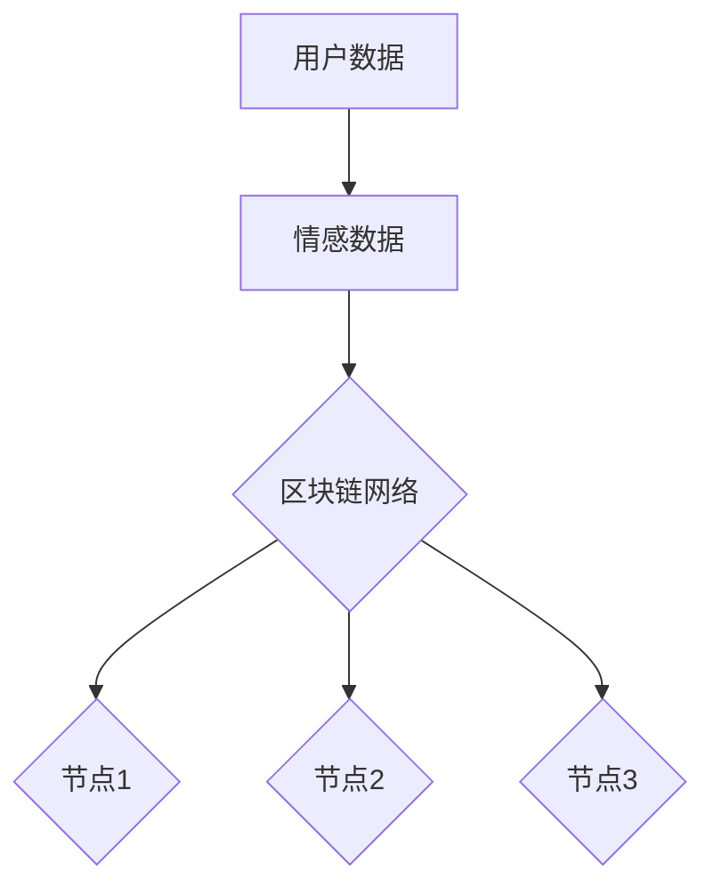

                 

### 文章标题

《提示词工程在情感计算中的创新应用》

> 关键词：情感计算、提示词工程、社交媒体情感分析、客户情绪识别、虚拟现实情感交互、多模态情感计算

> 摘要：本文深入探讨了提示词工程在情感计算中的应用，首先介绍了情感计算的基本概念、重要性和应用领域，接着阐述了提示词工程的概念、挑战与机遇，以及两者之间的紧密关系。随后，文章详细分析了情感计算的基础技术，包括情感识别的基本原理和提示词工程的核心技术，并探讨了它们在情感计算中的结合与优化方法。本文接着具体介绍了提示词工程在社交媒体情感分析、客户情绪识别与反馈、虚拟现实情感交互等领域的创新应用，并结合实际案例进行了深入剖析。最后，文章探讨了多模态情感计算这一前沿技术，展望了提示词工程在情感计算领域的未来发展方向。通过本文的阅读，读者将对提示词工程在情感计算中的重要作用和创新应用有更深刻的理解。

### 第一部分：情感计算与提示词工程概述

#### 第1章：情感计算的基本概念

情感计算（Affective Computing）是计算机科学领域的一个新兴方向，它致力于使计算机能够处理和理解人类的情感。情感计算的定义通常包括以下几个方面：

- **情感识别**：这是指计算机系统能够识别和理解用户表达的情感，包括面部表情、语音语调、文本内容和生理信号等。
- **情感生成**：这是指计算机系统能够生成和表达特定的情感，如同情、喜悦或愤怒。
- **情感推理**：这是指计算机系统能够基于情感识别和情感生成进行推理和决策，从而更好地服务于用户。

**1.1.1 情感计算的定义**

情感计算的定义可以从以下几个方面进行理解：

1. **人类的情感体验**：情感计算旨在模拟人类的情感体验，使计算机能够感知、理解并适应用户的情感状态。
2. **技术的融合**：情感计算融合了多个领域的知识，包括认知科学、心理学、人类学、计算机科学和人工智能等。
3. **应用的目标**：情感计算的目标是开发能够与人类进行情感交互的智能系统，提高人机交互的自然性和适应性。

**1.1.2 情感计算的重要性**

情感计算的重要性体现在以下几个方面：

1. **人机交互**：情感计算能够提升人机交互的自然性，使计算机系统更加贴近人类的情感和认知方式，提高用户体验。
2. **智能系统的发展**：情感计算为智能系统提供了新的能力，使其能够更好地理解和适应用户的需求和情感状态。
3. **健康与医疗**：情感计算在医疗领域具有广泛应用，如情绪障碍的诊断与治疗、心理健康监测等。

**1.1.3 情感计算的应用领域**

情感计算的应用领域非常广泛，主要包括以下几个方面：

1. **人机交互**：如智能音箱、虚拟助手、聊天机器人等。
2. **娱乐与游戏**：如情感智能游戏、虚拟角色情感交互等。
3. **教育**：如情感智能教育系统、个性化学习辅导等。
4. **医疗**：如情绪障碍诊断、心理健康监测等。
5. **社交网络**：如社交媒体情感分析、用户情感监控等。

#### 第2章：提示词工程概述

**2.1 提示词的概念与作用**

提示词（Prompt Word）是指用于引导用户表达情感或思想的词语或短语。在情感计算中，提示词具有重要的作用：

1. **情感引导**：提示词能够引导用户表达特定的情感，如喜悦、悲伤、愤怒等。
2. **信息提取**：提示词有助于从大量文本数据中提取有价值的情感信息。
3. **情感分类**：提示词在情感分类任务中扮演关键角色，有助于模型识别和理解用户的情感状态。

**2.2 提示词工程的挑战与机遇**

提示词工程面临着诸多挑战：

1. **多样性**：不同用户表达情感的词汇和方式存在很大差异，如何设计能够适应各种情感的提示词是一个难题。
2. **情感复杂度**：情感本身具有复杂性和多样性，如何准确捕捉和分类情感是一个挑战。
3. **数据稀疏性**：某些情感在数据集中可能比较稀疏，如何从少量数据中提取有价值的信息是一个问题。

然而，提示词工程也面临着诸多机遇：

1. **技术进步**：随着自然语言处理和机器学习技术的不断进步，提示词工程在准确性和效率方面得到了显著提升。
2. **数据积累**：随着社交媒体和在线平台的普及，大量情感数据不断产生，为提示词工程提供了丰富的训练资源。
3. **应用场景拓展**：随着情感计算应用领域的扩大，提示词工程在各个领域的应用潜力不断显现。

**2.3 提示词工程的应用场景**

提示词工程在多个应用场景中具有广泛的应用：

1. **情感分析**：如社交媒体情感分析、客户情绪识别等。
2. **人机交互**：如智能客服系统、虚拟助手等。
3. **健康与医疗**：如情绪障碍诊断、心理健康监测等。
4. **教育与培训**：如情感智能教育系统、个性化学习辅导等。
5. **娱乐与游戏**：如情感智能游戏、虚拟角色情感交互等。

#### 第3章：情感计算与提示词工程的关系

**3.1 提示词工程在情感计算中的角色**

提示词工程在情感计算中扮演着关键角色：

1. **数据预处理**：提示词工程有助于从原始数据中提取有价值的情感信息，为情感分析提供基础。
2. **情感引导**：通过设计合适的提示词，可以引导用户表达特定的情感，从而提高情感计算的准确性。
3. **模型优化**：提示词工程可以帮助优化情感计算模型，提高其性能和泛化能力。

**3.2 情感计算对提示词工程的需求**

情感计算对提示词工程提出了以下需求：

1. **多样性**：提示词需要能够覆盖各种情感类型，适应不同的应用场景。
2. **准确性**：提示词需要能够准确引导用户表达情感，提高情感识别的准确性。
3. **易用性**：提示词需要简单易懂，易于用户理解和接受。

**3.3 提示词工程在情感计算中的发展前景**

随着情感计算技术的不断进步和应用场景的拓展，提示词工程在情感计算中的发展前景非常广阔：

1. **技术创新**：随着自然语言处理和机器学习技术的不断发展，提示词工程将不断优化和改进，提高其准确性和效率。
2. **应用拓展**：提示词工程将在更多的应用场景中得到应用，如虚拟现实、智能医疗、教育培训等。
3. **跨领域合作**：提示词工程与其他领域的结合，如心理学、认知科学等，将推动情感计算技术的全面发展。

通过以上对情感计算与提示词工程的概述，我们可以看到这两者在理论和实践中的紧密联系。在接下来的部分，我们将深入探讨情感计算的基础技术，并详细分析提示词工程的核心技术及其在情感计算中的应用。这将帮助我们更好地理解提示词工程在情感计算中的关键作用和创新应用。

#### 第2章：情感计算的基础技术

情感计算作为一种综合多学科技术的交叉领域，其核心目标是使计算机具备理解和生成情感的能力。在这一章中，我们将深入探讨情感计算的基本原理与实现，并重点介绍情感识别、情感分类及其在情感计算中的应用。

**2.1 情感计算的基本原理**

情感计算的基本原理主要包括以下几个方面：

1. **情感识别（Affective Recognition）**：
情感识别是指计算机系统通过分析用户的生理、语言和行为信号，识别和理解用户的情感状态。情感识别的方法可以基于不同的模态，如面部表情、语音语调、文本内容和生理信号等。

2. **情感分类（Affective Classification）**：
情感分类是指将情感识别出来的结果进行分类，通常包括基本情感（如快乐、悲伤、愤怒、恐惧、厌恶和惊讶）和复杂情感（如焦虑、沮丧、兴奋和厌烦等）的分类。

3. **情感生成（Affective Generation）**：
情感生成是指计算机系统根据特定的任务需求或用户反馈，生成和表达相应的情感。情感生成通常涉及自然语言生成、声音合成和面部表情生成等技术。

4. **情感推理（Affective Reasoning）**：
情感推理是指计算机系统基于情感识别和情感生成，进行推理和决策，从而更好地服务于用户。情感推理涉及到情感状态之间的关联、情感对行为的影响等因素。

**2.1.1 情感识别的基本原理**

情感识别的基本原理依赖于对多种信号的处理和分析：

1. **面部表情识别**：
面部表情是人类表达情感的主要方式之一。面部表情识别技术通过分析面部肌肉活动，识别出不同的情感状态。常用的方法包括机器学习算法（如支持向量机、神经网络）和深度学习方法（如卷积神经网络、循环神经网络）。

2. **语音语调识别**：
语音语调识别通过分析语音的频率、时长、音调变化等特征，识别用户的情感状态。例如，音调的提高通常表示兴奋或愤怒，而音调的降低则可能表示悲伤或平静。

3. **文本情感分析**：
文本情感分析通过分析文本内容的情感倾向，识别出用户的情感状态。常用的方法包括情感词典、基于机器学习的情感分类模型（如朴素贝叶斯、支持向量机、深度学习模型等）。

4. **生理信号识别**：
生理信号识别通过分析用户的生理信号（如心率、血压、皮肤电活动等），识别用户的情感状态。生理信号识别通常需要结合信号处理和机器学习算法，如小波变换、主成分分析等。

**2.1.2 情感分类的基本方法**

情感分类是情感计算中的核心任务之一，其基本方法包括：

1. **规则方法**：
规则方法通过定义一系列的规则，对输入的信号进行分类。例如，基于情感词典的方法通过匹配文本中的情感词汇，判断文本的情感倾向。

2. **机器学习方法**：
机器学习方法通过训练模型，对输入的信号进行分类。常见的机器学习方法包括朴素贝叶斯、支持向量机、决策树、随机森林、神经网络等。

3. **深度学习方法**：
深度学习方法通过构建深层次的神经网络，对输入的信号进行自动特征提取和分类。常见的深度学习模型包括卷积神经网络（CNN）、循环神经网络（RNN）、长短时记忆网络（LSTM）和变换器（Transformer）等。

**2.1.3 情感分析的基本步骤**

情感分析通常包括以下几个基本步骤：

1. **数据收集**：
收集用于情感识别和分类的数据，包括面部表情数据、语音数据、文本数据和生理信号数据等。

2. **数据预处理**：
对收集的数据进行清洗、去噪和标准化处理，以便后续的分析和模型训练。

3. **特征提取**：
从预处理后的数据中提取情感相关的特征，如面部表情特征、语音特征、文本特征和生理信号特征等。

4. **模型训练与优化**：
使用提取的特征训练情感识别和分类模型，并通过交叉验证和超参数调整，优化模型的性能。

5. **模型评估**：
通过测试集对训练好的模型进行评估，包括准确率、召回率、F1分数等指标。

6. **模型部署**：
将训练好的模型部署到实际应用中，如智能客服系统、虚拟助手、情绪障碍诊断等。

**2.2 提示词工程的核心技术**

提示词工程（Prompt Engineering）是情感计算中的一项重要技术，其核心目标是设计出能够引导用户表达情感的有效提示词。提示词工程的关键技术包括：

1. **提示词生成**：
提示词生成是指通过算法自动生成提示词。常用的方法包括基于规则的方法、基于机器学习的方法和基于深度学习的方法。

2. **提示词优化**：
提示词优化是指通过评估和调整提示词，提高其引导用户表达情感的效果。常用的方法包括基于用户反馈的优化、基于情感相似度的优化和基于交叉验证的优化等。

3. **提示词应用**：
提示词应用是指将生成的优化后的提示词应用到实际的情感计算任务中，如情感识别、情感分类等。

**2.2.1 提示词的生成方法**

提示词的生成方法可以分为以下几类：

1. **规则方法**：
规则方法通过定义一系列的规则，生成特定的提示词。例如，根据情感类型和用户群体，设计相应的情感引导语句。

2. **机器学习方法**：
机器学习方法通过训练模型，从大量文本数据中自动生成提示词。常用的机器学习方法包括朴素贝叶斯、支持向量机、决策树和深度学习等。

3. **深度学习方法**：
深度学习方法通过构建深层次的神经网络，自动生成提示词。常见的深度学习模型包括卷积神经网络（CNN）、循环神经网络（RNN）、长短时记忆网络（LSTM）和变换器（Transformer）等。

**2.2.2 提示词的优化策略**

提示词的优化策略主要包括以下几种：

1. **基于用户反馈的优化**：
通过收集用户对提示词的反馈，评估提示词的效果，并根据反馈进行调整。常用的评估方法包括用户满意度评分、情感分类准确性等。

2. **基于情感相似度的优化**：
通过计算提示词和目标情感之间的相似度，评估提示词的引导效果。常用的相似度计算方法包括余弦相似度、欧氏距离和曼哈顿距离等。

3. **基于交叉验证的优化**：
通过交叉验证方法，评估提示词在不同数据集上的效果，并调整提示词以提高整体性能。

**2.2.3 提示词在情感计算中的应用**

提示词在情感计算中的应用主要包括以下几个方面：

1. **情感引导**：
提示词用于引导用户表达特定的情感，如快乐、悲伤、愤怒等。通过设计合适的提示词，可以提高情感识别和分类的准确性。

2. **情感分析**：
提示词用于从用户生成的文本、语音和面部表情中提取情感信息。通过优化提示词，可以提高情感分析模型的性能和泛化能力。

3. **人机交互**：
提示词用于设计用户与计算机之间的情感交互，如智能客服系统、虚拟助手等。通过优化提示词，可以提高用户满意度和服务质量。

**2.3 情感计算与提示词工程的结合**

情感计算与提示词工程的结合在理论和实践中具有重要意义：

1. **数据预处理**：
提示词工程通过生成和优化提示词，有助于从原始数据中提取有价值的情感信息，为情感识别和分类提供高质量的数据。

2. **模型优化**：
提示词工程通过优化提示词，可以提高情感计算模型的性能，增强模型的准确性和泛化能力。

3. **人机交互**：
提示词工程通过设计有效的提示词，可以提高人机交互的自然性和适应性，使用户更好地理解和接受计算机的情感交互。

4. **应用拓展**：
结合情感计算与提示词工程，可以拓展情感计算的应用领域，如虚拟现实、智能医疗、教育培训等。

通过本章的讨论，我们深入了解了情感计算的基本原理与实现，以及提示词工程的核心技术。在下一章中，我们将具体探讨提示词工程在情感计算中的应用，包括社交媒体情感分析、客户情绪识别与反馈以及虚拟现实情感交互等实际案例，进一步展示提示词工程在情感计算中的创新应用。

#### 第3章：提示词工程在情感计算中的应用

提示词工程在情感计算中的应用涵盖了社交媒体情感分析、客户情绪识别与反馈以及虚拟现实情感交互等多个领域。这些应用不仅展示了提示词工程在情感计算中的实际价值，还体现了其在提升系统性能和用户体验方面的潜力。以下将详细介绍这些应用场景，并结合实际案例进行深入剖析。

**3.1 社交媒体情感分析**

社交媒体情感分析是提示词工程在情感计算中的一个重要应用领域。通过分析社交媒体平台上的用户评论、帖子等内容，可以识别用户的情感状态，为企业提供市场洞察和改进产品与服务的机会。

**3.1.1 社交媒体情感分析的定义**

社交媒体情感分析是指利用自然语言处理技术，从社交媒体平台（如微博、微信、Facebook、Twitter等）上的用户生成内容中提取情感信息，并对其进行分类和量化。情感分类通常包括积极情感（如快乐、喜爱）、消极情感（如悲伤、愤怒）以及中性情感。

**3.1.2 社交媒体情感分析的重要性**

社交媒体情感分析的重要性体现在以下几个方面：

1. **市场洞察**：通过分析用户对产品、品牌、服务的情感反应，企业可以了解市场的需求和趋势，从而制定更有效的营销策略。
2. **品牌管理**：及时了解用户情感，有助于企业识别潜在的品牌风险，并采取相应的措施进行品牌修复。
3. **产品改进**：基于用户情感分析的结果，企业可以改进产品设计和功能，提高用户满意度。
4. **用户反馈**：社交媒体情感分析可以帮助企业收集真实的用户反馈，为产品改进和客户服务提供依据。

**3.1.3 社交媒体情感分析的应用场景**

社交媒体情感分析的应用场景非常广泛，包括以下几个方面：

1. **产品评价**：通过分析用户对产品的评论，识别用户的情感倾向，帮助企业了解产品的市场表现和用户满意度。
2. **品牌监测**：实时监测品牌在社交媒体上的情感状态，帮助企业及时发现和处理负面情绪。
3. **市场调研**：通过分析用户在社交媒体上的讨论内容，了解市场需求和竞争态势。
4. **客户服务**：利用情感分析技术，智能客服系统可以更好地理解用户的需求和情感，提供个性化的服务。

**3.1.4 社交媒体情感分析案例**

以下为几个社交媒体情感分析的案例：

**案例一：微博情感分析**

微博是一个热门的社交媒体平台，用户可以在微博上发布文字、图片、视频等内容。通过使用提示词工程，可以构建一个微博情感分析系统，对用户发布的微博内容进行分析。

1. **数据采集与预处理**：
   - 数据采集：使用爬虫技术获取微博用户发布的评论、帖子等数据。
   - 数据预处理：清洗数据，去除噪声和无关信息，如HTML标签、特殊字符等。

2. **情感分类模型构建**：
   - 提示词生成：根据微博内容的特点，设计合适的提示词，如“喜欢”、“满意”、“失望”等。
   - 模型训练：使用机器学习算法（如朴素贝叶斯、支持向量机等）训练情感分类模型，对微博内容进行情感分类。

3. **模型评估与优化**：
   - 模型评估：使用测试集对训练好的模型进行评估，计算准确率、召回率等指标。
   - 模型优化：通过调整提示词和模型参数，提高模型的性能。

**案例二：微信朋友圈情感分析**

微信朋友圈是另一个重要的社交媒体平台，用户可以在朋友圈中发布文字、图片、视频等内容。通过使用提示词工程，可以构建一个微信朋友圈情感分析系统，对用户发布的朋友圈内容进行分析。

1. **数据采集与预处理**：
   - 数据采集：使用API接口获取用户发布的朋友圈内容。
   - 数据预处理：清洗数据，去除噪声和无关信息。

2. **情感分类模型构建**：
   - 提示词生成：根据微信朋友圈内容的特点，设计合适的提示词，如“快乐”、“悲伤”、“愤怒”等。
   - 模型训练：使用机器学习算法（如朴素贝叶斯、支持向量机等）训练情感分类模型，对朋友圈内容进行情感分类。

3. **模型评估与优化**：
   - 模型评估：使用测试集对训练好的模型进行评估，计算准确率、召回率等指标。
   - 模型优化：通过调整提示词和模型参数，提高模型的性能。

**案例三：抖音短视频情感分析**

抖音是一个流行的短视频平台，用户可以通过上传短视频来表达自己的情感。通过使用提示词工程，可以构建一个抖音短视频情感分析系统，对用户上传的短视频内容进行分析。

1. **数据采集与预处理**：
   - 数据采集：使用API接口获取用户上传的短视频数据。
   - 数据预处理：清洗数据，去除噪声和无关信息。

2. **情感分类模型构建**：
   - 提示词生成：根据短视频内容的特点，设计合适的提示词，如“快乐”、“悲伤”、“愤怒”等。
   - 模型训练：使用机器学习算法（如朴素贝叶斯、支持向量机等）训练情感分类模型，对短视频内容进行情感分类。

3. **模型评估与优化**：
   - 模型评估：使用测试集对训练好的模型进行评估，计算准确率、召回率等指标。
   - 模型优化：通过调整提示词和模型参数，提高模型的性能。

**3.2 客户情绪识别与反馈**

客户情绪识别与反馈是另一个重要的应用领域，通过分析客户的情绪状态，可以提供更优质的服务，提高客户满意度和忠诚度。

**3.2.1 客户情绪识别的定义**

客户情绪识别是指利用自然语言处理技术，从客户与企业的交互记录中（如电话通话、电子邮件、聊天记录等）提取客户的情绪信息，并对其进行分类和量化。

**3.2.2 客户情绪识别的重要性**

客户情绪识别的重要性体现在以下几个方面：

1. **客户服务**：通过识别客户的情绪状态，企业可以提供更个性化的服务，解决客户的问题和需求。
2. **客户体验**：及时识别客户的负面情绪，并采取措施进行干预，可以改善客户体验，提高客户满意度。
3. **客户保留**：通过了解客户的情感状态，企业可以采取相应的措施，提高客户忠诚度和保留率。

**3.2.3 客户情绪识别的应用场景**

客户情绪识别的应用场景包括以下几个方面：

1. **客服系统**：利用客户情绪识别技术，智能客服系统可以更好地理解客户的情绪，提供更有效的服务。
2. **呼叫中心**：通过分析客服代表的语音和文本交互，识别客户的情绪状态，提高服务质量和客户满意度。
3. **客户反馈分析**：通过对客户反馈的分析，识别客户的情感状态，了解客户的真实需求和意见。

**3.2.4 客户情绪识别案例**

**案例一：客服机器人情绪识别**

通过使用提示词工程，可以构建一个客服机器人情绪识别系统，对用户与客服机器人的交互内容进行分析。

1. **数据采集与预处理**：
   - 数据采集：获取用户与客服机器人的交互记录，如聊天记录、文本消息等。
   - 数据预处理：清洗数据，去除噪声和无关信息。

2. **情感分类模型构建**：
   - 提示词生成：设计合适的提示词，如“满意”、“失望”、“愤怒”等。
   - 模型训练：使用机器学习算法（如朴素贝叶斯、支持向量机等）训练情感分类模型，对交互内容进行情感分类。

3. **模型评估与优化**：
   - 模型评估：使用测试集对训练好的模型进行评估，计算准确率、召回率等指标。
   - 模型优化：通过调整提示词和模型参数，提高模型的性能。

**案例二：电商平台用户评价情绪分析**

通过使用提示词工程，可以构建一个电商平台用户评价情绪分析系统，对用户在商品评价中的情感状态进行分析。

1. **数据采集与预处理**：
   - 数据采集：获取用户在电商平台上的商品评价数据。
   - 数据预处理：清洗数据，去除噪声和无关信息。

2. **情感分类模型构建**：
   - 提示词生成：设计合适的提示词，如“满意”、“不满意”、“愤怒”等。
   - 模型训练：使用机器学习算法（如朴素贝叶斯、支持向量机等）训练情感分类模型，对评价内容进行情感分类。

3. **模型评估与优化**：
   - 模型评估：使用测试集对训练好的模型进行评估，计算准确率、召回率等指标。
   - 模型优化：通过调整提示词和模型参数，提高模型的性能。

**案例三：智能音响用户交互情绪分析**

通过使用提示词工程，可以构建一个智能音响用户交互情绪分析系统，对用户与智能音响的交互内容进行分析。

1. **数据采集与预处理**：
   - 数据采集：获取用户与智能音响的交互记录，如语音消息、文本消息等。
   - 数据预处理：清洗数据，去除噪声和无关信息。

2. **情感分类模型构建**：
   - 提示词生成：设计合适的提示词，如“满意”、“失望”、“愤怒”等。
   - 模型训练：使用机器学习算法（如朴素贝叶斯、支持向量机等）训练情感分类模型，对交互内容进行情感分类。

3. **模型评估与优化**：
   - 模型评估：使用测试集对训练好的模型进行评估，计算准确率、召回率等指标。
   - 模型优化：通过调整提示词和模型参数，提高模型的性能。

**3.3 虚拟现实情感交互**

虚拟现实（VR）情感交互是指通过虚拟现实技术，实现人与虚拟环境的情感交互。通过提示词工程，可以设计出有效的情感引导策略，提高虚拟现实体验的沉浸感和情感表达。

**3.3.1 虚拟现实情感交互的定义**

虚拟现实情感交互是指用户在虚拟环境中与虚拟角色或其他用户进行情感交流，通过情感表达和情感理解，提升虚拟现实体验的沉浸感。

**3.3.2 虚拟现实情感交互的重要性**

虚拟现实情感交互的重要性体现在以下几个方面：

1. **用户体验**：通过情感交互，可以提升用户的虚拟现实体验，增加沉浸感和趣味性。
2. **社交互动**：虚拟现实情感交互可以促进用户之间的情感交流和社交互动。
3. **娱乐与教育**：在虚拟现实娱乐和教育场景中，情感交互可以增强用户的学习和娱乐体验。

**3.3.3 虚拟现实情感交互的应用场景**

虚拟现实情感交互的应用场景包括以下几个方面：

1. **虚拟现实游戏**：通过情感交互，增强游戏的沉浸感和互动性。
2. **虚拟现实培训**：利用情感交互，提高培训效果和用户体验。
3. **虚拟现实医疗**：通过情感交互，帮助患者更好地适应治疗过程和康复训练。
4. **虚拟现实社交**：通过情感交互，促进用户在虚拟环境中的社交互动。

**3.3.4 虚拟现实情感交互案例**

**案例一：虚拟现实游戏中的情感交互**

通过使用提示词工程，可以构建一个虚拟现实游戏情感交互系统，实现用户与虚拟角色的情感交流。

1. **数据采集与预处理**：
   - 数据采集：获取用户在虚拟现实游戏中的交互记录，如语音、文本、手势等。
   - 数据预处理：清洗数据，去除噪声和无关信息。

2. **情感分类模型构建**：
   - 提示词生成：设计合适的提示词，如“快乐”、“愤怒”、“悲伤”等。
   - 模型训练：使用机器学习算法（如朴素贝叶斯、支持向量机等）训练情感分类模型，对交互内容进行情感分类。

3. **模型评估与优化**：
   - 模型评估：使用测试集对训练好的模型进行评估，计算准确率、召回率等指标。
   - 模型优化：通过调整提示词和模型参数，提高模型的性能。

**案例二：虚拟现实培训中的情感交互**

通过使用提示词工程，可以构建一个虚拟现实培训情感交互系统，实现培训师与学员之间的情感交流。

1. **数据采集与预处理**：
   - 数据采集：获取培训过程中的交互记录，如语音、文本、手势等。
   - 数据预处理：清洗数据，去除噪声和无关信息。

2. **情感分类模型构建**：
   - 提示词生成：设计合适的提示词，如“专注”、“参与”、“疑惑”等。
   - 模型训练：使用机器学习算法（如朴素贝叶斯、支持向量机等）训练情感分类模型，对交互内容进行情感分类。

3. **模型评估与优化**：
   - 模型评估：使用测试集对训练好的模型进行评估，计算准确率、召回率等指标。
   - 模型优化：通过调整提示词和模型参数，提高模型的性能。

**案例三：虚拟现实医疗中的情感交互**

通过使用提示词工程，可以构建一个虚拟现实医疗情感交互系统，实现医生与患者之间的情感交流。

1. **数据采集与预处理**：
   - 数据采集：获取医疗过程中的交互记录，如语音、文本、手势等。
   - 数据预处理：清洗数据，去除噪声和无关信息。

2. **情感分类模型构建**：
   - 提示词生成：设计合适的提示词，如“安心”、“紧张”、“担忧”等。
   - 模型训练：使用机器学习算法（如朴素贝叶斯、支持向量机等）训练情感分类模型，对交互内容进行情感分类。

3. **模型评估与优化**：
   - 模型评估：使用测试集对训练好的模型进行评估，计算准确率、召回率等指标。
   - 模型优化：通过调整提示词和模型参数，提高模型的性能。

通过以上对提示词工程在社交媒体情感分析、客户情绪识别与反馈以及虚拟现实情感交互等领域的详细探讨，我们可以看到提示词工程在情感计算中的应用具有广泛的前景。在下一部分，我们将进一步探讨多模态情感计算这一前沿技术，展示如何结合多种模态的数据，提升情感计算的准确性和应用效果。

#### 第4章：多模态情感计算

多模态情感计算是一种前沿技术，它通过结合多种模态的数据（如文本、语音、图像和生理信号等），对用户的情感状态进行更全面和准确的识别和分析。相比单一模态的情感计算，多模态情感计算能够提供更丰富的情感信息，提高情感识别的准确性和可靠性。

**4.1 多模态情感计算概述**

**4.1.1 多模态情感计算的定义**

多模态情感计算是指利用多种模态的数据（如文本、语音、图像、生理信号等），综合分析用户的情感状态，从而提高情感计算的准确性和有效性。多模态情感计算的核心在于如何整合不同模态的数据，发挥它们之间的互补性和协同性。

**4.1.2 多模态情感计算的优势**

多模态情感计算具有以下优势：

1. **信息互补性**：不同模态的数据提供了关于情感状态的不同视角，可以相互补充，提高情感识别的准确性。
2. **鲁棒性**：多模态数据可以减少单一模态数据中的噪声和错误，提高情感计算的鲁棒性。
3. **全面性**：多模态情感计算可以同时捕捉用户的情感和行为，提供更全面的情感分析结果。

**4.1.3 多模态情感计算的应用场景**

多模态情感计算的应用场景非常广泛，包括但不限于：

1. **人机交互**：通过分析用户的语音、面部表情和文本，提高智能客服、虚拟助手等系统的交互质量。
2. **心理健康**：通过分析用户的生理信号、面部表情和文本，监测和诊断心理疾病，如焦虑、抑郁等。
3. **智能娱乐**：通过分析用户的情感状态，提供个性化的娱乐内容，提高用户的娱乐体验。
4. **教育和培训**：通过分析学生的情感状态，提供个性化的教育资源和培训方案，提高学习效果。

**4.2 多模态情感计算的方法与实现**

多模态情感计算的方法主要包括以下几个步骤：

1. **数据采集**：从多种模态收集数据，如文本、语音、图像和生理信号等。
2. **数据预处理**：对采集到的数据进行预处理，包括去噪、标准化和特征提取。
3. **特征融合**：将不同模态的特征进行融合，形成统一的特征表示。
4. **情感识别与分类**：使用机器学习或深度学习算法，对融合后的特征进行情感识别和分类。
5. **结果评估**：对识别结果进行评估，包括准确率、召回率、F1分数等指标。

**4.2.1 基于文本的情感计算**

基于文本的情感计算是通过分析文本数据中的情感信息来识别用户的情感状态。文本情感分析的方法主要包括以下几种：

1. **情感词典方法**：使用预定义的情感词典，根据文本中情感词汇的出现频率和情感倾向进行情感分析。
2. **机器学习方法**：使用机器学习算法（如朴素贝叶斯、支持向量机等）训练情感分类模型，对文本进行情感分类。
3. **深度学习方法**：使用深度学习模型（如卷积神经网络、循环神经网络等）进行文本情感分析，通过自动特征提取和分类。

**4.2.2 基于语音的情感计算**

基于语音的情感计算是通过分析语音信号中的情感特征来识别用户的情感状态。语音情感分析的方法主要包括以下几种：

1. **语音特征提取**：从语音信号中提取情感相关的特征，如频率、时长、音调、音强等。
2. **机器学习方法**：使用机器学习算法（如支持向量机、决策树等）对提取的语音特征进行情感分类。
3. **深度学习方法**：使用深度学习模型（如卷积神经网络、长短时记忆网络等）进行语音情感分析。

**4.2.3 基于图像的情感计算**

基于图像的情感计算是通过分析图像中的面部表情、身体姿态和视觉内容来识别用户的情感状态。图像情感分析的方法主要包括以下几种：

1. **面部表情识别**：使用计算机视觉技术，从图像中识别和理解面部表情。
2. **身体姿态识别**：从图像中识别和理解用户的身体姿态，分析其情感状态。
3. **内容分析**：使用图像内容分析技术，从图像中提取情感相关的信息，如颜色、纹理等。

**4.2.4 基于生理信号的 emotion computing**

基于生理信号的情感计算是通过分析用户的生理信号（如心率、皮肤电活动、呼吸频率等）来识别用户的情感状态。生理信号情感分析的方法主要包括以下几种：

1. **信号特征提取**：从生理信号中提取情感相关的特征，如心率变异性、皮肤电活动等。
2. **信号处理方法**：使用信号处理技术，如小波变换、主成分分析等，对生理信号进行预处理和特征提取。
3. **机器学习方法**：使用机器学习算法（如支持向量机、神经网络等）对提取的生理信号特征进行情感分类。

**4.3 多模态情感计算案例**

**案例一：智能客服系统中的多模态情感计算**

智能客服系统通过多模态情感计算，可以更好地理解用户的情感状态，提供个性化的服务。

1. **数据采集与预处理**：
   - 数据采集：从文本、语音、面部表情等多个模态收集用户交互数据。
   - 数据预处理：对采集到的数据进行去噪、标准化和特征提取。

2. **情感识别与分类**：
   - 提示词生成：设计合适的提示词，用于引导用户表达情感。
   - 情感分类模型：使用机器学习或深度学习算法，对多模态特征进行情感识别和分类。

3. **结果评估与优化**：
   - 模型评估：使用测试集对训练好的模型进行评估，计算准确率、召回率等指标。
   - 模型优化：通过调整提示词和模型参数，提高模型的性能。

**案例二：心理健康监测系统中的多模态情感计算**

心理健康监测系统通过多模态情感计算，可以实时监测用户的心理健康状况，提供个性化的干预方案。

1. **数据采集与预处理**：
   - 数据采集：从文本、语音、面部表情、生理信号等多个模态收集用户数据。
   - 数据预处理：对采集到的数据进行去噪、标准化和特征提取。

2. **情感识别与分类**：
   - 提示词生成：设计合适的提示词，用于引导用户表达情感。
   - 情感分类模型：使用机器学习或深度学习算法，对多模态特征进行情感识别和分类。

3. **结果评估与优化**：
   - 模型评估：使用测试集对训练好的模型进行评估，计算准确率、召回率等指标。
   - 模型优化：通过调整提示词和模型参数，提高模型的性能。

**案例三：虚拟现实游戏中的多模态情感计算**

虚拟现实游戏通过多模态情感计算，可以提供更丰富的情感体验，提高用户的沉浸感和参与度。

1. **数据采集与预处理**：
   - 数据采集：从文本、语音、面部表情、身体姿态等多个模态收集用户交互数据。
   - 数据预处理：对采集到的数据进行去噪、标准化和特征提取。

2. **情感识别与分类**：
   - 提示词生成：设计合适的提示词，用于引导用户表达情感。
   - 情感分类模型：使用机器学习或深度学习算法，对多模态特征进行情感识别和分类。

3. **结果评估与优化**：
   - 模型评估：使用测试集对训练好的模型进行评估，计算准确率、召回率等指标。
   - 模型优化：通过调整提示词和模型参数，提高模型的性能。

通过以上案例，我们可以看到多模态情感计算在提升情感计算准确性和应用效果方面的优势。在下一章中，我们将进一步探讨情感计算领域的创新应用与前沿技术，包括人工智能、区块链和物联网等，展示这些技术在情感计算中的潜在应用和发展趋势。

### 第5章：情感计算领域的创新应用与前沿技术

随着人工智能、区块链、物联网等新兴技术的快速发展，情感计算领域也在不断拓展和应用。这些创新技术为情感计算带来了新的机遇和挑战，推动了该领域的进一步发展和应用。

#### 5.1 人工智能在情感计算中的应用

人工智能（AI）技术，尤其是深度学习和机器学习，是推动情感计算发展的重要力量。通过AI技术，我们可以构建更智能、更准确的情感识别和分类模型。

**5.1.1 情感识别的深度学习模型**

深度学习模型，如卷积神经网络（CNN）和循环神经网络（RNN），在情感识别中具有显著优势。CNN可以有效地提取图像和视频中的情感特征，而RNN则擅长处理序列数据，如语音和文本。以下是一个简单的深度学习模型示例：

```plaintext
// 情感识别的深度学习模型伪代码
model = Sequential()
model.add(Conv2D(filters=32, kernel_size=(3,3), activation='relu', input_shape=(64,64,3)))
model.add(MaxPooling2D(pool_size=(2,2)))
model.add(Flatten())
model.add(Dense(128, activation='relu'))
model.add(Dense(num_classes, activation='softmax'))
model.compile(optimizer='adam', loss='categorical_crossentropy', metrics=['accuracy'])
model.fit(x_train, y_train, batch_size=64, epochs=10, validation_data=(x_val, y_val))
```

**5.1.2 情感分类的机器学习算法**

除了深度学习，传统的机器学习算法也在情感分类中发挥着重要作用。例如，支持向量机（SVM）和朴素贝叶斯（NB）等算法，通过训练分类器，可以有效地将文本数据分类为不同的情感类别。

```plaintext
// 情感分类的朴素贝叶斯算法伪代码
from sklearn.feature_extraction.text import CountVectorizer
from sklearn.naive_bayes import MultinomialNB

vectorizer = CountVectorizer()
X_train_counts = vectorizer.fit_transform(train_texts)

classifier = MultinomialNB()
classifier.fit(X_train_counts, train_labels)
X_test_counts = vectorizer.transform(test_texts)
predictions = classifier.predict(X_test_counts)
```

**5.1.3 AI在情感计算中的优势**

- **自动化特征提取**：AI技术可以自动提取复杂的情感特征，减少了人工干预的需求。
- **高准确性**：通过大规模数据训练的AI模型，具有很高的情感识别和分类准确性。
- **实时处理**：AI技术可以实时处理用户的情感数据，提供即时的情感分析和反馈。

#### 5.2 区块链在情感计算中的应用

区块链技术以其去中心化、透明、安全的特点，为情感计算提供了新的应用场景。区块链可以用于存储和验证用户的情感数据，确保数据的真实性和隐私性。

**5.2.1 区块链在情感数据存储中的应用**

通过区块链，情感数据可以被安全地存储和分享，同时保证了数据的完整性和可追溯性。以下是一个简单的区块链架构示意图：



**5.2.2 区块链在情感计算中的优势**

- **数据安全性**：区块链技术确保情感数据的安全存储，防止数据篡改和泄露。
- **透明性**：区块链上的数据是公开透明的，用户可以查看自己的情感数据。
- **去中心化**：区块链不需要中心化的机构进行管理，降低了成本和复杂性。

#### 5.3 物联网（IoT）在情感计算中的应用

物联网技术的发展，使得情感计算可以结合多种传感器数据，对用户的情感状态进行更全面的监控和分析。

**5.3.1 物联网传感器在情感计算中的应用**

物联网传感器可以收集用户的生理信号、行为数据和环境数据，为情感计算提供丰富的数据源。以下是一个简单的物联网传感器网络架构：


**5.3.2 物联网在情感计算中的优势**

- **实时监控**：物联网传感器可以实时收集用户的情感数据，提供即时的情感分析和反馈。
- **全面数据**：通过物联网传感器，情感计算可以获得更全面的数据，提高分析准确性。
- **自动化反馈**：物联网技术可以自动触发反馈机制，如提醒用户调整情绪或提供情感支持。

#### 5.4 情感计算与其他技术的融合

情感计算与人工智能、区块链和物联网等技术的融合，将进一步推动该领域的发展。以下是一些可能的融合方向：

- **智能医疗**：利用情感计算和人工智能技术，开发情感智能医疗系统，辅助心理疾病诊断和治疗。
- **智能教育**：通过情感计算和物联网技术，开发智能教育平台，提供个性化学习体验。
- **智能城市**：利用情感计算技术，监控和分析城市居民的情感状态，优化城市管理和公共服务。

**5.4.1 智能医疗中的情感计算应用**

在智能医疗中，情感计算可以用于：

- **心理健康监测**：通过分析患者的情感状态，辅助心理疾病的诊断和治疗。
- **情感干预**：在手术、化疗等过程中，利用情感计算技术，为患者提供情感支持和心理干预。

**5.4.2 智能教育中的情感计算应用**

在智能教育中，情感计算可以用于：

- **个性化学习**：通过分析学生的学习情感，提供个性化的学习资源和辅导。
- **情感评估**：利用情感计算技术，评估学生的学习情感状态，优化教育策略。

**5.4.3 智能城市中的情感计算应用**

在智能城市中，情感计算可以用于：

- **城市情绪监控**：通过分析市民的情感状态，了解城市的社会情绪，优化城市管理和公共服务。
- **社区情感互动**：利用情感计算技术，促进社区成员之间的情感交流和互动。

通过以上探讨，我们可以看到情感计算与其他新兴技术的融合，为该领域带来了新的机遇和挑战。这些创新应用不仅丰富了情感计算的应用场景，也为用户提供了更智能、更个性化的体验。在未来，随着技术的进一步发展，情感计算将在更多领域得到广泛应用，为人类生活带来更多便利和福祉。

### 结论与展望

综上所述，提示词工程在情感计算中具有至关重要的地位。通过合理的提示词设计和优化，可以有效提升情感识别和分类的准确性，改善人机交互体验，并在社交媒体情感分析、客户情绪识别与反馈、虚拟现实情感交互等多个领域发挥重要作用。同时，随着多模态情感计算、人工智能、区块链、物联网等新兴技术的不断发展，提示词工程在情感计算中的应用前景将更加广阔。

未来，我们可以期待以下几方面的进展：

1. **技术融合**：情感计算与其他前沿技术的深度融合，如物联网、虚拟现实、人工智能等，将带来更多创新应用和更丰富的用户体验。
2. **多模态数据的利用**：多模态情感计算的发展，将进一步提高情感识别的准确性和可靠性，为用户提供更全面、个性化的服务。
3. **数据隐私保护**：随着用户对数据隐私的关注日益增加，如何在确保数据安全的前提下，有效利用情感数据，将是未来研究的一个重要方向。
4. **跨领域应用**：情感计算在医疗、教育、智能城市等领域的应用将不断拓展，为各行业提供智能化的解决方案。

总之，提示词工程在情感计算中的创新应用将不断推动该领域的发展，为人类社会带来更多福祉。作者在此呼吁更多的研究者和技术人员关注这一领域，共同探索和实现情感计算的无限可能。

### 最佳实践 Tips

1. **设计合适的提示词**：在设计提示词时，应充分考虑用户的背景、情感需求和上下文环境，以提高情感识别的准确性。
2. **多模态数据融合**：在情感计算中，结合多种模态的数据，如文本、语音、图像和生理信号，可以提高分析结果的可靠性和准确性。
3. **数据预处理与清洗**：确保数据的质量是关键，通过有效的数据预处理和清洗方法，可以去除噪声和无关信息，提高模型的性能。
4. **持续模型优化**：通过持续的训练和优化，可以不断提高情感计算模型的准确性和泛化能力。
5. **用户反馈机制**：建立有效的用户反馈机制，收集用户的反馈和需求，有助于改进提示词工程的应用效果。

### 注意事项

1. **数据隐私**：在处理用户情感数据时，务必确保数据隐私和安全，遵循相关的法律法规。
2. **模型评估与验证**：在部署模型前，务必进行充分的评估和验证，确保模型的性能和可靠性。
3. **技术更新**：随着技术的不断进步，定期更新模型和算法，以适应新的应用需求和挑战。
4. **跨学科合作**：情感计算是一个跨学科的领域，鼓励不同领域的专家进行合作，共同推动技术的发展。

### 拓展阅读

1. **《情感计算：理论与实践》**：这是一本全面的情感计算教材，涵盖了情感计算的基本概念、技术方法和应用案例。
2. **《多模态情感计算》**：本书详细介绍了多模态情感计算的方法和技术，包括文本、语音、图像和生理信号等。
3. **《人工智能在情感计算中的应用》**：这本书探讨了人工智能技术在情感计算中的创新应用，包括深度学习、机器学习等。

通过以上最佳实践、注意事项和拓展阅读，读者可以更好地理解和应用提示词工程在情感计算中的技术，推动该领域的持续发展和创新。作者期待与读者共同探索情感计算的无限可能。作者：AI天才研究院/AI Genius Institute & 禅与计算机程序设计艺术 /Zen And The Art of Computer Programming

