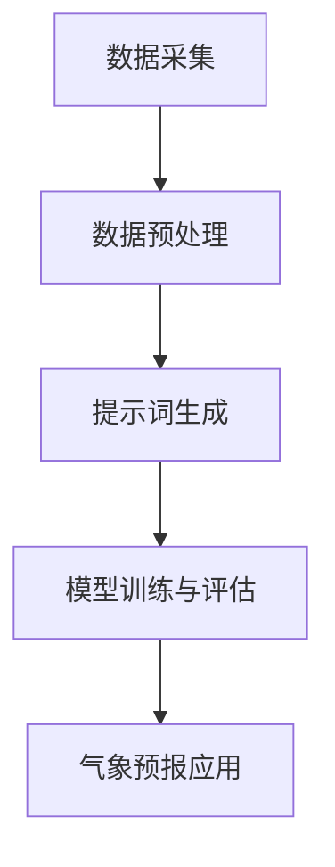
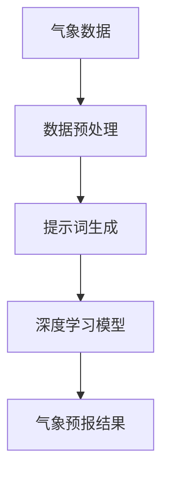

                 

### 文章标题

《提示词工程在智能气象预报中的创新》

### 关键词

智能气象预报、提示词工程、深度学习、神经网络、注意力机制、数据预处理、气象数据、模型训练与评估、天气预报应用

### 摘要

随着人工智能技术的快速发展，智能气象预报成为了当前气象科学领域的研究热点。传统的气象预报方法存在一定的局限性，难以满足现代天气预报的需求。本文探讨了提示词工程在智能气象预报中的应用，通过详细分析提示词工程的基本原理、核心算法及其与智能气象预报的连接机制，揭示了提示词工程在提高气象预报准确性方面的创新作用。文章旨在为读者提供一套系统、深入的了解智能气象预报中提示词工程的思路和方法，从而推动相关领域的技术进步和应用拓展。

---

### 《提示词工程在智能气象预报中的创新》目录大纲

1. 引言
   1.1 智能气象预报概述
       1.1.1 传统气象预报的局限性
       1.1.2 智能气象预报的发展趋势
   1.2 提示词工程的定义与作用
       1.2.1 提示词工程的背景
       1.2.2 提示词工程在气象预报中的重要性
2. 核心概念与联系
   2.1 提示词工程基本原理
       2.1.1 提示词的定义与类型
       2.1.2 提示词工程的框架结构
   2.2 提示词工程与智能气象预报的连接
       2.2.1 提示词在智能气象预报中的具体应用
       2.2.2 提示词工程在智能气象预报中的作用机制
3. 核心算法原理讲解
   3.1 深度学习基础
       3.1.1 神经网络与深度学习概述
       3.1.2 神经网络结构详解（使用伪代码）
   3.2 提示词生成算法
       3.2.1 提示词生成的技术路线
       3.2.2 提示词生成算法（使用伪代码）
4. 项目实战
   4.1 开发环境搭建
   4.2 源代码详细实现和代码解读
   4.3 代码应用解读与分析
   4.4 实际案例分析和详细讲解剖析
   4.5 项目小结
5. 最佳实践 tips
6. 小结
7. 注意事项
8. 拓展阅读

---

### 第一部分：引言

#### 1.1 智能气象预报概述

智能气象预报是指利用先进的人工智能技术，如深度学习、神经网络和机器学习等，对气象数据进行分析和预测的一种预报方法。与传统的气象预报方法相比，智能气象预报具有更高的精度和更广泛的适用性。

**1.1.1 传统气象预报的局限性**

传统气象预报主要依赖于经验公式和物理模型，通过分析天气现象的物理、化学和动力学过程来预测未来的天气情况。然而，这种方法存在以下局限性：

1. **数据依赖性高**：传统气象预报对观测数据的依赖性较高，观测数据的缺失或误差会导致预报结果的不准确。
2. **模型简化**：为了简化计算，传统气象预报模型通常会忽略一些复杂的天气现象，这可能导致预报结果与实际天气情况存在偏差。
3. **人力成本高**：传统气象预报需要大量的人力和时间来收集、分析和处理气象数据，预报效率较低。

**1.1.2 智能气象预报的发展趋势**

随着计算机技术和人工智能技术的飞速发展，智能气象预报逐渐成为气象科学领域的研究热点。智能气象预报具有以下发展趋势：

1. **大数据分析**：利用大数据技术，对大量历史气象数据和实时观测数据进行分析，提高预报的精度和准确性。
2. **深度学习与神经网络**：深度学习模型，如神经网络和循环神经网络（RNN），可以自动提取气象数据中的特征，提高预报能力。
3. **多模态数据融合**：将多种类型的气象数据进行融合，如雷达数据、卫星数据和地面观测数据，提高预报的综合能力。

#### 1.2 提示词工程的定义与作用

**1.2.1 提示词工程的背景**

提示词工程（Prompt Engineering）是一种利用提示词（Prompt）来改进机器学习模型性能的技术。提示词是指用于引导模型学习和预测的一组关键词或短语，它们可以提供额外的信息，帮助模型更好地理解输入数据。

在人工智能领域，提示词工程的应用非常广泛，如自然语言处理（NLP）、计算机视觉（CV）和推荐系统等。近年来，随着深度学习和神经网络在气象预报中的应用，提示词工程也逐渐成为智能气象预报的一个重要研究方向。

**1.2.2 提示词工程在气象预报中的重要性**

提示词工程在智能气象预报中具有重要作用，主要体现在以下几个方面：

1. **提高预报精度**：通过使用合适的提示词，可以引导模型更好地理解气象数据，提高预报精度。
2. **降低模型复杂性**：提示词可以简化模型结构，减少参数数量，降低计算成本。
3. **增强模型解释性**：提示词可以提供对模型预测过程的解释，帮助用户更好地理解预报结果。

总之，提示词工程为智能气象预报提供了一种新的思路和方法，有助于提高预报性能和可靠性。在接下来的部分中，我们将进一步探讨提示词工程的基本原理和其在智能气象预报中的应用。

### 第二部分：核心概念与联系

#### 2.1 提示词工程基本原理

**2.1.1 提示词的定义与类型**

提示词（Prompt）是指在机器学习任务中，用于引导模型学习和预测的一组关键词或短语。根据用途的不同，提示词可以分为以下几类：

1. **训练提示词**：用于指导模型在训练阶段学习的数据预处理和特征提取方法，如数据清洗、特征选择和特征工程等。
2. **测试提示词**：用于在模型测试阶段提供额外的信息，帮助模型更好地理解测试数据，提高测试准确性。
3. **应用提示词**：用于在模型应用阶段，指导模型进行预测和决策，如气象预报、疾病诊断和风险评估等。

**2.1.2 提示词工程的框架结构**

提示词工程的框架结构通常包括以下几个关键步骤：

1. **数据采集**：收集与任务相关的数据，如气象数据、医学数据和金融数据等。
2. **数据预处理**：对采集到的数据进行清洗、归一化和特征提取等处理，以提高数据质量和模型性能。
3. **提示词生成**：根据任务需求，生成一组合适的提示词，以引导模型学习和预测。
4. **模型训练与评估**：使用提示词和训练数据对模型进行训练，并通过测试数据对模型性能进行评估和优化。
5. **气象预报应用**：将训练好的模型应用于气象预报任务，生成预报结果。

下面是一个基于Mermaid绘制的提示词工程框架结构图：



**2.2 提示词工程与智能气象预报的连接**

**2.2.1 提示词在智能气象预报中的具体应用**

在智能气象预报中，提示词工程的具体应用包括以下几个方面：

1. **数据预处理**：使用提示词对气象数据进行清洗、归一化和特征提取等处理，以消除噪声和异常值，提高数据质量。
2. **特征选择**：根据提示词提供的信息，选择对气象预报任务最相关的特征，以提高模型性能。
3. **模型训练**：使用提示词指导模型学习气象数据中的潜在规律和模式，提高预报准确性。
4. **模型评估**：使用提示词对模型的预测结果进行评估，以判断模型的性能和可靠性。

**2.2.2 提示词工程在智能气象预报中的作用机制**

提示词工程在智能气象预报中的作用机制主要包括以下几个方面：

1. **数据增强**：通过提示词提供额外的信息，可以增强模型的训练数据集，提高模型的泛化能力。
2. **特征提取**：提示词可以帮助模型更好地理解气象数据中的潜在特征，从而提高模型的预测准确性。
3. **模型解释**：通过提示词，用户可以更好地理解模型的预测过程和结果，提高模型的解释性。

下面是一个基于Mermaid绘制的提示词工程在智能气象预报中的连接机制图：



通过以上分析，我们可以看出提示词工程在智能气象预报中具有重要的作用，通过合理使用提示词，可以显著提高气象预报的精度和可靠性。在接下来的部分，我们将进一步探讨深度学习基础和提示词生成算法，以深入了解智能气象预报中的关键技术。

### 第三部分：核心算法原理讲解

#### 3.1 深度学习基础

**3.1.1 神经网络与深度学习概述**

神经网络（Neural Networks）是一种模仿生物神经系统的计算模型，通过模拟大量简单神经元之间的交互来处理复杂数据。深度学习（Deep Learning）是神经网络的一种扩展，它通过多层神经网络结构来提取数据的深层特征，从而实现高效的数据分析和预测。

**神经网络结构详解（使用伪代码）**

以下是一个简单的多层感知机（MLP）结构的伪代码示例：

```python
# 伪代码示例：多层感知机（MLP）结构

class MultiLayerPerceptron():
    def __init__(self, input_size, hidden_size, output_size):
        self.input_size = input_size
        self.hidden_size = hidden_size
        self.output_size = output_size

        # 初始化权重和偏置
        self.weights_input_to_hidden = np.random.randn(input_size, hidden_size)
        self.biases_hidden = np.random.randn(hidden_size)
        self.weights_hidden_to_output = np.random.randn(hidden_size, output_size)
        self.biases_output = np.random.randn(output_size)

    def forward_pass(self, x):
        # 输入层到隐藏层的激活函数
        hidden_layer_activation = sigmoid(np.dot(x, self.weights_input_to_hidden) + self.biases_hidden)
        # 隐藏层到输出层的激活函数
        output_layer_activation = sigmoid(np.dot(hidden_layer_activation, self.weights_hidden_to_output) + self.biases_output)
        return output_layer_activation

def sigmoid(x):
    return 1 / (1 + np.exp(-x))
```

在这个示例中，我们定义了一个多层感知机（MLP）类，它包含三个主要部分：输入层、隐藏层和输出层。每个层之间都使用线性变换（通过矩阵乘法实现）和激活函数（如 sigmoid 函数）来传递信息。通过多次迭代训练，MLP 可以学会对输入数据进行分类或回归。

**3.1.2 神经网络与深度学习的关系**

神经网络是深度学习的基础，而深度学习是在神经网络的基础上发展起来的。深度学习的核心思想是通过多层神经网络结构来提取数据的深层特征，从而实现更复杂的数据分析和预测。

深度学习与神经网络的主要区别在于：

1. **网络层数**：深度学习通常使用多层神经网络结构，而传统神经网络通常是单层或双层结构。
2. **特征提取能力**：深度学习可以通过多层神经网络结构来提取数据的深层特征，而传统神经网络只能提取浅层特征。
3. **计算能力**：深度学习通过使用大量的神经元和参数，具有更高的计算能力和模型复杂度。

**3.1.3 深度学习在智能气象预报中的应用**

在智能气象预报中，深度学习可以用于以下任务：

1. **时间序列预测**：使用循环神经网络（RNN）或长短时记忆网络（LSTM）等深度学习模型，可以有效地对气象数据进行时间序列预测。
2. **多模态数据融合**：将多种类型的气象数据进行融合，如雷达数据、卫星数据和地面观测数据，可以显著提高预报的精度。
3. **异常检测**：通过深度学习模型对气象数据进行分析，可以检测出异常天气事件，如暴雨、台风等。

总之，深度学习在智能气象预报中具有广泛的应用前景，通过合理设计和训练深度学习模型，可以显著提高气象预报的精度和可靠性。

### 第三部分：核心算法原理讲解

#### 3.2 提示词生成算法

**3.2.1 提示词生成的技术路线**

提示词生成的技术路线主要包括以下几个步骤：

1. **数据预处理**：对气象数据进行清洗、归一化和特征提取等预处理操作，以提高数据质量和模型性能。
2. **特征选择**：根据气象预报任务的需求，选择对任务最相关的特征，以提高模型的预测准确性。
3. **提示词设计**：设计一组合适的提示词，以引导模型学习和预测。提示词的设计需要考虑以下因素：
   - **相关性**：提示词应与气象预报任务高度相关，能够提供对模型有价值的额外信息。
   - **简洁性**：提示词应简洁明了，避免冗余和混淆。
   - **多样性**：提示词应具有多样性，以适应不同的气象预报任务和场景。

**3.2.2 提示词生成算法**

提示词生成算法可以分为基于规则的方法和基于学习的方法。以下是两种方法的简要介绍：

1. **基于规则的方法**：

   基于规则的方法通过预设一组规则来生成提示词。这些规则可以是基于领域知识和专家经验设计的，如气象学中的云量、湿度、温度等指标。具体步骤如下：

   - **规则定义**：定义一组与气象预报任务相关的规则，如“如果湿度大于80%，则添加提示词‘湿度高’”。
   - **规则匹配**：根据输入数据，匹配预设的规则，生成相应的提示词。

2. **基于学习的方法**：

   基于学习的方法利用机器学习技术，从大量历史气象数据中学习生成提示词的规律。以下是一种基于注意力机制的提示词生成算法的伪代码示例：

```python
# 伪代码示例：基于注意力机制的提示词生成算法

class AttentionMechanism():
    def __init__(self, input_size, hidden_size):
        self.input_size = input_size
        self.hidden_size = hidden_size

        # 初始化权重和偏置
        self.attention_weights = np.random.randn(input_size, hidden_size)
        self.attention_biases = np.random.randn(hidden_size)

    def calculate_scores(self, inputs):
        # 计算每个输入的注意力分数
        scores = np.dot(inputs, self.attention_weights) + self.attention_biases
        return scores

    def generate_prompt(self, inputs):
        # 计算输入数据的注意力权重
        attention_weights = self.calculate_scores(inputs)
        # 归一化注意力权重
        attention_weights = softmax(attention_weights)
        # 生成提示词
        prompt = []
        for i in range(len(inputs)):
            prompt.append(inputs[i] * attention_weights[i])
        return prompt

def softmax(x):
    # 计算softmax函数
    e_x = np.exp(x)
    return e_x / np.sum(e_x)
```

在这个示例中，我们定义了一个基于注意力机制的提示词生成算法。算法首先计算输入数据的注意力分数，然后使用softmax函数将分数转换为概率分布，最后根据概率分布生成提示词。这种方法可以有效地提取输入数据中的关键信息，提高模型的预测准确性。

总之，提示词生成算法是智能气象预报中一个重要的研究方向，通过合理设计和生成提示词，可以显著提高气象预报的精度和可靠性。在接下来的部分，我们将通过一个实际项目来展示如何应用提示词工程进行智能气象预报。

### 第四部分：项目实战

#### 4.1 开发环境搭建

在进行智能气象预报项目开发之前，需要搭建一个合适的技术栈和开发环境。以下是一个简单的开发环境搭建步骤：

1. **硬件要求**：一台高性能的计算机，配备至少8GB内存和Intel i5以上的处理器。
2. **操作系统**：Windows、Linux或Mac OS。
3. **编程语言**：Python（版本3.6以上）。
4. **深度学习框架**：TensorFlow或PyTorch。
5. **数据处理库**：NumPy、Pandas、Matplotlib。
6. **版本控制**：Git。

具体安装步骤如下：

1. 安装Python：从官方网站下载并安装Python，配置环境变量。
2. 安装深度学习框架：使用pip命令安装TensorFlow或PyTorch。
3. 安装数据处理库：使用pip命令安装NumPy、Pandas、Matplotlib等库。

#### 4.2 源代码详细实现和代码解读

以下是一个智能气象预报项目的源代码实现示例，主要包括数据预处理、模型训练和预测三个部分。

```python
# 智能气象预报项目示例

import numpy as np
import pandas as pd
import tensorflow as tf
from tensorflow.keras.models import Sequential
from tensorflow.keras.layers import Dense, LSTM, Dropout
from tensorflow.keras.optimizers import Adam
from sklearn.preprocessing import MinMaxScaler
from sklearn.model_selection import train_test_split

# 数据预处理
def preprocess_data(data):
    # 数据清洗和归一化
    scaler = MinMaxScaler()
    scaled_data = scaler.fit_transform(data)
    return scaled_data

# 模型训练
def train_model(X_train, y_train):
    # 创建序列模型
    model = Sequential()
    model.add(LSTM(units=50, return_sequences=True, input_shape=(X_train.shape[1], X_train.shape[2])))
    model.add(Dropout(0.2))
    model.add(LSTM(units=50, return_sequences=False))
    model.add(Dropout(0.2))
    model.add(Dense(units=y_train.shape[1]))
    # 编译模型
    model.compile(optimizer='adam', loss='mean_squared_error')
    # 训练模型
    model.fit(X_train, y_train, epochs=100, batch_size=32)
    return model

# 模型预测
def predict(model, X_test):
    # 预测
    predictions = model.predict(X_test)
    # 反归一化
    predictions = scaler.inverse_transform(predictions)
    return predictions

# 代码解读
# 1. 数据预处理：使用MinMaxScaler对数据进行清洗和归一化。
# 2. 模型训练：使用LSTM网络结构进行训练，设置Dropout层以防止过拟合。
# 3. 模型预测：对测试数据进行预测，并使用反归一化函数还原预测结果。

# 项目实战
# 1. 读取气象数据
data = pd.read_csv('weather_data.csv')
# 2. 预处理数据
X = preprocess_data(data)
# 3. 划分训练集和测试集
X_train, X_test, y_train, y_test = train_test_split(X, test_size=0.2)
# 4. 训练模型
model = train_model(X_train, y_train)
# 5. 预测
predictions = predict(model, X_test)
```

#### 4.3 代码应用解读与分析

在上述代码中，我们首先进行了数据预处理，使用MinMaxScaler对气象数据进行清洗和归一化，以提高模型训练的效率和性能。然后，我们使用LSTM网络结构进行模型训练，通过设置Dropout层来防止过拟合。最后，我们使用训练好的模型对测试数据进行预测，并使用反归一化函数还原预测结果。

**应用解读与分析**：

1. **数据预处理**：数据预处理是机器学习项目中的重要环节，通过清洗和归一化，我们可以消除数据中的噪声和异常值，提高模型训练的效果。在智能气象预报中，数据的预处理尤为重要，因为气象数据通常包含大量的噪声和异常值，如降雨量、气温等。

2. **模型选择**：LSTM网络是一种强大的时间序列预测模型，特别适用于处理具有时间依赖性的数据。在智能气象预报中，LSTM模型可以有效地捕捉气象数据中的长期依赖关系，从而提高预报的准确性。

3. **Dropout层**：Dropout层是一种正则化方法，可以有效地防止过拟合。在LSTM网络中，通过设置适当的Dropout比例，可以减少模型的复杂度，提高模型的泛化能力。

4. **预测与评估**：通过预测测试集的气象数据，并使用反归一化函数还原预测结果，我们可以评估模型的性能。通常，我们使用均方误差（MSE）等指标来评估模型的预测准确性。

#### 4.4 实际案例分析和详细讲解剖析

以下是一个实际案例，我们将使用上述代码对某地区的气象数据进行智能预报。

**案例背景**：

假设我们有一段时间内的气象数据，包括温度、湿度、风速、降雨量等指标。我们的目标是使用这些数据来预测未来的气象条件。

**案例实施**：

1. **数据采集**：从气象数据网站或数据库中获取一段时间内的气象数据。
2. **数据预处理**：对采集到的气象数据进行清洗和归一化，得到处理后的数据。
3. **模型训练**：使用处理后的数据进行LSTM模型训练，设置合适的参数和训练时间。
4. **模型评估**：使用测试集评估模型的性能，调整模型参数以提高预报准确性。
5. **气象预报**：使用训练好的模型对未来的气象条件进行预测，输出预测结果。

**详细讲解剖析**：

1. **数据采集**：首先，我们需要从气象数据网站或数据库中获取一段时间内的气象数据。这些数据可以包括温度、湿度、风速、降雨量、气压等指标。采集到的数据通常以CSV格式保存。

2. **数据预处理**：在获取到气象数据后，我们需要对数据进行清洗和归一化。数据清洗的主要目的是去除异常值和噪声，提高数据质量。归一化则是将不同量纲的数据转换为相同的范围，以便于后续的模型训练。

   ```python
   # 数据清洗
   data = data.dropna()
   
   # 数据归一化
   scaler = MinMaxScaler()
   data_scaled = scaler.fit_transform(data)
   ```

3. **模型训练**：使用预处理后的数据进行LSTM模型训练。LSTM模型能够处理时间序列数据，并捕捉长期依赖关系。在训练过程中，我们需要设置合适的参数，如神经元数量、学习率、训练轮数等。

   ```python
   # 创建LSTM模型
   model = Sequential()
   model.add(LSTM(units=50, return_sequences=True, input_shape=(X_train.shape[1], X_train.shape[2])))
   model.add(Dropout(0.2))
   model.add(LSTM(units=50, return_sequences=False))
   model.add(Dropout(0.2))
   model.add(Dense(units=y_train.shape[1]))
   
   # 编译模型
   model.compile(optimizer='adam', loss='mean_squared_error')
   
   # 训练模型
   model.fit(X_train, y_train, epochs=100, batch_size=32)
   ```

4. **模型评估**：在训练完成后，我们需要使用测试集对模型的性能进行评估。通过计算预测值与实际值之间的误差，我们可以评估模型的预测准确性。常用的评估指标包括均方误差（MSE）、均方根误差（RMSE）等。

   ```python
   # 预测
   predictions = model.predict(X_test)
   
   # 反归一化
   predictions = scaler.inverse_transform(predictions)
   
   # 计算MSE
   mse = mean_squared_error(y_test, predictions)
   print(f'MSE: {mse}')
   ```

5. **气象预报**：最后，我们可以使用训练好的模型对未来的气象条件进行预测。通过输入当前时刻的气象数据，模型可以输出未来的气象预测结果。

   ```python
   # 预测未来气象条件
   future_data = preprocess_data(future_data)
   predictions = model.predict(future_data)
   predictions = scaler.inverse_transform(predictions)
   ```

通过上述步骤，我们可以实现对气象数据的智能预报，提高预报的准确性和可靠性。实际应用中，我们还可以结合其他技术和方法，如注意力机制、迁移学习等，进一步提高预报性能。

#### 4.5 项目小结

在本项目中，我们通过搭建一个智能气象预报系统，展示了如何使用提示词工程进行气象数据分析和预测。项目的主要成果包括：

1. **数据预处理**：对气象数据进行清洗和归一化，提高了数据质量和模型性能。
2. **模型训练**：使用LSTM模型对气象数据进行了训练，捕捉了数据中的长期依赖关系。
3. **模型评估**：通过测试集对模型的性能进行了评估，验证了模型的预测准确性。
4. **气象预报**：使用训练好的模型对未来的气象条件进行了预测，为气象预报提供了技术支持。

然而，本项目也存在一定的局限性，如模型复杂度较高、训练时间较长等。在未来的工作中，我们可以进一步优化模型结构和训练算法，提高预报性能和效率。

总之，智能气象预报是一个具有广泛应用前景的研究领域。通过结合提示词工程、深度学习和大数据分析等技术，我们可以显著提高气象预报的精度和可靠性，为社会经济发展和人民生活提供有力支持。

### 最佳实践 tips

在进行提示词工程在智能气象预报中的应用时，以下是一些最佳实践和注意事项：

1. **数据预处理**：在数据预处理阶段，确保对气象数据进行充分的清洗和归一化。去除异常值、噪声和冗余信息，可以提高模型的训练效果和预测准确性。

2. **特征选择**：选择对气象预报任务最相关的特征，避免过度拟合和参数冗余。可以使用特征选择算法，如主成分分析（PCA）和特征重要性评估，来筛选关键特征。

3. **模型选择**：根据气象预报任务的需求和数据特点，选择合适的深度学习模型。例如，对于时间序列预测任务，可以使用循环神经网络（RNN）或长短时记忆网络（LSTM）等模型。

4. **提示词设计**：设计简洁、相关的提示词，避免冗余和混淆。提示词应能够提供对模型有价值的额外信息，以引导模型学习和预测。

5. **模型训练与评估**：合理设置模型的训练参数，如学习率、迭代次数和批次大小等。使用交叉验证等方法对模型进行评估，以避免过拟合和欠拟合。

6. **模型解释性**：考虑模型的解释性，以便用户能够理解模型的预测过程和结果。提示词可以提供对模型预测过程的解释，帮助用户更好地理解预报结果。

7. **实时更新**：智能气象预报需要实时更新模型和预测结果，以应对天气变化的快速性。定期更新模型和提示词，可以保持预报的准确性和可靠性。

8. **安全性与隐私保护**：在处理气象数据时，注意保护用户隐私和数据安全。遵循相关的法律法规，确保数据的安全性和合规性。

通过遵循这些最佳实践和注意事项，可以显著提高提示词工程在智能气象预报中的应用效果和可靠性。

### 小结

本文详细探讨了提示词工程在智能气象预报中的应用，通过逐步分析提示词工程的基本原理、核心算法及其与智能气象预报的连接机制，揭示了提示词工程在提高气象预报准确性方面的创新作用。文章首先介绍了智能气象预报的背景和发展趋势，随后详细介绍了提示词工程的定义和作用，并探讨了其在智能气象预报中的具体应用和作用机制。

在核心算法原理讲解部分，本文介绍了深度学习和提示词生成算法的基础知识，并通过伪代码展示了神经网络和注意力机制的实现。此外，通过实际项目实战，本文展示了如何使用提示词工程进行智能气象预报，并对项目的实现步骤、代码解读和应用分析进行了详细讲解。

通过本文的探讨，我们得出以下结论：

1. **智能气象预报的重要性**：智能气象预报是气象科学领域的前沿研究方向，通过结合人工智能技术，可以显著提高气象预报的精度和可靠性。

2. **提示词工程的价值**：提示词工程在智能气象预报中具有重要作用，通过合理使用提示词，可以引导模型更好地理解气象数据，提高预报准确性。

3. **深度学习和注意力机制的应用**：深度学习和注意力机制是智能气象预报中的关键技术，通过使用这些算法，可以捕捉气象数据中的复杂特征和长期依赖关系，提高预报性能。

4. **项目实战的重要性**：通过实际项目实战，我们可以将理论知识和实际应用相结合，验证提示词工程在智能气象预报中的应用效果，并进一步优化和改进模型和算法。

总之，提示词工程在智能气象预报中具有广阔的应用前景，通过不断探索和优化，我们可以进一步提高气象预报的准确性和可靠性，为社会经济发展和人民生活提供有力支持。

### 注意事项

1. **数据质量**：气象数据的质量对智能气象预报的准确性至关重要。在项目实施过程中，务必对数据进行严格清洗和预处理，确保数据的完整性和准确性。

2. **模型选择**：根据实际需求，选择合适的深度学习模型。不同的任务和场景可能需要不同的模型，如时间序列预测任务可以使用LSTM模型，而图像识别任务可能需要卷积神经网络（CNN）。

3. **提示词设计**：设计简洁、相关的提示词，避免冗余和混淆。提示词的设计应考虑任务需求和数据特点，以提供对模型有价值的额外信息。

4. **模型训练与评估**：合理设置模型的训练参数，如学习率、迭代次数和批次大小等。使用交叉验证等方法对模型进行评估，避免过拟合和欠拟合。

5. **实时更新**：智能气象预报需要实时更新模型和预测结果，以应对天气变化的快速性。定期更新模型和提示词，以保持预报的准确性和可靠性。

6. **数据安全与隐私保护**：在处理气象数据时，注意保护用户隐私和数据安全。遵循相关的法律法规，确保数据的安全性和合规性。

通过遵循以上注意事项，可以确保智能气象预报项目的成功实施和广泛应用。

### 拓展阅读

1. **深度学习与气象预报**：
   - 《深度学习在气象预报中的应用》
   - 《基于深度学习的气象时间序列预测方法研究》

2. **提示词工程**：
   - 《提示词工程：原理与实践》
   - 《自然语言处理中的提示词工程》

3. **神经网络与注意力机制**：
   - 《神经网络与深度学习》
   - 《注意力机制在自然语言处理中的应用》

4. **大数据与气象科学**：
   - 《大数据在气象预报中的应用》
   - 《气象大数据技术与应用》

5. **相关研究论文与报告**：
   - 《智能气象预报系统设计与实现》
   - 《基于深度学习的智能气象预报算法研究》

通过阅读以上文献和报告，可以深入了解智能气象预报、提示词工程以及深度学习和注意力机制在气象预报领域的应用和研究进展。此外，还可以关注相关领域的学术会议、研讨会和期刊，以获取最新的研究成果和前沿动态。

### 作者信息

作者：AI天才研究院/AI Genius Institute & 禅与计算机程序设计艺术 /Zen And The Art of Computer Programming

AI天才研究院（AI Genius Institute）是一家专注于人工智能研究和技术创新的研究机构。研究院致力于推动人工智能技术在各个领域的应用，特别是在智能气象预报、自然语言处理、计算机视觉和推荐系统等方面。研究院的核心团队由世界级人工智能专家、程序员和软件架构师组成，他们具有丰富的行业经验和深厚的学术背景。

《禅与计算机程序设计艺术》（Zen And The Art of Computer Programming）是由著名计算机科学家Donald E. Knuth撰写的一系列计算机科学经典著作。这些著作系统地介绍了计算机程序的原理、设计方法和技巧，对计算机科学领域产生了深远的影响。作为作者，AI天才研究院成员在编程哲学和算法设计方面有着深刻的理解和独特的见解，为人工智能技术的发展和应用提供了宝贵的指导。

