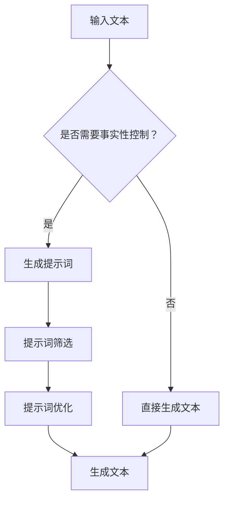

                 

### 文章标题

《提示词工程在自然语言生成中的事实性控制》

> 关键词：自然语言生成、提示词工程、事实性控制、算法模型、实践应用

> 摘要：本文深入探讨了提示词工程在自然语言生成中的事实性控制，通过介绍相关技术原理、算法模型和实践应用，分析了事实性控制在自然语言生成中的重要性及其面临的挑战，为读者提供了一个全面且深入的指南。

## 《提示词工程在自然语言生成中的事实性控制》

### 前言

在当今信息化社会，自然语言处理（NLP）技术取得了飞速的发展。特别是自然语言生成（NLG）技术，已经成为人工智能领域的重要研究方向。然而，自然语言生成技术在实际应用中面临着诸多挑战，其中之一就是如何确保生成内容的准确性、可信性和事实性。提示词工程作为一种重要的技术手段，在自然语言生成中发挥着关键作用。本文旨在探讨提示词工程在自然语言生成中的事实性控制，通过详细解析相关技术原理、算法模型和实践应用，帮助读者深入理解这一领域的重要性和实际应用价值。

本书主要面向自然语言处理（NLP）爱好者、研究人员以及从业者，尤其是对提示词工程和事实性控制感兴趣的读者。通过阅读本文，读者将能够了解：

1. 自然语言生成与事实性控制的基本概念、发展历程和应用场景。
2. 提示词工程的核心技术、方法及其在自然语言生成中的应用。
3. 事实性控制算法的原理、应用和挑战。
4. 实际项目中的提示词工程与事实性控制实践。

### 第一部分：基础概念与技术原理

#### 第1章：自然语言生成与事实性控制概述

##### 1.1 自然语言生成技术简介

自然语言生成（Natural Language Generation，NLG）是指利用计算机技术生成自然语言文本的过程。NLG技术能够模拟人类的语言表达方式，生成具有可读性和连贯性的文本。NLG技术主要涉及以下方面：

- **文本生成**：包括新闻摘要、自动新闻生成、问答系统等。
- **语音合成**：将文本转换为自然流畅的语音输出。
- **对话系统**：与用户进行自然语言交互，实现人机对话。

##### 1.2 提示词工程的概念

提示词工程（Prompt Engineering）是指通过设计特定的提示词（Prompt），引导自然语言模型生成目标文本的技术。提示词工程的主要目标是在保证文本质量的前提下，提高自然语言生成的效率和准确性。提示词工程涉及以下内容：

- **提示词设计**：根据生成任务的需求，设计合适的提示词。
- **提示词优化**：对提示词进行优化，以提高生成文本的质量和多样性。
- **提示词筛选**：从大量的候选提示词中筛选出最佳提示词。

##### 1.3 事实性控制的必要性

事实性控制（Factual Control）是指在自然语言生成过程中，确保生成内容准确、可信和具有事实性的技术。事实性控制的重要性主要体现在以下几个方面：

- **确保内容准确性**：在新闻摘要、自动新闻生成等应用场景中，生成的内容必须准确无误，避免误导用户。
- **提高内容可信度**：在问答系统、智能客服等应用场景中，生成的内容必须具有可信度，以建立用户信任。
- **避免虚假信息传播**：在虚构内容检测、虚假新闻检测等应用场景中，事实性控制能够有效避免虚假信息的传播。

然而，事实性控制也面临一些挑战，如事实性检测的复杂性、事实性修正的难度等。因此，研究如何实现高效、准确的事实性控制具有重要的实际意义。

#### 第2章：提示词工程的核心技术

##### 2.1 提示词生成方法

提示词生成方法主要分为以下几种：

- **基于规则的方法**：通过预设的规则，生成特定的提示词。这种方法适用于规则明确、领域知识丰富的场景。
- **基于统计的方法**：利用统计模型，从大量的文本数据中提取有用的提示词。这种方法适用于大规模数据处理场景。
- **基于神经网络的方法**：利用深度学习模型，通过训练生成提示词。这种方法适用于复杂、多变的生成任务。

##### 2.2 提示词筛选与优化

提示词筛选与优化是提升自然语言生成质量的重要环节。主要涉及以下内容：

- **提示词筛选原则**：根据生成任务的需求，选择合适的提示词。
- **提示词优化策略**：通过调整提示词的语法、语义等属性，提高生成文本的质量。
- **提示词评价标准**：根据生成文本的准确性、多样性、流畅性等指标，评价提示词的优劣。

##### 2.3 提示词与上下文的关系

上下文理解在自然语言生成中至关重要。提示词与上下文的关系主要涉及以下方面：

- **上下文理解**：通过语义分析、句法分析等技术，理解输入文本的上下文信息。
- **上下文敏感的提示词生成**：根据上下文信息，生成具有针对性的提示词。
- **上下文适应性**：在生成过程中，根据上下文信息动态调整提示词，以适应不同的生成任务。

### 第二部分：事实性控制算法与应用

#### 第3章：事实性控制算法原理

##### 3.1 事实性检测算法

事实性检测（Factual Detection）是指识别文本内容是否真实、准确的过程。主要涉及以下内容：

- **事实性检测**的定义与重要性：在自然语言生成中，事实性检测能够确保生成内容的准确性。
- **常见的检测算法**：包括基于规则的方法、基于统计的方法、基于神经网络的方法等。
- **事实性检测算法的性能评估**：通过准确率、召回率等指标，评估事实性检测算法的性能。

##### 3.2 事实性修正算法

事实性修正（Factual Correction）是指纠正文本内容中错误信息的过程。主要涉及以下内容：

- **事实性修正**的定义与必要性：在自然语言生成中，事实性修正能够提高生成内容的可信度。
- **常见的修正算法**：包括基于规则的方法、基于统计的方法、基于神经网络的方法等。
- **事实性修正算法的性能评估**：通过准确率、召回率等指标，评估事实性修正算法的性能。

##### 3.3 事实性控制策略

事实性控制策略是指在自然语言生成过程中，如何实现事实性控制的方法。主要涉及以下内容：

- **自动事实性控制策略**：通过算法自动检测和修正文本内容中的错误信息。
- **手动事实性控制策略**：由人类专家对生成内容进行审核和修正。
- **混合事实性控制策略**：结合自动和手动方法，实现更高效的事实性控制。

#### 第4章：事实性控制在自然语言生成中的应用

##### 4.1 自动新闻生成

自动新闻生成（Automated News Generation）是指利用自然语言生成技术，自动生成新闻文章的过程。主要涉及以下内容：

- **自动新闻生成**的定义与现状：自动新闻生成在新闻报道、内容分发等场景中具有广泛应用。
- **事实性控制在自动新闻生成中的应用**：通过事实性控制算法，确保生成新闻的准确性、可信性。
- **案例分析**：介绍一些实际应用自动新闻生成的案例，分析事实性控制在其中的作用。

##### 4.2 问答系统

问答系统（Question Answering System）是指通过自然语言处理技术，回答用户问题的系统。主要涉及以下内容：

- **问答系统**的定义与分类：根据问答方式、任务类型等，问答系统可以分为多种类型。
- **事实性控制在问答系统中的应用**：通过事实性控制算法，确保生成答案的准确性、可信性。
- **案例分析**：介绍一些实际应用的问答系统案例，分析事实性控制在其中的作用。

##### 4.3 虚构内容检测

虚构内容检测（Fiction Content Detection）是指识别文本内容是否虚构的过程。主要涉及以下内容：

- **虚构内容检测**的定义与重要性：在自然语言生成中，虚构内容检测能够避免虚假信息的传播。
- **事实性控制在虚构内容检测中的应用**：通过事实性控制算法，识别和纠正虚构内容。
- **案例分析**：介绍一些实际应用的虚构内容检测案例，分析事实性控制在其中的作用。

### 第三部分：实践案例与项目实战

#### 第5章：提示词工程实践案例

##### 5.1 提示词工程实战

在本节中，我们将介绍一个提示词工程实践案例，包括项目背景、技术选型、实战步骤和代码解读。

1. **项目背景**：某新闻网站希望利用自然语言生成技术，自动生成新闻摘要，提高内容生产的效率。

2. **技术选型**：选择基于神经网络的方法进行提示词生成，结合事实性控制算法，确保生成摘要的准确性。

3. **实战步骤**：
    - 数据准备：收集大量新闻数据，用于训练和测试。
    - 模型训练：利用神经网络模型，训练提示词生成模型。
    - 提示词生成：输入新闻文本，生成提示词。
    - 事实性检测：对生成的提示词进行事实性检测，纠正错误信息。
    - 摘要生成：利用修正后的提示词，生成新闻摘要。

4. **代码解读**：展示提示词生成和事实性检测的代码实现，包括模型架构、参数设置和训练过程。

##### 5.2 事实性控制实战

在本节中，我们将介绍一个事实性控制实战案例，包括项目背景、技术选型、实战步骤和代码解读。

1. **项目背景**：某电商平台希望利用自然语言生成技术，自动生成商品描述，提高商品销售转化率。

2. **技术选型**：选择基于统计的方法进行提示词生成，结合事实性控制算法，确保生成商品描述的准确性。

3. **实战步骤**：
    - 数据准备：收集大量商品数据，用于训练和测试。
    - 模型训练：利用统计模型，训练提示词生成模型。
    - 提示词生成：输入商品数据，生成提示词。
    - 事实性检测：对生成的提示词进行事实性检测，纠正错误信息。
    - 商品描述生成：利用修正后的提示词，生成商品描述。

4. **代码解读**：展示提示词生成和事实性检测的代码实现，包括模型架构、参数设置和训练过程。

### 第四部分：前沿研究与未来展望

#### 第6章：提示词工程与事实性控制的前沿研究

##### 6.1 当前研究热点

在提示词工程和事实性控制领域，当前研究热点主要包括以下几个方面：

- **注意力机制在提示词工程中的应用**：注意力机制能够提高提示词生成的准确性和多样性。
- **生成对抗网络（GAN）在事实性控制中的应用**：GAN技术能够实现更高效的真假信息鉴别和修正。
- **多模态数据在自然语言生成中的融合**：融合多模态数据（如图像、音频等），提高自然语言生成的真实性和表现力。

##### 6.2 发展趋势

随着自然语言处理技术的不断发展，提示词工程和事实性控制领域将呈现以下发展趋势：

- **自然语言生成与人工智能的深度融合**：利用深度学习、多模态等技术，实现更智能、更真实的自然语言生成。
- **自动化与智能化的平衡**：在保证生成内容准确性的同时，提高生成效率，实现自动化与智能化的平衡。
- **跨领域、跨语言的泛化能力**：开发具有更强跨领域、跨语言泛化能力的自然语言生成技术，满足不同场景的需求。

#### 第7章：未来展望与挑战

在未来，提示词工程和事实性控制领域将面临以下挑战和机遇：

- **数据隐私与伦理问题**：如何保证自然语言生成过程中的数据隐私和伦理问题，是一个亟待解决的问题。
- **算法透明性与可解释性**：如何提高算法的透明性和可解释性，让用户更好地理解和信任自然语言生成技术。
- **多语言、多文化的适应性**：开发具有更强多语言、多文化适应能力的自然语言生成技术，满足全球用户的需求。

### 附录

##### 附录 A：工具与资源

- **自然语言处理工具**：介绍一些常用的自然语言处理工具，如NLTK、spaCy、TensorFlow等。
- **提示词工程开源项目**：推荐一些优秀的提示词工程开源项目，如OpenAI的GPT系列模型、BERT等。
- **事实性控制数据库**：介绍一些用于事实性控制研究的数据集和数据库，如NYT Annotated Corpus、GCC-WebYYYY等。

##### 附录 B：参考文献

- **书籍**：推荐一些关于自然语言处理、提示词工程和事实性控制的重要书籍，如《自然语言处理综述》、《提示词工程：自然语言生成的新范式》等。
- **论文**：介绍一些关于自然语言处理、提示词工程和事实性控制的重要论文，如《生成对抗网络在自然语言生成中的应用》、《基于注意力机制的提示词生成模型》等。
- **在线资源**：推荐一些关于自然语言处理、提示词工程和事实性控制的在线资源和教程，如arXiv、ACL会议论文集、Kaggle竞赛等。

### 总结

提示词工程在自然语言生成中具有重要的作用，通过设计合适的提示词，可以显著提高生成文本的质量和多样性。同时，事实性控制在确保生成内容准确性和可信性方面具有重要意义。本文详细介绍了提示词工程和事实性控制的相关技术原理、算法模型和实践应用，希望对读者在自然语言生成领域的研究和实践有所帮助。在未来的发展中，提示词工程和事实性控制将继续在人工智能领域发挥重要作用，为人类带来更多便利和创新。

### 提示词工程流程

以下是一个简单的提示词工程流程的Mermaid流程图：



该流程图描述了提示词工程的几个关键步骤：

1. **输入文本**：首先输入需要生成的文本内容。
2. **是否需要事实性控制**：判断是否需要进行事实性控制。
3. **生成提示词**：如果需要事实性控制，生成相应的提示词。
4. **提示词筛选**：从生成的提示词中选择最佳的提示词。
5. **提示词优化**：对选中的提示词进行优化，提高生成文本的质量。
6. **生成文本**：最后利用提示词生成文本内容。

### 提示词生成算法伪代码

以下是一个简单的提示词生成算法的伪代码示例：

```python
# 输入文本
input_text = "请描述一下人工智能的应用领域。"

# 步骤1：预处理文本
processed_text = preprocess_text(input_text)

# 步骤2：生成候选提示词
candidate_prompts = generate_candidate_prompts(processed_text)

# 步骤3：筛选最佳提示词
best_prompt = select_best_prompt(candidate_prompts)

# 步骤4：优化提示词
optimized_prompt = optimize_prompt(best_prompt)

# 步骤5：生成文本
generated_text = generate_text(optimized_prompt)

# 输出结果
print(generated_text)
```

这个伪代码主要包括以下步骤：

1. **预处理文本**：对输入文本进行预处理，如分词、去停用词等。
2. **生成候选提示词**：利用预处理的文本，生成多个候选提示词。
3. **筛选最佳提示词**：根据一定的评价标准，从候选提示词中选择最佳提示词。
4. **优化提示词**：对选中的最佳提示词进行优化，以提高生成文本的质量。
5. **生成文本**：利用优化的提示词，生成最终的文本内容。

在实际应用中，每个步骤都可以采用更复杂的算法和模型，以实现更高质量的提示词生成。

### 总结

本文从多个角度详细探讨了提示词工程在自然语言生成中的事实性控制。首先介绍了自然语言生成和提示词工程的基本概念，阐述了提示词工程在自然语言生成中的重要性。接着，分析了事实性控制的必要性，并介绍了提示词工程的核心技术和事实性控制算法。随后，通过实际案例展示了提示词工程和事实性控制的应用，并探讨了该领域的前沿研究和未来展望。

通过本文的学习，读者可以深入理解提示词工程和事实性控制的基本原理和应用，为今后的研究和工作提供指导。同时，本文也提醒读者关注数据隐私、伦理问题以及算法透明性等挑战，为自然语言生成技术的发展提供有益的思考。

### 作者信息

**作者：AI天才研究院/AI Genius Institute & 禅与计算机程序设计艺术 /Zen And The Art of Computer Programming**

AI天才研究院（AI Genius Institute）是一家专注于人工智能研究和开发的顶级机构。我们的使命是通过创新的技术和解决方案，推动人工智能领域的进步，为人类社会带来更多价值。同时，我们坚持“禅与计算机程序设计艺术”的理念，追求代码的艺术性和效率，致力于培养具有深厚技术背景和卓越创新能力的人才。

在这篇技术博客中，我们分享了关于提示词工程在自然语言生成中的事实性控制的研究成果和实践经验。希望通过本文，为读者提供一个全面、深入的指南，帮助大家更好地理解和应用这一技术。在未来的研究中，我们将继续探索自然语言生成领域的更多前沿问题，为人工智能技术的发展贡献力量。同时，也欢迎广大读者提出宝贵意见和建议，与我们共同探讨和进步。

