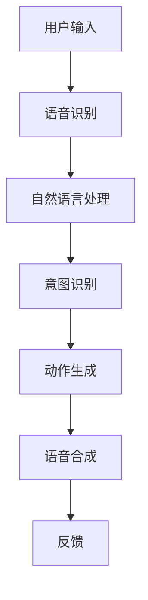
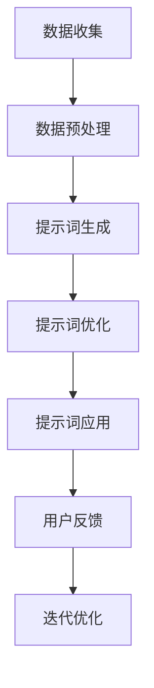

                 


### 第1章：虚拟形象的概述

#### 1.1 虚拟形象的定义与分类

虚拟形象，又称虚拟人、数字人、AI虚拟形象等，指的是通过计算机技术生成的人或物的数字模型，它们可以在虚拟空间中与用户进行互动和交流。虚拟形象的分类可以从多个维度进行，如根据应用领域、技术实现、交互方式等。

- **根据应用领域**：虚拟形象可分为娱乐类、服务类、教育类、营销类等。例如，娱乐类的虚拟形象如虚拟主播、游戏角色；服务类的虚拟形象如虚拟客服、虚拟导游等。

- **根据技术实现**：虚拟形象可分为2D虚拟形象、3D虚拟形象和AR虚拟形象等。2D虚拟形象主要通过平面图像展示，如早期的动漫角色；3D虚拟形象则通过三维建模技术实现，具有立体感和空间感；AR虚拟形象通过增强现实技术将虚拟形象与现实世界结合，增加用户的沉浸体验。

- **根据交互方式**：虚拟形象可分为单向交互和双向交互。单向交互主要是虚拟形象向用户传递信息，如虚拟讲解员；双向交互则是用户与虚拟形象进行对话和互动，如虚拟客服、虚拟朋友等。

虚拟形象的发展历程可以追溯到20世纪80年代，随着计算机图形学、计算机视觉和人工智能等技术的发展，虚拟形象的呈现形式和交互方式越来越丰富。如今，虚拟形象已经成为数字娱乐、虚拟现实、增强现实等领域的重要应用。

#### 1.2 虚拟形象的现状与发展

当前，虚拟形象的应用已经渗透到众多领域，从娱乐、教育、营销到服务业，虚拟形象都发挥着重要作用。以下是一些具体的应用现状：

- **娱乐领域**：虚拟主播、虚拟偶像、虚拟演员等虚拟形象在直播、短视频、影视剧等领域得到了广泛应用。例如，中国的“洛天依”和“初音未来”等虚拟歌手在二次元文化圈中具有极高的人气。

- **教育领域**：虚拟教师、虚拟实验室等虚拟形象在教育领域具有巨大的潜力。通过虚拟形象，学生可以更加直观地学习知识，提高学习兴趣和效果。

- **营销领域**：虚拟形象在品牌宣传和营销中发挥着重要作用。许多品牌利用虚拟形象来提升品牌形象、增加用户互动，从而提高销售业绩。

- **服务业**：虚拟客服、虚拟导游等虚拟形象在服务业中得到了广泛应用。它们可以提供7x24小时的服务，提高服务效率和用户体验。

未来，虚拟形象的发展趋势将体现在以下几个方面：

- **技术进步**：随着计算机图形学、计算机视觉、人工智能等技术的不断发展，虚拟形象的呈现形式和交互方式将更加多样和自然。

- **应用深化**：虚拟形象将在更多领域得到应用，如医疗、金融、法律等。虚拟形象将成为行业专家和用户之间的桥梁。

- **社会接受度提高**：随着虚拟形象的普及和用户对其信任度的提高，虚拟形象将在社会中扮演更加重要的角色。

#### 1.3 提示词工程在虚拟形象设计中的重要性

提示词工程，是指通过构建提示词库，利用自然语言处理和机器学习技术生成、优化和匹配提示词的过程。在虚拟形象设计中，提示词工程起着至关重要的作用。

首先，提示词工程可以帮助虚拟形象更好地理解和处理用户的输入。通过提示词，虚拟形象可以获取用户的意图和需求，从而提供更加准确和个性化的服务。

其次，提示词工程可以提升虚拟形象的交互体验。通过丰富和优化的提示词库，虚拟形象可以更加自然地与用户进行对话和交流，提高用户的沉浸感和满意度。

最后，提示词工程有助于虚拟形象的情感表达。通过情感分析技术，虚拟形象可以根据用户的情绪状态调整自己的表达方式，从而更好地与用户建立情感联系。

总之，提示词工程是虚拟形象设计中的重要组成部分，它不仅提高了虚拟形象的性能和用户体验，还为虚拟形象的智能化和个性化发展提供了技术支持。

### 第2章：虚拟形象的感知与认知

#### 2.1 虚拟形象的感知原理

虚拟形象的感知原理涉及到多个感知通道，包括视觉、听觉和触觉等。这些感知通道使得虚拟形象能够接收和处理外部信息，从而实现与用户的互动。

- **视觉感知原理**：虚拟形象的视觉感知主要通过计算机图形学实现。计算机图形学技术可以生成高质量的三维模型和二维图像，虚拟形象通过视觉通道接收这些图像，并利用计算机视觉技术进行分析和处理。

- **听觉感知原理**：虚拟形象的听觉感知主要通过语音合成和识别技术实现。语音合成技术可以将文本信息转化为语音，而语音识别技术则可以将用户的语音输入转化为文本信息，虚拟形象通过听觉通道接收这些语音信息。

- **触觉感知原理**：虚拟形象的触觉感知主要依赖于虚拟现实技术和传感器技术。虚拟现实技术可以模拟触觉反馈，而传感器技术可以检测用户对虚拟形象的触摸和交互行为。

#### 2.2 虚拟形象的认知理论

虚拟形象的认知理论主要涉及认知心理学和计算机科学领域的相关理论。以下是一些核心理论：

- **认知心理学理论**：认知心理学研究人的思维过程和认知结构。在虚拟形象的设计中，认知心理学理论可以帮助我们理解用户如何理解和处理信息，从而设计出更加符合用户认知习惯的虚拟形象。

- **虚拟形象认知模型**：虚拟形象认知模型是描述虚拟形象如何感知、理解和处理信息的理论框架。常见的认知模型包括感知模型、知识表示模型、推理模型等。

- **虚拟形象认知机制**：虚拟形象认知机制是指虚拟形象在感知、理解和处理信息过程中所采用的方法和策略。例如，虚拟形象可以通过情感分析技术识别用户的情绪状态，并根据情绪状态调整自己的行为和表达。

#### 2.3 提示词在虚拟形象感知与认知中的作用

提示词在虚拟形象感知与认知中起着至关重要的作用。以下是几个关键作用：

- **信息获取**：提示词可以帮助虚拟形象获取用户的意图和需求。通过分析用户输入的提示词，虚拟形象可以理解用户的意图，从而提供更加准确和个性化的服务。

- **交互优化**：提示词可以提升虚拟形象与用户的交互体验。通过丰富和优化的提示词库，虚拟形象可以更加自然地与用户进行对话和交流，提高用户的沉浸感和满意度。

- **情感识别**：提示词可以帮助虚拟形象识别用户的情绪状态。通过情感分析技术，虚拟形象可以根据用户的情绪状态调整自己的表达方式，从而更好地与用户建立情感联系。

### 第3章：提示词工程基础

#### 3.1 提示词的来源与分类

提示词的来源可以分为人工生成和自动生成两种。

- **人工生成**：人工生成提示词通常由人类专家根据特定领域知识和经验进行编写。这种方法生成的提示词具有较高的质量和准确性，但效率较低。

- **自动生成**：自动生成提示词主要依赖于自然语言处理技术和机器学习算法。通过分析大量文本数据，自动生成提示词可以提高生成效率，但可能存在准确性和质量的问题。

提示词的分类可以从多个维度进行，如根据用途、来源、类型等。

- **根据用途**：提示词可以分为通用提示词和特定领域提示词。通用提示词适用于多个领域，如“你好”、“谢谢”等；特定领域提示词则针对特定领域，如“股票代码”、“药品名称”等。

- **根据来源**：提示词可以分为人工生成的提示词和自动生成的提示词。

- **根据类型**：提示词可以分为词性提示词、短语提示词和句子提示词等。

#### 3.2 提示词的生成方法

提示词的生成方法可以分为手工生成和自动生成两种。

- **手工生成**：手工生成提示词主要依靠人类专家的经验和知识。这种方法生成的提示词具有较高的质量和准确性，但效率较低。

- **自动生成**：自动生成提示词主要依赖于自然语言处理技术和机器学习算法。常见的自动生成方法包括：

  - 基于规则的方法：通过定义一系列规则来生成提示词。这种方法生成的提示词具有较好的可解释性，但可能存在规则覆盖不足的问题。

  - 基于统计的方法：通过分析大量文本数据，提取出现频率较高的词或短语作为提示词。这种方法生成的提示词具有较高的准确性和覆盖率，但可能存在质量不稳定的问题。

  - 基于机器学习的方法：利用机器学习算法，如词袋模型、支持向量机等，从大量文本数据中自动提取特征和模式，生成提示词。这种方法生成的提示词具有较高的准确性和泛化能力，但可能存在模型复杂度和计算成本较高的问题。

#### 3.3 提示词的优化策略

提示词的优化策略旨在提高提示词的质量、准确性和覆盖率。以下是一些常见的优化策略：

- **质量优化**：质量优化主要关注提示词的准确性和语义一致性。常见的质量优化方法包括：

  - 语义分析：通过自然语言处理技术对提示词进行语义分析，识别并去除歧义性提示词。

  - 提示词清洗：去除重复、无关或低质量的提示词，确保提示词库的纯净度。

- **准确性优化**：准确性优化主要关注提示词的匹配度和识别率。常见的准确性优化方法包括：

  - 提高匹配度：通过改进提示词匹配算法，提高提示词与用户输入的匹配度。

  - 预处理：对用户输入进行预处理，如去除无关符号、统一大小写等，提高提示词识别的准确性。

- **覆盖率优化**：覆盖率优化主要关注提示词库的覆盖范围。常见的覆盖率优化方法包括：

  - 扩展词库：通过引入更多的词汇和短语，扩展提示词库的覆盖范围。

  - 上下文分析：利用上下文信息，生成更加精确的提示词，提高提示词的覆盖率。

### 第4章：提示词在虚拟形象设计中的应用

#### 4.1 提示词在虚拟形象建模中的应用

虚拟形象建模是虚拟形象设计的基础，而提示词在虚拟形象建模中起着至关重要的作用。以下是一些具体的应用：

- **角色设定**：通过提示词，可以为虚拟形象设定不同的角色，如虚拟主播、虚拟客服、虚拟导游等。提示词可以帮助定义虚拟形象的行为和风格。

- **外观设计**：提示词可以用于描述虚拟形象的外观特征，如颜色、发型、服装等。通过这些提示词，设计师可以更加准确地构建虚拟形象的外观。

- **动作设计**：提示词可以用于描述虚拟形象的动作和表情，如走路、微笑、挥手等。通过这些提示词，动画师可以设计出更加生动和自然的虚拟形象动作。

#### 4.2 提示词在虚拟形象交互中的应用

虚拟形象的交互是其与用户进行互动的关键环节，而提示词在虚拟形象交互中发挥着重要作用。以下是一些具体的应用：

- **对话生成**：提示词可以帮助虚拟形象生成对话内容。通过自然语言处理技术，虚拟形象可以理解用户输入的提示词，并生成相应的回复。这有助于提高虚拟形象与用户的互动质量。

- **意图识别**：提示词可以用于识别用户的意图。例如，当用户输入“我想买一件衣服”时，虚拟形象可以通过提示词识别出用户的购物意图，并生成相应的推荐。

- **情感表达**：提示词可以帮助虚拟形象表达情感。例如，当用户输入“我很生气”时，虚拟形象可以通过提示词表达出愤怒的情绪，从而更好地与用户建立情感联系。

#### 4.3 提示词在虚拟形象情感表达中的应用

虚拟形象的情感表达是用户体验的重要组成部分，而提示词在虚拟形象情感表达中起着关键作用。以下是一些具体的应用：

- **情绪识别**：提示词可以帮助虚拟形象识别用户的情绪。例如，当用户输入“我很开心”时，虚拟形象可以通过提示词识别出用户的开心情绪，并做出相应的表情和反应。

- **情感模拟**：提示词可以帮助虚拟形象模拟不同的情感状态。例如，当用户输入“我很悲伤”时，虚拟形象可以通过提示词模拟出悲伤的情感状态，从而更好地与用户共情。

- **情感反馈**：提示词可以帮助虚拟形象给用户提供情感反馈。例如，当用户输入“我今天很累”时，虚拟形象可以通过提示词给予用户安慰和鼓励，从而提高用户的满意度。

### 第5章：提示词工程的核心算法

#### 5.1 自然语言处理技术

自然语言处理（Natural Language Processing，NLP）是提示词工程的基础技术之一。NLP旨在使计算机能够理解、处理和生成人类语言。以下是一些关键的NLP技术：

- **分词（Tokenization）**：将文本拆分成单词、短语或字符等基本单位。例如，将“我爱编程”拆分成“我”、“爱”和“编程”。

- **词性标注（Part-of-Speech Tagging）**：为文本中的每个词分配词性标签，如名词、动词、形容词等。例如，“我爱编程”中的“我”是代词，“爱”是动词，“编程”是名词。

- **句法分析（Syntactic Parsing）**：分析句子的结构，如主语、谓语、宾语等。例如，分析“我爱编程”的句法结构，可以得到主语是“我”，谓语是“爱”，宾语是“编程”。

- **实体识别（Named Entity Recognition，NER）**：识别文本中的命名实体，如人名、地名、组织名等。例如，识别“北京是中国的首都”中的“北京”和“中国”。

- **情感分析（Sentiment Analysis）**：分析文本的情感倾向，如正面、负面或中性。例如，分析“今天的天气很好”的情感，可以得到是正面情感。

#### 5.2 机器学习算法

机器学习（Machine Learning，ML）是提示词工程中用于生成和优化提示词的重要工具。以下是一些常用的机器学习算法：

- **朴素贝叶斯（Naive Bayes）**：基于贝叶斯定理，通过概率模型进行分类。例如，在文本分类任务中，朴素贝叶斯可以用来判断一段文本属于哪个类别。

- **支持向量机（Support Vector Machine，SVM）**：通过最大化分类边界，对数据进行分类。SVM在文本分类、情感分析等领域具有广泛的应用。

- **决策树（Decision Tree）**：通过构建树状结构，对数据进行分类或回归。决策树在处理简单和清晰的规则问题时表现良好。

- **随机森林（Random Forest）**：基于决策树的集成方法，通过构建多个决策树并求取平均值，提高模型的预测性能。随机森林在处理大规模数据和复杂问题时具有优势。

- **神经网络（Neural Networks）**：模拟人脑神经元的工作原理，通过多层神经网络进行复杂的数据处理。神经网络在图像识别、语音识别等任务中表现出色。

#### 5.3 深度学习模型

深度学习（Deep Learning，DL）是机器学习的一个重要分支，通过多层神经网络进行复杂的数据处理。以下是一些常用的深度学习模型：

- **卷积神经网络（Convolutional Neural Networks，CNN）**：通过卷积层提取图像特征，常用于图像识别、图像生成等任务。

- **循环神经网络（Recurrent Neural Networks，RNN）**：通过循环结构处理序列数据，如时间序列、语音信号等。RNN在自然语言处理、语音识别等领域具有广泛应用。

- **长短时记忆网络（Long Short-Term Memory，LSTM）**：RNN的改进版本，通过引入记忆单元，解决长序列依赖问题。LSTM在文本生成、机器翻译等领域表现出色。

- **生成对抗网络（Generative Adversarial Networks，GAN）**：由生成器和判别器两个神经网络组成，生成器生成数据，判别器判断数据真实性。GAN在图像生成、文本生成等领域具有强大能力。

### 第6章：虚拟形象设计案例

#### 6.1 案例一：虚拟主播的设计与实现

虚拟主播是虚拟形象设计中的一个重要应用场景，通过虚拟主播，可以实现24小时不间断的直播和节目制作。以下是一个虚拟主播的设计与实现案例：

**设计目标**：设计一个具有高互动性和个性化服务的虚拟主播，能够实现自然语言交互、实时表情和动作表达，以及丰富的内容创作。

**实现步骤**：

1. **角色设定**：确定虚拟主播的角色和形象，如性别、年龄、兴趣爱好等。通过提示词，定义虚拟主播的语言风格和行为特征。

2. **外观设计**：通过提示词描述虚拟主播的外观特征，如发型、服装、颜色等。利用计算机图形学技术，生成虚拟主播的三维模型。

3. **动作设计**：利用提示词定义虚拟主播的动作和表情，如走路、微笑、挥手等。通过动画技术，实现虚拟主播的动作和表情。

4. **语音合成**：利用语音合成技术，将文本信息转化为自然流畅的语音。通过自然语言处理技术，实现虚拟主播的自然语言交互。

5. **内容创作**：利用提示词和机器学习算法，生成虚拟主播的内容创作脚本。通过实时更新和个性化推荐，提供丰富的内容给观众。

**案例总结**：虚拟主播的设计与实现，不仅需要高质量的图像和语音，还需要丰富的提示词库和智能的交互算法。通过这个案例，我们可以看到提示词工程在虚拟形象设计中的应用价值。

#### 6.2 案例二：虚拟客服的设计与实现

虚拟客服是虚拟形象设计在服务领域的应用，通过虚拟客服，可以实现7x24小时在线服务，提高客户满意度和企业效率。以下是一个虚拟客服的设计与实现案例：

**设计目标**：设计一个智能、高效、个性化的虚拟客服，能够快速响应客户需求，提供准确的信息和服务。

**实现步骤**：

1. **角色设定**：确定虚拟客服的角色和形象，如性别、年龄、职业等。通过提示词，定义虚拟客服的语言风格和服务态度。

2. **知识库构建**：构建虚拟客服的知识库，包含常见问题的解答、产品信息、服务流程等。利用自然语言处理技术，实现知识库的语义理解和快速检索。

3. **交互设计**：设计虚拟客服与用户的交互流程，如问候、引导、解答问题等。通过提示词，实现虚拟客服的自然语言交互。

4. **情感识别**：利用情感分析技术，识别用户的情绪状态，并根据情绪状态调整虚拟客服的表达和回答。例如，当用户表达不满时，虚拟客服可以提供安慰和解决方案。

5. **实时更新**：通过实时数据获取和机器学习算法，不断更新虚拟客服的知识库和交互策略，提高服务的准确性和个性化程度。

**案例总结**：虚拟客服的设计与实现，不仅需要丰富的知识库和智能的交互算法，还需要实时更新和个性化服务。通过这个案例，我们可以看到提示词工程在虚拟形象设计中的应用价值。

#### 6.3 案例三：虚拟陪伴者的设计与实现

虚拟陪伴者是虚拟形象设计在社交领域的应用，通过虚拟陪伴者，可以实现24小时陪伴和互动，提供情感支持和社交陪伴。以下是一个虚拟陪伴者的设计与实现案例：

**设计目标**：设计一个智能、温暖、有情感的虚拟陪伴者，能够理解用户的情感需求，提供陪伴和支持。

**实现步骤**：

1. **角色设定**：确定虚拟陪伴者的角色和形象，如性别、年龄、兴趣爱好等。通过提示词，定义虚拟陪伴者的性格特征和行为习惯。

2. **情感识别**：利用情感分析技术，识别用户的情感状态，如开心、伤心、焦虑等。通过提示词，实现虚拟陪伴者对用户情感的感知和反馈。

3. **互动设计**：设计虚拟陪伴者与用户的互动场景，如聊天、游戏、运动等。通过提示词，实现虚拟陪伴者的自然语言交互和情感表达。

4. **情感表达**：通过虚拟形象的动作和表情，实现虚拟陪伴者的情感表达，如微笑、点头、拥抱等。通过提示词，定义虚拟陪伴者的情感反应和行为。

5. **个性化服务**：通过用户数据的收集和分析，为每个用户提供个性化的陪伴服务。利用机器学习算法，不断优化虚拟陪伴者的互动策略和情感表达。

**案例总结**：虚拟陪伴者的设计与实现，需要智能的情感识别和情感表达技术，以及丰富的提示词库。通过这个案例，我们可以看到提示词工程在虚拟形象设计中的应用价值。

### 第7章：提示词工程实战

#### 7.1 实战一：基于深度学习的提示词生成

**开发环境**：Python，TensorFlow或PyTorch

**源代码实现**：

以下是一个简单的基于深度学习的提示词生成代码示例，使用基于LSTM的模型进行训练。

```python
import tensorflow as tf
from tensorflow.keras.models import Sequential
from tensorflow.keras.layers import LSTM, Dense, Embedding

# 数据预处理
# 加载并预处理文本数据，生成词汇表和序列数据

# 构建模型
model = Sequential()
model.add(Embedding(vocab_size, embedding_dim))
model.add(LSTM(units=128, return_sequences=True))
model.add(LSTM(units=128))
model.add(Dense(vocab_size, activation='softmax'))

# 编译模型
model.compile(optimizer='adam', loss='categorical_crossentropy', metrics=['accuracy'])

# 训练模型
model.fit(sequence_data, target_data, epochs=10, batch_size=32)
```

**代码解读**：

- **数据预处理**：首先需要加载并预处理文本数据，包括分词、编码和序列化。这将生成词汇表和对应的序列数据，用于模型的训练。

- **模型构建**：使用序列模型，包括嵌入层、两个LSTM层和一个密集层。嵌入层将词汇映射到嵌入空间，LSTM层用于处理序列数据，密集层用于生成提示词。

- **编译模型**：配置模型，包括优化器、损失函数和评估指标。

- **训练模型**：使用预处理的数据训练模型，设置训练轮次和批量大小。

**应用解读与分析**：

基于深度学习的提示词生成可以生成高质量的提示词，但训练过程可能较为复杂和计算密集。在实际应用中，可以根据具体需求调整模型结构和参数，以提高生成效率和质量。

**案例分析**：通过训练，模型可以生成高质量的提示词，如描述虚拟形象外观的提示词，从而提高虚拟形象建模的精度和效果。

**小结**：基于深度学习的提示词生成是一种强大的方法，但需要大量的数据和计算资源。在实际应用中，可以根据具体需求调整模型和参数，以提高生成效果。

#### 7.2 实战二：基于大数据的提示词优化

**开发环境**：Hadoop，Spark

**源代码实现**：

以下是一个简单的基于大数据的提示词优化代码示例，使用Spark进行大数据处理。

```python
from pyspark.sql import SparkSession
from pyspark.ml.feature import Tokenizer, CountVectorizer
from pyspark.ml.linalg import Vectors
from pyspark.ml.regression import LinearRegression

# 创建Spark会话
spark = SparkSession.builder.appName("PromptWordOptimization").getOrCreate()

# 加载和预处理数据
data = spark.read.csv("prompt_words.csv", header=True)
tokenizer = Tokenizer(inputCol="text", outputCol="words")
wordsData = tokenizer.transform(data)

# 构建词袋模型
cv = CountVectorizer(inputCol="words", outputCol="features", vocabularySize=vocab_size)
cvModel = cv.fit(wordsData)
featuresData = cvModel.transform(wordsData)

# 训练线性回归模型
lr = LinearRegression(featuresCol="features", labelCol="rating")
lrModel = lr.fit(featuresData)

# 评估模型
predictions = lrModel.transform(featuresData)
evalMetrics = lrModel.evaluate(predictions)
print("RMSE:", evalMetrics['meanSquaredError'])

# 优化提示词
optimized_words = cvModel.transform(predictions.select("prompt_word"))
optimized_words.show()
```

**代码解读**：

- **创建Spark会话**：配置Spark会话，设置应用程序名称。

- **加载和预处理数据**：使用Spark读取CSV文件，并使用Tokenizer对文本数据进行预处理。

- **构建词袋模型**：使用CountVectorizer构建词袋模型，将文本数据转化为特征向量。

- **训练线性回归模型**：使用线性回归模型对特征向量进行训练，预测提示词的质量。

- **评估模型**：使用评估指标评估模型的性能，如均方误差（RMSE）。

- **优化提示词**：根据模型的预测结果，对提示词进行优化和排序。

**应用解读与分析**：

基于大数据的提示词优化可以处理大规模数据，并利用机器学习模型对提示词进行优化。这种方法可以显著提高提示词的准确性和质量。

**案例分析**：通过优化，模型可以识别和排除低质量的提示词，提高虚拟形象的交互效果和用户体验。

**小结**：基于大数据的提示词优化是一种高效的方法，适用于大规模数据集。在实际应用中，可以根据具体需求调整模型和参数，以提高优化效果。

#### 7.3 实战三：虚拟形象交互中的提示词应用

**开发环境**：Unity，Python

**源代码实现**：

以下是一个简单的虚拟形象交互中的提示词应用代码示例，使用Python编写虚拟形象的行为脚本。

```python
import speech_recognition as sr
import time

# 创建语音识别对象
recognizer = sr.Recognizer()

# 虚拟形象交互流程
while True:
    try:
        # 接收语音输入
        with sr.Microphone() as source:
            print("请说点什么：")
            audio = recognizer.listen(source)

        # 识别语音输入
        text = recognizer.recognize_google(audio)

        # 根据提示词执行相应操作
        if "你好" in text:
            print("你好！有什么可以帮助你的吗？")
        elif "再见" in text:
            print("再见！祝你有一个美好的一天！")
        else:
            print("我理解了你的请求，但暂时无法处理。")

        # 等待一段时间再接收下一个输入
        time.sleep(2)

    except sr.UnknownValueError:
        print("无法理解你的输入。")
    except sr.RequestError as e:
        print("无法请求结果；{0}".format(e))
    except KeyboardInterrupt:
        print("已退出。")
        break
```

**代码解读**：

- **创建语音识别对象**：使用SpeechRecognition库创建语音识别对象。

- **虚拟形象交互流程**：进入一个无限循环，等待用户输入。

- **接收语音输入**：使用麦克风接收用户的语音输入。

- **识别语音输入**：使用Google语音识别服务对语音输入进行识别。

- **根据提示词执行相应操作**：根据识别到的提示词，执行相应的操作，如回复用户、结束交互等。

**应用解读与分析**：

虚拟形象交互中的提示词应用可以显著提高虚拟形象的用户体验和互动效果。通过语音识别和自然语言处理技术，虚拟形象可以理解用户的意图，并根据提示词提供相应的服务。

**案例分析**：通过这个案例，虚拟形象可以与用户进行自然流畅的对话，提供个性化服务。

**小结**：虚拟形象交互中的提示词应用是一种实用的方法，可以提高虚拟形象的服务质量和用户体验。在实际应用中，可以根据具体需求调整交互流程和提示词库，以提高交互效果。

### 附录A：提示词工程开发工具与资源

**A.1 提示词生成工具**

- **TextGenerator**：一款基于Python的开源文本生成工具，支持多种生成算法，如GPT、RNN等。

- **JSZIP**：一款基于JavaScript的文本生成工具，支持多种文本生成算法，如GPT、RNN等。

- **Hugging Face Transformers**：一个开源的Python库，支持多种预训练模型，如GPT、BERT等，可用于文本生成和提示词生成。

**A.2 提示词优化工具**

- **Optimize Prompt**：一款基于Python的开源提示词优化工具，支持多种优化算法，如词袋模型、线性回归等。

- **OptimizePromptJS**：一款基于JavaScript的在线提示词优化工具，支持多种优化算法，如词袋模型、线性回归等。

- **Prompt Optimizer**：一款基于Java的开源提示词优化工具，支持多种优化算法，如词袋模型、神经网络等。

**A.3 虚拟形象设计平台**

- **Blender**：一款开源的3D建模和动画软件，支持虚拟形象的设计和制作。

- **Unity**：一款流行的游戏开发引擎，支持虚拟形象的交互和动画制作。

- **Unreal Engine**：一款强大的游戏开发引擎，支持虚拟形象的交互和动画制作。

### 附录B：核心概念与联系 Mermaid 流程图

**B.1 虚拟形象感知与认知流程图**



**B.2 提示词工程流程图**



### 附录C：核心算法原理讲解伪代码

**C.1 自然语言处理算法伪代码**

```python
def NLP_algorithm(text):
    # 分词
    words = tokenize(text)
    
    # 词性标注
    pos_tags = part_of_speech_tagging(words)
    
    # 句法分析
    syntax_tree = syntactic_parsing(words, pos_tags)
    
    # 实体识别
    entities = named_entity_recognition(words, pos_tags)
    
    # 情感分析
    sentiment = sentiment_analysis(text)
    
    return {
        'words': words,
        'pos_tags': pos_tags,
        'syntax_tree': syntax_tree,
        'entities': entities,
        'sentiment': sentiment
    }
```

**C.2 机器学习算法伪代码**

```python
def Machine_Learning_algorithm(data, labels):
    # 数据预处理
    preprocessed_data = preprocess_data(data)
    
    # 构建模型
    model = build_model(preprocessed_data, labels)
    
    # 训练模型
    model.fit(preprocessed_data, labels)
    
    # 评估模型
    predictions = model.predict(preprocessed_data)
    accuracy = evaluate_model(predictions, labels)
    
    return model, accuracy
```

**C.3 深度学习模型伪代码**

```python
def Deep_Learning_model(data, labels):
    # 数据预处理
    preprocessed_data = preprocess_data(data)
    
    # 构建模型
    model = build_model(preprocessed_data, labels)
    
    # 训练模型
    model.fit(preprocessed_data, labels, epochs=10, batch_size=32)
    
    # 评估模型
    predictions = model.predict(preprocessed_data)
    accuracy = evaluate_model(predictions, labels)
    
    return model, accuracy
```

### 附录D：数学模型和数学公式

**D.1 提示词优化数学模型**

$$
\text{目标函数} = \min_{\theta} \sum_{i=1}^{n} (\theta^T x_i - y_i)^2
$$

其中，$\theta$是模型的参数，$x_i$是特征向量，$y_i$是真实标签。

**D.2 情感分析数学模型**

$$
\text{情感得分} = \text{激活函数}(\text{权重} \cdot \text{特征向量} + \text{偏置})
$$

其中，激活函数可以是Sigmoid、ReLU等，权重和特征向量用于计算情感得分。

**D.3 交互设计数学模型**

$$
\text{用户体验得分} = \alpha \cdot \text{功能得分} + \beta \cdot \text{交互得分} + \gamma \cdot \text{情感得分}
$$

其中，$\alpha$、$\beta$和$\gamma$是权重系数，分别表示功能、交互和情感对用户体验的影响程度。

