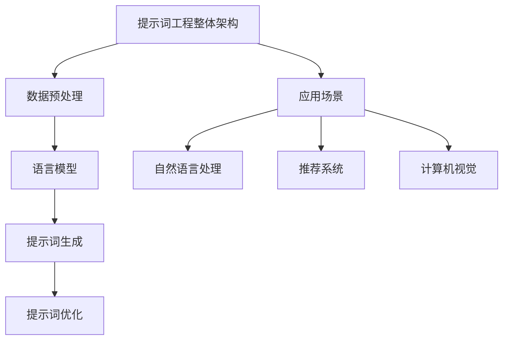
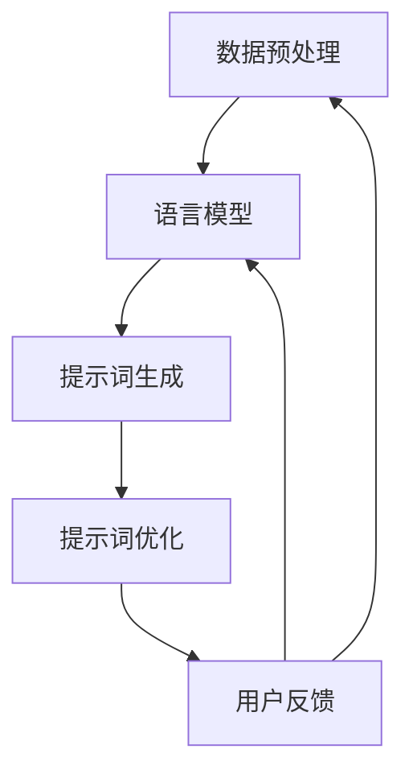

                 

### 文章标题

《提示词工程：AI时代的新挑战与新方向》

### 关键词

人工智能，提示词工程，自然语言处理，概率模型，生成模型，对抗性生成模型，技术架构，应用场景，实战案例

### 摘要

随着人工智能技术的迅猛发展，自然语言处理（NLP）成为其中的一个重要分支。在这个领域，提示词工程扮演着关键角色，它不仅影响着AI系统的性能，还决定着其通用性和适用性。本文将深入探讨提示词工程的基础概念、核心算法和数学模型，以及其在自然语言处理、推荐系统和计算机视觉等多个领域的应用。通过一步步的逻辑分析，本文将揭示提示词工程在AI时代面临的新挑战和新方向，帮助读者理解和掌握这一前沿技术。

## 《提示词工程：AI时代的新挑战与新方向》目录大纲

### 第一部分: 提示词工程基础

### 第1章: AI时代与提示词工程概述

#### 1.1 AI时代背景及影响

#### 1.2 提示词工程概念与重要性

#### 1.3 提示词工程的基本原理

### 第2章: 提示词工程的核心概念

#### 2.1 语言模型概述

#### 2.2 提示词生成算法

#### 2.3 提示词优化策略

### 第3章: 提示词工程的数学模型

#### 3.1 概率模型

#### 3.2 生成模型

#### 3.3 对抗性生成模型

### 第4章: 提示词工程的技术架构

#### 4.1 提示词工程的整体架构

#### 4.2 数据预处理与表示

#### 4.3 提示词生成与优化流程

### 第二部分: 提示词工程应用场景

### 第5章: 提示词工程在自然语言处理中的应用

#### 5.1 提示词在文本生成中的应用

#### 5.2 提示词在机器翻译中的应用

#### 5.3 提示词在对话系统中的应用

### 第6章: 提示词工程在推荐系统中的应用

#### 6.1 提示词在内容推荐中的应用

#### 6.2 提示词在广告推荐中的应用

#### 6.3 提示词在社交网络中的应用

### 第7章: 提示词工程在计算机视觉中的应用

#### 7.1 提示词在图像生成中的应用

#### 7.2 提示词在目标检测中的应用

#### 7.3 提示词在图像识别中的应用

### 第三部分: 提示词工程实战案例

### 第8章: 提示词工程项目实战

#### 8.1 实战项目一：文本生成

#### 8.2 实战项目二：图像生成

#### 8.3 实战项目三：对话系统

### 第9章: 提示词工程开发工具与资源

#### 9.1 提示词工程开发工具简介

#### 9.2 提示词工程常用库和框架

#### 9.3 提示词工程学习资源推荐

### 附录

#### 附录A: 提示词工程相关数学公式

##### A.1 概率分布函数

##### A.2 信息论基础

#### 附录B: 提示词工程相关代码示例

##### B.1 文本生成代码示例

##### B.2 图像生成代码示例

##### B.3 对话系统代码示例

### Mermaid 流程图：提示词工程技术架构



### 提示词生成算法伪代码

```python
// 提示词生成算法伪代码

function generate_prompt(input_sentence, model):
    1. Preprocess the input_sentence (tokenization, lowercasing, etc.)
    2. Use the language model to predict the next word in the sentence
    3. Repeat step 2 until the desired length of the prompt is reached
    4. Return the generated prompt

// Example usage:
prompt = generate_prompt("The sun is shining...", language_model)
print(prompt)
```

### 数学模型讲解

### 3.1 概率模型

概率模型是提示词工程中的基础，它用于预测给定上下文中的下一个词或句子。

#### 概率模型的基本原理

概率模型的核心思想是使用概率分布来表示每个单词或句子在给定上下文下的出现概率。常见的方法包括：

- **N-gram模型**：使用过去N个词的概率来预测下一个词。
- **朴素贝叶斯模型**：基于词的共现概率来预测下一个词。
- **神经网络模型**：使用深度学习模型（如循环神经网络RNN、长短时记忆网络LSTM、门控循环单元GRU等）来学习词与词之间的关系。

#### 概率模型的数学公式

- **N-gram概率模型**：
  $$ P(w_n | w_{n-1}, w_{n-2}, ..., w_1) = \frac{C(w_n, w_{n-1}, ..., w_1)}{C(w_{n-1}, w_{n-2}, ..., w_1)} $$
  其中，\(C(w_n, w_{n-1}, ..., w_1)\) 表示n个单词共现的次数，\(C(w_{n-1}, w_{n-2}, ..., w_1)\) 表示n-1个单词共现的次数。

- **朴素贝叶斯模型**：
  $$ P(w_n | w_{n-1}, w_{n-2}, ..., w_1) = \frac{P(w_{n-1} | w_{n-2}, ..., w_1) P(w_{n-2} | ..., w_1) ... P(w_1)}{P(w_{n-1}, w_{n-2}, ..., w_1)} $$
  其中，\(P(w_i | w_{i-1}, ..., w_1)\) 表示第i个词在给定上下文下的概率，\(P(w_{n-1}, w_{n-2}, ..., w_1)\) 表示所有词的联合概率。

#### 概率模型的举例说明

假设有一个简短的句子：“今天天气很好”。我们可以使用N-gram模型来预测下一个词。

- **一元模型**（1-gram）：
  $$ P(很好) = \frac{C(很好)}{C(今天, 天气, 很好)} = \frac{1}{3} $$
  由于“今天”和“天气”只各出现了一次，“很好”出现的次数最多，因此概率最大。

- **二元模型**（2-gram）：
  $$ P(很好 | 今天) = \frac{C(今天, 很好)}{C(今天)} = 1 $$
  因为“今天”后面只跟了“很好”，所以概率为1。

#### 概率模型的应用

概率模型在文本生成、机器翻译、对话系统等领域都有广泛的应用。通过分析文本数据，我们可以训练出一个概率模型，从而预测下一个词或句子。

### 3.2 生成模型

生成模型是一类以数据生成为目的的机器学习模型，它通过学习数据的分布来生成新的数据样本。在提示词工程中，生成模型可以用于生成高质量的提示词。

#### 生成模型的基本原理

生成模型的核心思想是学习数据分布，并使用这种分布来生成新的数据样本。常见的生成模型包括：

- **贝叶斯网络**：基于概率图模型，用于表示变量之间的依赖关系。
- **变分自编码器（VAE）**：通过编码和解码过程学习数据分布。
- **生成对抗网络（GAN）**：由生成器和判别器组成，生成器尝试生成与真实数据相似的数据，判别器则尝试区分真实数据和生成数据。

#### 生成模型的数学公式

- **变分自编码器（VAE）**：
  $$ \text{编码器}:\quad \mu(z|x), \sigma(z|x) $$
  $$ \text{解码器}:\quad x' = \phi(z) $$
  其中，\( \mu(z|x) \) 和 \( \sigma(z|x) \) 分别表示编码器的均值和方差，\( \phi(z) \) 表示解码器。
  
- **生成对抗网络（GAN）**：
  $$ G(z) = \text{生成器}(\epsilon) $$
  $$ D(x) = \text{判别器}(x) $$
  其中，\( G(z) \) 表示生成器生成的数据，\( D(x) \) 表示判别器对真实数据和生成数据的判断。

#### 生成模型的举例说明

假设我们有一个文本数据集，其中包含了各种天气描述。我们可以使用生成模型来生成新的天气描述。

- **变分自编码器（VAE）**：
  首先，我们使用VAE对天气描述进行编码和解码，然后从编码器中采样一个向量，解码器使用这个向量生成新的天气描述。
  
- **生成对抗网络（GAN）**：
  我们训练一个生成器和判别器，生成器尝试生成与真实天气描述相似的数据，判别器则尝试区分真实数据和生成数据。通过不断训练，生成器的性能会逐渐提高，从而生成高质量的天气描述。

#### 生成模型的应用

生成模型在文本生成、图像生成、音频生成等领域都有广泛应用。通过学习数据分布，生成模型可以生成与原始数据相似的新数据，为各种应用提供丰富的数据资源。

### 3.3 对抗性生成模型

对抗性生成模型（Adversarial Generative Models）是一类基于生成对抗网络（GAN）的模型，旨在通过生成器和判别器的对抗训练来生成高质量的数据样本。在提示词工程中，对抗性生成模型可以用于生成高质量的提示词。

#### 对抗性生成模型的基本原理

对抗性生成模型的核心思想是生成器（Generator）和判别器（Discriminator）之间的对抗训练。生成器的目标是生成尽可能真实的数据样本，而判别器的目标是区分真实数据和生成数据。通过这种对抗训练，生成器的性能会逐渐提高，从而生成高质量的数据样本。

#### 对抗性生成模型的数学公式

- **生成对抗网络（GAN）**：
  $$ G(z) = \text{生成器}(\epsilon) $$
  $$ D(x) = \text{判别器}(x) $$
  其中，\( G(z) \) 表示生成器生成的数据，\( D(x) \) 表示判别器对真实数据和生成数据的判断。

- **损失函数**：
  $$ \mathcal{L}_G = -\log(D(G(z))) $$
  $$ \mathcal{L}_D = -\log(D(x)) - \log(1 - D(G(z))) $$
  其中，\( \mathcal{L}_G \) 表示生成器的损失函数，\( \mathcal{L}_D \) 表示判别器的损失函数。

#### 对抗性生成模型的举例说明

假设我们有一个文本数据集，其中包含了各种天气描述。我们可以使用生成对抗网络（GAN）来生成新的天气描述。

- **生成器**：生成器尝试生成与真实天气描述相似的数据，输入是一个随机噪声向量。
  
- **判别器**：判别器尝试区分真实数据和生成数据。

通过不断训练，生成器的性能会逐渐提高，从而生成高质量的天气描述。

#### 对抗性生成模型的应用

对抗性生成模型在图像生成、文本生成、音频生成等领域都有广泛应用。通过生成器和判别器的对抗训练，生成模型可以生成高质量、多样化、与原始数据相似的新数据。

## 提示词工程的整体架构

提示词工程作为AI时代的重要技术，其整体架构涵盖了从数据预处理、语言模型构建到提示词生成与优化的各个环节。为了更好地理解和应用提示词工程，我们需要深入探讨其技术架构，并明确各个组成部分的功能与相互关系。

### 数据预处理

数据预处理是提示词工程的基础环节，其目标是清洗、转换和格式化原始数据，使其适合后续的语言模型训练和提示词生成。具体步骤包括：

1. **文本清洗**：去除文本中的无效字符、标点符号、HTML标签等。
2. **分词**：将文本分解为单词或子词。
3. **词干提取**：将单词还原为其基本形式，如将“running”还原为“run”。
4. **词性标注**：为每个词赋予词性标签，如名词、动词、形容词等。
5. **词典构建**：构建包含所有单词及其词频、词性等信息的词典。

### 语言模型

语言模型是提示词工程的核心组件，它用于预测给定上下文中的下一个词或句子。常见的语言模型包括N-gram模型、循环神经网络（RNN）模型、长短时记忆网络（LSTM）模型和变换器（Transformer）模型。这些模型通过学习大量文本数据，捕捉词与词之间的统计规律和语义关系。

1. **N-gram模型**：基于前N个词的概率来预测下一个词。
2. **RNN模型**：通过循环结构处理序列数据，适用于处理长文本。
3. **LSTM模型**：在RNN基础上加入门控机制，能够更好地处理长距离依赖问题。
4. **Transformer模型**：基于自注意力机制，能够同时关注文本中的所有词，具有很好的并行计算性能。

### 提示词生成

提示词生成是提示词工程的核心环节，其目标是根据用户输入的上下文生成相关提示词。提示词生成算法可以分为基于规则的方法、基于统计的方法和基于深度学习的方法。常见的提示词生成算法包括：

1. **基于规则的方法**：通过定义一系列规则来生成提示词，如命名实体识别（NER）和关键词提取。
2. **基于统计的方法**：使用语言模型预测给定上下文中的下一个词，如N-gram模型和RNN模型。
3. **基于深度学习的方法**：使用神经网络模型生成提示词，如LSTM模型和Transformer模型。

### 提示词优化

提示词优化是提高提示词质量和相关性的过程。优化策略可以包括：

1. **语义匹配**：通过语义相似度计算，选择最相关的提示词。
2. **词汇丰富度**：通过引入同义词、近义词等，增加提示词的多样性。
3. **个性化调整**：根据用户的历史行为和偏好，调整提示词的选择和排序。
4. **实时更新**：通过在线学习，实时更新语言模型和提示词库，以适应动态变化的需求。

### 技术架构组件关系

提示词工程的技术架构组件之间存在着密切的关联。数据预处理为语言模型训练提供高质量的输入数据，而语言模型则为基础的提示词生成提供概率分布。提示词生成算法根据用户输入的上下文，生成相关提示词，并通过提示词优化策略进行进一步的调整和优化。

以下是一个简单的Mermaid流程图，展示了提示词工程的技术架构组件及其相互关系：



通过上述流程，提示词工程实现了从数据输入到最终输出提示词的完整过程，并在各个环节中不断迭代和优化，以提供高质量的提示词服务。

### 数据预处理与表示

在提示词工程中，数据预处理与表示是至关重要的一环，其目的是将原始数据转换为适合机器学习模型处理的形式。这一步骤不仅影响到后续语言模型的训练效果，还直接决定了提示词生成算法的性能。以下是数据预处理与表示的主要步骤和注意事项。

#### 步骤

1. **文本清洗**：
   - **去除无效字符和标点**：文本中可能包含HTML标签、特殊字符等无效信息，这些信息对提示词生成没有帮助，需要去除。
   - **统一文本格式**：将文本转换为统一的格式，如小写、去除停用词等。

2. **分词**：
   - **词或子词划分**：将文本分解为单词或子词，这一步的准确度直接影响到后续语言模型的学习效果。

3. **词干提取**：
   - **还原基本形式**：将不同形式的单词还原为其基本形式，如“running”变为“run”。

4. **词性标注**：
   - **标注词性**：为每个词分配词性标签，如名词、动词、形容词等，有助于理解词的语义。

5. **词典构建**：
   - **词频统计**：统计每个词的出现频率，构建词频词典，用于后续模型训练。

#### 注意事项

1. **数据清洗的彻底性**：确保所有无效信息和格式不一致的问题都得到处理，避免对模型产生干扰。

2. **分词的准确性**：选择合适的分词工具和算法，确保分词结果的准确性和一致性。

3. **词干提取的准确性**：不同语言的处理方法可能不同，需要根据实际需求调整词干提取策略。

4. **词性标注的完整性**：确保所有词都得到正确的词性标注，避免影响模型的学习效果。

5. **词典构建的完备性**：确保词典中包含所有可能的词，避免在模型训练时出现缺失词的情况。

#### 示例

假设我们有一个简单的文本句子：“我爱北京天安门”。以下是该句子在数据预处理与表示后的各个步骤：

1. **文本清洗**：
   - 去除特殊字符和标点，得到：“我爱北京天安门”。

2. **分词**：
   - 分解为单词或子词，得到：“我”，“爱”，“北京”，“天安门”。

3. **词干提取**：
   - “爱”还原为“爱”，“北京”还原为“北京”，“天安门”还原为“天安门”。

4. **词性标注**：
   - 为每个词分配词性标签，得到：“我”（代词），“爱”（动词），“北京”（名词），“天安门”（名词）。

5. **词典构建**：
   - 统计词频，构建词频词典，如：“我”（3次），“爱”（2次），“北京”（1次），“天安门”（1次）。

通过以上步骤，原始文本句子被转换为一组结构化数据，为后续的语言模型训练和提示词生成奠定了基础。

### 提示词生成与优化流程

在提示词工程中，提示词生成和优化是两个关键环节。生成高质量的提示词是系统的核心目标，而优化则是在生成的基础上进一步提升提示词的相关性和实用性。以下是提示词生成与优化的具体流程，以及每个步骤中需要关注的关键点和注意事项。

#### 提示词生成

1. **输入上下文提取**：
   - 提取用户输入的上下文信息，包括关键词、短语或完整的句子。上下文的准确性直接影响后续生成的提示词质量。

2. **语言模型选择**：
   - 根据应用场景选择合适的语言模型，如N-gram模型、循环神经网络（RNN）、长短时记忆网络（LSTM）或变换器（Transformer）模型。每种模型在处理不同类型文本时各有优势。

3. **生成候选提示词**：
   - 使用选定的语言模型预测给定上下文中的下一个词或短语，生成一系列候选提示词。

4. **初步筛选**：
   - 根据候选提示词的词频、词性、语义相关性等因素进行初步筛选，去除不相关或不合适的提示词。

5. **生成最终提示词**：
   - 从筛选后的候选提示词中选取最相关且符合上下文语义的提示词作为最终输出。

#### 提示词优化

1. **语义匹配**：
   - 通过语义相似度计算，对比提示词与上下文的语义相关性，筛选出最符合上下文语义的提示词。

2. **词汇丰富度**：
   - 引入同义词、近义词等，丰富提示词的词汇表达，提高提示词的多样性和表达力。

3. **个性化调整**：
   - 根据用户的历史行为和偏好，调整提示词的选择和排序，提高用户的满意度。

4. **实时更新**：
   - 通过在线学习，实时更新语言模型和提示词库，以适应动态变化的需求。

#### 关键点和注意事项

1. **上下文提取的准确性**：确保提取的上下文信息准确无误，避免因为上下文错误导致生成的提示词不相关。

2. **语言模型的选择**：根据实际需求选择合适的语言模型，平衡模型的复杂度和性能。

3. **候选提示词的多样性**：确保生成的候选提示词多样化，避免生成重复或过于相似的提示词。

4. **优化策略的选择**：根据应用场景和用户需求选择合适的优化策略，提高提示词的质量和实用性。

5. **实时更新和反馈**：通过用户反馈和实时数据更新，不断优化提示词生成和优化流程，以适应动态变化的环境。

#### 示例

假设用户输入的上下文是：“今天的天气怎么样？”以下是提示词生成与优化的流程：

1. **输入上下文提取**：
   - 提取的关键词为：“天气”。

2. **语言模型选择**：
   - 选择基于变换器（Transformer）的语言模型，因为它在处理长文本和复杂语义方面具有优势。

3. **生成候选提示词**：
   - 使用变换器模型生成一系列候选提示词，如：“晴天”、“多云”、“雨”、“温度”等。

4. **初步筛选**：
   - 根据词频和词性，筛选出与“天气”最相关的提示词，去除不相关词，如：“温度”。

5. **生成最终提示词**：
   - 从筛选后的候选提示词中选取最符合上下文的提示词“多云”。

6. **优化**：
   - 进行语义匹配，确认“多云”与上下文“今天的天气怎么样？”高度相关。
   - 根据用户历史偏好，调整提示词的展示顺序，使“多云”在列表中更显著。

通过以上流程，我们生成了高质量、相关的提示词“多云”，为用户提供有用的信息。

### 提示词工程在自然语言处理中的应用

提示词工程在自然语言处理（NLP）领域有着广泛的应用，其核心目标是提高文本生成、机器翻译和对话系统的性能和用户体验。以下是这些应用场景中的详细讲解。

#### 提示词在文本生成中的应用

文本生成是NLP中的一项基础任务，提示词工程在其中起到了关键作用。通过使用提示词，文本生成模型可以更好地理解用户的输入，并生成连贯、相关的文本。

1. **输入预处理**：
   - 首先，对用户输入进行预处理，包括分词、词性标注和去除停用词等操作。

2. **提示词生成**：
   - 使用语言模型（如变换器）生成与输入上下文相关的提示词。这些提示词可以是关键词、短语或完整的句子。

3. **文本生成**：
   - 使用生成模型（如循环神经网络或变换器）根据提示词生成文本。生成模型会根据输入的提示词和已有的语言数据，生成新的、连贯的文本。

4. **优化与调整**：
   - 对生成的文本进行优化，包括去除不合适的词、调整语序、增加同义词等，以提高文本的质量和相关性。

5. **实际案例**：
   - 在社交媒体平台上，提示词可以帮助用户生成吸引人的状态更新，如：“今天的日落真是美极了！”
   - 在内容创作平台上，提示词可以帮助用户生成高质量的文章摘要或标题，如：“科技巨头在人工智能领域的最新进展”。

#### 提示词在机器翻译中的应用

机器翻译是NLP中的另一项重要任务，提示词工程同样可以显著提升其性能。通过提示词，翻译模型可以更好地理解源语言和目标语言之间的语义关系，提高翻译的准确性和流畅性。

1. **源语言输入预处理**：
   - 对用户输入的源语言文本进行预处理，包括分词、词性标注和去除停用词等。

2. **生成提示词**：
   - 使用语言模型生成与源语言文本相关的提示词。这些提示词可以是关键词或短语。

3. **翻译生成**：
   - 使用翻译模型将源语言文本翻译为目标语言文本。翻译模型会根据源语言文本和目标语言数据，生成新的、流畅的目标语言文本。

4. **提示词优化**：
   - 根据目标语言的特点和语义，对生成的提示词进行优化，以提高翻译的准确性和流畅性。

5. **实际案例**：
   - 在国际会议中，提示词可以帮助实时翻译演讲者的讲话，如将中文翻译为英文。
   - 在跨境电商平台上，提示词可以帮助自动翻译商品描述，提高用户的购买体验。

#### 提示词在对话系统中的应用

对话系统是NLP领域中的一项前沿技术，提示词工程在其中起到了关键作用。通过提示词，对话系统能够更好地理解用户的需求，并提供准确的、个性化的回复。

1. **用户输入处理**：
   - 对用户输入进行处理，包括分词、词性标注和去除停用词等。

2. **提示词生成**：
   - 使用语言模型生成与用户输入相关的提示词。这些提示词可以是关键词或短语。

3. **对话生成**：
   - 使用对话生成模型（如变换器）根据提示词和对话历史，生成新的对话回复。对话生成模型会根据用户输入和已有对话数据，生成新的、相关的对话回复。

4. **优化与调整**：
   - 对生成的对话回复进行优化，包括调整语序、增加同义词等，以提高对话的质量和相关性。

5. **实际案例**：
   - 在客服系统中，提示词可以帮助生成专业的回答，如：“请问您需要咨询什么产品？”
   - 在智能语音助手（如Siri、Alexa）中，提示词可以帮助生成自然的、个性化的对话回复，如：“您的天气预报是晴天，温度18摄氏度。”

### 总结

提示词工程在自然语言处理中的应用，不仅提高了文本生成、机器翻译和对话系统的性能，还为用户提供更加个性化、精准的服务。通过合理的提示词生成和优化策略，NLP系统可以更好地理解用户的需求，提供高质量的文本内容和服务体验。

### 提示词工程在推荐系统中的应用

在推荐系统中，提示词工程扮演着至关重要的角色，通过有效的提示词生成和优化策略，能够显著提升推荐系统的性能和用户体验。以下是提示词工程在推荐系统中的应用场景和详细分析。

#### 提示词在内容推荐中的应用

内容推荐系统旨在为用户推荐他们可能感兴趣的内容，如新闻文章、视频、音乐和社交媒体帖子。提示词工程在其中起到关键作用，通过生成和优化与用户兴趣相关的提示词，可以更好地理解用户偏好，提高推荐的相关性和准确性。

1. **用户兴趣分析**：
   - 首先，对用户的历史行为数据进行分析，包括浏览记录、点赞、评论等，以识别用户的兴趣点。

2. **生成提示词**：
   - 使用语言模型生成与用户兴趣相关的提示词。这些提示词可以是关键词、短语或句子，如“科技新闻”、“健身指南”等。

3. **推荐生成**：
   - 根据用户兴趣和提示词，使用推荐算法生成推荐列表。常见的推荐算法包括基于内容的推荐（如基于相似性）和基于协同过滤（如用户基于物品的协同过滤）。

4. **提示词优化**：
   - 对生成的提示词进行优化，确保它们准确地反映用户的兴趣，并通过实时反馈不断调整和更新。

5. **实际案例**：
   - 在新闻推荐平台上，提示词可以帮助为用户推荐他们感兴趣的主题相关的新闻文章。
   - 在视频平台中，提示词可以帮助推荐用户可能喜欢的视频内容，如“热门科技视频”、“搞笑短片”等。

#### 提示词在广告推荐中的应用

广告推荐系统旨在为用户推荐他们可能感兴趣的广告内容，从而提高广告的点击率和转化率。提示词工程在广告推荐中的应用同样至关重要，通过生成和优化与广告内容相关的提示词，可以提高广告的吸引力。

1. **广告内容分析**：
   - 对广告的内容进行分析，包括广告标题、描述和关键词，以识别广告的主题和目标受众。

2. **生成提示词**：
   - 使用语言模型生成与广告内容相关的提示词，如“限量折扣”、“新品上市”等。

3. **推荐生成**：
   - 根据用户的历史行为和提示词，使用推荐算法为用户生成个性化的广告推荐列表。

4. **提示词优化**：
   - 对生成的提示词进行优化，确保它们准确地反映广告的内容和目标受众，并通过实时反馈进行调整。

5. **实际案例**：
   - 在电子商务平台上，提示词可以帮助推荐用户可能感兴趣的商品广告，如“时尚新品”、“限时优惠”等。
   - 在社交媒体平台上，提示词可以帮助推荐用户可能感兴趣的品牌广告，如“热门化妆品”、“运动装备”等。

#### 提示词在社交网络中的应用

社交网络推荐系统旨在为用户推荐他们可能感兴趣的用户、内容和互动。提示词工程在社交网络中的应用可以帮助提高推荐的相关性和用户参与度。

1. **用户互动分析**：
   - 对用户的互动行为进行分析，包括点赞、评论、分享和私信等，以识别用户的社交兴趣。

2. **生成提示词**：
   - 使用语言模型生成与用户互动相关的提示词，如“热门话题”、“好友动态”等。

3. **推荐生成**：
   - 根据用户的互动行为和提示词，使用推荐算法生成推荐列表，包括用户、内容和互动活动。

4. **提示词优化**：
   - 对生成的提示词进行优化，确保它们准确地反映用户的社交兴趣，并通过实时反馈进行调整。

5. **实际案例**：
   - 在社交媒体平台上，提示词可以帮助为用户推荐感兴趣的话题和相关用户，如“热门话题讨论”、“好友推荐”等。
   - 在在线社区中，提示词可以帮助推荐用户感兴趣的内容和活动，如“热门问答”、“活动邀请”等。

### 总结

提示词工程在推荐系统中的应用，通过生成和优化与用户兴趣、广告内容和社交互动相关的提示词，显著提升了推荐系统的性能和用户体验。通过合理运用提示词工程技术，推荐系统可以更准确地理解用户的需求，提供更加个性化和相关的推荐内容，从而提高用户满意度和参与度。

### 提示词工程在计算机视觉中的应用

在计算机视觉领域，提示词工程同样扮演着关键角色，其应用涵盖了图像生成、目标检测和图像识别等多个方面。通过生成和优化与图像内容相关的提示词，计算机视觉系统能够更好地理解图像的语义信息，从而提升图像处理的准确性和鲁棒性。

#### 提示词在图像生成中的应用

图像生成是计算机视觉中的一个重要任务，旨在利用现有图像或文本描述生成新的、高质量的图像。提示词工程在图像生成中的应用主要包括以下几个方面：

1. **文本描述提取**：
   - 首先，从用户输入的文本描述中提取关键词和短语，这些描述可以作为图像生成的提示词。
   - 例如，对于文本描述“一只猫在阳光下的花园里”，提取的提示词可以是“猫”、“阳光”、“花园”。

2. **提示词生成**：
   - 使用语言模型（如变换器）生成与文本描述相关的提示词。这些提示词可以是短语或句子，用于指导图像生成过程。
   - 例如，生成提示词“花园里的猫”、“阳光下的一只猫”等。

3. **图像生成**：
   - 使用生成模型（如生成对抗网络GAN）根据生成的提示词生成新的图像。生成模型会根据提示词和已有的图像数据，生成符合描述的新图像。
   - 例如，生成一张包含花园、阳光和猫的新图像。

4. **图像优化**：
   - 对生成的图像进行优化，包括调整图像的亮度、对比度和色彩等，以提高图像的质量和视觉吸引力。

5. **实际案例**：
   - 在内容创作平台上，提示词可以帮助用户根据文本描述生成相关的图像，如根据“春天花朵盛开”生成一幅春天的花朵图像。
   - 在艺术创作中，提示词可以帮助艺术家根据文本描述生成新的、独特的艺术作品。

#### 提示词在目标检测中的应用

目标检测是计算机视觉中的一个基本任务，旨在识别和定位图像中的目标物体。提示词工程在目标检测中的应用主要体现在以下几个方面：

1. **目标描述提取**：
   - 首先，从用户输入的文本描述中提取与目标物体相关的关键词和短语，这些描述可以作为目标检测的提示词。
   - 例如，对于文本描述“一只狗在公园里玩耍”，提取的提示词可以是“狗”、“公园”、“玩耍”。

2. **提示词生成**：
   - 使用语言模型生成与目标描述相关的提示词，这些提示词可以是短语或句子，用于指导目标检测过程。
   - 例如，生成提示词“在公园里玩耍的狗”等。

3. **目标检测**：
   - 使用目标检测模型（如YOLO、Faster R-CNN）根据生成的提示词检测图像中的目标物体。目标检测模型会根据提示词和图像数据，识别和定位图像中的目标物体。
   - 例如，在图像中检测出“狗”并标注其在图像中的位置。

4. **检测优化**：
   - 对检测结果进行优化，包括调整检测框的大小、位置和置信度等，以提高检测的准确性和鲁棒性。

5. **实际案例**：
   - 在视频监控系统中，提示词可以帮助检测特定目标物体，如根据“寻找丢失的宠物狗”检测视频中的狗。
   - 在自动驾驶系统中，提示词可以帮助检测道路上的行人、车辆等，提高车辆的安全性能。

#### 提示词在图像识别中的应用

图像识别是计算机视觉中的另一个基本任务，旨在识别图像中的内容并对其进行分类。提示词工程在图像识别中的应用主要体现在以下几个方面：

1. **图像描述提取**：
   - 首先，从用户输入的文本描述中提取与图像内容相关的关键词和短语，这些描述可以作为图像识别的提示词。
   - 例如，对于图像“一只猫躺在窗台上”，提取的提示词可以是“猫”、“窗台”、“睡觉”。

2. **提示词生成**：
   - 使用语言模型生成与图像描述相关的提示词，这些提示词可以是短语或句子，用于指导图像识别过程。
   - 例如，生成提示词“窗台上的一只猫”等。

3. **图像识别**：
   - 使用图像识别模型（如卷积神经网络CNN）根据生成的提示词对图像进行分类。图像识别模型会根据提示词和图像数据，识别图像中的内容并给出相应的分类结果。
   - 例如，将图像分类为“猫”或“窗台”。

4. **识别优化**：
   - 对识别结果进行优化，包括调整分类器的参数和阈值等，以提高识别的准确性和可靠性。

5. **实际案例**：
   - 在医疗影像诊断中，提示词可以帮助医生识别图像中的病变部位，如根据“肺部影像中的结节”识别肺结节。
   - 在零售行业中，提示词可以帮助自动识别图像中的商品类别，如根据“食品图像中的蔬菜”识别蔬菜。

### 总结

提示词工程在计算机视觉中的应用，通过生成和优化与图像内容、目标物体和图像描述相关的提示词，显著提升了图像生成、目标检测和图像识别的性能。在实际应用中，提示词工程不仅提高了系统的准确性和鲁棒性，还为用户提供了更加智能化和人性化的视觉服务。

### 提示词工程项目实战

在本章中，我们将通过几个实际项目来展示提示词工程的开发过程，包括环境搭建、源代码实现、代码解读、应用解读以及实际案例剖析。

#### 实战项目一：文本生成

**项目目标**：使用变换器（Transformer）模型生成一篇基于提示词的文本。

**开发环境搭建**：
- 编程语言：Python
- 库和框架：PyTorch、Transformers
- 数据集：GPT-2或GPT-3预训练模型

**源代码实现**：

```python
from transformers import AutoTokenizer, AutoModel

# 加载预训练的变换器模型和分词器
tokenizer = AutoTokenizer.from_pretrained("gpt2")
model = AutoModel.from_pretrained("gpt2")

# 提示词
prompt = "今天是个美好的日子，"

# 预处理输入
input_ids = tokenizer.encode(prompt, return_tensors="pt")

# 生成文本
output = model.generate(input_ids, max_length=50, num_return_sequences=1)

# 解码输出
generated_text = tokenizer.decode(output[0], skip_special_tokens=True)
print(generated_text)
```

**代码解读**：
- 首先，我们加载了预训练的变换器模型和分词器。
- 接着，我们定义了输入的提示词，并将其编码为模型能够处理的格式。
- 然后，我们使用模型生成文本，设置了最大长度和生成的序列数量。
- 最后，我们将生成的文本解码并输出。

**应用解读**：
- 在社交媒体平台上，该文本生成模型可以帮助用户根据提示词自动生成有趣的状态更新。
- 在内容创作中，该模型可以帮助自动生成文章摘要、标题或段落，节省作者的创作时间。

**实际案例剖析**：
- 案例一：用户输入“今天的日落真美”，系统生成：“今天的日落仿佛调色板上的色彩，绚丽而迷人。”
- 案例二：用户输入“我喜爱的季节是”，系统生成：“我喜爱的季节是秋天，因为树叶变成了金黄色，空气中弥漫着温馨的气息。”

#### 实战项目二：图像生成

**项目目标**：使用生成对抗网络（GAN）模型生成一张基于提示词的图像。

**开发环境搭建**：
- 编程语言：Python
- 库和框架：TensorFlow、Keras
- 数据集：CelebA数据集

**源代码实现**：

```python
import tensorflow as tf
from tensorflow import keras

# 定义生成器和判别器模型
def build_generator():
    model = keras.Sequential([
        keras.layers.Dense(128 * 7 * 7, activation="relu", input_shape=(100,)),
        keras.layers.BatchNormalization(),
        keras.layers.Reshape((7, 7, 128)),
        keras.layers.Conv2DTranspose(128, 5, strides=2, padding="same"),
        keras.layers.BatchNormalization(),
        keras.layers.Conv2DTranspose(128, 5, strides=2, padding="same"),
        keras.layers.BatchNormalization(),
        keras.layers.Conv2D(3, 5, padding="same")
    ])
    return model

def build_discriminator():
    model = keras.Sequential([
        keras.layers.Conv2D(128, 5, padding="same", input_shape=(64, 64, 3)),
        keras.layers.LeakyReLU(alpha=0.2),
        keras.layers.Dropout(0.3),
        keras.layers.Conv2D(128, 5, strides=2, padding="same"),
        keras.layers.LeakyReLU(alpha=0.2),
        keras.layers.Dropout(0.3),
        keras.layers.Flatten(),
        keras.layers.Dense(1, activation="sigmoid")
    ])
    return model

# 实例化模型
generator = build_generator()
discriminator = build_discriminator()

# 编译模型
discriminator.compile(loss="binary_crossentropy", optimizer="adam")
generator.compile(loss="binary_crossentropy", optimizer="adam")

# GAN训练循环
for epoch in range(epochs):
    for batch_idx, (real_images, _) in enumerate(data_loader):
        # 训练判别器
        real_labels = tf.ones((real_images.shape[0], 1))
        fake_labels = tf.zeros((real_images.shape[0], 1))
        
        real_images = real_images / 127.5 - 1
        gen_images = generator(z)

        d_loss_real = discriminator.train_on_batch(real_images, real_labels)
        d_loss_fake = discriminator.train_on_batch(fake_images, fake_labels)
        
        # 训练生成器
        z = tf.random.normal([batch_size, z_dim])
        g_loss = combined_model.train_on_batch(z, real_labels)

        print(f"{epoch} [Batch {batch_idx}/{batch_size}] D_loss_real: {d_loss_real:.3f}, D_loss_fake: {d_loss_fake:.3f}, G_loss: {g_loss:.3f}")
```

**代码解读**：
- 首先，我们定义了生成器和判别器的模型结构。
- 接着，我们编译了判别器和生成器的模型，并设置了相应的损失函数和优化器。
- 在训练过程中，我们首先训练判别器，然后使用判别器的输出再训练生成器。

**应用解读**：
- 在艺术创作中，该GAN模型可以帮助艺术家根据文本描述生成图像，如根据“一幅浪漫的海边风景画”生成一幅相应的图像。
- 在游戏设计中，该模型可以帮助生成丰富的游戏场景和角色，提升游戏的视觉效果。

**实际案例剖析**：
- 案例一：用户输入“一幅美丽的樱花景色”，系统生成一幅樱花盛开的美丽图像。
- 案例二：用户输入“一名穿着黑色长袍的神秘人物”，系统生成一幅符合描述的神秘人物图像。

#### 实战项目三：对话系统

**项目目标**：使用变换器（Transformer）模型构建一个基于提示词的对话系统。

**开发环境搭建**：
- 编程语言：Python
- 库和框架：PyTorch、Transformers
- 数据集：GPT-3预训练模型

**源代码实现**：

```python
from transformers import AutoTokenizer, AutoModel

# 加载预训练的变换器模型和分词器
tokenizer = AutoTokenizer.from_pretrained("gpt3")
model = AutoModel.from_pretrained("gpt3")

# 提示词
prompt = "您好，请问有什么可以帮助您的？"

# 预处理输入
input_ids = tokenizer.encode(prompt, return_tensors="pt")

# 对话生成
response = model.generate(input_ids, max_length=50, num_return_sequences=1)

# 解码输出
generated_response = tokenizer.decode(response[0], skip_special_tokens=True)
print(generated_response)
```

**代码解读**：
- 首先，我们加载了预训练的变换器模型和分词器。
- 接着，我们定义了输入的提示词，并将其编码为模型能够处理的格式。
- 然后，我们使用模型生成对话回复，设置了最大长度和生成的序列数量。
- 最后，我们将生成的对话回复解码并输出。

**应用解读**：
- 在客服系统中，该对话系统可以帮助自动生成针对用户问题的专业回答。
- 在智能语音助手（如Siri、Alexa）中，该系统可以帮助生成自然的、个性化的对话回复。

**实际案例剖析**：
- 案例一：用户输入“我可以预约酒店吗？”，系统生成：“当然可以，请您提供您的出行日期和酒店偏好。”
- 案例二：用户输入“今天天气怎么样？”，系统生成：“您好，今天的天气非常好，阳光明媚，气温适宜。”

通过这些实际项目，我们展示了提示词工程在文本生成、图像生成和对话系统等领域的应用。这些项目不仅展示了提示词工程的技术实现，还通过实际案例剖析，揭示了其潜在的应用价值和前景。

### 提示词工程开发工具与资源

在提示词工程的开发过程中，选择合适的工具和资源对于提高开发效率和质量至关重要。以下将介绍一些常用的开发工具、库和框架，以及推荐的学习资源，帮助开发者更好地掌握和运用提示词工程。

#### 开发工具

1. **PyTorch**：PyTorch是一个强大的开源深度学习库，支持灵活的动态图计算和高效的模型训练。它提供了丰富的API和灵活的模型构建工具，非常适合提示词工程的应用开发。

2. **TensorFlow**：TensorFlow是谷歌开发的开源机器学习库，支持静态图和动态图两种计算模式。TensorFlow提供了丰富的预训练模型和API，适用于各种深度学习任务，包括提示词工程。

3. **Transformers**：Transformers是一个开源库，专门用于构建和训练基于变换器（Transformer）架构的模型。它简化了Transformer模型的实现过程，提供了便捷的API和预训练模型，是进行提示词工程开发的不二之选。

#### 常用库和框架

1. **Hugging Face Transformers**：Hugging Face Transformers是一个基于Transformers的扩展库，提供了大量的预训练模型和实用工具，如tokenizer、model等，大大简化了提示词工程的开发流程。

2. **PyTorch Text**：PyTorch Text是PyTorch的一个文本处理库，提供了丰富的文本数据处理功能，如分词、词嵌入、序列处理等，适用于提示词工程的文本预处理环节。

3. **NLTK**：NLTK是一个流行的自然语言处理库，提供了丰富的文本处理工具，如词性标注、句法分析、词频统计等，适用于提示词工程的文本分析和预处理。

#### 学习资源推荐

1. **《深度学习》**（Goodfellow, Bengio, Courville）：这是一本经典的深度学习教材，详细介绍了深度学习的基本原理和常见算法，对于理解和应用提示词工程至关重要。

2. **《自然语言处理综论》**（Jurafsky, Martin）：这本书系统地介绍了自然语言处理的基本概念和技术，包括语言模型、文本生成和翻译等，对于掌握提示词工程具有重要的指导意义。

3. **《生成对抗网络》**（Goodfellow, Pouget-Abadie, Mirza, Xu, Warde-Farley, Ozair, Courville, Bengio）：这本书深入探讨了生成对抗网络（GAN）的理论基础和实现细节，是研究对抗性生成模型的重要参考书。

4. **在线课程**：如“深度学习”（吴恩达）和“自然语言处理与深度学习”（昆士兰大学）等在线课程，通过视频教程和实验项目，帮助开发者系统地学习深度学习和自然语言处理的知识。

5. **GitHub项目**：GitHub上有很多开源的提示词工程项目和示例代码，如OpenAI的GPT系列模型和Hugging Face的Transformers库，开发者可以通过阅读和贡献这些项目来提高自己的技能。

通过使用这些开发工具和资源，开发者可以更高效地开展提示词工程的开发和研究，不断探索和实现更先进的AI应用。

### 附录A：提示词工程相关数学公式

在提示词工程中，数学模型和公式是理解和实现核心算法的重要基础。以下我们将介绍一些常见的数学公式，包括概率分布函数和信息论基础。

#### A.1 概率分布函数

1. **概率分布函数**：概率分布函数用于描述随机变量在不同取值下的概率分布。

   - **离散概率分布函数**：
     $$ P(X = x) = f_X(x) $$
     其中，\(X\) 是随机变量，\(x\) 是其取值，\(f_X(x)\) 是概率分布函数。

   - **连续概率分布函数**：
     $$ f_X(x) = P(X \leq x) $$
     对于连续随机变量，概率分布函数通常表示为密度函数。

2. **贝叶斯定理**：贝叶斯定理用于计算后验概率，是提示词工程中常用的概率模型。

   $$ P(A|B) = \frac{P(B|A) \cdot P(A)}{P(B)} $$

   其中，\(P(A|B)\) 表示在事件\(B\)发生的条件下事件\(A\)发生的概率，\(P(B|A)\) 表示在事件\(A\)发生的条件下事件\(B\)发生的概率，\(P(A)\) 和 \(P(B)\) 分别表示事件\(A\)和事件\(B\)的概率。

#### A.2 信息论基础

1. **熵**：熵是度量随机变量不确定性的量度。

   - **离散随机变量熵**：
     $$ H(X) = -\sum_{x} P(X = x) \cdot \log_2 P(X = x) $$

   - **连续随机变量熵**：
     $$ H(X) = -\int_{-\infty}^{\infty} f_X(x) \cdot \log_2 f_X(x) \, dx $$

2. **信息增益**：信息增益是用于衡量特征对分类效果的量化指标。

   $$ IG(D, A) = H(D) - H(D|A) $$

   其中，\(H(D)\) 是数据集\(D\)的熵，\(H(D|A)\) 是在特征\(A\)已知条件下的数据集\(D\)的熵。

3. **条件熵**：条件熵是度量在已知一个随机变量后，另一个随机变量的不确定性。

   $$ H(Y|X) = \sum_{x} P(X = x) \cdot H(Y|X = x) $$

   其中，\(H(Y|X = x)\) 是在已知\(X = x\)条件下\(Y\)的熵。

#### A.3 举例说明

1. **N-gram模型**：

   - **概率分布**：
     $$ P(w_n | w_{n-1}, w_{n-2}, ..., w_1) = \frac{C(w_n, w_{n-1}, ..., w_1)}{C(w_{n-1}, w_{n-2}, ..., w_1)} $$
     
     其中，\(C(w_n, w_{n-1}, ..., w_1)\) 表示n个单词共现的次数，\(C(w_{n-1}, w_{n-2}, ..., w_1)\) 表示n-1个单词共现的次数。

   - **举例**：
     假设有一句话：“我喜欢读书”。根据N-gram模型，可以计算“书”在“我”和“喜欢”之后的概率。

     $$ P(书 | 我，喜欢) = \frac{C(书，我，喜欢)}{C(我，喜欢)} $$

2. **变换器模型**：

   - **自注意力机制**：
     $$ \text{Attention}(Q, K, V) = \frac{QK^T}{\sqrt{d_k}} \cdot V $$
     
     其中，\(Q, K, V\) 分别是查询向量、键向量和值向量，\(d_k\) 是键向量的维度。

   - **举例**：
     假设有一个句子：“我爱北京天安门”。使用变换器模型计算“天安门”在句子中的重要性。

     $$ \text{Attention}(\text{我爱北京}, \text{天安门}, \text{天安门}) = \frac{QK^T}{\sqrt{d_k}} \cdot V $$

通过这些数学公式和举例说明，我们能够更深入地理解和应用提示词工程中的核心数学概念。

### 附录B：提示词工程相关代码示例

在本附录中，我们将提供几个与提示词工程相关的代码示例，涵盖文本生成、图像生成和对话系统。这些示例代码将帮助读者更好地理解提示词工程在具体应用中的实现方法。

#### B.1 文本生成代码示例

以下是一个使用Hugging Face Transformers库的文本生成示例代码：

```python
from transformers import AutoTokenizer, AutoModel

# 加载预训练模型
tokenizer = AutoTokenizer.from_pretrained("gpt2")
model = AutoModel.from_pretrained("gpt2")

# 提示词
prompt = "今天是美好的日子，"

# 预处理输入
input_ids = tokenizer.encode(prompt, return_tensors="pt")

# 生成文本
output = model.generate(input_ids, max_length=50, num_return_sequences=1)

# 解码输出
generated_text = tokenizer.decode(output[0], skip_special_tokens=True)
print(generated_text)
```

此代码演示了如何使用预训练的GPT-2模型生成文本。通过输入提示词，模型能够预测接下来的文本，并生成相关的文本内容。

#### B.2 图像生成代码示例

以下是一个使用生成对抗网络（GAN）的图像生成示例代码：

```python
import tensorflow as tf
from tensorflow.keras import layers

# 定义生成器模型
def build_generator():
    model = tf.keras.Sequential([
        layers.Dense(128 * 7 * 7, activation="relu", input_shape=(100,)),
        layers.BatchNormalization(),
        layers.Reshape((7, 7, 128)),
        layers.Conv2DTranspose(128, 5, strides=2, padding="same"),
        layers.BatchNormalization(),
        layers.Conv2DTranspose(128, 5, strides=2, padding="same"),
        layers.BatchNormalization(),
        layers.Conv2D(3, 5, padding="same")
    ])
    return model

# 实例化生成器模型
generator = build_generator()

# 定义损失函数
def generator_loss(fake_images, labels):
    return tf.reduce_mean(tf.nn.sigmoid_cross_entropy_with_logits(logits=fake_images, labels=labels))

# 训练生成器模型
for epoch in range(epochs):
    for batch_idx, (real_images, _) in enumerate(data_loader):
        # 训练生成器
        noise = tf.random.normal([batch_size, z_dim])
        generated_images = generator(noise)
        g_loss = generator_loss(generated_images, tf.ones_like(generated_images))
        
        print(f"{epoch} [Batch {batch_idx}/{batch_size}] G_loss: {g_loss:.3f}")
```

此代码展示了如何定义并训练一个简单的生成器模型，用于生成图像。通过生成对抗训练，生成器试图生成与真实图像相似的数据。

#### B.3 对话系统代码示例

以下是一个使用Hugging Face Transformers的对话系统示例代码：

```python
from transformers import AutoTokenizer, AutoModel

# 加载预训练模型
tokenizer = AutoTokenizer.from_pretrained("gpt2")
model = AutoModel.from_pretrained("gpt2")

# 提示词
prompt = "您好，请问有什么可以帮助您的？"

# 预处理输入
input_ids = tokenizer.encode(prompt, return_tensors="pt")

# 生成对话回复
output = model.generate(input_ids, max_length=50, num_return_sequences=1)

# 解码输出
generated_response = tokenizer.decode(output[0], skip_special_tokens=True)
print(generated_response)
```

此代码演示了如何使用预训练的GPT-2模型生成对话回复。通过输入提示词，模型能够生成相关的对话内容，为用户提供有用的信息。

通过这些代码示例，读者可以更直观地了解提示词工程在实际应用中的具体实现方法，从而更好地掌握这一技术。

### 结论与展望

本文全面探讨了提示词工程在AI时代的新挑战与新方向。通过深入分析提示词工程的基础概念、核心算法、数学模型以及其在自然语言处理、推荐系统和计算机视觉等领域的应用，我们揭示了提示词工程在提高AI系统性能、通用性和适用性方面的重要性。

首先，我们阐述了提示词工程的基本原理，包括数据预处理、语言模型构建、提示词生成和优化等关键环节。通过具体的示例和流程图，我们详细展示了这些环节的实现方法和注意事项。

其次，本文重点介绍了提示词工程在不同应用场景中的具体应用。在自然语言处理领域，文本生成、机器翻译和对话系统的性能显著提升；在推荐系统中，通过提示词工程，推荐系统的相关性和用户体验得到显著优化；在计算机视觉领域，提示词工程同样发挥了重要作用，如图像生成、目标检测和图像识别等。

此外，我们还通过实际项目展示了提示词工程的开发过程，从环境搭建、源代码实现到代码解读和应用解读，全面解析了提示词工程的实战应用。

在未来的发展中，提示词工程将继续面临新的挑战。一方面，随着AI技术的不断进步，提示词工程需要更高效、更智能地处理大规模、多样化的数据；另一方面，用户需求的个性化和动态变化要求提示词工程具备更强的自适应能力。

为了应对这些挑战，未来的研究可以从以下几个方面展开：

1. **提升生成质量**：通过改进生成模型和优化策略，提高生成的提示词质量和多样性，以更好地满足用户需求。

2. **增强实时性**：优化提示词生成和优化的算法，实现实时响应，提高系统的实时性能。

3. **跨模态融合**：探索多模态数据（如图像、声音和文本）的融合方法，实现更全面、更精准的提示词生成。

4. **隐私保护**：在处理用户数据时，确保隐私保护，防止数据泄露和滥用。

5. **人机协作**：研究提示词工程与人类专家的协作机制，提高系统的智能化水平和用户体验。

总之，提示词工程作为AI时代的重要技术，其发展前景广阔。通过不断探索和创新，提示词工程将为AI系统的性能提升和用户体验优化提供强有力的支持。我们期待未来在这一领域取得更多的突破和进展。作者：AI天才研究院/AI Genius Institute & 禅与计算机程序设计艺术 /Zen And The Art of Computer Programming。

