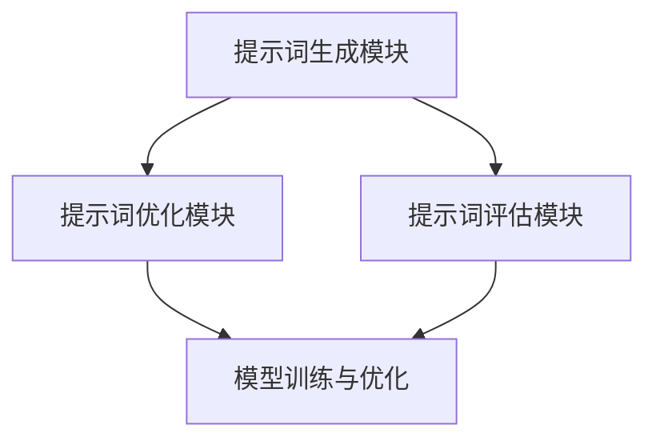

                 


### 文章标题
提示词工程：AI时代的新机遇与新挑战

### 关键词
提示词工程，人工智能，自然语言处理，计算机视觉，数据分析，数学模型，伪代码

### 摘要
本文将深入探讨提示词工程在AI时代的重要性，从基础概念、架构组件、应用场景到挑战与未来趋势进行全面解析。通过分析提示词工程的核心算法、数学模型及实际案例，本文旨在为读者提供对这一领域深入理解的机会。

## 第一部分：提示词工程概述

### 第1章：提示词工程的基础

#### 1.1 提示词工程的定义与背景

**1.1.1 提示词的概念与重要性**

提示词（Prompt）是引导人工智能模型进行推理和生成内容的引导性语句或指令。在AI应用中，提示词的质量直接影响模型的性能和输出结果。高质量的提示词可以引导模型产生更准确、更符合预期的结果。

**定义**：提示词是指那些用于启动或引导AI模型进行推理和生成内容的文字或指令。例如，在自然语言处理（NLP）中，一个提示词可能是一个短语或问题，用于引导模型生成相关的回答或文本。

**重要性**：提示词在AI系统中扮演着至关重要的角色。一个设计良好的提示词可以使AI模型更高效地理解用户意图，并生成更加准确和有用的输出。

**1.1.2 提示词工程的发展历程**

- **早期**：基于规则和模板的系统。在这个阶段，提示词通常由人类专家手动编写，以匹配特定的任务需求。
- **中期**：引入自然语言处理技术，逐步实现自动化。在这一阶段，机器学习算法开始用于自动生成提示词，虽然质量有限，但为后续的发展奠定了基础。
- **现代**：深度学习和生成对抗网络（GAN）等技术的加入，使得提示词工程的能力得到了显著提升。现代提示词工程不仅能够自动生成高质量的提示词，还能根据反馈进行持续优化。

**1.1.3 提示词工程在AI时代的新机遇**

- **AI时代的特征**：随着大数据、云计算和深度学习等技术的快速发展，AI时代已经到来。在这个时代，数据量呈指数级增长，计算资源变得前所未有的丰富，而先进的算法使得AI模型的能力得到了大幅提升。
- **新机遇**：在AI时代，提示词工程迎来了前所未有的机遇。大量数据和强大计算能力的结合，使得提示词工程可以更加高效地处理复杂任务。同时，新的算法和模型不断涌现，为提示词工程提供了更多的可能性和创新空间。

#### 1.2 提示词工程的架构与核心组件

**1.2.1 提示词生成模块**

- **功能**：生成高质量的提示词。
- **方法**：基于规则、机器学习、深度学习等。

提示词生成模块是提示词工程的核心，它的任务是根据输入的数据或上下文生成高质量的提示词。生成方法包括基于规则的方法、机器学习方法以及深度学习方法。

**1.2.2 提示词优化模块**

- **功能**：优化提示词，提高模型性能。
- **方法**：基于反馈循环、交叉验证等。

提示词优化模块的作用是对生成的提示词进行优化，以提高模型的性能。优化方法通常包括反馈循环和交叉验证等。

**1.2.3 提示词评估模块**

- **功能**：评估提示词的质量和效果。
- **方法**：基于指标、用户反馈等。

提示词评估模块负责对生成的提示词进行评估，以确保其质量和效果。评估方法通常基于各种指标，如BLEU分数、F1分数等，以及用户的实际反馈。

**1.2.4 模型训练与优化模块**

- **功能**：训练和优化AI模型。
- **方法**：基于大量数据、优化算法等。

模型训练与优化模块是整个提示词工程的基础，它负责使用大量数据对AI模型进行训练和优化。优化算法的选择和调整对于模型的性能至关重要。

#### 1.3 提示词工程的应用场景

**1.3.1 自然语言处理**

- **场景**：文本生成、问答系统、机器翻译等。
- **应用**：生成高质量文本、实现智能对话等。

自然语言处理（NLP）是提示词工程的重要应用领域。通过生成高质量的提示词，AI模型可以更好地理解和生成自然语言文本，实现文本生成、问答系统、机器翻译等功能。

**1.3.2 计算机视觉**

- **场景**：图像分类、目标检测、图像生成等。
- **应用**：辅助标注、自动生成图像描述等。

计算机视觉领域同样受益于提示词工程。通过生成高质量的提示词，AI模型可以更准确地分类图像、检测目标，甚至生成图像描述。

**1.3.3 数据分析**

- **场景**：数据探索、可视化、预测分析等。
- **应用**：自动化报告生成、实时监控等。

在数据分析领域，提示词工程可以帮助生成高质量的提示词，从而提高数据分析的效率和准确性。例如，自动生成报告、实时监控数据变化等。

#### 1.4 提示词工程的挑战与未来趋势

**1.4.1 挑战**

- **多样性**：生成多样化、高质量的提示词。
- **可解释性**：提高模型的可解释性，方便人类理解。
- **隐私与安全**：保护用户隐私，防止滥用。

随着提示词工程在AI领域的广泛应用，也带来了一系列挑战。如何生成多样化、高质量的提示词，如何提高模型的可解释性，以及如何保护用户隐私，都是当前研究的热点和挑战。

**1.4.2 未来趋势**

- **自动化与智能化**：进一步提升提示词生成和优化的效率。
- **跨领域融合**：与其他领域技术相结合，实现更广泛的应用。
- **人机协作**：发挥人类与AI的协同作用，实现更高效的工作方式。

未来，提示词工程将继续发展，自动化和智能化水平将进一步提高。同时，跨领域融合和人机协作将成为新的趋势，为人类带来更多便利和效益。

#### 1.5 提示词工程的核心概念与联系

为了更好地理解提示词工程的核心概念及其相互关系，我们可以使用Mermaid流程图进行展示。



该流程图展示了提示词生成模块、提示词优化模块和提示词评估模块之间的相互关系，以及它们与模型训练与优化模块之间的联系。

#### 1.6 提示词工程的关键算法原理

**1.6.1 提示词生成算法**

以下是一个简单的提示词生成算法的伪代码示例：

```python
def generate_prompt(data):
    # 基于数据生成提示词
    prompt = ""
    for sentence in data:
        prompt += sentence + ". "
    return prompt
```

该算法通过遍历输入的数据集，将每个句子连接成一个完整的提示词。

**1.6.2 提示词优化算法**

提示词优化算法通常基于反馈循环，以下是一个简单的伪代码示例：

```python
def optimize_prompt(prompt, model):
    # 基于模型优化提示词
    optimized_prompt = model.generate(prompt)
    return optimized_prompt
```

该算法使用模型生成优化后的提示词，从而提高模型的性能。

**1.6.3 提示词评估算法**

提示词评估算法通常基于各种指标，以下是一个简单的评估算法的伪代码示例：

```python
def evaluate_prompt(prompt, model, reference):
    # 基于模型和参考文本评估提示词
    generated_text = model.generate(prompt)
    bleu_score = calculate_bleu(generated_text, reference)
    return bleu_score
```

该算法使用BLEU分数等指标来评估提示词的质量。

#### 1.7 提示词工程的数学模型与数学公式

**1.7.1 提示词评估的BLEU分数**

BLEU（双语评估指标）是评估自然语言生成文本质量的一种常用指标，其计算公式如下：

$$
\text{BLEU} = \frac{2}{|G| + |R|} \sum_{i=1}^{n} \frac{|G \cap R_i|}{|G| + |R_i|}
$$

其中，$G$表示生成的文本，$R$表示参考文本，$n$表示比较的句子数，$R_i$表示参考文本中的第$i$个句子。

**1.7.2 提示词优化的损失函数**

在深度学习中，提示词优化的损失函数通常采用交叉熵损失函数，其计算公式如下：

$$
\text{Loss} = -\sum_{i=1}^{n} \sum_{j=1}^{m} y_{ij} \log(p_{ij})
$$

其中，$y_{ij}$表示第$i$个句子中第$j$个词的目标概率，$p_{ij}$表示模型预测的第$i$个句子中第$j$个词的概率。

#### 1.8 提示词工程的案例分析

**1.8.1 案例背景**

假设我们有一个新闻摘要生成任务，输入是一篇新闻文章，输出是这篇文章的摘要。我们可以使用深度学习模型来生成新闻摘要。

**1.8.2 案例实现**

以下是一个简单的新闻摘要生成任务的代码实现：

```python
# 导入相关库
import tensorflow as tf
from tensorflow.keras.preprocessing.sequence import pad_sequences

# 加载数据集
data = load_data()

# 数据预处理
X = preprocess_data(data)

# 构建模型
model = build_model()

# 训练模型
model.fit(X, epochs=10)

# 生成新闻摘要
prompt = generate_prompt(data)
summary = model.generate_summary(prompt)
```

在这个案例中，我们首先加载新闻文章数据集，然后对数据进行预处理，包括分词、编码等步骤。接着，我们构建一个深度学习模型，并使用预处理后的数据对模型进行训练。最后，我们使用训练好的模型生成新闻摘要。

**1.8.3 案例分析**

通过这个案例，我们可以看到提示词工程在新闻摘要生成任务中的应用。首先，我们需要生成一个高质量的提示词，即新闻文章的内容。然后，使用这个提示词来训练深度学习模型，使其能够生成摘要。在这个过程中，提示词的质量直接影响摘要的质量。因此，优化提示词的生成过程是提高模型性能的关键。

## 总结与拓展

提示词工程是AI领域中一个重要且富有挑战性的分支。通过本文的探讨，我们深入了解了提示词工程的基础概念、架构组件、应用场景以及面临的挑战和未来趋势。同时，通过实际案例的分析，我们展示了如何使用提示词工程来提高AI模型的性能。

**最佳实践 tips**：

1. **质量优先**：在生成提示词时，应优先考虑质量，确保生成的提示词能够准确引导模型生成高质量的结果。
2. **反馈循环**：定期收集用户反馈，根据反馈调整提示词的生成和优化策略。
3. **安全与隐私**：在处理用户数据时，确保数据的安全性和隐私性，避免数据泄露和滥用。

**注意事项**：

1. **模型适应性**：不同的模型对提示词的需求可能不同，因此在设计提示词时应考虑模型的特性。
2. **多样性**：生成多样化的提示词有助于提高模型的泛化能力。

**拓展阅读**：

1. **《深度学习》**：Goodfellow et al.，提供了关于深度学习的全面介绍，包括模型训练和优化方法。
2. **《自然语言处理综合教程》**：Jurafsky and Martin，详细介绍了自然语言处理的基础知识和应用。

作者：AI天才研究院/AI Genius Institute & 禅与计算机程序设计艺术 /Zen And The Art of Computer Programming

