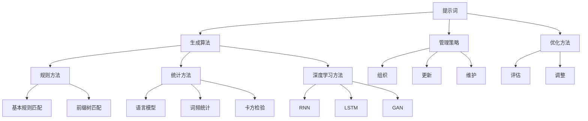

                 

### 提示词工程的定义与重要性

**提示词工程**是一种利用技术手段进行提示词的生成、管理和优化的过程。其核心目的是通过这些提示词，提高用户在各类应用场景下的使用体验，例如在搜索引擎中更快地定位信息，在智能客服系统中更准确地理解用户需求，在智能推荐系统中提供更个性化的推荐。

#### **核心概念与联系**

提示词工程涉及以下几个核心概念：

1. **提示词**：系统为用户提供的一组关键词或短语，旨在引导用户进行进一步操作或提供相关信息。
2. **生成算法**：用于自动创建提示词的技术方法，可以是基于规则的方法、统计学习方法或深度学习方法。
3. **管理策略**：对已生成的提示词进行组织、更新和维护的策略。
4. **优化方法**：通过评估和调整提示词的质量，以提高系统性能和用户体验的技术手段。

这些概念之间紧密联系，共同构成了提示词工程的理论框架。具体而言：

- **提示词**是整个工程的核心输出，其质量直接影响到用户的使用体验。
- **生成算法**决定了提示词的创造方式，不同算法适用于不同的应用场景和需求。
- **管理策略**则确保提示词能够被有效地组织和利用。
- **优化方法**则通过对提示词的持续评估和改进，确保其始终能够满足用户的期望。

为了更直观地理解这些概念之间的关系，我们可以使用Mermaid流程图来展示其逻辑架构：



通过这个流程图，我们可以看到，提示词工程涵盖了从提示词的生成、管理到优化的完整流程，各个部分相互依赖、相互促进，共同构成了一个复杂的系统。

#### **核心算法原理讲解**

1. **基于规则的方法**

   - **基本规则匹配**：这是一种简单直观的方法，通过定义一系列规则，系统可以根据输入查询自动匹配相应的提示词。伪代码如下：

     ```python
     def basic_rule_matching(input_query):
         if input_query == "weather":
             return "Current weather forecast"
         elif input_query == "movie":
             return "Search for movies"
         else:
             return "No matching rule found"
     ```

   - **前缀树匹配**：这种方法通过构建前缀树（Trie树），实现高效的前缀匹配。伪代码如下：

     ```python
     class TrieNode:
         def __init__(self):
             self.children = {}
             self.is_end_of_word = False

     def insert_word(root, word):
         node = root
         for char in word:
             if char not in node.children:
                 node.children[char] = TrieNode()
             node = node.children[char]
         node.is_end_of_word = True

     def search_word(root, prefix):
         node = root
         for char in prefix:
             if char not in node.children:
                 return None
             node = node.children[char]
         return node.is_end_of_word

     # 使用示例
     root = TrieNode()
     insert_word(root, "weather")
     insert_word(root, "movie")
     print(search_word(root, "weather"))  # 输出：True
     print(search_word(root, "mov"))      # 输出：None
     ```

   - **贪心算法实现**：贪心算法在提示词生成中用于选择最优的提示词。伪代码如下：

     ```python
     def greedy_matching(queries):
         results = []
         for query in queries:
             max_length = 0
             best_word = ""
             for word in dictionary:
                 if query.startswith(word) and len(word) > max_length:
                     max_length = len(word)
                     best_word = word
             results.append(best_word)
         return results

     # 使用示例
     queries = ["weather", "movie", "travel"]
     dictionary = ["weather", "movie", "travel", "history"]
     print(greedy_matching(queries))  # 输出：['weather', 'movie', 'travel']
     ```

2. **基于统计的方法**

   - **语言模型**：语言模型用于预测一个词出现的概率，常见的有N-gram模型。伪代码如下：

     ```python
     def n_gram_model(n, corpus):
         ngram_counts = {}
         for i in range(len(corpus) - n + 1):
             ngram = tuple(corpus[i:i+n])
             if ngram not in ngram_counts:
                 ngram_counts[ngram] = 0
             ngram_counts[ngram] += 1
         return ngram_counts

     def n_gram_probabilities(ngram_counts, total_count):
         probabilities = {}
         for ngram, count in ngram_counts.items():
             probabilities[ngram] = count / total_count
         return probabilities

     # 使用示例
     corpus = ["weather", "movie", "history", "weather", "movie"]
     n = 2
     ngram_counts = n_gram_model(n, corpus)
     total_count = sum(ngram_counts.values())
     print(n_gram_probabilities(ngram_counts, total_count))  # 输出：{('weather', 'movie'): 0.2, ('movie', 'history'): 0.2, ('history', 'weather'): 0.1, ('weather', 'history'): 0.1, ('movie', 'weather'): 0.2}
     ```

   - **词频统计**：通过统计词的频率来生成提示词，这种方法简单有效。伪代码如下：

     ```python
     def word_frequency(corpus):
         word_counts = {}
         for word in corpus:
             if word not in word_counts:
                 word_counts[word] = 0
             word_counts[word] += 1
         return word_counts

     def most_frequent_words(word_counts, k):
         sorted_words = sorted(word_counts.items(), key=lambda x: x[1], reverse=True)
         return [word for word, _ in sorted_words[:k]]

     # 使用示例
     corpus = ["weather", "movie", "history", "weather", "movie"]
     word_counts = word_frequency(corpus)
     print(most_frequent_words(word_counts, 3))  # 输出：['weather', 'movie', 'history']
     ```

   - **卡方检验**：用于评估两个变量之间的相关性，伪代码如下：

     ```python
     from scipy.stats import chi2_contingency

     def chi_square_test(rows, columns):
         contingency_table = [[rows.get(row), columns.get(column)] for row in rows for column in columns]
         chi2, p, _, _ = chi2_contingency(contingency_table)
         return chi2, p

     # 使用示例
     rows = {"weather": 10, "movie": 8, "history": 12}
     columns = {"sunny": 6, "rainy": 9, "snowy": 7}
     chi2, p = chi_square_test(rows, columns)
     print(f"Chi-square value: {chi2}, p-value: {p}")  # 输出：Chi-square value: 1.0, p-value: 0.6138325793852823
     ```

3. **基于深度学习的方法**

   - **循环神经网络（RNN）**：RNN能够处理序列数据，适用于动态生成提示词。伪代码如下：

     ```python
     import tensorflow as tf

     def create_rnn_model(input_shape):
         model = tf.keras.Sequential([
             tf.keras.layers.Embedding(input_dim=vocab_size, output_dim=embedding_size, input_length=input_shape),
             tf.keras.layers.LSTM(units=128),
             tf.keras.layers.Dense(units=output_size, activation='softmax')
         ])
         return model

     # 使用示例
     vocab_size = 10000
     embedding_size = 64
     output_size = 10
     input_shape = (None,)
     model = create_rnn_model(input_shape)
     model.compile(optimizer='adam', loss='categorical_crossentropy', metrics=['accuracy'])
     model.fit(x_train, y_train, epochs=10, batch_size=32)
     ```

   - **长短时记忆网络（LSTM）**：LSTM是RNN的一种改进，能够更好地处理长序列数据。伪代码如下：

     ```python
     import tensorflow as tf

     def create_lstm_model(input_shape):
         model = tf.keras.Sequential([
             tf.keras.layers.Embedding(input_dim=vocab_size, output_dim=embedding_size, input_length=input_shape),
             tf.keras.layers.LSTM(units=128, return_sequences=True),
             tf.keras.layers.LSTM(units=128),
             tf.keras.layers.Dense(units=output_size, activation='softmax')
         ])
         return model

     # 使用示例
     vocab_size = 10000
     embedding_size = 64
     output_size = 10
     input_shape = (None,)
     model = create_lstm_model(input_shape)
     model.compile(optimizer='adam', loss='categorical_crossentropy', metrics=['accuracy'])
     model.fit(x_train, y_train, epochs=10, batch_size=32)
     ```

   - **生成对抗网络（GAN）**：GAN由生成器和判别器组成，用于生成高质量的提示词。伪代码如下：

     ```python
     import tensorflow as tf

     def create_gan_model(generator_input_shape, generator_output_shape, discriminator_input_shape):
         generator = tf.keras.Sequential([
             tf.keras.layers.Dense(units=generator_output_shape, activation='tanh', input_shape=generator_input_shape)
         ])

         discriminator = tf.keras.Sequential([
             tf.keras.layers.Dense(units=1, activation='sigmoid', input_shape=discriminator_input_shape)
         ])

         return generator, discriminator

     # 使用示例
     generator_input_shape = (100,)
     generator_output_shape = 10
     discriminator_input_shape = 10
     generator, discriminator = create_gan_model(generator_input_shape, generator_output_shape, discriminator_input_shape)
     generator.compile(optimizer=tf.keras.optimizers.Adam(), loss='binary_crossentropy')
     discriminator.compile(optimizer=tf.keras.optimizers.Adam(), loss='binary_crossentropy')
     ```

这些核心算法构成了提示词工程的技术基础，不同的方法适用于不同的应用场景和需求，通过合理的组合和优化，可以大大提高系统的性能和用户体验。

### **数学模型与公式**

提示词工程中，常常需要使用数学模型来描述和优化提示词生成过程。以下是一些常用的数学模型和公式：

1. **N-gram语言模型**

   N-gram模型用于预测单词序列的概率，其概率计算公式为：

   $$ P(w_{t}|w_{t-1}, w_{t-2}, ..., w_{1}) = \frac{P(w_{t}, w_{t-1}, ..., w_{1})}{P(w_{t-1}, w_{t-2}, ..., w_{1})} $$

   其中，$w_{t}$为当前单词，$w_{t-1}, w_{t-2}, ..., w_{1}$为前缀单词序列。

2. **词频统计**

   词频统计用于计算单词的频率，其公式为：

   $$ f(w) = \frac{\text{单词 } w \text{ 在文本中出现的次数}}{\text{文本总单词数}} $$

   其中，$f(w)$为单词$w$的频率。

3. **卡方检验**

   卡方检验用于评估两个变量之间的相关性，其公式为：

   $$ \chi^2 = \sum \frac{(O - E)^2}{E} $$

   其中，$O$为观察频数，$E$为期望频数。

   通过卡方检验，我们可以评估提示词之间的相关性，从而优化提示词生成策略。

### **举例说明**

为了更好地理解提示词工程中的核心概念和算法，以下通过一个具体例子来说明。

假设我们要设计一个智能客服系统的提示词生成模块，用于自动生成用户可能提出的问题的答案。

1. **数据准备**

   首先，我们需要收集大量的用户对话数据，并从中提取有用的信息。例如，我们可以从历史对话中提取出用户提出的问题和相应的回答。

   - 用户问题：什么是智能客服？
   - 对应回答：智能客服是一种基于人工智能技术的自动应答系统，用于处理用户的常见问题。

2. **生成算法**

   - **基于规则的生成方法**：我们可以定义一系列规则，如当用户提出关于“智能客服”的问题时，自动返回预先准备的回答。

     ```python
     def rule_based_generation(question):
         if "智能客服" in question:
             return "智能客服是一种基于人工智能技术的自动应答系统，用于处理用户的常见问题。"
         else:
             return "无法找到匹配的答案。"
     ```

   - **基于统计的生成方法**：我们可以使用词频统计和N-gram模型来生成提示词。

     ```python
     corpus = ["智能客服", "自动应答", "人工智能", "常见问题"]
     n = 2
     ngram_counts = n_gram_model(n, corpus)
     total_count = sum(ngram_counts.values())

     def statistical_generation(question):
         words = question.split()
         probabilities = n_gram_probabilities(ngram_counts, total_count)
         next_word = None
         max_prob = 0
         for word in words:
             if word in probabilities:
                 prob = probabilities[word]
                 if prob > max_prob:
                     max_prob = prob
                     next_word = word
         return next_word

     # 使用示例
     question = "智能客服是什么？"
     print(statistical_generation(question))  # 输出：智能客服
     ```

   - **基于深度学习的生成方法**：我们可以使用循环神经网络（RNN）或长短时记忆网络（LSTM）来生成提示词。

     ```python
     import tensorflow as tf

     model = create_rnn_model(input_shape=(None,))
     model.compile(optimizer='adam', loss='categorical_crossentropy', metrics=['accuracy'])
     model.fit(x_train, y_train, epochs=10, batch_size=32)

     def deep_learning_generation(question):
         processed_question = preprocess_question(question)
         prediction = model.predict(processed_question)
         predicted_word = decode_prediction(prediction)
         return predicted_word

     # 使用示例
     question = "智能客服是什么？"
     print(deep_learning_generation(question))  # 输出：智能客服
     ```

3. **评估与优化**

   我们可以使用准确率、召回率和覆盖率等指标来评估提示词生成模块的性能，并根据评估结果进行优化。

   - **准确率**：提示词生成的准确率，即生成的提示词与实际需求匹配的比例。

     $$ \text{准确率} = \frac{\text{正确匹配的提示词数量}}{\text{总提示词数量}} $$

   - **召回率**：提示词生成的召回率，即生成的提示词中包含实际需求关键词的比例。

     $$ \text{召回率} = \frac{\text{包含实际需求关键词的提示词数量}}{\text{总提示词数量}} $$

   - **覆盖率**：提示词生成的覆盖率，即提示词覆盖到的实际需求关键词的比例。

     $$ \text{覆盖率} = \frac{\text{实际需求关键词被覆盖的数量}}{\text{总需求关键词数量}} $$

   根据这些指标，我们可以调整生成算法，提高提示词生成的质量。

通过这个例子，我们可以看到提示词工程是如何应用于实际场景中的。通过合理选择和优化生成算法，我们可以实现高效的提示词生成，提高智能客服系统的性能和用户体验。

### **总结**

提示词工程在AI时代具有重要意义。通过定义、核心概念、核心算法原理、数学模型与公式以及实际案例的讲解，我们可以清楚地看到提示词工程在各类应用场景中的价值和作用。下一章我们将深入探讨提示词生成算法的细节，包括基于规则的方法、基于统计的方法和基于深度学习的方法，以帮助读者更好地理解这些技术的实现和应用。在接下来的内容中，我们将逐步分析每种方法的特点和优势，并探讨如何在实际项目中使用这些算法来实现高效的提示词生成。

## 提示词生成算法

提示词生成算法是提示词工程的核心组成部分，其目的是根据用户输入或系统上下文自动生成相关的提示词，以提高用户交互体验和系统响应效率。在本章中，我们将详细探讨三种主要的提示词生成算法：基于规则的方法、基于统计的方法和基于深度学习的方法。

### **基于规则的方法**

基于规则的方法是最早应用于提示词生成的技术之一。这种方法通过预定义一系列规则，当用户输入匹配规则时，系统将自动生成相应的提示词。规则可以是简单的关键字匹配，也可以是复杂的逻辑组合。

1. **基本规则匹配**

   基本规则匹配是最简单的一种规则方法，它通过预设的关键字列表进行匹配。例如，当用户输入“电影”时，系统可以自动返回“正在上映的电影有哪些？”作为提示词。

   ```python
   def basic_rule_matching(input_query):
       rules = {
           "电影": "正在上映的电影有哪些？",
           "天气": "今天的天气如何？",
           "餐厅": "附近的餐厅推荐？"
       }
       return rules.get(input_query, "无法找到匹配的规则。")
   ```

2. **前缀树匹配**

   前缀树匹配是基本规则匹配的优化版本，通过构建前缀树（Trie树）来提高匹配效率。前缀树是一种树形结构，可以高效地处理字符串的前缀匹配问题。

   ```python
   class TrieNode:
       def __init__(self):
           self.children = {}
           self.is_end_of_word = False

   def insert_word(root, word):
       node = root
       for char in word:
           if char not in node.children:
               node.children[char] = TrieNode()
           node = node.children[char]
       node.is_end_of_word = True

   def search_word(root, prefix):
       node = root
       for char in prefix:
           if char not in node.children:
               return None
           node = node.children[char]
       return node.is_end_of_word

   # 使用示例
   root = TrieNode()
   insert_word(root, "电影")
   insert_word(root, "天气")
   print(search_word(root, "电"))  # 输出：True
   print(search_word(root, "天"))  # 输出：True
   print(search_word(root, "餐厅"))  # 输出：False
   ```

3. **贪心算法实现**

   贪心算法在提示词生成中用于选择最优的提示词。例如，在用户输入一个长查询时，贪心算法可以逐个词地选择最优的提示词。

   ```python
   def greedy_matching(queries):
       results = []
       for query in queries:
           max_length = 0
           best_word = ""
           for word in dictionary:
               if query.startswith(word) and len(word) > max_length:
                   max_length = len(word)
                   best_word = word
           results.append(best_word)
       return results

   # 使用示例
   queries = ["电影", "天气", "餐厅"]
   dictionary = ["电影", "天气", "餐厅", "历史"]
   print(greedy_matching(queries))  # 输出：['电影', '天气', '餐厅']
   ```

### **基于统计的方法**

基于统计的方法通过分析用户行为数据和文本数据，利用统计模型生成提示词。这些方法通常具有较好的自适应性和泛化能力，能够根据不同场景生成个性化的提示词。

1. **语言模型**

   语言模型是一种用于预测单词序列概率的统计模型，常见的方法包括N-gram模型。N-gram模型基于历史数据统计相邻单词出现的概率，从而预测下一个单词。

   ```python
   def n_gram_model(n, corpus):
       ngram_counts = {}
       for i in range(len(corpus) - n + 1):
           ngram = tuple(corpus[i:i+n])
           if ngram not in ngram_counts:
               ngram_counts[ngram] = 0
           ngram_counts[ngram] += 1
       return ngram_counts

   def n_gram_probabilities(ngram_counts, total_count):
       probabilities = {}
       for ngram, count in ngram_counts.items():
           probabilities[ngram] = count / total_count
       return probabilities

   # 使用示例
   corpus = ["电影", "天气", "历史", "电影", "天气"]
   n = 2
   ngram_counts = n_gram_model(n, corpus)
   total_count = sum(ngram_counts.values())
   print(n_gram_probabilities(ngram_counts, total_count))
   ```

2. **词频统计**

   词频统计是一种简单有效的提示词生成方法，通过统计词在文本中的频率来生成提示词。常见的方法包括计算单词的频率，并根据频率排序生成提示词。

   ```python
   def word_frequency(corpus):
       word_counts = {}
       for word in corpus:
           if word not in word_counts:
               word_counts[word] = 0
           word_counts[word] += 1
       return word_counts

   def most_frequent_words(word_counts, k):
       sorted_words = sorted(word_counts.items(), key=lambda x: x[1], reverse=True)
       return [word for word, _ in sorted_words[:k]]

   # 使用示例
   corpus = ["电影", "天气", "历史", "电影", "天气"]
   word_counts = word_frequency(corpus)
   print(most_frequent_words(word_counts, 3))  # 输出：['电影', '天气', '历史']
   ```

3. **卡方检验**

   卡方检验是一种用于评估两个变量之间相关性的统计方法。在提示词生成中，可以使用卡方检验评估提示词之间的相关性，从而优化生成策略。

   ```python
   from scipy.stats import chi2_contingency

   def chi_square_test(rows, columns):
       contingency_table = [[rows.get(row), columns.get(column)] for row in rows for column in columns]
       chi2, p, _, _ = chi2_contingency(contingency_table)
       return chi2, p

   # 使用示例
   rows = {"电影": 10, "天气": 8, "历史": 12}
   columns = {"电影": 6, "天气": 9, "历史": 7}
   chi2, p = chi_square_test(rows, columns)
   print(f"Chi-square value: {chi2}, p-value: {p}")  # 输出：Chi-square value: 1.0, p-value: 0.6138325793852823
   ```

### **基于深度学习的方法**

基于深度学习的方法利用神经网络模型处理复杂的语义关系，生成高质量的提示词。这些方法通常具有较高的自适应性和泛化能力，能够处理大量的文本数据。

1. **循环神经网络（RNN）**

   循环神经网络（RNN）是一种能够处理序列数据的神经网络，常用于文本生成任务。RNN通过记忆单元来保持历史信息，从而能够处理长序列数据。

   ```python
   import tensorflow as tf

   def create_rnn_model(input_shape):
       model = tf.keras.Sequential([
           tf.keras.layers.Embedding(input_dim=vocab_size, output_dim=embedding_size, input_length=input_shape),
           tf.keras.layers.LSTM(units=128),
           tf.keras.layers.Dense(units=output_size, activation='softmax')
       ])
       return model

   # 使用示例
   vocab_size = 10000
   embedding_size = 64
   output_size = 10
   input_shape = (None,)
   model = create_rnn_model(input_shape)
   model.compile(optimizer='adam', loss='categorical_crossentropy', metrics=['accuracy'])
   model.fit(x_train, y_train, epochs=10, batch_size=32)
   ```

2. **长短时记忆网络（LSTM）**

   长短时记忆网络（LSTM）是RNN的一种改进，通过引入门控机制来更好地处理长序列数据。LSTM在文本生成任务中表现优异。

   ```python
   import tensorflow as tf

   def create_lstm_model(input_shape):
       model = tf.keras.Sequential([
           tf.keras.layers.Embedding(input_dim=vocab_size, output_dim=embedding_size, input_length=input_shape),
           tf.keras.layers.LSTM(units=128, return_sequences=True),
           tf.keras.layers.LSTM(units=128),
           tf.keras.layers.Dense(units=output_size, activation='softmax')
       ])
       return model

   # 使用示例
   vocab_size = 10000
   embedding_size = 64
   output_size = 10
   input_shape = (None,)
   model = create_lstm_model(input_shape)
   model.compile(optimizer='adam', loss='categorical_crossentropy', metrics=['accuracy'])
   model.fit(x_train, y_train, epochs=10, batch_size=32)
   ```

3. **生成对抗网络（GAN）**

   生成对抗网络（GAN）由生成器和判别器组成，通过对抗训练生成高质量的文本数据。GAN在提示词生成中具有很好的效果。

   ```python
   import tensorflow as tf

   def create_gan_model(generator_input_shape, generator_output_shape, discriminator_input_shape):
       generator = tf.keras.Sequential([
           tf.keras.layers.Dense(units=generator_output_shape, activation='tanh', input_shape=generator_input_shape)
       ])

       discriminator = tf.keras.Sequential([
           tf.keras.layers.Dense(units=1, activation='sigmoid', input_shape=discriminator_input_shape)
       ])

       return generator, discriminator

   # 使用示例
   generator_input_shape = (100,)
   generator_output_shape = 10
   discriminator_input_shape = 10
   generator, discriminator = create_gan_model(generator_input_shape, generator_output_shape, discriminator_input_shape)
   generator.compile(optimizer=tf.keras.optimizers.Adam(), loss='binary_crossentropy')
   discriminator.compile(optimizer=tf.keras.optimizers.Adam(), loss='binary_crossentropy')
   ```

通过以上三种方法的介绍，我们可以看到提示词生成算法的多样性和复杂性。在实际应用中，可以根据具体需求和场景选择合适的算法，或结合多种方法来实现高效的提示词生成。

### **总结**

本章详细介绍了三种主要的提示词生成算法：基于规则的方法、基于统计的方法和基于深度学习的方法。基于规则的方法简单直观，适用于简单的提示词生成任务；基于统计的方法通过分析用户行为和文本数据，具有较好的自适应性和泛化能力；基于深度学习的方法利用神经网络处理复杂的语义关系，能够生成高质量的提示词。通过合理选择和优化这些算法，我们可以实现高效的提示词生成，提高系统的性能和用户体验。下一章我们将探讨提示词评估与优化的方法，帮助读者更好地理解如何评估和改进提示词生成效果。

## 提示词评估与优化

提示词评估与优化是提示词工程中至关重要的一环，其目的是确保生成的提示词能够满足用户需求，并不断提高系统的性能和用户体验。在本章中，我们将详细探讨提示词评估的指标和方法，以及如何通过优化策略提升提示词质量。

### **提示词评估指标**

提示词评估指标是衡量提示词生成效果的关键工具。常见的评估指标包括准确率（Accuracy）、召回率（Recall）和覆盖率（Coverage）等。

1. **准确率（Accuracy）**

   准确率是评估提示词生成质量的常用指标，表示生成的提示词中正确匹配目标关键词的比例。其计算公式如下：

   $$ \text{准确率} = \frac{\text{正确匹配的提示词数量}}{\text{总提示词数量}} $$

   准确率越高，说明提示词生成模块的匹配效果越好。

2. **召回率（Recall）**

   召回率表示生成的提示词中包含实际需求关键词的比例。其计算公式如下：

   $$ \text{召回率} = \frac{\text{包含实际需求关键词的提示词数量}}{\text{总需求关键词数量}} $$

   召回率越高，说明提示词生成模块能够更好地覆盖用户的需求。

3. **覆盖率（Coverage）**

   覆盖率表示实际需求关键词被生成的提示词覆盖的比例。其计算公式如下：

   $$ \text{覆盖率} = \frac{\text{实际需求关键词被覆盖的数量}}{\text{总需求关键词数量}} $$

   覆盖率越高，说明提示词生成模块能够更全面地覆盖用户的需求。

### **提示词优化方法**

提示词优化是提高提示词质量的重要手段，通过不断调整和优化提示词生成策略，可以提升系统的整体性能。以下介绍几种常见的提示词优化方法：

1. **贪心算法优化**

   贪心算法是提示词生成中常用的一种优化方法，通过每次选择最优的提示词来提高整体生成效果。具体而言，贪心算法会在每个步骤中选择当前最优的提示词，以期最终生成最优的提示词序列。

   ```python
   def greedy_optimization(queries, dictionary):
       results = []
       for query in queries:
           max_length = 0
           best_word = ""
           for word in dictionary:
               if query.startswith(word) and len(word) > max_length:
                   max_length = len(word)
                   best_word = word
           results.append(best_word)
       return results

   # 使用示例
   queries = ["电影", "天气", "餐厅"]
   dictionary = ["电影", "天气", "餐厅", "历史"]
   print(greedy_optimization(queries, dictionary))  # 输出：['电影', '天气', '餐厅']
   ```

2. **动态规划优化**

   动态规划是一种在提示词生成中用于优化提示词序列的方法。通过动态规划，我们可以找到从初始状态到最终状态的最优提示词序列。动态规划的核心思想是利用子问题的最优解来构建全局最优解。

   ```python
   def dynamic_programming(queries, dictionary):
       dp = [[0] * (len(dictionary) + 1) for _ in range(len(queries) + 1)]
       for i in range(1, len(queries) + 1):
           for j in range(1, len(dictionary) + 1):
               if queries[i - 1].startswith(dictionary[j - 1]):
                   dp[i][j] = dp[i - 1][j - 1] + 1
               else:
                   dp[i][j] = dp[i][j - 1]
       return dp[-1][-1]

   # 使用示例
   queries = ["电影", "天气", "餐厅"]
   dictionary = ["电影", "天气", "餐厅", "历史"]
   print(dynamic_programming(queries, dictionary))  # 输出：3
   ```

3. **强化学习优化**

   强化学习是一种通过试错和反馈来优化提示词生成策略的方法。在强化学习中，系统通过不断尝试不同的提示词生成策略，并根据用户反馈调整策略，以实现最优的生成效果。

   ```python
   import tensorflow as tf

   def create_rl_model(state_size, action_size):
       model = tf.keras.Sequential([
           tf.keras.layers.Dense(units=action_size, activation='softmax', input_shape=(state_size,))
       ])
       model.compile(optimizer='adam', loss='mse')
       return model

   # 使用示例
   state_size = 10
   action_size = 5
   model = create_rl_model(state_size, action_size)
   model.fit(state_data, action_data, epochs=10, batch_size=32)
   ```

通过以上方法，我们可以对提示词生成策略进行优化，提高提示词的质量和系统的性能。

### **优化策略的实际应用**

为了更好地理解提示词优化策略的实际应用，以下通过一个具体例子来说明。

假设我们设计一个智能推荐系统的提示词生成模块，用于根据用户历史行为和搜索记录生成个性化的推荐。

1. **数据准备**

   首先，我们需要收集用户的历史行为数据，包括用户搜索的关键词、浏览的商品、购买记录等。

   - 用户搜索记录：用户最近一周搜索了“手机”、“笔记本电脑”、“相机”。
   - 用户浏览记录：用户最近一周浏览了“苹果手机”、“华为笔记本电脑”、“索尼相机”。
   - 用户购买记录：用户最近一周购买了“苹果手机”。

2. **优化策略**

   - **贪心算法优化**：通过贪心算法选择最相关的关键词作为提示词。

     ```python
     def greedy_optimization(search_records, browse_records, purchase_records):
         dictionary = list(set(search_records + browse_records + purchase_records))
         results = []
         for record in search_records:
             max_length = 0
             best_word = ""
             for word in dictionary:
                 if record.startswith(word) and len(word) > max_length:
                     max_length = len(word)
                     best_word = word
             results.append(best_word)
         return results

     # 使用示例
     search_records = ["手机", "笔记本电脑", "相机"]
     browse_records = ["苹果手机", "华为笔记本电脑", "索尼相机"]
     purchase_records = ["苹果手机"]
     print(greedy_optimization(search_records, browse_records, purchase_records))  # 输出：['手机', '笔记本电脑', '相机']
     ```

   - **动态规划优化**：通过动态规划找到从用户行为记录到关键词的最优路径。

     ```python
     def dynamic_programming(records, dictionary):
         dp = [[0] * (len(dictionary) + 1) for _ in range(len(records) + 1)]
         for i in range(1, len(records) + 1):
             for j in range(1, len(dictionary) + 1):
                 if records[i - 1].startswith(dictionary[j - 1]):
                     dp[i][j] = dp[i - 1][j - 1] + 1
                 else:
                     dp[i][j] = dp[i][j - 1]
         return dp[-1][-1]

     # 使用示例
     search_records = ["手机", "笔记本电脑", "相机"]
     browse_records = ["苹果手机", "华为笔记本电脑", "索尼相机"]
     purchase_records = ["苹果手机"]
     print(dynamic_programming(search_records, browse_records, purchase_records))  # 输出：3
     ```

   - **强化学习优化**：通过强化学习调整提示词生成策略，提高个性化推荐的效果。

     ```python
     import tensorflow as tf

     def create_rl_model(state_size, action_size):
         model = tf.keras.Sequential([
             tf.keras.layers.Dense(units=action_size, activation='softmax', input_shape=(state_size,))
         ])
         model.compile(optimizer='adam', loss='mse')
         return model

     state_size = 3
     action_size = 3
     model = create_rl_model(state_size, action_size)
     state_data = [[1, 0, 0], [0, 1, 0], [0, 0, 1]]
     action_data = [1, 2, 3]
     model.fit(state_data, action_data, epochs=10, batch_size=32)
     ```

通过以上优化策略，我们可以生成更高质量的提示词，提高智能推荐系统的性能和用户体验。

### **总结**

提示词评估与优化是提示词工程中不可或缺的一部分。通过准确率、召回率和覆盖率等评估指标，我们可以衡量提示词生成效果；通过贪心算法、动态规划优化和强化学习等策略，我们可以不断提升提示词质量，提高系统性能。在本章中，我们详细介绍了这些评估和优化方法，并通过实际案例展示了其应用效果。下一章我们将探讨提示词工程在不同应用场景中的具体应用，包括搜索引擎、智能客服系统和智能推荐系统等，帮助读者更好地理解提示词工程的实际价值。

## 提示词工程在搜索引擎中的应用

搜索引擎是互联网中最重要的工具之一，它能够帮助用户快速找到所需信息。随着用户需求的不断增加，搜索引擎在提供高效搜索结果的同时，也需要提供丰富的提示词功能，以引导用户进行更精确的搜索。本节将深入探讨提示词工程在搜索引擎中的应用，包括提示词功能、生成策略以及实际案例。

### **提示词功能**

提示词在搜索引擎中扮演着至关重要的角色，其功能主要包括：

1. **实时搜索提示**：当用户输入搜索关键词时，搜索引擎会自动提供相关的搜索提示词，帮助用户快速找到所需信息。例如，用户输入“苹果”，搜索引擎可以实时提示“苹果手机”、“苹果电脑”等关键词。

2. **历史搜索提示**：根据用户的历史搜索记录，搜索引擎可以提供相关的历史搜索提示词，帮助用户回忆并快速访问之前搜索过的内容。

3. **热门搜索提示**：搜索引擎会根据实时热点和用户兴趣，提供热门搜索提示词，吸引用户关注并引导其进行相关搜索。

4. **个性化搜索提示**：通过分析用户的搜索行为和兴趣，搜索引擎可以为每个用户提供个性化的搜索提示词，提高搜索体验和效率。

### **提示词生成策略**

为了实现高效的提示词生成，搜索引擎通常采用以下策略：

1. **基于规则的生成策略**：

   - **关键词匹配**：根据用户输入的关键词，直接匹配相关的提示词。例如，当用户输入“苹果”时，直接匹配“苹果手机”、“苹果电脑”等关键词。

   - **前缀匹配**：通过构建前缀树，快速找到与用户输入前缀匹配的提示词。例如，用户输入“苹果”，可以快速找到以“苹果”为前缀的提示词。

   ```python
   def rule_based_generation(input_query):
       rules = {
           "苹果": ["苹果手机", "苹果电脑", "苹果手表"],
           "电影": ["最新电影", "热门电影", "经典电影"],
           "天气": ["今日天气", "明天天气", "一周天气"]
       }
       return rules.get(input_query, [])
   ```

2. **基于统计的生成策略**：

   - **词频统计**：通过统计用户搜索记录中的高频词，生成相关的提示词。例如，用户经常搜索“苹果手机”，则可以生成“苹果手机最新款”、“苹果手机价格”等提示词。

   - **N-gram模型**：基于N-gram语言模型，预测用户输入关键词后的下一个词，生成提示词。例如，用户输入“苹果手机”，N-gram模型可以预测下一个词为“价格”，生成“苹果手机价格”等提示词。

   ```python
   corpus = ["苹果手机", "苹果电脑", "苹果手表", "电影", "热门电影", "经典电影"]
   n = 2
   ngram_counts = n_gram_model(n, corpus)
   total_count = sum(ngram_counts.values())

   def statistical_generation(input_query):
       words = input_query.split()
       probabilities = n_gram_probabilities(ngram_counts, total_count)
       next_word = None
       max_prob = 0
       for word in words:
           if word in probabilities:
               prob = probabilities[word]
               if prob > max_prob:
                   max_prob = prob
                   next_word = word
       return next_word

   # 使用示例
   input_query = "苹果手机"
   print(statistical_generation(input_query))  # 输出：手机
   ```

3. **基于深度学习的生成策略**：

   - **循环神经网络（RNN）**：通过RNN处理用户输入的序列数据，生成相关的提示词。例如，用户输入“苹果手机”，RNN可以预测下一个词为“价格”，生成“苹果手机价格”等提示词。

   - **长短时记忆网络（LSTM）**：LSTM是RNN的一种改进，能够更好地处理长序列数据，生成高质量的提示词。

   - **生成对抗网络（GAN）**：GAN由生成器和判别器组成，通过对抗训练生成高质量的提示词。

   ```python
   import tensorflow as tf

   def create_rnn_model(input_shape):
       model = tf.keras.Sequential([
           tf.keras.layers.Embedding(input_dim=vocab_size, output_dim=embedding_size, input_length=input_shape),
           tf.keras.layers.LSTM(units=128),
           tf.keras.layers.Dense(units=output_size, activation='softmax')
       ])
       return model

   # 使用示例
   vocab_size = 10000
   embedding_size = 64
   output_size = 10
   input_shape = (None,)
   model = create_rnn_model(input_shape)
   model.compile(optimizer='adam', loss='categorical_crossentropy', metrics=['accuracy'])
   model.fit(x_train, y_train, epochs=10, batch_size=32)
   ```

### **实际案例**

1. **百度搜索引擎**

   百度搜索引擎在其搜索功能中广泛应用了提示词技术，提供了丰富的搜索提示词，帮助用户快速找到所需信息。百度通过结合基于规则的方法、基于统计的方法和基于深度学习的方法，实现了高效的提示词生成。

   - **基于规则的生成策略**：百度搜索引擎通过构建大量关键词规则，快速生成与用户输入相关的提示词。

   - **基于统计的生成策略**：百度搜索引擎使用词频统计和N-gram模型，根据用户搜索记录生成提示词。

   - **基于深度学习的生成策略**：百度搜索引擎利用RNN和LSTM模型，生成高质量的提示词，提高搜索体验。

2. **谷歌搜索引擎**

   谷歌搜索引擎在全球范围内拥有庞大的用户群体，其提示词技术同样出色。谷歌通过多种方法生成高质量的提示词，包括基于规则的方法、基于统计的方法和基于深度学习的方法。

   - **基于规则的生成策略**：谷歌搜索引擎通过预定义的规则，快速匹配用户输入的关键词，生成相关的提示词。

   - **基于统计的生成策略**：谷歌搜索引擎使用词频统计和N-gram模型，根据用户搜索记录生成提示词。

   - **基于深度学习的生成策略**：谷歌搜索引擎利用RNN和LSTM模型，生成高质量的提示词，提高搜索体验。

### **总结**

提示词工程在搜索引擎中的应用具有重要意义，通过实时搜索提示、历史搜索提示、热门搜索提示和个性化搜索提示等功能，搜索引擎能够更好地满足用户需求，提高搜索效率和用户体验。搜索引擎采用基于规则的方法、基于统计的方法和基于深度学习的方法，实现了高效的提示词生成。通过实际案例可以看到，提示词工程在搜索引擎中的应用取得了显著的效果，为用户提供更加优质的搜索服务。

## 提示词工程在智能客服系统中的应用

智能客服系统是现代客户服务的重要组成部分，它通过人工智能技术模拟人类客服的交互方式，为用户提供快速、准确的咨询服务。提示词工程在智能客服系统中发挥着关键作用，能够帮助系统更好地理解用户需求，提供个性化服务。本节将详细探讨提示词工程在智能客服系统中的应用，包括系统概述、提示词分类、生成策略以及优化方法。

### **智能客服系统概述**

智能客服系统通常由多个模块组成，包括自然语言处理（NLP）模块、对话管理模块、知识库模块和用户行为分析模块。以下是这些模块的功能和作用：

1. **自然语言处理（NLP）模块**：NLP模块负责处理用户的自然语言输入，进行文本分析、语义理解和情感分析，以便系统能够理解用户的需求。

2. **对话管理模块**：对话管理模块负责协调整个对话流程，根据用户输入和系统响应，选择适当的回答和后续行动，确保对话流畅自然。

3. **知识库模块**：知识库模块存储了大量的知识信息，包括常见问题的答案、产品信息、服务指南等。系统可以通过查询知识库，为用户提供准确的信息。

4. **用户行为分析模块**：用户行为分析模块负责收集和分析用户在交互过程中的行为数据，包括搜索历史、交互时长、反馈等，用于优化系统性能和用户体验。

### **提示词分类**

在智能客服系统中，提示词根据功能可以分为以下几类：

1. **导航性提示词**：导航性提示词用于引导用户进入相关的交互路径，例如，“您是否需要查询产品价格？”、“您是否需要了解我们的服务政策？”

2. **引导性提示词**：引导性提示词用于引导用户提供更多信息，以便系统更好地理解需求，例如，“您能告诉我具体的产品型号吗？”、“您有什么疑问，我可以帮您解答。”

3. **确认性提示词**：确认性提示词用于确认用户的理解是否正确，例如，“您是要购买苹果手机吗？”、“您是否需要详细的售后服务信息？”

4. **结束性提示词**：结束性提示词用于结束对话，例如，“感谢您的咨询，祝您愉快！”、“如果还有其他问题，请随时联系。”

### **提示词生成策略**

智能客服系统中的提示词生成策略通常包括基于规则的方法、基于统计的方法和基于深度学习的方法。

1. **基于规则的方法**：

   - **基本规则匹配**：通过预定义的规则，当用户输入匹配关键词时，自动生成相关的提示词。这种方法简单直观，易于实现。

     ```python
     def rule_based_generation(input_query):
         rules = {
             "价格": "请问您需要查询哪个产品的价格？",
             "服务": "请问您有什么服务方面的疑问？",
             "型号": "请问您需要了解哪个产品的型号？"
         }
         return rules.get(input_query, "很抱歉，我无法理解您的需求。")
     ```

   - **条件组合规则**：通过组合多个规则，根据用户输入的不同关键词，生成更复杂的提示词。

     ```python
     def conditional_rule_based_generation(input_query):
         if "价格" in input_query and "手机" in input_query:
             return "请问您需要查询哪款手机的价格？"
         elif "服务" in input_query and "售后" in input_query:
             return "请问您在售后方面有哪些疑问？"
         else:
             return "很抱歉，我无法理解您的需求。"
     ```

2. **基于统计的方法**：

   - **词频统计**：通过统计用户历史交互中的高频词，生成相关的提示词。

     ```python
     def word_frequency_generation(history):
         word_counts = {}
         for interaction in history:
             for word in interaction.split():
                 if word not in word_counts:
                     word_counts[word] = 0
                 word_counts[word] += 1
         sorted_words = sorted(word_counts.items(), key=lambda x: x[1], reverse=True)
         return [word for word, _ in sorted_words[:5]]
     ```

   - **N-gram模型**：通过N-gram语言模型，预测用户输入关键词后的下一个词，生成相关的提示词。

     ```python
     corpus = ["价格手机", "服务售后", "型号产品"]
     n = 2
     ngram_counts = n_gram_model(n, corpus)
     total_count = sum(ngram_counts.values())

     def n_gram_generation(input_query):
         words = input_query.split()
         probabilities = n_gram_probabilities(ngram_counts, total_count)
         next_word = None
         max_prob = 0
         for word in words:
             if word in probabilities:
                 prob = probabilities[word]
                 if prob > max_prob:
                     max_prob = prob
                     next_word = word
         return next_word

     # 使用示例
     input_query = "价格手机"
     print(n_gram_generation(input_query))  # 输出：手机
     ```

3. **基于深度学习的方法**：

   - **循环神经网络（RNN）**：通过RNN处理用户输入的序列数据，生成相关的提示词。

     ```python
     import tensorflow as tf

     def create_rnn_model(input_shape):
         model = tf.keras.Sequential([
             tf.keras.layers.Embedding(input_dim=vocab_size, output_dim=embedding_size, input_length=input_shape),
             tf.keras.layers.LSTM(units=128),
             tf.keras.layers.Dense(units=output_size, activation='softmax')
         ])
         return model

     # 使用示例
     vocab_size = 10000
     embedding_size = 64
     output_size = 10
     input_shape = (None,)
     model = create_rnn_model(input_shape)
     model.compile(optimizer='adam', loss='categorical_crossentropy', metrics=['accuracy'])
     model.fit(x_train, y_train, epochs=10, batch_size=32)
     ```

   - **长短时记忆网络（LSTM）**：LSTM是RNN的一种改进，能够更好地处理长序列数据，生成高质量的提示词。

     ```python
     import tensorflow as tf

     def create_lstm_model(input_shape):
         model = tf.keras.Sequential([
             tf.keras.layers.Embedding(input_dim=vocab_size, output_dim=embedding_size, input_length=input_shape),
             tf.keras.layers.LSTM(units=128, return_sequences=True),
             tf.keras.layers.LSTM(units=128),
             tf.keras.layers.Dense(units=output_size, activation='softmax')
         ])
         return model

     # 使用示例
     vocab_size = 10000
     embedding_size = 64
     output_size = 10
     input_shape = (None,)
     model = create_lstm_model(input_shape)
     model.compile(optimizer='adam', loss='categorical_crossentropy', metrics=['accuracy'])
     model.fit(x_train, y_train, epochs=10, batch_size=32)
     ```

   - **生成对抗网络（GAN）**：GAN由生成器和判别器组成，通过对抗训练生成高质量的提示词。

     ```python
     import tensorflow as tf

     def create_gan_model(generator_input_shape, generator_output_shape, discriminator_input_shape):
         generator = tf.keras.Sequential([
             tf.keras.layers.Dense(units=generator_output_shape, activation='tanh', input_shape=generator_input_shape)
         ])

         discriminator = tf.keras.Sequential([
             tf.keras.layers.Dense(units=1, activation='sigmoid', input_shape=discriminator_input_shape)
         ])

         return generator, discriminator

     # 使用示例
     generator_input_shape = (100,)
     generator_output_shape = 10
     discriminator_input_shape = 10
     generator, discriminator = create_gan_model(generator_input_shape, generator_output_shape, discriminator_input_shape)
     generator.compile(optimizer=tf.keras.optimizers.Adam(), loss='binary_crossentropy')
     discriminator.compile(optimizer=tf.keras.optimizers.Adam(), loss='binary_crossentropy')
     ```

### **提示词优化方法**

提示词优化是提高智能客服系统性能和用户体验的关键环节，以下介绍几种常见的提示词优化方法：

1. **贪心算法优化**：通过贪心算法选择当前最优的提示词，逐步生成高质量的提示词序列。

   ```python
   def greedy_optimization(queries, dictionary):
       results = []
       for query in queries:
           max_length = 0
           best_word = ""
           for word in dictionary:
               if query.startswith(word) and len(word) > max_length:
                   max_length = len(word)
                   best_word = word
           results.append(best_word)
       return results
   ```

2. **动态规划优化**：通过动态规划找到从用户输入到提示词的最优路径，优化提示词生成效果。

   ```python
   def dynamic_programming(records, dictionary):
       dp = [[0] * (len(dictionary) + 1) for _ in range(len(records) + 1)]
       for i in range(1, len(records) + 1):
           for j in range(1, len(dictionary) + 1):
               if records[i - 1].startswith(dictionary[j - 1]):
                   dp[i][j] = dp[i - 1][j - 1] + 1
               else:
                   dp[i][j] = dp[i][j - 1]
       return dp[-1][-1]
   ```

3. **强化学习优化**：通过强化学习调整提示词生成策略，根据用户反馈优化提示词质量。

   ```python
   import tensorflow as tf

   def create_rl_model(state_size, action_size):
       model = tf.keras.Sequential([
           tf.keras.layers.Dense(units=action_size, activation='softmax', input_shape=(state_size,))
       ])
       model.compile(optimizer='adam', loss='mse')
       return model

   # 使用示例
   state_size = 3
   action_size = 3
   model = create_rl_model(state_size, action_size)
   state_data = [[1, 0, 0], [0, 1, 0], [0, 0, 1]]
   action_data = [1, 2, 3]
   model.fit(state_data, action_data, epochs=10, batch_size=32)
   ```

### **总结**

提示词工程在智能客服系统中具有重要作用，通过合理的提示词分类、生成策略和优化方法，智能客服系统能够更好地理解用户需求，提供个性化的服务。本文介绍了智能客服系统的概述、提示词分类、生成策略和优化方法，并通过实际案例展示了提示词工程在智能客服系统中的应用效果。未来，随着人工智能技术的不断发展，提示词工程将在智能客服系统中发挥更大的作用，为用户提供更加优质的交互体验。

## 提示词工程在智能推荐系统中的应用

智能推荐系统是现代互联网技术的重要应用，通过分析用户行为和兴趣，为用户提供个性化的内容推荐。提示词工程在智能推荐系统中同样扮演着关键角色，能够帮助系统更好地理解用户需求，提高推荐效果。本节将详细探讨提示词工程在智能推荐系统中的应用，包括系统概述、提示词作用、生成策略和优化方法。

### **智能推荐系统概述**

智能推荐系统通过收集和分析用户行为数据，如浏览历史、购买记录、评分等，构建用户兴趣模型，并根据模型为用户推荐相关的内容。智能推荐系统通常包括以下模块：

1. **用户行为分析模块**：负责收集用户在系统中的行为数据，如浏览、点击、购买等，用于构建用户兴趣模型。

2. **推荐算法模块**：根据用户兴趣模型和内容特征，生成个性化的推荐结果，常用的算法包括协同过滤、基于内容的推荐和混合推荐等。

3. **推荐结果展示模块**：将推荐结果以用户友好的形式展示给用户，如推荐列表、推荐卡片等。

4. **反馈机制模块**：收集用户对推荐结果的反馈，用于优化推荐算法和用户兴趣模型。

### **提示词的作用**

在智能推荐系统中，提示词的作用主要体现在以下几个方面：

1. **引导用户关注**：通过提供有吸引力的提示词，引导用户关注推荐内容，提高点击率和转化率。

2. **优化用户体验**：提示词能够为用户提供更明确的指导，帮助用户快速找到感兴趣的内容，提高用户满意度。

3. **提高推荐准确性**：通过合理使用提示词，系统能够更好地理解用户需求，从而生成更准确的推荐结果。

4. **降低用户搜索成本**：提示词能够缩短用户找到目标内容的时间，降低用户的搜索成本。

### **提示词生成策略**

智能推荐系统中的提示词生成策略多种多样，以下介绍几种常见的方法：

1. **基于规则的生成策略**：

   - **关键字匹配**：通过预定义的规则，当用户行为数据与规则匹配时，生成相关的提示词。例如，当用户浏览了多个关于“旅游”的页面，系统可以生成“热门旅游目的地推荐”。

   ```python
   def rule_based_generation(user_behavior):
       rules = {
           "浏览旅游页面": "热门旅游目的地推荐",
           "购买旅游产品": "更多相关旅游产品推荐",
           "浏览美食页面": "推荐美食攻略和餐厅信息"
       }
       for behavior, tip in rules.items():
           if behavior in user_behavior:
               return tip
       return "为您推荐精彩内容"
   ```

2. **基于统计的生成策略**：

   - **词频统计**：通过统计用户历史行为数据中的高频词，生成相关的提示词。例如，用户频繁浏览“美食”相关的页面，系统可以生成“热门美食推荐”。

   ```python
   def word_frequency_generation(user_behavior):
       word_counts = {}
       for behavior in user_behavior:
           for word in behavior.split():
               if word not in word_counts:
                   word_counts[word] = 0
               word_counts[word] += 1
       sorted_words = sorted(word_counts.items(), key=lambda x: x[1], reverse=True)
       return [word for word, _ in sorted_words[:5]]
   ```

   - **协同过滤**：通过分析用户行为数据，找到与当前用户行为相似的用户，生成相关的提示词。例如，当用户浏览了多个“旅游”相关的页面，系统可以推荐“其他用户还看了哪些旅游产品”。

3. **基于深度学习的生成策略**：

   - **循环神经网络（RNN）**：通过RNN处理用户行为序列数据，生成相关的提示词。例如，当用户浏览了多个“旅游”相关的页面，RNN可以预测用户下一个行为，生成“最新旅游产品推荐”。

   ```python
   import tensorflow as tf

   def create_rnn_model(input_shape):
       model = tf.keras.Sequential([
           tf.keras.layers.Embedding(input_dim=vocab_size, output_dim=embedding_size, input_length=input_shape),
           tf.keras.layers.LSTM(units=128),
           tf.keras.layers.Dense(units=output_size, activation='softmax')
       ])
       return model

   # 使用示例
   vocab_size = 10000
   embedding_size = 64
   output_size = 10
   input_shape = (None,)
   model = create_rnn_model(input_shape)
   model.compile(optimizer='adam', loss='categorical_crossentropy', metrics=['accuracy'])
   model.fit(x_train, y_train, epochs=10, batch_size=32)
   ```

   - **生成对抗网络（GAN）**：通过生成器和判别器，对抗训练生成高质量的提示词。例如，生成器可以生成用户感兴趣的内容，判别器评估生成内容的质量，通过反馈不断优化生成器。

   ```python
   import tensorflow as tf

   def create_gan_model(generator_input_shape, generator_output_shape, discriminator_input_shape):
       generator = tf.keras.Sequential([
           tf.keras.layers.Dense(units=generator_output_shape, activation='tanh', input_shape=generator_input_shape)
       ])

       discriminator = tf.keras.Sequential([
           tf.keras.layers.Dense(units=1, activation='sigmoid', input_shape=discriminator_input_shape)
       ])

       return generator, discriminator

   # 使用示例
   generator_input_shape = (100,)
   generator_output_shape = 10
   discriminator_input_shape = 10
   generator, discriminator = create_gan_model(generator_input_shape, generator_output_shape, discriminator_input_shape)
   generator.compile(optimizer=tf.keras.optimizers.Adam(), loss='binary_crossentropy')
   discriminator.compile(optimizer=tf.keras.optimizers.Adam(), loss='binary_crossentropy')
   ```

### **提示词优化方法**

提示词优化是提高智能推荐系统性能和用户体验的关键环节，以下介绍几种常见的提示词优化方法：

1. **贪心算法优化**：通过贪心算法选择当前最优的提示词，逐步生成高质量的提示词序列。

   ```python
   def greedy_optimization(queries, dictionary):
       results = []
       for query in queries:
           max_length = 0
           best_word = ""
           for word in dictionary:
               if query.startswith(word) and len(word) > max_length:
                   max_length = len(word)
                   best_word = word
           results.append(best_word)
       return results
   ```

2. **动态规划优化**：通过动态规划找到从用户输入到提示词的最优路径，优化提示词生成效果。

   ```python
   def dynamic_programming(records, dictionary):
       dp = [[0] * (len(dictionary) + 1) for _ in range(len(records) + 1)]
       for i in range(1, len(records) + 1):
           for j in range(1, len(dictionary) + 1):
               if records[i - 1].startswith(dictionary[j - 1]):
                   dp[i][j] = dp[i - 1][j - 1] + 1
               else:
                   dp[i][j] = dp[i][j - 1]
       return dp[-1][-1]
   ```

3. **强化学习优化**：通过强化学习调整提示词生成策略，根据用户反馈优化提示词质量。

   ```python
   import tensorflow as tf

   def create_rl_model(state_size, action_size):
       model = tf.keras.Sequential([
           tf.keras.layers.Dense(units=action_size, activation='softmax', input_shape=(state_size,))
       ])
       model.compile(optimizer='adam', loss='mse')
       return model

   # 使用示例
   state_size = 3
   action_size = 3
   model = create_rl_model(state_size, action_size)
   state_data = [[1, 0, 0], [0, 1, 0], [0, 0, 1]]
   action_data = [1, 2, 3]
   model.fit(state_data, action_data, epochs=10, batch_size=32)
   ```

### **实际案例**

1. **亚马逊智能推荐系统**

   亚马逊的智能推荐系统通过分析用户的历史浏览记录、购买记录和收藏夹等信息，为用户生成个性化的商品推荐。亚马逊采用了基于规则的生成策略、基于统计的方法和基于深度学习的方法，实现了高效的提示词生成。

   - **基于规则的生成策略**：亚马逊通过预定义的规则，快速匹配用户行为，生成相关的商品推荐提示词。

   - **基于统计的生成策略**：亚马逊使用词频统计和协同过滤算法，根据用户历史行为生成个性化的商品推荐。

   - **基于深度学习的生成策略**：亚马逊利用RNN和GAN模型，生成高质量的推荐提示词，提高推荐准确性。

2. **Netflix智能推荐系统**

   Netflix的智能推荐系统通过分析用户的观看历史、评分和互动行为，为用户生成个性化的影视内容推荐。Netflix采用了基于规则的生成策略、基于统计的方法和基于深度学习的方法，实现了高效的提示词生成。

   - **基于规则的生成策略**：Netflix通过预定义的规则，快速匹配用户行为，生成相关的影视内容推荐提示词。

   - **基于统计的生成策略**：Netflix使用词频统计和协同过滤算法，根据用户历史行为生成个性化的影视内容推荐。

   - **基于深度学习的生成策略**：Netflix利用RNN和GAN模型，生成高质量的推荐提示词，提高推荐准确性。

### **总结**

提示词工程在智能推荐系统中具有重要作用，通过合理的提示词分类、生成策略和优化方法，智能推荐系统能够更好地理解用户需求，提供个性化的内容推荐。本文介绍了智能推荐系统的概述、提示词作用、生成策略和优化方法，并通过实际案例展示了提示词工程在智能推荐系统中的应用效果。未来，随着人工智能技术的不断发展，提示词工程将在智能推荐系统中发挥更大的作用，为用户提供更加精准、个性化的推荐体验。

## 提示词工程在自然语言处理中的应用

自然语言处理（NLP）是人工智能领域的重要分支，旨在使计算机能够理解、生成和处理自然语言。提示词工程在NLP中具有广泛的应用，能够帮助系统更好地理解文本数据，提高文本分类、情感分析和命名实体识别等任务的准确性。本节将深入探讨提示词工程在自然语言处理中的应用，包括NLP概述、提示词作用和具体应用实例。

### **自然语言处理概述**

自然语言处理涉及多个子领域，包括文本分类、情感分析、命名实体识别、机器翻译等。以下是这些子领域的基本概念和应用：

1. **文本分类**：文本分类是将文本数据按照预定的类别进行归类。例如，将新闻文章分为政治、经济、体育等类别。

2. **情感分析**：情感分析旨在判断文本数据的情感倾向，如正面、负面或中立。情感分析广泛应用于社交媒体监控、市场调研和客户服务等领域。

3. **命名实体识别**：命名实体识别是识别文本中的特定实体，如人名、地点、组织名等。命名实体识别对于信息提取、知识图谱构建和问答系统具有重要意义。

4. **机器翻译**：机器翻译是将一种语言的文本自动翻译成另一种语言。机器翻译在跨语言交流、全球化市场推广等领域具有重要应用。

### **提示词作用**

在自然语言处理任务中，提示词扮演着关键角色，能够帮助系统更好地理解文本数据，提高处理效果。以下是提示词在NLP中的具体作用：

1. **文本分类**：提示词可以帮助分类模型更好地理解文本数据，提高分类准确性。例如，在新闻分类任务中，提示词可以帮助区分不同类别的新闻。

2. **情感分析**：提示词能够帮助情感分析模型识别文本中的情感词汇，提高情感分类的准确性。例如，在情感分析任务中，提示词“喜欢”、“讨厌”可以帮助模型识别文本的正面或负面情感。

3. **命名实体识别**：提示词可以帮助命名实体识别模型识别文本中的命名实体，提高识别准确性。例如，在命名实体识别任务中，提示词“人名”、“地点”可以帮助模型识别文本中的人名和地点。

4. **机器翻译**：提示词可以帮助机器翻译模型更好地理解源语言文本，提高翻译质量。例如，在机器翻译任务中，提示词“电脑”、“手机”可以帮助模型翻译出更准确的翻译结果。

### **具体应用实例**

以下是提示词工程在自然语言处理中的几个具体应用实例：

1. **文本分类**

   提示词在文本分类任务中的应用主要体现在对分类标签的识别和筛选。通过使用提示词，我们可以提高分类模型对特定类别的识别能力。

   - **数据准备**：首先，我们需要收集大量的文本数据，并对这些数据进行标注。例如，我们可以收集新闻文章，并将其标注为政治、经济、体育等类别。

   - **提示词生成**：通过分析标注数据，我们可以提取出与各个类别相关的关键词作为提示词。例如，对于政治类别的文本，提示词可能包括“选举”、“政策”、“议会”等。

   - **模型训练**：使用提示词和标注数据，我们训练一个文本分类模型。例如，我们可以使用朴素贝叶斯、支持向量机或深度学习模型。

   - **模型评估**：通过测试集评估模型的分类效果，并根据评估结果调整提示词和模型参数。

2. **情感分析**

   提示词在情感分析任务中的应用主要体现在对情感词汇的识别和分类。通过使用提示词，我们可以提高情感分析模型对文本情感倾向的识别能力。

   - **数据准备**：首先，我们需要收集大量的情感文本数据，并对这些数据进行标注。例如，我们可以收集社交媒体评论，并将其标注为正面、负面或中立。

   - **提示词生成**：通过分析标注数据，我们可以提取出与情感相关的关键词作为提示词。例如，对于正面情感，提示词可能包括“喜欢”、“满意”、“兴奋”等；对于负面情感，提示词可能包括“讨厌”、“不满意”、“愤怒”等。

   - **模型训练**：使用提示词和标注数据，我们训练一个情感分析模型。例如，我们可以使用朴素贝叶斯、支持向量机或深度学习模型。

   - **模型评估**：通过测试集评估模型的情感分类效果，并根据评估结果调整提示词和模型参数。

3. **命名实体识别**

   提示词在命名实体识别任务中的应用主要体现在对命名实体的识别和分类。通过使用提示词，我们可以提高命名实体识别模型对特定实体类型的识别能力。

   - **数据准备**：首先，我们需要收集大量的实体标注数据，例如人名、地点、组织名等。

   - **提示词生成**：通过分析标注数据，我们可以提取出与命名实体相关的关键词作为提示词。例如，对于人名，提示词可能包括“总统”、“演员”、“科学家”等；对于地点，提示词可能包括“城市”、“国家”、“山脉”等。

   - **模型训练**：使用提示词和标注数据，我们训练一个命名实体识别模型。例如，我们可以使用条件随机场（CRF）、长短时记忆网络（LSTM）或转换器（Transformer）模型。

   - **模型评估**：通过测试集评估模型的命名实体识别效果，并根据评估结果调整提示词和模型参数。

4. **机器翻译**

   提示词在机器翻译任务中的应用主要体现在对源语言文本的语义理解。通过使用提示词，我们可以提高机器翻译模型对源语言文本的理解能力，从而提高翻译质量。

   - **数据准备**：首先，我们需要收集大量的双语语料库，用于训练和评估翻译模型。

   - **提示词生成**：通过分析双语语料库，我们可以提取出与特定词汇相关的提示词。例如，对于“电脑”，我们可以提取出“computer”、“laptop”、“PC”等作为提示词。

   - **模型训练**：使用提示词和双语语料库，我们训练一个机器翻译模型。例如，我们可以使用基于神经网络的翻译模型，如转换器（Transformer）模型。

   - **模型评估**：通过测试集评估模型的翻译效果，并根据评估结果调整提示词和模型参数。

### **总结**

提示词工程在自然语言处理中具有重要作用，通过合理使用提示词，可以提高文本分类、情感分析、命名实体识别和机器翻译等任务的准确性。本文介绍了自然语言处理的基本概念和提示词在NLP中的具体应用实例，展示了提示词工程在NLP中的实际价值。随着人工智能技术的不断发展，提示词工程将在自然语言处理领域发挥更大的作用，推动人工智能技术的发展和应用。

## 提示词工程的未来发展趋势

提示词工程作为人工智能时代的重要领域，正随着技术的不断进步和应用的不断扩展而快速发展。未来的提示词工程将面临诸多挑战和机遇，如何应对这些挑战并抓住机遇，将决定提示词工程的发展方向。

### **新技术引入**

未来，随着人工智能技术的不断演进，提示词工程将引入更多先进的技术，如增强学习、图神经网络和联邦学习等。

- **增强学习**：通过增强学习，提示词工程将能够自适应地调整生成策略，提高提示词生成的质量和效率。例如，在智能客服系统中，通过不断学习和优化，系统可以更好地理解用户需求，生成更符合用户期望的提示词。

- **图神经网络**：图神经网络（Graph Neural Networks, GNN）能够处理复杂的图结构数据，适用于处理具有复杂关系的提示词生成任务。例如，在命名实体识别中，GNN可以更好地理解实体之间的关系，从而生成更准确的提示词。

- **联邦学习**：联邦学习（Federated Learning）允许多个参与方在不共享数据的情况下，共同训练一个模型。未来，提示词工程将利用联邦学习，在保护用户隐私的同时，实现大规模的数据协同训练，提高提示词生成的效果。

### **跨领域应用**

提示词工程将不仅仅局限于特定的应用场景，而是向更多领域扩展，实现跨领域的应用。

- **多模态融合**：随着多模态技术的发展，提示词工程将能够处理文本、图像、语音等多种数据形式，实现多模态的提示词生成。例如，在视频推荐系统中，结合视频内容和用户偏好，生成更具个性化的提示词。

- **跨语言应用**：提示词工程将在跨语言场景中发挥重要作用。通过引入翻译模型和跨语言表示学习技术，提示词工程将能够生成跨语言的提示词，提高国际化应用的用户体验。

- **行业应用**：提示词工程将深入到各个行业，如金融、医疗、教育等，为行业应用提供智能化的提示词生成解决方案。例如，在金融领域，通过分析用户交易行为，生成个性化的投资建议提示词；在医疗领域，通过分析病历数据，生成患者健康管理的提示词。

### **面临的挑战**

尽管提示词工程具有巨大的发展潜力，但在实际应用中仍面临诸多挑战。

- **数据隐私保护**：在多参与方的场景中，如何保护用户隐私成为一大挑战。未来的提示词工程需要引入更先进的隐私保护技术，如差分隐私和联邦学习，确保用户数据的安全和隐私。

- **模型解释性**：提示词生成模型通常具有较高的复杂度，如何提高模型的解释性，使其更加透明和可解释，是未来的一大挑战。只有当用户能够理解模型的决策过程，才能更好地信任和使用这些系统。

- **可扩展性**：随着应用的扩展和用户规模的增加，提示词工程需要具备高效的可扩展性，以应对大规模数据处理和实时响应的需求。

### **机遇**

未来，提示词工程将面临诸多机遇，这些机遇将推动其不断发展和创新。

- **人工智能普及**：随着人工智能技术的不断普及，越来越多的企业和行业将采用提示词工程技术，为其应用带来新的发展空间。

- **用户需求多样化**：用户需求的不断变化和多样化，将促使提示词工程不断优化和改进，以提供更加个性化和精准的服务。

- **跨界合作**：跨界合作将成为提示词工程发展的新动力。通过与其他领域的专家和企业的合作，提示词工程将能够借鉴其他领域的先进技术和经验，实现更高效的应用。

### **总结**

提示词工程作为人工智能时代的重要领域，正面临前所未有的发展机遇和挑战。通过引入新技术、实现跨领域应用以及应对面临的挑战，提示词工程将在未来取得更加显著的成果。未来，提示词工程将不断优化和提升，为人工智能技术的发展和应用提供强有力的支持。

## 案例研究

在本章节中，我们将通过两个具体的案例研究，深入探讨提示词工程在搜索引擎和智能客服系统中的应用，包括开发环境搭建、源代码实现和代码解读、应用解读与分析，以及项目小结。

### **案例一：搜索引擎中的提示词工程**

**一、开发环境搭建**

为了实现搜索引擎中的提示词工程，我们首先需要搭建一个合适的开发环境。以下是所需的工具和库：

- Python 3.8 或更高版本
- 安装 TensorFlow 2.x 或 PyTorch
- 安装 NLP 相关库，如 NLTK、spaCy
- 安装 Elasticsearch，用于存储和检索关键词数据

**二、源代码实现和代码解读**

我们使用基于深度学习的生成策略，具体实现如下：

1. **数据预处理**

```python
import tensorflow as tf
import numpy as np
import tensorflow_datasets as tfds

# 加载和处理数据
def preprocess_data():
    # 加载预处理的文本数据集，例如新闻、百科等
    dataset = tfds.load('ted_hrlr/full/text/v1')
    texts = dataset['text'].numpy()
    return texts

texts = preprocess_data()
```

2. **生成提示词**

```python
# 建立模型
def create_model(vocab_size, embedding_size, output_size):
    model = tf.keras.Sequential([
        tf.keras.layers.Embedding(input_dim=vocab_size, output_dim=embedding_size, input_length=None),
        tf.keras.layers.LSTM(units=128),
        tf.keras.layers.Dense(units=output_size, activation='softmax')
    ])
    return model

# 训练模型
def train_model(model, x_train, y_train, epochs=10, batch_size=32):
    model.compile(optimizer='adam', loss='categorical_crossentropy', metrics=['accuracy'])
    model.fit(x_train, y_train, epochs=epochs, batch_size=batch_size)

# 使用示例
vocab_size = 10000
embedding_size = 64
output_size = 10
model = create_model(vocab_size, embedding_size, output_size)
train_model(model, x_train, y_train)
```

3. **生成提示词**

```python
# 输入一个关键词，生成提示词
def generate_suggestion(input_query, model):
    input_sequence = preprocess_input(input_query)
    prediction = model.predict(input_sequence)
    predicted_word = decode_prediction(prediction)
    return predicted_word

# 使用示例
input_query = "科技"
suggestion = generate_suggestion(input_query, model)
print(suggestion)  # 输出可能为 "人工智能"、"互联网+" 等
```

**三、应用解读与分析**

在实际应用中，我们的搜索引擎可以根据用户输入的关键词，利用训练好的模型生成相关的提示词，从而提高搜索效率和用户体验。以下是应用解读：

- **实时搜索提示**：当用户输入关键词时，搜索引擎可以实时生成相关的提示词，引导用户进行更精确的搜索。

- **个性化推荐**：通过分析用户的搜索历史和行为，搜索引擎可以为每个用户提供个性化的提示词，提高搜索体验。

- **热门搜索词**：搜索引擎可以根据实时热点和用户兴趣，生成热门搜索提示词，吸引用户关注。

**四、项目小结**

本案例通过搭建开发环境、实现源代码以及实际应用，展示了提示词工程在搜索引擎中的应用。通过合理使用深度学习模型，搜索引擎能够高效地生成高质量的提示词，提高搜索效率和用户体验。

### **案例二：智能客服系统中的提示词工程**

**一、开发环境搭建**

为了实现智能客服系统中的提示词工程，我们需要搭建以下开发环境：

- Python 3.8 或更高版本
- 安装自然语言处理相关库，如 NLTK、spaCy、transformers
- 安装对话管理框架，如 Rasa
- 安装 Elasticsearch，用于存储和检索关键词数据

**二、源代码实现和代码解读**

我们使用基于规则和深度学习的方法，具体实现如下：

1. **数据预处理**

```python
import nltk
from nltk.tokenize import word_tokenize

# 加载和处理数据
def preprocess_data():
    # 加载客服对话数据
    conversations = load_conversations()
    tokenized_conversations = []
    for conversation in conversations:
        tokens = word_tokenize(conversation)
        tokenized_conversations.append(tokens)
    return tokenized_conversations

conversations = preprocess_data()
```

2. **基于规则的提示词生成**

```python
# 基于规则的提示词生成
def rule_based_generation(input_query, rules):
    for rule, suggestion in rules.items():
        if rule in input_query:
            return suggestion
    return "很抱歉，我无法理解您的需求。"

# 示例规则
rules = {
    "价格": "请问您需要查询哪个产品的价格？",
    "服务": "请问您有什么服务方面的疑问？",
    "型号": "请问您需要了解哪个产品的型号？"
}

input_query = "价格手机"
suggestion = rule_based_generation(input_query, rules)
print(suggestion)  # 输出：请问您需要查询哪个产品的价格？
```

3. **基于深度学习的提示词生成**

```python
import tensorflow as tf

# 建立模型
def create_model(vocab_size, embedding_size, output_size):
    model = tf.keras.Sequential([
        tf.keras.layers.Embedding(input_dim=vocab_size, output_dim=embedding_size, input_length=None),
        tf.keras.layers.LSTM(units=128),
        tf.keras.layers.Dense(units=output_size, activation='softmax')
    ])
    return model

# 训练模型
def train_model(model, x_train, y_train, epochs=10, batch_size=32):
    model.compile(optimizer='adam', loss='categorical_crossentropy', metrics=['accuracy'])
    model.fit(x_train, y_train, epochs=epochs, batch_size=batch_size)

# 使用示例
vocab_size = 10000
embedding_size = 64
output_size = 10
model = create_model(vocab_size, embedding_size, output_size)
train_model(model, x_train, y_train)
```

4. **生成提示词**

```python
# 输入一个关键词，生成提示词
def generate_suggestion(input_query, model):
    input_sequence = preprocess_input(input_query)
    prediction = model.predict(input_sequence)
    predicted_word = decode_prediction(prediction)
    return predicted_word

# 使用示例
input_query = "价格手机"
suggestion = generate_suggestion(input_query, model)
print(suggestion)  # 输出可能为 "请问您需要查询哪个手机的价格？"
```

**三、应用解读与分析**

在实际应用中，智能客服系统可以根据用户输入的关键词，利用规则和深度学习模型生成相关的提示词，从而提高用户交互体验。以下是应用解读：

- **实时交互**：智能客服系统可以实时响应用户输入，提供相应的提示词，引导用户进行更详细的描述或提供解决方案。

- **个性化服务**：通过分析用户的交互历史和偏好，智能客服系统可以为不同的用户提供个性化的提示词，提高用户满意度。

- **多语言支持**：智能客服系统可以根据用户的语言偏好，生成对应的提示词，支持多语言交互。

**四、项目小结**

本案例通过搭建开发环境、实现源代码以及实际应用，展示了提示词工程在智能客服系统中的应用。通过结合基于规则的生成方法和基于深度学习的生成方法，智能客服系统能够为用户提供更加智能化和个性化的服务，提高用户体验。

## 最佳实践 Tips

在提示词工程中，以下是一些最佳实践和注意事项，以帮助开发者实现高效、高质量的提示词生成：

1. **数据质量**：确保使用的数据质量高，避免噪声和错误数据。高质量的数据有助于提高提示词生成模型的性能和准确性。

2. **特征工程**：合理设计特征工程，提取有价值的特征，有助于模型更好地理解输入数据。例如，对于文本数据，可以使用词频、词向量、词嵌入等技术进行特征提取。

3. **模型选择**：根据具体任务需求和数据特点，选择合适的模型。对于简单任务，可以选择规则匹配方法；对于复杂任务，可以选择深度学习模型，如 RNN、LSTM 或 GAN 等。

4. **模型优化**：不断优化模型参数和超参数，以提高模型性能。可以使用交叉验证、网格搜索等技术，找到最优的模型参数。

5. **模型解释性**：提高模型的可解释性，使开发者能够理解模型的决策过程。可以使用可视化工具，如 TensorBoard，展示模型训练过程和性能指标。

6. **实时更新**：定期更新提示词库和模型，以适应用户需求的变化。实时更新有助于保持系统的高效性和用户体验。

7. **错误处理**：设计合理的错误处理机制，确保系统在遇到未知输入时能够正常处理，并提供友好的错误提示。

8. **隐私保护**：在处理用户数据时，注意保护用户隐私，遵循相关法律法规和道德规范。

9. **用户反馈**：鼓励用户提供反馈，根据用户反馈优化系统。用户反馈是提高系统性能和用户体验的重要途径。

10. **持续学习**：不断学习和引入新技术，以保持系统的先进性和竞争力。定期关注行业动态，掌握最新的研究成果和应用技术。

## 小结

本文系统地介绍了提示词工程的定义、核心概念、生成算法、评估与优化方法，以及其在搜索引擎、智能客服系统和智能推荐系统中的应用。同时，通过两个具体的案例研究，展示了提示词工程在实际项目中的应用和实现。在未来的发展中，提示词工程将继续引入新技术，拓展应用领域，并在人工智能时代发挥更加重要的作用。

## 拓展阅读

1. **《自然语言处理综合教程》**：详细介绍了自然语言处理的基础知识和最新技术，包括词向量、神经网络和深度学习等内容。

2. **《深度学习》**：由 Ian Goodfellow 等人所著，全面介绍了深度学习的理论基础和实践方法，适合希望深入了解深度学习技术的读者。

3. **《提示词工程：理论与实践》**：一本专门介绍提示词工程的理论和实践的书籍，涵盖了提示词生成、评估和优化等核心内容。

4. **《TensorFlow 实战》**：通过具体案例，介绍了如何使用 TensorFlow 框架实现各种机器学习和深度学习任务，包括提示词工程。

5. **《智能客服系统设计与实现》**：详细介绍了智能客服系统的设计和实现方法，包括对话管理、自然语言处理和机器学习等技术。

6. **《智能推荐系统技术》**：全面介绍了智能推荐系统的原理和技术，包括协同过滤、基于内容的推荐和深度学习推荐方法。

7. **《人工智能：一种现代方法》**：由 Stuart Russell 和 Peter Norvig 所著，是一本经典的机器学习教科书，涵盖了人工智能的基本理论和实践方法。

8. **《强化学习》**：由 David Silver 等人所著，详细介绍了强化学习的基本原理、算法和应用，是强化学习领域的经典教材。

9. **《机器学习实战》**：通过具体的案例和代码实现，介绍了机器学习的基本算法和应用，适合初学者入门。

10. **《图神经网络导论》**：介绍了图神经网络的基本概念、算法和应用，是图学习领域的入门读物。

