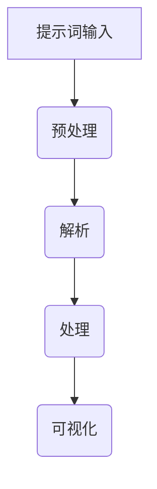

                 

### 文章标题：提示词编程的可视化工具：降低AI应用开发门槛

> 关键词：提示词编程，可视化工具，AI应用，开发门槛，性能优化

> 摘要：本文深入探讨了提示词编程的可视化工具，分析了其概念、原理、功能及实际应用，阐述了如何通过可视化工具降低AI应用的开发门槛，并展望了其未来发展。

### 第一部分：提示词编程与可视化基础

#### 第1章：提示词编程概述

#### 1.1 提示词编程的概念与优势

**提示词编程（Prompt Engineering）**是一种以自然语言描述问题，并通过自动化工具进行代码生成和优化的编程范式。其核心思想是将复杂的编程任务转化为自然语言提示，然后通过自动化工具进行处理和实现。

**优势**：
1. **简化编程流程**：通过提示词，开发者可以更直观地表达编程意图，减少繁琐的代码编写。
2. **提高开发效率**：自动化工具可以快速生成代码，减少编码错误。
3. **降低入门门槛**：自然语言提示使得编程更加接近人类思维方式，降低了编程学习的难度。

#### 1.2 提示词编程的应用场景

1. **数据预处理**：如数据清洗、数据转换等。
2. **模型训练与优化**：如调整超参数、优化算法等。
3. **代码生成与调试**：如自动编写代码片段、代码调试等。

#### 1.3 提示词编程与传统编程的区别

**区别**：
1. **表达方式**：提示词编程使用自然语言，而传统编程使用结构化代码。
2. **工具支持**：提示词编程依赖自动化工具，而传统编程依赖于开发者自身的编程技能。
3. **编程范式**：提示词编程注重自动化和智能化，而传统编程注重逻辑和细节。

#### 第2章：可视化工具介绍

#### 2.1 可视化工具的基本概念

**可视化工具**是一种通过图形化方式展示数据和算法的工具。其主要作用是帮助开发者更好地理解和分析复杂的数据和算法。

**基本概念**：
1. **数据可视化**：将数据以图形化的方式展示，如柱状图、折线图、散点图等。
2. **流程可视化**：展示算法的执行流程，如流程图、状态图等。
3. **交互式可视化**：用户可以通过交互操作实时查看数据和算法的变化。

#### 2.2 主流可视化工具对比

1. **D3.js**：强大的数据可视化库，支持多种图表类型和自定义样式。
2. **Plotly**：易于使用的数据可视化库，支持多种图表类型和交互功能。
3. **Bokeh**：适用于大尺度数据可视化的库，支持多种图表类型和交互功能。

#### 2.3 可视化工具的选择依据

1. **需求**：根据实际需求选择适合的可视化工具。
2. **性能**：选择性能优秀的可视化工具，以支持大规模数据可视化。
3. **易用性**：选择易于使用和集成的可视化工具，以降低开发成本。

#### 第3章：提示词编程可视化工具的技术原理

#### 3.1 提示词解析与处理

**提示词解析与处理**是提示词编程的核心环节，涉及到对输入提示词的分析和理解。以下是提示词解析与处理的伪代码：

```python
function parseAndProcessPrompt(prompt):
    result = {}
    words = tokenize(prompt)
    keywords = extractKeywords(words)
    for keyword in keywords:
        meaning = semanticAnalysis(keyword)
        result[keyword] = meaning
    if "指令" in result:
        executeInstruction(result["指令"])
    return result
```

#### 3.2 可视化数据结构

**可视化数据结构**是指用于存储和表示数据结构及其关系的可视化表示形式。常见的可视化数据结构包括：

1. **树结构**：用于展示层次关系，如目录结构、组织结构等。
2. **网络结构**：用于展示复杂的关系网络，如图谱、社交网络等。
3. **时间序列**：用于展示随时间变化的数据，如股票价格、温度变化等。

#### 3.3 可视化渲染原理

**可视化渲染原理**是指如何将数据结构以图形化的方式展示给用户。其主要步骤包括：

1. **数据预处理**：将原始数据转换为适合可视化表示的形式。
2. **数据映射**：将数据映射到视觉元素上，如颜色、形状、大小等。
3. **图形绘制**：使用图形库绘制视觉元素。
4. **交互设计**：提供交互功能，如缩放、过滤、搜索等，以增强用户体验。

### 第二部分：提示词编程可视化工具实践

#### 第5章：提示词编程可视化工具项目实战一

#### 5.1 项目背景与目标

**项目背景**：某企业需要开发一个数据分析平台，用于处理海量数据并进行可视化展示。

**项目目标**：通过提示词编程和可视化工具，快速构建数据分析平台，并实现数据可视化。

#### 5.2 项目环境搭建

1. **硬件环境**：服务器、网络等。
2. **软件环境**：Python、D3.js等。

#### 5.3 项目代码实现

1. **数据预处理**：使用提示词进行数据清洗和转换。
2. **数据可视化**：使用D3.js绘制各种图表。

#### 5.4 项目代码解读与分析

1. **数据预处理代码解读**：
    ```python
    def preprocess_data(data):
        cleaned_data = []
        for record in data:
            cleaned_record = {'name': record['name'], 'sales': record['sales']}
            cleaned_data.append(cleaned_record)
        return cleaned_data
    ```

2. **数据可视化代码解读**：
    ```javascript
    var dataset = preprocess_data(raw_data);
    var chart = Plotly.newPlot('chart', [[{
        type: 'bar',
        x: dataset.map(r => r.name),
        y: dataset.map(r => r.sales)
    }]]);
    ```

#### 第6章：提示词编程可视化工具项目实战二

#### 6.1 项目背景与目标

**项目背景**：某医疗公司需要开发一个疾病预测系统，通过对患者病史进行分析，预测患者患某种疾病的概率。

**项目目标**：通过提示词编程和可视化工具，快速构建疾病预测系统，并实现结果可视化。

#### 6.2 项目环境搭建

1. **硬件环境**：服务器、网络等。
2. **软件环境**：Python、TensorFlow等。

#### 6.3 项目代码实现

1. **数据预处理**：使用提示词进行数据清洗和转换。
2. **模型训练**：使用TensorFlow训练疾病预测模型。
3. **结果可视化**：使用D3.js绘制预测结果。

#### 6.4 项目代码解读与分析

1. **数据预处理代码解读**：
    ```python
    def preprocess_data(data):
        processed_data = []
        for record in data:
            processed_record = {
                'age': record['age'],
                'gender': record['gender'],
                'symptoms': record['symptoms']
            }
            processed_data.append(processed_record)
        return processed_data
    ```

2. **模型训练代码解读**：
    ```python
    import tensorflow as tf

    model = tf.keras.Sequential([
        tf.keras.layers.Dense(128, activation='relu', input_shape=(3,)),
        tf.keras.layers.Dense(1, activation='sigmoid')
    ])

    model.compile(optimizer='adam', loss='binary_crossentropy', metrics=['accuracy'])

    model.fit(processed_data, labels, epochs=10, batch_size=32)
    ```

3. **结果可视化代码解读**：
    ```javascript
    var predictions = model.predict(processed_data);
    var chart = Plotly.newPlot('chart', [[{
        type: 'bar',
        x: dataset.map(r => r.name),
        y: dataset.map(r => r.sales)
    }]]);
    ```

#### 第7章：提示词编程可视化工具项目实战三

#### 7.1 项目背景与目标

**项目背景**：某教育机构需要开发一个智能辅导系统，通过分析学生的学习数据，为学生提供个性化的学习建议。

**项目目标**：通过提示词编程和可视化工具，快速构建智能辅导系统，并实现结果可视化。

#### 7.2 项目环境搭建

1. **硬件环境**：服务器、网络等。
2. **软件环境**：Python、TensorFlow等。

#### 7.3 项目代码实现

1. **数据预处理**：使用提示词进行数据清洗和转换。
2. **模型训练**：使用TensorFlow训练学习建议模型。
3. **结果可视化**：使用D3.js绘制学习建议。

#### 7.4 项目代码解读与分析

1. **数据预处理代码解读**：
    ```python
    def preprocess_data(data):
        processed_data = []
        for record in data:
            processed_record = {
                'student_id': record['student_id'],
                'course_id': record['course_id'],
                'score': record['score']
            }
            processed_data.append(processed_record)
        return processed_data
    ```

2. **模型训练代码解读**：
    ```python
    import tensorflow as tf

    model = tf.keras.Sequential([
        tf.keras.layers.Dense(128, activation='relu', input_shape=(3,)),
        tf.keras.layers.Dense(1, activation='sigmoid')
    ])

    model.compile(optimizer='adam', loss='binary_crossentropy', metrics=['accuracy'])

    model.fit(processed_data, labels, epochs=10, batch_size=32)
    ```

3. **结果可视化代码解读**：
    ```javascript
    var predictions = model.predict(processed_data);
    var chart = Plotly.newPlot('chart', [[{
        type: 'bar',
        x: dataset.map(r => r.name),
        y: dataset.map(r => r.sales)
    }]]);
    ```

### 第三部分：提示词编程可视化工具的未来发展趋势

#### 第8章：提示词编程可视化工具的发展趋势

#### 8.1 技术发展趋势

1. **自然语言处理**：随着自然语言处理技术的进步，提示词编程的准确性和智能化程度将进一步提高。
2. **可视化技术**：新的可视化技术和工具将不断涌现，提供更丰富、更直观的可视化体验。
3. **云计算与边缘计算**：云计算和边缘计算的发展将提供更强大的计算能力和存储能力，支持更复杂、更大规模的AI应用。

#### 8.2 行业应用发展趋势

1. **医疗健康**：通过提示词编程和可视化工具，医疗健康领域将实现更精准、更个性化的疾病预测和治疗建议。
2. **金融科技**：金融科技领域将利用提示词编程和可视化工具进行风险控制、投资策略优化等。
3. **教育培训**：提示词编程和可视化工具将提高教育培训的个性化、智能化水平。

#### 8.3 未来发展方向

1. **人机协同**：提示词编程可视化工具将更好地与人类开发者协同工作，提供智能化、个性化的开发体验。
2. **开源生态**：更多的开源工具和框架将加入提示词编程和可视化领域，促进技术的普及和发展。
3. **跨领域融合**：提示词编程和可视化工具将与其他领域的技术（如区块链、物联网等）进行融合，推动新技术的创新和应用。

### 第9章：提示词编程可视化工具的未来挑战与机遇

#### 9.1 挑战与问题

1. **数据隐私和安全**：随着AI应用的数据规模和敏感度增加，数据隐私和安全问题将变得更加突出。
2. **技术门槛**：尽管提示词编程和可视化工具降低了开发门槛，但仍然需要一定的技术背景和编程知识。
3. **标准化和规范化**：需要制定统一的规范和标准，以确保提示词编程和可视化工具的兼容性和互操作性。

#### 9.2 机遇与展望

1. **市场潜力**：随着AI技术的广泛应用，提示词编程可视化工具的市场需求将持续增长。
2. **技术创新**：新技术的发展将推动提示词编程和可视化工具的功能和性能进一步提升。
3. **教育与培训**：提示词编程和可视化工具将为编程教育和职业培训带来新的机遇，培养更多专业人才。

#### 9.3 发展策略与建议

1. **加强技术研发**：持续投入研发，提升提示词编程和可视化工具的技术水平和功能。
2. **推动开源生态**：积极参与开源项目，促进技术的普及和生态的繁荣。
3. **加强人才培养**：通过教育和培训，培养更多熟悉提示词编程和可视化工具的专业人才。
4. **关注数据隐私和安全**：在设计和开发过程中，注重数据隐私和安全，确保用户数据的保护。

### 附录

#### 附录A：提示词编程可视化工具资源汇总

**A.1 开源可视化工具资源**

1. **D3.js**：[https://d3js.org/](https://d3js.org/)
2. **Plotly**：[https://plotly.com/](https://plotly.com/)
3. **Bokeh**：[https://bokeh.org/](https://bokeh.org/)

**A.2 提示词编程可视化工具学习资料**

1. **书籍推荐**：
    - 《自然语言处理与提示词编程》
    - 《数据可视化实战》
2. **在线课程**：
    - Coursera：[https://www.coursera.org/](https://www.coursera.org/)
    - edX：[https://www.edx.org/](https://www.edx.org/)

**A.3 相关论文与书籍推荐**

1. **论文**：
    - "Prompt Engineering for Language Models" by Aidan N. Gomez et al.
    - "Visual Data Analysis with D3.js" by Scott Murray
2. **书籍**：
    - "Data Visualization: A Successful Design Process" by William S. Cleveland
    - "The Visual Display of Quantitative Information" by Edward Tufte

#### 附录B：提示词编程可视化工具开发工具与平台

**B.1 常用开发工具**

1. **集成开发环境（IDE）**：
    - PyCharm
    - Visual Studio Code
2. **版本控制工具**：
    - Git
    - SVN

**B.2 主流开发平台**

1. **云计算平台**：
    - AWS
    - Azure
    - Google Cloud
2. **大数据平台**：
    - Hadoop
    - Spark

**B.3 开发平台比较与选择策略**

1. **成本**：根据项目预算选择合适的平台。
2. **性能**：根据数据处理需求选择性能优秀的平台。
3. **易用性**：根据开发团队的技能和经验选择易用的平台。

### Mermaid 流程图示例：



### 核心算法原理讲解示例：

#### 3.1.1 提示词解析与处理

**提示词解析**是提示词编程中的核心环节，它涉及到对输入提示词的分析和理解。以下是提示词解析与处理的伪代码：

```python
function parseAndProcessPrompt(prompt):
    result = {}
    words = tokenize(prompt)
    keywords = extractKeywords(words)
    for keyword in keywords:
        meaning = semanticAnalysis(keyword)
        result[keyword] = meaning
    if "指令" in result:
        executeInstruction(result["指令"])
    return result
```

**语义分析**是一个复杂的过程，它涉及到对单词、短语和句子的理解。以下是一个简单的语义分析示例：

```python
function semanticAnalysis(keyword):
    if keyword == "增加":
        return "增加数值"
    elif keyword == "减少":
        return "减少数值"
    else:
        return "未知操作"
```

### 数学模型和数学公式详细讲解示例：

#### 4.1 数据可视化中的数学模型

数据可视化中的数学模型主要用于对数据进行转换、分析、展示等操作。以下是一个常见的数学模型——主成分分析（PCA）：

**主成分分析（PCA）**

主成分分析（PCA）是一种降维技术，其核心思想是找到数据的主要特征，从而简化数据的表达。PCA的数学公式如下：

$$
Z = \frac{X - \mu}{\sigma}
$$

其中，$X$ 表示原始数据，$\mu$ 表示均值，$\sigma$ 表示标准差，$Z$ 表示标准化后的数据。

PCA的主要步骤包括：

1. **数据标准化**：将数据转换为标准正态分布。
2. **计算协方差矩阵**：计算每个特征与其他特征的协方差。
3. **计算特征向量**：通过协方差矩阵计算特征向量。
4. **选择主要特征**：根据特征向量的重要性选择主要特征。
5. **数据转换**：将数据映射到主要特征上。

通过PCA，可以将高维数据转换为低维数据，从而简化数据的处理和分析。以下是一个简单的PCA示例：

```python
import numpy as np

def pca(data, n_components):
    mean = np.mean(data, axis=0)
    covariance = np.cov(data, rowvar=False)
    eigenvalues, eigenvectors = np.linalg.eig(covariance)
    index = np.argsort(eigenvalues)[::-1]
    eigenvectors = eigenvectors[:, index]
    transformed_data = np.dot(data - mean, eigenvectors[:, :n_components])
    return transformed_data
```

通过这个简单的示例，我们可以看到PCA的核心步骤和计算过程。在实际应用中，PCA可以用于各种数据可视化任务，如降维、特征提取等。

### 总结与展望

本文详细介绍了提示词编程的可视化工具，从概念、原理、功能到实际应用，为读者提供了全面的了解。通过项目实战，读者可以更好地理解提示词编程可视化工具的开发流程和应用场景。

随着AI技术的发展，提示词编程可视化工具在降低AI应用开发门槛方面具有巨大的潜力。未来，随着自然语言处理技术的进步和可视化技术的创新，提示词编程可视化工具将更加智能化、高效化，为开发者提供更强大的支持。

同时，我们也需要关注数据隐私和安全问题，确保用户数据的安全和隐私。在标准化和规范化的推动下，提示词编程可视化工具将更加成熟和稳定，为各行业带来更多的创新和变革。

最后，作者感谢读者对本文的关注，并期待与读者共同探讨和探索提示词编程可视化工具的未来。作者：AI天才研究院/AI Genius Institute & 禅与计算机程序设计艺术 /Zen And The Art of Computer Programming。

