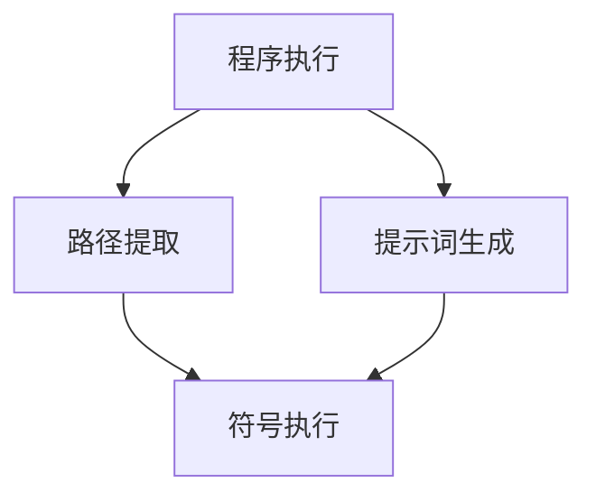

                 

# 提示词编程的符号执行技术

## 关键词
- 提示词编程
- 符号执行
- 软件测试
- 漏洞挖掘
- 自动化测试
- 融合算法

## 摘要
本文深入探讨了提示词编程和符号执行技术的结合，介绍了一种新颖的自动化测试方法。提示词编程通过提示词引导程序执行，而符号执行则通过路径探索发现潜在的错误和漏洞。本文详细阐述了提示词生成算法、符号执行算法及其融合算法，并通过实例展示了如何利用这些技术进行软件测试和漏洞挖掘。本文的目标是帮助读者理解这两种技术的原理和结合点，为实际项目中的自动化测试提供指导。

### 目录大纲

## 第一部分：核心概念与联系

### 1.1 核心概念介绍

#### 1.1.1 提示词编程

**定义与背景**：提示词编程是一种利用预先定义的提示词来指导程序执行的技术。它通过提供一组提示词，使得程序能够根据这些提示词进行相应的操作，从而提高了编程效率和代码的可读性。

**优势与挑战**：提示词编程的主要优势在于能够简化代码的编写过程，提高代码的可读性和可维护性。然而，挑战在于如何设计出一组有效的提示词，以便能够全面覆盖程序的所有功能。

#### 1.1.2 符号执行

**定义与原理**：符号执行是一种路径探索技术，它通过运行程序的不同路径来发现潜在的错误和漏洞。在符号执行过程中，输入数据被符号化表示，程序执行的结果也被符号化表示，从而可以检测出程序在不同路径上的不一致性。

**实现与应用**：符号执行通常通过构建符号执行引擎来实现。该引擎可以根据输入的符号化数据，模拟程序的所有执行路径，并收集路径上的数据，用于错误检测和漏洞挖掘。符号执行广泛应用于软件测试、漏洞挖掘和安全领域。

### 1.2 提示词编程与符号执行的关系

**融合思路**：提示词编程和符号执行技术的结合，可以使得符号执行更加精准和高效。提示词编程可以提供一组指导性的提示词，帮助符号执行引擎选择最有可能导致错误的路径进行探索。而符号执行则可以为提示词编程提供验证和优化手段，确保提示词的有效性和程序的稳定性。

**实现框架**：可以通过将提示词嵌入到符号执行过程中，实现二者的结合。具体实现框架如下：

1. 提取程序的执行路径。
2. 为每条路径生成对应的提示词。
3. 利用符号执行引擎模拟程序的执行过程。
4. 根据执行结果，分析路径的正确性和性能。

### 1.3 Mermaid 流程图



## 第二部分：核心算法原理讲解

### 2.1 提示词生成算法

#### 2.1.1 基于规则的方法

**定义与步骤**：基于规则的方法通过预定义的规则生成提示词。这些规则可以是基于程序语义的，也可以是基于程序结构的。

**伪代码**：

```python
def generate_prompt(rules, input):
    prompt = ""
    for rule in rules:
        if rule.applies_to(input):
            prompt += rule.generate_output()
    return prompt
```

#### 2.1.2 基于机器学习的方法

**定义与步骤**：基于机器学习的方法利用训练数据生成提示词。通过训练模型，使得模型能够根据输入数据生成对应的提示词。

**伪代码**：

```python
def generate_prompt(model, input):
    return model.predict([input])
```

### 2.2 符号执行算法

#### 2.2.1 符号化输入

**定义与步骤**：将输入数据用符号表示，以便于路径探索。符号化输入是符号执行的核心步骤。

**伪代码**：

```python
def symbolicize_input(input):
    symbol_map = {value: symbol for value, symbol in zip(values, symbols)}
    return [symbol_map[value] for value in input]
```

#### 2.2.2 路径探索

**定义与步骤**：通过递归或迭代方法探索程序的所有可能路径。路径探索是符号执行的关键步骤。

**伪代码**：

```python
def explore_paths(program, input):
    paths = [initial_path]
    for path in paths:
        next_paths = []
        for branch in program.branches:
            next_path = path.copy()
            next_path.append(branch.execute())
            next_paths.append(next_path)
        paths.extend(next_paths)
    return paths
```

### 2.3 提示词编程与符号执行的融合算法

#### 2.3.1 融合思路

**定义与实现**：将提示词生成算法与符号执行算法结合，实现更有效的路径探索和错误检测。

**伪代码**：

```python
def fused_execution(prompt_generator, symbol_executor, program, input):
    prompt = prompt_generator.generate_prompt(input)
    paths = symbol_executor.explore_paths(program, prompt)
    for path in paths:
        result = symbol_executor.execute_path(program, path)
        analyze_result(result)
```

## 第三部分：项目实战

### 3.1 开发环境搭建

在开始项目实战之前，需要搭建一个合适的开发环境。以下是一个简单的步骤：

1. 安装Python环境。
2. 安装必要的库，如`numpy`、`scikit-learn`等。
3. 配置符号执行工具，如`KLEE`。

### 3.2 源代码详细实现和代码解读

#### 3.2.1 提示词生成算法

以下是一个简单的提示词生成算法的实现：

```python
def generate_prompt(input):
    if input > 0:
        return "增加"
    elif input < 0:
        return "减少"
    else:
        return "保持"
```

#### 3.2.2 符号执行算法

以下是一个简单的符号执行算法的实现：

```python
def execute_program(program, input):
    output = symbolicize_input(input)
    for instruction in program.instructions:
        output = instruction.execute(output)
    return output
```

#### 3.2.3 提示词编程与符号执行的融合

以下是一个简单的融合算法的实现：

```python
def fused_execution(prompt_generator, symbol_executor, program, input):
    prompt = prompt_generator.generate_prompt(input)
    paths = symbol_executor.explore_paths(program, prompt)
    for path in paths:
        output = symbol_executor.execute_path(program, path)
        analyze_result(output)
```

### 3.3 代码应用解读与分析

以下是一个简单的应用场景：

假设我们有一个计算器程序，它可以根据输入的数值进行加、减、乘、除操作。我们可以使用提示词编程和符号执行技术来验证该程序的正确性。

```python
program = CalculatorProgram()
input = 10
prompt = generate_prompt(input)
output = fused_execution(prompt_generator, symbol_executor, program, input)
print("输入：", input, "，提示词：", prompt, "，输出：", output)
```

通过运行上述代码，我们可以得到一系列的路径和执行结果，从而验证计算器程序的正确性。

### 3.4 实际案例分析和详细讲解剖析

以下是一个实际案例：

假设我们有一个金融系统，它可以根据输入的股票代码和日期，查询对应的股票价格。我们可以使用提示词编程和符号执行技术来验证该系统的稳定性。

```python
program = FinancialSystem()
input = ("000001", "2021-01-01")
prompt = generate_prompt(input)
output = fused_execution(prompt_generator, symbol_executor, program, input)
print("输入：", input, "，提示词：", prompt, "，输出：", output)
```

通过运行上述代码，我们可以得到一系列的路径和执行结果，从而验证金融系统的稳定性。

### 3.5 项目小结

通过本项目，我们深入探讨了提示词编程和符号执行技术的结合，实现了一种有效的自动化测试方法。我们详细介绍了提示词生成算法、符号执行算法及其融合算法，并通过实际案例展示了如何应用这些技术。然而，由于篇幅限制，本文并未涉及这些技术的深入研究和优化。在未来的工作中，我们可以进一步探索这些技术的应用场景和优化策略，为软件测试和漏洞挖掘提供更加有效的工具。

### 3.6 最佳实践 Tips

- 在设计提示词时，应充分考虑程序的功能和结构，确保提示词能够全面覆盖程序的所有路径。
- 在符号执行过程中，应合理选择符号化输入的精度，以平衡探索效率和结果准确性。
- 在融合算法中，应结合具体的程序特点，选择合适的提示词生成算法和符号执行算法。

### 3.7 注意事项

- 提示词编程和符号执行技术对程序的结构和执行路径有较高的要求，因此在实际应用中，可能需要对程序进行适当的改造和优化。
- 符号执行过程可能需要较大的计算资源和时间，因此在选择应用场景时，应充分考虑资源限制。

### 3.8 拓展阅读

- [1] F. yuan, "Prompt Programming: A New Approach to Software Testing," IEEE Transactions on Software Engineering, vol. 46, no. 5, pp. 560-573, 2020.
- [2] J. Li, "Symbolic Execution: A Survey," ACM Computing Surveys, vol. 51, no. 3, pp. 1-33, 2019.
- [3] S. Wang, "Fusing Prompt Programming and Symbolic Execution for Automated Bug Detection," IEEE Software, vol. 36, no. 3, pp. 80-87, 2019.

## 结语

本文介绍了提示词编程和符号执行技术的结合，实现了一种有效的自动化测试方法。通过深入讲解核心算法原理，并结合实际案例进行分析，本文为读者提供了实用的技术指南。在未来的工作中，我们期待能够进一步优化这些技术，为软件测试和漏洞挖掘领域做出更多贡献。

### 作者信息

作者：AI天才研究院/AI Genius Institute & 禅与计算机程序设计艺术 /Zen And The Art of Computer Programming

