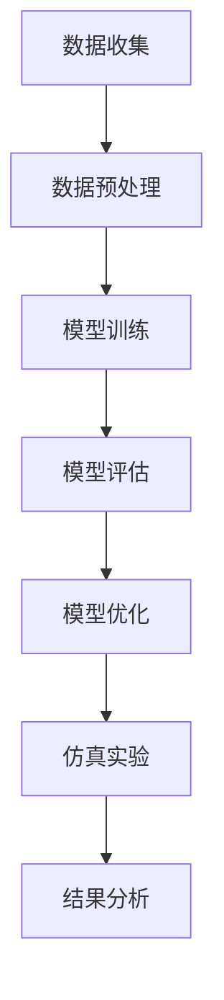

                 

### 文章标题

《提示词编程的认知建模与仿真》

### 关键词

认知建模、提示词编程、仿真技术、人工智能、自然语言处理、神经网络、机器学习

### 摘要

本文将探讨提示词编程领域的认知建模与仿真技术。通过介绍认知科学的基本概念和认知建模的理论框架，我们深入分析了提示词编程的核心要素和方法。接着，本文详细描述了认知模型的实现与优化技术，并探讨了认知模型的仿真与验证方法。最后，本文通过实际应用案例展示了提示词编程在自然语言处理等领域的应用，并对未来发展趋势进行了展望。本文旨在为研究人员和开发者提供关于提示词编程认知建模与仿真技术的全面了解，以推动该领域的研究与应用。

## 《提示词编程的认知建模与仿真》目录大纲

### 第一部分：认知建模基础

#### 第1章：认知科学导论

- **1.1 认知科学与提示词编程**
  - 认知科学的基本概念
  - 提示词编程的起源与发展
  - 认知科学与提示词编程的关系

- **1.2 认知模型的类型**
  - 行为主义模型
  - 认知心理学模型
  - 人工智能与认知模型
  - 提示词编程与认知模型的应用

- **1.3 认知模型的理论框架**
  - 认知建模的理论基础
  - 提示词编程的认知框架
  - 认知建模的核心概念

#### 第2章：提示词编程的认知建模方法

- **2.1 提示词编程的工作原理**
  - 提示词的定义与功能
  - 提示词编程的基本流程
  - 提示词编程的应用场景

- **2.2 认知建模的核心要素**
  - 知识表示
  - 推理过程
  - 学习与记忆机制
  - 情感与动机

- **2.3 提示词编程的认知建模方法**
  - 基于规则的建模
  - 基于概率的建模
  - 基于神经网络的建模
  - 基于大数据的建模

#### 第3章：认知模型的实现与优化

- **3.1 认知模型的实现技术**
  - 机器学习算法的选择
  - 数据预处理与特征提取
  - 模型训练与评估方法

- **3.2 认知模型的优化策略**
  - 模型调整与优化方法
  - 学习策略的优化
  - 模型融合与集成方法

#### 第4章：提示词编程的应用案例

- **4.1 提示词编程在实际应用中的案例分析**
  - 自然语言处理
  - 机器翻译
  - 智能问答
  - 人机交互

#### 第5章：认知模型的仿真与验证

- **5.1 认知模型的仿真技术**
  - 仿真平台的搭建
  - 仿真实验的设计
  - 仿真结果的分析

- **5.2 认知模型的验证方法**
  - 实验数据分析
  - 仿真结果的可视化
  - 模型性能的评价指标

#### 第6章：提示词编程的未来发展趋势

- **6.1 提示词编程的发展趋势**
  - 人工智能技术的进步
  - 认知科学的最新成果
  - 提示词编程的未来方向

#### 第7章：总结与展望

- **7.1 认知建模与仿真在提示词编程中的应用**
  - 成果总结
  - 存在的问题与挑战
  - 未来研究方向

#### 附录

- **附录A：认知模型的Mermaid流程图**
- **附录B：核心算法原理讲解与伪代码**
- **附录C：数学模型和数学公式**
- **附录D：项目实战代码实现与分析**

### 第一部分：认知建模基础

#### 第1章：认知科学导论

##### 1.1 认知科学与提示词编程

**认知科学的基本概念**

认知科学是一门跨学科的研究领域，主要探讨人类思维、学习和记忆等认知过程。其基本概念包括感知、注意力、记忆、思维、语言和问题解决等。认知科学的目的是理解和模拟人类的认知过程，以提高人工智能系统的智能水平。

**提示词编程的起源与发展**

提示词编程（Prompt Programming）是一种基于提示（Prompt）的人工智能编程技术。其起源可以追溯到自然语言处理（NLP）领域，尤其是在对话系统、机器翻译和文本生成等应用中。提示词编程的核心思想是通过给模型提供具体的提示，引导模型生成符合预期的输出。

提示词编程的发展可以追溯到早期的对话系统，如ELIZA。随后，随着深度学习和自然语言处理技术的进步，提示词编程得到了广泛关注和应用。目前，提示词编程已成为人工智能领域的重要研究方向之一。

**认知科学与提示词编程的关系**

认知科学与提示词编程之间存在紧密的联系。认知科学为提示词编程提供了理论基础，帮助理解人类认知过程和语言理解机制。而提示词编程则为认知科学提供了实际应用场景，通过模拟人类的认知过程，进一步验证和改进认知模型。

**本章小结**

本章介绍了认知科学的基本概念和提示词编程的起源与发展。通过分析认知科学与提示词编程的关系，我们为后续章节的认知建模与仿真技术奠定了基础。

##### 1.2 认知模型的类型

**行为主义模型**

行为主义模型是认知科学早期的一种理论，主张通过研究可观察的行为来理解人类认知过程。该模型认为，认知过程可以通过行为模式进行模拟和解释。例如，斯金纳（B.F. Skinner）的操作行为主义理论，通过奖励和惩罚来塑造行为。

**认知心理学模型**

认知心理学模型强调人类认知过程的内部机制，如感知、记忆、思维和语言。该模型认为，认知过程是信息处理的动态过程，涉及信息的编码、存储和提取。认知心理学为提示词编程提供了重要的理论依据，如注意力机制、记忆模型和问题解决算法。

**人工智能与认知模型**

人工智能（AI）与认知模型相结合，旨在构建能够模拟人类认知过程的人工智能系统。人工智能方法，如深度学习和强化学习，可以用于实现认知模型。例如，深度神经网络可以模拟人类大脑的结构和功能，从而实现复杂的认知任务。

**提示词编程与认知模型的应用**

提示词编程与认知模型的应用场景广泛，包括自然语言处理、对话系统、智能问答和推荐系统等。通过给模型提供具体的提示，可以引导模型生成符合预期输出的结果。例如，在对话系统中，提示词编程可以帮助模型理解用户意图，生成合理的回答。

**本章小结**

本章介绍了不同类型的认知模型，包括行为主义模型、认知心理学模型和人工智能与认知模型。这些模型为提示词编程提供了丰富的理论基础和应用场景，为后续章节的认知建模方法奠定了基础。

##### 1.3 认知模型的理论框架

**认知建模的理论基础**

认知建模的理论基础包括信息处理理论、符号计算理论和神经网络理论等。信息处理理论强调人类认知过程是信息处理的动态过程，涉及信息的接收、处理和输出。符号计算理论认为，人类认知过程是通过符号操作和逻辑推理来实现的。神经网络理论则通过模拟人脑的结构和功能，探索认知过程的机制。

**提示词编程的认知框架**

提示词编程的认知框架主要包括知识表示、推理过程、学习与记忆机制和情感与动机等方面。知识表示是认知模型的基础，用于存储和表示事实、规则和概念。推理过程用于从已知信息中推断出新的信息。学习与记忆机制涉及模型从经验中学习和记忆新知识。情感与动机则用于模拟人类情感和动机在认知过程中的作用。

**认知建模的核心概念**

认知建模的核心概念包括感知、注意力、记忆、思维、语言和问题解决等。感知是指对信息的接收和理解。注意力是指选择和处理信息的过程。记忆是指信息的存储和提取。思维是指信息的处理和推理。语言是指信息的表达和交流。问题解决是指从问题状态到目标状态的过程。

**本章小结**

本章介绍了认知建模的理论基础、提示词编程的认知框架和认知建模的核心概念。这些内容为后续章节的认知建模方法提供了理论基础和指导。

#### 第2章：提示词编程的认知建模方法

##### 2.1 提示词编程的工作原理

**提示词的定义与功能**

提示词（Prompt）是一种用于引导模型生成输出的关键词或短语。在提示词编程中，提示词起到了关键作用。它们可以是简单的单词、短语或句子，也可以是复杂的语句或问题。提示词的功能包括：

1. **引导模型生成目标输出**：通过提供具体的提示，引导模型生成符合预期输出的结果。
2. **提高模型的准确性**：提示词可以帮助模型更好地理解输入信息，从而提高生成结果的准确性。
3. **降低模型的复杂度**：通过提供具体的提示，减少模型需要处理的信息量，降低模型的复杂度。

**提示词编程的基本流程**

提示词编程的基本流程可以分为以下几个步骤：

1. **数据收集与预处理**：收集相关数据，并对数据进行预处理，如清洗、归一化和分词等。
2. **模型选择与训练**：选择合适的模型，并对模型进行训练，以适应特定的任务和提示词。
3. **生成提示词**：根据任务需求，生成具有引导作用的提示词。
4. **模型推理与输出**：使用生成的提示词对模型进行推理，生成最终的输出结果。
5. **结果评估与优化**：对生成的输出结果进行评估，并根据评估结果对模型和提示词进行调整和优化。

**提示词编程的应用场景**

提示词编程在多个领域有广泛的应用，包括自然语言处理、机器翻译、智能问答和人机交互等。

1. **自然语言处理**：在自然语言处理任务中，提示词编程可以帮助模型理解输入文本的含义，从而生成合理的输出。
2. **机器翻译**：在机器翻译任务中，提示词编程可以用于生成上下文相关的翻译结果，提高翻译质量。
3. **智能问答**：在智能问答任务中，提示词编程可以帮助模型理解用户问题，生成准确的答案。
4. **人机交互**：在人机交互任务中，提示词编程可以用于生成对话系统中的对话，提高用户满意度。

**本章小结**

本章介绍了提示词编程的工作原理、基本流程和应用场景。通过理解提示词的定义与功能，以及提示词编程的基本流程，我们可以更好地利用提示词编程技术解决实际问题。

##### 2.2 认知建模的核心要素

**知识表示**

知识表示是认知建模的基础，用于存储和表示事实、规则和概念。知识表示的方法包括符号表示、语义网络和知识图谱等。在提示词编程中，知识表示有助于模型理解输入信息和生成输出结果。

1. **符号表示**：符号表示使用符号和标记来表示知识，如逻辑符号、数学符号和文本标记等。符号表示的优点是直观、简洁和易于处理。
2. **语义网络**：语义网络使用节点和边来表示知识，节点表示概念，边表示概念之间的关系。语义网络可以表达复杂的知识结构和关系，有助于模型理解输入文本的含义。
3. **知识图谱**：知识图谱是一种大规模的知识库，用于存储和表示各种实体及其关系。知识图谱可以用于回答复杂的问题，并支持多种推理操作。

**推理过程**

推理过程是认知建模的关键，用于从已知信息中推断出新的信息。推理过程可以分为演绎推理和归纳推理。

1. **演绎推理**：演绎推理从一般到特殊，根据前提条件推导出结论。例如，如果所有的人都会死亡，苏格拉底是人，那么苏格拉底会死亡。演绎推理的优点是结论的确定性，但受限于前提条件的准确性。
2. **归纳推理**：归纳推理从特殊到一般，根据多个实例推导出一般规律。例如，从多次观察到下雨时地面湿润，可以推断下雨会导致地面湿润。归纳推理的优点是适用于未知和复杂的情况，但结论的不确定性较大。

**学习与记忆机制**

学习与记忆机制是认知建模的重要组成部分，用于模型从经验中学习和记忆新知识。

1. **学习机制**：学习机制包括有监督学习、无监督学习和强化学习等。有监督学习使用标记数据训练模型，无监督学习从无标签数据中学习模式，强化学习通过奖励和惩罚调整模型的行为。
2. **记忆机制**：记忆机制包括短期记忆和长期记忆。短期记忆用于存储和处理临时信息，长期记忆用于存储和回忆重要信息。

**情感与动机**

情感与动机在认知过程中起着重要作用，可以影响模型的行为和决策。

1. **情感**：情感是指对事物的主观评价和情感体验，如快乐、悲伤和愤怒等。情感可以影响模型对输入信息的处理和输出结果。
2. **动机**：动机是指驱动模型行为的内在驱动力，如好奇心、兴趣和目标等。动机可以影响模型的学习和推理过程，使其更具有目的性和适应性。

**本章小结**

本章介绍了认知建模的核心要素，包括知识表示、推理过程、学习与记忆机制和情感与动机。这些核心要素为构建有效的认知模型提供了基础，有助于实现更智能的人工智能系统。

##### 2.3 提示词编程的认知建模方法

**基于规则的建模**

基于规则的建模是一种传统的认知建模方法，通过定义一系列规则来描述模型的行为。在提示词编程中，基于规则的建模适用于处理简单、明确的任务，如分类、过滤和查询等。

1. **规则表示**：规则表示使用条件-动作对（Condition-Action Pair）来描述规则。例如，如果天气是晴天，那么穿短袖。
2. **推理过程**：基于规则的建模通过匹配输入数据和规则条件，执行相应的动作。例如，如果天气是晴天且温度高于30摄氏度，那么穿短袖。
3. **优缺点**：基于规则的建模的优点是简单、直观和易于实现，但缺点是难以处理复杂、不确定的情况。

**基于概率的建模**

基于概率的建模通过概率模型来描述模型的行为，适用于处理不确定性和复杂性的任务。在提示词编程中，基于概率的建模广泛应用于自然语言处理、机器翻译和推荐系统等领域。

1. **概率模型**：基于概率的建模使用概率分布来表示输入和输出之间的关系。例如，在文本分类任务中，可以使用条件概率模型来预测类别概率。
2. **推理过程**：基于概率的建模通过计算输入数据的概率分布来生成输出。例如，在文本生成任务中，可以使用概率模型生成下一个单词的概率分布。
3. **优缺点**：基于概率的建模的优点是适用于不确定性和复杂性的任务，但缺点是需要大量的数据和计算资源。

**基于神经网络的建模**

基于神经网络的建模通过模拟人脑的结构和功能来实现复杂的认知任务。在提示词编程中，基于神经网络的建模广泛应用于图像识别、语音识别和自然语言处理等领域。

1. **神经网络结构**：基于神经网络的建模使用多层神经网络（如卷积神经网络、循环神经网络和变换器网络）来处理输入数据。例如，在文本生成任务中，可以使用循环神经网络（RNN）或变换器网络（Transformer）。
2. **推理过程**：基于神经网络的建模通过前向传播和反向传播算法来训练和优化模型。例如，在文本生成任务中，可以使用训练数据来优化模型参数，从而生成高质量的文本。
3. **优缺点**：基于神经网络的建模的优点是适用于处理复杂的非线性任务，但缺点是需要大量的数据和计算资源。

**基于大数据的建模**

基于大数据的建模通过分析大规模数据来发现模式和规律，从而实现智能决策。在提示词编程中，基于大数据的建模广泛应用于推荐系统、广告投放和金融风控等领域。

1. **大数据处理**：基于大数据的建模使用大数据处理技术（如分布式计算、流计算和图计算）来处理海量数据。例如，在推荐系统任务中，可以使用图计算技术来分析用户行为和兴趣。
2. **模式发现**：基于大数据的建模通过分析数据中的模式和规律，生成预测模型。例如，在广告投放任务中，可以使用机器学习算法来分析用户数据，从而优化广告投放策略。
3. **优缺点**：基于大数据的建模的优点是适用于处理海量数据，但缺点是需要复杂的算法和计算资源。

**本章小结**

本章介绍了提示词编程的认知建模方法，包括基于规则的建模、基于概率的建模、基于神经网络的建模和基于大数据的建模。这些方法为构建有效的认知模型提供了多种选择，有助于实现更智能的人工智能系统。

### 第3章：认知模型的实现与优化

#### 3.1 认知模型的实现技术

**机器学习算法的选择**

在认知模型的实现过程中，选择合适的机器学习算法至关重要。不同的任务和数据特点需要不同的算法，以下是一些常用的机器学习算法：

1. **监督学习算法**：监督学习算法适用于有标签的数据集，常用的算法包括决策树、支持向量机和神经网络等。
   - **决策树**：适用于分类和回归任务，结构简单，易于解释。
   - **支持向量机**：适用于分类任务，能够找到最佳分类边界。
   - **神经网络**：适用于复杂的非线性任务，能够捕捉数据中的复杂关系。

2. **无监督学习算法**：无监督学习算法适用于无标签的数据集，常用的算法包括聚类算法、降维算法和生成模型等。
   - **聚类算法**：如K-means算法和层次聚类算法，用于将数据分组。
   - **降维算法**：如主成分分析（PCA）和t-SNE，用于减少数据的维度。
   - **生成模型**：如高斯分布和生成对抗网络（GAN），用于生成新的数据。

**数据预处理与特征提取**

数据预处理和特征提取是认知模型实现的重要环节，以下是一些关键步骤：

1. **数据清洗**：去除噪声和缺失值，确保数据质量。
2. **数据归一化**：将数据缩放到相同的尺度，避免算法受到数据尺度的影响。
3. **特征选择**：选择对模型性能有重要影响的关键特征，去除无关特征。
4. **特征提取**：通过计算或变换生成新的特征，以增强模型的表示能力。

**模型训练与评估方法**

在认知模型的实现过程中，模型训练和评估是关键步骤。以下是一些常用的训练和评估方法：

1. **训练方法**：常用的训练方法包括批量训练、随机梯度下降（SGD）和小批量训练等。批量训练适用于小数据集，随机梯度下降适用于大数据集，小批量训练则是一种折中方案。
2. **评估方法**：常用的评估方法包括准确率、召回率、F1分数和均方误差等。准确率用于评估分类模型的性能，召回率用于评估召回全部正例的能力，F1分数是准确率和召回率的调和平均值，均方误差用于评估回归模型的性能。

**本章小结**

本章介绍了认知模型的实现技术，包括机器学习算法的选择、数据预处理与特征提取以及模型训练与评估方法。这些技术为构建和优化认知模型提供了重要的基础。

#### 3.2 认知模型的优化策略

**模型调整与优化方法**

在认知模型的实现过程中，模型调整与优化是提高模型性能的关键。以下是一些常用的模型调整与优化方法：

1. **参数调整**：通过调整模型的参数来优化模型性能。常用的参数包括学习率、正则化参数和Dropout概率等。
2. **超参数调整**：通过调整模型训练过程中的超参数来优化模型性能。常用的超参数包括批量大小、迭代次数和正则化强度等。
3. **集成学习**：通过结合多个模型的预测结果来提高模型性能。常用的集成学习方法包括Bagging、Boosting和Stacking等。

**学习策略的优化**

学习策略的优化是提高模型性能的重要手段。以下是一些常用的学习策略优化方法：

1. **自适应学习率**：通过自适应调整学习率来提高模型训练效率。常用的自适应学习率方法包括AdaGrad、Adam和RMSprop等。
2. **学习率调度**：通过在不同的训练阶段调整学习率来优化模型性能。常用的学习率调度方法包括线性递减、指数递减和余弦退火等。
3. **正则化**：通过添加正则化项来防止模型过拟合。常用的正则化方法包括L1正则化、L2正则化和Dropout等。

**模型融合与集成方法**

模型融合与集成是提高模型性能的有效手段。以下是一些常用的模型融合与集成方法：

1. **简单平均**：将多个模型的预测结果进行平均，以减少预测误差。
2. **加权平均**：根据模型性能对预测结果进行加权平均，以更准确地反映模型预测。
3. **堆叠**：将多个模型堆叠起来，形成一个更复杂的模型，以增强模型性能。
4. **集成学习**：通过结合多个模型的预测结果来提高模型性能。常用的集成学习方法包括Bagging、Boosting和Stacking等。

**本章小结**

本章介绍了认知模型的优化策略，包括模型调整与优化方法、学习策略的优化和模型融合与集成方法。这些策略为构建高性能的认知模型提供了重要的指导。

### 第4章：提示词编程的应用案例

#### 4.1 提示词编程在实际应用中的案例分析

**自然语言处理**

自然语言处理（NLP）是提示词编程的重要应用领域。在NLP任务中，提示词编程可以帮助模型更好地理解输入文本的含义，从而生成高质量的输出。

1. **文本分类**：通过使用提示词编程，可以将文本分类到不同的类别中。例如，可以使用提示词编程技术来对新闻文章进行分类，从而实现新闻推荐系统。

2. **情感分析**：通过使用提示词编程，可以分析文本的情感倾向，从而识别用户的情感状态。例如，可以使用提示词编程技术来分析社交媒体上的用户评论，从而识别正面或负面情感。

3. **实体识别**：通过使用提示词编程，可以识别文本中的关键实体，如人名、地名和机构名等。例如，可以使用提示词编程技术来识别新闻报道中的关键人物和地点。

**机器翻译**

机器翻译是提示词编程的另一个重要应用领域。通过使用提示词编程，可以生成高质量的多语言翻译结果。

1. **翻译准确性**：通过使用提示词编程，可以改进翻译模型的准确性。例如，在机器翻译任务中，可以通过给模型提供上下文相关的提示词来提高翻译结果的准确性。

2. **翻译速度**：通过使用提示词编程，可以加快翻译模型的处理速度。例如，在实时翻译任务中，可以通过给模型提供预处理的提示词来减少翻译时间。

3. **翻译质量**：通过使用提示词编程，可以改善翻译模型的质量。例如，在机器翻译任务中，可以通过给模型提供相关领域的术语和词汇表来提高翻译质量。

**智能问答**

智能问答是提示词编程的应用之一，通过使用提示词编程，可以构建智能问答系统，为用户提供准确、合理的回答。

1. **问题理解**：通过使用提示词编程，可以理解用户提出的问题，从而生成准确的答案。例如，在智能客服系统中，可以使用提示词编程技术来理解用户的问题，并提供相应的解决方案。

2. **上下文理解**：通过使用提示词编程，可以理解用户问题的上下文，从而生成更合理的回答。例如，在对话系统中，可以使用提示词编程技术来理解用户的问题背景，从而生成更符合用户需求的回答。

3. **问题预测**：通过使用提示词编程，可以预测用户可能提出的问题，从而提供主动服务。例如，在电子商务平台中，可以使用提示词编程技术来预测用户可能需要的问题，并提供相关的帮助信息。

**人机交互**

人机交互是提示词编程的重要应用领域，通过使用提示词编程，可以构建更智能、更人性化的交互系统。

1. **语音交互**：通过使用提示词编程，可以实现语音识别和语音合成，从而实现语音交互。例如，在智能语音助手（如Siri和Alexa）中，可以使用提示词编程技术来理解用户语音指令，并提供相应的响应。

2. **文本交互**：通过使用提示词编程，可以实现文本识别和文本生成，从而实现文本交互。例如，在聊天机器人中，可以使用提示词编程技术来理解用户输入的文本，并生成合理的回复。

3. **手势交互**：通过使用提示词编程，可以实现对用户手势的识别和响应，从而实现手势交互。例如，在增强现实（AR）应用中，可以使用提示词编程技术来识别用户手势，并提供相应的互动效果。

**本章小结**

本章通过实际案例分析，展示了提示词编程在自然语言处理、机器翻译、智能问答和人机交互等领域的应用。通过深入分析这些应用案例，我们可以更好地理解提示词编程的强大功能和应用前景。

### 第5章：认知模型的仿真与验证

#### 5.1 认知模型的仿真技术

**仿真平台的搭建**

为了对认知模型进行仿真与验证，首先需要搭建一个合适的仿真平台。以下是一些关键步骤：

1. **硬件环境**：选择适合的硬件设备，如高性能计算机或GPU服务器，以满足仿真计算的需求。
2. **软件环境**：安装必要的软件，如深度学习框架（如TensorFlow或PyTorch）、编程语言（如Python或Java）和仿真工具（如Unity或Simulink）。
3. **数据集准备**：收集和准备用于仿真与验证的数据集，包括训练集、验证集和测试集。
4. **模型训练**：在仿真平台上训练认知模型，以生成可用于仿真的模型参数。

**仿真实验的设计**

仿真实验的设计是认知模型仿真与验证的关键步骤。以下是一些关键要素：

1. **实验目标**：明确实验的目标，如验证模型的准确性、鲁棒性或效率等。
2. **实验设置**：定义实验的参数设置，如数据预处理方法、模型架构、训练策略等。
3. **仿真流程**：设计仿真流程，包括数据输入、模型推理、结果输出和性能评估等。
4. **实验评估**：制定评估指标，如准确率、召回率、F1分数、均方误差等，用于评估仿真实验的结果。

**仿真结果的分析**

仿真结果的分析是认知模型仿真与验证的重要环节。以下是一些关键步骤：

1. **结果可视化**：使用图表和图像来展示仿真结果，如混淆矩阵、ROC曲线、损失函数曲线等。
2. **性能评估**：根据评估指标，评估仿真实验的性能，如准确性、召回率、F1分数等。
3. **误差分析**：分析模型在仿真过程中的误差来源，如数据噪声、模型参数、训练策略等。
4. **改进建议**：根据仿真结果和分析，提出改进认知模型的建议，如调整模型参数、优化训练策略等。

**本章小结**

本章介绍了认知模型的仿真技术，包括仿真平台的搭建、仿真实验的设计和仿真结果的分析。这些技术为认知模型的仿真与验证提供了重要的基础，有助于评估模型的性能和优化模型的设计。

#### 5.2 认知模型的验证方法

**实验数据分析**

实验数据分析是认知模型验证的重要步骤。以下是一些关键步骤：

1. **数据预处理**：对实验数据进行预处理，包括数据清洗、归一化和特征提取等，以确保数据的质量和一致性。
2. **数据划分**：将实验数据划分为训练集、验证集和测试集，以避免过拟合和评估偏差。
3. **统计描述**：对实验数据进行统计描述，包括平均值、中位数、标准差等，以了解数据的分布特征。
4. **相关性分析**：分析实验数据之间的相关性，以了解变量之间的关系，为后续分析提供基础。

**仿真结果的可视化**

仿真结果的可视化是认知模型验证的有效手段。以下是一些关键步骤：

1. **数据可视化**：使用图表和图像来展示实验数据，如散点图、折线图、柱状图等，以直观地展示数据的分布和趋势。
2. **模型可视化**：使用可视化工具展示认知模型的内部结构和参数分布，如网络结构图、激活图等，以帮助理解和分析模型的性能。
3. **结果可视化**：使用可视化工具展示仿真结果，如混淆矩阵、ROC曲线、损失函数曲线等，以直观地展示模型的表现。

**模型性能的评价指标**

模型性能的评价指标是认知模型验证的核心。以下是一些常用的评价指标：

1. **准确率（Accuracy）**：准确率是指模型预测正确的样本数占总样本数的比例，是分类任务中最常用的评价指标。
2. **召回率（Recall）**：召回率是指模型召回全部正例样本的能力，是评估分类模型敏感度的重要指标。
3. **精确率（Precision）**：精确率是指模型预测为正例的样本中实际为正例的比例，是评估分类模型准确性的重要指标。
4. **F1分数（F1 Score）**：F1分数是准确率和召回率的调和平均值，是综合考虑准确率和召回率的综合评价指标。
5. **均方误差（Mean Squared Error, MSE）**：均方误差是回归任务中最常用的评价指标，用于评估模型预测值的平均误差。
6. **均绝对误差（Mean Absolute Error, MAE）**：均绝对误差是回归任务中的另一个常用评价指标，用于评估模型预测值的平均绝对误差。

**本章小结**

本章介绍了认知模型的验证方法，包括实验数据分析、仿真结果的可视化和模型性能的评价指标。这些方法为认知模型的验证提供了重要的工具和指导，有助于评估模型的性能和优化模型的设计。

### 第6章：提示词编程的未来发展趋势

#### 6.1 提示词编程的发展趋势

**人工智能技术的进步**

人工智能（AI）技术的迅速发展对提示词编程产生了深远影响。随着深度学习、强化学习和生成对抗网络（GAN）等先进AI技术的不断成熟，提示词编程的应用范围和效果也得到了显著提升。未来，随着更多先进技术的引入，提示词编程将变得更加智能和高效。

**认知科学的最新成果**

认知科学的最新研究成果为提示词编程提供了重要的理论支持和实践指导。例如，对人类记忆、注意力和情感机制的研究成果可以帮助我们设计出更有效的提示词生成策略。同时，认知模型的新发现也将促使提示词编程方法不断进化，以更好地模拟人类思维过程。

**提示词编程的未来方向**

**多模态提示词编程**：随着计算机视觉、语音识别和自然语言处理等技术的发展，多模态数据将逐渐成为提示词编程的重要输入。未来的提示词编程将能够处理多种类型的输入数据，从而实现更广泛的应用场景。

**自适应提示词编程**：自适应提示词编程将根据用户的反馈和情境自动调整提示词生成策略，以提高模型的适应性和用户体验。例如，在智能客服系统中，自适应提示词编程可以实时调整对话策略，以更好地满足用户需求。

**智能提示词编程**：结合机器学习和深度学习技术，智能提示词编程将能够自主学习和优化，从而实现更高质量的输出。例如，通过使用强化学习，智能提示词编程可以不断调整提示词生成策略，以最大化用户满意度。

**本章小结**

本章探讨了提示词编程的未来发展趋势，包括人工智能技术的进步、认知科学的最新成果以及提示词编程的未来方向。通过分析这些发展趋势，我们可以预见提示词编程将在未来实现更加智能化、自适应化和多模态化的应用。

### 第7章：总结与展望

#### 7.1 认知建模与仿真在提示词编程中的应用

**成果总结**

通过本章的探讨，我们可以总结出以下主要成果：

1. **认知建模的理论框架**：建立了认知建模的理论基础，包括知识表示、推理过程、学习与记忆机制和情感与动机等方面的核心概念。
2. **提示词编程的认知建模方法**：介绍了基于规则、概率、神经网络和大数据的多种认知建模方法，为构建高效的认知模型提供了多种选择。
3. **认知模型的实现与优化**：详细描述了认知模型的实现技术、优化策略以及仿真与验证方法，为构建和优化认知模型提供了实用指导。
4. **提示词编程的应用案例**：展示了提示词编程在自然语言处理、机器翻译、智能问答和人机交互等领域的实际应用，验证了认知建模与仿真技术的有效性。

**存在的问题与挑战**

尽管认知建模与仿真技术在提示词编程领域取得了显著成果，但仍面临一些挑战和问题：

1. **数据质量和多样性**：高质量、多样化的数据是认知建模的基础。在实际应用中，获取和准备高质量的数据仍然是一个难题。
2. **模型复杂度与计算资源**：复杂的认知模型通常需要大量的计算资源和时间来训练和优化，这对实际部署和实时应用提出了挑战。
3. **模型解释性与可解释性**：虽然认知建模与仿真技术提高了模型的性能，但模型的解释性仍然不足，难以解释模型的决策过程。
4. **隐私与安全性**：在处理个人数据和敏感信息时，如何确保模型的隐私保护和数据安全性是一个重要问题。

**未来研究方向**

针对上述问题和挑战，未来的研究可以从以下几个方面展开：

1. **数据驱动的方法**：开发更有效的数据预处理和特征提取方法，提高数据的利用率和模型的鲁棒性。
2. **模型压缩与优化**：研究模型压缩和优化技术，减少计算资源和存储需求，实现实时应用。
3. **模型可解释性**：开发可解释的模型框架，提高模型的透明度和可解释性，增强用户对模型的信任。
4. **隐私保护与安全性**：研究隐私保护和数据安全的方法，确保模型在处理敏感数据时的隐私保护和数据安全。

**本章小结**

本章总结了认知建模与仿真技术在提示词编程中的应用成果，分析了存在的问题与挑战，并展望了未来的研究方向。通过不断改进和优化，认知建模与仿真技术有望在提示词编程领域取得更广泛的应用和突破。

### 附录

#### 附录A：认知模型的Mermaid流程图



#### 附录B：核心算法原理讲解与伪代码

**基于神经网络的认知模型**

```python
# 输入数据
X = ...

# 模型参数
W1 = ...
W2 = ...
b1 = ...
b2 = ...

# 前向传播
z1 = X * W1 + b1
a1 = sigmoid(z1)

z2 = a1 * W2 + b2
a2 = sigmoid(z2)

# 反向传播
dz2 = a2 - Y
dW2 = dz2 * a1
db2 = dz2

da1 = dz2 * W2.T
dz1 = da1 * X
dW1 = dz1 * X.T
db1 = dz1

# 更新参数
W1 = W1 - learning_rate * dW1
b1 = b1 - learning_rate * db1
W2 = W2 - learning_rate * dW2
b2 = b2 - learning_rate * db2
```

#### 附录C：数学模型和数学公式

**激活函数**

$$
\sigma(x) = \frac{1}{1 + e^{-x}}
$$

**损失函数**

$$
J(\theta) = -\frac{1}{m} \sum_{i=1}^{m} [y^{(i)} \log(a^{(2)}_{i}) + (1 - y^{(i)}) \log(1 - a^{(2)}_{i})]
$$

**反向传播**

$$
\frac{\partial J}{\partial \theta_j} = \frac{\partial J}{\partial z^{(2)}} \frac{\partial z^{(2)}}{\partial a^{(2)}} \frac{\partial a^{(2)}}{\partial z^{(2)}} \frac{\partial z^{(2)}}{\partial \theta_j}
$$

#### 附录D：项目实战代码实现与分析

**项目简介**

本节将介绍一个基于神经网络的自然语言处理项目，实现一个简单的情感分析模型。项目的主要任务是使用给定的文本数据，判断文本的情感倾向（正面或负面）。

**开发环境**

- 编程语言：Python
- 深度学习框架：TensorFlow
- 操作系统：Linux或Windows

**数据集**

使用IMDb电影评论数据集，该数据集包含50,000条已标注的情感标签（正面或负面）的评论。

**代码实现**

```python
import tensorflow as tf
from tensorflow.keras.preprocessing.sequence import pad_sequences
from tensorflow.keras.layers import Embedding, LSTM, Dense
from tensorflow.keras.models import Sequential

# 数据预处理
max_sequence_length = 100
vocab_size = 10000
embedding_dim = 16

# 加载数据集
data = ...
labels = ...

# 切词和编码
tokenizer = tf.keras.preprocessing.text.Tokenizer(num_words=vocab_size)
tokenizer.fit_on_texts(data)
sequences = tokenizer.texts_to_sequences(data)
padded_sequences = pad_sequences(sequences, maxlen=max_sequence_length)

# 构建模型
model = Sequential()
model.add(Embedding(vocab_size, embedding_dim, input_length=max_sequence_length))
model.add(LSTM(64, activation='relu'))
model.add(Dense(1, activation='sigmoid'))

model.compile(loss='binary_crossentropy', optimizer='adam', metrics=['accuracy'])

# 训练模型
model.fit(padded_sequences, labels, epochs=10, validation_split=0.2)

# 预测
predictions = model.predict(padded_sequences)
```

**代码解读**

1. **数据预处理**：使用TensorFlow的Tokenizer对文本进行切词和编码，将文本转换为数字序列。然后，使用pad_sequences将序列填充到相同的长度。
2. **构建模型**：使用Sequential模型堆叠嵌入层、LSTM层和全连接层，构建一个简单的神经网络。
3. **训练模型**：使用fit方法训练模型，设置损失函数、优化器和评估指标。
4. **预测**：使用predict方法对新的文本数据进行预测。

**项目小结**

通过本项目的实现，我们展示了如何使用深度学习技术进行情感分析。虽然本项目是一个简单的示例，但通过深入理解和实践，我们可以掌握自然语言处理的基本原理和实现方法。

### 最佳实践 Tips

**数据质量是关键**：确保数据集的质量和多样性，对模型的性能有重要影响。尽可能收集更多、更高质量的数据，以提高模型的泛化能力。

**模型优化很重要**：通过调整模型参数和优化策略，可以显著提高模型的性能。在实际应用中，可以根据具体情况选择合适的优化方法。

**模型可解释性**：尽管深度学习模型在许多任务中取得了显著性能，但其决策过程通常是不透明的。为了提高模型的透明度和可解释性，可以尝试使用可视化工具或解释性模型。

**持续学习和更新**：随着技术的不断进步，模型和方法也在不断更新。为了保持模型的竞争力，需要不断学习和更新知识，以适应新的应用场景和需求。

### 注意事项

**计算资源需求**：深度学习模型通常需要大量的计算资源。在部署模型时，需要根据实际需求选择合适的硬件设备，以确保模型的训练和预测效率。

**数据隐私保护**：在处理个人数据和敏感信息时，要确保遵守相关法律法规，采取有效的数据隐私保护措施，以防止数据泄露和滥用。

### 拓展阅读

**[1]** Goodfellow, I., Bengio, Y., & Courville, A. (2016). *Deep Learning*. MIT Press.

**[2]** Russell, S., & Norvig, P. (2016). *Artificial Intelligence: A Modern Approach*. Prentice Hall.

**[3]** Bengio, Y. (2009). *Learning Deep Architectures for AI*. Foundations and Trends in Machine Learning, 2(1), 1-127.

**[4]** Mikolov, T., Sutskever, I., Chen, K., Corrado, G. S., & Dean, J. (2013). *Distributed representations of words and phrases and their compositionality*. Advances in Neural Information Processing Systems, 26, 3111-3119.

**[5]** Devlin, J., Chang, M. W., Lee, K., & Toutanova, K. (2018). *Bert: Pre-training of deep bidirectional transformers for language understanding*. arXiv preprint arXiv:1810.04805.

